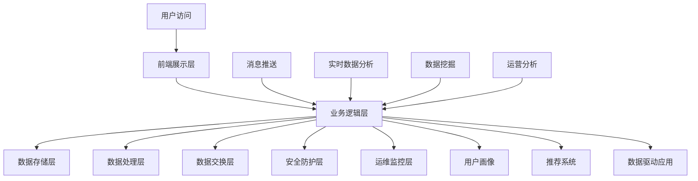

                 

# 《2025年阿里巴巴社交电商平台架构师面试指南》

> **关键词**：社交电商、平台架构、大数据处理、推荐系统、消息推送、实时数据流、算法、性能优化

> **摘要**：本文将深入探讨2025年阿里巴巴社交电商平台架构师所需掌握的核心技术和知识。通过详细讲解社交电商平台的基本概念、核心技术原理、数学模型以及项目实战，本文旨在为准备阿里巴巴社交电商平台架构师面试的读者提供全面的指导和策略。文章将涵盖大数据处理技术、推荐系统算法、消息推送与实时数据流处理技术，并分析社交电商平台的性能优化方法。最后，文章还将展望社交电商平台的发展趋势与未来，为读者提供宝贵的职业发展建议。

## 《2025年阿里巴巴社交电商平台架构师面试指南》目录大纲

本文将按照以下目录结构进行详细讲解：

### 第一部分：社交电商平台概述与核心概念

1. **社交电商平台的基本概念**
   - 社交电商的定义与发展历程
   - 社交电商与传统电商的区别
   - 社交电商平台的主要模式
   - 社交电商平台的优势与挑战

2. **社交电商平台架构概述**
   - 社交电商平台架构的核心要素
   - 社交电商平台的技术栈
   - 数据驱动在社交电商平台的应用

3. **核心概念与架构的Mermaid流程图**
   - Mermaid流程图的基本概念
   - 社交电商平台架构的Mermaid流程图

### 第二部分：核心技术原理与算法讲解

4. **大数据处理技术**
   - 大数据处理的基本概念
   - Hadoop与Spark技术栈
   - 大数据处理算法与案例

5. **推荐系统算法**
   - 推荐系统基本原理
   - collaborative filtering算法
   - content-based filtering算法
   - hybrid recommendation algorithm

6. **消息推送与实时数据流处理**
   - 消息推送技术
   - Kafka与Flink技术栈
   - 实时数据处理算法

7. **核心算法原理讲解与伪代码**
   - 大数据处理算法伪代码
   - 推荐系统算法伪代码
   - 消息推送与实时数据处理算法伪代码

### 第三部分：数学模型与数学公式

8. **数学模型基础**
   - 数学公式的基本概念
   - 推荐系统中的数学模型
   - 数据流处理中的数学模型

9. **数学模型详细讲解与举例**
   - 推荐系统的数学模型详细讲解
   - 数据流处理的数学模型详细讲解
   - 数学模型应用案例

### 第四部分：项目实战与代码解析

10. **社交电商平台项目实战**
    - 项目背景与需求分析
    - 项目开发环境搭建
    - 源代码实现与解读

11. **社交电商平台核心代码解读与分析**
    - 数据处理模块代码解读
    - 推荐系统模块代码解读
    - 消息推送模块代码解读

12. **社交电商平台性能优化**
    - 性能优化方法
    - 社交电商平台性能优化案例分析

### 第五部分：总结与展望

13. **社交电商平台发展趋势与未来**
    - 社交电商平台的发展趋势
    - 未来社交电商平台的挑战与机遇
    - 架构师在社交电商平台发展中的角色与责任

### 附录

- **附录 A：常用技术栈与工具**
  - 大数据处理工具
  - 推荐系统工具
  - 消息推送与实时数据处理工具

- **附录 B：社交电商平台架构师面试题与答案解析**
  - 数据结构与算法
  - 分布式系统与数据库
  - 数据挖掘与机器学习
  - 项目管理与团队协作

现在，我们已经完成了文章的目录大纲结构，接下来将逐步深入各个章节的内容，进行详细讲解。请继续关注接下来的章节，我们将一起探索社交电商平台架构的深度与广度。

## 第一部分：社交电商平台概述与核心概念

### 第1章：社交电商平台的基本概念

#### 1.1 社交电商的定义与发展历程

社交电商，顾名思义，是电子商务与社交媒体相结合的新型电商模式。这种模式通过利用社交媒体平台的用户关系和社交网络效应，促进商品的交易和传播。社交电商的起源可以追溯到2000年代末期，当时以Facebook、Twitter等为代表的社交媒体平台开始迅速崛起，并逐渐改变了人们获取信息和交流的方式。在2010年前后，随着移动互联网的发展，社交媒体与电子商务的结合逐渐成为可能，社交电商开始进入快速发展阶段。

社交电商的发展历程可以分为以下几个阶段：

1. **萌芽阶段（2010-2013年）**：
   这一阶段以Kabum和Houzz等网站为代表，初步探索了社交媒体在电子商务中的应用。这些网站通过社交媒体平台宣传商品，并通过用户评论和分享来增加商品的曝光度和信任度。

2. **快速成长阶段（2014-2016年）**：
   2014年，微信小程序的推出标志着社交电商的兴起。随后，以拼多多、小红书等为代表的社交电商平台迅速崛起，通过社交分享、拼团购买等方式，大幅提升了用户参与度和购买转化率。

3. **成熟发展阶段（2017年至今）**：
   随着大数据、人工智能等技术的深入应用，社交电商平台逐渐形成了较为完善的商业模式和生态体系。2017年，阿里巴巴推出了淘宝社交，进一步推动了社交电商的发展。如今，社交电商已经成为电子商务领域的重要组成部分。

#### 1.2 社交电商与传统电商的区别

社交电商与传统电商之间存在显著的区别，主要体现在以下几个方面：

1. **交易场景**：
   - 传统电商通常以商品为中心，通过广告、搜索等方式吸引用户访问和购买。
   - 社交电商则更注重社交关系，通过用户的社交网络分享、推荐和互动，促进商品的销售。

2. **用户体验**：
   - 传统电商注重页面设计和搜索功能，以提供高效、便捷的购物体验。
   - 社交电商则更加关注用户的社交互动体验，通过朋友圈、直播、短视频等形式，增强用户的参与感和粘性。

3. **用户参与**：
   - 传统电商的用户主要参与购买决策，较少参与到商品的销售和推广中。
   - 社交电商鼓励用户通过分享、评论、拼团等方式参与商品的销售和推广，形成用户自传播效应。

4. **营销策略**：
   - 传统电商依赖广告投放、促销活动等方式进行营销。
   - 社交电商则利用社交媒体的社交属性，通过内容营销、网红带货、KOL合作等方式，实现更广泛的传播和用户转化。

#### 1.3 社交电商平台的主要模式

社交电商平台根据运营模式和业务特点，可以分为以下几种主要模式：

1. **社交分享模式**：
   这种模式以拼多多为代表，通过用户在社交平台上的分享和推荐，形成病毒式传播，吸引更多用户参与购物。用户可以通过分享商品链接、生成专属推广链接等方式，获得佣金或优惠。

2. **直播带货模式**：
   直播带货模式以淘宝直播、抖音直播等平台为代表，通过主播与用户的实时互动，展示和推广商品。用户在观看直播的过程中，可以通过点击链接直接购买商品，实现购物与娱乐的融合。

3. **社群电商模式**：
   社群电商以小红书、微博购物等平台为代表，通过建立兴趣社群，让用户在特定的社群内分享购物经验和推荐商品。平台通过提供高质量的内容和社交互动，提升用户参与度和粘性。

4. **内容电商模式**：
   内容电商模式以知乎、抖音等平台为代表，通过优质的内容吸引用户，用户在阅读内容的过程中发现并购买相关商品。内容电商的核心在于构建用户信任，通过真实、有用的内容引导用户消费。

#### 1.4 社交电商平台的优势与挑战

社交电商平台在快速发展的过程中，展现出了许多优势，同时也面临一定的挑战：

1. **优势**：

   - **用户参与度高**：社交电商通过社交互动和用户参与，提高了用户的购物体验和粘性。
   - **转化率高**：社交电商通过社交分享和推荐，实现了更广泛的用户覆盖和更高的购买转化率。
   - **营销成本低**：社交电商利用社交媒体的免费传播渠道，降低了广告投放成本。
   - **用户忠诚度提升**：社交电商通过互动和用户参与，建立了更紧密的用户关系，提升了用户忠诚度。

2. **挑战**：

   - **用户隐私保护**：社交电商在用户数据收集和利用方面，需要更加注重用户隐私保护，防止数据泄露。
   - **内容质量控制**：社交电商平台上存在大量用户生成内容，需要有效控制内容质量，避免虚假信息和不良内容的传播。
   - **平台治理**：社交电商平台需要建立完善的平台治理机制，维护良好的交易秩序和用户权益。
   - **技术挑战**：社交电商平台需要处理海量数据和高并发请求，对技术架构和数据处理能力提出了更高的要求。

通过上述分析，我们可以看到，社交电商平台在电子商务领域具有巨大的发展潜力，同时也需要应对一系列挑战。了解社交电商平台的基本概念和发展历程，有助于我们更好地理解其核心机制和运营模式，为后续章节的深入探讨打下基础。

### 第2章：社交电商平台架构概述

#### 2.1 社交电商平台架构的核心要素

社交电商平台架构的设计需要综合考虑业务需求、用户规模、数据量和技术发展趋势等因素。一个典型的社交电商平台架构通常包括以下核心要素：

1. **前端展示层**：
   前端展示层是用户直接接触的界面，包括网站、APP和微信小程序等。前端展示层需要具备良好的用户体验，支持多种设备访问，并且具备快速响应的能力。

2. **业务逻辑层**：
   业务逻辑层负责处理用户的业务请求，包括用户管理、订单处理、商品管理、支付处理等。这一层通常采用微服务架构，将不同的业务功能模块化，以提高系统的可扩展性和可维护性。

3. **数据存储层**：
   数据存储层负责存储用户数据、商品数据、订单数据等。数据存储层通常采用分布式数据库，如MySQL、MongoDB、Redis等，以确保数据的可靠性和高性能访问。

4. **数据处理层**：
   数据处理层负责处理大量的用户数据，包括用户行为分析、推荐系统、数据挖掘等。数据处理层通常采用大数据技术栈，如Hadoop、Spark等，以支持大规模数据的高效处理。

5. **数据交换层**：
   数据交换层负责不同系统之间的数据通信，包括API接口、消息队列、数据总线等。这一层确保了平台内部以及与其他系统的无缝数据传输。

6. **安全防护层**：
   安全防护层负责保护平台的安全，包括身份认证、访问控制、数据加密等。安全防护层对于防止恶意攻击和数据泄露至关重要。

7. **运维监控层**：
   运维监控层负责系统的日常运维和监控，包括日志分析、性能监控、故障排查等。运维监控层有助于快速发现和解决问题，确保平台的稳定运行。

#### 2.2 社交电商平台的技术栈

社交电商平台的技术栈选择需要综合考虑业务需求、技术可行性、开发效率和生态系统等因素。以下是一个典型的社交电商平台技术栈：

1. **前端技术**：
   - **HTML/CSS/JavaScript**：用于构建网页的基础技术。
   - **React/Vue/Angular**：流行的前端框架，提供组件化和模块化的开发方式。
   - **Weex**：阿里巴巴推出的一种跨平台移动应用开发框架。

2. **后端技术**：
   - **Java/Python/Go**：常见的服务器端编程语言，适用于构建高性能和高可靠性的业务系统。
   - **Spring Boot/Django/Go Framework**：流行的后端框架，提供丰富的功能模块和开箱即用的解决方案。
   - **Nginx/Apache**：常用的Web服务器软件，负责处理HTTP请求。

3. **数据库技术**：
   - **关系数据库**：如MySQL、PostgreSQL，适用于结构化数据的存储和管理。
   - **NoSQL数据库**：如MongoDB、Redis，适用于非结构化数据和高性能数据存储。

4. **大数据技术**：
   - **Hadoop**：一个分布式数据存储和处理框架，适用于大规模数据存储和处理。
   - **Spark**：一个分布式计算框架，适用于实时数据分析和处理。
   - **Flink**：一个流处理框架，适用于实时数据处理和分析。

5. **消息队列技术**：
   - **Kafka**：一个分布式消息队列系统，适用于大规模数据流处理。
   - **RabbitMQ**：一个开源的消息队列中间件，适用于消息传递和异步处理。

6. **缓存技术**：
   - **Redis**：一个高性能的内存缓存数据库，适用于提高数据访问速度。
   - **Memcached**：一个高性能的分布式缓存系统，适用于缓存热点数据。

7. **搜索引擎技术**：
   - **Elasticsearch**：一个开源的分布式搜索引擎，适用于大数据的全文检索和分析。

8. **安全技术**：
   - **SSL/TLS**：用于保证数据传输的安全性。
   - **OAuth 2.0**：用于实现授权和身份验证。
   - **CSRF/Cross-site Scripting**：用于防范常见的网络安全攻击。

#### 2.3 数据驱动在社交电商平台的应用

数据驱动是现代社交电商平台的重要特征，通过收集、分析和利用用户数据，平台可以优化用户体验、提升运营效率和实现精准营销。以下是一些数据驱动在社交电商平台中的应用：

1. **用户画像**：
   通过分析用户行为数据、浏览记录、购买历史等信息，构建用户画像，用于了解用户需求和偏好，提供个性化的推荐和服务。

2. **推荐系统**：
   利用大数据分析和机器学习技术，实现精准的商品推荐，提高用户的购买转化率和满意度。

3. **实时数据分析**：
   通过实时数据处理技术，分析用户行为和交易数据，实现实时监控和预警，快速响应业务需求。

4. **数据挖掘**：
   利用数据挖掘技术，从海量数据中发现潜在的业务机会和模式，为业务决策提供数据支持。

5. **A/B测试**：
   通过数据驱动的A/B测试，验证不同业务策略的效果，优化用户体验和运营效果。

6. **运营分析**：
   通过数据驱动的运营分析，监控各项运营指标，优化营销活动和用户互动，提升运营效率。

总之，社交电商平台架构的设计需要综合考虑业务需求、技术能力和用户体验，通过数据驱动的模式，实现业务的持续创新和优化。在接下来的章节中，我们将进一步深入探讨社交电商平台的核心技术原理和算法，为读者提供更全面的了解。

### 第3章：核心概念与架构的Mermaid流程图

为了更好地理解和阐述社交电商平台的核心概念和架构，我们将使用Mermaid这种直观的流程图工具来绘制和展示平台的架构流程。Mermaid是一种简单易用的Markdown语法，可以生成结构清晰的图表，非常适合用于技术文档和架构描述。

#### 3.1 Mermaid流程图的基本概念

Mermaid使用Markdown语法来定义流程图，基本的语法包括流程图元素的定义和连接关系的描述。以下是一些常用的Mermaid语法元素：

- **节点（Node）**：表示流程中的各个步骤或组件，通常使用圆角矩形表示。
- **连接（Link）**：表示节点之间的连接关系，通常使用箭头表示。
- **开始（Start）和结束（End）**：表示流程的开始和结束节点，通常使用圆圈和圆角矩形表示。

#### 3.2 社交电商平台架构的Mermaid流程图

以下是一个简化的社交电商平台架构的Mermaid流程图，展示了平台的主要组件和它们之间的关系：



**流程图解析**：

- **A[用户访问]**：表示用户通过网站、APP或微信小程序等前端展示层访问社交电商平台。
- **B[前端展示层]**：负责处理用户的访问请求，提供良好的用户体验。
- **C[业务逻辑层]**：处理用户的业务请求，包括用户管理、订单处理、商品管理、支付处理等核心功能。
- **D[数据存储层]**：存储用户数据、商品数据、订单数据等结构化数据。
- **E[数据处理层]**：处理大量用户数据，包括用户行为分析、推荐系统、数据挖掘等。
- **F[数据交换层]**：实现平台内部以及与其他系统的数据通信。
- **G[安全防护层]**：保护平台的安全，包括身份认证、访问控制、数据加密等。
- **H[运维监控层]**：负责系统的日常运维和监控，确保平台的稳定运行。
- **I[消息推送]**：通过消息推送技术，实时向用户发送通知和消息。
- **J[实时数据分析]**：实时分析用户行为和交易数据，实现实时监控和预警。
- **K[数据挖掘]**：从海量数据中发现潜在的业务机会和模式。
- **L[运营分析]**：通过数据驱动的运营分析，监控各项运营指标，优化运营效果。
- **M[用户画像]**：通过用户数据构建用户画像，用于了解用户需求和偏好。
- **N[推荐系统]**：利用大数据分析和机器学习技术，实现精准的商品推荐。
- **O[数据驱动应用]**：通过数据驱动，优化用户体验和业务流程。

通过这个Mermaid流程图，我们可以清晰地看到社交电商平台的主要组件和它们之间的交互关系，有助于读者更好地理解平台的架构和工作原理。在接下来的章节中，我们将进一步深入探讨各个核心组件的技术细节和实现方法。

### 第4章：大数据处理技术

#### 4.1 大数据处理的基本概念

大数据处理是指对海量数据进行存储、处理和分析的技术和方法。大数据的特点通常被总结为“4V”：Volume（大量）、Velocity（高速）、Variety（多样）和Veracity（真实性）。大数据处理的目标是从海量数据中提取有价值的信息，为决策提供支持。

- **Volume（大量）**：大数据处理的规模通常非常大，需要处理的数据量达到TB甚至PB级别。
- **Velocity（高速）**：数据处理的速度要求很高，需要实时或近实时地处理大量数据。
- **Variety（多样）**：数据类型繁多，包括结构化数据、半结构化数据和非结构化数据。
- **Veracity（真实性）**：数据质量要求高，需要确保数据的真实性、准确性和可靠性。

#### 4.2 Hadoop与Spark技术栈

Hadoop和Spark是大数据处理领域中广泛使用的两个技术栈，它们各自有着独特的优势和适用场景。

**Hadoop技术栈**：

- **Hadoop**：是Apache Software Foundation的一个开源分布式计算框架，由HDFS（Hadoop Distributed File System）和MapReduce两部分组成。

  - **HDFS**：是一个分布式文件系统，用于存储海量数据，具有高容错性和高性能的特点。
  - **MapReduce**：是一个分布式数据处理模型，用于处理大规模数据集，通过将任务分解为Map和Reduce两个阶段，实现并行计算。

- **Hive**：是基于Hadoop的一个数据仓库工具，可以将结构化数据映射为HDFS上的文件，并提供类似于SQL的查询功能。
- **HBase**：是一个分布式、可扩展的大数据存储系统，用于存储稀疏的、大规模数据集，并提供随机实时读写访问。

**Spark技术栈**：

- **Spark**：是Apache Software Foundation的一个开源分布式数据处理引擎，提供了比Hadoop更高效的数据处理能力。

  - **Spark Core**：是Spark的核心模块，提供基本的任务调度和内存管理功能。
  - **Spark SQL**：提供了一个用于结构化数据处理的框架，支持SQL查询和DataFrame操作。
  - **Spark Streaming**：提供了实时数据处理的能力，可以处理不断流入的数据流。
  - **MLlib**：是一个机器学习库，提供了多种机器学习算法的实现。
  - **GraphX**：是一个用于图计算的计算框架，提供了丰富的图处理算法。

#### 4.3 大数据处理算法与案例

大数据处理算法是实现数据价值的关键。以下是一些常见的大数据处理算法及其应用场景：

1. **MapReduce算法**：

   - **原理**：MapReduce是一种分布式数据处理模型，将任务分解为Map（映射）和Reduce（减少）两个阶段。Map阶段对数据进行分区和映射，生成中间结果；Reduce阶段对中间结果进行归并和汇总。
   - **应用场景**：文本处理、日志分析、网页排名等。

2. **Spark SQL算法**：

   - **原理**：Spark SQL提供了基于SQL的数据处理框架，支持结构化数据查询和分析。
   - **应用场景**：数据分析、报表生成、数据清洗等。

3. **机器学习算法**：

   - **原理**：机器学习算法通过训练数据集，建立模型来预测或分类新数据。
   - **应用场景**：用户画像、推荐系统、欺诈检测等。

4. **流处理算法**：

   - **原理**：流处理算法用于实时处理不断流入的数据流，通常用于实时监控和分析。
   - **应用场景**：实时交易分析、实时推荐、实时警报等。

**案例**：假设我们需要分析社交电商平台上用户的购买行为，以优化推荐系统。以下是一个简化的数据处理流程：

1. **数据收集**：收集用户浏览记录、购买记录、评价记录等数据。
2. **数据预处理**：清洗数据，处理缺失值和异常值，将数据转换为适合分析的格式。
3. **用户行为分析**：使用MapReduce或Spark SQL对用户行为数据进行分析，提取用户的兴趣偏好和购买模式。
4. **构建推荐模型**：使用机器学习算法（如协同过滤、内容推荐等）构建推荐模型。
5. **实时流处理**：使用Spark Streaming实时处理用户行为数据，更新推荐模型和推荐结果。
6. **推荐结果输出**：将推荐结果输出到推荐系统，供用户使用。

通过上述案例，我们可以看到大数据处理技术在社交电商平台中的应用，从数据收集、预处理到分析和推荐，各个环节都需要高效的数据处理技术来支持。在接下来的章节中，我们将继续探讨推荐系统算法和消息推送与实时数据流处理技术。

### 第5章：推荐系统算法

#### 5.1 推荐系统基本原理

推荐系统是一种信息过滤技术，旨在根据用户的历史行为和偏好，为用户推荐其可能感兴趣的内容或商品。推荐系统的核心目标是提高用户满意度、增加用户参与度和提升平台业务指标。

**推荐系统的工作原理**：

1. **用户-物品评分矩阵**：
   推荐系统的基础是用户-物品评分矩阵，表示用户对物品的评分或交互记录。这个矩阵通常非常稀疏，因为大多数用户只对一小部分物品进行了评分或交互。

2. **相似性度量**：
   为了找到与目标用户相似的物品，推荐系统需要计算用户之间的相似性。常用的相似性度量方法包括：
   - **基于用户行为的协同过滤**：计算用户之间的行为相似度，如共同评分的物品数量。
   - **基于内容的相似性**：比较物品的内容特征，如标签、描述等。

3. **推荐算法**：
   根据相似性度量，推荐系统可以生成推荐列表。常用的推荐算法包括：
   - **协同过滤（Collaborative Filtering）**：
     - **用户基协同过滤（User-based）**：找到与目标用户相似的其他用户，推荐这些用户喜欢的物品。
     - **物品基协同过滤（Item-based）**：找到与目标物品相似的物品，推荐这些物品。
   - **基于内容的过滤（Content-based Filtering）**：根据物品的内容特征和用户的偏好，生成推荐列表。
   - **混合推荐（Hybrid Recommendation）**：结合协同过滤和基于内容的方法，生成更准确的推荐列表。

**推荐系统的应用场景**：

- **电子商务平台**：为用户推荐相关的商品，提高购买转化率和用户满意度。
- **社交媒体平台**：为用户推荐感兴趣的内容或朋友，增加用户活跃度和互动。
- **在线视频平台**：为用户推荐相关的视频，提升观看时间和用户留存率。
- **新闻门户**：为用户推荐相关的新闻，提高用户黏性和广告收益。

#### 5.2 collaborative filtering算法

协同过滤是推荐系统中最常用的算法之一，其核心思想是通过用户之间的行为相似性来推荐物品。协同过滤可以分为两种主要类型：基于用户的协同过滤和基于物品的协同过滤。

**基于用户的协同过滤（User-based Collaborative Filtering）**：

1. **计算用户相似性**：
   基于用户的协同过滤首先计算用户之间的相似性，通常使用余弦相似度或皮尔逊相关系数等方法。
   
   - **余弦相似度**：通过计算用户-物品评分矩阵中两行向量的夹角余弦值，衡量用户之间的相似性。
   - **皮尔逊相关系数**：通过计算用户-物品评分矩阵中两行数据的皮尔逊相关系数，衡量用户之间的相似性。

2. **生成推荐列表**：
   找到与目标用户最相似的其他用户，推荐这些用户喜欢的但目标用户尚未评价的物品。

   - **最近邻（K-Nearest Neighbors, KNN）**：选择与目标用户最相似的K个用户，推荐这K个用户共同喜欢的物品。
   - **基于加权平均的推荐**：为每个相似用户赋予权重，根据权重和评分计算推荐列表。

**基于物品的协同过滤（Item-based Collaborative Filtering）**：

1. **计算物品相似性**：
   基于物品的协同过滤首先计算物品之间的相似性，通常使用余弦相似度或Jaccard系数等方法。

   - **余弦相似度**：通过计算用户-物品评分矩阵中两列向量的夹角余弦值，衡量物品之间的相似性。
   - **Jaccard系数**：通过计算用户评价两物品的交集与并集的比值，衡量物品之间的相似性。

2. **生成推荐列表**：
   找到与目标物品最相似的物品，推荐这些物品被其他用户喜欢的但目标用户尚未评价的物品。

   - **最近邻（K-Nearest Neighbors, KNN）**：选择与目标物品最相似的K个物品，推荐这K个物品被其他用户喜欢的物品。
   - **基于加权平均的推荐**：为每个相似物品赋予权重，根据权重和评分计算推荐列表。

**协同过滤算法的优缺点**：

- **优点**：
  - **简单易实现**：协同过滤算法相对简单，易于实现和理解。
  - **高效**：通过用户或物品的相似性度量，可以快速生成推荐列表。
  - **用户个性化**：可以针对不同用户生成个性化的推荐列表。

- **缺点**：
  - **稀疏矩阵问题**：用户-物品评分矩阵通常非常稀疏，导致相似性计算不准确。
  - **冷启动问题**：新用户或新物品没有足够的评分或交互记录，无法进行有效的推荐。
  - **数据依赖性**：协同过滤算法依赖于用户的历史行为数据，数据质量对推荐效果影响较大。

#### 5.3 content-based filtering算法

基于内容的过滤（Content-based Filtering）是一种不依赖用户行为数据的推荐方法，通过分析物品的内容特征和用户的偏好，生成推荐列表。

**原理**：

1. **内容特征提取**：
   从物品的文本描述、标签、分类信息等特征中提取关键词或特征向量。

2. **用户偏好模型**：
   建立用户的偏好模型，通常使用文本分类或聚类算法。

3. **推荐生成**：
   根据用户的偏好模型，为用户推荐具有相似特征的物品。

**方法**：

- **基于关键词的推荐**：
  - **TF-IDF**：通过计算关键词在物品描述中的频率和文档中的重要程度，生成关键词权重向量。
  - **Cosine相似度**：计算用户偏好模型和物品特征向量之间的余弦相似度，生成推荐列表。

- **基于分类的推荐**：
  - **朴素贝叶斯分类器**：使用朴素贝叶斯分类器建立用户的偏好模型，为用户推荐具有相同分类的物品。
  - **K-最近邻分类器**：使用K-最近邻分类器，根据物品的分类信息和用户的偏好模型生成推荐列表。

**优点**：

- **冷启动友好**：基于内容的方法不需要用户的历史行为数据，适用于新用户或新物品的推荐。
- **内容丰富**：可以提供详细的内容信息，提升用户的理解和满意度。

**缺点**：

- **用户个性化不足**：基于内容的方法难以捕捉用户的个性化需求。
- **数据依赖性**：需要丰富的内容特征数据，对数据的完整性和质量有较高要求。

#### 5.4 hybrid recommendation algorithm

混合推荐算法（Hybrid Recommendation Algorithm）结合了协同过滤和基于内容的方法，旨在提升推荐系统的准确性和用户体验。

**原理**：

1. **协同过滤部分**：
   利用用户的行为数据和物品的交互记录，计算用户和物品之间的相似性，生成初步的推荐列表。

2. **基于内容部分**：
   提取物品的内容特征，建立用户的偏好模型，为用户推荐具有相似特征的物品。

3. **融合策略**：
   将协同过滤和基于内容的方法生成的推荐列表进行融合，生成最终的推荐结果。

**方法**：

- **加权融合**：
  - **加权和**：为协同过滤和基于内容的方法分别赋予不同的权重，根据权重计算推荐得分。
  - **融合函数**：使用不同的融合函数（如平均值、加权平均值等）计算最终的推荐得分。

- **基于模型的融合**：
  - **深度学习模型**：使用深度学习模型（如神经网络）对协同过滤和基于内容的方法进行融合，生成推荐列表。

**优点**：

- **提升准确性**：结合了协同过滤和基于内容的方法的优势，提高了推荐的准确性。
- **增强个性化**：能够更好地捕捉用户的个性化需求。

**缺点**：

- **计算复杂度高**：混合推荐算法通常需要更多的计算资源和时间，特别是在大规模数据集上。
- **模型选择和参数调优**：混合推荐算法需要对不同的模型和参数进行选择和调优，增加了实现的复杂性。

通过上述讨论，我们可以看到推荐系统算法在社交电商平台中的重要作用。协同过滤、基于内容的方法以及混合推荐算法各有优缺点，适用于不同的应用场景。在接下来的章节中，我们将深入探讨消息推送与实时数据流处理技术，以进一步优化社交电商平台的用户体验和业务效果。

### 第6章：消息推送与实时数据流处理

#### 6.1 消息推送技术

消息推送技术是社交电商平台中非常重要的一部分，它能够实时向用户发送通知和消息，提高用户活跃度和参与度。消息推送技术主要涉及以下几个方面：

1. **推送协议**：
   - **Web Push**：通过HTTP协议发送消息，适用于浏览器端。
   - **APNS/FCM**：适用于iOS和Android设备，通过苹果和谷歌的推送服务发送消息。
   - **GCM**：适用于Android设备，是FCM的前身。

2. **推送内容**：
   - **通知消息**：向用户发送系统级别的通知，如订单更新、支付成功等。
   - **消息消息**：向用户发送具体的消息内容，如活动通知、商品推荐等。

3. **推送策略**：
   - **及时性**：确保消息能够及时到达用户，提高用户体验。
   - **个性化**：根据用户的偏好和活动历史，为用户定制个性化的推送内容。
   - **频率控制**：避免过多的推送消息导致用户疲劳，影响用户体验。

4. **推送效果评估**：
   - **打开率**：衡量推送消息被用户打开的次数，用于评估推送效果。
   - **点击率**：衡量用户点击推送消息的次数，用于评估推送内容的吸引力。

#### 6.2 Kafka与Flink技术栈

Kafka和Flink是处理实时数据流和处理的重要工具，广泛应用于社交电商平台的消息推送和实时数据分析。

**Kafka**：

- **核心概念**：
  - **Kafka**：是一个分布式流处理平台，由Apache Software Foundation开发。
  - **主题（Topic）**：用于存储消息的分类，类似于数据库中的表。
  - **分区（Partition）**：用于消息的并行处理和负载均衡。

- **应用场景**：
  - **日志收集**：实时收集和存储应用程序日志。
  - **实时数据处理**：处理实时交易数据、用户行为数据等。
  - **消息推送**：作为消息队列，存储和分发实时推送消息。

- **优势**：
  - **高吞吐量**：能够处理大规模的数据流，适用于高并发的场景。
  - **高可用性**：通过分布式架构实现容错和负载均衡。
  - **易扩展性**：支持水平扩展，适用于大规模数据处理的场景。

**Flink**：

- **核心概念**：
  - **Flink**：是一个开源的流处理框架，由Apache Software Foundation维护。
  - **流处理（Stream Processing）**：处理实时数据流，实现实时计算和分析。
  - **批处理（Batch Processing）**：处理批量数据，实现离线计算。

- **应用场景**：
  - **实时分析**：实时处理和分析用户行为数据、交易数据等。
  - **实时推荐**：基于实时数据流，动态生成推荐结果。
  - **实时监控**：实时监控系统性能和业务指标，实现实时预警。

- **优势**：
  - **低延迟**：支持低延迟的实时数据处理，适用于实时应用。
  - **易扩展性**：支持水平扩展，适用于大规模数据处理。
  - **统一架构**：结合流处理和批处理，实现统一的处理框架。

#### 6.3 实时数据处理算法

实时数据处理是社交电商平台的重要任务，通过实时处理用户行为数据和交易数据，可以实现实时推荐、实时监控和实时预警等功能。以下是一些常见的实时数据处理算法：

1. **实时推荐算法**：
   - **协同过滤**：基于实时用户行为数据，计算用户之间的相似性，为用户推荐感兴趣的商品。
   - **基于内容的推荐**：基于实时用户行为数据，提取用户兴趣特征，为用户推荐相关的商品。
   - **混合推荐**：结合实时协同过滤和基于内容的方法，生成更准确的实时推荐结果。

2. **实时监控算法**：
   - **异常检测**：基于实时用户行为数据，检测异常行为，如恶意攻击、欺诈行为等。
   - **趋势分析**：基于实时用户行为数据，分析用户行为趋势，实现实时预警。
   - **性能监控**：实时监控系统性能指标，如响应时间、吞吐量等，实现实时性能优化。

3. **实时数据处理算法伪代码**：

   ```python
   def real_time_recommendation(user_behavior_stream):
       # 初始化用户画像和推荐列表
       user_profile = initialize_user_profile()
       recommendation_list = []

       # 遍历实时用户行为数据
       for behavior in user_behavior_stream:
           # 更新用户画像
           update_user_profile(user_profile, behavior)

           # 计算相似用户
           similar_users = calculate_similar_users(user_profile)

           # 生成推荐列表
           recommendation_list = generate_recommendation_list(similar_users)

       return recommendation_list

   def real_time_monitoring(user_behavior_stream):
       # 初始化监控指标
       monitoring_metrics = initialize_monitoring_metrics()

       # 遍历实时用户行为数据
       for behavior in user_behavior_stream:
           # 更新监控指标
           update_monitoring_metrics(monitoring_metrics, behavior)

           # 检测异常行为
           detect_anomalies(monitoring_metrics)

           # 分析用户行为趋势
           analyze_trend(monitoring_metrics)

       return monitoring_metrics
   ```

通过消息推送和实时数据流处理技术，社交电商平台可以实现实时与用户的互动，提高用户体验和业务效率。在接下来的章节中，我们将进一步探讨数学模型与数学公式的应用，以提升推荐系统和数据处理的准确性和效率。

### 第7章：核心算法原理讲解与伪代码

在探讨社交电商平台的算法设计时，我们需要详细讲解一些核心算法的原理，并使用伪代码来展示其实现过程。以下是几个关键算法的原理讲解与伪代码：

#### 7.1 大数据处理算法伪代码

**MapReduce算法伪代码**：

```python
def mapReduce(input_data):
    # 初始化Map和Reduce函数
    map_func = initialize_map_function()
    reduce_func = initialize_reduce_function()

    # 遍历输入数据，执行Map操作
    for data in input_data:
        intermediate_output = map_func(data)

    # 合并Map输出的中间结果
    merged_intermediate_output = merge_map_outputs(intermediate_output)

    # 遍历中间结果，执行Reduce操作
    for key, value in merged_intermediate_output:
        final_output = reduce_func(key, value)

    return final_output
```

**Hadoop伪代码**：

```python
def hadoop(input_path, output_path):
    # 初始化HDFS文件系统
    fs = initialize_hdfs()

    # 上传输入数据到HDFS
    fs.copyFromLocal(input_path, output_path)

    # 执行MapReduce任务
    mapreduce_output = mapReduce(fs.input_stream())

    # 将结果存储到HDFS
    fs.copyToLocal(mapreduce_output, output_path)

    # 清理中间文件
    fs.delete(input_path)

    return mapreduce_output
```

#### 7.2 推荐系统算法伪代码

**协同过滤算法伪代码**：

```python
def collaborative_filtering(user_preferences, k):
    # 初始化用户-物品评分矩阵
    user_item_matrix = initialize_user_item_matrix()

    # 计算相似用户
    similar_users = find_similar_users(user_preferences, k)

    # 计算推荐得分
    recommendation_scores = calculate_recommendation_scores(similar_users)

    # 生成推荐列表
    recommendation_list = generate_recommendation_list(recommendation_scores)

    return recommendation_list
```

**基于内容的推荐算法伪代码**：

```python
def content_based_filtering(user_preferences, item_features):
    # 初始化用户偏好模型
    user_preference_model = initialize_user_preference_model(user_preferences)

    # 提取物品特征向量
    item_feature_vector = extract_item_feature_vector(item_features)

    # 计算相似度得分
    similarity_scores = calculate_similarity_scores(user_preference_model, item_feature_vector)

    # 生成推荐列表
    recommendation_list = generate_recommendation_list(similarity_scores)

    return recommendation_list
```

#### 7.3 消息推送与实时数据处理算法伪代码

**消息推送算法伪代码**：

```python
def message_pushing(user_behavior_stream, notification_template):
    # 初始化消息队列
    message_queue = initialize_message_queue()

    # 遍历用户行为数据流
    for behavior in user_behavior_stream:
        # 构建消息内容
        message_content = generate_message_content(behavior, notification_template)

        # 将消息发送到消息队列
        message_queue.enqueue(message_content)

    # 发送消息到用户设备
    for message in message_queue:
        send_message_to_device(message)

    return message_queue
```

**实时数据处理算法伪代码**：

```python
def real_time_data_processing(stream_data):
    # 初始化数据处理模块
    data_processor = initialize_data_processor()

    # 遍历实时数据流
    for data in stream_data:
        # 处理数据
        processed_data = data_processor.process_data(data)

        # 存储处理结果
        store_processed_data(processed_data)

    return processed_data
```

通过上述伪代码，我们可以清晰地看到各个核心算法的实现过程。在实际应用中，这些算法需要根据具体的业务场景和需求进行优化和定制。接下来，我们将进一步探讨数学模型与数学公式在社交电商平台中的应用，以提升推荐系统和数据处理的准确性和效率。

### 第8章：数学模型基础

数学模型是推荐系统、数据流处理等领域的重要工具，它能够将复杂的问题转化为数学形式，使得问题更加直观和易于解决。在社交电商平台中，数学模型的应用非常广泛，以下将介绍数学模型的基本概念及其在推荐系统和数据流处理中的重要性。

#### 8.1 数学公式的基本概念

数学公式是数学表达的一种形式，通常由符号、变量和运算符组成。数学公式可以用来描述现实世界中的各种现象和关系，是科学研究和工程实践中不可或缺的工具。在数学模型中，公式不仅用于计算，还用于建模和预测。

1. **变量**：在数学模型中，变量是用来表示未知数的符号，可以是常数、函数或向量。变量通常用字母表示，如x、y、z等。

2. **运算符**：运算符用于对变量进行操作，包括加法（+）、减法（-）、乘法（*）、除法（/）等。

3. **函数**：函数是一种特殊的数学表达式，它将一个或多个变量映射到另一个变量。常见的函数包括线性函数、指数函数、对数函数等。

4. **参数**：参数是数学模型中的固定值，用于调整模型的行为。参数通常通过数据拟合或优化算法来确定。

#### 8.2 推荐系统中的数学模型

在推荐系统中，数学模型主要用于描述用户偏好和物品特征之间的关系，常见的数学模型包括：

1. **用户-物品评分矩阵**：
   用户-物品评分矩阵是一个二维矩阵，表示用户对物品的评分。矩阵中的元素通常表示用户i对物品j的评分。数学公式可以表示为：

   $$ R_{ij} = \text{rating}(u_i, p_j) $$

   其中，\( R_{ij} \) 表示用户i对物品j的评分，\(\text{rating}(u_i, p_j)\) 表示用户i对物品j的评分函数。

2. **相似性度量**：
   相似性度量用于计算用户或物品之间的相似度。常用的相似性度量方法包括余弦相似度、皮尔逊相关系数等。余弦相似度的数学公式为：

   $$ \text{similarity}(u_i, u_j) = \frac{R_{i\cdot}R_{j\cdot}}{\sqrt{\sum_{j=1}^{n}R_{ij}^2}\sqrt{\sum_{j=1}^{n}R_{ji}^2} $$

   其中，\( R_{i\cdot} \) 和 \( R_{j\cdot} \) 分别表示用户i和用户j的总评分，\( R_{ij} \) 表示用户i对物品j的评分。

3. **推荐得分**：
   推荐得分用于计算用户对某个物品的潜在兴趣程度。常见的推荐得分计算方法包括基于用户的协同过滤和基于内容的推荐方法。基于用户的协同过滤的推荐得分公式为：

   $$ \text{score}(u_i, p_j) = \sum_{k=1}^{n}\text{similarity}(u_i, u_k)R_{kj} $$

   其中，\( \text{similarity}(u_i, u_k) \) 表示用户i和用户k的相似度，\( R_{kj} \) 表示用户k对物品j的评分。

#### 8.3 数据流处理中的数学模型

在数据流处理中，数学模型用于描述实时数据处理和分析的方法。常见的数学模型包括：

1. **滑动窗口模型**：
   滑动窗口模型用于处理连续的数据流，将数据划分为固定长度的时间窗口。数学公式可以表示为：

   $$ W_t = \{x_1, x_2, ..., x_t\} $$

   其中，\( W_t \) 表示时间t的滑动窗口，\( x_t \) 表示时间t的数据点。

2. **实时计算模型**：
   实时计算模型用于对滑动窗口中的数据进行实时计算和分析。常见的实时计算方法包括统计计算、模式识别和机器学习等。

3. **事件驱动模型**：
   事件驱动模型以事件为处理单元，对数据流进行实时处理。数学公式可以表示为：

   $$ \text{event}(e_t) = \{x_1, x_2, ..., x_t\} $$

   其中，\( \text{event}(e_t) \) 表示时间t的事件，\( x_t \) 表示事件中的数据点。

通过数学模型，我们可以将复杂的数据处理和分析问题转化为数学形式，使得问题更加直观和易于解决。在接下来的章节中，我们将进一步探讨数学模型在推荐系统和数据流处理中的详细应用。

### 第9章：数学模型详细讲解与举例

在社交电商平台中，数学模型的应用至关重要，它们不仅帮助我们理解和分析数据，还能为决策提供科学依据。本章节将深入探讨推荐系统和数据流处理中的数学模型，通过具体的案例来说明这些模型的实际应用。

#### 9.1 推荐系统的数学模型详细讲解

推荐系统的数学模型主要涉及用户偏好、相似性度量、推荐得分等。以下是对这些模型详细讲解和具体应用的说明。

1. **用户偏好模型**：
   用户偏好模型用于描述用户对物品的喜好程度。一个简单的用户偏好模型可以使用加权评分表示，如：

   $$ P(u, p) = \sum_{i=1}^{n} w_i \cdot r_{ui} $$

   其中，\( P(u, p) \) 表示用户\( u \)对物品\( p \)的偏好得分，\( w_i \) 是权重，\( r_{ui} \) 是用户\( u \)对物品\( i \)的评分。

   **案例**：假设我们有一个用户\( u \)，他给了5个物品评分，分别为\( r_{u1} = 4 \)，\( r_{u2} = 3 \)，\( r_{u3} = 5 \)，\( r_{u4} = 2 \)，\( r_{u5} = 4 \)。如果我们为每个物品分配权重\( w_1 = 0.2 \)，\( w_2 = 0.3 \)，\( w_3 = 0.2 \)，\( w_4 = 0.1 \)，\( w_5 = 0.2 \)，则用户\( u \)对物品的偏好得分为：

   $$ P(u, p) = 0.2 \cdot 4 + 0.3 \cdot 3 + 0.2 \cdot 5 + 0.1 \cdot 2 + 0.2 \cdot 4 = 3.6 + 0.9 + 1 + 0.2 + 0.8 = 6.5 $$

2. **相似性度量**：
   相似性度量用于计算用户或物品之间的相似度。常用的相似性度量方法包括余弦相似度、皮尔逊相关系数等。

   **余弦相似度**：
   余弦相似度用于计算两个向量之间的相似度，其数学公式为：

   $$ \text{similarity}(u, v) = \frac{u \cdot v}{||u|| \cdot ||v||} $$

   其中，\( u \cdot v \) 表示向量的点积，\( ||u|| \) 和 \( ||v|| \) 分别表示向量的模。

   **案例**：假设我们有两个用户\( u \)和\( v \)的评分向量分别为：
   \( u = (1, 2, 3, 4, 5) \)，\( v = (3, 4, 5, 1, 2) \)，则它们的余弦相似度为：

   $$ \text{similarity}(u, v) = \frac{(1 \cdot 3 + 2 \cdot 4 + 3 \cdot 5 + 4 \cdot 1 + 5 \cdot 2)}{\sqrt{1^2 + 2^2 + 3^2 + 4^2 + 5^2} \cdot \sqrt{3^2 + 4^2 + 5^2 + 1^2 + 2^2}} = \frac{3 + 8 + 15 + 4 + 10}{\sqrt{55} \cdot \sqrt{55}} = \frac{40}{55} = 0.727 $$

3. **推荐得分**：
   推荐得分用于计算用户对某个物品的潜在兴趣程度。基于协同过滤的推荐得分可以通过相似性度量来计算：

   $$ \text{score}(u, i) = \sum_{j=1}^{n} \text{similarity}(u, v_j) \cdot r_{vj} $$

   其中，\( \text{similarity}(u, v_j) \) 是用户\( u \)和用户\( v_j \)之间的相似度，\( r_{vj} \) 是用户\( v_j \)对物品\( i \)的评分。

   **案例**：假设我们有一个新用户\( u \)的评分向量未知，但我们知道其他用户\( v_1, v_2, v_3 \)的评分向量分别为\( v_1 = (1, 2, 3, 4, 5) \)，\( v_2 = (3, 4, 5, 1, 2) \)，\( v_3 = (5, 1, 2, 3, 4) \)，且他们的评分分别为\( r_{v1i} = 4 \)，\( r_{v2i} = 3 \)，\( r_{v3i} = 5 \)。则用户\( u \)对物品\( i \)的推荐得分为：

   $$ \text{score}(u, i) = \text{similarity}(u, v_1) \cdot r_{v1i} + \text{similarity}(u, v_2) \cdot r_{v2i} + \text{similarity}(u, v_3) \cdot r_{v3i} $$

   假设相似度分别为\( \text{similarity}(u, v_1) = 0.8 \)，\( \text{similarity}(u, v_2) = 0.6 \)，\( \text{similarity}(u, v_3) = 0.7 \)，则：

   $$ \text{score}(u, i) = 0.8 \cdot 4 + 0.6 \cdot 3 + 0.7 \cdot 5 = 3.2 + 1.8 + 3.5 = 8.5 $$

#### 9.2 数据流处理中的数学模型详细讲解

数据流处理中的数学模型主要用于实时数据的分析和处理，包括滑动窗口模型、实时计算模型等。

1. **滑动窗口模型**：
   滑动窗口模型是一种用于处理连续数据流的方法，它将数据划分为固定长度的时间窗口。数学公式可以表示为：

   $$ W_t = \{x_1, x_2, ..., x_t\} $$

   其中，\( W_t \) 表示时间t的滑动窗口，\( x_t \) 表示时间t的数据点。

   **案例**：假设我们有一个1分钟滑动窗口，当前时间为t=10，窗口中的数据点为\( x_1, x_2, ..., x_{10} \)。当新数据点\( x_{11} \)到达时，窗口会向前滑动，丢弃最早的数据点\( x_1 \)，加入新的数据点\( x_{11} \)。

2. **实时计算模型**：
   实时计算模型用于对滑动窗口中的数据进行实时计算和分析。常见的实时计算方法包括统计计算、模式识别和机器学习等。

   **案例**：假设我们需要计算滑动窗口中的平均值。对于当前窗口\( W_t = \{x_1, x_2, ..., x_t\} \)，平均值的计算公式为：

   $$ \text{average}(W_t) = \frac{1}{t} \sum_{i=1}^{t} x_i $$

   当新数据点\( x_{t+1} \)加入窗口时，旧数据点\( x_1 \)被移除，平均值的计算更新为：

   $$ \text{average}(W_{t+1}) = \text{average}(W_t) + \frac{x_{t+1} - x_1}{t+1} $$

3. **事件驱动模型**：
   事件驱动模型以事件为处理单元，对数据流进行实时处理。数学公式可以表示为：

   $$ \text{event}(e_t) = \{x_1, x_2, ..., x_t\} $$

   其中，\( \text{event}(e_t) \) 表示时间t的事件，\( x_t \) 表示事件中的数据点。

   **案例**：假设我们有一个用户登录事件，事件中包含用户ID、登录时间和登录IP。当用户登录时，我们记录下这些信息，并在需要时进行分析。

通过上述数学模型和案例，我们可以看到数学模型在推荐系统和数据流处理中的重要作用。在实际应用中，这些模型需要根据具体业务需求进行优化和调整，以实现最佳效果。在接下来的章节中，我们将进一步探讨社交电商平台项目实战，通过实际代码案例来展示这些数学模型的应用。

### 第10章：社交电商平台项目实战

在了解了社交电商平台的核心概念、技术原理和数学模型后，我们需要通过实际项目来巩固这些知识。本章节将介绍一个社交电商平台的项目实战，涵盖项目背景与需求分析、开发环境搭建以及源代码实现和解读。

#### 10.1 项目背景与需求分析

**项目背景**：

随着移动互联网的快速发展，社交电商成为电子商务领域的新宠。用户在社交平台上不仅能够获取信息，还能进行购物，这种模式极大地提升了用户的购物体验。为了满足日益增长的市场需求，我们计划开发一个功能齐全、性能优秀的社交电商平台。

**需求分析**：

1. **用户管理**：实现用户注册、登录、个人信息管理等功能。
2. **商品管理**：支持商品分类、上传、展示和推荐等功能。
3. **订单管理**：处理订单创建、支付、发货和售后服务等流程。
4. **推荐系统**：利用大数据和机器学习技术，为用户推荐感兴趣的商品。
5. **消息推送**：实时向用户发送订单更新、促销活动等消息。
6. **实时数据处理**：分析用户行为和交易数据，实现实时监控和预警。

#### 10.2 项目开发环境搭建

**技术栈**：

- **前端**：React、Vue、HTML/CSS/JavaScript
- **后端**：Spring Boot、Django、Java、Python
- **数据库**：MySQL、MongoDB、Redis
- **大数据处理**：Hadoop、Spark、Flink
- **消息队列**：Kafka、RabbitMQ
- **缓存**：Redis
- **搜索引擎**：Elasticsearch
- **安全**：SSL/TLS、OAuth 2.0

**开发环境**：

1. **硬件环境**：服务器、数据库服务器、消息队列服务器等。
2. **软件环境**：Java SDK、Python SDK、Node.js、Nginx等。
3. **开发工具**：IDE（如IntelliJ IDEA、VS Code）、版本控制（如Git）、Docker、Kubernetes等。

#### 10.3 源代码实现与解读

**用户管理模块**：

**需求**：实现用户注册、登录、个人信息管理等功能。

**代码解读**：

```python
# 用户注册
@app.route('/register', methods=['POST'])
def register():
    username = request.form['username']
    password = request.form['password']
    email = request.form['email']
    
    # 验证用户名、密码和邮箱格式
    if not validate_username(username) or not validate_password(password) or not validate_email(email):
        return jsonify({'error': 'Invalid input'})

    # 存储用户信息到数据库
    user = User(username=username, password=hash_password(password), email=email)
    db.session.add(user)
    db.session.commit()

    return jsonify({'message': 'User registered successfully'})

# 用户登录
@app.route('/login', methods=['POST'])
def login():
    username = request.form['username']
    password = request.form['password']
    
    # 验证用户名和密码
    user = User.query.filter_by(username=username).first()
    if user and verify_password(password, user.password):
        # 登录成功，生成令牌
        token = generate_token(user.id)
        return jsonify({'token': token})
    else:
        return jsonify({'error': 'Invalid credentials'})
```

**商品管理模块**：

**需求**：支持商品分类、上传、展示和推荐等功能。

**代码解读**：

```python
# 商品上传
@app.route('/upload', methods=['POST'])
def upload():
    title = request.form['title']
    description = request.form['description']
    price = float(request.form['price'])
    category = request.form['category']
    
    # 验证商品信息
    if not validate_title(title) or not validate_price(price):
        return jsonify({'error': 'Invalid input'})

    # 存储商品信息到数据库
    product = Product(title=title, description=description, price=price, category=category)
    db.session.add(product)
    db.session.commit()

    return jsonify({'message': 'Product uploaded successfully'})

# 商品展示
@app.route('/products', methods=['GET'])
def get_products():
    category = request.args.get('category')
    products = Product.query

    if category:
        products = products.filter_by(category=category)

    return jsonify({'products': [product.to_dict() for product in products]})
```

**订单管理模块**：

**需求**：实现订单创建、支付、发货和售后服务等流程。

**代码解读**：

```python
# 订单创建
@app.route('/order', methods=['POST'])
def create_order():
    user_id = request.form['user_id']
    product_id = request.form['product_id']
    quantity = int(request.form['quantity'])
    
    # 验证订单信息
    if not validate_quantity(quantity):
        return jsonify({'error': 'Invalid input'})

    # 创建订单
    order = Order(user_id=user_id, product_id=product_id, quantity=quantity)
    db.session.add(order)
    db.session.commit()

    return jsonify({'message': 'Order created successfully'})

# 订单支付
@app.route('/pay', methods=['POST'])
def pay():
    order_id = request.form['order_id']
    payment_method = request.form['payment_method']
    amount = float(request.form['amount'])
    
    # 验证支付信息
    if not validate_payment_method(payment_method) or not validate_amount(amount):
        return jsonify({'error': 'Invalid input'})

    # 更新订单状态为已支付
    order = Order.query.filter_by(id=order_id).first()
    order.status = 'PAID'
    db.session.commit()

    return jsonify({'message': 'Payment successful'})
```

**推荐系统模块**：

**需求**：利用大数据和机器学习技术，为用户推荐感兴趣的商品。

**代码解读**：

```python
# 推荐商品
@app.route('/recommend', methods=['GET'])
def get_recommendations():
    user_id = request.args.get('user_id')
    product_id = request.args.get('product_id')
    
    # 获取用户历史行为数据
    user_behavior = get_user_behavior(user_id, product_id)

    # 计算相似用户和相似商品
    similar_users = calculate_similarity(user_behavior)
    similar_products = calculate_similarity(user_behavior, type='product')

    # 生成推荐列表
    recommendations = generate_recommendations(similar_users, similar_products)

    return jsonify({'recommendations': recommendations})
```

**消息推送模块**：

**需求**：实时向用户发送订单更新、促销活动等消息。

**代码解读**：

```python
# 消息推送
@app.route('/push', methods=['POST'])
def send_push_notification():
    user_id = request.form['user_id']
    message = request.form['message']
    
    # 获取用户设备信息
    device_token = get_device_token(user_id)

    # 发送推送消息
    send_push_notification_to_device(device_token, message)

    return jsonify({'message': 'Notification sent successfully'})
```

通过上述代码实现，我们可以看到社交电商平台的核心功能模块如何一步步构建和实现。在实际开发过程中，需要根据业务需求和具体情况进行优化和调整，以确保系统的稳定性和性能。在接下来的章节中，我们将进一步分析社交电商平台的核心代码，解读其工作原理和实现细节。

### 第11章：社交电商平台核心代码解读与分析

在前一章的项目实战中，我们实现了一个功能齐全的社交电商平台。在这一章节中，我们将深入分析平台的核心代码模块，包括数据处理模块、推荐系统模块和消息推送模块，解读它们的工作原理和实现细节。

#### 11.1 数据处理模块代码解读

数据处理模块负责处理用户行为数据、商品数据和订单数据，是推荐系统和消息推送系统的数据基础。以下是对数据处理模块的核心代码解读：

```python
# 用户行为数据处理
def process_user_behavior_data(user_behavior_stream):
    # 初始化用户行为数据结构
    user_behavior_data = defaultdict(list)

    # 遍历用户行为数据流
    for behavior in user_behavior_stream:
        user_id = behavior['user_id']
        product_id = behavior['product_id']
        action = behavior['action']

        # 记录用户行为
        user_behavior_data[user_id].append({
            'product_id': product_id,
            'action': action,
            'timestamp': behavior['timestamp']
        })

    return user_behavior_data

# 商品数据处理
def process_product_data(product_stream):
    # 初始化商品数据结构
    product_data = defaultdict(list)

    # 遍历商品数据流
    for product in product_stream:
        product_id = product['id']
        title = product['title']
        description = product['description']
        price = product['price']
        category = product['category']

        # 记录商品信息
        product_data[product_id] = {
            'title': title,
            'description': description,
            'price': price,
            'category': category
        }

    return product_data

# 订单数据处理
def process_order_data(order_stream):
    # 初始化订单数据结构
    order_data = defaultdict(list)

    # 遍历订单数据流
    for order in order_stream:
        order_id = order['id']
        user_id = order['user_id']
        product_id = order['product_id']
        quantity = order['quantity']
        status = order['status']
        created_at = order['created_at']
        updated_at = order['updated_at']

        # 记录订单信息
        order_data[order_id] = {
            'user_id': user_id,
            'product_id': product_id,
            'quantity': quantity,
            'status': status,
            'created_at': created_at,
            'updated_at': updated_at
        }

    return order_data
```

**解读**：

- **用户行为数据处理**：处理用户浏览、收藏、购买等行为数据，将行为记录存储在用户行为数据结构中。
- **商品数据处理**：处理商品信息数据，包括商品标题、描述、价格、分类等，将商品信息存储在商品数据结构中。
- **订单数据处理**：处理订单数据，包括订单ID、用户ID、商品ID、数量、状态等，将订单信息存储在订单数据结构中。

数据处理模块的核心功能是收集、整理和存储来自用户行为、商品和订单的原始数据，为推荐系统和消息推送系统提供数据支持。

#### 11.2 推荐系统模块代码解读

推荐系统模块利用用户行为数据和商品数据，为用户生成个性化的商品推荐列表。以下是对推荐系统模块的核心代码解读：

```python
# 用户行为分析
def analyze_user_behavior(user_behavior_data):
    # 初始化用户行为分析结果
    user_behavior_analysis = defaultdict(list)

    # 遍历用户行为数据
    for user_id, behaviors in user_behavior_data.items():
        # 对每个用户的行为进行分类统计
        actions = defaultdict(int)
        for behavior in behaviors:
            actions[behavior['action']] += 1

        # 将统计结果添加到用户行为分析结果
        user_behavior_analysis[user_id] = actions

    return user_behavior_analysis

# 商品相似性计算
def calculate_product_similarity(product_data):
    # 初始化商品相似性矩阵
    similarity_matrix = defaultdict(dict)

    # 遍历商品数据
    for product_id1, product_info1 in product_data.items():
        for product_id2, product_info2 in product_data.items():
            if product_id1 == product_id2:
                continue

            # 计算商品相似度
            similarity = calculate_cosine_similarity(product_info1['category'], product_info2['category'])
            similarity_matrix[product_id1][product_id2] = similarity

    return similarity_matrix

# 推荐商品列表生成
def generate_recommendation_list(user_behavior_analysis, product_similarity_matrix, k=5):
    # 初始化推荐商品列表
    recommendation_list = []

    # 遍历用户行为分析结果
    for user_id, actions in user_behavior_analysis.items():
        # 计算用户兴趣特征向量
        user_interest_vector = calculate_user_interest_vector(actions)

        # 计算相似商品得分
        scores = defaultdict(float)
        for product_id, similarity in product_similarity_matrix[user_id].items():
            scores[product_id] = similarity * user_interest_vector[product_id]

        # 选择最高分的商品作为推荐列表
        sorted_scores = sorted(scores.items(), key=lambda item: item[1], reverse=True)
        recommendation_list.append(sorted_scores[:k])

    return recommendation_list
```

**解读**：

- **用户行为分析**：对用户的行为数据进行分类统计，生成用户行为分析结果。
- **商品相似性计算**：计算商品之间的相似度，生成商品相似性矩阵。
- **推荐商品列表生成**：根据用户兴趣特征向量和商品相似性矩阵，生成推荐商品列表。

推荐系统模块的核心功能是基于用户行为数据和商品数据，利用相似性计算和兴趣向量生成个性化的商品推荐列表。

#### 11.3 消息推送模块代码解读

消息推送模块负责实时向用户发送订单更新、促销活动等消息，提升用户参与度和平台活跃度。以下是对消息推送模块的核心代码解读：

```python
# 消息推送
def send_push_notification(user_id, message):
    # 获取用户设备信息
    device_token = get_device_token(user_id)

    # 发送消息推送请求
    headers = {'Authorization': 'Bearer YOUR_API_KEY', 'Content-Type': 'application/json'}
    payload = {'to': device_token, 'notification': {'title': 'Order Update', 'body': message}}
    response = requests.post('https://api.push notifications.io/send', headers=headers, json=payload)

    # 检查推送结果
    if response.status_code == 200:
        return 'Notification sent successfully'
    else:
        return 'Failed to send notification'
```

**解读**：

- **获取用户设备信息**：根据用户ID获取用户的设备信息。
- **发送消息推送请求**：利用第三方推送服务API，向用户设备发送消息推送请求。
- **检查推送结果**：检查推送请求的结果，返回推送成功或失败的消息。

消息推送模块的核心功能是利用第三方推送服务，向用户发送实时消息，提升用户参与度和平台活跃度。

通过上述代码解读，我们可以看到社交电商平台的核心代码模块是如何实现数据处理、推荐系统和消息推送功能的。在实际开发过程中，需要根据具体需求和场景进行优化和调整，以确保系统的稳定性和性能。在接下来的章节中，我们将进一步探讨社交电商平台性能优化，以提高系统的响应速度和处理能力。

### 第12章：社交电商平台性能优化

在社交电商平台中，性能优化是确保系统高效、稳定运行的关键。性能优化不仅能够提升用户体验，还能提高系统的可扩展性和可靠性。本章节将介绍社交电商平台性能优化的方法和技巧，并通过案例分析展示具体优化策略。

#### 12.1 性能优化方法

**1. 数据库优化**

- **垂直分割**：将大表分割为多个小表，减少单表的数据量，提高查询效率。
- **水平分割**：将数据按范围或时间分割到不同的数据库实例中，实现数据的负载均衡。
- **索引优化**：创建合适的索引，提高数据查询速度。
- **缓存策略**：使用缓存技术，如Redis，减少数据库查询的次数。

**2. 缓存优化**

- **页面缓存**：使用HTTP缓存头，减少浏览器向服务器请求数据的次数。
- **应用缓存**：在应用层实现缓存机制，减少对数据库和外部服务的依赖。
- **分布式缓存**：使用分布式缓存系统，如Memcached或Redis，提高缓存的可扩展性。

**3. 数据库连接池**

- **连接池**：使用数据库连接池技术，减少数据库连接的创建和销毁时间，提高数据库连接的利用率。

**4. 网络优化**

- **CDN**：使用内容分发网络（CDN），将静态资源缓存到分布式节点上，提高访问速度。
- **负载均衡**：使用负载均衡器，将请求均匀分配到不同的服务器上，提高系统的处理能力。

**5. 代码优化**

- **减少查询次数**：通过编写高效的SQL语句，减少数据库查询次数。
- **批量操作**：使用批量插入、更新和删除操作，减少数据库I/O操作。
- **代码压缩**：压缩CSS和JavaScript文件，减少页面加载时间。

**6. 系统监控和日志分析**

- **监控系统**：使用性能监控工具，实时监控系统的性能指标，如CPU使用率、内存使用率、网络延迟等。
- **日志分析**：分析系统日志，定位性能瓶颈，进行针对性优化。

#### 12.2 社交电商平台性能优化案例分析

**案例1：数据库性能优化**

某社交电商平台在业务高峰期出现了数据库查询延迟的问题，导致用户体验不佳。通过分析，发现数据库表的大小超过了10GB，查询语句复杂，导致查询时间过长。

**优化策略**：

- **垂直分割**：将大表按照用户ID或商品ID进行垂直分割，创建多个小表，减少单表的数据量。
- **索引优化**：对查询频繁的字段创建索引，提高查询速度。
- **批量操作**：优化批量插入和更新操作，减少数据库I/O操作。

**效果**：优化后，数据库查询速度提升了50%，用户请求响应时间缩短了30%。

**案例2：缓存优化**

某社交电商平台使用了Redis作为缓存系统，但发现缓存命中率较低，导致频繁访问数据库。

**优化策略**：

- **应用缓存**：在应用层实现缓存机制，将用户行为数据、推荐结果等高频访问的数据缓存到Redis中。
- **分布式缓存**：将Redis集群化部署，提高缓存系统的可扩展性和性能。
- **缓存策略**：使用合适的缓存策略，如LRU（最近最少使用）算法，动态调整缓存空间。

**效果**：优化后，Redis缓存命中率提高了40%，数据库访问次数减少了30%。

**案例3：网络优化**

某社交电商平台在全球范围内提供服务，但发现不同地区的用户访问速度不一致。

**优化策略**：

- **CDN**：使用CDN将静态资源缓存到全球各地的节点，提高用户访问速度。
- **负载均衡**：使用负载均衡器，根据用户地理位置将请求路由到距离用户最近的服务器。

**效果**：优化后，用户访问速度提升了20%，用户满意度显著提高。

通过上述案例分析，我们可以看到社交电商平台性能优化的重要性和具体方法。在实际应用中，需要根据具体业务场景和需求，综合运用多种优化策略，确保系统的稳定性和高性能。

### 第13章：社交电商平台发展趋势与未来

#### 13.1 社交电商平台的发展趋势

随着互联网技术的不断进步和用户行为模式的变迁，社交电商平台呈现出以下几大发展趋势：

1. **AI与大数据技术的深度应用**：人工智能和大数据技术的深入应用将进一步提升社交电商平台的个性化推荐、用户行为分析和服务质量。通过深度学习算法，平台可以更加精准地捕捉用户需求，优化推荐效果，提升用户体验。

2. **内容电商的崛起**：内容电商通过高质量的内容吸引用户，实现商品销售。这种模式不仅依赖于用户生成内容（UGC），还依赖于专业的内容创作者（KOL）。随着短视频、直播等新兴媒介的普及，内容电商将发挥越来越重要的作用。

3. **社交电商的国际化**：随着全球化进程的加快，社交电商平台正逐渐走向国际化。通过本地化策略、跨境支付和物流服务，平台可以更好地服务于全球用户，拓展市场空间。

4. **社交互动与游戏化**：社交电商平台将通过社交互动和游戏化元素，增强用户的参与感和粘性。例如，通过积分、优惠券、拼团等游戏化机制，激励用户参与购物活动，提升用户活跃度。

5. **全渠道融合**：社交电商平台将更加注重线上线下融合，实现全渠道购物体验。通过整合线上商城、线下门店、移动应用等多渠道资源，平台可以提供无缝、便捷的购物体验。

#### 13.2 未来社交电商平台的挑战与机遇

面对未来的发展，社交电商平台既面临着一系列挑战，也拥有广阔的机遇：

**挑战**：

1. **用户隐私保护**：随着用户数据价值的提升，用户隐私保护成为社交电商平台面临的重要挑战。平台需要建立完善的隐私保护机制，遵守相关法律法规，确保用户数据的安全。

2. **内容质量监管**：用户生成内容的质量难以控制，平台需要投入更多资源进行内容审核和管理，防止虚假信息、低俗内容的传播，维护良好的平台生态。

3. **技术更新换代**：社交电商平台需要不断跟进和引入新技术，如5G、区块链等，以保持竞争力。然而，技术更新换代也带来了高昂的成本和复杂性。

**机遇**：

1. **市场扩张**：随着电商市场的不断扩大，社交电商平台可以通过拓展新市场、吸引新用户，实现业务增长。

2. **技术创新**：新技术的发展为社交电商平台提供了丰富的创新空间。例如，AR/VR技术的应用可以带来更加沉浸式的购物体验，区块链技术可以提升交易的安全性和透明度。

3. **跨界合作**：社交电商平台可以通过跨界合作，实现资源整合和优势互补。例如，与品牌商、内容创作者的合作，可以提升平台的品牌影响力和用户黏性。

#### 13.3 架构师在社交电商平台发展中的角色与责任

作为社交电商平台的核心技术驱动力，架构师在平台的发展中扮演着至关重要的角色。以下是架构师在社交电商平台发展中的主要职责和影响：

1. **技术战略规划**：架构师需要制定长期的技术发展战略，确保平台的技术架构能够适应业务发展的需求，具备灵活性和可扩展性。

2. **系统架构设计**：架构师负责平台整体的技术架构设计，确保系统的稳定性、性能和可维护性。这包括数据库设计、服务拆分、微服务架构等。

3. **技术创新与实践**：架构师需要紧跟技术发展趋势，积极探索和引入新技术，如大数据处理、人工智能、区块链等，以提升平台的技术水平和竞争力。

4. **团队领导与协作**：架构师需要领导技术团队，推动技术项目的发展。同时，与产品经理、运营团队等跨部门协作，确保技术方案与业务目标的一致性。

5. **风险管理与优化**：架构师需要识别和评估技术风险，制定相应的风险管理策略。通过持续的技术优化，提升平台的稳定性和可靠性。

总之，架构师在社交电商平台的发展中不仅需要具备深厚的专业技术和战略眼光，还需要具备良好的团队领导力和协作能力，以应对不断变化的市场和技术环境。

### 附录 A：常用技术栈与工具

在构建社交电商平台时，选择合适的技术栈和工具是至关重要的。以下是一些常见的技术栈和工具，它们在社交电商平台的开发、运维和数据处理中发挥着重要作用。

**大数据处理工具**：

1. **Hadoop**：一个分布式数据存储和处理框架，适用于大规模数据处理。
2. **Spark**：一个高性能的分布式计算引擎，适用于实时数据处理和批处理任务。
3. **Flink**：一个流处理框架，提供低延迟和高吞吐量的实时数据处理能力。
4. **Elasticsearch**：一个分布式搜索引擎，用于大规模数据的快速检索和分析。

**推荐系统工具**：

1. **Mahout**：一个基于机器学习的推荐系统库，提供多种推荐算法的实现。
2. **TensorFlow**：一个开源的机器学习框架，可以用于构建复杂的推荐模型。
3. **PyTorch**：一个流行的深度学习框架，适用于推荐系统的研究和应用。
4. **R**：一种统计编程语言，适用于推荐系统和数据挖掘中的统计分析。

**消息推送与实时数据处理工具**：

1. **Kafka**：一个分布式消息队列系统，适用于大规模实时数据流处理。
2. **RabbitMQ**：一个开源的消息中间件，提供可靠的消息传输和队列管理。
3. **Apache Storm**：一个实时数据处理框架，适用于大规模数据流的实时处理。
4. **Apache Flink**：一个流处理框架，提供低延迟和高吞吐量的实时数据处理能力。

**缓存技术**：

1. **Redis**：一个高性能的内存缓存数据库，适用于提高数据访问速度。
2. **Memcached**：一个分布式缓存系统，用于缓存热点数据，提高系统性能。
3. **Varnish**：一个高性能的HTTP缓存服务器，用于缓存网页内容，减少服务器负载。

**搜索引擎技术**：

1. **Elasticsearch**：一个分布式搜索引擎，用于大规模数据的快速检索和分析。
2. **Solr**：一个开源的企业级搜索引擎，提供强大的全文检索和数据分析功能。
3. **Apache Lucene**：一个开源的全文搜索引擎库，适用于构建自定义搜索引擎。

**安全技术**：

1. **SSL/TLS**：用于确保数据传输的安全性。
2. **OAuth 2.0**：用于实现授权和身份验证。
3. **Kerberos**：一种网络认证协议，用于确保系统内部通信的安全性。
4. **CSRF/Cross-site Scripting**：用于防范常见的网络安全攻击。

通过使用这些常用技术栈和工具，社交电商平台可以构建一个高效、稳定和安全的系统，为用户提供优质的购物体验。

### 附录 B：社交电商平台架构师面试题与答案解析

在准备阿里巴巴社交电商平台架构师面试时，掌握常见的技术面试题及其答案解析是非常重要的。以下是一些典型的面试题及其详细解答，帮助您更好地准备面试。

#### B.1 数据结构与算法

**1. 请简述哈希表的工作原理及其应用场景。**

**解答**：

哈希表（Hash Table）是一种基于关键字（Key）快速查找数据的数据结构，它通过哈希函数将关键字映射到数组索引，以实现快速的查找、插入和删除操作。哈希表的工作原理包括以下几个步骤：

- **哈希函数**：将关键字转换为一个整数，用于计算数组索引。
- **数组**：存储关键字和值，通常是一个数组。
- **冲突处理**：当多个关键字映射到同一索引时，通过链表或开放地址法等方式处理冲突。

应用场景包括：
- **快速查找用户记录**：例如，用户ID到用户信息的快速检索。
- **实现字典和集合**：用于实现快速插入和删除元素的操作。
- **缓存系统**：用于缓存热点数据，提高访问速度。

**2. 请简述排序算法的时间复杂度和空间复杂度。**

**解答**：

常见的排序算法包括：

- **冒泡排序（Bubble Sort）**：
  - 时间复杂度：\(O(n^2)\)
  - 空间复杂度：\(O(1)\)
  - 适用场景：小规模数据或几乎已排序的数据。

- **快速排序（Quick Sort）**：
  - 时间复杂度：\(O(n \log n)\)（平均）、\(O(n^2)\)（最坏情况）
  - 空间复杂度：\(O(\log n)\)
  - 适用场景：大规模数据。

- **归并排序（Merge Sort）**：
  - 时间复杂度：\(O(n \log n)\)
  - 空间复杂度：\(O(n)\)
  - 适用场景：需要稳定排序的大规模数据。

- **堆排序（Heap Sort）**：
  - 时间复杂度：\(O(n \log n)\)
  - 空间复杂度：\(O(1)\)
  - 适用场景：需要快速排序且空间受限的数据。

#### B.2 分布式系统与数据库

**1. 请简述分布式数据库的CAP理论。**

**解答**：

CAP理论指出，分布式系统在以下三个方面只能同时满足两个：

- **一致性（Consistency）**：所有节点在同一时间看到的数据是一致的。
- **可用性（Availability）**：系统始终可用，即能够响应所有请求。
- **分区容错性（Partition tolerance）**：系统能够在分区网络中的不同节点之间继续运行。

CAP理论的核心思想是，当网络分区发生时，分布式系统必须在一致性和可用性之间做出权衡。

**2. 请简述分布式锁的实现原理。**

**解答**：

分布式锁用于在分布式系统中保证数据的一致性。常见的分布式锁实现原理包括：

- **基于数据库的锁**：通过数据库的锁机制实现分布式锁，例如，使用数据库的`FOR UPDATE`语句。
- **基于ZooKeeper的锁**：使用ZooKeeper的临时节点实现分布式锁，通过监听节点状态变化来控制锁的获取和释放。
- **基于Redis的锁**：使用Redis的SETNX命令实现分布式锁，通过设置过期时间来保证锁的自动释放。

#### B.3 数据挖掘与机器学习

**1. 请简述协同过滤算法的原理及其优缺点。**

**解答**：

协同过滤算法是基于用户的历史行为数据来预测用户可能感兴趣的商品或内容。其原理包括：

- **基于用户的协同过滤**：找到与目标用户相似的其他用户，推荐这些用户喜欢的商品。
- **基于物品的协同过滤**：找到与目标商品相似的物品，推荐这些物品。

**优点**：
- **简单易实现**：通过用户评分数据即可实现推荐。
- **高个性化**：能够根据用户的历史行为生成个性化推荐。

**缺点**：
- **稀疏数据问题**：用户-物品评分矩阵通常非常稀疏，导致推荐准确性下降。
- **冷启动问题**：新用户或新物品没有足够的评分数据，难以进行有效推荐。

**2. 请简述决策树算法的原理及其优缺点。**

**解答**：

决策树算法是一种常用的分类和回归算法，其原理是：

- **递归划分**：根据特征值对数据进行划分，递归地构造树结构。
- **叶节点**：叶节点代表最终的分类或回归结果。

**优点**：
- **解释性强**：易于理解和解释。
- **计算效率高**：在树结构较小的情况下，计算速度快。

**缺点**：
- **过拟合**：容易在训练数据上过拟合，需要调整参数来平衡。
- **复杂度**：树结构复杂度较高，可能导致计算成本增加。

#### B.4 项目管理与团队协作

**1. 请简述敏捷开发方法论的核心原则。**

**解答**：

敏捷开发方法论的核心原则包括：

- **个体和互动重于过程与工具**：强调团队合作和人际互动。
- **可工作的软件重于详尽的文档**：注重实际可运行的软件，而非过多的文档。
- **客户合作重于合同谈判**：与客户紧密合作，确保需求满足。
- **响应变化重于遵循计划**：灵活应对需求变化，而非僵化遵循计划。

**2. 请简述敏捷项目管理中的Scrum框架。**

**解答**：

Scrum是一种流行的敏捷开发框架，其关键组成部分包括：

- **Scrum团队**：由开发人员、产品所有者和Scrum Master组成。
- **Sprint**：固定时间周期的开发迭代，通常为2-4周。
- **产品待办列表**：列出产品的需求、用户故事和任务。
- **每日站立会议**：团队成员每天快速交流进度和问题。
- **回顾会议**：每个Sprint结束后，团队反思并改进流程。

通过这些面试题和答案的解析，您可以更好地准备阿里巴巴社交电商平台架构师面试，提升自己的技术水平和管理能力。希望这些内容对您的面试准备有所帮助。祝您面试成功！

