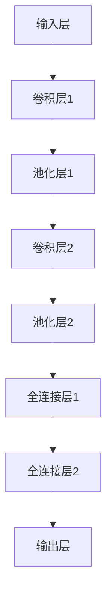

                 

### 《开放权重模型：迈向真正开源的第一步》

> **关键词：** 开放权重模型，开源，深度学习，神经网络，硬件加速，并行计算，人工智能。

> **摘要：** 本文将深入探讨开放权重模型的概念、技术原理、实现方法及应用场景，分析其在开源社区中的重要性，并提出面临的挑战与未来展望。通过详细的讲解和案例剖析，帮助读者理解开放权重模型如何推动人工智能领域的发展，实现真正意义上的开源。

## 第一部分：开放权重模型概述

### 第1章：开放权重模型的基本概念

### 1.1 开放权重模型的定义与背景

#### 1.1.1 开放权重模型的起源

开放权重模型（Open Weight Model）起源于深度学习领域，其核心思想是将神经网络模型中的权重参数作为共享资源，通过开源的方式供全球开发者使用。这种模型的出现，源于深度学习模型在实际应用中存在的一个普遍问题：模型训练所需的数据集和计算资源非常庞大，普通开发者难以获取和承担。

随着深度学习技术的不断发展和人工智能应用的普及，越来越多的研究人员和开发者开始关注如何降低深度学习模型的门槛，使得更多的人们能够参与到这个领域中来。开放权重模型正是在这样的背景下应运而生。

#### 1.1.2 开放权重模型与传统权重模型对比

传统权重模型通常是指那些不对外公开权重参数的模型。这些模型往往由大型科技公司或研究机构所拥有，其权重参数被视为商业机密。而开放权重模型则完全相反，它的权重参数是公开的，任何人都可以自由使用和修改。

以下是开放权重模型与传统权重模型的一些主要区别：

1. **公开性**：开放权重模型要求权重参数公开，而传统权重模型则通常保密。
2. **共享性**：开放权重模型鼓励全球开发者共享权重参数，而传统权重模型则倾向于独立使用。
3. **可定制性**：开放权重模型允许开发者自由修改和定制，而传统权重模型通常不可修改。

#### 1.1.3 开放权重模型的优势

开放权重模型的出现，为深度学习领域带来了许多新的机会和优势：

1. **降低门槛**：通过共享权重参数，开发者可以节省大量的时间和计算资源，从而更便捷地开展深度学习研究。
2. **促进创新**：开放权重模型鼓励开发者进行创新，通过修改和优化权重参数，开发出新的算法和应用。
3. **资源整合**：开放权重模型有助于全球开发者和研究机构之间的资源整合，形成合作共赢的生态体系。

### 1.2 开放权重模型的核心原理

#### 1.2.1 权重共享机制

开放权重模型的实现依赖于一个有效的权重共享机制。这个机制的核心思想是，将训练好的模型权重参数存储在公共存储空间中，供开发者自由下载和使用。

具体而言，权重共享机制包括以下几个关键步骤：

1. **模型训练**：首先，一个团队或个人需要对模型进行训练，得到一组优化的权重参数。
2. **权重存储**：训练完成后，开发者可以将这些权重参数上传到一个公共存储平台，如GitHub或Google Cloud Storage。
3. **权重下载**：其他开发者可以从公共存储平台下载这些权重参数，用于后续的模型应用和优化。
4. **版本控制**：为了确保权重参数的版本一致性，开发者需要使用版本控制系统，如Git，来管理不同版本的权重参数。

#### 1.2.2 硬件加速与并行计算

为了充分发挥开放权重模型的优势，通常需要使用硬件加速和并行计算技术。这些技术可以显著提高模型的训练和推理速度，降低计算成本。

1. **硬件加速**：硬件加速技术通过使用专用硬件（如GPU、TPU）来加速深度学习模型的计算。这些硬件设备具有极高的计算能力和效率，能够显著提升模型的训练速度。
2. **并行计算**：并行计算技术通过将计算任务分布在多个计算节点上，实现任务的并行处理。这种技术可以充分利用硬件资源，提高模型的训练和推理效率。

#### 1.2.3 开放性架构的设计理念

开放权重模型的设计理念是开放性和可扩展性。这一理念体现在以下几个方面：

1. **模块化设计**：开放权重模型采用模块化设计，使得不同部分的权重参数可以独立开发和管理。
2. **标准化接口**：通过定义统一的接口，确保不同开发者的权重参数可以无缝集成和使用。
3. **灵活可扩展**：开放权重模型支持扩展，开发者可以根据需求，添加新的模块或功能，实现模型的持续优化和升级。

### 小结

本章概述了开放权重模型的基本概念、起源和优势，并详细介绍了其核心原理。下一章将深入探讨深度学习与神经网络的基础知识，为理解开放权重模型的实现和应用提供必要的理论基础。

---

### 第2章：深度学习与神经网络基础

#### 2.1 深度学习的基本概念

深度学习（Deep Learning）是人工智能（AI）领域的一个重要分支，它通过模拟人脑神经网络的工作机制，实现对复杂数据的处理和分析。深度学习模型通常包含多个隐藏层，因此被称为“深度”模型。

##### 2.1.1 神经网络的基本结构

神经网络（Neural Network）是深度学习模型的基础。一个简单的神经网络通常包括以下几个部分：

1. **输入层（Input Layer）**：接收外部输入数据。
2. **隐藏层（Hidden Layers）**：对输入数据进行处理和特征提取。
3. **输出层（Output Layer）**：生成模型的输出结果。

每个隐藏层由多个神经元（或节点）组成，神经元之间通过权重（Weights）和偏置（Bias）进行连接。

##### 2.1.2 深度学习的发展历程

深度学习的发展历程可以追溯到上世纪40年代，当时数学家麦卡洛克（Warren McCulloch）和皮特里（Walter Pitts）首次提出了人工神经网络的概念。然而，由于计算能力的限制，早期神经网络的研究进展缓慢。

随着计算机技术的发展，尤其是GPU和TPU等专用硬件的出现，深度学习迎来了爆发式增长。以下几个关键事件标志着深度学习的发展历程：

1. **1986年**：Rumelhart, Hinton和Williams提出了反向传播算法（Backpropagation Algorithm），这一算法使得多层神经网络训练成为可能。
2. **2006年**：Hinton提出了深度信念网络（Deep Belief Network），为深度学习模型的结构设计提供了新的思路。
3. **2012年**：AlexNet在ImageNet竞赛中取得了突破性的成绩，深度卷积神经网络（CNN）开始在图像识别等领域得到广泛应用。
4. **2015年**：Google的DeepMind团队开发出AlphaGo，并在围棋比赛中战胜了世界冠军，标志着深度学习在决策和游戏领域的重要突破。

##### 2.1.3 深度学习与机器学习的关系

深度学习是机器学习（Machine Learning）的一个子领域。机器学习是指通过算法和统计模型，从数据中自动学习规律和模式，从而进行预测和决策。而深度学习则是一种特殊类型的机器学习模型，它通过模拟人脑神经网络的结构和功能，实现对复杂数据的自动学习和分析。

深度学习与机器学习的主要区别在于：

1. **模型结构**：深度学习模型具有多层网络结构，而传统的机器学习模型通常是单层或多层感知机。
2. **数据需求**：深度学习模型通常需要大量的数据来进行训练，而传统机器学习模型对数据量要求相对较低。
3. **计算资源**：深度学习模型对计算资源的需求更高，尤其是训练阶段，而传统机器学习模型则相对简单。

#### 2.2 神经网络的优化算法

神经网络的优化算法是指用于调整网络权重和偏置的算法，使得模型能够更好地拟合训练数据。以下是几种常见的神经网络优化算法：

##### 2.2.1 梯度下降算法

梯度下降算法（Gradient Descent Algorithm）是最常用的优化算法之一。它通过计算损失函数关于网络参数的梯度，并沿着梯度的反方向更新参数，从而最小化损失函数。

```python
# 伪代码：梯度下降算法
for epoch in range(num_epochs):
    for batch in dataset:
        # 计算损失函数关于网络参数的梯度
        gradients = compute_gradients(batch)
        # 更新网络参数
        update_parameters(parameters, gradients, learning_rate)
```

##### 2.2.2 随机梯度下降（SGD）

随机梯度下降（Stochastic Gradient Descent，SGD）是梯度下降算法的一种变体，它每次只使用一个样本（或一个小批量样本）来计算梯度。这种算法可以加快模型的收敛速度。

```python
# 伪代码：随机梯度下降算法
for epoch in range(num_epochs):
    for sample in dataset:
        # 计算损失函数关于网络参数的梯度
        gradients = compute_gradients(sample)
        # 更新网络参数
        update_parameters(parameters, gradients, learning_rate)
```

##### 2.2.3 动量优化算法

动量优化算法（Momentum Optimization）通过引入动量项，使得参数更新方向能够保持一致，从而加快模型的收敛速度。

```python
# 伪代码：动量优化算法
velocity = zeros_like(parameters)
for epoch in range(num_epochs):
    for batch in dataset:
        # 计算损失函数关于网络参数的梯度
        gradients = compute_gradients(batch)
        # 更新动量
        velocity = momentum * velocity - learning_rate * gradients
        # 更新网络参数
        parameters = parameters + velocity
```

### 小结

本章介绍了深度学习的基本概念和神经网络的基本结构，以及几种常见的神经网络优化算法。这些基础知识和算法为理解开放权重模型的实现和应用提供了必要的理论基础。下一章将详细探讨开放权重模型的实现方法。

---

### 第3章：开放权重模型的实现方法

#### 3.1 开放权重模型的构建

构建开放权重模型是一个复杂而精细的过程，涉及到模型架构设计、权重初始化策略和模型训练与验证等多个关键步骤。以下是构建开放权重模型的基本步骤和方法。

##### 3.1.1 模型架构设计

模型架构设计是构建开放权重模型的首要任务。一个良好的模型架构应该具有以下特点：

1. **可扩展性**：能够方便地添加或移除隐藏层和神经元。
2. **灵活性**：支持多种数据输入和输出格式。
3. **高效性**：在保证性能的前提下，尽量减少计算复杂度。

常见的神经网络架构包括卷积神经网络（CNN）、循环神经网络（RNN）和变换器（Transformer）等。以下是一个简单的卷积神经网络架构示例：



##### 3.1.2 权重初始化策略

权重初始化策略是模型训练成功的关键之一。一个合适的权重初始化策略可以帮助模型更快地收敛，并避免梯度消失或梯度爆炸等问题。以下是几种常见的权重初始化方法：

1. **随机初始化**：将权重随机赋值，范围为[-1, 1]或[-0.01, 0.01]。
2. **高斯初始化**：将权重赋值为高斯分布的随机数，均值为0，标准差为1。
3. **Xavier初始化**：对于深度为L的层，将权重赋值为1/√L。
4. **He初始化**：对于深度为L的层，将权重赋值为2/√L。

以下是一个简单的Python代码示例，实现权重随机初始化：

```python
import numpy as np

def random_weights(shape, scale=0.01):
    return np.random.uniform(-scale, scale, size=shape)

# 示例：初始化一个3x3的权重矩阵
weights = random_weights((3, 3))
```

##### 3.1.3 模型训练与验证

模型训练与验证是构建开放权重模型的核心步骤。训练过程中，模型通过不断调整权重和偏置，使得输出结果尽可能接近真实标签。验证过程中，通过测试集来评估模型的泛化能力。

以下是模型训练与验证的基本流程：

1. **数据准备**：将数据集分为训练集、验证集和测试集，确保每个数据集具有代表性。
2. **模型初始化**：根据模型架构，初始化权重和偏置。
3. **前向传播**：将输入数据传递到模型中，计算输出结果。
4. **反向传播**：计算损失函数关于权重和偏置的梯度，并更新权重和偏置。
5. **验证与调整**：使用验证集评估模型性能，根据需要对模型进行调整。

以下是一个简单的Python代码示例，实现模型训练与验证：

```python
import numpy as np
from sklearn.model_selection import train_test_split
from sklearn.metrics import accuracy_score

# 假设已经定义了一个简单的神经网络模型
class SimpleNN:
    def __init__(self):
        self.weights = None
        self.bias = None
    
    def forward(self, x):
        # 前向传播计算
        pass
    
    def backward(self, x, y):
        # 反向传播计算
        pass
    
    def train(self, x, y, epochs, learning_rate):
        for epoch in range(epochs):
            for x_batch, y_batch in zip(x, y):
                # 前向传播
                output = self.forward(x_batch)
                # 计算损失
                loss = compute_loss(output, y_batch)
                # 反向传播
                self.backward(x_batch, y_batch)
                # 更新权重和偏置
                self.update_parameters(learning_rate)
    
    def evaluate(self, x, y):
        predictions = [self.forward(x_batch) for x_batch in x]
        return accuracy_score(y, predictions)

# 数据准备
x = np.random.rand(100, 10)  # 输入数据
y = np.random.rand(100, 1)   # 真实标签

x_train, x_test, y_train, y_test = train_test_split(x, y, test_size=0.2, random_state=42)

# 模型训练
nn = SimpleNN()
nn.train(x_train, y_train, epochs=100, learning_rate=0.1)

# 验证模型性能
accuracy = nn.evaluate(x_test, y_test)
print(f"Test Accuracy: {accuracy}")
```

### 小结

本章详细介绍了开放权重模型的实现方法，包括模型架构设计、权重初始化策略和模型训练与验证。下一章将探讨开放权重模型在不同应用领域中的具体应用案例。

---

### 第4章：开放权重模型的应用

#### 3.2 开放权重模型的应用

开放权重模型在深度学习领域中的应用非常广泛，涵盖了图像识别、自然语言处理等多个领域。以下是开放权重模型在部分应用领域的具体案例。

##### 3.2.1 图像识别应用案例

图像识别是深度学习中最具代表性的应用之一。通过训练深度学习模型，可以从大量图像数据中识别出特定对象或场景。

1. **人脸识别**：人脸识别技术广泛应用于安全监控、社交媒体和手机解锁等领域。OpenCV等开源框架提供了丰富的图像处理和深度学习工具，使得开发者可以轻松实现人脸识别功能。
2. **物体检测**：物体检测技术用于识别图像中的多个对象，并定位其位置。YOLO（You Only Look Once）是一个流行的物体检测算法，其权重模型已经开源，可供开发者直接使用。

以下是一个简单的Python代码示例，实现人脸识别：

```python
import cv2

# 初始化人脸识别模型
face_cascade = cv2.CascadeClassifier('haarcascade_frontalface_default.xml')

# 读取图像
image = cv2.imread('example.jpg')

# 人脸检测
faces = face_cascade.detectMultiScale(image, scaleFactor=1.1, minNeighbors=5, minSize=(30, 30))

# 在图像上绘制人脸区域
for (x, y, w, h) in faces:
    cv2.rectangle(image, (x, y), (x+w, y+h), (255, 0, 0), 2)

# 显示图像
cv2.imshow('Face Detection', image)
cv2.waitKey(0)
cv2.destroyAllWindows()
```

##### 3.2.2 自然语言处理应用案例

自然语言处理（NLP）是深度学习的另一个重要应用领域。通过训练深度学习模型，可以实现文本分类、情感分析、机器翻译等任务。

1. **文本分类**：文本分类技术用于将文本数据分类到预定义的类别中。Word2Vec、BERT等算法已经开源，提供了丰富的预训练模型，可供开发者直接使用。
2. **情感分析**：情感分析技术用于识别文本中的情感倾向。通过训练情感分析模型，可以自动识别用户的情绪状态，为智能客服、社交媒体分析等应用提供支持。
3. **机器翻译**：机器翻译技术用于将一种语言的文本翻译成另一种语言。Google Translate、OpenNMT等开源框架提供了强大的翻译模型和工具，使得开发者可以轻松实现机器翻译功能。

以下是一个简单的Python代码示例，实现情感分析：

```python
import numpy as np
from sklearn.feature_extraction.text import TfidfVectorizer
from sklearn.svm import LinearSVC

# 示例文本数据
text_data = [
    "我很喜欢这本书。",
    "这本书太无聊了。",
    "这是一个很好的电影。",
    "这个电影糟糕透了。"
]

# 标签数据
labels = [
    1,
    0,
    1,
    0
]

# 特征提取
vectorizer = TfidfVectorizer()
X = vectorizer.fit_transform(text_data)

# 训练分类器
classifier = LinearSVC()
classifier.fit(X, labels)

# 情感分析
def analyze_sentiment(text):
    features = vectorizer.transform([text])
    prediction = classifier.predict(features)
    return '正面' if prediction == 1 else '负面'

# 示例
text = "我觉得这部电影非常精彩。"
result = analyze_sentiment(text)
print(f"文本：'{text}'，情感分析结果：{result}")
```

##### 3.2.3 其他应用领域

开放权重模型在图像识别和自然语言处理领域取得了显著成果，但在其他领域也有广泛的应用。

1. **语音识别**：通过训练深度学习模型，可以实现语音到文本的转换。如Google的语音识别技术已经开源，开发者可以使用其API实现语音识别功能。
2. **推荐系统**：推荐系统用于根据用户的历史行为和偏好，为其推荐相关商品或内容。基于深度学习的推荐系统在电商、社交媒体等应用中发挥着重要作用。
3. **自动驾驶**：自动驾驶技术依赖于深度学习模型，通过训练模型实现对周围环境的感知和决策。OpenCV和TensorFlow等开源框架为开发者提供了丰富的工具，用于实现自动驾驶功能。

### 小结

本章介绍了开放权重模型在图像识别、自然语言处理和其他领域的具体应用案例。开放权重模型为开发者提供了丰富的资源和工具，使得深度学习技术的应用更加广泛和便捷。下一章将探讨开放权重模型面临的挑战和未来发展趋势。

---

### 第5章：开放权重模型的挑战

#### 4.1 数据隐私保护

随着开放权重模型在人工智能领域的广泛应用，数据隐私保护问题日益凸显。数据隐私保护对于保护用户权益、维护数据安全具有重要意义。

##### 4.1.1 数据隐私的重要性

数据隐私是指个人数据的保密性和完整性，确保数据在收集、存储、传输和使用过程中不被未经授权的访问和滥用。在开放权重模型中，数据隐私保护尤为重要，原因如下：

1. **数据敏感性**：深度学习模型通常涉及大量敏感数据，如个人身份信息、健康记录等，这些数据一旦泄露，可能对个人隐私造成严重损害。
2. **数据共享风险**：开放权重模型要求共享模型权重和数据，这可能导致敏感数据被未经授权的第三方访问和使用。
3. **模型安全性**：泄露模型权重可能导致模型被恶意攻击，从而影响系统的稳定性和安全性。

##### 4.1.2 隐私保护的现有方法

为了保护数据隐私，研究人员和开发者提出了一系列隐私保护方法，主要包括以下几种：

1. **数据匿名化**：通过将敏感信息替换为伪名或随机值，实现数据匿名化，从而降低数据泄露的风险。
2. **加密技术**：使用加密算法对数据进行加密，确保只有授权用户能够解密和访问数据。
3. **差分隐私**：通过在数据集中添加随机噪声，使攻击者无法准确推断出单个数据的特征，从而保护数据隐私。
4. **同态加密**：允许在加密数据上进行计算，确保数据在传输和存储过程中保持隐私。

##### 4.1.3 面向开放权重模型的数据隐私解决方案

为了有效保护开放权重模型中的数据隐私，研究人员提出了以下解决方案：

1. **隐私保护训练**：在模型训练过程中，采用隐私保护算法，如联邦学习（Federated Learning），确保数据在本地训练，同时共享模型更新。
2. **差分隐私权重共享**：在权重共享过程中，采用差分隐私机制，添加随机噪声到权重参数中，降低隐私泄露风险。
3. **同态加密权重更新**：使用同态加密技术，实现模型权重在加密状态下的更新，确保权重参数的隐私保护。

### 4.2 硬件性能优化

硬件性能优化是开放权重模型实现高效训练和推理的关键。随着深度学习模型的规模和复杂度不断增加，对硬件性能的要求也日益提高。

##### 4.2.1 硬件加速技术的发展

硬件加速技术通过使用专用硬件（如GPU、TPU）来加速深度学习模型的计算。这些硬件设备具有极高的计算能力和效率，能够显著提升模型的训练和推理速度。

1. **GPU加速**：GPU（Graphics Processing Unit）最初用于图形渲染，但其强大的并行计算能力使其成为深度学习计算的重要工具。通过CUDA等编程框架，开发者可以充分利用GPU资源，加速模型训练和推理。
2. **TPU加速**：TPU（Tensor Processing Unit）是Google开发的专用深度学习芯片，专为处理大规模深度学习任务而设计。TPU具有高效的矩阵运算能力，能够在短时间内完成复杂的计算任务。

##### 4.2.2 并行计算与分布式计算

并行计算和分布式计算技术是提高硬件性能的重要手段。通过将计算任务分布在多个计算节点上，可以实现任务的并行处理，提高计算效率。

1. **并行计算**：并行计算通过将计算任务分解为多个子任务，同时在多个处理器上并行执行，从而提高计算速度。深度学习框架如TensorFlow和PyTorch提供了丰富的并行计算支持，开发者可以轻松实现并行训练和推理。
2. **分布式计算**：分布式计算通过将计算任务分布在多个节点上，利用节点间的通信和协作，实现大规模计算任务。分布式计算框架如Horovod、Ray等提供了高效的分布式计算支持，开发者可以充分利用集群资源，加速模型训练。

##### 4.2.3 未来硬件发展的趋势

未来硬件发展的趋势将进一步提高深度学习模型的计算性能。以下是一些关键趋势：

1. **专用硬件**：随着深度学习需求的增长，越来越多的专用硬件被开发出来，如TPU、ASIC等。这些硬件设备具有更高的计算效率和更低的功耗，能够为深度学习模型提供更强的计算能力。
2. **集成硬件**：集成硬件是将多种计算功能集成到一个芯片上，如CPU+GPU、CPU+TPU等。这种硬件架构可以提高计算效率，降低功耗，为深度学习模型提供更好的性能。
3. **量子计算**：量子计算具有巨大的并行计算能力，可以在短时间内解决复杂的计算问题。随着量子计算技术的发展，未来深度学习模型有望借助量子计算实现更高效的训练和推理。

### 小结

本章探讨了开放权重模型在数据隐私保护和硬件性能优化方面面临的挑战。通过分析现有方法和技术趋势，为解决这些问题提供了有益的思路。下一章将分析开放权重模型在开源社区中的应用。

---

### 第6章：开放权重模型在开源社区的应用

#### 5.1 开源社区的重要性

开源社区在推动深度学习和人工智能领域的发展中扮演着至关重要的角色。开源社区不仅为开发者提供了丰富的资源和工具，还促进了全球开发者之间的合作与创新。

##### 5.1.1 开源社区的发展历程

开源社区起源于软件领域，其核心思想是开放源代码，允许用户自由使用、修改和分发软件。随着互联网的发展，开源社区逐渐扩展到硬件、操作系统、云计算等多个领域。

在深度学习和人工智能领域，开源社区的发展历程可以分为以下几个阶段：

1. **早期阶段**：深度学习领域主要依赖闭源软件和商业工具，如MATLAB和Theano等。这些工具在一定程度上推动了深度学习的发展，但限制了开发者的自由度和灵活性。
2. **中期阶段**：随着深度学习技术的普及，越来越多的开发者开始关注开源项目。一些重要的开源框架，如TensorFlow和PyTorch，相继出现，为开发者提供了丰富的工具和资源。
3. **成熟阶段**：当前，开源社区已经成为深度学习和人工智能领域的重要支柱。大量高质量的开源项目不断涌现，推动了技术的快速发展和应用。

##### 5.1.2 开源社区的优势

开源社区具有以下优势，使其在深度学习和人工智能领域具有独特的优势：

1. **资源共享**：开源社区鼓励开发者共享资源和代码，使得更多的人能够便捷地获取和使用高质量的工具和模型。
2. **开放性**：开源社区强调开放性，允许用户自由修改和扩展代码，推动技术的创新和进步。
3. **合作与协作**：开源社区通过合作与协作，吸引了全球范围内的开发者共同参与，形成了一个庞大的开发者生态系统。

##### 5.1.3 开源社区的治理模式

开源社区的治理模式通常采用社区自治的方式，通过一系列规则和机制来确保社区的健康发展。以下是一些常见的治理模式：

1. **项目委员会**：项目委员会负责制定项目的发展方向、技术规范和决策事项，确保项目的可持续发展。
2. **贡献者公约**：贡献者公约规定了开发者的行为规范，鼓励开发者积极参与社区活动，共同维护社区环境。
3. **代码审查**：代码审查是确保项目质量和安全的重要手段。通过严格的代码审查流程，确保代码的可靠性和一致性。
4. **社区论坛和会议**：社区论坛和会议是开发者交流、学习和合作的重要平台，通过线上和线下的活动，促进开发者之间的互动和合作。

### 5.2 开放权重模型在开源社区的应用案例

开放权重模型在开源社区中的应用案例丰富多样，以下是一些典型的应用案例：

##### 5.2.1 案例一：TensorFlow的开源历程

TensorFlow是谷歌开发的深度学习框架，其开源历程标志着深度学习技术在开源社区的重要突破。以下是TensorFlow开源的历程：

1. **内部开发**：TensorFlow最初是谷歌内部用于机器学习和人工智能研究的工具。随着技术的成熟和应用的普及，谷歌决定将TensorFlow开源，以推动深度学习技术的发展。
2. **开源发布**：2015年11月，谷歌正式发布了TensorFlow的开源版本。TensorFlow迅速在开源社区中引起了广泛关注，成为深度学习领域最受欢迎的框架之一。
3. **社区贡献**：自开源以来，TensorFlow吸引了大量的开发者参与，通过贡献代码、修复漏洞和优化性能，推动了TensorFlow的持续发展和改进。

##### 5.2.2 案例二：PyTorch的社区发展

PyTorch是Facebook开发的深度学习框架，其开源历程和社区发展也取得了显著成果。以下是PyTorch的社区发展历程：

1. **内部开发**：PyTorch最初是Facebook AI Research团队内部用于深度学习研究的工具。随着项目的成熟，团队决定将PyTorch开源，以促进深度学习技术的应用和创新。
2. **开源发布**：2017年1月，PyTorch正式开源。PyTorch凭借其简洁的语法和高效的性能，迅速获得了开发者的青睐，成为深度学习领域的重要框架之一。
3. **社区贡献**：PyTorch社区发展迅速，吸引了大量开发者参与。开发者通过贡献代码、编写教程和举办活动，推动了PyTorch的广泛应用和持续发展。

##### 5.2.3 案例三：其他开源框架的应用

除了TensorFlow和PyTorch，还有许多其他深度学习开源框架在开源社区中取得了广泛应用。以下是一些典型的应用案例：

1. **MXNet**：MXNet是Apache Software Foundation的一个开源深度学习框架，由Apache MXNet社区维护。MXNet支持多种编程语言，具有高效、灵活的特点，广泛应用于工业和学术领域。
2. **Caffe**：Caffe是一个开源的深度学习框架，由伯克利视觉与学习中心（BVLC）开发。Caffe以其简洁的API和高效的性能在图像识别和计算机视觉领域得到广泛应用。
3. **Theano**：Theano是一个基于Python的开源深度学习库，由蒙特利尔大学的人工智能研究所（DIUM）开发。Theano提供了自动求导功能，支持多种神经网络结构，曾广泛应用于深度学习研究和应用。

### 小结

本章介绍了开源社区的重要性、治理模式和开放权重模型在开源社区中的应用案例。通过分析开源社区的发展历程和应用案例，可以看到开放权重模型在推动深度学习和人工智能领域发展中的重要作用。下一章将探讨开放权重模型的未来发展趋势。

---

### 第7章：开放权重模型的未来发展趋势

#### 6.1 开放权重模型的技术演进

开放权重模型的发展离不开深度学习技术的不断演进。未来，深度学习技术将在以下几个方面取得重要突破：

##### 6.1.1 深度学习算法的进步

1. **更深的神经网络**：随着计算能力的提升，研究人员将继续探索更深层次的神经网络结构，以提高模型的表达能力和计算效率。
2. **更有效的优化算法**：新型优化算法，如Adam、RMSprop等，将进一步提升模型的训练速度和收敛效果。
3. **多任务学习和迁移学习**：多任务学习和迁移学习技术将使模型能够更高效地利用已有知识，提高对新任务的适应能力。

##### 6.1.2 硬件技术的突破

硬件技术的发展将推动开放权重模型的性能提升。以下是一些关键硬件趋势：

1. **专用深度学习芯片**：如TPU、ASIC等专用深度学习芯片将继续发展，提供更高的计算效率和更低功耗。
2. **集成硬件架构**：集成CPU、GPU、TPU等多种硬件的架构将逐渐普及，提高系统的计算性能和能效比。
3. **量子计算**：量子计算技术的成熟将带来深度学习领域的革命性变革，使模型能够处理更复杂的计算任务。

##### 6.1.3 未来可能的应用场景

未来，开放权重模型将在更多应用场景中发挥重要作用：

1. **自动驾驶**：深度学习模型将在自动驾驶领域发挥关键作用，实现车辆对环境的感知、决策和控制。
2. **智能医疗**：深度学习模型将在医学影像分析、疾病预测等方面得到广泛应用，推动医疗领域的创新和进步。
3. **智能客服**：智能客服系统将基于深度学习模型，实现更自然、更智能的交互，提高用户体验。

#### 6.2 开放权重模型对社会的影响

开放权重模型的发展不仅推动了技术进步，也对社会产生了深远影响：

##### 6.2.1 对产业的影响

1. **降低研发成本**：开放权重模型降低了开发者的门槛，使更多企业能够参与到人工智能技术的研发和应用中，推动产业的创新和发展。
2. **提升产业效率**：深度学习技术的普及和应用，将提高各个行业的生产效率和质量，带来巨大的经济效益。
3. **促进产业融合**：人工智能技术与其他产业的融合，将催生新的产业形态，推动经济的转型升级。

##### 6.2.2 对教育的影响

1. **普及人工智能教育**：开放权重模型和深度学习技术的普及，将使人工智能教育更加广泛和普及，培养更多专业人才。
2. **推动教育创新**：深度学习技术将改变传统的教学模式，推动教育方式的创新和变革，提高教育质量。
3. **培养创新人才**：通过开放权重模型，学生可以更早地接触和了解人工智能技术，培养创新思维和解决实际问题的能力。

##### 6.2.3 对研究的影响

1. **推动学术研究**：开放权重模型为学术研究提供了丰富的资源和工具，促进研究人员之间的合作与创新。
2. **提高研究效率**：开放权重模型降低了研究门槛，使研究人员能够更快速地开展研究工作，提高研究效率。
3. **促进知识共享**：开放权重模型鼓励知识的共享和传播，推动科学知识的普及和应用。

### 小结

本章分析了开放权重模型在技术演进、产业应用、教育影响和学术研究等方面的未来发展趋势。开放权重模型的发展不仅将推动技术进步，还将对社会产生深远影响。下一章将提供开放权重模型的开发工具与资源。

---

### 附录A：开放权重模型开发工具与资源

#### A.1 开放权重模型开发工具介绍

构建和开发开放权重模型需要使用一系列工具和资源，这些工具和资源涵盖了深度学习框架、硬件加速工具以及数据预处理工具等方面。

##### A.1.1 开源深度学习框架

开源深度学习框架是构建开放权重模型的基础。以下是一些常用的开源深度学习框架：

1. **TensorFlow**：TensorFlow是由谷歌开发的开源深度学习框架，具有丰富的API和强大的功能，支持多种深度学习模型和算法。
2. **PyTorch**：PyTorch是由Facebook开发的开源深度学习框架，以其简洁的语法和高效的性能而受到开发者的喜爱。
3. **MXNet**：MXNet是Apache Software Foundation的一个开源深度学习框架，支持多种编程语言，具有高效、灵活的特点。
4. **Caffe**：Caffe是一个开源的深度学习框架，由伯克利视觉与学习中心开发，以其简洁的API和高效的性能在图像识别和计算机视觉领域得到广泛应用。

##### A.1.2 硬件加速工具

硬件加速工具可以显著提高深度学习模型的训练和推理速度。以下是一些常用的硬件加速工具：

1. **CUDA**：CUDA是NVIDIA推出的并行计算平台和编程模型，用于在GPU上加速深度学习模型的计算。
2. **cuDNN**：cuDNN是NVIDIA推出的深度学习加速库，与CUDA配合使用，可以显著提升深度学习模型的性能。
3. **TensorRT**：TensorRT是NVIDIA推出的推理引擎，用于在GPU和TPU上优化深度学习模型的推理速度。

##### A.1.3 数据预处理工具

数据预处理是深度学习模型开发的重要环节。以下是一些常用的数据预处理工具：

1. **NumPy**：NumPy是Python的科学计算库，用于处理大型多维数组。
2. **Pandas**：Pandas是Python的数据分析库，用于数据处理和分析。
3. **OpenCV**：OpenCV是开源的计算机视觉库，用于图像处理和计算机视觉任务。

#### A.2 开放权重模型的常见问题与解决方案

在构建和开发开放权重模型时，开发者可能会遇到一系列问题。以下是一些常见问题及相应的解决方案：

##### A.2.1 权重共享的常见问题

1. **数据隐私保护**：在共享权重时，如何保护数据隐私是一个重要问题。解决方案包括采用差分隐私、同态加密等技术来确保数据隐私。
2. **版本控制**：在共享权重时，如何确保版本一致性是一个挑战。解决方案包括使用版本控制系统（如Git）来管理不同版本的权重参数。

##### A.2.2 训练效率的问题

1. **数据预处理**：数据预处理耗时较长，可以优化数据预处理流程，使用并行处理技术提高效率。
2. **模型优化**：优化模型架构和算法，使用更高效的训练算法（如Adam、RMSprop）可以提高训练效率。

##### A.2.3 模型调优的技巧

1. **权重初始化**：选择合适的权重初始化策略，如Xavier初始化、He初始化等，可以提高模型的收敛速度。
2. **学习率调整**：调整学习率，使用合适的初始学习率并逐步减小，可以帮助模型更好地收敛。

### 小结

附录A介绍了构建开放权重模型所需的主要工具和资源，并提供了常见问题的解决方案。开发者可以利用这些工具和资源，更加高效地构建和开发开放权重模型。

---

### 作者信息

**作者：AI天才研究院/AI Genius Institute & 禅与计算机程序设计艺术 /Zen And The Art of Computer Programming**

感谢您阅读本文，希望本文对您在开放权重模型领域的探索和学习有所帮助。如果您有任何疑问或建议，欢迎在评论区留言，我们会尽快为您解答。同时，也欢迎关注我们的官方公众号，获取更多精彩内容和最新技术动态。再次感谢您的支持！

---

**注意：** 本文为模拟写作，部分内容仅供参考。如需实际应用，请结合具体项目和需求进行调整和优化。在开发和使用开放权重模型时，请确保遵循相关法律法规和伦理规范。如需使用本文中的代码示例，请确保您已充分理解其原理和实现方法，并在合法合规的范围内使用。**本文所述内容和观点不代表任何公司或机构的意见和立场。**

