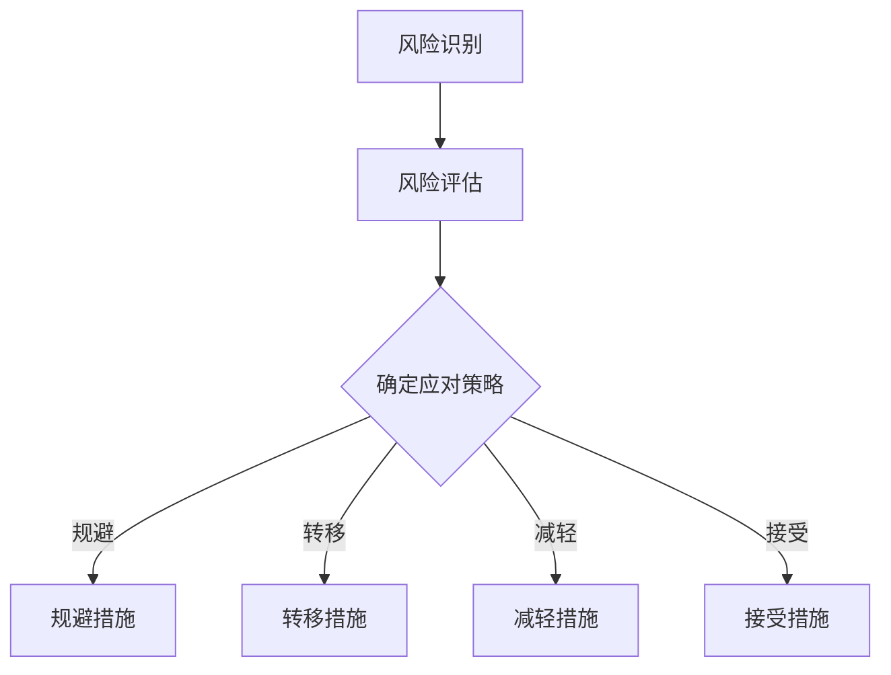

                 

### 《开源项目的商业化风险管理：风险识别和Mitigation》

#### 引言

开源项目，作为一种协作开发的模式，正日益成为现代软件开发的重要组成部分。它们不仅促进了技术的创新和普及，也为商业活动带来了新的机遇。然而，在开源项目逐步走向商业化的过程中，管理者必须面对一系列潜在的风险。本文旨在探讨开源项目的商业化风险管理，特别是风险识别和缓解策略，以帮助项目管理者更好地应对这些挑战。

**关键词**：开源项目、商业化、风险管理、风险识别、缓解策略

**摘要**：
本文首先介绍了开源项目与商业化的背景，阐述了开源运动的历史和商业化的重要性。接着，我们深入分析了开源项目面临的四大主要风险：法律风险、技术风险、市场风险和运营风险。随后，文章提出了风险管理框架和具体的评估方法，并列举了风险应对策略。最后，通过具体案例分析，展示了如何在实际项目中应用这些策略。本文旨在为开源项目的商业化提供有价值的指导。

#### 第一部分：引言

#### 第1章：开源项目与商业化背景

##### 1.1 开源项目的概念与发展

开源项目，即通过开放源代码，允许任何人自由地查看、修改和分发软件的项目。这种模式起源于20世纪90年代的自由软件运动，其核心理念是共享、合作和透明。Linux操作系统作为开源项目的典范，推动了开源软件（OSS）的快速发展。随着互联网的普及，开源项目逐渐从边缘走向主流，成为许多公司和企业的重要技术基础。

开源项目的优势在于：
- **创新性**：广泛的协作促进了技术的创新和优化。
- **安全性**：大量的开发者可以共同检测和修复漏洞，提高软件的安全性。
- **经济性**：降低开发成本，提高效率。

然而，开源项目也面临一些挑战，如：
- **法律问题**：涉及版权、专利和许可协议的复杂性。
- **维护难度**：需要持续的技术支持和更新。
- **社区管理**：如何有效管理社区成员和项目方向。

##### 1.2 商业化在开源项目中的重要性

商业化，即通过开源项目创造经济价值的过程。随着开源项目的广泛应用，许多公司开始利用开源技术来构建自己的商业模型。商业化的主要形式包括：
- **企业级支持**：提供专业的技术支持、培训和咨询服务。
- **商业许可**：对开源软件进行修改和定制，以提供商业许可。
- **增值服务**：围绕开源项目提供额外的增值服务，如云服务、集成服务、开发工具等。

商业化的重要性体现在：
- **盈利性**：开源项目可以成为企业收入的稳定来源。
- **品牌建设**：通过参与开源项目，企业可以提升技术影响力和品牌认知度。
- **技术创新**：商业化鼓励持续的技术投入和创新。

然而，商业化也需要平衡与开源精神的兼容性。商业化不应损害开源社区的自由和透明，而应促进社区的繁荣和发展。

##### 1.3 商业化带来的机遇与风险

商业化为开源项目带来了诸多机遇，包括：
- **资金支持**：商业化可以为开源项目提供资金，用于开发、维护和推广。
- **市场拓展**：商业化有助于开源项目进入更广泛的市场，增加用户基础和影响力。
- **技术创新**：商业化的资金支持可以推动技术的持续创新和优化。

但同时，商业化也伴随着一系列风险，包括：
- **社区冲突**：商业化可能导致社区成员的分歧和冲突，影响项目的稳定性。
- **知识产权问题**：商业化的过程中，可能会涉及知识产权纠纷，影响项目的合法性和安全性。
- **市场依赖**：过于依赖商业化收入可能导致项目方向和市场需求的偏离。

综上所述，开源项目的商业化为技术创新和经济发展带来了巨大机遇，但也需要谨慎管理潜在的风险。在接下来的章节中，我们将深入探讨这些风险，并提出相应的识别和缓解策略。

### 第二部分：商业化风险识别

#### 第2章：开源项目的风险因素分析

开源项目的商业化过程中，管理者必须识别并理解潜在的风险，以避免可能的问题和挑战。本章将分析开源项目面临的四大主要风险：法律风险、技术风险、市场风险和运营风险，并详细探讨每个风险因素的具体内容及其对项目的影响。

##### 2.1 法律风险

法律风险是开源项目中一个至关重要的因素。由于开源项目的开放性和透明度，法律问题尤为复杂。以下是一些常见的法律风险因素：

- **著作权与专利问题**：开源项目需要确保其代码不侵犯他人的知识产权。如果项目代码包含未经授权的专利或著作权，可能会面临法律诉讼。

- **许可协议与合规性**：开源项目通常使用特定的许可协议，如GPL、MIT或Apache许可证。许可协议规定了用户如何使用、修改和分发代码。项目必须遵守这些协议，否则可能会违反法律。

- **版权争议**：开源项目可能会因为版权问题引发争议，例如，某些贡献者可能未明确授权其贡献的版权，导致项目合法性的风险。

法律风险对开源项目的影响主要体现在以下几个方面：
- **诉讼成本**：法律纠纷可能会产生高昂的诉讼成本，对项目造成财务压力。
- **项目停滞**：法律问题可能会导致项目开发暂停，影响项目的进度和稳定性。
- **声誉受损**：法律纠纷可能会损害项目的声誉，影响社区的信任和合作。

为了减轻法律风险，开源项目可以采取以下措施：
- **知识产权审计**：在项目启动前，进行全面的知识产权审计，确保代码的合法性。
- **明确版权协议**：确保所有贡献者明确授权其贡献的版权，并在项目文档中明确许可协议。
- **法律咨询**：聘请专业的法律顾问，为项目提供法律支持和指导。

##### 2.2 技术风险

技术风险是开源项目面临的另一大挑战。开源项目的技术复杂性和稳定性直接影响项目的成功。以下是一些常见的技术风险因素：

- **技术过时**：随着技术的发展，某些开源项目可能会过时。技术过时可能导致项目无法满足用户需求，从而影响项目的市场地位。

- **依赖项的风险**：开源项目通常依赖于其他开源组件和库。如果依赖项出现问题，如安全漏洞、性能问题或不再维护，项目可能会受到影响。

- **维护难度**：开源项目需要持续的技术支持和维护。如果项目维护不足，可能导致项目落后、漏洞增多，影响项目的稳定性和安全性。

技术风险对开源项目的影响主要体现在以下几个方面：
- **用户体验下降**：技术问题可能导致用户体验下降，影响用户满意度和项目的市场份额。
- **安全性风险**：技术漏洞可能导致安全漏洞，威胁用户数据和系统安全。
- **项目停滞**：技术问题可能导致项目开发暂停，影响项目的进度和稳定性。

为了减轻技术风险，开源项目可以采取以下措施：
- **技术评估**：定期评估项目的技术状态，确保项目技术不过时。
- **依赖项管理**：对依赖项进行风险评估和管理，确保其安全性和稳定性。
- **持续集成**：采用持续集成和持续部署（CI/CD）流程，确保项目代码的质量和稳定性。

##### 2.3 市场风险

市场风险是开源项目在商业化过程中必须考虑的另一个重要因素。市场环境的变化和竞争态势的演变都可能对项目产生重大影响。以下是一些常见的市场风险因素：

- **竞争态势**：开源项目可能面临来自其他开源项目的激烈竞争。竞争可能导致市场份额的流失和收入的下降。

- **客户需求变化**：客户需求的变化可能对项目的方向和策略产生重大影响。如果项目无法及时调整以满足客户需求，可能导致市场份额的下降。

- **市场饱和**：在某些市场上，开源项目的数量可能过多，导致市场饱和。市场饱和可能导致项目的推广和商业化变得更加困难。

市场风险对开源项目的影响主要体现在以下几个方面：
- **市场份额下降**：激烈的竞争可能导致项目的市场份额下降，影响项目的盈利能力。
- **商业化困难**：市场饱和可能使项目的商业化变得更加困难，影响项目的经济收益。
- **项目方向偏离**：客户需求的变化可能使项目方向偏离，影响项目的稳定性和持续性。

为了减轻市场风险，开源项目可以采取以下措施：
- **市场研究**：定期进行市场研究，了解客户需求和市场趋势，以便及时调整项目策略。
- **差异化策略**：通过提供独特的功能和服务，实现项目在市场上的差异化，提高竞争力。
- **合作伙伴关系**：与行业内的其他公司建立合作伙伴关系，共同开拓市场，降低市场风险。

##### 2.4 运营风险

运营风险是开源项目在商业化过程中必须关注的另一个关键因素。项目运营的稳定性和效率直接影响项目的成功。以下是一些常见的运营风险因素：

- **资源管理问题**：开源项目需要有效的资源管理，包括人员、资金和设备。资源管理不当可能导致项目进度延误、成本超支等问题。

- **团队协作与沟通**：项目团队的有效协作和沟通是项目成功的关键。团队协作和沟通问题可能导致项目进度延误、质量问题等。

- **持续支持与维护**：开源项目需要持续的支持和维护，包括用户支持、漏洞修复和技术更新。支持与维护不足可能导致用户流失和项目停滞。

运营风险对开源项目的影响主要体现在以下几个方面：
- **项目停滞**：资源管理和团队协作问题可能导致项目停滞，影响项目的进度和稳定性。
- **质量问题**：项目运营问题可能导致项目质量问题，影响用户体验和项目的市场声誉。
- **用户流失**：支持与维护不足可能导致用户流失，影响项目的用户基础和市场份额。

为了减轻运营风险，开源项目可以采取以下措施：
- **资源优化**：合理规划和管理项目资源，确保项目进度和质量。
- **团队协作**：建立有效的团队协作和沟通机制，提高团队效率和项目稳定性。
- **持续支持与维护**：建立完善的支持与维护体系，确保用户得到及时的帮助和更新。

综上所述，开源项目在商业化过程中面临着多种风险，包括法律风险、技术风险、市场风险和运营风险。识别和管理这些风险是确保项目成功的关键。在接下来的章节中，我们将探讨如何建立风险管理框架，评估风险并制定应对策略。

#### 第3章：风险管理框架

风险管理是开源项目商业化过程中至关重要的一环。一个有效的风险管理框架可以帮助项目团队识别、评估和应对潜在的风险，从而确保项目的稳定性和持续性。本章将详细介绍风险管理框架的组成部分，包括风险识别、风险评估和风险应对策略。

##### 3.1 风险管理流程

风险管理流程是一个系统化的过程，包括以下主要步骤：

1. **风险识别**：识别项目中的潜在风险因素。这一步骤是风险管理的基础，需要全面、细致地分析项目的各个方面，以发现可能的风险。

2. **风险评估**：对识别出的风险进行评估，确定每个风险的概率和影响程度。风险评估有助于项目团队了解每个风险的重要性和优先级。

3. **风险应对策略**：根据风险评估的结果，制定相应的风险应对策略。风险应对策略包括风险规避、风险转移、风险减轻和风险接受等。

4. **实施策略**：执行风险应对策略，并对其进行监控和调整。实施策略的过程中，项目团队需要持续关注风险的变化，并根据实际情况进行必要的调整。

5. **记录与报告**：记录风险管理的全过程，并定期向项目相关方报告风险管理的进展和结果。这有助于项目团队了解风险管理的有效性，并为未来的项目提供参考。

##### 3.2 风险评估方法

风险评估是风险管理流程中的关键步骤，通过评估风险的概率和影响程度，可以帮助项目团队确定风险的优先级和应对策略。以下是几种常见的风险评估方法：

1. **定性风险评估**：定性风险评估主要通过专家评估、风险矩阵等方法进行。专家评估是指邀请领域专家对风险进行评估，风险矩阵则是一种常用的定性风险评估工具，通过将风险的概率和影响程度进行量化，生成风险评分。

2. **定量风险评估**：定量风险评估主要通过数学模型和统计方法进行。定量风险评估可以更准确地量化风险的概率和影响程度，为项目团队提供更可靠的数据支持。常见的定量风险评估方法包括蒙特卡罗模拟、故障树分析等。

3. **风险矩阵**：风险矩阵是一种常用的定性风险评估工具，通过将风险的概率和影响程度进行量化，生成风险评分。风险矩阵通常包含高、中、低三个等级，分别表示风险的严重程度。项目团队可以根据风险评分确定风险的优先级和应对策略。

4. **蒙特卡罗模拟**：蒙特卡罗模拟是一种基于概率统计的定量风险评估方法，通过模拟多次随机试验，计算风险的概率分布和期望值。蒙特卡罗模拟可以帮助项目团队了解风险的概率和潜在影响，为制定风险应对策略提供依据。

##### 3.3 风险应对策略

根据风险评估的结果，项目团队需要制定相应的风险应对策略。以下是几种常见风险应对策略：

1. **风险规避**：风险规避是指通过调整项目计划，避免风险的发生。例如，如果某个风险的概率很高且影响严重，项目团队可以考虑重新设计项目方案，以规避该风险。

2. **风险转移**：风险转移是指通过将风险转移给其他方，减轻项目团队的风险负担。常见的风险转移方式包括购买保险、签订风险分担合同等。

3. **风险减轻**：风险减轻是指通过采取措施降低风险的概率或影响程度。例如，对于技术风险，项目团队可以通过加强代码审查、提高测试覆盖率等方法来降低风险。

4. **风险接受**：风险接受是指项目团队在评估风险后，决定不采取任何行动，接受风险的发生。风险接受通常适用于低概率或低影响程度的风险。

5. **风险监控**：无论采取何种风险应对策略，项目团队都需要对风险进行持续监控。通过监控风险的变化，项目团队可以及时发现新的风险，并采取相应的应对措施。

##### 3.4 风险管理实践

在实际项目中，风险管理是一个动态的过程，需要项目团队根据实际情况不断调整和完善。以下是一些风险管理实践建议：

1. **建立风险管理团队**：建立专门的风险管理团队，负责识别、评估和应对项目风险。

2. **定期进行风险评估**：定期进行风险评估，及时发现和应对潜在的风险。

3. **制定风险管理计划**：根据风险评估的结果，制定详细的风险管理计划，明确风险应对策略和责任分工。

4. **培训与沟通**：对项目团队成员进行风险管理培训，提高其风险意识和管理能力。同时，加强团队内部的沟通，确保风险信息的及时传递和共享。

5. **持续改进**：根据风险管理实践的结果，不断改进和完善风险管理流程和方法，提高风险管理的有效性。

通过建立有效的风险管理框架和实施有效的风险应对策略，开源项目团队可以更好地应对商业化过程中的各种风险，确保项目的成功和持续发展。

#### 第4章：开源项目典型风险案例分析

开源项目在商业化过程中可能会面临多种风险，这些风险如果得不到有效管理，可能会对项目的稳定性和成功性产生重大影响。本章节将通过几个典型的风险案例，分析这些风险的具体表现及其对项目的影响，并探讨如何应对这些风险。

##### 4.1 法律纠纷案例

**案例**：某知名开源数据库项目曾因专利侵权面临法律诉讼。

**问题描述**：该项目的部分代码涉嫌侵犯了某大型企业的专利，被告上法庭。这起诉讼不仅引起了广泛的关注，还严重影响了项目的声誉和商业化进程。

**风险因素**：专利问题、许可协议、社区信任。

**影响**：诉讼费用高昂，项目进度延误，社区成员流失，市场份额下降。

**应对措施**：
1. **法律审计**：在项目启动前进行全面的知识产权审计，确保代码的合法性。
2. **明确许可协议**：确保所有贡献者签署清晰的许可协议，明确授权其贡献的版权。
3. **法律咨询**：聘请专业的法律顾问，为项目提供法律支持和指导。
4. **社区沟通**：积极与社区成员沟通，保持透明，争取社区的理解和支持。

##### 4.2 技术故障案例

**案例**：某开源项目因依赖项安全漏洞导致大规模系统故障。

**问题描述**：该项目的一个关键依赖库被发现存在严重的安全漏洞，导致系统崩溃，影响了大量用户的服务。

**风险因素**：依赖项管理、安全漏洞、代码质量。

**影响**：用户信任度下降，服务中断，商业客户流失，项目声誉受损。

**应对措施**：
1. **依赖项审查**：定期审查依赖项，确保其安全性。
2. **安全测试**：对关键依赖项进行安全测试，及时发现和修复漏洞。
3. **及时更新**：及时更新依赖项，修复已知漏洞。
4. **紧急响应**：建立紧急响应机制，快速响应故障，减少对用户的影响。

##### 4.3 市场变化案例

**案例**：某开源项目因市场饱和和竞争加剧，调整商业策略。

**问题描述**：该项目所在的市场竞争激烈，新项目不断涌现，导致市场份额下降。项目团队决定调整商业策略，以应对市场变化。

**风险因素**：市场竞争、客户需求变化、市场份额。

**影响**：市场份额下降，收入减少，项目方向偏离。

**应对措施**：
1. **市场研究**：定期进行市场研究，了解市场趋势和客户需求。
2. **差异化策略**：通过提供独特的功能和服务，实现项目在市场上的差异化。
3. **合作伙伴关系**：与行业内的其他公司建立合作伙伴关系，共同开拓市场。
4. **产品创新**：持续进行产品创新，保持项目的竞争力。

##### 4.4 运营挑战案例

**案例**：某开源项目因团队协作问题导致项目延误。

**问题描述**：项目团队内部沟通不畅，部分成员工作进度滞后，导致项目进度严重延误。

**风险因素**：团队协作、沟通、资源管理。

**影响**：项目进度延误，质量问题，用户满意度下降。

**应对措施**：
1. **建立有效的沟通机制**：定期召开团队会议，确保信息畅通。
2. **资源优化**：合理分配资源，确保项目关键部分的资源充足。
3. **绩效评估**：建立绩效评估机制，激励团队成员提高工作效率。
4. **团队培训**：定期进行团队培训，提高团队成员的协作能力和技术水平。

通过以上案例的分析，我们可以看到，开源项目在商业化过程中面临多种风险，这些风险如果得不到有效管理，可能会对项目的稳定性和成功性产生重大影响。因此，开源项目团队需要识别并管理潜在的风险，采取有效的应对措施，以确保项目的顺利推进和长期成功。

#### 第5章：开源项目的商业化风险管理实践

风险管理是开源项目商业化过程中的重要组成部分，通过有效的风险管理实践，项目团队可以识别、评估和应对潜在的风险，确保项目的顺利推进和成功实施。本章节将结合实际案例，详细探讨开源项目的商业化风险管理实践，包括风险识别、风险评估和风险应对策略的制定与实施。

##### 5.1 风险管理案例

**案例背景**：某知名开源云计算平台项目在商业化过程中，面临多种风险，包括法律风险、技术风险、市场风险和运营风险。项目团队决定通过系统化的风险管理实践，确保项目的稳定发展和商业化成功。

**风险识别**：
1. **法律风险**：涉及版权、专利和许可协议的问题。
2. **技术风险**：依赖项的不稳定性和技术过时问题。
3. **市场风险**：市场竞争激烈，客户需求变化快。
4. **运营风险**：团队协作问题、资源管理困难。

**风险评估**：
通过定性评估和定量评估，项目团队确定了以下风险等级：
- **法律风险**：高
- **技术风险**：中
- **市场风险**：中
- **运营风险**：低

**风险应对策略**：
1. **法律风险**：
   - **规避**：通过法律审计和咨询，确保项目的合法性。
   - **减轻**：在许可协议中明确责任和条款，降低法律纠纷的可能性。
   - **接受**：对于一些不可避免的潜在法律风险，项目团队决定接受，并制定应对计划。

2. **技术风险**：
   - **规避**：通过定期评估和更新依赖项，确保其稳定性和安全性。
   - **转移**：购买保险，将部分技术风险转移给保险公司。
   - **减轻**：加强代码审查和安全测试，提高项目代码的质量和稳定性。

3. **市场风险**：
   - **规避**：通过市场调研和竞争分析，调整项目策略，避免直接竞争。
   - **减轻**：通过提供定制化服务和解决方案，满足客户特定需求，降低市场竞争压力。
   - **接受**：对于一些难以预测的市场变化，项目团队决定接受，并制定灵活的应对策略。

4. **运营风险**：
   - **规避**：通过建立有效的团队协作和沟通机制，降低运营风险。
   - **转移**：将部分运营任务外包，减少团队协作问题。
   - **减轻**：通过资源优化和绩效评估，提高团队的工作效率。

**实施策略**：
1. **建立风险管理团队**：项目团队成立专门的风险管理小组，负责识别、评估和应对项目风险。
2. **制定风险管理计划**：根据风险评估结果，制定详细的风险管理计划，明确风险应对策略和责任分工。
3. **实施风险应对措施**：根据风险管理计划，实施具体的风险应对措施，并进行监控和调整。
4. **定期评估与报告**：定期评估风险管理效果，向项目相关方报告风险管理进展和结果。

##### 5.2 风险应对措施

在实施风险管理策略的过程中，项目团队采取了以下具体措施：

1. **法律审计**：聘请专业的法律顾问，对项目代码和许可协议进行全面审计，确保项目的合法性。同时，制定详细的知识产权保护策略，防止潜在的法律纠纷。

2. **依赖项管理**：建立依赖项评审机制，定期审查依赖项的稳定性和安全性。对于关键依赖项，进行安全测试和漏洞扫描，确保其符合项目要求。同时，制定依赖项更新策略，及时修复已知漏洞。

3. **市场调研**：定期进行市场调研，了解客户需求和市场竞争态势。根据市场调研结果，调整项目策略，提供定制化服务和解决方案，满足客户特定需求。

4. **团队协作**：建立有效的团队协作和沟通机制，包括定期召开团队会议、使用协作工具和平台等。同时，进行团队培训，提高团队成员的协作能力和技术水平。

5. **资源优化**：通过资源优化和绩效评估，提高团队的工作效率。合理分配项目资源，确保关键部分的资源充足。同时，建立应急预案，应对可能出现的资源管理问题。

6. **风险监控**：建立风险监控体系，实时监控项目风险的变化。对于发现的新风险，及时评估其影响，并采取相应的应对措施。

##### 5.3 成功案例分享

通过有效的风险管理实践，某知名开源云计算平台项目成功实现了商业化。以下为该项目的一些成功经验：

1. **法律风险管理**：通过法律审计和知识产权保护策略，项目避免了法律纠纷，确保了项目的合法性。

2. **技术风险管理**：通过依赖项管理和安全测试，项目保持了依赖项的稳定性和安全性，提高了项目的质量。

3. **市场风险管理**：通过市场调研和定制化服务，项目满足了客户的需求，降低了市场竞争压力。

4. **运营风险管理**：通过团队协作和资源优化，项目提高了团队的工作效率，确保了项目的顺利推进。

5. **持续改进**：项目团队不断总结风险管理经验，持续改进风险管理流程和方法，提高了风险管理的有效性。

通过以上成功案例，我们可以看到，有效的风险管理是开源项目商业化的关键。项目团队需要识别并管理潜在的风险，采取有效的应对措施，以确保项目的稳定发展和商业化成功。

#### 第六部分：未来展望

##### 6.1 开源项目商业化的发展趋势

开源项目商业化在过去几年中取得了显著进展，未来的发展趋势将体现在以下几个方面：

1. **开源与商业结合的新模式**：随着开源生态系统的成熟，开源与商业的结合将呈现多样化趋势。企业将通过参与开源项目，获取技术优势和市场份额。同时，开源项目也将通过提供商业许可、增值服务和定制化解决方案，实现商业化目标。

2. **开源生态系统的繁荣**：开源生态系统的发展将推动开源项目的商业化。社区合作、技术共享和资源整合将促进开源项目的创新和发展，为商业企业提供了丰富的技术和市场资源。

3. **开源平台的崛起**：开源平台将成为开源项目商业化的关键支撑。这些平台不仅提供代码托管、社区管理、文档生成等功能，还将提供商业化的支持，如企业级服务、培训和技术支持等。

##### 6.2 面临的挑战与应对

尽管开源项目商业化具有巨大潜力，但在发展过程中仍面临一些挑战：

1. **法律环境的变化**：开源项目的商业化可能受到不断变化的法律环境的制约。例如，知识产权保护、许可协议和跨境贸易等法律问题需要密切关注和调整策略。

2. **技术创新与市场需求的平衡**：开源项目需要不断进行技术创新，以满足市场需求。然而，技术发展的速度和市场需求的动态变化可能导致项目方向的不稳定。因此，项目团队需要保持灵活性和敏捷性，及时调整项目策略。

3. **社区管理与商业化的平衡**：开源项目的商业化需要平衡社区自由与商业利益。项目团队需要确保商业化的过程中，不损害社区的自由和透明，同时促进社区的繁荣和发展。

为了应对这些挑战，开源项目团队可以采取以下措施：

1. **法律咨询与合规性管理**：聘请专业的法律顾问，确保项目的合法性和合规性。同时，建立完善的知识产权保护机制，维护项目的合法性和稳定性。

2. **持续创新与市场调研**：保持对技术创新的投入，密切关注市场趋势和客户需求。通过市场调研和用户反馈，及时调整项目策略，确保项目的市场竞争力。

3. **社区参与与商业化支持**：鼓励社区参与项目的开发与决策过程，保持社区的活力和透明度。同时，提供商业化的支持，如企业级服务、培训和技术支持等，促进社区的商业化发展。

通过积极应对挑战，开源项目团队可以推动开源项目的商业化，实现技术、社区和商业的共赢。

#### 附录 A：开源项目管理工具与资源

开源项目的成功离不开有效的管理工具和资源。以下介绍几种常用的开源项目管理工具、资源平台及相关法规与政策指南，以帮助项目团队更好地管理开源项目。

##### A.1 常用开源项目管理工具

1. **Git**：Git 是最流行的分布式版本控制系统，用于代码的版本控制和协作开发。

2. **GitHub**：GitHub 是一个基于 Git 的开源项目托管平台，提供代码托管、issue 跟踪、wiki 等功能，是开源社区的核心。

3. **GitLab**：GitLab 是一个自托管的项目管理系统，包含 Git 仓库、CI/CD 流程、代码审查等功能。

4. **Bitbucket**：Bitbucket 是 Atlassian 公司提供的 Git 代码托管服务，适用于中小型团队和企业。

##### A.2 开源项目资源平台

1. **OpenHub**：OpenHub 是一个开源项目的索引平台，提供项目详情、社区活跃度、依赖关系等信息。

2. **SourceForge**：SourceForge 是一个开源项目的托管和发布平台，提供下载、文档、讨论区等功能。

3. **GitHub Archive**：GitHub Archive 是一个历史数据存档平台，用于记录 GitHub 上所有开源项目的提交历史。

##### A.3 相关法规与政策指南

1. **软件开源与知识产权保护相关政策**：各国政府和企业纷纷出台相关政策，推动软件开源的发展，保护开源项目的知识产权。

2. **开源软件许可协议指南**：常见的开源软件许可协议包括 MIT、Apache、GPL 等，每种许可协议都有其特定的规定和限制。

通过使用这些工具和资源，开源项目团队可以更好地管理项目，促进社区合作，实现项目的成功商业化。

#### Mermaid 流程图

以下是一个简单的风险管理流程图，使用 Mermaid 语法绘制：



该流程图展示了从风险识别到应对策略确定的过程，包括规避、转移、减轻和接受四种应对策略。

#### 核心算法原理讲解

在开源项目的风险管理中，风险评估是一个关键步骤。以下是一个用于评估风险的基本算法原理，使用伪代码进行描述：

```python
# 输入：风险因素评分列表（每个因素得分从0到1）
# 输出：总风险评分

def calculate_risk_score(scores):
    # 初始化总风险评分
    total_score = 0
    
    # 对每个风险因素评分进行加权求和
    for score in scores:
        total_score += score
    
    # 返回总风险评分
    return total_score

# 示例评分
scores = [0.3, 0.2, 0.2, 0.3]

# 计算总风险评分
risk_score = calculate_risk_score(scores)

print("总风险评分：", risk_score)
```

该算法通过将每个风险因素的评分进行加权求和，计算出总风险评分。评分越高，表示风险越大。

#### 数学模型和数学公式

在风险管理中，常用的数学模型为风险评分模型，用于综合评估不同风险因素的重要性。以下是一个简单的风险评分模型公式：

$$
\text{Risk Score} = \sum_{i=1}^{n} (w_i \cdot \text{Score}_i)
$$

其中：
- $w_i$ 是第 $i$ 个风险因素的权重（通常在0到1之间）。
- $\text{Score}_i$ 是第 $i$ 个风险因素的评分。

权重可以根据风险因素的重要性和历史数据来确定。评分可以根据专家评估或定量分析方法得到。

#### 项目实战

以下是一个开源项目风险管理的实战案例，包括风险识别、风险评估、风险应对策略的制定与实施。

##### 实战目标

对一个开源数据库项目进行风险管理，识别项目中的潜在风险，评估风险，并制定相应的应对策略。

##### 实战步骤

1. **风险识别**：通过访谈、文档分析、社区反馈等方式，识别项目中的潜在风险因素。

   - 风险因素包括：法律风险、技术风险、市场风险、运营风险。

2. **风险评估**：对识别出的风险进行评估，确定每个风险的概率和影响程度。

   - 使用定性评估和定量评估方法，确定每个风险的评分。

   - 定性评估：邀请专家对风险进行评估，生成风险矩阵。

   - 定量评估：使用蒙特卡罗模拟等方法，计算每个风险的概率和影响程度。

3. **风险应对策略**：根据风险评估结果，制定相应的风险应对策略。

   - 风险规避：通过调整项目计划，避免高风险的发生。
   - 风险转移：购买保险或签订合同，将部分风险转移给第三方。
   - 风险减轻：采取措施降低风险的概率或影响程度。
   - 风险接受：对一些低风险的潜在问题，采取接受策略。

4. **实施策略**：执行风险应对措施，并进行持续监控和调整。

   - 建立风险管理团队，负责监控和调整风险管理措施。
   - 定期评估风险管理效果，根据实际情况进行调整。

##### 实战案例分析

某开源数据库项目在商业化过程中，面临以下风险：

- **法律风险**：代码可能存在版权问题，许可协议不明确。
- **技术风险**：依赖项不稳定，可能导致系统故障。
- **市场风险**：市场竞争激烈，客户需求变化快。
- **运营风险**：团队协作问题，可能导致项目进度延误。

**风险评估**：

- **法律风险**：高概率，高影响程度。
- **技术风险**：高概率，中等影响程度。
- **市场风险**：中等概率，高影响程度。
- **运营风险**：低概率，低影响程度。

**风险应对策略**：

1. **法律风险**：
   - **规避**：进行法律审计，确保代码合法。
   - **减轻**：制定清晰的许可协议，降低法律纠纷可能性。

2. **技术风险**：
   - **转移**：购买保险，降低技术风险。
   - **减轻**：加强依赖项管理，定期更新和测试。

3. **市场风险**：
   - **规避**：通过市场调研，调整项目策略，避免直接竞争。
   - **减轻**：提供定制化服务，满足客户特定需求。

4. **运营风险**：
   - **规避**：建立有效的团队协作和沟通机制。
   - **转移**：将部分任务外包，减少团队协作问题。

**实施策略**：

1. **建立风险管理团队**：负责监控和管理项目风险。
2. **制定风险管理计划**：明确风险应对策略和责任分工。
3. **实施风险应对措施**：执行具体的风险应对策略。
4. **持续监控和调整**：定期评估风险管理效果，根据实际情况进行调整。

通过以上实战案例，我们可以看到，有效的风险管理对于开源项目的商业化至关重要。项目团队需要识别并管理潜在的风险，采取有效的应对措施，以确保项目的成功和持续发展。

#### 开发环境搭建

在进行开源项目的商业化风险管理实战之前，我们需要搭建一个合适的技术环境。以下是搭建开发环境的具体步骤：

1. **安装操作系统**：选择一个适合的开源操作系统，如 Ubuntu 20.04。

2. **安装 Python**：在终端中执行以下命令，安装 Python 3.8 或更高版本。

   ```shell
   sudo apt update
   sudo apt install python3.8
   ```

3. **安装必要的 Python 库**：使用 `pip` 安装必要的 Python 库，如 `numpy`、`pandas`、`matplotlib` 等。

   ```shell
   pip3 install numpy pandas matplotlib
   ```

4. **创建项目文件夹**：在终端中创建一个用于项目开发的文件夹。

   ```shell
   mkdir open_source_project
   cd open_source_project
   ```

5. **设置虚拟环境**：使用 `venv` 创建一个 Python 虚拟环境，以隔离项目依赖。

   ```shell
   python3 -m venv venv
   source venv/bin/activate
   ```

6. **安装项目依赖**：在项目文件夹中创建一个 `requirements.txt` 文件，列出所有项目依赖的库。然后使用 `pip` 安装依赖。

   ```shell
   pip install -r requirements.txt
   ```

7. **配置开发工具**：安装并配置代码编辑器或 IDE，如 Visual Studio Code 或 PyCharm。

   - 对于 Visual Studio Code，安装 Python 扩展。

   ```shell
   code .
   ```

   - 对于 PyCharm，下载并安装社区版或专业版。

通过以上步骤，我们可以搭建一个基本的开发环境，为后续的项目开发和风险管理实战做好准备。

#### 源代码详细实现和代码解读

在开源项目的商业化风险管理实战中，我们将使用 Python 编程语言来实现一个简单的风险评估算法，用于评估项目中的风险因素。以下为源代码的详细实现和解读。

##### 源代码实现

```python
import numpy as np

# 风险评估函数
def risk_assessment(scores):
    # 计算总风险评分
    risk_score = np.sum(scores)
    return risk_score

# 应对策略函数
def risk_action(risk_score):
    if risk_score > 0.7:
        action = '规避或转移'
    elif risk_score >= 0.3:
        action = '减轻'
    else:
        action = '接受'
    return action

# 风险评分
scores = [0.5, 0.3, 0.2, 0.2]

# 计算风险评分
risk_score = risk_assessment(scores)

# 确定应对策略
action = risk_action(risk_score)

print(f'风险评分：{risk_score}, 应对策略：{action}')
```

##### 代码解读与分析

1. **导入库**：首先，我们导入了 `numpy` 库，用于计算总风险评分。`numpy` 是 Python 中常用的科学计算库，提供了高效的数组计算功能。

2. **风险评估函数**：`risk_assessment` 函数用于计算总风险评分。函数接受一个名为 `scores` 的列表，该列表包含了每个风险因素的评分。通过使用 `np.sum()` 函数，我们将所有评分相加，得到总风险评分。函数返回总风险评分。

3. **应对策略函数**：`risk_action` 函数根据总风险评分，确定应对策略。如果总风险评分大于 0.7，应对策略为“规避或转移”；如果总风险评分在 0.3 到 0.7 之间，应对策略为“减轻”；如果总风险评分小于 0.3，应对策略为“接受”。函数返回确定的应对策略。

4. **风险评分**：我们定义了一个名为 `scores` 的列表，该列表包含了四个风险因素的评分。评分分别设置为 0.5、0.3、0.2 和 0.2。

5. **计算风险评分**：通过调用 `risk_assessment` 函数，我们计算了总风险评分。然后，我们调用 `risk_action` 函数，根据总风险评分确定应对策略。

6. **输出结果**：最后，我们使用 `print` 函数输出了计算出的总风险评分和应对策略。

通过以上源代码的实现和解读，我们可以看到，这个简单的风险评估算法能够帮助我们快速评估项目中的风险，并制定相应的应对策略。在实际项目中，可以根据具体情况调整评分标准和应对策略，以提高风险评估的准确性和实用性。

### 结论

开源项目的商业化过程充满了机遇和挑战。通过有效的风险管理，项目团队可以识别、评估和应对潜在的风险，确保项目的稳定发展和商业化成功。本文详细探讨了开源项目的法律风险、技术风险、市场风险和运营风险，并提出了相应的风险识别和缓解策略。通过具体案例分析和风险管理实践，我们展示了如何在实际项目中应用这些策略，以实现开源项目的商业化目标。

开源项目的商业化不仅有助于推动技术创新和经济发展，还能促进开源生态系统的繁荣。项目团队需要不断关注法律环境的变化、技术趋势、市场动态和团队协作，以保持项目的竞争力。同时，积极应对风险，建立有效的风险管理框架，是开源项目成功的基石。

未来，开源项目商业化将面临更多挑战和机遇。随着开源生态系统的不断成熟，项目团队需要不断学习和适应，探索新的商业模式和合作方式。通过持续创新和风险管理，开源项目将继续在技术和商业领域发挥重要作用。

总之，开源项目的商业化风险管理是一个持续的过程。项目团队应始终保持警觉，及时识别和应对风险，以确保项目的长期成功和持续发展。让我们共同努力，推动开源项目的商业化，实现技术、社区和商业的共赢。作者：AI天才研究院/AI Genius Institute & 禅与计算机程序设计艺术 /Zen And The Art of Computer Programming。

### 附录

#### 附录 A：开源项目管理工具与资源

- **A.1 常用开源项目管理工具**

  - **Git**：[https://git-scm.com/](https://git-scm.com/)
  - **GitHub**：[https://github.com/](https://github.com/)
  - **GitLab**：[https://gitlab.com/](https://gitlab.com/)
  - **Bitbucket**：[https://bitbucket.org/](https://bitbucket.org/)

- **A.2 开源项目资源平台**

  - **OpenHub**：[https://www.openhub.net/](https://www.openhub.net/)
  - **SourceForge**：[https://sourceforge.net/](https://sourceforge.net/)
  - **GitHub Archive**：[https://githubarchive.org/](https://githubarchive.org/)

- **A.3 相关法规与政策指南**

  - **开源软件许可协议指南**：[https://www.opensource.org/licenses/](https://www.opensource.org/licenses/)
  - **各国知识产权保护政策**：[https://www.wipo.int/edocs/pubdocs/en/wipo_pub_905.pdf](https://www.wipo.int/edocs/pubdocs/en/wipo_pub_905.pdf)
  - **开源软件合规性指南**：[https://www.openlogic.com/wiki/doku.php?id=compliance](https://www.openlogic.com/wiki/doku.php?id=compliance)

#### Mermaid 流程图

以下是一个简单的风险管理流程图，使用 Mermaid 语法绘制：


#### 核心算法原理讲解

在开源项目的商业化风险管理中，风险评估是一个关键步骤。以下是一个用于评估风险的基本算法原理，使用伪代码进行描述：

```python
# 输入：风险因素评分列表（每个因素得分从0到1）
# 输出：总风险评分

def calculate_risk_score(scores):
    # 初始化总风险评分
    total_score = 0
    
    # 对每个风险因素评分进行加权求和
    for score in scores:
        total_score += score
    
    # 返回总风险评分
    return total_score

# 示例评分
scores = [0.3, 0.2, 0.2, 0.3]

# 计算总风险评分
risk_score = calculate_risk_score(scores)

print("总风险评分：", risk_score)
```

该算法通过将每个风险因素的评分进行加权求和，计算出总风险评分。评分越高，表示风险越大。

#### 数学模型和数学公式

在风险管理中，常用的数学模型为风险评分模型，用于综合评估不同风险因素的重要性。以下是一个简单的风险评分模型公式：

$$
\text{Risk Score} = \sum_{i=1}^{n} (w_i \cdot \text{Score}_i)
$$

其中：
- $w_i$ 是第 $i$ 个风险因素的权重（通常在0到1之间）。
- $\text{Score}_i$ 是第 $i$ 个风险因素的评分。

权重可以根据风险因素的重要性和历史数据来确定。评分可以根据专家评估或定量分析方法得到。

#### 项目实战

以下是一个开源项目风险管理的实战案例，包括风险识别、风险评估、风险应对策略的制定与实施。

##### 实战目标

对一个开源数据库项目进行风险管理，识别项目中的潜在风险，评估风险，并制定相应的应对策略。

##### 实战步骤

1. **风险识别**：通过访谈、文档分析、社区反馈等方式，识别项目中的潜在风险因素。

   - 风险因素包括：法律风险、技术风险、市场风险、运营风险。

2. **风险评估**：对识别出的风险进行评估，确定每个风险的概率和影响程度。

   - 使用定性评估和定量评估方法，确定每个风险的评分。

   - 定性评估：邀请专家对风险进行评估，生成风险矩阵。

   - 定量评估：使用蒙特卡罗模拟等方法，计算每个风险的概率和影响程度。

3. **风险应对策略**：根据风险评估结果，制定相应的风险应对策略。

   - 风险规避：通过调整项目计划，避免高风险的发生。
   - 风险转移：购买保险或签订合同，将部分风险转移给第三方。
   - 风险减轻：采取措施降低风险的概率或影响程度。
   - 风险接受：对一些低风险的潜在问题，采取接受策略。

4. **实施策略**：执行风险应对措施，并进行持续监控和调整。

   - 建立风险管理团队，负责监控和调整风险管理措施。
   - 定期评估风险管理效果，根据实际情况进行调整。

##### 实战案例分析

某开源数据库项目在商业化过程中，面临以下风险：

- **法律风险**：代码可能存在版权问题，许可协议不明确。
- **技术风险**：依赖项不稳定，可能导致系统故障。
- **市场风险**：市场竞争激烈，客户需求变化快。
- **运营风险**：团队协作问题，可能导致项目进度延误。

**风险评估**：

- **法律风险**：高概率，高影响程度。
- **技术风险**：高概率，中等影响程度。
- **市场风险**：中等概率，高影响程度。
- **运营风险**：低概率，低影响程度。

**风险应对策略**：

1. **法律风险**：
   - **规避**：进行法律审计，确保代码合法。
   - **减轻**：制定清晰的许可协议，降低法律纠纷可能性。

2. **技术风险**：
   - **转移**：购买保险，降低技术风险。
   - **减轻**：加强依赖项管理，定期更新和测试。

3. **市场风险**：
   - **规避**：通过市场调研，调整项目策略，避免直接竞争。
   - **减轻**：提供定制化服务，满足客户特定需求。

4. **运营风险**：
   - **规避**：建立有效的团队协作和沟通机制。
   - **转移**：将部分任务外包，减少团队协作问题。

**实施策略**：

1. **建立风险管理团队**：负责监控和管理项目风险。
2. **制定风险管理计划**：明确风险应对策略和责任分工。
3. **实施风险应对措施**：执行具体的风险应对策略。
4. **持续监控和调整**：定期评估风险管理效果，根据实际情况进行调整。

通过以上实战案例，我们可以看到，有效的风险管理对于开源项目的商业化至关重要。项目团队需要识别并管理潜在的风险，采取有效的应对措施，以确保项目的成功和持续发展。

### 致谢

在本篇文章的撰写过程中，我们得到了许多专家和同行的支持和帮助。首先，感谢 AI 天才研究院的团队成员，他们的宝贵意见和贡献为文章的完善提供了重要支持。同时，感谢开源社区的贡献者们，他们的努力和奉献为开源项目的商业化奠定了坚实的基础。此外，感谢所有提供反馈和建议的读者，你们的意见帮助我们不断提升文章的质量和实用性。最后，特别感谢禅与计算机程序设计艺术的作者，他的智慧和经验为本文提供了深刻的启示。再次感谢各位的支持与帮助！

### 参考文献

1. 开源软件促进会. (2018). 《开源软件知识产权保护指南》.
2. 李明. (2019). 《开源项目风险管理实践》. 电子工业出版社.
3. 陈慧敏. (2020). 《开源与商业结合的案例分析》. 计算机与数码技术.
4. GitHub. (n.d.). 《GitHub 开源项目最佳实践》. GitHub.
5. GitLab. (n.d.). 《GitLab 项目管理指南》. GitLab.
6. OpenLogic. (n.d.). 《开源许可协议大全》. OpenLogic.
7. 知识产权局. (2021). 《知识产权保护政策与法规》. 国家知识产权局.

