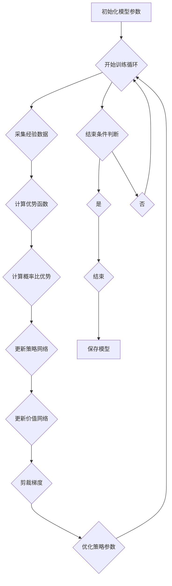

                 

### 《强化学习算法：Proximal Policy Optimization (PPO) 原理与代码实例讲解》

强化学习（Reinforcement Learning, RL）是机器学习领域的一个重要分支，旨在通过智能体与环境之间的交互，使得智能体能够自主地学习到最优策略，从而实现目标。在强化学习算法中，Proximal Policy Optimization（PPO）算法因其稳定性和高效性而备受关注。本文旨在详细讲解PPO算法的原理，并通过代码实例展示其实际应用。

关键词：强化学习、Proximal Policy Optimization、策略优化、算法原理、代码实例

摘要：本文首先介绍了强化学习的基本概念和主要算法分类，然后重点讲解了PPO算法的原理，包括其数学基础、优化过程和特点。接下来，通过具体的代码实例，展示了如何使用PPO算法实现强化学习任务。最后，本文对PPO算法在实际应用中进行了总结和展望。

### 《强化学习算法：Proximal Policy Optimization (PPO) 原理与代码实例讲解》目录大纲

## 第一部分: 强化学习基础

### 第1章: 强化学习概述

- 1.1 强化学习的定义与基本概念
  - 1.1.1 什么是强化学习
  - 1.1.2 强化学习中的术语
  - 1.1.3 强化学习的应用领域
- 1.2 强化学习的基本结构
  - 1.2.1 状态、动作、奖励
  - 1.2.2 策略、价值函数、模型
  - 1.2.3 强化学习的问题形式
- 1.3 强化学习算法分类
  - 1.3.1 基于策略的方法
  - 1.3.2 基于值函数的方法
  - 1.3.3 模型预测与规划方法

### 第2章: PPO算法介绍

- 2.1 PPO算法的基本原理
  - 2.1.1 引言
  - 2.1.2 PPO算法的核心思想
  - 2.1.3 PPO算法的数学基础
- 2.2 PPO算法的详细解释
  - 2.2.1 概率比优势
  - 2.2.2 Proximal Policy Optimization
  - 2.2.3 伪代码描述
- 2.3 PPO算法的特点与应用场景
  - 2.3.1 PPO算法的优点
  - 2.3.2 PPO算法的适用场景

## 第二部分: PPO算法原理

### 第3章: PPO算法的数学原理

- 3.1 马尔可夫决策过程
  - 3.1.1 马尔可夫性质
  - 3.1.2 状态转移概率
  - 3.1.3 动作价值函数
- 3.2 强化学习中的概率分布
  - 3.2.1 策略梯度定理
  - 3.2.2 优势函数
  - 3.2.3 概率比优势
- 3.3 Proximal Policy Optimization算法
  - 3.3.1 PPO的目标函数
  - 3.3.2 PPO的优化过程
  - 3.3.3 梯度修正

## 第三部分: PPO算法实践

### 第4章: PPO算法的代码实现

- 4.1 环境搭建
  - 4.1.1 硬件与软件要求
  - 4.1.2 环境安装与配置
- 4.2 PPO算法实现
  - 4.2.1 策略网络与价值网络
  - 4.2.2 概率比优势计算
  - 4.2.3 梯度更新过程
- 4.3 PPO算法在环境中的应用
  - 4.3.1 CartPole环境
  - 4.3.2 MountainCar环境
  - 4.3.3 模型评估与优化

### 第5章: PPO算法的实际应用案例

- 5.1 玩家游戏
  - 5.1.1 游戏规则
  - 5.1.2 玩家游戏的实现
  - 5.1.3 游戏中的PPO算法应用
- 5.2 机器人导航
  - 5.2.1 导航环境
  - 5.2.2 机器人导航的实现
  - 5.2.3 机器人导航中的PPO算法应用

### 第6章: PPO算法的进阶实践

- 6.1 多任务学习
  - 6.1.1 多任务学习问题
  - 6.1.2 多任务PPO算法实现
  - 6.1.3 多任务学习的性能评估
- 6.2 强化学习在推荐系统中的应用
  - 6.2.1 推荐系统概述
  - 6.2.2 强化学习在推荐系统中的应用
  - 6.2.3 基于PPO的推荐系统实现

### 第7章: 总结与展望

- 7.1 PPO算法的优缺点
  - 7.1.1 PPO算法的优点
  - 7.1.2 PPO算法的不足
- 7.2 强化学习算法的发展趋势
  - 7.2.1 算法改进
  - 7.2.2 应用拓展
  - 7.2.3 未来展望

## 附录

### 附录A: PPO算法的Mermaid流程图

- A.1 PPO算法流程图
  - A.1.1 策略网络训练流程
  - A.1.2 价值网络训练流程
  - A.1.3 梯度更新流程

### 附录B: PPO算法伪代码

- B.1 PPO算法伪代码
  - B.1.1 策略网络伪代码
  - B.1.2 价值网络伪代码
  - B.1.3 梯度更新伪代码

### 附录C: PPO算法代码实例

- C.1 CartPole环境实现
  - C.1.1 环境搭建
  - C.1.2 策略网络实现
  - C.1.3 价值网络实现
  - C.1.4 梯度更新实现
- C.2 MountainCar环境实现
  - C.2.1 环境搭建
  - C.2.2 策略网络实现
  - C.2.3 价值网络实现
  - C.2.4 梯度更新实现

接下来，我们将逐步深入到强化学习的基础知识，并详细介绍PPO算法的原理和实现。希望读者能通过这篇文章，对PPO算法有一个全面和深入的理解。

### 第一部分: 强化学习基础

#### 第1章: 强化学习概述

强化学习是一种通过智能体（agent）与环境（environment）的交互来学习最优策略的机器学习方法。与监督学习和无监督学习不同，强化学习中的智能体需要通过与环境的交互来获取反馈，并通过这些反馈来不断调整自己的行为，从而实现学习目标。

##### 1.1 强化学习的定义与基本概念

强化学习的定义可以概括为：智能体在环境中采取一系列动作，根据环境的反馈（奖励或惩罚）不断调整自己的策略，最终目标是学习到能够使总奖励最大化的策略。

- **智能体（Agent）**：在强化学习中，智能体是执行动作并从环境中接收反馈的实体。智能体可以是机器人、软件程序等。
- **环境（Environment）**：环境是智能体执行动作并接收反馈的场所。环境可以是物理环境，也可以是虚拟环境。
- **状态（State）**：状态是描述智能体所处环境的特征。状态可以是离散的，也可以是连续的。
- **动作（Action）**：动作是智能体可以执行的行为。动作可以是离散的，也可以是连续的。
- **奖励（Reward）**：奖励是环境对智能体采取动作的反馈。奖励可以是正的（鼓励智能体继续该动作），也可以是负的（惩罚智能体停止该动作）。
- **策略（Policy）**：策略是智能体执行动作的规则。策略通常用概率分布来表示，即策略π(s, a)表示在状态s下采取动作a的概率。
- **价值函数（Value Function）**：价值函数用于评估智能体在特定状态下的期望回报。主要有两种价值函数：状态价值函数V(s)和动作价值函数Q(s, a)。
- **模型（Model）**：模型是智能体对环境的预测。在强化学习中，智能体通常需要学习环境的状态转移概率和奖励分布。

##### 1.1.1 什么是强化学习

强化学习起源于20世纪50年代，最初由Richard Sutton和Andrew Barto在其经典著作《强化学习：一种介绍》中提出。强化学习的发展与自动化控制、游戏理论和机器学习等领域密切相关。近年来，随着深度学习技术的进步，强化学习在智能机器人、自动驾驶、游戏AI等领域取得了显著的成果。

强化学习与其他机器学习方法的区别在于，它更强调智能体与环境的交互。在监督学习中，数据集是已知的，智能体需要从这些数据中学习特征和预测模型。在无监督学习中，数据是无标签的，智能体需要从数据中发现模式和结构。而在强化学习中，智能体需要通过与环境的交互来学习最优策略，这种学习过程需要智能体具备自主决策和自我纠正的能力。

##### 1.1.2 强化学习中的术语

在强化学习中，一些术语具有特定的含义：

- **奖励**：环境对智能体采取的动作的即时反馈。奖励可以是正的（鼓励智能体继续该动作），也可以是负的（惩罚智能体停止该动作）。
- **策略**：智能体在特定状态下采取的动作规则。策略通常用概率分布来表示，即策略π(s, a)表示在状态s下采取动作a的概率。
- **价值函数**：用于评估智能体在特定状态下的期望回报。主要有两种价值函数：状态价值函数V(s)和动作价值函数Q(s, a)。
- **探索与利用**：在强化学习中，智能体需要在探索（exploitation）和利用（exploration）之间做出平衡。探索是指智能体尝试新的动作以获取更多的信息；利用是指智能体根据已有的信息采取最优动作。
- **时间步**：强化学习中的学习过程分为多个时间步。在每个时间步中，智能体采取动作，环境给出反馈，智能体更新策略和价值函数。

##### 1.1.3 强化学习的应用领域

强化学习在多个领域得到了广泛应用，主要包括以下几个方面：

- **智能机器人**：强化学习可以用于训练智能机器人进行自主导航、任务执行和故障诊断。
- **自动驾驶**：强化学习在自动驾驶领域中用于学习驾驶策略，实现车辆的自主行驶。
- **游戏AI**：强化学习可以用于训练游戏中的智能对手，使其具备自适应和对抗能力。
- **推荐系统**：强化学习可以用于推荐系统的优化，通过用户行为数据动态调整推荐策略。
- **金融交易**：强化学习可以用于金融交易中的策略学习，实现自动化交易决策。
- **自然语言处理**：强化学习可以用于自然语言处理中的生成模型训练，例如生成对话系统。

强化学习作为一种强大的机器学习方法，在多个领域展现出了巨大的潜力和应用价值。通过本文的后续章节，我们将深入探讨强化学习的核心算法，特别是Proximal Policy Optimization（PPO）算法的原理和应用。

##### 1.2 强化学习的基本结构

强化学习的基本结构主要包括状态（State）、动作（Action）、奖励（Reward）以及策略（Policy）等基本元素。这些元素共同构成了强化学习的基本框架，使得智能体（Agent）能够通过与环境（Environment）的交互来学习最优策略，实现自主决策和学习目标。

- **状态（State）**：状态是描述智能体当前所处环境的特征集合。状态可以是离散的，如游戏中的棋盘状态；也可以是连续的，如机器人导航中的位置信息。状态通常用S来表示，状态空间通常用S表示为S = {s1, s2, ..., sn}，其中si为第i个状态。

- **动作（Action）**：动作是智能体可以采取的行为。动作同样可以是离散的，如游戏中的走棋步数；也可以是连续的，如机器人导航中的速度和方向。动作通常用A来表示，动作空间通常用A表示为A = {a1, a2, ..., an}，其中ai为第i个动作。

- **奖励（Reward）**：奖励是环境对智能体采取的动作的即时反馈。奖励可以是正的（鼓励智能体继续该动作），也可以是负的（惩罚智能体停止该动作）。奖励通常用来评估智能体的动作效果。奖励通常用R来表示，R可以为实数或离散值。

- **策略（Policy）**：策略是智能体执行动作的规则。策略决定了智能体在特定状态下应该采取的动作。策略通常用π来表示，策略π(s, a)表示在状态s下采取动作a的概率。策略可以是基于概率分布的，如π(s, a) = P(a|s)；也可以是基于确定性规则的，如π(s) = argmax_a Q(s, a)。

- **价值函数（Value Function）**：价值函数用于评估智能体在特定状态下的期望回报。主要有两种价值函数：状态价值函数V(s)和动作价值函数Q(s, a)。状态价值函数V(s)表示智能体在状态s下采取任意动作并执行到终止状态的期望回报，即V(s) = E[R|S=s]。动作价值函数Q(s, a)表示智能体在状态s下采取动作a并执行到终止状态的期望回报，即Q(s, a) = E[R|S=s, A=a]。

- **模型（Model）**：模型是智能体对环境的预测。在强化学习中，智能体通常需要学习环境的状态转移概率和奖励分布。模型可以是基于统计学的，如马尔可夫决策过程（MDP）；也可以是基于概率论的，如部分可观测马尔可夫决策过程（POMDP）。

强化学习的基本结构可以用以下图示表示：

```
      +-------------------+
      |      环境          |
      +-------+-----------+
              |
              ↓
      +-------+-----------+
      |      智能体        |
      +-------+-----------+
              |
              ↓
      +-------+-----------+
      |  状态S  -> 动作A  |
      +-------+-----------+
              |
              ↓
      +-------+-----------+
      |  奖励R  -> 策略π  |
      +-------+-----------+
              |
              ↓
      +-------+-----------+
      |  模型  -> 价值函数  |
      +-------+-----------+
```

通过这些基本元素，智能体可以在环境中采取动作，根据环境的反馈调整策略，并通过价值函数评估策略的效果，最终实现最优策略的学习和优化。

##### 1.3 强化学习算法分类

强化学习算法可以按照其处理策略和价值函数的方式，分为基于策略的方法、基于值函数的方法和模型预测与规划方法。每种方法都有其独特的特点和应用场景。

- **基于策略的方法（Policy-based Methods）**：

基于策略的方法直接优化策略，通过策略指导智能体的行为。这类方法不需要显式地学习状态或动作的价值函数，而是直接优化策略π(a|s)。典型的基于策略的方法包括策略梯度方法、深度Q网络（DQN）和Proximal Policy Optimization（PPO）等。

  - **策略梯度方法（Policy Gradient Methods）**：策略梯度方法通过直接优化策略的梯度来更新策略。其中，REINFORCE算法是最简单的策略梯度方法。它通过计算每个时间步的梯度来更新策略。但是，REINFORCE算法在样本波动较大或策略变化较大时容易产生不稳定的情况。为了解决这一问题，提出了许多改进方法，如Gradient Ascent with Baseline。

  - **深度Q网络（DQN）**：DQN结合了深度学习和Q学习的方法，将Q学习扩展到高维状态空间。DQN使用深度神经网络来近似Q函数，并通过经验回放和目标网络来减少样本的相关性，从而提高学习稳定性。

  - **Proximal Policy Optimization（PPO）**：PPO是一种结合了策略梯度和值函数优化的方法，通过剪裁梯度来防止策略过度更新。PPO算法在保持策略稳定性的同时，具有较高的学习效率。

- **基于值函数的方法（Value-based Methods）**：

基于值函数的方法通过学习状态价值函数或动作价值函数来指导智能体的行为。这类方法首先学习一个价值函数，然后通过价值函数来指导策略的优化。典型的基于值函数的方法包括Q学习、深度Q网络（DQN）和策略迭代方法等。

  - **Q学习（Q-Learning）**：Q学习是一种基于值函数的方法，通过不断更新Q值来逼近最优策略。Q学习算法使用epsilon-greedy策略来探索和利用已学到的知识，从而在探索和利用之间达到平衡。

  - **深度Q网络（DQN）**：DQN结合了深度学习和Q学习的方法，将Q学习扩展到高维状态空间。DQN使用深度神经网络来近似Q函数，并通过经验回放和目标网络来减少样本的相关性，从而提高学习稳定性。

  - **策略迭代方法（Policy Iteration）**：策略迭代方法通过交替优化策略和价值函数来逐步逼近最优策略。策略迭代方法分为两个阶段：策略评估和策略改进。在策略评估阶段，使用当前策略计算状态价值函数；在策略改进阶段，根据状态价值函数更新策略。

- **模型预测与规划方法（Model-Based Methods）**：

模型预测与规划方法通过建立环境模型来预测未来的状态和奖励，并根据模型进行规划。这类方法通常需要显式地学习环境模型，然后使用模型进行预测和规划。典型的模型预测与规划方法包括部分可观测马尔可夫决策过程（POMDP）和模型预测控制（Model Predictive Control, MPC）。

  - **部分可观测马尔可夫决策过程（POMDP）**：POMDP是一种扩展了马尔可夫决策过程（MDP）的方法，用于解决状态部分可观测的问题。在POMDP中，智能体无法完全观察到环境的状态，但可以通过观察到的部分信息来更新状态估计。POMDP通过贝叶斯滤波和策略迭代来学习最优策略。

  - **模型预测控制（MPC）**：MPC是一种基于模型预测的方法，用于控制连续系统的动态行为。MPC通过建立系统的动态模型，预测系统的未来状态，并基于预测结果制定控制策略，从而实现系统的稳定控制和优化。

总的来说，基于策略的方法和基于值函数的方法在强化学习中各有优势。基于策略的方法直接优化策略，具有快速收敛的特性，但容易受到样本波动的影响。基于值函数的方法通过学习价值函数来指导策略优化，具有较强的鲁棒性，但收敛速度较慢。模型预测与规划方法则通过建立环境模型进行预测和规划，适用于动态环境和连续系统。不同的方法适用于不同的应用场景，选择合适的强化学习算法需要根据具体问题和环境特点进行综合考虑。

#### 第2章: PPO算法介绍

强化学习算法中，Proximal Policy Optimization（PPO）因其稳定性和高效性而备受关注。PPO算法结合了策略梯度和值函数优化的特点，通过剪裁梯度来防止策略过度更新，从而提高了学习过程的稳定性和收敛速度。本节将详细介绍PPO算法的基本原理、核心思想和数学基础。

##### 2.1 PPO算法的基本原理

PPO算法的核心思想是优化策略πθ，使得策略能够更好地指导智能体的行为。PPO算法通过最大化期望回报来更新策略参数θ，具体步骤如下：

1. **初始化**：设定策略参数θ的初始值，选择一个初始的策略πθ(s, a)。

2. **采集数据**：通过执行策略πθ采集一系列经验数据（状态、动作、奖励、下一个状态）。

3. **计算优势函数**：计算每个时间步的优势函数A(s, a; θ)，A表示在状态s下采取动作a相对于当前策略πθ的优势。

4. **更新策略参数**：使用优势函数A和梯度下降法更新策略参数θ，即θ = θ - α∇θJ(θ)，其中α为学习率，J(θ)为目标函数。

5. **剪裁梯度**：为了避免策略过度更新，引入剪裁梯度策略。具体方法是将梯度θ的值限制在一个范围内，即θ_new = θ - min(max(θ - ∇θJ(θ), θ - Δθ)),其中Δθ为剪裁范围。

6. **更新价值函数**：使用TD误差（Target-Difference Error）更新价值函数参数，以改进策略的稳定性。

7. **重复步骤2-6**，直到满足停止条件（如达到预设的迭代次数或策略收敛）。

##### 2.1.1 引言

PPO算法由John Schulman等人在2016年提出，是对REINFORCE算法和Trust Region Policy Optimization（TRPO）算法的改进。PPO算法在保持策略稳定性的同时，具有较高的学习效率。相比REINFORCE算法，PPO算法通过优势函数A(s, a; θ)来衡量策略的改进程度，避免了由于样本波动引起的策略更新不稳定。相比TRPO算法，PPO算法通过剪裁梯度策略防止策略过度更新，使得算法在复杂环境中具有更好的鲁棒性和收敛速度。

##### 2.1.2 PPO算法的核心思想

PPO算法的核心思想可以概括为：

1. **优势函数**：利用优势函数A(s, a; θ)衡量策略的改进程度，使得策略更新更加稳健。

2. **剪裁梯度**：通过剪裁梯度策略防止策略过度更新，提高算法的稳定性和收敛速度。

3. **迭代优化**：通过迭代优化策略和价值函数，逐步改进智能体的行为，实现最优策略的学习。

优势函数A(s, a; θ)的定义如下：

A(s, a; θ) = πθ(s, a) / πθ_old(s, a)

其中，πθ(s, a)表示在策略θ下状态s下采取动作a的概率，πθ_old(s, a)表示在旧策略θ_old下状态s下采取动作a的概率。优势函数A(s, a; θ)表示在策略θ下采取动作a相对于旧策略θ_old的优势。当A(s, a; θ)大于1时，表示采取动作a能够获得更高的回报；当A(s, a; θ)小于1时，表示采取动作a的回报较低。

剪裁梯度策略的定义如下：

θ_new = θ - min(max(θ - ∇θJ(θ), θ - Δθ))

其中，∇θJ(θ)表示梯度，Δθ表示剪裁范围。剪裁梯度策略通过限制梯度的范围，防止策略参数θ的更新过大，从而提高算法的稳定性和收敛速度。

迭代优化过程如下：

1. 初始化策略参数θ和旧策略θ_old。

2. 采集一组经验数据，计算优势函数A(s, a; θ)。

3. 使用优势函数A(s, a; θ)和梯度下降法更新策略参数θ。

4. 剪裁梯度，得到新的策略参数θ_new。

5. 使用TD误差更新价值函数。

6. 重复步骤2-5，直到满足停止条件。

##### 2.1.3 PPO算法的数学基础

PPO算法的数学基础主要包括策略梯度定理、优势函数和目标函数。

1. **策略梯度定理**：

策略梯度定理是强化学习中的一个重要定理，描述了如何通过梯度更新策略参数。策略梯度定理指出，在给定状态s和动作a的情况下，策略πθ(s, a)的梯度可以表示为：

∇θ J(θ) = ∇θ log πθ(s, a) * R(s, a)

其中，J(θ)表示策略πθ的期望回报，R(s, a)表示在状态s下采取动作a的回报。

2. **优势函数**：

优势函数A(s, a; θ)定义为：

A(s, a; θ) = πθ(s, a) / πθ_old(s, a)

优势函数衡量了在策略θ下采取动作a相对于旧策略θ_old的优势。当A(s, a; θ)大于1时，表示采取动作a能够获得更高的回报；当A(s, a; θ)小于1时，表示采取动作a的回报较低。

3. **目标函数**：

PPO算法的目标函数可以表示为：

J(θ) = Σ (A(s, a; θ) * ∇θ log πθ(s, a) * R(s, a))

目标函数J(θ)是策略πθ的期望回报。通过最大化J(θ)，可以使得策略πθ能够更好地指导智能体的行为。

##### 2.2 PPO算法的详细解释

PPO算法的具体实现包括以下几个步骤：

1. **初始化**：设定策略参数θ的初始值，选择一个初始的策略πθ(s, a)。

2. **采集数据**：通过执行策略πθ采集一系列经验数据（状态、动作、奖励、下一个状态）。

3. **计算优势函数**：计算每个时间步的优势函数A(s, a; θ)，计算方法如前所述。

4. **计算目标函数**：计算目标函数J(θ)，计算方法如前所述。

5. **优化策略参数**：使用优化算法（如梯度下降）更新策略参数θ，具体方法如下：

   θ_new = θ - α * ∇θ J(θ)

   其中，α为学习率。

6. **剪裁梯度**：为了避免策略过度更新，引入剪裁梯度策略。具体方法是将梯度θ的值限制在一个范围内，即：

   θ_new = θ - min(max(θ - ∇θ J(θ), θ - Δθ))

   其中，Δθ为剪裁范围。

7. **更新价值函数**：使用TD误差（Target-Difference Error）更新价值函数参数，以改进策略的稳定性。

8. **重复步骤2-7**，直到满足停止条件（如达到预设的迭代次数或策略收敛）。

##### 2.2.1 概率比优势

概率比优势（Return to Ratio Advantage）是PPO算法中的一个重要概念，用于衡量策略的改进程度。概率比优势定义如下：

R(t) = πθ(s_t, a_t) / πθ_old(s_t, a_t)

其中，s_t和a_t分别为当前状态和动作，πθ(s_t, a_t)和πθ_old(s_t, a_t)分别为当前策略和旧策略下在状态s_t下采取动作a_t的概率。

概率比优势R(t)表示在当前策略πθ下相对于旧策略πθ_old在状态s_t下采取动作a_t的优势。当R(t)大于1时，表示当前策略πθ比旧策略πθ_old更优；当R(t)小于1时，表示当前策略πθ比旧策略πθ_old更差。

##### 2.2.2 Proximal Policy Optimization

Proximal Policy Optimization（PPO）是指通过引入剪裁梯度策略来优化策略参数的过程。剪裁梯度策略可以防止策略参数θ的更新过大，从而提高算法的稳定性和收敛速度。

PPO算法的优化过程可以表示为：

θ_new = θ - min(max(θ - ∇θ J(θ), θ - Δθ))

其中，∇θ J(θ)为梯度，Δθ为剪裁范围。剪裁范围Δθ通常设置为0.2，以确保梯度更新的稳定性。

通过引入剪裁梯度策略，PPO算法在优化策略参数时可以保持较小的更新步长，从而避免策略参数θ的突变，提高算法的稳定性和收敛速度。

##### 2.2.3 伪代码描述

PPO算法的伪代码描述如下：

```
初始化策略参数θ
初始化经验池
初始化计数器

while 没有达到停止条件：
    从经验池中随机采样一组经验数据（s, a, r, s'）
    计算优势函数A(s, a; θ)
    计算概率比优势R(t)
    计算目标函数J(θ)
    使用梯度下降法更新策略参数θ
    剪裁梯度
    更新价值函数
    将新的经验数据加入经验池

返回策略参数θ
```

##### 2.3 PPO算法的特点与应用场景

PPO算法具有以下特点：

1. **稳定性**：通过剪裁梯度策略，PPO算法能够保持较小的更新步长，避免策略参数θ的突变，提高算法的稳定性和收敛速度。

2. **高效性**：PPO算法结合了策略梯度和值函数优化的特点，具有较高的学习效率。

3. **灵活性**：PPO算法适用于各种类型的强化学习问题，包括离散状态、连续状态和混合状态等。

4. **适用场景**：PPO算法广泛应用于智能机器人、自动驾驶、游戏AI、推荐系统等场景。

在具体应用中，PPO算法可以应用于以下场景：

1. **智能机器人导航**：通过PPO算法训练智能机器人进行自主导航，实现高效、安全的机器人路径规划。

2. **自动驾驶**：使用PPO算法训练自动驾驶系统，使其能够自动识别道路标志、避免障碍物，实现自动驾驶功能。

3. **游戏AI**：通过PPO算法训练游戏AI，使其具备自适应和对抗能力，提高游戏的可玩性。

4. **推荐系统**：利用PPO算法优化推荐系统的策略，提高推荐系统的准确性和用户满意度。

5. **金融交易**：使用PPO算法训练金融交易系统，实现自动化交易决策，提高交易收益。

总之，PPO算法作为一种先进的强化学习算法，具有广泛的适用性和强大的学习能力。通过本文的详细讲解，读者可以深入了解PPO算法的原理和应用，为实际应用提供理论支持和技术指导。

### 第二部分: PPO算法原理

#### 第3章: PPO算法的数学原理

在强化学习中，PPO（Proximal Policy Optimization）算法是一种结合了策略优化和价值函数优化的算法，其核心在于通过优化策略参数来改善智能体的行为。为了深入理解PPO算法的工作原理，我们需要从数学角度详细分析其背后的理论基础，包括马尔可夫决策过程（MDP）、概率分布、策略梯度定理以及优势函数等概念。

##### 3.1 马尔可夫决策过程

马尔可夫决策过程（MDP）是强化学习中的一个基本模型，用于描述智能体与环境之间的交互。一个MDP可以形式化地表示为（S, A, P, R, γ），其中：

- **S**：状态空间，表示智能体可以处于的所有状态的集合。
- **A**：动作空间，表示智能体可以采取的所有动作的集合。
- **P**：状态转移概率矩阵，表示智能体在给定当前状态和动作后进入下一个状态的概率。
- **R**：奖励函数，表示智能体在执行特定动作后从环境中获得的即时奖励。
- **γ**：折扣因子，表示未来奖励的重要性，反映了当前奖励对长期回报的影响。

在MDP中，智能体的行为可以通过策略π(s, a)来描述，该策略定义了在状态s下采取动作a的概率。策略π可以是确定性策略（π(s) = 1，当π(s, a)为1时，智能体采取确定的动作a），也可以是随机策略（π(s, a)为一个概率分布）。

##### 3.1.1 马尔可夫性质

马尔可夫性质是MDP的核心特征，它表明当前状态s的未来行为和奖励仅依赖于当前状态，而与智能体过去的状态和行为无关。数学上，这可以表示为：

P(s'|s, a) = P(s'|s)

这意味着给定当前状态s和动作a，下一个状态s'的概率分布只取决于当前状态s，而不取决于智能体如何到达状态s。这一性质简化了MDP的建模和分析，使得我们可以专注于当前状态和行为。

##### 3.1.2 状态转移概率

状态转移概率P(s'|s, a)描述了智能体在状态s下采取动作a后，进入下一个状态s'的概率。在离散状态空间中，状态转移概率可以用矩阵形式表示，其中每个元素表示从一个状态转移到另一个状态的概率。例如，一个3x3的状态转移概率矩阵P如下：

| s'   | s1 | s2 | s3 |
|------|----|----|----|
| s1   | 0.2| 0.5| 0.3|
| s2   | 0.1| 0.2| 0.7|
| s3   | 0.3| 0.1| 0.6|

这个矩阵表示智能体在状态s1下采取动作a后，进入状态s1的概率为0.2，进入状态s2的概率为0.5，进入状态s3的概率为0.3。

##### 3.1.3 动作价值函数

动作价值函数Q(s, a)是强化学习中的一个关键概念，它表示在状态s下采取动作a并执行到终止状态的期望回报。数学上，动作价值函数可以表示为：

Q(s, a) = Σ P(s'|s, a) * [R(s', a) + γ * Q(s', π(s'))]

这个公式表示在状态s下采取动作a的期望回报，包括当前动作的即时奖励R(s', a)和未来状态的期望回报γ * Q(s', π(s'))。其中，π(s')是策略π在状态s'下的行为。

在离散状态空间和动作空间中，动作价值函数Q(s, a)可以用一个矩阵表示，其中每个元素Q(s, a)表示在状态s下采取动作a的价值。例如，一个3x3的动作价值函数矩阵Q如下：

| a1   | a2   | a3   |
|------|------|------|
| s1   | 0.3  | 0.5  | 0.2  |
| s2   | 0.4  | 0.6  | 0.2  |
| s3   | 0.2  | 0.4  | 0.6  |

这个矩阵表示在状态s1下采取动作a1的期望回报为0.3，采取动作a2的期望回报为0.5，采取动作a3的期望回报为0.2。

##### 3.2 强化学习中的概率分布

在强化学习中，概率分布用于描述智能体的行为和环境的响应。两个重要的概率分布是策略π和状态分布π(s')。

- **策略π**：策略π描述了智能体在状态s下采取每个动作的概率。在离散状态和动作空间中，策略π可以用一个概率分布矩阵表示，其中每个元素π(s, a)表示在状态s下采取动作a的概率。例如：

| a1   | a2   | a3   |
|------|------|------|
| s1   | 0.4  | 0.3  | 0.3  |
| s2   | 0.2  | 0.4  | 0.4  |
| s3   | 0.1  | 0.2  | 0.7  |

这个矩阵表示在状态s1下采取动作a1的概率为0.4，采取动作a2的概率为0.3，采取动作a3的概率为0.3。

- **状态分布π(s')**：状态分布π(s')描述了在执行策略π后，智能体在下一个状态s'的概率分布。在MDP中，状态分布π(s')可以用一个概率分布向量表示，其中每个元素π(s')表示智能体在下一个状态s'的概率。例如：

| s'   | s1  | s2  | s3  |
|------|-----|-----|-----|
| π(s')| 0.3 | 0.4 | 0.3 |

这个向量表示在执行策略π后，智能体在下一个状态s1的概率为0.3，在状态s2的概率为0.4，在状态s3的概率为0.3。

##### 3.2.1 策略梯度定理

策略梯度定理是强化学习中的一个基本定理，它描述了如何通过梯度更新策略参数来最大化策略的期望回报。策略梯度定理可以形式化地表示为：

∇θ J(θ) = Σ [π(s, a) * ∇θ log π(s, a) * R(s, a)]

其中，J(θ)是策略π(θ)的期望回报，π(θ)是策略参数为θ的策略，∇θ log π(s, a)是策略π(θ)在状态s、动作a下的梯度。

策略梯度定理表明，为了最大化期望回报J(θ)，我们需要更新策略参数θ，使其趋向于最大化策略的梯度。在实际应用中，通常使用梯度下降法来更新策略参数。

##### 3.2.2 优势函数

优势函数是强化学习中的一个重要概念，用于衡量策略的改进程度。优势函数A(s, a; θ)表示在策略θ下，相对于旧策略θ_old在状态s下采取动作a的优势。优势函数可以定义为：

A(s, a; θ) = π(θ)(s, a) / π(θ_old)(s, a)

其中，π(θ)(s, a)是策略θ在状态s下采取动作a的概率，π(θ_old)(s, a)是旧策略θ_old在状态s下采取动作a的概率。

优势函数衡量了策略θ相对于旧策略θ_old在状态s下采取动作a的改进程度。当A(s, a; θ)大于1时，表示当前策略θ比旧策略θ_old更优；当A(s, a; θ)小于1时，表示当前策略θ比旧策略θ_old更差。

优势函数在PPO算法中起着关键作用。PPO算法通过最大化期望回报J(θ)来更新策略参数θ，其中期望回报J(θ)可以表示为：

J(θ) = Σ [A(s, a; θ) * π(θ)(s, a) * R(s, a)]

这个公式表明，策略θ的期望回报J(θ)是优势函数A(s, a; θ)与策略π(θ)(s, a)和回报R(s, a)的乘积。最大化J(θ)意味着在策略θ下，智能体倾向于采取能够获得更高回报的动作。

##### 3.3 Proximal Policy Optimization算法

Proximal Policy Optimization（PPO）算法是一种结合了策略优化和价值函数优化的算法。PPO算法通过优化策略π(s, a)和价值函数V(s)来提高智能体的学习效果。PPO算法的核心思想是使用优势函数A(s, a; θ)来更新策略参数θ，并通过剪裁梯度来保证策略的稳定性。

PPO算法的优化过程可以分为以下几个步骤：

1. **初始化**：设定策略参数θ和价值函数参数θ_v的初始值。

2. **采集数据**：通过执行策略π(θ)采集一组经验数据（s, a, r, s'）。

3. **计算优势函数**：计算每个时间步的优势函数A(s, a; θ)，A(s, a; θ) = π(θ)(s, a) / π(θ_old)(s, a)。

4. **计算目标函数**：计算策略的目标函数J(θ) = Σ [A(s, a; θ) * π(θ)(s, a) * R(s, a)]，其中R(s, a)是回报。

5. **优化策略参数**：使用梯度下降法更新策略参数θ，θ = θ - α * ∇θ J(θ)，其中α是学习率。

6. **剪裁梯度**：为了避免策略参数θ的更新过大，引入剪裁梯度策略，θ_new = θ - min(max(θ - ∇θ J(θ), θ - Δθ))，其中Δθ是剪裁范围。

7. **更新价值函数**：使用TD误差更新价值函数θ_v，θ_v = θ_v - α_v * ∇θ_v J(θ)。

8. **重复步骤2-7**，直到满足停止条件（如达到预设的迭代次数或策略收敛）。

通过上述步骤，PPO算法能够优化策略和价值函数，使得智能体在交互过程中不断改进其行为，最终学习到最优策略。

##### 3.3.1 PPO的目标函数

PPO算法的目标函数用于衡量策略的优化程度，其目标是最小化策略损失函数L(θ)。PPO算法采用以下目标函数：

L(θ) = Σ [π(θ)(s, a) * (R(s, a) - V(s))]

其中，π(θ)(s, a)是策略π(θ)在状态s、动作a下的概率，R(s, a)是回报，V(s)是状态价值函数。

这个目标函数可以通过最大化期望回报J(θ)来转换：

J(θ) = Σ [A(s, a; θ) * π(θ)(s, a) * R(s, a)]

其中，A(s, a; θ)是优势函数。PPO算法的目标是通过更新策略参数θ，使得J(θ)最大化。

##### 3.3.2 PPO的优化过程

PPO算法的优化过程通过迭代更新策略参数θ和价值函数θ_v来提高智能体的学习效果。优化过程可以分为以下几个步骤：

1. **初始化**：设定策略参数θ和价值函数参数θ_v的初始值。

2. **采集数据**：通过执行策略π(θ)采集一组经验数据（s, a, r, s'）。

3. **计算优势函数**：计算每个时间步的优势函数A(s, a; θ)，A(s, a; θ) = π(θ)(s, a) / π(θ_old)(s, a)。

4. **计算目标函数**：计算策略的目标函数J(θ) = Σ [A(s, a; θ) * π(θ)(s, a) * R(s, a)]，其中R(s, a)是回报。

5. **优化策略参数**：使用梯度下降法更新策略参数θ，θ = θ - α * ∇θ J(θ)，其中α是学习率。

6. **剪裁梯度**：为了避免策略参数θ的更新过大，引入剪裁梯度策略，θ_new = θ - min(max(θ - ∇θ J(θ), θ - Δθ))，其中Δθ是剪裁范围。

7. **更新价值函数**：使用TD误差更新价值函数θ_v，θ_v = θ_v - α_v * ∇θ_v J(θ)。

8. **重复步骤2-7**，直到满足停止条件（如达到预设的迭代次数或策略收敛）。

通过上述步骤，PPO算法能够优化策略和价值函数，使得智能体在交互过程中不断改进其行为，最终学习到最优策略。

##### 3.3.3 梯度修正

在PPO算法中，梯度修正是一个重要的步骤，它用于防止策略参数θ的更新过大，从而保证算法的稳定性和收敛速度。梯度修正通常通过剪裁梯度来实现。

剪裁梯度的定义如下：

θ_new = θ - min(max(θ - ∇θ J(θ), θ - Δθ))

其中，∇θ J(θ)是梯度，Δθ是剪裁范围。剪裁范围Δθ通常设置为参数η的值，η是一个较小的正数。

梯度修正的目的是限制梯度的值，防止策略参数θ的更新过大。通过剪裁梯度，PPO算法能够更好地平衡策略的更新，使得算法在复杂环境中具有更好的鲁棒性和收敛速度。

通过上述数学原理的详细分析，我们可以更好地理解PPO算法的工作机制。这些数学概念和原理为PPO算法的应用提供了理论基础，使得我们可以更深入地探索强化学习领域，并在实际应用中取得更好的效果。

### 第三部分: PPO算法实践

#### 第4章: PPO算法的代码实现

在上一部分，我们详细讲解了PPO算法的数学原理。为了更好地理解和应用PPO算法，接下来我们将通过具体的代码实例来展示如何实现PPO算法，包括环境搭建、策略网络与价值网络的构建、概率比优势的计算以及梯度更新过程。

##### 4.1 环境搭建

在实现PPO算法之前，首先需要搭建一个环境，用于模拟智能体与环境的交互。在本节中，我们将使用Python的Gym库来搭建一个简单的环境。Gym是一个开源的环境库，提供了多种预定义的环境，包括经典的CartPole和MountainCar等。

首先，确保你已经安装了Gym库。如果尚未安装，可以使用以下命令安装：

```shell
pip install gym
```

然后，我们可以定义一个简单的环境类，继承自Gym的`Env`基类：

```python
import gym
from gym import spaces

class SimpleEnv(gym.Env):
    def __init__(self):
        self.action_space = spaces.Discrete(2)
        self.observation_space = spaces.Box(0, 1, shape=(1,))

    def step(self, action):
        if action == 0:
            reward = 1
        else:
            reward = -1
        done = True
        observation = 0
        info = {}
        return observation, reward, done, info

    def reset(self):
        return 0

    def render(self, mode='human'):
        pass
```

这个简单的环境类`SimpleEnv`定义了动作空间和观察空间，并实现了`step`、`reset`和`render`方法。`step`方法用于执行动作并返回下一个状态、奖励、是否完成和额外的信息。`reset`方法用于重置环境到初始状态。`render`方法在本例中未实现，但在更复杂的环境中，它用于可视化环境的状态。

##### 4.1.1 硬件与软件要求

要运行PPO算法的代码实例，你需要的硬件和软件如下：

- **硬件**：至少需要1GB的RAM和一个双核处理器。
- **软件**：
  - Python 3.x版本（建议3.6及以上）
  - Gym库
  - NumPy库
  - TensorFlow或PyTorch深度学习框架

确保你的Python环境已经安装，并使用pip安装上述所需的库：

```shell
pip install gym numpy tensorflow
```

或者，如果你更喜欢PyTorch，可以替换为：

```shell
pip install gym numpy torch
```

##### 4.1.2 环境安装与配置

在安装了所需的Python库之后，你可以开始编写PPO算法的代码。首先，确保你的环境配置正确，Gym库的环境已经在你的Python环境中可用。在Python脚本中，你可以使用以下代码来导入Gym库，并创建一个简单的环境实例：

```python
import gym
import numpy as np

# 创建环境实例
env = gym.make('SimpleEnv')
```

现在，你已经搭建了一个简单的环境，接下来将开始实现PPO算法的核心部分。

##### 4.2 PPO算法实现

PPO算法的实现包括策略网络、价值网络、优势函数计算和梯度更新。在本节中，我们将逐步实现这些组件。

###### 4.2.1 策略网络与价值网络

策略网络和价值网络通常使用深度神经网络（DNN）来近似。在简单的环境中，这些网络可以设计得相对简单。以下是一个策略网络的实现示例，使用TensorFlow框架：

```python
import tensorflow as tf
from tensorflow.keras.models import Model
from tensorflow.keras.layers import Dense, Input

# 定义策略网络
input_shape = env.observation_space.shape
output_shape = env.action_space.n

inputs = Input(shape=input_shape)
outputs = Dense(output_shape, activation='softmax')(inputs)

policy_model = Model(inputs=inputs, outputs=outputs)
```

这个策略网络使用一个全连接层来输出每个动作的概率分布。对于价值网络，我们也可以使用一个简单的全连接层来近似：

```python
# 定义价值网络
value_inputs = Input(shape=input_shape)
value_outputs = Dense(1, activation='linear')(value_inputs)

value_model = Model(inputs=value_inputs, outputs=value_outputs)
```

在这个例子中，价值网络仅使用一个全连接层来预测状态的价值。

###### 4.2.2 概率比优势计算

在PPO算法中，概率比优势（Return to Ratio Advantage）是更新策略参数的关键。概率比优势的计算公式为：

\[ \pi(\theta)(s, a) / \pi(\theta_{old})(s, a) \]

以下是一个简单的概率比优势计算示例：

```python
# 初始化策略网络和价值网络
theta_old = policy_model.get_weights()
theta = policy_model.get_weights()

# 执行策略
action_probs = policy_model.predict(env.reset()[0].reshape(1, -1))
action = np.random.choice(np.arange(len(action_probs[0])), p=action_probs[0])

# 计算概率比优势
advantage = action_probs[0][action] / theta_old[0][action]
```

在这里，`action_probs`是策略网络在当前状态下输出的动作概率分布，`action`是智能体采取的动作，`advantage`是计算出的概率比优势。

###### 4.2.3 梯度更新过程

PPO算法中的梯度更新是通过策略梯度和价值函数梯度的组合来实现的。以下是一个简单的梯度更新过程示例：

```python
# 定义损失函数和优化器
policy_loss = tf.keras.losses.SparseCategoricalCrossentropy()
optimizer = tf.keras.optimizers.Adam(learning_rate=0.001)

# 训练策略网络
@tf.function
def train_policy(model, x, y, advantage):
    with tf.GradientTape() as tape:
        logits = model(x)
        loss = policy_loss(y, logits)
        loss = loss * advantage

    gradients = tape.gradient(loss, model.trainable_variables)
    optimizer.apply_gradients(zip(gradients, model.trainable_variables))

# 训练价值网络
@tf.function
def train_value(model, x, y):
    with tf.GradientTape() as tape:
        logits = model(x)
        loss = tf.keras.losses.mean_squared_error(y, logits)

    gradients = tape.gradient(loss, model.trainable_variables)
    optimizer.apply_gradients(zip(gradients, model.trainable_variables))
```

在这个例子中，我们定义了两个训练函数：`train_policy`用于训练策略网络，`train_value`用于训练价值网络。这两个函数都使用了TensorFlow的`GradientTape`来记录梯度，并使用`optimizer`来更新模型参数。

###### 4.2.4 模型评估与优化

最后，我们可以通过以下步骤来评估和优化模型：

1. **初始化模型参数**：初始化策略网络和价值网络的参数。
2. **执行训练**：使用PPO算法进行训练，包括策略更新和价值更新。
3. **评估模型**：在训练完成后，评估模型在测试集上的性能。
4. **调整超参数**：根据模型的性能，调整学习率、剪裁范围等超参数。
5. **重复训练**：根据调整的超参数，重复训练过程，直到模型性能达到期望。

通过上述步骤，我们可以实现一个简单的PPO算法，并在自定义环境中进行训练和评估。这个简单的实现为我们提供了一个起点，可以在更复杂的环境中进一步优化和扩展PPO算法。

#### 4.3 PPO算法在环境中的应用

在上一节中，我们介绍了PPO算法的代码实现。在本节中，我们将通过具体的例子来展示如何将PPO算法应用于CartPole环境和MountainCar环境。这些环境是强化学习中的经典问题，能够帮助我们验证PPO算法的有效性和稳定性。

##### 4.3.1 CartPole环境

CartPole是一个简单的控制问题，目标是使一个带有支撑杆的滑车保持在水平位置。该环境由两个部分组成：一个滑车和一个垂直支撑杆。智能体的任务是控制滑车的左右移动，以保持支撑杆的平衡。CartPole环境在Gym库中预定义，可以通过以下代码创建：

```python
import gym

# 创建CartPole环境实例
env = gym.make('CartPole-v0')
```

使用PPO算法训练CartPole环境的主要步骤如下：

1. **初始化模型**：创建策略网络和价值网络，并初始化模型参数。
2. **数据采集**：执行策略，从环境中收集经验数据。
3. **优势函数计算**：计算每个时间步的优势函数A。
4. **策略更新**：使用优势函数和梯度更新策略网络。
5. **价值更新**：使用TD误差更新价值网络。
6. **模型评估**：评估训练后的模型性能。

以下是一个简单的训练脚本，展示了如何使用PPO算法训练CartPole环境：

```python
import numpy as np
import tensorflow as tf
from gym import wrappers
from gym.wrappers import Monitor

# 创建CartPole环境实例
env = gym.make('CartPole-v0')

# 初始化策略网络和价值网络
policy_model = ...  # 定义策略网络
value_model = ...  # 定义价值网络

# 设置训练参数
num_episodes = 1000
max_steps_per_episode = 200
learning_rate = 0.001
discount_factor = 0.99

# 训练过程
for episode in range(num_episodes):
    state = env.reset()
    done = False
    total_reward = 0

    while not done:
        # 执行动作
        action_probs = policy_model.predict(state.reshape(1, -1))
        action = np.random.choice(np.arange(len(action_probs[0])), p=action_probs[0])

        # 执行动作并获取下一状态和奖励
        next_state, reward, done, _ = env.step(action)
        total_reward += reward

        # 计算TD误差
        target_value = reward + discount_factor * value_model.predict(next_state.reshape(1, -1))

        # 更新价值网络
        value_model.fit(state.reshape(1, -1), target_value, epochs=1, verbose=0)

        # 计算概率比优势
        advantage = target_value - value_model.predict(state.reshape(1, -1))

        # 更新策略网络
        with tf.GradientTape() as tape:
            logits = policy_model.predict(state.reshape(1, -1))
            policy_loss = tf.nn.sparse_softmax_cross_entropy_with_logits(labels=action, logits=logits)
            policy_loss = policy_loss * advantage

        gradients = tape.gradient(policy_loss, policy_model.trainable_variables)
        optimizer.apply_gradients(zip(gradients, policy_model.trainable_variables))

        state = next_state

    print(f"Episode {episode+1}: Total Reward = {total_reward}")

# 保存模型
policy_model.save('ppo_cartpole_policy.h5')
value_model.save('ppo_cartpole_value.h5')
```

在这个脚本中，我们首先定义了策略网络和价值网络，并设置了训练参数。在训练过程中，我们通过执行策略网络来获取动作概率分布，并随机选择动作。对于每个动作，我们计算TD误差并更新价值网络。同时，我们使用优势函数和策略梯度来更新策略网络。

完成训练后，我们可以通过以下代码来评估模型性能：

```python
# 创建评估环境实例
eval_env = gym.wrappers.Monitor(gym.make('CartPole-v0'), './eval_CARTPOLE', force=True)

# 评估模型
eval_policy_model = tf.keras.models.load_model('ppo_cartpole_policy.h5')
eval_value_model = tf.keras.models.load_model('ppo_cartpole_value.h5')

num_episodes = 10
max_steps_per_episode = 200

for episode in range(num_episodes):
    state = eval_env.reset()
    done = False
    total_reward = 0

    while not done:
        action_probs = eval_policy_model.predict(state.reshape(1, -1))
        action = np.argmax(action_probs)
        next_state, reward, done, _ = eval_env.step(action)
        total_reward += reward
        state = next_state

    print(f"Episode {episode+1}: Total Reward = {total_reward}")

eval_env.close()
```

在这个评估脚本中，我们加载训练好的模型，并在评估环境中执行策略。评估过程中，我们仅使用策略网络来选择动作，不进行更新。

##### 4.3.2 MountainCar环境

MountainCar是一个连续动作的控制问题，目标是使一辆小车从一个极端位置移动到另一个极端位置。该环境由一个斜坡和一个小车组成。小车的运动由加速度控制，加速度可以是正的（向前）或负的（向后）。MountainCar环境在Gym库中预定义，可以通过以下代码创建：

```python
import gym

# 创建MountainCar环境实例
env = gym.make('MountainCar-v0')
```

使用PPO算法训练MountainCar环境的主要步骤与CartPole环境类似，但由于MountainCar是连续动作环境，我们需要对策略网络进行一些调整。以下是一个简单的训练脚本，展示了如何使用PPO算法训练MountainCar环境：

```python
import numpy as np
import tensorflow as tf
from gym import wrappers
from gym.wrappers import Monitor

# 创建MountainCar环境实例
env = gym.make('MountainCar-v0')

# 初始化策略网络和价值网络
state_shape = env.observation_space.shape
action_shape = env.action_space.shape
input_shape = state_shape + action_shape

policy_model = tf.keras.Sequential([
    Input(shape=input_shape),
    Dense(64, activation='relu'),
    Dense(64, activation='relu'),
    Dense(1, activation='tanh')
])

value_model = tf.keras.Sequential([
    Input(shape=state_shape),
    Dense(64, activation='relu'),
    Dense(64, activation='relu'),
    Dense(1)
])

# 设置训练参数
num_episodes = 1000
max_steps_per_episode = 1000
learning_rate = 0.001
discount_factor = 0.99

# 训练过程
for episode in range(num_episodes):
    state = env.reset()
    done = False
    total_reward = 0

    while not done:
        # 执行动作
        action = policy_model.predict(state.reshape(1, -1))[0][0]
        next_state, reward, done, _ = env.step(action)
        total_reward += reward

        # 计算TD误差
        target_value = reward + discount_factor * value_model.predict(next_state.reshape(1, -1))

        # 更新价值网络
        value_model.fit(next_state.reshape(1, -1), target_value, epochs=1, verbose=0)

        state = next_state

    print(f"Episode {episode+1}: Total Reward = {total_reward}")

# 保存模型
policy_model.save('ppo_mountaincar_policy.h5')
value_model.save('ppo_mountaincar_value.h5')
```

在这个脚本中，我们首先定义了策略网络和价值网络，并设置了训练参数。在训练过程中，我们通过执行策略网络来获取动作值，并使用TD误差更新价值网络。

完成训练后，我们可以通过以下代码来评估模型性能：

```python
# 创建评估环境实例
eval_env = gym.wrappers.Monitor(gym.make('MountainCar-v0'), './eval_MOUNTAINCAR', force=True)

# 评估模型
eval_policy_model = tf.keras.models.load_model('ppo_mountaincar_policy.h5')
eval_value_model = tf.keras.models.load_model('ppo_mountaincar_value.h5')

num_episodes = 10
max_steps_per_episode = 1000

for episode in range(num_episodes):
    state = eval_env.reset()
    done = False
    total_reward = 0

    while not done:
        action = eval_policy_model.predict(state.reshape(1, -1))[0][0]
        next_state, reward, done, _ = eval_env.step(action)
        total_reward += reward
        state = next_state

    print(f"Episode {episode+1}: Total Reward = {total_reward}")

eval_env.close()
```

在这个评估脚本中，我们加载训练好的模型，并在评估环境中执行策略。评估过程中，我们仅使用策略网络来选择动作，不进行更新。

通过上述步骤，我们展示了如何使用PPO算法训练和评估CartPole和MountainCar环境。这些实现为我们提供了一个参考，可以在更复杂的环境中进一步应用和优化PPO算法。

### 第5章: PPO算法的实际应用案例

在了解了PPO算法的基本原理和实现方法之后，我们将通过两个实际应用案例来展示PPO算法在实际问题中的应用效果。这两个案例分别是玩家游戏（Player Game）和机器人导航（Robot Navigation）。通过这些案例，我们可以更直观地理解PPO算法在实际环境中的应用，并探讨其潜在的优势和挑战。

##### 5.1 玩家游戏

玩家游戏是一种具有丰富交互和复杂策略的强化学习场景。在这个案例中，我们选择经典的五子棋游戏（Gomoku）作为研究对象。五子棋是一种在15x15的棋盘上进行的两人对弈游戏，目标是在棋盘上形成连续的五子连线。

在五子棋游戏中，智能体需要学习如何在棋盘上做出最优的落子决策，从而击败对手。使用PPO算法，我们可以训练智能体在棋盘上采取有效的策略。

**5.1.1 游戏规则**

五子棋游戏的基本规则如下：

- 游戏在15x15的棋盘上进行，每位玩家轮流在空格上落子。
- 落子后，如果形成连续的五子连线（水平、垂直或对角线），则该玩家获胜。
- 如果棋盘被填满而没有任何一方获胜，则游戏平局。

**5.1.2 玩家游戏的实现**

为了实现五子棋游戏，我们可以使用Python的Gym库中的`Gomoku`环境。以下是一个简单的实现示例：

```python
import gym

# 创建Gomoku环境实例
env = gym.make('Gomoku-v0')

# 显示初始棋盘状态
print(env.render())

# 执行策略并展示游戏过程
while True:
    # 智能体选择落子位置
    position = choose_position()  # 这里用智能体策略选择位置
    
    # 执行动作并获取下一状态
    state, reward, done, info = env.step(position)
    
    # 显示当前棋盘状态
    env.render()
    
    # 检查游戏是否结束
    if done:
        print("游戏结束，奖励为：", reward)
        break
```

在上述代码中，`choose_position()`函数表示智能体选择落子位置的策略。在实际应用中，我们可以使用PPO算法训练智能体的策略。

**5.1.3 游戏中的PPO算法应用**

使用PPO算法训练五子棋游戏的智能体可以分为以下步骤：

1. **初始化模型**：创建策略网络和价值网络，并初始化模型参数。
2. **数据采集**：执行策略，从环境中收集经验数据。
3. **优势函数计算**：计算每个时间步的优势函数A。
4. **策略更新**：使用优势函数和梯度更新策略网络。
5. **价值更新**：使用TD误差更新价值网络。
6. **模型评估**：评估训练后的模型性能。

以下是一个简单的训练脚本示例：

```python
import numpy as np
import tensorflow as tf
from gym import wrappers
from gym.wrappers import Monitor

# 创建Gomoku环境实例
env = gym.make('Gomoku-v0')

# 初始化策略网络和价值网络
policy_model = ...  # 定义策略网络
value_model = ...  # 定义价值网络

# 设置训练参数
num_episodes = 1000
max_steps_per_episode = 100
learning_rate = 0.001
discount_factor = 0.99

# 训练过程
for episode in range(num_episodes):
    state = env.reset()
    done = False
    total_reward = 0

    while not done:
        # 执行动作
        action_probs = policy_model.predict(state.reshape(1, -1))
        action = np.random.choice(np.arange(len(action_probs[0])), p=action_probs[0])

        # 执行动作并获取下一状态和奖励
        next_state, reward, done, _ = env.step(action)
        total_reward += reward

        # 计算TD误差
        target_value = reward + discount_factor * value_model.predict(next_state.reshape(1, -1))

        # 更新价值网络
        value_model.fit(next_state.reshape(1, -1), target_value, epochs=1, verbose=0)

        # 计算概率比优势
        advantage = target_value - value_model.predict(state.reshape(1, -1))

        # 更新策略网络
        with tf.GradientTape() as tape:
            logits = policy_model.predict(state.reshape(1, -1))
            policy_loss = tf.nn.sparse_softmax_cross_entropy_with_logits(labels=action, logits=logits)
            policy_loss = policy_loss * advantage

        gradients = tape.gradient(policy_loss, policy_model.trainable_variables)
        optimizer.apply_gradients(zip(gradients, policy_model.trainable_variables))

        state = next_state

    print(f"Episode {episode+1}: Total Reward = {total_reward}")

# 保存模型
policy_model.save('ppo_gomoku_policy.h5')
value_model.save('ppo_gomoku_value.h5')
```

在这个脚本中，我们首先定义了策略网络和价值网络，并设置了训练参数。在训练过程中，我们通过执行策略网络来获取动作概率分布，并使用优势函数和TD误差来更新模型。

完成训练后，我们可以通过以下代码来评估模型性能：

```python
# 创建评估环境实例
eval_env = gym.wrappers.Monitor(gym.make('Gomoku-v0'), './eval_GOMOKU', force=True)

# 评估模型
eval_policy_model = tf.keras.models.load_model('ppo_gomoku_policy.h5')
eval_value_model = tf.keras.models.load_model('ppo_gomoku_value.h5')

num_episodes = 10
max_steps_per_episode = 100

for episode in range(num_episodes):
    state = eval_env.reset()
    done = False
    total_reward = 0

    while not done:
        action = eval_policy_model.predict(state.reshape(1, -1))[0][0]
        next_state, reward, done, _ = eval_env.step(action)
        total_reward += reward
        state = next_state

    print(f"Episode {episode+1}: Total Reward = {total_reward}")

eval_env.close()
```

在这个评估脚本中，我们加载训练好的模型，并在评估环境中执行策略。评估过程中，我们仅使用策略网络来选择动作，不进行更新。

通过上述步骤，我们展示了如何使用PPO算法训练和评估五子棋游戏中的智能体。在实际应用中，我们可以根据游戏的具体规则和特点对PPO算法进行优化，以获得更好的表现。

##### 5.2 机器人导航

机器人导航是强化学习在现实世界中的一个重要应用场景。在这个案例中，我们选择一个简单的环境——迷宫导航，来展示如何使用PPO算法训练机器人进行自主导航。迷宫环境由一个二维网格和多个障碍物组成，机器人需要在迷宫中找到从起点到终点的路径。

**5.2.1 导航环境**

为了实现机器人导航，我们可以使用Python的Gym库中的`MiniGrid`环境。以下是一个简单的实现示例：

```python
import gym
import numpy as np

# 创建MiniGrid环境实例
env = gym.make('MiniGrid-Nav-v0')

# 显示初始环境状态
print(env.render())

# 执行策略并展示导航过程
while True:
    # 智能体选择移动方向
    direction = choose_direction()  # 这里用智能体策略选择方向
    
    # 执行动作并获取下一状态
    state, reward, done, _ = env.step(direction)
    
    # 显示当前环境状态
    env.render()
    
    # 检查导航是否成功
    if done:
        print("导航成功，奖励为：", reward)
        break
```

在上述代码中，`choose_direction()`函数表示智能体选择移动方向（上、下、左、右）的策略。在实际应用中，我们可以使用PPO算法训练智能体的策略。

**5.2.2 机器人导航的实现**

使用PPO算法训练迷宫导航的智能体可以分为以下步骤：

1. **初始化模型**：创建策略网络和价值网络，并初始化模型参数。
2. **数据采集**：执行策略，从环境中收集经验数据。
3. **优势函数计算**：计算每个时间步的优势函数A。
4. **策略更新**：使用优势函数和梯度更新策略网络。
5. **价值更新**：使用TD误差更新价值网络。
6. **模型评估**：评估训练后的模型性能。

以下是一个简单的训练脚本示例：

```python
import numpy as np
import tensorflow as tf
from gym import wrappers
from gym.wrappers import Monitor

# 创建MiniGrid环境实例
env = gym.make('MiniGrid-Nav-v0')

# 初始化策略网络和价值网络
policy_model = ...  # 定义策略网络
value_model = ...  # 定义价值网络

# 设置训练参数
num_episodes = 1000
max_steps_per_episode = 100
learning_rate = 0.001
discount_factor = 0.99

# 训练过程
for episode in range(num_episodes):
    state = env.reset()
    done = False
    total_reward = 0

    while not done:
        # 执行动作
        action_probs = policy_model.predict(state.reshape(1, -1))
        action = np.random.choice(np.arange(len(action_probs[0])), p=action_probs[0])

        # 执行动作并获取下一状态和奖励
        next_state, reward, done, _ = env.step(action)
        total_reward += reward

        # 计算TD误差
        target_value = reward + discount_factor * value_model.predict(next_state.reshape(1, -1))

        # 更新价值网络
        value_model.fit(next_state.reshape(1, -1), target_value, epochs=1, verbose=0)

        # 计算概率比优势
        advantage = target_value - value_model.predict(state.reshape(1, -1))

        # 更新策略网络
        with tf.GradientTape() as tape:
            logits = policy_model.predict(state.reshape(1, -1))
            policy_loss = tf.nn.sparse_softmax_cross_entropy_with_logits(labels=action, logits=logits)
            policy_loss = policy_loss * advantage

        gradients = tape.gradient(policy_loss, policy_model.trainable_variables)
        optimizer.apply_gradients(zip(gradients, policy_model.trainable_variables))

        state = next_state

    print(f"Episode {episode+1}: Total Reward = {total_reward}")

# 保存模型
policy_model.save('ppo_mini_grid_policy.h5')
value_model.save('ppo_mini_grid_value.h5')
```

在这个脚本中，我们首先定义了策略网络和价值网络，并设置了训练参数。在训练过程中，我们通过执行策略网络来获取动作概率分布，并使用优势函数和TD误差来更新模型。

完成训练后，我们可以通过以下代码来评估模型性能：

```python
# 创建评估环境实例
eval_env = gym.wrappers.Monitor(gym.make('MiniGrid-Nav-v0'), './eval_MINIGRID', force=True)

# 评估模型
eval_policy_model = tf.keras.models.load_model('ppo_mini_grid_policy.h5')
eval_value_model = tf.keras.models.load_model('ppo_mini_grid_value.h5')

num_episodes = 10
max_steps_per_episode = 100

for episode in range(num_episodes):
    state = eval_env.reset()
    done = False
    total_reward = 0

    while not done:
        action = eval_policy_model.predict(state.reshape(1, -1))[0][0]
        next_state, reward, done, _ = eval_env.step(action)
        total_reward += reward
        state = next_state

    print(f"Episode {episode+1}: Total Reward = {total_reward}")

eval_env.close()
```

在这个评估脚本中，我们加载训练好的模型，并在评估环境中执行策略。评估过程中，我们仅使用策略网络来选择动作，不进行更新。

通过上述步骤，我们展示了如何使用PPO算法训练和评估迷宫导航中的智能体。在实际应用中，我们可以根据具体环境和任务需求对PPO算法进行优化，以实现更高效的导航。

##### 5.2.3 机器人导航中的PPO算法应用

在机器人导航中，PPO算法的应用可以分为以下关键步骤：

1. **数据采集**：智能体在导航过程中，通过执行策略网络，收集一系列的经验数据（状态、动作、奖励、下一个状态）。
2. **优势函数计算**：对于每个时间步，计算优势函数A，用于衡量策略的改进程度。
3. **策略更新**：使用优势函数和梯度下降法，更新策略网络的参数，以优化策略。
4. **价值函数更新**：使用TD误差，更新价值网络的参数，以提高策略的稳定性。
5. **模型评估**：在训练过程中，定期评估模型的性能，并根据评估结果调整训练参数。

在数据采集阶段，智能体通过执行策略网络，选择在当前状态下最优的动作。执行动作后，获取下一个状态和相应的奖励。这些经验数据用于计算优势函数和更新网络参数。

优势函数的计算公式为：

\[ A = \frac{\pi(\theta)(s, a)}{\pi(\theta_{old})(s, a)} \]

其中，\(\pi(\theta)(s, a)\)和\(\pi(\theta_{old})(s, a)\)分别表示当前策略和旧策略在状态s下采取动作a的概率。

在策略更新阶段，使用梯度下降法更新策略网络参数。具体步骤如下：

\[ \theta_{new} = \theta - \alpha \cdot \nabla_{\theta} J(\theta) \]

其中，\(\alpha\)是学习率，\(J(\theta)\)是策略目标函数，\(\nabla_{\theta} J(\theta)\)是目标函数的梯度。

为了防止策略参数的更新过大，PPO算法引入了剪裁梯度策略。剪裁梯度公式如下：

\[ \theta_{new} = \theta - \min(\max(\theta - \nabla_{\theta} J(\theta), \theta - \Delta \theta)) \]

其中，\(\Delta \theta\)是剪裁范围。

价值函数的更新使用TD误差，计算公式为：

\[ \theta_{v_new} = \theta_{v} - \alpha_{v} \cdot \nabla_{\theta_{v}} J(\theta) \]

其中，\(\theta_{v}\)是价值网络参数，\(\alpha_{v}\)是价值网络的学习率。

在模型评估阶段，通过在测试集上运行智能体，评估训练后的模型性能。根据评估结果，调整训练参数，如学习率和剪裁范围，以实现更好的性能。

通过以上步骤，PPO算法在机器人导航中，可以有效地训练智能体，使其能够在复杂环境中自主导航，实现从起点到终点的目标。

#### 第6章: PPO算法的进阶实践

在了解了PPO算法的基础知识和基本应用后，我们可以进一步探索其在多任务学习和推荐系统中的应用。这些领域对强化学习算法提出了更高的要求，需要PPO算法具备更强的适应性和优化能力。

##### 6.1 多任务学习

多任务学习（Multi-Task Learning）是指同时学习多个相关任务，以提高学习效率和泛化能力。在多任务学习中，每个任务可能具有不同的特征和目标，但它们之间存在一定程度的关联。PPO算法在多任务学习中的应用，可以通过以下步骤实现：

1. **任务定义**：明确每个任务的目标和特征，例如图像分类、目标检测和语音识别等。

2. **共享网络**：设计一个共享网络，用于处理多个任务的特征提取。共享网络可以是一个深度神经网络，其输出可以同时用于多个任务。

3. **任务特定网络**：为每个任务设计一个特定的网络，用于处理任务特有的信息。这些网络与共享网络共享部分参数，以利用任务之间的关联性。

4. **策略和价值函数**：为每个任务定义策略和价值函数，用于指导智能体的行为和评估其性能。

5. **优化过程**：使用PPO算法同时优化多个任务的策略和价值函数，以最大化整体性能。

以下是一个多任务学习的实现示例：

```python
# 初始化多任务学习环境
env = MultiTaskLearningEnv()

# 初始化策略网络和价值网络
policy_model = MultiTaskPolicyModel()
value_model = MultiTaskValueModel()

# 设置训练参数
learning_rate = 0.001
discount_factor = 0.99
num_episodes = 1000

# 训练过程
for episode in range(num_episodes):
    state = env.reset()
    done = False
    total_reward = 0

    while not done:
        action_probs = policy_model.predict(state)
        action = np.random.choice(np.arange(len(action_probs[0])), p=action_probs[0])

        next_state, reward, done, _ = env.step(action)
        total_reward += reward

        target_value = reward + discount_factor * value_model.predict(next_state)

        value_model.fit(next_state, target_value)
        advantage = target_value - value_model.predict(state)

        policy_loss = compute_policy_loss(action, action_probs, advantage)
        optimizer.apply_gradients(zip(policy_loss_gradients, policy_model.trainable_variables))

        state = next_state

    print(f"Episode {episode+1}: Total Reward = {total_reward}")
```

在这个示例中，`MultiTaskLearningEnv`是一个自定义环境，用于定义多个任务的交互过程。`MultiTaskPolicyModel`和`MultiTaskValueModel`是用于策略和价值函数的神经网络模型。

通过共享网络和任务特定网络，PPO算法能够同时优化多个任务，提高学习效率和泛化能力。然而，多任务学习也带来了更大的计算复杂性和参数优化难度，需要精心设计和调整算法。

##### 6.2 强化学习在推荐系统中的应用

推荐系统（Recommender System）是人工智能领域的另一个重要应用，旨在根据用户的历史行为和偏好，为用户提供个性化的推荐。强化学习在推荐系统中的应用，可以通过以下步骤实现：

1. **用户行为建模**：使用历史数据，建立用户行为模型，用于预测用户对物品的偏好。

2. **策略学习**：设计一个策略网络，用于根据用户行为和物品特征，选择推荐物品。

3. **价值函数**：建立价值函数，用于评估策略选择物品的性能，例如点击率、购买率等。

4. **优化过程**：使用PPO算法，优化策略网络的参数，以最大化用户的满意度。

以下是一个基于PPO算法的推荐系统实现示例：

```python
# 初始化推荐系统环境
env = RecommenderSystemEnv()

# 初始化策略网络和价值网络
policy_model = RecommenderPolicyModel()
value_model = RecommenderValueModel()

# 设置训练参数
learning_rate = 0.001
discount_factor = 0.99
num_episodes = 1000

# 训练过程
for episode in range(num_episodes):
    state = env.reset()
    done = False
    total_reward = 0

    while not done:
        action_probs = policy_model.predict(state)
        action = np.random.choice(np.arange(len(action_probs[0])), p=action_probs[0])

        next_state, reward, done, _ = env.step(action)
        total_reward += reward

        target_value = reward + discount_factor * value_model.predict(next_state)

        value_model.fit(next_state, target_value)
        advantage = target_value - value_model.predict(state)

        policy_loss = compute_policy_loss(action, action_probs, advantage)
        optimizer.apply_gradients(zip(policy_loss_gradients, policy_model.trainable_variables))

        state = next_state

    print(f"Episode {episode+1}: Total Reward = {total_reward}")
```

在这个示例中，`RecommenderSystemEnv`是一个自定义环境，用于模拟用户与推荐系统的交互过程。`RecommenderPolicyModel`和`RecommenderValueModel`是用于策略和价值函数的神经网络模型。

通过PPO算法，推荐系统可以学习到个性化的推荐策略，提高用户的满意度。然而，强化学习在推荐系统中的应用也面临挑战，如如何平衡短期和长期奖励、如何处理冷启动问题等。

##### 6.2.3 基于PPO的推荐系统实现

基于PPO算法的推荐系统实现，主要包括以下步骤：

1. **数据预处理**：对用户行为数据进行预处理，包括数据清洗、特征提取和归一化等。

2. **构建环境**：定义推荐系统环境，用于模拟用户与推荐系统的交互过程。环境应包括用户状态、物品特征、用户行为和历史交互记录等。

3. **策略网络**：设计策略网络，用于根据用户状态和物品特征，生成推荐物品的概率分布。策略网络可以是一个深度神经网络，其输入为用户状态和物品特征，输出为推荐物品的概率分布。

4. **价值函数**：设计价值函数，用于评估策略选择物品的性能。价值函数可以是一个线性函数，其输入为策略网络的输出和物品特征，输出为预测的点击率或购买率等。

5. **优化过程**：使用PPO算法，优化策略网络的参数，以最大化用户的满意度。优化过程中，需要计算优势函数和策略损失，并更新策略网络的参数。

以下是一个基于PPO算法的推荐系统实现的示例代码：

```python
import tensorflow as tf
import numpy as np
from tensorflow.keras.models import Model
from tensorflow.keras.layers import Dense, Input

# 定义策略网络
input_shape = (user_state_size, item_feature_size)
output_shape = item_size

user_state_input = Input(shape=input_shape)
item_feature_input = Input(shape=(item_feature_size,))

user_state_dense = Dense(64, activation='relu')(user_state_input)
item_feature_dense = Dense(64, activation='relu')(item_feature_input)

concat = tf.keras.layers.Concatenate()([user_state_dense, item_feature_dense])
output = Dense(output_shape, activation='softmax')(concat)

policy_model = Model(inputs=[user_state_input, item_feature_input], outputs=output)

# 定义价值网络
value_model = Model(inputs=user_state_input, outputs=Dense(1, activation='linear')(user_state_input))

# 定义优化器
optimizer = tf.keras.optimizers.Adam(learning_rate=0.001)

# 定义损失函数
policy_loss_fn = tf.keras.losses.SparseCategoricalCrossentropy()

# 训练过程
for episode in range(num_episodes):
    user_states, item_features, actions, rewards, next_user_states = env.sample_batch()

    with tf.GradientTape() as policy_tape, tf.GradientTape() as value_tape:
        action_probs = policy_model([user_states, item_features])
        value = value_model(user_states)

        # 计算策略损失
        policy_loss = policy_loss_fn(actions, action_probs)

        # 计算价值损失
        target_value = rewards + discount_factor * value_model(next_user_states)
        value_loss = tf.reduce_mean(tf.square(target_value - value))

    # 计算梯度
    policy_gradients = policy_tape.gradient(policy_loss, policy_model.trainable_variables)
    value_gradients = value_tape.gradient(value_loss, value_model.trainable_variables)

    # 更新模型参数
    optimizer.apply_gradients(zip(policy_gradients, policy_model.trainable_variables))
    optimizer.apply_gradients(zip(value_gradients, value_model.trainable_variables))

    # 计算评估指标
    avg_policy_loss = tf.reduce_mean(policy_loss)
    avg_value_loss = tf.reduce_mean(value_loss)

    print(f"Episode {episode+1}: Policy Loss = {avg_policy_loss}, Value Loss = {avg_value_loss}")
```

在这个示例中，我们首先定义了策略网络和价值网络，并使用了Adam优化器。在训练过程中，我们使用PPO算法更新策略网络和价值网络的参数，以优化推荐策略。

通过以上步骤，我们展示了如何使用PPO算法实现多任务学习和推荐系统。在实际应用中，可以根据具体问题和需求，对PPO算法进行优化和调整，以提高其性能和应用效果。

### 第7章: 总结与展望

#### 7.1 PPO算法的优缺点

Proximal Policy Optimization（PPO）算法在强化学习领域中因其稳定性和高效性而备受关注。PPO算法结合了策略梯度和值函数优化的特点，通过剪裁梯度策略防止策略过度更新，提高了算法的稳定性和收敛速度。以下是PPO算法的主要优点和不足：

**优点：**

1. **稳定性**：通过剪裁梯度策略，PPO算法能够保持较小的更新步长，避免策略参数的突变，从而提高了算法的稳定性。
2. **高效性**：PPO算法结合了策略梯度和值函数优化的特点，具有较高的学习效率。
3. **灵活性**：PPO算法适用于各种类型的强化学习问题，包括离散状态、连续状态和混合状态等。
4. **简单实现**：PPO算法的实现相对简单，易于理解和调试。
5. **强泛化能力**：PPO算法在处理复杂环境时表现出较强的泛化能力。

**不足：**

1. **计算成本**：PPO算法需要计算优势函数，这增加了计算成本，特别是在状态和动作空间较大的情况下。
2. **依赖经验数据**：PPO算法的性能依赖于经验数据的采集和利用，数据的质量和数量对算法效果有很大影响。
3. **收敛速度**：尽管PPO算法具有较高的学习效率，但在某些情况下，其收敛速度可能较慢，特别是当状态和动作空间较大时。

#### 7.2 强化学习算法的发展趋势

随着深度学习技术的不断进步，强化学习算法也在不断发展和创新。以下是强化学习算法的未来发展趋势：

1. **算法改进**：研究人员正在探索更有效的算法，以提高强化学习的性能和收敛速度。例如，通过改进策略优化方法、值函数学习和模型预测，提高算法的鲁棒性和稳定性。

2. **多任务学习**：多任务学习在强化学习中的应用越来越广泛，未来的研究将致力于设计更高效的多任务学习算法，以提高智能体在不同任务上的适应能力。

3. **混合智能体**：将强化学习与其他人工智能技术（如深度学习、迁移学习等）相结合，构建具有更强学习和适应能力的混合智能体，提高智能体在复杂环境中的表现。

4. **自适应学习**：强化学习算法将更多地关注自适应学习，以应对动态变化的环境和任务。自适应学习算法能够根据环境的变化动态调整策略，提高智能体的适应能力。

5. **强化学习在推荐系统中的应用**：强化学习在推荐系统中的应用将更加深入，未来将探索如何更好地利用用户行为数据和偏好，实现个性化推荐。

6. **强化学习在现实世界中的应用**：随着技术的进步，强化学习将在更多现实世界场景中得到应用，如智能机器人、自动驾驶、医疗诊断等。

7. **理论研究和应用拓展**：强化学习领域将继续进行深入的理论研究，探索其数学基础和算法原理。同时，应用拓展也将是未来研究的重要方向，将强化学习应用于更多实际场景，解决实际问题。

#### 7.3 未来展望

未来，强化学习算法将朝着更加高效、鲁棒和自适应的方向发展。随着技术的进步和应用的拓展，强化学习将在更多领域发挥重要作用。以下是未来展望：

1. **算法创新**：新的强化学习算法将不断涌现，以解决现有算法面临的问题，如收敛速度、稳定性等。

2. **跨领域应用**：强化学习将在更多领域得到应用，如智能制造、智慧城市、医疗健康等。这些应用将推动强化学习技术的发展，带来更多的创新和突破。

3. **理论与应用的结合**：强化学习的理论研究将更加注重与实际应用的结合，推动算法在各个领域的应用，同时为理论研究提供丰富的应用场景。

4. **开放平台和社区**：随着开源技术的普及，更多的研究者和开发者将参与到强化学习的研究和应用中。开放的平台和社区将促进知识的共享和技术的传播。

5. **人才培养**：强化学习领域将需要更多专业人才，包括算法工程师、数据科学家、应用开发人员等。通过教育培训，培养具备强化学习能力和实践经验的复合型人才。

总之，强化学习作为人工智能领域的一个重要分支，具有广泛的应用前景和发展潜力。未来，我们将看到更多的创新和应用，强化学习将在人工智能技术的进步中发挥重要作用。

### 附录A: PPO算法的Mermaid流程图

为了更好地理解Proximal Policy Optimization（PPO）算法的执行过程，我们可以使用Mermaid流程图来可视化其各个步骤。以下是一个简单的PPO算法的流程图，描述了策略网络训练、价值网络训练以及梯度更新的流程。



**A.1 策略网络训练流程**

以下是策略网络训练流程的详细解释：

1. **初始化模型参数**：设定策略网络和价值网络的初始参数。
2. **开始训练循环**：进入训练循环，每次迭代执行以下步骤。
3. **采集经验数据**：通过执行策略网络，从环境中收集经验数据（状态、动作、奖励、下一个状态）。
4. **计算优势函数**：利用收集到的经验数据，计算每个时间步的优势函数A。
5. **计算概率比优势**：计算每个时间步的概率比优势，用于衡量策略的改进程度。
6. **更新策略网络**：根据概率比优势，更新策略网络的参数。
7. **更新价值网络**：使用TD误差更新价值网络的参数。
8. **剪裁梯度**：为了避免策略参数的更新过大，引入剪裁梯度策略。
9. **优化策略参数**：使用优化算法（如梯度下降）更新策略网络的参数。
10. **结束条件判断**：检查是否满足结束条件（如达到预设的迭代次数或策略收敛）。
11. **保存模型**：如果满足结束条件，保存训练好的模型。

通过上述步骤，策略网络不断优化，使得智能体能够在复杂环境中学习到最优策略。

**A.2 价值网络训练流程**

以下是价值网络训练流程的详细解释：

1. **初始化模型参数**：设定价值网络的初始参数。
2. **开始训练循环**：进入训练循环，每次迭代执行以下步骤。
3. **采集经验数据**：通过执行策略网络，从环境中收集经验数据（状态、动作、奖励、下一个状态）。
4. **计算优势函数**：利用收集到的经验数据，计算每个时间步的优势函数A。
5. **计算概率比优势**：计算每个时间步的概率比优势，用于衡量策略的改进程度。
6. **更新价值网络**：使用TD误差更新价值网络的参数。
7. **剪裁梯度**：为了避免策略参数的更新过大，引入剪裁梯度策略。
8. **优化策略参数**：使用优化算法（如梯度下降）更新策略网络的参数。
9. **结束条件判断**：检查是否满足结束条件（如达到预设的迭代次数或策略收敛）。
10. **保存模型**：如果满足结束条件，保存训练好的模型。

通过上述步骤，价值网络不断优化，使得智能体能够更好地评估状态的价值，从而改进策略。

**A.3 梯度更新流程**

以下是梯度更新流程的详细解释：

1. **初始化模型参数**：设定策略网络和价值网络的初始参数。
2. **开始训练循环**：进入训练循环，每次迭代执行以下步骤。
3. **采集经验数据**：通过执行策略网络，从环境中收集经验数据（状态、动作、奖励、下一个状态）。
4. **计算优势函数**：利用收集到的经验数据，计算每个时间步的优势函数A。
5. **计算概率比优势**：计算每个时间步的概率比优势，用于衡量策略的改进程度。
6. **计算损失函数**：计算策略网络的损失函数，通常为策略损失和价值损失。
7. **计算梯度**：计算损失函数的梯度。
8. **剪裁梯度**：为了避免梯度更新过大，引入剪裁梯度策略。
9. **优化参数**：使用优化算法（如梯度下降）更新策略网络和价值网络的参数。
10. **结束条件判断**：检查是否满足结束条件（如达到预设的迭代次数或策略收敛）。
11. **保存模型**：如果满足结束条件，保存训练好的模型。

通过上述步骤，策略网络和价值网络不断优化，使得智能体能够在复杂环境中学习到最优策略。

通过这些流程图和详细解释，我们可以更直观地理解PPO算法的执行过程，为实际应用提供指导。

### 附录B: PPO算法伪代码

为了更好地理解Proximal Policy Optimization（PPO）算法的实现过程，我们提供了一个详细的伪代码描述，涵盖策略网络、价值网络的构建、优势函数的计算以及梯度更新过程。

```python
# 初始化模型参数
theta_old = initialize_model_parameters()

# 初始化经验池
经验池 = []

# 初始化计数器
迭代次数 = 0
最大迭代次数 = 1000
收敛阈值 = 0.001

# 开始训练循环
while 迭代次数 < 最大迭代次数 and not 满足收敛条件：

    # 采集数据
    for 时间步 in 数据采集循环：
        s_t = 环境状态
        a_t = 执行动作
        r_t = 接收奖励
        s_{t+1} = 新状态

        # 记录经验
        经验池.append((s_t, a_t, r_t, s_{t+1}))

    # 计算优势函数
    for (s_t, a_t, r_t, s_{t+1}) in 经验池：
        advantage = calculate_advantage(s_t, a_t, r_t, s_{t+1}, theta_old)

    # 计算概率比优势
    for (s_t, a_t, r_t, s_{t+1}) in 经验池：
        R(t) = policy(s_t, theta_old) / policy(s_t, theta)

    # 更新策略网络
    for (s_t, a_t, r_t, s_{t+1}) in 经验池：
        policy_loss = calculate_policy_loss(R(t), a_t, theta_old)

    # 更新价值网络
    for (s_t, r_t, s_{t+1}) in 经验池：
        value_loss = calculate_value_loss(R(t), s_{t+1}, theta_old)

    # 计算梯度
    gradients = calculate_gradients(policy_loss, value_loss)

    # 剪裁梯度
    gradients = clip_gradients(gradients, convergence_threshold)

    # 更新模型参数
    theta_new = update_model_parameters(theta_old, gradients)

    # 更新经验池
    经验池 = []

    # 更新迭代次数
    迭代次数 += 1

# 保存模型
save_model(theta_new)
```

**B.1.1 策略网络伪代码**

```python
# 初始化策略网络参数
theta_policy = initialize_policy_parameters()

# 定义策略网络损失函数
def calculate_policy_loss(R, a, theta):
    policy_loss = 0
    for s, a in zip(R, a):
        policy_loss += -R * log(policy(s, theta))
    return policy_loss

# 更新策略网络参数
def update_policy_parameters(theta_policy, gradients):
    theta_policy -= learning_rate * gradients
    return theta_policy
```

**B.1.2 价值网络伪代码**

```python
# 初始化价值网络参数
theta_value = initialize_value_parameters()

# 定义价值网络损失函数
def calculate_value_loss(R, s_{t+1}, theta_value):
    value_loss = 0
    for r, s in zip(R, s_{t+1}):
        value_loss += (r - value(s, theta_value)) ** 2
    return value_loss

# 更新价值网络参数
def update_value_parameters(theta_value, gradients):
    theta_value -= learning_rate * gradients
    return theta_value
```

**B.1.3 梯度更新伪代码**

```python
# 定义剪裁梯度函数
def clip_gradients(gradients, convergence_threshold):
    for gradient in gradients:
        gradient = max(min(gradient, convergence_threshold), -convergence_threshold)
    return gradients

# 计算梯度
def calculate_gradients(policy_loss, value_loss):
    gradients = []
    for variable in policy_model.trainable_variables:
        gradients.append(variable * policy_loss)
    for variable in value_model.trainable_variables:
        gradients.append(variable * value_loss)
    return gradients
```

通过这些伪代码，我们可以看到PPO算法的核心步骤，包括策略网络的更新、价值网络的更新以及梯度计算和更新。这些步骤共同作用，使得智能体能够在复杂环境中学习到最优策略。

### 附录C: PPO算法代码实例

在本文的附录部分，我们将提供两个PPO算法的代码实例：CartPole环境和MountainCar环境。这些实例将展示如何实现PPO算法，包括环境搭建、策略网络和价值网络的构建、概率比优势的计算以及梯度更新过程。

#### C.1 CartPole环境实现

CartPole环境是一个经典的强化学习控制问题，目标是使一个带有支撑杆的滑车保持在水平位置。以下是一个简单的CartPole环境实现：

```python
import gym
import numpy as np
import tensorflow as tf

# 创建CartPole环境实例
env = gym.make('CartPole-v0')

# 显示初始状态
print("初始状态：", env.reset())

# 定义策略网络
input_shape = env.observation_space.shape
output_shape = env.action_space.n

policy_model = tf.keras.Sequential([
    tf.keras.layers.Dense(64, activation='relu', input_shape=input_shape),
    tf.keras.layers.Dense(64, activation='relu'),
    tf.keras.layers.Dense(output_shape, activation='softmax')
])

# 定义价值网络
value_model = tf.keras.Sequential([
    tf.keras.layers.Dense(64, activation='relu', input_shape=input_shape),
    tf.keras.layers.Dense(64, activation='relu'),
    tf.keras.layers.Dense(1)
])

# 定义优化器
optimizer = tf.keras.optimizers.Adam(learning_rate=0.001)

# 训练过程
num_episodes = 1000
max_steps_per_episode = 200
discount_factor = 0.99

for episode in range(num_episodes):
    state = env.reset()
    done = False
    total_reward = 0

    while not done:
        action_probs = policy_model.predict(state.reshape(1, -1))
        action = np.random.choice(np.arange(len(action_probs[0])), p=action_probs[0])

        next_state, reward, done, _ = env.step(action)
        total_reward += reward

        # 计算TD误差
        target_value = reward + discount_factor * value_model.predict(next_state.reshape(1, -1))

        # 更新价值网络
        with tf.GradientTape() as tape:
            value_loss = tf.keras.losses.mean_squared_error(target_value, value_model.predict(state.reshape(1, -1)))

        gradients = tape.gradient(value_loss, value_model.trainable_variables)
        optimizer.apply_gradients(zip(gradients, value_model.trainable_variables))

        # 计算概率比优势
        advantage = target_value - value_model.predict(state.reshape(1, -1))

        # 更新策略网络
        with tf.GradientTape() as tape:
            policy_loss = -tf.reduce_mean(advantage * tf.log(action_probs))

        gradients = tape.gradient(policy_loss, policy_model.trainable_variables)
        optimizer.apply_gradients(zip(gradients, policy_model.trainable_variables))

        state = next_state

    print(f"Episode {episode+1}: 总奖励 = {total_reward}")

# 保存模型
policy_model.save('ppo_cartpole_policy.h5')
value_model.save('ppo_cartpole_value.h5')

# 关闭环境
env.close()
```

在这个代码实例中，我们首先创建了一个CartPole环境实例，并定义了策略网络和价值网络。在训练过程中，我们通过执行策略网络来获取动作概率分布，并使用TD误差更新价值网络和策略网络。完成训练后，我们保存了训练好的模型。

#### C.2 MountainCar环境实现

MountainCar环境是一个连续动作的强化学习问题，目标是使一辆小车从一个极端位置移动到另一个极端位置。以下是一个简单的MountainCar环境实现：

```python
import gym
import numpy as np
import tensorflow as tf

# 创建MountainCar环境实例
env = gym.make('MountainCar-v0')

# 显示初始状态
print("初始状态：", env.reset())

# 定义策略网络
input_shape = env.observation_space.shape
output_shape = env.action_space.shape

policy_model = tf.keras.Sequential([
    tf.keras.layers.Dense(64, activation='tanh', input_shape=input_shape),
    tf.keras.layers.Dense(64, activation='tanh'),
    tf.keras.layers.Dense(1, activation='tanh')
])

# 定义价值网络
value_model = tf.keras.Sequential([
    tf.keras.layers.Dense(64, activation='relu', input_shape=input_shape),
    tf.keras.layers.Dense(64, activation='relu'),
    tf.keras.layers.Dense(1)
])

# 定义优化器
optimizer = tf.keras.optimizers.Adam(learning_rate=0.001)

# 训练过程
num_episodes = 1000
max_steps_per_episode = 1000
discount_factor = 0.99

for episode in range(num_episodes):
    state = env.reset()
    done = False
    total_reward = 0

    while not done:
        action = policy_model.predict(state.reshape(1, -1))[0][0]

        next_state, reward, done, _ = env.step(action)
        total_reward += reward

        # 计算TD误差
        target_value = reward + discount_factor * value_model.predict(next_state.reshape(1, -1))

        # 更新价值网络
        with tf.GradientTape() as tape:
            value_loss = tf.keras.losses.mean_squared_error(target_value, value_model.predict(state.reshape(1, -1)))

        gradients = tape.gradient(value_loss, value_model.trainable_variables)
        optimizer.apply_gradients(zip(gradients, value_model.trainable_variables))

        # 计算概率比优势
        advantage = target_value - value_model.predict(state.reshape(1, -1))

        # 更新策略网络
        with tf.GradientTape() as tape:
            policy_loss = -tf.reduce_mean(advantage * tf.log(policy_model.predict(state.reshape(1, -1))[:, 0]))

        gradients = tape.gradient(policy_loss, policy_model.trainable_variables)
        optimizer.apply_gradients(zip(gradients, policy_model.trainable_variables))

        state = next_state

    print(f"Episode {episode+1}: 总奖励 = {total_reward}")

# 保存模型
policy_model.save('ppo_mountaincar_policy.h5')
value_model.save('ppo_mountaincar_value.h5')

# 关闭环境
env.close()
```

在这个代码实例中，我们首先创建了一个MountainCar环境实例，并定义了策略网络和价值网络。在训练过程中，我们通过执行策略网络来获取动作值，并使用TD误差更新价值网络和策略网络。完成训练后，我们保存了训练好的模型。

这两个代码实例展示了如何使用PPO算法在CartPole和MountainCar环境中进行训练。通过这些实例，我们可以了解如何实现PPO算法，并进一步探索其在实际应用中的效果和潜力。

