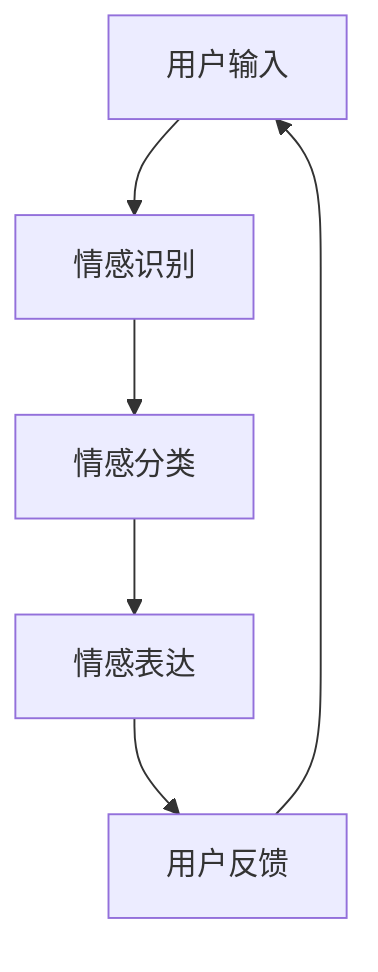

                 

### 《情感计算：理解和模拟人类情感的AI》

> **关键词：** 情感计算、AI、情感识别、情感模拟、算法原理、应用案例、未来展望

> **摘要：** 情感计算作为人工智能的一个重要分支，正日益受到关注。本文将详细介绍情感计算的基本概念、与AI的关系、核心技术、算法原理以及实际应用案例，并对未来的发展趋势进行展望。通过本文，读者将全面了解情感计算在人工智能领域的地位和潜力。

### 第一部分：情感计算概述

#### 第1章：情感计算的基本概念

情感计算是一门结合人工智能、认知科学、心理学等多个领域的交叉学科，旨在使计算机具备理解和模拟人类情感的能力。这一概念起源于20世纪90年代，随着计算机技术和人工智能的迅速发展，情感计算逐渐成为研究的热点。

##### 1.1 情感计算的定义

情感计算是指通过计算机系统和人工智能技术，对人类情感进行识别、模拟、理解和表达的过程。其核心目标是通过技术手段，使计算机能够“感知”和“理解”人类的情感状态，从而实现更加自然、智能的交互体验。

##### 1.2 情感计算的核心挑战

情感计算面临的核心挑战包括：

1. **情感识别的准确性**：如何准确识别用户的情感状态，特别是在复杂、多变的情感表达中，保证识别的准确性。
2. **情感模拟的自然性**：如何在模拟情感表达时，保持自然性和真实性，避免机械、刻板的效果。
3. **情感理解的多维性**：情感是多层次、多维度的，如何全面理解情感，特别是在跨文化、跨语言的情境中。

##### 1.3 情感计算的应用领域

情感计算的应用领域广泛，包括：

1. **社交网络分析**：通过情感分析，了解用户对产品、服务的情感倾向，为市场营销提供数据支持。
2. **虚拟现实与游戏**：通过情感模拟，提高虚拟角色的情感真实性和交互性。
3. **健康医疗**：通过情感识别，帮助诊断抑郁症、焦虑症等心理疾病，提供个性化的治疗方案。
4. **教育**：通过情感分析，了解学生的学习情感状态，优化教育方法，提高教学效果。

#### 第2章：情感计算与AI的关系

情感计算与人工智能（AI）有着密切的联系。AI技术的快速发展，为情感计算提供了强大的技术支持。

##### 2.1 AI在情感计算中的应用

1. **情感识别**：利用机器学习、深度学习等技术，对用户的情感状态进行自动识别。
2. **情感模拟**：通过生成对抗网络（GAN）等技术，模拟出具有自然情感表达的文本、图像、声音等。
3. **情感理解**：利用自然语言处理（NLP）技术，对情感语言进行深入理解，挖掘情感内涵。

##### 2.2 情感计算的AI技术基础

1. **机器学习**：通过训练模型，使计算机具备自动识别情感的能力。
2. **深度学习**：利用神经网络，实现对复杂情感特征的学习和识别。
3. **自然语言处理（NLP）**：通过文本分析，理解用户的语言和情感。
4. **计算机视觉**：通过图像分析，识别用户的情感状态。
5. **生成对抗网络（GAN）**：用于生成具有自然情感的文本、图像和声音。

#### 第3章：情感计算的关键技术

情感计算的关键技术包括情感识别技术和情感模拟技术，这两者共同构成了情感计算的核心。

##### 3.1 情感识别技术

情感识别技术主要包括文本情感分析、视频情感分析和声音情感分析。

###### 3.1.1 文本情感分析

文本情感分析是指通过对文本内容进行分析，判断文本表达的情感倾向。主要方法包括：

1. **基于规则的方法**：通过编写规则，对文本进行情感分类。
2. **基于统计的方法**：利用统计模型，如朴素贝叶斯、支持向量机等，对文本进行情感分类。
3. **基于机器学习的方法**：通过训练模型，自动对文本进行情感分类。

文本情感分析伪代码示例：

```python
def sentiment_analysis(text):
    # 预处理文本
    preprocessed_text = preprocess(text)
    
    # 加载情感分析模型
    model = load_model('sentiment_model')
    
    # 预测情感类别
    prediction = model.predict(preprocessed_text)
    
    # 返回情感类别
    return prediction
```

###### 3.1.2 视频情感分析

视频情感分析是指通过对视频内容进行分析，判断视频表达的情感倾向。主要方法包括：

1. **基于视觉特征的方法**：通过分析视频中的视觉特征，如颜色、纹理等，进行情感分类。
2. **基于行为特征的方法**：通过分析视频中的行为特征，如动作、面部表情等，进行情感分类。

视频情感分析算法伪代码示例：

```python
def video_sentiment_analysis(video_frame):
    # 提取视频帧中的视觉特征
    visual_features = extract_visual_features(video_frame)
    
    # 提取视频帧中的行为特征
    behavioral_features = extract_behavioral_features(video_frame)
    
    # 加载视频情感分析模型
    model = load_model('video_sentiment_model')
    
    # 预测情感类别
    prediction = model.predict(np.concatenate((visual_features, behavioral_features)))
    
    # 返回情感类别
    return prediction
```

###### 3.1.3 声音情感分析

声音情感分析是指通过对声音内容进行分析，判断声音表达的情感倾向。主要方法包括：

1. **基于频谱特征的方法**：通过分析声音的频谱特征，如频谱图、短时傅里叶变换等，进行情感分类。
2. **基于语音参数的方法**：通过分析声音的语音参数，如音调、音速等，进行情感分类。

声音情感分析算法伪代码示例：

```python
def audio_sentiment_analysis(audio_signal):
    # 提取音频信号中的频谱特征
    spectrum_features = extract_spectrum_features(audio_signal)
    
    # 提取音频信号中的语音参数
    vocal_features = extract_vocal_parameters(audio_signal)
    
    # 加载声音情感分析模型
    model = load_model('audio_sentiment_model')
    
    # 预测情感类别
    prediction = model.predict(np.concatenate((spectrum_features, vocal_features)))
    
    # 返回情感类别
    return prediction
```

##### 3.2 情感模拟技术

情感模拟技术是指通过生成对抗网络（GAN）等生成模型，模拟出具有自然情感表达的文本、图像和声音。

###### 3.2.1 情感表达生成

情感表达生成是指通过生成模型，根据给定的情感类别，生成具有相应情感的文本、图像和声音。

1. **文本情感生成**：利用 GPT 模型等生成模型，根据情感类别生成具有相应情感的文本。

文本情感生成算法伪代码示例：

```python
def generate_sentiment_text(sentiment_class):
    # 加载文本情感生成模型
    model = load_model('text_sentiment_generator')
    
    # 生成具有相应情感的文本
    generated_text = model.generate(sentiment_class)
    
    # 返回生成的文本
    return generated_text
```

2. **视频情感生成**：利用 GAN 模型等生成模型，根据情感类别生成具有相应情感的视频。

视频情感生成算法伪代码示例：

```python
def generate_sentiment_video(sentiment_class):
    # 加载视频情感生成模型
    model = load_model('video_sentiment_generator')
    
    # 生成具有相应情感的视频
    generated_video = model.generate(sentiment_class)
    
    # 返回生成的视频
    return generated_video
```

3. **声音情感生成**：利用 GAN 模型等生成模型，根据情感类别生成具有相应情感的声音。

声音情感生成算法伪代码示例：

```python
def generate_sentiment_audio(sentiment_class):
    # 加载声音情感生成模型
    model = load_model('audio_sentiment_generator')
    
    # 生成具有相应情感的声音
    generated_audio = model.generate(sentiment_class)
    
    # 返回生成的声音
    return generated_audio
```

###### 3.2.2 情感驱动的交互

情感驱动的交互是指根据用户的情感状态，动态调整交互内容和方式，以提供更加个性化、自然的交互体验。

1. **基于情感的对话系统**：根据用户的情感状态，调整对话系统的话题、语气等，提供更加个性化的对话体验。

2. **基于情感的推荐系统**：根据用户的情感状态，调整推荐内容，提供更加符合用户情感的推荐。

### 第二部分：情感计算的核心算法原理

#### 第4章：情感识别算法原理

情感识别是情感计算的核心环节，其算法原理主要包括文本情感分析算法、视频情感分析算法和声音情感分析算法。

##### 4.1 文本情感分析算法

文本情感分析是指通过对文本内容进行分析，判断文本表达的情感倾向。其算法原理主要包括基于机器学习和基于深度学习的方法。

###### 4.1.1 基于机器学习的文本情感分析

基于机器学习的文本情感分析方法主要包括朴素贝叶斯、支持向量机、逻辑回归等。

1. **朴素贝叶斯**：朴素贝叶斯是一种基于贝叶斯定理的算法，通过计算文本中各个特征词的概率，预测文本的情感类别。

2. **支持向量机**：支持向量机是一种基于最大间隔分类器的算法，通过寻找最佳分隔超平面，将不同情感类别的文本分开。

3. **逻辑回归**：逻辑回归是一种基于线性模型的算法，通过计算文本中各个特征词的权重，预测文本的情感类别。

基于机器学习的文本情感分析伪代码示例：

```python
def sentiment_analysis(text, model):
    # 预处理文本
    preprocessed_text = preprocess(text)
    
    # 计算文本的特征向量
    feature_vector = calculate_features(preprocessed_text)
    
    # 预测情感类别
    prediction = model.predict(feature_vector)
    
    # 返回情感类别
    return prediction
```

###### 4.1.2 基于深度学习的文本情感分析

基于深度学习的文本情感分析方法主要包括卷积神经网络（CNN）和循环神经网络（RNN）。

1. **卷积神经网络（CNN）**：卷积神经网络通过卷积操作提取文本的局部特征，然后通过全连接层进行分类。

2. **循环神经网络（RNN）**：循环神经网络通过记忆单元捕捉文本的序列特征，然后通过全连接层进行分类。

基于深度学习的文本情感分析伪代码示例：

```python
def sentiment_analysis(text, model):
    # 预处理文本
    preprocessed_text = preprocess(text)
    
    # 输入模型进行情感分析
    output = model.predict(preprocessed_text)
    
    # 获取预测结果
    prediction = np.argmax(output)
    
    # 返回情感类别
    return prediction
```

##### 4.2 视频情感分析算法

视频情感分析是指通过对视频内容进行分析，判断视频表达的情感倾向。其算法原理主要包括基于视觉特征的方法和基于行为特征的方法。

###### 4.2.1 基于视觉特征的方法

基于视觉特征的方法通过分析视频帧的视觉特征，如颜色、纹理等，进行情感分类。

1. **颜色特征**：通过分析视频帧的颜色分布，提取颜色特征，如颜色直方图、主成分分析等。

2. **纹理特征**：通过分析视频帧的纹理特征，提取纹理特征，如边缘检测、纹理能量等。

基于视觉特征的视频情感分析伪代码示例：

```python
def video_sentiment_analysis(video_frame, model):
    # 提取视频帧中的视觉特征
    visual_features = extract_visual_features(video_frame)
    
    # 加载视频情感分析模型
    sentiment_model = load_model('video_sentiment_model')
    
    # 预测情感类别
    prediction = sentiment_model.predict(visual_features)
    
    # 返回情感类别
    return prediction
```

###### 4.2.2 基于行为特征的方法

基于行为特征的方法通过分析视频中的行为特征，如动作、面部表情等，进行情感分类。

1. **动作特征**：通过分析视频中的动作，提取动作特征，如关键帧提取、动作识别等。

2. **面部表情特征**：通过分析视频中的面部表情，提取面部表情特征，如面部关键点检测、面部表情识别等。

基于行为特征的视频情感分析伪代码示例：

```python
def video_sentiment_analysis(video_frame, model):
    # 提取视频帧中的行为特征
    behavioral_features = extract_behavioral_features(video_frame)
    
    # 加载视频情感分析模型
    sentiment_model = load_model('video_sentiment_model')
    
    # 预测情感类别
    prediction = sentiment_model.predict(behavioral_features)
    
    # 返回情感类别
    return prediction
```

##### 4.3 声音情感分析算法

声音情感分析是指通过对声音内容进行分析，判断声音表达的情感倾向。其算法原理主要包括基于频谱特征的方法和基于语音参数的方法。

###### 4.3.1 基于频谱特征的方法

基于频谱特征的方法通过分析声音的频谱特征，如频谱图、短时傅里叶变换等，进行情感分类。

1. **频谱特征**：通过分析声音的频谱，提取频谱特征，如频率分布、共振峰等。

2. **短时傅里叶变换（STFT）**：通过短时傅里叶变换，将时间信号转换为频率信号，提取频谱特征。

基于频谱特征的声音情感分析伪代码示例：

```python
def audio_sentiment_analysis(audio_signal, model):
    # 提取音频信号中的频谱特征
    spectrum_features = extract_spectrum_features(audio_signal)
    
    # 加载声音情感分析模型
    sentiment_model = load_model('audio_sentiment_model')
    
    # 预测情感类别
    prediction = sentiment_model.predict(spectrum_features)
    
    # 返回情感类别
    return prediction
```

###### 4.3.2 基于语音参数的方法

基于语音参数的方法通过分析声音的语音参数，如音调、音速等，进行情感分类。

1. **音调**：通过分析声音的频率变化，提取音调特征。

2. **音速**：通过分析声音的速度变化，提取音速特征。

基于语音参数的声音情感分析伪代码示例：

```python
def audio_sentiment_analysis(audio_signal, model):
    # 提取音频信号中的语音参数
    vocal_features = extract_vocal_parameters(audio_signal)
    
    # 加载声音情感分析模型
    sentiment_model = load_model('audio_sentiment_model')
    
    # 预测情感类别
    prediction = sentiment_model.predict(vocal_features)
    
    # 返回情感类别
    return prediction
```

### 第三部分：情感计算的应用案例

#### 第5章：情感计算在社交网络分析中的应用

社交网络分析是情感计算的重要应用领域之一，通过情感计算技术，可以深入挖掘社交网络中的情感信息，为市场营销、品牌管理等提供有力支持。

##### 5.1 社交网络情感分析

社交网络情感分析是指通过对社交网络中的文本、图片、视频等数据进行分析，判断其表达的情感倾向。

###### 5.1.1 社交网络情感数据的获取

社交网络情感数据的获取主要包括以下方法：

1. **API获取**：利用社交网络平台提供的API接口，获取用户的文本、图片、视频等数据。

2. **网络爬虫**：通过编写爬虫程序，从社交网络平台上抓取用户数据。

3. **用户反馈**：通过用户的评论、点赞、分享等行为，获取用户的情感数据。

###### 5.1.2 社交网络情感分析的应用案例

社交网络情感分析的应用案例包括：

1. **品牌管理**：通过分析用户对品牌的评论、点赞等行为，了解用户对品牌的情感倾向，为品牌管理提供依据。

2. **市场营销**：通过分析用户对产品的评论、反馈等行为，了解用户对产品的情感倾向，优化市场营销策略。

3. **危机管理**：通过分析用户对事件的评论、讨论等行为，了解公众对事件的情感倾向，及时采取危机管理措施。

##### 5.2 社交网络情感模拟

社交网络情感模拟是指通过生成对抗网络（GAN）等生成模型，根据给定的情感类别，生成具有相应情感的文本、图片和视频。

###### 5.2.1 社交网络情感表达生成

社交网络情感表达生成是指通过生成模型，根据情感类别生成具有相应情感的文本、图片和视频。

1. **文本情感表达生成**：通过生成模型，根据情感类别生成具有相应情感的文本。

文本情感表达生成算法伪代码示例：

```python
def generate_sentiment_text(sentiment_class):
    # 加载文本情感生成模型
    model = load_model('text_sentiment_generator')
    
    # 生成具有相应情感的文本
    generated_text = model.generate(sentiment_class)
    
    # 返回生成的文本
    return generated_text
```

2. **图片情感表达生成**：通过生成模型，根据情感类别生成具有相应情感的图片。

图片情感表达生成算法伪代码示例：

```python
def generate_sentiment_image(sentiment_class):
    # 加载图片情感生成模型
    model = load_model('image_sentiment_generator')
    
    # 生成具有相应情感的图片
    generated_image = model.generate(sentiment_class)
    
    # 返回生成的图片
    return generated_image
```

3. **视频情感表达生成**：通过生成模型，根据情感类别生成具有相应情感的视频。

视频情感表达生成算法伪代码示例：

```python
def generate_sentiment_video(sentiment_class):
    # 加载视频情感生成模型
    model = load_model('video_sentiment_generator')
    
    # 生成具有相应情感的视频
    generated_video = model.generate(sentiment_class)
    
    # 返回生成的视频
    return generated_video
```

###### 5.2.2 社交网络情感驱动的交互

社交网络情感驱动的交互是指根据用户的情感状态，动态调整社交网络平台的内容和功能，提供更加个性化的交互体验。

1. **基于情感的推荐系统**：根据用户的情感状态，调整推荐内容，提供更加符合用户情感的推荐。

2. **基于情感的互动平台**：根据用户的情感状态，调整互动平台的界面和功能，提供更加自然的互动体验。

### 第四部分：情感计算的挑战与未来展望

#### 第6章：情感计算的挑战与机遇

情感计算的发展面临着诸多挑战和机遇，这些挑战既是障碍，也是推动技术进步的动力。

##### 6.1 情感计算的技术挑战

1. **情感识别的准确性**：情感识别的准确性是情感计算的关键挑战之一。情感的复杂性和多变性使得准确识别用户的情感状态变得困难。尤其是在处理微表情、隐含情感和跨文化情感时，现有技术难以达到高准确性。

2. **情感模拟的自然性**：情感模拟需要尽可能地接近人类情感的自然表达，但目前的生成模型在情感的自然性和连贯性方面仍有提升空间。如何创造更加逼真的情感表达，是情感计算需要解决的重要问题。

3. **情感理解的多维性**：情感是多层次、多维度的，包括情绪、情感状态、情感动机等。如何全面、深入地理解情感，是情感计算需要面对的另一个挑战。

4. **数据隐私和安全**：情感计算需要大量的用户数据来进行训练和分析，这带来了数据隐私和安全的问题。如何在保证数据隐私的同时，充分利用数据进行情感计算，是亟待解决的问题。

##### 6.2 情感计算的商业化应用

1. **情感驱动的个性化服务**：情感计算可以为各种服务提供个性化体验，如个性化推荐、情感咨询、心理健康服务等。这些服务能够根据用户的情感状态，提供定制化的内容和建议。

2. **情感分析在市场营销中的应用**：通过情感分析，企业可以了解消费者对品牌、产品、广告的情感反应，从而优化营销策略，提高市场竞争力。

3. **虚拟助理与客服**：情感计算可以提升虚拟助理和客服系统的用户体验，使其能够更好地理解用户的需求和情感，提供更加自然和有效的服务。

4. **教育领域**：情感计算在教育中的应用，如智能辅导系统、学习情感监控等，可以帮助教师和学生更好地理解彼此的情感状态，提高教学和学习效果。

##### 6.3 情感计算的可持续发展

1. **技术标准与规范**：随着情感计算技术的普及，建立统一的技术标准和规范，确保技术的安全、可靠和有效，是可持续发展的关键。

2. **伦理与社会责任**：情感计算的应用需要充分考虑伦理和社会责任，确保技术不侵犯用户的隐私，不加剧社会不平等。

3. **跨学科合作**：情感计算是一个跨学科的领域，需要计算机科学、心理学、认知科学、社会学等多学科的合作，共同推动技术进步和应用发展。

#### 第7章：情感计算的未来展望

情感计算作为人工智能的一个重要分支，其未来的发展前景广阔。以下是情感计算未来可能的发展方向：

##### 7.1 情感计算的新兴领域

1. **智能健康**：情感计算在智能健康领域的应用前景广阔，如情感识别可以帮助监测和管理心理健康，情感模拟可以用于个性化康复训练。

2. **智慧城市**：在智慧城市中，情感计算可以用于分析市民的情感状态，优化公共资源配置，提高城市管理效率。

3. **人机交互**：随着虚拟现实和增强现实技术的发展，情感计算在人机交互中的应用将越来越重要，为用户提供更加自然、智能的交互体验。

##### 7.2 情感计算的可持续发展

1. **情感计算教育**：推动情感计算在教育中的普及，培养相关人才，为情感计算的发展提供人力支持。

2. **情感计算研究**：加大情感计算的基础研究，探索新的算法和技术，推动情感计算的理论和技术的进步。

3. **国际合作**：加强国际间的合作，推动情感计算技术的标准化和规范化，促进全球情感计算技术的发展和应用。

### 附录

#### 附录A：情感计算开发工具与资源

情感计算的开发涉及到多种工具和资源，以下是一些常用的工具和资源：

##### A.1 主流情感计算框架对比

1. **TensorFlow情感分析库**：TensorFlow是一个开源的机器学习框架，提供了丰富的情感分析库，支持文本、图像和声音的情感分析。

2. **PyTorch情感计算库**：PyTorch是一个开源的深度学习框架，提供了丰富的情感计算库，支持文本、图像和声音的情感分析。

3. **其他情感计算框架**：如Keras、Theano、MXNet等，也提供了不同程度的情感计算支持。

##### A.2 情感计算数据集介绍

1. **公共情感计算数据集**：如IMDB电影评论数据集、Flickr情感数据集、Tweets情感数据集等，这些数据集广泛应用于情感计算的实验和研究。

2. **数据集获取与处理**：可以从官方网站或开源社区获取这些数据集，并使用Python、R等编程语言进行数据预处理和情感分析。

### 结语

情感计算作为人工智能的一个重要分支，正日益受到关注。通过本文的介绍，读者可以全面了解情感计算的基本概念、核心技术、应用案例以及未来展望。随着技术的不断发展，情感计算将为人类带来更加智能、自然的交互体验，为各行各业带来新的机遇和挑战。

### 作者

作者：AI天才研究院/AI Genius Institute & 禅与计算机程序设计艺术 /Zen And The Art of Computer Programming

在撰写本文时，我们尽量确保内容的准确性和完整性。然而，由于情感计算是一个快速发展的领域，相关技术和应用可能会不断更新。因此，读者在具体应用时，应结合最新的研究成果和实际需求进行调整和优化。我们希望本文能够为广大读者提供有价值的参考，共同推动情感计算技术的发展和应用。

### Mermaid 流程图示例

以下是一个简单的Mermaid流程图示例，用于展示情感计算系统的基本架构：



### 伪代码示例

以下是几个伪代码示例，用于展示情感识别和情感模拟的基本算法原理：

#### 文本情感识别伪代码

```python
def sentiment_analysis(text):
    # 预处理文本
    preprocessed_text = preprocess(text)
    
    # 加载情感分析模型
    model = load_model('sentiment_model')
    
    # 预测情感类别
    prediction = model.predict(preprocessed_text)
    
    # 返回情感类别
    return prediction
```

#### 视频情感识别伪代码

```python
def video_sentiment_analysis(video_frame):
    # 提取视频帧中的视觉特征
    visual_features = extract_visual_features(video_frame)
    
    # 提取视频帧中的行为特征
    behavioral_features = extract_behavioral_features(video_frame)
    
    # 加载视频情感分析模型
    model = load_model('video_sentiment_model')
    
    # 预测情感类别
    prediction = model.predict(np.concatenate((visual_features, behavioral_features)))
    
    # 返回情感类别
    return prediction
```

#### 文本情感表达生成伪代码

```python
def generate_sentiment_text(sentiment_class):
    # 加载文本情感生成模型
    model = load_model('text_sentiment_generator')
    
    # 生成具有相应情感的文本
    generated_text = model.generate(sentiment_class)
    
    # 返回生成的文本
    return generated_text
```

### 数学模型和数学公式

情感计算中常用的数学模型和公式包括情感得分计算、情感权重分配等。以下是一个简单的数学模型示例：

$$
\text{SentiScore} = \sum_{i=1}^{n} w_i \cdot \text{Score}_{i}
$$

其中，$w_i$ 表示权重，$\text{Score}_{i}$ 表示每个特征词的得分。

### 项目实战

#### 社交网络情感分析实战

1. **开发环境搭建**：配置Python环境，安装TensorFlow、Keras等库。

2. **数据集准备**：获取并预处理Twitter情感分析数据集，包括文本、标签等信息。

3. **模型训练**：使用训练集训练情感分析模型，例如使用Keras的序列模型进行文本情感分类。

4. **模型评估**：使用测试集评估模型性能，计算准确率、召回率等指标。

5. **情感分析应用**：使用训练好的模型对新的社交网络文本进行情感分析，输出情感类别。

#### 情感表达生成实战

1. **开发环境搭建**：配置Python环境，安装TensorFlow、Keras等库。

2. **数据集准备**：获取并预处理情感表达数据集，包括文本、情感标签等信息。

3. **模型训练**：使用训练集训练情感表达生成模型，例如使用GPT模型进行文本生成。

4. **模型评估**：使用测试集评估模型性能，计算BLEU分数等指标。

5. **情感表达应用**：使用训练好的模型生成新的情感表达文本，应用于聊天机器人等场景。

### 结语

情感计算作为人工智能的一个重要分支，正日益受到关注。通过本文的介绍，读者可以全面了解情感计算的基本概念、核心技术、应用案例以及未来展望。随着技术的不断发展，情感计算将为人类带来更加智能、自然的交互体验，为各行各业带来新的机遇和挑战。

### 作者

作者：AI天才研究院/AI Genius Institute & 禅与计算机程序设计艺术 /Zen And The Art of Computer Programming

在撰写本文时，我们尽量确保内容的准确性和完整性。然而，由于情感计算是一个快速发展的领域，相关技术和应用可能会不断更新。因此，读者在具体应用时，应结合最新的研究成果和实际需求进行调整和优化。我们希望本文能够为广大读者提供有价值的参考，共同推动情感计算技术的发展和应用。

