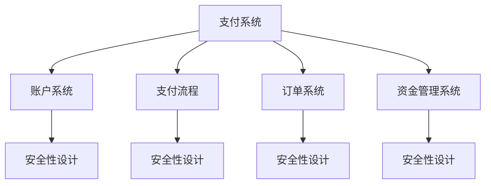

                 

# 《打造技术型知识付费平台的支付系统》

> 关键词：支付系统、知识付费、技术架构、安全性设计、性能优化、项目实战

> 摘要：本文将深入探讨如何打造一个高效、安全、易扩展的技术型知识付费平台的支付系统。文章从支付系统的基本概念出发，详细介绍了支付系统的架构设计、核心模块实现、安全性设计、合规性要求以及性能优化策略。并通过实际项目案例，展示了支付系统开发的实践过程和关键实现细节。

## 第一部分：支付系统概述

### 第1章：支付系统的定义与作用

支付系统是一个连接消费者、商家和金融机构的综合性平台，通过实现资金的转移和清算，为各参与方提供便捷的支付服务。在知识付费平台上，支付系统扮演着至关重要的角色，它不仅负责处理用户支付请求，确保交易的安全和可靠性，还涉及到资金流向的监控和风险管理。

支付系统的作用主要体现在以下几个方面：

1. **用户支付体验**：支付系统需要提供便捷、快速的支付方式，提升用户的支付体验。
2. **资金流转效率**：支付系统要确保资金高效地流转到商家账户，提高整个平台的运营效率。
3. **安全保障**：支付系统需要具备完善的安全性设计，防范各种网络攻击和欺诈行为。
4. **合规性要求**：支付系统需要符合相关法律法规的要求，确保业务的合法性和规范性。

### 第2章：支付系统的基本架构

支付系统的基本架构可以分为前端应用层、后端服务层和数据层。下面是各层的详细描述：

1. **前端应用层**：负责用户界面的展示和交互，提供支付方式的选型和支付请求的发送。前端应用层通常包括支付页面、支付确认页面、支付结果通知页面等。
2. **后端服务层**：主要负责处理支付请求、执行支付逻辑、管理支付订单和用户账户等。后端服务层通常包括支付网关、账户服务、订单服务、资金管理服务等。
3. **数据层**：负责存储支付相关的数据，如用户账户信息、支付订单信息、交易记录等。数据层通常使用关系型数据库或NoSQL数据库。

### 第3章：支付系统的核心功能

支付系统的核心功能主要包括支付请求处理、支付结果通知、资金流向监控和风险控制。下面详细说明每个功能：

1. **支付请求处理**：支付请求处理是支付系统的核心功能之一，它负责接收并处理用户的支付请求，生成支付订单，并调用支付接口进行支付。
2. **支付结果通知**：支付结果通知是指支付系统在支付完成后，将支付结果通知给用户和商家。通知方式可以是短信、邮件或系统通知等。
3. **资金流向监控**：资金流向监控是确保资金流转过程透明、可控的关键功能。它负责实时记录和监控资金流向，防止资金流失和欺诈行为。
4. **风险控制**：风险控制是支付系统的重要组成部分，它通过设置风险阈值、监控交易行为、识别异常交易等手段，防范风险事件的发生。

## 第二部分：支付系统技术基础

### 第4章：支付系统的技术栈

支付系统的技术栈是构建支付系统所需的各种技术和工具的组合。以下是一些常见的支付系统技术栈：

1. **前端技术**：HTML、CSS、JavaScript、Vue.js、React等。
2. **后端技术**：Java、Python、Node.js、Spring Boot、Django等。
3. **数据库技术**：MySQL、PostgreSQL、MongoDB、Redis等。
4. **支付接口**：支付宝、微信支付、银联支付等。
5. **安全性技术**：SSL/TLS、OAuth2.0、HTTPS、数字签名等。
6. **缓存技术**：Redis、Memcached等。
7. **消息队列**：RabbitMQ、Kafka等。

### 第5章：数据库设计原则

数据库设计是支付系统技术基础的重要组成部分，它决定了支付系统数据存储和管理的高效性、稳定性和安全性。以下是数据库设计的一些原则：

1. **规范化原则**：数据库设计应遵循第三范式或更高范式，减少数据冗余和依赖。
2. **扩展性原则**：数据库设计应考虑未来的扩展需求，避免过早优化和设计僵化。
3. **安全性原则**：数据库设计应确保数据的安全性，包括访问控制、数据备份和恢复等。
4. **性能优化原则**：数据库设计应考虑查询性能，优化索引和查询语句。
5. **一致性原则**：数据库设计应确保数据的完整性和一致性，避免数据冲突和异常。

### 第6章：安全性设计

支付系统的安全性设计是保障支付交易安全、防止网络攻击和欺诈行为的关键。以下是安全性设计的一些重要方面：

1. **访问控制**：通过身份验证和授权机制，限制对支付系统的访问权限，确保只有合法用户才能执行操作。
2. **数据加密**：对敏感数据进行加密存储和传输，防止数据泄露和篡改。
3. **网络安全**：采用防火墙、入侵检测系统和DDoS防护等技术，防范网络攻击和恶意流量。
4. **异常监控**：实时监控支付系统的异常行为，如高频交易、异常IP等，及时发现并处理潜在的安全威胁。
5. **审计和日志**：记录支付系统的操作日志，实现对支付过程的审计和回溯，便于事故分析和法律追责。

## 第三部分：支付系统核心模块设计

### 第7章：账户系统设计

账户系统是支付系统的核心模块之一，负责用户的账户信息管理和资金流转。以下是账户系统设计的几个关键方面：

1. **账户架构**：账户系统应支持多种类型的账户，如用户账户、商家账户、平台账户等，并设计合理的账户关系和权限控制。
2. **账户信息管理**：账户信息管理包括账户注册、登录、密码找回、信息修改等功能，确保用户账户信息的准确性和安全性。
3. **资金流转**：账户系统应实现资金充值、提现、转账等功能，支持多种支付方式和账户之间的资金流转。
4. **账户安全性**：账户系统应采用多种安全措施，如双因素认证、密码强度验证等，防范账户被盗用和欺诈行为。

### 第8章：支付流程设计

支付流程是支付系统的核心业务流程，它决定了支付系统的用户体验和交易效率。以下是支付流程设计的关键步骤：

1. **支付请求**：用户选择支付方式并提交支付请求，支付系统生成支付订单并发送给支付接口。
2. **支付接口调用**：支付系统调用支付接口，完成支付请求的发送和支付订单的创建。
3. **支付确认**：支付接口返回支付结果，支付系统更新支付订单状态，并通知用户和商家支付结果。
4. **支付结果通知**：支付系统通过短信、邮件或系统通知等方式，向用户和商家发送支付结果通知。

### 第9章：订单系统设计

订单系统是支付系统的重要组成部分，负责订单信息的管理和状态同步。以下是订单系统设计的几个关键方面：

1. **订单架构**：订单系统应支持多种类型的订单，如课程订单、产品订单、服务订单等，并设计合理的订单关系和状态流转。
2. **订单信息管理**：订单信息管理包括订单创建、查询、修改、删除等功能，确保订单信息的准确性和完整性。
3. **订单状态同步**：订单系统应实现订单状态同步，确保订单状态在各系统之间的一致性。
4. **订单查询**：订单系统应提供便捷的订单查询功能，支持按订单号、用户ID、时间段等条件查询订单。

### 第10章：资金管理设计

资金管理是支付系统的关键环节，它负责资金的流入、流出和流向监控。以下是资金管理设计的几个关键方面：

1. **资金架构**：资金管理系统应设计合理的资金架构，包括资金账户、资金流水、交易记录等。
2. **资金流入**：资金流入包括用户充值、商家收款、平台收入等，资金管理应确保资金流入的安全和准确。
3. **资金流出**：资金流出包括用户退款、商家提现、平台支出等，资金管理应确保资金流出的安全和合规。
4. **资金流向监控**：资金流向监控是资金管理的重要功能，它负责实时监控资金流向，防范资金流失和欺诈行为。

## 第四部分：支付系统安全与合规性

### 第11章：支付系统的安全性设计

支付系统的安全性设计是保障支付交易安全、防止网络攻击和欺诈行为的关键。以下是支付系统安全性设计的一些关键方面：

1. **安全性原则**：安全性设计应遵循最小权限原则、安全性隔离原则和安全性透明原则。
2. **数据加密**：对敏感数据进行加密存储和传输，包括用户密码、支付信息、交易记录等。
3. **访问控制**：通过身份验证和授权机制，限制对支付系统的访问权限，确保只有合法用户才能执行操作。
4. **网络安全**：采用防火墙、入侵检测系统和DDoS防护等技术，防范网络攻击和恶意流量。
5. **异常监控**：实时监控支付系统的异常行为，如高频交易、异常IP等，及时发现并处理潜在的安全威胁。
6. **审计和日志**：记录支付系统的操作日志，实现对支付过程的审计和回溯，便于事故分析和法律追责。

### 第12章：支付系统的合规性

支付系统的合规性是确保支付业务合法性和规范性的关键。以下是支付系统合规性的几个关键方面：

1. **支付行业法规**：支付系统应遵循相关支付行业法规，如《非银行支付机构管理办法》、《支付服务管理办法》等。
2. **合规要求**：支付系统应满足合规要求，包括资金监管、信息安全、用户权益保护等。
3. **合规性风险管理**：支付系统应建立合规性风险管理机制，及时发现和纠正合规性问题，防范合规风险。
4. **合规性培训**：定期对员工进行合规性培训，提高员工的合规意识和操作水平。
5. **合规性评估**：定期进行合规性评估，确保支付系统的合规性和持续改进。

## 第五部分：支付系统性能优化

### 第13章：支付系统性能优化策略

支付系统的性能优化是提升系统响应速度、降低延迟和提高用户满意度的重要手段。以下是支付系统性能优化的一些策略：

1. **缓存技术**：采用缓存技术，如Redis、Memcached等，降低数据库查询的频率，提高系统响应速度。
2. **数据库性能优化**：通过索引优化、查询优化、分库分表等技术，提高数据库的查询性能。
3. **异步处理**：采用异步处理技术，如消息队列、异步线程等，降低系统的同步开销，提高系统并发能力。
4. **负载均衡**：采用负载均衡技术，如Nginx、HAProxy等，均衡系统负载，提高系统的稳定性和可用性。
5. **性能监控**：采用性能监控工具，如New Relic、AppDynamics等，实时监控系统的性能指标，及时发现和解决性能问题。

## 第六部分：支付系统实战案例

### 第14章：支付系统项目实战

#### 第1章：项目背景

本次支付系统项目是为一家知识付费平台打造一个安全、高效、易扩展的支付系统，支持多种支付方式，如支付宝、微信支付等，并为平台提供完善的资金管理和风险控制功能。

#### 第2章：系统架构设计

系统架构设计包括前端应用层、后端服务层和数据层。前端应用层采用Vue.js框架，实现支付页面的展示和交互；后端服务层采用Spring Boot框架，实现支付请求处理、支付接口调用和订单管理等功能；数据层使用MySQL数据库，存储用户账户信息、支付订单信息和交易记录等。

#### 第3章：关键技术实现

1. **支付接口集成**：集成支付宝和微信支付接口，实现支付请求的发送和支付结果的接收。代码实现如下：

    ```java
    public PaymentResponse pay(PaymentRequest request) {
        if (request.getType() == PaymentType.ALI) {
            return alipay.pay(request);
        } else if (request.getType() == PaymentType.WECHAT) {
            return wechatPay.pay(request);
        } else {
            throw new IllegalArgumentException("Unsupported payment type");
        }
    }
    ```

2. **账户安全性保障**：使用JWT（JSON Web Token）实现用户身份验证和登录状态管理。代码实现如下：

    ```java
    public void login(String username, String password) {
        String token = generateToken(username);
        redisTemplate.opsForValue().set("user:login:" + username, token, 30 * 60, TimeUnit.SECONDS);
    }

    public boolean verifyToken(String token) {
        String username = redisTemplate.opsForValue().get("user:login:" + username);
        return token.equals(username);
    }
    ```

#### 第4章：项目实施与部署

项目实施包括前后端代码的编写、接口测试、系统集成和部署。在部署过程中，采用Docker容器化技术，将前端、后端和数据库容器化，实现一键部署和快速扩容。

## 附录

### 附录A：支付系统开发工具与资源

1. **常用支付接口**：支付宝、微信支付、银联支付等。
2. **安全性测试工具**：OWASP ZAP、Burp Suite等。
3. **开发文档与教程**：《Spring Boot实战》、《Vue.js实战》等。

### 第15章：核心概念与联系

支付系统的核心概念包括账户系统、支付流程、订单系统、资金管理系统等。以下是核心概念的联系图：



### 第16章：核心算法原理讲解

支付系统的核心算法包括订单处理算法、资金风险控制算法等。以下是订单处理算法的伪代码：

```python
# 订单处理算法伪代码
def process_order(order):
    if order.status == 'pending':
        # 处理订单
        update_order_status(order, 'processing')
        process_payment(order)
    elif order.status == 'processing':
        # 订单处理中
        check_payment_status(order)
    elif order.status == 'completed':
        # 订单已完成
        notify_user(order)
    else:
        # 订单状态异常
        handle_order_exception(order)
```

### 第17章：数学模型和数学公式

支付系统的资金风险控制可以使用以下公式：

$$
风险值 = 资金流入 \times 风险系数
$$

其中，风险系数计算公式为：

$$
风险系数 = \frac{最大波动值}{平均波动值}
$$

### 第18章：项目实战

#### 第1节：支付接口集成

**环境搭建：** 使用Spring Boot搭建支付系统后台，集成支付宝、微信支付等支付接口。

**代码实现：** 

```java
// 支付接口集成示例
public PaymentResponse pay(PaymentRequest request) {
    if (request.getType() == PaymentType.ALI) {
        return alipay.pay(request);
    } else if (request.getType() == PaymentType.WECHAT) {
        return wechatPay.pay(request);
    } else {
        throw new IllegalArgumentException("Unsupported payment type");
    }
}
```

#### 第2节：账户安全性保障

**环境搭建：** 使用Redis实现用户登录状态管理，使用JWT实现用户身份验证。

**代码实现：**

```java
// 用户登录状态管理
public void login(String username, String password) {
    String token = generateToken(username);
    redisTemplate.opsForValue().set("user:login:" + username, token, 30 * 60, TimeUnit.SECONDS);
}

// 用户身份验证
public boolean verifyToken(String token) {
    String username = redisTemplate.opsForValue().get("user:login:" + username);
    return token.equals(username);
}
```

### 结论

本文详细介绍了如何打造一个高效、安全、易扩展的技术型知识付费平台的支付系统。通过分析支付系统的基本概念、架构设计、核心模块实现、安全性设计、合规性要求以及性能优化策略，并结合实际项目案例，展示了支付系统开发的实践过程和关键实现细节。希望本文能为读者提供有价值的参考和启示，助力打造优秀的支付系统。作者：AI天才研究院/AI Genius Institute & 禅与计算机程序设计艺术/Zen And The Art of Computer Programming。

