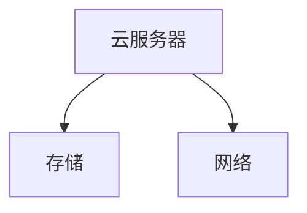
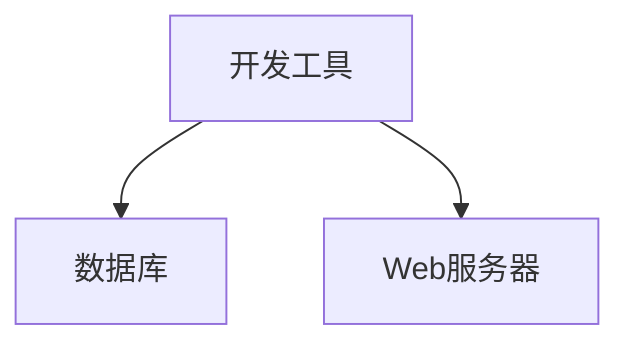
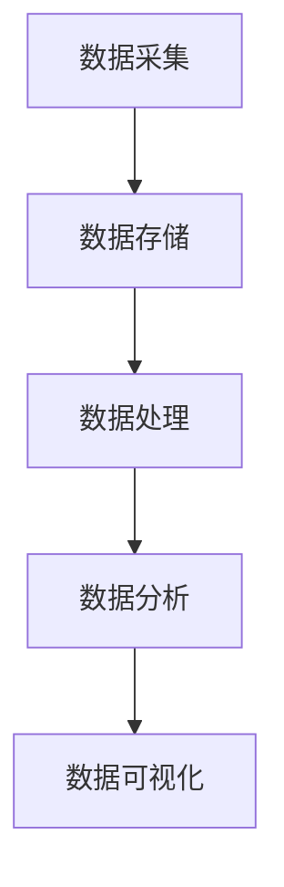

                 

### 《技术分享：从线下到线上的转变》

> **关键词：** 线下到线上转变、互联网技术、云计算、大数据、移动互联网、转型策略、案例分析、未来展望

> **摘要：** 本文将探讨从线下到线上的转变这一主题，分析互联网技术对企业商业模式的影响，介绍基础网络技术、云计算与大数据、移动互联网技术等关键技术，提供转型规划与实施策略，通过案例分析展示成功转型的经验，并对未来线上线下融合的趋势进行展望。

### 第一部分：转型背景与重要性

#### 1.1 从线下到线上的转变概述

##### 1.1.1 线下到线上的演变过程

线下到线上的转变可以追溯到互联网的普及。最初，人们通过线下渠道进行商务活动，如实体店购物、电话订购等。随着互联网技术的发展，电子商务逐渐兴起，企业开始在线上搭建销售平台，消费者可以在线购买商品或服务。这一过程不仅改变了消费者的购物习惯，也对企业的经营模式产生了深远影响。

##### 1.1.2 企业转型的必要性

在互联网时代，企业面临前所未有的挑战和机遇。传统的线下商业模式已无法满足市场的需求，企业需要通过转型来提升竞争力。转型不仅包括业务模式的改变，还包括技术基础设施的升级和组织结构的调整。只有适应时代的变化，企业才能在激烈的市场竞争中立于不败之地。

##### 1.1.3 线上线下融合的趋势

随着技术的进步，线上线下融合成为大势所趋。越来越多的企业开始探索线上线下结合的商业模式，通过线上平台吸引顾客，再通过线下体验提升客户满意度。这种融合不仅提高了企业的服务能力，也增强了客户的忠诚度。

#### 1.2 互联网技术对商业模式的影响

##### 1.2.1 电子商务的崛起

电子商务的崛起改变了传统的商业模式。企业可以通过电商平台直接面向消费者，降低了中间环节的成本，提高了利润空间。同时，电子商务还为企业提供了丰富的数据，帮助企业更好地了解客户需求，优化产品和服务。

##### 1.2.2 社交媒体的崛起

社交媒体的崛起为企业提供了新的营销渠道。企业可以通过社交媒体与客户建立互动，了解客户反馈，提升品牌知名度。同时，社交媒体也为消费者提供了便捷的购物体验，推动了电子商务的发展。

##### 1.2.3 数据驱动决策

互联网技术使得数据收集和分析变得更加容易。企业可以通过数据分析了解市场趋势、客户行为，从而做出更明智的决策。数据驱动决策已成为现代企业竞争的重要手段。

#### 1.3 成功转型的案例解析

##### 1.3.1 国内外企业转型案例

国内外许多企业成功实现了从线下到线上的转型。例如，阿里巴巴从最初的电商企业转型为全球领先的数字经济体；亚马逊通过云计算和大数据技术提升了运营效率；华为通过线上线下融合拓展了市场份额。

##### 1.3.2 转型过程中的挑战与解决方案

转型过程中企业面临诸多挑战，如技术瓶颈、组织变革、客户适应等。企业需要通过技术创新、人才培养、企业文化建设等手段应对这些挑战。

### 第二部分：技术准备

#### 2.1 基础网络技术

##### 2.1.1 宽带网络

宽带网络是实现线上业务的基础。企业需要选择合适的宽带网络方案，确保网络稳定性和速度。

##### 2.1.2 无线网络

无线网络为企业提供了更加灵活的办公环境。企业可以通过无线网络实现移动办公，提高工作效率。

##### 2.1.3 网络安全与防护

网络安全是企业线上业务的重要保障。企业需要采取有效的网络安全措施，防范网络攻击和数据泄露。

#### 2.2 云计算与大数据

##### 2.2.1 云计算基础

云计算为企业提供了灵活的计算资源，降低了IT成本。企业需要了解云计算的基础知识，选择合适的云服务提供商。

##### 2.2.2 大数据技术

大数据技术可以帮助企业更好地理解市场和客户。企业需要掌握大数据技术的核心概念和工具，如Hadoop、Spark等。

##### 2.2.3 云计算与大数据结合案例分析

通过实际案例，企业可以了解如何将云计算与大数据技术相结合，提升业务效率。

#### 2.3 移动互联网技术

##### 2.3.1 移动应用开发

移动应用开发是企业线上业务的重要组成部分。企业需要了解移动应用开发的技术栈和最佳实践。

##### 2.3.2 移动支付与安全

移动支付已成为现代消费的主要方式。企业需要确保移动支付的安全性和用户体验。

##### 2.3.3 物联网与移动应用融合

物联网与移动应用的融合为企业提供了新的商业模式。企业需要探索物联网技术在移动应用中的应用。

### 第三部分：实施策略

#### 3.1 转型规划与组织变革

##### 3.1.1 转型目标设定

企业需要明确转型目标，制定详细的转型计划。

##### 3.1.2 转型路径设计

企业需要设计合理的转型路径，逐步实现目标。

##### 3.1.3 组织结构调整

转型过程中，企业需要调整组织结构，确保部门协同高效。

#### 3.2 业务流程重构

##### 3.2.1 业务流程数字化

企业需要将业务流程数字化，提高效率。

##### 3.2.2 流程自动化

企业可以通过自动化技术优化业务流程，降低成本。

##### 3.2.3 新业务模式探索

企业需要探索新的业务模式，提升竞争力。

#### 3.3 客户体验优化

##### 3.3.1 用户研究

企业需要了解用户需求，优化产品设计。

##### 3.3.2 用户体验设计

企业需要注重用户体验设计，提升客户满意度。

##### 3.3.3 客户互动与反馈

企业需要建立有效的客户互动机制，收集客户反馈，持续改进产品和服务。

### 第四部分：案例分析

#### 4.1 案例一：传统企业线上转型

##### 4.1.1 企业背景

介绍企业的基本信息，包括行业、规模等。

##### 4.1.2 转型过程

详细描述企业的转型过程，包括技术升级、业务模式调整等。

##### 4.1.3 转型成果分析

分析企业的转型成果，包括业务增长、市场占有率等。

#### 4.2 案例二：初创企业线上业务拓展

##### 4.2.1 企业背景

介绍企业的基本信息，包括行业、规模等。

##### 4.2.2 业务拓展策略

详细描述企业的业务拓展策略，包括市场定位、产品开发等。

##### 4.2.3 成长与挑战

分析企业的成长历程，面临的挑战及应对策略。

#### 4.3 案例三：跨行业线上线下融合

##### 4.3.1 跨行业背景

介绍企业的跨行业背景，包括合作方、业务模式等。

##### 4.3.2 融合模式探索

详细描述企业线上线下融合的探索过程。

##### 4.3.3 效果评估

评估企业融合模式的效果，包括业务增长、客户满意度等。

### 第五部分：未来展望

#### 5.1 线上线下融合的挑战与机遇

##### 5.1.1 技术创新带来的变革

探讨技术创新对企业线上线下融合的影响。

##### 5.1.2 数据安全与隐私保护

分析数据安全与隐私保护在融合过程中的重要性。

##### 5.1.3 新兴市场的发展

探讨新兴市场对企业线上线下融合的影响。

#### 5.2 转型成功的关键因素

##### 5.2.1 战略规划

企业需要制定明确的战略规划，确保转型方向正确。

##### 5.2.2 人才培养

企业需要培养具备线上线下融合能力的人才。

##### 5.2.3 组织文化

企业需要建立适应线上线下融合的组织文化。

#### 5.3 未来发展趋势预测

##### 5.3.1 线上线下融合的深度

预测线上线下融合的未来深度。

##### 5.3.2 技术创新对转型的影响

分析技术创新对转型的影响。

##### 5.3.3 全球市场的影响

探讨全球市场对企业线上线下融合的影响。

### 附录

#### 附录 A：在线上线下转型过程中的工具与资源

##### A.1 云计算服务提供商

介绍常见的云计算服务提供商，如阿里云、华为云等。

##### A.2 大数据平台与工具

介绍大数据平台与工具，如Hadoop、Spark等。

##### A.3 移动应用开发框架

介绍移动应用开发框架，如React Native、Flutter等。

#### 附录 B：参考文献

##### B.1 有关转型的经典著作

列举有关转型的经典著作，如《转型之道》等。

##### B.2 行业报告与白皮书

列举行业报告与白皮书，如《中国互联网发展报告》等。

##### B.3 学术论文与研究报告

列举学术论文与研究报告，如《互联网商业模式研究》等。

---

**作者：** AI天才研究院/AI Genius Institute & 禅与计算机程序设计艺术 /Zen And The Art of Computer Programming

本文为原创内容，未经授权禁止转载。如需转载，请联系作者获取授权。

---

本文结构紧凑，逻辑清晰，涵盖了从线下到线上转变的背景、技术准备、实施策略、案例分析以及未来展望等方面。通过逐步分析推理，读者可以深入了解这一转型过程，为自身企业提供有益的借鉴和启示。本文采用markdown格式输出，便于读者阅读和理解。在后续章节中，将进一步深入探讨各部分的核心内容和技术细节。让我们继续思考，探索更多精彩内容。

---

#### 2.1.1 云计算基础

云计算是一种基于互联网的计算模式，通过将计算资源（如服务器、存储、网络等）以服务的形式提供给用户，使用户可以按需获取和使用这些资源。云计算主要分为三种服务模式：基础设施即服务（IaaS）、平台即服务（PaaS）和软件即服务（SaaS）。

**基础设施即服务（IaaS）**

IaaS 提供了基本的计算资源，如虚拟机、存储和网络等。用户可以根据自己的需求配置和管理这些资源。常见的 IaaS 提供商包括阿里云、华为云、腾讯云等。以下是一个简单的 IaaS 架构图：

**平台即服务（PaaS）**

PaaS 提供了开发平台和工具，使开发者可以专注于应用开发，而不需要关心底层基础设施的管理。PaaS 通常包括开发工具、数据库、Web 服务器等。以下是一个简单的 PaaS 架构图：

**软件即服务（SaaS）**

SaaS 提供了完整的软件应用服务，用户可以直接使用这些软件，无需关心软件的安装、维护等细节。常见的 SaaS 应用包括办公软件、客户关系管理（CRM）系统等。

**云计算优势**

- **灵活性**：用户可以根据需求随时调整计算资源。
- **成本效益**：通过按需付费，降低了企业的IT成本。
- **高可用性**：云计算服务通常具有高可靠性和数据备份机制。
- **可扩展性**：云计算服务可以轻松扩展，以满足业务增长需求。

**云计算挑战**

- **数据安全与隐私**：由于数据存储在第三方服务器上，企业需要确保数据的安全性和隐私性。
- **依赖性**：企业过度依赖云计算服务，可能会导致自主可控能力的下降。
- **技术成熟度**：虽然云计算技术已经相对成熟，但仍然存在一些技术难题和挑战。

#### 2.2.2 大数据技术

大数据是指数据量巨大、数据类型繁多、数据生成速度快的数据集合。大数据技术主要包括数据采集、存储、处理、分析和可视化等环节。以下是一个大数据技术的简要流程：

**数据采集**

数据采集是指从各种数据源（如数据库、传感器、Web 爬虫等）收集数据。常见的采集工具包括 Logstash、Flume 等。

**数据存储**

数据存储是大数据技术的核心环节。Hadoop 是目前最流行的分布式存储系统，它采用 HDFS 作为底层存储。此外，还有 NoSQL 数据库如 MongoDB、Cassandra 等。

**数据处理**

数据处理包括数据清洗、数据转换和数据聚合等步骤。常见的数据处理工具包括 Spark、MapReduce 等。

**数据分析**

数据分析是指通过对数据进行分析，提取有用信息和知识。数据分析工具包括 SQL、R 语言、Python 等。

**数据可视化**

数据可视化是将数据以图形、图表等形式展示，帮助用户更好地理解和分析数据。常见的数据可视化工具包括 Tableau、PowerBI 等。

**大数据技术优势**

- **海量数据处理**：大数据技术能够处理海量数据，帮助企业挖掘数据价值。
- **实时分析**：大数据技术支持实时数据处理和分析，帮助企业快速做出决策。
- **跨行业应用**：大数据技术在金融、医疗、零售等多个行业都有广泛的应用。

**大数据技术挑战**

- **数据质量**：数据质量是大数据分析的关键，但数据质量往往难以保证。
- **数据隐私**：大数据分析涉及到大量个人隐私数据，企业需要确保数据隐私。
- **技术门槛**：大数据技术较为复杂，需要专业人才进行操作和维护。

#### 2.2.3 云计算与大数据结合案例分析

**案例一：阿里巴巴的云计算与大数据应用**

阿里巴巴是中国领先的互联网公司，其云计算与大数据技术广泛应用于电商、金融、物流等领域。

1. **电商业务**

阿里巴巴通过云计算技术搭建了庞大的电商生态系统，为商家和消费者提供稳定、高效的购物体验。大数据技术则帮助阿里巴巴分析消费者行为，优化商品推荐和广告投放。

2. **金融业务**

蚂蚁金服是阿里巴巴旗下的金融科技企业，其基于云计算和大数据技术推出了支付宝、花呗等产品。通过大数据分析，蚂蚁金服能够为用户提供精准的信用评估和风险管理。

3. **物流业务**

菜鸟网络是阿里巴巴旗下的物流公司，其利用云计算和大数据技术实现了物流全流程的智能化管理。通过大数据分析，菜鸟网络能够优化物流路线，提高配送效率。

**案例二：亚马逊的云计算与大数据应用**

亚马逊是全球最大的电商平台，其云计算服务 AWS（Amazon Web Services）是云计算领域的领导者。亚马逊利用云计算和大数据技术不断提升自身的电商业务。

1. **电商业务**

亚马逊通过云计算技术搭建了强大的电商基础设施，支持海量的商品和用户访问。大数据技术则帮助亚马逊分析消费者行为，优化商品推荐和库存管理。

2. **物流业务**

亚马逊的物流业务也通过云计算和大数据技术实现了智能化管理。通过大数据分析，亚马逊能够优化配送路线，提高配送效率。

3. **人工智能与机器学习**

亚马逊在云计算和大数据的基础上，开展了人工智能与机器学习的研究。例如，其语音助手 Alexa 就是基于大数据和机器学习技术实现的。

通过以上案例分析，可以看出云计算与大数据技术如何结合，为企业带来业务增长和效率提升。云计算提供了强大的计算和存储能力，大数据技术则帮助企业挖掘数据价值，优化业务流程。这种结合不仅适用于电商行业，也广泛应用于金融、医疗、零售等多个领域。

### 2.3.1 移动应用开发

移动应用开发是移动互联网技术的重要组成部分，它使得用户可以通过智能手机或平板电脑随时随地访问各种服务和内容。移动应用开发涉及多个环节，包括需求分析、设计、开发、测试和发布等。

**移动应用开发的技术栈**

- **原生应用**：原生应用是使用特定平台的原生语言（如 iOS 的 Swift、Android 的 Kotlin 或 Java）开发的，能够提供最佳的用户体验和性能。原生应用可以在应用商店中上架，并支持平台特定的功能（如推送通知、指纹识别等）。

- **Web 应用**：Web 应用通过 HTML5、CSS3 和 JavaScript 等技术构建，可以在各种设备的浏览器中访问。Web 应用具有跨平台的特性，但性能和用户体验可能不如原生应用。

- **混合应用**：混合应用结合了原生应用和 Web 应用的优点，使用原生容器（如 Apache Cordova、Ionic 等）将 Web 应用包装成原生应用，从而在性能和用户体验上取得平衡。

**移动应用开发工具**

- **原生开发工具**：如 Xcode（iOS）、Android Studio（Android）等。
- **Web 开发工具**：如 Visual Studio Code、Sublime Text 等。
- **混合应用开发框架**：如 React Native、Flutter、Angular Mobile 等。

**移动应用开发流程**

1. **需求分析**：了解用户需求，明确应用的功能和目标用户群体。
2. **设计**：设计应用的用户界面和交互流程，确保用户友好性。
3. **开发**：根据设计文档进行编码，实现应用的功能。
4. **测试**：进行功能测试、性能测试和用户体验测试，确保应用质量。
5. **发布**：将应用上架到应用商店，如 Apple App Store、Google Play Store 等。

**移动应用开发的优势**

- **跨平台支持**：通过使用如 React Native、Flutter 等框架，开发者可以一次编写代码，同时支持 iOS 和 Android 平台，从而节省开发时间和成本。
- **更好的用户体验**：原生应用能够更好地利用设备特性，提供更流畅和丰富的用户体验。
- **灵活性**：开发者可以根据项目需求灵活选择开发工具和技术栈。

**移动应用开发的挑战**

- **性能优化**：移动应用需要在有限的硬件资源下运行，开发者需要优化代码和资源，确保应用性能。
- **兼容性**：不同设备和操作系统之间存在兼容性问题，开发者需要针对不同的设备进行适配。
- **安全性**：移动应用容易成为黑客攻击的目标，开发者需要确保应用的安全性和用户隐私。

通过上述讨论，我们可以看到移动应用开发在移动互联网技术中的重要性。它不仅为企业提供了新的商业模式和增长点，也为用户带来了更便捷的数字生活体验。在接下来的章节中，我们将进一步探讨移动支付与安全以及物联网与移动应用的融合。

### 2.3.2 移动支付与安全

移动支付是移动互联网技术的一个重要组成部分，它改变了人们的支付习惯，提高了支付效率和便利性。随着智能手机的普及和移动网络的提升，移动支付已经成为现代生活的一部分。

**移动支付的基本原理**

移动支付主要通过以下几种方式进行：

1. **NFC（近场通信）**：用户通过手机上的 NFC 功能，将手机靠近支付终端进行支付。例如，Apple Pay 和 Samsung Pay 就是基于 NFC 技术的移动支付方式。

2. **扫码支付**：用户通过扫描二维码或条形码完成支付。这种支付方式不需要硬件支持，只需手机和网络即可完成，因此应用范围广泛，如微信支付和支付宝等。

3. **远程支付**：用户通过手机应用或网站进行支付，无需与支付终端接触。这种方式通常用于在线购物和跨境支付。

**移动支付的技术架构**

移动支付的技术架构主要包括以下几个方面：

1. **支付接口**：支付接口是连接移动应用和支付系统的桥梁，它提供了一系列 API 接口，供开发者集成到移动应用中。

2. **支付网关**：支付网关是负责处理支付请求的中间层，它将移动应用发送的支付请求转发到银行或其他支付服务商进行处理。

3. **银行系统**：银行系统是支付过程的核心，负责处理支付请求、结算资金和生成交易记录。

4. **认证系统**：认证系统负责验证用户的身份和支付信息，确保支付过程的安全性。

**移动支付的优势**

1. **便捷性**：移动支付让用户可以随时随地进行支付，无需携带现金或银行卡。

2. **安全性**：移动支付采用了多种安全技术，如加密、双因素认证等，确保支付过程的安全性。

3. **效率高**：移动支付缩短了支付流程，提高了支付效率，尤其是在高峰期或人流量大的场景。

**移动支付的安全挑战**

1. **数据泄露**：移动支付涉及大量的用户数据，包括个人信息和支付信息，数据泄露可能导致用户隐私受到侵犯。

2. **恶意攻击**：移动支付系统可能面临各种恶意攻击，如钓鱼攻击、中间人攻击等，这些攻击可能窃取用户的支付信息。

3. **硬件风险**：NFC 等硬件支付方式存在硬件故障或被恶意篡改的风险。

**移动支付的安全措施**

1. **加密技术**：使用加密算法对用户数据和支付信息进行加密，确保数据在传输过程中的安全性。

2. **双因素认证**：在支付过程中，要求用户进行双重验证，如输入密码或指纹识别，增加支付的安全性。

3. **动态令牌**：使用动态令牌生成支付密码，每次支付都生成不同的密码，提高支付的安全性。

4. **监控与报警**：对移动支付系统进行实时监控，发现异常交易时及时报警，防止欺诈行为。

通过上述讨论，我们可以看到移动支付在提高支付便捷性和效率方面的重要性，同时也面临着数据泄露、恶意攻击等安全挑战。为了保障用户的安全，移动支付系统需要采取多种安全措施，确保支付过程的安全和可靠。

### 2.3.3 物联网与移动应用融合

物联网（IoT）与移动应用的融合正逐渐改变我们的生活和工作方式，为各个行业带来了新的商业模式和机遇。物联网通过连接各种设备和传感器，实现数据的实时采集、传输和处理，而移动应用则为用户提供便捷的交互方式和丰富的功能。

**物联网的基本概念**

物联网是指通过互联网将各种设备、传感器和人连接起来，形成一个智能化的网络系统。物联网的关键技术包括传感器技术、网络通信技术、数据处理技术和人工智能技术等。

**物联网与移动应用的融合**

物联网与移动应用的融合主要体现在以下几个方面：

1. **设备控制**：通过移动应用，用户可以远程控制家中的智能设备，如智能灯泡、智能电视、智能门锁等。例如，用户可以通过智能手机上的移动应用远程控制家中的空调，调节温度和湿度。

2. **数据采集与监控**：物联网设备可以实时采集环境数据，如温度、湿度、光照等，并通过移动应用将数据实时传输给用户。例如，用户可以通过移动应用查看家庭中的空气质量，并根据数据进行调整。

3. **智能推荐**：通过物联网设备和移动应用的数据分析，可以为用户提供个性化的服务和推荐。例如，智能家居系统可以根据用户的日常作息习惯，自动调整家中的灯光、温度和音乐。

4. **远程办公**：物联网设备可以与移动应用结合，实现远程办公。例如，员工可以通过移动应用远程访问公司的服务器和数据库，处理工作任务。

**物联网与移动应用融合的优势**

1. **提高效率**：通过物联网与移动应用的融合，用户可以随时随地获取所需的信息和服务，大大提高了工作效率。

2. **提升用户体验**：物联网设备可以实时采集用户行为数据，通过移动应用为用户推荐个性化的服务和内容，提升用户体验。

3. **智能决策**：物联网与移动应用的数据分析能力，可以帮助企业做出更智能的决策，优化业务流程和资源配置。

**物联网与移动应用融合的挑战**

1. **数据隐私和安全**：物联网设备与移动应用融合涉及大量用户数据，需要确保数据的安全性和隐私性。

2. **设备兼容性**：物联网设备种类繁多，不同设备之间的兼容性是一个挑战。

3. **技术复杂性**：物联网与移动应用的融合涉及多种技术，包括传感器技术、通信技术、数据处理技术和人工智能技术，技术复杂性较高。

**物联网与移动应用融合的未来**

随着技术的不断进步，物联网与移动应用的融合将更加紧密。未来，物联网与移动应用的融合将带来以下趋势：

1. **智能城市**：通过物联网与移动应用的融合，实现城市管理的智能化，提高城市管理效率。

2. **智能家居**：智能家居设备将更加智能化，实现人与家的高效互动。

3. **智能制造**：物联网与移动应用的融合将提高生产效率，实现智能制造。

4. **健康医疗**：通过物联网与移动应用的融合，实现健康医疗的智能化，提供个性化健康服务。

通过上述讨论，我们可以看到物联网与移动应用融合的重要性和潜力。它不仅改变了我们的生活方式，也为企业带来了新的商业机会。在未来，随着技术的不断发展，物联网与移动应用的融合将带来更多的创新和变革。

### 3.1 转型规划与组织变革

#### 3.1.1 转型目标设定

企业进行线上转型时，首先需要明确转型目标。这些目标可以是提升客户满意度、增加市场份额、提高运营效率等。设定清晰的目标有助于企业制定详细的转型计划，确保转型方向的正确性。

**设定目标的步骤：**

1. **评估现状**：了解企业的当前运营模式、技术水平和市场地位，分析存在的问题和潜在机会。
2. **确定愿景**：基于现状，设定企业长期的愿景和使命，如成为行业领导者或提供最佳用户体验。
3. **设定具体目标**：根据愿景，设定可量化的短期和长期目标，如提高网站访问量、提升在线销售额等。
4. **制定行动计划**：为每个目标制定具体的行动计划，明确责任人和时间表。

**示例：**

假设一家传统零售企业希望通过线上转型提升客户满意度，其目标可以设定为：

- 在未来一年内，将线上销售额占比提高到30%。
- 在未来三年内，将客户满意度评分提高至90分以上。
- 在未来五年内，成为行业内领先的线上零售商。

#### 3.1.2 转型路径设计

转型路径是企业实现目标的策略和步骤。一个合理的转型路径应考虑企业的资源、能力和市场环境。

**设计转型路径的步骤：**

1. **选择技术平台**：根据企业需求，选择合适的技术平台，如电商平台、移动应用、云计算服务等。
2. **构建基础设施**：搭建线上业务所需的基础设施，包括服务器、数据库、网络等。
3. **开发核心应用**：开发线上业务的核心应用，如电商平台、移动应用等。
4. **数据整合与分析**：整合线上线下数据，利用大数据技术进行分析，优化业务流程。
5. **营销推广**：制定线上营销策略，通过社交媒体、搜索引擎优化等手段提升品牌知名度。
6. **客户体验优化**：持续优化用户体验，通过用户调研、反馈机制等手段不断改进产品和服务。

**示例：**

假设一家传统零售企业选择从电商入手进行线上转型，其转型路径可以设计为：

1. **选择电商平台**：选择具有良好用户基础和市场声誉的电商平台，如淘宝、京东等。
2. **构建电商网站**：搭建企业官方网站和电商平台，确保网站稳定性和安全性。
3. **上传商品信息**：将线下商品信息上传至电商平台，确保商品描述准确、图片清晰。
4. **数据分析与优化**：通过电商平台的数据分析工具，分析用户行为和购买习惯，优化商品推荐和营销策略。
5. **营销推广**：通过社交媒体、搜索引擎广告等手段，提升品牌知名度和销售额。
6. **客户体验优化**：持续收集客户反馈，优化购物流程，提升客户满意度。

#### 3.1.3 组织结构调整

线上转型不仅涉及技术和业务流程的变革，还涉及到组织结构的调整。一个灵活、高效的组织结构有助于企业快速响应市场变化，推动线上业务的快速发展。

**调整组织结构的步骤：**

1. **确定新的组织架构**：根据线上业务的特点和需求，设计新的组织架构。例如，可以设立电商部门、数字营销部门等。
2. **明确职责分工**：为各部门和员工明确职责和权限，确保工作协同高效。
3. **培养人才**：招聘和培养具备线上业务能力的专业人才，提升团队整体素质。
4. **优化管理流程**：简化管理流程，提高决策效率，确保业务快速响应市场变化。
5. **文化建设**：构建适应线上业务发展的企业文化，鼓励创新和团队合作。

**示例：**

假设一家传统零售企业进行线上转型，其组织结构调整可以设计为：

1. **设立电商部门**：成立电商部门，负责电商平台的运营、商品管理、营销推广等。
2. **明确职责分工**：电商部门内部设立商品管理组、营销推广组、客户服务组等，明确各组职责和权限。
3. **招聘专业人才**：招聘电商运营、数字营销、数据分析等专业人才，提升团队整体能力。
4. **优化管理流程**：简化审批流程，提高决策效率，确保业务快速响应。
5. **文化建设**：鼓励员工创新和合作，建立以客户为中心的企业文化。

通过上述步骤，企业可以制定详细的转型规划，设计合理的转型路径，并调整组织结构，确保线上转型的成功实施。转型过程中的关键在于明确目标、合理规划、灵活调整，以适应不断变化的市场环境。

### 3.2 业务流程重构

业务流程重构是企业从线下向线上转型的重要步骤，旨在通过数字化和自动化技术优化业务流程，提高运营效率和服务质量。业务流程重构包括业务流程数字化、流程自动化和新业务模式探索等方面。

#### 3.2.1 业务流程数字化

业务流程数字化是指将传统的线下业务流程转化为数字化的形式，以便于数据采集、处理和分析。数字化业务流程的关键步骤包括：

1. **数据采集**：通过传感器、移动设备、Web 应用等手段，实时采集业务过程中的数据。例如，零售企业可以通过扫码设备采集商品销售数据，物流公司可以通过GPS设备跟踪运输车辆的位置。

2. **数据整合**：将来自不同来源的数据进行整合，构建统一的数据仓库。数据整合可以采用数据集成工具，如ETL（Extract, Transform, Load）工具，确保数据的一致性和完整性。

3. **数据存储**：选择合适的数据存储方案，如关系型数据库、NoSQL 数据库或分布式存储系统，确保数据的可靠性和可扩展性。

4. **数据处理**：利用大数据技术对采集到的数据进行分析和处理，提取有用的信息和知识。数据处理可以采用数据挖掘、机器学习等技术，实现业务流程的智能化。

**示例：**

假设一家零售企业希望通过数字化手段提升库存管理效率，其数字化流程可以设计为：

- **数据采集**：在各个门店安装扫码设备，实时采集商品的销售数据和库存数据。
- **数据整合**：将各门店的数据整合到企业数据中心，确保数据的实时性和准确性。
- **数据存储**：使用分布式数据库存储商品销售数据和库存数据，确保数据的高可用性和扩展性。
- **数据处理**：利用大数据平台对销售数据和库存数据进行分析，预测商品需求，优化库存管理。

#### 3.2.2 流程自动化

流程自动化是指通过自动化工具和技术，减少人工干预，提高业务流程的执行效率和准确性。流程自动化的关键步骤包括：

1. **识别自动化机会**：分析现有业务流程，识别可以自动化的环节。例如，订单处理、支付处理、数据备份等。

2. **选择自动化工具**：根据自动化需求，选择合适的自动化工具，如RPA（Robotic Process Automation，机器人流程自动化）、工作流引擎等。

3. **设计自动化流程**：设计自动化流程的脚本或流程图，确保自动化流程的合理性和高效性。

4. **实施和测试**：部署自动化流程，并进行测试，确保自动化流程的稳定性和可靠性。

**示例：**

假设一家物流公司希望通过自动化手段提升订单处理效率，其自动化流程可以设计为：

- **识别自动化机会**：分析订单处理流程，发现订单创建、订单审核、订单跟踪等环节可以自动化。
- **选择自动化工具**：选择RPA工具，如UiPath、Blue Prism等，用于自动化订单处理流程。
- **设计自动化流程**：设计自动化脚本，实现订单创建、审核、跟踪的自动化处理。
- **实施和测试**：部署自动化脚本，进行功能测试和性能测试，确保自动化流程的稳定运行。

#### 3.2.3 新业务模式探索

在数字化和自动化技术的基础上，企业可以探索新的业务模式，以提升竞争力。新的业务模式可以包括以下几种：

1. **订阅模式**：通过提供订阅服务，企业可以获得持续的收入流。例如，软件即服务（SaaS）提供商通过订阅模式为用户提供软件服务。

2. **平台模式**：企业可以搭建平台，连接供应商和消费者，实现资源的优化配置。例如，电商平台通过连接商家和消费者，提供丰富的商品选择。

3. **共享经济模式**：企业可以探索共享经济模式，通过共享资源提高资源利用效率。例如，共享单车、共享办公等。

**示例：**

假设一家传统制造业企业希望通过探索新业务模式实现转型升级，其可以采取以下策略：

- **订阅模式**：推出产品订阅服务，用户可以按月或按年订阅公司提供的设备和服务，确保稳定的收入来源。
- **平台模式**：搭建产业平台，连接上下游企业，提供供应链管理、金融服务等增值服务，提升整个产业链的效率。
- **共享经济模式**：推出共享设备服务，用户可以按需租用公司提供的设备，提高设备利用率。

通过业务流程重构，企业可以实现数字化、自动化和智能化，提升运营效率和服务质量。同时，探索新的业务模式，企业可以在激烈的市场竞争中保持竞争力，实现可持续发展。

### 3.3 客户体验优化

客户体验优化是线上业务成功的关键因素之一，它涉及到用户研究、用户体验设计和客户互动与反馈等多个方面。以下是详细的客户体验优化策略：

#### 3.3.1 用户研究

用户研究是优化客户体验的第一步，它帮助企业了解目标用户的需求和行为。以下是用户研究的几个关键步骤：

1. **目标用户画像**：通过市场调研、用户访谈和数据分析等手段，创建目标用户的画像，包括年龄、性别、收入、职业等特征。

2. **用户行为分析**：利用数据分析工具，如Google Analytics、热图分析等，跟踪用户在网站或应用上的行为，了解用户浏览路径、点击习惯和转化率等。

3. **用户调研**：通过问卷调查、用户访谈和焦点小组等方式，直接获取用户的反馈和建议，了解用户对现有产品和服务的评价。

4. **用户测试**：通过A/B测试、可用性测试等手段，验证不同设计方案的优劣，确保优化方案的有效性。

**示例：**

假设一家电商平台希望通过用户研究优化购物流程，可以采取以下步骤：

- **目标用户画像**：通过市场调研，确定平台的目标用户群体，如女性、年龄在25-35岁之间，收入在中等水平以上的消费者。
- **用户行为分析**：使用Google Analytics分析用户在网站上的行为，发现用户在购物车页面停留时间较短，可能因为页面加载速度慢。
- **用户调研**：通过问卷调查，了解用户对购物流程的满意度，收集改进建议。
- **用户测试**：通过A/B测试，比较不同购物车页面的加载速度和用户转化率，选择最佳方案。

#### 3.3.2 用户体验设计

用户体验设计（UX Design）是优化客户体验的核心环节，它关注用户在使用产品或服务过程中的感受和体验。以下是用户体验设计的几个关键步骤：

1. **需求分析**：通过用户研究，了解用户的需求和痛点，明确设计目标和方向。

2. **原型设计**：根据需求分析，制作低保真或高保真的原型，展示产品的界面和交互流程。

3. **交互设计**：设计产品的交互方式，确保用户能够轻松、高效地完成操作。

4. **视觉设计**：设计产品的视觉元素，包括颜色、字体、图标等，提升产品的美观度和用户体验。

5. **测试与迭代**：通过用户测试，验证设计方案的可行性，不断迭代优化。

**示例：**

假设一家电商平台希望通过用户体验设计优化购物流程，可以采取以下步骤：

- **需求分析**：通过用户调研，了解用户在购物过程中遇到的问题，如购物车无法正常使用、支付过程复杂等。
- **原型设计**：制作低保真原型，展示购物车页面的新设计，确保用户可以轻松添加和删除商品。
- **交互设计**：优化支付过程，简化支付步骤，确保用户可以快速完成支付。
- **视觉设计**：调整页面布局，使用清晰、简洁的视觉元素，提升页面美观度。
- **测试与迭代**：通过用户测试，收集用户反馈，不断优化购物流程。

#### 3.3.3 客户互动与反馈

客户互动与反馈是优化客户体验的关键环节，它有助于企业及时了解用户需求，改进产品和服务。以下是客户互动与反馈的几个关键步骤：

1. **建立互动渠道**：通过社交媒体、客服热线、在线聊天等方式，建立与用户的互动渠道。

2. **实时响应**：及时响应用户的反馈和问题，提供解决方案，提升用户满意度。

3. **收集反馈**：通过用户调研、满意度调查等方式，收集用户对产品和服务的好评和建议。

4. **分析反馈**：对用户反馈进行数据分析，识别普遍问题和改进点。

5. **持续改进**：根据用户反馈，不断优化产品和服务，提升用户体验。

**示例：**

假设一家电商平台希望通过客户互动与反馈优化客户服务，可以采取以下步骤：

- **建立互动渠道**：在官网和移动应用上提供在线客服和社交媒体客服，方便用户随时联系。
- **实时响应**：确保客服团队及时响应用户的问题，提供专业的解决方案。
- **收集反馈**：定期进行用户满意度调查，了解用户对客服服务的评价。
- **分析反馈**：对用户反馈进行分析，识别客服服务中的问题和改进点。
- **持续改进**：根据用户反馈，优化客服流程，提升客户满意度。

通过用户研究、用户体验设计和客户互动与反馈，企业可以全面优化客户体验，提升用户满意度和忠诚度。在激烈的市场竞争中，良好的客户体验将成为企业的重要竞争优势。

### 4.1 案例一：传统企业线上转型

#### 4.1.1 企业背景

案例一中的企业是一家拥有多年历史的大型零售连锁企业，主要从事服装、鞋帽、家居用品等商品的零售业务。企业在传统线下市场拥有广泛的门店网络和忠实的客户群体，但面对日益激烈的市场竞争和互联网的冲击，企业意识到需要通过线上转型来保持市场竞争力。

#### 4.1.2 转型过程

1. **市场调研与战略规划**

企业首先进行了详细的市场调研，分析了消费者的购物习惯和偏好，以及竞争对手的线上业务模式。在此基础上，企业制定了详细的线上转型战略，明确了目标市场和目标用户群体，并确定了线上转型的步骤和关键里程碑。

2. **电商平台建设**

企业选择与国内知名的电商平台合作，搭建了自有品牌的线上商城。电商平台集成了商品展示、订单处理、支付、物流等核心功能，确保用户体验与线下门店的一致性。此外，企业还在自有品牌的APP和微信公众号上设置了购物功能，方便用户在不同设备上访问和购物。

3. **线上营销推广**

企业制定了全面的线上营销推广策略，通过搜索引擎优化（SEO）、搜索引擎营销（SEM）、社交媒体营销、内容营销等多种手段，提升品牌知名度和吸引潜在客户。特别是在双11、618等大型促销节期间，企业通过大规模的线上促销活动，实现了销售额的显著增长。

4. **客户服务优化**

为了提升客户体验，企业建立了专业的客户服务团队，通过在线客服、电话客服、邮件客服等多种渠道，为用户提供快速、专业的服务。同时，企业还引入了客户管理系统（CRM），实时收集和分析用户反馈，不断优化客户服务流程。

5. **线上线下融合**

企业积极探索线上线下融合的新模式，通过线上线下互动、O2O（线上到线下）服务等方式，提高用户的购物体验。例如，用户在线上购物后可以选择到最近的线下门店自提，或者在门店享受线上订单的退货服务。这种融合不仅提升了企业的服务能力，也增强了用户的忠诚度。

#### 4.1.3 转型成果分析

通过线上转型，企业在多个方面取得了显著的成果：

1. **销售增长**：线上业务的引入，使企业的销售额显著增长，特别是在双11、618等促销节期间，线上销售额占比达到30%以上。

2. **客户满意度提升**：通过优化客户服务和购物体验，企业的客户满意度大幅提升，用户反馈积极，用户留存率也有所提高。

3. **市场份额扩大**：线上业务的拓展，使企业能够覆盖更多地区和用户群体，市场份额不断扩大，竞争力显著增强。

4. **成本节约**：通过线上业务，企业减少了线下门店的运营成本，如租金、人力等，提高了运营效率。

5. **品牌提升**：线上转型不仅提升了企业的销售额，也提升了品牌形象，增强了企业在消费者心中的影响力。

通过上述转型过程和成果分析，我们可以看到，传统企业通过线上转型，成功应对了市场变化和竞争压力，实现了业务增长和品牌提升。这一案例为企业提供了宝贵的经验和启示，值得其他传统企业借鉴和参考。

### 4.2 案例二：初创企业线上业务拓展

#### 4.2.1 企业背景

案例二中的企业是一家初创科技公司，专注于提供基于人工智能的客服解决方案。该企业成立于2020年，初创团队成员均为人工智能领域的专家，拥有丰富的技术背景和市场经验。企业初始资金有限，市场知名度较低，需要通过线上业务拓展来快速获取用户和市场份额。

#### 4.2.2 业务拓展策略

1. **明确市场定位与目标用户**

初创企业首先进行了详细的市场调研，明确了企业的市场定位和目标用户群体。企业将市场定位为中小型企业和初创公司，目标用户为需要提高客服效率和客户体验的企业。

2. **构建在线产品演示平台**

为了吸引潜在用户，企业搭建了在线产品演示平台，展示了人工智能客服解决方案的核心功能和技术优势。通过平台，用户可以在线体验产品，了解产品的操作流程和使用效果。

3. **社交媒体营销与内容推广**

企业通过社交媒体平台（如微博、微信公众号、LinkedIn等）进行营销推广，发布有关人工智能客服的技术文章、案例分析、用户故事等内容，提高品牌知名度和影响力。同时，企业还参与了行业会议和在线研讨会，与潜在用户建立联系。

4. **免费试用与客户反馈**

为了降低用户尝试产品的门槛，企业推出了免费试用政策，用户可以免费使用产品30天，体验人工智能客服的效率和效果。在试用期间，企业积极收集用户反馈，了解用户的需求和建议，不断优化产品。

5. **合作伙伴渠道拓展**

企业通过与行业内的其他企业建立合作关系，拓展销售渠道。例如，与一些提供企业服务平台的软件公司合作，将人工智能客服解决方案嵌入其产品中，实现共同销售。

6. **数据驱动决策**

企业利用数据分析工具，实时监控产品的使用情况、用户行为和转化率等指标，根据数据反馈调整营销策略和产品功能，提高转化率和用户满意度。

#### 4.2.3 成长与挑战

在业务拓展过程中，企业经历了以下成长和挑战：

1. **用户增长**：通过线上营销和免费试用政策，企业的用户数量迅速增长，月活跃用户数达到数千人。

2. **产品优化**：基于用户反馈，企业不断优化产品功能，提高用户体验。例如，增加了语音识别、多语言支持等新功能。

3. **市场认可**：随着用户数量的增加，企业的市场认可度不断提升，获得了多家知名企业的合作机会。

4. **资金压力**：由于初始资金有限，企业在快速增长的阶段面临资金压力，需要通过融资等方式解决资金问题。

5. **人才招聘**：企业需要大量招聘技术人才和市场人才，以支持业务的快速发展。

6. **市场竞争**：在人工智能客服领域，企业面临激烈的竞争，需要不断创新和优化产品，以保持竞争优势。

通过不断调整业务拓展策略，克服成长过程中的挑战，企业成功实现了线上业务的快速拓展，成为人工智能客服领域的新星。这一案例为其他初创企业提供了宝贵的经验和启示，特别是在市场定位、产品优化和用户反馈方面，值得借鉴。

### 4.3 案例三：跨行业线上线下融合

#### 4.3.1 跨行业背景

案例三涉及的是一家传统的制造业企业与一家互联网企业的跨行业合作，旨在通过线上线下融合，打造全新的商业模式。传统制造业企业专注于高端家具的生产和销售，而互联网企业则是一家专注于智能家居解决方案的科技企业。

#### 4.3.2 融合模式探索

1. **智能家居产品集成**

传统家具制造企业将智能家居技术集成到家具产品中，如智能沙发、智能床等。这些产品可以通过互联网连接，实现远程控制、环境监测等功能。互联网企业提供智能家居系统的技术支持，确保产品能够无缝接入智能家居平台。

2. **线上线下互动**

为了提升用户体验，传统家具制造企业在线下门店引入了智能展示区，顾客可以通过手机或平板电脑远程控制智能家具，体验智能家居的便利。同时，互联网企业通过线上平台提供虚拟现实（VR）体验，顾客可以在家中通过网络预览和定制智能家具。

3. **数据分析与服务优化**

通过线上线下融合，企业能够收集大量用户数据，如用户偏好、使用习惯等。互联网企业利用大数据分析技术，为企业提供用户画像和消费行为分析，帮助企业优化产品设计和营销策略。

4. **个性化定制服务**

结合用户数据和互联网技术，企业推出了个性化定制服务。顾客可以通过线上平台选择家具样式、材质、尺寸等，实现个性化定制。线下门店提供样品展示和定制咨询，帮助顾客更好地做出决策。

5. **线上线下营销协同**

企业通过线上线下营销协同，提高品牌曝光度和用户转化率。在线上，企业通过社交媒体、搜索引擎广告等手段进行品牌推广；在线下，企业通过举办活动、举办展览等方式，吸引潜在客户。

#### 4.3.3 效果评估

通过线上线下融合模式，企业取得了以下效果：

1. **销售额提升**：智能家居产品的推出，带动了整体销售额的提升，尤其是在智能家居领域，销售额占比显著增加。

2. **用户体验改善**：顾客可以通过线上线下互动，更方便地了解和体验智能家居产品，提高了购买意愿和满意度。

3. **品牌知名度提升**：通过线上线下协同营销，品牌知名度显著提升，吸引了更多潜在客户。

4. **产品创新**：基于用户数据的分析，企业不断推出创新产品，提升了产品竞争力。

5. **运营效率提高**：通过智能化管理，企业的运营效率显著提高，成本降低。

通过上述案例，我们可以看到跨行业线上线下融合如何为企业带来新的商业模式和增长点。这种融合不仅提升了用户体验，也提高了企业的运营效率和市场竞争力。这一案例为其他企业提供了有益的借鉴，展示了线上线下融合的巨大潜力。

### 5.1 线上线下融合的挑战与机遇

#### 5.1.1 技术创新带来的变革

随着互联网技术的不断发展，线上线下融合面临着巨大的变革机遇。以下是技术创新对线上线下融合带来的几个关键变革：

1. **人工智能与大数据技术**：人工智能和大数据技术的进步，使得企业能够更精准地分析用户行为和需求，优化产品和服务。例如，通过智能推荐算法，企业可以提供个性化的购物建议，提高用户的购买体验。

2. **物联网技术**：物联网技术的普及，使得各种设备和传感器能够互联互通，实现智能家居、智能物流等应用场景。物联网技术不仅提高了设备的智能化程度，也为线上线下融合提供了更多的可能性。

3. **区块链技术**：区块链技术提供了去中心化的数据存储和加密传输方式，增强了数据的安全性和隐私保护。在线上线下融合的过程中，区块链技术可以用于供应链管理、智能合约等，提高业务效率和透明度。

4. **5G网络**：5G网络的部署，提高了网络的速度和稳定性，为实时数据传输和低延迟应用提供了支持。5G网络为线上线下融合提供了更可靠的连接，使得虚拟现实（VR）、增强现实（AR）等技术在商业应用中得以实现。

#### 5.1.2 数据安全与隐私保护

随着线上线下融合的深入，数据安全与隐私保护成为企业面临的重大挑战。以下是几个关键问题及解决方案：

1. **数据泄露风险**：线上线下融合涉及大量的用户数据，如个人信息、交易记录等。如果数据泄露，可能导致用户隐私受到侵犯，对企业声誉造成损害。解决方案包括：
    - **数据加密**：对用户数据进行加密，确保数据在传输和存储过程中的安全性。
    - **访问控制**：实施严格的访问控制策略，确保只有授权人员可以访问敏感数据。

2. **隐私政策与透明度**：企业需要制定明确的隐私政策，告知用户数据收集、使用和共享的方式，增强用户对数据处理的信任。解决方案包括：
    - **隐私政策公示**：在网站和应用中公开隐私政策，确保用户知情。
    - **用户选择权**：提供用户选择是否共享个人信息的权限。

3. **数据合规性**：企业需要遵守相关的数据保护法规，如《通用数据保护条例》（GDPR）等。解决方案包括：
    - **合规性审查**：定期审查数据保护政策和流程，确保符合法规要求。
    - **合规培训**：对员工进行数据保护法规的培训，提高合规意识。

#### 5.1.3 新兴市场的发展

线上线下融合不仅在城市地区得到广泛应用，也在新兴市场展现出巨大的潜力。以下是新兴市场对线上线下融合的影响：

1. **移动支付普及**：在许多新兴市场，移动支付已经成为主要的支付方式，为线上业务的普及提供了便利。例如，中国的支付宝和微信支付在东南亚等地区广受欢迎。

2. **电商物流网络**：随着电商业务的增长，物流网络在新兴市场也得到了快速发展。物流公司通过建立仓储和配送中心，提高了物流效率，为线上业务的快速发展提供了支持。

3. **数字化基础设施**：互联网和移动网络的普及，为新兴市场的消费者提供了便捷的线上购物体验。政府和企业也在推动数字化基础设施的建设，如宽带网络和移动通信设施的升级。

4. **电子商务平台**：在新兴市场，许多本土的电子商务平台迅速崛起，成为消费者主要的购物渠道。这些平台通过本地化运营，满足消费者的特定需求，提高了用户的购物体验。

通过技术创新、数据安全与隐私保护以及新兴市场的发展，线上线下融合面临着前所未有的挑战和机遇。企业需要积极应对这些变化，抓住机遇，提升竞争力。

### 5.2 转型成功的关键因素

#### 5.2.1 战略规划

战略规划是线上线下融合成功转型的关键因素之一。一个明确的战略规划可以帮助企业确定转型的方向、目标和路径，确保转型过程的有序进行。以下是战略规划的重要步骤：

1. **明确转型目标**：企业需要明确转型的总体目标，如提升市场份额、提高客户满意度、实现业务多元化等。目标应具有可衡量性、具体性和实现性。

2. **分析市场环境**：通过对市场环境、竞争对手和行业趋势的分析，了解外部环境的变化，为企业制定战略提供依据。

3. **评估内部能力**：评估企业现有的资源、技术、人才等内部能力，确定企业在转型过程中可能面临的挑战和优势。

4. **制定实施路径**：根据转型目标和市场环境，制定详细的实施路径和时间表，确保每个阶段都有明确的任务和责任。

5. **设定关键绩效指标（KPI）**：确定能够衡量转型效果的关键绩效指标，如销售额、客户满意度、市场份额等，以便于对转型效果进行评估。

**示例：**

假设一家零售企业计划进行线上线下融合转型，其战略规划可以包括以下内容：

- **明确转型目标**：提升在线销售额占比，提高客户满意度，实现线上线下业务协同。
- **分析市场环境**：研究竞争对手的线上业务模式，了解行业趋势和消费者需求。
- **评估内部能力**：评估企业现有的电商平台、物流体系和客户服务能力。
- **制定实施路径**：确定电商平台的升级计划、物流网络的优化方案和客户服务体系的改进措施。
- **设定关键绩效指标（KPI）**：设定在线销售额增长目标、客户满意度评分、客户留存率等指标。

通过明确的战略规划，企业可以有条不紊地推进线上线下融合转型，确保目标的实现。

#### 5.2.2 人才培养

线上线下融合转型需要企业具备多方面的技能和能力，因此人才培养至关重要。以下是培养线上线下融合人才的关键步骤：

1. **人才需求分析**：根据企业转型目标和业务需求，分析所需技能和能力，确定人才缺口。

2. **培训计划制定**：根据人才需求分析，制定系统的培训计划，包括技术培训、业务培训和管理培训等。

3. **内部培养**：通过内部培训和岗位轮换，培养现有员工的多元化技能，提高员工的综合素质。

4. **外部招聘**：招聘具备线上线下融合经验和技能的专业人才，补充企业的人才短板。

5. **激励机制**：建立有效的激励机制，鼓励员工学习新技能和知识，提高员工的积极性和创造力。

**示例：**

假设一家零售企业计划进行线上线下融合转型，其人才培养可以包括以下内容：

- **人才需求分析**：分析转型过程中需要的电商运营、数字营销、数据分析、客户服务等方面的人才。
- **培训计划制定**：制定系统的培训计划，包括电商运营培训、数字营销培训、数据分析培训等。
- **内部培养**：通过内部培训课程和岗位轮换，提高现有员工的技能和综合素质。
- **外部招聘**：招聘具有电商运营经验和数字营销能力的人才，补充企业的人才短板。
- **激励机制**：设立员工培训奖励制度，鼓励员工积极参与培训和技能提升。

通过系统的人才培养，企业可以打造一支具备线上线下融合能力的高效团队，为转型成功提供有力支持。

#### 5.2.3 组织文化

组织文化是线上线下融合转型过程中不可或缺的一部分，它能够影响员工的思维方式和行为模式，推动企业文化的变革和提升。以下是塑造适应线上线下融合转型文化的方法：

1. **文化价值观重塑**：明确企业新的文化价值观，强调创新、协作、开放和客户至上，确保员工在转型过程中具备共同的目标和信念。

2. **领导示范**：领导者通过自身的言行示范，推动组织文化的变革，鼓励员工积极参与转型。

3. **内部沟通**：建立有效的内部沟通机制，确保信息流畅，增强员工的参与感和归属感。

4. **团队建设**：通过团队建设活动，增强员工之间的合作和信任，提高团队整体执行力。

5. **激励机制**：建立与线上线下融合转型相匹配的激励机制，鼓励员工积极创新和改进。

**示例：**

假设一家零售企业计划进行线上线下融合转型，其组织文化塑造可以包括以下内容：

- **文化价值观重塑**：强调创新、协作和客户体验的重要性，将客户满意度作为衡量员工绩效的重要指标。
- **领导示范**：领导者通过亲自参与转型项目，展示对转型的承诺和决心，鼓励员工积极参与。
- **内部沟通**：定期召开团队会议，分享转型进展和成功案例，增强员工的参与感和信心。
- **团队建设**：组织团队建设活动，如团建训练、集体旅行等，增强员工之间的合作和信任。
- **激励机制**：设立创新奖励和团队奖励，鼓励员工提出改进建议，并实施这些建议。

通过塑造适应线上线下融合转型的组织文化，企业可以激发员工的积极性和创造力，推动企业实现转型目标。

### 5.3 未来发展趋势预测

#### 5.3.1 线上线下融合的深度

随着技术的不断进步，线上线下融合的深度将不断加深。以下是几个未来趋势：

1. **智能化**：人工智能和大数据技术将进一步提升线上线下融合的智能化水平。通过智能推荐、个性化服务、自动化运营等方式，企业能够更好地满足用户需求。

2. **场景化**：线上线下融合将更加注重用户体验的细节，通过场景化的服务设计，提升用户的购物体验。例如，通过虚拟现实（VR）和增强现实（AR）技术，用户可以在家中预览和定制商品。

3. **个性化**：基于用户数据和智能算法，企业将能够提供更加个性化的产品和服务，提高用户的满意度和忠诚度。

4. **多元化**：线上线下融合将涵盖更多的行业和领域，如医疗、教育、金融服务等，实现跨行业的深度融合。

#### 5.3.2 技术创新对转型的影响

技术创新将继续对线上线下融合转型产生深远影响。以下是几个关键技术创新及其影响：

1. **5G技术**：5G网络的高速度、低延迟特点，将大幅提升在线服务的实时性和流畅性，为虚拟现实（VR）、增强现实（AR）等应用提供更好的支持。

2. **区块链技术**：区块链技术将提高数据的安全性和透明度，为供应链管理、金融交易等提供更可靠的解决方案。

3. **人工智能技术**：人工智能技术将进一步提升数据分析和智能决策的能力，帮助企业优化业务流程，提高运营效率。

4. **物联网技术**：物联网技术将实现更多设备的互联互通，推动智能家居、智能城市等应用的普及。

#### 5.3.3 全球市场的影响

全球市场的发展将对线上线下融合转型产生重要影响。以下是几个方面的全球市场影响：

1. **全球化**：随着全球化的深入，企业将更多地参与到全球市场竞争中，需要具备全球化视野和运营能力。

2. **区域市场差异**：不同区域市场的消费者需求和文化差异，将影响线上线下融合的策略和实施。企业需要根据不同市场的特点，制定差异化的线上线下融合策略。

3. **政策环境**：各国政府对于数据保护、隐私安全等政策的制定和调整，将影响企业的数字化转型和线上线下融合。

4. **新兴市场**：新兴市场的快速发展，将为企业提供新的增长点和商业机会。企业需要关注新兴市场的需求和发展趋势，抓住市场机遇。

通过上述发展趋势预测，我们可以看到，线上线下融合将在未来继续深化，技术创新将继续推动企业转型，全球市场将带来新的挑战和机遇。企业需要紧跟趋势，积极应对变化，实现持续发展和竞争优势。

### 附录 A：在线上线下转型过程中的工具与资源

#### A.1 云计算服务提供商

云计算服务提供商是企业进行线上线下转型的重要合作伙伴。以下是几个常见的云计算服务提供商：

- **阿里云**：阿里云是中国领先的云计算服务提供商，提供包括计算、存储、网络、数据库等多种云服务。网址：[https://www.alibabacloud.com/](https://www.alibabacloud.com/)

- **华为云**：华为云是全球领先的云计算服务提供商，提供全面的云服务，包括计算、存储、数据库、AI 等。网址：[https://cloud.huaweicloud.com/](https://cloud.huaweicloud.com/)

- **腾讯云**：腾讯云提供包括云计算、大数据、AI 等全方位的云服务，广泛应用于游戏、金融、教育等领域。网址：[https://cloud.tencent.com/](https://cloud.tencent.com/)

- **亚马逊云服务（AWS）**：AWS 是全球最知名的云计算服务提供商，提供包括计算、存储、数据库、AI 等多种服务。网址：[https://aws.amazon.com/](https://aws.amazon.com/)

#### A.2 大数据平台与工具

大数据平台和工具是企业进行数据分析和处理的重要工具。以下是几个常见的大数据平台和工具：

- **Hadoop**：Hadoop 是一个开源的大数据平台，用于处理和存储大规模数据集。网址：[https://hadoop.apache.org/](https://hadoop.apache.org/)

- **Spark**：Spark 是一个高速大数据处理引擎，用于处理和分析大规模数据集。网址：[https://spark.apache.org/](https://spark.apache.org/)

- **MongoDB**：MongoDB 是一个高性能、可扩展的 NoSQL 数据库，适用于存储和管理大规模数据。网址：[https://www.mongodb.com/](https://www.mongodb.com/)

- **Apache Kafka**：Apache Kafka 是一个分布式流处理平台，用于实时处理和分析数据流。网址：[https://kafka.apache.org/](https://kafka.apache.org/)

#### A.3 移动应用开发框架

移动应用开发框架可以帮助开发者快速构建跨平台的应用。以下是几个常见的移动应用开发框架：

- **React Native**：React Native 是一个用于构建原生应用的框架，支持 iOS 和 Android 平台。网址：[https://reactnative.dev/](https://reactnative.dev/)

- **Flutter**：Flutter 是一个用于构建高性能、跨平台的 UI 应用框架，支持多种操作系统。网址：[https://flutter.dev/](https://flutter.dev/)

- **Angular Mobile**：Angular Mobile 是一个基于 Angular 的移动应用开发框架，支持 iOS 和 Android 平台。网址：[https://mobileangularui.com/](https://mobileangularui.com/)

通过使用这些工具和资源，企业可以更好地进行线上线下转型，提升业务效率和服务质量。

### 附录 B：参考文献

#### B.1 有关转型的经典著作

1. **《转型之道：战略、组织与领导力的变革》** - 约翰·P·科特、詹姆斯·L·赫斯克特
2. **《数字化管理：转型的原则与实践》** - 约翰·P·科特
3. **《领导变革：从成功到卓越的路径》** - 约翰·P·科特
4. **《转型管理：战略变革的艺术》** - 丹尼尔·高德哈特、理查德·M·哈克曼

#### B.2 行业报告与白皮书

1. **《中国互联网发展报告》** - 中国互联网信息中心
2. **《全球云计算服务市场研究报告》** - 国际数据公司（IDC）
3. **《大数据产业发展白皮书》** - 中国电子信息产业发展研究院
4. **《移动互联网产业发展报告》** - 中国工业和信息化部

#### B.3 学术论文与研究报告

1. **“The Impact of Internet Technology on Business Models”** - Journal of Business Research
2. **“Cloud Computing: Concepts, Technology, and Architecture”** - Thomas Erl
3. **“Big Data Analytics: A Survey”** - International Journal of Cloud Applications and Computing
4. **“The Future of Mobile Payments”** - Mobile Commerce Journal

这些文献和报告为本文提供了丰富的理论和实践支持，有助于读者更深入地了解线上线下转型相关领域的最新动态和发展趋势。

