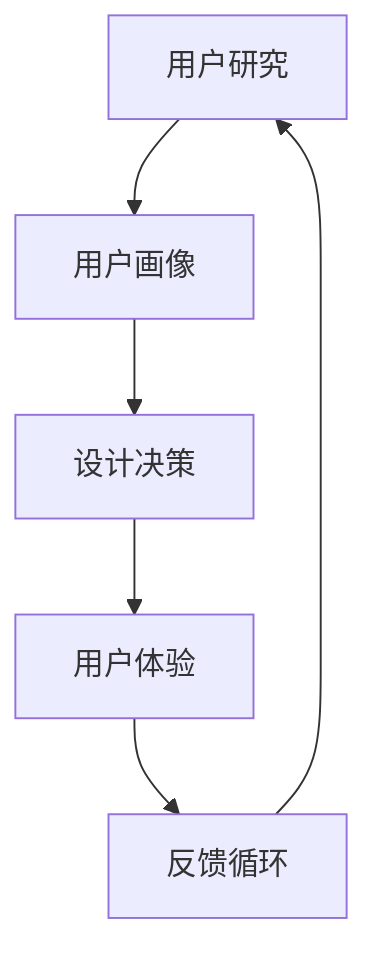
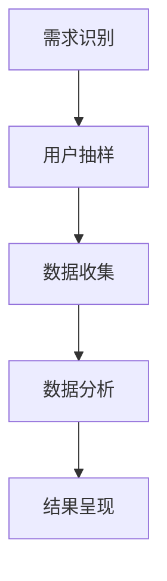
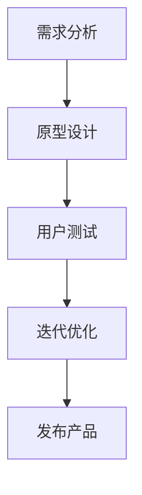
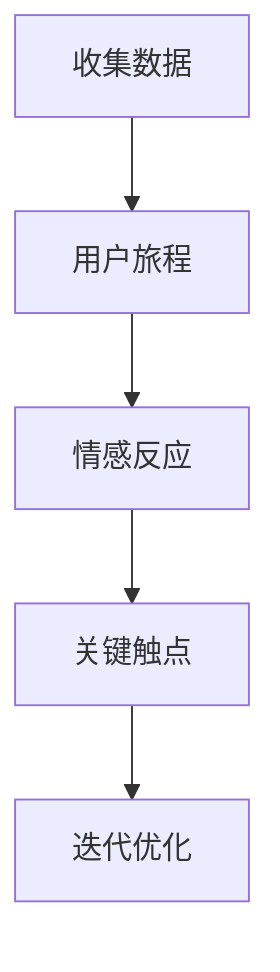
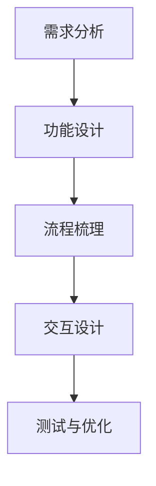
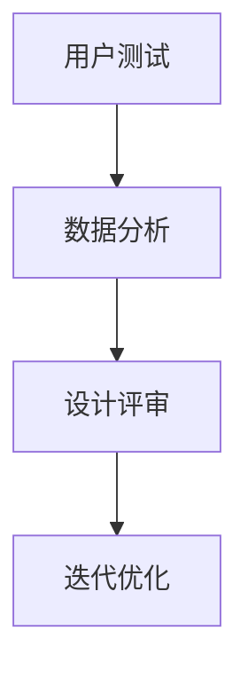
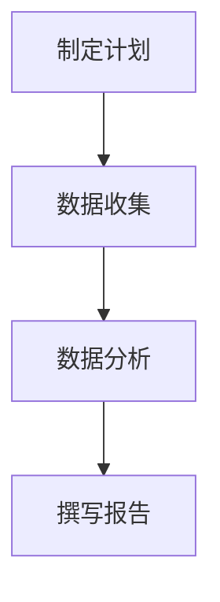
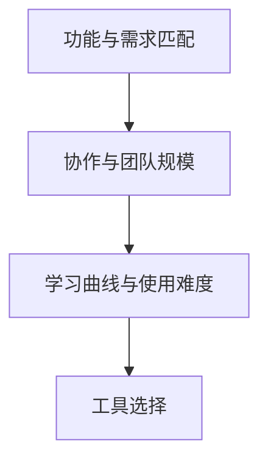
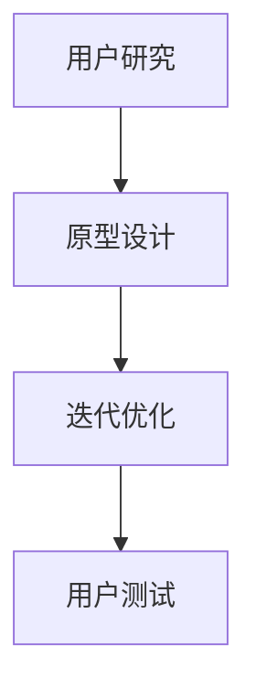

                 

# 技术创业的用户体验设计：打造让用户爱不释手产品的方法

> **关键词：**用户体验设计、用户中心设计、产品迭代、人工智能、设计工具

> **摘要：**本文将深入探讨技术创业中的用户体验设计，通过明确用户中心设计理念、用户体验设计方法、设计实践、用户体验评估以及未来趋势，助力创业者打造让用户爱不释手的产品。我们不仅将介绍用户体验设计的基本原则和流程，还将通过实际案例展示其应用效果，同时展望用户体验设计在未来的发展方向。

### 目录大纲

#### 第一部分：用户体验设计基础

- **第1章：用户体验设计概述**
  - 用户中心设计理念
  - 用户研究的步骤与方法
  - 设计原则与流程

- **第2章：用户体验设计方法**
  - 用户体验地图与流程设计
  - 用户画像与需求分析

- **第3章：用户体验设计实践**
  - 产品设计策略
  - 产品设计的迭代与优化

#### 第二部分：用户体验设计方法

- **第4章：用户体验评估**
  - 用户体验评估指标
  - 用户体验评估实践

- **第5章：实战案例**
  - 案例研究：成功用户体验设计的实践

#### 第三部分：用户体验设计工具与资源

- **第6章：用户体验设计工具**
  - 常用用户体验设计工具介绍
  - 工具的比较与选择

- **第7章：用户体验设计方法**
  - 用户体验设计的主要方法
  - 方法的选择与应用

#### 第四部分：未来发展趋势

- **第8章：用户体验设计未来趋势**
  - 人工智能在用户体验设计中的应用
  - 用户体验设计的未来发展

---

接下来，我们将逐步深入到用户体验设计的每个关键环节，包括其基本原则、流程方法、实战评估以及未来趋势。

---

### 第1章：用户体验设计概述

#### 1.1 用户中心设计理念

用户中心设计（User-Centered Design，简称UCD）是一种以用户需求为核心的设计理念。它强调在设计的每个阶段都考虑用户的需求、偏好和行为。用户中心设计不仅仅是满足用户的基本需求，更注重提供超越用户期望的卓越体验。

**核心概念与联系：**

用户中心设计涉及多个核心概念，包括：

1. **用户研究**：通过调查、访谈、观察等方法深入了解用户的需求和偏好。
2. **用户画像**：基于用户研究，构建典型用户的形象，用于指导设计决策。
3. **用户体验**：用户在使用产品过程中的感受和体验。

**Mermaid流程图：**



**伪代码示例：**

```python
# 用户研究伪代码
def user_research():
    # 进行问卷调查
    survey_results = conduct_survey()
    # 进行用户访谈
    interview_data = conduct_interviews()
    # 进行行为观察
    observation_notes = conduct_observations()
    # 数据整合
    user_data = integrate_data(survey_results, interview_data, observation_notes)
    return user_data

# 用户画像构建伪代码
def build_user_personas(user_data):
    # 从数据中提取用户特征
    user_features = extract_user_features(user_data)
    # 构建用户画像
    user_personas = create_personas(user_features)
    return user_personas

# 设计决策与用户体验反馈循环伪代码
def design_decision_loop(user_personas):
    # 根据用户画像进行设计决策
    design_decisions = make_design_decisions(user_personas)
    # 实施设计并收集用户反馈
    user_feedback = collect_user_feedback(design_decisions)
    # 根据反馈调整设计
    updated_design = adjust_design(design_decisions, user_feedback)
    return updated_design
```

#### 1.2 用户研究的步骤与方法

用户研究是用户体验设计的基础，通过系统的方法了解用户的需求和偏好，为设计提供依据。

**步骤：**

1. **需求识别**：明确研究目标和问题。
2. **用户抽样**：选择具有代表性的用户群体。
3. **数据收集**：通过问卷调查、访谈、行为观察等方法收集数据。
4. **数据分析**：对收集到的数据进行整理和分析。
5. **结果呈现**：将分析结果转化为可操作的设计指南。

**方法：**

- **问卷调查**：通过设计结构化的问卷收集大量用户反馈。
- **用户访谈**：面对面或在线访谈，深入了解用户需求和体验。
- **行为观察**：直接观察用户在使用产品或服务时的行为和反应。

**Mermaid流程图：**



#### 1.3 设计原则与流程

用户体验设计需要遵循一系列原则，以确保设计的质量和用户满意度。

**原则：**

1. **以用户为中心**：始终将用户需求放在首位。
2. **简洁性**：避免过度设计，确保界面简洁直观。
3. **一致性**：保持界面元素和交互行为的一致性。
4. **可访问性**：确保产品对所有用户都是可用的，包括残障人士。

**流程：**

1. **需求分析**：明确产品的功能需求和用户体验目标。
2. **原型设计**：创建低保真或高保真原型，用于用户测试和反馈。
3. **迭代优化**：根据用户反馈不断迭代和改进设计。
4. **用户测试**：对原型进行测试，验证设计是否符合用户期望。

**Mermaid流程图：**



通过上述流程，可以确保设计过程有序、高效，同时不断提高产品的用户体验。

---

### 第2章：用户体验设计方法

#### 2.1 用户体验地图与流程设计

用户体验地图（User Experience Map，简称UX Map）是一种直观的视觉工具，用于展示用户在整个交互过程中的体验。它可以帮助设计师从用户的角度全面了解产品的使用场景、情感反应和行为路径。

**概念与作用：**

用户体验地图将用户的行为、情感和期望结合起来，形成一个完整的用户体验视图。它不仅展示了用户的旅程，还包括了用户在不同触点上的感受和体验。通过用户体验地图，设计师可以：

- **识别问题**：发现用户在使用过程中的痛点和不满意之处。
- **优化流程**：调整产品流程，以改善用户体验。
- **沟通协作**：将用户体验地图作为沟通工具，与团队成员、利益相关者共享设计意图。

**构建方法：**

1. **收集数据**：通过用户研究、访谈、问卷调查等获取用户数据。
2. **用户旅程**：绘制用户在使用产品或服务时的行为路径。
3. **情感反应**：记录用户在每个步骤中的情感反应。
4. **关键触点**：标识用户旅程中的关键触点。
5. **迭代优化**：根据反馈不断更新和优化用户体验地图。

**Mermaid流程图：**



**伪代码示例：**

```python
# 用户体验地图构建伪代码
def build_ux_map(user_journey, emotions, touchpoints):
    # 绘制用户旅程
    user_experience_map = visualize_user_journey(user_journey)
    # 添加情感反应
    user_experience_map += add_emotional_response(emotions)
    # 标识关键触点
    user_experience_map += mark_key_touchpoints(touchpoints)
    return user_experience_map
```

#### 2.2 用户体验流程设计

用户体验流程设计（User Experience Process Design）是确保用户在产品使用过程中能够顺畅、高效地完成任务的过程。它包括从用户需求分析、功能设计到交互设计的各个环节。

**概念与作用：**

用户体验流程设计旨在创建一个用户友好的流程，使用户能够轻松地完成目标。通过流程设计，设计师可以：

- **优化任务流程**：确保用户能够高效地完成所需任务。
- **减少认知负荷**：降低用户在学习产品使用过程中的认知负担。
- **提高用户满意度**：通过流畅的交互流程提升用户的整体体验。

**设计步骤：**

1. **需求分析**：确定用户的核心需求和使用场景。
2. **功能设计**：明确产品功能，确保满足用户需求。
3. **流程梳理**：设计用户完成任务的基本步骤。
4. **交互设计**：设计用户与产品交互的具体细节。
5. **测试与优化**：对设计进行测试，收集用户反馈，不断迭代和优化。

**Mermaid流程图：**



**伪代码示例：**

```python
# 用户体验流程设计伪代码
def design_ux_process(user_requirements, functions, interaction_details):
    # 确定需求
    requirements_met = check_user_requirements(user_requirements)
    # 设计功能
    designed_functions = create_functions(functions)
    # 梳理流程
    process_flows = define_process_flows(designed_functions)
    # 设计交互
    interaction_details = create_interactions(process_flows)
    # 测试与优化
    optimized_interactions = test_and_optimize(interaction_details)
    return optimized_interactions
```

通过用户体验地图和流程设计，设计师可以全面了解用户的需求和期望，从而创造出让用户爱不释手的产品。

---

### 第3章：用户体验设计实践

#### 3.1 产品设计的用户导向

用户导向设计（User-Oriented Design）是一种以用户为中心的设计方法，其核心在于确保产品设计过程始终围绕用户需求展开。这种方法强调设计师需要深入了解用户，并将用户的需求、行为和偏好作为设计决策的依据。

**核心要素：**

1. **用户研究**：通过用户研究，获取关于用户需求、行为和偏好的详细信息。
2. **用户画像**：基于用户研究，构建典型用户画像，用于指导设计决策。
3. **用户参与**：在设计和开发过程中，邀请用户参与，以获得真实的使用体验和反馈。
4. **迭代优化**：通过不断的迭代和优化，确保产品设计能够满足用户的实际需求。

**实践方法：**

1. **用户研究**：
   - **问卷调查**：设计结构化的问卷，收集用户的基本信息和需求。
   - **用户访谈**：通过一对一访谈，深入了解用户的需求和行为。
   - **行为观察**：直接观察用户在使用产品或服务时的行为和反应。

   **Mermaid流程图：**

   ```mermaid
   graph TD
       A[问卷调查] --> B[用户访谈]
       B --> C[行为观察]
       C --> D[数据整合]
   ```

2. **用户画像构建**：
   - **特征提取**：从用户研究中提取用户的关键特征，如年龄、职业、使用习惯等。
   - **画像构建**：将提取的特征整合，构建典型的用户画像。

   **伪代码示例：**

   ```python
   # 用户画像构建伪代码
   def build_user_personas(user_data):
       # 提取用户特征
       user_features = extract_user_features(user_data)
       # 构建用户画像
       user_personas = create_personas(user_features)
       return user_personas
   ```

3. **用户参与**：
   - **用户测试**：邀请用户参与原型测试，收集使用体验和反馈。
   - **用户反馈**：通过用户反馈，发现设计中的问题和改进点。

   **Mermaid流程图：**

   ```mermaid
   graph TD
       A[用户测试] --> B[用户反馈]
       B --> C[设计迭代]
   ```

4. **迭代优化**：
   - **设计迭代**：根据用户反馈，对设计进行迭代和优化。
   - **测试验证**：通过用户测试，验证设计改进的效果。

   **伪代码示例：**

   ```python
   # 设计迭代与优化伪代码
   def iterate_design(user_personas, user_feedback):
       # 根据用户反馈调整设计
       updated_design = adjust_design(user_personas, user_feedback)
       # 进行用户测试
       test_results = conduct_user_tests(updated_design)
       # 验证设计效果
       validation_passed = validate_design(updated_design, test_results)
       return validation_passed
   ```

通过用户导向设计，设计师可以确保产品在满足用户需求的同时，提供卓越的体验，从而赢得用户的喜爱。

#### 3.2 产品设计的迭代与优化

迭代与优化是产品设计过程中不可或缺的环节。通过不断地迭代和优化，设计师可以不断改进产品，使其更加符合用户的需求和期望。

**迭代原则：**

1. **用户导向**：每次迭代都应基于用户反馈，确保产品设计始终符合用户需求。
2. **快速迭代**：缩短迭代周期，加快设计改进速度。
3. **持续反馈**：持续收集用户反馈，及时调整设计。

**优化策略：**

1. **功能优化**：根据用户反馈，对产品功能进行改进和优化，提高用户体验。
2. **性能优化**：优化产品的性能，包括加载速度、响应时间等。
3. **界面优化**：调整界面设计，提高界面的易用性和美观度。

**实践方法：**

1. **用户测试**：通过用户测试，收集用户对产品的使用体验和反馈。
2. **数据分析**：对用户行为数据进行分析，发现产品设计中的问题和改进点。
3. **设计评审**：组织设计评审会议，评估设计改进的效果。

**Mermaid流程图：**



**伪代码示例：**

```python
# 迭代与优化伪代码
def iterate_and_optimize(product, user_feedback, analytics_data):
    # 根据用户反馈调整设计
    updated_design = adjust_design(product, user_feedback)
    # 分析用户行为数据
    insights = analyze_analytics_data(analytics_data)
    # 设计评审
    review_results = conduct_design_review(updated_design, insights)
    # 迭代优化
    optimized_product = iterate_design(updated_design, review_results)
    return optimized_product
```

通过迭代与优化，设计师可以不断改进产品，提高用户体验，从而打造出用户喜爱的产品。

---

### 第4章：用户体验评估

用户体验评估（User Experience Assessment）是确保产品设计符合用户期望和需求的重要环节。通过评估，设计师可以了解产品的用户体验水平，发现存在的问题，并采取相应的优化措施。

**评估指标：**

1. **易用性**：用户能否轻松地完成目标任务。
2. **满意度**：用户对产品的整体满意度。
3. **参与度**：用户对产品的使用频率和深度。
4. **学习成本**：用户学习产品所需的时间和难度。

**定量与定性方法：**

1. **定量方法**：
   - **问卷调查**：通过设计结构化的问卷，收集大量用户的反馈数据。
   - **用户测试**：在实验室环境中，邀请用户进行任务测试，记录用户的行为数据。

   **Mermaid流程图：**

   ```mermaid
   graph TD
       A[问卷调查] --> B[用户测试]
       B --> C[数据分析]
   ```

2. **定性方法**：
   - **用户访谈**：通过一对一访谈，深入了解用户的需求和体验。
   - **焦点小组**：组织一组用户，讨论产品设计和体验。

   **Mermaid流程图：**

   ```mermaid
   graph TD
       A[用户访谈] --> B[焦点小组]
       B --> C[结果分析]
   ```

**实施流程：**

1. **制定评估计划**：明确评估的目标、方法、指标和评估对象。
2. **收集数据**：通过问卷调查、用户测试、访谈等方法收集用户反馈和数据。
3. **数据分析**：对收集到的数据进行分析，识别问题和改进点。
4. **撰写评估报告**：将分析结果和改进建议整理成评估报告。

**Mermaid流程图：**



**伪代码示例：**

```python
# 用户体验评估伪代码
def conduct_ux_assessment(assessment_plan, user_feedback, analytics_data):
    # 数据收集
    collected_data = collect_data(user_feedback, analytics_data)
    # 数据分析
    analysis_results = analyze_data(collected_data)
    # 撰写评估报告
    assessment_report = create_assessment_report(analysis_results)
    return assessment_report
```

通过用户体验评估，设计师可以全面了解产品的用户体验水平，及时发现问题并优化设计，从而提升用户的满意度。

---

### 第5章：实战案例

#### 案例研究：成功用户体验设计的实践

本章节将通过两个实际案例，展示如何通过用户体验设计优化产品，提升用户满意度。

#### 案例一：某电商平台用户体验设计优化

**案例背景：**

某电商平台在用户增长过程中，发现用户在购物过程中存在一定的困扰，如搜索效率低、购物车管理不便等问题。为了提升用户体验，平台决定进行用户体验设计优化。

**设计策略与方法：**

1. **用户研究**：通过问卷调查、用户访谈等方法，了解用户的需求和痛点。
2. **原型设计**：基于用户研究，创建低保真原型，进行用户测试。
3. **迭代优化**：根据用户反馈，不断迭代和改进设计。
4. **用户测试**：通过用户测试，验证设计改进的效果。

**实践效果与反思：**

优化后的电商平台在搜索效率和购物车管理方面得到了显著提升，用户满意度大幅提高。通过迭代优化，平台不仅解决了用户的问题，还发现了一些潜在的需求，进一步优化了产品功能。

#### 案例二：某移动应用的用户体验升级

**案例背景：**

某移动应用在用户反馈中提到了界面设计不够美观、操作不便捷等问题。为了提升用户体验，应用团队决定对界面和交互进行升级。

**设计策略与方法：**

1. **用户研究**：通过用户访谈、行为观察等方法，了解用户的需求和偏好。
2. **界面设计**：根据用户研究，重新设计应用界面，使其更加美观和易用。
3. **交互优化**：改进应用的交互流程，提高用户的操作效率。
4. **用户测试**：通过用户测试，验证设计改进的效果。

**实践效果与反思：**

升级后的移动应用在界面美观度和操作便捷性方面得到了用户的高度评价。通过用户测试，团队发现了一些交互细节问题，进行了进一步的优化，使用户体验达到了新的高度。

通过以上案例，我们可以看到，成功的用户体验设计需要深入的用户研究、科学的原型设计和持续的迭代优化。只有真正理解用户需求，才能打造出让用户爱不释手的产品。

---

### 第6章：用户体验设计工具与方法

#### 6.1 用户体验设计工具

在用户体验设计中，使用合适的工具可以大大提高设计效率和效果。以下介绍几种常用的用户体验设计工具，以及如何选择和比较这些工具。

**常用用户体验设计工具介绍：**

1. **Sketch**：一款流行的界面设计工具，适用于创建高保真原型和界面设计。
2. **Figma**：基于网页的设计协作工具，支持多人实时协作和交互设计。
3. **Adobe XD**：适用于创建交互原型和界面设计的工具，具有丰富的组件和模板。
4. **Axure RP**：专业的原型设计工具，适用于创建高保真、交互丰富的原型。

**工具的比较与选择：**

1. **功能与需求匹配**：根据项目需求，选择具有相应功能的设计工具。
2. **协作与团队规模**：考虑团队规模和协作需求，选择支持多人协作的工具。
3. **学习曲线与使用难度**：评估工具的学习曲线和使用难度，确保团队成员能够快速上手。

**Mermaid流程图：**



#### 6.2 用户体验设计方法

用户体验设计方法是指在设计过程中采用的一系列策略和技术，用于创建高质量的用户体验。以下介绍几种主要的方法，以及如何选择和应用这些方法。

**用户体验设计的主要方法：**

1. **用户研究**：通过调查、访谈、观察等方法了解用户需求和偏好。
2. **原型设计**：创建低保真或高保真原型，用于用户测试和反馈。
3. **迭代优化**：根据用户反馈，不断迭代和改进设计。
4. **用户测试**：在实际环境中测试原型，验证设计的有效性。

**方法的选择与应用：**

1. **用户研究**：适用于项目初期，用于明确用户需求和设计方向。
2. **原型设计**：适用于设计过程中，用于快速验证设计思路和交互细节。
3. **迭代优化**：适用于整个设计周期，确保设计不断改进和优化。
4. **用户测试**：适用于项目后期，用于验证设计效果和用户满意度。

**Mermaid流程图：**



通过合适的工具和方法，设计师可以高效地完成用户体验设计，打造出让用户满意的产品。

---

### 第7章：用户体验设计的未来趋势

#### 7.1 人工智能在用户体验设计中的应用

随着人工智能（AI）技术的发展，用户体验设计也在不断演进。人工智能在用户体验设计中具有巨大的潜力，可以通过以下方式提升用户体验：

**人工智能在用户体验设计中的潜力：**

1. **个性化推荐**：利用机器学习算法，根据用户行为和偏好，提供个性化的产品推荐。
2. **自然语言处理**：通过语音识别和自然语言处理技术，实现更自然的用户交互。
3. **智能辅助**：利用AI技术，为用户提供智能化的操作指导和辅助功能。

**人工智能在用户体验设计中的应用案例：**

1. **个性化电商推荐系统**：通过分析用户的历史行为和偏好，为用户提供个性化的商品推荐。
2. **智能客服系统**：利用自然语言处理技术，实现与用户的智能对话，提供高效的服务。
3. **语音助手**：如Siri、Alexa等，通过语音交互，为用户提供便捷的操作和查询服务。

**伪代码示例：**

```python
# 个性化推荐系统伪代码
def personalized_recommendation(user_behavior, user_preferences):
    # 分析用户行为和偏好
    user_data = analyze_user_data(user_behavior, user_preferences)
    # 利用协同过滤算法推荐商品
    recommended_items = collaborative_filtering(user_data)
    return recommended_items

# 智能客服系统伪代码
def intelligent_csc(user_query):
    # 利用自然语言处理解析用户查询
    intent = parse_intent(user_query)
    # 根据意图提供相应回答
    response = generate_response(intent)
    return response
```

#### 7.2 用户体验设计的未来发展

随着技术的不断进步，用户体验设计也在不断演变。未来，用户体验设计将朝着以下几个方向发展：

**用户体验设计的未来趋势：**

1. **全渠道融合**：用户在不同设备上的体验将更加一致和无缝。
2. **沉浸式体验**：通过虚拟现实（VR）和增强现实（AR）技术，提供更加沉浸式的用户体验。
3. **数据驱动**：利用大数据和人工智能技术，实现更加精确的用户体验优化。

**用户体验设计在未来的挑战与机遇：**

**挑战：**

1. **技术整合**：如何将多种技术整合到用户体验设计中，提供一致的体验。
2. **隐私保护**：如何在提供个性化服务的同时，保护用户的隐私。

**机遇：**

1. **创新体验**：通过新技术，创造全新的用户体验，开拓新的市场。
2. **全球化**：随着互联网的普及，用户体验设计将更加注重全球化，满足不同地区用户的需求。

通过不断探索和适应新技术，用户体验设计将迎来更加广阔的发展空间。

---

### 结束语

用户体验设计是技术创业成功的关键之一。通过明确用户中心设计理念、掌握用户体验设计方法、实践设计策略和评估优化，创业者可以打造出让用户爱不释手的产品。同时，随着人工智能等新技术的应用，用户体验设计将迎来更多的创新和发展。希望本文能够为您的技术创业之路提供有价值的参考和启示。

---

### 作者信息

作者：AI天才研究院/AI Genius Institute & 禅与计算机程序设计艺术 /Zen And The Art of Computer Programming

