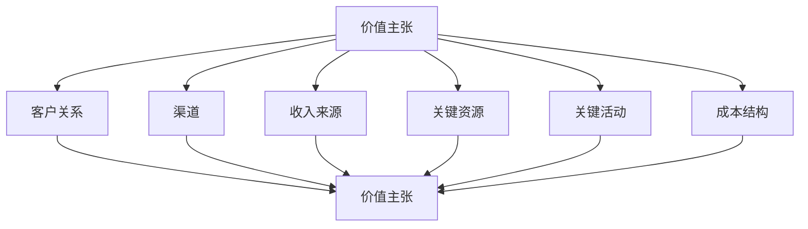

                 

### 《技术创业者的商业模式设计与优化》

#### 关键词：
- 商业模式
- 设计与优化
- 技术创业
- 创新策略
- 实战案例

#### 摘要：
本文旨在探讨技术创业者在商业模式设计与优化过程中所需掌握的理论和实践知识。通过对商业模式基础理论、设计原理、创新策略、实战方法和风险管理等方面的深入分析，本文为技术创业者提供了系统性、实用性的指导，帮助他们构建并优化具有竞争力的商业模式，实现可持续发展。

### 引言

技术创业是一个充满机遇和挑战的过程。在当今快速变化的科技环境中，技术创业者不仅需要具备创新的技术能力和项目开发经验，还需要具备敏锐的市场洞察力和商业运作能力。商业模式作为企业实现盈利和价值创造的关键工具，对于技术创业者的成功至关重要。

本文将围绕技术创业者的商业模式设计与优化展开讨论。首先，我们将介绍商业模式的基础理论，包括定义、历史发展和核心要素。接着，我们将探讨商业模式设计的原理和方法论，以及创新策略和实战技巧。随后，本文将深入分析商业模式优化与调整、风险管理以及创新与可持续发展等重要主题。最后，我们将通过实际案例和工具应用，为技术创业者提供具体的指导。

通过本文的阅读，技术创业者将能够系统地了解商业模式的构建和优化过程，掌握关键策略和工具，从而在激烈的市场竞争中脱颖而出，实现企业的长期发展。

### 第一部分：商业模式基础理论

#### 第1章：商业模式概述

##### 1.1 商业模式的定义与重要性

商业模式（Business Model）是指企业通过提供产品或服务以创造价值并实现盈利的方式。它涵盖了企业如何创造、传递和获取价值，以及如何管理其成本和收入等多个方面。商业模式不仅定义了企业的核心业务逻辑，还决定了企业在市场中的竞争策略和运营模式。

**定义**：
商业模式是一种系统化的方法，用于描述企业如何创造、传递和获取价值，以及如何管理其资源、活动和风险。它通常涉及以下几个方面：

1. **价值主张**：企业通过提供的产品或服务为客户创造的独特价值。
2. **客户关系**：企业与客户之间的互动方式和关系。
3. **渠道**：产品或服务传递到客户手中的路径。
4. **收入来源**：企业通过提供产品或服务所获得的收入。
5. **关键资源**：企业运营所必需的重要资产，包括资金、人力、技术、品牌等。
6. **关键活动**：企业为实现商业模式运作而进行的必要活动，包括研发、生产、营销、服务等。
7. **成本结构**：企业的运营成本构成，包括固定成本、变动成本、运营成本等。

**重要性**：
商业模式对于企业的成功至关重要，其重要性体现在以下几个方面：

1. **战略定位**：商业模式有助于企业明确其在市场中的定位和发展方向。
2. **资源整合**：通过商业模式设计，企业能够优化资源配置，提高运营效率。
3. **创新能力**：商业模式设计能够激发企业的创新能力，推动产品和服务的持续创新。
4. **竞争优势**：优秀的商业模式能够为企业提供持久的竞争优势，增强市场竞争力。
5. **可持续发展**：合理的商业模式有助于企业实现可持续发展，提高长期盈利能力。

##### 1.2 商业模式的历史发展与演变

商业模式的演变与社会经济的发展和技术进步密不可分。从历史角度来看，商业模式经历了几个重要的阶段：

1. **传统商业模式**：
   - **大规模制造**：20世纪初期，随着工业革命的推进，企业通过大规模制造降低成本，提高效率。
   - **分销渠道**：企业通过建立分销渠道将产品传递到消费者手中。
   - **产品导向**：企业以产品为中心，追求产品的标准化和质量控制。

2. **互联网时代商业模式**：
   - **平台经济**：互联网的发展催生了平台经济，如电商、共享经济等，企业通过搭建平台连接供需双方。
   - **用户体验**：互联网企业更加注重用户体验，通过个性化服务和创新产品设计吸引和留住客户。
   - **数据驱动**：企业利用大数据分析，优化决策和运营，提升客户满意度和运营效率。

3. **未来商业模式趋势**：
   - **智能化**：随着人工智能、物联网等技术的发展，商业模式将更加智能化和自动化。
   - **全球化**：全球化趋势使得企业可以更加灵活地配置资源，拓展国际市场。
   - **可持续发展**：企业需要更加注重社会责任和环境可持续性，实现商业与社会价值的共赢。

##### 1.3 商业模式的核心要素

商业模式的核心要素决定了企业如何创造、传递和获取价值。以下是商业模式中关键的核心要素：

1. **价值主张**：
   价值主张是企业通过提供产品或服务为客户创造的独特价值。它需要清晰地定义目标客户群体的需求和痛点，并提供独特的解决方案。

2. **客户关系**：
   客户关系是指企业与客户之间的互动方式，包括如何获取新客户、保留现有客户和拓展客户关系。企业需要制定有效的客户关系管理策略，提升客户满意度和忠诚度。

3. **渠道**：
   渠道是企业将产品或服务传递到客户手中的路径。企业可以选择直销、分销商、代理商等多种渠道，以适应不同市场和客户需求。

4. **收入来源**：
   收入来源是企业通过提供产品或服务所获得的收入。企业需要明确其主要的收入来源，并设计合理的盈利模式。

5. **关键资源**：
   关键资源是企业运营所必需的重要资产，包括资金、人力、技术、品牌等。企业需要识别并有效利用这些资源，以实现商业模式的运作。

6. **关键活动**：
   关键活动是企业为实现商业模式运作而进行的必要活动，包括研发、生产、营销、服务等。企业需要确保这些活动的高效运行，以实现价值创造。

7. **成本结构**：
   成本结构是指企业的运营成本构成，包括固定成本、变动成本和运营成本等。企业需要设计合理的成本结构，以最大化盈利。

##### 商业模式图示

为了更好地理解商业模式的核心要素，我们可以通过Mermaid流程图来展示它们之间的联系：

在这个流程图中，每个核心要素都是商业模式的重要组成部分，它们相互关联，共同构成了企业的商业模式。

### 第2章：商业模式设计原理

##### 2.1 设计流程与方法论

商业模式的成功设计需要经过系统化的流程和方法。以下是商业模式设计的基本流程和方法论：

1. **需求分析**：
   - **市场调研**：通过市场调研了解目标市场的需求、趋势和竞争情况。
   - **用户访谈**：与潜在用户进行深入交流，了解他们的需求和痛点。
   - **竞品分析**：分析竞争对手的商业模式，寻找差异化和创新点。

2. **价值主张设计**：
   - **确定目标客户**：明确目标客户群体和他们的需求。
   - **价值定位**：基于目标客户的需求，确定产品或服务的独特价值。
   - **价值验证**：通过原型测试和用户反馈，验证价值主张的有效性。

3. **客户关系设计**：
   - **获取新客户**：制定有效的客户获取策略，如营销、广告、渠道合作等。
   - **保留现有客户**：提供优质的客户服务和持续的价值，提高客户忠诚度。
   - **拓展客户关系**：通过客户关系管理，拓展客户的消费频次和消费金额。

4. **渠道设计**：
   - **选择渠道**：根据目标市场和客户需求，选择适合的渠道，如直销、分销商、电商平台等。
   - **渠道优化**：通过数据分析，不断优化渠道策略，提高渠道效率和效果。

5. **收入来源设计**：
   - **明确收入来源**：确定企业的主要收入来源，如产品销售、订阅服务、广告等。
   - **设计盈利模式**：根据收入来源，设计合理的盈利模式，确保企业的可持续盈利。

6. **关键资源和活动设计**：
   - **识别关键资源**：识别企业运营所必需的重要资源，如资金、技术、人才等。
   - **设计关键活动**：明确为实现商业模式运作所需的关键活动，如研发、生产、营销等。

7. **成本结构设计**：
   - **成本分析**：分析企业的成本构成，包括固定成本、变动成本和运营成本。
   - **成本优化**：通过成本控制和效率提升，降低运营成本，提高盈利能力。

**方法论**：

1. **设计思维**：
   - **用户中心**：以用户需求为核心，进行价值主张和客户关系设计。
   - **迭代创新**：通过不断测试和反馈，优化商业模式。

2. **用户故事地图**：
   - **用户行为**：绘制用户在各个阶段的行为路径，了解用户的痛点。
   - **场景分析**：分析用户在不同场景下的需求，设计解决方案。

3. **商业模式画布**：
   - **要素描述**：将商业模式的核心要素绘制在画布上，进行整体分析。
   - **互动关系**：分析各个要素之间的互动关系，优化商业模式。

##### 2.2 客户价值主张分析

客户价值主张是企业通过提供产品或服务为客户创造的独特价值。它是商业模式设计中的核心要素，决定了企业能否在市场中获得竞争优势。

**客户需求分析**：

1. **了解目标客户**：
   - **用户画像**：通过市场调研和用户访谈，了解目标客户的特征、需求和痛点。
   - **需求分类**：将需求分为基本需求、期望需求和惊喜需求，明确客户的核心需求。

2. **需求优先级**：
   - **优先级排序**：根据客户需求的紧急程度和重要性，对需求进行优先级排序。

3. **需求验证**：
   - **原型测试**：通过原型测试和用户反馈，验证客户需求的准确性和可行性。

**价值主张设计**：

1. **确定价值主张**：
   - **独特价值**：基于客户需求，确定产品或服务的独特价值。
   - **差异化**：通过差异化，使价值主张在市场中脱颖而出。

2. **价值主张验证**：
   - **用户反馈**：通过用户反馈，验证价值主张的有效性。
   - **市场调研**：通过市场调研，了解价值主张的市场接受度。

3. **价值主张调整**：
   - **持续优化**：根据用户反馈和市场调研结果，不断调整和优化价值主张。

##### 2.3 价值网络与合作伙伴关系

价值网络是指企业与其合作伙伴、供应商、客户等利益相关者之间的互动关系。合作伙伴关系是商业模式的重要组成部分，对于企业的成功至关重要。

**价值网络**：

1. **合作伙伴选择**：
   - **互补性**：选择与自身业务互补的合作伙伴，实现资源共享和优势互补。
   - **可靠性**：选择具有高可靠性和声誉的合作伙伴，降低合作风险。

2. **合作模式**：
   - **战略联盟**：通过战略联盟，共同开发市场，分享资源和收益。
   - **供应链合作**：与供应商和分销商建立稳定的供应链关系，确保供应链的高效运作。

3. **合作管理**：
   - **沟通协调**：建立有效的沟通协调机制，确保合作伙伴之间的信息共享和协同工作。
   - **合作评估**：定期评估合作伙伴的表现和合作效果，进行合作调整。

**合作伙伴关系**：

1. **信任与承诺**：
   - **建立信任**：通过诚信和履行承诺，建立与合作伙伴的信任关系。
   - **长期合作**：通过长期合作，降低交易成本，提高合作效率。

2. **利益共享**：
   - **收益分配**：合理分配收益，确保合作伙伴的利益。
   - **风险共担**：与合作伙伴共同承担风险，实现风险分担。

3. **共同成长**：
   - **知识共享**：与合作伙伴共享知识和资源，实现共同成长。
   - **市场开拓**：通过合作，共同开拓新市场，实现规模效应。

##### 2.4 商业模式创新策略

商业模式创新是企业在竞争激烈的市场中保持竞争优势的关键。以下是几种常见的商业模式创新策略：

**产品创新**：

1. **技术创新**：
   - **研发投入**：加大研发投入，推动技术创新。
   - **知识产权**：保护知识产权，防止技术被抄袭。

2. **产品设计**：
   - **用户体验**：注重用户体验，提升产品竞争力。
   - **差异化**：通过差异化设计，打造独特的品牌形象。

**服务创新**：

1. **服务流程**：
   - **优化流程**：优化服务流程，提高服务效率。
   - **定制化**：提供定制化服务，满足客户个性化需求。

2. **服务模式**：
   - **在线服务**：利用互联网，提供在线服务。
   - **客户关系管理**：通过客户关系管理，提升客户满意度。

**业务模式创新**：

1. **平台化**：
   - **搭建平台**：搭建平台，连接供需双方。
   - **生态系统**：构建生态系统，促进多方共赢。

2. **多元化**：
   - **拓展业务**：通过多元化业务拓展，分散风险。
   - **跨界融合**：通过跨界融合，实现业务创新。

##### 2.5 商业模式设计工具

在商业模式设计过程中，使用工具可以帮助企业更系统、直观地进行设计和优化。以下是一些常用的商业模式设计工具：

**商业模式画布**：

1. **画布构成**：
   - **9个核心要素**：价值主张、客户关系、渠道、收入来源、关键资源、关键活动、成本结构、合作伙伴、客户细分。
   - **要素关系**：通过画布，可以直观地展示各要素之间的关系。

2. **使用方法**：
   - **整体分析**：通过画布，可以整体分析商业模式的各个要素，找到优化点。
   - **迭代优化**：通过画布，可以不断迭代优化商业模式，提高其竞争力。

**价值网络图**：

1. **构成**：
   - **主体**：企业及其合作伙伴、供应商、客户等。
   - **互动关系**：各主体之间的互动关系，如交易、合作、竞争等。

2. **使用方法**：
   - **分析互动**：通过价值网络图，可以分析各主体之间的互动关系，找到优化合作方式。
   - **战略规划**：通过价值网络图，可以制定战略规划，优化资源配置。

**用户故事地图**：

1. **构成**：
   - **用户行为**：用户在不同场景下的行为路径。
   - **用户需求**：用户在不同场景下的需求。

2. **使用方法**：
   - **用户理解**：通过用户故事地图，可以更深入地理解用户需求，设计满足用户需求的产品或服务。
   - **场景分析**：通过用户故事地图，可以分析用户在不同场景下的需求，优化产品或服务设计。

##### 2.6 商业模式验证

商业模式验证是商业模式设计的重要环节，通过验证可以确保商业模式的有效性和可行性。以下是商业模式验证的几个关键步骤：

1. **市场调研**：
   - **目标市场**：确定目标市场，了解市场需求和竞争情况。
   - **用户反馈**：通过用户访谈和调研，获取用户对价值主张和商业模式的反馈。

2. **试点项目**：
   - **试点方案**：制定试点项目方案，确定试点范围和目标。
   - **实施监控**：在试点项目中实施商业模式，监控项目进展和效果。

3. **数据分析**：
   - **数据收集**：收集试点项目数据，包括用户反馈、收入、成本等。
   - **效果评估**：通过数据分析，评估商业模式的有效性和可行性。

4. **调整优化**：
   - **反馈调整**：根据试点结果，调整商业模式，优化价值主张、客户关系、渠道等。
   - **再次验证**：在调整后，再次进行试点验证，确保商业模式的有效性。

##### 2.7 商业模式设计案例

通过分析成功的商业模式设计案例，可以了解不同企业在商业模式设计过程中的经验和教训。以下是一些典型的商业模式设计案例：

1. **案例1：Airbnb**
   - **价值主张**：提供个性化的住宿体验，满足用户对独特住宿环境的需求。
   - **客户关系**：通过用户评价和信任机制，建立良好的客户关系。
   - **渠道**：利用互联网平台，连接房东和租户，实现高效的信息传递和交易。

2. **案例2：小米**
   - **价值主张**：通过高性价比的产品，满足用户对性价比的需求。
   - **客户关系**：通过社区互动和用户反馈，建立紧密的客户关系。
   - **渠道**：采用直销模式，减少中间环节，提高产品竞争力。

3. **案例3：阿里巴巴**
   - **价值主张**：提供电子商务解决方案，帮助中小企业拓展市场。
   - **客户关系**：通过大数据分析和个性化推荐，提升用户体验。
   - **渠道**：搭建电商平台，连接商家和消费者，实现高效的交易和配送。

通过这些案例，我们可以看到，成功的商业模式设计不仅需要创新的价值主张和高效的运营模式，还需要与客户建立紧密的关系，并通过数据分析和反馈不断优化。这些经验对于技术创业者在设计商业模式时具有重要的借鉴意义。

### 第二部分：商业模式设计与优化实践

#### 第4章：商业模式设计实战

##### 4.1 创业初期的商业模式设计

在创业初期，技术创业者面临资源有限、市场不确定性强等挑战。因此，商业模式设计需要特别注重以下几个关键点：

**1. 简化商业模式**：
- **核心价值主张**：在创业初期，应明确并聚焦于最核心的价值主张，避免过多功能和服务的叠加。
- **关键资源**：识别并集中利用有限的资源，如人力、资金、技术等。
- **关键活动**：专注于最关键的运营活动，确保核心业务的顺利开展。

**2. 快速验证市场**：
- **最小可行产品（MVP）**：通过开发MVP，快速验证市场需求和产品可行性。
- **用户反馈**：积极收集用户反馈，了解用户需求和市场反应，及时调整商业模式。

**3. 高效资源配置**：
- **成本控制**：在资源有限的情况下，通过精细化管理和成本控制，确保资金的有效利用。
- **灵活调整**：根据市场反馈和资源变化，灵活调整商业模式，以适应不断变化的市场环境。

**案例**：滴滴出行的创业初期
- **价值主张**：提供便捷的出租车叫车服务，满足用户的出行需求。
- **渠道**：通过手机APP连接乘客和司机，实现信息传递和交易。
- **收入来源**：主要通过向乘客收取服务费来获得收入。
- **资源利用**：利用移动互联网技术和大数据分析，优化匹配效率和用户体验。

滴滴出行为创业初期设计的简化商业模式，使其能够在短时间内快速占领市场，并在后续发展中不断优化和扩展。

##### 4.2 企业成长期的商业模式优化

在企业成长期，随着市场份额的扩大和业务的多元化，商业模式需要更加精细化、系统化，以适应企业发展的需求。以下是几个关键点：

**1. 扩大市场份额**：
- **品牌建设**：通过市场营销和品牌推广，提高品牌知名度和美誉度。
- **渠道拓展**：扩大销售渠道，包括线上平台和线下实体店，提高市场覆盖率。
- **产品线扩展**：根据市场需求和用户反馈，推出更多产品和服务，满足不同客户群体的需求。

**2. 提高运营效率**：
- **流程优化**：通过流程优化和标准化，减少不必要的环节，提高运营效率。
- **供应链管理**：优化供应链管理，降低采购成本，提高供应链的灵活性和响应速度。
- **技术创新**：利用新技术，如物联网、人工智能等，提高生产效率和服务质量。

**3. 资源整合与优化**：
- **人力资源**：通过人才引进和培训，提升团队整体能力。
- **资本运作**：通过股权融资、债务融资等手段，优化资本结构，提高资金利用效率。
- **合作伙伴关系**：与供应商、分销商、服务提供商等建立长期稳定的合作关系，实现资源共享和优势互补。

**案例**：阿里巴巴的成长期商业模式优化
- **价值主张**：提供电子商务解决方案，帮助中小企业拓展市场。
- **客户关系**：通过大数据分析和个性化推荐，提升用户体验和客户满意度。
- **渠道**：搭建电商平台，连接商家和消费者，实现高效的交易和配送。
- **收入来源**：通过广告收入、交易佣金、云计算服务等多元化收入模式。

阿里巴巴在成长期通过不断优化和扩展其商业模式，成功从一家电子商务公司发展成为全球知名的高科技企业。

##### 4.3 企业转型期的商业模式创新

在企业转型期，企业可能面临市场需求变化、技术变革、竞争加剧等挑战，需要通过商业模式创新来应对。以下是几个关键点：

**1. 持续创新**：
- **技术驱动**：紧跟技术发展趋势，利用新技术推动商业模式创新。
- **产品创新**：通过产品创新，满足市场需求和用户期望。
- **服务创新**：通过服务创新，提升用户体验和客户满意度。

**2. 业务多元化**：
- **跨界融合**：通过跨界合作和业务拓展，实现业务多元化。
- **生态系统建设**：构建生态系统，吸引合作伙伴，实现多方共赢。

**3. 管理变革**：
- **组织调整**：通过组织结构调整，提高企业适应市场变化的能力。
- **管理创新**：通过管理创新，提高企业运营效率和决策质量。

**案例**：IBM的转型期商业模式创新
- **价值主张**：从传统的硬件销售转向提供综合性的IT解决方案和服务。
- **客户关系**：通过建立客户关系管理平台，提供个性化的解决方案。
- **渠道**：通过线上线下结合，拓展市场覆盖面。
- **收入来源**：通过多元化的收入模式，包括软件服务、咨询服务、云计算服务等。

IBM通过商业模式创新，成功转型为一家提供综合IT解决方案和服务的全球领先企业。

##### 4.4 商业模式设计案例解析

**国内案例**：小米

- **创业初期的商业模式设计**：
  - **价值主张**：提供高性能、高品质、高性价比的智能手机和其他电子产品，满足消费者对性价比的需求。
  - **客户关系**：通过线上社区和粉丝互动，建立紧密的客户关系。
  - **渠道**：主要通过电商平台和自建渠道销售产品。

- **成长期的商业模式优化**：
  - **品牌建设**：通过市场营销和品牌推广，提高品牌知名度和美誉度。
  - **渠道拓展**：扩大线下渠道，包括小米之家和授权店，提高市场覆盖率。
  - **产品线扩展**：推出更多产品，包括智能硬件、智能家居、IoT产品等。

- **转型期的商业模式创新**：
  - **业务多元化**：通过跨界合作和业务拓展，进入金融科技、互联网服务等领域。
  - **生态系统建设**：构建智能生态链，吸引更多合作伙伴，实现资源整合和优势互补。

**国际案例**：亚马逊

- **创业初期的商业模式设计**：
  - **价值主张**：提供便捷的在线购物体验，满足消费者对商品多样性和便捷性的需求。
  - **客户关系**：通过顾客反馈和推荐系统，提高用户满意度和忠诚度。
  - **渠道**：主要通过电子商务平台进行商品销售。

- **成长期的商业模式优化**：
  - **物流体系**：建立自有的物流配送体系，提高配送效率和用户体验。
  - **云计算服务**：通过亚马逊云计算服务（AWS），提供云计算解决方案，拓展收入来源。

- **转型期的商业模式创新**：
  - **平台化**：通过亚马逊平台，连接全球卖家和消费者，构建全球电商生态系统。
  - **大数据分析**：利用大数据分析，优化库存管理和用户推荐，提升运营效率。

通过以上案例解析，我们可以看到，成功的商业模式设计需要在不同阶段灵活调整和优化，以适应市场变化和用户需求。同时，商业模式创新是企业持续发展的关键，通过不断创新，企业可以在激烈的市场竞争中脱颖而出，实现长期发展。

### 第三部分：商业模式优化与调整

#### 第5章：商业模式优化与调整

##### 5.1 商业模式评估与诊断

商业模式的评估与诊断是优化与调整的前提和基础。通过评估和诊断，企业可以了解自身商业模式的现状，发现问题并制定相应的优化策略。以下是商业模式评估与诊断的几个关键步骤：

**1. 确定评估指标**：
- **盈利能力**：评估企业的收入、利润率、现金流等指标。
- **市场份额**：评估企业在其目标市场中的占有率。
- **客户满意度**：通过用户反馈和满意度调查，了解客户对企业产品和服务的评价。
- **运营效率**：评估企业的运营成本、生产效率、供应链管理等方面。

**2. 收集数据**：
- **财务数据**：收集企业的财务报表、收入和成本数据。
- **市场数据**：收集市场调研报告、竞争对手分析、用户反馈等。
- **内部数据**：收集企业内部的运营数据、员工反馈等。

**3. 分析数据**：
- **财务分析**：通过财务比率、趋势分析等方法，评估企业的盈利能力和财务健康状况。
- **市场分析**：通过市场趋势、用户需求、竞争环境等分析，评估企业市场地位和竞争力。
- **内部分析**：通过流程分析、效率分析等，评估企业内部运营状况和优化空间。

**4. 诊断问题**：
- **定位问题**：通过数据分析，找出商业模式中的关键问题，如盈利模式不合理、运营效率低下、市场定位不准确等。
- **分析原因**：对定位的问题进行深入分析，找出导致问题的根本原因。

**案例**：苹果公司的商业模式评估与诊断
- **盈利能力**：苹果公司通过iPhone、iPad等产品的销售，实现了较高的利润率和现金流。
- **市场份额**：苹果公司在智能手机和电脑市场中占有较大的市场份额。
- **客户满意度**：苹果公司通过优质的客户服务和产品体验，获得了高客户满意度。
- **运营效率**：苹果公司通过精细化的供应链管理和高效的生产流程，实现了较高的运营效率。

然而，苹果公司在某些市场和产品线上仍面临竞争压力，如智能手机市场的华为和三星，电脑市场的联想和戴尔。通过评估和诊断，苹果公司发现其需要进一步优化产品创新和市场营销策略，以提高市场竞争力。

##### 5.2 商业模式优化策略与方法

商业模式的优化是企业长期发展的重要任务。通过优化，企业可以提升盈利能力、市场占有率和运营效率。以下是几种常见的商业模式优化策略与方法：

**1. 价值链优化**：
- **降低成本**：通过优化生产流程、供应链管理等方式，降低成本，提高盈利能力。
- **提高附加值**：通过技术创新、产品升级等方式，提高产品或服务的附加值，增加收入来源。
- **优化资源配置**：通过合理配置资源，提高资源利用效率，减少浪费。

**2. 市场定位优化**：
- **细分市场**：通过市场细分，明确目标客户群体，提供更个性化的产品或服务。
- **品牌定位**：通过品牌定位，提升品牌形象和市场认知度，增强市场竞争力。
- **渠道优化**：通过优化渠道策略，提高市场覆盖率和销售效率。

**3. 收入模式优化**：
- **多元化收入来源**：通过推出新的产品或服务，拓展收入来源，降低对单一产品的依赖。
- **提高毛利率**：通过优化成本结构和提升产品质量，提高毛利率，增加盈利空间。
- **创新收费模式**：通过订阅模式、按需收费等方式，创新收费模式，提高收入稳定性。

**4. 组织结构优化**：
- **扁平化管理**：通过扁平化管理，减少管理层次，提高决策效率和执行力。
- **能力建设**：通过培训和引进人才，提升团队的整体能力和专业素质。
- **流程优化**：通过流程优化，简化工作流程，提高工作效率。

**案例**：谷歌的商业模式优化
- **价值链优化**：通过技术创新和算法优化，提高广告投放的精准性和效果，提高广告收入。
- **市场定位优化**：通过全球化扩张，进入新市场，拓展业务范围，提高市场份额。
- **收入模式优化**：通过推出云计算服务、企业解决方案等，实现收入多元化，降低对广告收入的依赖。

通过商业模式优化，谷歌成功从一家搜索引擎公司转型为一家全球领先的科技企业，实现了持续的增长和盈利。

##### 5.3 商业模式调整案例分析

商业模式的调整是企业应对市场变化和竞争压力的必要手段。以下是对几个典型企业的商业模式调整案例分析：

**案例1：诺基亚的转型**

诺基亚曾是手机市场的领导者，但在智能手机时代未能及时调整商业模式，导致市场份额大幅下降。为了重振业务，诺基亚进行了以下调整：

- **产品转型**：从传统的功能手机转向智能手机，引入Android系统，提升产品竞争力。
- **市场定位**：从全球市场转向重点市场，专注于高端智能手机市场。
- **合作伙伴关系**：与微软合作，推出Windows Phone系统，获得技术支持。

通过这些调整，诺基亚逐渐恢复了市场竞争力，并在智能手机市场占据了一定的份额。

**案例2：亚马逊的转型**

亚马逊最初是一家电子商务公司，后来通过扩展业务范围，成为一家综合性的科技公司。以下是亚马逊的商业模式调整：

- **业务多元化**：通过推出云计算服务（AWS）、数字内容服务（如亚马逊Prime Video）等，实现业务多元化。
- **全球化扩张**：通过在多个国家和地区建立仓储和配送网络，拓展国际市场。
- **技术创新**：通过不断研发新技术，如人工智能、机器学习等，提升服务质量和用户体验。

通过这些调整，亚马逊成功实现了从电子商务公司向综合性科技公司的转型，实现了持续增长和盈利。

**案例3：微软的转型**

微软从一家操作系统和办公软件公司转型为一家云计算和人工智能公司。以下是微软的商业模式调整：

- **云计算战略**：通过推出微软云计算服务（Azure），进军云计算市场。
- **人工智能研发**：通过收购人工智能公司，加强人工智能技术研发。
- **软件即服务（SaaS）**：通过推出SaaS产品，拓展收入来源。

通过这些调整，微软成功实现了从传统软件公司向云计算和人工智能公司的转型，成为全球领先的科技公司之一。

通过以上案例分析，我们可以看到，成功的商业模式调整需要企业具备敏锐的市场洞察力和灵活的应对能力。通过持续的创新和调整，企业可以在竞争激烈的市场中找到自己的定位，实现可持续发展。

### 第四部分：商业模式风险管理

#### 第6章：商业模式风险管理

##### 6.1 风险识别与评估

在商业模式设计和实施过程中，风险识别与评估是确保商业模式可持续发展和成功实施的重要环节。以下是如何进行风险识别与评估的具体步骤和方法：

**1. 风险识别**

**市场风险**：
- **市场波动**：市场需求和价格波动的风险，如经济衰退或市场饱和。
- **竞争风险**：来自竞争对手的压力和威胁，如技术创新或价格战。

**技术风险**：
- **技术落后**：技术过时或无法跟上市场发展趋势的风险。
- **知识产权风险**：知识产权被侵犯或保护不力的风险。

**财务风险**：
- **资金链断裂**：因资金不足导致运营困难的风险。
- **融资风险**：融资渠道不稳定或融资成本高的风险。

**运营风险**：
- **供应链中断**：供应商或物流问题导致供应链中断的风险。
- **人员流失**：关键员工流失对运营的影响。

**法律风险**：
- **法规变化**：政策法规变化对业务运营的影响。
- **合规风险**：业务运营不符合相关法律法规的风险。

**2. 风险评估**

**定性评估**：
- **风险可能性**：根据风险发生概率进行评估。
- **风险影响程度**：根据风险发生对业务的影响程度进行评估。

**定量评估**：
- **预期损失**：通过统计数据和模型预测风险可能导致的损失。
- **风险评分**：结合定性和定量评估，对风险进行评分。

**3. 风险优先级排序**

根据风险评估结果，对风险进行优先级排序，重点关注高可能性、高影响程度的风险。这有助于企业制定优先处理的风险管理计划。

**案例**：特斯拉的商业模式风险识别与评估

特斯拉在发展过程中面临多种风险，其风险识别与评估过程如下：

**市场风险**：
- **市场竞争**：电动汽车市场竞争激烈，传统汽车制造商和新兴电动汽车制造商的竞争压力。
- **政策变化**：电动汽车补贴政策变化对市场需求的影响。

**技术风险**：
- **电池技术**：电池技术瓶颈和竞争压力，如能量密度、续航里程、安全性等问题。
- **自动驾驶技术**：自动驾驶技术的发展进度和安全性问题。

**财务风险**：
- **融资压力**：特斯拉需要大量资金支持研发和产能扩张。
- **债务负担**：高额债务可能导致资金链断裂。

**运营风险**：
- **供应链管理**：电池供应不稳定，可能导致生产中断。
- **人员流失**：特斯拉在人才招聘和留任方面面临挑战。

通过识别和评估这些风险，特斯拉能够制定相应的风险管理策略，降低风险对企业运营和发展的负面影响。

##### 6.2 风险应对与缓解策略

在识别和评估商业模式中的风险后，企业需要制定相应的风险应对与缓解策略，以减少风险对企业运营和发展的负面影响。以下是一些常见风险应对与缓解策略：

**1. 风险规避**

- **业务转移**：通过调整业务方向，避开高风险的市场或行业。
- **合同条款**：在合同中设置风险转移条款，将风险转嫁给合作伙伴。

**2. 风险降低**

- **多元化**：通过业务多元化，降低单一市场或业务线风险。
- **技术创新**：通过技术创新，提高产品竞争力，降低市场风险。
- **供应链管理**：优化供应链管理，提高供应链的灵活性和响应速度。

**3. 风险承担**

- **风险自留**：对低可能性、低影响程度的风险，企业可以选择承担。
- **保险**：通过购买保险，将风险转移给保险公司。

**4. 风险缓解**

- **应急预案**：制定应急预案，降低风险发生时的损失。
- **风险监控**：建立风险监控系统，实时监控风险指标，及时发现并处理潜在风险。

**案例**：阿里巴巴的风险应对与缓解策略

**市场风险**：
- **多元化市场**：阿里巴巴通过拓展国际市场，降低国内市场波动的影响。
- **技术创新**：通过不断的技术创新，提高平台竞争力，应对市场变化。

**技术风险**：
- **技术研发**：阿里巴巴加大技术研发投入，保持技术领先。
- **信息安全**：建立完善的信息安全管理体系，保障用户数据安全。

**财务风险**：
- **融资渠道**：通过股权融资、债务融资等多元化融资渠道，降低融资风险。
- **现金流管理**：通过精细化的现金流管理，确保企业资金链稳定。

**运营风险**：
- **供应链优化**：与多家供应商建立长期合作关系，提高供应链稳定性。
- **人才储备**：通过人才引进和培养，提高企业的人才储备和管理能力。

通过这些策略，阿里巴巴能够有效应对和缓解商业模式中的各种风险，确保企业的稳定发展和持续增长。

##### 6.3 风险管理与决策支持系统

为了更好地管理商业模式中的风险，企业需要建立一套有效的风险管理与决策支持系统。以下是如何构建风险管理系统的几个关键步骤：

**1. 风险管理组织架构**

- **风险管理委员会**：设立风险管理委员会，负责制定和监督企业风险管理的政策和流程。
- **风险管理部门**：设立专门的风险管理部门，负责日常的风险识别、评估和监控工作。

**2. 风险管理流程**

- **风险识别**：通过市场调研、内部审计、员工反馈等方式，识别企业面临的各种风险。
- **风险评估**：对识别出的风险进行评估，确定风险的可能性和影响程度。
- **风险应对**：根据风险评估结果，制定相应的风险应对策略。
- **风险监控**：建立风险监控系统，实时监控风险指标，及时处理风险事件。

**3. 决策支持系统**

- **数据收集与分析**：建立数据收集和分析系统，收集企业内外部的数据，进行风险分析和预测。
- **风险预警机制**：通过数据分析和模型预测，建立风险预警机制，提前发现潜在风险。
- **决策支持工具**：开发风险决策支持工具，为管理层提供风险分析和决策支持。

**案例**：华为的风险管理与决策支持系统

华为作为全球领先的信息与通信技术（ICT）解决方案提供商，建立了完善的风险管理与决策支持系统：

**风险管理组织架构**：
- **风险管理委员会**：由公司高级管理层组成，负责制定和监督企业风险管理政策和流程。
- **风险管理部门**：设立风险管理部门，负责日常的风险识别、评估和监控工作。

**风险管理流程**：
- **风险识别**：通过定期市场调研、内部审计、员工反馈等方式，识别企业面临的各种风险。
- **风险评估**：对识别出的风险进行评估，确定风险的可能性和影响程度，并制定风险应对策略。
- **风险应对**：根据风险评估结果，制定相应的风险应对策略，包括风险规避、风险降低、风险承担等。
- **风险监控**：建立风险监控系统，实时监控风险指标，及时处理风险事件。

**决策支持系统**：
- **数据收集与分析**：通过大数据分析和人工智能技术，收集企业内外部的数据，进行风险分析和预测。
- **风险预警机制**：建立风险预警机制，提前发现潜在风险，并通过决策支持工具为管理层提供风险分析和决策支持。

通过这一套完整的风险管理与决策支持系统，华为能够更好地识别、评估和管理风险，确保企业的稳定发展和持续增长。

### 第五部分：商业模式创新与可持续发展

#### 第7章：商业模式创新与可持续发展

##### 7.1 创新商业模式与生态构建

商业模式的创新不仅能够提升企业的竞争力，还能够推动整个产业的可持续发展。在创新商业模式的过程中，构建一个健康的生态系统是关键。以下是关于创新商业模式和生态构建的几个重要方面：

**1. 生态系统构建**

- **合作伙伴网络**：构建一个多元化的合作伙伴网络，包括供应商、分销商、服务提供商等，实现资源共享和协同发展。
- **开放平台**：搭建开放平台，吸引第三方开发者、合作伙伴加入，共同创新和拓展业务。
- **利益共享**：通过利益共享机制，如分成模式、合作利润等，确保各方在生态系统中获得合理的收益。

**2. 价值创造**

- **跨界融合**：通过跨界合作，将不同领域的优势资源整合，创造新的价值。
- **共享经济**：通过共享模式，提高资源利用效率，降低成本，为各方创造更多价值。
- **绿色发展**：注重环保和社会责任，通过绿色技术和可持续生产方式，创造环境和社会价值。

**3. 风险共担**

- **联合创新**：通过联合创新，分担创新风险，提高创新的成功率。
- **合作共赢**：通过合作共赢，确保各方在生态系统中实现互利共赢，共同应对市场变化和挑战。

**案例**：特斯拉的生态系统构建

特斯拉通过构建一个以电动汽车为核心的生态系统，推动了整个新能源汽车行业的发展。以下是特斯拉生态系统构建的几个关键点：

- **合作伙伴网络**：特斯拉与电池制造商、零部件供应商等建立了紧密的合作关系，确保供应链的稳定和高效。
- **开放平台**：特斯拉推出了Autopilot自动驾驶系统和Powerwall储能系统，吸引了众多第三方开发者参与开发和应用。
- **价值创造**：特斯拉不仅提供电动汽车，还通过能源解决方案和智能家居产品，为消费者创造更多价值。
- **风险共担**：特斯拉通过建立全球销售和服务网络，与合作伙伴共同分担市场风险和运营风险。

通过构建一个健康的生态系统，特斯拉不仅提升了自身的竞争力，也推动了整个新能源汽车行业的发展。

##### 7.2 可持续商业模式设计与实践

可持续发展是商业模式的未来方向，企业需要通过创新设计实现经济、环境和社会的协调发展。以下是关于可持续商业模式设计和实践的几个关键方面：

**1. 经济效益**

- **创新收入模式**：通过提供新服务和解决方案，创造更多收入来源。
- **提高运营效率**：通过技术和管理创新，降低成本，提高盈利能力。
- **多元化业务**：通过业务多元化，降低市场波动和风险。

**2. 环境效益**

- **绿色发展**：采用绿色技术和可持续生产方式，降低能源消耗和碳排放。
- **循环经济**：通过循环利用资源和废弃物，减少环境污染。
- **生态补偿**：通过生态补偿机制，确保生态保护和经济发展的双赢。

**3. 社会效益**

- **社会责任**：通过承担社会责任，提升企业形象，增强品牌价值。
- **公平就业**：提供就业机会，促进就业公平和社会稳定。
- **社区参与**：与社区建立紧密的联系，共同参与社区发展。

**案例**：宜家的可持续商业模式

宜家是一家全球知名的家具和家居用品零售商，通过以下措施设计和实践可持续商业模式：

- **创新收入模式**：宜家通过自有品牌和独特的家居解决方案，创造了多元化的收入来源。
- **提高运营效率**：宜家采用自动化和精益生产技术，提高了运营效率，降低了成本。
- **绿色发展**：宜家致力于减少碳排放，采用环保材料和可持续生产方式，降低对环境的影响。
- **社会责任**：宜家积极参与社会公益活动，支持教育、环保和社区发展。

通过可持续商业模式的设计和实践，宜家不仅实现了经济效益，也提升了环境和社会效益，成为全球可持续商业模式的典范。

##### 7.3 社会责任与商业模式创新

社会责任是商业模式的核心理念之一，企业在创新商业模式的过程中需要充分考虑社会责任。以下是关于社会责任与商业模式创新的几个关键方面：

**1. 社会责任的重要性**

- **品牌价值**：积极承担社会责任可以提升企业形象，增强品牌价值。
- **公信力**：社会责任的履行可以增强企业的公信力和社会认可度。
- **员工忠诚度**：社会责任的履行可以提升员工满意度，增强员工忠诚度。

**2. 社会责任与商业模式创新**

- **社会创新**：通过社会创新，将社会责任融入商业模式，创造新的社会价值。
- **合作共赢**：通过合作共赢，与利益相关方共同推动社会责任的履行。
- **可持续性**：通过可持续性设计，实现商业模式的长期发展和社会责任的持续履行。

**3. 社会责任案例**

**案例1**：乐高集团的社会责任

乐高集团通过以下措施承担社会责任：

- **教育投资**：乐高通过乐高教育项目，支持儿童教育和创新教育。
- **环保行动**：乐高采用环保材料和可持续生产方式，减少对环境的影响。
- **社区参与**：乐高积极参与社区活动，支持社区发展。

通过承担社会责任，乐高不仅提升了企业形象，也实现了商业模式的可持续发展。

**案例2**：微软的社会责任

微软通过以下措施承担社会责任：

- **技术赋能**：微软通过技术支持和培训，帮助发展中国家提升技术能力。
- **慈善捐赠**：微软通过慈善捐赠和公益活动，支持教育、环保和社区发展。
- **员工参与**：微软鼓励员工参与社会公益活动，提升企业社会责任感。

通过社会责任的履行，微软不仅提升了企业形象，也为社会的可持续发展做出了贡献。

通过以上案例，我们可以看到，社会责任与商业模式创新相辅相成，企业通过积极承担社会责任，不仅实现了商业价值，也创造了社会价值，实现了可持续发展。

### 第六部分：实战案例与工具应用

#### 第8章：商业模式设计与优化案例解析

商业模式的成功设计和优化不仅需要理论支持，更需要实战经验的积累。通过分析成功的商业模式设计案例和优化实践，技术创业者可以汲取宝贵的经验，为自身的商业模式设计提供有益的借鉴。以下是几个具有代表性的案例以及相关工具的应用。

##### 8.1 国内外成功案例介绍

**国内案例：阿里巴巴**

- **创业初期的商业模式设计**：
  阿里巴巴成立于1999年，最初提供的是中国内地的在线商品交易市场。阿里巴巴的创始人马云敏锐地抓住了互联网的发展趋势和电子商务的潜力，通过B2B模式的创新，为中小企业提供一个高效的在线交易和沟通平台。
  
- **成长期的商业模式优化**：
  随着市场份额的扩大，阿里巴巴不断优化其商业模式。通过推出淘宝网、支付宝等创新服务，阿里巴巴逐渐建立起一个覆盖电商交易、支付、物流等环节的完整生态系统。

- **转型期的商业模式创新**：
  面对互联网行业的快速变化和激烈竞争，阿里巴巴通过拓展云计算、数字媒体、物联网等业务领域，实现了商业模式的多元化，从而保持持续增长。

**国际案例：亚马逊**

- **创业初期的商业模式设计**：
  亚马逊成立于1994年，最初是一家在线书店。杰夫·贝佐斯通过专注于产品目录的扩展和用户体验的提升，迅速赢得了用户的信任和市场份额。

- **成长期的商业模式优化**：
  亚马逊在成长期通过推出Kindle电子书阅读器、亚马逊Prime会员服务，进一步丰富了其产品和服务，提高了用户黏性。

- **转型期的商业模式创新**：
  面对电商市场的饱和和竞争压力，亚马逊通过云计算服务（AWS）和人工智能技术，成功转型为一家综合性的科技公司，实现了商业模式的创新和扩展。

##### 8.2 案例分析与启示

**阿里巴巴案例分析**

**成功原因**：
- **精准的市场定位**：阿里巴巴在成立初期就准确抓住了电子商务市场的发展机遇。
- **创新的服务模式**：通过B2B、B2C等多种模式，阿里巴巴满足了不同类型客户的需求。
- **强大的生态系统**：通过支付宝、淘宝、天猫等平台，阿里巴巴构建了一个完整的电商生态系统。

**启示**：
- **市场洞察力**：技术创业者需要具备敏锐的市场洞察力，抓住行业发展的机遇。
- **持续创新**：商业模式需要不断优化和创新，以适应市场变化和用户需求。
- **生态系统建设**：构建一个健康的生态系统，可以为企业提供长期的支持和竞争优势。

**亚马逊案例分析**

**成功原因**：
- **技术驱动**：亚马逊通过技术创新，不断提升用户体验和运营效率。
- **多元化战略**：亚马逊通过多元化业务拓展，降低了单一业务的依赖风险。
- **全球化布局**：亚马逊通过全球扩张，拓展了国际市场，实现了业务的全球化。

**启示**：
- **技术创新**：技术是企业发展的核心驱动力，创业者需要持续投入技术研发。
- **多元化战略**：通过多元化业务，企业可以降低风险，实现可持续发展。
- **全球化思维**：在全球化的背景下，企业需要具备国际视野，积极拓展海外市场。

##### 8.3 案例应用与借鉴

**案例应用场景**：

- **初创企业**：初创企业可以从阿里巴巴的精准市场定位和生态系统建设中获取灵感，设计适合自身发展的商业模式。
- **成长型企业**：成长型企业可以从亚马逊的技术创新和多元化战略中学习，不断优化和扩展商业模式。
- **传统企业**：传统企业可以从阿里巴巴和亚马逊的成功经验中，探索如何通过互联网和新技术实现业务转型和商业模式创新。

**借鉴意义**：

- **商业模式创新**：通过分析成功案例，技术创业者可以了解不同商业模式的设计原则和创新策略，为自身提供借鉴。
- **市场策略**：成功案例中的市场策略和运营模式可以为技术创业者提供宝贵的经验，帮助他们在激烈的市场竞争中找到定位。
- **风险管理**：成功案例中的风险管理策略可以帮助技术创业者更好地识别和应对商业模式中的潜在风险。

通过以上案例分析和应用，技术创业者可以更好地理解商业模式的构建和优化过程，结合自身实际情况，设计出具有竞争力的商业模式，推动企业的可持续发展。

### 第七部分：商业模式设计与优化工具与应用

#### 第9章：商业模式设计与优化工具与应用

在商业模式的构建和优化过程中，使用适当的工具和方法可以显著提升效率和质量。以下将介绍几种常见的商业模式设计工具及其应用，并提供具体案例以供参考。

##### 9.1 商业模式设计工具介绍

**商业模式画布**

**1. 构成元素**：
商业模式画布由9个核心元素组成，包括：
- **价值主张**：产品或服务为客户创造的价值。
- **客户关系**：企业与客户之间的互动方式。
- **渠道**：产品或服务传递给客户的路径。
- **收入来源**：企业通过产品或服务获得的收入。
- **关键资源**：企业运营所需的重要资产。
- **关键活动**：实现商业模式所需的关键活动。
- **成本结构**：企业的运营成本。
- **合作伙伴**：企业合作伙伴及其关系。
- **客户细分**：目标市场的细分。

**2. 应用场景**：
商业模式画布适用于：
- **新商业模式设计**：帮助创业者梳理和规划商业模式的各个要素。
- **现有商业模式优化**：通过画布的各个元素分析，发现现有模式中的问题和优化点。

**3. 案例应用**：
以Uber为例，Uber的商业模式画布如下：
- **价值主张**：提供便捷的出租车服务。
- **客户关系**：通过移动应用与用户互动。
- **渠道**：通过移动应用和司机网络。
- **收入来源**：通过向乘客收取费用。
- **关键资源**：技术平台和司机网络。
- **关键活动**：平台开发、司机管理、客户支持。
- **成本结构**：技术维护、司机佣金、营销费用。
- **合作伙伴**：司机、金融合作伙伴、技术合作伙伴。
- **客户细分**：不同地区的乘客需求。

**价值网络图**

**1. 构成元素**：
价值网络图包括企业及其合作伙伴、供应商、客户等利益相关者，以及他们之间的互动关系。

**2. 应用场景**：
价值网络图适用于：
- **合作伙伴关系管理**：分析合作伙伴之间的互动关系，优化合作模式。
- **供应链管理**：展示供应链中的各个环节及其关系，优化供应链流程。

**3. 案例应用**：
以亚马逊的供应链为例，亚马逊的价值网络图如下：
- **供应商**：提供商品和物流服务。
- **亚马逊**：搭建电商平台，管理库存和配送。
- **客户**：通过亚马逊购买商品。
- **合作伙伴**：物流公司、支付服务提供商。
- **互动关系**：供应商与亚马逊合作，亚马逊与物流公司和支付服务提供商合作。

**用户故事地图**

**1. 构成元素**：
用户故事地图包括用户的典型行为路径和在不同场景下的需求。

**2. 应用场景**：
用户故事地图适用于：
- **用户需求分析**：通过用户故事地图，了解用户在不同场景下的需求。
- **产品设计**：根据用户故事地图，设计满足用户需求的产品或服务。

**3. 案例应用**：
以苹果公司的新产品发布为例，苹果的用户故事地图如下：
- **场景1：购买新手机**：用户在苹果官网或实体店购买新手机。
- **场景2：使用新功能**：用户开始使用新手机的新功能。
- **场景3：分享体验**：用户在社交媒体上分享使用体验。

##### 9.2 商业模式评估工具与应用

**SWOT分析**

**1. 构成元素**：
SWOT分析包括四个方面：优势（Strengths）、劣势（Weaknesses）、机会（Opportunities）和威胁（Threats）。

**2. 应用场景**：
SWOT分析适用于：
- **战略规划**：帮助企业在制定战略规划时，了解自身的优势、劣势、机会和威胁。
- **商业模式评估**：通过SWOT分析，评估商业模式的可行性和优化空间。

**3. 案例应用**：
以小米公司为例，小米的SWOT分析如下：

**优势**：
- **技术创新**：小米在手机和其他智能硬件领域不断推出创新产品。
- **品牌知名度**：小米在全球范围内建立了较高的品牌知名度。

**劣势**：
- **品牌溢价低**：小米的产品定价较低，品牌溢价较低。
- **海外市场挑战**：小米在海外市场面临激烈的竞争。

**机会**：
- **电商渠道**：电商渠道的快速发展为小米提供了广阔的市场空间。
- **多元化业务**：小米可以通过拓展多元化业务，降低对单一产品的依赖。

**威胁**：
- **市场竞争**：来自其他智能手机制造商的激烈竞争。
- **供应链风险**：供应链中断可能影响生产和服务。

**PEST分析**

**1. 构成元素**：
PEST分析包括四个方面：政治（Political）、经济（Economic）、社会（Social）和技术（Technological）。

**2. 应用场景**：
PEST分析适用于：
- **市场分析**：帮助了解外部环境对企业商业模式的影响。
- **风险评估**：识别企业面临的宏观环境风险。

**3. 案例应用**：
以新能源汽车市场为例，新能源汽车的PEST分析如下：

**政治**：
- **政策支持**：政府对新能源汽车的支持政策。
- **环保法规**：环保法规对新能源汽车市场的推动作用。

**经济**：
- **经济形势**：宏观经济形势对新能源汽车市场的影响。
- **消费者购买力**：消费者购买力对新能源汽车需求的推动作用。

**社会**：
- **消费者观念**：消费者对环保和可持续发展的重视程度。
- **城市化进程**：城市化进程对新能源汽车市场的推动作用。

**技术**：
- **技术创新**：新能源汽车技术的创新和发展。
- **充电设施**：充电设施的建设和完善。

通过SWOT分析和PEST分析，企业可以全面了解内外部环境，为商业模式评估和优化提供科学依据。

##### 9.3 商业模式优化工具与案例分析

**精益管理**

**1. 基本概念**：
精益管理是一种通过最小化浪费和最大化价值创造来提升效率和效益的管理方法。

**2. 应用场景**：
精益管理适用于：
- **运营优化**：通过精益管理，优化生产流程和资源利用。
- **成本控制**：通过精益管理，降低运营成本，提高盈利能力。

**3. 案例分析**：
以丰田公司为例，丰田的精益管理实践如下：

- **5S管理**：通过整理（Seiri）、整顿（Seiton）、清扫（Seiso）、清洁（Seiketsu）和素养（Shitsuke），优化工作环境和员工行为。
- **看板系统**：通过看板系统，实现生产流程的透明化和高效管理。
- **持续改进**：通过持续改进（Kaizen），不断优化运营流程，提高生产效率。

**六西格玛**

**1. 基本概念**：
六西格玛是一种通过减少缺陷和变异，提高质量和效率的管理方法。

**2. 应用场景**：
六西格玛适用于：
- **质量改进**：通过六西格玛方法，降低产品和服务的缺陷率。
- **流程优化**：通过六西格玛方法，优化业务流程，提高效率。

**3. 案例分析**：
以通用电气公司为例，通用电气的六西格玛实践如下：

- **DMAIC方法**：通过定义（Define）、测量（Measure）、分析（Analyze）、改进（Improve）和控制（Control）方法，系统性地解决质量问题。
- **绿带团队和黑带团队**：通过绿带团队和黑带团队，推动六西格玛方法的实施和培训。
- **持续改进**：通过持续改进，不断提高产品和服务的质量。

通过精益管理和六西格玛等优化工具，企业可以显著提升运营效率和质量，实现商业模式的优化和提升。

##### 9.4 商业模式设计与优化实战指南

**1. 设计指南**：

**需求分析**：
- **市场调研**：了解目标市场的需求。
- **用户访谈**：与潜在用户交流，了解他们的痛点。

**价值主张设计**：
- **确定目标客户**：明确目标客户群体。
- **差异化**：提供独特的价值主张。

**客户关系设计**：
- **获取新客户**：制定有效的客户获取策略。
- **保留现有客户**：提供优质的客户服务。

**渠道设计**：
- **选择渠道**：根据目标市场和客户需求。
- **渠道优化**：通过数据分析，优化渠道策略。

**收入来源设计**：
- **明确收入来源**：确定主要收入来源。
- **设计盈利模式**：确保可持续盈利。

**关键资源和活动设计**：
- **识别关键资源**：识别运营所需的关键资源。
- **设计关键活动**：确保关键活动的有效执行。

**成本结构设计**：
- **成本分析**：分析成本构成。
- **成本优化**：通过成本控制，降低运营成本。

**2. 优化指南**：

**评估与诊断**：
- **确定评估指标**：设定评估企业运营的指标。
- **数据分析**：通过数据收集和分析，诊断问题。

**优化策略与方法**：
- **价值链优化**：通过优化价值链，降低成本，提高附加值。
- **市场定位优化**：通过市场细分，提高市场覆盖率。
- **收入模式优化**：通过多元化收入来源，降低风险。

**调整与改进**：
- **制定调整方案**：根据诊断结果，制定优化方案。
- **实施监控**：通过数据监控，确保优化效果的实现。

通过实战指南，技术创业者可以系统地了解商业模式的构建和优化过程，结合实际案例，将理论知识应用于实践，提高商业模式的竞争力和可持续性。

##### 9.5 商业模式设计与优化案例实践

**案例实践：Airbnb**

**1. 设计阶段**：

**需求分析**：
- **市场调研**：通过调研，发现旅行者对于住宿体验多样化的需求。
- **用户访谈**：了解用户对住宿环境、价格、服务质量的期望。

**价值主张设计**：
- **目标客户**：旅行者和短期租住需求的个人。
- **差异化**：提供独特的、个性化的住宿体验。

**客户关系设计**：
- **获取新客户**：通过线上广告、社交媒体推广，吸引新用户。
- **保留现有客户**：通过提供优质的客户服务和用户体验，提高用户忠诚度。

**渠道设计**：
- **选择渠道**：主要依靠移动互联网平台，通过手机应用和网站吸引和连接房东和租户。
- **渠道优化**：通过用户反馈，不断优化用户界面和搜索功能，提高用户满意度。

**收入来源设计**：
- **主要收入来源**：通过向房东收取服务费，向租户收取住宿费。
- **盈利模式**：通过合理定价和服务增值，实现可持续盈利。

**关键资源和活动设计**：
- **关键资源**：技术平台、数据分析和用户服务团队。
- **关键活动**：平台维护、数据分析、客户服务。

**成本结构设计**：
- **成本分析**：包括技术维护、客服、营销等成本。
- **成本优化**：通过数据分析，优化成本结构，提高盈利能力。

**2. 优化阶段**：

**评估与诊断**：
- **盈利能力**：通过财务数据，评估盈利状况。
- **市场份额**：通过市场数据，评估市场占有率。

**优化策略与方法**：
- **产品创新**：通过推出新功能，如体验预订、家庭旅行套餐等，满足用户多样化需求。
- **市场拓展**：通过国际化战略，拓展海外市场。

**调整与改进**：
- **调整定价策略**：根据市场反馈，调整价格策略，优化收入结构。
- **提升服务质量**：通过培训房东、改善用户界面等，提升用户体验。

通过具体的案例实践，我们可以看到，Airbnb通过系统性的商业模式设计和持续优化，成功实现了企业的快速增长和市场领先地位。

### 第八部分：未来趋势与战略规划

#### 第10章：商业模式创新与未来趋势

商业模式的创新和优化是企业持续发展的关键。随着全球科技的迅猛发展和市场环境的不断变化，未来商业模式的趋势将呈现出以下几个显著特点。

##### 10.1 商业模式创新趋势

**1. 数字化转型**

数字化转型已成为全球企业的共同趋势。通过采用大数据、人工智能、物联网等新技术，企业可以实现运营的自动化、智能化和精细化，从而提高效率和竞争力。数字化转型不仅改变了企业的运营方式，也推动了商业模式的创新。

**2. 平台化**

平台化商业模式通过构建一个连接供需双方的平台，实现资源的优化配置和价值的最大化。这种模式在电商、金融、交通等领域得到了广泛应用。平台化不仅降低了交易成本，还提升了用户体验和运营效率。

**3. 共享经济**

共享经济通过共享资源、降低浪费，实现了社会资源的最大化利用。从共享住宿的Airbnb到共享汽车的Uber，共享经济模式在多个领域取得了成功。未来，共享经济将进一步扩展到更多领域，如共享办公、共享医疗等。

**4. 可持续发展**

随着全球环境问题的日益严重，可持续发展成为商业模式的必然趋势。企业需要通过绿色技术、环保产品和可持续生产方式，降低对环境的影响，实现经济、社会和环境的协调发展。

##### 10.2 商业模式创新实践

**1. 新型商业模式的应用**

**案例1：阿里巴巴的数字经济平台**

阿里巴巴通过构建数字经济的生态系统，实现了从电商到云计算、金融科技等领域的多元化发展。其创新的商业模式包括：
- **电商业务**：通过淘宝、天猫等平台，连接商家和消费者。
- **云计算**：通过阿里云，提供云计算、大数据等服务。
- **金融科技**：通过支付宝、余额宝等，提供支付、理财等服务。

**案例2：Lyft的共享出行平台**

Lyft通过共享出行平台，实现了传统出租车服务的数字化转型。其创新的商业模式包括：
- **移动应用**：通过Lyft App，用户可以方便地预约车辆。
- **司机合作**：与司机建立合作关系，提供灵活的工作机会。
- **数据分析**：通过数据分析，优化司机调度和用户体验。

**2. 创新商业模式的实践**

**案例1：宜家的可持续商业模式**

宜家通过以下措施实现商业模式的可持续发展：
- **环保材料**：使用环保材料，减少对环境的影响。
- **循环利用**：鼓励消费者回收家具，实现资源循环利用。
- **绿色物流**：优化物流系统，降低碳排放。

**案例2：亚马逊的数字生态系统**

亚马逊通过数字生态系统，实现了从电商到云计算、人工智能等领域的扩展。其创新的商业模式包括：
- **亚马逊Prime**：通过会员服务，提升用户粘性。
- **亚马逊AWS**：提供云计算服务，为企业提供数字化转型支持。
- **亚马逊Alexa**：通过智能语音助手，提供智能家居解决方案。

##### 10.3 未来商业模式趋势

**1. 技术驱动**

未来，新技术将继续推动商业模式的创新。人工智能、区块链、5G等技术的应用，将改变企业的运营方式，创造新的商业模式。例如，智能供应链、数字身份认证等新技术将为企业带来更多的机遇。

**2. 消费者需求变化**

随着消费者需求的不断变化，企业需要更加关注消费者的个性化需求。通过数据分析、用户画像等手段，企业可以更好地理解消费者，提供个性化的产品和服务，从而提高用户满意度和忠诚度。

**3. 可持续发展**

可持续发展将继续成为商业模式创新的重要方向。企业需要通过环保、社会公益等方式，实现经济、社会和环境的协调发展。例如，绿色金融、社会责任投资等新兴商业模式将受到更多关注。

**4. 全球合作**

全球化进程将推动企业间的合作和竞争。通过跨国并购、合作开发等手段，企业可以拓展国际市场，实现全球资源的优化配置。同时，全球合作也将带来更多的商业机会和挑战。

##### 10.4 商业模式创新与战略规划

**1. 战略规划的重要性**

战略规划是企业实现长期发展的重要工具。通过战略规划，企业可以明确发展目标、路径和资源分配，确保商业模式的创新与战略目标的一致性。

**2. 创新战略的制定**

企业需要制定创新战略，明确创新目标和方向。通过技术创新、商业模式创新、管理创新等方式，企业可以不断推动业务模式创新，保持市场竞争力。

**3. 创新文化的建设**

创新文化是推动商业模式创新的重要保障。企业需要培养员工的创新意识和创造力，建立开放、包容的创新文化，鼓励员工提出创新想法和建议。

**4. 创新资源的配置**

企业需要合理配置创新资源，包括资金、技术、人才等。通过建立创新实验室、创新基金等方式，企业可以确保创新资源的有效利用，推动商业模式的创新。

通过以上分析，我们可以看到，未来商业模式的创新将呈现出技术驱动、消费者需求变化、可持续发展、全球合作等趋势。企业需要紧跟这些趋势，制定创新战略，推动商业模式的持续创新和优化，以实现长期发展。

### 第九部分：商业模式的实施与运营

#### 第11章：商业模式的实施与运营

商业模式的成功实施与运营是企业实现持续发展的关键环节。在实施和运营过程中，企业需要制定有效的策略、建立运营体系，并采取科学的管理方法，以应对各种挑战并实现商业目标。

##### 11.1 商业模式实施策略

**1. 明确实施目标**

在商业模式实施前，企业需要明确具体的实施目标。这些目标应包括短期内可量化的指标，如市场份额、收入增长等，以及长期的战略目标，如品牌建设、技术创新等。

**2. 制定实施计划**

实施计划应详细描述实施过程中的关键步骤、时间节点和责任分配。通过制定实施计划，企业可以确保各环节有序进行，避免资源的浪费和时间的拖延。

**3. 培训与沟通**

在实施过程中，企业需要对员工进行培训，确保他们了解新的商业模式及其操作流程。同时，企业应通过有效的沟通机制，确保所有利益相关者对实施计划的理解和支持。

**4. 风险管理**

实施新商业模式不可避免地会遇到各种风险，如市场风险、技术风险、财务风险等。企业需要建立风险管理机制，提前识别和评估潜在风险，并制定应对策略，以降低风险对实施过程的影响。

**案例**：小米的商业模式实施策略

小米在实施其商业模式时，采取了以下策略：
- **明确目标**：小米明确了其通过电商模式快速拓展市场份额的目标。
- **制定计划**：小米制定了详细的实施计划，包括产品开发、市场推广、渠道建设等。
- **培训与沟通**：小米对全体员工进行了电商业务培训，并通过内部邮件、会议等形式与员工进行沟通。
- **风险管理**：小米通过多元化的销售渠道，降低了市场风险；同时，通过内部风险控制机制，确保了供应链的稳定性。

##### 11.2 商业模式运营与管理

**1. 运营体系构建**

构建高效的运营体系是企业成功实施商业模式的基石。运营体系应包括营销、销售、服务、生产、物流等环节，并确保各环节之间的协调和高效运作。

**2. 营销策略**

营销是企业获取客户和提升品牌知名度的重要手段。企业需要制定有效的营销策略，包括市场定位、品牌推广、产品定位、广告投放等。通过多渠道营销，企业可以覆盖更广泛的潜在客户群体。

**3. 销售策略**

销售策略是企业实现收入的关键。企业需要根据市场需求和客户特点，制定针对性的销售策略。这包括直销、分销、代理商等不同销售模式的选择，以及销售团队的培训和管理。

**4. 服务策略**

优质的服务是提升客户满意度和忠诚度的关键。企业需要提供全面的服务支持，包括售前咨询、售中支持、售后保障等。通过建立客户服务体系，企业可以确保客户的需求得到及时响应和满足。

**5. 生产与物流策略**

生产与物流是企业运营的核心环节。企业需要通过优化生产流程和物流体系，提高生产效率和配送速度，降低运营成本。通过采用先进的生产技术和物流管理工具，企业可以实现生产与物流的自动化和智能化。

**案例**：苹果公司的运营策略

苹果公司在运营方面采取了以下策略：
- **高效的供应链管理**：苹果通过全球供应链体系，确保产品的高质量和快速交付。
- **多渠道销售**：苹果通过线上商店、实体店等多种销售渠道，满足不同客户群体的需求。
- **优质客户服务**：苹果建立了全球客户服务中心，提供全面的售后服务和技术支持。
- **创新的营销策略**：苹果通过创意广告和品牌营销，成功塑造了其高端科技品牌的形象。

##### 11.3 商业模式创新与运营案例

**案例1：阿里巴巴的电商运营**

阿里巴巴通过以下措施实现了其电商模式的成功运营：
- **平台化**：阿里巴巴搭建了淘宝、天猫等电商平台，连接了成千上万的商家和消费者。
- **数据驱动**：通过大数据分析，阿里巴巴优化了营销策略和用户体验，提高了转化率和用户满意度。
- **物流体系**：阿里巴巴通过菜鸟网络，建立了高效的物流配送体系，确保了商品的快速交付。
- **客户服务**：阿里巴巴通过完善的客户服务体系，提升了用户满意度和忠诚度。

**案例2：Uber的共享出行运营**

Uber通过以下措施实现了其共享出行模式的成功运营：
- **移动应用**：Uber开发了用户友好的移动应用，使得乘客可以方便地预约车辆。
- **司机管理**：Uber通过严格的司机筛选和培训制度，确保了服务的质量和安全性。
- **价格策略**：Uber通过动态价格策略，实时调整价格，以满足不同市场和客户的需求。
- **数据分析**：Uber通过数据分析，优化了路线规划和车辆调度，提高了运营效率。

通过以上案例，我们可以看到，成功的商业模式实施与运营不仅需要有效的策略，还需要高效的运营体系和科学的管理方法。企业需要不断学习和创新，以适应不断变化的市场环境，实现持续发展。

### 第十部分：商业模式创新与企业家精神

#### 第12章：商业模式创新与企业家精神

企业家精神是推动商业模式创新的核心动力，它涵盖了创新意识、冒险精神、领导力等多个方面。在商业模式创新过程中，企业家精神不仅能够激发企业的创新能力，还能够帮助企业克服各种挑战，实现可持续发展。

##### 12.1 企业家精神与商业模式创新

**1. 创新意识**

创新意识是企业家的基本素质，它体现在对市场机会的敏锐感知和对行业趋势的前瞻性思考。企业家需要不断学习和探索，关注新技术、新市场和新兴商业模式的发展动态，从而在竞争中占据先机。

**2. 冒险精神**

冒险精神是企业家在商业模式创新过程中必不可少的品质。企业家需要在不确定的市场环境中勇于尝试和探索，敢于承担风险，并通过不断的试错和调整，找到成功的商业模式。

**3. 领导力**

领导力是企业家的关键能力，它体现在对团队的激励、引导和协调。企业家需要具备强大的领导力，能够带领团队克服困难，实现共同的目标。通过建立高效的团队和管理体系，企业家能够推动商业模式创新的顺利进行。

**案例**：马云与阿里巴巴的商业模式创新

马云是阿里巴巴的创始人，他的企业家精神在阿里巴巴的商业模式创新中得到了充分体现。以下是几个关键点：

- **创新意识**：马云在互联网泡沫破灭后，依然坚定地看到了电子商务的巨大潜力，并果断投身其中，成功创建了阿里巴巴。
- **冒险精神**：面对互联网行业的激烈竞争和风险，马云敢于冒险，带领团队不断尝试和探索，最终在电商领域取得了巨大成功。
- **领导力**：马云具备强大的领导力，他能够激发团队的创新活力，带领团队克服困难，实现企业的持续发展。

##### 12.2 商业模式创新与企业家素质

**1. 技术洞察力**

技术洞察力是企业家在商业模式创新过程中必备的能力。企业家需要了解和掌握最新的技术趋势，能够将技术应用于商业模式创新，提升产品和服务的竞争力。

**2. 商业洞察力**

商业洞察力是企业家的关键素质之一。企业家需要具备敏锐的商业嗅觉，能够快速识别市场机会和风险，并通过商业模式创新，实现企业的快速发展。

**3. 风险管理能力**

风险管理能力是企业家在商业模式创新过程中必须具备的能力。企业家需要能够识别和评估风险，并采取有效的措施进行风险管理和控制，确保企业的发展不会受到重大冲击。

**4. 团队建设与管理能力**

团队建设与管理能力是企业家成功实施商业模式创新的重要保障。企业家需要能够吸引、培养和激励优秀的团队成员，建立高效的团队和管理体系，推动企业的创新发展。

##### 12.3 商业模式创新与企业文化

**1. 企业文化的重要性**

企业文化是企业价值观、使命、愿景和经营理念的集中体现，它对商业模式创新具有重要影响。积极向上的企业文化能够激发员工的创新热情，促进商业模式的持续创新。

**2. 创新文化的建设**

创新文化是企业成功实施商业模式创新的重要保障。企业需要通过一系列措施，如鼓励员工提出创新建议、设立创新实验室、提供创新培训等，营造一个鼓励创新、包容失败的企业文化。

**3. 企业文化的塑造**

企业文化的塑造需要长期的积累和努力。企业家需要通过自身的言行和实际行动，树立正确的价值观和经营理念，引导员工形成共同的企业文化。

**案例**：谷歌的企业文化与创新

谷歌以其独特的企业文化著称，这种文化对谷歌的商业模式创新起到了关键作用。以下是谷歌企业文化中的几个关键点：

- **自由开放的思维**：谷歌鼓励员工自由思考和开放交流，营造一个创新的环境。
- **鼓励失败**：谷歌认为失败是创新过程中的必然环节，鼓励员工从失败中学习和成长。
- **持续创新**：谷歌通过设立谷歌X实验室等机构，推动持续创新，不断推出新的产品和商业模式。
- **员工参与**：谷歌鼓励员工参与企业决策和创新过程，提升员工的参与感和归属感。

通过塑造积极向上的企业文化，谷歌成功营造了一个充满创新活力的工作环境，推动了企业的持续创新和商业模式创新。

##### 12.4 企业家精神与可持续发展

**1. 可持续发展的意义**

可持续发展是企业长期发展的基础，它关系到企业的经济利益、环境责任和社会责任。企业家精神在推动商业模式创新的过程中，需要充分考虑可持续发展的要求，实现经济、社会和环境的协调发展。

**2. 企业家在可持续发展中的作用**

企业家在推动商业模式创新和可持续发展中发挥着关键作用。他们需要通过技术创新、管理模式创新、社会责任实践等方式，推动企业的可持续发展。

**3. 可持续发展的实践**

企业可以通过以下措施实现可持续发展：
- **环保技术应用**：采用环保技术和可持续生产方式，降低对环境的影响。
- **社会责任实践**：通过参与社会公益活动、支持教育和环保事业，承担社会责任。
- **循环经济**：通过循环利用资源和废弃物，降低资源消耗和环境污染。

**案例**：微软的可持续发展实践

微软在可持续发展方面采取了以下措施：

- **环保技术应用**：微软通过采用节能技术和绿色办公方式，降低了能源消耗和碳排放。
- **社会责任实践**：微软积极参与社会公益活动，支持教育、环保和社区发展。
- **循环经济**：微软通过循环利用办公设备和电子废弃物，减少了资源浪费和环境污染。

通过以上实践，微软不仅实现了商业模式的创新，也为可持续发展做出了积极贡献。

总之，企业家精神是推动商业模式创新的核心动力，它通过创新意识、冒险精神、领导力等多个方面，激发企业的创新能力，推动企业的可持续发展。企业家需要不断学习和提升自身素质，塑造积极向上的企业文化，以应对不断变化的市场环境，实现企业的长期繁荣。

### 第十一部分：商业模式创新与政策环境

#### 第13章：商业模式创新与政策环境

政策环境是商业模式创新的重要外部因素，政府对商业模式的支持或限制可以直接影响企业的创新能力和可持续发展。以下将探讨政策环境对商业模式创新的影响，以及企业如何利用政策环境推动商业模式创新。

##### 13.1 政策环境与商业模式创新

**1. 政策支持**

政府通过一系列政策支持，如税收优惠、资金扶持、产业政策等，可以激励企业进行商业模式创新。

**税收优惠**：政府通过减税、免税等优惠政策，降低企业的税负，提高企业的盈利能力，鼓励企业进行创新。

**资金扶持**：政府通过设立创新创业基金、科技专项基金等，为企业提供资金支持，帮助企业在创新过程中降低资金压力。

**产业政策**：政府通过制定产业规划、产业扶持政策等，引导企业进入特定领域，推动产业结构升级和商业模式创新。

**2. 政策限制**

政府的政策限制可能对商业模式创新产生负面影响，如监管政策、知识产权保护等。

**监管政策**：严格的监管政策可能增加企业的运营成本和风险，限制企业的创新自由度。

**知识产权保护**：知识产权保护不足可能导致企业的创新成果被侵犯，降低企业的创新动力。

##### 13.2 商业模式创新与产业政策

**1. 产业政策的定义**

产业政策是指政府为了促进特定产业发展、优化产业结构而制定的政策措施。产业政策可以通过政策引导、资金支持、市场开拓等方式，推动企业进行商业模式创新。

**2. 产业政策的影响**

**正向影响**：
- **引导企业投资**：产业政策可以通过税收优惠、资金扶持等手段，引导企业将资源投入到创新领域，推动商业模式创新。
- **优化产业结构**：产业政策可以促进产业结构的优化和升级，为商业模式创新提供有利条件。
- **市场开拓**：产业政策可以通过市场保护和开拓，为企业提供更广阔的发展空间，激发商业模式的创新。

**负向影响**：
- **政策依赖**：企业过度依赖政府政策，可能导致创新动力不足，缺乏自主创新能力。
- **政策滞后**：产业政策可能无法及时反映市场变化和技术进步，导致政策效果不佳。

**3. 企业如何利用产业政策**

**积极申请政策支持**：企业可以通过积极申请政府资金、税收优惠等政策支持，降低创新成本，提高创新成功率。

**适应政策环境**：企业需要根据政府政策调整自身的商业模式和创新方向，确保与政策环境相适应。

**政策研究**：企业应关注政策动向，研究政策内容，提前布局，以应对政策变化。

##### 13.3 商业模式创新与国际市场

**1. 国际市场的定义**

国际市场是指企业开展跨国经营活动，面向全球客户和合作伙伴的市场。国际市场具有市场广阔、竞争激烈、文化多样等特点。

**2. 国际市场对商业模式创新的影响**

**国际市场优势**：
- **市场机会**：国际市场提供了更广阔的发展空间，企业可以通过国际市场拓展业务，实现规模效应。
- **技术交流**：国际市场有助于企业了解全球最新技术和市场动态，推动商业模式创新。
- **资源整合**：国际市场可以为企业提供更多的资源，如资金、人才、技术等，有助于企业进行创新。

**国际市场挑战**：
- **文化差异**：国际市场文化多样，企业需要适应不同文化，设计适合不同市场的商业模式。
- **监管差异**：不同国家和地区的监管政策可能存在差异，企业需要遵守当地法律法规，避免违规风险。
- **竞争压力**：国际市场竞争激烈，企业需要具备强大的竞争力和创新能力，以应对国际竞争对手。

**3. 企业如何进入国际市场**

**市场调研**：企业需要通过市场调研，了解目标国际市场的需求、竞争态势和法律法规，为进入国际市场做好准备。

**本地化策略**：企业应根据目标市场的特点，制定本地化策略，包括产品、服务、营销等方面的本地化调整。

**合作与并购**：企业可以通过与当地企业合作或并购，快速进入国际市场，获取市场份额和资源。

**案例**：华为在国际市场的商业模式创新

华为作为全球领先的通信设备制造商，在国际市场采取了以下策略进行商业模式创新：

- **市场调研**：华为通过深入的市场调研，了解不同国家和地区的需求，为各国市场设计适合的商业模式。
- **本地化策略**：华为根据不同市场的特点，推出本地化的产品和服务，如针对欧洲市场的绿色环保产品。
- **合作与并购**：华为通过并购本地企业，获取技术和市场份额，快速进入国际市场。

通过以上策略，华为成功在国际市场实现了商业模式创新，提升了全球竞争力。

总之，政策环境对商业模式创新具有重要影响。企业需要积极适应政策环境，利用政策支持推动商业模式创新，同时应对政策限制带来的挑战。在国际市场，企业需要具备全球视野，通过本地化策略和合作并购，实现商业模式的国际化。

### 第十二部分：商业模式创新的未来展望

#### 第14章：商业模式创新的未来展望

商业模式创新是企业持续发展的关键，随着科技的迅猛发展和市场环境的不断变化，未来商业模式将呈现出一系列新的趋势和挑战。以下是对商业模式创新的未来展望，包括技术驱动、消费者需求变化、可持续发展等方面的分析。

##### 14.1 商业模式创新的发展趋势

**1. 技术驱动**

技术驱动是未来商业模式创新的核心趋势之一。随着人工智能、大数据、区块链、物联网等新技术的快速发展，企业可以利用这些技术优化业务流程、提升用户体验、创造新的商业模式。

**人工智能**：人工智能技术的应用可以大幅提升企业的运营效率，如智能客服、智能推荐系统、智能决策支持等。通过人工智能，企业可以更好地了解消费者需求，提供个性化的产品和服务。

**大数据**：大数据技术可以帮助企业挖掘海量数据的价值，实现精准营销、智能运营和风险控制。通过大数据分析，企业可以更准确地预测市场趋势和消费者行为，优化商业模式。

**区块链**：区块链技术具有去中心化、不可篡改等特性，可以提升企业间的信任和透明度。未来，区块链技术将在供应链管理、金融服务、版权保护等领域发挥重要作用，推动商业模式创新。

**物联网**：物联网技术的普及将实现万物互联，为企业创造更多的商业机会。通过物联网，企业可以实现智能生产、智能物流、智能服务，提升整体运营效率和用户体验。

**2. 消费者需求变化**

消费者需求的变化将持续推动商业模式创新。随着消费者对品质、个性化和体验的追求，企业需要不断调整和优化商业模式，以满足消费者不断变化的需求。

**个性化服务**：消费者越来越注重个性化服务，企业可以通过数据分析、用户画像等技术，提供个性化的产品和服务，提升消费者满意度和忠诚度。

**便捷性**：便捷性是消费者在选择产品和服务时的关键因素。企业需要通过线上线下融合、智能配送等方式，提升服务的便捷性，满足消费者对快速、高效的需求。

**可持续发展**：消费者对环境和社会责任的关注日益增加，企业需要通过绿色产品、环保技术和可持续发展策略，满足消费者对社会责任的期待。

**3. 可持续发展**

可持续发展成为商业模式创新的必然趋势。企业需要在追求经济利益的同时，关注环境、社会和治理（ESG）等方面，实现经济、社会和环境的协调发展。

**绿色技术**：企业可以通过引入绿色技术，降低能源消耗和碳排放，实现可持续发展。例如，通过采用可再生能源、节能设备和环保材料等，提升产品和服务的社会价值。

**循环经济**：循环经济通过资源的循环利用，减少废弃物的产生，实现可持续发展。企业可以通过产品回收、再利用等方式，降低资源消耗和环境污染。

**社会责任投资**：社会责任投资（SRI）是一种投资策略，企业通过投资于具有社会责任感的企业，实现经济效益和社会效益的双赢。通过社会责任投资，企业可以推动商业模式的可持续发展。

##### 14.2 商业模式创新的未来挑战

**1. 技术风险**

随着新技术的快速发展，商业模式创新面临技术风险。新技术的不确定性和变化性可能导致商业模式的不稳定，企业需要具备快速适应和应对技术变化的能力。

**数据隐私和安全**：随着数据规模的不断扩大和数据的广泛应用，数据隐私和安全成为重要的挑战。企业需要建立完善的数据保护机制，确保用户数据的安全和隐私。

**2. 市场竞争**

未来，市场竞争将更加激烈。企业不仅需要面对传统竞争对手的挑战，还需要应对新兴市场和新进入者的竞争。企业需要不断创新和优化商业模式，提升竞争力。

**跨界竞争**：跨界竞争成为市场的新趋势。不同行业的企业通过跨界合作和创新，实现资源共享和优势互补。企业需要具备跨界思维，积极拓展新的业务领域和合作机会。

**3. 政策环境**

政策环境的变化对企业商业模式创新具有重要影响。政府政策的支持或限制可能直接影响企业的创新能力和可持续发展。企业需要关注政策动向，及时调整商业模式，以适应政策环境的变化。

**政策不确定性**：政策不确定性可能导致企业面临较大的运营风险。企业需要建立灵活的运营模式，应对政策变化带来的不确定性。

##### 14.3 商业模式创新的未来展望

**1. 技术驱动的商业模式创新**

未来，技术驱动的商业模式创新将继续发挥重要作用。人工智能、大数据、区块链等新技术将为企业带来更多的商业机会，推动商业模式的持续创新。

**个性化服务和体验**：通过人工智能和大数据分析，企业可以实现个性化服务和体验，满足消费者对个性化、高品质的需求。例如，智能推荐系统可以根据用户行为和偏好，提供个性化的产品和服务。

**自动化和智能化**：物联网和人工智能技术的应用将实现生产和服务的自动化和智能化，提升企业的运营效率和用户体验。例如，智能工厂可以通过物联网设备实时监控生产过程，提高生产效率。

**2. 消费者需求变化**

随着消费者需求的变化，商业模式也将不断调整和优化。企业需要关注消费者的新需求，通过创新满足消费者对品质、便捷性和可持续性的追求。

**绿色消费**：随着消费者对环保和社会责任的关注增加，绿色消费将成为主流。企业可以通过提供绿色产品、环保技术和可持续发展策略，满足消费者对绿色消费的需求。

**个性化定制**：消费者对个性化定制的需求日益增加，企业可以通过提供个性化的产品和服务，提升消费者的满意度和忠诚度。例如，定制化服装、个性化家居产品等。

**3. 可持续发展**

可持续发展将成为商业模式创新的重要方向。企业需要通过技术创新和商业模式创新，实现经济、社会和环境的协调发展。

**循环经济**：循环经济通过资源的循环利用，减少废弃物的产生，实现可持续发展。企业可以通过产品回收、再利用等方式，降低资源消耗和环境污染。

**社会责任投资**：社会责任投资将推动企业实现经济效益和社会效益的双赢。企业可以通过投资于具有社会责任感的企业，提升品牌形象，同时为社会做出贡献。

**结论**

未来，商业模式创新将呈现出技术驱动、消费者需求变化、可持续发展等趋势。企业需要紧跟这些趋势，通过技术创新、商业模式创新和可持续发展策略，不断提升竞争力，实现长期发展。

### 第十三部分：商业模式创新的战略与管理

#### 第15章：商业模式创新的战略与管理

商业模式创新是企业持续发展的关键，而成功的商业模式创新离不开科学的战略规划和有效的管理方法。以下是关于商业模式创新的战略规划、管理方法、绩效评估和企业文化的详细探讨。

##### 15.1 商业模式创新的战略规划

**1. 战略规划的重要性**

战略规划是企业实现长期发展的重要工具。通过战略规划，企业可以明确发展方向、目标路径和资源配置，确保商业模式创新的有序进行。有效的战略规划有助于企业应对市场变化和竞争压力，实现持续增长。

**2. 创新战略的制定**

创新战略是商业模式创新的核心。企业需要制定明确的创新战略，包括创新目标、创新方向和资源分配等。创新战略的制定应结合企业的核心优势、市场需求和行业趋势，确保创新的可行性和有效性。

**3. 创新路径的选择**

企业可以选择不同的创新路径，如产品创新、服务创新、业务模式创新等。产品创新侧重于改进和提升现有产品，服务创新侧重于优化服务流程和用户体验，业务模式创新则侧重于商业模式的设计和优化。企业应根据自身情况和市场环境，选择合适的创新路径。

**4. 创新资源的配置**

创新资源的合理配置是商业模式创新成功的关键。企业需要明确创新所需的资金、人才、技术等资源，并确保资源的优先级和有效性。通过建立创新实验室、创新基金等方式，企业可以确保创新资源的持续投入和高效利用。

##### 15.2 商业模式创新的管理方法

**1. 创新管理体系**

建立完善的创新管理体系是确保商业模式创新顺利实施的重要保障。创新管理体系应包括创新组织、创新流程和创新文化等。创新组织负责创新项目的规划和管理，创新流程确保创新项目的顺利进行，创新文化则激励员工积极参与创新。

**2. 创新团队的组建**

创新团队是商业模式创新的核心力量。企业需要组建由不同专业背景和技能的人才组成的创新团队，确保团队成员具备创新思维、协作精神和专业能力。创新团队应具备跨部门协作的能力，以推动创新项目的全面实施。

**3. 创新激励**

创新激励是激发员工创新潜力的重要手段。企业可以通过设立创新奖励制度、提供培训机会、提升职业发展空间等方式，激励员工积极参与创新。通过建立创新激励机制，企业可以营造一个积极向上的创新氛围，推动商业模式的不断创新。

**4. 创新项目管理**

创新项目管理是确保商业模式创新项目顺利进行的关键。企业需要建立创新项目管理流程，包括项目立项、项目执行、项目监控和项目评估等。通过创新项目管理，企业可以确保创新项目的按时完成和预期效果。

##### 15.3 商业模式创新的绩效评估

**1. 绩效评估的重要性**

绩效评估是商业模式创新效果的重要衡量标准。通过绩效评估，企业可以了解创新项目的实际效果，发现问题和改进点，为下一轮创新提供依据。有效的绩效评估有助于企业持续优化商业模式，提高创新成功率。

**2. 绩效评估指标**

绩效评估指标应包括财务指标和非财务指标。财务指标如收入增长、利润率、投资回报率等，可以反映商业模式创新的财务效果。非财务指标如用户满意度、市场份额、品牌价值等，可以反映商业模式创新的非财务效果。企业应根据实际情况，设定合理的绩效评估指标。

**3. 绩效评估方法**

绩效评估方法包括定量评估和定性评估。定量评估通过数据分析、绩效对比等方式，客观评估商业模式创新的成果。定性评估通过用户反馈、市场调研等方式，主观评估商业模式创新的效果。企业可以结合定量评估和定性评估，全面评估商业模式创新的绩效。

##### 15.4 商业模式创新与企业文化

**1. 企业文化的重要性**

企业文化是企业价值观、使命、愿景和经营理念的集中体现，对商业模式创新具有重要影响。积极向上的企业文化能够激发员工的创新热情，促进商业模式的持续创新。

**2. 创新文化的建设**

创新文化是企业成功实施商业模式创新的重要保障。企业需要通过一系列措施，如鼓励创新思维、提供创新平台、奖励创新成果等，营造一个鼓励创新、包容失败的企业文化。通过建设创新文化，企业可以激发员工的创新潜力，推动商业模式的不断创新。

**3. 企业文化的塑造**

企业文化的塑造需要长期的积累和努力。企业家需要通过自身的言行和实际行动，树立正确的价值观和经营理念，引导员工形成共同的企业文化。通过企业文化培训、内部宣传等方式，企业可以不断强化和传承企业文化，确保企业文化在商业模式创新中的积极作用。

**4. 创新文化的实践**

创新文化的实践包括以下几个方面：

- **鼓励创新**：企业应鼓励员工提出创新建议，并为员工提供创新支持和资源，激发员工的创新潜力。
- **容忍失败**：企业应建立容忍失败的氛围，鼓励员工敢于尝试和探索，从失败中学习和成长。
- **知识共享**：企业应建立知识共享机制，促进员工之间的知识交流和经验分享，提高整体的创新能力。
- **持续改进**：企业应持续改进和创新文化，通过定期的评估和反馈，确保创新文化始终与企业的战略目标和市场需求保持一致。

通过以上措施，企业可以构建一个积极向上的创新文化，为商业模式创新提供有力的支持。

总之，商业模式创新的成功离不开科学的战略规划、有效的管理方法和积极的企业文化。企业需要通过不断创新和优化，不断提升竞争力，实现可持续发展。

### 第十四部分：总结与展望

#### 第16章：总结与展望

本文通过对商业模式基础理论、设计原理、创新策略、实战方法和风险管理等方面的深入探讨，为技术创业者提供了系统性、实用性的指导。以下是本文的核心内容总结和未来展望。

##### 16.1 核心内容总结

1. **商业模式基础理论**：
   - 商业模式是指企业通过提供产品或服务以创造价值并实现盈利的方式，包括价值主张、客户关系、渠道、收入来源、关键资源、关键活动、成本结构等核心要素。
   - 商业模式的历史发展经历了传统商业模式、互联网时代商业模式到未来智能化、全球化、可持续发展趋势的转变。

2. **商业模式设计原理**：
   - 商业模式设计包括需求分析、价值主张设计、客户关系设计、渠道设计、收入来源设计、关键资源和活动设计、成本结构设计等步骤。
   - 创新方法论如设计思维、用户故事地图等工具，有助于提升商业模式的创新性和可行性。

3. **商业模式创新策略**：
   - 商业模式创新包括产品创新、服务创新、业务模式创新等，需要关注市场趋势、技术创新、资源整合、顾客需求等关键因素。
   - 创新商业模式的关键在于持续探索和优化，以适应不断变化的市场环境。

4. **商业模式设计与优化实践**：
   - 创业初期的商业模式设计需要简化、快速验证市场，企业成长期的商业模式优化需要扩大市场份额、提高运营效率，企业转型期的商业模式创新需要跨界融合、生态系统构建。

5. **商业模式优化与调整**：
   - 商业模式优化包括价值链优化、市场定位优化、收入模式优化等策略，企业需要通过评估与诊断、调整与改进，持续优化商业模式。

6. **商业模式风险管理**：
   - 商业模式风险管理包括风险识别与评估、风险应对与缓解策略、风险管理与决策支持系统，企业需要建立完善的风险管理体系，降低商业模式风险。

7. **商业模式创新与可持续发展**：
   - 商业模式创新与可持续发展包括生态构建、绿色发展、社会责任等，企业需要通过技术创新、商业模式创新，实现经济、社会和环境的协调发展。

##### 16.2 未来展望

1. **技术驱动的商业模式创新**：
   - 随着人工智能、大数据、区块链等新技术的快速发展，企业将更加注重技术驱动的商业模式创新，提高运营效率和用户体验。

2. **消费者需求变化**：
   - 消费者对个性化和高品质服务的需求将不断增长，企业需要通过创新满足消费者多元化、个性化的需求。

3. **可持续发展**：
   - 可持续发展将成为商业模式创新的重要方向，企业需要通过绿色技术、循环经济、社会责任投资等方式，实现经济、社会和环境的协调发展。

4. **全球化**：
   - 全球化进程将加速，企业需要具备国际视野，通过全球化战略、跨国合作，实现商业模式的国际化。

5. **政策环境**：
   - 政策环境的变化将对商业模式创新产生重要影响，企业需要关注政策动向，灵活调整商业模式，以适应政策环境的变化。

6. **创新文化的建设**：
   - 建设积极向上的创新文化，鼓励员工创新思维、勇于探索，是推动商业模式创新的关键。

总之，商业模式创新是企业持续发展的核心动力。技术创业者需要不断学习和实践，结合市场环境和自身优势，设计出具有竞争力的商业模式，实现企业的长期繁荣。在未来，技术创业者应积极应对市场变化，不断创新和优化商业模式，以应对新的挑战和机遇。

### 附录

#### 附录 A：商业模式设计模板与示例

**商业模式设计模板**：

1. **价值主张**：
   - **产品或服务**：描述您提供的核心产品或服务。
   - **独特价值**：说明产品或服务的独特之处和竞争优势。

2. **客户关系**：
   - **目标客户**：明确您的目标客户群体。
   - **获取客户**：描述如何吸引和获取新客户。
   - **保留客户**：说明如何提高客户满意度和忠诚度。

3. **渠道**：
   - **传递路径**：描述产品或服务传递给客户的路径。
   - **渠道选择**：说明选择该渠道的原因。

4. **收入来源**：
   - **收入模式**：描述您的收入来源和盈利模式。
   - **定价策略**：说明您的定价策略和定价方法。

5. **关键资源**：
   - **关键资源**：列出实现商业模式所需的关键资源。
   - **资源获取**：描述如何获取和管理关键资源。

6. **关键活动**：
   - **关键活动**：描述为实现商业模式所需的关键活动。
   - **活动优化**：说明如何优化关键活动。

7. **成本结构**：
   - **成本构成**：列出成本的主要构成部分。
   - **成本控制**：说明如何控制和管理成本。

**示例**：

**价值主张**：
- **产品或服务**：提供定制化智能家居解决方案。
- **独特价值**：通过物联网技术和人工智能，实现家庭自动化和能源管理。

**客户关系**：
- **目标客户**：都市白领和家庭用户。
- **获取客户**：通过线上营销、合作伙伴推广等方式吸引新客户。
- **保留客户**：提供优质的售后服务和持续的创新功能。

**渠道**：
- **传递路径**：通过电商平台和线下实体店。
- **渠道选择**：线上渠道便于用户购买，线下渠道提升用户体验。

**收入来源**：
- **收入模式**：销售智能家居设备、提供订阅服务。
- **定价策略**：根据产品功能和用户需求制定差异化定价。

**关键资源**：
- **关键资源**：技术研发团队、物联网设备、数据存储和处理能力。
- **资源获取**：通过与技术研发公司合作，自建研发中心。

**关键活动**：
- **关键活动**：产品研发、市场推广、客户支持。
- **活动优化**：通过数据分析优化产品功能，提升客户满意度。

**成本结构**：
- **成本构成**：研发成本、运营成本、营销成本。
- **成本控制**：通过精益管理降低运营成本，提高盈利能力。

#### 附录 B：常用商业模式工具清单

1. **商业模式画布**：用于梳理商业模式的9个核心要素。
2. **价值网络图**：用于描述企业与其合作伙伴、供应商、客户等之间的互动关系。
3. **用户故事地图**：用于描述用户在不同场景下的需求和痛点。
4. **SWOT分析**：用于评估企业的优势、劣势、机会和威胁。
5. **PEST分析**：用于分析企业面临的宏观环境因素。
6. **精益管理**：用于优化运营流程和降低成本。
7. **六西格玛**：用于提高产品和服务的质量。
8. **五力模型**：用于分析企业所在市场的竞争状况。
9. **波特价值链**：用于分析企业的价值创造过程。

#### 附录 C：参考文献与推荐阅读

1. **《商业模式新生代》**，亚历山大·奥斯特瓦尔德（Alexander Osterwalder）著，详细介绍了商业模式画布的应用。
2. **《商业模式创新实践指南》**，唐·舒勒（Don舒勒）著，提供了丰富的商业模式创新案例和策略。
3. **《创新与企业家精神》**，杰弗里·摩尔（Geoffrey Moore）著，深入探讨了创新和企业家精神的关系。
4. **《平台革命》**，阿莱克斯·帕特里克（Alex Pat

