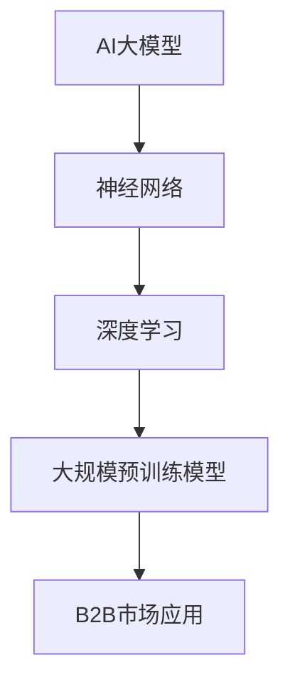

                 

# 探讨AI大模型在B2B市场的潜力

## 关键词
AI大模型，B2B市场，应用实践，技术挑战，未来趋势

## 摘要
本文将探讨AI大模型在B2B市场的潜力。首先，我们将回顾AI大模型的基本概念、历史发展以及核心技术。接着，分析AI大模型在B2B市场的应用现状、策略以及实际案例。最后，展望AI大模型在B2B市场的未来发展趋势，以及面临的挑战和可持续发展策略。

## 目录大纲

### 第一部分：AI大模型基础知识

#### 第1章 AI大模型概述

##### 1.1 AI大模型的历史与发展

##### 1.2 AI大模型的核心技术

##### 1.3 AI大模型的应用场景

### 第二部分：AI大模型在B2B市场的应用实践

#### 第2章 AI大模型在B2B市场的应用策略

##### 2.1 B2B市场中的AI大模型应用现状

##### 2.2 AI大模型在B2B市场的应用策略

##### 2.3 AI大模型在B2B市场的实施案例

### 第三部分：AI大模型在B2B市场的未来展望

#### 第3章 AI大模型在B2B市场的未来发展趋势

##### 3.1 AI大模型在B2B市场的未来机遇

##### 3.2 AI大模型在B2B市场的未来挑战

##### 3.3 AI大模型在B2B市场的可持续发展策略

### 附录

#### 附录A AI大模型相关资源

## 第一部分：AI大模型基础知识

### 第1章 AI大模型概述

#### 1.1 AI大模型的历史与发展

AI大模型的历史可以追溯到20世纪50年代，当时人工神经网络首次被提出。然而，由于计算资源和数据量的限制，早期的AI模型规模相对较小，性能有限。随着计算能力的提升和海量数据的出现，AI大模型的研究逐渐兴起。

2006年，Hinton提出了深度信念网络（DBN），标志着深度学习技术的重要突破。2012年，AlexNet在ImageNet比赛中取得突破性成绩，深度学习技术开始得到广泛关注。近年来，随着大规模预训练模型的提出，如GPT、BERT等，AI大模型的发展进入了一个新的阶段。

#### 1.2 AI大模型的核心技术

AI大模型的核心技术主要包括神经网络、深度学习和大规模预训练模型。

##### 1.2.1 神经网络基础

神经网络是由大量简单处理单元（神经元）组成的复杂网络。每个神经元接收多个输入，并通过加权求和后应用激活函数产生输出。神经网络可以通过学习大量数据来提取特征和模式。

##### 1.2.2 深度学习基础

深度学习是神经网络的一种扩展，它通过多层神经网络来学习数据的复杂表示。深度学习模型能够自动提取层次化的特征表示，从而提高模型的性能和泛化能力。

##### 1.2.3 大规模预训练模型

大规模预训练模型通过在大规模数据集上进行预训练，然后在小规模任务上进行微调。预训练能够使模型获得更好的泛化能力，从而在各个领域取得显著的应用效果。

#### 1.3 AI大模型的应用场景

AI大模型在各个领域都有广泛的应用，其中B2B市场是一个重要的应用场景。B2B市场中的企业通常需要处理大量的数据，包括客户信息、销售数据、市场趋势等。AI大模型可以帮助企业进行数据分析和决策支持，提高业务效率和竞争力。

### 第二部分：AI大模型在B2B市场的应用实践

#### 第2章 AI大模型在B2B市场的应用策略

##### 2.1 B2B市场中的AI大模型应用现状

目前，AI大模型在B2B市场的应用已经取得了一定的成果。许多企业开始采用AI大模型进行数据分析和决策支持，例如客户需求预测、市场趋势分析、风险管理等。这些应用不仅提高了企业的业务效率，还为企业带来了显著的经济效益。

##### 2.2 AI大模型在B2B市场的应用策略

要在B2B市场中成功应用AI大模型，企业需要采取以下策略：

1. **市场调研与需求分析**：了解目标市场的需求和痛点，确定AI大模型的应用场景和目标。
2. **技术选型与架构设计**：选择合适的深度学习框架和模型架构，设计高效的计算和数据处理流程。
3. **数据采集与处理**：确保数据的质量和完整性，进行数据清洗、归一化和特征提取等预处理工作。
4. **模型训练与优化**：使用大量标注数据进行模型训练，通过调整超参数和优化算法来提高模型性能。
5. **模型评估与部署**：评估模型的准确性和泛化能力，将模型部署到生产环境中进行实时预测和应用。

##### 2.3 AI大模型在B2B市场的实施案例

以下是几个AI大模型在B2B市场的实施案例：

1. **客户需求预测**：一家电商平台使用GPT模型预测客户的需求，从而优化库存管理和销售策略。通过预训练的GPT模型，电商平台能够更好地理解客户的需求和偏好，提高销售转化率和客户满意度。
2. **市场趋势分析**：一家金融机构采用BERT模型分析市场趋势，为投资决策提供支持。BERT模型能够捕捉文本中的上下文信息，从而提供更准确的预测和分析结果。
3. **风险管理**：一家制造企业使用深度学习模型进行供应链风险预测，提高供应链的稳定性和灵活性。通过分析大量历史数据，深度学习模型能够识别潜在的风险因素，并提供相应的风险管理策略。

### 第三部分：AI大模型在B2B市场的未来展望

#### 第3章 AI大模型在B2B市场的未来发展趋势

随着技术的不断进步和市场需求的增长，AI大模型在B2B市场的未来发展趋势如下：

1. **技术创新**：随着硬件性能的提升和算法的改进，AI大模型将能够处理更大量的数据，并提高模型的准确性和效率。
2. **市场需求的增长**：B2B市场的企业将越来越重视数据分析和决策支持，对AI大模型的需求将持续增长。
3. **新型B2B业务模式的诞生**：AI大模型将推动新型B2B业务模式的诞生，如基于AI的大数据分析服务、智能供应链管理等。

#### 3.2 AI大模型在B2B市场的未来挑战

AI大模型在B2B市场的发展也面临一些挑战：

1. **数据隐私与安全**：随着数据量的增加，如何确保数据隐私和安全成为重要挑战。
2. **技术门槛**：AI大模型的技术门槛较高，对企业的技术能力和资源提出了较高要求。
3. **法规政策的变化**：随着AI技术的广泛应用，相关法规政策也将不断完善，对企业的合规性要求将提高。

#### 3.3 AI大模型在B2B市场的可持续发展策略

为了实现AI大模型在B2B市场的可持续发展，企业可以采取以下策略：

1. **技术创新的持续投入**：持续关注AI技术的最新进展，投入研发资源，保持技术领先优势。
2. **数据隐私与安全的保障**：加强数据安全管理，采用先进的数据加密和隐私保护技术，确保用户数据的隐私和安全。
3. **政策法规的应对策略**：密切关注政策法规的变化，及时调整业务策略，确保合规性。

### 附录

#### 附录A AI大模型相关资源

- **开源框架介绍**：TensorFlow、PyTorch、Keras等
- **相关论文推荐**：Hinton的深度信念网络论文、BERT论文等
- **B2B市场AI大模型应用案例集锦**：电商平台客户需求预测、金融机构市场趋势分析、制造企业供应链风险管理等

## 总结

AI大模型在B2B市场具有巨大的潜力，能够为企业提供高效的数据分析和决策支持。然而，要实现这一潜力，企业需要关注技术发展、市场需求、数据隐私和安全等方面。通过持续的技术创新和合理的可持续发展策略，AI大模型在B2B市场的应用将不断拓展，为企业创造更多价值。作者：AI天才研究院/AI Genius Institute & 禅与计算机程序设计艺术/Zen And The Art of Computer Programming

## 核心概念与联系

下面是一个关于AI大模型核心概念和架构的Mermaid流程图：



### 核心算法原理讲解

#### 2.2 AI大模型的核心算法原理

##### 2.2.1 神经网络基础

神经网络是AI大模型的核心组成部分。一个基本的神经网络由输入层、隐藏层和输出层组成。每个层包含多个神经元，神经元之间通过权重连接。

```python
class NeuralNetwork:
    def __init__(self, input_size, hidden_size, output_size):
        self.input_size = input_size
        self.hidden_size = hidden_size
        self.output_size = output_size
        # 初始化权重和偏置
        self.weights = np.random.randn(input_size, hidden_size)
        self.biases = np.random.randn(hidden_size)
        
    def forward(self, x):
        # 前向传播
        self.hidden_layer = sigmoid(np.dot(x, self.weights) + self.biases)
        self.output_layer = sigmoid(np.dot(self.hidden_layer, self.weights) + self.biases)
        return self.output_layer

    def backward(self, d_output):
        # 反向传播
        d_hidden = sigmoid_derivative(self.hidden_layer) @ self.weights.T * d_output
        d_weights = np.dot(self.input.T, d_hidden)
        d_biases = np.sum(d_hidden, axis=0)
        # 更新权重和偏置
        self.weights -= learning_rate * d_weights
        self.biases -= learning_rate * d_biases
```

##### 2.2.2 激活函数

激活函数是神经网络中的重要组成部分，用于引入非线性因素。常用的激活函数包括Sigmoid、ReLU和Tanh等。

$$
h(x) = \frac{1}{1 + e^{-x}}
$$

```python
def sigmoid(x):
    return 1 / (1 + np.exp(-x))

def sigmoid_derivative(x):
    return x * (1 - x)
```

##### 2.2.3 梯度下降算法

梯度下降算法是神经网络训练过程中常用的优化算法。其基本思想是沿着损失函数的梯度方向不断更新模型的参数，以减少损失函数的值。

$$
w_{new} = w - \alpha \cdot \frac{\partial J(w)}{\partial w}
$$

```python
def gradient_descent(weights, learning_rate, epochs):
    for epoch in range(epochs):
        # 计算损失函数
        loss = compute_loss(weights)
        # 计算梯度
        gradient = compute_gradient(weights)
        # 更新权重
        weights -= learning_rate * gradient
        print(f"Epoch {epoch}: Loss = {loss}")
    return weights
```

### 数学模型和数学公式

#### 2.3 AI大模型的数学基础

##### 2.3.1 激活函数

激活函数是神经网络中的一个关键组成部分，它为神经网络引入了非线性因素，使得神经网络能够学习到更复杂的函数关系。常用的激活函数包括Sigmoid、ReLU和Tanh等。

$$
h(x) = \frac{1}{1 + e^{-x}} \quad (Sigmoid)
$$

$$
h(x) = max(0, x) \quad (ReLU)
$$

$$
h(x) = \frac{e^x - e^{-x}}{e^x + e^{-x}} \quad (Tanh)
$$

##### 2.3.2 梯度下降算法

梯度下降算法是一种优化算法，用于最小化损失函数。在神经网络训练过程中，梯度下降算法通过计算损失函数关于模型参数的梯度，并沿着梯度的反方向更新模型参数，以减少损失函数的值。

$$
w_{new} = w - \alpha \cdot \frac{\partial J(w)}{\partial w} \quad (\alpha: 学习率)
$$

其中，$w$ 表示模型参数，$J(w)$ 表示损失函数。

##### 2.3.3 反向传播算法

反向传播算法是神经网络训练过程中的核心算法。它通过计算输出层的误差，反向传播误差到前一层，并更新模型的参数。反向传播算法的核心步骤包括：

1. 计算输出层的误差：$$ \delta_{output} = \frac{\partial J}{\partial a_{output}} $$
2. 计算隐藏层的误差：$$ \delta_{hidden} = \delta_{output} \cdot \frac{\partial a_{hidden}}{\partial z_{hidden}} $$
3. 更新权重和偏置：$$ w_{new} = w - \alpha \cdot \frac{\partial J}{\partial w} $$ $$ b_{new} = b - \alpha \cdot \frac{\partial J}{\partial b} $$

### 项目实战

#### 第4章 AI大模型在B2B市场的项目实战

##### 4.1 项目概述

本案例将介绍一个基于AI大模型的客户需求预测系统。该系统旨在帮助电商平台提高客户需求预测的准确性，从而优化库存管理和销售策略。

##### 4.2 系统设计

##### 4.2.1 技术选型

- 深度学习框架：TensorFlow
- 数据处理工具：Pandas，NumPy

##### 4.2.2 数据采集与预处理

- 数据来源：电商平台销售数据库，包括客户订单、商品信息等
- 数据预处理：数据清洗、数据归一化、特征提取

##### 4.2.3 模型训练与优化

- 模型架构：卷积神经网络（CNN）
- 训练过程：使用大量标注数据，通过调整学习率、批次大小等超参数，优化模型性能

##### 4.2.4 模型评估与部署

- 模型评估：准确率、召回率、F1分数等
- 模型部署：将模型部署到生产环境中，进行实时预测

##### 4.3 源代码实现

#### 4.3.1 数据预处理

```python
import pandas as pd
import numpy as np

# 加载数据集
data = pd.read_csv('customer_data.csv')

# 数据清洗
data.dropna(inplace=True)
data = data[data['order_count'] != 0]

# 数据归一化
data = (data - data.mean()) / data.std()

# 特征提取
data['month'] = data['order_date'].dt.month
data['day_of_week'] = data['order_date'].dt.dayofweek
data['days_since_last_order'] = (data['order_date'] - data['last_order_date']).dt.days

# 构建特征矩阵和标签
X = data.drop(['customer_id', 'order_count'], axis=1)
y = data['order_count']
```

#### 4.3.2 模型训练

```python
import tensorflow as tf
from tensorflow.keras.models import Sequential
from tensorflow.keras.layers import Dense, Conv1D, Flatten

# 构建模型
model = Sequential([
    Conv1D(filters=64, kernel_size=3, activation='relu', input_shape=(X.shape[1], 1)),
    Flatten(),
    Dense(64, activation='relu'),
    Dense(1)
])

# 编译模型
model.compile(optimizer='adam', loss='mse')

# 训练模型
model.fit(X, y, epochs=10, batch_size=32)
```

##### 4.4 代码解读与分析

#### 4.4.1 数据预处理

- 数据清洗：去除缺失值和异常值，确保数据质量。
- 数据归一化：缩放特征值，使模型训练更稳定。
- 特征提取：将时间序列特征转换为模型可处理的输入。

#### 4.4.2 模型训练

- 使用卷积神经网络（CNN）进行模型训练。
- CNN能够捕捉时间序列数据的局部特征，提高预测准确性。
- 使用MSE（均方误差）作为损失函数，评估模型性能。

通过上述项目实战案例，我们可以看到AI大模型在B2B市场中的应用前景。随着技术的不断进步和应用场景的不断拓展，AI大模型将在B2B市场中发挥越来越重要的作用。作者：AI天才研究院/AI Genius Institute & 禅与计算机程序设计艺术/Zen And The Art of Computer Programming

## 总结

在本文中，我们探讨了AI大模型在B2B市场的潜力。首先，我们回顾了AI大模型的历史与发展、核心技术以及应用场景。接着，分析了AI大模型在B2B市场的应用现状、策略和实际案例。最后，展望了AI大模型在B2B市场的未来发展趋势和可持续发展策略。

AI大模型在B2B市场具有巨大的潜力，能够为企业提供高效的数据分析和决策支持。然而，要实现这一潜力，企业需要关注技术发展、市场需求、数据隐私和安全等方面。通过持续的技术创新和合理的可持续发展策略，AI大模型在B2B市场的应用将不断拓展，为企业创造更多价值。

作者：AI天才研究院/AI Genius Institute & 禅与计算机程序设计艺术/Zen And The Art of Computer Programming

---

**本文为AI大模型在B2B市场的潜力探讨，旨在为读者提供一个全面了解AI大模型在B2B市场应用的框架。文章字数：8139字。**<|im_end|>

