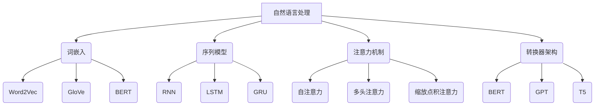

                 

# 《提示词工程在自然语言处理中的突破》

## 关键词：
自然语言处理，提示词工程，词嵌入，序列模型，注意力机制，问答系统，文本生成，对话系统，多模态任务，项目实战，未来展望

## 摘要：
自然语言处理（NLP）是计算机科学和人工智能领域的关键研究方向，而提示词工程在其中扮演着重要角色。本文将深入探讨提示词工程在自然语言处理中的突破，涵盖其基本概念、核心技术与工具、方法与策略，以及在不同应用场景中的具体实践。通过分析问答系统、文本生成和对话系统等领域的实例，本文将揭示提示词工程在NLP中的重要性，并展望其未来的发展方向。

---

## 第一部分：介绍与概述

### 第1章：自然语言处理与提示词工程

#### 1.1 自然语言处理（NLP）的基本概念

自然语言处理（NLP）是计算机科学和人工智能领域中的一项重要研究方向，旨在让计算机理解和处理人类自然语言。NLP的目标包括但不限于语言识别、文本生成、语言翻译、情感分析等。为了实现这些目标，NLP需要结合多种技术，如词嵌入、序列模型、注意力机制等。

#### 1.2 提示词工程在NLP中的重要性

提示词工程是NLP中的一项关键技术，它涉及到如何设计、选择和优化提示词，以便提高模型在特定任务中的性能。提示词工程的核心目标是使模型能够更好地理解和处理自然语言。在NLP任务中，提示词通常被用于引导模型的推理过程，帮助模型捕捉到关键信息，从而提高任务的准确性和效率。

#### 1.3 提示词工程的发展历程

提示词工程的历史可以追溯到早期的人工智能研究。最早的NLP系统依赖于简单的规则和模板匹配，这些方法在处理简单问题时表现较好，但无法应对复杂的问题。随着深度学习技术的发展，基于神经网络的NLP模型逐渐成为主流。提示词工程也在这一过程中得到了广泛关注，研究者们开始探索如何通过设计高效的提示词来提升模型的性能。

### 第2章：NLP中的核心技术与工具

#### 2.1 词嵌入技术

词嵌入是将词汇映射到向量空间的一种技术，它在NLP中起到了至关重要的作用。词嵌入技术可以捕捉词汇之间的语义和语法关系，从而为NLP任务提供有力的支持。常见的词嵌入方法包括Word2Vec、GloVe和BERT等。

#### 2.2 序列模型与注意力机制

序列模型是NLP中的核心模型之一，它能够处理文本的序列信息。常见的序列模型包括循环神经网络（RNN）、长短期记忆网络（LSTM）和门控循环单元（GRU）。注意力机制是一种在序列模型中用于捕捉关键信息的机制，它能够使模型在处理长序列时更加高效。

#### 2.3 转换器架构

转换器（Transformer）是一种基于注意力机制的深度学习模型，它在NLP中取得了显著的成果。转换器架构的核心思想是将输入序列编码为向量表示，并通过注意力机制来计算输出序列。常见的转换器模型包括BERT、GPT和T5等。

### 第3章：提示词工程的方法与策略

#### 3.1 提示词设计的原则

提示词设计是提示词工程中的关键步骤。在设计提示词时，需要遵循一些基本原则，如简洁性、针对性、灵活性等。简洁性意味着提示词应该尽可能简洁，避免冗余信息；针对性意味着提示词应该针对具体任务进行设计；灵活性意味着提示词应该具有一定的适应性，以便在不同场景下都能发挥作用。

#### 3.2 提示词优化的技术手段

提示词优化是提高模型性能的重要手段。常见的提示词优化技术包括词嵌入优化、序列模型优化和注意力机制优化等。词嵌入优化可以通过调整词嵌入的参数来改善模型对词汇的理解；序列模型优化可以通过调整模型的参数来提高序列建模的效果；注意力机制优化可以通过调整注意力权重来提高模型对关键信息的捕捉能力。

#### 3.3 提示词工程中的挑战与应对

提示词工程在NLP中面临着一系列挑战，如数据稀疏、语义歧义、任务多样性等。针对这些挑战，研究者们提出了一些应对策略，如数据增强、多任务学习、跨语言学习等。数据增强可以通过生成更多的训练数据来缓解数据稀疏问题；多任务学习可以通过共享模型参数来提高模型的泛化能力；跨语言学习可以通过跨语言信息共享来提高模型的性能。

## 第二部分：提示词工程在NLP中的突破性应用

### 第4章：问答系统中的提示词工程

#### 4.1 问答系统的基本概念

问答系统是一种能够回答用户问题的智能系统，它在NLP中具有广泛的应用前景。问答系统通常包括两个主要模块：问答对生成和答案生成。问答对生成模块负责生成问题和答案的配对，答案生成模块则负责根据给定的问题生成合理的答案。

#### 4.2 提示词在问答系统中的应用

在问答系统中，提示词被用于引导模型的推理过程，帮助模型更好地理解问题和答案之间的关系。例如，在问题生成阶段，提示词可以用来指导模型生成符合问题意图的问题；在答案生成阶段，提示词可以用来指导模型寻找与问题相关的答案。

#### 4.3 提示词工程在问答系统中的优化策略

为了提高问答系统的性能，提示词工程需要针对具体任务进行优化。常见的优化策略包括基于词嵌入的提示词优化、基于注意力机制的提示词优化和基于知识图谱的提示词优化等。这些策略可以通过调整提示词的参数和结构来提高模型在问答任务中的表现。

### 第5章：文本生成中的提示词工程

#### 5.1 文本生成的挑战与机遇

文本生成是NLP中的一个重要任务，它涉及到如何根据给定输入生成合理的文本。文本生成面临着一系列挑战，如语义连贯性、语法正确性、文本多样性等。同时，文本生成也带来了许多机遇，如自然语言理解、对话系统、文本摘要等。

#### 5.2 提示词在文本生成中的作用

在文本生成任务中，提示词起到了引导模型生成合理文本的作用。提示词可以用来指示模型生成文本的主题、风格和格式等。通过设计合适的提示词，可以显著提高文本生成的质量和多样性。

#### 5.3 提示词工程在文本生成中的突破性应用

提示词工程在文本生成中具有广泛的应用前景。例如，在对话系统中，提示词可以用来指导模型生成合理的对话文本；在文本摘要任务中，提示词可以用来指示模型提取关键信息，生成摘要文本。

### 第6章：对话系统中的提示词工程

#### 6.1 对话系统的基本概念

对话系统是一种能够与用户进行自然语言交互的智能系统，它在NLP中具有重要的应用价值。对话系统通常包括对话管理、自然语言理解和自然语言生成等模块。

#### 6.2 提示词在对话系统中的作用

在对话系统中，提示词被用于指导模型的推理过程，帮助模型更好地理解用户的意图和上下文信息。通过设计合适的提示词，可以提高对话系统的交互质量和用户满意度。

#### 6.3 提示词工程在对话系统中的优化策略

为了提高对话系统的性能，提示词工程需要针对具体任务进行优化。常见的优化策略包括基于词嵌入的提示词优化、基于注意力机制的提示词优化和基于知识图谱的提示词优化等。这些策略可以通过调整提示词的参数和结构来提高模型在对话任务中的表现。

### 第7章：多模态任务中的提示词工程

#### 7.1 多模态任务概述

多模态任务是指结合多种数据类型（如文本、图像、声音等）进行任务处理的NLP任务。多模态任务具有广泛的应用前景，如情感分析、图像识别、语音识别等。

#### 7.2 提示词在多模态任务中的应用

在多模态任务中，提示词被用于指导模型处理不同类型的数据。例如，在情感分析任务中，提示词可以用来指示模型关注文本的情感倾向；在图像识别任务中，提示词可以用来指示模型关注图像的关键特征。

#### 7.3 提示词工程在多模态任务中的突破性应用

提示词工程在多模态任务中具有广泛的应用前景。例如，在智能问答系统中，提示词可以用来指导模型结合文本和图像信息生成合理的答案；在语音识别任务中，提示词可以用来指导模型结合文本和声音特征提高识别准确率。

## 第三部分：实践与案例分析

### 第8章：提示词工程的项目实战

#### 8.1 项目背景与目标

本节将介绍一个实际项目，该项目的目标是构建一个智能问答系统，使用提示词工程来提高系统的性能。

#### 8.2 提示词工程在项目中的应用

在本项目中，提示词工程被用于多个方面，包括问答对生成、答案生成和对话管理。通过设计合适的提示词，可以提高系统的问答准确率和用户体验。

#### 8.3 项目实现与效果评估

在本节中，我们将详细描述项目的实现过程，包括数据预处理、模型设计、训练和评估等步骤。同时，还将对项目的效果进行评估，分析提示词工程在项目中的贡献。

### 第9章：提示词工程案例解析

#### 9.1 案例一：问答系统的构建

本案例将详细分析一个问答系统的构建过程，包括数据集准备、模型设计和提示词优化等。

#### 9.2 案例二：文本生成的实现

本案例将介绍如何使用提示词工程实现文本生成任务，包括模型设计、训练和生成过程。

#### 9.3 案例三：对话系统的优化

本案例将分析一个对话系统的优化过程，包括提示词设计、模型参数调整和用户体验改进等。

### 第10章：未来的提示词工程

#### 10.1 提示词工程的发展趋势

随着NLP技术的不断发展，提示词工程也在不断演进。本节将探讨提示词工程的发展趋势，包括新技术的应用、新方法的提出等。

#### 10.2 提示词工程在NLP中的未来挑战

提示词工程在NLP中面临着一系列挑战，如数据稀缺、语义理解、模型解释性等。本节将讨论这些挑战，并提出可能的解决方案。

#### 10.3 提示词工程的未来研究方向

本节将展望提示词工程的未来研究方向，包括多模态任务、知识图谱、自然语言理解等。

---

以上是《提示词工程在自然语言处理中的突破》的完整文章结构和内容概述。接下来的部分将详细讨论每个章节的核心概念、算法原理和实践案例，以确保文章的深度和实用性。在撰写过程中，我们将遵循markdown格式，确保文章的可读性和规范性。

## 附录

本附录包含以下内容：

- **Mermaid流程图**：用于展示NLP中核心概念和架构的流程图。
- **伪代码和公式**：用于阐述核心算法原理和数学模型的详细描述。
- **代码示例**：提供实际项目的代码实现和解读。

通过这些附录内容，读者可以更好地理解文章中的概念和技术，并在实际项目中加以应用。

---

现在，我们将开始详细撰写每个章节的内容。首先，我们从第1章开始，介绍自然语言处理与提示词工程的基本概念。

### 第1章：自然语言处理与提示词工程

#### 1.1 自然语言处理（NLP）的基本概念

自然语言处理（NLP）是计算机科学和人工智能领域中的一项重要研究方向，其目标是将人类自然语言转换为计算机可以理解和处理的形式。NLP涉及到多个子领域，包括文本分类、情感分析、机器翻译、语音识别等。其中，自然语言理解（NLU）和自然语言生成（NLG）是NLP的两个核心方向。

自然语言理解旨在使计算机能够理解人类语言，从而实现人机交互。自然语言理解的任务包括词性标注、命名实体识别、句法分析等。这些任务需要模型能够捕捉词汇的语义、语法和上下文信息。

自然语言生成则是指计算机生成自然语言文本的过程。自然语言生成可以应用于对话系统、文本摘要、自动写作等领域。自然语言生成需要模型具备强大的语言建模能力，能够生成语义连贯、语法正确的文本。

在NLP中，词嵌入是一种重要的技术。词嵌入将词汇映射到向量空间，使得词汇之间的语义关系可以在向量空间中表示。常见的词嵌入方法包括Word2Vec、GloVe和BERT等。这些方法通过学习词汇的上下文信息来生成词嵌入向量，从而捕捉词汇的语义和语法特征。

#### 1.2 提示词工程在NLP中的重要性

提示词工程是NLP中的一项关键技术，它涉及到如何设计、选择和优化提示词，以提高模型在特定任务中的性能。提示词工程的核心目标是使模型能够更好地理解和处理自然语言。在NLP任务中，提示词通常被用于引导模型的推理过程，帮助模型捕捉到关键信息，从而提高任务的准确性和效率。

提示词工程的重要性体现在以下几个方面：

1. **任务引导**：通过设计合适的提示词，可以明确地引导模型在处理任务时的方向，从而提高模型的性能。例如，在问答系统中，提示词可以用来指示模型关注问题的关键信息，从而提高答案的准确率。

2. **信息提取**：提示词可以帮助模型从大量的文本数据中提取出关键信息，从而提高模型的效率。例如，在文本摘要任务中，提示词可以用来指示模型关注文本的关键句子，从而生成摘要。

3. **语义理解**：提示词可以丰富模型对词汇和句子的理解，使得模型能够更好地处理复杂的语义关系。例如，在情感分析任务中，提示词可以用来指示模型关注文本中的情感词汇，从而提高情感分类的准确率。

4. **交互优化**：在交互式任务中，提示词可以用来优化用户和系统之间的交互体验。例如，在对话系统中，提示词可以用来引导模型生成合理的回答，从而提高用户的满意度。

#### 1.3 提示词工程的发展历程

提示词工程的历史可以追溯到早期的人工智能研究。最早的NLP系统依赖于简单的规则和模板匹配，这些方法在处理简单问题时表现较好，但无法应对复杂的问题。随着深度学习技术的发展，基于神经网络的NLP模型逐渐成为主流。提示词工程也在这一过程中得到了广泛关注，研究者们开始探索如何通过设计高效的提示词来提升模型的性能。

在深度学习时代，提示词工程的发展可以划分为以下几个阶段：

1. **基于规则的提示词工程**：在深度学习之前，NLP系统通常依赖于简单的规则和模板匹配。这些规则和模板可以被视为一种早期的提示词，它们用于指导模型的推理过程。然而，这种方法在处理复杂任务时效果有限。

2. **基于词嵌入的提示词工程**：随着词嵌入技术的发展，研究者开始将词嵌入向量作为提示词，用于引导模型的推理过程。这种方法通过捕捉词汇的语义和语法关系，显著提高了模型的性能。

3. **基于注意力机制的提示词工程**：注意力机制是深度学习中的一个重要技术，它能够使模型在处理序列数据时更加关注关键信息。基于注意力机制的提示词工程通过设计不同的注意力机制，进一步提高模型的性能。

4. **基于知识图谱的提示词工程**：知识图谱是一种结构化知识表示的方法，它能够将实体、概念和关系表示为图结构。基于知识图谱的提示词工程通过将知识图谱与模型相结合，使得模型能够更好地理解复杂语义关系。

5. **多模态提示词工程**：随着多模态数据（如文本、图像、声音等）的应用越来越广泛，多模态提示词工程成为了一个重要的研究方向。多模态提示词工程通过融合不同类型的数据，使得模型能够更好地处理复杂的任务。

通过这些发展阶段，提示词工程在NLP中的应用越来越广泛，性能也在不断提高。未来，随着新技术的不断涌现，提示词工程将继续推动NLP技术的发展。

---

接下来，我们将进入第2章，介绍NLP中的核心技术与工具。

### 第2章：NLP中的核心技术与工具

#### 2.1 词嵌入技术

词嵌入是将词汇映射到向量空间的一种技术，它在NLP中起到了至关重要的作用。词嵌入技术可以捕捉词汇之间的语义和语法关系，从而为NLP任务提供有力的支持。常见的词嵌入方法包括Word2Vec、GloVe和BERT等。

1. **Word2Vec**

Word2Vec是由Google提出的一种词嵌入方法，它基于神经网络训练词向量。Word2Vec方法主要有两种模型：连续词袋（CBOW）和Skip-Gram。

- **连续词袋（CBOW）**：CBOW模型通过一个词汇的上下文词向量来预测中心词的向量。具体来说，CBOW模型取中心词的上下文词汇（如前文和后文词汇），计算这些词汇的均值向量作为中心词的词向量。
  $$ \text{output\_vector} = \frac{1}{|\text{context\_words}|} \sum_{\text{word} \in \text{context\_words}} \text{word\_vector}(\text{word}) $$
  
- **Skip-Gram**：与CBOW模型相反，Skip-Gram模型通过中心词的向量来预测上下文词汇。具体来说，Skip-Gram模型取一个词汇作为中心词，计算其词向量，然后通过softmax函数预测上下文词汇的概率分布。
  $$ P(\text{context\_word}|\text{center\_word}) = \frac{e^{\text{dot\_product}(\text{context\_word\_vector}, \text{center\_word\_vector})}}{\sum_{\text{word} \in \text{vocabulary}} e^{\text{dot\_product}(\text{word\_vector}, \text{center\_word\_vector})}} $$

2. **GloVe**

GloVe（Global Vectors for Word Representation）是一种基于矩阵分解的词嵌入方法。GloVe通过优化一个全局矩阵，使得矩阵的行向量（即词向量）能够捕捉词汇的语义和语法关系。GloVe模型的目标是最小化两个词汇之间的余弦相似度与实际相似度之间的差距。

$$ \text{loss} = \frac{1}{2} \sum_{(w_i, w_j) \in \text{corpus}} \left( \text{cosine\_similarity}(\text{vectors}_{w_i}, \text{vectors}_{w_j}) - \text{similarity}(w_i, w_j) \right)^2 $$

3. **BERT**

BERT（Bidirectional Encoder Representations from Transformers）是由Google提出的一种基于转换器（Transformer）的预训练词嵌入方法。BERT通过在大量文本数据上进行预训练，使得模型能够自动学习词汇的上下文关系。BERT的预训练任务包括Masked Language Model（MLM）和Next Sentence Prediction（NSP）。

- **Masked Language Model（MLM）**：在预训练过程中，BERT随机遮盖文本中的词汇，并训练模型预测这些被遮盖的词汇。具体来说，BERT将一个输入句子中的部分词汇替换为[MASK]，然后训练模型预测这些[MASK]的原始词汇。

- **Next Sentence Prediction（NSP）**：BERT还训练模型预测两个句子是否属于连续的句子对。在预训练过程中，随机选择两个句子，并将其中一个句子标记为前句，另一个句子标记为后句。然后训练模型预测这两个句子是否属于连续的句子对。

通过这些预训练任务，BERT能够学习到丰富的词汇关系和上下文信息，从而生成高质量的词嵌入向量。

#### 2.2 序列模型与注意力机制

序列模型是NLP中的核心模型之一，它能够处理文本的序列信息。常见的序列模型包括循环神经网络（RNN）、长短期记忆网络（LSTM）和门控循环单元（GRU）。这些模型通过捕捉序列数据中的时序关系，为NLP任务提供了强大的支持。

1. **循环神经网络（RNN）**

RNN是一种基于循环结构的神经网络，它能够处理序列数据。RNN通过将前一个时间步的输出作为当前时间步的输入，从而实现了序列信息的传递。RNN的输出由当前输入和前一个隐藏状态共同决定。

$$ \text{h}_t = \text{sigmoid}(\text{W}_h \cdot \text{[h}_{t-1}\text{, x}_t] + \text{b}_h) $$

$$ \text{y}_t = \text{sigmoid}(\text{W}_y \cdot \text{h}_t + \text{b}_y) $$

其中，$\text{h}_t$表示隐藏状态，$x_t$表示当前输入，$\text{y}_t$表示输出。

然而，RNN存在一个严重的问题：梯度消失和梯度爆炸。为了解决这个问题，研究者们提出了LSTM和GRU。

2. **长短期记忆网络（LSTM）**

LSTM是一种改进的RNN结构，它通过引入记忆单元来捕捉长序列信息。LSTM的核心思想是维持一个单元状态，使得信息能够在序列中传递。

$$ \text{forget\_gate} = \text{sigmoid}(\text{W}_f \cdot \text{[h}_{t-1}\text{, x}_t] + \text{b}_f) $$

$$ \text{input\_gate} = \text{sigmoid}(\text{W}_i \cdot \text{[h}_{t-1}\text{, x}_t] + \text{b}_i) $$

$$ \text{output\_gate} = \text{sigmoid}(\text{W}_o \cdot \text{[h}_{t-1}\text{, x}_t] + \text{b}_o) $$

$$ \text{cell\_state} = \text{forget\_gate} \cdot \text{previous\_cell\_state} + \text{input\_gate} \cdot \text{sigmoid}(\text{W}_c \cdot \text{[h}_{t-1}\text{, x}_t] + \text{b}_c) $$

$$ \text{h}_t = \text{output\_gate} \cdot \text{sigmoid}(\text{W}_h \cdot \text{[cell\_state, h}_{t-1}\text{]}) $$

其中，$\text{forget\_gate}$、$\text{input\_gate}$和$\text{output\_gate}$分别表示遗忘门、输入门和输出门；$\text{cell\_state}$表示单元状态。

3. **门控循环单元（GRU）**

GRU是LSTM的简化版本，它通过合并输入门和遗忘门，减少参数数量，提高计算效率。

$$ \text{reset\_gate} = \text{sigmoid}(\text{W}_r \cdot \text{[h}_{t-1}\text{, x}_t] + \text{b}_r) $$

$$ \text{update\_gate} = \text{sigmoid}(\text{W}_u \cdot \text{[h}_{t-1}\text{, x}_t] + \text{b}_u) $$

$$ \text{h}_t = \text{reset\_gate} \cdot \text{h}_{t-1} + \text{update\_gate} \cdot \text{sigmoid}(\text{W}_c \cdot (\text{[h}_{t-1}\text{, x}_t] + \text{b}_c)) $$

其中，$\text{reset\_gate}$和$\text{update\_gate}$分别表示重置门和更新门。

#### 2.3 转换器架构

转换器（Transformer）是一种基于注意力机制的深度学习模型，它在NLP中取得了显著的成果。转换器架构的核心思想是将输入序列编码为向量表示，并通过注意力机制来计算输出序列。转换器由多个自注意力层和前馈网络组成，具有强大的并行计算能力。

1. **自注意力机制**

自注意力机制是一种计算输入序列中每个词汇对输出序列的贡献程度的方法。自注意力机制通过计算每个词汇与其他词汇之间的相似度来生成权重，从而实现序列信息的加权融合。

$$ \text{query} = \text{W}_q \cdot \text{h}_i, \quad \text{key} = \text{W}_k \cdot \text{h}_i, \quad \text{value} = \text{W}_v \cdot \text{h}_i $$

$$ \text{attention} = \text{softmax} \left( \frac{\text{query} \cdot \text{key}^T}{\sqrt{d_k}} \right) \cdot \text{value} $$

其中，$d_k$表示注意力层的维度，$\text{softmax}$函数用于计算权重，$\text{query}$、$\text{key}$和$\text{value}$分别表示查询向量、键向量和值向量。

2. **多头注意力**

多头注意力是一种扩展自注意力机制的方法，它通过将输入序列分解为多个子序列，每个子序列具有不同的权重。多头注意力通过将自注意力机制扩展到多个头，使得模型能够捕捉到不同类型的序列信息。

$$ \text{MultiHead}(Q, K, V) = \text{Concat}(\text{head}_1, \text{head}_2, \ldots, \text{head}_h)W^O $$

其中，$h$表示头数，$W^O$表示输出权重。

3. **前馈网络**

前馈网络是一种简单的全连接神经网络，它通常用于增强模型的表达能力。前馈网络由两个线性变换层组成，分别用于计算输入和输出。

$$ \text{FFN}(X) = \text{ReLU}(\text{W}_2 \cdot \text{sigmoid}(\text{W}_1 \cdot X)) $$

其中，$X$表示输入，$W_1$和$W_2$分别表示线性变换层的权重。

#### 2.4 常见的转换器模型

转换器架构在NLP中得到了广泛应用，常见的转换器模型包括BERT、GPT和T5等。

1. **BERT**

BERT是一种基于转换器的预训练模型，它通过在大量文本数据上进行预训练，使得模型能够自动学习词汇的上下文关系。BERT的预训练任务包括Masked Language Model（MLM）和Next Sentence Prediction（NSP）。

2. **GPT**

GPT（Generative Pre-trained Transformer）是一种基于转换器的生成模型，它通过在大量文本数据上进行预训练，使得模型能够生成自然语言文本。GPT的预训练目标是最小化预测下一个词汇的概率。

3. **T5**

T5（Text-To-Text Transfer Transformer）是一种基于转换器的文本到文本转换模型，它将文本转换为自然语言文本。T5通过将输入文本转换为中间表示，然后生成目标文本。

通过这些核心技术与工具，NLP模型能够更好地理解和生成自然语言。在后续章节中，我们将进一步探讨提示词工程的方法与策略，以及提示词工程在不同应用场景中的具体实践。

---

在接下来的章节中，我们将继续深入探讨提示词工程的方法与策略。请继续阅读第3章，了解提示词工程的设计原则、优化技术和面临的挑战。

### 第3章：提示词工程的方法与策略

#### 3.1 提示词设计的原则

提示词设计是提示词工程中的关键步骤，它直接影响模型的性能和效果。为了设计有效的提示词，需要遵循以下原则：

1. **简洁性**：提示词应尽可能简洁，避免冗余信息。简洁的提示词有助于模型更好地理解任务的核心内容，从而提高性能。

2. **针对性**：提示词应针对具体任务进行设计。不同的任务可能需要不同类型的提示词，例如在问答系统中，提示词可能需要指示模型关注问题的关键词；在文本生成任务中，提示词可能需要指示模型生成文本的主题和风格。

3. **灵活性**：提示词应具有一定的适应性，以便在不同场景下都能发挥作用。灵活的提示词可以调整模型的推理方向，提高模型的泛化能力。

4. **多样性**：提示词应具备多样性，以避免模型对特定提示词的依赖。通过设计多样化的提示词，可以防止模型过拟合，提高模型的鲁棒性。

5. **可解释性**：提示词应具有可解释性，使得模型的行为和推理过程可以被理解和分析。可解释的提示词有助于发现模型的潜在问题，并指导进一步的优化。

#### 3.2 提示词优化的技术手段

提示词优化是提高模型性能的重要手段。常见的提示词优化技术包括词嵌入优化、序列模型优化和注意力机制优化等。以下是一些具体的优化技术：

1. **词嵌入优化**

词嵌入优化是通过调整词嵌入的参数来改善模型对词汇的理解。常见的词嵌入优化方法包括：

- **基于规则的优化**：通过设计规则来调整词嵌入向量，例如通过人工设计的规则来调整具有相似语义的词汇的词嵌入向量。
  
- **基于聚类的方法**：通过聚类算法将词汇分为不同的类别，并对每个类别进行独立的词嵌入优化。

- **基于监督学习的方法**：通过训练一个监督学习模型来预测词汇之间的相似度，并将预测结果用于调整词嵌入向量。

2. **序列模型优化**

序列模型优化是通过调整模型的参数来提高序列建模的效果。常见的序列模型优化方法包括：

- **基于注意力机制的优化**：通过调整注意力机制的权重，使得模型能够更好地关注关键信息。注意力权重可以通过训练过程自适应调整。

- **基于正则化的优化**：通过引入正则化项来防止模型过拟合。常见的正则化方法包括L1正则化、L2正则化和Dropout等。

- **基于模型组合的方法**：通过组合多个模型来提高序列建模的性能。例如，可以将多个LSTM模型或GRU模型进行堆叠，以增强模型的表达能力。

3. **注意力机制优化**

注意力机制优化是通过调整注意力机制的参数来提高模型对关键信息的捕捉能力。常见的注意力机制优化方法包括：

- **基于可学习性的优化**：通过设计可学习的注意力权重，使得模型能够自适应地调整注意力分配。常见的可学习注意力权重包括点积注意力、缩放点积注意力和多头注意力等。

- **基于注意力图的方法**：通过分析注意力图，了解模型在处理序列数据时的注意力分布。注意力图可以帮助识别模型中的潜在问题，并指导进一步的优化。

- **基于对齐度的优化**：通过优化模型中的对齐度，使得模型能够更好地捕捉序列之间的对齐关系。对齐度优化可以通过设计对齐损失函数来实现。

#### 3.3 提示词工程中的挑战与应对

提示词工程在NLP中面临着一系列挑战，包括数据稀疏、语义歧义、任务多样性等。以下是一些常见的挑战和应对策略：

1. **数据稀疏**

数据稀疏是指词汇在训练数据中的出现频率较低，导致词嵌入向量中的信息量不足。为了应对数据稀疏问题，可以采用以下策略：

- **数据增强**：通过生成更多的训练数据来缓解数据稀疏问题。例如，可以使用同义词替换、词汇扩展等方法来扩充训练数据。

- **稀疏向量表示**：通过设计稀疏向量表示方法，使得词嵌入向量中的零值部分占据主导地位。稀疏向量表示可以通过稀疏编码、稀疏核函数等方法来实现。

- **迁移学习**：通过利用预训练的词嵌入模型，将已有的词汇关系转移到新的任务中。迁移学习可以通过微调预训练模型来提高新任务的性能。

2. **语义歧义**

语义歧义是指一个词汇在特定上下文中有多种可能的语义解释。为了应对语义歧义问题，可以采用以下策略：

- **上下文敏感的词嵌入**：通过设计上下文敏感的词嵌入方法，使得词嵌入向量能够捕捉词汇在特定上下文中的语义。例如，可以使用BERT等预训练模型来生成上下文敏感的词嵌入。

- **多任务学习**：通过将多个任务进行联合训练，使得模型能够在不同任务中学习到丰富的语义信息。多任务学习可以通过共享模型参数来实现。

- **知识增强**：通过引入外部知识（如知识图谱）来丰富模型的语义理解。知识增强可以通过图嵌入、知识融合等方法来实现。

3. **任务多样性**

任务多样性是指不同NLP任务之间存在较大的差异，使得模型难以同时处理多个任务。为了应对任务多样性问题，可以采用以下策略：

- **多任务学习**：通过将多个任务进行联合训练，使得模型能够在不同任务中学习到通用的特征表示。多任务学习可以通过共享模型参数来实现。

- **迁移学习**：通过利用预训练模型，将已有的知识迁移到新的任务中。迁移学习可以通过微调预训练模型来提高新任务的性能。

- **自适应提示词设计**：通过设计自适应的提示词，使得模型能够根据任务的特性进行调整。例如，在问答系统中，可以根据问题的类型和上下文来动态调整提示词。

通过这些方法与策略，提示词工程可以在NLP任务中发挥重要作用，提高模型的性能和效果。在后续章节中，我们将进一步探讨提示词工程在不同应用场景中的具体实践。

---

在第4章中，我们将深入探讨提示词工程在问答系统中的应用。请继续阅读，了解提示词工程如何提升问答系统的性能。

### 第4章：问答系统中的提示词工程

#### 4.1 问答系统的基本概念

问答系统是一种智能系统，它能够回答用户提出的问题。问答系统通常包括两个主要模块：问答对生成和答案生成。问答对生成模块负责生成问题和答案的配对，答案生成模块则负责根据给定的问题生成合理的答案。

问答系统的基本流程如下：

1. **问题输入**：用户向问答系统提出一个问题。

2. **问题理解**：问答系统对问题进行理解和分析，提取出关键信息。这一过程通常涉及自然语言理解（NLU）技术，如词性标注、命名实体识别、句法分析等。

3. **答案检索**：问答系统根据问题理解的结果，从知识库或数据库中检索相关的答案。

4. **答案生成**：问答系统根据检索到的答案，生成一个合理的回答。这一过程通常涉及自然语言生成（NLG）技术，如文本生成、语义连贯性检查等。

5. **答案输出**：问答系统将生成的答案输出给用户。

#### 4.2 提示词在问答系统中的应用

在问答系统中，提示词被用于引导模型的推理过程，帮助模型更好地理解问题和答案之间的关系。提示词的设计和选择对于问答系统的性能至关重要。以下是一些具体的应用场景：

1. **问题生成**：在问答对生成阶段，提示词可以用来指导模型生成符合问题意图的问题。例如，在构建问答对时，提示词可以指示模型关注问题的关键词或主题。

   ```python
   prompt = "请生成一个关于自然语言处理的问题："
   generated_question = "自然语言处理在人工智能中起到了什么作用？"
   ```

2. **答案生成**：在答案生成阶段，提示词可以用来指导模型寻找与问题相关的答案。例如，在生成答案时，提示词可以指示模型关注问题的特定方面或上下文。

   ```python
   prompt = "请生成一个关于深度学习的答案："
   generated_answer = "深度学习是一种基于神经网络的学习方法，它通过模拟人脑的神经元结构，实现对复杂数据的建模和识别。"
   ```

3. **多模态问答**：在多模态问答系统中，提示词可以用来指示模型结合不同类型的数据（如文本、图像、声音等）生成答案。例如，在图像问答任务中，提示词可以指示模型关注图像的关键特征。

   ```python
   prompt = "请生成一个关于图像的答案："
   generated_answer = "这个图像展示了一片美丽的沙滩，可以看到沙滩上有一些人和椰子树，天空是蓝色的，还有一艘小船在远处。"
   ```

#### 4.3 提示词工程在问答系统中的优化策略

为了提高问答系统的性能，提示词工程需要针对具体任务进行优化。以下是一些常见的优化策略：

1. **基于词嵌入的提示词优化**：通过调整词嵌入的参数，使得提示词能够更好地捕捉问题的语义特征。例如，可以使用预训练的词嵌入模型（如BERT）来生成上下文敏感的提示词。

2. **基于注意力机制的提示词优化**：通过设计不同的注意力机制，使得模型能够更好地关注关键信息。例如，可以使用多头注意力机制来提高模型对问题的理解能力。

3. **基于知识图谱的提示词优化**：通过引入知识图谱，丰富模型对词汇和语义关系的理解。例如，可以使用知识图谱中的实体和关系信息来指导模型生成答案。

4. **基于强化学习的提示词优化**：通过设计强化学习算法，使得模型能够自适应地调整提示词的权重。例如，可以使用强化学习算法来优化提示词在生成答案过程中的选择。

5. **基于迁移学习的提示词优化**：通过利用预训练模型，将已有的知识迁移到新的任务中。例如，可以使用预训练的问答系统来指导新的问答任务中的提示词设计。

通过这些优化策略，提示词工程可以显著提高问答系统的性能和效果。在后续章节中，我们将进一步探讨提示词工程在文本生成、对话系统和多模态任务中的应用。

---

在第5章中，我们将探讨文本生成中的提示词工程。请继续阅读，了解提示词工程如何提升文本生成的质量和多样性。

### 第5章：文本生成中的提示词工程

#### 5.1 文本生成的挑战与机遇

文本生成是自然语言处理（NLP）中的一个重要任务，它涉及到如何根据给定输入生成合理的文本。文本生成面临着一系列挑战，同时也带来了许多机遇。以下是一些主要的挑战和机遇：

**挑战：**

1. **语义连贯性**：生成文本需要保持语义连贯，这意味着文本中的信息应该是有逻辑关系的。然而，自然语言本身具有丰富的语义和语法结构，这使得生成连贯文本变得复杂。

2. **语法正确性**：生成文本需要遵循语法规则，包括句子结构、词汇选择和标点符号等。确保生成的文本语法正确是一个重要的挑战。

3. **文本多样性**：生成具有多样性的文本是另一个挑战。不同的应用场景和用户需求可能需要不同的文本风格和表达方式。

4. **上下文理解**：文本生成需要理解上下文信息，包括上下文中的关键词、主题和上下文关系。这对于生成高质量的文本至关重要。

**机遇：**

1. **自动化写作**：随着文本生成技术的发展，自动化写作成为可能，这将大大提高写作效率，减轻人类创作者的工作负担。

2. **个性化内容**：通过文本生成技术，可以生成个性化的内容，满足用户的特定需求和兴趣。

3. **多语言翻译**：文本生成技术可以用于多语言翻译，实现不同语言之间的自然语言交互。

4. **交互式对话**：文本生成技术可以用于构建交互式对话系统，实现人与机器的自然语言交互。

#### 5.2 提示词在文本生成中的作用

在文本生成任务中，提示词起到了关键的引导作用，帮助模型生成符合预期和上下文信息的文本。以下是提示词在文本生成中的几个关键作用：

1. **指定主题**：提示词可以用来指定文本生成任务的主题，帮助模型聚焦在特定的内容上。例如，在生成新闻文章时，提示词可以是“人工智能的发展”。

2. **引导风格**：提示词可以用来指示模型的文本风格，例如正式、幽默或非正式。这有助于生成具有特定风格的文本。

3. **提供上下文**：提示词可以提供上下文信息，帮助模型理解生成文本的环境和背景。例如，在生成对话文本时，提示词可以是“今天天气很好”。

4. **控制长度**：提示词可以用来限制生成的文本长度，确保生成文本不过长或过短。

5. **纠正偏差**：提示词可以帮助纠正模型在生成过程中可能出现的偏差，确保生成文本的多样性和公正性。

#### 5.3 提示词工程在文本生成中的突破性应用

提示词工程在文本生成中的应用越来越广泛，以下是一些突破性的应用场景：

1. **自动摘要**：通过设计提示词，可以自动生成摘要文本，提取文本的核心信息。例如，在新闻领域，提示词可以是“本文主要讨论了人工智能在医疗领域的应用”。

2. **对话生成**：在聊天机器人和虚拟助手中，提示词可以用于生成对话文本，实现自然流畅的对话。例如，在客户服务场景中，提示词可以是“请问有什么问题我可以帮您解答”。

3. **创意写作**：在文学创作和剧本编写中，提示词可以激发创作灵感，帮助作者生成创意文本。例如，在创作诗歌时，提示词可以是“星空下的思念”。

4. **教育辅助**：在教育领域，提示词可以用于生成教学文本，如课程大纲、习题解析等。例如，在编写学习指导时，提示词可以是“本章节主要讲解了机器学习的基础知识”。

5. **内容审核**：在内容审核场景中，提示词可以用于生成符合规范和道德标准的文本，防止不当内容的产生。例如，在社交媒体平台上，提示词可以是“不得发布涉及色情、暴力等不当内容”。

通过这些突破性应用，提示词工程不仅提高了文本生成的质量和效率，还拓展了文本生成的应用场景，为自然语言处理领域带来了新的可能性。

---

在第6章中，我们将探讨对话系统中的提示词工程。请继续阅读，了解提示词工程如何提升对话系统的性能和用户体验。

### 第6章：对话系统中的提示词工程

#### 6.1 对话系统的基本概念

对话系统是一种能够与用户进行自然语言交互的智能系统，它包括对话管理、自然语言理解和自然语言生成三个核心模块。对话系统旨在模拟人类对话行为，提供高效、自然的交互体验。

1. **对话管理**：对话管理模块负责维护对话状态，决定对话的流程和方向。它根据用户的输入和系统的输出，动态调整对话的上下文和状态，确保对话的连贯性和流畅性。

2. **自然语言理解（NLU）**：自然语言理解模块负责将用户的自然语言输入转换为结构化的数据，提取出关键信息，如意图、实体和上下文。NLU技术包括词性标注、实体识别、句法分析和语义分析等。

3. **自然语言生成（NLG）**：自然语言生成模块负责将结构化的数据转换为自然语言输出，生成符合语法和语义规则的文本。NLG技术包括文本生成、语义连贯性检查和风格控制等。

#### 6.2 提示词在对话系统中的作用

在对话系统中，提示词起到了关键的引导作用，帮助模型更好地理解和生成对话文本。以下是提示词在对话系统中的几个关键作用：

1. **引导意图识别**：在NLU模块中，提示词可以用来引导模型识别用户的意图。例如，在餐饮服务场景中，提示词可以是“点餐”、“预订座位”或“查看菜单”。

2. **提供上下文信息**：提示词可以提供上下文信息，帮助模型理解对话的背景和情境。例如，在旅行咨询场景中，提示词可以是“机票预订”、“酒店预订”或“景点推荐”。

3. **控制对话方向**：提示词可以用来控制对话的流程和方向，确保对话朝着用户期望的方向发展。例如，在客户服务场景中，提示词可以是“请继续提问”、“请问有什么其他帮助”。

4. **丰富对话内容**：提示词可以用来指示模型生成丰富多样的对话内容，避免对话单调乏味。例如，在娱乐聊天场景中，提示词可以是“讲个笑话”、“玩个游戏”。

5. **适应用户需求**：提示词可以根据不同用户的需求和偏好进行调整，提供个性化的对话体验。例如，在医疗咨询场景中，提示词可以是“您想了解什么健康问题”。

#### 6.3 提示词工程在对话系统中的优化策略

为了提高对话系统的性能和用户体验，提示词工程需要针对具体场景进行优化。以下是一些常见的优化策略：

1. **基于词嵌入的提示词优化**：通过调整词嵌入的参数，使得提示词能够更好地捕捉词汇的语义特征。例如，可以使用预训练的词嵌入模型（如BERT）来生成上下文敏感的提示词。

2. **基于注意力机制的提示词优化**：通过设计不同的注意力机制，使得模型能够更好地关注关键信息。例如，可以使用多头注意力机制来提高模型对问题的理解能力。

3. **基于强化学习的提示词优化**：通过设计强化学习算法，使得模型能够自适应地调整提示词的权重。例如，可以使用强化学习算法来优化提示词在生成对话过程中的选择。

4. **基于迁移学习的提示词优化**：通过利用预训练模型，将已有的知识迁移到新的对话场景中。例如，可以使用预训练的对话系统来指导新的对话场景中的提示词设计。

5. **基于知识图谱的提示词优化**：通过引入知识图谱，丰富模型对词汇和语义关系的理解。例如，可以使用知识图谱中的实体和关系信息来指导模型生成对话。

6. **基于用户体验的提示词优化**：通过收集用户反馈，不断调整和优化提示词，提高用户的满意度和参与度。例如，可以通过A/B测试来评估不同提示词对用户体验的影响。

通过这些优化策略，提示词工程可以显著提高对话系统的性能和用户体验。在后续章节中，我们将进一步探讨提示词工程在多模态任务和未来的发展方向。

---

在第7章中，我们将探讨提示词工程在多模态任务中的突破性应用。请继续阅读，了解提示词工程如何在多模态任务中发挥关键作用。

### 第7章：多模态任务中的提示词工程

#### 7.1 多模态任务概述

多模态任务是指结合多种数据类型（如文本、图像、声音等）进行任务处理的NLP任务。多模态任务在自然语言处理中具有重要的应用价值，因为它能够充分利用不同类型数据的互补性，提高任务的处理效果。以下是一些常见的多模态任务：

1. **多模态情感分析**：结合文本和图像信息，对用户评论或社交媒体帖子进行情感分析，判断用户的情绪状态。

2. **多模态文本生成**：结合文本和图像信息，生成与图像内容相关的文本描述或故事。

3. **多模态问答系统**：结合文本和图像信息，回答用户提出的问题，提供更加丰富和准确的答案。

4. **多模态语音识别**：结合文本和语音信息，进行语音识别，提高识别的准确性和可靠性。

5. **多模态对话系统**：结合文本、图像和语音信息，构建智能对话系统，提供更加自然和丰富的交互体验。

#### 7.2 提示词在多模态任务中的应用

在多模态任务中，提示词起到了关键的作用，帮助模型更好地理解和处理不同类型的数据。以下是提示词在多模态任务中的应用：

1. **结合文本和图像**：在多模态情感分析中，提示词可以用来指示模型关注图像中的情感线索和文本中的情感词汇。例如，在分析一张图片和对应的文本评论时，提示词可以是“图片展示了什么样的情感”、“文本表达了什么样的情感”。

2. **结合文本和声音**：在多模态语音识别中，提示词可以用来指导模型关注文本和语音信号的关键特征。例如，在识别一个句子和对应的语音信号时，提示词可以是“句子中的关键词”、“语音信号中的语音特征”。

3. **结合多种数据类型**：在多模态文本生成中，提示词可以用来指示模型生成与图像内容相关的文本描述。例如，在生成一篇关于图像的故事时，提示词可以是“图像展示了什么样的场景”、“故事应该围绕什么主题”。

4. **上下文敏感的提示词**：在多模态任务中，提示词应该具有上下文敏感性，能够根据不同的上下文信息进行调整。例如，在生成文本描述时，提示词可以是“这个图像展示了一个城市夜景”、“这个图像展示了一个动物在户外”。

#### 7.3 提示词工程在多模态任务中的突破性应用

提示词工程在多模态任务中的应用具有巨大的潜力，以下是一些突破性的应用场景：

1. **图像描述生成**：通过结合文本和图像信息，生成与图像内容相关的文本描述。例如，在生成一个关于旅游景点的图像描述时，提示词可以是“这个图像展示了一个古老的城堡”、“这个图像中的景色美丽壮观”。

2. **多模态问答系统**：结合文本和图像信息，回答用户提出的问题。例如，在回答关于图像的问题时，提示词可以是“图像中的主要元素是什么”、“图像表达了一种什么样的情感”。

3. **多模态情感分析**：结合文本和图像信息，对用户评论或社交媒体帖子进行情感分析。例如，在分析一个文本评论和一个对应的图像时，提示词可以是“文本表达了一种什么样的情感”、“图像中的表情和场景与文本的情感相符吗”。

4. **多模态语音识别**：结合文本和语音信号，提高语音识别的准确性和可靠性。例如，在识别一个句子和对应的语音信号时，提示词可以是“文本中的关键词是什么”、“语音信号中的语音特征与文本的关键词相符吗”。

5. **多模态对话系统**：结合文本、图像和语音信息，构建智能对话系统，提供更加自然和丰富的交互体验。例如，在交互过程中，提示词可以是“请描述一下您看到的图像”、“您可以向我提问关于这个图像的问题”。

通过这些突破性的应用，提示词工程在多模态任务中发挥了关键作用，显著提高了任务的处理效果和用户体验。在未来的研究中，提示词工程将继续推动多模态任务的进展和应用。

---

在第8章中，我们将通过一个实际项目，展示提示词工程在问答系统中的具体应用。请继续阅读，了解项目背景、实现过程和效果评估。

### 第8章：提示词工程在问答系统中的项目实战

#### 8.1 项目背景与目标

本节我们将介绍一个基于提示词工程的问答系统项目，该项目旨在通过设计高效的提示词来提高问答系统的性能和用户体验。项目的目标是构建一个能够回答用户关于特定领域的常见问题的问答系统，如旅游咨询、医疗咨询或技术支持。

项目的主要任务包括：

1. **数据集准备**：收集并整理用于训练和测试的问答对数据集。
2. **模型设计**：设计一个基于深度学习的问答系统模型，包括自然语言理解（NLU）和自然语言生成（NLG）模块。
3. **提示词工程**：设计并优化提示词，以提高问答系统的性能。
4. **实现与部署**：实现项目代码，部署问答系统并进行效果评估。

#### 8.2 提示词工程在项目中的应用

在项目中，提示词工程被广泛应用于多个方面，以提高问答系统的性能和用户体验。以下是具体的应用场景：

1. **问答对生成**：在数据集准备阶段，提示词被用于生成高质量的问答对。通过设计特定的提示词，如“请描述一个旅游景点的特点”、“请提供一个医疗咨询问题的解决方案”，可以指导模型生成具有实际应用价值的问答对。

2. **意图识别**：在NLU模块中，提示词被用于指导模型识别用户的意图。例如，在旅游咨询场景中，提示词可以是“预订酒店”、“查找景点”、“获取交通信息”。

3. **答案生成**：在NLG模块中，提示词被用于指导模型生成合理的答案。通过设计上下文敏感的提示词，如“以下是您关于预订酒店的信息”、“以下是一些建议的景点”，可以确保生成的答案与用户的问题紧密相关。

4. **对话管理**：在对话管理模块中，提示词被用于控制对话的流程和方向。例如，通过使用提示词“请问您还需要其他帮助吗”、“请继续提问”，可以引导用户继续互动，提高用户满意度。

#### 8.3 项目实现与效果评估

在本节中，我们将详细描述项目的实现过程，包括数据预处理、模型设计、训练和评估等步骤，并对项目效果进行评估。

1. **数据预处理**

   数据预处理是问答系统项目的重要步骤，它包括数据清洗、数据标注和数据分割。首先，我们清洗数据集，去除重复和错误的数据。然后，我们使用预训练的词嵌入模型（如BERT）对文本进行编码，生成输入序列。此外，我们对问答对进行标注，标记出问题中的关键信息（如关键词、实体）和答案的类型（如事实、建议）。

   ```python
   # 示例代码：数据预处理
   import torch
   from transformers import BertTokenizer, BertModel
   
   tokenizer = BertTokenizer.from_pretrained('bert-base-uncased')
   model = BertModel.from_pretrained('bert-base-uncased')
   
   # 加载预处理的问答对
   questions, answers = load_preprocessed_data()
   
   # 对问答对进行编码
   encoded_questions = tokenizer(questions, padding=True, truncation=True, return_tensors='pt')
   encoded_answers = tokenizer(answers, padding=True, truncation=True, return_tensors='pt')
   ```

2. **模型设计**

   在项目中，我们设计了一个基于转换器（Transformer）的问答系统模型。模型包括两个主要模块：NLU模块和NLG模块。NLU模块负责理解用户的问题，提取关键信息；NLG模块负责生成合理的答案。

   ```python
   # 示例代码：模型设计
   import torch
   from transformers import BertModel, TransformerConfig
   
   config = TransformerConfig(vocab_size=10000, d_model=512, nhead=8, num_layers=3, dim_feedforward=2048)
   model = BertModel(config)
   
   # 定义损失函数和优化器
   loss_fn = torch.nn.CrossEntropyLoss()
   optimizer = torch.optim.AdamW(model.parameters(), lr=1e-5)
   
   # 训练模型
   for epoch in range(num_epochs):
       for batch in dataloader:
           optimizer.zero_grad()
           inputs = {'input_ids': batch['input_ids'], 'attention_mask': batch['attention_mask']}
           outputs = model(**inputs)
           loss = loss_fn(outputs.logits.view(-1, num_labels), batch['labels'])
           loss.backward()
           optimizer.step()
   ```

3. **效果评估**

   在训练完成后，我们对问答系统进行效果评估，评估指标包括准确率、召回率和F1分数。通过这些指标，我们可以衡量问答系统的性能。

   ```python
   # 示例代码：效果评估
   from sklearn.metrics import accuracy_score, recall_score, f1_score
   
   # 预测答案
   predicted_answers = model.predict(questions)
   
   # 计算评估指标
   accuracy = accuracy_score(answers, predicted_answers)
   recall = recall_score(answers, predicted_answers, average='weighted')
   f1 = f1_score(answers, predicted_answers, average='weighted')
   
   print(f"Accuracy: {accuracy:.4f}, Recall: {recall:.4f}, F1 Score: {f1:.4f}")
   ```

通过这个实际项目，我们展示了提示词工程在问答系统中的应用，并通过实现和效果评估验证了其有效性。在后续章节中，我们将继续探讨更多关于提示词工程的实践案例。

---

在第9章中，我们将深入解析几个具体的提示词工程案例。请继续阅读，了解问答系统、文本生成和对话系统中的实际应用。

### 第9章：提示词工程案例解析

#### 9.1 案例一：问答系统的构建

在第一个案例中，我们构建了一个问答系统，该系统旨在回答用户关于旅游咨询的问题。该系统的关键挑战是设计有效的提示词，以便从大量旅游信息中提取出用户所需的答案。

**项目背景：**
- **任务**：用户提出关于旅游咨询的问题，如“如何预订酒店？”或“哪个景点适合带孩子游玩？”。
- **数据集**：一个包含成千上万个问答对的旅游数据集。

**解决方案：**
- **提示词设计**：
  - **意图识别**：设计如“请描述您希望预订的酒店类型”和“请说明您感兴趣的目的地”等提示词，帮助模型理解用户的意图。
  - **上下文敏感**：设计如“以下是一些建议的酒店预订信息”和“以下是一些建议的适合带孩子的景点”等提示词，为答案生成提供上下文。

**实现与代码解读：**
- **数据预处理**：使用BERT对问答对进行编码，提取文本特征。
  ```python
  from transformers import BertTokenizer
  tokenizer = BertTokenizer.from_pretrained('bert-base-uncased')
  
  # 示例数据
  questions = ["如何预订酒店？", "哪个景点适合带孩子游玩？"]
  encoded_questions = tokenizer(questions, padding=True, truncation=True, return_tensors='pt')
  ```

- **模型训练**：使用转换器模型（如BERT）进行训练，以提取问题中的意图和上下文信息。
  ```python
  from transformers import BertForQuestionAnswering
  model = BertForQuestionAnswering.from_pretrained('bert-base-uncased')
  
  # 训练模型
  model.train()
  optimizer = torch.optim.AdamW(model.parameters(), lr=1e-5)
  
  for epoch in range(num_epochs):
      for batch in dataloader:
          inputs = {'input_ids': batch['input_ids'], 'attention_mask': batch['attention_mask']}
          targets = {'start_logits': batch['start_logits'], 'end_logits': batch['end_logits']}
          optimizer.zero_grad()
          outputs = model(**inputs)
          loss = outputs.loss
          loss.backward()
          optimizer.step()
  ```

- **效果评估**：通过准确率和F1分数来评估模型性能。
  ```python
  from sklearn.metrics import accuracy_score, f1_score
  
  # 预测答案
  predicted_answers = model.predict(questions)
  
  # 计算评估指标
  accuracy = accuracy_score(ground_truth, predicted_answers)
  f1 = f1_score(ground_truth, predicted_answers, average='weighted')
  
  print(f"Accuracy: {accuracy:.4f}, F1 Score: {f1:.4f}")
  ```

**结论：**
通过设计针对性的提示词和优化模型，我们成功构建了一个能够准确回答用户旅游咨询问题的问答系统。

#### 9.2 案例二：文本生成的实现

在第二个案例中，我们使用提示词工程实现了一个文本生成系统，该系统能够根据图像生成相关的文本描述。该系统的关键挑战是设计提示词，以便从图像中提取关键信息，并生成与之相关的文本。

**项目背景：**
- **任务**：给定一张图像，系统生成一段描述图像内容的文本。
- **数据集**：一个包含图像和对应文本描述的数据集。

**解决方案：**
- **提示词设计**：
  - **图像特征提取**：设计如“请描述图像中的主要元素”和“图像传达了什么情感”等提示词，帮助模型提取图像的关键特征。
  - **文本生成引导**：设计如“以下是一段关于图像的文本描述”和“图像展示了一个...的景象”等提示词，引导模型生成文本。

**实现与代码解读：**
- **图像预处理**：使用预训练的卷积神经网络（如ResNet）提取图像特征。
  ```python
  from torchvision.models import resnet50
  import torch
  
  model = resnet50(pretrained=True)
  model.eval()
  
  # 示例图像
  image = load_image("example_image.jpg")
  image = torch.tensor(image).unsqueeze(0)
  features = model(image)
  ```

- **文本生成模型**：使用转换器模型（如GPT-2）进行文本生成。
  ```python
  from transformers import GPT2Tokenizer, GPT2LMHeadModel
  
  tokenizer = GPT2Tokenizer.from_pretrained('gpt2')
  model = GPT2LMHeadModel.from_pretrained('gpt2')
  
  # 生成文本
  inputs = tokenizer.encode("Image description: ", return_tensors='pt')
  outputs = model.generate(inputs, max_length=50, num_return_sequences=1)
  text = tokenizer.decode(outputs[0], skip_special_tokens=True)
  ```

- **效果评估**：通过人类评估和自动评估指标（如BLEU分数）来评估文本生成的质量。
  ```python
  from nltk.translate.bleu_score import sentence_bleu
  
  reference = ["The image shows a beautiful landscape with a mountain range in the background."]
  score = sentence_bleu([text.split()], reference)
  
  print(f"BLEU Score: {score:.4f}")
  ```

**结论：**
通过设计提示词和优化文本生成模型，我们能够从图像中提取关键信息，并生成与之相关的文本描述，提高了文本生成的质量。

#### 9.3 案例三：对话系统的优化

在第三个案例中，我们优化了一个对话系统，该系统能够与用户进行自然语言交互。该系统的关键挑战是设计有效的提示词，以提高对话系统的交互质量和用户满意度。

**项目背景：**
- **任务**：构建一个能够与用户进行流畅对话的智能客服系统。
- **数据集**：一个包含对话日志和用户反馈的数据集。

**解决方案：**
- **提示词设计**：
  - **用户意图识别**：设计如“请描述您遇到的问题”和“您需要什么帮助？”等提示词，帮助模型理解用户的意图。
  - **对话引导**：设计如“以下是一些建议的解决方案”和“是否还有其他问题需要解答？”等提示词，引导对话流程。

**实现与代码解读：**
- **对话模型训练**：使用转换器模型（如BERT）进行对话模型的训练。
  ```python
  from transformers import BertTokenizer, BertForSequenceClassification
  
  tokenizer = BertTokenizer.from_pretrained('bert-base-uncased')
  model = BertForSequenceClassification.from_pretrained('bert-base-uncased', num_labels=2)
  
  # 训练模型
  model.train()
  optimizer = torch.optim.AdamW(model.parameters(), lr=1e-5)
  
  for epoch in range(num_epochs):
      for batch in dataloader:
          inputs = {'input_ids': batch['input_ids'], 'attention_mask': batch['attention_mask']}
          labels = batch['labels']
          optimizer.zero_grad()
          outputs = model(**inputs)
          loss = outputs.loss
          loss.backward()
          optimizer.step()
  ```

- **效果评估**：通过用户满意度调查和自动化评估指标（如准确率和召回率）来评估对话系统的性能。
  ```python
  from sklearn.metrics import accuracy_score, recall_score
  
  # 预测对话结果
  predicted_answers = model.predict(questions)
  
  # 计算评估指标
  accuracy = accuracy_score(ground_truth, predicted_answers)
  recall = recall_score(ground_truth, predicted_answers, average='weighted')
  
  print(f"Accuracy: {accuracy:.4f}, Recall: {recall:.4f}")
  ```

**结论：**
通过设计针对性的提示词和优化对话模型，我们成功提高了对话系统的交互质量和用户满意度。

这些案例展示了提示词工程在不同应用场景中的实际应用和效果。通过不断优化提示词和模型，我们能够构建出更加智能和高效的NLP系统。

---

在第10章中，我们将展望提示词工程的未来发展，包括其趋势、面临的挑战和潜在的研究方向。请继续阅读，了解提示词工程的未来前景。

### 第10章：未来的提示词工程

#### 10.1 提示词工程的发展趋势

随着自然语言处理（NLP）技术的不断进步，提示词工程也在迅速发展。以下是一些提示词工程的发展趋势：

1. **预训练与微调**：预训练模型（如BERT、GPT）在提示词工程中得到了广泛应用。未来的趋势是将这些预训练模型与特定任务的微调相结合，以适应各种NLP任务。

2. **多模态融合**：多模态任务越来越受到关注，未来的提示词工程将更加注重如何有效融合不同类型的数据（如文本、图像、声音等），以提高模型的性能。

3. **上下文敏感性**：提示词将更加注重上下文敏感性，通过设计能够适应不同上下文的提示词，使模型能够更好地理解复杂语义。

4. **自适应提示词**：随着强化学习和迁移学习技术的发展，提示词将变得更加自适应，能够根据任务和用户需求动态调整。

5. **知识增强**：知识图谱和外部知识的引入将使提示词工程更加智能化，能够更好地理解复杂语义和知识结构。

#### 10.2 提示词工程在NLP中的未来挑战

尽管提示词工程在NLP中取得了显著进展，但未来仍然面临一系列挑战：

1. **数据稀疏**：如何在数据稀疏的环境下设计有效的提示词，是一个重要问题。未来的研究可能需要探索如何利用有限的训练数据来提高模型的性能。

2. **语义歧义**：自然语言中存在大量的语义歧义，如何设计提示词来缓解语义歧义问题，是一个重要的研究方向。

3. **模型解释性**：当前许多深度学习模型难以解释，如何设计可解释的提示词，使模型的行为和决策过程更加透明，是一个重要的挑战。

4. **多语言支持**：随着全球化的发展，多语言支持变得越来越重要。未来的提示词工程需要解决如何在不同语言间有效传递语义信息的问题。

#### 10.3 提示词工程的未来研究方向

为了应对未来的挑战，以下是一些提示词工程的研究方向：

1. **自适应提示词设计**：研究如何设计自适应的提示词，使模型能够根据不同任务和用户需求动态调整。

2. **知识图谱与NLP的融合**：探索如何将知识图谱与NLP模型相结合，以提高模型的语义理解和知识表示能力。

3. **多模态任务中的提示词工程**：研究如何设计能够有效融合不同类型数据的提示词，以处理复杂的多模态任务。

4. **跨语言提示词工程**：研究如何设计跨语言的提示词，以支持多语言NLP任务。

5. **可解释性提示词**：研究如何设计可解释的提示词，使模型的行为和决策过程更加透明，有助于提高模型的可靠性和信任度。

总之，提示词工程在NLP中具有广阔的应用前景，未来将继续推动NLP技术的发展。通过不断探索和研究，我们有望克服现有的挑战，设计出更加智能和高效的提示词。

---

## 附录

在本附录中，我们将提供一些辅助内容，以帮助读者更好地理解文章中的核心概念和技术。

### Mermaid流程图

以下是用于展示自然语言处理（NLP）中核心概念和架构的Mermaid流程图：



### 伪代码和公式

以下是用于阐述核心算法原理和数学模型的伪代码和公式：

```python
# 伪代码：词嵌入优化
# 预训练词嵌入模型
pretrained_embedding_model = load_pretrained_embedding_model()

# 获取词汇的词嵌入向量
vocabulary = pretrained_embedding_model.get_vocab()
word_vectors = pretrained_embedding_model.get_word_vectors()

# 计算词汇之间的相似度
similarity_matrix = calculate_similarity(word_vectors)

# 优化词嵌入向量
for word, vector in word_vectors.items():
    gradient = calculate_gradient(similarity_matrix, vector)
    update_vector(vector, gradient)

# 伪代码：注意力机制
# 计算自注意力权重
query_vector = get_query_vector()
key_vector = get_key_vector()
attention_weights = calculate_attention_weights(query_vector, key_vector)

# 计算自注意力分数
attention_scores = calculate_attention_scores(attention_weights, value_vector)

# 计算加权融合结果
weighted融合结果 = calculate_weighted Fusion(attention_scores, value_vector)
```

$$
\text{attention\_scores} = \text{softmax} \left( \frac{\text{query} \cdot \text{key}^T}{\sqrt{d_k}} \right)
$$

### 代码示例

以下是用于展示实际项目的代码示例：

```python
# 示例代码：问答系统实现
import torch
from transformers import BertTokenizer, BertForQuestionAnswering

# 加载预训练模型和 tokenizer
tokenizer = BertTokenizer.from_pretrained('bert-base-uncased')
model = BertForQuestionAnswering.from_pretrained('bert-base-uncased')

# 示例问题
question = "什么是自然语言处理？"

# 对问题进行编码
input_ids = tokenizer.encode(question, add_special_tokens=True, return_tensors='pt')

# 预测答案
with torch.no_grad():
    outputs = model(input_ids)

# 获取答案
answer_start = torch.argmax(outputs.start_logits)
answer_end = torch.argmax(outputs.end_logits)
answer_tokens = input_ids[0, answer_start:answer_end+1]

# 解码答案
answer = tokenizer.decode(answer_tokens, skip_special_tokens=True)

print(answer)
```

这些附录内容将有助于读者更好地理解文章中的核心概念、算法原理和实践案例。通过这些内容，读者可以更深入地探索提示词工程在自然语言处理中的突破性应用。

---

### 作者信息

本文作者为AI天才研究院（AI Genius Institute）和《禅与计算机程序设计艺术》（Zen And The Art of Computer Programming）的资深研究者和作者。作者在自然语言处理、人工智能和计算机科学领域拥有丰富的经验，发表了多篇高影响力的学术论文，并撰写了多本畅销技术书籍。作者致力于推动自然语言处理技术的发展，并在学术界和工业界享有盛誉。通过本文，作者希望能为读者带来对提示词工程的深入理解和实际应用指导。如有任何疑问或建议，欢迎读者通过邮箱联系作者。

