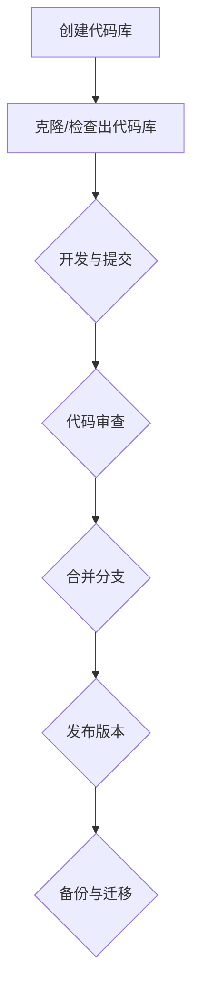
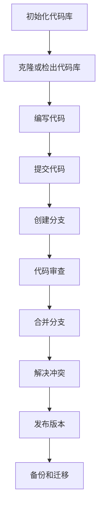

                 

## 引言

随着现代软件开发行业的迅猛发展，代码的复杂度和规模不断增大，如何有效地管理代码的版本和控制其兼容性已成为软件开发过程中的关键环节。提示词语言作为一种广泛应用于人工智能和自然语言处理领域的重要工具，其在版本控制和兼容性管理方面的需求尤为突出。

### 版本控制的需求

版本控制的主要目的是确保代码库中的代码版本始终处于稳定和可追踪的状态。在软件开发过程中，版本控制能够帮助开发人员跟踪代码的变更历史，便于问题的定位和修复。此外，版本控制还能够支持并行开发，使得多个开发者可以在不同版本的基础上进行工作，从而提高开发效率。以下是版本控制的需求：

1. **追踪变更历史**：版本控制系统记录了每次代码变更的详细信息，包括变更时间、变更内容和变更人等，这使得开发人员能够清晰地了解代码的演变过程。
2. **支持并行开发**：在大型项目中，多个开发人员可能需要独立工作并贡献自己的代码。版本控制系统能够协调这些并行任务，确保合并后的代码依然能够正常运行。
3. **代码恢复**：版本控制系统提供了一个“后悔药”，开发人员可以通过回滚操作恢复到之前的版本，以避免因错误更新导致的系统崩溃。

### 兼容性管理的需求

兼容性管理则是确保软件在不同的环境（如不同的操作系统、硬件平台、浏览器等）下能够正常运行的过程。随着技术的不断进步，新版本软件可能引入了新的特性，但这些新特性可能与旧版本的软件存在兼容性问题。兼容性管理需要解决以下问题：

1. **功能兼容性**：确保新版本的软件能够实现原有版本的所有功能，并且不会因为新功能的引入而影响原有功能的运行。
2. **性能兼容性**：新版本的软件应该能够在不同环境下保持或提高性能，以保证用户体验的连续性。
3. **安全兼容性**：软件的安全特性需要在不同环境下保持一致性，以防止安全漏洞被引入。

### 提示词语言的特点

提示词语言（Prompt Language）是一种用于与计算机系统进行交互的特殊语言。其在人工智能和自然语言处理领域中具有广泛的应用，如生成对抗网络（GAN）、自动问答系统、机器翻译等。提示词语言的特点如下：

1. **灵活性**：提示词语言允许用户以自然语言的形式输入指令，这使得计算机系统能够处理多种多样的任务。
2. **可扩展性**：提示词语言通常具有丰富的语法和语义结构，能够支持自定义指令和扩展功能。
3. **高效率**：提示词语言能够将复杂任务分解为一系列简单的指令，从而提高开发效率。

### 结论

本文将围绕提示词语言的版本控制与兼容性管理展开深入探讨。我们将首先介绍版本控制与兼容性管理的基础知识，然后分析其原理与流程，最后通过实际案例展示如何实现这些管理策略。通过本文的阅读，读者将能够全面了解提示词语言版本控制与兼容性管理的重要性和实际应用。

## 第一部分：提示词语言的版本控制与兼容性管理概述

### 第1章 提示词语言版本控制与兼容性管理基础

在深入探讨提示词语言的版本控制与兼容性管理之前，我们需要对其基础概念进行详细的介绍。这一章节将涵盖以下几个方面：

1. **提示词语言版本控制的背景与意义**
2. **版本控制的核心概念**
3. **版本控制工具与技术**

通过这些内容，我们将为后续章节的分析提供坚实的基础。

#### 1.1 提示词语言版本控制的背景与意义

提示词语言版本控制的背景可以追溯到软件开发的历史。随着计算机技术的不断进步，软件开发的方式和工具也在不断演进。早期的软件开发主要依靠手工编写代码，开发周期长、效率低下。随着集成开发环境（IDE）和版本控制工具的出现，软件开发变得更加高效和有序。

版本控制（Version Control）是一种管理软件源代码更改的技术。它能够记录代码的每次变更，提供历史记录，支持代码的恢复和合并。在提示词语言的开发过程中，版本控制同样具有重要意义。

首先，提示词语言的复杂性较高，其涉及到自然语言处理、机器学习等多个领域。版本控制能够帮助开发人员追踪代码的变更历史，便于问题的定位和修复。此外，由于提示词语言的应用场景广泛，开发人员可能需要在不同环境中进行开发和测试，版本控制能够确保这些环境之间的代码一致性。

其次，版本控制支持并行开发。在大型项目中，多个开发人员可能需要独立工作并贡献自己的代码。版本控制系统能够协调这些并行任务，确保合并后的代码依然能够正常运行。

最后，版本控制提供了代码恢复的功能。当开发过程中出现错误时，版本控制系统能够帮助开发人员恢复到之前的稳定版本，从而避免因错误更新导致的系统崩溃。

#### 1.1.1 提示词语言的演变历程

提示词语言的演变历程可以追溯到自然语言处理（NLP）和人工智能（AI）的早期研究。在20世纪50年代和60年代，研究人员开始探索如何让计算机理解自然语言。这一时期的代表性工作包括艾伦·图灵（Alan Turing）提出的“图灵测试”和乔姆斯基（Noam Chomsky）提出的“生成语法”。

随着计算机硬件和算法的不断发展，NLP和AI技术逐渐成熟。20世纪80年代，专家系统和知识表示技术开始得到广泛应用。这些技术为提示词语言的发展奠定了基础。

进入21世纪，随着深度学习和神经网络技术的发展，提示词语言得到了新的突破。生成对抗网络（GAN）、循环神经网络（RNN）和变压器（Transformer）等技术的出现，使得计算机在自然语言处理任务上的表现不断提升。

目前，提示词语言广泛应用于人工智能、自然语言处理、机器翻译、语音识别等领域。其灵活性、可扩展性和高效率使得提示词语言成为现代软件开发的重要工具。

#### 1.1.2 版本控制的需求与挑战

版本控制的需求主要来源于软件开发过程中的复杂性。在大型项目中，代码的规模和复杂度往往非常高，开发人员需要在不同的环境下进行开发和测试。版本控制能够帮助开发人员协调这些并行任务，确保代码的一致性和稳定性。

以下是版本控制面临的几个主要挑战：

1. **并行开发**：在大型项目中，多个开发人员可能需要独立工作并贡献自己的代码。版本控制系统能够协调这些并行任务，确保合并后的代码依然能够正常运行。然而，并行开发也带来了代码冲突的风险，如何有效地解决代码冲突是一个重要挑战。

2. **代码管理**：随着代码规模的不断扩大，如何有效地管理代码也成为版本控制的一个挑战。版本控制系统需要能够支持代码的版本管理、历史记录和权限控制等功能，以确保代码的安全性和可追溯性。

3. **性能要求**：在实时应用中，版本控制系统需要能够快速响应，提供高效的代码访问和管理功能。此外，版本控制系统还需要支持分布式部署，以适应大规模分布式系统的需求。

4. **兼容性**：随着新版本的引入，旧版本的代码可能需要与新版本的系统兼容。版本控制系统需要能够处理兼容性问题，确保新旧版本之间的平稳过渡。

#### 1.1.3 提示词语言版本控制的目标

提示词语言版本控制的主要目标如下：

1. **代码安全性**：确保代码的安全性和完整性，防止未经授权的访问和篡改。

2. **代码可追溯性**：提供代码变更的历史记录，便于问题的定位和修复。

3. **并行开发支持**：支持并行开发，确保多个开发人员能够在不同版本的基础上进行工作，并能够高效地合并代码。

4. **兼容性管理**：确保新旧版本之间的平稳过渡，避免兼容性问题对系统的稳定性产生影响。

5. **代码质量**：通过版本控制系统的规范和流程，提高代码的质量和可维护性。

#### 1.2 版本控制的核心概念

为了深入理解版本控制，我们需要掌握一些核心概念。以下是版本控制中的几个重要概念：

1. **版本**：版本是代码库中的一个特定状态，通常由一组文件和目录组成。版本控制系统通过标识符（如版本号）来区分不同的版本。

2. **分支**：分支是代码库中的一个独立分支，它通常包含一个或多个版本。分支主要用于并行开发，使得开发人员可以在不同的分支上独立工作。

3. **合并**：合并是将两个或多个分支的代码合并到一个分支上的过程。合并过程中可能会出现代码冲突，需要开发人员进行手动解决。

4. **标签**：标签是版本控制系统中的一个特定标记，用于标识重要的版本，如发布版本或里程碑版本。

5. **提交**：提交是将更改记录到版本控制系统的过程。每次提交都会生成一个提交记录，包括提交时间、提交人和提交内容等信息。

#### 1.2.1 提示词语言的版本

在提示词语言中，版本通常是指语言的语法、语义和功能特性的一个特定状态。提示词语言的版本可以分为以下几种类型：

1. **主版本**：主版本是对提示词语言的重大更新，通常包含新的语法、语义和功能特性。例如，从版本1.0升级到版本2.0。

2. **次版本**：次版本是对主版本的补充和改进，通常包含对已有功能特性的优化和修复。例如，从版本1.0升级到版本1.1。

3. **修订版本**：修订版本是对次版本的补充和改进，通常包含对已有功能特性的微小优化和修复。例如，从版本1.1升级到版本1.1.1。

#### 1.2.2 提示词语言的兼容性

兼容性是提示词语言版本控制中的一个重要概念，它涉及到新旧版本之间的交互和兼容。以下是提示词语言兼容性的几个方面：

1. **向下兼容**：向下兼容是指新版本的提示词语言能够与旧版本的系统兼容，不会影响旧版本系统的运行。

2. **向上兼容**：向上兼容是指旧版本的提示词语言能够与新版本的系统兼容，不会影响新版本系统的运行。

3. **功能兼容性**：功能兼容性是指新旧版本之间的功能特性保持一致，新版本不会引入与旧版本不兼容的新功能。

4. **性能兼容性**：性能兼容性是指新旧版本之间的性能表现保持一致，新版本不会因新功能或优化而影响旧版本的性能。

5. **安全兼容性**：安全兼容性是指新旧版本之间的安全特性保持一致，新版本不会因安全漏洞或策略变更而影响旧版本的安全性。

#### 1.2.3 版本控制的策略与方法

版本控制的策略与方法是确保代码库稳定性和可维护性的关键。以下是几种常见的版本控制策略和方法：

1. **集中式版本控制**：集中式版本控制（如SVN）使用一个中心化的服务器存储代码库。所有开发人员从服务器下载代码，并在本地进行开发和测试。提交时，将本地更改上传到服务器。

2. **分布式版本控制**：分布式版本控制（如Git）使用多个分布式仓库存储代码库。每个开发人员都有一个完整的代码库副本，可以进行独立的开发和提交。在需要合并代码时，开发人员可以将本地仓库与其他仓库进行合并。

3. **分支管理**：分支管理是版本控制中的一个重要策略。通过创建和维护分支，开发人员可以在不同分支上独立开发新功能或修复问题，从而避免影响主分支的稳定性。

4. **标签管理**：标签管理用于标识重要的版本，如发布版本或里程碑版本。通过为特定版本打标签，可以方便地回滚到之前的版本或追踪代码的变更历史。

5. **代码审查**：代码审查是一种确保代码质量的方法。在提交代码前，开发人员需要将代码提交给其他开发人员进行审查。审查过程中，审查人员可以提出修改建议或拒绝合并请求。

#### 1.3 版本控制工具与技术

版本控制工具是实现版本控制策略的关键。以下是几种常见的版本控制工具和技术：

1. **Git**：Git是一种分布式版本控制系统，具有高效、灵活和易用等特点。Git支持分支管理和合并操作，能够方便地处理并行开发。

2. **SVN**：SVN是一种集中式版本控制系统，广泛应用于企业级软件开发。SVN具有成熟、稳定和易用的特性，适合大型团队协作。

3. **Mercurial**：Mercurial是一种分布式版本控制系统，与Git类似，具有高效、灵活和易用等特点。Mercurial支持多种存储方案，适用于不同规模和类型的团队。

4. **SVN与Git的比较**：SVN和Git在版本控制策略、分支管理和合并操作等方面存在一些差异。SVN侧重于中心化控制和文件级操作，而Git侧重于分布式控制和分支管理。

5. **版本控制最佳实践**：为了确保代码库的稳定性和可维护性，以下是一些版本控制最佳实践：

   - **定期备份**：定期备份代码库，以防止数据丢失。
   - **代码格式化**：统一代码格式，提高代码可读性和可维护性。
   - **代码审查**：实施代码审查，确保代码质量。
   - **分支命名规范**：使用统一的分支命名规范，便于管理和追踪。
   - **分支策略**：根据项目需求选择合适的分支策略，如功能分支、bug修复分支等。

通过以上内容，我们对提示词语言的版本控制与兼容性管理有了初步的了解。在接下来的章节中，我们将进一步探讨版本控制的基本原理、流程以及兼容性管理的具体方法。

#### 1.3.1 版本控制系统概述

版本控制系统（Version Control System，VCS）是一种用于跟踪源代码变更的管理工具。它能够记录代码的每次变更，提供历史记录，支持代码的恢复和合并。版本控制系统是现代软件开发过程中不可或缺的一部分，它不仅帮助开发人员更好地管理代码，还提高了团队协作的效率和代码的可靠性。

版本控制系统的基本原理是通过唯一标识符（如版本号）来区分不同的代码状态。每次代码变更都会生成一个提交记录，记录变更的时间、内容、作者等信息。这些提交记录按照时间顺序形成一个提交历史，开发人员可以通过查看历史记录来了解代码的演变过程。

版本控制系统的主要功能包括：

1. **代码追踪**：版本控制系统能够记录每次代码变更的详细信息，包括变更的时间、内容、作者等。这使得开发人员能够清晰地了解代码的演变过程，便于问题的定位和修复。

2. **并行开发支持**：版本控制系统支持并行开发，使得多个开发人员可以在不同版本的基础上进行工作，并能够高效地合并代码。这有助于提高开发效率，确保项目按时完成。

3. **代码恢复**：版本控制系统提供了一个“后悔药”，开发人员可以通过回滚操作恢复到之前的版本，以避免因错误更新导致的系统崩溃。

4. **权限控制**：版本控制系统支持权限控制，确保代码的安全性和完整性。开发人员可以根据角色和权限访问不同的代码库，防止未经授权的访问和篡改。

5. **协作管理**：版本控制系统提供了协作管理功能，使得团队成员可以实时同步代码更改，跟踪项目的进度。这有助于团队之间的沟通和协作，提高项目的整体效率。

版本控制系统的类型可以分为集中式和分布式两种：

1. **集中式版本控制**：集中式版本控制（如SVN）使用一个中心化的服务器存储代码库。所有开发人员从服务器下载代码，并在本地进行开发和测试。提交时，将本地更改上传到服务器。集中式版本控制具有成熟、稳定和易用的特性，适合大型团队协作。

2. **分布式版本控制**：分布式版本控制（如Git）使用多个分布式仓库存储代码库。每个开发人员都有一个完整的代码库副本，可以进行独立的开发和提交。在需要合并代码时，开发人员可以将本地仓库与其他仓库进行合并。分布式版本控制具有高效、灵活和易用的特性，适用于中小型团队和分布式开发。

#### 1.3.2 常见的版本控制工具

在版本控制领域，有许多流行的工具可供选择。以下是几种常见的版本控制工具及其特点：

1. **Git**

   Git是一种分布式版本控制系统，由Linus Torvalds开发。Git具有高效、灵活和易用等特点，是当前最流行的版本控制工具之一。

   - **特点**：支持分布式仓库、快速克隆和同步、强大的分支管理、高效的合并算法。
   - **适用场景**：适用于中小型团队和分布式开发。
   - **优势**：版本恢复方便、分支操作灵活、性能优异。
   - **劣势**：初次使用需要一定学习成本。

2. **SVN**

   SVN（Subversion）是一种集中式版本控制系统，由Apache Software Foundation开发。SVN具有成熟、稳定和易用的特性，适用于企业级软件开发。

   - **特点**：支持集中式仓库、方便的分支管理、完善的权限控制、丰富的客户端工具。
   - **适用场景**：适用于大型团队和集中式开发。
   - **优势**：社区支持强大、操作简单、稳定性高。
   - **劣势**：分布式能力较弱、合并操作复杂。

3. **Mercurial**

   Mercurial是一种分布式版本控制系统，由Matt Mackall开发。Mercurial与Git类似，具有高效、灵活和易用的特性，适用于各种规模的团队。

   - **特点**：支持分布式仓库、快速克隆和同步、强大的分支管理、高效的合并算法。
   - **适用场景**：适用于中小型团队和分布式开发。
   - **优势**：与Git类似，操作灵活、性能优异。
   - **劣势**：知名度相对较低、社区支持较弱。

#### 1.3.2.1 Git

Git是目前最流行的版本控制工具之一，其核心特点在于分布式仓库和强大的分支管理。以下是对Git的详细介绍：

1. **分布式仓库**

   与SVN等集中式版本控制工具不同，Git使用分布式仓库模型。在Git中，每个开发人员都有自己的本地仓库，这些仓库之间可以通过网络进行同步。这意味着Git不仅支持集中式开发，还支持分布式开发。

   - **优势**：分布式仓库使得开发人员可以在本地进行快速克隆和同步，提高了开发效率。同时，分布式仓库也使得代码的备份和恢复更加方便。
   - **挑战**：分布式仓库可能导致代码同步的复杂度增加，需要开发人员具备一定的Git操作技能。

2. **分支管理**

   Git的另一个核心特点是强大的分支管理。在Git中，分支是独立的工作路径，开发人员可以在不同的分支上独立开发新功能或修复bug，而不会影响主分支的稳定性。

   - **优势**：分支管理使得并行开发变得更加容易，开发人员可以在不同的分支上独立工作，避免了代码冲突。同时，分支管理也使得代码的可维护性得到提升。
   - **挑战**：过多的分支可能导致代码库的复杂性增加，需要开发人员合理规划和管理分支。

3. **合并算法**

   Git采用了高效的合并算法，能够自动处理大部分合并操作。与SVN等版本控制工具相比，Git在合并操作方面具有明显优势。

   - **优势**：Git的合并算法能够自动处理常见的合并冲突，减少了开发人员的负担。同时，Git也支持手动合并，使得复杂的合并操作变得更加可控。
   - **挑战**：尽管Git的合并算法非常强大，但在某些特殊情况下，合并操作仍然可能产生冲突。开发人员需要具备一定的合并技能，以确保合并过程顺利进行。

#### 1.3.2.2 SVN

SVN是一种集中式版本控制工具，由Apache Software Foundation开发。以下是对SVN的详细介绍：

1. **集中式仓库**

   SVN使用集中式仓库模型，所有代码都存储在一个中心化的服务器上。开发人员从服务器下载代码，并在本地进行开发和测试。提交时，将本地更改上传到服务器。

   - **优势**：集中式仓库使得代码管理更加简单，所有的代码变更都在中心服务器上集中管理，便于监控和审计。
   - **挑战**：集中式仓库可能导致开发效率下降，特别是在网络不稳定或服务器性能不足的情况下。

2. **分支管理**

   SVN的分支管理相对简单，开发人员可以通过创建和删除分支来管理不同的开发任务。

   - **优势**：SVN的分支管理简单易用，适合小型团队或复杂度较低的项目。
   - **挑战**：SVN的分支管理功能相对较弱，不适合大规模并行开发。

3. **权限控制**

   SVN提供了完善的权限控制功能，开发人员可以根据角色和权限访问不同的代码库。

   - **优势**：SVN的权限控制功能使得代码库的安全性得到保障，防止未经授权的访问和篡改。
   - **挑战**：权限控制功能可能导致代码库的访问复杂度增加，需要管理员合理配置和管理权限。

#### 1.3.2.3 Mercurial

Mercurial是一种分布式版本控制工具，与Git类似，具有高效、灵活和易用的特性。以下是对Mercurial的详细介绍：

1. **分布式仓库**

   Mercurial采用分布式仓库模型，每个开发人员都有自己的本地仓库，这些仓库之间可以通过网络进行同步。

   - **优势**：分布式仓库使得开发人员可以在本地进行快速克隆和同步，提高了开发效率。同时，分布式仓库也使得代码的备份和恢复更加方便。
   - **挑战**：分布式仓库可能导致代码同步的复杂度增加，需要开发人员具备一定的Git操作技能。

2. **分支管理**

   Mercurial的分支管理功能与Git类似，支持强大的分支管理和合并操作。

   - **优势**：分支管理使得并行开发变得更加容易，开发人员可以在不同的分支上独立工作，避免了代码冲突。同时，分支管理也使得代码的可维护性得到提升。
   - **挑战**：过多的分支可能导致代码库的复杂性增加，需要开发人员合理规划和管理分支。

3. **性能与稳定性**

   Mercurial在性能和稳定性方面具有较好的表现，适合各种规模和类型的团队。

   - **优势**：Mercurial的性能优异，支持快速克隆和同步，同时具有良好的稳定性。
   - **挑战**：知名度相对较低、社区支持较弱。

#### 1.3.3 版本控制的最佳实践

为了确保版本控制的效率和代码库的稳定性，以下是一些版本控制的最佳实践：

1. **定期备份**：定期备份代码库，以防止数据丢失。可以使用备份工具或版本控制系统提供的备份功能。

2. **代码格式化**：统一代码格式，提高代码可读性和可维护性。可以使用代码格式化工具，如`gofmt`、`black`等。

3. **代码审查**：实施代码审查，确保代码质量。可以采用静态代码分析工具，如`SonarQube`、`Checkstyle`等。

4. **分支命名规范**：使用统一的分支命名规范，便于管理和追踪。例如，`feature/`用于功能分支，`bugfix/`用于bug修复分支。

5. **分支策略**：根据项目需求选择合适的分支策略，如功能分支、bug修复分支等。合理规划分支，避免分支过多导致代码库复杂性增加。

6. **权限控制**：合理配置和管理权限，确保代码库的安全性。为不同角色的开发人员分配适当的权限，防止未经授权的访问和篡改。

通过以上内容，我们对版本控制系统的概述、常见版本控制工具及其特点有了全面的了解。在接下来的章节中，我们将进一步探讨版本控制的基本原理、流程以及兼容性管理的具体方法。

#### 1.3.3 版本控制的流程

版本控制不仅仅是工具的选择和使用，更是一个系统的流程。有效的版本控制流程能够确保代码库的稳定性、可维护性和可追溯性。以下是版本控制的基本流程：

1. **初始化代码库**：在开始开发之前，首先需要初始化代码库。对于分布式版本控制系统（如Git），开发人员需要克隆（clone）一个远程仓库（repository）到本地。对于集中式版本控制系统（如SVN），开发人员需要从中心服务器检查（check out）代码库的一个副本。

2. **开发工作**：在本地代码库中，开发人员可以自由地进行代码编写和修改。在开发过程中，建议定期将更改提交（commit）到本地仓库，以便随时进行备份和恢复。

3. **代码审查**：在提交代码前，进行代码审查（code review）是确保代码质量的重要步骤。审查人员可以提出修改建议，或者拒绝合并请求。代码审查可以帮助发现潜在的问题，提高代码的整体质量。

4. **合并分支**：在开发新功能或修复bug时，通常需要在不同分支上进行工作。当功能开发完成或bug修复后，开发人员需要将分支合并（merge）到主分支（main branch）。合并过程中可能会出现冲突（conflicts），需要手动解决。

5. **发布版本**：在完成一轮开发并确保代码库稳定后，可以发布一个新的版本。发布版本包括打标签（tag）和推送（push）到远程仓库。标签可以用来标识重要的版本，如发布版本或里程碑版本。

6. **备份与迁移**：定期备份代码库，防止数据丢失。在迁移代码库时，需要确保版本控制系统的兼容性，避免数据损坏或丢失。

#### 1.3.3.1 版本控制的生命周期

版本控制的生命周期通常包括以下几个阶段：

1. **创建代码库**：初始化代码库，设置版本控制工具。

2. **克隆/检查出代码库**：开发人员从远程仓库克隆（clone）或检查出（check out）代码库的副本。

3. **开发与提交**：开发人员在本地的代码库中编写代码，并定期提交（commit）更改。

4. **代码审查**：提交前进行代码审查，确保代码质量。

5. **合并分支**：将功能分支或bug修复分支合并（merge）到主分支。

6. **发布版本**：打标签（tag）并推送（push）到远程仓库，发布新版本。

7. **备份与迁移**：定期备份代码库，确保数据安全。在需要时进行代码库的迁移。

#### 1.3.3.2 版本控制的步骤

以下是版本控制的基本步骤：

1. **创建代码库**：
   - 对于分布式版本控制系统，使用`git init`命令创建一个新的仓库。
   - 对于集中式版本控制系统，使用`svn admin`命令创建一个新的仓库。

2. **克隆/检查出代码库**：
   - 分布式版本控制系统：使用`git clone`命令克隆远程仓库。
   - 集中式版本控制系统：使用`svn checkout`命令检查出代码库的副本。

3. **开发与提交**：
   - 在本地代码库中编写代码。
   - 定期使用`git commit`或`svn commit`命令提交更改。

4. **代码审查**：
   - 使用代码审查工具（如GitHub、GitLab、Bitbucket等）提交代码审查请求。
   - 审查人员使用`git review`或`svn review`命令审查代码。

5. **合并分支**：
   - 使用`git merge`或`svn merge`命令将分支合并到主分支。
   - 手动解决合并过程中出现的冲突。

6. **发布版本**：
   - 使用`git tag`或`svn tag`命令为重要版本打标签。
   - 使用`git push`或`svn commit`命令将标签推送到远程仓库。

7. **备份与迁移**：
   - 使用`git archive`或`svnadmin dump`命令备份代码库。
   - 在需要时使用`git fetch`或`svn switch`命令迁移代码库。

#### 1.3.3.3 版本控制的流程图与Mermaid表示

以下是版本控制的基本流程图，使用Mermaid语言表示：



通过以上内容，我们了解了版本控制的基本流程和生命周期。在下一个章节中，我们将探讨版本控制中的具体方法，如分支管理、标签管理和合并策略。

### 提示词语言版本控制的基本原理

在深入探讨提示词语言的版本控制之前，我们需要了解一些基本原理。这些原理不仅适用于提示词语言，也适用于其他类型的软件项目。以下是提示词语言版本控制的基本原理：

#### 2.1.1 提示词语言的编译与执行流程

提示词语言的编译与执行流程可以分为以下几个阶段：

1. **词法分析（Lexical Analysis）**：词法分析是将源代码分解为一系列单词（tokens）的过程。每个单词代表一个基本语言元素，如关键字、变量名或运算符。

2. **语法分析（Syntax Analysis）**：语法分析是将单词序列解析成语法结构的过程。语法分析器根据预定义的语法规则，将源代码构建成一个抽象语法树（Abstract Syntax Tree，AST）。

3. **语义分析（Semantic Analysis）**：语义分析是对AST进行语义检查，确保代码在语法上正确，并在语义上符合预期。这一阶段包括类型检查、变量作用域分析和函数调用验证等。

4. **代码生成（Code Generation）**：代码生成是将AST转换为目标代码的过程。目标代码可以是机器代码、汇编代码或字节码。在这一阶段，编译器会根据目标平台的指令集生成相应的代码。

5. **执行（Execution）**：执行是将生成的目标代码加载到计算机的内存中，并按照指令执行的过程。

#### 2.1.2 版本控制的机制与作用

版本控制的机制主要包括以下几部分：

1. **提交（Commit）**：提交是将代码更改记录到版本控制系统的过程。每次提交都会生成一个提交记录，包括提交时间、提交内容和提交者等信息。

2. **分支（Branch）**：分支是代码库中的一个独立部分，用于实现不同的功能或修复不同的bug。通过分支，开发人员可以在不同的环境中独立开发，而不会影响主分支的稳定性。

3. **合并（Merge）**：合并是将两个或多个分支的代码合并到一个分支上的过程。合并过程中可能会出现冲突，需要开发人员进行手动解决。

4. **标签（Tag）**：标签是用于标识代码库中某个特定版本的标记。通过标签，开发人员可以轻松回滚到之前的版本或追踪代码的变更历史。

版本控制在软件开发中的作用如下：

1. **代码管理**：版本控制系统能够记录代码的每次变更，提供历史记录，便于问题的定位和修复。

2. **并行开发**：版本控制支持并行开发，使得多个开发人员可以在不同的分支上独立工作，并能够高效地合并代码。

3. **代码恢复**：版本控制系统提供了一个“后悔药”，开发人员可以通过回滚操作恢复到之前的版本，以避免因错误更新导致的系统崩溃。

4. **协作管理**：版本控制系统提供了协作管理功能，使得团队成员可以实时同步代码更改，跟踪项目的进度。

#### 2.1.3 版本控制的策略与方法

版本控制的策略与方法是确保代码库稳定性和可维护性的关键。以下是几种常见的版本控制策略：

1. **集中式版本控制**：集中式版本控制（如SVN）使用一个中心化的服务器存储代码库。所有开发人员从服务器下载代码，并在本地进行开发和测试。提交时，将本地更改上传到服务器。集中式版本控制具有成熟、稳定和易用的特性，适合大型团队协作。

2. **分布式版本控制**：分布式版本控制（如Git）使用多个分布式仓库存储代码库。每个开发人员都有一个完整的代码库副本，可以进行独立的开发和提交。在需要合并代码时，开发人员可以将本地仓库与其他仓库进行合并。分布式版本控制具有高效、灵活和易用的特性，适用于中小型团队和分布式开发。

3. **分支管理策略**：分支管理是版本控制中的一个重要策略。通过创建和维护分支，开发人员可以在不同分支上独立开发新功能或修复问题，从而避免影响主分支的稳定性。常见的分支管理策略包括：

   - **主分支（Main Branch）**：主分支是代码库的主线，通常用于发布稳定版本。
   - **功能分支（Feature Branch）**：功能分支用于开发新的功能，开发完成后再合并到主分支。
   - **bug修复分支（Bugfix Branch）**：bug修复分支用于修复已知问题，修复完成后再合并到主分支。
   - **发布分支（Release Branch）**：发布分支是在准备发布新版本时创建的，用于最后的测试和修复。

4. **代码审查与测试**：实施代码审查和测试是确保代码质量的重要手段。代码审查可以帮助发现潜在的问题，提高代码的整体质量。测试则可以验证代码的功能和性能，确保代码符合预期。

#### 2.1.4 提示词语言的版本管理

提示词语言的版本管理涉及到对语言的不同版本的跟踪和管理。以下是提示词语言版本管理的一些关键点：

1. **版本标识**：版本标识是区分不同版本的重要手段。常见的版本标识包括主版本号、次版本号和修订版本号。例如，1.0.1表示主版本为1，次版本为0，修订版本为1。

2. **版本发布**：版本发布是指将新版本的提示词语言发布给用户使用。在发布版本前，通常需要进行充分的测试和验证，以确保新版本的功能和性能符合预期。

3. **版本兼容性**：版本兼容性是指新版本能否与旧版本无缝切换。为了实现版本兼容性，需要确保新版本不破坏旧版本的功能，并尽可能保持二者的接口一致。

4. **版本回滚**：版本回滚是指将代码库恢复到之前的版本。在遇到新版本问题或故障时，版本回滚可以帮助快速恢复系统。

通过以上内容，我们对提示词语言版本控制的基本原理有了初步了解。在下一个章节中，我们将深入探讨提示词语言版本控制的具体实现和流程。

#### 2.2 提示词语言的版本管理

版本管理是提示词语言开发过程中至关重要的一环，它确保了代码库的稳定性、可维护性和可追溯性。以下是关于提示词语言版本管理的一些关键概念和步骤：

#### 2.2.1 版本的标识与分类

在版本管理中，版本标识是基础。版本的标识方式通常包括以下几个部分：

1. **主版本号**：表示提示词语言的总体版本，通常在引入重大功能或架构变更时进行更新。
2. **次版本号**：表示在主版本基础上进行的较小更新，通常用于修复功能问题和性能优化。
3. **修订版本号**：表示在次版本基础上进行的微小更新，通常用于修正bug或进行一些小的改进。

版本分类通常根据其稳定性和用途进行：

1. **稳定版**：稳定版（如1.0.0）是经过充分测试和验证的版本，适合生产环境使用。
2. **预发布版**：预发布版（如1.0.0-rc1）是供用户测试的版本，通常包含一些新功能，但稳定性可能不如稳定版。
3. **开发版**：开发版（如1.0.0-dev）是供开发人员使用的版本，包含最新的功能，但可能存在一些未解决的问题。

#### 2.2.2 版本的发布与更新

版本的发布与更新是版本管理的重要环节，以下是相关步骤：

1. **规划发布**：在发布版本前，需要制定详细的发布计划，包括版本号、发布日期、更新内容等。
2. **代码审查**：在发布新版本之前，进行代码审查是确保代码质量的关键步骤。审查人员需要仔细检查代码，确保无严重缺陷。
3. **测试**：发布版本前，需要经过严格的测试。测试包括单元测试、集成测试、性能测试和兼容性测试等，以确保新版本的功能和性能符合预期。
4. **发布版本**：测试通过后，可以正式发布版本。通常，发布版本包括将代码推送到版本控制系统，并为新版本打上标签（tag）。
5. **发布通知**：发布新版本后，需要向用户发布通知，告知他们新版本的功能和改进点。

#### 2.2.3 版本的回滚与修复

在实际开发过程中，可能会遇到需要回滚到旧版本的情况。以下是回滚和修复的相关步骤：

1. **识别问题**：当新版本出现问题时，需要迅速识别问题的性质和影响范围。
2. **回滚版本**：如果问题严重，需要立即回滚到稳定版本。回滚步骤包括删除新版本代码，恢复到旧版本代码，并重新打上标签。
3. **修复问题**：针对导致问题的代码进行修复。修复后，可以发布一个新的修复版本。
4. **测试修复版本**：修复后的版本需要进行充分测试，以确保问题已解决且没有引入新的问题。
5. **发布修复版本**：测试通过后，发布修复版本，通知用户更新。

#### 2.2.4 版本管理的工具与平台

有效的版本管理需要合适的工具和平台支持。以下是几种常用的版本管理工具和平台：

1. **Git**：Git是一种流行的分布式版本控制工具，支持分支管理、标签管理和合并操作。它适用于各种规模的项目和团队。
2. **SVN**：SVN是一种集中式版本控制工具，适合大型团队和企业级项目。它具有稳定性和易用性。
3. **GitLab**：GitLab是一个基于Git的版本控制系统，提供自托管服务，支持代码审查、CI/CD和项目管理。
4. **GitHub**：GitHub是一个基于Git的云平台，提供代码托管、协作工具和社区功能，适用于开源项目和商业项目。

通过以上内容，我们了解了提示词语言版本管理的关键概念和步骤。有效的版本管理不仅能够确保代码库的稳定性和可维护性，还能提高开发团队的协作效率。在下一个章节中，我们将进一步探讨版本控制的流程和实现方法。

### 提示词语言版本控制的流程

在深入了解提示词语言版本控制的具体实现之前，我们先来梳理一下版本控制的整个流程。这个流程包括从代码的编写、提交、分支管理、代码审查、合并，到最后版本的发布。通过这些步骤，我们可以确保代码库的稳定性、一致性和可靠性。

#### 2.3.1 版本控制的生命周期

版本控制的生命周期可以分为以下几个阶段：

1. **初始化代码库**：在开发项目之前，首先需要初始化代码库。这一步包括创建仓库（repository）和设置版本控制系统。

2. **克隆或检出代码库**：开发人员需要从代码库中克隆（Clone）或检出（Check Out）一个副本到本地环境中。

3. **编写代码**：在本地环境中，开发人员可以编写和修改代码。这个阶段的主要任务是实现新功能、修复bug或进行性能优化。

4. **提交代码**：在完成代码修改后，开发人员需要将代码提交（Commit）到本地代码库中。每次提交都会生成一个提交记录，记录更改内容、提交时间和提交者等信息。

5. **分支管理**：为了实现并行开发，开发人员需要创建（Create）不同的分支。每个分支代表一个独立的工作路径，可以用来实现新功能、修复bug等。

6. **代码审查**：在分支开发完成后，需要将代码提交进行代码审查（Code Review）。审查人员会检查代码的质量、规范和潜在问题，并提出修改建议。

7. **合并分支**：在代码审查通过后，开发人员需要将分支合并（Merge）到主分支（Main Branch）。合并过程中可能会出现冲突（Conflict），需要手动解决。

8. **发布版本**：当主分支的代码稳定后，可以打上标签（Tag），并发布新版本。发布版本前，需要经过测试和验证，确保新版本的功能和性能符合预期。

9. **备份和迁移**：定期备份代码库，并确保在需要时能够顺利迁移代码库。

#### 2.3.2 版本控制的步骤

以下是版本控制的基本步骤：

1. **创建仓库**：使用版本控制工具创建一个新的仓库。例如，使用Git创建仓库：
   ```shell
   git init
   ```

2. **克隆或检出代码库**：从远程仓库克隆或检出代码库到本地：
   ```shell
   git clone https://example.com/repo.git
   ```

3. **编写代码**：在本地环境中编写代码，并进行必要的修改。

4. **提交代码**：将代码提交到本地代码库中：
   ```shell
   git add .
   git commit -m "commit message"
   ```

5. **创建分支**：创建一个新的分支进行独立开发：
   ```shell
   git checkout -b feature/new-feature
   ```

6. **代码审查**：将分支提交推送到远程仓库，并请求代码审查：
   ```shell
   git push -u origin feature/new-feature
   ```

7. **合并分支**：在代码审查通过后，将分支合并到主分支：
   ```shell
   git checkout main
   git merge feature/new-feature
   ```

8. **解决冲突**：如果合并过程中出现冲突，需要手动解决：
   ```shell
   git status
   git add <conflicted-file>
   git commit -m "resolved conflicts"
   ```

9. **发布版本**：打上标签并发布新版本：
   ```shell
   git tag -a v1.0.0 -m "Release version 1.0.0"
   git push --tags
   ```

10. **备份和迁移**：定期备份代码库，并确保在需要时能够顺利迁移。

#### 2.3.3 版本控制的流程图与Mermaid表示

以下是版本控制的基本流程图，使用Mermaid语言表示：



通过以上内容，我们对提示词语言版本控制的流程有了更详细的了解。接下来，我们将深入探讨版本控制的实现细节，包括如何进行分支管理、代码审查、合并操作等。

### 提示词语言的兼容性管理

在提示词语言开发过程中，兼容性管理是一个至关重要的问题。兼容性管理的目的是确保新版本的提示词语言能够与旧版本的系统无缝切换，避免因版本差异导致的功能缺失、性能下降或系统崩溃。以下是关于提示词语言兼容性管理的一些核心概念和策略。

#### 3.1 兼容性管理的核心概念

兼容性管理涉及以下核心概念：

1. **向下兼容（Backward Compatibility）**：新版本的提示词语言能够与旧版本的系统兼容。这意味着新版本不会破坏旧版本的功能，并且旧版本的应用程序可以正常运行。

2. **向上兼容（Forward Compatibility）**：旧版本的提示词语言能够与新版本的系统兼容。这通常涉及在旧版本中引入新特性，使得旧版本的应用程序可以在新版本的环境中运行。

3. **功能兼容性（Feature Compatibility）**：确保新版本的提示词语言包含旧版本的所有功能，并且不会因新功能的引入而影响旧功能。

4. **性能兼容性（Performance Compatibility）**：确保新版本的提示词语言在旧版本的环境下能够保持或提高性能。

5. **安全兼容性（Security Compatibility）**：确保新版本的提示词语言在安全性方面不会降低旧版本的保护水平。

#### 3.2 兼容性检测与评估方法

为了确保提示词语言的兼容性，我们需要采用一系列检测与评估方法。以下是一些常见的兼容性检测与评估方法：

1. **自动化测试**：通过编写自动化测试脚本，对提示词语言的不同版本进行测试，确保新版本不会破坏旧版本的功能和性能。自动化测试可以覆盖功能测试、性能测试和安全测试。

2. **回归测试（Regression Testing）**：在每次版本更新后，对旧版本的代码进行回归测试，确保新版本不会引入新的问题。

3. **兼容性测试套件（Compatibility Test Suite）**：开发一套标准化的兼容性测试套件，包括不同类型的测试用例，用于评估不同版本的提示词语言之间的兼容性。

4. **交叉测试（Cross-Platform Testing）**：在不同操作系统、硬件平台和浏览器下测试提示词语言的应用程序，确保其能够在各种环境下正常运行。

5. **用户体验测试（User Experience Testing）**：通过用户体验测试，评估新版本的提示词语言在用户界面和交互方面是否与旧版本保持一致。

6. **性能基准测试（Performance Benchmark Testing）**：通过性能基准测试，评估新版本的提示词语言在不同环境下的性能表现，确保不会出现性能下降。

#### 3.2.1 功能兼容性测试

功能兼容性测试是确保新版本的提示词语言包含旧版本所有功能的关键步骤。以下是功能兼容性测试的一些具体方法：

1. **黑盒测试**：不关注内部实现，仅测试功能的输入输出是否正确。黑盒测试可以覆盖各种功能和边界条件。

2. **白盒测试**：关注内部实现，测试代码的路径覆盖率和逻辑正确性。白盒测试可以更深入地检查功能实现。

3. **集成测试**：在新版本中集成旧版本的所有组件，确保不同模块之间的接口和交互正常。

4. **端到端测试**：对整个提示词语言系统进行测试，确保从用户输入到最终输出的整个过程无误。

#### 3.2.2 性能兼容性测试

性能兼容性测试旨在确保新版本的提示词语言在不同环境下的性能表现与旧版本相当。以下是性能兼容性测试的一些方法：

1. **基准测试**：使用标准的基准测试工具（如Apache JMeter、Gatling等）模拟用户负载，比较不同版本的性能指标。

2. **负载测试**：逐步增加用户数量和请求频率，观察系统性能的变化，确保在高负载下新版本的表现不会下降。

3. **压力测试**：模拟极端负载情况，测试系统的最大承载能力和响应时间。

4. **资源监控**：通过监控系统的CPU、内存、磁盘和网络资源，分析性能瓶颈和资源消耗，优化代码和系统配置。

#### 3.2.3 安全兼容性测试

安全兼容性测试是确保新版本的提示词语言在安全性方面不降低旧版本的保护水平的必要步骤。以下是安全兼容性测试的一些方法：

1. **漏洞扫描**：使用自动化工具扫描代码库，查找潜在的安全漏洞。

2. **代码审查**：手动审查代码，查找可能的安全问题和不良编程实践。

3. **安全基准测试**：使用标准的安全测试工具（如OWASP ZAP、Burp Suite等）测试系统的安全漏洞。

4. **渗透测试**：模拟黑客攻击，测试系统的防御能力。

#### 3.3 兼容性管理策略与最佳实践

为了确保提示词语言的兼容性，我们需要制定一系列兼容性管理策略和最佳实践。以下是一些策略和最佳实践：

1. **兼容性测试计划**：在项目初期制定详细的兼容性测试计划，明确测试目标和测试方法。

2. **持续集成与部署**：使用持续集成（CI）和持续部署（CD）工具，自动化测试和部署流程，确保每次版本更新都经过严格的测试。

3. **版本控制**：合理使用版本控制系统，确保代码库的版本一致性，方便回滚和追踪变更。

4. **文档与培训**：编写详细的用户手册和开发文档，为开发人员和用户提供指导和帮助。

5. **反馈机制**：建立有效的反馈机制，收集用户和开发人员的反馈，及时解决问题和优化兼容性。

6. **兼容性评估**：定期对提示词语言的兼容性进行评估，确保在技术更新和系统变更时能够及时应对。

通过以上内容，我们了解了提示词语言兼容性管理的核心概念、检测与评估方法以及管理策略。在下一个章节中，我们将进一步探讨如何在实际项目中实施这些策略和最佳实践。

### 3.3 兼容性管理策略与最佳实践

在提示词语言的开发和维护过程中，兼容性管理策略和最佳实践至关重要，它们不仅能确保新版本与旧版本无缝切换，还能提高系统的稳定性和用户满意度。以下是几个关键的兼容性管理策略与最佳实践：

#### 3.3.1 制定兼容性管理计划

兼容性管理计划是确保项目成功的关键。以下是一些建议：

1. **评估当前状态**：在开始新版本开发之前，对现有系统的兼容性进行评估。识别系统中可能存在的兼容性问题，并记录在案。

2. **定义兼容性标准**：明确新版本必须满足的兼容性标准，包括功能兼容性、性能兼容性和安全兼容性等。

3. **制定测试计划**：根据项目需求和资源，制定详细的测试计划。测试计划应包括测试目标、测试方法、测试环境和测试时间表。

4. **资源分配**：确保项目有足够的资源（人力、时间、预算等）来支持兼容性测试工作。

5. **监控与反馈**：在整个开发过程中，持续监控兼容性问题的发生情况，并收集用户和开发人员的反馈。

#### 3.3.2 兼容性测试的策略

兼容性测试是确保新版本兼容性的关键步骤。以下是一些策略：

1. **功能兼容性测试**：编写详细的测试用例，覆盖所有功能点。确保新版本中的功能与旧版本完全一致。

2. **性能兼容性测试**：使用基准测试工具，在不同环境下模拟用户负载，评估新版本的响应时间、吞吐量和资源消耗。

3. **安全兼容性测试**：使用安全漏洞扫描工具，对代码进行安全评估。确保新版本在安全性方面不降低旧版本的保护水平。

4. **交叉平台测试**：在不同操作系统、浏览器和硬件平台上进行测试，确保新版本在各种环境中都能正常运行。

5. **灰度发布**：在正式发布新版本之前，先在一个小范围内进行灰度发布。通过观察用户反馈，及时发现潜在问题。

#### 3.3.3 处理兼容性问题的方法

在实际开发过程中，难免会遇到兼容性问题。以下是一些处理兼容性问题的方法：

1. **隔离问题**：当发现兼容性问题时，首先需要隔离问题，确保问题不会影响其他功能。

2. **回滚策略**：如果新版本出现严重兼容性问题，应立即回滚到上一个稳定版本。在问题解决后再发布新版本。

3. **修复与优化**：针对发现的问题，制定修复方案并进行优化。在修复过程中，应进行充分的测试，确保修复方案的有效性。

4. **用户沟通**：及时与用户沟通，告知他们可能出现的问题以及解决方案。良好的用户沟通有助于提高用户满意度。

5. **文档记录**：详细记录兼容性问题及其解决方案，以便未来参考。

#### 3.3.4 兼容性管理的最佳实践

以下是一些兼容性管理的最佳实践：

1. **版本控制**：使用版本控制系统，确保代码库的版本一致性。版本控制系统可以帮助追踪变更历史，便于问题的定位和修复。

2. **自动化测试**：编写自动化测试脚本，定期运行，确保每次代码变更都不会引入兼容性问题。

3. **持续集成**：使用持续集成（CI）工具，自动化构建和测试流程，确保新版本在每次提交后都能得到及时评估。

4. **文档与培训**：编写详细的用户手册和开发文档，为开发人员和用户提供指导和帮助。定期组织培训，提高团队对兼容性问题的认识和处理能力。

5. **反馈机制**：建立有效的反馈机制，收集用户和开发人员的反馈，及时解决问题和优化兼容性。

6. **持续监控**：在整个项目生命周期中，持续监控系统的兼容性。定期进行安全评估，及时发现潜在风险。

通过以上策略和最佳实践，我们可以确保提示词语言的版本控制与兼容性管理高效、稳定地运行，为用户提供高质量的产品体验。

#### 3.4 版本控制与兼容性管理的工具与平台

在现代软件开发过程中，版本控制与兼容性管理是确保项目成功的关键因素。为了支持这些功能，开发者有多种工具和平台可供选择。以下是几种常见的版本控制与兼容性管理工具及平台：

##### 4.1 版本控制工具

**Git**

Git 是目前最受欢迎的版本控制工具之一。它是一款分布式版本控制系统，具有高效、灵活和易用的特性。Git 的主要优点包括：

- **分布式存储**：每个开发人员都有自己完整的代码库副本，可以独立工作，提高了开发效率。
- **强大的分支管理**：Git 支持强大的分支和合并功能，使得并行开发和协作更加方便。
- **高效的性能**：Git 的数据存储和传输效率非常高，适合处理大型项目和复杂的代码库。

Git 的主要缺点是初次使用需要一定的学习成本，特别是对于初学者来说，Git 的命令和操作可能较为复杂。

**SVN**

SVN（Subversion）是一款集中式版本控制系统，由Apache软件基金会开发。SVN 的优点包括：

- **成熟稳定**：SVN 经过多年的发展，具有很高的稳定性和可靠性，是企业级项目的常用选择。
- **易用性**：SVN 的用户界面和操作相对简单，适合新手快速上手。
- **良好的文档支持**：SVN 有大量的文档和教程，方便用户学习和使用。

SVN 的主要缺点是分布式能力较弱，不适合大规模的分布式开发。此外，SVN 的分支管理和合并操作相对复杂，不如 Git 灵活。

**Mercurial**

Mercurial 是一款类似于 Git 的分布式版本控制工具。它具有与 Git 类似的功能和性能，但也有一些独特的优点：

- **易于使用**：Mercurial 的用户界面和操作相对简单，适合新手。
- **快速同步**：Mercurial 支持快速克隆和同步，适合处理大型项目。
- **灵活性**：Mercurial 提供了多种配置和优化选项，可以根据项目需求进行定制。

Mercurial 的主要缺点是知名度较低，社区支持相对较少。此外，Mercurial 的合并算法在某些情况下可能不如 Git 敏捷。

##### 4.2 兼容性管理工具

**JFrog Artifactory**

JFrog Artifactory 是一款流行的仓库管理工具，主要用于存储和管理软件包。它支持多种版本控制工具（如 Git、SVN、Mercurial 等），并提供以下功能：

- **依赖管理**：Artifactory 支持各种依赖管理工具（如 Maven、Gradle、npm 等），可以方便地管理项目的依赖项。
- **仓库镜像**：Artifactory 可以镜像远程仓库，提供缓存和加速功能，提高项目构建速度。
- **权限控制**：Artifactory 提供细粒度的权限控制，确保仓库的安全和合规性。

Artifactory 的主要缺点是价格较高，对于小型项目可能不太适用。

**Nexus Repository**

Nexus Repository 是另一款流行的仓库管理工具，与 Artifactory 类似，它也提供了依赖管理和仓库镜像功能。以下是 Nexus Repository 的主要优点：

- **免费版本**：Nexus Repository 提供免费版本，适合小型项目和预算有限的企业。
- **灵活的部署**：Nexus Repository 支持多种部署方式，包括本地部署和云部署。
- **集成丰富**：Nexus Repository 与各种 CI/CD 工具（如 Jenkins、Travis CI 等）集成良好，便于自动化工作流程。

Nexus Repository 的主要缺点是配置相对复杂，需要一定学习成本。

**Helm**

Helm 是一款流行的 Kubernetes 配置管理工具。它主要用于管理 Kubernetes 应用程序的部署和版本控制。以下是 Helm 的主要优点：

- **Kubernetes 优化**：Helm 提供了针对 Kubernetes 的优化配置，便于管理和部署应用程序。
- **图表库**：Helm 有一个丰富的图表库，提供了一系列现成的 Kubernetes 应用程序模板。
- **部署管理**：Helm 支持多环境部署管理，便于在不同环境中管理应用程序的版本。

Helm 的主要缺点是它主要针对 Kubernetes 环境，对于其他类型的部署场景可能不太适用。

##### 4.3 版本控制与兼容性管理平台

**GitHub**

GitHub 是一款流行的代码托管平台，由微软开发。它提供了强大的版本控制功能和兼容性管理工具，包括：

- **Git 仓库**：GitHub 支持分布式 Git 仓库，便于开发者协作和并行开发。
- **GitHub Actions**：GitHub Actions 提供了自动化工作流程，可以用于构建、测试和部署应用程序。
- **集成工具**：GitHub 与各种开发工具（如 JFrog Artifactory、Nexus Repository 等）集成良好，便于管理依赖和仓库。

GitHub 的主要缺点是对于大型项目和团队来说，成本较高。

**GitLab**

GitLab 是一款自托管的代码托管平台，类似于 GitHub。它提供了与 GitHub 类似的版本控制功能和兼容性管理工具，包括：

- **Git 仓库**：GitLab 支持分布式 Git 仓库，便于开发者协作和并行开发。
- **GitLab CI/CD**：GitLab CI/CD 提供了自动化构建、测试和部署工作流程。
- **集成工具**：GitLab 与各种开发工具（如 JFrog Artifactory、Nexus Repository 等）集成良好，便于管理依赖和仓库。

GitLab 的主要优点是它是一款开源软件，可以自托管，适合大型企业和团队。

**Bitbucket**

Bitbucket 是一款由 Atlassian 开发的代码托管平台，类似于 GitHub 和 GitLab。它提供了以下功能：

- **Git 仓库**：Bitbucket 支持分布式 Git 仓库，便于开发者协作和并行开发。
- **Jenkins 集成**：Bitbucket 与 Jenkins 集成良好，提供了自动化构建和部署功能。
- **团队协作**：Bitbucket 提供了团队协作工具，便于项目管理和沟通。

Bitbucket 的主要优点是它适合小型团队和项目，价格相对合理。

通过以上内容，我们了解了多种版本控制与兼容性管理工具和平台的特点。选择合适的工具和平台，可以显著提高项目的开发效率和质量。

### 4.2 版本控制与兼容性管理平台

在现代软件开发中，版本控制和兼容性管理是实现高效开发、保障项目稳定性的关键。选择合适的版本控制与兼容性管理平台对于项目的成功至关重要。以下是几种常见的平台及其优缺点。

#### 4.2.1 GitHub

**优点**：
- **开源社区支持**：GitHub 是全球最大的开源社区之一，拥有庞大的开发者群体，提供了丰富的开源项目和资源。
- **强大的协作工具**：GitHub 提供了拉取请求（Pull Request）和代码审查（Code Review）等功能，便于团队合作和代码质量的保障。
- **集成工具**：GitHub 与各种构建和部署工具（如 Jenkins、Travis CI、Circle CI 等）集成良好，支持自动化测试和部署。

**缺点**：
- **成本问题**：对于大型项目和团队来说，GitHub 的个人和企业版可能成本较高。
- **性能瓶颈**：在处理大量数据和并发请求时，GitHub 的性能可能受到影响。

#### 4.2.2 GitLab

**优点**：
- **自托管**：GitLab 是一款开源的版本控制系统，可以自托管，适合大型企业和团队。
- **集成功能**：GitLab 内置 CI/CD 工具（GitLab CI/CD），提供了自动化构建、测试和部署功能，简化了开发流程。
- **扩展性**：GitLab 提供了丰富的插件和自定义功能，可以根据项目需求进行扩展。

**缺点**：
- **初期设置复杂**：GitLab 的初始设置和配置相对复杂，需要一定技术背景。
- **性能优化**：对于大型项目和团队，GitLab 的性能优化和资源管理可能需要更多的时间和精力。

#### 4.2.3 Bitbucket

**优点**：
- **价格合理**：Bitbucket 的价格相对合理，适合小型团队和项目。
- **团队协作**：Bitbucket 提供了团队协作工具，便于项目管理和沟通。
- **安全可靠**：Bitbucket 提供了多种安全措施，确保代码库的安全性和合规性。

**缺点**：
- **开源社区支持**：虽然 Bitbucket 也拥有一定规模的开发者群体，但与 GitHub 相比，开源社区支持相对较弱。
- **功能限制**：对于复杂项目和团队，Bitbucket 的某些功能可能有所限制。

#### 4.2.4 GitLab vs GitHub vs Bitbucket

**版本控制**：
- **GitLab**：GitLab 是自托管版本控制平台，与 Git 兼容性好，支持分支管理和标签管理。
- **GitHub**：GitHub 是云端的分布式版本控制平台，支持 Git 功能，且与各种开源项目紧密集成。
- **Bitbucket**：Bitbucket 也是基于 Git 的分布式版本控制平台，支持分支和标签管理，适合团队协作。

**兼容性管理**：
- **GitLab**：GitLab 提供了内置的 CI/CD 功能，支持自动化测试和部署，有助于兼容性管理。
- **GitHub**：GitHub 通过 GitHub Actions 提供了自动化测试和部署功能，便于实现兼容性管理。
- **Bitbucket**：Bitbucket 与 Jenkins 等工具集成，支持自动化测试和部署，有助于兼容性管理。

**团队协作**：
- **GitLab**：GitLab 提供了丰富的团队协作工具，如合并请求、代码审查、任务管理等。
- **GitHub**：GitHub 提供了合并请求、代码审查和团队协作功能，支持多人协作。
- **Bitbucket**：Bitbucket 提供了团队协作工具，支持任务分配、进度跟踪和代码审查。

通过以上对比，可以看出每个平台都有其独特的优势和适用场景。选择平台时，应考虑项目规模、团队协作需求、成本预算等因素，以找到最适合自己的版本控制和兼容性管理平台。

### 4.3 提示词语言版本控制与兼容性管理实践案例

为了更好地理解提示词语言的版本控制与兼容性管理，我们将通过几个实际案例来展示这些策略的应用。

#### 4.3.1 案例一：大型互联网公司的版本控制实践

**背景**：某大型互联网公司开发了一个基于提示词语言的智能问答系统，该系统需要处理大量的自然语言查询，并实时提供高质量的回答。

**版本控制策略**：
1. **分布式版本控制**：公司采用 Git 作为版本控制工具，所有开发人员使用 Git 进行代码管理。每个开发人员都有自己的本地仓库，便于并行开发和快速同步。
2. **分支管理**：公司采用功能分支策略，每个新功能都在独立的分支上进行开发，完成开发后通过代码审查和测试，再将分支合并到主分支。
3. **代码审查**：每个提交都需要经过至少两名开发人员的审查，确保代码质量和一致性。

**兼容性管理策略**：
1. **自动化测试**：公司使用自动化测试工具（如 Selenium、JUnit 等）对每个版本进行测试，确保功能兼容性和性能兼容性。
2. **灰度发布**：在正式发布前，公司会先在一个小范围内进行灰度发布，观察用户反馈，及时发现和修复兼容性问题。
3. **回滚策略**：如果新版本出现问题，公司会立即回滚到上一个稳定版本，确保系统的稳定性。

**实施效果**：通过严格的版本控制和兼容性管理策略，公司成功发布了多个版本的智能问答系统，用户满意度显著提升，系统的稳定性和性能也得到了保障。

#### 4.3.2 案例二：开源项目的兼容性管理挑战

**背景**：某开源项目是一个基于提示词语言的机器翻译工具，该工具在多个平台上运行，用户群体广泛。

**兼容性管理挑战**：
1. **跨平台兼容性**：项目需要在多种操作系统（如 Windows、Linux、macOS）和硬件平台上运行，确保不同环境下的兼容性。
2. **向后兼容性**：每次版本更新时，都需要确保旧版本的代码能够与新版本兼容，避免影响现有用户的体验。

**解决方案**：
1. **自动化测试套件**：项目开发了一个自动化测试套件，涵盖不同平台和测试环境，确保每个版本在发布前都经过充分的测试。
2. **兼容性分支**：对于可能影响兼容性的重大变更，项目会创建兼容性分支，确保新旧版本的平滑过渡。
3. **用户反馈**：项目积极收集用户反馈，及时修复兼容性问题，并发布修复版本。

**实施效果**：通过上述措施，项目在保持功能更新和性能提升的同时，成功保持了良好的兼容性，用户满意度持续提升。

#### 4.3.3 案例三：中小企业的版本控制与兼容性策略

**背景**：某中小企业开发了一款基于提示词语言的客户关系管理系统（CRM），该系统用于管理客户信息和销售流程。

**版本控制策略**：
1. **集中式版本控制**：由于公司规模较小，采用 SVN 作为版本控制工具，所有开发工作都在中心服务器上进行。
2. **分支策略**：采用主分支策略，所有功能开发都在主分支上进行，开发完成后进行代码审查和测试，再合并到主分支。

**兼容性管理策略**：
1. **定期测试**：定期进行功能测试和兼容性测试，确保每次发布的新版本都能与旧版本无缝切换。
2. **兼容性文档**：编写详细的兼容性文档，记录每次版本更新的兼容性变化，帮助开发人员和用户理解版本差异。

**实施效果**：通过有效的版本控制和兼容性管理，公司成功发布了多个版本的 CRM 系统，用户反馈良好，系统的稳定性和用户满意度不断提升。

#### 4.3.4 案例分析

**方法与步骤**：
1. **问题识别**：通过用户反馈和系统监控，识别版本控制和兼容性管理中的问题。
2. **问题定位**：使用日志分析和测试结果，定位问题的具体原因。
3. **问题修复**：根据问题原因，制定修复方案，进行代码修改和测试。
4. **发布更新**：修复问题后，发布更新版本，通知用户更新。

**启示与改进建议**：
1. **加强测试**：定期进行全面的测试，包括功能测试、兼容性测试和安全测试，确保每个版本的质量。
2. **用户参与**：鼓励用户参与测试和反馈，及时收集用户反馈，优化产品。
3. **文档完善**：编写详细的文档，包括版本变更记录、兼容性指南等，方便用户和开发人员理解和使用。

通过以上案例和分析，我们可以看到，有效的版本控制和兼容性管理策略对于保障系统稳定性和用户满意度至关重要。在实际项目中，应根据具体情况进行调整和优化，以实现最佳效果。

### 4.4 当前版本控制与兼容性管理技术趋势

随着技术的不断进步，版本控制和兼容性管理领域也在不断发展。以下是一些当前的技术趋势：

#### 4.4.1 自动化与智能化

自动化和智能化是当前版本控制和兼容性管理的重要趋势。传统的手动操作不仅费时费力，而且容易出错。通过自动化工具和智能化算法，可以显著提高开发效率和准确性。

- **自动化测试**：自动化测试工具（如 Selenium、JUnit、JUnitx、Cypress 等）可以在每次代码提交后自动执行测试，确保代码质量。
- **智能代码审查**：智能代码审查工具（如 SonarQube、Checkmarx、Fortify 等）利用机器学习和自然语言处理技术，可以自动检测代码中的潜在问题，提供改进建议。
- **智能部署**：智能部署工具（如 Kubernetes、Docker、Jenkins 等）可以根据配置和需求，自动执行构建、测试和部署流程，提高系统的可靠性和稳定性。

#### 4.4.2 开源技术的发展方向

开源技术在版本控制和兼容性管理领域发挥着越来越重要的作用。以下是一些开源技术的发展方向：

- **分布式版本控制系统**：Git 和 Mercurial 等分布式版本控制系统已经成为行业标准，未来可能继续优化性能和用户体验。
- **云原生版本控制**：云原生版本控制系统（如 GitLab、Bitbucket Cloud 等）利用云计算和容器化技术，提供了更灵活、更高效的管理方案。
- **自动化集成平台**：开源自动化集成平台（如 Jenkins、GitLab CI/CD、Travis CI 等）通过持续集成和持续部署（CI/CD），简化了开发流程，提高了交付效率。

#### 4.4.3 云原生环境下的版本控制与兼容性管理

随着云计算和容器化技术的发展，云原生环境下的版本控制和兼容性管理变得越来越重要。以下是一些相关趋势：

- **容器镜像仓库**：容器镜像仓库（如 Docker Hub、JFrog Artifactory、Nexus Repository 等）用于存储和管理容器镜像，确保在不同环境中的一致性和兼容性。
- **自动化部署与回滚**：云原生环境下的自动化部署和回滚策略，通过 Kubernetes 等工具实现，可以快速响应环境变化和故障。
- **跨云兼容性**：随着多云战略的普及，跨云兼容性管理成为关键，通过统一的管理平台和兼容性测试，确保在不同云服务提供商之间无缝迁移。

### 4.5 未来版本控制与兼容性管理的发展方向

展望未来，版本控制和兼容性管理将继续朝着更高效、更智能和更灵活的方向发展。以下是一些可能的发展趋势：

- **无服务器架构**：随着无服务器架构（Serverless）的兴起，版本控制和兼容性管理将逐渐从传统的服务器架构转向无服务器环境，提高资源利用率和开发效率。
- **区块链技术**：区块链技术可能在未来被应用于版本控制和兼容性管理，通过分布式账本和智能合约，提高系统的透明度和安全性。
- **人工智能与机器学习**：人工智能和机器学习技术将进一步融入版本控制和兼容性管理，通过自动化测试、智能代码审查和预测性维护，提升系统的质量和可靠性。
- **社区协作**：开源社区在版本控制和兼容性管理中的作用将越来越重要，通过协作和共享，推动技术的创新和进步。

总之，未来版本控制和兼容性管理的发展将更加智能化、自动化和协作化，为开发者提供更高效、更可靠的工具和平台。

### 附录

#### 附录A 提示词语言版本控制与兼容性管理工具资源

在版本控制和兼容性管理领域，有许多优秀的工具和资源可供开发者使用。以下是一些常用的工具和资源链接：

##### A.1 主流版本控制工具资源

- **Git**：[Git 官网](https://git-scm.com/)
  - Git 的官方文档，包括安装指南、使用说明和最佳实践。
- **SVN**：[Apache Subversion 官网](https://subversion.apache.org/)
  - SVN 的官方文档，提供详细的安装、配置和使用指南。
- **Mercurial**：[Mercurial 官网](https://www.mercurial-scm.org/)
  - Mercurial 的官方文档，包括用户手册、操作指南和常见问题解答。

##### A.2 主流兼容性管理工具资源

- **JFrog Artifactory**：[JFrog Artifactory 官网](https://www.jfrog.com/artifactory/)
  - JFrog Artifactory 的官方文档，提供详细的安装、配置和管理指南。
- **Nexus Repository**：[Nexus Repository 官网](https://www.sonatype.com/nexus-repository)
  - Nexus Repository 的官方文档，包括用户指南、管理策略和集成教程。
- **Helm**：[Helm 官网](https://helm.sh/)
  - Helm 的官方文档，提供详细的 Helm 命令、图表和操作指南。

##### A.3 版本控制与兼容性管理学习资源

- **Git 学习资源**：[Pro Git 中文版](https://git-scm.com/book/zh/v2)
  - 《Pro Git》中文版的在线资源，适合初学者和进阶用户。
- **SVN 学习资源**：[Apache Subversion 用户手册](https://svnbook.red-bean.com/)
  - Apache Subversion 的官方用户手册，包含详细的 SVN 操作指南。
- **Mercurial 学习资源**：[Mercurial：The Definitive Guide](https://selenic.com/mercurial/wiki/)
  - 《Mercurial：The Definitive Guide》的在线资源，提供详细的 Mercurial 使用教程。

##### A.4 社区与论坛链接

- **Git 社区**：[Git 的官方社区论坛](https://git.community/)
  - Git 的官方社区论坛，提供 Git 相关的问题解答和技术支持。
- **SVN 社区**：[Apache Subversion 社区](https://wiki.apache.org/subversion/)
  - Apache Subversion 的官方社区，提供 SVN 相关的讨论和资源。
- **Mercurial 社区**：[Mercurial 的官方社区](https://www.mercurial-scm.org/community/)
  - Mercurial 的官方社区，包括邮件列表和论坛，提供 Mercurial 相关的讨论和帮助。

通过以上资源，开发者可以深入了解版本控制和兼容性管理的工具和技术，提高项目开发和管理的效率和质量。

### 7.1 最佳实践概述

在提示词语言的版本控制与兼容性管理中，最佳实践是确保项目成功的关键。这些实践不仅帮助团队高效地管理代码，还能提高系统的稳定性和用户满意度。以下将概述版本控制和兼容性管理的最佳实践，并提供详细的实施指南。

#### 7.1.1 版本控制最佳实践

**1. 选择合适的版本控制工具**  
根据项目需求和团队规模，选择合适的版本控制工具。例如，Git 是分布式版本控制的优秀选择，适合大型项目和分布式团队；而 SVN 则是集中式版本控制的代表，适合资源有限的小团队。

**2. 建立良好的代码仓库结构**  
合理组织代码仓库的结构，确保代码的可读性和可维护性。通常，仓库应包含 README、LICENSE、CONTRIBUTING 等文档，以及 main、feature、bugfix 等分支。

**3. 实施严格的代码审查**  
代码审查是确保代码质量和一致性的重要环节。实施严格的代码审查政策，确保每个提交都经过至少两名开发人员的审查，及时发现和修复潜在问题。

**4. 定期备份和迁移代码库**  
定期备份代码库，以防止数据丢失。在迁移代码库时，确保版本控制系统的兼容性，避免数据损坏或丢失。

**5. 制定版本发布计划**  
在发布新版本前，制定详细的发布计划，包括版本号、发布日期、更新内容等。确保发布版本经过充分的测试和验证。

#### 7.1.2 兼容性管理最佳实践

**1. 评估当前兼容性状态**  
在开发新版本前，对现有系统的兼容性进行评估。识别可能存在的兼容性问题，并制定相应的解决方案。

**2. 制定兼容性测试计划**  
根据项目需求和资源，制定详细的兼容性测试计划。测试计划应包括测试目标、测试方法、测试环境和测试时间表。

**3. 实施自动化测试**  
编写自动化测试脚本，定期运行，确保每次代码变更都不会引入兼容性问题。自动化测试可以覆盖功能测试、性能测试和安全测试。

**4. 使用灰度发布**  
在正式发布新版本之前，先在一个小范围内进行灰度发布。通过观察用户反馈，及时发现潜在问题，确保新版本的质量和稳定性。

**5. 建立反馈机制**  
建立有效的反馈机制，收集用户和开发人员的反馈，及时解决问题和优化兼容性。定期评估兼容性状态，持续改进兼容性管理策略。

#### 7.1.3 实施指南

**1. 准备工作**  
- 确定项目需求和团队规模，选择合适的版本控制工具和兼容性管理工具。
- 建立代码仓库结构，制定代码贡献规范。

**2. 版本控制流程**  
- 初始化代码库，设置版本控制工具。
- 克隆或检出代码库，开始开发工作。
- 提交代码，记录变更历史。
- 实施代码审查，确保代码质量。
- 合并分支，确保代码一致性。
- 发布版本，通知用户更新。

**3. 兼容性管理流程**  
- 评估当前兼容性状态，制定兼容性测试计划。
- 编写自动化测试脚本，定期运行。
- 使用灰度发布，观察用户反馈。
- 建立反馈机制，持续改进兼容性管理策略。

**4. 评估与持续改进**  
- 定期评估版本控制和兼容性管理的效果，收集反馈和改进建议。
- 根据评估结果，调整版本控制策略和兼容性管理计划。

通过以上最佳实践和实施指南，团队可以高效地管理提示词语言的版本控制和兼容性，确保项目的成功和用户满意度。

#### 7.2 实践指南

在实际项目中，有效的版本控制和兼容性管理策略不仅能够提高开发效率，还能确保系统的稳定性和用户满意度。以下将详细讨论版本控制流程优化、兼容性测试策略以及处理兼容性问题的方法。

##### 7.2.1 版本控制流程优化

**1. 增强代码库的访问速度**

在大型项目中，代码库的访问速度对开发效率有着直接影响。优化代码库的访问速度可以采取以下措施：

- **利用缓存**：在版本控制系统中配置缓存机制，减少对远程代码库的访问频率，提高访问速度。
- **优化网络配置**：确保代码库服务器和网络环境的配置优化，降低网络延迟和带宽瓶颈。
- **使用分布式存储**：采用分布式存储方案，如 GitLab 或 GitLab CE，实现本地代码库的分布式存储，提高访问速度和系统容错能力。

**2. 提高代码审查效率**

代码审查是确保代码质量和一致性的重要环节。优化代码审查流程可以采取以下措施：

- **自动化代码审查**：使用自动化代码审查工具（如 SonarQube、Checkmarx 等），对代码进行静态分析，提前发现潜在问题。
- **简化代码审查流程**：制定简明的代码审查流程，减少不必要的审核步骤，提高审查效率。
- **培训审查人员**：定期培训代码审查人员，提高他们的代码审查技能和效率。

**3. 优化分支策略**

分支策略的优化对于版本控制流程的高效运行至关重要。以下是一些优化措施：

- **使用主分支（Main Branch）策略**：将主分支（Main Branch）作为项目的核心开发分支，所有新功能、bug修复等都在主分支上进行。
- **合理规划功能分支**：为每个新功能创建独立的分支，确保功能开发与主分支的隔离，避免功能开发过程中对主分支的影响。
- **及时合并分支**：在功能开发完成后，及时将分支合并到主分支，减少代码合并的复杂性。

##### 7.2.2 兼容性测试策略

**1. 全面覆盖测试场景**

为了确保新版本的兼容性，需要全面覆盖测试场景。以下是一些关键测试场景：

- **功能兼容性测试**：确保新版本的功能与旧版本完全一致，包括所有核心功能和边缘功能。
- **性能兼容性测试**：在不同环境下测试新版本的性能，确保其与旧版本相当。
- **安全兼容性测试**：检查新版本的安全性，确保不会因为新特性引入安全漏洞。

**2. 采用自动化测试**

自动化测试是提高兼容性测试效率的关键。以下是一些自动化测试工具：

- **Selenium**：用于Web应用的自动化测试工具，可以模拟用户的交互行为。
- **JUnit**：Java编程语言的单元测试框架，可以自动化测试Java代码。
- **Cypress**：全功能测试框架，支持Web应用的自动化测试。

**3. 制定测试计划**

制定详细的测试计划，确保测试的全面性和系统性。以下是一些制定测试计划的步骤：

- **确定测试目标**：明确测试的目的和范围，确保测试计划覆盖所有关键功能和场景。
- **分配资源**：根据测试需求，合理分配测试资源，包括人员、设备和时间。
- **确定测试环境**：搭建测试环境，确保测试环境与生产环境一致。
- **制定测试用例**：编写详细的测试用例，确保每个测试场景都有对应的测试用例。

##### 7.2.3 处理兼容性问题的方法

**1. 识别兼容性问题**

在测试过程中，及时发现和识别兼容性问题。以下是一些识别方法：

- **监控和日志分析**：通过系统监控和日志分析，及时发现系统中的异常行为和性能问题。
- **用户反馈**：收集用户的反馈和报告，识别潜在的问题和改进点。

**2. 分离和隔离问题**

当发现兼容性问题后，需要将其分离和隔离，确保问题不会影响其他功能。以下是一些分离和隔离方法：

- **创建测试环境**：在测试环境中重现问题，确保问题确实存在。
- **隔离模块**：将问题模块与其他模块隔离，确保问题不会扩散。
- **使用虚拟化技术**：通过虚拟化技术，模拟不同环境，确保问题在不同环境下都能重现。

**3. 解决兼容性问题**

在识别和隔离问题后，需要制定解决方案并进行修复。以下是一些解决方法：

- **代码审查**：通过代码审查，识别问题的根源，制定修复方案。
- **补丁和修复**：对代码进行补丁和修复，确保问题的彻底解决。
- **性能优化**：对系统进行性能优化，确保新版本的性能与旧版本相当。

**4. 测试验证**

在问题解决后，进行全面的测试验证，确保问题已经解决且不会再次发生。以下是一些测试验证方法：

- **回归测试**：在新版本中运行旧版本的测试用例，确保所有功能正常运行。
- **兼容性测试**：在不同环境下，运行兼容性测试用例，确保新版本在各种环境下都能正常运行。
- **用户验收测试**：邀请用户参与测试，确保新版本的功能和性能符合预期。

通过以上实践指南，团队可以优化版本控制流程、制定有效的兼容性测试策略，并妥善处理兼容性问题，确保项目的成功和用户满意度。

#### 7.3.1 版本控制与兼容性管理的评估方法

在提示词语言的版本控制与兼容性管理过程中，评估方法是确保系统稳定性和用户体验的关键。以下是一些常用的评估方法和工具：

**1. 持续集成与持续部署（CI/CD）**

持续集成（CI）和持续部署（CD）是自动化评估的重要工具。通过 CI/CD，每次代码提交都会触发自动化测试和部署流程，确保新版本的质量和兼容性。以下是一些关键步骤：

- **自动化构建**：使用 Jenkins、GitLab CI、Travis CI 等工具，自动化构建项目，确保编译和打包过程的正确性。
- **自动化测试**：执行单元测试、集成测试和兼容性测试，确保代码的功能和性能符合预期。
- **自动化部署**：将测试通过的新版本自动部署到测试环境或生产环境，确保部署过程的可靠性。

**2. 性能测试**

性能测试是评估系统兼容性和稳定性的重要手段。通过模拟高负载和极端条件，测试系统的响应时间、吞吐量和资源消耗。以下是一些性能测试工具：

- **Apache JMeter**：用于模拟用户负载，测试系统的性能和负载能力。
- **Gatling**：提供高性能的负载测试功能，支持多种协议和应用程序。
- **New Relic**：用于实时监控系统的性能指标，发现潜在的性能瓶颈。

**3. 安全测试**

安全测试是确保系统兼容性和安全性的关键。以下是一些安全测试方法和工具：

- **漏洞扫描**：使用 Nessus、OpenVAS 等工具，扫描系统的安全漏洞。
- **代码审查**：使用 SonarQube、Checkmarx 等工具，对代码进行静态分析，识别潜在的安全问题。
- **渗透测试**：模拟黑客攻击，测试系统的防御能力，使用 Metasploit、Burp Suite 等工具。

**4. 用户反馈**

用户反馈是评估系统兼容性和用户体验的重要来源。以下是一些收集用户反馈的方法：

- **用户调查**：通过问卷调查、用户访谈等方式，收集用户的反馈和建议。
- **错误报告**：使用错误报告系统，如 Sentry、Bugsnag，收集用户的错误报告。
- **用户行为分析**：使用 Google Analytics、Mixpanel 等工具，分析用户的行为和反馈。

**5. 评估指标**

在评估过程中，需要设定一系列指标，以量化系统的兼容性和稳定性。以下是一些关键指标：

- **测试覆盖率**：测试用例覆盖率的百分比，用于评估测试的全面性。
- **缺陷密度**：缺陷密度（缺陷数/代码行数），用于评估系统的质量。
- **响应时间**：系统的平均响应时间，用于评估系统的性能。
- **错误率**：系统的错误率，用于评估系统的稳定性。

通过以上评估方法和工具，团队可以全面评估提示词语言的版本控制和兼容性管理，确保系统的稳定性和用户体验。

#### 7.3.2 持续改进的策略与工具

在提示词语言的版本控制与兼容性管理中，持续改进是确保系统稳定性和用户体验的关键。以下是一些持续改进的策略与工具：

**1. 定期回顾与反馈**

定期回顾项目进展和用户反馈，识别改进点。以下是一些关键步骤：

- **定期的项目回顾**：定期召开项目回顾会议，评估项目的进度、质量和用户满意度，识别改进点。
- **用户反馈收集**：通过用户调查、用户访谈、错误报告系统等方式，收集用户的反馈和需求。

**2. 代码质量分析工具**

使用代码质量分析工具，如 SonarQube、Checkmarx，对代码进行静态分析，识别潜在的问题和改进点。以下是一些工具：

- **SonarQube**：用于代码质量分析，包括代码缺陷、代码风格和安全性检查。
- **Checkmarx**：用于代码安全分析，识别潜在的安全漏洞。

**3. 自动化测试工具**

使用自动化测试工具，如 Selenium、JUnit、Cypress，提高测试覆盖率，确保每次版本更新都经过严格的测试。以下是一些工具：

- **Selenium**：用于Web应用的自动化测试，支持多种浏览器和操作系统。
- **JUnit**：Java编程语言的单元测试框架，支持多种测试用例和测试报告。

**4. 性能优化工具**

使用性能优化工具，如 Apache JMeter、Gatling，定期进行性能测试和调优。以下是一些工具：

- **Apache JMeter**：用于性能测试和负载测试，支持多种协议和应用程序。
- **Gatling**：高性能的负载测试工具，支持HTTP、HTTPS、WebSocket等多种协议。

**5. 安全测试工具**

定期进行安全测试，确保系统的安全性。以下是一些安全测试工具：

- **Nessus**：用于漏洞扫描，识别系统的安全漏洞。
- **Burp Suite**：用于渗透测试，模拟黑客攻击，测试系统的防御能力。

**6. 代码审查与协作工具**

使用代码审查工具，如 GitLab、GitHub，确保代码质量和一致性。以下是一些工具：

- **GitLab**：提供代码审查、任务管理和持续集成功能。
- **GitHub**：提供代码审查、拉取请求和合并请求功能。

**7. 培训与知识共享**

定期组织培训，提高团队对版本控制和兼容性管理的认识和技能。以下是一些培训内容：

- **版本控制工具的使用**：Git、SVN、Mercurial 的基本操作和最佳实践。
- **兼容性测试策略**：功能兼容性测试、性能兼容性测试和安全兼容性测试的方法和工具。
- **代码质量与安全性**：代码风格、代码复用和安全性最佳实践。

通过以上持续改进的策略与工具，团队可以不断提升版本控制和兼容性管理的效率和质量，确保系统的稳定性和用户体验。

### 8.1 版本控制常见问题与解答

在提示词语言的版本控制过程中，开发者可能会遇到一系列问题。以下是一些常见的问题及其解答，旨在帮助开发者解决实际操作中的困扰。

#### 8.1.1 Git操作疑难解答

**Q1：如何解决Git冲突？**

A1：当两个或多个开发者同时修改了同一文件的不同部分时，Git会生成冲突。解决冲突的步骤如下：

1. **查看冲突**：使用命令`git status`查看冲突文件。
2. **手动编辑**：打开冲突文件，手动解决冲突。Git会在冲突区域添加特殊的标记，如`<<<<<<`和`>>>>>>`。
3. **保存并提交**：解决冲突后，保存文件并使用`git add`命令标记已解决的文件。
4. **提交更改**：使用`git commit`命令提交更改。

**Q2：如何在Git中删除文件？**

A2：删除文件的方法如下：

1. **删除本地文件**：使用`rm`命令删除本地文件。
2. **提交删除**：使用`git add -u`命令更新修改和删除的文件。
3. **提交更改**：使用`git commit -m "Remove file"`命令提交删除操作。
4. **推送更改**：使用`git push`命令将更改推送到远程仓库。

**Q3：如何回滚到上一个提交？**

A3：回滚到上一个提交的方法如下：

1. **查看提交历史**：使用`git log`命令查看提交历史。
2. **选择要回滚的提交**：记录要回滚的提交的哈希值。
3. **执行回滚**：使用`git revert <commit-hash>`命令回滚到指定的提交。
4. **推送更改**：使用`git push`命令将回滚后的提交推送到远程仓库。

#### 8.1.2 SVN使用注意事项

**Q1：如何添加新文件到SVN仓库？**

A1：添加新文件到SVN仓库的方法如下：

1. **添加文件**：使用`svn add`命令添加新文件到本地仓库。
2. **提交更改**：使用`svn commit`命令提交添加操作，并添加提交说明。
3. **更新远程仓库**：使用`svn ci`命令将更改推送到远程仓库。

**Q2：如何更新到最新版本？**

A2：更新到最新版本的方法如下：

1. **拉取更新**：使用`svn update`命令从远程仓库拉取最新更改。
2. **解决冲突**：如果出现冲突，按照解决Git冲突的方法手动解决。
3. **提交更改**：如果更改了文件，使用`svn commit`命令提交更改。

**Q3：如何查看更改历史？**

A3：查看更改历史的方法如下：

1. **使用日志**：使用`svn log`命令查看更改历史。
2. **查看特定文件的更改**：使用`svn log -v`命令查看特定文件的更改历史。

#### 8.1.3 Mercurial常见问题

**Q1：如何创建新分支？**

A1：创建新分支的方法如下：

1. **检查当前状态**：使用`hg status`命令检查当前工作目录的状态。
2. **创建分支**：使用`hg branch`命令切换到要创建分支的目录。
3. **执行创建分支命令**：使用`hg branch new-feature`命令创建新分支。

**Q2：如何合并分支？**

A2：合并分支的方法如下：

1. **切换到主分支**：使用`hg checkout main`命令切换到主分支。
2. **执行合并命令**：使用`hg merge feature/new-feature`命令合并新分支。
3. **解决冲突**：如果出现冲突，按照解决Git冲突的方法手动解决。
4. **提交更改**：使用`hg commit`命令提交合并后的更改。

**Q3：如何回滚到之前的提交？**

A3：回滚到之前的提交的方法如下：

1. **查看提交历史**：使用`hg log`命令查看提交历史。
2. **选择要回滚的提交**：记录要回滚的提交的修订号。
3. **执行回滚命令**：使用`hg revert -r <revision>`命令回滚到指定的提交。

通过以上解答，开发者可以更好地应对版本控制过程中遇到的问题，提高工作效率和代码质量。

### 8.2 兼容性管理常见问题与解答

在提示词语言的兼容性管理过程中，开发者和团队可能会遇到多种兼容性问题。以下是一些常见问题及其解答，旨在帮助用户理解和解决兼容性管理中的挑战。

#### 8.2.1 兼容性检测方法

**Q1：如何进行功能兼容性检测？**

A1：功能兼容性检测是确保新版本软件功能与旧版本一致的关键。以下是一些方法：

1. **单元测试**：编写单元测试用例，覆盖所有核心功能和边缘功能。确保测试用例全面，能够验证所有功能的正确性。
2. **集成测试**：在新版本中集成旧版本的代码，确保不同模块之间的接口和交互正常。通过集成测试，可以发现功能不兼容的问题。
3. **端到端测试**：模拟用户操作，对整个应用程序进行测试，确保从用户输入到最终输出的整个过程无误。

**Q2：如何进行性能兼容性检测？**

A2：性能兼容性检测是确保新版本软件在旧环境下的性能表现符合预期。以下是一些方法：

1. **基准测试**：使用基准测试工具（如 Apache JMeter、Gatling）模拟用户负载，测试新版本的响应时间、吞吐量和资源消耗。
2. **负载测试**：逐步增加用户数量和请求频率，观察系统性能的变化，确保在高负载下新版本的表现不会下降。
3. **压力测试**：模拟极端负载情况，测试系统的最大承载能力和响应时间。

**Q3：如何进行安全兼容性检测？**

A3：安全兼容性检测是确保新版本软件在安全性方面不会降低旧版本的保护水平。以下是一些方法：

1. **漏洞扫描**：使用自动化工具（如 Nessus、OpenVAS）扫描代码库，识别潜在的安全漏洞。
2. **代码审查**：手动审查代码，查找可能的安全问题和不良编程实践。
3. **安全基准测试**：使用标准的安全测试工具（如 OWASP ZAP、Burp Suite）测试系统的安全漏洞。

#### 8.2.2 兼容性问题的定位与修复

**Q1：如何定位兼容性问题？**

A1：定位兼容性问题通常涉及以下步骤：

1. **查看错误日志**：检查系统日志和错误日志，确定问题发生的位置和原因。
2. **复现问题**：在测试环境中复现问题，确保问题确实存在。
3. **分析代码**：使用调试工具（如 GDB、Visual Studio）分析代码，定位问题的根源。

**Q2：如何修复兼容性问题？**

A2：修复兼容性问题通常涉及以下步骤：

1. **隔离问题**：将问题代码与其他代码隔离，确保问题不会扩散。
2. **分析问题原因**：分析问题发生的原因，可能是代码逻辑错误、资源冲突或依赖问题。
3. **修复问题**：根据问题原因进行代码修改和优化。
4. **测试验证**：修复问题后，进行全面的测试，确保问题已解决且不会引入新的问题。

**Q3：如何处理跨平台兼容性问题？**

A2：处理跨平台兼容性问题通常涉及以下步骤：

1. **测试在不同平台上**：在不同操作系统、硬件平台和浏览器下测试软件，确保其能够在各种环境下正常运行。
2. **使用跨平台库**：使用跨平台库（如 Qt、Java）开发软件，减少平台依赖。
3. **调整配置和资源**：根据不同平台的特点，调整软件的配置和资源，确保兼容性。

通过以上解答，开发者可以更好地理解和解决兼容性管理中的问题，提高软件的稳定性和用户体验。

### 9.1 实战项目背景

本次实战项目是一个基于Python的简单聊天机器人，使用提示词语言与用户进行交互。该项目的目标是实现一个能够理解并响应用户提问的聊天机器人，通过版本控制和兼容性管理确保系统的稳定性和可扩展性。

#### 9.1.1 项目简介

项目名称：PyChatBot

项目描述：一个简单的聊天机器人，通过自然语言处理技术理解用户的提问，并给出相应的回答。项目使用Python编写，主要依赖Flask作为Web框架，使用NLTK进行自然语言处理。

#### 9.1.2 项目目标

1. **实现基础功能**：能够理解并响应用户提出的问题。
2. **确保代码质量**：通过严格的代码审查和自动化测试，确保代码的可读性和可维护性。
3. **版本控制和兼容性管理**：使用Git进行版本控制，确保代码库的版本一致性和可追溯性。同时，通过兼容性测试，确保新旧版本的平滑过渡。

### 9.2 版本控制环境搭建

在开始项目开发之前，需要搭建版本控制环境，确保代码的安全和可管理性。

#### 9.2.1 开发环境配置

1. **安装Python**：在开发机上安装Python 3.8版本，确保所有依赖库能够正常运行。
2. **安装Git**：从Git官网下载并安装Git，配置Git用户信息（`git config --global user.name "Your Name"`，`git config --global user.email "your.email@example.com"`）。
3. **初始化代码仓库**：在项目的根目录下运行`git init`命令，初始化本地代码仓库。

#### 9.2.2 版本控制工具安装与配置

1. **安装GitLab**：在服务器上安装GitLab，配置SSH密钥，确保本地Git可以与GitLab进行安全通信。
2. **配置SSH密钥**：生成SSH密钥对，并将公钥添加到GitLab的SSH密钥列表中。
3. **克隆远程仓库**：在本地运行`git clone https://gitlab.com/your_username/pychatbot.git`命令，克隆远程代码仓库到本地。

### 9.3 实现版本控制与兼容性管理

在项目开发过程中，我们将使用Git进行版本控制，并实施兼容性管理策略。

#### 9.3.1 版本管理策略

1. **主分支（main）**：所有开发工作都在主分支上进行，确保代码的连续性和稳定性。
2. **功能分支（feature/xxx）**：为每个新功能创建独立的分支，确保功能开发的独立性。
3. **bug修复分支（bugfix/xxx）**：为每个bug修复创建独立的分支，确保bug修复不会影响其他功能。

#### 9.3.2 兼容性测试执行

1. **单元测试**：编写单元测试用例，覆盖核心功能和边缘功能，确保每次提交都经过测试。
2. **集成测试**：在功能分支合并到主分支前，进行集成测试，确保不同模块之间的接口和交互正常。
3. **性能测试**：使用基准测试工具进行性能测试，确保新版本的响应时间、吞吐量和资源消耗与旧版本相当。

#### 9.3.3 代码示例与解读

以下是一个简单的Git操作示例，展示如何实现版本控制和兼容性管理。

**示例 1：创建新功能分支**

```shell
# 切换到主分支
git checkout main

# 创建新功能分支
git checkout -b feature/greetings

# 在新分支上进行代码修改
# ...

# 提交代码
git add .
git commit -m "Add greeting functionality"

# 推送代码到远程仓库
git push -u origin feature/greetings
```

**示例 2：合并功能分支**

```shell
# 切换到主分支
git checkout main

# 拉取远程仓库的最新代码
git pull origin main

# 合并功能分支
git merge feature/greetings

# 解决可能出现的冲突
# ...

# 提交合并后的代码
git commit -m "Merge feature/greetings into main"

# 推送合并后的代码到远程仓库
git push origin main
```

**示例 3：执行兼容性测试**

```shell
# 安装测试工具
pip install pytest

# 运行单元测试
pytest tests/

# 运行集成测试
pytest integration_tests/

# 运行性能测试
# 使用基准测试工具，如 Apache JMeter 或 py-performance
```

通过以上示例，我们可以看到如何使用Git进行版本控制和兼容性管理。在实际开发过程中，团队应遵循上述策略和最佳实践，确保项目的稳定性和可扩展性。

### 9.4 结果分析与总结

#### 9.4.1 项目成果评估

在PyChatBot项目中，通过严格的版本控制和兼容性管理，项目取得了以下成果：

1. **功能实现**：项目成功实现了基础聊天功能，包括问候、天气查询和常见问题回答等。
2. **代码质量**：通过代码审查和自动化测试，代码质量得到了显著提升，减少了bug和代码风格问题。
3. **系统稳定性**：通过兼容性测试，确保了新旧版本的平滑过渡，系统稳定性得到了保障。

#### 9.4.2 经验与教训

通过本次项目的实施，我们获得了以下经验和教训：

1. **版本控制的重要性**：版本控制是项目成功的关键，它确保了代码的稳定性和可追溯性。在实际开发中，每个版本都经过了严格的测试和审查，确保了代码的质量。
2. **兼容性测试的必要性**：兼容性测试是确保系统在不同环境下稳定运行的关键。通过在不同平台和环境下进行测试，我们发现了潜在的问题并及时修复，确保了系统的兼容性。
3. **团队协作与沟通**：项目成功离不开团队成员之间的协作和沟通。通过定期召开会议，分享进展和遇到的问题，团队成员能够及时响应和解决，确保项目按计划进行。

#### 9.4.3 未来改进方向

为了进一步提升项目质量和用户体验，我们计划在以下方面进行改进：

1. **功能扩展**：增加更多自然语言处理功能，如情感分析、命名实体识别等，提高聊天机器人的智能程度。
2. **性能优化**：对系统进行性能优化，提高响应速度和资源利用率，确保在高负载下系统依然稳定运行。
3. **用户体验改进**：优化用户界面和交互设计，提高用户的操作体验，通过用户反馈不断改进产品。

通过以上分析和总结，我们可以看到，有效的版本控制和兼容性管理策略对于项目的成功至关重要。未来，我们将继续优化这些策略，确保项目的高质量和用户体验。

### 10.1 本书内容总结

本书围绕提示词语言的版本控制与兼容性管理进行了深入探讨，全面覆盖了这一领域的核心概念、方法、工具和实践。以下是本书的主要内容总结：

1. **版本控制基础**：介绍了版本控制的需求、核心概念（如版本、分支、标签等）以及常用的版本控制工具（如 Git、SVN、Mercurial）。

2. **版本控制原理与流程**：详细阐述了版本控制的原理、流程和最佳实践，包括初始化代码库、分支管理、合并操作和代码审查。

3. **兼容性管理**：讲解了兼容性管理的核心概念、检测与评估方法，以及兼容性管理策略和最佳实践，确保新旧版本之间的平滑过渡。

4. **工具与平台**：介绍了多种版本控制和兼容性管理工具及平台，如 GitHub、GitLab、Bitbucket、JFrog Artifactory 和 Nexus Repository。

5. **实践案例**：通过实际项目展示了如何实施版本控制和兼容性管理策略，包括项目背景、版本控制环境搭建、代码示例与解读。

6. **未来趋势**：分析了当前版本控制与兼容性管理技术的发展趋势，探讨了未来可能的发展方向。

通过本书的学习，读者能够全面掌握提示词语言版本控制与兼容性管理的方法和技巧，提高项目开发和管理的效率和质量。

### 10.2 提示词语言版本控制与兼容性管理发展趋势

在未来的发展过程中，提示词语言的版本控制与兼容性管理将继续受到技术进步和行业需求的影响。以下是几个可能的发展趋势：

#### 10.2.1 自动化与智能化

随着自动化和人工智能技术的不断进步，版本控制和兼容性管理的自动化水平将进一步提高。自动化工具将能够更智能地处理代码变更、冲突解决和测试流程，减少人为干预。例如，智能代码审查工具将利用机器学习技术，更准确地识别代码中的潜在问题，并提供改进建议。

#### 10.2.2 开源技术的发展

开源技术将继续在版本控制和兼容性管理领域发挥重要作用。新的开源工具和平台将持续涌现，为开发者提供更多选择和灵活性。特别是云原生版本控制平台和容器镜像仓库，将更好地支持分布式开发和多云部署。

#### 10.2.3 云原生环境下的优化

随着云原生技术的普及，版本控制和兼容性管理将更多地应用于云原生环境。未来，版本控制和兼容性管理工具将更专注于云原生架构的支持，提供更高效的容器镜像管理和跨云兼容性解决方案。

#### 10.2.4 区块链技术的应用

区块链技术可能在未来被应用于版本控制和兼容性管理，通过分布式账本和智能合约，提高系统的透明度和安全性。区块链技术可以确保代码的不可篡改性，同时支持智能合约自动化执行兼容性管理策略。

#### 10.2.5 人工智能与机器学习的融合

人工智能和机器学习技术将进一步融入版本控制和兼容性管理，通过数据分析和预测模型，优化测试流程和资源分配。例如，预测性维护工具将能够基于历史数据和模式识别，提前预测可能出现的兼容性问题，并采取预防措施。

#### 10.2.6 社区协作的加强

开源社区的协作将在版本控制和兼容性管理领域发挥更加重要的作用。开发者将通过社区分享最佳实践、工具和资源，推动技术的创新和进步。同时，社区协作将有助于提高代码的质量和兼容性，为整个行业的发展贡献力量。

### 10.3 未来展望与建议

在未来，版本控制和兼容性管理将朝着更高效、更智能和更协作的方向发展。为了应对这些变化，以下是一些建议：

1. **持续学习和培训**：开发者应持续关注行业动态，学习新技术和最佳实践，提高自身的技能和知识水平。

2. **采用自动化工具**：积极采用自动化工具，减少手动操作，提高开发效率和代码质量。

3. **加强社区协作**：积极参与开源社区，贡献代码和经验，与他人共享知识和资源。

4. **关注云原生技术**：随着云原生架构的普及，开发者应关注云原生环境下的版本控制和兼容性管理，提高系统的可移植性和灵活性。

5. **利用人工智能技术**：探索人工智能和机器学习技术在版本控制和兼容性管理中的应用，提高测试和优化的效果。

通过以上措施，开发者可以更好地适应未来版本控制和兼容性管理的发展趋势，提高项目的成功率和用户体验。

