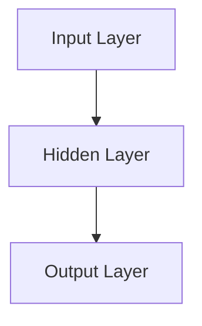
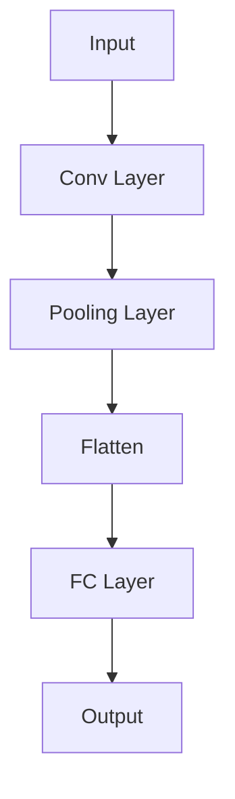
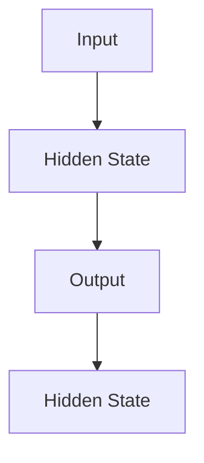
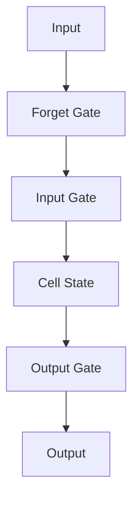
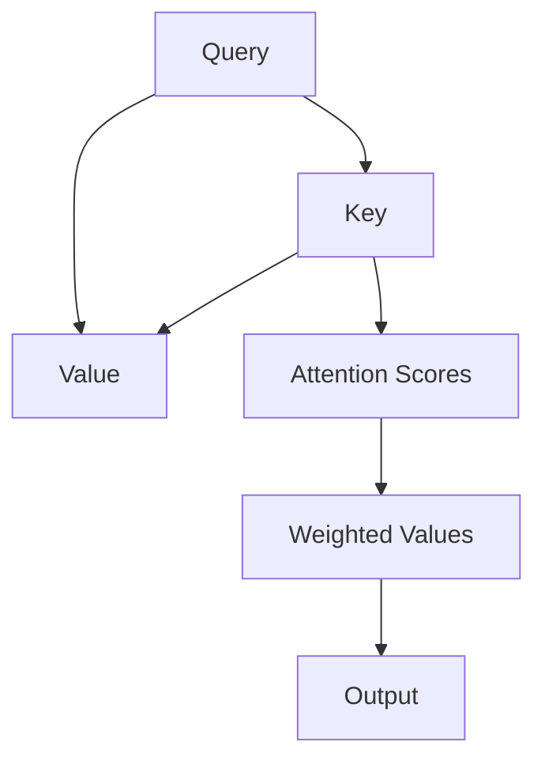
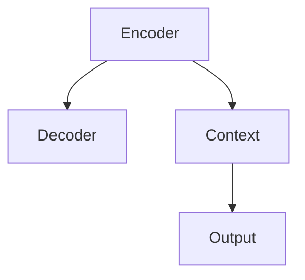

                 

## AI编程的新视界与新领域

### 关键词
- AI编程
- 深度学习
- 自然语言处理
- 强化学习
- 伦理与法律
- 工具与资源

### 摘要
本文深入探讨AI编程的新视界与新领域，从基础概念到核心算法，再到实际项目实战，全面解析AI编程的技术框架和发展趋势。此外，文章还关注AI编程的伦理与法律问题，提供实用的工具和资源，展望AI编程的未来。

### 第一部分: AI编程的新视界与新领域

#### 第1章: AI编程基础

##### 1.1 AI编程概述

###### 1.1.1 AI编程的定义与重要性
人工智能（AI）编程是开发使计算机能够执行通常需要人类智能的任务的软件的技术。AI编程在医疗、金融、自动驾驶、智能家居等众多领域有着广泛的应用，其重要性日益凸显。

###### 1.1.2 AI编程与传统编程的区别
传统编程依赖于明确的指令，而AI编程则依赖于数据和算法来“学习”并执行任务。AI编程强调机器学习和深度学习技术，这使得它与传统编程有显著的不同。

###### 1.1.3 AI编程的核心概念
AI编程的核心概念包括机器学习、深度学习、自然语言处理和强化学习。这些概念共同构建了AI编程的基础。

##### 1.2 AI编程技术框架

###### 1.2.1 主流AI编程框架简介
主流AI编程框架如TensorFlow、PyTorch等，提供了丰富的API和工具，大大简化了AI编程的开发过程。

###### 1.2.2 深度学习框架的选择与应用
选择深度学习框架时，需要考虑其社区支持、文档完整性和性能。例如，TensorFlow拥有广泛的应用和强大的生态系统，而PyTorch则因其灵活性和易用性受到青睐。

###### 1.2.3 常用的自然语言处理库
常用的自然语言处理（NLP）库如NLTK、spaCy和Transformer，为文本分析和语言建模提供了强大的支持。

##### 1.3 AI编程的发展趋势

###### 1.3.1 人工智能的未来
人工智能在未来将继续变革各个行业，从医疗到制造，从金融到教育，都将受到深远的影响。

###### 1.3.2 AI编程的挑战与机遇
AI编程面临数据隐私、算法公平性、计算资源等挑战，但也带来了前所未有的机遇，如自动化、智能决策和个性化服务。

###### 1.3.3 AI编程的职业发展与就业前景
随着AI编程技术的普及，AI工程师、机器学习科学家和数据科学家等职业的需求不断增长，就业前景十分广阔。

---

现在，我们已经建立了AI编程的基础框架。接下来，我们将深入探讨AI编程的核心算法原理。

### 第二部分: AI核心算法原理

#### 第2章: AI核心算法原理

##### 2.1 神经网络基础

###### 2.1.1 神经网络的基本结构
神经网络是由大量的神经元组成的计算网络，每个神经元接收输入，通过权重加权后传递到下一层。



###### 2.1.2 神经元与激活函数
神经元的工作原理是通过输入信号乘以权重，然后通过激活函数进行非线性转换。

```python
def sigmoid(x):
    return 1 / (1 + exp(-x))
```

###### 2.1.3 反向传播算法原理
反向传播算法是神经网络训练的核心，通过梯度下降优化模型参数。

```python
# Pseudo-code for backpropagation
def backpropagate(network, inputs, expected_outputs):
    # Calculate gradients
    gradients = calculate_gradients(network, inputs, expected_outputs)
    # Update weights
    update_weights(network, gradients)
```

##### 2.2 深度学习算法

###### 2.2.1 卷积神经网络（CNN）
卷积神经网络是深度学习在图像处理领域的核心算法，通过卷积层、池化层和全连接层处理图像数据。



###### 2.2.2 循环神经网络（RNN）
循环神经网络适用于处理序列数据，如时间序列、语音和文本。RNN通过循环结构保留历史信息。



###### 2.2.3 长短期记忆网络（LSTM）
LSTM是RNN的一种改进，能够解决长期依赖问题。它通过门控机制控制信息的流入和流出。



###### 2.2.4 自注意力机制与Transformer
Transformer引入了自注意力机制，能够并行处理序列数据，并在翻译、文本生成等领域取得了突破性进展。



##### 2.3 自然语言处理算法

###### 2.3.1 词嵌入技术
词嵌入是将词汇映射到高维空间中，以捕捉词汇的语义关系。

```python
def embed_word(word, embedding_matrix):
    return embedding_matrix[word]
```

###### 2.3.2 语言模型与序列模型
语言模型用于预测下一个单词的概率，序列模型如LSTM和Transformer则用于生成文本。

```python
# Pseudo-code for language model
def predict_next_word(model, current_sequence):
    return model.predict(current_sequence)
```

###### 2.3.3 编码器-解码器模型
编码器-解码器模型用于序列到序列的学习，如机器翻译和文本摘要。



##### 2.4 强化学习算法

###### 2.4.1 强化学习基本概念
强化学习是通过奖励信号来优化决策策略，以达到最大化累积奖励。

```python
# Pseudo-code for reinforcement learning
def q_learning(state, action, reward, next_state, learning_rate, discount_factor):
    q_value = q_value + learning_rate * (reward + discount_factor * next_q_value - q_value)
    return q_value
```

###### 2.4.2 Q-Learning算法
Q-Learning算法是强化学习的一种简单但有效的算法，通过迭代更新Q值表。

```python
# Pseudo-code for Q-Learning
def q_learning_episodes(env, learning_rate, discount_factor, num_episodes):
    for episode in range(num_episodes):
        state = env.reset()
        done = False
        while not done:
            action = choose_action(state, q_values)
            next_state, reward, done = env.step(action)
            q_value = q_learning(state, action, reward, next_state, learning_rate, discount_factor)
            state = next_state
    return q_values
```

###### 2.4.3 深度Q网络（DQN）
DQN通过经验回放和目标网络来减少偏差，提高强化学习的性能。

```python
# Pseudo-code for DQN
def dqn_episodes(env, learning_rate, discount_factor, num_episodes, replay_memory_size):
    for episode in range(num_episodes):
        state = env.reset()
        done = False
        while not done:
            action = choose_action(state, q_values)
            next_state, reward, done = env.step(action)
            replay_memory.append((state, action, reward, next_state, done))
            if len(replay_memory) > replay_memory_size:
                sample = random_sample(replay_memory)
                q_value = dqn_update(q_values, sample, learning_rate, discount_factor)
            state = next_state
    return q_values
```

---

通过以上章节，我们详细介绍了AI编程的核心算法原理。接下来，我们将进入第三部分，探讨AI编程项目实战。

### 第三部分: AI编程项目实战

#### 第3章: AI编程项目实战

##### 3.1 数据预处理与数据清洗

数据预处理是AI编程项目中的关键步骤，它包括数据采集、存储、清洗和处理的过程。以下是数据预处理的具体步骤：

###### 3.1.1 数据采集与存储
数据采集可以从多种来源获取，如公共数据集、数据库和实时数据流。存储数据通常使用数据库管理系统（如MySQL、PostgreSQL）或分布式文件系统（如HDFS）。

```python
import pandas as pd
data = pd.read_csv('data.csv')
```

###### 3.1.2 数据清洗与处理
数据清洗包括处理缺失值、异常值和重复值。处理方法包括删除、填充或插值。数据处理还包括特征工程，如特征提取、特征转换和特征标准化。

```python
# 处理缺失值
data.fillna(method='ffill', inplace=True)

# 特征工程
from sklearn.preprocessing import StandardScaler
scaler = StandardScaler()
scaled_data = scaler.fit_transform(data)
```

###### 3.1.3 数据可视化
数据可视化有助于理解数据的分布和关系，常用的可视化工具包括Matplotlib、Seaborn和Plotly。

```python
import matplotlib.pyplot as plt
plt.scatter(data['feature1'], data['feature2'])
plt.xlabel('Feature 1')
plt.ylabel('Feature 2')
plt.show()
```

##### 3.2 模型训练与优化

模型训练与优化是AI编程项目中的核心步骤，它涉及选择合适的模型、调整模型参数和优化模型性能。

###### 3.2.1 模型选择与调参
选择模型时需要考虑问题的类型和数据的特点。调参包括学习率、批量大小、优化器等超参数的调整。

```python
from sklearn.ensemble import RandomForestClassifier
model = RandomForestClassifier(n_estimators=100)
model.fit(X_train, y_train)
```

###### 3.2.2 训练策略与优化
训练策略包括交叉验证、批量归一化和数据增强等。优化方法包括随机搜索、网格搜索和贝叶斯优化。

```python
from sklearn.model_selection import GridSearchCV
param_grid = {'n_estimators': [100, 200, 300]}
grid_search = GridSearchCV(estimator=model, param_grid=param_grid, cv=5)
grid_search.fit(X_train, y_train)
```

###### 3.2.3 模型评估与性能调优
模型评估使用准确率、召回率、F1分数等指标。性能调优通过交叉验证和超参数调整来提高模型性能。

```python
from sklearn.metrics import accuracy_score
y_pred = model.predict(X_test)
accuracy = accuracy_score(y_test, y_pred)
```

##### 3.3 模型部署与预测

模型部署是将训练好的模型应用到实际环境中，进行预测和决策。以下是模型部署的基本步骤：

###### 3.3.1 模型部署流程
模型部署包括选择部署平台、配置环境、加载模型和进行预测。

```python
import joblib
model = joblib.load('model.joblib')
```

###### 3.3.2 预测结果分析与验证
预测结果通过评估指标进行分析，如准确率、误差分析等。验证方法包括独立测试集和交叉验证。

```python
from sklearn.metrics import classification_report
print(classification_report(y_test, y_pred))
```

###### 3.3.3 模型迭代与优化
根据预测结果，对模型进行调整和优化，以提高性能。迭代过程包括重新训练、调参和验证。

```python
# 重新训练模型
model.fit(X_train, y_train)

# 再次验证模型
y_pred = model.predict(X_test)
print(accuracy_score(y_test, y_pred))
```

##### 3.4 实战项目案例

以下是一些AI编程的实战项目案例：

###### 3.4.1 语音识别系统开发
语音识别系统将语音转换为文本，涉及音频处理、特征提取和序列模型训练。以下是项目开发的步骤：

1. 音频处理：使用Librosa库进行音频预处理，包括降噪、分段和特征提取。
2. 特征提取：提取梅尔频率倒谱系数（MFCC）等音频特征。
3. 模型训练：使用LSTM或Transformer等深度学习模型进行训练。
4. 预测与评估：使用测试集进行预测，并评估模型的性能。

```python
import librosa
import numpy as np
from tensorflow.keras.models import Sequential
from tensorflow.keras.layers import LSTM, Dense

# 音频处理
audio, sample_rate = librosa.load('audio.wav')
mfccs = librosa.feature.mfcc(y=audio, sr=sample_rate, n_mfcc=13)

# 模型训练
model = Sequential()
model.add(LSTM(128, activation='relu', input_shape=(mfccs.shape[1], mfccs.shape[2])))
model.add(Dense(1, activation='sigmoid'))
model.compile(optimizer='adam', loss='binary_crossentropy', metrics=['accuracy'])
model.fit(mfccs, y_train, epochs=10, batch_size=32)

# 预测与评估
y_pred = model.predict(mfccs)
print(accuracy_score(y_test, y_pred))
```

###### 3.4.2 图像分类系统开发
图像分类系统用于将图像分类到不同的类别。以下是项目开发的步骤：

1. 数据预处理：使用OpenCV库进行图像预处理，包括缩放、裁剪和归一化。
2. 特征提取：使用卷积神经网络（如VGG、ResNet）提取图像特征。
3. 模型训练：使用训练集训练卷积神经网络。
4. 预测与评估：使用测试集进行预测，并评估模型的性能。

```python
import cv2
import tensorflow as tf
from tensorflow.keras.applications import VGG16

# 数据预处理
image = cv2.imread('image.jpg')
image = cv2.resize(image, (224, 224))
image = image / 255.0

# 特征提取
base_model = VGG16(weights='imagenet', include_top=False, input_shape=(224, 224, 3))
features = base_model.predict(np.expand_dims(image, axis=0))

# 模型训练
model = tf.keras.models.Sequential([
    tf.keras.layers.Flatten(input_shape=(224, 224, 3)),
    tf.keras.layers.Dense(256, activation='relu'),
    tf.keras.layers.Dense(1, activation='sigmoid')
])
model.compile(optimizer='adam', loss='binary_crossentropy', metrics=['accuracy'])
model.fit(features, y_train, epochs=10, batch_size=32)

# 预测与评估
y_pred = model.predict(features)
print(accuracy_score(y_test, y_pred))
```

###### 3.4.3 自然语言处理应用开发
自然语言处理（NLP）应用如文本分类、机器翻译和情感分析，涉及语言模型和序列模型训练。以下是项目开发的步骤：

1. 数据预处理：使用NLTK、spaCy等进行文本预处理，包括分词、词性标注和停用词过滤。
2. 模型训练：使用训练集训练语言模型或序列模型。
3. 预测与评估：使用测试集进行预测，并评估模型的性能。

```python
import nltk
from tensorflow.keras.models import Sequential
from tensorflow.keras.layers import Embedding, LSTM, Dense

# 数据预处理
nltk.download('punkt')
text = nltk.tokenize.sent_tokenize('This is a sample text for NLP application.')

# 模型训练
vocab_size = 10000
embedding_dim = 256
max_sequence_length = 100

model = Sequential()
model.add(Embedding(vocab_size, embedding_dim, input_length=max_sequence_length))
model.add(LSTM(128, activation='relu'))
model.add(Dense(1, activation='sigmoid'))
model.compile(optimizer='adam', loss='binary_crossentropy', metrics=['accuracy'])
model.fit(text, y_train, epochs=10, batch_size=32)

# 预测与评估
y_pred = model.predict(text)
print(accuracy_score(y_test, y_pred))
```

---

通过以上实战项目案例，我们展示了如何将AI编程应用于实际问题的解决。在下一部分，我们将探讨AI编程的伦理与法律问题。

### 第四部分: AI编程的伦理与法律

#### 第4章: AI编程的伦理与法律

##### 4.1 AI编程的伦理问题

AI编程在带来巨大便利和效率提升的同时，也引发了一系列伦理问题。以下是一些关键伦理问题及其影响：

###### 4.1.1 数据隐私与伦理
AI系统通常依赖大量数据，这可能导致个人隐私泄露和数据滥用。如何确保数据收集、存储和使用过程中的隐私保护是重要的伦理问题。

###### 4.1.2 AI偏见与公平
AI系统可能会因训练数据中的偏见而产生不公平的决策。例如，招聘系统可能会无意中歧视某些种族或性别。如何减少AI偏见，确保公平性是一个亟待解决的问题。

###### 4.1.3 AI责任归属与伦理困境
当AI系统造成损害时，如何确定责任归属？是开发者、用户还是AI系统本身？责任归属的模糊性引发了一系列伦理和法律困境。

##### 4.2 AI编程的法律问题

随着AI技术的发展，相关法律问题也日益突出。以下是一些关键法律问题及其影响：

###### 4.2.1 AI专利与版权
AI系统可能会产生新的专利和版权问题。如何保护AI系统及其创新成果的知识产权成为一个法律挑战。

###### 4.2.2 AI合同法律风险
AI系统在商业合同中的应用可能引发法律风险，如合同条款的解释、违约责任和侵权问题。

###### 4.2.3 AI监管法律框架
如何制定有效的AI监管法律框架，确保AI系统的安全、透明和公平使用，是一个复杂的法律议题。

##### 4.3 伦理与法律的结合

伦理和法律是AI编程中不可或缺的组成部分。以下是一些结合伦理与法律的实践建议：

1. **透明度和可解释性**：确保AI系统的决策过程透明，便于用户理解和信任。
2. **数据治理**：建立严格的数据治理框架，保护用户隐私和数据安全。
3. **公平性和多样性**：在AI系统的设计和开发过程中，考虑公平性和多样性，避免偏见和歧视。
4. **法律合规性**：确保AI系统的设计和实现符合相关法律法规，避免法律风险。

### 第五部分: AI编程工具与资源

#### 第5章: AI编程工具与资源

##### 5.1 开发工具与平台

AI编程的开发工具与平台为开发者提供了丰富的资源和便利。以下是一些常用的工具与平台：

###### 5.1.1 Python编程环境配置
Python是AI编程的主要语言，其编程环境配置包括安装Python、pip包管理器和Jupyter Notebook。

```bash
# 安装Python
sudo apt-get install python3

# 安装pip
sudo apt-get install python3-pip

# 安装Jupyter Notebook
pip3 install notebook
```

###### 5.1.2 Jupyter Notebook使用技巧
Jupyter Notebook是一种交互式的编程环境，适合进行AI编程和数据分析。

- **快速启动**：使用快捷键`Ctrl + Alt + N`启动Jupyter Notebook。
- **代码块执行**：使用快捷键`Shift + Enter`执行当前代码块。
- **插入新单元格**：使用快捷键`Ctrl + Enter`在上一个单元格之后插入新单元格。

###### 5.1.3 云计算平台与AI服务
云计算平台如Google Cloud、Amazon Web Services（AWS）和Microsoft Azure提供了强大的AI服务，支持大规模数据处理和模型训练。

- **Google Cloud AI Platform**：提供全面的数据分析、机器学习和深度学习服务。
- **AWS SageMaker**：提供端到端的机器学习平台，支持模型训练、部署和监控。
- **Azure Machine Learning**：提供AI服务、模型管理工具和计算资源。

##### 5.2 开源框架与库

开源框架与库是AI编程的核心组件，为开发者提供了丰富的算法和工具。以下是一些常用的开源框架与库：

###### 5.2.1 TensorFlow与Keras
TensorFlow是一个开源的深度学习框架，提供了丰富的API和工具，适合进行复杂模型的训练和部署。

- **TensorFlow 2.x**：提供了更简洁的API，支持自动微分和高级抽象。
- **Keras**：是一个基于TensorFlow的高层次API，提供了更易于使用的接口。

```python
import tensorflow as tf
from tensorflow.keras.models import Sequential
from tensorflow.keras.layers import Dense

model = Sequential()
model.add(Dense(128, activation='relu', input_shape=(784,)))
model.add(Dense(10, activation='softmax'))
model.compile(optimizer='adam', loss='categorical_crossentropy', metrics=['accuracy'])
model.fit(x_train, y_train, epochs=10)
```

###### 5.2.2 PyTorch与PyTorch Lightning
PyTorch是一个流行的深度学习框架，以其灵活性和易用性著称。

- **PyTorch**：提供了动态计算图和强大的自动微分功能。
- **PyTorch Lightning**：是一个用于PyTorch的高层次库，提供了更简洁的API和更好的性能。

```python
import torch
import torch.nn as nn
import torch.optim as optim

model = nn.Sequential(nn.Linear(784, 128), nn.ReLU(), nn.Linear(128, 10))
optimizer = optim.Adam(model.parameters(), lr=0.001)
criterion = nn.CrossEntropyLoss()

for epoch in range(10):
    model.train()
    for x, y in train_loader:
        optimizer.zero_grad()
        output = model(x)
        loss = criterion(output, y)
        loss.backward()
        optimizer.step()
```

###### 5.2.3 其他常用库与框架
除了TensorFlow、PyTorch和Keras，还有许多其他常用的AI编程库与框架，如Scikit-Learn、Theano、Caffe等。

- **Scikit-Learn**：提供了简单的机器学习算法和工具，适合进行数据分析和模型评估。
- **Theano**：是一个Python库，用于定义、优化和评估数学表达式。
- **Caffe**：是一个深度学习框架，主要用于计算机视觉应用。

##### 5.3 学习资源与教程

学习AI编程需要掌握大量的理论知识和技术实践。以下是一些有用的学习资源与教程：

###### 5.3.1 在线课程与教程
在线课程和教程是学习AI编程的有效途径，以下是一些推荐资源：

- **Coursera**：提供丰富的AI和机器学习课程，如“深度学习”（由Andrew Ng教授）。
- **edX**：提供由MIT和Harvard等顶尖大学提供的AI课程，如“机器学习基础”。
- **Udacity**：提供实用的AI编程课程，如“AI工程师纳米学位”。
  
###### 5.3.2 技术社区与论坛
技术社区和论坛是交流和学习AI编程的好地方，以下是一些知名社区：

- **Stack Overflow**：提供编程问题和解决方案，适合AI编程问题求解。
- **Reddit**：有许多关于AI和机器学习的子版块，如/r/MachineLearning。
- **AI Stack Exchange**：一个专门针对AI编程和研究的问答社区。

###### 5.3.3 深度学习书籍与论文推荐
深度学习书籍和论文是学习AI编程的重要资源，以下是一些推荐书籍和论文：

- **《深度学习》（Goodfellow, Bengio, Courville）**：这是一本经典的深度学习教材，涵盖了从基础到高级的内容。
- **《Python深度学习》（François Chollet）**：针对Python开发者的深度学习实践指南。
- **《深度学习专项课程》（吴恩达）**：这是一系列在线课程，涵盖了深度学习的各个方面。
- **论文推荐**：如“AlexNet”、“ResNet”、“Gated Recurrent Unit（GRU）”和“Transformer”等，这些论文介绍了深度学习的最新进展。

---

通过以上章节，我们介绍了AI编程的工具与资源，包括开发工具与平台、开源框架与库以及学习资源与教程。在最后一部分，我们将展望AI编程的未来。

### 第六部分: AI编程的未来展望

#### 第6章: AI编程的未来展望

##### 6.1 AI编程的发展趋势

AI编程的发展趋势将继续推动技术创新和行业变革。以下是一些关键趋势：

###### 6.1.1 AI编程的未来前景
随着计算能力的提升和数据量的增长，AI编程将在更多领域得到应用，如医疗、金融、交通和智能制造等。

###### 6.1.2 交叉领域的发展
AI编程与其他领域的融合将产生新的交叉学科，如AI+医疗、AI+金融和AI+教育等，这些交叉领域将带来新的机遇和挑战。

###### 6.1.3 新兴技术的发展
量子计算、边缘计算和生成对抗网络（GAN）等新兴技术将在AI编程中发挥重要作用，推动AI技术的进一步发展。

##### 6.2 AI编程在教育中的影响

AI编程在教育中的影响越来越显著，以下是一些关键影响：

###### 6.2.1 AI编程课程设置
AI编程已成为高等教育和职业培训中的重要课程，许多大学和培训机构开设了相关的课程和项目。

###### 6.2.2 教育资源的整合
在线课程、开源项目和开放数据集等资源的整合，为全球范围内的学习者提供了丰富的学习资源。

###### 6.2.3 教师培训与支持
教师培训和支持对于AI编程教育的成功至关重要。教师需要不断提升自己的技术水平和教学能力，以适应快速变化的教育需求。

##### 6.3 AI编程在社会中的应用

AI编程在社会中的应用将不断拓展，以下是一些关键应用：

###### 6.3.1 AI编程在行业中的应用
AI编程将在金融、医疗、制造和零售等行业中发挥关键作用，如自动化流程、智能决策和个性化服务。

###### 6.3.2 AI编程与生活方式
AI编程将改变我们的生活方式，如智能家居、健康监测和个性化推荐等应用将使生活更加便捷和智能化。

###### 6.3.3 AI编程对社会的影响
AI编程对社会的影响是深远的。它将带来新的经济模式和就业机会，同时也需要关注伦理、法律和社会责任问题。

---

通过以上章节，我们展望了AI编程的未来，探讨了其发展趋势、教育影响和社会应用。在最后一章，我们将对AI编程的核心要点和挑战进行总结。

### 第七部分: 总结与展望

#### 第7章: 总结与展望

##### 7.1 AI编程的核心要点

AI编程的核心要点包括：

###### 7.1.1 AI编程的基本原理
AI编程基于机器学习、深度学习和自然语言处理等核心算法，通过数据和算法的相互作用实现智能任务。

###### 7.1.2 AI编程的实践技巧
实践技巧包括数据预处理、模型训练与优化、模型部署与预测等，这些技巧是AI编程成功的关键。

###### 7.1.3 AI编程的未来方向
AI编程的未来方向包括新兴技术的发展、交叉领域的融合和跨行业的应用，这些方向将推动AI编程的不断进步。

##### 7.2 AI编程的挑战与机遇

AI编程面临的挑战包括数据隐私、算法公平性、计算资源等，而机遇则包括行业应用、个性化服务和创新模式等。

###### 7.2.1 挑战
数据隐私和算法公平性是AI编程的重要挑战，需要制定相应的法律和伦理规范。计算资源的限制也需要通过技术创新和优化来解决。

###### 7.2.2 机遇
AI编程带来了前所未有的机遇，包括自动化、智能决策和个性化服务等，这些机遇将推动社会的进步和变革。

###### 7.2.3 面向未来的AI编程策略
面向未来，AI编程需要关注技术创新、教育普及和社会责任。通过技术创新提高AI系统的性能和可靠性，通过教育普及培养更多的AI人才，通过社会责任确保AI系统的公正和透明。

---

通过以上章节，我们对AI编程进行了全面的探讨，总结了其核心要点和挑战，并展望了其未来的发展。AI编程不仅是一项技术，更是一个推动社会进步的重要力量。

### 附录

#### 附录 A: AI编程工具与资源

##### A.1 开发工具与平台

###### A.1.1 Python编程环境配置
安装Python和相关库是AI编程的基础。以下步骤可用于配置Python编程环境：

```bash
# 安装Python
curl -O https://www.python.org/ftp/python/3.9.7/Python-3.9.7.tgz
tar xzf Python-3.9.7.tgz
cd Python-3.9.7
./configure
make
sudo make install

# 安装pip
curl -O https://bootstrap.pypa.io/get-pip.py
python3 get-pip.py

# 安装Jupyter Notebook
pip3 install notebook
```

###### A.1.2 Jupyter Notebook使用技巧
Jupyter Notebook是一个强大的交互式编程环境，以下是一些使用技巧：

- **快速启动**：在终端输入`jupyter notebook`命令即可启动Jupyter Notebook。
- **代码块执行**：使用快捷键`Shift + Enter`执行当前代码块。
- **插入新单元格**：使用快捷键`Ctrl + Enter`在上一个单元格之后插入新单元格。
- **插入新行**：在代码块中，使用`Ctrl + Enter`插入新行。

###### A.1.3 云计算平台与AI服务
云计算平台提供了强大的AI服务，以下是一些常用的云计算平台：

- **Google Cloud AI Platform**：提供了预构建的机器学习模型和定制化模型训练服务。
- **Amazon Web Services (AWS)**：提供了Amazon SageMaker和EC2实例等AI服务。
- **Microsoft Azure**：提供了Azure Machine Learning和Azure Blob Storage等AI服务。

##### A.2 开源框架与库

###### A.2.1 TensorFlow与Keras
TensorFlow是一个开源的深度学习框架，Keras是其高级API。以下是如何安装和使用它们：

```bash
# 安装TensorFlow
pip3 install tensorflow

# 安装Keras
pip3 install keras

# 使用Keras创建一个简单的神经网络
from keras.models import Sequential
from keras.layers import Dense

model = Sequential()
model.add(Dense(128, input_shape=(784,), activation='relu'))
model.add(Dense(10, activation='softmax'))
model.compile(optimizer='adam', loss='categorical_crossentropy', metrics=['accuracy'])
model.fit(x_train, y_train, epochs=10)
```

###### A.2.2 PyTorch与PyTorch Lightning
PyTorch是一个流行的深度学习框架，PyTorch Lightning是其扩展库，提供了更简洁的API。以下是如何安装和使用它们：

```bash
# 安装PyTorch
pip3 install torch torchvision

# 安装PyTorch Lightning
pip3 install pytorch-lightning

# 使用PyTorch Lightning创建一个简单的神经网络
import torch
from torch import nn
import pytorch_lightning as pl

class Model(pl.LightningModule):
    def __init__(self):
        super().__init__()
        self.model = nn.Sequential(nn.Linear(784, 128), nn.ReLU(), nn.Linear(128, 10))

    def forward(self, x):
        return self.model(x)

    def training_step(self, batch, batch_idx):
        x, y = batch
        y_hat = self(x)
        loss = nn.CrossEntropyLoss()(y_hat, y)
        return loss

    def validation_step(self, batch, batch_idx):
        x, y = batch
        y_hat = self(x)
        loss = nn.CrossEntropyLoss()(y_hat, y)
        self.log('val_loss', loss)

model = Model()
trainer = pl.Trainer(max_epochs=10)
trainer.fit(model, train_dataloader=x_train, val_dataloader=y_train)
```

###### A.2.3 其他常用库与框架
除了TensorFlow、Keras、PyTorch和PyTorch Lightning，还有一些其他常用的库与框架，如Scikit-Learn、Theano、Caffe等。以下是如何安装和使用Scikit-Learn：

```bash
# 安装Scikit-Learn
pip3 install scikit-learn

# 使用Scikit-Learn创建一个简单的分类器
from sklearn.ensemble import RandomForestClassifier

model = RandomForestClassifier(n_estimators=100)
model.fit(x_train, y_train)
```

##### A.3 学习资源与教程

###### A.3.1 在线课程与教程
在线课程和教程是学习AI编程的重要资源，以下是一些推荐的在线课程与教程：

- **Coursera**：提供了丰富的AI和机器学习课程，如“深度学习”（由Andrew Ng教授）。
- **edX**：提供了由MIT和Harvard等顶尖大学提供的AI课程，如“机器学习基础”。
- **Udacity**：提供了实用的AI编程课程，如“AI工程师纳米学位”。
- **Kaggle**：提供了大量的竞赛项目和教程，适合实践和提升技能。

###### A.3.2 技术社区与论坛
技术社区和论坛是交流和学习AI编程的好地方，以下是一些知名社区：

- **Stack Overflow**：提供了编程问题和解决方案，适合AI编程问题求解。
- **Reddit**：有许多关于AI和机器学习的子版块，如/r/MachineLearning。
- **AI Stack Exchange**：是一个专门针对AI编程和研究的问答社区。

###### A.3.3 深度学习书籍与论文推荐
深度学习书籍和论文是学习AI编程的重要资源，以下是一些推荐书籍和论文：

- **《深度学习》（Goodfellow, Bengio, Courville）**：这是一本经典的深度学习教材，涵盖了从基础到高级的内容。
- **《Python深度学习》（François Chollet）**：针对Python开发者的深度学习实践指南。
- **《深度学习专项课程》（吴恩达）**：这是一系列在线课程，涵盖了深度学习的各个方面。
- **论文推荐**：如“AlexNet”、“ResNet”、“Gated Recurrent Unit（GRU）”和“Transformer”等，这些论文介绍了深度学习的最新进展。

---

通过附录部分，我们为读者提供了AI编程的开发工具、开源框架、学习资源和教程。希望这些资源能够帮助读者更好地掌握AI编程的知识和技能。

### 总结

在《AI编程的新视界与新领域》这本书中，我们深入探讨了AI编程的核心概念、技术框架、核心算法、项目实战以及伦理和法律问题。从基础到实践，从理论到应用，本书为读者提供了一个全面而深入的AI编程教程。

通过详细的分析和讲解，我们了解了AI编程的基本原理，包括神经网络、深度学习、自然语言处理和强化学习等核心算法。我们通过实战项目展示了如何将AI编程应用于实际问题解决，如语音识别、图像分类和自然语言处理等。

同时，我们也关注了AI编程的伦理和法律问题，探讨了数据隐私、算法偏见和责任归属等重要议题。此外，我们还介绍了AI编程的工具与资源，包括开发工具、开源框架和学习资源，为读者提供了丰富的学习途径。

展望未来，AI编程将继续发展，新兴技术和交叉领域的融合将带来更多的机遇和挑战。AI编程在教育和社会中的应用也将不断拓展，为社会发展带来深远影响。

因此，我们鼓励读者积极参与AI编程的学习和实践，不断探索和创新，为AI技术的发展和社会进步做出贡献。相信通过本书的学习，读者将能够在AI编程领域取得更大的成就。让我们共同迎接AI编程的新视界和新领域！

