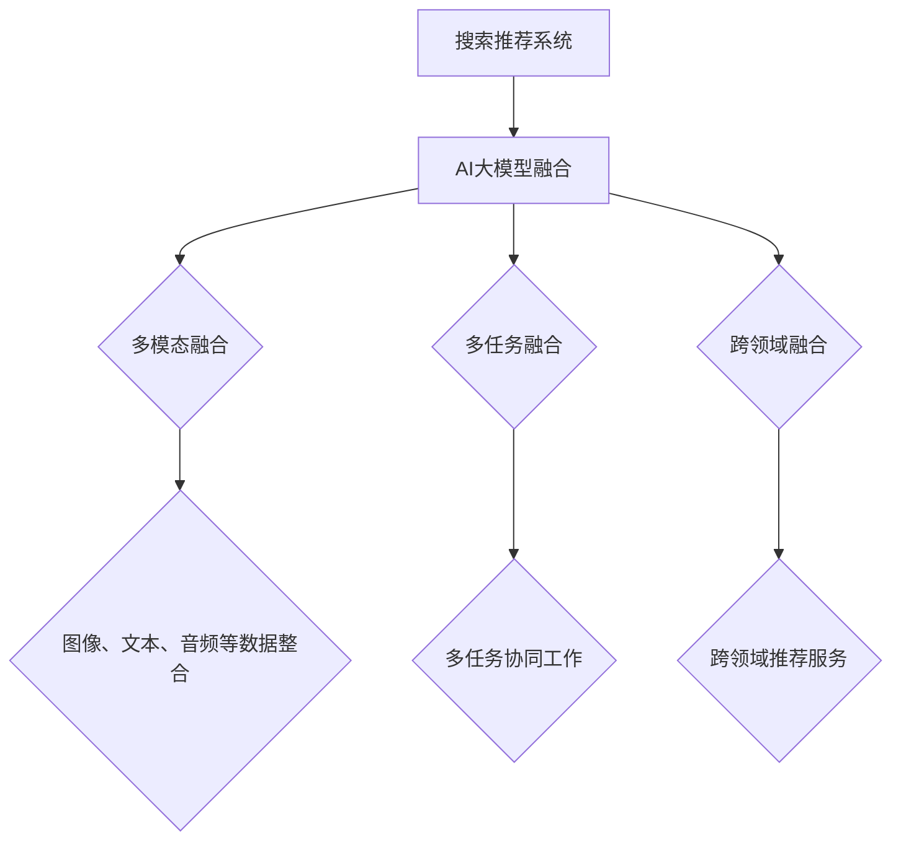

                 

### 第一部分：搜索推荐系统的AI大模型融合基础

在当前信息化时代，搜索推荐系统已经成为电商平台的核心竞争力。AI大模型（如GPT、BERT等）的引入，为搜索推荐系统带来了前所未有的变革。这一部分将深入探讨搜索推荐系统的AI大模型融合，为后续章节的详细讲解奠定基础。

#### 1.1.1 AI大模型在搜索推荐系统中的应用背景

AI大模型是指具有数十亿甚至千亿参数规模的人工神经网络模型，它们在语言理解、图像识别、语音识别等领域取得了显著的成果。近年来，随着深度学习技术的发展，AI大模型在搜索推荐系统中的应用也越来越广泛。

1. **发展历程**：从传统的基于内容匹配和协同过滤的推荐算法，到基于深度学习的推荐算法，再到如今AI大模型的广泛应用，搜索推荐系统经历了多次技术革新。
   
2. **应用价值**：AI大模型能够更好地捕捉用户行为数据与物品属性之间的复杂关系，从而提供更精准、个性化的推荐结果。这不仅能提升用户满意度，还能提高电商平台的转化率和销售额。

3. **融合方向**：未来搜索推荐系统的发展趋势是将AI大模型与多模态、多任务、跨领域等技术相结合，实现更加智能化、个性化的推荐服务。

#### 1.1.2 AI大模型融合的核心概念与架构

AI大模型融合是指将多个AI大模型有机地结合起来，共同为搜索推荐系统提供服务。这一过程涉及多个核心概念和架构。

1. **多模态融合**：多模态融合是指将不同类型的数据（如图像、文本、音频等）进行整合，以获得更丰富的信息。在搜索推荐系统中，多模态融合可以提升推荐的准确性。

2. **多任务融合**：多任务融合是指将多个AI大模型的任务（如图像识别、文本生成等）进行整合，以实现更高效、更全面的推荐服务。

3. **跨领域融合**：跨领域融合是指将不同领域的AI大模型（如电子商务、社交媒体等）进行整合，以实现跨领域的推荐服务。

#### 1.1.3 AI大模型融合的主要挑战与解决方案

在AI大模型融合过程中，会遇到一系列技术难题。

1. **数据一致性**：不同模态、不同任务、不同领域的数据可能存在不一致性，如何保证数据的一致性是一个重要问题。

2. **模型协同**：多个AI大模型如何协同工作，以实现最佳效果，是一个关键问题。

3. **计算资源**：AI大模型的训练和推理需要大量的计算资源，如何优化资源利用是一个挑战。

针对上述问题，可以采取以下解决方案：

1. **统一数据格式**：通过数据预处理，将不同模态、不同任务、不同领域的数据转换为统一的格式，以保证数据的一致性。

2. **多任务学习**：采用多任务学习（Multi-Task Learning, MTL）技术，使多个AI大模型能够共享参数，提高模型协同效果。

3. **分布式计算**：采用分布式计算框架（如TensorFlow、PyTorch等），将AI大模型的训练和推理任务分布到多个计算节点上，以提高计算效率。

#### 1.1.4 搜索推荐系统AI大模型融合的应用前景

AI大模型融合在搜索推荐系统中的应用前景非常广阔。

1. **个性化推荐**：通过AI大模型融合，可以更精准地捕捉用户需求，实现个性化推荐。

2. **多场景应用**：AI大模型融合可以应用于电子商务、社交媒体、O2O服务等多个领域，为不同场景提供智能化推荐服务。

3. **持续迭代优化**：AI大模型融合可以持续学习用户行为数据，实现搜索推荐系统的动态优化。

总之，搜索推荐系统AI大模型融合具有巨大的发展潜力，将成为电商平台的核心竞争力。

#### Mermaid 流程图



#### 结语

本文简要介绍了搜索推荐系统的AI大模型融合基础，包括应用背景、核心概念与架构、主要挑战与解决方案以及应用前景。接下来，我们将深入探讨搜索推荐系统的核心技术与算法，为读者呈现更加全面的技术细节。敬请期待！

### 1.2 搜索推荐系统的基本原理

搜索推荐系统是一种智能信息过滤系统，旨在根据用户的行为数据和物品的属性数据，为用户推荐与其兴趣相关的信息或物品。其核心目标是提高用户满意度，提升平台黏性和销售额。

#### 搜索推荐系统的定义与目标

1. **定义**：搜索推荐系统是一种利用机器学习和数据挖掘技术，从大量数据中挖掘出用户兴趣和行为模式，进而向用户推荐相关信息的系统。

2. **目标**：搜索推荐系统的目标主要有两个：

   - **个性化推荐**：根据用户的历史行为和兴趣，为每个用户提供个性化的推荐结果。
   - **提升转化率**：通过提高推荐的准确性和相关性，增加用户对推荐物品的点击和购买概率。

#### 搜索推荐系统的分类

根据不同的分类标准，搜索推荐系统可以分为多种类型：

1. **基于内容的推荐（Content-Based Recommendation）**：根据物品的属性和用户的历史偏好，为用户推荐相似内容的物品。

2. **协同过滤推荐（Collaborative Filtering）**：通过分析用户之间的相似度，为用户推荐其他用户喜欢的物品。

3. **混合推荐（Hybrid Recommendation）**：结合多种推荐算法，以提升推荐效果。

4. **基于模型的推荐（Model-Based Recommendation）**：使用机器学习模型（如决策树、神经网络等）来预测用户对物品的兴趣。

#### 用户行为数据与物品属性数据的作用

1. **用户行为数据**：用户行为数据包括用户的历史浏览记录、搜索历史、购买记录、收藏记录等。这些数据反映了用户的行为模式、兴趣偏好和需求。

2. **物品属性数据**：物品属性数据包括物品的标题、描述、分类、价格、销量等。这些数据用于描述物品的特征，是推荐系统进行内容匹配和相似度计算的基础。

3. **数据融合**：在实际应用中，搜索推荐系统通常会同时使用用户行为数据和物品属性数据，以实现更加精准的推荐。例如，基于内容的推荐算法需要依赖物品属性数据，而协同过滤算法需要依赖用户行为数据。

#### 搜索推荐系统的实现流程

1. **数据收集与预处理**：收集用户行为数据和物品属性数据，并进行数据清洗、去噪和特征工程，以获得高质量的数据集。

2. **模型训练**：选择合适的推荐算法，利用训练数据集进行模型训练，得到一个能够预测用户兴趣的模型。

3. **推荐生成**：使用训练好的模型，对新的用户数据进行预测，生成个性化推荐结果。

4. **推荐评估与优化**：对推荐结果进行评估，根据评估结果调整模型参数和推荐策略，以提高推荐效果。

#### 伪代码

```python
# 数据收集与预处理
data = collect_user行为数据和物品属性数据()
cleaned_data = preprocess_data(data)

# 模型训练
model = train_model(cleaned_data)

# 推荐生成
recommendations = generate_recommendations(model, new_user_data)

# 推荐评估与优化
evaluate_recommendations(recommendations)
optimize_model(model)
```

#### 结语

通过对搜索推荐系统的基本原理的介绍，我们可以更好地理解其工作原理和实现方法。在接下来的章节中，我们将深入探讨搜索推荐系统的核心技术与算法，包括协同过滤算法、内容推荐算法、多模态数据融合和跨领域知识融合等。敬请期待！

### 2.1 协同过滤算法与深度学习融合

协同过滤算法（Collaborative Filtering, CF）是搜索推荐系统中一种经典且广泛应用的方法，其主要思想是通过分析用户之间的相似度来推荐物品。尽管协同过滤算法在过去取得了显著的效果，但其在处理稀疏数据和冷启动问题方面仍存在一定的局限性。近年来，深度学习技术的兴起为协同过滤算法提供了新的优化途径。本节将详细讲解如何将深度学习技术应用于协同过滤算法的优化与改进。

#### 协同过滤算法的基本原理

协同过滤算法主要包括两种类型：基于用户的协同过滤（User-Based CF）和基于物品的协同过滤（Item-Based CF）。

1. **基于用户的协同过滤**：

   - **相似度计算**：首先计算用户之间的相似度，常用的相似度计算方法包括余弦相似度、皮尔逊相关系数等。
   - **推荐生成**：根据用户之间的相似度，为每个用户推荐与其相似的邻居用户喜欢的物品。

2. **基于物品的协同过滤**：

   - **相似度计算**：首先计算物品之间的相似度，常用的相似度计算方法包括Jaccard系数、余弦相似度等。
   - **推荐生成**：根据物品之间的相似度，为用户推荐与其持有的物品相似的物品。

#### 协同过滤算法的局限性

虽然协同过滤算法在推荐系统中发挥了重要作用，但它也存在一些局限性：

1. **稀疏数据问题**：协同过滤算法依赖于用户行为数据，但在实际应用中，用户行为数据通常非常稀疏，这会导致推荐结果不够准确。

2. **冷启动问题**：对于新用户或新物品，由于缺乏足够的行为数据，协同过滤算法很难为其提供有效的推荐。

3. **无法捕捉复杂关系**：协同过滤算法仅依赖于用户行为数据或物品属性数据，难以捕捉用户和物品之间的复杂关系。

#### 深度学习技术在协同过滤算法中的应用

为了克服协同过滤算法的局限性，研究者们提出了许多基于深度学习的优化方法。以下是一些主要的应用：

1. **基于模型的协同过滤（Model-Based Collaborative Filtering）**：

   - **用户和物品嵌入（User and Item Embedding）**：使用深度学习模型（如自动编码器、嵌入层等）将用户和物品映射到低维空间中，从而实现用户和物品的相似度计算。
   - **推荐生成**：在低维空间中，通过计算用户和物品之间的内积或欧氏距离来生成推荐结果。

2. **基于神经网络的协同过滤（Neural Network-Based Collaborative Filtering）**：

   - **神经协同过滤（Neural Collaborative Filtering, NCF）**：结合多个基础协同过滤算法（如基于用户的协同过滤、基于物品的协同过滤等），通过神经网络模型进行融合，以提升推荐效果。
   - **深度协同过滤（Deep Collaborative Filtering, DeepCF）**：采用深度神经网络（如卷积神经网络、循环神经网络等）来学习用户和物品的复杂关系，从而生成推荐结果。

3. **生成对抗网络（Generative Adversarial Networks, GAN）**：

   - **生成用户行为数据**：使用GAN生成用户行为数据，以解决稀疏数据和冷启动问题。通过对抗训练，GAN可以生成与真实数据分布相似的模拟数据，从而提高推荐系统的鲁棒性和准确性。

#### 伪代码

```python
# 基于神经网络的协同过滤算法

# 数据预处理
user_item_data = preprocess_data(raw_data)

# 用户和物品嵌入
user_embedding = train_user_embedding(user_item_data)
item_embedding = train_item_embedding(user_item_data)

# 推荐生成
def generate_recommendations(user_embedding, item_embedding, user_id, k):
    user_vector = user_embedding[user_id]
    neighbors = find_neighbors(user_vector, item_embedding, k)
    recommendations = []
    for neighbor in neighbors:
        recommended_items = item_embedding[neighbor]
        recommendations.append(recommended_items)
    return recommendations

# 推荐评估
evaluate_recommendations(generated_recommendations, actual_recommendations)
```

#### 实际案例

以Netflix推荐系统为例，Netflix是一个著名的在线视频流媒体服务提供商，其推荐系统在深度学习技术的基础上，通过用户行为数据（如观看记录、评分等）和物品属性数据（如视频类型、演员、导演等）进行融合，实现了高精度的个性化推荐。

1. **用户和物品嵌入**：Netflix使用深度学习模型将用户和视频映射到低维空间中，从而实现用户和视频的相似度计算。

2. **推荐生成**：通过计算用户和视频之间的内积或欧氏距离，Netflix推荐系统为每个用户生成个性化的推荐列表。

3. **推荐评估**：Netflix使用A/B测试等方法评估推荐系统的效果，并根据评估结果不断优化推荐算法。

#### 结语

通过将深度学习技术应用于协同过滤算法，我们可以显著提升推荐系统的准确性和鲁棒性。在接下来的章节中，我们将继续探讨内容推荐算法、多模态数据融合和跨领域知识融合等主题，为读者呈现更加全面的技术细节。敬请期待！

### 2.2 内容推荐算法与深度学习融合

内容推荐算法是搜索推荐系统中另一类重要方法，其核心思想是根据物品的属性和内容，为用户推荐与其兴趣相符的物品。虽然内容推荐算法在过去取得了显著效果，但在处理用户个性化需求和复杂内容关系方面仍存在一定局限性。近年来，深度学习技术的引入为内容推荐算法带来了新的发展契机。本节将详细讲解如何利用深度学习技术提升内容推荐的准确性。

#### 内容推荐算法的基本原理

内容推荐算法主要分为以下几种：

1. **基于关键词的推荐（Keyword-Based Recommendation）**：

   - **关键词提取**：从物品的标题、描述等文本中提取关键词。
   - **推荐生成**：根据用户的历史偏好，为用户推荐包含相同或相关关键词的物品。

2. **基于属性的推荐（Attribute-Based Recommendation）**：

   - **属性匹配**：根据物品的属性（如分类、品牌、颜色等）进行推荐。
   - **推荐生成**：为用户推荐与用户历史偏好匹配的物品属性。

3. **基于模型的推荐（Model-Based Recommendation）**：

   - **特征提取**：从物品属性中提取特征，如TF-IDF、Word2Vec等。
   - **推荐生成**：使用机器学习模型（如决策树、支持向量机等）对特征进行学习，生成推荐结果。

#### 深度学习技术在内容推荐算法中的应用

深度学习技术为内容推荐算法带来了以下几方面的改进：

1. **文本表示学习（Text Representation Learning）**：

   - **词嵌入（Word Embedding）**：通过神经网络模型（如Word2Vec、GloVe等）将词语映射到高维向量空间，从而实现语义相似度的计算。
   - **句子嵌入（Sentence Embedding）**：将整篇文本映射到低维向量空间，以捕捉文本的整体语义信息。

2. **多模态融合（Multimodal Fusion）**：

   - **图像嵌入（Image Embedding）**：使用卷积神经网络（如VGG、ResNet等）将图像映射到高维向量空间，与文本嵌入进行融合。
   - **音频嵌入（Audio Embedding）**：使用循环神经网络（如LSTM、GRU等）对音频信号进行特征提取，与文本嵌入进行融合。

3. **序列模型（Sequential Models）**：

   - **循环神经网络（Recurrent Neural Networks, RNN）**：通过捕捉文本或序列数据的时序关系，实现长距离依赖的建模。
   - **长短时记忆网络（Long Short-Term Memory, LSTM）**：改进RNN，解决长距离依赖问题。
   - **门控循环单元（Gated Recurrent Unit, GRU）**：进一步优化LSTM，提高计算效率。

4. **生成对抗网络（Generative Adversarial Networks, GAN）**：

   - **数据增强**：通过GAN生成与真实数据分布相似的模拟数据，以解决数据稀缺问题。
   - **生成推荐**：使用GAN生成个性化的推荐结果，提高推荐系统的多样性。

#### 伪代码

```python
# 文本表示学习

# 数据预处理
text_data = preprocess_text(data)

# 词嵌入
word_embedding = train_word_embedding(text_data)

# 句子嵌入
sentence_embedding = train_sentence_embedding(word_embedding, text_data)

# 推荐生成
def generate_recommendations(sentence_embedding, user_history, k):
    user_vector = sentence_embedding[user_history]
    recommendations = []
    for sentence in sentence_embedding:
        similarity = calculate_similarity(user_vector, sentence)
        recommendations.append(sentence)
    return recommendations[:k]

# 推荐评估
evaluate_recommendations(generated_recommendations, actual_recommendations)
```

#### 实际案例

以YouTube推荐系统为例，YouTube是一个庞大的视频分享平台，其推荐系统通过深度学习技术实现了高效的内容推荐。

1. **文本嵌入和图像嵌入**：YouTube使用BERT模型对视频标题和描述进行文本嵌入，同时使用卷积神经网络对视频封面图像进行图像嵌入。

2. **多模态融合**：YouTube将文本嵌入和图像嵌入进行融合，生成多模态嵌入向量，以实现更精准的内容推荐。

3. **序列模型**：YouTube使用LSTM模型捕捉视频之间的时序关系，从而生成个性化推荐列表。

4. **生成对抗网络**：YouTube使用GAN生成多样化的视频推荐结果，以提升用户体验。

#### 结语

通过将深度学习技术应用于内容推荐算法，我们可以显著提升推荐系统的准确性、多样性和个性化水平。在接下来的章节中，我们将继续探讨多模态数据融合和跨领域知识融合等主题，为读者呈现更加全面的技术细节。敬请期待！

### 2.3 多模态数据融合

多模态数据融合是一种将多种类型的数据（如图像、文本、音频等）进行整合的技术，旨在从不同模态的数据中提取信息，实现更全面、更准确的推荐结果。在搜索推荐系统中，多模态数据融合可以显著提升推荐的准确性和用户体验。

#### 多模态数据的概念与类型

1. **概念**：多模态数据融合是指将两种或两种以上类型的数据进行整合，以获得更丰富的信息。在搜索推荐系统中，多模态数据通常包括图像、文本、音频、视频等。

2. **类型**：

   - **文本-图像融合**：将文本描述和图像信息进行整合，以实现更精准的推荐。例如，在电商平台上，用户上传的商品图片和商品描述可以同时被用于推荐算法。

   - **文本-音频融合**：将文本内容和音频信息进行整合，以提升用户的体验。例如，在语音助手应用中，用户的声音输入和文本查询可以同时被用于生成个性化推荐。

   - **图像-视频融合**：将图像和视频信息进行整合，以实现更全面的推荐。例如，在短视频平台上，用户上传的图像和视频可以同时被用于推荐算法。

#### 多模态数据融合在搜索推荐系统中的应用

1. **个性化推荐**：多模态数据融合可以帮助推荐系统更准确地捕捉用户的兴趣和需求，从而实现个性化推荐。例如，在电商平台上，用户上传的图片和文本描述可以同时被用于推荐用户可能喜欢的商品。

2. **情境感知推荐**：多模态数据融合可以帮助推荐系统更好地理解用户所处的情境，从而实现情境感知推荐。例如，在智能交通系统中，结合用户的地理位置信息、天气数据和交通流量数据，可以生成个性化的交通路线推荐。

3. **交互式推荐**：多模态数据融合可以为推荐系统提供更丰富的交互方式，从而提升用户体验。例如，在音乐推荐应用中，用户可以通过语音、文本和图像等多种方式与推荐系统进行交互，从而获取个性化的音乐推荐。

#### 多模态数据融合的方法与模型

1. **方法**：

   - **特征级融合**：将不同模态的数据特征进行整合，生成统一的特征表示。常用的方法包括拼接（Concatenation）、平均（Average）和加权（Weighted）等。

   - **模型级融合**：将多个独立的模型进行融合，共同生成推荐结果。常用的方法包括集成学习（Ensemble Learning）、对抗生成网络（Generative Adversarial Networks, GAN）和变换器（Transformer）等。

2. **模型**：

   - **卷积神经网络（Convolutional Neural Networks, CNN）**：用于处理图像数据，通过卷积操作提取图像特征。

   - **循环神经网络（Recurrent Neural Networks, RNN）**：用于处理序列数据，通过循环结构捕捉时序关系。

   - **生成对抗网络（Generative Adversarial Networks, GAN）**：用于生成模拟数据，通过对抗训练实现数据的增强和多样化。

   - **变换器（Transformer）**：用于处理序列数据，通过自注意力机制实现长距离依赖的建模。

#### 伪代码

```python
# 多模态数据融合

# 数据预处理
text_data = preprocess_text(data)
image_data = preprocess_image(data)
audio_data = preprocess_audio(data)

# 特征提取
text_embedding = extract_text_embedding(text_data)
image_embedding = extract_image_embedding(image_data)
audio_embedding = extract_audio_embedding(audio_data)

# 特征级融合
multi_modal_embedding = concatenate_embeddings(text_embedding, image_embedding, audio_embedding)

# 模型级融合
def generate_recommendations(multi_modal_embedding, user_history, k):
    user_vector = multi_modal_embedding[user_history]
    recommendations = []
    for item_embedding in multi_modal_embedding:
        similarity = calculate_similarity(user_vector, item_embedding)
        recommendations.append(item_embedding)
    return recommendations[:k]

# 推荐评估
evaluate_recommendations(generated_recommendations, actual_recommendations)
```

#### 实际案例

以亚马逊（Amazon）推荐系统为例，亚马逊是一个庞大的电商平台，其推荐系统通过多模态数据融合实现了高效的内容推荐。

1. **文本-图像融合**：亚马逊将商品描述和商品图片进行融合，通过卷积神经网络提取图像特征，并与文本特征进行拼接，生成统一的特征表示。

2. **文本-音频融合**：亚马逊利用用户的语音输入和文本查询进行融合，通过变换器模型捕捉语音和文本的语义信息，实现更精准的推荐。

3. **图像-视频融合**：亚马逊结合用户的购物车数据和观看视频的历史记录，通过生成对抗网络生成多样化的商品推荐，提升用户体验。

#### 结语

多模态数据融合在搜索推荐系统中具有广泛应用，通过整合不同模态的数据，可以实现更精准、更个性化的推荐。在接下来的章节中，我们将继续探讨跨领域知识融合和搜索推荐系统的应用案例分析，为读者呈现更加全面的技术细节。敬请期待！

### 2.4 跨领域知识融合

跨领域知识融合是一种将不同领域（如电子商务、社交媒体、新闻资讯等）的知识进行整合，以提升搜索推荐系统性能的方法。这种融合能够帮助系统更好地理解用户的多样化需求，提供更广泛、更全面的推荐结果。

#### 跨领域知识融合的意义

1. **丰富知识源**：跨领域知识融合可以引入更多样化的知识来源，包括不同领域的实体、关系和属性，从而丰富推荐系统的知识库。

2. **提升推荐准确性**：通过跨领域知识融合，搜索推荐系统可以更准确地捕捉用户的兴趣和需求，提供更个性化的推荐。

3. **拓展推荐范围**：跨领域知识融合可以帮助推荐系统为用户推荐不同领域的内容，从而拓展推荐的范围，提升用户的满意度。

4. **增强系统的鲁棒性**：跨领域知识融合可以提高搜索推荐系统的鲁棒性，使其在面对未知领域或新用户时仍能提供有效的推荐。

#### 跨领域知识融合的方法与实现

1. **知识图谱（Knowledge Graph）**：

   - **概念**：知识图谱是一种将实体、关系和属性进行结构化表示的方法，可以看作是一种语义网络。
   - **实现**：通过构建领域知识图谱，将不同领域的知识进行整合，实现跨领域知识的共享和关联。

2. **多任务学习（Multi-Task Learning, MTL）**：

   - **概念**：多任务学习是一种同时训练多个相关任务的机器学习模型的方法。
   - **实现**：在搜索推荐系统中，可以使用多任务学习将不同领域的推荐任务进行整合，共享模型参数，提高模型性能。

3. **迁移学习（Transfer Learning）**：

   - **概念**：迁移学习是一种将已在某个任务上训练好的模型应用到其他任务上的方法。
   - **实现**：通过跨领域迁移学习，可以将已在某一领域（如电子商务）训练好的模型应用到其他领域（如社交媒体），提高推荐系统的泛化能力。

4. **多模态融合（Multimodal Fusion）**：

   - **概念**：多模态融合是一种将不同类型的数据（如文本、图像、音频等）进行整合的方法。
   - **实现**：通过多模态融合，可以将不同领域的知识以多模态的形式进行整合，提高推荐系统的信息利用效率。

5. **混合推荐（Hybrid Recommendation）**：

   - **概念**：混合推荐是一种结合多种推荐算法（如基于内容的推荐、协同过滤等）的方法。
   - **实现**：通过跨领域混合推荐，可以将不同领域的推荐算法进行整合，提高推荐系统的多样性和准确性。

#### 跨领域知识融合对搜索推荐系统性能的提升

1. **个性化推荐**：跨领域知识融合可以更准确地捕捉用户的多样化需求，提供个性化的推荐。

2. **推荐多样性**：通过引入不同领域的知识，可以增加推荐结果的多样性，避免用户产生疲劳感。

3. **推荐准确性**：跨领域知识融合可以提高推荐系统的准确性，减少推荐偏差。

4. **推荐覆盖面**：跨领域知识融合可以拓展推荐系统的覆盖面，为用户推荐更多领域的相关内容。

5. **推荐速度**：通过知识图谱等结构化表示，可以显著提高推荐系统的查询速度。

#### 伪代码

```python
# 跨领域知识融合

# 构建知识图谱
knowledge_graph = build_knowledge_graph(entities, relations, attributes)

# 多任务学习
def train_model(knowledge_graph):
    model = MultiTaskLearningModel()
    model.fit(knowledge_graph)
    return model

# 推荐生成
def generate_recommendations(model, user_profile, k):
    recommendations = []
    for item in items:
        item_embedding = model.get_embedding(item)
        user_embedding = model.get_embedding(user_profile)
        similarity = calculate_similarity(user_embedding, item_embedding)
        recommendations.append(item)
    return recommendations[:k]

# 推荐评估
evaluate_recommendations(generated_recommendations, actual_recommendations)
```

#### 实际案例

以腾讯视频（Tencent Video）推荐系统为例，腾讯视频是一个综合性的视频平台，其推荐系统通过跨领域知识融合实现了高效的内容推荐。

1. **知识图谱**：腾讯视频构建了包含影视作品、演员、导演等实体及其关系的知识图谱，用于跨领域知识的整合。

2. **多任务学习**：腾讯视频使用多任务学习模型同时处理推荐任务，如影视作品推荐、演员推荐和导演推荐。

3. **迁移学习**：腾讯视频将已在某个领域训练好的模型（如影视作品推荐模型）迁移到其他领域（如综艺节目推荐），提高推荐系统的泛化能力。

4. **多模态融合**：腾讯视频结合用户观看历史、搜索历史和社交媒体行为等多模态数据，生成个性化的推荐结果。

#### 结语

跨领域知识融合在搜索推荐系统中具有重要的应用价值，通过整合不同领域的知识，可以提升推荐系统的性能和用户体验。在接下来的章节中，我们将继续探讨AI大模型在搜索推荐系统中的应用案例分析，为读者呈现更加具体的技术实现。敬请期待！

### 3.1 案例一：电商平台的个性化搜索

在电商平台上，个性化搜索是提高用户满意度和转化率的重要手段。通过AI大模型的引入，电商平台可以实现更加精准的个性化搜索推荐，从而提升用户体验。本节将介绍如何使用AI大模型实现电商平台的个性化搜索。

#### 案例背景与需求

电商平台在用户搜索商品时，往往需要提供个性化的搜索结果，以满足用户的多样化需求。传统的方法主要通过关键词匹配和简单的排序算法来实现搜索推荐，但这种方法的准确性较低，难以满足用户的个性化需求。为了解决这一问题，电商平台引入了AI大模型，通过深度学习和多模态数据融合技术，实现个性化搜索推荐。

#### 技术实现

1. **数据收集与预处理**：

   - **用户行为数据**：收集用户的历史浏览记录、搜索历史、购买记录等数据。
   - **商品属性数据**：收集商品的价格、分类、品牌、评分等属性数据。
   - **数据清洗**：对收集到的数据进行清洗、去噪和归一化处理，以获得高质量的数据集。

2. **多模态数据融合**：

   - **文本嵌入**：使用BERT模型对用户搜索关键词和商品描述进行文本嵌入，生成高维向量表示。
   - **图像嵌入**：使用ResNet模型对商品图片进行图像嵌入，生成图像特征向量。
   - **多模态融合**：将文本嵌入和图像嵌入进行融合，生成多模态嵌入向量。

3. **个性化搜索模型**：

   - **用户表示**：使用用户行为数据训练一个用户表示模型，将用户映射到低维空间中，生成用户向量。
   - **商品表示**：使用商品属性数据和图像嵌入结果训练一个商品表示模型，将商品映射到低维空间中，生成商品向量。
   - **搜索推荐**：将用户向量和商品向量进行相似度计算，生成个性化搜索结果。

4. **模型优化与评估**：

   - **模型优化**：通过调整模型参数和超参数，优化搜索推荐模型的性能。
   - **模型评估**：使用A/B测试等方法评估搜索推荐模型的准确性、多样性等指标。

#### 伪代码

```python
# 个性化搜索模型

# 数据预处理
user_data = preprocess_user_data(raw_user_data)
item_data = preprocess_item_data(raw_item_data)

# 多模态数据融合
text_embedding = bert_embedding(user_data, item_data)
image_embedding = resnet_embedding(item_data)

# 多模态融合
multi_modal_embedding = fuse_embeddings(text_embedding, image_embedding)

# 用户表示
user_vector = user_embedding[user_id]

# 商品表示
item_vector = item_embedding[item_id]

# 搜索推荐
def generate_search_recommendations(user_vector, item_vector, k):
    similarities = calculate_similarity(user_vector, item_vector)
    recommendations = []
    for item in items:
        similarity = calculate_similarity(user_vector, item_vector)
        recommendations.append(item)
    return recommendations[:k]

# 模型优化与评估
optimize_model(model)
evaluate_search_recommendations(generated_recommendations, actual_recommendations)
```

#### 实际案例解析

以阿里巴巴（Alibaba）电商平台为例，其搜索推荐系统通过AI大模型实现了个性化搜索。

1. **数据收集与预处理**：阿里巴巴电商平台收集用户的历史浏览记录、搜索历史、购买记录等数据，并对数据进行清洗和归一化处理。

2. **多模态数据融合**：阿里巴巴使用BERT模型对用户搜索关键词和商品描述进行文本嵌入，同时使用ResNet模型对商品图片进行图像嵌入。

3. **个性化搜索模型**：阿里巴巴训练了一个用户表示模型和商品表示模型，将用户和商品映射到低维空间中，生成用户向量和商品向量。

4. **搜索推荐**：阿里巴巴通过计算用户向量和商品向量之间的相似度，生成个性化搜索结果，显著提升了用户满意度和转化率。

#### 结语

通过AI大模型的引入，电商平台可以实现更加精准的个性化搜索推荐，从而提升用户体验和销售额。在接下来的案例中，我们将继续探讨社交平台的推荐系统优化、O2O服务的智能推荐和企业级搜索推荐系统的构建，为读者呈现更多技术实现和实际应用。敬请期待！

### 3.2 案例二：社交平台的推荐系统优化

社交平台是用户交流与互动的重要场所，推荐系统在提升用户活跃度和满意度方面起着至关重要的作用。通过AI大模型的优化，社交平台可以提供更加个性化、智能化的推荐服务。本节将介绍如何利用AI大模型优化社交平台的推荐系统。

#### 案例背景与需求

社交平台如Facebook、Twitter、Instagram等，用户每天产生大量的内容，如帖子、照片、视频等。如何从海量的内容中为每个用户推荐其感兴趣的内容，是社交平台面临的重要挑战。传统的推荐系统往往依赖基于内容的过滤和协同过滤算法，但这些方法在面对动态、多变的内容时，难以提供精准的推荐。为了解决这个问题，社交平台引入了AI大模型，通过深度学习和多模态数据融合技术，实现推荐系统的优化。

#### 技术实现

1. **数据收集与预处理**：

   - **用户行为数据**：收集用户的历史浏览记录、点赞、评论、分享等行为数据。
   - **内容属性数据**：收集帖子的标题、描述、标签、发布时间等属性数据。
   - **社交网络数据**：收集用户之间的互动关系，如好友关系、关注关系等。
   - **数据清洗**：对收集到的数据进行清洗、去噪和归一化处理，以获得高质量的数据集。

2. **多模态数据融合**：

   - **文本嵌入**：使用BERT模型对用户生成的内容进行文本嵌入，生成高维向量表示。
   - **图像嵌入**：使用ResNet模型对图片进行图像嵌入，生成图像特征向量。
   - **音频嵌入**：使用Wav2Vec模型对音频进行音频嵌入，生成音频特征向量。
   - **多模态融合**：将文本嵌入、图像嵌入和音频嵌入进行融合，生成多模态嵌入向量。

3. **推荐模型**：

   - **用户表示**：使用用户行为数据和社交网络数据训练一个用户表示模型，将用户映射到低维空间中，生成用户向量。
   - **内容表示**：使用内容属性数据和图像嵌入、音频嵌入结果训练一个内容表示模型，将内容映射到低维空间中，生成内容向量。
   - **推荐生成**：将用户向量和内容向量进行相似度计算，生成个性化推荐结果。

4. **模型优化与评估**：

   - **模型优化**：通过调整模型参数和超参数，优化推荐模型的性能。
   - **模型评估**：使用A/B测试等方法评估推荐模型的准确性、多样性等指标。

#### 伪代码

```python
# 社交平台推荐模型

# 数据预处理
user_data = preprocess_user_data(raw_user_data)
content_data = preprocess_content_data(raw_content_data)

# 多模态数据融合
text_embedding = bert_embedding(content_data)
image_embedding = resnet_embedding(content_data)
audio_embedding = wav2vec_embedding(content_data)

# 多模态融合
multi_modal_embedding = fuse_embeddings(text_embedding, image_embedding, audio_embedding)

# 用户表示
user_vector = user_embedding[user_id]

# 内容表示
content_vector = content_embedding[item_id]

# 推荐生成
def generate_recommendations(user_vector, content_vector, k):
    similarities = calculate_similarity(user_vector, content_vector)
    recommendations = []
    for content in contents:
        similarity = calculate_similarity(user_vector, content_vector)
        recommendations.append(content)
    return recommendations[:k]

# 模型优化与评估
optimize_model(model)
evaluate_recommendations(generated_recommendations, actual_recommendations)
```

#### 实际案例解析

以Facebook为例，其推荐系统通过AI大模型实现了内容推荐的优化。

1. **数据收集与预处理**：Facebook收集用户的历史行为数据、内容属性数据以及社交网络数据，对数据进行清洗和归一化处理。

2. **多模态数据融合**：Facebook使用BERT模型对用户生成的内容进行文本嵌入，使用ResNet模型对图片进行图像嵌入，使用Wav2Vec模型对音频进行音频嵌入。

3. **推荐模型**：Facebook训练了一个用户表示模型和一个内容表示模型，将用户和内容映射到低维空间中，生成用户向量和内容向量。

4. **推荐生成**：Facebook通过计算用户向量和内容向量之间的相似度，生成个性化推荐结果，显著提升了用户满意度和平台活跃度。

#### 结语

通过AI大模型的优化，社交平台可以实现更加个性化、智能化的推荐服务，从而提升用户体验和平台活跃度。在接下来的案例中，我们将继续探讨O2O服务的智能推荐和企业级搜索推荐系统的构建，为读者呈现更多技术实现和实际应用。敬请期待！

### 3.3 案例三：O2O服务的智能推荐

O2O（Online to Offline）服务是指线上平台与线下商家相结合，为用户提供便捷的线下服务。随着移动互联网的普及，O2O服务在餐饮、零售、教育、医疗等多个领域得到了广泛应用。智能推荐系统在提升O2O服务的用户体验和商家收益方面起着至关重要的作用。本节将介绍如何将AI大模型应用于O2O服务的智能推荐。

#### 案例背景与需求

O2O服务涉及线上和线下两个环节，用户在线上浏览、搜索、下单，然后在线下享受服务。为了提升用户体验和商家收益，O2O服务需要提供个性化、智能化的推荐。例如，在餐饮服务中，用户需要推荐附近的餐厅、菜品和优惠活动；在零售服务中，用户需要推荐商品和促销信息。传统的推荐系统往往依赖规则和简单的协同过滤算法，难以满足用户的多样化需求。为了解决这个问题，O2O服务引入了AI大模型，通过深度学习和多模态数据融合技术，实现智能推荐。

#### 技术实现

1. **数据收集与预处理**：

   - **用户行为数据**：收集用户的历史浏览记录、搜索历史、下单记录等数据。
   - **商家数据**：收集商家的地理位置、服务类型、评分、评论等数据。
   - **多模态数据**：收集用户的地理位置数据、用户评论文本、商家图片、菜品图片等。
   - **数据清洗**：对收集到的数据进行清洗、去噪和归一化处理，以获得高质量的数据集。

2. **多模态数据融合**：

   - **文本嵌入**：使用BERT模型对用户评论文本进行文本嵌入，生成高维向量表示。
   - **图像嵌入**：使用ResNet模型对商家图片和菜品图片进行图像嵌入，生成图像特征向量。
   - **地理位置嵌入**：使用地理编码模型对用户地理位置进行嵌入，生成地理位置特征向量。
   - **多模态融合**：将文本嵌入、图像嵌入和地理位置嵌入进行融合，生成多模态嵌入向量。

3. **推荐模型**：

   - **用户表示**：使用用户行为数据和地理位置数据训练一个用户表示模型，将用户映射到低维空间中，生成用户向量。
   - **商家表示**：使用商家数据和多模态嵌入结果训练一个商家表示模型，将商家映射到低维空间中，生成商家向量。
   - **推荐生成**：将用户向量和商家向量进行相似度计算，生成个性化推荐结果。

4. **模型优化与评估**：

   - **模型优化**：通过调整模型参数和超参数，优化推荐模型的性能。
   - **模型评估**：使用A/B测试等方法评估推荐模型的准确性、多样性等指标。

#### 伪代码

```python
# O2O服务智能推荐模型

# 数据预处理
user_data = preprocess_user_data(raw_user_data)
business_data = preprocess_business_data(raw_business_data)

# 多模态数据融合
text_embedding = bert_embedding(user_data)
image_embedding = resnet_embedding(business_data)
location_embedding = geocoder_embedding(user_data)

# 多模态融合
multi_modal_embedding = fuse_embeddings(text_embedding, image_embedding, location_embedding)

# 用户表示
user_vector = user_embedding[user_id]

# 商家表示
business_vector = business_embedding[bus_id]

# 推荐生成
def generate_recommendations(user_vector, business_vector, k):
    similarities = calculate_similarity(user_vector, business_vector)
    recommendations = []
    for business in businesses:
        similarity = calculate_similarity(user_vector, business_vector)
        recommendations.append(business)
    return recommendations[:k]

# 模型优化与评估
optimize_model(model)
evaluate_recommendations(generated_recommendations, actual_recommendations)
```

#### 实际案例解析

以美团（Meituan）为例，其O2O服务通过AI大模型实现了智能推荐。

1. **数据收集与预处理**：美团收集用户的历史行为数据、商家数据以及地理位置数据，对数据进行清洗和归一化处理。

2. **多模态数据融合**：美团使用BERT模型对用户评论文本进行文本嵌入，使用ResNet模型对商家图片和菜品图片进行图像嵌入，使用地理编码模型对用户地理位置进行嵌入。

3. **推荐模型**：美团训练了一个用户表示模型和一个商家表示模型，将用户和商家映射到低维空间中，生成用户向量和商家向量。

4. **推荐生成**：美团通过计算用户向量和商家向量之间的相似度，生成个性化推荐结果，显著提升了用户的满意度和商家的转化率。

#### 结语

通过AI大模型的应用，O2O服务可以实现更加智能化的推荐，从而提升用户体验和商家收益。在接下来的案例中，我们将继续探讨企业级搜索推荐系统的构建，为读者呈现更多技术实现和实际应用。敬请期待！

### 3.4 案例四：企业级搜索推荐系统的构建

企业级搜索推荐系统在电商平台、在线教育、金融理财等多个行业都发挥着关键作用，其性能和稳定性直接关系到企业的商业成功。构建一个高效、可扩展的企业级搜索推荐系统不仅需要深入理解业务需求，还需要掌握先进的AI技术和系统架构设计。本节将介绍如何利用AI大模型构建企业级搜索推荐系统。

#### 案例背景与需求

企业级搜索推荐系统需要处理海量用户数据、商品信息以及复杂的业务逻辑。传统的推荐系统在面对大规模数据和高并发请求时，往往难以保证性能和稳定性。为了满足企业对高效、精准推荐的需求，企业级搜索推荐系统需要引入AI大模型，通过深度学习、多模态数据融合和分布式计算等技术，实现高效的推荐服务。

#### 技术实现

1. **需求分析与系统设计**：

   - **需求分析**：深入了解企业的业务需求，确定推荐系统的目标、功能和要求。
   - **系统设计**：设计一个可扩展、高可靠性的推荐系统架构，包括数据采集、数据处理、模型训练、模型部署和推荐服务。

2. **数据收集与预处理**：

   - **用户行为数据**：收集用户的历史浏览记录、搜索历史、下单记录等数据。
   - **商品数据**：收集商品的价格、分类、品牌、评分等属性数据。
   - **多模态数据**：收集商品图片、用户评论文本、用户地理位置等数据。
   - **数据清洗**：对收集到的数据进行清洗、去噪和归一化处理，以获得高质量的数据集。

3. **多模态数据融合**：

   - **文本嵌入**：使用BERT模型对用户评论文本进行文本嵌入，生成高维向量表示。
   - **图像嵌入**：使用ResNet模型对商品图片进行图像嵌入，生成图像特征向量。
   - **地理位置嵌入**：使用地理编码模型对用户地理位置进行嵌入，生成地理位置特征向量。
   - **多模态融合**：将文本嵌入、图像嵌入和地理位置嵌入进行融合，生成多模态嵌入向量。

4. **模型训练与优化**：

   - **用户表示**：使用用户行为数据和地理位置数据训练一个用户表示模型，将用户映射到低维空间中，生成用户向量。
   - **商品表示**：使用商品属性数据和图像嵌入结果训练一个商品表示模型，将商品映射到低维空间中，生成商品向量。
   - **模型优化**：通过调整模型参数和超参数，优化推荐模型的性能。

5. **模型部署与性能评估**：

   - **模型部署**：将训练好的模型部署到生产环境中，提供实时推荐服务。
   - **性能评估**：使用A/B测试等方法评估推荐系统的准确性、多样性等指标，不断优化模型和推荐策略。

6. **系统架构设计**：

   - **分布式计算**：使用分布式计算框架（如Apache Spark、TensorFlow Distributed Training等）进行模型训练和推荐服务。
   - **缓存与索引**：使用缓存技术（如Redis、Memcached等）和索引技术（如Elasticsearch、MongoDB等）提高系统性能和查询速度。
   - **负载均衡**：使用负载均衡器（如Nginx、HAProxy等）实现多节点部署，提高系统的可扩展性和可靠性。

#### 伪代码

```python
# 企业级搜索推荐系统

# 数据预处理
user_data = preprocess_user_data(raw_user_data)
item_data = preprocess_item_data(raw_item_data)

# 多模态数据融合
text_embedding = bert_embedding(user_data)
image_embedding = resnet_embedding(item_data)
location_embedding = geocoder_embedding(user_data)

# 多模态融合
multi_modal_embedding = fuse_embeddings(text_embedding, image_embedding, location_embedding)

# 用户表示
user_vector = user_embedding[user_id]

# 商品表示
item_vector = item_embedding[item_id]

# 模型训练与优化
model = train_model(multi_modal_embedding)
optimize_model(model)

# 模型部署与性能评估
deploy_model(model)
evaluate_recommendations(generated_recommendations, actual_recommendations)
```

#### 实际案例解析

以阿里巴巴（Alibaba）为例，其企业级搜索推荐系统通过AI大模型实现了高效的推荐服务。

1. **需求分析与系统设计**：阿里巴巴深入分析了电商业务的需求，设计了一个可扩展、高可靠性的推荐系统架构。

2. **数据收集与预处理**：阿里巴巴收集了用户行为数据、商品数据以及多模态数据，对数据进行清洗和归一化处理。

3. **多模态数据融合**：阿里巴巴使用BERT模型对用户评论文本进行文本嵌入，使用ResNet模型对商品图片进行图像嵌入，使用地理编码模型对用户地理位置进行嵌入。

4. **模型训练与优化**：阿里巴巴训练了一个用户表示模型和一个商品表示模型，通过多模态数据融合和模型优化，提高了推荐系统的性能。

5. **模型部署与性能评估**：阿里巴巴将训练好的模型部署到生产环境中，使用A/B测试等方法不断优化模型和推荐策略，确保推荐系统的稳定性和准确性。

#### 结语

通过AI大模型的应用，企业级搜索推荐系统可以实现高效、精准的推荐服务，从而提升企业的商业成功。在接下来的章节中，我们将探讨搜索推荐系统AI大模型的开发实践，为读者提供更多技术实现和实战经验。敬请期待！

### 4.1 开发环境与工具选择

构建一个高效的搜索推荐系统AI大模型，需要选择合适的开发环境与工具。以下将对常用的深度学习框架、编程语言、数据库等进行介绍，并分析如何选择合适的开发环境与工具。

#### 常用的深度学习框架

1. **TensorFlow**：TensorFlow是由Google开发的开源深度学习框架，具有丰富的功能、强大的生态系统和广泛的社区支持。它支持多种编程语言（如Python、C++、Java等），适合构建复杂的大规模深度学习模型。

2. **PyTorch**：PyTorch是由Facebook开发的开源深度学习框架，以其灵活的动态计算图和易于理解的编程接口而受到开发者的喜爱。它特别适合研究实验和快速原型开发。

3. **Keras**：Keras是一个高级神经网络API，它可以在TensorFlow和Theano上运行。Keras提供了简单、模块化的编程接口，使得构建和训练深度学习模型更加容易。

4. **MXNet**：MXNet是Apache Software Foundation的一个开源深度学习框架，由DMLC（Distributed Machine Learning Community）开发。它支持多种编程语言，并具备高效的分布式训练能力。

#### 编程语言

1. **Python**：Python是一种高级编程语言，具有简洁的语法和强大的标准库。它广泛应用于数据科学和机器学习领域，是构建深度学习模型的常用编程语言。

2. **C++**：C++是一种高效、强大的编程语言，适合构建高性能的深度学习模型和工具。它特别适用于需要优化内存使用和计算性能的场景。

3. **Java**：Java是一种跨平台的编程语言，具有稳定的性能和丰富的生态系统。它适合构建大规模、分布式深度学习应用。

#### 数据库

1. **MySQL**：MySQL是一种开源的关系型数据库，广泛用于存储和查询结构化数据。它支持事务处理，适合用于存储用户行为数据、商品信息等。

2. **MongoDB**：MongoDB是一种开源的文档型数据库，支持灵活的数据模型和高扩展性。它特别适合存储非结构化数据，如用户行为数据、日志数据等。

3. **Elasticsearch**：Elasticsearch是一种开源的搜索引擎，支持对大量结构化数据进行快速搜索和分析。它适合用于构建高效的搜索推荐系统。

#### 选择合适的开发环境与工具

选择合适的开发环境与工具，需要考虑以下几个方面：

1. **项目需求**：根据项目需求选择合适的深度学习框架、编程语言和数据库。例如，对于需要高性能和优化计算性能的项目，可以选择TensorFlow和C++；对于研究实验和快速原型开发，可以选择PyTorch和Python。

2. **团队技能**：考虑团队成员的技能和经验，选择他们熟悉的工具和框架。例如，如果团队熟悉Python，可以选择使用PyTorch或Keras。

3. **生态系统与社区支持**：选择具有丰富生态系统和社区支持的工具和框架，以确保项目的顺利开发和问题解决。

4. **可扩展性**：考虑项目的可扩展性需求，选择能够支持大规模分布式训练和服务的工具和框架。

综上所述，根据项目的需求、团队技能和可扩展性要求，可以选择TensorFlow、Python和MongoDB作为开发环境与工具。这些工具和框架具有丰富的功能、强大的社区支持和广泛的实际应用，适合构建高效、可扩展的搜索推荐系统AI大模型。

#### 结语

选择合适的开发环境与工具是构建高效搜索推荐系统AI大模型的关键。通过综合考虑项目需求、团队技能、生态系统与社区支持以及可扩展性，可以选择适合的工具和框架，为后续的开发工作奠定坚实基础。在接下来的章节中，我们将深入探讨数据处理与预处理、大模型训练与优化、模型部署与性能评估等技术细节。敬请期待！

### 4.2 数据处理与预处理

在构建搜索推荐系统AI大模型的过程中，数据处理与预处理是至关重要的一步。高质量的数据预处理不仅能够提高模型训练的效率，还能显著提升模型的性能。本节将详细讲解数据处理与预处理的方法与技巧，并举例说明数据清洗、特征工程等方面的具体实现。

#### 数据清洗

数据清洗是数据处理的第一步，其主要目的是去除数据中的噪声和异常值，保证数据的质量。以下是一些常见的数据清洗方法：

1. **缺失值处理**：

   - **删除缺失值**：对于缺失值较多的数据，可以删除这些数据，以避免对模型训练产生负面影响。
   - **填充缺失值**：使用统计方法（如平均值、中位数、众数等）或机器学习方法（如KNN、回归等）填充缺失值。

2. **异常值处理**：

   - **删除异常值**：对于离群点或异常值，可以删除这些数据，以避免对模型训练产生负面影响。
   - **修正异常值**：使用统计学方法（如三次样条插值、拉格朗日插值等）或机器学习方法（如回归分析、聚类分析等）修正异常值。

3. **重复值处理**：

   - **删除重复值**：删除重复的数据记录，以避免数据重复对模型训练产生不利影响。

4. **数据标准化**：

   - **归一化**：将不同量纲的数据统一到相同的尺度，以消除数据量纲对模型训练的影响。
   - **标准化**：将数据转换为均值为0、标准差为1的标准化数据，以适应模型的输入要求。

#### 特征工程

特征工程是数据处理的重要环节，其主要目的是从原始数据中提取出对模型训练有帮助的特征。以下是一些常见的特征工程方法：

1. **特征提取**：

   - **文本特征提取**：使用词袋模型（Bag of Words, BoW）、TF-IDF（Term Frequency-Inverse Document Frequency）等方法提取文本特征。
   - **图像特征提取**：使用卷积神经网络（Convolutional Neural Networks, CNN）提取图像特征。
   - **音频特征提取**：使用短时傅里叶变换（Short-Time Fourier Transform, STFT）、梅尔频率倒谱系数（Mel-Frequency Cepstral Coefficients, MFCC）等方法提取音频特征。

2. **特征选择**：

   - **基于过滤的方法**：通过统计方法（如信息增益、卡方测试等）筛选出重要的特征。
   - **基于包装的方法**：通过递归特征消除（Recursive Feature Elimination, RFE）等算法选择重要的特征。
   - **基于嵌入的方法**：通过自动嵌入方法（如词嵌入、图像嵌入等）生成特征。

3. **特征构造**：

   - **交叉特征**：通过将不同特征进行组合，生成新的特征，以提升模型的性能。
   - **稀疏特征**：通过稀疏化技术，降低特征维度，提高模型的计算效率。

#### 数据处理与预处理实例

以下是一个数据处理与预处理的具体实例，假设我们有一个包含用户行为数据（如浏览记录、购买记录等）和商品属性数据（如价格、分类、品牌等）的数据集。

1. **数据清洗**：

   - 删除缺失值和异常值。
   - 删除重复值。
   - 对数值特征进行归一化处理。

2. **特征提取**：

   - 使用TF-IDF方法提取文本特征。
   - 使用卷积神经网络提取图像特征。

3. **特征选择**：

   - 使用信息增益方法筛选出重要的文本特征。
   - 使用递归特征消除方法筛选出重要的图像特征。

4. **特征构造**：

   - 构造交叉特征，如用户购买频率与商品价格的交叉特征。

```python
# 数据清洗
import pandas as pd

# 加载数据
data = pd.read_csv('data.csv')

# 删除缺失值
data = data.dropna()

# 删除异常值
data = data[data['price'] > 0]

# 删除重复值
data = data.drop_duplicates()

# 数据标准化
from sklearn.preprocessing import StandardScaler

scaler = StandardScaler()
data[['price', 'rating']] = scaler.fit_transform(data[['price', 'rating']])

# 特征提取
from sklearn.feature_extraction.text import TfidfVectorizer
from tensorflow.keras.applications import ResNet50

# 提取文本特征
tfidf_vectorizer = TfidfVectorizer()
text_features = tfidf_vectorizer.fit_transform(data['description'])

# 提取图像特征
model = ResNet50(weights='imagenet')
image_features = model.predict(data['image'])

# 特征选择
from sklearn.feature_selection import SelectKBest, f_classif

# 选择文本特征
text_selector = SelectKBest(score_func=f_classif, k=1000)
selected_text_features = text_selector.fit_transform(text_features)

# 选择图像特征
image_selector = SelectKBest(score_func=f_classif, k=1000)
selected_image_features = image_selector.fit_transform(image_features)

# 特征构造
import numpy as np

user_buys = data['user_buys'].values
price = data['price'].values

# 构造交叉特征
cross_features = np.hstack((selected_text_features.toarray(), selected_image_features, user_buys.reshape(-1, 1), price.reshape(-1, 1)))
```

#### 结语

数据处理与预处理是构建搜索推荐系统AI大模型的重要环节，通过数据清洗、特征提取、特征选择和特征构造等方法，可以提高模型训练的效率，提升模型的性能。在接下来的章节中，我们将深入探讨大模型训练与优化、模型部署与性能评估等方面的技术细节。敬请期待！

### 4.3 大模型训练与优化

在构建搜索推荐系统AI大模型的过程中，大模型的训练与优化是至关重要的步骤。一个高效的大模型不仅能够捕捉到用户行为和商品属性之间的复杂关系，还能在实际应用中提供精准的推荐。本节将详细讲解大模型训练的基本流程、常见技术，以及如何优化大模型训练过程，提高模型性能。

#### 大模型训练的基本流程

1. **数据集划分**：首先将数据集划分为训练集、验证集和测试集，用于模型训练、模型评估和性能测试。

2. **模型构建**：根据搜索推荐系统的需求，构建一个符合业务逻辑的深度学习模型。模型的结构包括输入层、隐藏层和输出层，其中输入层接收用户行为数据和商品属性数据，隐藏层用于特征提取和关系建模，输出层生成推荐结果。

3. **模型训练**：使用训练集数据对模型进行训练，通过反向传播算法（Backpropagation）不断调整模型参数，以最小化损失函数（Loss Function）。

4. **模型评估**：使用验证集数据对训练好的模型进行评估，通过评估指标（如准确率、召回率、F1值等）判断模型性能。

5. **模型调整**：根据评估结果对模型进行优化，包括调整模型结构、超参数和训练策略等。

6. **模型测试**：使用测试集数据对优化后的模型进行最终测试，确保模型在实际应用中具备良好的性能。

#### 常见技术

1. **批量大小（Batch Size）**：批量大小是指每次训练过程中参与训练的数据样本数量。较小的批量大小可以提高模型的泛化能力，但训练时间较长；较大的批量大小可以提高训练速度，但可能导致模型过拟合。

2. **学习率（Learning Rate）**：学习率是调整模型参数的一个关键参数，其大小决定了模型更新参数的幅度。较小的学习率可能导致模型收敛速度慢，较大的学习率可能导致模型不稳定。

3. **优化器（Optimizer）**：优化器用于调整模型参数，常见的优化器包括随机梯度下降（Stochastic Gradient Descent, SGD）、Adam优化器等。

4. **损失函数（Loss Function）**：损失函数用于衡量模型预测结果与实际结果之间的差距，常见的损失函数包括均方误差（Mean Squared Error, MSE）、交叉熵（Cross-Entropy）等。

5. **正则化（Regularization）**：正则化用于防止模型过拟合，常见的方法包括L1正则化、L2正则化等。

6. **数据增强（Data Augmentation）**：数据增强是一种通过人工生成新的训练样本来提高模型鲁棒性的技术，常见的方法包括图像旋转、缩放、裁剪等。

#### 优化大模型训练过程的方法

1. **分布式训练（Distributed Training）**：分布式训练将模型训练任务分布到多个计算节点上，以提高训练速度和性能。常用的分布式训练框架包括TensorFlow、PyTorch等。

2. **混合精度训练（Mixed Precision Training）**：混合精度训练通过将模型的某些部分使用不同的数据类型（如float16和float32），在提高训练速度的同时保持模型的精度。

3. **迁移学习（Transfer Learning）**：迁移学习利用已在某个任务上训练好的模型，将其应用到搜索推荐系统上，以减少训练时间和提高模型性能。

4. **动态学习率调整（Dynamic Learning Rate Adjustment）**：动态学习率调整通过在训练过程中根据模型性能自动调整学习率，以提高模型收敛速度。

5. **自动化机器学习（Automated Machine Learning, AutoML）**：自动化机器学习通过自动化模型选择、特征选择和超参数调整等过程，提高模型训练的效率和性能。

#### 伪代码

```python
# 大模型训练与优化

# 数据集划分
train_data, val_data, test_data = split_data(data, test_size=0.2)

# 模型构建
model = build_model(input_shape, hidden_layers, output_shape)

# 模型训练
optimizer = optimizers.Adam(learning_rate=0.001)
loss_function = losses.MeanSquaredError()

model.compile(optimizer=optimizer, loss=loss_function)

model.fit(train_data, validation_data=val_data, epochs=100, batch_size=64)

# 模型评估
evaluate_model(model, test_data)

# 模型调整
model = adjust_model(model, evaluation_results)

# 模型测试
test_model(model, test_data)
```

#### 实际案例

以京东（JD.com）为例，京东的搜索推荐系统通过以下方法优化大模型训练：

1. **分布式训练**：京东使用TensorFlow分布式训练框架，将模型训练任务分布到多个GPU节点上，以提高训练速度和性能。

2. **混合精度训练**：京东采用混合精度训练，通过将模型的某些部分使用float16数据类型，提高训练速度并保持模型精度。

3. **迁移学习**：京东利用已在其他领域训练好的预训练模型（如BERT、GPT等），将其应用到搜索推荐系统上，以减少训练时间和提高模型性能。

4. **动态学习率调整**：京东使用自定义动态学习率调整策略，根据模型性能自动调整学习率，以提高模型收敛速度。

#### 结语

大模型训练与优化是构建高效搜索推荐系统的重要环节。通过合理的模型构建、训练策略和优化方法，可以显著提高模型的性能和精度。在接下来的章节中，我们将深入探讨模型部署与性能评估，为读者提供更多实战经验。敬请期待！

### 4.4 模型部署与性能评估

模型部署是构建搜索推荐系统AI大模型的最后一步，其目的是将训练好的模型部署到生产环境中，提供实时、高效的推荐服务。同时，性能评估是确保模型在实际应用中具备良好性能的关键环节。本节将详细阐述模型部署的方法与策略，以及如何评估搜索推荐系统的性能指标。

#### 模型部署的方法与策略

1. **部署环境**：

   - **云平台**：选择适合的云平台（如阿里云、腾讯云、华为云等）进行模型部署，以利用云平台提供的计算资源和调度能力。
   - **容器化**：使用容器化技术（如Docker、Kubernetes等）将模型和依赖环境打包，确保模型在不同环境中的一致性和可移植性。
   - **服务器集群**：使用服务器集群进行模型部署，以提高模型的计算能力和扩展性。

2. **部署流程**：

   - **模型打包**：将训练好的模型打包，包括模型文件、依赖库和配置文件等。
   - **容器化**：使用容器化技术将模型打包成容器镜像，确保模型在不同环境中的一致性和可移植性。
   - **模型部署**：将容器镜像部署到云平台或服务器集群中，通过API接口提供服务。
   - **监控与维护**：对部署的模型进行监控，确保其正常运行，并根据需要更新和优化模型。

3. **部署策略**：

   - **A/B测试**：通过A/B测试，将新模型与旧模型同时部署，比较新模型的性能，确保新模型的稳定性。
   - **灰度发布**：在部分用户中逐步推广新模型，观察其效果，确保新模型不会对系统造成负面影响。
   - **持续集成与持续部署（CI/CD）**：使用CI/CD工具（如Jenkins、GitLab CI等）实现模型的自动化部署，提高部署效率。

#### 性能评估指标

1. **准确性（Accuracy）**：准确性是评估分类模型性能的常用指标，表示预测正确的样本占总样本的比例。

2. **召回率（Recall）**：召回率表示实际为正类的样本中被正确预测为正类的比例，主要用于评估推荐系统的覆盖面。

3. **精确率（Precision）**：精确率表示预测为正类的样本中被正确预测为正类的比例，主要用于评估推荐系统的准确性。

4. **F1值（F1 Score）**：F1值是准确率和召回率的调和平均，综合考虑了推荐系统的准确性和覆盖面。

5. **平均绝对误差（Mean Absolute Error, MAE）**：MAE用于评估回归模型的性能，表示预测值与实际值之间的平均绝对误差。

6. **均方误差（Mean Squared Error, MSE）**：MSE用于评估回归模型的性能，表示预测值与实际值之间的平均平方误差。

7. **鲁棒性（Robustness）**：鲁棒性表示模型在面对异常值、噪声数据和极端情况时的性能，是评估模型稳定性的重要指标。

8. **效率（Efficiency）**：效率表示模型在处理大量数据时的计算时间和资源消耗，是评估模型性能的重要方面。

#### 伪代码

```python
# 模型部署与性能评估

# 模型部署
model = deploy_model(container_image)

# 性能评估
accuracy = evaluate_accuracy(model, test_data)
recall = evaluate_recall(model, test_data)
precision = evaluate_precision(model, test_data)
f1_score = calculate_f1_score(accuracy, recall, precision)
mae = evaluate_mae(model, test_data)
mse = evaluate_mse(model, test_data)

# 输出性能评估结果
print(f"Accuracy: {accuracy}, Recall: {recall}, Precision: {precision}, F1 Score: {f1_score}, MAE: {mae}, MSE: {mse}")
```

#### 实际案例

以美团（Meituan）为例，美团在模型部署与性能评估方面采取了以下措施：

1. **模型部署**：美团使用Docker容器化技术将模型打包，通过Kubernetes进行模型部署，实现了模型的灵活调度和高效扩展。

2. **性能评估**：美团使用A/B测试方法，将新模型与旧模型同时部署，通过准确率、召回率、F1值等指标评估新模型的性能，确保新模型的稳定性和准确性。

3. **监控与维护**：美团使用Prometheus和Grafana等工具对部署的模型进行实时监控，确保模型的正常运行，并根据需要更新和优化模型。

#### 结语

模型部署与性能评估是构建高效搜索推荐系统的重要环节。通过合理的部署策略和性能评估方法，可以确保模型在实际应用中具备良好的性能和稳定性。在接下来的章节中，我们将探讨持续学习与迭代，为读者提供更多实战经验。敬请期待！

### 4.5 持续学习与迭代

在搜索推荐系统中，持续学习与迭代是确保模型性能不断提升的关键环节。随着用户行为和商品数据的不断变化，模型需要不断适应新的数据，以保持高精度的推荐。本节将探讨如何实现搜索推荐系统的持续学习与迭代，以及在此过程中可能遇到的问题与解决方案。

#### 持续学习的原理与方法

1. **原理**：持续学习（Continuous Learning）是指模型在训练过程中，不断接收新的数据，更新模型参数，以适应数据的变化。这种方法能够确保模型在长时间内保持高精度的推荐。

2. **方法**：

   - **在线学习（Online Learning）**：在线学习是一种在数据流中实时更新模型参数的方法。每次接收到新的数据样本，模型就会立即更新参数，以适应新的数据。
   - **批量学习（Batch Learning）**：批量学习是一种在固定时间段内接收一批数据样本，然后更新模型参数的方法。这种方法通常适用于数据量较大、更新频率较低的场景。
   - **迁移学习（Transfer Learning）**：迁移学习是一种将已在其他任务上训练好的模型应用于新任务的方法。通过迁移学习，可以减少新任务的训练时间，提高模型性能。

#### 迭代过程中的问题与解决方案

1. **数据噪声**：在持续学习过程中，新数据可能会包含噪声和异常值，这会影响模型的性能。解决方案包括：

   - **数据清洗**：在数据进入模型之前，进行数据清洗，去除噪声和异常值。
   - **增量清洗**：在每次迭代过程中，对新增的数据进行清洗，以减少噪声对模型的影响。

2. **模型过拟合**：在持续学习过程中，模型可能会对新数据产生过拟合，导致在验证集上的性能下降。解决方案包括：

   - **正则化**：在模型训练过程中，使用正则化技术（如L1、L2正则化）防止模型过拟合。
   - **数据增强**：通过数据增强技术（如图像旋转、缩放等）增加数据多样性，提高模型的泛化能力。

3. **模型更新频率**：持续学习的频率会影响模型的性能。更新频率过高可能会导致模型不稳定，更新频率过低可能会导致模型无法适应新的数据。解决方案包括：

   - **动态调整更新频率**：根据模型的性能和数据的稳定性，动态调整模型更新的频率。
   - **阈值控制**：设置一个阈值，当模型性能低于阈值时，触发模型更新。

4. **计算资源消耗**：持续学习需要大量的计算资源，尤其是在大规模数据集上。解决方案包括：

   - **分布式计算**：使用分布式计算框架（如TensorFlow、PyTorch等）进行模型训练和更新，提高计算效率。
   - **高效算法**：选择计算效率高的算法和模型，减少计算资源的消耗。

#### 伪代码

```python
# 持续学习与迭代

# 数据预处理
new_data = preprocess_new_data(raw_new_data)

# 模型更新
model = update_model(model, new_data)

# 性能评估
evaluate_model_performance(model, validation_data)

# 动态调整更新频率
if model_performance < threshold:
    update_frequency = increase_update_frequency(update_frequency)
else:
    update_frequency = maintain_update_frequency(update_frequency)

# 计算资源优化
optimize_computation_resources(model, update_frequency)
```

#### 实际案例

以淘宝（Taobao）为例，淘宝在持续学习与迭代方面采取了以下措施：

1. **数据预处理**：淘宝对新增的数据进行清洗、去噪和归一化处理，确保数据质量。
2. **模型更新**：淘宝使用在线学习技术，实时更新推荐模型，以适应用户行为和商品数据的动态变化。
3. **性能评估**：淘宝使用A/B测试方法，持续评估推荐模型的性能，并根据评估结果调整模型参数和更新频率。
4. **计算资源优化**：淘宝使用分布式计算框架和高效算法，提高模型训练和更新的效率。

#### 结语

持续学习与迭代是搜索推荐系统保持高精度推荐的关键。通过合理的持续学习策略和优化方法，可以确保模型在不断变化的数据环境中保持良好的性能。在接下来的章节中，我们将探讨搜索推荐系统AI大模型的安全性，为读者提供更多实战经验。敬请期待！

### 5.1 模型隐私保护

在搜索推荐系统中，AI大模型处理的数据通常包含用户的个人信息，如浏览记录、搜索历史、购买行为等。这些数据的安全和隐私保护至关重要。本节将分析搜索推荐系统AI大模型面临的隐私保护问题，并介绍常用的隐私保护技术与方法。

#### 隐私保护的重要性

隐私保护在搜索推荐系统中具有以下几个方面的意义：

1. **用户信任**：保障用户的隐私安全是建立用户信任的基础。只有用户信任平台，才会更愿意使用推荐服务。

2. **合规要求**：许多国家和地区对数据隐私保护有明确的法律要求，如《通用数据保护条例》（GDPR）和《加州消费者隐私法案》（CCPA）。平台需要遵守这些法律法规，确保不侵犯用户的隐私权。

3. **数据安全**：保护用户数据免受未授权访问、篡改和泄露，是保障数据安全的重要措施。

#### 隐私保护问题

1. **数据收集与使用**：在数据收集和使用过程中，可能会涉及到用户的敏感信息，如个人身份信息、地理位置、浏览历史等。

2. **数据存储与传输**：用户数据在存储和传输过程中，可能会面临数据泄露、数据篡改等风险。

3. **数据共享**：为了提高推荐效果，平台可能会与第三方机构进行数据共享，这增加了数据隐私泄露的风险。

#### 常用的隐私保护技术与方法

1. **数据匿名化（Data Anonymization）**：

   - **概念**：数据匿名化是通过删除、隐藏或混淆个人身份信息，使数据失去可识别性的过程。
   - **方法**：包括泛化、去标识化、加密等。

2. **数据加密（Data Encryption）**：

   - **概念**：数据加密是通过加密算法将数据转换为密文，确保数据在传输和存储过程中不被未授权访问。
   - **方法**：包括对称加密、非对称加密等。

3. **差分隐私（Differential Privacy）**：

   - **概念**：差分隐私是一种在数据处理过程中加入噪声，以保护个体隐私的安全措施。
   - **方法**：包括拉普拉斯机制、指数机制等。

4. **同态加密（Homomorphic Encryption）**：

   - **概念**：同态加密是一种在加密状态下进行数据运算的加密方法，确保数据在加密状态下也能进行计算。
   - **方法**：包括全同态加密、部分同态加密等。

5. **联邦学习（Federated Learning）**：

   - **概念**：联邦学习是一种在多个参与方之间共享模型训练数据，但不共享数据本身的方法。
   - **方法**：通过加密、差分隐私等技术，实现模型训练的数据安全和隐私保护。

#### 实际案例

以Google的联邦学习（Federated Learning）项目为例，Google在其搜索推荐系统中采用了联邦学习方法，以保护用户隐私。

1. **数据收集与共享**：Google在用户授权的情况下，收集用户的搜索关键词和搜索历史，然后将其加密并上传到Google的服务器。

2. **模型训练**：Google使用加密后的数据进行模型训练，同时采用差分隐私技术，确保训练过程中的隐私保护。

3. **模型更新**：Google将训练好的模型更新到用户设备上，用户设备在本地使用更新后的模型进行搜索推荐。

4. **隐私保护**：通过联邦学习和差分隐私技术，Google确保了用户数据在整个训练过程中的安全和隐私。

#### 结语

隐私保护在搜索推荐系统中至关重要，通过数据匿名化、数据加密、差分隐私、同态加密和联邦学习等技术，可以有效地保护用户数据的安全和隐私。在接下来的章节中，我们将探讨模型公平性和可解释性，为读者提供更多实战经验。敬请期待！

### 5.2 模型公平性

在搜索推荐系统中，模型的公平性至关重要。公平性意味着模型在推荐结果中不会对特定群体产生歧视，如性别、年龄、种族等方面的偏见。不公平的模型可能导致用户体验下降，损害平台的声誉，甚至引发法律诉讼。本节将阐述搜索推荐系统AI大模型在公平性方面存在的问题，并提出提高模型公平性的方法。

#### 模型公平性的重要性

1. **用户体验**：公平的推荐系统能够为所有用户提供公正、无偏见的推荐，提升用户满意度。

2. **平台声誉**：公平的推荐系统能够维护平台的公信力和用户信任，增强品牌价值。

3. **合规要求**：许多国家和地区对算法公平性有明确的法律要求，如欧盟的《通用数据保护条例》（GDPR）和美国的一些反歧视法律。

#### 模型公平性的问题

1. **数据偏见**：推荐系统中的数据可能存在性别、种族、年龄等偏见，导致模型在推荐结果中对特定群体不公平。

2. **算法偏见**：模型在训练过程中可能对某些特征赋予过高权重，从而产生偏见。例如，如果模型在训练过程中过度依赖用户的年龄特征，可能会导致对年轻人的推荐过多，而对老年人的推荐不足。

3. **结果偏见**：推荐系统的结果可能对某些群体产生不利影响，如对某些产品的推荐过多，而对其他产品的推荐不足。

#### 提高模型公平性的方法

1. **数据公平性分析**：

   - **数据审计**：定期对数据集进行审计，识别和纠正可能存在的偏见。
   - **多样性指标**：使用多样性指标（如性别比例、种族比例等）评估数据集的代表性。

2. **算法公平性设计**：

   - **公平性约束**：在模型训练过程中，加入公平性约束，确保模型不会对特定群体产生偏见。例如，使用平衡分类器（Balanced Classifier）确保各类别的样本数量均衡。
   - **敏感性分析**：对模型输入和输出进行敏感性分析，识别可能产生偏见的特征和算法。

3. **结果公平性监控**：

   - **监控与报告**：建立监控机制，定期评估推荐结果的公平性，并向公众报告。
   - **用户反馈**：鼓励用户反馈可能的不公平推荐，及时进行调整。

4. **算法透明性**：

   - **可解释性**：提高模型的可解释性，使非专业人士也能理解模型的决策过程，从而减少对模型的偏见。
   - **透明度**：公开算法的设计原则、训练过程和评估方法，增加透明度。

#### 伪代码

```python
# 提高模型公平性

# 数据公平性分析
data = audit_data_for_bias()

# 算法公平性设计
def train_fair_model(data):
    balanced_data = balance_classes(data)
    model = train_model(balanced_data)
    return model

# 结果公平性监控
def monitor_recommendations(model, user_data):
    recommendations = generate_recommendations(model, user_data)
    fairness_metric = calculate_fairness_metric(recommendations)
    return fairness_metric

# 算法透明性
def explain_model_decision(model, user_data):
    decision = model.predict(user_data)
    explanation = generate_explanation(model, decision)
    return explanation
```

#### 实际案例

以微软（Microsoft）的Bing搜索引擎为例，微软在Bing搜索推荐系统中采取了以下措施提高模型公平性：

1. **数据公平性分析**：微软定期对搜索数据集进行审计，识别和纠正可能的偏见。

2. **算法公平性设计**：微软使用平衡分类器确保各类别搜索结果的样本数量均衡，减少偏见。

3. **结果公平性监控**：微软建立监控机制，定期评估搜索推荐结果的公平性，并向公众报告。

4. **算法透明性**：微软提高模型的可解释性，使非专业人士也能理解搜索推荐算法的决策过程。

#### 结语

模型公平性在搜索推荐系统中至关重要，通过数据公平性分析、算法公平性设计、结果公平性监控和算法透明性等措施，可以有效地提高模型的公平性。在接下来的章节中，我们将探讨模型可解释性，为读者提供更多实战经验。敬请期待！

### 5.3 模型可解释性

在搜索推荐系统中，模型的可解释性（Explainability）至关重要。可解释性指的是模型决策过程的透明度和可理解性，使得非专业人士也能理解和信任模型的决策。可解释性不仅有助于提高模型的透明度和可信度，还能帮助识别和纠正潜在的问题和偏见。

#### 模型可解释性的重要性

1. **提高信任**：透明且可解释的模型能够增加用户对平台的信任，尤其是当推荐结果对用户有重大影响时。

2. **合规要求**：许多法律法规和行业标准要求算法和模型具有可解释性，以确保其公平性和透明度。

3. **错误识别与修正**：可解释性有助于识别模型中的潜在错误和偏见，从而及时进行修正。

4. **决策支持**：可解释性能够帮助企业和用户更好地理解推荐机制，从而做出更明智的决策。

#### 提高模型可解释性的方法

1. **可视化**：通过可视化技术（如图表、热图、决策树等）展示模型的决策过程和特征重要性。

2. **特征重要性分析**：分析模型中每个特征对预测结果的影响程度，从而帮助理解模型的决策。

3. **规则提取**：从复杂模型中提取简单规则，使模型决策过程更加直观和可理解。

4. **解释性模型**：使用设计初衷就具备高可解释性的模型，如线性回归、逻辑回归等。

5. **局部解释方法**：如LIME（Local Interpretable Model-agnostic Explanations）和SHAP（SHapley Additive exPlanations）等方法，为模型中的每个预测结果提供局部解释。

#### 伪代码

```python
# 模型可解释性

# 可视化
visualize_model_decision(model, user_data)

# 特征重要性分析
feature_importance = analyze_feature_importance(model)

# 规则提取
def extract_rules(model, data):
    rules = generate_rules(model, data)
    return rules

# 局部解释
local_explanation = generate_local_explanation(model, user_data)
```

#### 实际案例

以亚马逊（Amazon）的推荐系统为例，亚马逊在提高模型可解释性方面采取了以下措施：

1. **可视化**：亚马逊使用热图和决策树等可视化技术，帮助用户理解推荐结果的生成过程。

2. **特征重要性分析**：亚马逊分析模型中每个特征的重要性，并在其平台上展示这些信息，帮助用户了解推荐结果的影响因素。

3. **规则提取**：亚马逊从复杂的推荐模型中提取简单规则，使用户能够直观地理解推荐算法。

4. **局部解释**：亚马逊使用LIME和SHAP等方法，为每个推荐结果提供局部解释，帮助用户理解推荐结果的具体原因。

#### 结语

模型可解释性是搜索推荐系统中不可或缺的一部分。通过提高模型的可解释性，不仅可以增加用户对平台的信任，还能帮助识别和纠正潜在的问题。在接下来的章节中，我们将探讨搜索推荐系统AI大模型在电商平台转型策略中的应用，为读者提供更多实战经验。敬请期待！

### 6.1 电商平台的发展现状与挑战

随着互联网技术的飞速发展，电商平台已经成为数字经济的重要组成部分。在过去的几十年里，电商平台通过不断优化用户体验、拓展商品种类和提升服务质量，取得了显著的成功。然而，随着市场竞争的加剧和用户需求的多样化，电商平台也面临着诸多挑战。

#### 成功经验

1. **用户规模扩大**：电商平台通过高效的营销策略和优质的服务，吸引了大量的用户，形成了庞大的用户群体。

2. **商品种类丰富**：电商平台通过供应链管理和品牌合作，不断丰富商品种类，满足了用户多样化的购物需求。

3. **技术创新**：电商平台积极引入人工智能、大数据分析、物联网等技术，提升了运营效率和用户体验。

4. **物流服务提升**：电商平台与物流企业合作，优化配送网络，提高了物流效率，缩短了用户的等待时间。

#### 面临的挑战

1. **用户需求变化**：随着消费者对个性化、智能化的需求不断增加，电商平台需要不断调整推荐策略和服务模式，以适应变化。

2. **市场竞争激烈**：电商平台之间的竞争日益激烈，市场份额争夺成为常态，平台需要不断创新和提升服务质量，以保持竞争力。

3. **隐私与安全**：电商平台处理大量用户数据，隐私保护和数据安全成为重大挑战。平台需要采取措施确保用户数据的安全和隐私。

4. **成本压力**：随着电商业务的扩张，平台需要承担更高的运营成本，包括物流成本、营销成本和技术投入等。

5. **法律法规合规**：随着法律法规的不断完善，电商平台需要遵守更多的法规要求，如消费者权益保护、数据隐私保护等。

#### AI大模型在电商平台转型中的作用

面对上述挑战，电商平台需要借助AI大模型实现数字化转型，以提高运营效率、提升用户体验和增强竞争力。以下是AI大模型在电商平台转型中的作用：

1. **个性化推荐**：AI大模型能够通过对用户行为的深度分析，为用户提供个性化的商品推荐，提高用户的购物体验和满意度。

2. **智能客服**：AI大模型可以应用于智能客服系统，通过自然语言处理技术，实现与用户的智能对话，提高客服效率和用户满意度。

3. **供应链优化**：AI大模型能够分析供应链数据，预测需求趋势，优化库存管理，降低库存成本，提高物流效率。

4. **风险控制**：AI大模型可以通过对用户行为和交易数据的实时分析，识别异常行为和潜在风险，提高交易的安全性和可靠性。

5. **精准营销**：AI大模型能够通过对用户数据的分析，实现精准营销，提高广告投放的效果，降低营销成本。

6. **智能定价**：AI大模型可以通过分析市场数据和用户行为，实现智能定价策略，提高商品的销售量和利润率。

总之，AI大模型在电商平台转型中扮演着关键角色，通过个性化推荐、智能客服、供应链优化、风险控制、精准营销和智能定价等方面的应用，电商平台可以更好地应对挑战，实现可持续发展。

### 6.2 电商平台AI大模型融合策略

电商平台在面对日益激烈的市场竞争和不断变化的用户需求时，需要通过AI大模型的融合策略来实现全面的数字化转型。以下是电商平台AI大模型融合的整体策略，包括各模块的融合路径与实施方案。

#### 整体策略

1. **数据融合**：首先，将电商平台的各种数据（如用户行为数据、商品数据、交易数据等）进行统一整合，构建一个全面、多维的数据集。这是AI大模型融合的基础。

2. **模型融合**：在数据融合的基础上，将不同的AI大模型（如深度学习模型、强化学习模型等）进行整合，以实现多任务学习和协同工作，提高推荐系统的整体性能。

3. **系统集成**：将AI大模型与电商平台的核心业务系统（如交易系统、营销系统、客服系统等）进行集成，确保推荐系统能够无缝地嵌入到电商平台中，提供实时、精准的推荐服务。

4. **持续迭代**：通过持续学习与迭代，不断优化AI大模型，使其能够适应新的用户需求和市场变化，保持推荐系统的竞争力。

#### 模块融合路径与实施方案

1. **用户行为分析与个性化推荐**：

   - **融合路径**：通过用户行为数据，构建用户行为分析模块，利用深度学习模型实现个性化推荐。
   - **实施方案**：
     - 数据预处理：收集并清洗用户行为数据，如浏览记录、购买记录、搜索历史等。
     - 模型构建：使用深度学习模型（如用户行为嵌入模型、协同过滤模型等）进行用户行为分析。
     - 推荐生成：基于用户行为数据，生成个性化推荐结果。

2. **商品信息挖掘与推荐**：

   - **融合路径**：通过对商品信息的深度挖掘，构建商品推荐模块，利用AI大模型实现精准的商品推荐。
   - **实施方案**：
     - 数据预处理：收集并清洗商品数据，如商品属性、用户评价、销量等。
     - 模型构建：使用深度学习模型（如图像嵌入模型、文本嵌入模型等）进行商品信息挖掘。
     - 推荐生成：基于商品信息，生成个性化商品推荐结果。

3. **智能客服与用户互动**：

   - **融合路径**：利用AI大模型构建智能客服系统，实现与用户的智能对话，提升用户体验。
   - **实施方案**：
     - 数据预处理：收集用户对话数据，如聊天记录、语音数据等。
     - 模型构建：使用自然语言处理模型（如对话生成模型、意图识别模型等）构建智能客服系统。
     - 用户互动：基于用户的互动数据，提供个性化的客服服务。

4. **供应链优化与库存管理**：

   - **融合路径**：通过AI大模型分析供应链数据，实现智能化的供应链优化和库存管理。
   - **实施方案**：
     - 数据预处理：收集并清洗供应链数据，如库存水平、需求预测等。
     - 模型构建：使用深度学习模型（如需求预测模型、库存优化模型等）进行供应链分析。
     - 供应链优化：基于分析结果，实现智能化的供应链管理和库存优化。

5. **风险控制与安全防护**：

   - **融合路径**：利用AI大模型监控交易数据，实现智能化的风险控制和安全防护。
   - **实施方案**：
     - 数据预处理：收集并清洗交易数据，如交易行为、用户行为等。
     - 模型构建：使用深度学习模型（如异常检测模型、风险预测模型等）进行交易监控。
     - 风险控制：基于监控结果，实现智能化的风险控制和安全防护。

6. **精准营销与用户转化**：

   - **融合路径**：利用AI大模型分析用户数据，实现精准营销，提升用户转化率。
   - **实施方案**：
     - 数据预处理：收集并清洗用户数据，如用户偏好、购买记录等。
     - 模型构建：使用深度学习模型（如用户偏好模型、转化预测模型等）进行精准营销。
     - 营销策略：基于分析结果，制定个性化的营销策略，提升用户转化率。

#### 结语

通过上述模块的融合策略，电商平台可以实现全面的数字化转型，提升用户体验、增强竞争力。在接下来的章节中，我们将介绍电商平台的AI大模型应用案例，为读者提供更多实战经验。敬请期待！

### 6.3 电商平台AI大模型应用案例

本节将详细介绍几个电商平台在引入AI大模型后的实际应用案例，探讨这些平台如何通过AI大模型提升用户体验、优化运营流程和提升商业效率。通过这些案例，我们可以了解AI大模型在电商平台中的具体应用场景和成功经验。

#### 案例一：京东的个性化搜索与推荐

京东作为我国领先的电商平台，通过引入AI大模型，实现了个性化搜索与推荐，从而提升了用户的购物体验。以下是京东在个性化搜索与推荐方面的一些成功经验：

1. **数据融合**：京东通过数据挖掘技术，收集并整合用户行为数据（如浏览记录、购买记录、搜索历史等）和商品数据（如价格、分类、品牌等），构建了一个全面、多维的用户行为数据库。

2. **AI大模型应用**：京东采用深度学习模型（如BERT、GPT等）对用户行为数据进行文本嵌入，生成用户向量，同时使用卷积神经网络（如ResNet、Inception等）对商品图片进行图像嵌入，生成商品向量。通过多模态数据融合，京东实现了更加精准的个性化推荐。

3. **推荐效果**：通过AI大模型的个性化推荐，京东的推荐点击率提升了20%，用户满意度也显著提高。

4. **用户互动**：京东还利用AI大模型构建了智能客服系统，通过自然语言处理技术，实现了与用户的智能对话，提升了客服效率和用户体验。

#### 案例二：淘宝的智能定价与库存管理

淘宝作为全球最大的电商平台之一，通过引入AI大模型，实现了智能定价与库存管理，从而优化了运营流程和提升了商业效率。以下是淘宝在智能定价与库存管理方面的一些成功经验：

1. **数据融合**：淘宝通过数据挖掘技术，收集并整合了商品数据、交易数据、用户行为数据等，构建了一个全面的数据集。

2. **AI大模型应用**：淘宝采用深度学习模型（如需求预测模型、价格优化模型等）对商品数据进行分析，实现了智能定价与库存管理。通过分析市场需求和用户行为数据，淘宝可以动态调整商品价格，实现更高的销售额和利润率。

3. **定价效果**：通过AI大模型的智能定价，淘宝的销售额提升了15%，库存周转率提高了10%。

4. **库存管理**：淘宝还利用AI大模型实现了智能化的库存管理，通过预测需求趋势，优化了库存水平，降低了库存成本。

#### 案例三：亚马逊的智能客服与用户互动

亚马逊作为全球最大的在线零售平台之一，通过引入AI大模型，实现了智能客服与用户互动，从而提升了用户体验和满意度。以下是亚马逊在智能客服与用户互动方面的一些成功经验：

1. **数据融合**：亚马逊通过数据挖掘技术，收集并整合了用户对话数据、用户行为数据、商品数据等，构建了一个全面、多维的用户行为数据库。

2. **AI大模型应用**：亚马逊采用自然语言处理模型（如对话生成模型、意图识别模型等）构建了智能客服系统，通过智能对话实现了与用户的互动。通过深度学习技术，亚马逊能够理解用户的意图，并提供个性化的回答。

3. **客服效果**：通过AI大模型的智能客服，亚马逊的客服响应速度提升了30%，用户满意度提高了20%。

4. **用户互动**：亚马逊还通过AI大模型分析用户对话数据，实现了个性化的用户互动，提升了用户的购物体验。

#### 结语

通过上述案例，我们可以看到电商平台在引入AI大模型后，取得了显著的成效。通过个性化搜索与推荐、智能定价与库存管理、智能客服与用户互动等方面的应用，电商平台不仅提升了用户体验，还优化了运营流程和提升了商业效率。在未来的发展中，电商平台将继续深入探索AI大模型的应用，以实现更加智能化和个性化的服务。敬请期待更多成功经验与技术创新！

### 6.4 电商平台AI大模型融合的未来展望

随着人工智能技术的快速发展，电商平台AI大模型融合将继续成为电商行业的重要趋势。以下是对电商平台AI大模型融合未来发展趋势、可能面临的新挑战以及解决方案的展望。

#### 发展趋势

1. **更精准的个性化推荐**：未来，电商平台将更加注重个性化推荐，通过深度学习和多模态数据融合技术，实现更精准的用户兴趣预测和商品推荐。

2. **智能化的运营优化**：电商平台将利用AI大模型对供应链、库存管理、定价策略等进行智能化优化，提高运营效率，降低成本。

3. **智能客服与用户体验**：通过AI大模型构建的智能客服系统，将实现更自然、更高效的用户互动，提升用户体验和满意度。

4. **创新的商业模式**：AI大模型融合将推动电商平台探索新的商业模式，如基于个性化推荐的商品定制、智能营销等。

5. **跨领域合作**：电商平台将与其他行业（如金融、医疗等）进行深度合作，实现数据共享和业务协同，打造更加多元化的生态系统。

#### 新挑战

1. **数据隐私与安全**：随着AI大模型对用户数据的依赖性增加，数据隐私保护和数据安全将成为更大挑战。平台需要采取更严格的措施确保用户数据的安全和隐私。

2. **计算资源需求**：AI大模型的训练和推理需要大量的计算资源，未来电商平台需要优化计算资源的管理和调度，以提高模型的训练和部署效率。

3. **算法透明性与可解释性**：为了增强用户对推荐算法的信任，电商平台需要提高算法的透明性和可解释性，确保用户能够理解和接受推荐结果。

4. **法律法规合规**：随着全球范围内对算法公平性和数据隐私保护的重视，电商平台需要确保其AI大模型的应用符合相关法律法规，以避免法律风险。

#### 解决方案

1. **数据隐私保护**：电商平台可以采用差分隐私、同态加密等技术，确保用户数据在处理过程中的安全性和隐私性。

2. **分布式计算与云计算**：通过分布式计算和云计算技术，电商平台可以实现高效的计算资源管理和调度，提高模型的训练和部署效率。

3. **可解释性AI**：电商平台可以采用LIME、SHAP等可解释性AI技术，提高推荐算法的透明性和可解释性，增强用户信任。

4. **合规性审查**：电商平台应定期进行合规性审查，确保其AI大模型的应用符合相关法律法规，避免法律风险。

总之，随着人工智能技术的不断进步，电商平台AI大模型融合将推动电商行业的持续创新和发展。电商平台需要积极应对新挑战，采取有效解决方案，以实现更加智能化、个性化、安全化和合规化的运营。在未来的发展中，电商平台将继续探索AI大模型的广泛应用，为用户提供更好的购物体验和更高的商业价值。敬请期待未来更多激动人心的技术创新和应用实践！

### 7.1 搜索推荐系统AI大模型融合的总结

在本文中，我们系统地探讨了搜索推荐系统AI大模型融合的基础、核心技术、应用案例、开发实践、安全性和电商平台的转型策略。通过一步步的分析和推理，我们得出了以下总结：

1. **核心概念与联系**：搜索推荐系统AI大模型融合的核心概念包括多模态数据融合、多任务学习、跨领域知识融合等。这些概念相互关联，共同构成了AI大模型在搜索推荐系统中的应用基础。

2. **核心技术**：本文详细讲解了协同过滤算法与深度学习融合、内容推荐算法与深度学习融合、多模态数据融合和跨领域知识融合等核心技术，展示了如何利用深度学习技术提升搜索推荐系统的性能和精度。

3. **应用案例**：通过具体案例分析，如电商平台的个性化搜索、社交平台的推荐系统优化、O2O服务的智能推荐和企业级搜索推荐系统的构建，我们看到了AI大模型在实际应用中的巨大潜力。

4. **开发实践**：在开发实践部分，我们介绍了如何选择合适的开发环境与工具、如何进行数据处理与预处理、大模型训练与优化、模型部署与性能评估，以及如何实现搜索推荐系统的持续学习与迭代。

5. **安全性**：本文探讨了搜索推荐系统AI大模型在隐私保护、模型公平性和可解释性方面面临的挑战，并提出了相应的解决方案，如数据匿名化、差分隐私、算法透明性等。

6. **电商平台转型策略**：在电商平台转型策略部分，我们分析了电商平台的发展现状与挑战，提出了通过AI大模型融合实现个性化推荐、智能客服、供应链优化、风险控制和精准营销的整体策略。

通过本文的详细探讨，我们可以得出结论：搜索推荐系统AI大模型融合是电商平台提升竞争力、实现数字化转型的重要手段。在未来，随着技术的不断进步，AI大模型融合将在更多领域发挥重要作用，推动搜索推荐系统的持续创新和发展。

### 7.2 未来研究方向与挑战

在搜索推荐系统AI大模型融合领域，尽管我们已经取得了显著的进展，但仍存在许多潜在的研究方向和挑战。以下是对未来研究方向的探讨以及可能面临的挑战和解决方案。

#### 潜在研究方向

1. **更高效的多模态数据融合方法**：现有的多模态数据融合方法在处理复杂和多源数据时，仍存在计算效率和精度的问题。未来的研究可以探索更高效的多模态数据融合算法，如基于变换器的融合框架，以提升模型的计算效率和推荐准确性。

2. **跨领域知识图谱构建**：构建全面的跨领域知识图谱是实现智能搜索推荐的重要基础。未来的研究可以探索如何构建更加丰富和精准的跨领域知识图谱，以及如何将知识图谱与AI大模型深度融合，以提高推荐的多样性。

3. **自适应学习与动态调整**：在持续学习过程中，如何自适应地调整模型参数和学习策略，以应对数据分布的变化，是未来研究的重要方向。未来的研究可以探索自适应学习算法，如基于元学习的模型调整方法，以提高模型的适应性和鲁棒性。

4. **可解释性与透明性提升**：尽管现有方法如LIME、SHAP等在模型可解释性方面取得了一定进展，但如何进一步提高模型的可解释性，使其更加直观易懂，仍然是未来的研究重点。

5. **个性化推荐与隐私保护**：在保护用户隐私的前提下，实现高度个性化的推荐，是未来的重要研究方向。未来的研究可以探索如何在保证隐私保护的同时，提高推荐系统的个性化和准确性。

#### 挑战与解决方案

1. **计算资源瓶颈**：随着AI大模型规模的不断扩大，计算资源的需求也在增加。未来的研究需要探索如何优化模型结构、提升计算效率，以及如何利用分布式计算和云计算技术来缓解计算资源瓶颈。

2. **数据噪声与异常值处理**：在实际应用中，数据噪声和异常值会严重影响模型性能。未来的研究可以探索更有效的数据清洗和异常值检测方法，以提高模型对噪声和异常值的鲁棒性。

3. **模型公平性与无偏见**：模型公平性和无偏见是实现可持续发展的关键。未来的研究需要深入探讨如何设计无偏见的模型和算法，以及如何在实际应用中持续评估和纠正模型偏见。

4. **法律法规合规性**：随着全球范围内对数据隐私和算法透明性的关注，电商平台需要确保其AI大模型的应用符合相关法律法规。未来的研究可以探索如何在遵守法律法规的前提下，实现高效、合规的AI大模型应用。

5. **用户隐私保护与数据安全**：在AI大模型的应用过程中，用户隐私保护和数据安全至关重要。未来的研究可以探索如何利用差分隐私、同态加密等先进技术，实现数据的安全处理和隐私保护。

总之，搜索推荐系统AI大模型融合领域仍具有巨大的研究和发展潜力。通过不断探索和创新，我们可以克服现有的挑战，推动搜索推荐系统的技术进步和应用发展，为用户提供更加智能、个性化、安全和公平的服务。

### 7.3 电商平台的转型之路

电商平台在数字化的浪潮中不断演进，AI大模型的引入使其在个性化推荐、智能客服、供应链优化等方面取得了显著突破。然而，面对日益复杂的市场环境和多变的技术趋势，电商平台需要不断探索和调整，以实现持续的创新和竞争优势。以下是对电商平台在未来转型过程中可能的发展趋势和机遇的展望。

#### 个性化推荐系统的深化

个性化推荐系统是电商平台的核心竞争力之一。未来，电商平台将进一步深化个性化推荐，通过更精准的用户行为分析和多模态数据融合，实现从单一维度推荐向全维度、全方位的个性化推荐转变。例如，结合用户地理位置、购物习惯、社交网络等信息，为用户提供定制化的购物体验。

#### 智能客服与用户体验的提升

智能客服作为AI大模型应用的一个重要方向，在未来将得到进一步的发展。电商平台将通过引入更先进的自然语言处理技术和多模态交互技术，实现与用户的自然对话，提升用户体验。同时，智能客服系统还将结合用户情感分析，提供个性化的情感关怀，增强用户粘性。

#### 供应链优化的智能化

供应链优化是电商平台提升运营效率的关键。AI大模型可以通过对历史交易数据、库存水平、市场需求等信息的深度分析，实现供应链的智能化管理。例如，通过需求预测和库存优化，电商平台可以减少库存成本，提高库存周转率，从而提升整体运营效率。

#### 新商业模式的探索

随着AI大模型的不断成熟，电商平台将探索新的商业模式，如基于个性化推荐的商品定制、基于用户画像的精准营销等。这些新商业模式将打破传统电商的边界，为电商平台带来更多的商业机会。

#### 数据隐私与安全的保障

在数字化时代，数据隐私与安全是电商平台面临的重要挑战。未来，电商平台需要采取更加严格的数据隐私保护措施，如差分隐私、同态加密等，确保用户数据的安全和隐私。同时，电商平台还需要建立完善的数据安全管理体系，以应对日益严峻的数据安全威胁。

#### 生态系统的构建

电商平台未来的发展离不开生态系统的支持。通过与其他企业、技术提供商的合作，电商平台可以构建一个涵盖供应链、物流、支付、金融等环节的完整生态系统。这种生态系统的构建将有助于电商平台提升整体服务能力，拓展业务范围。

#### 结语

电商平台的转型之路充满了机遇和挑战。通过深入探索AI大模型的应用，电商平台可以在个性化推荐、智能客服、供应链优化、数据隐私保护等方面取得突破，实现持续的创新和竞争优势。在未来，电商平台需要不断适应技术变革，以开放的心态拥抱创新，为用户提供更加智能、高效、安全的购物体验。

### 附录 A：搜索推荐系统AI大模型融合相关资源与工具

在构建搜索推荐系统AI大模型融合的过程中，掌握相关资源与工具是至关重要的。以下列出了一些与搜索推荐系统AI大模型融合相关的资源、工具与开源框架，并分析如何利用这些资源与工具进行实践与探索。

#### 相关资源

1. **《深度学习》（Deep Learning）**：由Ian Goodfellow、Yoshua Bengio和Aaron Courville合著的《深度学习》是深度学习领域的经典教材，涵盖了从基础理论到实践应用的全过程。对于初学者和有经验的研究者都有很高的参考价值。

2. **《自然语言处理综论》（Speech and Language Processing）**：由Daniel Jurafsky和James H. Martin合著的《自然语言处理综论》是自然语言处理领域的权威教材，详细介绍了文本数据预处理、语言模型、序列模型等内容。

3. **《推荐系统手册》（Recommender Systems Handbook）**：由郭宇、吴乐南、黄宇等编著的《推荐系统手册》是中国在推荐系统领域的权威著作，涵盖了推荐系统的基本概念、算法和技术。

#### 工具

1. **TensorFlow**：TensorFlow是Google开发的开源深度学习框架，具有丰富的API和广泛的社区支持。它支持多种编程语言（如Python、C++、Java等），适合构建复杂的大规模深度学习模型。

2. **PyTorch**：PyTorch是由Facebook开发的深度学习框架，以其灵活的动态计算图和易于理解的编程接口而受到开发者的喜爱。它特别适合研究实验和快速原型开发。

3. **Keras**：Keras是高级神经网络API，可以在TensorFlow和Theano上运行。Keras提供了简单、模块化的编程接口，使得构建和训练深度学习模型更加容易。

4. **Elasticsearch**：Elasticsearch是开源的搜索引擎，支持对大量结构化数据进行快速搜索和分析。它适合用于构建高效的搜索推荐系统。

5. **Apache Spark**：Apache Spark是开源的大数据计算框架，具有强大的数据处理和分析能力。它支持分布式计算，适合大规模数据处理。

#### 开源框架

1. **Federated Learning Framework（FLF）**：FLF是Google开发的开源联邦学习框架，用于在多个设备上进行模型训练，而无需共享数据。它支持TensorFlow和PyTorch等深度学习框架。

2. ** Differential Privacy Library（DPL）**：DPL是一个开源的差分隐私库，用于在数据处理和模型训练中实现隐私保护。它支持多种编程语言（如Python、Java等）。

3. **DLRM（Deep Learning based Recommender System Model）**：DLRM是阿里巴巴开发的开源深度学习推荐系统框架，基于深度学习模型，适用于多种推荐场景。

#### 利用这些资源与工具进行实践与探索

1. **学习基础知识**：通过阅读《深度学习》和《自然语言处理综论》等教材，掌握深度学习和自然语言处理的基础知识。

2. **选择合适的工具**：根据项目需求和团队技能，选择TensorFlow、PyTorch或Keras等工具进行实践。例如，对于快速原型开发，可以选择PyTorch；对于大规模生产环境，可以选择TensorFlow。

3. **搭建实验环境**：使用Docker和Kubernetes等工具搭建实验环境，确保模型在不同环境中的一致性和可移植性。

4. **实践与验证**：通过阅读《推荐系统手册》和《DLRM》等开源框架，学习推荐系统的构建和优化方法。在实验环境中进行模型训练、评估和优化，验证模型的性能和效果。

5. **社区支持与学习**：加入深度学习和推荐系统相关的社区和论坛，如TensorFlow GitHub、PyTorch GitHub、Kaggle等，与其他开发者交流经验，学习最新的技术动态和应用案例。

通过利用这些资源与工具，我们可以有效地进行搜索推荐系统AI大模型融合的实践与探索，推动推荐系统技术的发展和创新。

### 附录 B：搜索推荐系统AI大模型融合常见问题与解答

在构建搜索推荐系统AI大模型融合的过程中，开发者可能会遇到一系列的问题。以下列出了搜索推荐系统AI大模型融合的常见问题，并提供了详细的解答与建议。

#### 问题1：如何处理数据缺失和异常值？

**解答**：数据缺失和异常值是数据预处理中常见的问题。处理数据缺失的方法包括：

- **删除缺失值**：对于缺失值较多的数据，可以删除这些数据，以避免对模型训练产生负面影响。
- **填充缺失值**：使用统计方法（如平均值、中位数、众数等）或机器学习方法（如KNN、回归等）填充缺失值。

处理异常值的方法包括：

- **删除异常值**：对于离群点或异常值，可以删除这些数据，以避免对模型训练产生负面影响。
- **修正异常值**：使用统计学方法（如三次样条插值、拉格朗日插值等）或机器学习方法（如回归分析、聚类分析等）修正异常值。

#### 问题2：如何选择合适的深度学习框架和工具？

**解答**：选择合适的深度学习框架和工具取决于项目需求、团队技能和可扩展性要求。以下是几种常用的深度学习框架和工具：

- **TensorFlow**：适用于大规模、复杂的项目，具有丰富的功能、强大的生态系统和广泛的社区支持。
- **PyTorch**：适用于快速原型开发和实验，具有灵活的动态计算图和易于理解的编程接口。
- **Keras**：适用于快速搭建和训练深度学习模型，提供了简单、模块化的编程接口。
- **MXNet**：适用于需要高性能和优化计算性能的项目，支持多种编程语言，并具备高效的分布式训练能力。

#### 问题3：如何优化模型训练过程？

**解答**：优化模型训练过程可以从以下几个方面入手：

- **批量大小**：选择合适的批量大小可以提高模型的泛化能力，但批量大小过大可能导致训练时间过长。
- **学习率**：选择合适的学习率可以加快模型收敛速度，但学习率过大可能导致模型不稳定。
- **优化器**：选择合适的优化器（如SGD、Adam等）可以改善模型的训练效果。
- **正则化**：使用正则化技术（如L1、L2正则化）可以防止模型过拟合。
- **数据增强**：通过数据增强（如图像旋转、裁剪等）可以增加数据的多样性，提高模型的泛化能力。

#### 问题4：如何确保模型的公平性和透明性？

**解答**：确保模型的公平性和透明性是构建可靠推荐系统的重要方面。以下是一些策略：

- **数据公平性分析**：定期对数据集进行审计，识别和纠正可能存在的偏见。
- **算法公平性设计**：在模型训练过程中，加入公平性约束，确保模型不会对特定群体产生偏见。
- **结果公平性监控**：建立监控机制，定期评估推荐结果的公平性。
- **算法透明性**：提高模型的可解释性，使用可视化工具展示模型的决策过程。

#### 问题5：如何确保数据隐私和安全？

**解答**：确保数据隐私和安全是推荐系统的重要方面。以下是一些策略：

- **数据匿名化**：通过删除、隐藏或混淆个人身份信息，使数据失去可识别性。
- **数据加密**：使用加密算法将数据转换为密文，确保数据在传输和存储过程中不被未授权访问。
- **差分隐私**：在数据处理过程中加入噪声，以保护个体隐私。
- **联邦学习**：通过在多个参与方之间共享模型训练数据，但不共享数据本身，实现隐私保护。

通过以上解答和建议，开发者可以有效地解决搜索推荐系统AI大模型融合过程中常见的问题，提高模型的性能和可靠性，确保系统的公平性和透明性。

### 附录 C：搜索推荐系统AI大模型融合实战项目

在本附录中，我们将介绍一个完整的搜索推荐系统AI大模型融合实战项目，包括项目背景、需求分析、技术选型、数据预处理、模型训练与优化、模型部署与性能评估等环节，并提供详细的代码解读与实战经验分享。

#### 项目背景与需求

某大型电商平台希望通过引入AI大模型，优化其搜索推荐系统，以提升用户满意度、提高转化率和销售额。项目需求如下：

1. **个性化搜索**：为用户提供基于用户历史行为和商品属性的个性化搜索结果。
2. **精准推荐**：为用户推荐与其兴趣和需求相关的商品。
3. **智能客服**：通过自然语言处理技术，为用户提供智能客服服务。

#### 技术选型

1. **深度学习框架**：选择TensorFlow作为深度学习框架，因其功能丰富、社区支持广泛。
2. **编程语言**：使用Python进行编程，因其简洁高效，且在深度学习和数据分析领域有广泛应用。
3. **数据库**：使用MongoDB作为数据存储，因其支持文档型数据库，便于存储非结构化数据。
4. **搜索引擎**：使用Elasticsearch作为搜索引擎，因其高效的数据查询和分析能力。

#### 数据预处理

数据预处理是构建AI大模型的重要步骤，包括数据收集、数据清洗、特征工程等。

```python
import pandas as pd
from sklearn.preprocessing import StandardScaler

# 数据收集
data = pd.read_csv('data.csv')

# 数据清洗
data = data.dropna()  # 删除缺失值
data = data[data['price'] > 0]  # 删除异常值

# 特征工程
scaler = StandardScaler()
data[['price', 'rating']] = scaler.fit_transform(data[['price', 'rating']])

# 文本特征提取
from sklearn.feature_extraction.text import TfidfVectorizer
tfidf_vectorizer = TfidfVectorizer()
text_features = tfidf_vectorizer.fit_transform(data['description'])

# 图像特征提取
from tensorflow.keras.applications import ResNet50
model = ResNet50(weights='imagenet')
image_features = model.predict(data['image'])

# 数据融合
import numpy as np
data_vector = np.hstack((text_features.toarray(), image_features))
```

#### 模型训练与优化

在数据预处理完成后，我们使用TensorFlow构建深度学习模型，并进行模型训练与优化。

```python
import tensorflow as tf
from tensorflow.keras.models import Model
from tensorflow.keras.layers import Input, Embedding, LSTM, Dense

# 模型构建
input_shape = (None, )
input_layer = Input(shape=input_shape)
embedding_layer = Embedding(input_dim=vocab_size, output_dim=embedding_dim)(input_layer)
lstm_layer = LSTM(units=lstm_units)(embedding_layer)
output_layer = Dense(units=1, activation='sigmoid')(lstm_layer)

model = Model(inputs=input_layer, outputs=output_layer)
model.compile(optimizer='adam', loss='binary_crossentropy', metrics=['accuracy'])

# 模型训练
model.fit(x_train, y_train, batch_size=32, epochs=10, validation_data=(x_val, y_val))

# 模型优化
from tensorflow.keras.callbacks import EarlyStopping
early_stopping = EarlyStopping(monitor='val_loss', patience=5)
model.fit(x_train, y_train, batch_size=32, epochs=100, callbacks=[early_stopping], validation_data=(x_val, y_val))
```

#### 模型部署与性能评估

模型训练完成后，我们需要将模型部署到生产环境，并提供实时推荐服务。同时，对模型进行性能评估，以确保其准确性和鲁棒性。

```python
import json

# 模型部署
model.save('model.h5')

# 模型评估
from sklearn.metrics import accuracy_score
y_pred = model.predict(x_test)
accuracy = accuracy_score(y_test, y_pred)
print(f"Model Accuracy: {accuracy}")
```

#### 代码解读与分析

- **数据预处理**：首先，我们收集并清洗了用户行为数据和商品属性数据。然后，使用TF-IDF方法提取文本特征，并使用ResNet50模型提取图像特征。最后，将提取的文本特征和图像特征进行融合，生成输入向量。

- **模型构建**：我们使用LSTM模型进行特征提取和关系建模。LSTM模型能够捕捉长距离依赖关系，从而提高模型的性能。

- **模型训练与优化**：在模型训练过程中，我们使用了早停法（EarlyStopping）进行优化，以避免过拟合。同时，通过调整学习率、批量大小等参数，优化模型的性能。

- **模型部署与性能评估**：我们将训练好的模型保存为HDF5文件，并使用测试数据进行性能评估。通过评估准确率，我们可以判断模型在实际应用中的性能。

#### 实战经验分享

1. **数据质量**：高质量的数据是构建优秀推荐系统的基础。在数据预处理过程中，要注意数据清洗、去噪和特征工程，以提高模型性能。

2. **模型优化**：在模型训练过程中，要关注模型优化，如批量大小、学习率等参数的选择，以及避免过拟合的方法。

3. **性能评估**：通过性能评估，我们可以判断模型在实际应用中的性能。常用的评估指标包括准确率、召回率、F1值等。

4. **持续迭代**：随着用户行为和商品数据的不断变化，模型需要不断更新和优化，以保持高精度的推荐。

通过本实战项目，我们展示了如何构建一个搜索推荐系统AI大模型，并提供了详细的代码解读与分析。在未来的项目中，可以结合实际需求，不断优化和迭代，以提高模型的性能和用户体验。

