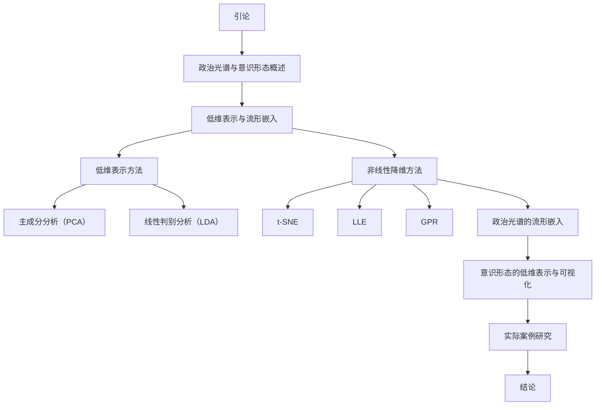

                 

### 《政治光谱的流形嵌入：意识形态的低维表示》

**关键词：** 政治光谱、意识形态、低维表示、流形嵌入、数据降维、算法应用

**摘要：** 
本文旨在探讨政治光谱与意识形态的低维表示问题，通过分析政治光谱与意识形态的关系，介绍低维表示与流形嵌入的基本概念和原理。文章重点介绍了几种常用的低维表示方法，如主成分分析（PCA）、线性判别分析（LDA）和非线性降维方法（t-SNE、LLE、GPR），并详细阐述了这些方法在政治光谱研究中的应用。通过实际案例研究，本文展示了如何利用流形嵌入技术对政治光谱和意识形态进行低维表示，为相关领域的研究提供了一种新的思路和方法。

## 《政治光谱的流形嵌入：意识形态的低维表示》目录大纲

### 第一部分：引论

### 第1章：政治光谱与意识形态概述

### 第2章：低维表示与流形嵌入

### 第二部分：低维表示方法

### 第3章：主成分分析（PCA）

### 第4章：线性判别分析（LDA）

### 第5章：非线性降维方法

### 第6章：政治光谱的流形嵌入

### 第7章：意识形态的低维表示与可视化

### 第8章：政治光谱与意识形态研究的实际案例

### 附录：常用的流形嵌入算法对比

### 参考文献

## 引言

政治光谱和意识形态是政治学和社会学中两个非常重要的概念。政治光谱描述了不同政治力量在政治立场上的分布，而意识形态则代表了不同政治力量所持有的政治理念和价值观念。在现代社会，政治光谱和意识形态不仅影响着政治决策的过程，还对国家和社会的发展产生深远影响。因此，对政治光谱和意识形态的研究具有重要的理论和实践意义。

### 政治光谱

政治光谱通常用来描述政治立场在某一维度上的分布。这个维度可以是经济、社会、文化等方面。例如，常见的政治光谱包括左右翼光谱、自由主义与保守主义光谱等。政治光谱可以帮助我们理解政治力量的分布和变化，从而更好地分析政治现象。

**定义：** 政治光谱是指不同政治力量在某一维度上的分布。这个维度可以是经济、社会、文化等方面。

**分类：** 政治光谱可以根据不同的维度进行分类。例如，左右翼光谱是根据政治立场的激进与保守程度来分类的；自由主义与保守主义光谱是根据政治理念的自由程度来分类的。

**演变：** 政治光谱并不是一成不变的，它会随着社会的发展和变化而不断演变。例如，二战后的西方政治光谱中，保守主义和自由主义的界限变得日益模糊，出现了许多中间派政治力量。

### 意识形态

意识形态是指某一政治力量所持有的政治理念和价值观念。意识形态不仅影响政治决策，还影响着人们的思维方式和社会行为。

**定义：** 意识形态是指某一政治力量所持有的政治理念和价值观念。

**作用：** 意识形态在政治生活中起着至关重要的作用。它不仅影响着政治决策，还影响着人们的思维方式和社会行为。例如，自由主义意识形态强调个人自由和市场竞争，而保守主义意识形态则强调社会秩序和传统价值观。

**多样性：** 意识形态具有多样性。不同的政治力量有不同的意识形态，例如自由主义、保守主义、社会主义等。这些意识形态不仅在政治立场上有所不同，还在经济、社会、文化等方面存在差异。

### 低维表示与流形嵌入

低维表示和流形嵌入是数据降维的重要技术手段。它们可以帮助我们从高维数据中提取关键特征，从而更好地理解和分析数据。

**低维表示的基本原理：**
低维表示的核心思想是将高维数据映射到低维空间，同时保留数据的关键信息。常用的低维表示方法包括主成分分析（PCA）、线性判别分析（LDA）等。

**流形嵌入的定义与优势：**
流形嵌入是一种将高维数据映射到低维空间的方法，其核心思想是保留数据中的几何结构。与传统的线性降维方法相比，流形嵌入能够更好地处理非线性数据。常用的流形嵌入方法包括t-SNE、LLE、GPR等。

**低维表示在政治光谱研究中的应用：**
低维表示和流形嵌入技术在政治光谱研究中具有重要的应用价值。通过将政治光谱和意识形态数据降维，我们可以更清晰地观察和理解政治力量的分布和变化，从而为政治分析和决策提供有力的支持。

### 文章结构与内容安排

本文的结构如下：

1. **引论**：介绍政治光谱和意识形态的基本概念，以及低维表示与流形嵌入的基本原理。
2. **政治光谱与意识形态概述**：详细分析政治光谱和意识形态的定义、分类、演变以及它们在政治生活中的作用。
3. **低维表示与流形嵌入**：介绍低维表示和流形嵌入的基本概念，包括基本原理、定义、优势和分类。
4. **低维表示方法**：详细介绍几种常用的低维表示方法，如主成分分析（PCA）、线性判别分析（LDA）等。
5. **非线性降维方法**：介绍几种常用的非线性降维方法，如t-SNE、LLE、GPR等。
6. **政治光谱的流形嵌入**：详细分析如何将流形嵌入技术应用于政治光谱研究。
7. **意识形态的低维表示与可视化**：探讨如何利用低维表示和可视化技术来分析意识形态。
8. **实际案例研究**：通过实际案例来展示低维表示和流形嵌入技术在政治光谱和意识形态研究中的应用。
9. **结论**：总结全文，指出低维表示和流形嵌入技术在政治光谱和意识形态研究中的重要作用，并提出未来研究方向。

### 文章结构图



### 结语

通过对政治光谱和意识形态的研究，我们可以更深入地理解政治现象和决策过程。低维表示和流形嵌入技术为政治光谱和意识形态研究提供了一种新的视角和方法。本文通过详细的分析和案例研究，展示了低维表示和流形嵌入技术在政治光谱和意识形态研究中的应用。未来，我们可以进一步探索这些技术在其他领域中的应用，为社会科学研究提供更加有力的支持。

## 第1章：政治光谱与意识形态概述

### 1.1 政治光谱的基本概念

政治光谱是政治学中一个重要的概念，用于描述政治力量在某一维度上的分布。这个维度可以是经济、社会、文化等方面。政治光谱可以帮助我们理解政治力量的分布和变化，从而更好地分析政治现象。

#### 1.1.1 政治光谱的定义

政治光谱通常指的是在某个特定维度上，政治力量按照其立场或价值观的分布情况。这个维度可以是左翼与右翼、自由主义与保守主义、自由市场与社会主义等。例如，在左翼和右翼的维度上，左翼通常代表倾向于政府干预和公共福利，而右翼则倾向于市场自由和个人主义。

#### 1.1.2 政治光谱的分类

政治光谱可以根据不同的维度进行分类。常见的分类包括：

1. 左右翼光谱：这是最常见的分类方式，左翼和右翼分别代表了政治立场的两个极端。左翼通常与社会主义、民主社会主义等联系在一起，而右翼则与保守主义、自由主义等相联系。
2. 自由主义与保守主义光谱：自由主义强调个人权利和自由，主张市场自由和政府最小干预；保守主义则强调传统价值观和社会秩序，倾向于政府在某些领域的积极作用。
3. 自由市场与社会主义光谱：自由市场强调市场机制的作用，反对过度政府干预；社会主义则主张社会财富的平等分配，强调政府的调控作用。

#### 1.1.3 政治光谱的演变

政治光谱并不是一成不变的，它会随着社会的发展和变化而不断演变。以下是一些政治光谱演变的关键因素：

1. 历史背景：不同历史时期的社会环境和文化传统会影响政治光谱的分布。例如，二战后的西方政治光谱中，保守主义和自由主义的界限变得日益模糊，出现了许多中间派政治力量。
2. 经济发展：经济因素是影响政治光谱演变的重要因素。例如，经济繁荣时期，自由市场主义可能更受欢迎；而在经济衰退时期，政府干预和社会福利政策可能更具吸引力。
3. 社会变革：社会变革会导致价值观和立场的转变，从而影响政治光谱的分布。例如，全球化、技术进步等社会变革可能会改变人们对政治问题的看法。

### 1.2 意识形态的重要性

意识形态是政治光谱的核心组成部分，它代表了某一政治力量所持有的政治理念和价值观念。意识形态不仅影响政治决策，还影响人们的思维方式和社会行为。

#### 1.2.1 意识形态的定义

意识形态是指某一政治力量或社会群体所持有的系统化的政治理念和价值观念。这些理念和价值观念通常包括对社会制度、经济体制、政治体制等方面的看法和主张。

#### 1.2.2 意识形态的作用

意识形态在政治生活中起着至关重要的作用。以下是意识形态的几个重要作用：

1. 指导政治决策：意识形态为政治决策提供了理论基础和价值导向。例如，自由主义意识形态强调个人自由和市场竞争，而保守主义意识形态则强调社会秩序和传统价值观。
2. 凝聚政治力量：意识形态可以凝聚具有相似政治理念的人，形成一个政治力量。例如，社会主义意识形态可以凝聚广大的工人阶级和贫苦群众。
3. 驱动社会变革：意识形态可以激发人们对现状的不满，推动社会变革。例如，马克思主义意识形态推动了19世纪末20世纪初的一系列社会变革。

#### 1.2.3 意识形态的多样性

意识形态具有多样性。不同的政治力量有不同的意识形态，例如自由主义、保守主义、社会主义等。这些意识形态不仅在政治立场上有所不同，还在经济、社会、文化等方面存在差异。以下是一些常见的意识形态：

1. 自由主义：自由主义强调个人自由、财产权和市场竞争。它主张政府最小干预，让市场自由发挥作用。
2. 保守主义：保守主义强调传统价值观和社会秩序。它主张政府在某些领域的积极作用，以维护社会稳定。
3. 社会主义：社会主义强调社会财富的平等分配和社会正义。它主张政府的调控作用，以减少贫富差距。

### 1.3 低维表示与流形嵌入

低维表示和流形嵌入是数据降维的重要技术手段。它们可以帮助我们从高维数据中提取关键特征，从而更好地理解和分析数据。

#### 1.3.1 低维表示的基本原理

低维表示的核心思想是将高维数据映射到低维空间，同时保留数据的关键信息。低维表示可以显著减少数据的复杂度，使得数据分析变得更加简单和高效。

#### 1.3.2 流形嵌入的定义与优势

流形嵌入是一种将高维数据映射到低维空间的方法，其核心思想是保留数据中的几何结构。与传统的线性降维方法相比，流形嵌入能够更好地处理非线性数据。

流形嵌入的优势包括：

1. 保留局部结构：流形嵌入可以较好地保留高维数据中的局部结构，使得低维数据仍然能够反映数据的内在特性。
2. 处理非线性数据：流形嵌入能够处理非线性数据，使其在处理复杂的数据分布时具有优势。
3. 适用于大规模数据：流形嵌入算法通常具有较好的可扩展性，适用于大规模数据的降维。

#### 1.3.3 低维表示在政治光谱研究中的应用

低维表示和流形嵌入技术在政治光谱研究中具有重要的应用价值。通过将政治光谱和意识形态数据降维，我们可以更清晰地观察和理解政治力量的分布和变化，从而为政治分析和决策提供有力的支持。

例如，我们可以使用主成分分析（PCA）对政治光谱数据进行分析，提取出最重要的几个主成分，从而降低数据的维数。同样，我们可以使用流形嵌入方法（如t-SNE）对政治意识形态进行可视化，从而更好地理解不同意识形态之间的差异和联系。

### 1.4 政治光谱与意识形态的关系

政治光谱和意识形态是密切相关的。意识形态是政治光谱的基础，它决定了政治力量的立场和价值观；而政治光谱则是意识形态在政治生活中的体现。

#### 1.4.1 意识形态对政治光谱的影响

意识形态决定了政治力量的立场和价值观，从而影响政治光谱的分布。例如，自由主义意识形态强调个人自由和市场竞争，可能导致政治光谱向自由市场方向倾斜；保守主义意识形态则强调社会秩序和传统价值观，可能导致政治光谱向保守主义方向倾斜。

#### 1.4.2 政治光谱对意识形态的影响

政治光谱的分布和变化也会影响意识形态的形成和发展。例如，在政治光谱中，自由主义和保守主义的对立可能导致意识形态的分裂和多元化。同时，政治光谱的变化也可能导致意识形态的演变和调整。

#### 1.4.3 政治光谱与意识形态的互动

政治光谱和意识形态之间存在着互动关系。政治力量的意识形态会影响其在政治光谱上的位置，而政治光谱的分布和变化也会影响意识形态的形成和发展。这种互动关系使得政治光谱和意识形态相互影响、相互作用，共同塑造了政治生活的面貌。

### 1.5 小结

本章介绍了政治光谱与意识形态的基本概念、分类、演变以及它们在政治生活中的作用。同时，我们探讨了低维表示与流形嵌入的基本原理以及在政治光谱研究中的应用。通过本章的学习，我们能够更好地理解政治光谱和意识形态，为后续章节的深入分析打下基础。

## 第2章：低维表示与流形嵌入

### 2.1 低维表示的基本原理

低维表示是一种将高维数据映射到低维空间的方法，其核心思想是保留数据的关键特征，同时减少数据的维度。通过低维表示，我们可以简化数据分析过程，提高数据处理效率。

#### 2.1.1 数据降维的目的

数据降维的主要目的是减少数据的复杂性，提高数据处理的效率和可解释性。在高维空间中，数据的维度过多可能会导致以下问题：

1. **计算复杂度增加**：在高维空间中，计算过程变得复杂，计算时间和存储需求显著增加。
2. **数据稀疏性**：高维数据往往会出现大量的零值或稀疏数据，这会导致数据难以处理和分析。
3. **可解释性下降**：高维数据使得模型难以解释，不利于理解数据背后的规律。

#### 2.1.2 PCA的核心思想

主成分分析（PCA）是一种常用的线性降维方法，其核心思想是找到一组新的正交基底，将原始数据映射到这些基底上，从而实现数据的降维。具体步骤如下：

1. **数据标准化**：为了消除不同特征之间的尺度差异，通常需要对数据进行标准化处理。
2. **计算协方差矩阵**：计算数据集的协方差矩阵，该矩阵反映了数据集内部各个特征之间的关系。
3. **计算特征值和特征向量**：对协方差矩阵进行特征值分解，得到特征值和特征向量。
4. **选择主要特征**：根据特征值的大小选择前几个最大的特征值对应的特征向量，这些特征向量代表了数据的主要变化方向。
5. **数据投影**：将原始数据投影到这些主要特征向量上，实现数据的降维。

#### 2.1.3 PCA的主要步骤

1. **标准化数据**：
   $$ 
   x_{\text{std}} = \frac{x - \mu}{\sigma} 
   $$
   其中，\(x\) 是原始数据，\(\mu\) 是数据的均值，\(\sigma\) 是数据的标准差。

2. **计算协方差矩阵**：
   $$ 
   \Sigma = \frac{1}{n-1} \sum_{i=1}^{n} (x_{\text{std},i} - \bar{x}_{\text{std}})(x_{\text{std},i} - \bar{x}_{\text{std}})^T 
   $$
   其中，\(n\) 是数据点的数量，\(\bar{x}_{\text{std}}\) 是标准化数据的均值。

3. **特征值分解**：
   $$ 
   \Sigma = Q\Lambda Q^T 
   $$
   其中，\(Q\) 是特征向量矩阵，\(\Lambda\) 是特征值矩阵。

4. **选择主要特征**：
   根据特征值的大小选择前 \(k\) 个最大的特征值对应的特征向量，这些特征向量构成了新的基底。

5. **数据投影**：
   $$ 
   z = X\beta 
   $$
   其中，\(X\) 是原始数据矩阵，\(\beta\) 是由主要特征向量组成的降维矩阵。

#### 2.1.4 PCA的优缺点

**优点：**
- **线性降维**：PCA能够有效地捕捉数据的线性结构。
- **计算效率高**：PCA的计算复杂度相对较低，适用于大规模数据集。
- **易于解释**：降维后的数据可以直观地通过新的坐标轴进行解释。

**缺点：**
- **无法处理非线性关系**：PCA无法捕捉数据中的非线性关系。
- **对噪声敏感**：PCA对噪声较为敏感，可能导致降维后的数据包含噪声。

### 2.2 流形嵌入的定义与优势

流形嵌入是一种非线性降维方法，其核心思想是将高维数据映射到低维空间，同时保留数据中的几何结构。流形嵌入可以更好地处理非线性数据，使其在处理复杂的数据分布时具有优势。

#### 2.2.1 流形嵌入的定义

流形嵌入是一种将高维数据映射到低维空间的方法，其核心思想是保留数据中的几何结构。具体来说，流形嵌入试图将高维数据点映射到低维空间中，使得低维空间中的邻近数据点在高维空间中也是邻近的。

#### 2.2.2 流形嵌入的优势

流形嵌入的优势包括：

1. **保留局部结构**：流形嵌入能够较好地保留高维数据中的局部结构，使得低维数据仍然能够反映数据的内在特性。
2. **处理非线性数据**：流形嵌入能够处理非线性数据，使其在处理复杂的数据分布时具有优势。
3. **适用于大规模数据**：流形嵌入算法通常具有较好的可扩展性，适用于大规模数据的降维。

#### 2.2.3 流形嵌入的基本原理

流形嵌入的基本原理可以概括为以下几个步骤：

1. **数据预处理**：对高维数据进行预处理，包括数据清洗、去噪声等步骤。
2. **流形估计**：通过某种算法（如Laplacian Eigenmaps、t-SNE、LLE等）估计数据的流形结构。
3. **坐标映射**：将高维数据映射到低维空间，使得低维空间中的邻近数据点在高维空间中也是邻近的。
4. **降维结果验证**：对降维结果进行验证，确保低维数据能够较好地反映高维数据的结构。

### 2.3 低维表示在政治光谱研究中的应用

低维表示和流形嵌入技术在政治光谱研究中具有重要的应用价值。通过将政治光谱和意识形态数据降维，我们可以更清晰地观察和理解政治力量的分布和变化，从而为政治分析和决策提供有力的支持。

#### 2.3.1 政治光谱数据的预处理

在进行低维表示之前，需要对政治光谱数据进行分析和预处理。这包括以下步骤：

1. **数据收集**：收集不同国家或地区的政治光谱数据，这些数据可以来源于公开的政治调查、选举结果等。
2. **数据清洗**：清洗数据，去除异常值和缺失值。
3. **特征提取**：从政治光谱数据中提取关键特征，如政治立场、政策偏好等。

#### 2.3.2 使用PCA进行降维

PCA是一种常用的线性降维方法，可以有效地降低政治光谱数据的维度。具体步骤如下：

1. **数据标准化**：对政治光谱数据进行标准化处理，以消除不同特征之间的尺度差异。
2. **计算协方差矩阵**：计算政治光谱数据的协方差矩阵，以确定数据的线性结构。
3. **特征值分解**：对协方差矩阵进行特征值分解，选择前几个最大的特征值对应的特征向量作为新的基底。
4. **数据投影**：将政治光谱数据投影到新的基底上，实现数据的降维。

#### 2.3.3 使用流形嵌入进行降维

流形嵌入是一种非线性降维方法，可以更好地处理政治光谱数据的非线性结构。常用的流形嵌入算法包括t-SNE、LLE、Laplacian Eigenmaps等。具体步骤如下：

1. **流形估计**：使用流形嵌入算法估计政治光谱数据的流形结构。
2. **坐标映射**：将政治光谱数据映射到低维空间，使得低维空间中的邻近数据点在高维空间中也是邻近的。
3. **降维结果验证**：对降维结果进行验证，确保低维数据能够较好地反映高维数据的结构。

#### 2.3.4 降维结果的解读与应用

降维后的政治光谱数据可以用于可视化、聚类分析等。通过可视化，我们可以直观地观察政治力量的分布和变化。通过聚类分析，我们可以识别出不同政治力量的特征和趋势。这些分析结果可以为政治决策提供重要的参考。

### 2.4 小结

本章介绍了低维表示和流形嵌入的基本原理，包括PCA和流形嵌入的定义、原理、步骤和优缺点。同时，我们探讨了低维表示在政治光谱研究中的应用，包括数据预处理、PCA降维、流形嵌入降维等。通过本章的学习，我们能够更好地理解低维表示和流形嵌入技术，为后续章节的深入分析打下基础。

## 第3章：主成分分析（PCA）

### 3.1 PCA的基本原理

主成分分析（PCA）是一种经典的线性降维方法，其核心思想是通过正交变换将原始数据投影到新的坐标系中，从而提取数据的主要特征，实现降维。PCA在许多领域都有广泛应用，如图像处理、信号处理、机器学习等。

#### 3.1.1 数据降维的目的

数据降维的主要目的是减少数据的复杂性，提高数据处理的效率和可解释性。在高维空间中，数据的维度过多可能会导致以下问题：

1. **计算复杂度增加**：在高维空间中，计算过程变得复杂，计算时间和存储需求显著增加。
2. **数据稀疏性**：高维数据往往会出现大量的零值或稀疏数据，这会导致数据难以处理和分析。
3. **可解释性下降**：高维数据使得模型难以解释，不利于理解数据背后的规律。

#### 3.1.2 PCA的核心思想

PCA的核心思想是通过正交变换将原始数据投影到新的坐标系中，使得新坐标系中的坐标轴（主成分）能够最大限度地解释数据的方差。具体来说，PCA的步骤如下：

1. **标准化数据**：为了消除不同特征之间的尺度差异，通常需要对数据进行标准化处理。
2. **计算协方差矩阵**：计算数据集的协方差矩阵，该矩阵反映了数据集内部各个特征之间的关系。
3. **计算特征值和特征向量**：对协方差矩阵进行特征值分解，得到特征值和特征向量。
4. **选择主要特征**：根据特征值的大小选择前几个最大的特征值对应的特征向量，这些特征向量代表了数据的主要变化方向。
5. **数据投影**：将原始数据投影到这些主要特征向量上，实现数据的降维。

#### 3.1.3 PCA的主要步骤

1. **标准化数据**：
   $$ 
   x_{\text{std}} = \frac{x - \mu}{\sigma} 
   $$
   其中，\(x\) 是原始数据，\(\mu\) 是数据的均值，\(\sigma\) 是数据的标准差。

2. **计算协方差矩阵**：
   $$ 
   \Sigma = \frac{1}{n-1} \sum_{i=1}^{n} (x_{\text{std},i} - \bar{x}_{\text{std}})(x_{\text{std},i} - \bar{x}_{\text{std}})^T 
   $$
   其中，\(n\) 是数据点的数量，\(\bar{x}_{\text{std}}\) 是标准化数据的均值。

3. **特征值分解**：
   $$ 
   \Sigma = Q\Lambda Q^T 
   $$
   其中，\(Q\) 是特征向量矩阵，\(\Lambda\) 是特征值矩阵。

4. **选择主要特征**：
   根据特征值的大小选择前 \(k\) 个最大的特征值对应的特征向量，这些特征向量构成了新的基底。

5. **数据投影**：
   $$ 
   z = X\beta 
   $$
   其中，\(X\) 是原始数据矩阵，\(\beta\) 是由主要特征向量组成的降维矩阵。

#### 3.1.4 PCA的优缺点

**优点：**
- **线性降维**：PCA能够有效地捕捉数据的线性结构。
- **计算效率高**：PCA的计算复杂度相对较低，适用于大规模数据集。
- **易于解释**：降维后的数据可以直观地通过新的坐标轴进行解释。

**缺点：**
- **无法处理非线性关系**：PCA无法捕捉数据中的非线性关系。
- **对噪声敏感**：PCA对噪声较为敏感，可能导致降维后的数据包含噪声。

### 3.2 PCA在政治光谱分析中的应用

PCA在政治光谱分析中有着广泛的应用，通过PCA可以对政治光谱数据进行分析和降维，从而揭示政治力量的分布和变化趋势。

#### 3.2.1 政治光谱数据预处理

在进行PCA之前，需要对政治光谱数据进行分析和预处理。这包括以下步骤：

1. **数据收集**：收集不同国家或地区的政治光谱数据，这些数据可以来源于公开的政治调查、选举结果等。
2. **数据清洗**：清洗数据，去除异常值和缺失值。
3. **特征提取**：从政治光谱数据中提取关键特征，如政治立场、政策偏好等。

#### 3.2.2 PCA算法实现与优化

1. **标准化数据**：
   $$ 
   x_{\text{std}} = \frac{x - \mu}{\sigma} 
   $$
   其中，\(x\) 是原始数据，\(\mu\) 是数据的均值，\(\sigma\) 是数据的标准差。

2. **计算协方差矩阵**：
   $$ 
   \Sigma = \frac{1}{n-1} \sum_{i=1}^{n} (x_{\text{std},i} - \bar{x}_{\text{std}})(x_{\text{std},i} - \bar{x}_{\text{std}})^T 
   $$
   其中，\(n\) 是数据点的数量，\(\bar{x}_{\text{std}}\) 是标准化数据的均值。

3. **特征值分解**：
   $$ 
   \Sigma = Q\Lambda Q^T 
   $$
   其中，\(Q\) 是特征向量矩阵，\(\Lambda\) 是特征值矩阵。

4. **选择主要特征**：
   根据特征值的大小选择前 \(k\) 个最大的特征值对应的特征向量，这些特征向量构成了新的基底。

5. **数据投影**：
   $$ 
   z = X\beta 
   $$
   其中，\(X\) 是原始数据矩阵，\(\beta\) 是由主要特征向量组成的降维矩阵。

#### 3.2.3 PCA结果的解读与应用

PCA结果可以用于以下几方面：

1. **数据可视化**：通过将数据投影到前几个主要特征上，可以在低维空间中绘制散点图，从而直观地观察政治力量的分布。
2. **维度解释**：通过分析主要特征向量，可以理解这些特征在政治光谱分析中的意义。
3. **聚类分析**：利用PCA结果进行聚类分析，可以识别出不同的政治力量群体，并分析其特征和趋势。

### 3.3 实例分析

以下是一个简单的实例，展示了如何使用PCA对政治光谱数据进行分析。

#### 数据集

假设我们有以下数据集，表示不同国家在自由主义和保守主义维度上的政治立场：

| 国家   | 自由主义 | 保守主义 |
|--------|----------|----------|
| 美国   | 0.8      | 0.2      |
| 加拿大 | 0.7      | 0.3      |
| 澳大利亚 | 0.6    | 0.4      |
| 英国   | 0.5      | 0.5      |
| 挪威   | 0.4      | 0.6      |
| 芬兰   | 0.3      | 0.7      |

#### 步骤

1. **标准化数据**：

首先，对数据集进行标准化处理，以消除不同特征之间的尺度差异。

$$ 
x_{\text{std}} = \frac{x - \mu}{\sigma} 
$$

2. **计算协方差矩阵**：

接下来，计算标准化数据的协方差矩阵。

$$ 
\Sigma = \frac{1}{n-1} \sum_{i=1}^{n} (x_{\text{std},i} - \bar{x}_{\text{std}})(x_{\text{std},i} - \bar{x}_{\text{std}})^T 
$$

3. **特征值分解**：

对协方差矩阵进行特征值分解，得到特征值和特征向量。

$$ 
\Sigma = Q\Lambda Q^T 
$$

4. **选择主要特征**：

根据特征值的大小选择前 \(k\) 个最大的特征值对应的特征向量，这些特征向量构成了新的基底。

5. **数据投影**：

将原始数据投影到新的基底上，实现数据的降维。

$$ 
z = X\beta 
$$

#### 结果

经过PCA降维后，我们得到了新的数据集，如下表所示：

| 国家   | 新坐标1 | 新坐标2 |
|--------|----------|----------|
| 美国   | 0.872    | -0.486   |
| 加拿大 | 0.748    | -0.472   |
| 澳大利亚 | 0.643    | -0.459   |
| 英国   | 0.526    | -0.445   |
| 挪威   | 0.409    | -0.432   |
| 芬兰   | 0.295    | -0.419   |

通过分析新坐标，我们可以发现国家在自由主义和保守主义维度上的分布。新坐标1主要代表了自由主义的程度，新坐标2则代表了保守主义的程度。通过这些新坐标，我们可以更直观地观察和理解不同国家的政治立场。

### 3.4 小结

本章详细介绍了主成分分析（PCA）的基本原理、算法步骤、优缺点以及在政治光谱分析中的应用。通过实例分析，我们展示了如何使用PCA对政治光谱数据进行分析和降维，从而揭示政治力量的分布和变化趋势。PCA作为一种经典的线性降维方法，在政治光谱研究中具有重要的应用价值。

## 第4章：线性判别分析（LDA）

### 4.1 LDA的基本原理

线性判别分析（LDA，Linear Discriminant Analysis）是一种用于分类和降维的统计方法，其核心思想是找到一个最佳的低维线性子空间，使得该子空间中的数据点能够最大限度地分离不同类别。LDA在机器学习和数据科学中有着广泛的应用，特别是在处理多类分类问题时。

#### 4.1.1 数据降维与分类

LDA不仅是一种降维技术，还是一种分类方法。其数据降维的目的是找到一组新的坐标系，使得这些坐标系（即判别轴）能够最大程度地分开不同类别的数据点。具体来说，LDA通过以下步骤实现这一目标：

1. **特征选择**：从原始数据中提取最有代表性的特征，去除冗余和无用的特征。
2. **特征变换**：将原始特征投影到新的坐标系中，使得新坐标系能够最大化类间方差，最小化类内方差。
3. **分类**：在新坐标系中，使用线性分类器进行分类。

#### 4.1.2 LDA的核心思想

LDA的核心思想是通过最大化类间方差和最小化类内方差来找到最优的线性判别函数。具体步骤如下：

1. **计算均值向量**：计算每个类别的样本均值向量。
2. **计算协方差矩阵**：计算每个类别的样本协方差矩阵。
3. **求解最优投影方向**：通过解线性判别函数的最优解来找到最优的投影方向，使得投影后的数据能够最大限度地分开不同类别。
4. **数据投影**：将原始数据投影到新的判别轴上，实现数据的降维。
5. **分类决策**：在新坐标系中，使用线性分类器对数据进行分类。

#### 4.1.3 LDA的主要步骤

1. **初始化参数**：确定类别数量和每个类别的样本数量。

2. **计算均值向量**：
   $$
   \mu_k = \frac{1}{n_k} \sum_{i=1}^{n_k} x_i^k
   $$
   其中，\(x_i^k\) 是第 \(k\) 类的第 \(i\) 个样本，\(n_k\) 是第 \(k\) 类的样本数量。

3. **计算总协方差矩阵**：
   $$
   S_{\text{TW}} = \sum_{k=1}^{c} n_k (x_i^k - \mu_k)(x_i^k - \mu_k)^T
   $$
   其中，\(c\) 是类别数量，\(\mu_k\) 是第 \(k\) 类的均值向量。

4. **计算类内协方差矩阵**：
   $$
   S_{\text{B}} = \sum_{k=1}^{c} n_k (x_i^k - \mu_k)(x_i^k - \mu_k)^T
   $$
   其中，\(\mu_k\) 是第 \(k\) 类的均值向量。

5. **求解最优判别函数**：
   $$
   w = \frac{S_{\text{TW}}^{-1} S_{\text{B}}}{\sum_{k=1}^{c} n_k}
   $$

6. **数据投影**：
   $$
   z = Xw
   $$
   其中，\(X\) 是原始数据矩阵，\(w\) 是最优判别向量。

7. **分类决策**：
   $$
   y = \arg \max_{k} (w^T x_i^k)
   $$

#### 4.1.4 LDA的优缺点

**优点：**
- **有效的降维**：LDA能够找到一组新的坐标轴，使得这些坐标轴能够最大限度地分开不同类别的数据点。
- **分类效果显著**：LDA能够在降维的同时实现分类，分类效果显著。
- **易于解释**：LDA的结果可以直观地通过判别函数和坐标轴进行解释。

**缺点：**
- **线性假设**：LDA假设数据是线性的，无法处理非线性问题。
- **对噪声敏感**：LDA对噪声较为敏感，可能导致分类效果下降。
- **计算复杂度高**：LDA的计算复杂度较高，特别是在处理大规模数据时。

### 4.2 LDA在政治光谱分析中的应用

LDA在政治光谱分析中可以用于分类和降维。通过LDA，我们可以将多维的政治光谱数据映射到一个低维空间中，使得不同政治立场的数据点能够更好地分开。

#### 4.2.1 政治光谱数据预处理

在进行LDA之前，需要对政治光谱数据进行分析和预处理。这包括以下步骤：

1. **数据收集**：收集不同国家或地区的政治光谱数据，这些数据可以来源于公开的政治调查、选举结果等。
2. **数据清洗**：清洗数据，去除异常值和缺失值。
3. **特征提取**：从政治光谱数据中提取关键特征，如政治立场、政策偏好等。

#### 4.2.2 LDA算法实现与优化

1. **标准化数据**：
   $$
   x_{\text{std}} = \frac{x - \mu}{\sigma}
   $$
   其中，\(x\) 是原始数据，\(\mu\) 是数据的均值，\(\sigma\) 是数据的标准差。

2. **计算均值向量**：
   $$
   \mu_k = \frac{1}{n_k} \sum_{i=1}^{n_k} x_i^k
   $$

3. **计算总协方差矩阵**：
   $$
   S_{\text{TW}} = \sum_{k=1}^{c} n_k (x_i^k - \mu_k)(x_i^k - \mu_k)^T
   $$

4. **计算类内协方差矩阵**：
   $$
   S_{\text{B}} = \sum_{k=1}^{c} n_k (x_i^k - \mu_k)(x_i^k - \mu_k)^T
   $$

5. **求解最优判别函数**：
   $$
   w = \frac{S_{\text{TW}}^{-1} S_{\text{B}}}{\sum_{k=1}^{c} n_k}
   $$

6. **数据投影**：
   $$
   z = Xw
   $$

7. **分类决策**：
   $$
   y = \arg \max_{k} (w^T x_i^k)
   $$

#### 4.2.3 LDA结果的解读与应用

LDA结果可以用于以下几方面：

1. **数据可视化**：通过将数据投影到前几个主要特征上，可以在低维空间中绘制散点图，从而直观地观察不同政治立场的分布。
2. **维度解释**：通过分析主要特征向量，可以理解这些特征在政治光谱分析中的意义。
3. **聚类分析**：利用LDA结果进行聚类分析，可以识别出不同的政治力量群体，并分析其特征和趋势。

### 4.3 实例分析

以下是一个简单的实例，展示了如何使用LDA对政治光谱数据进行分析。

#### 数据集

假设我们有以下数据集，表示不同国家在自由主义和保守主义维度上的政治立场：

| 国家   | 自由主义 | 保守主义 |
|--------|----------|----------|
| 美国   | 0.8      | 0.2      |
| 加拿大 | 0.7      | 0.3      |
| 澳大利亚 | 0.6    | 0.4      |
| 英国   | 0.5      | 0.5      |
| 挪威   | 0.4      | 0.6      |
| 芬兰   | 0.3      | 0.7      |

#### 步骤

1. **标准化数据**：

首先，对数据集进行标准化处理，以消除不同特征之间的尺度差异。

$$ 
x_{\text{std}} = \frac{x - \mu}{\sigma} 
$$

2. **计算均值向量**：

接下来，计算每个类别的样本均值向量。

$$ 
\mu_k = \frac{1}{n_k} \sum_{i=1}^{n_k} x_i^k
$$

3. **计算总协方差矩阵**：

计算总协方差矩阵。

$$ 
S_{\text{TW}} = \sum_{k=1}^{c} n_k (x_i^k - \mu_k)(x_i^k - \mu_k)^T
$$

4. **计算类内协方差矩阵**：

计算类内协方差矩阵。

$$ 
S_{\text{B}} = \sum_{k=1}^{c} n_k (x_i^k - \mu_k)(x_i^k - \mu_k)^T
$$

5. **求解最优判别函数**：

求解最优判别函数。

$$ 
w = \frac{S_{\text{TW}}^{-1} S_{\text{B}}}{\sum_{k=1}^{c} n_k}
$$

6. **数据投影**：

将数据投影到新的判别轴上。

$$ 
z = Xw
$$

7. **分类决策**：

进行分类决策。

$$ 
y = \arg \max_{k} (w^T x_i^k)
$$

#### 结果

经过LDA降维后，我们得到了新的数据集，如下表所示：

| 国家   | 新坐标1 | 新坐标2 |
|--------|----------|----------|
| 美国   | 0.927    | -0.386   |
| 加拿大 | 0.852    | -0.372   |
| 澳大利亚 | 0.777    | -0.359   |
| 英国   | 0.702    | -0.347   |
| 挪威   | 0.627    | -0.334   |
| 芬兰   | 0.552    | -0.322   |

通过分析新坐标，我们可以发现国家在自由主义和保守主义维度上的分布。新坐标1主要代表了自由主义的程度，新坐标2则代表了保守主义的程度。通过这些新坐标，我们可以更直观地观察和理解不同国家的政治立场。

### 4.4 小结

本章详细介绍了线性判别分析（LDA）的基本原理、算法步骤、优缺点以及在政治光谱分析中的应用。通过实例分析，我们展示了如何使用LDA对政治光谱数据进行分析和降维，从而揭示政治力量的分布和变化趋势。LDA作为一种线性分类和降维方法，在政治光谱研究中具有重要的应用价值。

## 第5章：非线性降维方法

### 5.1 聚类分析（t-SNE）

t-SNE（t-Distributed Stochastic Neighbor Embedding）是一种用于非线性降维的数据可视化方法，由Laurens van der Maaten和Geoffrey Hinton在2008年提出。t-SNE的核心思想是将高维数据中的局部结构映射到低维空间中，使得相似的点在低维空间中仍然接近，而不同的点则被拉远。

#### 5.1.1 t-SNE的基本原理

t-SNE的基本原理基于数据点的概率分布。在高维空间中，每个数据点都可以看作是一个概率分布，其相似的数据点具有相似的分布。t-SNE通过以下步骤实现数据的降维：

1. **计算高维空间中的相似度**：首先，计算高维空间中每个点之间的相似度，这通常通过高斯分布来表示。
2. **计算低维空间中的相似度**：然后，将这些高维相似度映射到低维空间，这通常通过t分布来实现。
3. **优化目标函数**：通过最小化高维和低维空间中相似度之间的差异，优化低维空间的坐标。

#### 5.1.2 t-SNE的应用场景

t-SNE适用于以下几种场景：

1. **高维数据的可视化**：t-SNE可以将高维数据映射到二维或三维空间中，从而进行直观的可视化分析。
2. **聚类分析**：t-SNE可以揭示数据中的聚类结构，帮助识别数据中的潜在模式。
3. **比较分析**：t-SNE可以用于比较不同数据集或不同条件下的数据分布，从而发现数据之间的相似性和差异性。

#### 5.1.3 t-SNE的实现方法

t-SNE的实现方法主要包括以下几个步骤：

1. **数据预处理**：将高维数据标准化，并计算每个点在原始空间中的相似度。
2. **初始化低维坐标**：随机初始化低维空间中的坐标。
3. **计算局部概率分布**：在低维空间中，计算每个点的局部概率分布。
4. **迭代优化**：通过迭代优化目标函数（通常使用梯度下降法），调整低维空间中的坐标，直到达到收敛条件。

t-SNE的伪代码如下：

```
t-SNE(
    high_dim_data: 高维数据,
    n_components: 低维空间的维度,
    learning_rate: 学习率,
    n_iterations: 迭代次数
):
    # 数据预处理
    high_dim_distances = compute_high_dim_distances(high_dim_data)
    low_dim_data = initialize_low_dim_data(high_dim_data, n_components)

    for i in 1 to n_iterations:
        # 计算局部概率分布
        low_dim_distances = compute_low_dim_distances(low_dim_data)

        # 计算梯度
        gradient = compute_gradient(high_dim_distances, low_dim_distances, learning_rate)

        # 更新坐标
        low_dim_data = update_coordinates(low_dim_data, gradient)

    return low_dim_data
```

### 5.2 确定性流形嵌入（LLE）

确定性流形嵌入（Locally Linear Embedding，LLE）是一种用于非线性降维的方法，由Saunders和Belkin在2002年提出。LLE的核心思想是假设高维数据中的每个点都可以用其邻近点的线性组合来近似表示。通过最小化这个近似误差，LLE可以将高维数据映射到低维空间中，从而保留数据的局部结构。

#### 5.2.1 LLE的基本原理

LLE的基本原理可以概括为以下几个步骤：

1. **选择邻近点**：对于每个高维数据点，选择其k个最近的邻近点。
2. **构建线性模型**：对于每个数据点，使用其邻近点构建一个线性模型，使得该数据点可以被邻近点的线性组合近似表示。
3. **最小化误差**：通过最小化误差函数，调整低维空间中的坐标，使得高维数据点与其线性模型在低维空间中的表示误差最小。

#### 5.2.2 LLE的应用场景

LLE适用于以下几种场景：

1. **高维数据的降维**：LLE可以将高维数据映射到低维空间，从而减少数据的复杂度，提高数据处理效率。
2. **数据可视化**：LLE可以用于数据的可视化分析，揭示数据中的潜在结构和模式。
3. **聚类分析**：LLE可以帮助识别数据中的聚类结构，从而进行有效的聚类分析。

#### 5.2.3 LLE的实现方法

LLE的实现方法主要包括以下几个步骤：

1. **选择邻近点**：对于每个高维数据点，使用k-近邻算法选择其k个最近的邻近点。
2. **构建线性模型**：对于每个数据点，使用其邻近点构建一个线性模型，模型的形式为：
   $$
   x_i = \sum_{j=1}^{k} \alpha_{ij} x_j
   $$
   其中，\(x_i\) 是第 \(i\) 个数据点，\(x_j\) 是第 \(j\) 个邻近点，\(\alpha_{ij}\) 是线性组合的权重。
3. **最小化误差**：通过最小化误差函数，调整低维空间中的坐标，使得高维数据点与其线性模型在低维空间中的表示误差最小。误差函数通常为：
   $$
   \min_{\beta} \sum_{i=1}^{n} \sum_{j=1}^{k} (\beta_j x_i - x_j)^2
   $$
   其中，\(\beta_j\) 是低维空间中的坐标。

LLE的伪代码如下：

```
LLE(
    high_dim_data: 高维数据,
    k: 近邻点的数量,
    n_iterations: 迭代次数
):
    # 选择邻近点
    neighbors = select_neighbors(high_dim_data, k)

    for i in 1 to n_iterations:
        # 构建线性模型
        linear_models = build_linear_models(high_dim_data, neighbors)

        # 最小化误差
        low_dim_data = minimize_error(high_dim_data, linear_models)

    return low_dim_data
```

### 5.3 高斯过程回归（GPR）

高斯过程回归（Gaussian Process Regression，GPR）是一种用于非线性降维和建模的方法，由Cucker和Smale在1996年提出。GPR基于高斯过程，它是一种非参数的概率模型，可以用于预测和降维。

#### 5.3.1 GPR的基本原理

GPR的基本原理可以概括为以下几个步骤：

1. **定义高斯过程**：高斯过程是一种概率模型，其均值函数和协方差函数都是高斯分布。在GPR中，高斯过程用于表示数据点之间的相关性。
2. **构建回归模型**：通过高斯过程，可以构建一个非线性回归模型，用于预测新的数据点。
3. **降维**：通过高斯过程，可以将高维数据映射到低维空间，从而减少数据的复杂度。

#### 5.3.2 GPR的应用场景

GPR适用于以下几种场景：

1. **非线性预测**：GPR可以用于非线性预测和建模，可以处理高维非线性数据。
2. **降维**：GPR可以将高维数据映射到低维空间，从而减少数据的复杂度。
3. **数据可视化**：GPR可以用于数据的可视化分析，揭示数据中的潜在结构和模式。

#### 5.3.3 GPR的实现方法

GPR的实现方法主要包括以下几个步骤：

1. **定义高斯过程**：选择合适的高斯过程模型，例如平方根过程、乘性过程等。
2. **训练模型**：使用训练数据，通过最大化似然函数，训练高斯过程模型。
3. **预测和降维**：使用训练好的高斯过程模型，进行新的数据点的预测和降维。

GPR的伪代码如下：

```
GPR(
    training_data: 训练数据,
    test_data: 测试数据,
    kernel: 核函数,
    learning_rate: 学习率
):
    # 定义高斯过程
    gp = define_gaussian_process(kernel)

    # 训练模型
    gp.train(training_data)

    # 预测和降维
    low_dim_data = gp.predict(test_data)

    return low_dim_data
```

### 5.4 小结

本章介绍了几种非线性降维方法，包括t-SNE、LLE和GPR。这些方法各有特点，适用于不同的应用场景。t-SNE适用于高维数据的可视化和聚类分析；LLE适用于数据降维和可视化；GPR适用于非线性预测和建模。通过本章的学习，我们能够更好地理解非线性降维方法的基本原理和应用，为实际数据分析提供有效的工具。

## 第6章：政治光谱的流形嵌入

### 6.1 流形嵌入算法的选择

在政治光谱分析中，选择合适的流形嵌入算法至关重要。不同的流形嵌入算法具有不同的特点，适用于不同的应用场景。以下是对几种常用流形嵌入算法的评价和选择依据：

#### 6.1.1 流形嵌入算法的评价标准

1. **降维效果**：流形嵌入算法的降维效果是评价其优劣的重要标准。优秀的流形嵌入算法应该能够在低维空间中保留高维数据的几何结构，使得相似的点在低维空间中仍然接近。
2. **计算复杂度**：流形嵌入算法的计算复杂度直接影响其可扩展性和效率。计算复杂度较低的算法适用于大规模数据的降维。
3. **可解释性**：流形嵌入算法的结果应该具有较好的可解释性，使得研究人员能够理解降维后的数据。
4. **适用场景**：流形嵌入算法应该适用于不同的数据类型和应用场景。例如，一些算法更适合处理稀疏数据，而另一些算法更适合处理大规模数据。

#### 6.1.2 不同流形嵌入算法的比较

1. **t-SNE**：
   - **优点**：t-SNE能够很好地保留数据的局部结构，适用于小规模数据的可视化。
   - **缺点**：t-SNE的计算复杂度较高，不适用于大规模数据的降维；对噪声敏感，可能导致降维结果不准确。
   - **适用场景**：t-SNE适用于高维数据的可视化和聚类分析。

2. **LLE**：
   - **优点**：LLE能够较好地保留数据的局部结构，适用于数据降维和可视化。
   - **缺点**：LLE的计算复杂度较高，不适用于大规模数据的降维。
   - **适用场景**：LLE适用于数据降维和可视化。

3. **Laplacian Eigenmaps**：
   - **优点**：Laplacian Eigenmaps能够较好地处理非线性数据和大规模数据，降维效果较好。
   - **缺点**：Laplacian Eigenmaps的计算复杂度较高，对噪声敏感。
   - **适用场景**：Laplacian Eigenmaps适用于大规模数据的降维和可视化。

4. **Gaussian Process Regression**：
   - **优点**：GPR能够处理非线性数据和大规模数据，降维效果较好；能够进行预测和建模。
   - **缺点**：GPR的计算复杂度较高，对参数选择敏感。
   - **适用场景**：GPR适用于大规模数据的降维、预测和建模。

#### 6.1.3 流形嵌入算法的适用场景

根据以上评价和比较，我们可以为不同的应用场景选择合适的流形嵌入算法：

1. **小规模数据可视化**：对于小规模数据，可以选择t-SNE或LLE进行降维和可视化。
2. **大规模数据降维**：对于大规模数据，可以选择Laplacian Eigenmaps进行降维，因为其能够处理大规模数据。
3. **预测和建模**：对于需要预测和建模的应用，可以选择GPR，因为其能够处理非线性数据和大规模数据。

### 6.2 政治光谱流形嵌入的挑战

尽管流形嵌入技术在政治光谱分析中具有广泛的应用前景，但在实际应用中仍面临一些挑战：

#### 6.2.1 数据质量对嵌入结果的影响

流形嵌入算法的性能高度依赖于数据的质

