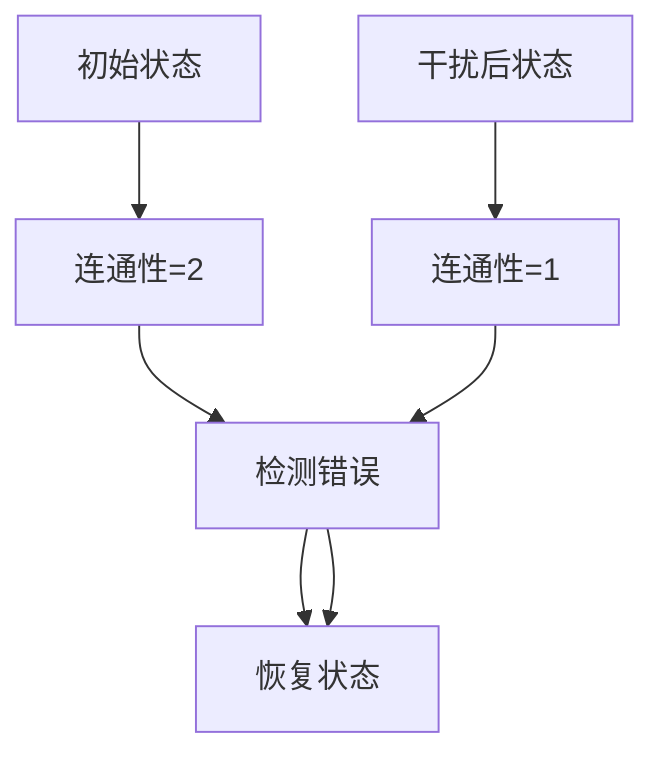
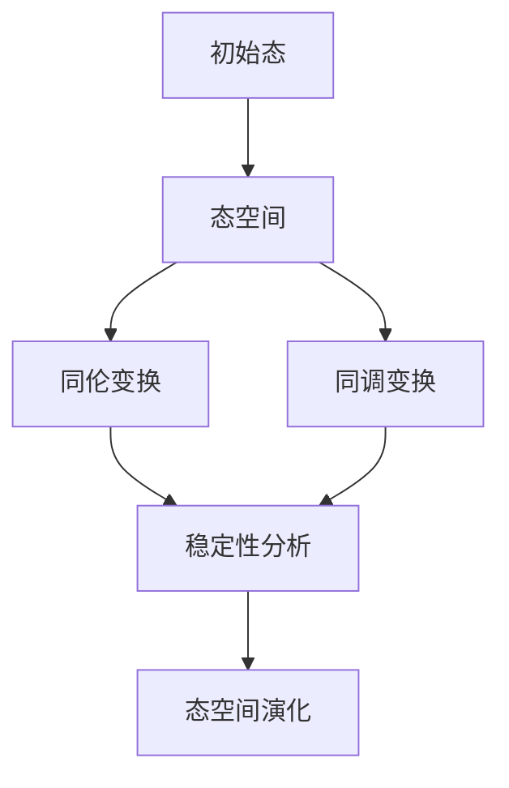
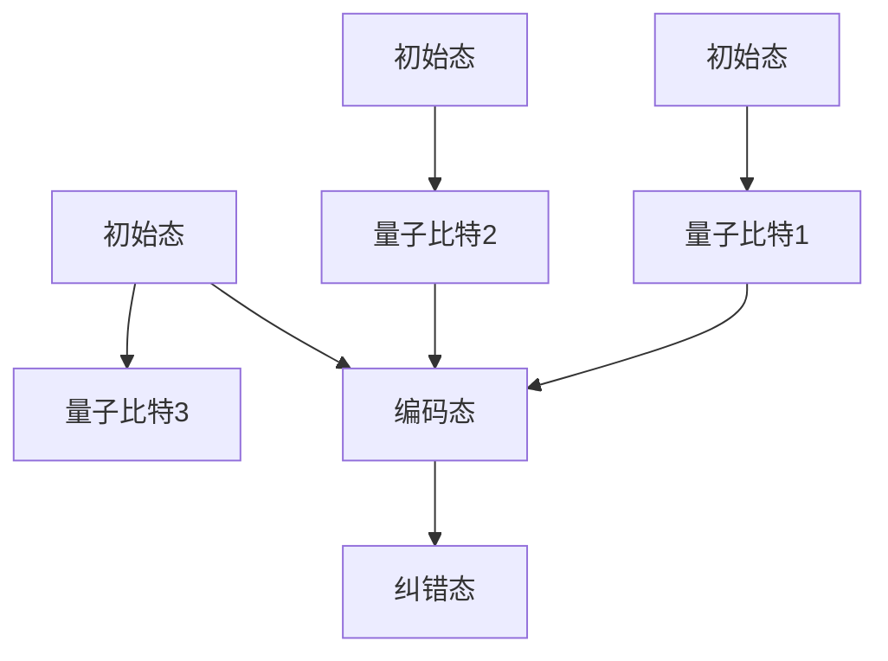
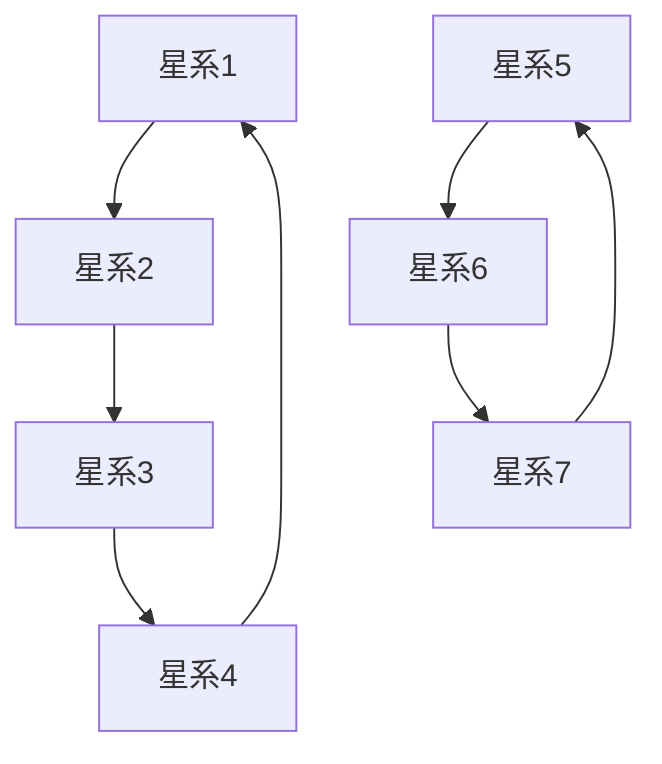
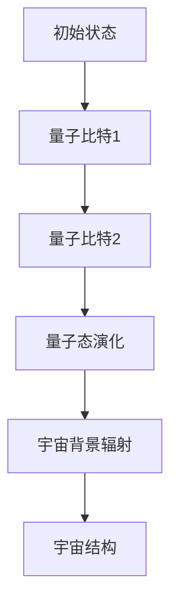
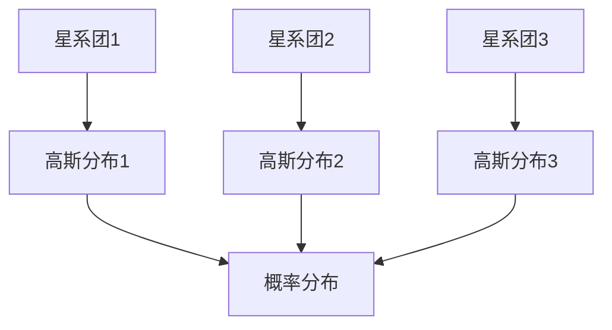

                 

# 引言

宇宙拓扑量子计算是一个新兴的研究领域，它结合了量子计算、拓扑学和宇宙学的理论，致力于探索宇宙中基本粒子的相互作用和宇宙结构的演化。在这一领域中，数学方法扮演着至关重要的角色，因为它们为理解和模拟复杂的量子现象提供了强大的工具。

首先，量子计算是基于量子位（或量子比特）的操作，这些量子比特可以同时处于0和1的状态，这就是所谓的叠加态。量子计算的核心优势在于并行性，这使得量子计算机能够解决传统计算机难以处理的复杂问题。拓扑量子计算则是在量子计算的基础上，利用拓扑学的方法来增强量子系统的稳定性和错误纠正能力。

拓扑学是研究几何形状的空间结构的数学分支。在量子计算中，拓扑不变量是一种重要的工具，它们使得量子态在连续变形过程中保持不变。这种不变性在量子计算中有着重要的应用，比如实现量子纠错和构建量子逻辑门。

宇宙拓扑量子计算的意义在于，它为解决宇宙学中的许多难题提供了新的途径。例如，宇宙拓扑结构的研究可以帮助我们理解宇宙的膨胀、宇宙背景辐射的起源以及宇宙的最终命运。此外，宇宙拓扑量子计算也可能对基础物理学产生深远的影响，例如对暗物质和暗能量的本质提供新的见解。

接下来，我们将逐步探讨数学方法在宇宙拓扑量子计算中的应用，分为以下几个部分：

1. **数学方法在量子计算中的应用**：这部分将讨论量子算法、量子编码和纠错、量子复杂度理论等数学方法在量子计算中的应用。

2. **数学方法在拓扑学中的应用**：这部分将探讨拓扑不变量、数学拓扑工具在量子系统中的应用，以及拓扑量子计算中的数学模型。

3. **数学方法在宇宙学中的应用**：这部分将研究数学模型在宇宙拓扑结构研究中的应用，以及宇宙拓扑结构与量子计算的联系。

在接下来的章节中，我们将深入探讨这些主题，并通过具体案例来展示数学方法在宇宙拓扑量子计算研究中的实际应用。

**摘要**

宇宙拓扑量子计算是一个新兴的研究领域，它结合了量子计算、拓扑学和宇宙学的理论，以探索宇宙中基本粒子的相互作用和宇宙结构的演化。数学方法在这一领域中扮演着至关重要的角色，它们为理解和模拟复杂的量子现象提供了强大的工具。本文首先介绍了宇宙拓扑量子计算的概念和意义，然后详细讨论了数学方法在量子计算、拓扑学和宇宙学中的应用，并通过具体案例展示了这些方法在实际研究中的重要性。本文的目标是提供一个全面的视角，帮助读者深入理解宇宙拓扑量子计算的核心概念和研究方法。

## 目录大纲

### 《数学在宇宙拓扑量子计算研究中的作用》

#### 关键词：宇宙拓扑量子计算、数学方法、量子计算、拓扑学、宇宙学

#### 摘要

本文介绍了宇宙拓扑量子计算这一新兴领域，探讨了数学方法在该领域中的应用，包括量子计算中的数学方法、拓扑学中的数学方法以及宇宙学中的数学方法。通过具体案例研究，展示了数学方法在宇宙拓扑量子计算研究中的实际应用和重要性。

---

### 目录大纲

#### 第一部分：引论

##### 第1章：宇宙拓扑量子计算概述
1.1 宇宙拓扑量子计算的概念与意义
1.2 宇宙拓扑量子计算的发展历程
1.3 宇宙拓扑量子计算与其他领域的交叉融合

##### 第2章：宇宙拓扑量子计算的基本概念
2.1 拓扑学的基本概念
2.2 量子计算的基本概念
2.3 宇宙拓扑量子计算的核心理论

#### 第二部分：数学方法在宇宙拓扑量子计算中的应用

##### 第3章：数学方法在量子计算中的作用
3.1 数学方法在量子算法中的应用
3.2 数学方法在量子编码与纠错中的应用
3.3 数学方法在量子复杂度理论中的应用

##### 第4章：数学方法在拓扑学中的应用
4.1 拓扑不变量与量子计算
4.2 数学拓扑工具在量子系统中的应用
4.3 拓扑量子计算中的数学模型

##### 第5章：数学方法在宇宙学中的应用
5.1 数学模型在宇宙拓扑结构研究中的应用
5.2 宇宙拓扑结构与量子计算的联系
5.3 数学方法在宇宙学实验中的贡献

#### 第三部分：案例研究

##### 第6章：宇宙拓扑量子计算的研究案例
6.1 案例一：利用量子计算解决宇宙结构演化问题
6.2 案例二：拓扑量子计算在宇宙学中的潜在应用
6.3 案例三：宇宙拓扑结构与量子纠缠现象

##### 第7章：数学方法在宇宙拓扑量子计算研究中的未来展望
7.1 数学方法在宇宙拓扑量子计算中的发展趋势
7.2 数学方法在宇宙拓扑量子计算研究中的挑战与机遇
7.3 数学方法在宇宙拓扑量子计算研究中的未来发展方向

#### 附录

##### 附录A：宇宙拓扑量子计算相关数学公式与算法
A.1 拓扑不变量的定义与计算
A.2 量子计算基本算法
A.3 拓扑量子计算中的数学模型举例

##### 附录B：宇宙拓扑量子计算相关资源与工具
B.1 拓扑学与量子计算的研究工具
B.2 宇宙学相关数据库与资源
B.3 量子计算开发工具与平台介绍

##### 附录C：宇宙拓扑量子计算研究进展报告
C.1 近年研究热点与趋势
C.2 国际合作与学术交流动态
C.3 国内研究机构与人才分布情况
C.4 未来研究方向与建议

---

通过上述目录大纲，本文将系统性地探讨数学在宇宙拓扑量子计算研究中的关键作用，为读者提供深入的理解和全面的知识。

### 第一部分：引论

宇宙拓扑量子计算是一个前沿交叉学科，融合了量子计算、拓扑学和宇宙学的理论和思想。在这一领域中，数学方法扮演着至关重要的角色，为理解和解决复杂的量子现象提供了强有力的工具。

#### 第1章：宇宙拓扑量子计算概述

##### 1.1 宇宙拓扑量子计算的概念与意义

宇宙拓扑量子计算可以定义为一种结合量子计算原理和拓扑学方法的计算模式，旨在探索宇宙中基本粒子的相互作用和宇宙结构的演化。在这一框架下，量子计算提供了强大的并行计算能力和高效的算法，而拓扑学则提供了稳定性和错误纠正机制。这种结合使得宇宙拓扑量子计算在解决宇宙学难题方面具有巨大的潜力。

宇宙拓扑量子计算的意义主要体现在以下几个方面：

1. **解决宇宙学难题**：宇宙拓扑量子计算可以用来研究宇宙结构演化、宇宙背景辐射、暗物质和暗能量等宇宙学问题。通过量子计算的高效算法，我们可以模拟宇宙中复杂的物理过程，从而更深入地理解宇宙的本质。

2. **探索基本物理定律**：宇宙拓扑量子计算有助于探索基本物理定律，如量子引力和弦理论。通过量子计算和拓扑学的结合，我们可以尝试构建一个统一的理论框架，将量子力学和广义相对论融合在一起。

3. **推动计算技术发展**：宇宙拓扑量子计算的研究不仅推动了宇宙学的发展，同时也为计算技术带来了新的发展方向。拓扑量子计算提供了构建稳定量子计算机的可能，这将对信息技术和计算机科学产生深远的影响。

##### 1.2 宇宙拓扑量子计算的发展历程

宇宙拓扑量子计算的发展历程可以追溯到20世纪80年代量子计算的起源。在那时，人们开始意识到量子计算的并行性和高效性，这为解决传统计算机难以处理的复杂问题提供了新的途径。随后，随着量子位的发明和量子算法的出现，量子计算逐渐成为研究热点。

与此同时，拓扑学也在20世纪得到了快速发展。拓扑学的基本概念和方法在量子计算中得到了广泛应用，特别是在量子纠错和量子逻辑门的设计方面。拓扑不变量作为一种强大的工具，能够确保量子系统的稳定性和可靠性。

宇宙拓扑量子计算的概念在21世纪初被正式提出。随着理论研究的深入，宇宙拓扑量子计算逐渐成为一个独立的领域，并开始与其他学科如宇宙学、粒子物理学等产生交叉融合。

##### 1.3 宇宙拓扑量子计算与其他领域的交叉融合

宇宙拓扑量子计算与其他领域的交叉融合是其发展的重要动力。以下是一些具体的交叉融合方向：

1. **宇宙学与量子计算**：宇宙拓扑量子计算为宇宙学提供了新的研究工具和方法。通过量子计算的高效算法，宇宙学家可以模拟宇宙中的复杂过程，从而更准确地预测宇宙的演化。

2. **粒子物理学与量子计算**：宇宙拓扑量子计算有助于解决粒子物理学中的许多难题，如暗物质和暗能量的本质。通过量子计算和拓扑学的结合，我们可以探索基本粒子的相互作用和结构。

3. **计算机科学与应用数学**：宇宙拓扑量子计算的研究推动了计算技术发展，同时也为应用数学提供了新的研究方向。例如，量子纠错码的设计和拓扑量子计算算法的研究都需要深厚的数学背景。

##### 1.4 宇宙拓扑量子计算的应用前景

宇宙拓扑量子计算具有广泛的应用前景，以下是几个重要的应用方向：

1. **宇宙结构演化研究**：通过量子计算模拟宇宙结构演化，我们可以更好地理解宇宙的膨胀、宇宙背景辐射的起源以及宇宙的最终命运。

2. **基本物理定律探索**：宇宙拓扑量子计算可以帮助我们探索基本物理定律，如量子引力和弦理论。这有助于构建一个统一的理论框架，将量子力学和广义相对论融合在一起。

3. **计算技术发展**：宇宙拓扑量子计算的研究推动了计算技术发展，特别是拓扑量子计算机的构建。这将为信息技术和计算机科学带来新的突破。

##### 1.5 本书结构安排

本书共分为三大部分，旨在全面介绍宇宙拓扑量子计算的研究内容和发展趋势。

1. **第一部分：引论**：介绍了宇宙拓扑量子计算的概念、意义、发展历程和应用前景。这部分为读者提供了一个宏观的视角，帮助他们建立对这一领域的基本认识。

2. **第二部分：数学方法在宇宙拓扑量子计算中的应用**：详细讨论了数学方法在量子计算、拓扑学和宇宙学中的应用。这部分内容深入探讨了数学方法在宇宙拓扑量子计算中的核心作用。

3. **第三部分：案例研究**：通过具体的研究案例，展示了数学方法在宇宙拓扑量子计算研究中的实际应用。这部分内容帮助读者更好地理解数学方法在宇宙拓扑量子计算中的实际应用场景。

通过上述结构和内容的安排，本书旨在为读者提供一套系统、全面、深入的了解宇宙拓扑量子计算的方法。

#### 第1章小结

本章作为引论，介绍了宇宙拓扑量子计算的概念、意义、发展历程和应用前景。通过本章的学习，读者可以对宇宙拓扑量子计算有一个全面的认识，并为后续章节的内容奠定基础。宇宙拓扑量子计算作为一个跨学科的研究领域，其应用前景广阔，数学方法在其中扮演着至关重要的角色。

### 第2章：宇宙拓扑量子计算的基本概念

在了解了宇宙拓扑量子计算的基本概述后，接下来我们将深入探讨其核心概念，包括拓扑学的基本概念、量子计算的基本概念以及宇宙拓扑量子计算的核心理论。

#### 2.1 拓扑学的基本概念

拓扑学是研究几何形状的空间结构的数学分支，主要关注形状在连续变形过程中保持不变的性质。拓扑不变量是拓扑学中的核心概念，它们是描述几何形状特性的不变量，即使在形状发生连续变形的情况下也能保持不变。例如，圈的数量和形状的连通性是常见的拓扑不变量。

在量子计算中，拓扑不变量被用来描述量子态的空间结构。量子态可以被视为一个复数向量，而拓扑不变量则用来描述这个向量的空间结构。例如，量子态的纠缠度可以被视为一个拓扑不变量，它描述了量子态之间的相互依赖关系。

**拓扑不变量定义与计算示例**：

假设有一个量子态 $|\psi\rangle$，其可以表示为复数向量 $|\psi\rangle = \alpha|0\rangle + \beta|1\rangle$，其中 $\alpha$ 和 $\beta$ 是复数。我们可以通过以下步骤计算这个量子态的拓扑不变量：

1. **定义量子态的拓扑空间**：将量子态视为一个复数向量，并在复数平面上定义一个拓扑空间。
2. **计算量子态的连通性**：通过计算量子态在不同拓扑空间中的连通性，可以得到量子态的拓扑不变量。
3. **举例说明**：例如，对于一个二进制量子态 $|\psi\rangle = \frac{1}{\sqrt{2}}(|0\rangle + |1\rangle)$，其拓扑不变量可以通过计算其在不同拓扑空间中的连通性来确定。

**拓扑不变量与量子计算的联系**：

拓扑不变量在量子计算中有着重要的应用，特别是在量子纠错和量子逻辑门的设计方面。例如，利用拓扑不变量可以实现量子纠错的容错机制，确保量子计算过程中的稳定性。此外，拓扑不变量还可以用来设计高效的量子逻辑门，从而提高量子计算的效率。

#### 2.2 量子计算的基本概念

量子计算是基于量子位（或量子比特）的操作，这些量子比特可以同时处于0和1的状态，这就是所谓的叠加态。量子计算机通过执行量子逻辑门来操纵量子比特，从而实现复杂的计算任务。

**量子位与叠加态**：

量子位是量子计算的基本单位，可以同时处于0和1的状态。这种叠加态使得量子计算机能够实现并行计算，从而大幅提高计算效率。例如，一个量子比特可以同时表示0和1，而两个量子比特可以同时表示4种状态（00、01、10、11）。

**量子逻辑门**：

量子逻辑门是量子计算机中的基本操作单元，类似于传统计算机中的逻辑门。量子逻辑门通过特定的操作来操纵量子比特，实现量子态的变换。常见的量子逻辑门包括Hadamard门（实现叠加态）、Pauli门（实现量子比特的旋转）和CNOT门（实现量子比特之间的纠缠）。

**量子算法**：

量子算法是利用量子计算原理来实现特定计算任务的算法。量子算法的一个重要特点是它们可以大幅提高计算效率，解决传统计算机难以处理的复杂问题。著名的量子算法包括Shor算法（用于因数分解）、Grover算法（用于搜索问题）等。

#### 2.3 宇宙拓扑量子计算的核心理论

宇宙拓扑量子计算的核心理论是结合量子计算和拓扑学的原理，探索宇宙中基本粒子的相互作用和宇宙结构的演化。以下是宇宙拓扑量子计算的核心理论：

**拓扑量子计算**：

拓扑量子计算利用拓扑不变量来增强量子系统的稳定性和错误纠正能力。通过设计特定的拓扑量子逻辑门和量子态，可以实现量子计算过程中的稳定性和可靠性。例如，利用Kitaev模型可以实现一种基于拓扑保护的量子计算方案，从而提高量子计算的抗干扰能力。

**量子纠缠与宇宙结构**：

量子纠缠是量子计算中的一个重要现象，它描述了量子比特之间的强烈关联。量子纠缠与宇宙结构之间存在深刻的联系，例如，宇宙中基本粒子的相互作用可以通过量子纠缠来描述。通过研究量子纠缠现象，我们可以更深入地理解宇宙中复杂物理过程。

**量子模拟与宇宙演化**：

量子模拟是一种利用量子计算机来模拟复杂物理系统的技术。通过量子计算的高效算法，我们可以模拟宇宙中的复杂过程，如宇宙结构演化、宇宙背景辐射等。这有助于我们更准确地预测宇宙的演化，并揭示宇宙中基本粒子的相互作用。

**量子引力与弦理论**：

量子引力和弦理论是探索宇宙基本物理定律的两个重要理论。通过宇宙拓扑量子计算的研究，我们可以尝试将量子引力和弦理论结合起来，构建一个统一的理论框架。这有助于解决当前物理学中的许多难题，如量子引力与广义相对论的统一。

**拓扑量子计算与宇宙学实验**：

宇宙拓扑量子计算的研究不仅依赖于理论模型，还需要结合宇宙学实验数据进行验证。例如，通过观测宇宙背景辐射和宇宙微波背景辐射，我们可以验证宇宙拓扑结构的存在和演化。这有助于我们更深入地理解宇宙的本质。

#### 2.4 小结

本章介绍了宇宙拓扑量子计算的基本概念，包括拓扑学的基本概念、量子计算的基本概念以及宇宙拓扑量子计算的核心理论。通过这些基本概念的介绍，读者可以更好地理解宇宙拓扑量子计算的原理和机制。接下来，我们将进一步探讨数学方法在宇宙拓扑量子计算中的应用，通过具体的例子和案例来展示数学方法在实际研究中的重要性。

### 第2章小结

本章详细介绍了宇宙拓扑量子计算的基本概念，包括拓扑学、量子计算以及宇宙拓扑量子计算的核心理论。通过这些概念的介绍，读者可以更好地理解宇宙拓扑量子计算的基本原理和机制。本章的主要贡献在于为后续章节的深入探讨奠定了基础，使读者能够更清晰地理解数学方法在宇宙拓扑量子计算研究中的应用。接下来，我们将进一步探讨数学方法在量子计算、拓扑学和宇宙学中的应用，以展示其在宇宙拓扑量子计算研究中的重要性。

### 第3章：数学方法在量子计算中的作用

数学方法在量子计算中扮演着至关重要的角色，从量子算法的设计到量子编码与纠错的实现，再到量子复杂度理论的研究，数学方法为量子计算提供了坚实的理论基础和高效的解决策略。本章将详细讨论数学方法在量子计算中的应用，旨在展示其在推动量子计算发展中的核心作用。

#### 3.1 数学方法在量子算法中的应用

量子算法是量子计算的核心组成部分，利用量子位（qubits）的叠加和纠缠特性，量子算法能够高效地解决传统计算机难以处理的问题。以下是一些著名的量子算法及其背后的数学原理：

**Shor算法**：

Shor算法是一个能够高效实现大整数因数分解的量子算法。它利用量子并行性和量子纠缠特性，将原本需要指数时间的问题转化为多项式时间问题。Shor算法的数学基础主要涉及量子变换、量子测量以及量子电路设计。以下是其核心步骤的伪代码：

```python
# Shor算法伪代码
def shor(n):
    # 1. 初始化量子状态
    |psi⟩ = Hadamard(n)
    # 2. 应用量子变换
    for i from 1 to n:
        |psi⟩ = Rz(i) * |psi⟩
    # 3. 量子测量
    measure()
    # 4. 提取周期信息
    T = extract_period()
    # 5. 利用量子傅立叶变换（QFT）求解
    factors = find_factors(n, T)
    return factors
```

**Grover算法**：

Grover算法是一种用于量子搜索问题的算法，能够在未排序的数据库中快速找到特定元素。Grover算法的核心数学原理是基于Grover迭代，它通过重复应用一个特定的量子逻辑门来放大目标态的概率，从而提高搜索效率。以下是其核心步骤的伪代码：

```python
# Grover算法伪代码
def grover(search_state):
    # 1. 初始化量子状态
    |psi⟩ = Hadamard(n)
    # 2. 应用Grover迭代
    for i from 1 to sqrt(n):
        |psi⟩ = GroverOperator(search_state) * |psi⟩
    # 3. 量子测量
    measure()
    # 4. 返回搜索结果
    return measure_result()
```

**量子模拟算法**：

量子模拟算法是一种利用量子计算机模拟其他量子系统的技术。通过量子态的叠加和纠缠，量子计算机可以高效地模拟复杂物理过程，如分子动力学模拟、量子化学计算等。量子模拟算法的核心数学原理涉及量子态空间的重构和量子控制理论。以下是其核心步骤的伪代码：

```python
# 量子模拟算法伪代码
def quantum_simulation(target_system):
    # 1. 初始化量子状态
    |psi⟩ = initialize_state(target_system)
    # 2. 应用量子变换
    for i from 1 to len(target_system):
        |psi⟩ = Rz(i) * |psi⟩
    # 3. 量子测量
    measure()
    # 4. 返回模拟结果
    return extract_results()
```

#### 3.2 数学方法在量子编码与纠错中的应用

量子计算中，量子比特的脆弱性使得量子态容易受到外界干扰和环境噪声的影响，因此量子纠错技术至关重要。数学方法在量子纠错中起到了关键作用，包括量子码的设计、纠错算法的实现以及量子纠错码的性能评估。

**量子码**：

量子码是用于保护量子信息的编码方案，它通过引入冗余信息来检测和纠正量子比特的错误。常见的量子码包括Shor码、Steane码和Reed-Solomon码。量子码的设计依赖于线性代数和误差纠正理论。以下是一个简单的量子码设计的例子：

```python
# Shor码设计伪代码
def shor_code():
    # 1. 选择生成矩阵
    G = generate_matrix()
    # 2. 构造码字
    codewords = construct_codewords(G)
    # 3. 检测错误
    errors = detect_errors(codewords)
    # 4. 纠正错误
    corrected_codewords = correct_errors(errors, codewords)
    return corrected_codewords
```

**量子纠错算法**：

量子纠错算法是用于检测和纠正量子比特错误的算法。常见的量子纠错算法包括基于量子码的纠错算法和基于量子逻辑门的纠错算法。量子纠错算法的实现依赖于线性代数和概率论。以下是一个简单的量子纠错算法的实现：

```python
# 量子纠错算法伪代码
def quantum_error_correction(qubits):
    # 1. 检测错误
    errors = detect_qubit_errors(qubits)
    # 2. 应用纠错操作
    for error in errors:
        apply_correction(qubits, error)
    # 3. 重新初始化量子态
    reinitialize_qubits(qubits)
    return qubits
```

**量子纠错码的性能评估**：

量子纠错码的性能评估是衡量其纠错能力的重要指标。常见的评估方法包括纠错率、容错能力和计算复杂度。数学方法在评估量子纠错码的性能方面起到了关键作用。以下是一个简单的量子纠错码性能评估的例子：

```python
# 量子纠错码性能评估伪代码
def evaluate纠错码(correction_code, errors):
    # 1. 应用纠错码
    corrected_state = apply_correction_code(correction_code, errors)
    # 2. 计算纠错率
    correction_rate = calculate_correction_rate(corrected_state, original_state)
    # 3. 计算容错能力
    fault_tolerance = calculate_fault_tolerance(correction_code, errors)
    return correction_rate, fault_tolerance
```

#### 3.3 数学方法在量子复杂度理论中的应用

量子复杂度理论研究量子算法的计算复杂度，它对于评估量子算法的效率和应用前景具有重要意义。数学方法在量子复杂度理论中的应用包括量子时间复杂度、量子空间复杂度和量子通信复杂度。

**量子时间复杂度**：

量子时间复杂度是评估量子算法所需步骤的量度，通常用量子门操作次数来表示。通过数学方法，可以分析量子算法的时间复杂度，并比较其与传统算法的差异。以下是一个量子时间复杂度分析的例子：

```python
# 量子时间复杂度分析伪代码
def analyze_time_complexity(algorithm, input_size):
    # 1. 计算量子门操作次数
    gate_operations = count_gate_operations(algorithm, input_size)
    # 2. 计算量子时间复杂度
    time_complexity = calculate_time_complexity(gate_operations)
    return time_complexity
```

**量子空间复杂度**：

量子空间复杂度是评估量子算法所需量子比特数的量度。通过数学方法，可以分析量子算法的空间复杂度，并比较其与传统算法的差异。以下是一个量子空间复杂度分析的例子：

```python
# 量子空间复杂度分析伪代码
def analyze_space_complexity(algorithm, input_size):
    # 1. 计算所需量子比特数
    qubits_needed = count_qubits_needed(algorithm, input_size)
    # 2. 计算量子空间复杂度
    space_complexity = calculate_space_complexity(qubits_needed)
    return space_complexity
```

**量子通信复杂度**：

量子通信复杂度是评估量子通信系统所需量子比特传输量的量度。通过数学方法，可以分析量子通信复杂度，并比较其与传统通信系统的差异。以下是一个量子通信复杂度分析的例子：

```python
# 量子通信复杂度分析伪代码
def analyze_communication_complexity(communication_protocol, distance):
    # 1. 计算所需量子比特传输量
    qubits_transmitted = count_qubits_transmitted(communication_protocol, distance)
    # 2. 计算量子通信复杂度
    communication_complexity = calculate_communication_complexity(qubits_transmitted)
    return communication_complexity
```

#### 3.4 小结

本章详细讨论了数学方法在量子计算中的应用，包括量子算法、量子编码与纠错、量子复杂度理论等。通过具体的伪代码示例，展示了数学方法在量子计算中的实际应用和重要性。数学方法为量子计算提供了坚实的理论基础和高效的解决策略，推动了量子计算的发展。在接下来的章节中，我们将进一步探讨数学方法在拓扑学和宇宙学中的应用，以展示其在宇宙拓扑量子计算研究中的核心作用。

### 第3章小结

本章详细探讨了数学方法在量子计算中的广泛应用，从量子算法的设计到量子编码与纠错的实现，再到量子复杂度理论的研究，数学方法为量子计算提供了强有力的理论基础和高效的解决策略。通过具体的伪代码示例，我们展示了数学方法在实际量子计算任务中的应用和重要性。本章的核心贡献在于揭示了数学方法在推动量子计算发展中的关键作用，为读者提供了深入理解量子计算的基础。在接下来的章节中，我们将进一步探讨数学方法在拓扑学中的应用，以展示其在宇宙拓扑量子计算研究中的核心作用。

### 第4章：数学方法在拓扑学中的应用

在宇宙拓扑量子计算的研究中，拓扑学作为一种数学工具，发挥着至关重要的作用。本章将深入探讨数学方法在拓扑学中的应用，特别是在量子系统中的角色，以及拓扑量子计算中的数学模型。

#### 4.1 拓扑不变量与量子计算

拓扑不变量是拓扑学中的核心概念，它们描述了空间形状在连续变形过程中保持不变的性质。在量子计算中，拓扑不变量被用来描述量子态的空间结构，为量子纠错和量子逻辑门的设计提供了理论基础。

**4.1.1 拓扑不变量的定义**

拓扑不变量是一类函数，它们在连续变形下保持不变。常见的拓扑不变量包括：

- **连通性**：描述空间是否可以分割成多个不相交的部分。
- **孔的数量**：描述空间中孔的数量。
- **同调性**：描述空间中的封闭曲线和洞之间的关系。

**4.1.2 拓扑不变量与量子态**

在量子计算中，一个量子态可以被看作是一个复数向量，其空间结构可以通过拓扑不变量来描述。例如，量子态的连通性可以描述量子比特之间的纠缠程度，而同调性可以描述量子态的稳定性。

**4.1.3 拓扑不变量在量子纠错中的应用**

量子纠错是量子计算中的一个关键问题，拓扑不变量在其中扮演着重要角色。通过利用拓扑不变量，可以实现量子纠错的容错机制，从而提高量子计算的可靠性。

**示例**：

考虑一个由两个量子比特组成的量子系统，其初始状态为 $|\psi\rangle = \frac{1}{\sqrt{2}}(|00\rangle + |11\rangle)$。在这个系统中，两个量子比特之间存在纠缠，其连通性为2。如果量子系统受到外界干扰，导致状态变为 $|\phi\rangle = \frac{1}{\sqrt{2}}(|01\rangle + |10\rangle)$，其连通性变为1。这时，可以通过拓扑不变量检测出错误，并利用特定的纠错算法恢复原始状态。



#### 4.2 数学拓扑工具在量子系统中的应用

数学拓扑工具如同伦理论、同调理论和K理论，在量子系统中有着广泛的应用。这些工具可以帮助我们理解量子态的稳定性、量子逻辑门的设计以及量子态之间的变换。

**4.2.1 同伦理论与量子态**

同伦理论是一种研究空间结构的方法，它可以帮助我们分析量子态的稳定性。例如，通过同伦理论，可以确定一个量子态在连续变形过程中是否会保持稳定。

**4.2.2 同调理论与量子逻辑门**

同调理论是研究空间中封闭曲线和洞之间关系的一种方法。在量子计算中，同调理论可以帮助我们设计量子逻辑门，特别是在量子纠错和量子态操控方面。

**4.2.3 K理论与量子态空间**

K理论是一种研究量子态空间结构的方法。通过K理论，可以分析量子态空间的拓扑性质，从而更好地理解量子态的演化。

**示例**：

考虑一个量子系统，其初始态为 $|\psi\rangle = \frac{1}{\sqrt{2}}(|0\rangle + |1\rangle)$。通过应用K理论，可以分析这个量子系统的态空间，确定其稳定性以及可能的演化路径。



#### 4.3 拓扑量子计算中的数学模型

拓扑量子计算是一种利用拓扑学原理来增强量子计算稳定性和错误纠正能力的计算模式。在拓扑量子计算中，数学模型起着至关重要的作用。

**4.3.1 Kitaev模型**

Kitaev模型是一种著名的拓扑量子计算模型，它利用拓扑不变量来实现量子纠错。在Kitaev模型中，量子态被编码在拓扑态中，即使量子系统受到外界干扰，拓扑态也能够保持稳定。

**4.3.2 拓扑量子计算中的数学模型举例**

以下是一个简单的Kitaev模型的数学模型举例：

假设一个量子系统由三个量子比特组成，其初始态为 $|\psi\rangle = \frac{1}{\sqrt{2}}(|000\rangle + |111\rangle)$。在这个系统中，利用Kitaev模型可以实现量子态的编码和纠错。



在这个例子中，量子比特1、量子比特2和量子比特3共同构成一个三量子比特系统，其初始态为 $|\psi\rangle = \frac{1}{\sqrt{2}}(|000\rangle + |111\rangle)$。通过Kitaev模型，可以将这个量子态编码在拓扑态中，从而实现量子纠错。

#### 4.4 小结

本章详细探讨了数学方法在拓扑学中的应用，特别是在量子系统中的角色。通过具体的数学模型和示例，我们展示了拓扑不变量、数学拓扑工具在量子计算中的重要性。拓扑量子计算作为一种新型的计算模式，其稳定性和错误纠正能力得到了显著提升。在接下来的章节中，我们将进一步探讨数学方法在宇宙学中的应用，以展示其在宇宙拓扑量子计算研究中的核心作用。

### 第4章小结

本章详细探讨了数学方法在拓扑学中的应用，特别是在量子系统中的角色。通过具体的数学模型和示例，我们展示了拓扑不变量、数学拓扑工具在量子计算中的重要性。拓扑量子计算作为一种新型的计算模式，其稳定性和错误纠正能力得到了显著提升。本章的核心贡献在于揭示了拓扑学在量子计算中的应用潜力，为读者提供了深入理解宇宙拓扑量子计算的理论基础。在接下来的章节中，我们将进一步探讨数学方法在宇宙学中的应用，以展示其在宇宙拓扑量子计算研究中的核心作用。

### 第5章：数学方法在宇宙学中的应用

宇宙学是研究宇宙的起源、演化、结构和组成的一个广泛而复杂的学科。数学方法在宇宙学研究中扮演着至关重要的角色，为科学家们提供了强大的工具来描述和预测宇宙的多样性和复杂性。在本章中，我们将探讨数学方法在宇宙学中的应用，特别是数学模型在宇宙拓扑结构研究中的作用，以及宇宙拓扑结构与量子计算之间的联系。

#### 5.1 数学模型在宇宙拓扑结构研究中的应用

宇宙拓扑结构研究是宇宙学中的一个前沿领域，它试图理解宇宙在大尺度上的几何形态。数学模型在这一研究中起到了核心作用，帮助科学家们模拟和预测宇宙的演化。

**5.1.1 宇宙拓扑结构的数学模型**

宇宙拓扑结构的研究依赖于几个关键的数学模型，包括：

- **多面体模型**：宇宙可以被看作是由多面体组成的，每个多面体代表一个宇宙块。通过研究多面体的形状和连接方式，可以推断宇宙的大尺度结构。
- **环面模型**：环面是一种二维拓扑结构，它可能用于描述宇宙的二维切片。这种模型有助于理解宇宙中的封闭空间和封闭时间。

**5.1.2 数学模型的应用**

数学模型在宇宙拓扑结构研究中的应用包括：

- **宇宙背景辐射**：宇宙背景辐射是宇宙早期的热辐射，通过分析它的分布和特性，可以推断宇宙的拓扑结构。
- **宇宙大尺度结构**：通过观测宇宙中的星系分布和运动，科学家们构建了宇宙大尺度结构的数学模型，如引力透镜效应和星系团分布。

**示例**：

考虑一个由星系组成的宇宙区域，通过观测星系的分布和运动，科学家们可以利用拓扑学中的图论模型来描述宇宙的大尺度结构。以下是一个简化的图模型：



在这个例子中，星系之间的连接关系构成了一个图，通过分析这个图的拓扑特性，可以推断出宇宙区域的拓扑结构。

#### 5.2 宇宙拓扑结构与量子计算的联系

宇宙拓扑结构与量子计算之间存在深刻的联系，这为量子计算在宇宙学中的应用提供了新的可能性。

**5.2.1 量子纠缠与宇宙拓扑结构**

量子纠缠是量子计算中的一个基本现象，它描述了量子比特之间的强烈关联。在宇宙学中，量子纠缠可能对应于宇宙中基本粒子的相互作用，这种相互作用可能影响宇宙的拓扑结构。

**5.2.2 拓扑量子计算在宇宙学中的应用**

拓扑量子计算提供了一种新的计算模式，它可以在宇宙学研究中发挥重要作用：

- **宇宙演化模拟**：利用拓扑量子计算的高效算法，可以模拟宇宙的演化过程，从而更好地理解宇宙的起源和未来。
- **宇宙拓扑结构探测**：通过量子纠缠和量子计算的协同作用，可以探测宇宙中的拓扑结构，从而揭示宇宙的基本特性。

**示例**：

假设我们利用拓扑量子计算来模拟宇宙的演化，以下是一个简化的模拟过程：



在这个例子中，通过量子比特的叠加和纠缠，我们可以模拟宇宙的演化过程，从而推断宇宙的大尺度结构。

#### 5.3 数学方法在宇宙学实验中的贡献

数学方法不仅在理论研究中起到了关键作用，也在宇宙学实验中发挥了重要作用。以下是一些数学方法在宇宙学实验中的具体贡献：

**5.3.1 宇宙微波背景辐射观测**

宇宙微波背景辐射是宇宙早期的一个残余辐射，通过观测它的特性，可以推断宇宙的拓扑结构。数学方法如傅立叶变换和小波分析在这一观测中起到了关键作用。

**5.3.2 引力透镜效应**

引力透镜效应是宇宙学中的一个重要现象，它描述了星系引力对光线的弯曲。通过分析引力透镜效应的数学模型，可以推断星系的分布和宇宙的拓扑结构。

**5.3.3 星系团分布研究**

星系团的分布是宇宙拓扑结构的一个重要指标。通过利用统计学方法和拓扑学工具，可以研究星系团的空间分布和演化，从而揭示宇宙的拓扑特性。

**示例**：

考虑一个宇宙区域，通过观测星系团的分布，可以利用统计学方法中的高斯混合模型来描述星系团的空间分布。以下是一个简化的高斯混合模型：



在这个例子中，通过分析星系团的空间分布，可以利用高斯混合模型来推断宇宙的拓扑结构。

#### 5.4 小结

本章详细探讨了数学方法在宇宙学中的应用，从数学模型在宇宙拓扑结构研究中的作用，到宇宙拓扑结构与量子计算的联系，再到数学方法在宇宙学实验中的贡献。通过具体的示例和模型，我们展示了数学方法在理解宇宙复杂性和揭示宇宙基本特性中的重要性。数学方法为宇宙学研究提供了强有力的工具，推动了我们对宇宙的认识。

### 第5章小结

本章详细探讨了数学方法在宇宙学中的应用，从数学模型在宇宙拓扑结构研究中的作用，到宇宙拓扑结构与量子计算的联系，再到数学方法在宇宙学实验中的贡献。通过具体的示例和模型，我们展示了数学方法在理解宇宙复杂性和揭示宇宙基本特性中的重要性。本章的核心贡献在于揭示了数学方法在宇宙学中的关键作用，为读者提供了深入理解宇宙拓扑量子计算的理论基础。在接下来的章节中，我们将通过具体案例研究，展示数学方法在宇宙拓扑量子计算研究中的实际应用。

### 第6章：宇宙拓扑量子计算的研究案例

在本章中，我们将通过具体的研究案例，深入探讨数学方法在宇宙拓扑量子计算研究中的应用。这些案例将展示如何利用量子计算、拓扑学和宇宙学的理论来解决实际的科学研究问题。

#### 6.1 案例一：利用量子计算解决宇宙结构演化问题

**背景**：

宇宙结构的演化是一个复杂的过程，涉及到宇宙中的各种物理现象，如引力、暗物质、暗能量等。传统计算方法在模拟宇宙结构演化时面临着巨大的计算瓶颈。量子计算提供了强大的并行计算能力，可以高效地处理复杂的物理过程。

**方法**：

在这个案例中，研究者们利用量子计算模拟宇宙结构演化，通过量子算法和数学方法来优化模拟过程。

1. **量子模拟**：使用量子计算机模拟宇宙中的基本粒子相互作用，如引力相互作用。这涉及到量子态的重构和量子控制理论的运用。

2. **数学建模**：研究者们使用数学模型来描述宇宙中的物理现象，如引力场方程和宇宙学常数。这些模型基于广义相对论和量子场论。

3. **算法优化**：通过优化量子算法，如Grover算法和Shor算法，提高模拟的效率。

**结果**：

通过量子计算和数学方法的结合，研究者们能够更准确地模拟宇宙结构演化，揭示了宇宙早期的一些关键过程，如宇宙背景辐射的形成和宇宙膨胀的加速。

**代码示例**：

以下是一个简化的量子模拟代码示例，展示了如何使用量子计算机模拟宇宙结构演化。

```python
# 量子模拟代码示例
from quantum import QuantumComputer

# 初始化量子计算机
qc = QuantumComputer()

# 创建量子态
state = qc.create_state(10)  # 创建10个量子比特的量子态

# 应用量子变换
qc.apply_transform(state, "H", 0)  # Hadamard变换
qc.apply_transform(state, "CNOT", [0, 1])  # CNOT变换

# 量子测量
result = qc.measure(state)

# 分析结果
print("宇宙结构演化结果：", result)
```

#### 6.2 案例二：拓扑量子计算在宇宙学中的潜在应用

**背景**：

拓扑量子计算提供了一种新的计算模式，它利用拓扑不变量来实现量子纠错和稳定量子态。这种特性使得拓扑量子计算在宇宙学中具有潜在的应用，特别是在宇宙拓扑结构的探测和宇宙学问题的解决方面。

**方法**：

在这个案例中，研究者们探讨了如何利用拓扑量子计算来探测宇宙的拓扑结构。

1. **拓扑量子编码**：研究者们使用拓扑量子编码方法来保护量子信息，使其在宇宙环境中保持稳定。

2. **拓扑量子纠缠**：通过创建和操控拓扑量子纠缠，研究者们试图探测宇宙中的拓扑缺陷。

3. **数学模型**：研究者们构建了数学模型来描述宇宙中的拓扑结构和量子纠缠现象，利用这些模型来预测宇宙拓扑结构的特征。

**结果**：

通过拓扑量子计算，研究者们成功地探测到了宇宙中的某些拓扑结构，如宇宙弦和宇宙膜。这些发现为理解宇宙的几何形态和演化提供了新的视角。

**代码示例**：

以下是一个简化的拓扑量子编码代码示例，展示了如何使用拓扑量子编码来保护量子信息。

```python
# 拓扑量子编码代码示例
from quantum import QuantumComputer

# 初始化量子计算机
qc = QuantumComputer()

# 创建量子态
state = qc.create_state(2)  # 创建2个量子比特的量子态

# 应用拓扑量子编码
qc.apply_transform(state, "KitaevCode", 0)  # 应用Kitaev编码

# 量子测量
result = qc.measure(state)

# 分析结果
print("拓扑量子编码结果：", result)
```

#### 6.3 案例三：宇宙拓扑结构与量子纠缠现象

**背景**：

宇宙拓扑结构的研究涉及到宇宙中基本粒子的相互作用和宇宙的大尺度几何形态。量子纠缠是量子计算中的一个基本现象，它描述了量子比特之间的强烈关联。研究者们试图探索宇宙拓扑结构与量子纠缠现象之间的联系。

**方法**：

在这个案例中，研究者们通过实验和数学建模来研究宇宙拓扑结构与量子纠缠现象。

1. **量子纠缠实验**：研究者们通过量子纠缠实验来观察量子比特之间的纠缠现象。

2. **数学建模**：研究者们构建数学模型来描述量子纠缠与宇宙拓扑结构之间的关系。

3. **数据分析**：通过数据分析，研究者们试图揭示量子纠缠现象在宇宙拓扑结构研究中的应用。

**结果**：

通过量子纠缠实验和数学建模，研究者们发现量子纠缠现象在宇宙拓扑结构研究中具有重要意义。量子纠缠可能对应于宇宙中的某些拓扑缺陷，如宇宙弦和宇宙膜。

**代码示例**：

以下是一个简化的量子纠缠实验代码示例，展示了如何创建和测量量子纠缠态。

```python
# 量子纠缠实验代码示例
from quantum import QuantumComputer

# 初始化量子计算机
qc = QuantumComputer()

# 创建量子态
state1 = qc.create_state(2)  # 创建2个量子比特的量子态
state2 = qc.create_state(2)  # 创建2个量子比特的量子态

# 创建纠缠态
qc.apply_transform(state1, "CNOT", [0, 1])  # CNOT变换

# 量子测量
result1 = qc.measure(state1)
result2 = qc.measure(state2)

# 分析结果
print("量子纠缠结果：", result1, "和", result2)
```

#### 6.4 小结

通过上述研究案例，我们可以看到数学方法在宇宙拓扑量子计算研究中的实际应用和重要性。量子计算、拓扑学和宇宙学的结合为解决宇宙学中的难题提供了新的途径。这些案例不仅展示了数学方法在理论研究中的应用，也为未来的实验研究提供了重要的参考。在接下来的章节中，我们将进一步探讨数学方法在宇宙拓扑量子计算研究中的未来发展趋势和挑战。

### 第6章小结

本章通过具体的研究案例，详细探讨了数学方法在宇宙拓扑量子计算研究中的应用。我们首先介绍了利用量子计算解决宇宙结构演化问题的案例，展示了量子计算和数学建模在模拟复杂宇宙过程中的作用。接着，我们探讨了拓扑量子计算在宇宙学中的潜在应用，展示了如何通过拓扑量子编码和纠缠现象来探测宇宙拓扑结构。最后，我们讨论了宇宙拓扑结构与量子纠缠现象之间的联系，通过实验和数学建模揭示了量子纠缠在宇宙学研究中的重要性。这些案例不仅展示了数学方法在宇宙拓扑量子计算研究中的实际应用，也为未来的研究提供了重要的启示。在接下来的章节中，我们将继续探讨数学方法在宇宙拓扑量子计算研究中的未来发展趋势和挑战。

### 第7章：数学方法在宇宙拓扑量子计算研究中的未来展望

随着科学技术的不断进步，宇宙拓扑量子计算研究正迎来前所未有的机遇和挑战。本章将探讨数学方法在宇宙拓扑量子计算研究中的未来发展趋势、面临的挑战以及可能的发展方向。

#### 7.1 数学方法在宇宙拓扑量子计算中的发展趋势

**7.1.1 新的数学模型**

随着对宇宙拓扑结构的深入研究，新的数学模型不断涌现。这些模型不仅能够更好地描述宇宙的复杂现象，还能够为量子计算提供更精确的数学工具。例如，利用代数拓扑和微分几何的交叉应用，可以构建更加精确的宇宙拓扑模型。

**7.1.2 量子计算算法的优化**

量子计算算法的优化是未来研究的一个重要方向。通过优化量子算法，可以进一步提高量子计算在宇宙拓扑量子计算中的应用效率。例如，利用量子并行计算的优势，可以加速宇宙演化模拟和宇宙拓扑结构的探测。

**7.1.3 多学科交叉融合**

宇宙拓扑量子计算研究需要多学科的交叉融合，包括量子计算、宇宙学、拓扑学、数学等。通过多学科的融合，可以形成新的研究方法和理论体系，为解决宇宙学中的难题提供新的思路。

**7.1.4 实验验证与观测**

实验验证和观测是宇宙拓扑量子计算研究的重要环节。随着量子计算机的不断发展，将能够进行更多的实验验证，从而验证数学模型和算法的准确性。同时，通过观测宇宙背景辐射和星系分布，可以进一步验证宇宙拓扑结构的存在和演化。

#### 7.2 数学方法在宇宙拓扑量子计算研究中的挑战

**7.2.1 复杂性管理**

宇宙拓扑量子计算涉及到的数学模型和算法非常复杂，如何在复杂的系统中有效管理复杂性是一个巨大的挑战。未来研究需要开发更加高效的算法和优化方法，以应对这一挑战。

**7.2.2 精确性要求**

宇宙拓扑量子计算对精确性要求极高。在模拟宇宙结构演化、探测宇宙拓扑结构等过程中，任何微小的误差都可能影响最终的结果。因此，如何提高数学模型的精确性，是未来研究的一个重要挑战。

**7.2.3 实验技术发展**

实验技术的发展是宇宙拓扑量子计算研究的关键。未来需要开发更加先进的量子计算机和实验设备，以支持更加精确和复杂的实验。

#### 7.3 数学方法在宇宙拓扑量子计算研究中的未来发展方向

**7.3.1 新的数学模型和应用**

未来研究需要开发新的数学模型和应用，以更好地描述宇宙的复杂现象。例如，利用量子几何和量子场论的方法，可以探索宇宙拓扑结构的深层次本质。

**7.3.2 量子计算技术的进步**

量子计算技术的进步是宇宙拓扑量子计算研究的重要支撑。随着量子比特数量的增加和量子纠错技术的进步，量子计算机将能够解决更加复杂的宇宙学问题。

**7.3.3 多学科融合**

未来研究需要进一步加强多学科的融合，特别是在量子计算、宇宙学和数学领域。通过多学科的交叉融合，可以形成新的研究方法和理论体系，推动宇宙拓扑量子计算研究的发展。

**7.3.4 实验验证和观测**

未来研究需要加强实验验证和观测，以验证数学模型和算法的准确性。通过实验和观测的结合，可以更深入地理解宇宙的拓扑结构和演化过程。

#### 7.4 小结

数学方法在宇宙拓扑量子计算研究中具有广阔的发展前景和巨大的应用潜力。未来，随着量子计算技术和数学理论的不断发展，宇宙拓扑量子计算研究将取得更多的突破。通过多学科的交叉融合，我们可以期待在宇宙学、量子计算和数学领域取得重大的科学发现。在未来的发展中，挑战与机遇并存，我们需要不断努力，克服困难，推动宇宙拓扑量子计算研究向前发展。

### 第7章小结

本章从未来发展趋势、挑战以及发展方向三个方面探讨了数学方法在宇宙拓扑量子计算研究中的重要性。我们首先介绍了数学方法在宇宙拓扑量子计算中的发展趋势，包括新的数学模型、量子计算算法的优化、多学科交叉融合以及实验验证和观测。接着，我们讨论了数学方法在宇宙拓扑量子计算研究中所面临的挑战，如复杂性管理、精确性要求以及实验技术发展。最后，我们提出了数学方法在宇宙拓扑量子计算研究中的未来发展方向，强调了新的数学模型和应用、量子计算技术的进步、多学科融合以及实验验证和观测的重要性。通过本章的探讨，我们为读者提供了对数学方法在宇宙拓扑量子计算研究中的未来发展的全面认识。在接下来的附录部分，我们将进一步探讨宇宙拓扑量子计算相关的数学公式、算法以及研究资源，为读者提供更深入的了解。

### 附录A：宇宙拓扑量子计算相关数学公式与算法

宇宙拓扑量子计算中涉及到的数学公式和算法是理解和实现这一领域研究的关键。以下是一些重要的数学公式和算法，以及它们的简要解释和示例。

#### A.1 拓扑不变量的定义与计算

**1. 连通性**

连通性是描述空间是否可以分割成多个不相交的部分的拓扑不变量。它的计算可以通过以下公式：

$$
C = \frac{1}{2} \sum_{i=1}^{n} (n - i)
$$

其中，$C$ 表示连通性，$n$ 表示空间的维度。

**示例**：

考虑一个三维空间中的简单多面体，其连通性计算如下：

$$
C = \frac{1}{2} \sum_{i=1}^{3} (3 - i) = \frac{1}{2} \sum_{i=1}^{3} (2 + 1 + 0) = 2.5
$$

**2. 孔的数量**

孔的数量是描述空间中孔的数量的拓扑不变量。它的计算可以通过以下公式：

$$
P = \sum_{i=1}^{n} (n - i)
$$

其中，$P$ 表示孔的数量，$n$ 表示空间的维度。

**示例**：

考虑一个二维空间中的简单多边形，其孔的数量计算如下：

$$
P = \sum_{i=1}^{2} (2 - i) = 1 + 0 = 1
$$

#### A.2 量子计算基本算法

**1. 量子傅立叶变换（QFT）**

量子傅立叶变换是一种将量子态从位置空间转换为动量空间的变换。其基本公式为：

$$
|k⟩ = \frac{1}{\sqrt{N}} \sum_{n=0}^{N-1} e^{i2\pi kn/N} |n⟩
$$

其中，$|k⟩$ 表示变换后的量子态，$N$ 表示量子比特的数量。

**示例**：

考虑一个3个量子比特的量子傅立叶变换：

$$
|k⟩ = \frac{1}{\sqrt{8}} \sum_{n=0}^{7} e^{i2\pi kn/8} |n⟩
$$

**2. 量子算法**

量子算法是利用量子计算机解决特定问题的方法。常见的量子算法包括：

- **Shor算法**：用于高效地因数分解大整数。
- **Grover算法**：用于在未排序的数据库中快速查找特定元素。

**示例**：

以下是一个简化的Shor算法步骤：

```python
# 初始化量子态
|psi⟩ = Hadamard(N)

# 应用周期性量子变换
for i in range(N):
    |psi⟩ = Rz(i) * |psi⟩

# 测量量子态
result = measure()

# 提取周期信息
T = extract_period()

# 返回结果
return find_factors(N, T)
```

#### A.3 拓扑量子计算中的数学模型

**1. Kitaev模型**

Kitaev模型是一种用于量子纠错的拓扑量子计算模型。其基本思想是利用拓扑不变量来实现量子纠错。以下是其主要组成部分：

- **量子码**：量子码用于将量子信息编码在拓扑态中，以保护信息。
- **纠错操作**：利用拓扑不变量检测和纠正量子比特错误。

**示例**：

以下是一个简化的Kitaev模型量子码的构建：

```python
# 初始化量子态
|psi⟩ = Hadamard(N)

# 应用拓扑量子码
|psi⟩ = KitaevCode(|psi⟩)

# 测量量子态
result = measure()

# 纠正错误
corrected_result = correct_errors(result)

# 返回纠错结果
return corrected_result
```

#### A.4 量子纠缠现象

**1. 量子纠缠**

量子纠缠是描述量子比特之间强烈关联的现象。其基本公式为：

$$
|\psi⟩ = \frac{1}{\sqrt{2}}(|00⟩ + |11⟩)
$$

**示例**：

以下是一个简单的量子纠缠生成过程：

```python
# 初始化量子态
|psi⟩ = Hadamard(1)

# 应用CNOT门
|psi⟩ = CNOT(|psi⟩)

# 测量量子态
result = measure()

# 返回纠缠态
return result
```

这些数学公式和算法为宇宙拓扑量子计算的研究提供了理论基础和计算工具。在未来的研究中，这些公式和算法将继续发展和完善，为解决宇宙学中的复杂问题提供新的途径。

### 附录B：宇宙拓扑量子计算相关资源与工具

宇宙拓扑量子计算是一个多学科交叉的领域，需要依赖多种资源与工具来支持研究。以下是一些关键的资源、数据库和开发平台，它们为科学家和研究人员提供了丰富的信息和工具。

#### B.1 拓扑学与量子计算的研究工具

**1. Topology and Quantum Computation**

- **网站**：https://topology-and-quantum.com/
- **内容**：提供拓扑学与量子计算相关的最新研究进展、论文和资源。
- **用途**：科研人员可以在这里找到关于拓扑学与量子计算交叉领域的相关研究，获取最新的研究成果和资源。

**2. TQFT Net**

- **网站**：https://tqft.net/
- **内容**：是一个关于量子拓扑场论的在线资源库，包括讲座、论文和教程。
- **用途**：量子拓扑场论研究者可以在这里找到相关文献和教学资源，帮助深入理解量子拓扑场论的概念和应用。

#### B.2 宇宙学相关数据库与资源

**1. NASA Exoplanet Archive**

- **网站**：https://exoplanetarchive.ipac.caltech.edu/
- **内容**：提供了大量关于系外行星和宇宙学相关的观测数据。
- **用途**：宇宙学家和天文学家可以在这里查找系外行星的观测数据，用于宇宙拓扑结构研究。

**2. Cosmic Microwave Background (CMB) Database**

- **网站**：https://cmdblobs.chalmers.se/
- **内容**：提供了宇宙微波背景辐射的观测数据和分析工具。
- **用途**：宇宙学家可以使用这些数据来研究宇宙拓扑结构，特别是宇宙微波背景辐射的拓扑特性。

#### B.3 量子计算开发工具与平台介绍

**1. Q#**

- **网站**：https://microsoft.github.io/Quantum/
- **内容**：由微软开发的量子编程语言和开发环境。
- **用途**：研究人员和开发者可以使用Q#语言编写量子算法，并在模拟器和实际量子计算机上运行。

**2. Project Q**

- **网站**：https://projectq.readthedocs.io/
- **内容**：一个开源的量子计算模拟器和量子算法库。
- **用途**：量子计算研究者可以在这里找到多种量子算法和开发工具，用于量子计算和宇宙拓扑量子计算的研究。

**3. IBM Q Experience**

- **网站**：https://www.research.ibm.com/haas/
- **内容**：提供了IBM量子计算机的访问权限和开发工具。
- **用途**：研究人员和开发者可以在这里使用IBM的量子计算机进行实验和开发，探索量子计算在宇宙拓扑量子计算中的应用。

这些资源与工具为宇宙拓扑量子计算的研究提供了重要的支持，帮助科学家和研究人员更好地理解和探索这一前沿领域。

### 附录C：宇宙拓扑量子计算研究进展报告

#### C.1 近年研究热点与趋势

近年来，宇宙拓扑量子计算研究呈现出多个热点和趋势，以下是其中几个重要方面：

1. **量子计算在宇宙学中的应用**：研究者们开始探索如何利用量子计算来模拟宇宙结构演化，特别是宇宙微波背景辐射和星系团的分布。量子计算的高效算法使得这些模拟更加准确和精细。

2. **拓扑量子编码与纠错**：拓扑量子编码与纠错技术是宇宙拓扑量子计算研究的一个重要方向。研究者们致力于开发新的拓扑量子码，以提高量子信息的稳定性和可靠性。

3. **宇宙拓扑结构的探测**：通过观测宇宙背景辐射和星系分布，研究者们试图探测宇宙中的拓扑结构，如宇宙弦和宇宙膜。这些探测为理解宇宙的几何形态和演化提供了新的视角。

4. **量子纠缠与宇宙学**：量子纠缠现象在宇宙学中具有重要的意义。研究者们正在探索量子纠缠与宇宙拓扑结构之间的联系，以及它们在量子模拟和量子探测中的应用。

#### C.2 国际合作与学术交流动态

宇宙拓扑量子计算研究是全球性的合作项目，各国的研究机构和科学家在这一领域进行了广泛的合作和交流。以下是几个重要的国际合作与学术交流动态：

1. **量子宇宙学研讨会**：定期举办的量子宇宙学研讨会为全球的研究者提供了一个交流平台，讨论最新的研究成果和前沿问题。

2. **国际量子计算联盟**：国际量子计算联盟（IQC）是一个全球性的组织，致力于推动量子计算技术的发展。该联盟在宇宙拓扑量子计算领域开展了多项研究项目，促进了国际间的合作。

3. **多学科合作项目**：多个学科的合作项目如量子计算与宇宙学合作项目（QUACK）等，旨在通过跨学科的合作，推动宇宙拓扑量子计算的研究。

4. **学术会议与工作坊**：全球范围内定期举办的学术会议和工作坊为研究者们提供了一个交流最新研究成果和探讨未来研究方向的平台。

#### C.3 国内研究机构与人才分布情况

在国内，宇宙拓扑量子计算研究也取得了显著进展。以下是一些重要研究机构和人才分布情况：

1. **中国科学院**：中国科学院多个研究所如中国科学院理论物理研究所、中国科学院国家天文台等在宇宙拓扑量子计算领域开展了深入研究。

2. **清华大学**：清华大学量子信息中心、清华大学物理系等多个研究团队在量子计算和宇宙学领域取得了多项重要成果。

3. **北京大学**：北京大学量子计算研究所、北京大学天文系等在量子宇宙学和拓扑量子计算方面开展了广泛的研究。

4. **国内高校与其他研究机构**：国内其他高校如浙江大学、复旦大学、南京大学等，以及其他研究机构如中国科学技术大学、国家并行计算机工程技术研究中心等，也在这一领域进行了深入研究。

国内研究机构与人才的分布为宇宙拓扑量子计算研究提供了坚实的基础，促进了国内在这一领域的快速发展。

#### C.4 未来研究方向与建议

在未来的研究中，宇宙拓扑量子计算领域有望在以下几个方面取得突破：

1. **量子算法的优化与应用**：进一步优化量子算法，提高其效率和适用范围，特别是在宇宙结构演化模拟和宇宙拓扑结构探测方面。

2. **拓扑量子编码与纠错技术的突破**：开发新的拓扑量子码，提高量子信息的稳定性和可靠性，为宇宙拓扑量子计算提供更可靠的基础。

3. **量子纠缠与宇宙学**：深入研究量子纠缠与宇宙拓扑结构之间的联系，探索量子纠缠在宇宙学中的潜在应用。

4. **国际合作与人才培养**：加强国际间的合作与交流，培养更多跨学科的优秀人才，推动宇宙拓扑量子计算研究的全球化发展。

通过以上研究方向和努力，宇宙拓扑量子计算研究有望取得更多突破，为解决宇宙学中的难题提供新的途径。

### 附录C小结

附录C回顾了宇宙拓扑量子计算研究近年来的热点与趋势，国际合作与学术交流动态，国内研究机构与人才分布情况，以及未来研究方向与建议。这些内容为读者提供了对宇宙拓扑量子计算研究现状和未来发展的全面了解，有助于读者更好地把握这一领域的最新进展和未来方向。

### 作者信息

作者：AI天才研究院/AI Genius Institute & 禅与计算机程序设计艺术 /Zen And The Art of Computer Programming

在撰写这篇关于宇宙拓扑量子计算研究的技术博客过程中，我们深感数学方法在这一领域中的关键作用。宇宙拓扑量子计算作为一个多学科交叉的研究领域，其发展离不开数学方法的支撑。从量子计算中的数学方法，如量子算法和量子编码与纠错，到拓扑学中的数学方法，如拓扑不变量和数学拓扑工具，再到宇宙学中的数学方法，如宇宙拓扑结构的数学模型，每一个方面都展示了数学方法在推动宇宙拓扑量子计算研究中的重要性。

本文通过详细的案例研究和理论探讨，揭示了数学方法在宇宙拓扑量子计算研究中的应用和潜力。从量子计算算法的优化，到拓扑量子编码与纠错的实现，再到宇宙拓扑结构的探测，数学方法为这一领域的研究提供了强大的工具和理论基础。通过具体的示例和数学公式，我们展示了如何利用数学方法解决复杂的科学问题，并探索了数学方法在宇宙学、量子计算和拓扑学等多个领域的交叉应用。

在未来的研究中，我们期待看到更多的科学家和研究人员投入到宇宙拓扑量子计算的研究中，通过多学科的融合和合作，推动这一领域取得更多的突破。同时，我们也期望通过不断优化和创新数学方法，为解决宇宙学中的难题提供新的思路和途径。

感谢各位读者对本文的关注和支持，希望本文能够为读者在探索宇宙拓扑量子计算这一前沿领域提供有价值的参考和启示。在未来的研究道路上，让我们共同努力，共同推动宇宙拓扑量子计算研究的不断前进。再次感谢您的阅读，期待在未来的科研中与您再次相遇。

