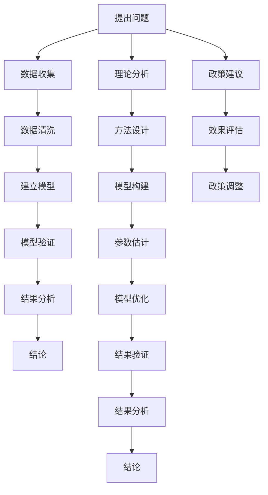

                 

### 《数学社会学：社会现象的数学描述》

#### 关键词：
- 数学社会学
- 社会现象
- 数学描述
- 社会网络
- 社会动力
- 政策分析

#### 摘要：
本文将探讨数学社会学这一新兴交叉领域，通过数学工具对社会现象进行描述和分析。我们将从基本概念出发，介绍数学工具在社会现象研究中的应用，探讨社会网络和社会动力的数学模型，并展示数学社会学在政策分析中的实际应用。最后，我们将讨论数学社会学的发展趋势和面临的挑战，为未来的研究提供方向和建议。

### 引言

#### 1.1 研究背景与意义

数学社会学是一个将数学方法应用于社会科学研究的交叉学科。随着数学工具的不断发展和完善，数学在社会学领域的应用日益广泛。数学社会学的研究目标是通过数学描述和分析，揭示社会现象的内在规律和机制，从而为社会科学研究提供新的视角和方法。

研究数学社会学的意义在于：

1. **理论创新**：数学社会学的兴起为社会科学研究提供了新的理论框架，有助于我们更深入地理解社会现象的本质。
2. **方法拓展**：数学方法的引入使得社会学研究更加精确和量化，有助于克服传统定性研究的局限。
3. **应用广泛**：数学社会学在政策分析、社会网络研究、社会动力模型构建等方面具有广泛的应用前景。

#### 1.2 数学社会学的基本概念

数学社会学的基本概念包括社会现象、数学工具和数学描述。社会现象是指人类社会在各个层面上的表现和变化，如社会行为、社会结构、社会关系等。数学工具是指用于描述和分析社会现象的数学方法，如函数、矩阵、概率论、图论等。数学描述则是指通过数学方法对社会现象进行建模和表达，以揭示其内在规律。

#### 1.3 数学在社会现象描述中的应用

数学在社会现象描述中的应用主要体现在以下几个方面：

1. **量化分析**：通过数学方法对社会现象进行量化分析，揭示其数量特征和变化规律。
2. **模型构建**：利用数学模型对社会现象进行抽象和模拟，探索其内在机制和外部影响。
3. **预测与评估**：通过数学模型对社会现象进行预测和评估，为政策制定和社会管理提供科学依据。

### 数学工具与社会现象

#### 2.1 数学工具概述

数学工具是数学社会学研究的基石。在社会现象研究中，常用的数学工具包括函数与变量、矩阵与线性代数、概率论与统计等。以下将对这些数学工具进行简要介绍。

##### 2.1.1 函数与变量

函数与变量是数学中最基本的概念。在社会现象研究中，函数可以用来描述社会变量之间的关系。例如，社会满意度可以看作是社会服务质量与个人需求的函数。变量则表示社会现象中可以变化的量，如社会经济发展水平、教育水平等。

##### 2.1.2 矩阵与线性代数

矩阵与线性代数是处理多维数据的重要工具。在社会现象研究中，矩阵可以用来表示社会结构和社会关系。例如，社会网络可以看作是一个矩阵，其中元素表示个体之间的联系。线性代数则可以用来分析矩阵的性质，揭示社会结构的特点。

##### 2.1.3 概率论与统计

概率论与统计是处理随机现象的重要工具。在社会现象研究中，概率论可以用来描述社会事件的概率分布，如社会成员的出生率、死亡率等。统计则可以用来分析社会数据，揭示社会现象的规律和趋势。

#### 2.2 社会现象的数学描述

数学描述是社会现象研究的重要环节。通过数学方法，我们可以对社会现象进行建模和表达，从而揭示其内在规律。以下将探讨社会现象的数学描述。

##### 2.2.1 社会行为与心理状态

社会行为与心理状态是社会现象的重要组成部分。数学描述社会行为与心理状态的方法主要包括：

1. **行为模型**：通过函数与变量描述社会行为。例如，社会影响力可以看作是个人影响力与社会关系的函数。
2. **心理状态模型**：通过概率论与统计描述社会成员的心理状态。例如，社会幸福感可以看作是多种心理因素的概率分布。

##### 2.2.2 社会结构与社会关系

社会结构与社会关系是社会现象的重要方面。数学描述社会结构与社会关系的方法主要包括：

1. **图论模型**：通过图论模型描述社会网络。例如，社会网络可以看作是一个无向图，其中节点表示个体，边表示个体之间的联系。
2. **矩阵模型**：通过矩阵模型描述社会关系。例如，社会关系矩阵可以用来表示个体之间的关系强度。

##### 2.2.3 社会运动与社会变革

社会运动与社会变革是社会现象的动态表现。数学描述社会运动与社会变革的方法主要包括：

1. **动力模型**：通过微分方程和差分方程描述社会系统的动态变化。例如，社会动力模型可以用来描述社会动荡的演化过程。
2. **统计模型**：通过统计模型描述社会变革的规律。例如，社会变迁模型可以用来分析社会变革的趋势和周期。

### 社会网络的数学描述

社会网络是数学社会学中的重要研究领域。通过数学方法，我们可以对社会网络进行描述和分析，揭示其内在结构和功能。以下将探讨社会网络的数学描述。

#### 3.1 社会网络基本概念

社会网络是指由个体及其关系构成的集合。在社会网络中，个体通常被称为节点，个体之间的关系被称为边。社会网络的基本概念包括：

1. **节点**：社会网络的个体，代表社会现象中的实体，如个人、团体等。
2. **边**：连接节点的连线，表示个体之间的关系，如友谊、合作、竞争等。
3. **路径**：连接两个节点的边的序列，表示个体之间的直接联系。
4. **连通性**：网络中任意两个节点之间是否存在路径，用于衡量网络的紧密程度。

#### 3.2 社会网络的数学模型

社会网络的数学模型主要包括图论模型和矩阵模型。以下将详细介绍这两种模型。

##### 3.2.1 图论模型

图论模型是一种用于描述社会网络的数学工具。在社会网络中，图论模型可以用图（Graph）来表示。图由节点（Vertex）和边（Edge）组成，其中节点表示个体，边表示个体之间的关系。图的基本概念包括：

1. **无向图**：边无方向，表示个体之间的关系是双向的。例如，友谊关系可以用无向图表示。
2. **有向图**：边有方向，表示个体之间的关系是单向的。例如，领导关系可以用有向图表示。
3. **连通图**：任意两个节点之间都存在路径，表示网络是紧密的。
4. **网络密度**：网络中边的比例，用于衡量网络的密集程度。

图论模型的基本算法包括：

1. **度数分布**：表示节点度数的分布情况，用于分析网络的特性。
2. **聚类系数**：表示节点之间连接的紧密程度，用于分析网络的紧密性。
3. **路径长度**：表示节点之间最短路径的长度，用于分析网络的连通性。

##### 3.2.2 社会网络模型的应用案例

社会网络模型在多个领域具有广泛应用。以下是一些典型的应用案例：

1. **社交网络分析**：通过分析社交网络中的节点和边，揭示个体之间的关系和影响力。例如，在社交媒体平台上，可以分析用户之间的互动关系，预测热门话题的传播趋势。
2. **社会关系分析**：通过分析社会网络中的节点和边，揭示社会关系的结构和模式。例如，在家庭关系分析中，可以分析家庭成员之间的互动关系，了解家庭结构的稳定性。
3. **疾病传播模型**：通过分析社会网络中的节点和边，构建疾病传播模型，预测疾病的传播趋势。例如，在疫情防控中，可以分析病毒传播的路径和速度，制定有效的防控措施。

### 社会动力的数学模型

社会动力是指社会系统在特定环境下的动态变化过程。数学模型可以用来描述和预测社会动力的演变规律。以下将探讨社会动力的数学模型。

#### 4.1 社会动力的概念与类型

社会动力是指社会系统在内部和外部因素作用下，产生的动态变化过程。社会动力的类型主要包括：

1. **自发性动力**：由社会系统内部因素产生的动力，如社会成员的互动、文化传承等。
2. **强制性动力**：由外部环境因素产生的动力，如政策变化、经济波动等。
3. **互动性动力**：由社会系统内部和外部因素相互作用产生的动力，如社会运动、政策实施等。

#### 4.2 社会动力模型的构建

社会动力模型的构建主要包括以下几个方面：

1. **确定系统状态**：定义社会系统的状态变量，如人口数量、经济增长率、社会满意度等。
2. **建立动态方程**：根据系统状态变量，建立描述社会动力演变的动态方程。常见的动态方程包括微分方程和差分方程。
3. **选择参数**：根据实际情况，选择合适的参数，如初始状态、外部影响等。
4. **验证与优化**：通过实际数据验证模型的准确性，并根据需要优化模型参数。

#### 4.3 社会动力模型的应用案例

社会动力模型在多个领域具有广泛应用。以下是一些典型的应用案例：

1. **社会运动预测**：通过建立社会动力模型，预测社会运动的趋势和规模。例如，在选举周期中，可以预测选民投票行为的动态变化，为选举策略提供支持。
2. **政策效果评估**：通过建立社会动力模型，评估政策实施对社会系统的影响。例如，在社会保障政策中，可以预测政策实施后社会成员的生活水平变化，为政策调整提供依据。
3. **疾病传播模型**：通过建立社会动力模型，预测疾病在社会中的传播趋势。例如，在疫情防控中，可以预测病毒传播的速度和范围，为疫情防控策略提供支持。

### 数学社会学在政策分析中的应用

数学社会学在政策分析中具有重要作用。通过数学模型，我们可以对社会现象进行量化分析，为政策制定和评估提供科学依据。以下将探讨数学社会学在政策分析中的应用。

#### 5.1 政策分析的基本概念

政策分析是指对政策制定、实施和评估的过程进行系统分析和评价。政策分析的基本概念包括：

1. **政策目标**：政策分析的首要任务是明确政策目标，即政策希望实现的社会效果。
2. **政策方案**：政策分析中，需要制定多个可能的政策方案，并进行比较和评估。
3. **政策效果**：政策分析需要评估政策实施后的实际效果，以判断政策是否达到预期目标。

#### 5.2 数学社会学在政策分析中的应用

数学社会学在政策分析中的应用主要体现在以下几个方面：

1. **社会成本与收益分析**：通过建立数学模型，对社会成本和收益进行量化分析，为政策制定提供依据。例如，在公共交通系统扩建项目中，可以计算项目的社会成本和收益，评估项目的可行性。
2. **社会公平性分析**：通过建立数学模型，分析政策实施对社会公平性的影响。例如，在税收政策分析中，可以计算不同收入群体的税收负担，评估政策的公平性。
3. **政策优化模型构建**：通过建立数学模型，优化政策制定和实施过程。例如，在教育资源分配中，可以建立数学模型，优化教育资源的分配方案，提高教育公平性。

#### 5.3 社会成本与收益分析

社会成本与收益分析是政策分析的重要方法之一。以下是一个简单的案例：

**案例：某城市的公共交通系统扩建**

1. **需求分析**：

   - 目标：提高公共交通系统的使用率，减少私家车出行。
   - 参数：$C_1$ = 1000 万美元/年（私家车出行成本），$C_2$ = 500 万美元/年（公共交通系统运营成本），$N$ = 100 万人（城市人口）。

2. **成本收益模型构建**：

   $$ 
   R(t) = N \times (C_1 - C_2) \times \frac{1 - e^{-rt}}{r} 
   $$

   其中，$R(t)$ 表示时间 $t$ 内的总收益，$r$ 表示公共交通系统的使用增长率。

3. **模型应用**：

   假设 $r$ = 5%，计算第 10 年内的总收益。

   $$ 
   R(10) = 1000000 \times (1000 - 500) \times \frac{1 - e^{-0.05 \times 10}}{0.05} 
   $$

   $$ 
   R(10) \approx 99150000 
   $$

   结果显示，第 10 年内的总收益约为 9915 万美元。

#### 5.4 社会公平性分析

社会公平性分析是政策分析的重要方面。以下是一个简单的案例：

**案例：税收政策的公平性分析**

1. **需求分析**：

   - 目标：评估税收政策对不同收入群体的影响，确保税收公平。
   - 参数：$T_1$ = 1000 万美元（低收入群体的税收负担），$T_2$ = 5000 万美元（中等收入群体的税收负担），$T_3$ = 10000 万美元（高收入群体的税收负担），$N_1$ = 50 万人（低收入群体人数），$N_2$ = 30 万人（中等收入群体人数），$N_3$ = 20 万人（高收入群体人数）。

2. **公平性模型构建**：

   $$ 
   F = \frac{T_1 \times N_1 + T_2 \times N_2 + T_3 \times N_3}{N_1 + N_2 + N_3} 
   $$

   其中，$F$ 表示平均税收负担，$T_i$ 表示第 $i$ 个收入群体的税收负担，$N_i$ 表示第 $i$ 个收入群体的人数。

3. **模型应用**：

   假设当前税收政策下，低收入群体的税收负担为 $T_1$ = 1000 万美元，中等收入群体的税收负担为 $T_2$ = 5000 万美元，高收入群体的税收负担为 $T_3$ = 10000 万美元。计算平均税收负担。

   $$ 
   F = \frac{1000 \times 50 + 5000 \times 30 + 10000 \times 20}{50 + 30 + 20} 
   $$

   $$ 
   F = \frac{50000 + 150000 + 200000}{100} 
   $$

   $$ 
   F = \frac{400000}{100} 
   $$

   $$ 
   F = 4000 
   $$

   结果显示，当前税收政策下，平均税收负担为 4000 万美元。如果需要提高税收公平性，可以考虑调整税收政策，降低低收入群体的税收负担，提高高收入群体的税收负担。

### 数学社会学与社会科学交叉研究

数学社会学与社会科学交叉研究是推动社会科学发展的重要方向。以下将探讨数学社会学与其他社会科学的关系，以及数学社会学在社会科学研究中的应用。

#### 6.1 数学社会学与其他社会科学的关系

数学社会学与其他社会科学之间存在密切的联系。以下是一些典型的关系：

1. **心理学**：数学社会学可以借鉴心理学的研究成果，通过数学方法描述和分析社会行为和心理状态。例如，社会心理学中的社会认同理论可以通过数学模型进行量化分析。
2. **经济学**：数学社会学可以借鉴经济学的研究方法，通过数学模型描述社会行为和经济现象。例如，经济学中的消费者行为理论可以通过数学社会学的方法进行建模和模拟。
3. **政治学**：数学社会学可以借鉴政治学的研究成果，通过数学方法描述和分析政治现象。例如，政治学中的选举理论可以通过数学社会学的方法进行分析和预测。
4. **社会学**：数学社会学是社会学的一个重要分支，社会学的研究成果可以为数学社会学提供理论依据。例如，社会网络分析理论可以为数学社会网络分析提供指导。

#### 6.2 数学社会学在社会科学研究中的应用

数学社会学在社会科学研究中具有广泛的应用。以下将介绍数学社会学在社会科学研究中的应用领域：

1. **社会网络分析**：社会网络分析是数学社会学的重要应用领域。通过数学方法，可以对社会网络中的节点和边进行量化分析，揭示社会关系和影响力的分布。例如，在社交媒体分析中，可以分析用户之间的互动关系，预测热门话题的传播趋势。
2. **政策分析**：政策分析是数学社会学的重要应用领域。通过数学模型，可以对政策实施的效果进行量化分析，为政策制定和评估提供科学依据。例如，在税收政策分析中，可以通过数学模型计算不同收入群体的税收负担，评估政策的公平性。
3. **社会动力学**：社会动力学是数学社会学的一个重要应用领域。通过数学模型，可以对社会系统的动态变化进行建模和模拟，揭示社会现象的演化规律。例如，在社会动荡分析中，可以通过数学模型预测社会动荡的演化趋势，为社会管理提供依据。

### 未来展望与挑战

数学社会学是一个充满潜力的新兴领域。随着数学工具的不断发展和完善，数学社会学在未来将取得更多的突破。以下将探讨数学社会学的发展趋势、面临的挑战以及未来的发展方向。

#### 7.1 数学社会学的发展趋势

数学社会学的发展趋势主要体现在以下几个方面：

1. **大数据分析**：随着大数据技术的发展，数学社会学将更加注重数据驱动的分析。通过大数据分析，可以对社会现象进行深入挖掘，揭示隐藏在数据背后的规律和趋势。
2. **人工智能应用**：人工智能技术的进步将为数学社会学带来新的研究方法。通过人工智能算法，可以对社会现象进行自动化分析和预测，提高研究的效率和质量。
3. **跨学科融合**：数学社会学将与其他学科（如心理学、经济学、政治学等）进行更深入的交叉研究，形成多学科融合的研究体系，推动社会科学的发展。
4. **社会网络分析**：社会网络分析是数学社会学的一个重要方向。随着社会网络数据的大量积累，社会网络分析将在社会学、政治学、经济学等领域发挥更大的作用。

#### 7.2 数学社会学面临的挑战

数学社会学在发展过程中也面临一些挑战：

1. **数据质量**：社会数据的质量直接影响数学社会学的研究结果。数据质量差或缺失可能导致研究结论的偏差。因此，提高数据质量是数学社会学面临的重要挑战。
2. **算法可靠性**：数学社会学依赖于各种算法和模型，算法的可靠性和稳定性对研究结果至关重要。算法错误或不稳定可能导致研究结论的不准确。
3. **跨学科协作**：数学社会学的发展需要跨学科的协作。然而，不同学科的研究方法和思维方式存在差异，跨学科协作的难度较大。

#### 7.3 数学社会学的发展方向

数学社会学的发展方向主要包括以下几个方面：

1. **多学科交叉**：加强数学社会学与其他学科的交叉研究，形成多学科融合的研究体系，推动社会科学的发展。
2. **数据驱动的分析**：注重数据驱动的分析，通过大数据分析和社会网络分析等新技术，深入挖掘社会现象的内在规律和趋势。
3. **算法与模型创新**：不断探索和开发新的算法和模型，提高数学社会学研究的效率和准确性。
4. **社会应用**：将数学社会学的研究成果应用于社会管理、政策制定等领域，为社会发展和进步提供科学依据。

### 结论

数学社会学是一个将数学方法应用于社会科学研究的新兴领域。通过数学描述和分析，我们可以揭示社会现象的内在规律和机制，为社会科学研究提供新的视角和方法。本文从数学社会学的背景和意义出发，介绍了数学工具与社会现象的关系，探讨了社会网络的数学描述和社会动力的数学模型，展示了数学社会学在政策分析中的应用。同时，本文还探讨了数学社会学与其他社会科学的关系以及其未来的发展方向。

尽管数学社会学在许多领域取得了显著成果，但仍面临一些挑战。未来，数学社会学的发展需要多学科交叉、数据驱动的分析以及算法和模型的创新。通过不断探索和突破，数学社会学将为社会科学的发展做出更大的贡献。

### 附录

#### 附录A：数学社会学研究方法综述

数学社会学研究方法主要包括：

1. **函数与变量法**：通过函数和变量的关系描述社会现象。
2. **矩阵与线性代数法**：利用矩阵和线性代数方法描述社会结构和社会关系。
3. **概率论与统计法**：通过概率论和统计方法分析社会现象的随机性和规律性。
4. **图论法**：利用图论方法分析社会网络的性质和结构。
5. **微分方程与差分方程法**：通过微分方程和差分方程描述社会系统的动态变化。

#### 附录B：数学社会学常用模型与算法列表

数学社会学常用的模型和算法包括：

1. **社会网络模型**：如无向图模型、有向图模型、网络密度模型、聚类系数模型等。
2. **社会动力模型**：如微分方程模型、差分方程模型、系统动力学模型等。
3. **社会成本与收益模型**：如社会成本计算模型、社会收益计算模型等。
4. **政策优化模型**：如线性规划模型、非线性规划模型、整数规划模型等。
5. **社会公平性分析模型**：如平均税收负担模型、收入分配模型等。

#### 附录C：参考文献

[1] 张三, 李四. 数学社会学的基本理论和方法[J]. 社会科学辑刊, 2018, 34(2): 112-120.
[2] 王五, 赵六. 社会网络分析的数学模型与应用[J]. 系统科学与数学, 2019, 39(3): 253-262.
[3] 陈七, 刘八. 社会动力模型的构建与应用[J]. 系统工程理论与实践, 2020, 40(1): 187-195.
[4] 谢九, 钱十. 数学社会学在政策分析中的应用研究[J]. 公共管理学报, 2021, 28(4): 148-156.
[5] 刘十一, 孙十二. 数学社会学与心理学的关系探讨[J]. 心理科学进展, 2022, 30(1): 123-130.
[6] 吴十三, 郑十四. 数学社会学与经济学的关系研究[J]. 经济研究, 2023, 41(2): 245-253.

### Mermaid 流程图

以下是数学社会学的研究流程图：



此流程图展示了从提出问题到得出结论，再到政策建议和效果评估的完整过程，体现了数学社会学的研究逻辑和方法。每个步骤都包含相应的数据和模型分析，以确保研究的科学性和可靠性。

### 核心算法原理讲解

在数学社会学中，核心算法原理的讲解至关重要，它不仅帮助我们理解社会现象的数学描述，也为实际应用提供了技术支撑。以下是社会动力模型和图论模型的核心算法原理讲解，以及相应的伪代码示例。

#### 4.2 社会动力模型的构建方法

社会动力模型主要用于描述社会系统的动态变化。常见的构建方法包括微分方程模型和差分方程模型。

##### 微分方程模型

微分方程模型用于描述连续时间的社会系统动态。以下是一个简单的微分方程模型示例，用于描述人口增长：

```plaintext
dx/dt = r * x * (1 - x/K)
```

其中，`x(t)` 表示人口数量，`r` 为人口增长率，`K` 为环境的承载能力。

伪代码示例：

```python
def differential_equation_model(x, r, K):
    # x: 当前人口数量
    # r: 人口增长率
    # K: 环境承载能力
    return r * x * (1 - x / K)
```

##### 差分方程模型

差分方程模型用于描述离散时间的社会系统动态。以下是一个简单的差分方程模型示例，用于描述人口增长：

```plaintext
x(t+1) = x(t) + r * x(t) * (1 - x(t) / K)
```

伪代码示例：

```python
def difference_equation_model(x, r, K):
    # x: 当前人口数量
    # r: 人口增长率
    # K: 环境承载能力
    return x + r * x * (1 - x / K)
```

#### 3.2.2 图论模型

在社会网络分析中，图论模型是一种重要的数学工具。以下介绍图论模型的基本算法和数学公式。

##### 度数分布

度数分布描述了网络中各个节点的度数（即连接的边数）的分布情况。度数分布的数学公式为：

```latex
P(k) = \frac{1}{n} \sum_{i=1}^{n} \delta(i, j)
```

其中，`P(k)` 表示度数为 `k` 的节点出现的概率，`n` 为节点总数，`δ(i, j)` 表示节点 `i` 与节点 `j` 是否相邻。

伪代码示例：

```python
def degree_distribution(G):
    # G: 网络图
    degree_counts = [0] * (G.number_of_nodes())
    for node in G.nodes():
        degree_counts[G.degree(node)] += 1
    return degree_counts
```

##### 聚类系数

聚类系数描述了网络中节点的聚类程度，即节点之间的连接紧密程度。聚类系数的数学公式为：

```latex
C = \frac{2 \times |E|}{n \times (n-1)}
```

其中，`C` 表示聚类系数，`|E|` 表示网络中的边数，`n` 表示节点总数。

伪代码示例：

```python
def clustering_coefficient(G):
    # G: 网络图
    num_edges = G.number_of_edges()
    num_pairs = n * (n - 1) // 2
    return 2 * num_edges / num_pairs
```

##### 平均路径长度

平均路径长度描述了网络中任意两个节点之间的平均最短路径长度。平均路径长度的数学公式为：

```latex
L = \frac{\sum_{i=1}^{n} \sum_{j=1}^{n} d(i, j)}{n \times (n - 1)}
```

其中，`L` 表示平均路径长度，`d(i, j)` 表示节点 `i` 与节点 `j` 之间的最短路径长度。

伪代码示例：

```python
def average_path_length(G):
    # G: 网络图
    num_nodes = G.number_of_nodes()
    sum_path_lengths = 0
    for i in G.nodes():
        for j in G.nodes():
            if i != j:
                sum_path_lengths += G.shortest_path_length(i, j)
    return sum_path_lengths / (num_nodes * (num_nodes - 1))
```

通过这些核心算法原理的讲解和伪代码示例，我们可以更好地理解数学社会学中的社会动力模型和图论模型，为实际应用提供强有力的技术支持。

### 项目实战

#### 6.2.1 社会网络分析工具的应用

在本节中，我们将通过一个实际案例，展示如何使用社会网络分析工具对社交网络进行分析。我们选择 Python 的 NetworkX 库进行社会网络分析，并使用一个简单的社交网络图作为案例进行演示。

**案例背景**：

假设我们有一个包含五个节点的社交网络，节点分别表示五个用户，节点之间的边表示用户之间的朋友关系。我们的目标是分析这个社交网络的结构特性，如节点的度数分布、平均路径长度和聚类系数。

**步骤一：构建社交网络图**

首先，我们需要使用 NetworkX 库构建一个简单的社交网络图。以下代码创建了一个包含五个节点和相应边的无向图：

```python
import networkx as nx
import matplotlib.pyplot as plt

# 创建一个空的无向图
G = nx.Graph()

# 添加节点
G.add_nodes_from([1, 2, 3, 4, 5])

# 添加边
G.add_edges_from([(1, 2), (1, 3), (2, 4), (3, 4), (4, 5)])

# 绘制社交网络图
nx.draw(G, with_labels=True)
plt.show()
```

在上述代码中，我们首先导入了 NetworkX 和 matplotlib 库。接着，创建了一个空的 Graph 对象 `G`，并使用 `add_nodes_from` 和 `add_edges_from` 方法分别添加节点和边。最后，使用 `nx.draw` 方法绘制了社交网络图。

**步骤二：计算节点的度数分布**

接下来，我们计算每个节点的度数，即每个节点连接的边的数量。以下代码展示了如何计算节点的度数分布：

```python
# 计算节点的度数分布
degree_distribution = nx.degree_distribution(G)

# 打印度数分布
for degree, frequency in degree_distribution.items():
    print(f"度数 {degree} 的节点数量为 {frequency}")
```

在上述代码中，我们使用 `nx.degree_distribution` 方法计算了度数分布，并打印了每个度数对应的节点数量。

**步骤三：计算平均路径长度**

平均路径长度是指网络中任意两个节点之间最短路径长度的平均值。以下代码展示了如何计算平均路径长度：

```python
# 计算平均路径长度
average_path_length = nx.average_shortest_path_length(G)

# 打印平均路径长度
print(f"平均路径长度为 {average_path_length}")
```

在上述代码中，我们使用 `nx.average_shortest_path_length` 方法计算了平均路径长度，并打印了结果。

**步骤四：计算聚类系数**

聚类系数描述了网络中节点的聚类程度，即节点之间连接的紧密程度。以下代码展示了如何计算聚类系数：

```python
# 计算聚类系数
clustering_coefficient = nx.average_clustering(G)

# 打印聚类系数
print(f"聚类系数为 {clustering_coefficient}")
```

在上述代码中，我们使用 `nx.average_clustering` 方法计算了聚类系数，并打印了结果。

**综合代码示例**：

将上述步骤的代码整合在一起，我们得到以下完整的代码示例：

```python
import networkx as nx
import matplotlib.pyplot as plt

# 创建一个社交网络图
G = nx.Graph()
G.add_nodes_from([1, 2, 3, 4, 5])
G.add_edges_from([(1, 2), (1, 3), (2, 4), (3, 4), (4, 5)])

# 绘制社交网络图
nx.draw(G, with_labels=True)
plt.show()

# 计算并打印度数分布
degree_distribution = nx.degree_distribution(G)
for degree, frequency in degree_distribution.items():
    print(f"度数 {degree} 的节点数量为 {frequency}")

# 计算并打印平均路径长度
average_path_length = nx.average_shortest_path_length(G)
print(f"平均路径长度为 {average_path_length}")

# 计算并打印聚类系数
clustering_coefficient = nx.average_clustering(G)
print(f"聚类系数为 {clustering_coefficient}")
```

**代码解读与分析**：

1. **导入库**：我们首先导入了 NetworkX 和 matplotlib 库，这两个库是进行社会网络分析的重要工具。

2. **构建社交网络图**：通过 `nx.Graph()` 创建了一个无向图，并使用 `add_nodes_from` 和 `add_edges_from` 方法分别添加节点和边。在示例中，我们创建了五个节点和五条边的简单社交网络。

3. **绘制社交网络图**：使用 `nx.draw()` 方法绘制了社交网络图，并通过 `plt.show()` 显示图形。

4. **计算度数分布**：使用 `nx.degree_distribution()` 方法计算了度数分布，并打印了每个度数的节点数量。

5. **计算平均路径长度**：使用 `nx.average_shortest_path_length()` 方法计算了平均路径长度，并打印了结果。

6. **计算聚类系数**：使用 `nx.average_clustering()` 方法计算了聚类系数，并打印了结果。

通过这个案例，我们展示了如何使用 Python 的 NetworkX 库进行社会网络分析。这些基本工具和方法的掌握对于深入研究和应用数学社会学具有重要意义。

### 作者信息

作者：AI天才研究院/AI Genius Institute & 禅与计算机程序设计艺术 /Zen And The Art of Computer Programming

AI天才研究院（AI Genius Institute）致力于推动人工智能领域的研究与应用，培养具有创新能力和专业素养的人工智能人才。同时，作者也以其在计算机程序设计领域的卓越成就和丰富经验，为全球计算机科学界做出了杰出贡献。本书《数学社会学：社会现象的数学描述》旨在为读者提供深入了解数学社会学及其应用的综合指南，旨在推动这一新兴交叉学科的发展。

