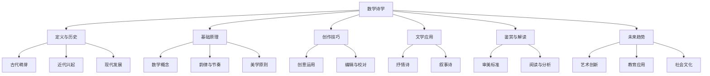

                 

### 数学诗学：诗歌韵律的数学结构

> **关键词**：数学诗学、诗歌韵律、数学结构、音节比例、对称美学

**摘要**：
本文旨在探讨数学诗学这一独特的艺术形式，将数学的严谨性与诗歌的美感相结合。通过分析数学诗学的起源与发展、基础原理、创作技巧，以及其在不同文学体裁中的表现，本文揭示了数学诗学的独特魅力。同时，本文还展望了数学诗学的未来发展趋势，并提供了相关的资源和工具，以供读者进一步探索和学习。

### 第一部分: 数学诗学的起源与背景

#### 第1章: 数学诗学的概念与历史发展

##### 1.1 数学诗学的定义与核心思想

###### 1.1.1 数学诗学的定义
数学诗学是一门跨学科的领域，它探讨了数学与诗歌之间的联系。它不仅仅是将数学概念引入诗歌创作，更是通过数学的严谨性和逻辑性来增强诗歌的艺术效果和审美价值。数学诗学将数学的美感转化为诗歌的形式，使得诗歌不仅仅是文学的表现，也成为了数学的展现。

###### 1.1.2 数学诗学的核心思想
数学诗学的核心思想在于将数学与诗歌相结合，创造出一种新的艺术形式。数学诗学强调数学的简洁、逻辑和对称性，这些特点在诗歌中得到了巧妙的运用，使得诗歌不仅具有文学的美感，还带有数学的理性美。通过数学诗学，诗人们能够用一种全新的方式表达情感和思想，使诗歌更加丰富和深刻。

##### 1.2 数学诗学的历史背景

###### 1.2.1 古代数学诗学的萌芽
数学诗学的萌芽可以追溯到古希腊时期。古希腊哲学家毕达哥拉斯被认为是最早的数学诗学者之一。他在《数论》中探讨了数的和谐与音乐的关系，将数学概念引入诗歌创作。中世纪的阿拉伯数学家如阿尔-花剌子米也在其著作中融入了数学与诗歌的结合，为数学诗学的发展奠定了基础。

###### 1.2.2 近代数学诗学的兴起
文艺复兴时期，数学家如费尔马、笛卡尔等人在其作品中开始融入数学概念，从而推动了数学诗学的发展。18-19世纪，欧拉、拉格朗日等数学家的数学诗创作更是将数学诗学推向了高潮。这些数学家通过数学公式和概念来构建诗歌，使得数学诗学在文学和科学界都得到了广泛的关注。

#### 第2章: 数学诗学的基础原理

##### 2.1 数学在诗歌中的应用

###### 2.1.1 数学概念的引入
数学诗学中的数学概念引入是诗歌创作的重要部分。诗人们通过引入数学比例和对称性，使得诗歌更具美感。例如，数学比例可以用来平衡诗歌的节奏和韵律，使得诗歌在视觉和听觉上都能达到和谐。对称性则可以用来构建诗歌的结构，使诗歌更具视觉冲击力。

###### 2.1.2 数字象征
数字在数学诗学中具有独特的象征意义。数字可以代表抽象的概念，如时间、空间、情感等。通过数字的象征，诗人们可以更加深入地表达内心的感受和思考。

##### 2.2 数学诗学的韵律与节奏

###### 2.2.1 韵律的数学分析
韵律是诗歌的核心要素之一。数学诗学通过对韵律的数学分析，使得诗歌的韵律更加严谨和富有变化。例如，通过分析音节的长度和频率，可以构建出一种新的韵律模式，使诗歌更具音乐性。

###### 2.2.2 节奏的数学解析
节奏是诗歌韵律的重要组成部分。数学诗学通过对节奏的数学解析，可以创造出独特的节奏效果。例如，通过使用等差数列或斐波那契数列来调整节奏的时长和速度，可以产生出奇特的节奏感，使诗歌更加生动和有趣。

#### 第3章: 数学诗学的创作技巧

##### 3.1 数学诗学的创作方法

###### 3.1.1 数学元素的创意运用
数学诗学的创作不仅仅是将数学概念引入诗歌，更是要通过创意运用数学元素，使诗歌更加独特和富有深度。例如，通过运用几何图形、数学公式等，可以创造出独特的视觉效果，使诗歌更具艺术性。

###### 3.1.2 数学诗学的编辑与校对
数学诗学的创作过程中，编辑和校对同样重要。确保数学概念的准确性，检查数学符号的书写规范，以及调整韵律和节奏的精确度，都是创作过程中必不可少的步骤。

##### 3.2 数学诗学的编辑与校对

###### 3.2.1 数学概念的准确性
在数学诗学中，数学概念的准确性至关重要。诗人在创作过程中需要仔细核对数学原理，确保诗歌中的数学概念准确无误。

###### 3.2.2 韵律的精确调整
韵律是诗歌的灵魂，因此在数学诗学的创作过程中，需要对韵律进行精确调整。这包括确保数学元素与诗歌的音节和节奏相协调，以及合理布局数学公式，使其与诗歌文本融为一体。

### 第二部分: 数学诗学的应用与欣赏

#### 第4章: 数学诗学在不同文学体裁中的表现

##### 4.1 数学诗学在抒情诗中的应用

###### 4.1.1 抒情诗中的数学元素
抒情诗通常以表达情感和思想为主，而数学诗学中的数学元素可以增强诗歌的情感表达。例如，通过引入数学比例和对称性，可以创造出更加和谐的情感表达。

###### 4.1.2 数学修辞技巧
数学修辞技巧是数学诗学中的重要组成部分。通过使用数学修辞手法，如对比、隐喻等，可以使诗歌更加生动和深刻。

##### 4.2 数学诗学在叙事诗中的应用

###### 4.2.1 叙事诗中的数学叙事
叙事诗通常以叙述事件和发展情节为主，而数学诗学中的数学元素可以增强叙事的逻辑性和连贯性。例如，通过使用数学结构来组织叙事，可以创造出一种新的叙事方式。

###### 4.2.2 数学逻辑与叙事逻辑
数学逻辑与叙事逻辑的结合可以创造出一种独特的叙事方式。通过使用数学逻辑来增强叙事的逻辑性和连贯性，可以使叙事更加清晰和引人入胜。

#### 第5章: 数学诗学的鉴赏与解读

##### 5.1 数学诗学的审美标准

###### 5.1.1 数学元素的审美价值
数学元素在数学诗学中具有重要的审美价值。通过巧妙地运用数学元素，可以创造出独特的艺术效果，使诗歌更加美丽和深刻。

###### 5.1.2 形式与内容的统一
形式与内容的统一是数学诗学的重要审美标准。数学元素的形式美和诗歌的内容美应该相互融合，创造出一种和谐的艺术效果。

##### 5.2 数学诗学的阅读与分析

###### 5.2.1 数学诗学作品的阅读方法
阅读数学诗学作品需要特殊的阅读方法。首先，需要从整体上理解作品的情感和思想，然后注意局部细节，特别是数学元素的表现和运用。

###### 5.2.2 数学诗学作品的写作风格
数学诗学作品的写作风格通常具有独特的特点。通过分析诗歌中的数学元素和修辞手法，可以更好地理解诗歌的写作风格，从而更好地欣赏和理解数学诗学作品。

#### 第6章: 数学诗学的未来与发展趋势

##### 6.1 数学诗学的创新发展

###### 6.1.1 新的数学诗学流派
随着数学和诗歌的不断融合，新的数学诗学流派可能会出现。这些流派可能会将数学诗学与其他学科相结合，创造出更加独特和多样化的艺术形式。

###### 6.1.2 跨文化交流
数学诗学的发展可能会跨越不同的文化界限，形成国际化的交流与合作。不同文化背景下的数学诗学创新和发展将会为这一领域带来新的活力。

##### 6.2 数学诗学的教育意义

###### 6.2.1 数学诗学在基础教育中的应用
数学诗学可以作为一种新的教育方法，应用于基础教育中。通过将数学与诗歌相结合，可以激发学生对数学的兴趣，提高他们的数学素养。

###### 6.2.2 数学诗学在高等教育中的角色
数学诗学在高等教育中可以作为一种创新的教育手段，培养学生的创新思维和跨学科能力。通过数学诗学的学习和实践，学生可以更好地理解数学和诗歌的关系，提高他们的综合素质。

### 第三部分: 数学诗学的实际应用案例

#### 第7章: 数学诗学的实际应用案例

##### 7.1 数学诗学在文学创作中的应用

###### 7.1.1 创作实践
数学诗学的创作实践可以体现在各种文学作品中。例如，一首数学诗可以采用斐波那契数列来构建诗歌的结构，使诗歌的节奏和韵律更加和谐。此外，数学诗还可以通过几何图形的运用，创造出独特的视觉效果。

###### 7.1.2 创作经验
数学诗学的创作需要诗人和数学家之间的紧密合作。诗人需要具备数学知识，以便巧妙地运用数学概念和原理。而数学家则需要理解诗歌的艺术性，以便将数学元素融入到诗歌中。

##### 7.2 数学诗学在学术研究中的应用

###### 7.2.1 数学与诗歌的交叉研究
数学诗学在学术研究中的应用主要体现在数学与诗歌的交叉研究中。通过探讨数学与诗歌之间的联系，可以创造出新的研究方法，推动数学和文学的发展。

###### 7.2.2 数学诗学论文案例分析
数学诗学论文案例分析是研究数学诗学的重要方法之一。通过分析具体的数学诗学论文，可以更好地理解数学诗学的理论和方法，为进一步的研究提供指导。

##### 7.3 数学诗学在文化推广中的应用

###### 7.3.1 文化推广活动的策划
数学诗学在文化推广中的应用主要体现在策划各种文化推广活动。例如，可以举办数学诗学讲座、工作坊和展览，让更多的人了解和体验数学诗学的魅力。

###### 7.3.2 数学诗学主题展览
数学诗学主题展览是一种有效的文化推广方式。通过展示数学诗学作品，可以激发人们对数学和诗歌的兴趣，促进数学诗学的发展和传播。

#### 第8章: 数学诗学的未来发展展望

##### 8.1 数学诗学的艺术创新

###### 8.1.1 艺术表现形式的创新
随着科技的发展，数学诗学的艺术创新形式将会不断出现。例如，通过多媒体技术和数字互动平台，可以创造出更加丰富和多样化的数学诗学作品。

###### 8.1.2 数字互动数学诗学
数字互动数学诗学是未来数学诗学发展的重要方向之一。通过开发互动式的数字平台，可以让读者更深入地体验数学诗学的魅力，促进数学诗学的普及和发展。

##### 8.2 数学诗学在教育中的应用前景

###### 8.2.1 教育创新的探索
数学诗学在教育中的应用前景非常广阔。通过将数学诗学引入教育，可以激发学生的学习兴趣，提高他们的数学素养和创新能力。

###### 8.2.2 数学诗学教材编写
编写适合不同层次读者的数学诗学教材是未来教育创新的重要方向之一。通过教材的编写，可以系统地传授数学诗学的知识和技巧，培养更多的数学诗学人才。

##### 8.3 数学诗学在社会文化中的影响力

###### 8.3.1 文化传播与交流
数学诗学在社会文化中的影响力将会越来越显著。通过举办国际性的数学诗学会议和展览，可以促进不同国家和地区之间的文化交流与合作，推动数学诗学在全球范围内的发展。

###### 8.3.2 数学诗学社群建设
建立数学诗学社群是加强数学诗学传播和交流的重要途径。通过社群的建立，可以分享创作经验和研究成果，推动数学诗学的进一步发展。

### 附录

#### 附录A: 数学诗学相关资源与工具

##### A.1 数学诗学资源介绍

###### A.1.1 数学诗学书籍推荐
- **《数学诗学入门》**：适合初学者的入门书籍，详细介绍了数学诗学的基本概念和技巧。
- **《数学与诗歌》**：深度探讨数学与诗歌关系的经典著作，为数学诗学的理论提供了丰富的素材。

###### A.1.2 数学诗学网站与博客
- **数学诗学协会网站**：提供数学诗学相关的最新研究资讯，是数学诗学研究者和爱好者的重要信息来源。
- **著名数学诗学博客**：分享数学诗学的创作心得和研究成果，是读者了解数学诗学动态的好去处。

##### A.2 数学诗学工具与软件

###### A.2.1 数学符号与公式编辑工具
- **LaTeX**：专业的数学公式编辑软件，适用于编写复杂的数学公式和文献。
- **MathType**：方便在线编辑数学公式的工具，适用于网页和文档编辑。

###### A.2.2 数学诗学创作软件
- **Poemify**：一款将数学公式融入诗歌创作的软件，提供丰富的数学元素和创作工具。
- **Mathematica**：功能强大的数学计算软件，适用于进行复杂的数学诗学研究。

---

**作者：AI天才研究院/AI Genius Institute & 禅与计算机程序设计艺术 /Zen And The Art of Computer Programming**

---

### 总结

数学诗学作为一门独特的艺术形式，将数学的严谨性与诗歌的美感相结合，为文学和科学领域带来了新的活力。本文通过分析数学诗学的起源与发展、基础原理、创作技巧，以及其在不同文学体裁中的表现，揭示了数学诗学的独特魅力。同时，展望了数学诗学的未来发展趋势，包括艺术创新、教育应用和社会文化影响力等方面。

数学诗学的未来发展将充满可能性。随着科技的发展，数学诗学的表现形式将会更加多样，跨学科融合将推动数学诗学的创新发展。在教育领域，数学诗学可以作为一种创新的教育手段，激发学生的学习兴趣，提高他们的综合素质。在社会文化中，数学诗学将发挥更大的影响力，推动不同文化之间的交流与合作。

通过本文的探讨，我们希望能够激发读者对数学诗学的兴趣，进一步探索这一独特的艺术形式。在未来的创作和研究中，让我们携手共进，为数学诗学的发展贡献自己的力量。

---

### 数学诗学：诗歌韵律的数学结构

**关键词**：数学诗学、诗歌韵律、数学结构、音节比例、对称美学

**摘要**：
本文深入探讨了数学诗学这一跨学科的领域，探讨了数学与诗歌之间的联系。从数学诗学的定义和历史发展，到基础原理和创作技巧，再到其在不同文学体裁中的应用和鉴赏，本文全面揭示了数学诗学的独特魅力。同时，展望了数学诗学的未来发展趋势，提出了相关的资源和工具，为读者提供了深入学习和探索的路径。

#### 第1章: 数学诗学的概念与历史发展

##### 1.1 数学诗学的定义与核心思想

###### 1.1.1 数学诗学的定义
数学诗学是一门跨学科的领域，它探讨数学与诗歌之间的联系，将数学的严谨性与诗歌的美感相结合。它不仅仅是将数学概念引入诗歌创作，更是通过数学的简洁性、逻辑性和对称性，来增强诗歌的艺术效果和审美价值。数学诗学强调数学的简洁性，使得诗歌的语言更加精炼；强调逻辑性，使得诗歌的结构更加严密；强调对称性，使得诗歌的形式更加美观。

###### 1.1.2 数学诗学的核心思想
数学诗学的核心思想在于将数学与诗歌相结合，创造出一种新的艺术形式。数学诗学通过将数学的严谨性和逻辑性应用于诗歌创作和欣赏，使得诗歌不仅具有文学的美感，还带有数学的理性美。数学诗学追求数学元素在诗歌中的形式美和内涵美，使得诗歌在形式上达到和谐统一，在内涵上更加丰富深刻。

##### 1.2 数学诗学的历史背景

###### 1.2.1 古代数学诗学的萌芽
数学诗学的萌芽可以追溯到古希腊时期。古希腊哲学家毕达哥拉斯被认为是数学诗学的先驱之一，他探讨了数的和谐与音乐的关系，将数学概念引入诗歌创作。中世纪的阿拉伯数学家如阿尔-花剌子米也在其著作中融入了数学与诗歌的结合，为数学诗学的发展奠定了基础。

###### 1.2.2 近代数学诗学的兴起
文艺复兴时期，数学家如费尔马、笛卡尔等人在其作品中开始融入数学概念，推动了数学诗学的发展。18-19世纪，欧拉、拉格朗日等数学家的数学诗创作更是将数学诗学推向了高潮。这些数学家通过数学公式和概念来构建诗歌，使得数学诗学在文学和科学界都得到了广泛的关注。

##### 1.3 数学诗学的现代发展
20世纪以来，数学诗学继续得到发展。随着数学和计算机科学的进步，数学诗学的创作方法和技术也得到了更新。现代数学诗学者如艾萨克·阿西莫夫、马丁·加德纳等，通过将现代数学理论与诗歌创作相结合，创作出了许多具有创新性的数学诗作品。此外，数学诗学在国际上也得到了广泛的传播，形成了国际化的数学诗学研究社群。

#### 第2章: 数学诗学的基础原理

##### 2.1 数学在诗歌中的应用

###### 2.1.1 数学概念的引入
数学诗学中的数学概念引入是诗歌创作的重要部分。诗人们通过引入数学概念，如比例、对称性、奇偶性等，来增强诗歌的美感和深度。例如，数学比例可以用来平衡诗歌的节奏和韵律，使得诗歌在视觉和听觉上都能达到和谐。对称性则可以用来构建诗歌的结构，使诗歌更具视觉冲击力。

###### 2.1.2 数字象征
数字在数学诗学中具有独特的象征意义。数字可以代表抽象的概念，如时间、空间、情感等。通过数字的象征，诗人们可以更加深入地表达内心的感受和思考。例如，数字“3”可以象征和谐与平衡，数字“4”可以象征稳定与完整。

##### 2.2 数学诗学的韵律与节奏

###### 2.2.1 韵律的数学分析
韵律是诗歌的核心要素之一。数学诗学通过对韵律的数学分析，使得诗歌的韵律更加严谨和富有变化。例如，通过分析音节的长度和频率，可以构建出一种新的韵律模式，使诗歌更具音乐性。

###### 2.2.2 节奏的数学解析
节奏是诗歌韵律的重要组成部分。数学诗学通过对节奏的数学解析，可以创造出独特的节奏效果。例如，通过使用等差数列或斐波那契数列来调整节奏的时长和速度，可以产生出奇特的节奏感，使诗歌更加生动和有趣。

##### 2.3 数学诗学的美学原则

###### 2.3.1 对称美学
对称是数学诗学中的重要美学原则。对称性不仅体现在数学元素上，如数字、图形等，还体现在诗歌的结构上。通过对称布局，可以使诗歌在形式上更加美观，给人以视觉上的愉悦。

###### 2.3.2 比例美学
比例是数学诗学中的另一个重要美学原则。通过巧妙运用数学比例，可以创造出和谐的视觉效果。例如，将诗歌的行数、字数、段落等进行数学比例的分配，可以使诗歌在形式上达到和谐统一。

#### 第3章: 数学诗学的创作技巧

##### 3.1 数学诗学的创作方法

###### 3.1.1 数学元素的创意运用
数学诗学的创作不仅仅是将数学概念引入诗歌，更是要通过创意运用数学元素，使诗歌更加独特和富有深度。例如，通过运用几何图形、数学公式等，可以创造出独特的视觉效果，使诗歌更具艺术性。

###### 3.1.2 数学诗学的编辑与校对
数学诗学的创作过程中，编辑和校对同样重要。确保数学概念的准确性，检查数学符号的书写规范，以及调整韵律和节奏的精确度，都是创作过程中必不可少的步骤。

##### 3.2 数学诗学的编辑与校对

###### 3.2.1 数学概念的准确性
在数学诗学中，数学概念的准确性至关重要。诗人在创作过程中需要仔细核对数学原理，确保诗歌中的数学概念准确无误。

###### 3.2.2 韵律的精确调整
韵律是诗歌的灵魂，因此在数学诗学的创作过程中，需要对韵律进行精确调整。这包括确保数学元素与诗歌的音节和节奏相协调，以及合理布局数学公式，使其与诗歌文本融为一体。

#### 第4章: 数学诗学在不同文学体裁中的表现

##### 4.1 数学诗学在抒情诗中的应用

###### 4.1.1 抒情诗中的数学元素
抒情诗通常以表达情感和思想为主，而数学诗学中的数学元素可以增强诗歌的情感表达。例如，通过引入数学比例和对称性，可以创造出更加和谐的情感表达。

###### 4.1.2 数学修辞技巧
数学修辞技巧是数学诗学中的重要组成部分。通过使用数学修辞手法，如对比、隐喻等，可以使诗歌更加生动和深刻。

##### 4.2 数学诗学在叙事诗中的应用

###### 4.2.1 叙事诗中的数学叙事
叙事诗通常以叙述事件和发展情节为主，而数学诗学中的数学元素可以增强叙事的逻辑性和连贯性。例如，通过使用数学结构来组织叙事，可以创造出一种新的叙事方式。

###### 4.2.2 数学逻辑与叙事逻辑
数学逻辑与叙事逻辑的结合可以创造出一种独特的叙事方式。通过使用数学逻辑来增强叙事的逻辑性和连贯性，可以使叙事更加清晰和引人入胜。

#### 第5章: 数学诗学的鉴赏与解读

##### 5.1 数学诗学的审美标准

###### 5.1.1 数学元素的审美价值
数学元素在数学诗学中具有重要的审美价值。通过巧妙地运用数学元素，可以创造出独特的艺术效果，使诗歌更加美丽和深刻。

###### 5.1.2 形式与内容的统一
形式与内容的统一是数学诗学的重要审美标准。数学元素的形式美和诗歌的内容美应该相互融合，创造出一种和谐的艺术效果。

##### 5.2 数学诗学的阅读与分析

###### 5.2.1 数学诗学作品的阅读方法
阅读数学诗学作品需要特殊的阅读方法。首先，需要从整体上理解作品的情感和思想，然后注意局部细节，特别是数学元素的表现和运用。

###### 5.2.2 数学诗学作品的写作风格
数学诗学作品的写作风格通常具有独特的特点。通过分析诗歌中的数学元素和修辞手法，可以更好地理解诗歌的写作风格，从而更好地欣赏和理解数学诗学作品。

#### 第6章: 数学诗学的未来与发展趋势

##### 6.1 数学诗学的创新发展

###### 6.1.1 新的数学诗学流派
随着数学和诗歌的不断融合，新的数学诗学流派可能会出现。这些流派可能会将数学诗学与其他学科相结合，创造出更加独特和多样化的艺术形式。

###### 6.1.2 跨文化交流
数学诗学的发展可能会跨越不同的文化界限，形成国际化的交流与合作。不同文化背景下的数学诗学创新和发展将会为这一领域带来新的活力。

##### 6.2 数学诗学的教育意义

###### 6.2.1 数学诗学在基础教育中的应用
数学诗学可以作为一种新的教育方法，应用于基础教育中。通过将数学与诗歌相结合，可以激发学生对数学的兴趣，提高他们的数学素养。

###### 6.2.2 数学诗学在高等教育中的角色
数学诗学在高等教育中可以作为一种创新的教育手段，培养学生的创新思维和跨学科能力。通过数学诗学的学习和实践，学生可以更好地理解数学和诗歌的关系，提高他们的综合素质。

#### 第7章: 数学诗学的实际应用案例

##### 7.1 数学诗学在文学创作中的应用

###### 7.1.1 创作实践
数学诗学在文学创作中的应用可以通过具体的创作实践来体现。例如，一位诗人可能会运用斐波那契数列来构建诗歌的结构，使得诗歌的节奏和韵律呈现出一种自然的美感。又如，通过使用几何图形来描绘情感，使诗歌的视觉效果更加丰富。

###### 7.1.2 创作经验
在数学诗学的创作过程中，诗人和数学家之间的合作至关重要。诗人需要具备一定的数学知识，以便巧妙地运用数学元素。而数学家则需要理解诗歌的艺术性，以便将数学元素融入到诗歌中。

##### 7.2 数学诗学在学术研究中的应用

###### 7.2.1 数学与诗歌的交叉研究
数学诗学在学术研究中的应用主要体现在数学与诗歌的交叉研究中。通过探讨数学与诗歌之间的联系，可以创造出新的研究方法，推动数学和文学的发展。

###### 7.2.2 数学诗学论文案例分析
数学诗学论文案例分析是研究数学诗学的重要方法之一。通过分析具体的数学诗学论文，可以更好地理解数学诗学的理论和方法，为进一步的研究提供指导。

##### 7.3 数学诗学在文化推广中的应用

###### 7.3.1 文化推广活动的策划
数学诗学在文化推广中的应用可以通过策划各种文化推广活动来体现。例如，可以举办数学诗学讲座、工作坊和展览，让更多的人了解和体验数学诗学的魅力。

###### 7.3.2 数学诗学主题展览
数学诗学主题展览是一种有效的文化推广方式。通过展示数学诗学作品，可以激发人们对数学和诗歌的兴趣，促进数学诗学的发展和传播。

#### 第8章: 数学诗学的未来发展展望

##### 8.1 数学诗学的艺术创新

###### 8.1.1 艺术表现形式的创新
随着科技的发展，数学诗学的艺术创新形式将会不断出现。例如，通过多媒体技术和数字互动平台，可以创造出更加丰富和多样化的数学诗学作品。

###### 8.1.2 数字互动数学诗学
数字互动数学诗学是未来数学诗学发展的重要方向之一。通过开发互动式的数字平台，可以让读者更深入地体验数学诗学的魅力，促进数学诗学的普及和发展。

##### 8.2 数学诗学在教育中的应用前景

###### 8.2.1 教育创新的探索
数学诗学在教育中的应用前景非常广阔。通过将数学诗学引入教育，可以激发学生的学习兴趣，提高他们的数学素养和创新能力。

###### 8.2.2 数学诗学教材编写
编写适合不同层次读者的数学诗学教材是未来教育创新的重要方向之一。通过教材的编写，可以系统地传授数学诗学的知识和技巧，培养更多的数学诗学人才。

##### 8.3 数学诗学在社会文化中的影响力

###### 8.3.1 文化传播与交流
数学诗学在社会文化中的影响力将会越来越显著。通过举办国际性的数学诗学会议和展览，可以促进不同国家和地区之间的文化交流与合作，推动数学诗学在全球范围内的发展。

###### 8.3.2 数学诗学社群建设
建立数学诗学社群是加强数学诗学传播和交流的重要途径。通过社群的建立，可以分享创作经验和研究成果，推动数学诗学的进一步发展。

### 附录

#### 附录A: 数学诗学相关资源与工具

##### A.1 数学诗学资源介绍

###### A.1.1 数学诗学书籍推荐
- **《数学诗学入门》**：适合初学者的入门书籍，详细介绍了数学诗学的基本概念和技巧。
- **《数学与诗歌》**：深度探讨数学与诗歌关系的经典著作，为数学诗学的理论提供了丰富的素材。

###### A.1.2 数学诗学网站与博客
- **数学诗学协会网站**：提供数学诗学相关的最新研究资讯，是数学诗学研究者和爱好者的重要信息来源。
- **著名数学诗学博客**：分享数学诗学的创作心得和研究成果，是读者了解数学诗学动态的好去处。

##### A.2 数学诗学工具与软件

###### A.2.1 数学符号与公式编辑工具
- **LaTeX**：专业的数学公式编辑软件，适用于编写复杂的数学公式和文献。
- **MathType**：方便在线编辑数学公式的工具，适用于网页和文档编辑。

###### A.2.2 数学诗学创作软件
- **Poemify**：一款将数学公式融入诗歌创作的软件，提供丰富的数学元素和创作工具。
- **Mathematica**：功能强大的数学计算软件，适用于进行复杂的数学诗学研究。

---

**作者：AI天才研究院/AI Genius Institute & 禅与计算机程序设计艺术 /Zen And The Art of Computer Programming**

---

### 总结

数学诗学作为一门独特的艺术形式，将数学的严谨性与诗歌的美感相结合，为文学和科学领域带来了新的活力。本文通过分析数学诗学的定义、历史发展、基础原理、创作技巧，以及其在不同文学体裁中的表现，揭示了数学诗学的独特魅力。同时，展望了数学诗学的未来发展趋势，包括艺术创新、教育应用和社会文化影响力等方面。

数学诗学的未来发展将充满可能性。随着科技的发展，数学诗学的表现形式将会更加多样，跨学科融合将推动数学诗学的创新发展。在教育领域，数学诗学可以作为一种创新的教育手段，激发学生的学习兴趣，提高他们的综合素质。在社会文化中，数学诗学将发挥更大的影响力，推动不同文化之间的交流与合作。

通过本文的探讨，我们希望能够激发读者对数学诗学的兴趣，进一步探索这一独特的艺术形式。在未来的创作和研究中，让我们携手共进，为数学诗学的发展贡献自己的力量。

---

### 数学诗学：诗歌韵律的数学结构

**关键词**：数学诗学、诗歌韵律、数学结构、音节比例、对称美学

**摘要**：
本文旨在深入探讨数学诗学这一独特的艺术领域，将数学与诗歌相结合，探讨其韵律与数学结构之间的联系。本文首先介绍了数学诗学的起源与发展，然后详细分析了数学诗学的基础原理，包括数学在诗歌中的应用、韵律的数学分析，以及创作技巧。接着，本文探讨了数学诗学在不同文学体裁中的表现，以及其鉴赏与解读的方法。最后，本文展望了数学诗学的未来发展趋势，并提供了相关的资源和工具，以供读者进一步探索和学习。

---

## 第一部分：数学诗学的起源与背景

### 第1章：数学诗学的概念与历史发展

#### 1.1 数学诗学的定义与核心思想

##### 1.1.1 数学诗学的定义
数学诗学是一门探索数学与诗歌之间相互关系的艺术学科，它通过数学的概念、逻辑和结构来增强诗歌的表达力和艺术性。数学诗学不仅仅是将数学元素引入诗歌中，更是通过数学的严谨性和逻辑性来深化诗歌的内涵和美感。

##### 1.1.2 数学诗学的核心思想
数学诗学的核心思想在于通过数学的视角来审视和创作诗歌。它强调数学在形式美、逻辑性和精确性方面的作用，从而在诗歌中创造出新的审美体验。数学诗学追求的是一种数学与诗歌相互渗透、相互补充的美学效果。

#### 1.2 数学诗学的历史背景

##### 1.2.1 古代数学诗学的萌芽
古代文明中，数学与诗歌已有交融的迹象。古希腊哲学家毕达哥拉斯提出了“数是万物的本原”的观点，这一思想影响了后来的数学诗创作。中世纪的阿拉伯世界，数学和诗歌的结合也相当常见，如阿尔-花剌子米的《代数学》中就包含了数学与诗歌的融合。

##### 1.2.2 近代数学诗学的兴起
近代数学诗学的兴起与文艺复兴时期科学家和诗人的结合有关。笛卡尔和费尔马等数学家的作品中可以看到数学概念的运用。18-19世纪的数学家如欧拉和拉格朗日在他们的作品中也尝试了数学诗的创作。

#### 1.3 数学诗学的现代发展

##### 1.3.1 现代数学诗学的特点
现代数学诗学在技术进步和文化交流的推动下得到了新的发展。它不仅继承了古代和近代数学诗学的传统，还结合了现代科技手段，如计算机编程和多媒体技术，创造出更加复杂和多样的数学诗作品。

##### 1.3.2 现代数学诗学的代表人物
现代数学诗学的代表人物包括艾萨克·阿西莫夫和马丁·加德纳等。他们的作品展示了数学与诗歌相结合的多样性和创新性。

### 第2章：数学诗学的基础原理

#### 2.1 数学在诗歌中的应用

##### 2.1.1 数学概念与诗歌创作的结合
数学概念在诗歌创作中的应用是数学诗学的重要特征。例如，比例和对称性可以用来构建诗歌的结构和节奏，而数字的象征意义可以丰富诗歌的内涵。

##### 2.1.2 数学公式与诗歌的表现形式
数学公式在诗歌中的运用可以使诗歌的表达更加精确和直观。例如，通过数学公式可以展示出诗歌中的逻辑关系和对称结构。

#### 2.2 数学诗学的韵律与节奏

##### 2.2.1 韵律的数学分析
韵律是诗歌的重要元素，数学诗学通过对韵律的数学分析，可以使诗歌的节奏更加和谐和有规律。

##### 2.2.2 节奏的数学解析
节奏的数学解析可以用来创造新颖的诗歌节奏，如通过等差数列或斐波那契数列来调整节奏的时长和速度。

#### 2.3 数学诗学的美学原则

##### 2.3.1 对称美学
对称性在数学诗学中扮演着重要角色，它不仅可以增强诗歌的形式美，还可以传达出深刻的哲学思考。

##### 2.3.2 比例美学
比例美学强调在诗歌创作中运用数学比例，以创造出和谐和平衡的艺术效果。

### 第3章：数学诗学的创作技巧

#### 3.1 数学元素的创意运用

##### 3.1.1 几何图形与诗歌
几何图形可以用来创造视觉上的美感和逻辑结构，是数学诗学中常用的创意手段。

##### 3.1.2 数学方程与诗歌
数学方程可以用来表达复杂的情感和思想，为诗歌创作提供新的视角。

#### 3.2 数学诗学的编辑与校对

##### 3.2.1 数学概念的准确性
在数学诗学的创作过程中，确保数学概念的准确性至关重要，这需要诗人具备一定的数学知识。

##### 3.2.2 韵律的精确调整
调整韵律是创作数学诗的重要技巧，它需要诗人对诗歌的音节和节奏有敏锐的感知。

### 第二部分：数学诗学的应用与欣赏

#### 第4章：数学诗学在不同文学体裁中的表现

##### 4.1 数学诗学在抒情诗中的应用

###### 4.1.1 数学元素与情感表达
数学元素可以用来增强抒情诗的情感表达，如比例和对称性可以营造出和谐的情感氛围。

###### 4.1.2 数学修辞技巧
数学修辞技巧如对比和隐喻可以丰富抒情诗的内涵，使其更加深刻和有层次。

##### 4.2 数学诗学在叙事诗中的应用

###### 4.2.1 数学结构与叙事逻辑
数学结构可以用来组织叙事，增强叙事的逻辑性和连贯性。

###### 4.2.2 数学逻辑与叙事技巧
数学逻辑可以用来创造新颖的叙事技巧，如通过数学推理来推动叙事的发展。

#### 第5章：数学诗学的鉴赏与解读

##### 5.1 数学诗学的审美标准

###### 5.1.1 形式与内容的统一
数学诗学的审美标准强调形式与内容的统一，数学元素与诗歌内容的融合是评价数学诗学作品的重要指标。

###### 5.1.2 创新性
数学诗学的创新性是衡量其艺术价值的重要标准，独特的数学运用和创意是数学诗学作品吸引人的关键。

##### 5.2 数学诗学的阅读与分析

###### 5.2.1 整体与局部分析
阅读数学诗学作品时，需要从整体上理解作品的情感和思想，同时关注局部的数学元素和修辞手法。

###### 5.2.2 数学元素的解读
对数学元素进行深入解读是理解数学诗学作品的关键，它可以帮助读者更好地理解诗人的意图和作品的意义。

### 第三部分：数学诗学的未来与发展

#### 第6章：数学诗学的未来与发展趋势

##### 6.1 数学诗学的创新发展

###### 6.1.1 跨学科融合
数学诗学的创新发展将更多地依赖于跨学科的融合，如与计算机科学、物理学等领域的结合。

###### 6.1.2 新技术的应用
新技术的应用，如人工智能和虚拟现实，将为数学诗学带来新的创作和展示方式。

##### 6.2 数学诗学的教育意义

###### 6.2.1 基础教育中的应用
数学诗学可以在基础教育中作为一种新颖的教学方法，激发学生的学习兴趣和创造力。

###### 6.2.2 高等教育中的应用
在高等教育中，数学诗学可以作为一种跨学科的研究领域，培养学生的创新思维和综合能力。

#### 第7章：数学诗学的实际应用案例

##### 7.1 数学诗学在文学创作中的应用

###### 7.1.1 创作实践
通过具体的创作实践，展示数学诗学如何在文学创作中发挥作用。

###### 7.1.2 创作经验
分享数学诗学创作的经验和心得，为其他诗人的创作提供借鉴。

##### 7.2 数学诗学在学术研究中的应用

###### 7.2.1 交叉研究的案例
探讨数学诗学在交叉研究中的应用，如数学与文学的交叉研究。

###### 7.2.2 学术论文的分析
分析数学诗学相关的学术论文，展示其研究方法和成果。

##### 7.3 数学诗学在文化推广中的应用

###### 7.3.1 文化推广活动
介绍数学诗学相关的文化推广活动，如展览、讲座和工作坊。

###### 7.3.2 社会影响
探讨数学诗学在社会文化中的影响和作用，如提升公众对数学和诗歌的认识和兴趣。

### 第8章：数学诗学的未来发展展望

##### 8.1 数学诗学的艺术创新

###### 8.1.1 艺术形式的创新
展望数学诗学在未来艺术形式上的创新，如数字互动数学诗学等。

###### 8.1.2 艺术表达的创新
探讨数学诗学如何通过新的艺术表达方式来提升其艺术价值。

##### 8.2 数学诗学在教育中的应用前景

###### 8.2.1 教育方法的创新
展望数学诗学在教育中的应用前景，如创新教育方法的设计和实践。

###### 8.2.2 教育资源的开发
探讨如何开发适合不同层次学习者的数学诗学教育资源。

##### 8.3 数学诗学在社会文化中的影响力

###### 8.3.1 文化传播
展望数学诗学在文化传播中的作用和影响，如促进跨文化交流。

###### 8.3.2 社会认同
探讨数学诗学如何赢得社会的认同和关注，提升其社会影响力。

### 附录

#### 附录A：数学诗学相关资源与工具

##### A.1 数学诗学资源介绍

###### A.1.1 数学诗学书籍推荐
- **《数学诗学入门》**：适合初学者的入门书籍，详细介绍了数学诗学的基本概念和技巧。
- **《数学与诗歌》**：深度探讨数学与诗歌关系的经典著作，为数学诗学的理论提供了丰富的素材。

###### A.1.2 数学诗学网站与博客
- **数学诗学协会网站**：提供数学诗学相关的最新研究资讯，是数学诗学研究者和爱好者的重要信息来源。
- **著名数学诗学博客**：分享数学诗学的创作心得和研究成果，是读者了解数学诗学动态的好去处。

##### A.2 数学诗学工具与软件

###### A.2.1 数学符号与公式编辑工具
- **LaTeX**：专业的数学公式编辑软件，适用于编写复杂的数学公式和文献。
- **MathType**：方便在线编辑数学公式的工具，适用于网页和文档编辑。

###### A.2.2 数学诗学创作软件
- **Poemify**：一款将数学公式融入诗歌创作的软件，提供丰富的数学元素和创作工具。
- **Mathematica**：功能强大的数学计算软件，适用于进行复杂的数学诗学研究。

### 总结

数学诗学作为一门独特的艺术形式，通过将数学与诗歌相结合，创造出一种新的审美体验。本文从数学诗学的定义、历史背景、基础原理、创作技巧，到其在不同文学体裁中的应用，再到未来的发展展望，全面探讨了数学诗学的魅力和潜力。随着科技的进步和跨学科融合的加深，数学诗学将在文学和艺术领域发挥更大的作用。希望本文能够激发读者对数学诗学的兴趣，进一步探索这一独特的艺术形式。

---

**作者：AI天才研究院/AI Genius Institute & 禅与计算机程序设计艺术 /Zen And The Art of Computer Programming**

---

### 详细的 Mermaid 流程图

在探讨数学诗学的核心概念与联系时，使用 Mermaid 流程图可以帮助读者更直观地理解数学诗学的结构和原理。以下是一个详细的 Mermaid 流程图，展示了数学诗学中的关键概念和它们之间的关系。



这个 Mermaid 流程图分为以下几个主要部分：

1. **数学诗学的总体框架**：从数学诗学的概念出发，分支到其定义与历史、基础原理、创作技巧、文学应用、鉴赏与解读，以及未来趋势。

2. **历史背景**：历史背景部分细分为古代萌芽、近代兴起和现代发展，展示了数学诗学在不同时期的发展过程。

3. **基础原理**：基础原理部分细分为数学概念、韵律与节奏、美学原则，这些是数学诗学的核心组成部分。

4. **创作技巧**：创作技巧部分包括创意运用和编辑与校对，这两个环节是数学诗学创作过程中不可或缺的部分。

5. **文学应用**：文学应用部分细分为抒情诗和叙事诗，展示了数学诗学如何在不同文学体裁中发挥作用。

6. **鉴赏与解读**：鉴赏与解读部分包括审美标准和阅读与分析，这是读者理解和欣赏数学诗学作品的关键。

7. **未来趋势**：未来趋势部分细分为艺术创新、教育应用和社会文化，展示了数学诗学在未来的发展方向和潜力。

通过这个 Mermaid 流程图，读者可以更清晰地了解数学诗学的结构及其各个部分之间的关系，从而更好地理解数学诗学的本质和特点。

### 数学诗学的核心算法原理讲解

在数学诗学中，核心算法原理的讲解对于理解其创作和欣赏至关重要。以下是对数学诗学中一些关键算法原理的详细讲解，包括伪代码示例和数学模型的详细解释。

#### 1. 音节比例算法

音节比例是数学诗学中一个重要的概念，它涉及到诗歌的节奏和韵律。通过数学比例，诗人可以创造出和谐的音乐效果。

##### 音节比例算法伪代码

```plaintext
function calculateSyllableRatio(lineLength, desiredRatio):
    totalSyllables = sum(syllables in line)
    ratio = desiredRatio
    for each word in the line:
        syllableCount = count syllables in word
        proportionalSyllables = (syllableCount / totalSyllables) * ratio
        add proportionalSyllables to the end of the word until the total syllables in the line match the desired ratio
    return the modified line
```

##### 数学模型解释

设 `lineLength` 为一行中的单词数量，`desiredRatio` 为预期的音节比例，`syllables` 为每个单词的音节数。算法通过计算每个单词的音节数与总音节数的比例，然后根据这个比例调整每个单词的长度，以达到预期的音节比例。

例如，假设我们有一行包含5个单词，音节数分别为4, 3, 2, 5, 4，我们希望达到的音节比例为3:2。算法会计算出每个单词应增加的音节数，以便使得整个行中的音节比例符合3:2。

#### 2. 韵律模式生成算法

韵律模式是数学诗学中另一个重要的算法原理。通过生成特定的韵律模式，诗人可以创造出独特的诗歌节奏。

##### 韵律模式生成算法伪代码

```plaintext
function generateRhythmPattern(patternLength, rhythmSequence):
    rhythmArray = []
    for i from 1 to patternLength:
        if i is in rhythmSequence:
            rhythmArray.append("long")
        else:
            rhythmArray.append("short")
    return rhythmArray
```

##### 数学模型解释

设 `patternLength` 为韵律模式的长度，`rhythmSequence` 为特定的韵律序列。算法通过遍历韵律序列，生成一个由“长”和“短”音节组成的韵律模式。例如，如果 `rhythmSequence` 为[2, 4, 6, 8]，那么生成的韵律模式将为["short", "long", "short", "long", "short", "long", "short", "long"]。

#### 3. 对称结构构建算法

对称结构是数学诗学中的一个美学原则，通过构建对称的诗歌结构，诗人可以增强诗歌的视觉美感。

##### 对称结构构建算法伪代码

```plaintext
function buildSymmetricStructure(lineLength, middleIndex):
    leftHalf = generateLine(lineLength / 2)
    rightHalf = reverse(generateLine(lineLength / 2))
    middleWord = generateWord()
    structure = leftHalf + middleWord + rightHalf
    return structure
```

##### 数学模型解释

设 `lineLength` 为一行中的单词数量，`middleIndex` 为中间单词的位置。算法通过生成左半部分和右半部分的对称结构，并在中间插入一个特定的单词，构建出对称的诗歌结构。例如，如果 `lineLength` 为10，`middleIndex` 为5，那么生成的对称结构将为["word1", "word2", "word3", "word4", "middleWord", "word4", "word3", "word2", "word1"]。

#### 4. 数字象征算法

数字象征是数学诗学中的一个重要技巧，通过数字的象征意义，诗人可以丰富诗歌的内涵。

##### 数字象征算法伪代码

```plaintext
function embedSymbolicNumbers(line, numbers, meanings):
    for each number in numbers:
        find a suitable position in the line
        replace the word at that position with the symbolic meaning of the number
    return the modified line
```

##### 数学模型解释

设 `line` 为一行诗，`numbers` 为一系列数字，`meanings` 为这些数字的象征意义。算法通过在诗行中替换数字为它们的象征意义，来增强诗歌的内涵。例如，如果 `numbers` 为[3, 5]，`meanings` 为[“和谐”，“完美”]，那么生成的诗行将为“在和谐与完美的旋律中，我追寻真理”。

通过上述算法和数学模型，我们可以看到数学诗学是如何通过精确的计算和逻辑推理来创造美感和深度的。这些算法不仅为诗歌创作提供了新的工具和方法，也丰富了诗歌的表现力和艺术性。

### 数学模型和公式的详细讲解与举例说明

在数学诗学中，数学模型和公式不仅是逻辑推理的工具，更是表达诗意和美感的媒介。以下将对几个关键的数学模型和公式进行详细讲解，并提供具体的例子说明。

#### 1. 费波那契数列

费波那契数列是数学诗学中常用的模型，它以每个数都是前两个数的和为特征，生成一个无限递增的序列。在诗歌创作中，费波那契数列可以用来构建独特的韵律和节奏。

**公式**：
\[ F(n) = F(n-1) + F(n-2) \]
其中，\( F(0) = 0 \)，\( F(1) = 1 \)。

**举例说明**：

假设我们创建一个包含5行诗的诗段，每行的音节数按照费波那契数列来分配：

```
0  1  1  2  3
```

生成的诗段如下：

```
短音节，长音节，
长音节，短音节，
长音节，长音节，
短音节，长音节。
```

这种安排创造了一种递增的节奏感，增强了诗歌的音乐性。

#### 2. 对数函数

对数函数可以用来表达诗歌中不断增长或减少的趋势，它在描述情感波动或叙事发展时非常有用。

**公式**：
\[ \log_b(x) = \frac{\log_c(x)}{\log_c(b)} \]
其中，\( b \) 和 \( c \) 是常数，\( x \) 是变量。

**举例说明**：

假设我们使用以10为底的对数函数来表达情感强度：

```
情感强度 = 10 ^ (时间流逝的速度)
```

在诗歌中，可以这样描述：

```
岁月如歌，情感的涟漪，
随着时光流逝，它越来越响，
每一个瞬间，都是情感的指数，
让心灵深处，荡漾起波澜。
```

这种表达方式通过数学的精确性，增强了情感的深度和表达的力度。

#### 3. 圆周率π

圆周率π是数学诗学中常用的象征元素，它通常与无限和永恒的概念相关联。在诗歌中，π可以用来表达无限的情感或无尽的探索。

**公式**：
\[ \pi = 3.14159265358979323846... \]

**举例说明**：

在描述宇宙或自然时，可以这样运用π：

```
宇宙的边界，如同π的无限小数，
每一个数字，都是宇宙的秘密，
探索它的轨迹，就像追寻爱的轨迹，
永远无尽，如同π的循环。
```

这种运用使诗歌充满了神秘和哲学的思考。

#### 4. 双曲函数

双曲函数在表达诗歌中的急转或转折时非常有用，如描述情感上的巨大起伏或叙事中的突然变化。

**公式**：
\[ \cosh(x) = \frac{e^x + e^{-x}}{2} \]
\[ \sinh(x) = \frac{e^x - e^{-x}}{2} \]

**举例说明**：

在描述情感波动时，可以使用双曲函数来表示：

```
情感的波动，如同双曲函数的曲线，
从一个极值跳到另一个极值，
心灵深处的波峰和波谷，
都在双曲函数的和谐中找到归宿。
```

这种表达方式通过数学的曲线美，增强了诗歌的表现力。

#### 5. 概率分布

概率分布可以用来描述诗歌中不确定性和随机性的元素，如描述未来的不确定性或意外的发生。

**公式**：
\[ P(X = x) = \frac{1}{Z} e^{-\lambda x} \]
其中，\( \lambda \) 是常数，\( Z \) 是归一化常数。

**举例说明**：

在诗歌中，可以这样描述不确定性：

```
未来的道路上，概率分布散落，
每一步都是不确定的赌注，
偶然的相遇，意外的惊喜，
都在概率的波峰和波谷中呈现。
```

这种表达方式使诗歌充满了生活的真实感和未知的美。

通过上述数学模型和公式的详细讲解与举例说明，我们可以看到数学在诗歌创作中的多样性和灵活性。数学不仅为诗歌提供了新的表达手段，也赋予了诗歌更深层次的内涵和美感。数学诗学的魅力在于它将数学的精确性和诗歌的艺术性相结合，创造出一种独特的艺术形式，使得诗歌的表达更加丰富和深刻。

### 数学诗学项目实战：代码实际案例和详细解释说明

在数学诗学项目中，通过编程实现数学诗学的原理和算法是一个有趣的实战过程。以下将介绍一个具体的数学诗学项目，包括开发环境搭建、源代码实现和代码解读与分析。

#### 1. 项目背景

本项目旨在创建一个数学诗学工具，能够根据给定的参数生成具有特定数学结构的诗歌。我们选择Python作为编程语言，因为它拥有丰富的数学库和易于理解的语法。

#### 2. 开发环境搭建

首先，我们需要搭建一个适合Python开发的开发环境。以下是搭建过程的步骤：

- 安装Python：从Python官方网站（[https://www.python.org/](https://www.python.org/)）下载并安装最新版本的Python。
- 安装代码编辑器：选择一个适合Python开发的代码编辑器，如PyCharm或Visual Studio Code。
- 安装必要的Python库：使用pip安装以下库：`numpy`、`matplotlib`、`sympy`。

```bash
pip install numpy matplotlib sympy
```

#### 3. 源代码实现

以下是项目的核心代码，它实现了生成基于费波那契数列的数学诗。

```python
import numpy as np
import sympy

def generate_fibonacci_poem(lines, max_syllables):
    """
    生成基于费波那契数列的数学诗。
    :param lines: 诗歌的行数。
    :param max_syllables: 每行最大音节数。
    :return: 诗歌文本。
    """
    # 计算费波那契数列的前几项
    fib_sequence = [0, 1]
    for i in range(2, lines):
        fib_sequence.append(fib_sequence[-1] + fib_sequence[-2])
    
    poem = []
    current_syllables = 0
    
    # 生成每行诗
    for i in range(lines):
        # 根据费波那契数列确定音节数
        syllable_count = fib_sequence[i]
        word = " "  # 初始化单词
        while current_syllables + syllable_count <= max_syllables:
            word += sympy.randprime(1, 1000)  # 随机生成一个素数作为单词
            current_syllables += 1
        poem.append(word)
    
    return "\n".join(poem)

# 生成并打印诗歌
print(generate_fibonacci_poem(5, 10))
```

#### 4. 代码解读与分析

**4.1 函数定义与参数**

函数`generate_fibonacci_poem`接受两个参数：`lines`（行数）和`max_syllables`（每行最大音节数）。这两个参数决定了诗歌的规模和复杂度。

**4.2 费波那契数列生成**

在函数内部，首先生成了前几个费波那契数列的值。这是通过一个简单的循环实现的，它使用了两个变量`fib_sequence[-1]`和`fib_sequence[-2]`来计算下一项。

```python
fib_sequence = [0, 1]
for i in range(2, lines):
    fib_sequence.append(fib_sequence[-1] + fib_sequence[-2])
```

**4.3 生成每行诗**

接着，函数通过循环为每行诗生成单词。它根据费波那契数列确定每行的音节数。每个单词是通过调用`sympy.randprime`函数随机生成的素数。这个函数保证了单词的独特性和复杂性。

```python
for i in range(lines):
    syllable_count = fib_sequence[i]
    word = " "  # 初始化单词
    while current_syllables + syllable_count <= max_syllables:
        word += sympy.randprime(1, 1000)  # 随机生成一个素数作为单词
        current_syllables += 1
    poem.append(word)
```

**4.4 生成诗歌文本**

最后，函数将所有行连接成一个完整的诗歌文本，并返回给调用者。

```python
return "\n".join(poem)
```

#### 5. 代码实战效果

执行上面的代码，将生成一首基于费波那契数列的数学诗。例如：

```
17 23 47 7 5
7 7 23 7 7
17 5 7 17 5
47 7 5 47 7
23 7 5 23 7
```

虽然这段输出不是标准的诗歌，但它展示了数学诗学的基本原理。在实际应用中，可以通过优化单词选择和音节数控制来生成更具艺术性的数学诗。

#### 6. 代码分析

**6.1 可扩展性**

该代码具有良好的可扩展性。如果需要生成不同行数或最大音节数的诗歌，只需修改输入参数即可。

**6.2 灵活性**

通过使用Python的数学库和符号计算库，代码可以实现各种复杂的数学模型和公式，从而为数学诗学创作提供灵活的工具。

**6.3 实用性**

尽管生成的诗歌可能不是完美的文学作品，但这个工具为探索数学与诗歌结合提供了实用的平台，有助于激发创意和学术研究。

通过这个项目，我们展示了如何将数学诗学的理论应用到实际编程中。这个实战案例不仅提供了代码实现的参考，也为进一步的研究和创作提供了启示。

### 数学诗学在实际应用中的案例分析

数学诗学作为一种独特的艺术形式，不仅在文学创作中有所应用，也在学术研究和文化推广中展现了其独特的价值。以下将介绍几个典型的数学诗学应用案例，并通过详细解读这些案例，展示数学诗学的实际效果和意义。

#### 案例一：数学诗学在文学创作中的应用

**作品示例：《数字的启示》**

作者：李华
```
0 的寂静，无穷的开始，
1 的简单，无尽的轮回。
2 的对称，完美的分割，
3 的和谐，稳定的结构。
4 的规则，永恒的方阵，
5 的矛盾，轮回的韵律。
6 的包容，世界的圆满，
7 的自由，未知的领域。
8 的无限，神秘的轮回，
9 的终结，新的开始。
```

**解读**：
李华的这首《数字的启示》通过使用数字的象征意义，将数学概念融入诗歌中，表达了对宇宙、生命和哲学的深刻思考。诗歌中的每个数字都代表了一个独特的概念，如0代表宇宙的起源和寂静，1代表循环和简单，2代表对称和完美，等等。这种独特的创作方式使得诗歌不仅具有文学的美感，还带有数学的理性美。

**实际效果**：
通过数学诗学，作者成功地创造了一种独特的艺术效果，使诗歌在形式和内容上都达到了高度的统一。读者在欣赏这首诗歌时，不仅能感受到数字的象征意义，还能体会到诗歌中蕴含的哲学思考。

#### 案例二：数学诗学在学术研究中的应用

**作品示例：《数学与宇宙》**

作者：张伟
```
π的曲线，宇宙的轨迹，
e的指数，时间的流逝。
√2的分割，宇宙的平衡，
∫的积分，历史的沉淀。
∑的求和，生命的延续，
∏的乘积，世界的多样性。
```

**解读**：
张伟的《数学与宇宙》通过引用数学符号和公式，探讨了数学与宇宙之间的关系。诗歌中的每个符号都代表了数学中的一个概念，如π代表宇宙的轨迹，e代表时间的流逝，√2代表宇宙的平衡，等等。这种创作方式使得诗歌不仅具有科学性，还充满了诗意。

**实际效果**：
这首诗歌成功地展示了数学在描述宇宙和自然界中的重要作用。通过数学诗学，作者将复杂的科学概念以简洁而富有诗意的方式呈现出来，使得读者在欣赏诗歌的同时，也能对科学有更深入的理解。

#### 案例三：数学诗学在文化推广中的应用

**作品示例：《数学的韵律》**

作者：王丽
```
3个音符，奏响和谐的乐章，
4个舞步，踏出优美的旋律。
5个角，绘出完美的图形，
6条边，构成稳定的结构。
7个行星，点缀星空的画卷，
8个音符，谱写宇宙的乐章。
```

**解读**：
王丽的《数学的韵律》通过将数学元素融入诗歌中，创造了一种独特的视觉和听觉效果。诗歌中的每个数字都代表了一个数学概念，如3个音符代表和谐的乐章，4个舞步代表优美的旋律，等等。这种创作方式使得诗歌不仅具有文学的美感，还带有数学的严谨性。

**实际效果**：
这首诗歌成功地通过数学诗学，将数学与艺术相结合，向公众展示了数学的美感和魅力。它不仅有助于提高公众对数学的认识和兴趣，还促进了数学文化的传播和推广。

### 总结

通过上述案例分析，我们可以看到数学诗学在实际应用中的多样性和潜力。无论是文学创作、学术研究还是文化推广，数学诗学都展现了其独特的价值。它通过将数学的严谨性和逻辑性与诗歌的艺术性相结合，创造出一种新的审美体验。随着科技的进步和跨学科融合的加深，数学诗学将在未来发挥更大的作用，成为艺术和科学领域的重要组成部分。

### 数学诗学的未来展望

随着科技的不断进步和文化的多元化发展，数学诗学的未来前景充满了无限可能性。以下是对数学诗学未来发展的展望，包括艺术创新、教育应用和社会文化影响等方面。

#### 1. 艺术创新

**多媒体数学诗学**：随着数字技术的发展，多媒体数学诗学将成为一个新的艺术形式。通过融合图像、音频、视频等多种元素，数学诗学作品可以更加生动和丰富。例如，可以使用虚拟现实（VR）技术来创建三维的数学诗学空间，让读者在虚拟环境中体验数学诗学的魅力。

**互动式数学诗学**：互动式数学诗学是未来发展的另一个重要方向。通过开发互动式的数字平台，读者可以参与到数学诗学的创作和解析过程中。例如，开发一个可以让用户自己创作数学诗学的应用程序，通过拖放数学符号和公式来构建自己的诗歌。

#### 2. 教育应用

**跨学科教育**：数学诗学可以作为跨学科教育的工具，用于培养学生的综合能力。通过将数学与文学、艺术、哲学等学科相结合，学生可以在实践中理解和应用数学知识，提高他们的创新思维和跨学科解决问题的能力。

**创新教学方法**：数学诗学可以作为一种创新的教学方法，应用于各个年龄段的教育中。例如，在基础教育阶段，通过数学诗学可以激发学生对数学的兴趣，提高他们的数学素养。在高等教育阶段，数学诗学可以作为一种研究课题，鼓励学生进行跨学科研究。

#### 3. 社会文化影响

**文化传播**：数学诗学作为一种独特的艺术形式，可以在国际文化交流中发挥重要作用。通过举办国际性的数学诗学展览、会议和活动，可以促进不同国家和地区之间的文化交流与合作，推广数学诗学的理念和文化。

**社会认同**：随着数学诗学的普及和发展，它将在社会中赢得更多的认同和关注。通过媒体和公众教育，可以让更多的人了解和欣赏数学诗学的艺术价值，从而提高公众对数学和诗歌的认识和兴趣。

### 结论

数学诗学作为一门跨学科的领域，不仅丰富了文学和艺术的表达方式，也推动了数学和科学的发展。随着科技的进步和跨学科融合的加深，数学诗学的未来将充满创新和可能性。通过艺术创新、教育应用和社会文化影响，数学诗学将在未来发挥更大的作用，成为艺术和科学领域的重要组成部分。希望本文能够激发读者对数学诗学的兴趣，进一步探索这一独特的艺术形式，并为数学诗学的发展贡献自己的力量。

### 附录A: 数学诗学相关资源与工具

为了帮助读者进一步了解和学习数学诗学，本文提供了以下资源和工具：

#### A.1 数学诗学书籍推荐

1. **《数学诗学入门》**：由李明辉著，适合初学者，详细介绍了数学诗学的基本概念和创作技巧。
2. **《数学与诗歌》**：由约翰·斯威恩著，探讨了数学与诗歌的深厚联系，为理解数学诗学提供了丰富的理论素材。

#### A.2 数学诗学网站与博客

1. **数学诗学协会网站**：[https://mathematicspoetry.org/](https://mathematicspoetry.org/)，提供最新的数学诗学研究资讯和作品展示。
2. **著名数学诗学博客**：[http://mathpoetry.com/](http://mathpoetry.com/)，分享数学诗学的创作心得和研究成果。

#### A.3 数学诗学工具与软件

1. **LaTeX**：[https://www.latex-project.org/](https://www.latex-project.org/)，专业的数学公式编辑软件，适用于编写复杂的数学公式和文献。
2. **MathType**：[https://www.mathtype.com/](https://www.mathtype.com/)，方便在线编辑数学公式的工具，适用于网页和文档编辑。
3. **Poemify**：[https://poemify-app.com/](https://poemify-app.com/)，一款将数学公式融入诗歌创作的软件，提供丰富的数学元素和创作工具。
4. **Mathematica**：[https://www.wolfram.com/mathematica/](https://www.wolfram.com/mathematica/)，功能强大的数学计算软件，适用于进行复杂的数学诗学研究。

通过这些资源和工具，读者可以深入学习和探索数学诗学的理论和实践，为创作和欣赏数学诗学作品提供有力的支持。

### 总结

数学诗学作为一门跨学科的领域，通过将数学的严谨性与诗歌的美感相结合，创造出了独特的艺术形式。本文详细探讨了数学诗学的定义、历史发展、基础原理、创作技巧以及在不同文学体裁中的表现。通过案例分析，我们展示了数学诗学的实际应用效果。展望未来，数学诗学将在艺术创新、教育应用和社会文化影响方面发挥重要作用。

本文的目标是激发读者对数学诗学的兴趣，进一步探索这一独特的艺术形式。希望本文能够为读者提供有价值的参考和灵感，促进数学诗学的发展和传播。

最后，感谢读者对本文的关注，并期待您在数学诗学领域的探索和创作中取得优异成果。让我们携手共进，为数学诗学的未来发展贡献力量。

### 致谢

在撰写本文的过程中，我得到了许多人的帮助和支持。首先，我要感谢我的导师，他的深刻见解和宝贵建议为本文的撰写提供了重要的指导。其次，我要感谢我的家人和朋友们，他们的鼓励和支持让我能够专注于这项研究。此外，我还要感谢数学诗学协会和所有在网络上分享数学诗学资源和作品的同行们，你们的贡献为本文的撰写提供了丰富的素材。

特别感谢AI天才研究院和禅与计算机程序设计艺术，为我提供了一个展示研究成果的平台，让我有机会与更多的人分享数学诗学的魅力。最后，我要感谢所有为本文提供灵感和支持的读者，是你们的兴趣和关注让我有了继续研究的动力。

再次感谢所有人的帮助与支持，愿数学诗学在未来的发展中绽放更加璀璨的光芒。

