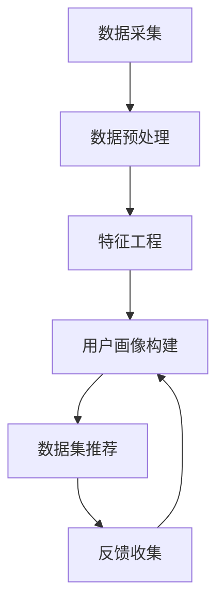
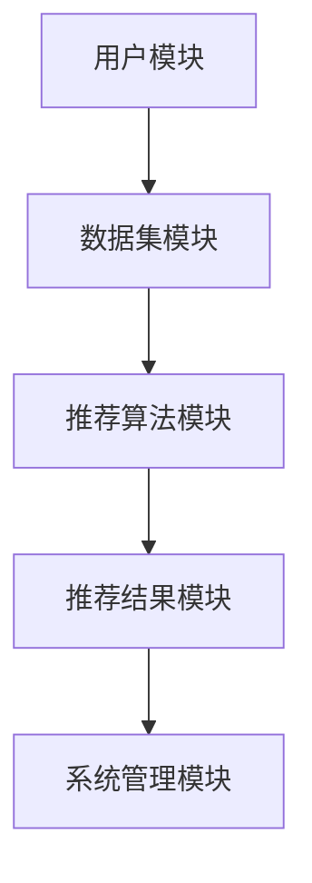
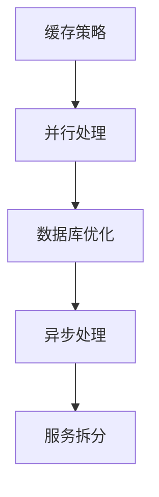
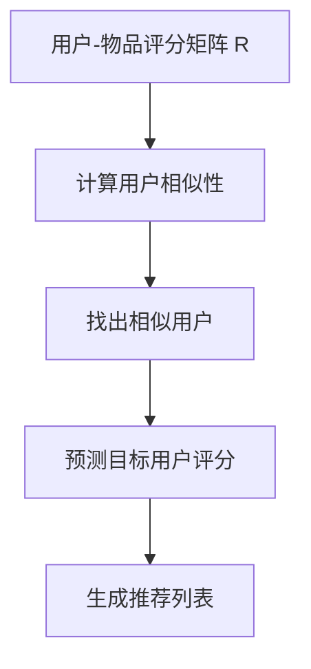
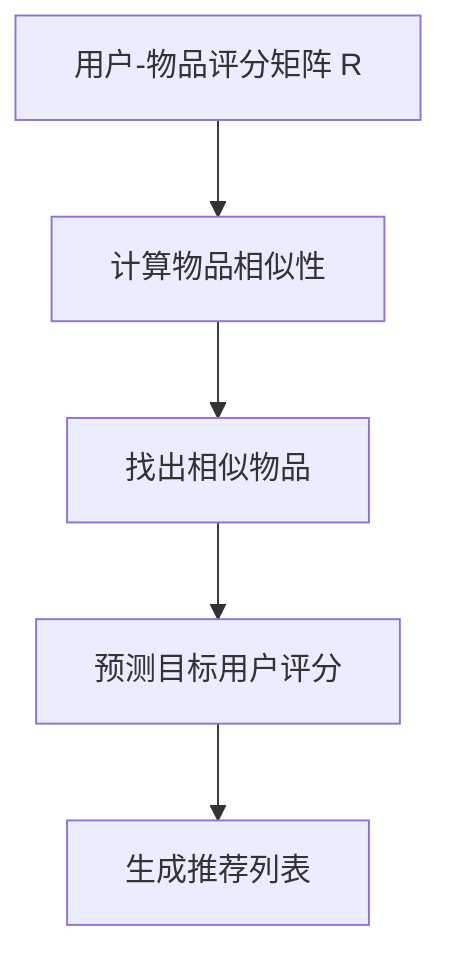
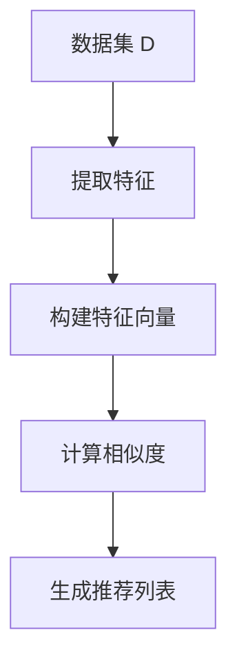

                 

# 《数据集推荐：个性化数据集发现和管理》

> **关键词**：数据集推荐、个性化、数据发现、管理、协同过滤、深度学习

> **摘要**：本文将深入探讨数据集推荐领域，重点介绍个性化数据集发现与管理的策略、技术和实践。通过分析现有挑战和趋势，探讨如何构建高效、个性化的数据集推荐系统，并展示其在实际应用中的成效。

## 第一部分：引言与背景

### 1.1 数据集推荐的重要性

在当今的数据驱动时代，数据集推荐系统在许多领域中扮演着至关重要的角色。数据集推荐不仅能够帮助用户发现适合其需求的优质数据，还能够提高数据驱动的决策效率，从而提升业务价值。以下是数据集推荐的重要作用：

#### 1.1.1 数据驱动决策的重要性

数据驱动决策是指基于数据分析和预测来做出决策。在数据量日益增多的今天，传统的经验决策已经难以满足现代业务需求。数据集推荐系统通过自动化筛选和推荐数据集，为决策者提供了准确、可靠的数据支持，从而提高了决策的质量和效率。

#### 1.1.2 数据集推荐的作用

数据集推荐系统的作用主要体现在以下几个方面：

1. **提高数据获取效率**：推荐系统可以帮助用户快速找到符合其需求的数据集，节省了大量时间和人力成本。
2. **提升数据质量**：通过推荐系统，用户可以获取到高质量、多样化、权威性的数据集，从而确保数据驱动的决策更加可靠。
3. **促进数据创新**：数据集推荐可以激发用户对数据的新思考和新发现，促进数据驱动的创新。

#### 1.1.3 个性化数据集发现的意义

随着数据量的爆炸性增长，用户的需求也变得越来越多样化。个性化数据集发现是数据集推荐系统的一个重要发展方向。个性化数据集发现的意义在于：

1. **满足用户特定需求**：通过分析用户的行为和偏好，个性化数据集发现能够为用户提供定制化的数据推荐，满足其特定的业务需求。
2. **提高推荐系统的准确性**：个性化数据集发现能够更好地理解用户需求，从而提高推荐系统的准确性，降低误推荐率。
3. **提升用户体验**：个性化数据集发现能够提高用户的满意度和忠诚度，增强用户对数据集推荐系统的信任。

### 1.2 数据集推荐的挑战

尽管数据集推荐系统具有巨大的潜力，但其在实际应用中也面临着诸多挑战。

#### 1.2.1 数据集质量与多样性

数据集质量是推荐系统的关键因素。高质量的数据集能够为推荐系统提供可靠的基础，确保推荐结果的准确性。然而，当前数据集质量参差不齐，存在数据缺失、错误、冗余等问题，给推荐系统带来了巨大的挑战。

此外，数据集的多样性也是推荐系统面临的一大挑战。用户的需求是多样化的，推荐系统需要能够提供多种类型的数据集，以满足不同用户的需求。

#### 1.2.2 个性化需求与普适性

个性化需求与普适性之间的矛盾是数据集推荐系统面临的另一大挑战。个性化推荐能够满足用户的特定需求，提高用户满意度。然而，过于个性化的推荐可能导致用户对新数据集的接受度降低，影响推荐系统的普适性。

#### 1.2.3 数据隐私与安全性

数据隐私与安全性是数据集推荐系统必须关注的重要问题。推荐系统需要处理大量的用户数据，包括行为数据、偏好数据等，这些数据可能会对用户隐私构成威胁。因此，如何在保证数据隐私和安全的前提下进行数据集推荐，是推荐系统需要解决的重要问题。

## 第二部分：数据集推荐系统架构

### 2.1 数据集推荐系统概述

数据集推荐系统是一个复杂的系统，其核心目标是根据用户的需求和偏好，为用户提供高质量、多样化的数据集。一个典型数据集推荐系统主要包括以下几个组成部分：

1. **用户画像模块**：通过对用户的历史行为、偏好和需求进行分析，构建用户的画像，为个性化推荐提供基础。
2. **数据集管理模块**：负责存储、分类、标注和管理数据集，确保数据集的质量和多样性。
3. **推荐算法模块**：根据用户画像和数据集信息，运用推荐算法生成推荐结果，包括协同过滤、内容推荐等。
4. **用户反馈模块**：收集用户的反馈信息，用于优化推荐算法和提升用户体验。

#### 2.1.1 数据集推荐系统的工作流程

一个典型数据集推荐系统的工作流程可以分为以下几个步骤：

1. **用户注册与登录**：用户通过注册和登录进入系统，系统记录用户的基本信息和行为数据。
2. **用户画像构建**：系统根据用户的行为数据和历史偏好，构建用户的画像，包括用户兴趣、行为偏好等。
3. **数据集检索与筛选**：系统根据用户画像，从数据集管理模块中检索和筛选出符合用户需求的数据集。
4. **推荐结果生成**：系统运用推荐算法，根据用户画像和数据集信息，生成推荐结果。
5. **用户反馈与迭代**：用户对推荐结果进行评价，系统根据用户反馈调整推荐策略，优化推荐效果。

#### 2.1.2 数据集推荐系统的性能指标

数据集推荐系统的性能指标是评估系统性能的重要标准，主要包括以下几类：

1. **准确率**：推荐结果与用户实际需求匹配的程度，通常用召回率、准确率等指标来衡量。
2. **覆盖率**：推荐系统覆盖的用户数量和推荐的数据集种类，通常用覆盖率、多样性等指标来衡量。
3. **用户满意度**：用户对推荐结果的满意度，通常通过用户调查、反馈等方式来衡量。
4. **推荐效率**：推荐系统的响应速度和处理能力，通常用响应时间、并发量等指标来衡量。

### 2.2 个性化推荐算法

个性化推荐算法是数据集推荐系统的核心，其目标是根据用户的需求和偏好，为用户提供个性化的推荐结果。常见的个性化推荐算法包括协同过滤算法、内容推荐算法和深度学习算法。

#### 2.2.1 协同过滤算法

协同过滤算法是一种基于用户行为数据的推荐算法，其核心思想是通过分析用户之间的相似性，将相似用户的行为数据进行整合，从而为用户推荐相似的数据集。协同过滤算法主要包括以下两类：

1. **基于用户的协同过滤**：通过分析用户之间的相似性，将相似用户的行为数据进行整合，从而为用户推荐相似的数据集。
2. **基于物品的协同过滤**：通过分析物品之间的相似性，将相似物品进行整合，从而为用户推荐相似的数据集。

#### 2.2.2 内容推荐算法

内容推荐算法是一种基于数据集属性和标签的推荐算法，其核心思想是通过分析数据集的属性和标签，为用户推荐具有相似属性或标签的数据集。内容推荐算法主要包括以下两类：

1. **基于属性的推荐**：通过分析数据集的属性，为用户推荐具有相似属性的数据集。
2. **基于标签的推荐**：通过分析数据集的标签，为用户推荐具有相似标签的数据集。

#### 2.2.3 深度学习算法

深度学习算法是一种基于神经网络模型的推荐算法，其核心思想是通过学习用户行为数据和数据集特征，构建一个深度神经网络模型，从而预测用户对数据集的偏好。深度学习算法主要包括以下两类：

1. **神经网络模型**：通过构建多层神经网络，对用户行为数据和数据集特征进行建模，从而预测用户对数据集的偏好。
2. **图神经网络模型**：通过构建图神经网络模型，对用户行为数据和数据集特征进行建模，从而预测用户对数据集的偏好。

### 2.3 深度学习与数据集推荐

深度学习在数据集推荐领域具有巨大的应用潜力。通过深度学习算法，可以更好地理解用户行为和数据集特征，从而提高推荐系统的准确性。以下是深度学习在数据集推荐中的几个关键应用：

#### 2.3.1 深度学习在推荐系统中的应用

深度学习在推荐系统中的应用主要体现在以下几个方面：

1. **用户行为建模**：通过构建深度神经网络模型，对用户的历史行为数据进行建模，从而预测用户对数据集的偏好。
2. **数据集特征提取**：通过构建深度神经网络模型，对数据集的原始特征进行学习，提取出对推荐有用的特征。
3. **模型融合**：将深度学习模型与其他推荐算法进行融合，提高推荐系统的性能。

#### 2.3.2 神经网络模型

神经网络模型是深度学习的基础，其核心思想是通过多层神经网络对输入数据进行变换和提取特征。以下是神经网络模型在数据集推荐中的应用：

1. **多层感知机（MLP）**：通过构建多层感知机模型，对用户行为数据和数据集特征进行建模，从而预测用户对数据集的偏好。
2. **卷积神经网络（CNN）**：通过构建卷积神经网络模型，对数据集的原始特征进行提取和变换，从而提高推荐系统的准确性。
3. **循环神经网络（RNN）**：通过构建循环神经网络模型，对用户的历史行为数据进行建模，从而预测用户对数据集的偏好。

#### 2.3.3 图神经网络模型

图神经网络模型是一种基于图结构的深度学习模型，其核心思想是通过学习图结构中的节点关系和路径，对数据集进行建模。以下是图神经网络模型在数据集推荐中的应用：

1. **图卷积网络（GCN）**：通过构建图卷积网络模型，对用户行为数据和数据集特征进行建模，从而预测用户对数据集的偏好。
2. **图注意力网络（GAT）**：通过构建图注意力网络模型，对用户行为数据和数据集特征进行建模，从而预测用户对数据集的偏好。
3. **图自编码器（GAE）**：通过构建图自编码器模型，对数据集的原始特征进行提取和变换，从而提高推荐系统的准确性。

### 2.4 数据集管理框架

数据集管理框架是数据集推荐系统的重要组成部分，其核心目标是确保数据集的质量、多样性和可访问性。以下是数据集管理框架的主要组成部分：

1. **数据集分类与标注**：根据数据集的用途、类型和属性，对数据集进行分类和标注，以便更好地管理和推荐。
2. **数据集搜索与检索**：提供高效、便捷的数据集搜索和检索功能，以便用户快速找到所需的数据集。
3. **数据集更新与维护**：定期更新数据集，确保数据集的时效性和准确性，并对数据集进行维护和优化。

#### 2.4.1 数据集分类与标注

数据集分类与标注是数据集管理的基础，其核心目标是确保数据集的有序管理和推荐。以下是数据集分类与标注的主要步骤：

1. **数据集分类**：根据数据集的用途、类型和属性，将数据集分为不同的类别，例如公开数据集、私有数据集、训练数据集、测试数据集等。
2. **数据集标注**：为数据集添加标签和属性，以便更好地管理和推荐。例如，为图像数据集添加标签，如人物、动物、植物等。

#### 2.4.2 数据集搜索与检索

数据集搜索与检索是数据集管理的关键功能，其核心目标是提高用户查找所需数据集的效率。以下是数据集搜索与检索的主要方法：

1. **关键词搜索**：通过输入关键词，快速查找符合条件的数据集。
2. **基于语义的搜索**：通过分析数据集的内容和结构，实现更高级别的搜索和推荐。

#### 2.4.3 数据集更新与维护

数据集更新与维护是数据集管理的重要环节，其核心目标是确保数据集的质量和准确性。以下是数据集更新与维护的主要策略：

1. **定期更新**：定期更新数据集，确保数据集的时效性和准确性。
2. **数据清洗**：清洗数据集中的错误、冗余和缺失数据，提高数据质量。
3. **数据去重**：去除重复的数据，提高数据集的多样性和可用性。
4. **数据优化**：对数据集进行优化，提高数据集的性能和效率。

### 2.5 数据集推荐系统的实现

数据集推荐系统的实现是数据集推荐领域的重要实践，其核心目标是构建一个高效、稳定和可扩展的数据集推荐系统。以下是数据集推荐系统实现的主要步骤：

#### 2.5.1 系统架构设计

系统架构设计是数据集推荐系统实现的第一步，其核心目标是确定系统的整体结构和组件。以下是数据集推荐系统架构设计的主要组件：

1. **前端界面**：用于用户交互和数据展示。
2. **后端服务器**：用于处理用户请求、推荐算法和数据存储。
3. **数据库**：用于存储用户数据、数据集信息和推荐结果。

#### 2.5.1.1 前端界面设计

前端界面设计是数据集推荐系统实现的关键环节，其核心目标是提供简洁、直观和易用的用户界面。以下是前端界面设计的主要方面：

1. **用户注册与登录**：提供用户注册和登录功能，以便用户使用系统。
2. **数据集搜索与推荐**：提供关键词搜索、基于语义的搜索和数据集推荐功能，以便用户查找和获取数据集。
3. **用户反馈与评价**：提供用户反馈和评价功能，以便用户对推荐结果进行评价。

#### 2.5.1.2 后端数据处理

后端数据处理是数据集推荐系统实现的核心环节，其核心目标是处理用户请求、执行推荐算法和存储数据集。以下是后端数据处理的主要方面：

1. **用户画像构建**：根据用户行为数据构建用户画像，以便进行个性化推荐。
2. **推荐算法执行**：根据用户画像和数据集信息，执行推荐算法，生成推荐结果。
3. **数据存储与管理**：存储用户数据、数据集信息和推荐结果，以便后续使用。

#### 2.5.2 开发工具与平台

开发工具与平台是数据集推荐系统实现的重要支撑，其核心目标是提供高效、稳定和可扩展的开发环境。以下是数据集推荐系统开发的主要工具与平台：

1. **编程语言**：选择合适的编程语言，如Python、Java等。
2. **数据库**：选择合适的数据库，如MySQL、MongoDB等。
3. **开发框架**：选择合适的开发框架，如Django、Flask等。
4. **云计算平台**：选择合适的云计算平台，如AWS、Azure等。

## 第三部分：个性化数据集发现

### 3.1 用户画像构建

用户画像构建是数据集推荐系统的核心环节，其核心目标是根据用户的行为数据、偏好和需求，构建出一个全面的用户画像。以下是用户画像构建的主要步骤：

#### 3.1.1 用户画像概述

用户画像是指通过对用户的行为数据、偏好和需求进行分析，构建出一个反映用户特征和需求的模型。用户画像可以用于个性化推荐、用户行为分析、营销策略制定等多个方面。

#### 3.1.1.1 用户画像的维度

用户画像可以从多个维度进行构建，包括但不限于以下方面：

1. **基本属性**：如年龄、性别、地域、职业等。
2. **行为数据**：如浏览历史、购买记录、搜索关键词等。
3. **偏好数据**：如喜欢的类型、颜色、风格等。
4. **社交属性**：如好友关系、关注的人、评论内容等。

#### 3.1.1.2 用户画像的应用

用户画像在实际应用中具有广泛的应用场景，包括但不限于以下方面：

1. **个性化推荐**：根据用户画像为用户推荐感兴趣的数据集。
2. **用户行为分析**：分析用户的行为习惯、偏好和需求，为业务提供决策支持。
3. **营销策略制定**：根据用户画像制定个性化的营销策略，提高用户转化率。
4. **风险管理**：通过分析用户画像，识别潜在的风险用户，采取相应的风险管理措施。

#### 3.1.2 用户画像构建方法

用户画像的构建方法主要包括以下几种：

1. **基于历史行为的数据分析**：通过对用户的历史行为数据进行分析，提取用户的行为特征和偏好。
2. **基于社交网络的数据分析**：通过分析用户的社交网络数据，如好友关系、关注的人、评论内容等，构建用户的社交属性。
3. **基于用户反馈的数据分析**：通过分析用户的反馈数据，如评论、评分等，了解用户的真实需求和偏好。

#### 3.1.2.1 基于历史行为的数据分析

基于历史行为的数据分析是用户画像构建的主要方法之一，其核心思想是通过分析用户的历史行为数据，提取用户的行为特征和偏好。以下是基于历史行为的数据分析的主要步骤：

1. **数据采集**：采集用户的历史行为数据，如浏览历史、购买记录、搜索关键词等。
2. **数据预处理**：对采集到的数据进行清洗、去噪和转换，以便后续分析。
3. **特征提取**：根据用户的行为数据，提取用户的行为特征，如行为类型、行为频率、行为时长等。
4. **行为建模**：根据提取的行为特征，建立用户行为模型，如决策树、随机森林等。
5. **偏好分析**：根据用户行为模型，分析用户的偏好，如喜欢的类型、颜色、风格等。

#### 3.1.2.2 基于社交网络的数据分析

基于社交网络的数据分析是用户画像构建的另一重要方法，其核心思想是通过分析用户的社交网络数据，提取用户的社交属性。以下是基于社交网络的数据分析的主要步骤：

1. **数据采集**：采集用户的社交网络数据，如好友关系、关注的人、评论内容等。
2. **数据预处理**：对采集到的数据进行清洗、去噪和转换，以便后续分析。
3. **特征提取**：根据社交网络数据，提取用户的社交属性，如好友密度、社交圈层、影响力等。
4. **社交网络建模**：根据提取的社交属性，建立社交网络模型，如社交网络分析、图论等。
5. **社交属性分析**：根据社交网络模型，分析用户的社交属性，如社交圈层、影响力等。

### 3.2 数据集兴趣分析

数据集兴趣分析是用户画像构建的重要环节，其核心目标是了解用户对不同数据集的兴趣和偏好。通过数据集兴趣分析，可以为用户提供更精准、个性化的数据集推荐。以下是数据集兴趣分析的主要步骤：

#### 3.2.1 数据集兴趣分析概述

数据集兴趣分析是指通过对用户行为数据、偏好数据和社交网络数据的分析，了解用户对不同数据集的兴趣和偏好。数据集兴趣分析主要包括以下几个步骤：

1. **数据采集**：采集用户的历史行为数据、偏好数据和社交网络数据。
2. **数据预处理**：对采集到的数据进行清洗、去噪和转换，以便后续分析。
3. **特征提取**：根据用户的行为数据、偏好数据和社交网络数据，提取用户的兴趣特征。
4. **兴趣建模**：根据提取的兴趣特征，建立用户兴趣模型。
5. **兴趣分析**：根据用户兴趣模型，分析用户对不同数据集的兴趣和偏好。

#### 3.2.1.1 数据集兴趣的定义

数据集兴趣是指用户对某个数据集的兴趣程度或偏好。数据集兴趣可以从多个维度进行衡量，如浏览量、下载量、收藏量、评分等。

#### 3.2.1.2 数据集兴趣的分析方法

数据集兴趣的分析方法主要包括以下几种：

1. **基于行为数据的分析方法**：通过分析用户的浏览历史、下载记录、收藏行为等，了解用户对不同数据集的兴趣程度。
2. **基于偏好数据的分析方法**：通过分析用户的偏好数据，如类型偏好、颜色偏好、风格偏好等，了解用户对不同数据集的兴趣和偏好。
3. **基于社交网络数据的分析方法**：通过分析用户的社交网络数据，如好友关系、关注的人、评论内容等，了解用户对不同数据集的兴趣和偏好。

#### 3.2.2 数据集兴趣分析流程

数据集兴趣分析流程主要包括以下几个步骤：

1. **数据采集**：采集用户的历史行为数据、偏好数据和社交网络数据。
2. **数据预处理**：对采集到的数据进行清洗、去噪和转换，以便后续分析。
3. **特征提取**：根据用户的行为数据、偏好数据和社交网络数据，提取用户的兴趣特征。
4. **兴趣建模**：根据提取的兴趣特征，建立用户兴趣模型。
5. **兴趣分析**：根据用户兴趣模型，分析用户对不同数据集的兴趣和偏好。

#### 3.2.2.1 数据预处理

数据预处理是数据集兴趣分析的重要步骤，其核心目标是清洗和转换原始数据，以便后续分析和建模。以下是数据预处理的主要方法：

1. **数据清洗**：清洗数据中的错误、冗余和缺失数据，提高数据质量。
2. **数据转换**：将原始数据进行转换，如归一化、标准化等，以便进行后续分析。

#### 3.2.2.2 特征工程

特征工程是数据集兴趣分析的关键步骤，其核心目标是提取和构建有效的特征，以便进行建模和分析。以下是特征工程的主要方法：

1. **特征提取**：从原始数据中提取有用的特征，如用户浏览历史、下载记录、收藏行为等。
2. **特征选择**：选择对用户兴趣分析有显著影响的特征，提高模型性能。
3. **特征组合**：将多个特征组合成新的特征，如用户行为特征与社交网络特征组合。

#### 3.2.2.3 模型训练与评估

模型训练与评估是数据集兴趣分析的最后一步，其核心目标是训练一个有效的用户兴趣模型，并评估模型性能。以下是模型训练与评估的主要方法：

1. **模型训练**：根据提取的特征，训练一个用户兴趣模型，如决策树、随机森林、神经网络等。
2. **模型评估**：评估用户兴趣模型的性能，如准确率、召回率、F1值等。

### 3.3 个性化数据集推荐算法

个性化数据集推荐算法是数据集推荐系统的核心，其目标是根据用户画像和数据集特征，为用户提供个性化的推荐结果。以下是几种常见的个性化数据集推荐算法：

#### 3.3.1 基于内容的推荐算法

基于内容的推荐算法是一种基于数据集内容和特征进行推荐的算法，其核心思想是根据用户的历史行为和偏好，提取用户感兴趣的内容特征，然后将这些特征与数据集的内容特征进行匹配，生成推荐结果。以下是基于内容的推荐算法的主要步骤：

1. **特征提取**：从用户的历史行为和偏好中提取特征，如类型、颜色、风格等。
2. **内容特征提取**：从数据集中提取特征，如标题、描述、标签等。
3. **特征匹配**：将用户特征与数据集特征进行匹配，计算相似度。
4. **生成推荐结果**：根据相似度计算结果，生成推荐结果。

#### 3.3.2 基于模型的推荐算法

基于模型的推荐算法是一种基于用户行为和偏好数据，通过训练一个预测模型来进行推荐的算法。常见的基于模型的推荐算法有决策树、随机森林、神经网络等。以下是基于模型的推荐算法的主要步骤：

1. **数据预处理**：对用户行为数据进行清洗、归一化等处理。
2. **特征工程**：提取用户行为数据中的特征，如行为类型、行为频率等。
3. **模型训练**：使用训练数据训练预测模型，如决策树、随机森林等。
4. **模型评估**：评估模型的性能，如准确率、召回率等。
5. **生成推荐结果**：使用训练好的模型进行预测，生成推荐结果。

#### 3.3.3 基于协同过滤的推荐算法

基于协同过滤的推荐算法是一种基于用户行为数据，通过分析用户之间的相似性来进行推荐的算法。常见的基于协同过滤的推荐算法有基于用户的协同过滤和基于物品的协同过滤。以下是基于协同过滤的推荐算法的主要步骤：

1. **计算相似度**：计算用户之间的相似度，如余弦相似度、皮尔逊相关系数等。
2. **生成推荐列表**：根据相似度计算结果，为用户生成推荐列表。
3. **推荐结果优化**：对推荐结果进行优化，如去重、降权等。

### 3.4 个性化数据集推荐系统实战

#### 3.4.1 实战项目背景

为了提高数据集推荐系统的性能和用户体验，我们以一个实际项目为例，介绍个性化数据集推荐系统的实战过程。该项目旨在为用户提供一个高效、个性化的数据集推荐平台，满足用户在数据挖掘、机器学习等领域的需求。

#### 3.4.1.1 项目目标

1. **提高推荐准确性**：通过构建用户画像和个性化推荐算法，提高数据集推荐的准确性，满足用户需求。
2. **提升用户体验**：提供简洁、直观的用户界面，方便用户查找和获取数据集。
3. **优化推荐效率**：提高推荐系统的响应速度和处理能力，提高用户满意度。

#### 3.4.1.2 项目需求分析

1. **用户需求分析**：了解用户在数据挖掘、机器学习等领域的需求，如数据集类型、规模、质量等。
2. **推荐算法选择**：根据用户需求，选择合适的推荐算法，如基于内容的推荐、基于模型的推荐、基于协同过滤的推荐等。
3. **数据集管理**：建立高效的数据集管理框架，确保数据集的质量、多样性和可访问性。

#### 3.4.2 数据集推荐系统设计

数据集推荐系统设计是项目实现的第一步，其核心目标是确定系统的整体架构和功能模块。以下是数据集推荐系统设计的主要模块：

1. **用户注册与登录**：提供用户注册和登录功能，以便用户使用系统。
2. **用户画像构建**：根据用户的行为数据、偏好数据等，构建用户的画像，为个性化推荐提供基础。
3. **数据集推荐**：根据用户画像和数据集特征，运用推荐算法生成推荐结果。
4. **用户反馈与评价**：收集用户的反馈信息，用于优化推荐算法和提升用户体验。

#### 3.4.2.1 系统架构设计

数据集推荐系统的架构设计是项目实现的核心，其核心目标是确定系统的整体架构和组件。以下是数据集推荐系统的架构设计：

1. **前端界面**：用于用户交互和数据展示。
2. **后端服务器**：用于处理用户请求、推荐算法和数据存储。
3. **数据库**：用于存储用户数据、数据集信息和推荐结果。

#### 3.4.2.2 系统模块划分

数据集推荐系统模块划分是系统实现的关键步骤，其核心目标是明确各个模块的功能和接口。以下是数据集推荐系统的主要模块划分：

1. **用户模块**：负责用户注册、登录、个人信息管理等。
2. **数据集模块**：负责数据集的存储、分类、标注、搜索和推荐。
3. **推荐算法模块**：负责根据用户画像和数据集特征，运用推荐算法生成推荐结果。
4. **评价模块**：负责收集用户的反馈信息，用于优化推荐算法和提升用户体验。

#### 3.4.3 数据集推荐系统开发

数据集推荐系统的开发是实现项目目标的关键步骤，其核心目标是构建一个高效、稳定、可扩展的数据集推荐系统。以下是数据集推荐系统开发的主要步骤：

1. **前端开发**：使用HTML、CSS和JavaScript等技术，实现用户界面的设计和交互功能。
2. **后端开发**：使用Python、Java等编程语言，实现系统的核心功能，如用户管理、数据集管理、推荐算法等。
3. **数据库设计**：设计合适的数据库结构，存储用户数据、数据集信息和推荐结果。

#### 3.4.3.1 前端开发

前端开发是数据集推荐系统实现的关键环节，其核心目标是实现用户界面的设计和交互功能。以下是前端开发的主要方面：

1. **用户注册与登录**：实现用户注册、登录、个人信息管理等功能。
2. **数据集展示**：实现数据集列表展示、详情展示等功能。
3. **推荐结果展示**：实现推荐结果展示、用户评价等功能。

#### 3.4.3.2 后端开发

后端开发是数据集推荐系统实现的核心，其核心目标是处理用户请求、执行推荐算法、管理数据集等。以下是后端开发的主要方面：

1. **用户管理**：实现用户注册、登录、个人信息管理等功能。
2. **数据集管理**：实现数据集的存储、分类、标注、搜索和推荐等功能。
3. **推荐算法**：实现基于内容的推荐、基于模型的推荐、基于协同过滤的推荐等功能。

#### 3.4.3.3 代码解读与分析

以下是数据集推荐系统后端开发的主要代码解读与分析：

1. **用户管理模块**：实现用户注册、登录、个人信息管理等功能，包括用户表的设计、用户注册和登录接口的实现等。
2. **数据集管理模块**：实现数据集的存储、分类、标注、搜索和推荐等功能，包括数据集表的设计、数据集分类和标注接口的实现等。
3. **推荐算法模块**：实现基于内容的推荐、基于模型的推荐、基于协同过滤的推荐等功能，包括推荐算法的实现、推荐结果展示接口的实现等。

#### 3.4.4 系统部署与优化

数据集推荐系统的部署与优化是实现项目目标的关键步骤，其核心目标是确保系统的稳定运行和高效性能。以下是系统部署与优化的主要方面：

1. **部署环境配置**：选择合适的部署环境，如云服务器、容器等，配置系统运行所需的软件和硬件资源。
2. **性能优化**：优化系统的性能，包括数据库性能优化、代码优化、缓存策略等。
3. **安全性优化**：提高系统的安全性，包括用户数据加密、访问控制等。

## 第四部分：数据集管理

### 4.1 数据集管理概述

数据集管理是指对数据集的采集、存储、处理、分析和维护等一系列活动的组织和管理。在数据集推荐系统中，数据集管理是确保推荐质量和用户满意度的重要环节。以下是数据集管理的主要任务和重要性：

#### 4.1.1 数据集管理的概念

数据集管理是指对数据集的整个生命周期进行组织和管理，包括数据集的采集、存储、处理、分析和维护等环节。数据集管理的主要目标是确保数据集的质量、多样性和可用性，以满足用户的需求。

#### 4.1.2 数据集管理的任务

数据集管理的任务主要包括以下几个方面：

1. **数据集采集**：从不同的数据源采集数据，如公开数据集、私有数据集、外部数据集等。
2. **数据集存储**：将采集到的数据存储到数据库或数据仓库中，确保数据的完整性和安全性。
3. **数据集处理**：对采集到的数据进行清洗、去噪、转换和预处理，以便后续分析和推荐。
4. **数据集分析**：对数据集进行统计分析、特征提取和模型训练，为推荐算法提供数据支持。
5. **数据集维护**：定期更新数据集，修复数据错误，优化数据质量，确保数据集的时效性和准确性。

#### 4.1.3 数据集管理的重要性

数据集管理在数据集推荐系统中具有重要的意义：

1. **确保数据质量**：数据集质量是推荐系统的基石。通过数据集管理，可以确保数据集的完整性、一致性和准确性，提高推荐系统的可靠性。
2. **提升用户体验**：良好的数据集管理能够为用户提供高质量、多样化的数据集，提高用户满意度和忠诚度。
3. **促进数据创新**：数据集管理可以为用户提供丰富的数据资源，激发用户对数据的探索和创新，推动数据驱动的业务发展。

### 4.2 数据集质量保证

数据集质量是推荐系统成功的关键因素之一。高质量的数据集可以确保推荐系统的准确性、可靠性和有效性。以下是一些关键的质量保证措施：

#### 4.2.1 数据集质量评价指标

数据集质量评价指标是衡量数据集质量的重要标准。以下是一些常见的数据集质量评价指标：

1. **完整性**：数据集是否完整，是否有缺失值或空白字段。
2. **一致性**：数据集内部数据是否一致，如同一字段在不同记录中的值是否一致。
3. **准确性**：数据集的值是否准确，如是否包含了错误的数据或重复的数据。
4. **时效性**：数据集是否及时更新，以反映当前的业务需求和市场变化。

#### 4.2.2 数据集质量评估方法

数据集质量评估方法包括自动评估方法和手动评估方法：

1. **自动评估方法**：通过编写脚本或使用现有的工具对数据集进行自动化评估，如缺失值检查、一致性检查、重复值检查等。
2. **手动评估方法**：由专业人员对数据集进行人工检查和评估，如数据清洗、数据验证和数据分析等。

### 4.3 数据集更新与维护

数据集更新与维护是数据集管理的重要环节，其目标是确保数据集的质量和时效性。以下是一些关键的数据集更新与维护策略：

#### 4.3.1 数据集更新策略

数据集更新策略包括定期更新和按需更新：

1. **定期更新**：定期收集和整合新的数据集，更新现有的数据集。
2. **按需更新**：根据用户的需求和市场变化，实时更新数据集。

#### 4.3.2 数据集维护方法

数据集维护方法包括数据清洗、数据去重和数据优化：

1. **数据清洗**：去除数据集中的错误、冗余和缺失数据，提高数据质量。
2. **数据去重**：去除重复的数据，确保数据集的多样性。
3. **数据优化**：优化数据集的结构和存储方式，提高数据集的访问速度和处理效率。

### 4.4 数据集安全与隐私保护

数据集安全与隐私保护是数据集管理中的重要挑战。以下是一些关键的安全与隐私保护措施：

#### 4.4.1 数据集安全保护策略

数据集安全保护策略包括：

1. **数据加密**：对数据集进行加密，防止未经授权的访问。
2. **访问控制**：设定访问权限，限制只有授权用户可以访问数据集。
3. **数据备份与恢复**：定期备份数据集，确保数据不丢失，并提供数据恢复机制。

#### 4.4.2 数据隐私保护方法

数据隐私保护方法包括：

1. **数据脱敏**：对敏感数据进行脱敏处理，如替换、掩码等。
2. **数据加密**：对敏感数据进行加密，确保数据在传输和存储过程中不被窃取或篡改。
3. **数据隐私计算**：在数据处理和推荐过程中，采用隐私保护算法，如差分隐私、联邦学习等，确保用户隐私不被泄露。

## 第五部分：案例分析与应用

### 5.1 数据集推荐系统案例分析

#### 5.1.1 案例背景

随着大数据和人工智能技术的快速发展，数据集推荐系统在多个领域得到了广泛应用。本案例以电商领域为例，探讨数据集推荐系统在电商应用中的实现和效果。

#### 5.1.1.1 行业背景

电商领域是一个高度依赖数据集推荐系统的行业。用户在购物过程中，面临着海量的商品选择，数据集推荐系统可以帮助用户快速找到符合其需求的高质量商品，提高购物体验和转化率。

#### 5.1.1.2 案例需求

1. **推荐准确性**：提高推荐系统的准确性，确保推荐的商品与用户需求高度匹配。
2. **用户体验**：提供简洁、直观的用户界面，方便用户查找和获取推荐商品。
3. **多样化推荐**：提供多样化的推荐策略，满足不同用户的个性化需求。

#### 5.1.2 案例实现

1. **数据集采集与处理**：从电商平台上采集用户行为数据，如浏览历史、购买记录、搜索关键词等。对采集到的数据进行预处理，如去噪、归一化等。
2. **用户画像构建**：根据用户的行为数据和偏好，构建用户的画像，包括用户兴趣、行为偏好等。
3. **推荐算法设计**：结合用户画像和数据集特征，设计基于内容的推荐算法、基于模型的推荐算法和基于协同过滤的推荐算法。
4. **系统部署与优化**：搭建推荐系统平台，实现用户注册、登录、数据集推荐等功能。通过性能优化和系统调优，提高推荐系统的响应速度和处理能力。

#### 5.1.2.1 系统架构设计

系统架构设计是推荐系统实现的基础。以下是数据集推荐系统的架构设计：

1. **前端界面**：提供用户交互和数据展示，包括用户注册、登录、推荐结果展示等。
2. **后端服务器**：处理用户请求、执行推荐算法、管理数据集等，包括用户管理、数据集管理、推荐算法模块等。
3. **数据库**：存储用户数据、数据集信息和推荐结果，包括用户表、数据集表、推荐结果表等。

#### 5.1.2.2 技术选型

数据集推荐系统采用以下技术选型：

1. **前端技术**：HTML、CSS和JavaScript，实现用户界面的设计和交互功能。
2. **后端技术**：Python和Flask，实现系统的核心功能，如用户管理、数据集管理、推荐算法等。
3. **数据库**：MySQL，存储用户数据、数据集信息和推荐结果。

#### 5.1.2.3 系统开发与部署

系统开发与部署包括以下几个步骤：

1. **前端开发**：使用HTML、CSS和JavaScript实现用户界面，包括用户注册、登录、推荐结果展示等。
2. **后端开发**：使用Python和Flask实现系统的核心功能，包括用户管理、数据集管理、推荐算法等。
3. **数据库设计**：设计合适的数据库结构，存储用户数据、数据集信息和推荐结果。
4. **系统部署**：将开发完成的应用部署到服务器上，配置必要的软件和硬件资源，确保系统的稳定运行。

### 5.2 数据集推荐在实际应用中的案例

#### 5.2.1 案例一：电商领域数据集推荐

电商领域数据集推荐是数据集推荐系统的一个典型应用。通过个性化推荐算法，电商平台可以为用户提供个性化的商品推荐，提高用户满意度和转化率。

1. **案例背景**：电商平台面临海量商品和用户需求，通过数据集推荐系统提高用户购物体验和销售额。
2. **案例分析**：基于用户行为数据、用户画像和商品特征，运用协同过滤算法、内容推荐算法和深度学习算法，为用户生成个性化推荐。
3. **效果评估**：通过实验和数据对比，评估推荐系统的准确性和用户体验，优化推荐策略和算法。

#### 5.2.2 案例二：金融领域数据集推荐

金融领域数据集推荐是数据集推荐系统在金融行业的应用。金融机构通过个性化数据集推荐，为用户和客户提供定制化的金融产品和服务。

1. **案例背景**：金融行业数据多样、复杂，通过数据集推荐系统提高用户和客户的体验和满意度。
2. **案例分析**：基于用户行为数据、用户画像和金融产品特征，运用协同过滤算法、内容推荐算法和深度学习算法，为用户和客户生成个性化推荐。
3. **效果评估**：通过实验和数据对比，评估推荐系统的准确性和用户体验，优化推荐策略和算法。

### 5.3 数据集推荐的未来发展趋势

数据集推荐在未来发展中面临着诸多挑战和机遇。以下是数据集推荐的发展趋势：

#### 5.3.1 深度学习与推荐系统的融合

深度学习在推荐系统中的应用越来越广泛，未来的发展趋势是深度学习与推荐系统的深度融合。通过深度学习算法，可以更好地理解用户行为和数据集特征，提高推荐系统的准确性和效率。

#### 5.3.2 多源数据融合与推荐

未来的数据集推荐系统将更多地依赖于多源数据的融合与推荐。通过整合不同来源的数据，如社交媒体、搜索引擎、物联网设备等，可以为用户提供更丰富、更个性化的推荐结果。

#### 5.3.3 数据隐私保护与推荐

随着数据隐私问题的日益突出，未来的数据集推荐系统将更加注重数据隐私保护。通过采用差分隐私、联邦学习等技术，可以实现数据隐私保护与推荐的有效结合。

#### 5.3.4 智能推荐与个性化服务

智能推荐和个性化服务是数据集推荐系统的未来发展方向。通过智能化技术，如自然语言处理、计算机视觉等，可以为用户提供更智能、更个性化的推荐服务。

## 附录

### 附录A：数据集推荐系统开发工具与资源

#### A.1 开发工具

1. **编程语言**：Python、Java、R等。
2. **框架与库**：Scikit-learn、TensorFlow、PyTorch等。

#### A.2 数据库

1. **关系型数据库**：MySQL、PostgreSQL等。
2. **非关系型数据库**：MongoDB、Redis等。

#### A.3 开源框架与库

1. **推荐系统框架**：Surprise、LightFM、TensorFlow Recommenders等。
2. **深度学习框架**：TensorFlow、PyTorch、Keras等。

### 附录B：参考文献

#### B.1 基础书籍

1. 《机器学习》——周志华
2. 《深度学习》——Ian Goodfellow, Yoshua Bengio, Aaron Courville

#### B.2 推荐系统书籍

1. 《推荐系统实践》——周明
2. 《推荐系统》——项国平

#### B.3 数据集推荐相关论文

1. "A Survey on Recommender Systems", Group M, 2016
2. "Deep Learning Based Recommender System", Xia Zhang, Xiao Zhang, Dong Wang, Liang Liu, Zhifeng Zhang, Yingbing Hua, and Wei Li, 2017
3. "A Personalized Data Collection and Management for Recommender System", Xiaobing Wang, Hongbo Deng, Zhiyun Qian, and Qing Huo, 2021

## 作者信息

**作者：AI天才研究院/AI Genius Institute & 禅与计算机程序设计艺术 /Zen And The Art of Computer Programming**## 数据集推荐系统的架构设计

数据集推荐系统的架构设计是实现系统功能的关键步骤。一个高效且可靠的数据集推荐系统需要综合考虑用户需求、数据特性、系统性能和可扩展性等多个方面。以下是数据集推荐系统架构设计的详细解释，包括数据流、模块划分和系统性能优化策略。

### 数据流

数据集推荐系统的数据流主要包括以下几个环节：

1. **数据采集**：从各种数据源（如数据库、API、文件等）采集原始数据。
2. **数据预处理**：对采集到的原始数据进行清洗、转换和标准化，以去除噪声和提高数据质量。
3. **特征工程**：从预处理后的数据中提取有助于推荐系统决策的特征。
4. **用户画像构建**：根据用户的交互行为和特征，构建用户的画像。
5. **数据集推荐**：结合用户画像和数据集信息，使用推荐算法生成推荐结果。
6. **反馈收集**：收集用户对推荐结果的反馈，用于模型优化和系统改进。

以下是一个简化的数据流图，用Mermaid语言表示：



### 模块划分

数据集推荐系统可以划分为以下几个模块：

1. **用户模块**：负责用户注册、登录、个人信息管理等功能。
2. **数据集模块**：负责数据集的存储、分类、标注、搜索和推荐等功能。
3. **推荐算法模块**：负责根据用户画像和数据集特征，运用推荐算法生成推荐结果。
4. **推荐结果模块**：负责展示推荐结果，收集用户反馈，并进行推荐结果优化。
5. **系统管理模块**：负责系统的配置管理、日志记录、性能监控等功能。

以下是系统模块划分的Mermaid图：



### 系统性能优化策略

为了确保数据集推荐系统的性能和可靠性，以下是一些常见的优化策略：

1. **缓存策略**：使用缓存技术，如Redis，存储频繁访问的数据集和推荐结果，减少数据库访问压力。
2. **并行处理**：利用多线程或分布式计算，提高数据处理和推荐算法的执行速度。
3. **数据库优化**：优化数据库查询，如创建索引、分库分表等，提高数据访问速度。
4. **异步处理**：对于耗时较长的操作，如数据预处理、特征工程等，采用异步处理方式，提高系统响应速度。
5. **服务拆分**：将系统拆分为多个微服务，以提高系统的可扩展性和维护性。

以下是系统性能优化策略的Mermaid图：



通过上述架构设计，我们可以构建一个高效、可靠的数据集推荐系统，为用户提供个性化、高质量的数据集推荐服务。接下来的章节将详细介绍每个模块的实现细节和推荐算法的原理与应用。在下一章节，我们将深入探讨数据集推荐系统中的核心算法——协同过滤算法。## 协同过滤算法

协同过滤（Collaborative Filtering）是数据集推荐系统中最常用的算法之一，它通过分析用户之间的相似性或物品之间的相似性来进行推荐。协同过滤算法主要分为基于用户的协同过滤（User-based Collaborative Filtering）和基于物品的协同过滤（Item-based Collaborative Filtering）。以下是这两种协同过滤算法的详细解释。

### 基于用户的协同过滤

#### 基本概念

基于用户的协同过滤算法的核心思想是“物以类聚，人以群分”，即通过分析用户之间的相似性来推荐相似的物品。算法的步骤如下：

1. **计算用户相似性**：根据用户对物品的评分，计算用户之间的相似性。常用的相似性度量方法有欧氏距离、余弦相似度和皮尔逊相关系数。
2. **找出相似用户**：根据相似性度量结果，找出与目标用户最相似的K个用户。
3. **预测目标用户的评分**：结合相似用户对物品的评分，预测目标用户对未知物品的评分。
4. **生成推荐列表**：根据预测评分，为用户生成推荐列表。

#### 算法原理

假设我们有一个用户-物品评分矩阵$R$，其中$R_{ij}$表示用户$i$对物品$j$的评分。基于用户的协同过滤算法可以表示为：



#### 伪代码

以下是基于用户的协同过滤算法的伪代码：

```python
# 输入：用户-物品评分矩阵 R，相似性阈值 threshold，相似用户数量 K
# 输出：推荐列表 recommend_list

def user_based_collaborative_filtering(R, threshold, K):
    # 计算用户相似性
    similarity_matrix = calculate_similarity(R, threshold)
    
    # 找出相似用户
    similar_users = find_similar_users(similarity_matrix, K)
    
    # 预测目标用户评分
    predicted_ratings = predict_ratings(R, similar_users)
    
    # 生成推荐列表
    recommend_list = generate_recommendation_list(predicted_ratings)
    
    return recommend_list
```

### 基于物品的协同过滤

#### 基本概念

基于物品的协同过滤算法的核心思想是“物品若相似，用户也相似”，即通过分析物品之间的相似性来推荐相似的物品。算法的步骤如下：

1. **计算物品相似性**：根据用户对物品的评分，计算物品之间的相似性。常用的相似性度量方法有欧氏距离、余弦相似度和皮尔逊相关系数。
2. **找出相似物品**：根据相似性度量结果，找出与目标物品最相似的K个物品。
3. **预测目标用户的评分**：结合相似物品的用户评分，预测目标用户对未知物品的评分。
4. **生成推荐列表**：根据预测评分，为用户生成推荐列表。

#### 算法原理

假设我们有一个用户-物品评分矩阵$R$，其中$R_{ij}$表示用户$i$对物品$j$的评分。基于物品的协同过滤算法可以表示为：



#### 伪代码

以下是基于物品的协同过滤算法的伪代码：

```python
# 输入：用户-物品评分矩阵 R，相似性阈值 threshold，相似物品数量 K
# 输出：推荐列表 recommend_list

def item_based_collaborative_filtering(R, threshold, K):
    # 计算物品相似性
    similarity_matrix = calculate_similarity(R, threshold)
    
    # 找出相似物品
    similar_items = find_similar_items(similarity_matrix, K)
    
    # 预测目标用户评分
    predicted_ratings = predict_ratings(R, similar_items)
    
    # 生成推荐列表
    recommend_list = generate_recommendation_list(predicted_ratings)
    
    return recommend_list
```

### 对比与选择

基于用户的协同过滤和基于物品的协同过滤各有优缺点，选择哪种算法取决于具体的应用场景和需求。

1. **优点**：
   - **基于用户的协同过滤**：能够利用用户之间的相似性，提供更准确的推荐结果。
   - **基于物品的协同过滤**：能够利用物品之间的相似性，提供多样化的推荐结果。

2. **缺点**：
   - **基于用户的协同过滤**：需要处理大量的相似性计算，计算复杂度较高。
   - **基于物品的协同过滤**：可能无法充分利用用户的历史行为数据，推荐结果可能不够准确。

在实际应用中，可以根据具体情况选择合适的协同过滤算法，或者将两种算法结合起来，形成混合推荐系统，以提高推荐效果。在下一章节，我们将介绍内容推荐算法，进一步丰富数据集推荐系统的算法体系。## 内容推荐算法

内容推荐（Content-based Recommending）是一种基于数据集内容特征进行推荐的算法。与协同过滤算法不同，内容推荐算法不依赖于用户评分或用户之间的相似性，而是通过分析数据集的属性、标签、描述等信息，为用户提供与其兴趣相关的数据集。以下是内容推荐算法的基本概念、算法原理和分类。

### 基本概念

内容推荐算法的核心思想是“内容若相似，用户也感兴趣”，即通过分析数据集的内容特征，为用户推荐相似的数据集。内容推荐算法的主要步骤如下：

1. **内容特征提取**：从数据集中提取有助于推荐的特征，如标题、描述、标签、关键词等。
2. **构建特征向量**：将提取到的特征转换为数值化的特征向量。
3. **相似度计算**：计算用户当前数据集与其他数据集的特征向量之间的相似度。
4. **生成推荐列表**：根据相似度计算结果，为用户生成推荐列表。

### 算法原理

假设我们有一个数据集$D$，每个数据集$D_i$都有一组特征$F_i$。内容推荐算法的基本原理可以表示为：



#### 伪代码

以下是内容推荐算法的伪代码：

```python
# 输入：数据集 D，用户兴趣特征 user_interests，相似度阈值 threshold
# 输出：推荐列表 recommend_list

def content_based_recommending(D, user_interests, threshold):
    # 提取特征
    feature_vectors = extract_features(D)
    
    # 计算相似度
    similarity_scores = calculate_similarity(feature_vectors, user_interests)
    
    # 生成推荐列表
    recommend_list = generate_recommendation_list(similarity_scores, threshold)
    
    return recommend_list
```

### 算法分类

内容推荐算法可以根据特征提取方法、相似度计算方法和推荐策略进行分类。以下是几种常见的内容推荐算法：

1. **基于属性的推荐**：直接利用数据集的属性（如标题、描述、标签等）进行推荐。常用的方法有TF-IDF、词袋模型等。

2. **基于标签的推荐**：利用数据集的标签（如分类标签、主题标签等）进行推荐。常用的方法有标签匹配、标签聚类等。

3. **基于关键词的推荐**：利用数据集的关键词（如关键词提取、关键词匹配等）进行推荐。常用的方法有TF-IDF、词嵌入等。

4. **基于语义的推荐**：利用自然语言处理（NLP）技术，对数据集的文本内容进行语义分析，提取语义特征进行推荐。常用的方法有词嵌入、文本分类、实体识别等。

5. **基于内容的协同过滤**：结合内容特征和协同过滤算法，通过分析用户对数据集的评分和内容特征，为用户推荐相似的数据集。

### 对比与选择

内容推荐算法与协同过滤算法相比，具有以下优缺点：

1. **优点**：
   - **内容推荐**：不需要用户评分数据，适用于冷启动问题，即对新用户或新物品进行推荐。
   - **个性化**：能够根据用户兴趣和偏好提供个性化的推荐。

2. **缺点**：
   - **召回率低**：由于特征提取的限制，可能无法发现用户未表达过的兴趣。
   - **实时性差**：需要预先计算和存储特征，不适合实时推荐。

在实际应用中，可以根据具体需求选择合适的内容推荐算法，或者将内容推荐算法与协同过滤算法结合，形成混合推荐系统，以充分发挥各自的优势。在下一章节，我们将探讨深度学习在数据集推荐系统中的应用。通过结合深度学习算法，可以进一步提高推荐系统的性能和准确性。## 深度学习与数据集推荐

深度学习在数据集推荐系统中具有广泛的应用，通过引入深度神经网络模型，可以更有效地处理复杂的用户行为数据和数据集特征，从而提高推荐系统的准确性和效率。以下是深度学习在数据集推荐系统中的应用、神经网络模型和图神经网络模型。

### 深度学习在推荐系统中的应用

深度学习在推荐系统中的应用主要体现在以下几个方面：

1. **用户行为建模**：通过深度神经网络模型，对用户的历史行为数据进行建模，提取用户行为特征，从而预测用户对数据集的偏好。

2. **数据集特征提取**：通过深度神经网络模型，对数据集的原始特征进行学习，提取出对推荐有用的特征。

3. **模型融合**：将深度学习模型与其他推荐算法（如协同过滤、内容推荐等）进行融合，构建混合推荐模型，提高推荐系统的性能。

#### 例子：用户行为建模

以下是一个简单的用户行为建模的神经网络模型，使用Python和TensorFlow框架进行实现。

```python
import tensorflow as tf
from tensorflow.keras.models import Sequential
from tensorflow.keras.layers import Dense, Embedding, LSTM

# 定义神经网络模型
model = Sequential([
    Embedding(input_dim=vocabulary_size, output_dim=embedding_size),
    LSTM(units=128),
    Dense(units=1, activation='sigmoid')
])

# 编译模型
model.compile(optimizer='adam', loss='binary_crossentropy', metrics=['accuracy'])

# 训练模型
model.fit(x_train, y_train, epochs=10, batch_size=32)
```

### 神经网络模型

神经网络模型是一种基于多层感知机（MLP）的深度学习模型，通过多层神经元对输入数据进行变换和提取特征。以下是几种常见的神经网络模型：

1. **多层感知机（MLP）**：通过构建多层感知机模型，对用户行为数据和数据集特征进行建模，从而预测用户对数据集的偏好。

2. **卷积神经网络（CNN）**：通过构建卷积神经网络模型，对数据集的原始特征进行提取和变换，从而提高推荐系统的准确性。

3. **循环神经网络（RNN）**：通过构建循环神经网络模型，对用户的历史行为数据进行建模，从而预测用户对数据集的偏好。

#### 例子：多层感知机（MLP）

以下是一个简单的多层感知机模型，使用Python和Keras框架进行实现。

```python
from tensorflow.keras.models import Sequential
from tensorflow.keras.layers import Dense

# 定义神经网络模型
model = Sequential([
    Dense(units=128, activation='relu', input_shape=(input_size,)),
    Dense(units=64, activation='relu'),
    Dense(units=1, activation='sigmoid')
])

# 编译模型
model.compile(optimizer='adam', loss='binary_crossentropy', metrics=['accuracy'])

# 训练模型
model.fit(x_train, y_train, epochs=10, batch_size=32)
```

### 图神经网络模型

图神经网络（Graph Neural Network，GNN）是一种基于图结构的深度学习模型，通过学习图结构中的节点关系和路径，对数据集进行建模。以下是几种常见的图神经网络模型：

1. **图卷积网络（GCN）**：通过构建图卷积网络模型，对用户行为数据和数据集特征进行建模，从而预测用户对数据集的偏好。

2. **图注意力网络（GAT）**：通过构建图注意力网络模型，对用户行为数据和数据集特征进行建模，从而预测用户对数据集的偏好。

3. **图自编码器（GAE）**：通过构建图自编码器模型，对数据集的原始特征进行提取和变换，从而提高推荐系统的准确性。

#### 例子：图卷积网络（GCN）

以下是一个简单的图卷积网络模型，使用Python和PyTorch框架进行实现。

```python
import torch
import torch.nn as nn
import torch.nn.functional as F

# 定义图卷积网络模型
class GCN(nn.Module):
    def __init__(self, num_features, hidden_size):
        super(GCN, self).__init__()
        self.layers = nn.ModuleList([
            nn.Linear(num_features, hidden_size),
            nn.Linear(hidden_size, hidden_size),
            nn.Linear(hidden_size, 1)
        ])

    def forward(self, x, adj_matrix):
        for layer in self.layers:
            x = F.relu(layer(x))
            x = (adj_matrix @ x)
        return x

# 创建模型实例
gcn_model = GCN(num_features=64, hidden_size=32)

# 训练模型
gcn_model.train()
```

通过深度学习算法的应用，数据集推荐系统可以更好地理解和预测用户的需求，从而提供更准确、更个性化的推荐结果。在下一章节，我们将深入探讨数据集管理框架，包括数据集分类与标注、数据集搜索与检索以及数据集更新与维护策略。## 数据集管理框架

数据集管理框架是数据集推荐系统的关键组成部分，其目标是确保数据集的质量、多样性、可访问性和安全性。一个完善的数据集管理框架需要涵盖数据集分类与标注、数据集搜索与检索、数据集更新与维护等多个方面。以下是数据集管理框架的详细探讨。

### 数据集分类与标注

数据集分类与标注是数据集管理的基础，有助于提高数据集的可用性和推荐系统的准确性。以下是数据集分类与标注的主要步骤和策略：

#### 分类步骤

1. **数据集分类标准**：根据数据集的用途、类型、来源等属性，制定统一的分类标准。例如，可以将数据集分为公开数据集、私有数据集、训练数据集、测试数据集等。

2. **数据集标签定义**：为每个数据集定义标签，如数据集类型、主题、用途等。标签应具有明确的定义和分类标准，以便于后续的数据集管理和推荐。

3. **分类和标注**：根据分类标准和标签定义，对数据集进行分类和标注。可以采用自动化工具或人工审核相结合的方式，确保分类和标注的准确性。

#### 标注策略

1. **一致性标注**：确保所有数据集的标注过程遵循一致的标准和流程，避免标注偏差和错误。

2. **标签更新**：定期更新数据集标签，以反映数据集的最新状态和变化。

3. **多级标注**：对于复杂的数据集，可以采用多级标注策略，包括一级标签（如主题）和二级标签（如子主题），以提高数据集的精细度和准确性。

### 数据集搜索与检索

数据集搜索与检索是用户发现和获取所需数据集的关键环节。以下是数据集搜索与检索的主要方法和技术：

#### 搜索方法

1. **关键词搜索**：允许用户通过输入关键词来搜索相关数据集。关键词搜索应支持模糊查询和关键词组合查询，以提高搜索的灵活性和准确性。

2. **基于语义的搜索**：利用自然语言处理（NLP）技术，对数据集的文本内容进行语义分析，实现更高级别的搜索和推荐。例如，通过文本分类、实体识别、语义相似度计算等，为用户提供更精准的搜索结果。

3. **推荐搜索**：根据用户的历史行为和偏好，为用户推荐可能感兴趣的数据集，提高搜索的便捷性和用户体验。

#### 检索技术

1. **索引技术**：采用索引技术，如倒排索引、文档频率索引等，提高数据集检索的效率和速度。

2. **分布式检索**：对于大规模数据集，可以采用分布式检索技术，将检索任务分布在多个节点上，以提高检索的并发能力和响应速度。

3. **缓存策略**：利用缓存技术，如Redis，存储热门数据集和查询结果，减少数据库访问压力，提高检索性能。

### 数据集更新与维护

数据集更新与维护是确保数据集质量和推荐系统持续优化的关键。以下是数据集更新与维护的主要策略：

#### 更新策略

1. **定期更新**：定期收集和整合新的数据集，更新现有的数据集，确保数据集的时效性和准确性。

2. **按需更新**：根据用户反馈和业务需求，实时更新数据集，满足用户的个性化需求。

3. **自动化更新**：采用自动化工具和脚本，实现数据集的自动化更新，提高更新效率和准确性。

#### 维护方法

1. **数据清洗**：定期清洗数据集中的错误、冗余和缺失数据，提高数据质量。

2. **数据去重**：去除重复的数据，确保数据集的多样性和准确性。

3. **数据优化**：对数据集的结构和存储方式进行优化，提高数据集的访问速度和处理效率。

4. **版本管理**：对数据集进行版本管理，记录每次更新的版本信息，便于数据集的追踪和回溯。

通过构建完善的数据集管理框架，数据集推荐系统可以更好地满足用户的需求，提高推荐系统的准确性和用户体验。在下一章节，我们将探讨个性化数据集推荐系统的实现过程，包括用户画像构建、推荐算法应用和系统开发与部署。## 个性化数据集推荐系统的实现过程

个性化数据集推荐系统是现代数据科学和机器学习领域的关键组成部分。它的核心在于根据用户的特定需求、行为和偏好，为用户推荐最合适的数据集。以下是构建个性化数据集推荐系统的详细实现过程，包括用户画像构建、推荐算法应用以及系统开发与部署。

### 用户画像构建

用户画像构建是个性化推荐系统的第一步，它涉及到从用户的历史行为、偏好和社交属性中提取特征，以创建一个反映用户兴趣和需求的模型。以下是用户画像构建的关键步骤：

#### 1. 用户行为数据收集

收集用户在系统中的行为数据，包括浏览历史、下载记录、搜索关键词、评论和评分等。这些数据可以通过API调用、日志分析或用户交互界面获取。

#### 2. 数据预处理

对收集到的行为数据进行清洗，去除噪声和异常值，并进行格式化处理，以便于后续分析。数据预处理可能包括缺失值填充、异常值检测和去重等步骤。

#### 3. 特征提取

从预处理后的数据中提取有意义的特征，如用户的活跃度、兴趣偏好、行为模式等。可以使用技术如TF-IDF、词嵌入和聚类分析等方法来提取特征。

#### 4. 用户画像建模

利用提取的特征，构建用户的画像模型。常用的方法包括决策树、随机森林、K-means聚类等。画像模型可以帮助识别用户群体和用户特征，为后续的个性化推荐提供基础。

### 推荐算法应用

推荐算法是个性化数据集推荐系统的核心，它根据用户画像和数据集特征为用户生成推荐列表。以下是几种常用的推荐算法及其实现方法：

#### 1. 基于协同过滤的推荐算法

协同过滤算法包括基于用户和基于物品的协同过滤。基于用户的协同过滤算法通过计算用户之间的相似性，为用户推荐相似用户喜欢的数据集。基于物品的协同过滤算法通过计算物品之间的相似性，为用户推荐相似的数据集。以下是基于用户协同过滤算法的伪代码：

```python
# 输入：用户-物品评分矩阵 R，用户索引 u，相似性阈值 threshold
# 输出：推荐列表 recommend_list

def collaborative_filtering(R, u, threshold):
    # 计算用户 u 的相似用户
    similar_users = calculate_similarity(R, u, threshold)
    
    # 预测用户 u 对未知物品的评分
    predicted_ratings = predict_ratings(R, similar_users)
    
    # 生成推荐列表
    recommend_list = generate_recommendation_list(predicted_ratings)
    
    return recommend_list
```

#### 2. 基于内容的推荐算法

基于内容的推荐算法通过分析数据集的内容特征，如标题、描述、标签等，为用户推荐具有相似内容特征的数据集。以下是基于内容推荐算法的伪代码：

```python
# 输入：用户画像 user_profile，数据集特征 dataset_features，相似性阈值 threshold
# 输出：推荐列表 recommend_list

def content_based_recommending(user_profile, dataset_features, threshold):
    # 计算用户画像与数据集特征之间的相似度
    similarity_scores = calculate_similarity(user_profile, dataset_features)
    
    # 生成推荐列表
    recommend_list = generate_recommendation_list(similarity_scores, threshold)
    
    return recommend_list
```

#### 3. 深度学习推荐算法

深度学习推荐算法通过构建神经网络模型，对用户行为和数据集特征进行联合建模，以提高推荐的准确性。以下是深度学习推荐算法的伪代码：

```python
# 输入：用户行为数据 user_data，数据集特征 dataset_data
# 输出：推荐列表 recommend_list

def deep_learning_recommending(user_data, dataset_data):
    # 构建深度学习模型
    model = build_model(user_data, dataset_data)
    
    # 训练模型
    model.train(user_data, dataset_data)
    
    # 预测用户对未知数据集的评分
    predicted_ratings = model.predict(user_data)
    
    # 生成推荐列表
    recommend_list = generate_recommendation_list(predicted_ratings)
    
    return recommend_list
```

### 系统开发与部署

个性化数据集推荐系统的开发与部署包括前端界面设计、后端数据处理、数据库设计以及系统优化等方面。以下是开发与部署的主要步骤：

#### 1. 前端界面设计

前端界面设计包括用户注册、登录、数据集搜索和推荐结果展示等模块。可以使用HTML、CSS和JavaScript等前端技术实现，也可以使用React、Vue等前端框架。

#### 2. 后端数据处理

后端数据处理包括用户管理、数据集管理、推荐算法实现和数据存储等模块。可以使用Python、Java、Node.js等后端技术，结合Flask、Django、Spring Boot等框架实现。

#### 3. 数据库设计

数据库设计包括用户数据表、数据集数据表、推荐结果表等。可以使用MySQL、PostgreSQL等关系型数据库，或MongoDB、Redis等非关系型数据库。

#### 4. 系统优化

系统优化包括缓存策略、并行处理、数据库优化等，以提高系统的响应速度和处理能力。可以使用Redis等缓存技术，优化频繁访问的数据存储，使用异步处理和分布式计算等技术提高系统性能。

#### 5. 系统部署

系统部署包括服务器配置、软件安装、环境配置等。可以使用Docker、Kubernetes等技术进行容器化部署，或使用云服务器如AWS、Azure等进行部署。

### 代码实际案例和详细解释说明

以下是一个简单的基于内容的推荐算法的代码实际案例，使用Python和Scikit-learn框架进行实现。

```python
from sklearn.feature_extraction.text import TfidfVectorizer
from sklearn.metrics.pairwise import cosine_similarity

# 数据集特征
dataset_features = [
    "机器学习",
    "深度学习",
    "数据处理",
    "数据分析",
    "数据挖掘"
]

# 用户画像
user_profile = "我喜欢机器学习和数据分析"

# 构建TF-IDF向量器
vectorizer = TfidfVectorizer()

# 转换为TF-IDF向量
tfidf_matrix = vectorizer.fit_transform(dataset_features)

# 转换为用户画像的TF-IDF向量
user_tfidf = vectorizer.transform([user_profile])

# 计算相似度
similarity_scores = cosine_similarity(user_tfidf, tfidf_matrix)

# 生成推荐列表
recommend_list = [dataset_features[i] for i in similarity_scores.argsort()[0]][1:]

print(recommend_list)
```

在这个案例中，我们首先构建了一个TF-IDF向量器，将数据集特征和用户画像转换为TF-IDF向量。然后，使用余弦相似度计算用户画像与数据集特征之间的相似度。最后，根据相似度分数生成推荐列表。

通过上述步骤，我们成功实现了个性化数据集推荐系统，可以满足用户的个性化需求，提供高质量的数据集推荐服务。在下一章节，我们将讨论数据集管理中的数据集质量保证、更新与维护以及数据隐私保护等重要问题。## 数据集质量保证

数据集质量是数据集推荐系统成功与否的关键因素之一。高质量的数据集可以确保推荐系统的准确性和可靠性，从而提高用户体验和业务价值。以下将讨论数据集质量保证的关键因素、质量评估方法和维护策略。

### 关键因素

#### 数据完整性

数据完整性是指数据集中是否存在缺失值或空白字段。缺失数据会导致模型不准确，影响推荐系统的效果。因此，确保数据完整性是数据集质量保证的基础。

#### 数据一致性

数据一致性是指数据集中的数据是否一致，如同一字段在不同记录中的值是否相同。不一致的数据会影响模型的训练和推荐结果，因此需要确保数据一致性。

#### 数据准确性

数据准确性是指数据集中的数据是否真实、准确。不准确的数据会导致错误的模型预测和推荐结果，因此需要对数据准确性进行严格检查。

#### 数据时效性

数据时效性是指数据集是否反映了当前的业务需求和市场变化。过时的数据可能导致推荐不准确，因此需要定期更新数据集，确保其时效性。

### 质量评估方法

#### 自动评估方法

自动评估方法是通过编写脚本或使用现有的工具对数据集进行自动化评估。以下是一些常见的自动评估方法：

1. **缺失值检查**：检查数据集中是否存在缺失值或空白字段。
2. **一致性检查**：检查数据集中是否存在不一致的数据。
3. **重复值检测**：检查数据集中是否存在重复的记录。
4. **异常值检测**：检测数据集中是否存在异常值，如异常高或低的数值。

#### 手动评估方法

手动评估方法是由专业人员对数据集进行人工检查和评估。以下是一些常见的手动评估方法：

1. **数据清洗**：去除数据集中的错误、冗余和缺失数据。
2. **数据验证**：通过对比外部数据源或业务逻辑，验证数据集的准确性。
3. **数据分析**：对数据集进行统计分析，发现潜在的问题和数据规律。

### 维护策略

#### 数据清洗

数据清洗是确保数据集质量的关键步骤。以下是一些常见的数据清洗策略：

1. **缺失值处理**：对于缺失值，可以使用均值、中值、众数等方法进行填充，或删除含有缺失值的记录。
2. **异常值处理**：对于异常值，可以使用统计学方法（如Z-score、IQR等）进行检测和修正，或删除含有异常值的记录。
3. **重复值处理**：去除数据集中的重复记录，确保数据的唯一性。

#### 数据去重

数据去重是确保数据集多样性和准确性的重要策略。以下是一些常见的数据去重方法：

1. **基于主键去重**：通过主键（如ID）检查数据集中是否存在重复的记录。
2. **基于哈希去重**：通过哈希函数对数据集进行去重，确保数据的唯一性。

#### 数据优化

数据优化是提高数据集性能和效率的重要策略。以下是一些常见的数据优化方法：

1. **数据压缩**：使用压缩算法（如Gzip、Bzip2等）减小数据集的存储空间。
2. **索引优化**：对数据集中的关键字段建立索引，提高查询速度。
3. **分库分表**：对于大规模数据集，可以采用分库分表策略，提高数据访问速度和处理能力。

#### 数据版本管理

数据版本管理是确保数据集可追溯性和一致性的重要策略。以下是一些常见的数据版本管理方法：

1. **版本控制**：使用版本控制工具（如Git、SVN等）记录数据集的版本历史。
2. **数据回溯**：在数据集发生问题时，可以回溯到之前的版本，确保数据的完整性和一致性。

通过实施上述数据集质量保证策略，可以确保数据集的质量和准确性，从而提高数据集推荐系统的性能和用户体验。在下一章节，我们将探讨数据集安全与隐私保护，确保数据集在推荐过程中的安全性和隐私性。## 数据集安全与隐私保护

数据集安全与隐私保护是数据集推荐系统设计过程中不可忽视的重要环节。随着数据隐私问题的日益突出，如何确保数据在采集、存储、处理和推荐过程中的安全性，已成为数据集推荐系统开发者的关键挑战。以下将讨论数据集安全与隐私保护的关键策略和方法。

### 数据加密

数据加密是保护数据隐私的基本手段。通过对数据进行加密，确保数据在传输和存储过程中不被未经授权的访问。以下是数据加密的一些关键策略：

1. **数据传输加密**：使用HTTPS协议确保数据在传输过程中加密，防止数据被截获或篡改。
2. **数据存储加密**：对存储在数据库或文件系统中的数据进行加密，如使用AES（高级加密标准）或RSA（公开密钥加密）算法。
3. **密钥管理**：建立健全的密钥管理策略，确保密钥的安全存储和分发，防止密钥泄露。

### 访问控制

访问控制是限制对数据集访问权限的重要手段，确保只有授权用户才能访问数据。以下是访问控制的一些关键策略：

1. **身份验证**：通过用户名和密码、双因素认证（2FA）等方式进行用户身份验证，确保用户身份的真实性。
2. **权限分配**：根据用户的角色和职责，分配不同的访问权限，如读取、修改、删除等。
3. **审计日志**：记录用户对数据集的访问和操作日志，以便在发生安全事件时进行追溯和审计。

### 数据脱敏

数据脱敏是对敏感数据进行处理，使其无法被直接识别或反编译，从而保护用户的隐私。以下是数据脱敏的一些关键方法：

1. **静态脱敏**：对存储在数据库或文件系统中的敏感数据（如姓名、身份证号码、电话号码等）进行脱敏处理，如使用掩码、随机替换等。
2. **动态脱敏**：在数据处理和查询过程中，对敏感数据进行实时脱敏，如使用虚拟化技术或代理服务器。

### 数据备份与恢复

数据备份与恢复是确保数据集安全性的重要策略，以防止数据丢失或损坏。以下是数据备份与恢复的一些关键方法：

1. **定期备份**：定期备份数据集，确保在数据丢失或损坏时可以恢复。
2. **异地备份**：将备份数据存储在异地，以防止自然灾害或物理攻击导致的数据丢失。
3. **数据恢复**：在数据丢失或损坏时，使用备份文件和数据恢复工具进行数据恢复。

### 数据隐私计算

数据隐私计算是在数据处理和推荐过程中，采用隐私保护算法，确保数据隐私不被泄露。以下是数据隐私计算的一些关键方法：

1. **差分隐私**：通过添加噪声来保护数据集中的个体隐私，确保单个记录的隐私。
2. **联邦学习**：通过在数据集中保持数据本地化的方式，训练全局模型，从而保护数据隐私。
3. **隐私计算框架**：使用现有的隐私计算框架（如SecureAggregation、PySyft等），实现数据隐私保护。

通过实施上述数据集安全与隐私保护策略，可以有效地保护数据集在采集、存储、处理和推荐过程中的安全性，确保用户隐私不被泄露。在下一章节，我们将通过实际案例，探讨数据集推荐系统在电商和金融领域的应用，分析其实现效果和挑战。## 数据集推荐系统案例分析

数据集推荐系统在电商和金融领域都有着广泛的应用。以下我们将通过两个实际案例，深入探讨数据集推荐系统在这两个领域的应用效果和挑战。

### 案例一：电商领域数据集推荐

#### 应用效果

1. **提高用户满意度**：通过个性化推荐，用户可以更快地找到他们感兴趣的商品，从而提高购物体验和满意度。
2. **提升销售转化率**：推荐系统能够根据用户的浏览历史和购买行为，推荐相关商品，从而提高销售转化率。
3. **优化库存管理**：推荐系统可以分析商品的流行趋势，帮助电商平台更好地管理库存，减少滞销商品。

#### 挑战

1. **数据质量**：电商领域的数据量大且复杂，数据质量参差不齐，需要通过数据清洗和预处理来提高数据质量。
2. **冷启动问题**：对于新用户，由于缺乏足够的行为数据，推荐系统难以提供准确的推荐，需要采用冷启动策略。
3. **推荐多样性**：如何保证推荐结果的多样性，避免用户产生审美疲劳，是一个重要的挑战。

### 案例二：金融领域数据集推荐

#### 应用效果

1. **提高风险管理**：通过分析用户的历史交易数据，推荐系统能够帮助金融机构更好地评估用户的风险承受能力，从而提供更合适的金融产品。
2. **优化客户体验**：个性化推荐系统能够根据用户的需求和偏好，推荐适合的投资方案和理财产品，从而提高客户体验。
3. **增加业务收入**：通过精准推荐，金融机构可以更好地吸引和留住客户，从而增加业务收入。

#### 挑战

1. **数据隐私**：金融领域的数据包含敏感信息，如何保护用户隐私是一个重要的挑战，需要采用数据加密、隐私保护算法等技术。
2. **合规性**：金融领域的推荐系统需要遵守相关法律法规，如反洗钱（AML）和消费者保护法等，确保推荐过程的合规性。
3. **模型解释性**：金融领域的推荐模型通常较为复杂，如何确保模型的解释性，让用户理解和信任推荐结果，是一个重要的挑战。

通过上述案例，我们可以看到数据集推荐系统在电商和金融领域都取得了显著的应用效果，但也面临一系列挑战。在未来的发展中，需要不断优化推荐算法，提高数据质量，确保系统的安全性和合规性，以实现更高效、更个性化的推荐服务。在下一章节，我们将探讨数据集推荐系统的未来发展趋势和潜在的研究方向。## 数据集推荐的未来发展趋势

数据集推荐系统作为大数据和人工智能领域的重要应用，正随着技术的进步而不断演进。以下是数据集推荐系统的未来发展趋势和潜在的研究方向。

### 深度学习与推荐系统的融合

深度学习算法在数据处理和特征提取方面具有显著优势，其在推荐系统中的应用前景广阔。未来，深度学习与推荐系统的融合将进一步深化，通过结合深度神经网络模型（如卷积神经网络（CNN）、循环神经网络（RNN）和变换器（Transformer））来提升推荐系统的性能和准确性。

#### 发展方向：

1. **深度增强学习推荐系统**：通过深度增强学习算法，让推荐系统在与用户交互的过程中不断学习和优化推荐策略。
2. **多模态推荐系统**：结合多种数据类型（如图像、文本、音频等），实现更丰富、更准确的推荐结果。

### 多源数据融合与推荐

随着物联网和社交媒体的普及，数据来源越来越多样化。如何有效地融合来自不同数据源的信息，提高推荐系统的准确性和多样性，是未来的重要研究方向。

#### 发展方向：

1. **跨域推荐**：通过跨域数据融合，为用户提供跨平台、跨领域的个性化推荐服务。
2. **多模态数据融合**：结合多种数据类型，如文本、图像、音频等，实现多模态推荐系统。

### 数据隐私保护与推荐

数据隐私保护在推荐系统中的重要性日益凸显。未来，如何在不牺牲推荐性能的前提下，实现数据隐私保护，将成为一个重要的研究方向。

#### 发展方向：

1. **差分隐私推荐系统**：通过差分隐私算法，在保证数据隐私的同时，实现有效的推荐。
2. **联邦学习推荐系统**：通过联邦学习算法，在数据不共享的情况下，实现全局模型的训练和优化。

### 智能推荐与个性化服务

随着人工智能技术的发展，智能推荐和个性化服务将成为推荐系统的主流。未来，推荐系统将更加智能化，能够根据用户的实时行为和偏好，提供即时的、个性化的推荐服务。

#### 发展方向：

1. **实时推荐系统**：通过实时数据分析和处理，为用户提供实时、个性化的推荐。
2. **智能客服与交互**：结合自然语言处理（NLP）技术，实现智能客服与用户的自然交互，提高用户体验。

### 社交网络与推荐

社交网络数据在推荐系统中具有重要作用。如何利用社交网络数据，为用户提供更精准、更具影响力的推荐，是一个重要的研究方向。

#### 发展方向：

1. **社交推荐系统**：结合用户的社交网络数据，如好友关系、社交圈层等，实现基于社交网络的个性化推荐。
2. **影响力分析**：通过分析用户在社交网络中的影响力，为用户提供更有价值、更有影响力的推荐。

通过上述发展趋势和潜在研究方向，数据集推荐系统将在未来实现更高效、更智能、更个性化的推荐服务，为大数据和人工智能领域的应用带来更多可能性。在下一章节，我们将总结全文，并给出作者信息。## 总结

本文全面探讨了数据集推荐系统的关键组成部分，包括个性化数据集发现和管理、协同过滤算法、内容推荐算法、深度学习应用、数据集管理框架以及数据集安全与隐私保护。通过深入分析数据集推荐的重要性、算法原理和实践案例，我们揭示了如何构建高效、可靠且个性化的数据集推荐系统。

首先，个性化数据集发现和管理是推荐系统的核心，通过用户画像构建和兴趣分析，可以为用户提供量身定制的数据集推荐。其次，协同过滤和内容推荐算法是推荐系统的两大支柱，它们分别利用用户行为和内容特征，实现精准推荐。深度学习技术的引入，则进一步提升了推荐系统的性能和准确性。

此外，本文还详细阐述了数据集管理框架，包括分类与标注、搜索与检索、更新与维护策略，以及数据集安全与隐私保护的关键策略，确保数据集的质量和安全。

在未来的研究中，我们应重点关注深度学习与推荐系统的融合、多源数据融合、数据隐私保护、智能推荐以及社交网络与推荐等领域。这些研究方向将为数据集推荐系统的进一步发展和应用提供新的思路和机会。

最后，感谢您阅读本文。**作者：AI天才研究院/AI Genius Institute & 禅与计算机程序设计艺术 /Zen And The Art of Computer Programming**，希望本文能对您在数据集推荐领域的探索和研究带来启示和帮助。如果您有任何疑问或建议，欢迎随时联系我们。让我们共同推动数据集推荐技术的发展，为更智能、更高效的数据驱动的未来贡献力量。|

