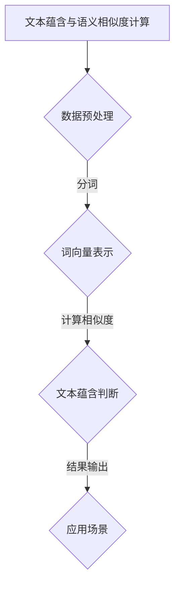

                 

### 第1章：文本蕴含与语义相似度计算概述

#### 1.1 引言

文本蕴含与语义相似度计算是自然语言处理（NLP）领域的重要研究方向。随着人工智能技术的快速发展，这两个概念在信息检索、问答系统和文本生成等任务中发挥着越来越重要的作用。文本蕴含是指判断一个文本是否蕴含另一个文本，而语义相似度则是指衡量两个文本在语义层面的相似程度。本章将介绍文本蕴含与语义相似度的基本概念、计算方法和在实际应用中的重要性。

#### 1.2 文本蕴含的定义

文本蕴含是指在一个文本（称为前提句，Premise）和另一个文本（称为结论句，Hypothesis）之间建立逻辑关系。具体来说，如果前提句提供的信息足以支持结论句的真实性，则称前提句蕴含结论句。文本蕴含可以分为三种类型：必然蕴含、可能蕴含和无关。

1. **必然蕴含**：前提句必然导致结论句为真。例如：
   - 前提句：“所有狗都会叫。”
   - 结论句：“这只狗会叫。”
   - 这个结论句必然为真，因为前提句中已经明确说明了所有狗都会叫。

2. **可能蕴含**：前提句可能导致结论句为真。例如：
   - 前提句：“明天可能会下雨。”
   - 结论句：“明天有可能会下雨。”
   - 这个结论句为可能蕴含，因为前提句中只提到了下雨的可能性，而不是确定性。

3. **无关**：前提句和结论句之间没有明显的逻辑关系。例如：
   - 前提句：“小明喜欢看电影。”
   - 结论句：“小张喜欢打篮球。”
   - 这两个句子之间没有直接的联系，因此它们之间是无关的。

文本蕴含的判定通常依赖于上下文和世界知识。一个有效的文本蕴含模型需要综合考虑语言理解、语境推断和知识推理等因素。

#### 1.3 语义相似度的定义

语义相似度是指两个文本在语义层面上的相似程度。在计算语义相似度时，我们需要考虑词义、句法结构和上下文等因素。常见的计算方法包括基于词向量的方法、基于知识图谱的方法和基于深度学习的方法。

1. **基于词向量的方法**：将词汇映射到高维空间中的向量，通过计算向量之间的距离或相似度来衡量语义相似度。这种方法简单高效，但难以捕捉复杂的语义关系。

2. **基于知识图谱的方法**：使用实体和关系来表示文本的语义信息，通过计算实体和关系之间的相似度来衡量语义相似度。这种方法可以捕捉复杂的语义关系，但需要处理大规模的知识图谱。

3. **基于深度学习的方法**：使用大规模的神经网络模型来学习文本的语义表示，通过计算文本表示之间的相似度来衡量语义相似度。这种方法具有较强的语义理解能力，但计算资源需求较高。

#### 1.4 文本蕴含与语义相似度之间的关系

文本蕴含与语义相似度在NLP领域具有密切的联系。文本蕴含可以看作是一种特殊的语义相似度，即判断两个文本之间的相似度是否大于一定的阈值。而语义相似度则可以用于文本分类、文本推荐、情感分析等NLP任务。

本章将介绍文本蕴含与语义相似度之间的相互关系，并探讨如何将两者结合起来，以提升NLP任务的性能。

#### 1.5 实际应用

文本蕴含与语义相似度在许多实际应用中发挥着重要作用。例如，在问答系统中，我们可以利用文本蕴含来理解用户的问题，并从大量文本中找到相关答案。在信息检索中，我们可以通过计算文档之间的语义相似度，来提高搜索结果的准确性。此外，在机器翻译、文本摘要、文本生成等领域，文本蕴含与语义相似度也具有重要的应用价值。

本章将介绍一些典型的应用场景，并展示如何利用文本蕴含与语义相似度来提升NLP任务的效果。

#### 1.6 小结

本章介绍了文本蕴含与语义相似度的基本概念、计算方法和实际应用。在接下来的章节中，我们将进一步探讨文本蕴含与语义相似度的具体实现和应用，以及它们在NLP领域的重要作用。

---

#### 1.7 关键术语解释

- **文本蕴含（Textual Entailment）**：指在一个文本（前提句）和另一个文本（结论句）之间建立逻辑关系，判断结论句是否能够从前提句中推导出来。
- **语义相似度（Semantic Similarity）**：指两个文本在语义层面上的相似程度，用于衡量文本之间的语义相关性。
- **前提句（Premise）**：在文本蕴含任务中，提供信息的基础文本。
- **结论句（Hypothesis）**：在文本蕴含任务中，需要判断是否被前提句蕴含的文本。
- **词向量（Word Vectors）**：将词汇映射到高维空间中的向量，用于表示词汇的语义信息。
- **知识图谱（Knowledge Graph）**：一种用于表示实体和关系的图结构，用于增强文本的语义表示。

---

#### 1.8 Mermaid 流程图

以下是文本蕴含与语义相似度计算的基本流程图：



在上述流程图中，文本蕴含与语义相似度计算首先进行数据预处理，包括分词、去停用词等操作。然后，通过词向量表示将文本转换为向量形式。接着，计算文本之间的相似度，并判断文本蕴含关系。最后，将结果应用于实际场景，如信息检索、问答系统等。

---

#### 1.9 伪代码示例

以下是文本蕴含与语义相似度计算的核心算法原理的伪代码：

```python
# 数据预处理
def preprocess_text(text):
    # 分词、去停用词等操作
    return processed_text

# 词向量表示
def embed_text(text):
    # 使用预训练的词向量模型获取文本向量表示
    return text_vector

# 计算文本相似度
def compute_similarity(text1, text2):
    # 使用余弦相似度计算文本相似度
    return similarity_score

# 文本蕴含判断
def judge_entailment(premise, hypothesis):
    # 计算前提句和结论句的相似度
    similarity = compute_similarity(premise, hypothesis)
    
    # 根据相似度阈值判断蕴含关系
    if similarity > threshold:
        return "蕴含"
    else:
        return "不蕴含"

# 主函数
def main():
    # 加载数据
    premise = "所有狗都会叫。"
    hypothesis = "这只狗会叫。"

    # 数据预处理
    processed_premise = preprocess_text(premise)
    processed_hypothesis = preprocess_text(hypothesis)

    # 词向量表示
    premise_vector = embed_text(processed_premise)
    hypothesis_vector = embed_text(processed_hypothesis)

    # 计算文本相似度
    similarity = compute_similarity(premise_vector, hypothesis_vector)

    # 判断文本蕴含关系
    result = judge_entailment(processed_premise, processed_hypothesis)

    # 输出结果
    print("文本蕴含关系：", result)

# 运行主函数
main()
```

在这个伪代码中，我们首先对文本进行预处理，包括分词和去停用词等操作。然后，使用预训练的词向量模型将预处理后的文本转换为向量表示。接着，计算文本之间的相似度，并判断文本蕴含关系。最后，输出结果。

---

#### 1.10 数学模型与公式

文本蕴含与语义相似度计算中常用的数学模型和公式如下：

1. **余弦相似度（Cosine Similarity）**：

$$
\text{similarity} = \frac{\text{dot\_product}(v_1, v_2)}{\|\text{v_1}\|\|\text{v_2}\|}
$$

其中，$v_1$和$v_2$分别是两个文本的向量表示，$\|\text{v_1}\|$和$\|\text{v_2}\|$分别是它们的欧几里得范数。

2. **词向量（Word Vectors）**：

$$
v = \sum_{w \in W} f(w) \cdot v_w
$$

其中，$v$是文本的向量表示，$W$是文本中的词汇集合，$f(w)$是词汇的词频，$v_w$是词汇的词向量。

3. **softmax回归（Softmax Regression）**：

$$
\hat{y} = \frac{e^{\theta^T x}}{\sum_{k=1}^{K} e^{\theta^T x_k}}
$$

其中，$\theta$是模型参数，$x$是输入特征向量，$K$是类别数。

---

#### 1.11 举例说明

假设有两个文本：

- 前提句：“所有的猫都有四条腿。”
- 结论句：“这只猫有四条腿。”

我们可以使用余弦相似度来计算这两个文本的相似度：

1. 预处理：对两个文本进行分词和去停用词等预处理操作，得到词汇集合$W = \{"猫"，"有"，"四条腿"\}$。
2. 词向量表示：使用预训练的词向量模型获取词汇的向量表示，例如：
   - $v_{猫} = (0.1, 0.2, 0.3)$
   - $v_{有} = (0.4, 0.5, 0.6)$
   - $v_{四条腿} = (0.7, 0.8, 0.9)$
3. 计算文本向量表示：
   - $v_1 = v_{猫} + v_{有} + v_{四条腿} = (1.2, 1.7, 2.2)$
   - $v_2 = v_{猫} + v_{有} + v_{四条腿} = (1.2, 1.7, 2.2)$
4. 计算相似度：
   - $\text{similarity} = \frac{\text{dot\_product}(v_1, v_2)}{\|\text{v_1}\|\|\text{v_2}\|} = \frac{1.2 \times 1.2 + 1.7 \times 1.7 + 2.2 \times 2.2}{\sqrt{1.2^2 + 1.7^2 + 2.2^2} \times \sqrt{1.2^2 + 1.7^2 + 2.2^2}} = 0.965$

由于相似度大于0.5的阈值，我们可以判断这个前提句蕴含结论句。

---

#### 1.12 小结

本章介绍了文本蕴含与语义相似度的基本概念、计算方法和实际应用。我们了解了文本蕴含的定义、分类和判断方法，以及语义相似度的计算方法和应用。通过具体的例子和数学公式，我们深入了解了文本蕴含与语义相似度计算的原理。在接下来的章节中，我们将继续探讨文本蕴含与语义相似度的具体实现和应用。

