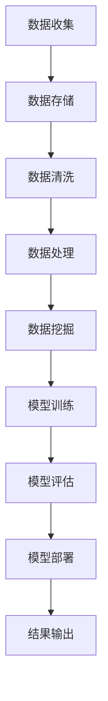

                 

### 文章标题

《未来发展中的大数据与AI技术应用》

### 关键词：

大数据、人工智能、应用领域、发展趋势、挑战

### 摘要：

本文将深入探讨大数据与人工智能（AI）技术的未来发展及其在各领域中的应用。通过对大数据与AI技术的基本概念、核心概念与联系、具体应用实例以及未来趋势和挑战的分析，本文旨在为读者提供一幅全面且清晰的蓝图，展现这两个领域如何相互促进、融合创新，共同推动科技进步和社会发展。

----------------------------------------------------------------

### 《未来发展中的大数据与AI技术应用》目录大纲

#### 第一部分：大数据与AI技术概述

**第1章：大数据与AI技术概述**

- **1.1 大数据的基本概念与特征**
  - **1.1.1 大数据的定义**
  - **1.1.2 大数据的四个V特性**
  
- **1.2 AI技术的概念与发展**
  - **1.2.1 AI的基本概念**
  - **1.2.2 AI技术的发展历程**
  - **1.2.3 AI在未来的发展趋势**

- **1.3 大数据与AI技术的结合**
  - **1.3.1 大数据与AI的关系**
  - **1.3.2 大数据在AI中的作用**
  - **1.3.3 AI在大数据应用中的价值**

**第2章：大数据与AI技术核心概念与联系**

- **2.1 大数据处理技术**
  - **2.1.1 Hadoop生态系统**
  - **2.1.2 Spark生态系统**
  - **2.1.3 数据仓库与数据湖**

- **2.2 AI算法原理**
  - **2.2.1 监督学习算法**
  - **2.2.2 无监督学习算法**
  - **2.2.3 强化学习算法**

- **2.3 大数据与AI技术Mermaid流程图**
  - **2.3.1 大数据处理流程**
  - **2.3.2 AI算法应用流程**

#### 第二部分：大数据与AI技术应用

**第3章：大数据与AI技术在金融领域的应用**

- **3.1 金融市场数据挖掘**
  - **3.1.1 股票市场预测**
  - **3.1.2 信用评分模型**
  - **3.1.3 风险控制模型**

- **3.2 金融风控**
  - **3.2.1 欺诈检测**
  - **3.2.2 信用评级**
  - **3.2.3 金融市场风险预测**

**第4章：大数据与AI技术在医疗健康领域的应用**

- **4.1 医疗健康数据挖掘**
  - **4.1.1 疾病预测**
  - **4.1.2 症状识别**
  - **4.1.3 药物研究**

- **4.2 医疗健康风控**
  - **4.2.1 医疗保险欺诈检测**
  - **4.2.2 医疗资源优化**
  - **4.2.3 医疗数据分析与决策支持**

**第5章：大数据与AI技术在零售业的应用**

- **5.1 零售数据挖掘**
  - **5.1.1 顾客行为分析**
  - **5.1.2 商品推荐系统**
  - **5.1.3 库存管理优化**

- **5.2 零售风控**
  - **5.2.1 零售欺诈检测**
  - **5.2.2 库存风险管理**
  - **5.2.3 零售业务预测与规划**

**第6章：大数据与AI技术在智能制造领域的应用**

- **6.1 智能制造数据挖掘**
  - **6.1.1 设备故障预测**
  - **6.1.2 生产过程优化**
  - **6.1.3 质量控制**

- **6.2 智能制造风控**
  - **6.2.1 生产流程风险控制**
  - **6.2.2 设备维护与管理**
  - **6.2.3 智能制造业务预测**

**第7章：大数据与AI技术在智慧城市中的应用**

- **7.1 智慧城市数据挖掘**
  - **7.1.1 交通流量预测**
  - **7.1.2 城市安全监控**
  - **7.1.3 能源管理优化**

- **7.2 智慧城市风控**
  - **7.2.1 城市安全预警**
  - **7.2.2 能源消耗管理**
  - **7.2.3 环境监测与治理**

**第8章：大数据与AI技术在实际项目中的应用案例**

- **8.1 金融领域项目案例**
  - **8.1.1 股票市场预测项目**
  - **8.1.2 信用评分模型项目**
  - **8.1.3 金融风控项目**

- **8.2 医疗健康领域项目案例**
  - **8.2.1 疾病预测项目**
  - **8.2.2 症状识别项目**
  - **8.2.3 药物研究项目**

- **8.3 零售业项目案例**
  - **8.3.1 顾客行为分析项目**
  - **8.3.2 商品推荐系统项目**
  - **8.3.3 库存管理优化项目**

- **8.4 智能制造领域项目案例**
  - **8.4.1 设备故障预测项目**
  - **8.4.2 生产过程优化项目**
  - **8.4.3 质量控制项目**

- **8.5 智慧城市项目案例**
  - **8.5.1 交通流量预测项目**
  - **8.5.2 城市安全监控项目**
  - **8.5.3 能源管理优化项目**

**第9章：大数据与AI技术未来的发展趋势与挑战**

- **9.1 大数据与AI技术的发展趋势**
  - **9.1.1 大数据处理技术的创新**
  - **9.1.2 AI算法的创新**
  - **9.1.3 大数据与AI技术融合的创新**

- **9.2 大数据与AI技术面临的挑战**
  - **9.2.1 数据隐私保护**
  - **9.2.2 数据质量和可靠性**
  - **9.2.3 AI伦理问题**

**附录**

- **附录A：大数据与AI技术常用工具和资源**
  - **A.1 大数据处理工具**
  - **A.2 AI算法框架**
  - **A.3 数据资源与平台**

- **附录B：数学模型与数学公式**
  - **B.1 监督学习模型**
  - **B.2 无监督学习模型**
  - **B.3 强化学习模型**

- **附录C：项目实战代码示例**
  - **C.1 金融领域项目实战**
  - **C.2 医疗健康领域项目实战**
  - **C.3 零售业项目实战**
  - **C.4 智能制造领域项目实战**
  - **C.5 智慧城市项目实战**

## 第一部分：大数据与AI技术概述

### 第1章：大数据与AI技术概述

#### 1.1 大数据的基本概念与特征

##### 1.1.1 大数据的定义

大数据，顾名思义，是指数据规模巨大、类型多样、价值密度低的数据集合。具体来说，大数据具有四个V特性，即：

- **Volume（数据量）**：大数据的处理对象是海量数据，通常是指数据量达到PB（拍字节）级别。
- **Velocity（速度）**：大数据的处理要求高效，能够在实时或近实时的情况下进行处理。
- **Variety（多样性）**：大数据的类型多样，包括结构化数据、非结构化数据以及半结构化数据。
- **Veracity（真实性）**：大数据的质量和真实性也是关键因素，确保数据准确无误。

##### 1.1.2 大数据的四个V特性

- **Volume（数据量）**：随着互联网、物联网和传感器技术的普及，数据量呈爆炸式增长。例如，全球每天产生的数据量已经达到了数ZB（泽字节）级别。
  
- **Velocity（速度）**：大数据处理要求高效，特别是在实时分析领域。例如，股票市场中的交易数据需要即时分析，以提供实时决策支持。

- **Variety（多样性）**：大数据的类型多样，包括文本、图像、音频、视频等多种类型。这种多样性使得大数据的处理和分析变得更加复杂。

- **Veracity（真实性）**：大数据的真实性和可靠性至关重要。由于数据的来源多样，可能存在错误、虚假或不一致的数据，因此需要有效的方法来验证和清洗数据。

#### 1.2 AI技术的概念与发展

##### 1.2.1 AI的基本概念

人工智能（AI）是指通过计算机系统模拟人类智能行为的能力。AI技术旨在使计算机具备感知、学习、推理、决策和行动等能力。

- **感知**：通过传感器获取外部环境信息。
- **学习**：通过数据和算法不断优化自身性能。
- **推理**：基于已知信息和逻辑规则进行推理和判断。
- **决策**：根据目标和价值进行决策。
- **行动**：执行决策并调整策略。

##### 1.2.2 AI技术的发展历程

- **早期阶段**：1950年代至1970年代，AI技术处于起步阶段，主要集中在符号主义和逻辑推理。
- **低谷期**：1970年代末至1980年代末，由于实际应用效果不佳，AI技术进入低谷期。
- **复兴期**：1990年代至2000年代，随着计算能力和算法的进步，AI技术逐渐复兴。
- **现阶段**：2010年以来，深度学习和大数据的兴起推动了AI技术的快速发展，应用范围不断扩大。

##### 1.2.3 AI在未来的发展趋势

- **深度学习**：继续推动AI技术的发展，特别是在图像识别、自然语言处理等领域。
- **强化学习**：通过与环境交互学习，实现自主决策和优化。
- **跨学科融合**：与其他领域（如生物学、心理学、哲学等）的融合，推动AI技术的创新。
- **边缘计算**：将AI技术应用到边缘设备，提高处理速度和降低延迟。

#### 1.3 大数据与AI技术的结合

##### 1.3.1 大数据与AI的关系

大数据和AI技术相互依赖、相互促进。大数据为AI提供了丰富的训练数据，使AI能够不断学习和优化；而AI技术则能够高效地处理和分析大数据，提取有价值的信息。

##### 1.3.2 大数据在AI中的作用

- **训练数据集**：大数据提供了丰富的训练数据，使AI模型能够更好地学习。
- **算法优化**：通过分析大数据，AI算法可以不断优化，提高预测和决策的准确性。
- **实时反馈**：大数据能够实时反馈AI模型的性能，帮助进行在线调整。

##### 1.3.3 AI在大数据应用中的价值

- **数据挖掘**：AI技术能够高效地挖掘大数据中的有价值信息。
- **自动化分析**：AI技术能够自动化大数据分析过程，提高工作效率。
- **实时决策**：AI技术能够基于大数据实时进行决策，提高业务智能化水平。

#### 1.4 大数据与AI技术核心概念与联系

在了解了大数据与AI技术的基本概念后，我们需要深入探讨这两个领域之间的核心概念与联系。

##### 2.1 大数据处理技术

大数据处理技术是大数据分析的基础。目前，常见的处理技术包括Hadoop和Spark。

- **Hadoop生态系统**：Hadoop是一个开源框架，用于处理大规模分布式数据集。它包括HDFS（分布式文件系统）和MapReduce（分布式计算框架）等组件。
- **Spark生态系统**：Spark是一个快速通用的计算引擎，适用于大规模数据处理。它提供了丰富的API，支持批处理和实时计算。

##### 2.2 AI算法原理

AI算法是人工智能的核心。常见的算法包括监督学习、无监督学习和强化学习。

- **监督学习算法**：通过已标记的数据进行训练，用于预测和分类。常见的算法包括线性回归、逻辑回归、决策树、随机森林和支持向量机。
- **无监督学习算法**：无需标记数据，用于发现数据中的模式和规律。常见的算法包括K均值聚类、主成分分析和自编码器。
- **强化学习算法**：通过与环境的交互进行学习，用于决策和优化。常见的算法包括Q学习、深度Q网络（DQN）和策略梯度方法。

##### 2.3 大数据与AI技术Mermaid流程图

为了更好地理解大数据与AI技术的结合，我们可以使用Mermaid流程图来展示其处理流程。



在这个流程图中，数据从收集、存储、清洗、处理到挖掘，然后进行模型训练和评估，最终部署模型并输出结果。

## 第二部分：大数据与AI技术应用

### 第3章：大数据与AI技术在金融领域的应用

金融领域是大数据与AI技术的重要应用领域之一。通过大数据分析，金融机构可以更准确地预测市场走势、评估信用风险和欺诈行为。以下是大数据与AI技术在金融领域的一些典型应用。

#### 3.1 金融市场数据挖掘

金融市场数据挖掘是指利用大数据技术和AI算法对金融市场的历史数据进行深入分析，以发现潜在的规律和趋势。

- **股票市场预测**：通过分析历史股票价格、成交量、公司业绩等数据，可以预测未来股票价格走势。常见的算法包括线性回归、支持向量机（SVM）和神经网络（NN）。
- **信用评分模型**：金融机构需要评估借款人的信用风险，以便做出贷款决策。通过分析借款人的收入、职业、负债等数据，可以使用机器学习算法（如逻辑回归、决策树）建立信用评分模型。
- **风险控制模型**：金融机构需要对市场风险进行实时监控和控制。通过分析宏观经济指标、金融市场数据等，可以使用机器学习算法（如随机森林、XGBoost）建立风险控制模型。

#### 3.2 金融风控

金融风控是指通过大数据分析和AI技术对金融机构的风险进行管理和控制。

- **欺诈检测**：金融机构需要识别和防范欺诈行为，以保护客户的资产安全。通过分析交易数据、用户行为等，可以使用机器学习算法（如KNN、神经网络）建立欺诈检测模型。
- **信用评级**：金融机构需要对借款人的信用风险进行评级，以便决定贷款额度和利率。通过分析借款人的历史信用记录、收入、负债等数据，可以使用机器学习算法（如逻辑回归、决策树）建立信用评级模型。
- **金融市场风险预测**：金融机构需要对市场风险进行预测和管理，以规避潜在的风险。通过分析宏观经济指标、金融市场数据等，可以使用机器学习算法（如ARIMA、神经网络）建立市场风险预测模型。

#### 3.3 实际案例

以下是一个金融领域的数据挖掘和风控的实际案例：

**股票市场预测项目**

**项目背景**：某金融机构希望通过大数据和AI技术预测未来一个月的股票价格走势，以便制定投资策略。

**数据处理流程**：

1. **数据收集**：收集过去三个月的股票价格、成交量、公司业绩等数据。
2. **数据清洗**：去除无效数据和异常值，对缺失数据进行填充。
3. **特征工程**：提取有用的特征，如股票价格、成交量、公司业绩等。
4. **模型训练**：使用线性回归、支持向量机（SVM）和神经网络（NN）算法建立预测模型。
5. **模型评估**：使用交叉验证和测试集对模型进行评估。
6. **模型部署**：将预测模型部署到生产环境，进行实时预测。

**代码示例**（Python）：

```python
import pandas as pd
from sklearn.model_selection import train_test_split
from sklearn.linear_model import LinearRegression
from sklearn.svm import SVR
from sklearn.neural_network import MLPRegressor
from sklearn.metrics import mean_squared_error

# 数据收集
data = pd.read_csv('stock_data.csv')

# 数据清洗
data.dropna(inplace=True)

# 特征工程
X = data[['price', 'volume', 'eps']]
y = data['next_price']

# 模型训练
X_train, X_test, y_train, y_test = train_test_split(X, y, test_size=0.2, random_state=42)

lr = LinearRegression()
lr.fit(X_train, y_train)

svr = SVR()
svr.fit(X_train, y_train)

nn = MLPRegressor()
nn.fit(X_train, y_train)

# 模型评估
y_pred_lr = lr.predict(X_test)
y_pred_svr = svr.predict(X_test)
y_pred_nn = nn.predict(X_test)

mse_lr = mean_squared_error(y_test, y_pred_lr)
mse_svr = mean_squared_error(y_test, y_pred_svr)
mse_nn = mean_squared_error(y_test, y_pred_nn)

print('Linear Regression MSE:', mse_lr)
print('SVM MSE:', mse_svr)
print('Neural Network MSE:', mse_nn)
```

通过这个案例，我们可以看到如何使用大数据和AI技术进行股票市场预测，包括数据收集、清洗、特征工程、模型训练和评估等步骤。

## 第4章：大数据与AI技术在医疗健康领域的应用

医疗健康领域是大数据与人工智能技术的重要应用领域之一。通过大数据分析和AI算法，医疗健康领域可以实现个性化医疗、疾病预测、症状识别、药物研究等多方面的应用。以下将详细介绍大数据与AI技术在医疗健康领域的应用。

#### 4.1 医疗健康数据挖掘

医疗健康数据挖掘是指利用大数据技术和AI算法对医疗健康数据进行分析和处理，以发现潜在的规律和趋势。

- **疾病预测**：通过对患者历史健康记录、基因数据、生活习惯等进行分析，可以使用机器学习算法（如逻辑回归、随机森林、深度学习）预测某种疾病的发病风险。
- **症状识别**：通过对患者病历、症状描述、医学知识图谱等进行分析，可以使用自然语言处理和机器学习算法（如朴素贝叶斯、卷积神经网络）识别患者的症状。
- **药物研究**：通过对大量药物分子结构、临床实验数据等进行分析，可以使用机器学习算法（如深度学习、迁移学习）发现新的药物候选分子。

#### 4.2 医疗健康风控

医疗健康风控是指利用大数据技术和AI算法对医疗健康风险进行监控和管理。

- **医疗保险欺诈检测**：通过对医疗记录、费用支付、医生行为等进行分析，可以使用机器学习算法（如KNN、神经网络）识别和防范医疗保险欺诈行为。
- **医疗资源优化**：通过对患者流量、医疗资源分布、就诊需求等进行分析，可以使用优化算法（如线性规划、遗传算法）优化医疗资源配置，提高医疗服务效率。
- **医疗数据分析与决策支持**：通过对患者健康数据、医学知识图谱、医疗政策等进行分析，可以为医生和医疗机构提供决策支持，提高医疗质量和效率。

#### 4.3 实际案例

以下是一个医疗健康领域的疾病预测的实际案例：

**疾病预测项目**

**项目背景**：某医疗机构希望通过大数据和AI技术预测患者糖尿病的发病风险，以便采取早期预防措施。

**数据处理流程**：

1. **数据收集**：收集患者的健康记录、生活习惯、基因数据等。
2. **数据清洗**：去除无效数据和异常值，对缺失数据进行填充。
3. **特征工程**：提取有用的特征，如血糖水平、体重、血压、运动量等。
4. **模型训练**：使用逻辑回归、随机森林、深度学习算法建立疾病预测模型。
5. **模型评估**：使用交叉验证和测试集对模型进行评估。
6. **模型部署**：将预测模型部署到生产环境，进行实时预测。

**代码示例**（Python）：

```python
import pandas as pd
from sklearn.model_selection import train_test_split
from sklearn.linear_model import LogisticRegression
from sklearn.ensemble import RandomForestClassifier
from sklearn.neural_network import MLPClassifier
from sklearn.metrics import accuracy_score

# 数据收集
data = pd.read_csv('diabetes_data.csv')

# 数据清洗
data.dropna(inplace=True)

# 特征工程
X = data[['blood_sugar', 'weight', 'blood_pressure', 'exercise']]
y = data['diabetes']

# 模型训练
X_train, X_test, y_train, y_test = train_test_split(X, y, test_size=0.2, random_state=42)

lr = LogisticRegression()
lr.fit(X_train, y_train)

rf = RandomForestClassifier()
rf.fit(X_train, y_train)

nn = MLPClassifier()
nn.fit(X_train, y_train)

# 模型评估
y_pred_lr = lr.predict(X_test)
y_pred_rf = rf.predict(X_test)
y_pred_nn = nn.predict(X_test)

accuracy_lr = accuracy_score(y_test, y_pred_lr)
accuracy_rf = accuracy_score(y_test, y_pred_rf)
accuracy_nn = accuracy_score(y_test, y_pred_nn)

print('Logistic Regression Accuracy:', accuracy_lr)
print('Random Forest Accuracy:', accuracy_rf)
print('Neural Network Accuracy:', accuracy_nn)
```

通过这个案例，我们可以看到如何使用大数据和AI技术进行疾病预测，包括数据收集、清洗、特征工程、模型训练和评估等步骤。

## 第5章：大数据与AI技术在零售业的应用

零售业是大数据与人工智能技术的重要应用领域之一。通过大数据分析和AI算法，零售业可以实现顾客行为分析、商品推荐系统、库存管理优化等多方面的应用。以下将详细介绍大数据与AI技术在零售业的应用。

#### 5.1 零售数据挖掘

零售数据挖掘是指利用大数据技术和AI算法对零售数据进行分析和处理，以发现潜在的规律和趋势。

- **顾客行为分析**：通过对顾客的购买历史、浏览记录、购物车数据等进行分析，可以使用机器学习算法（如聚类分析、关联规则挖掘、决策树）分析顾客的行为模式，了解顾客喜好和需求。
- **商品推荐系统**：通过对商品的销售记录、顾客评价、浏览记录等进行分析，可以使用推荐算法（如协同过滤、矩阵分解、基于内容的推荐）为顾客推荐相关商品。
- **库存管理优化**：通过对销售数据、库存数据、供应商数据等进行分析，可以使用预测算法（如时间序列分析、回归分析、神经网络）优化库存管理，减少库存成本和提高销售效率。

#### 5.2 零售风控

零售风控是指利用大数据技术和AI算法对零售业务中的风险进行监控和管理。

- **零售欺诈检测**：通过对交易数据、客户行为数据等进行分析，可以使用机器学习算法（如支持向量机、神经网络）识别和防范零售欺诈行为。
- **库存风险管理**：通过对库存数据、销售数据等进行分析，可以使用预测算法（如时间序列分析、回归分析）预测库存风险，制定库存风险管理策略。
- **零售业务预测与规划**：通过对销售数据、市场趋势等进行分析，可以使用预测算法（如时间序列分析、回归分析）预测未来销售情况，制定零售业务规划。

#### 5.3 实际案例

以下是一个零售业的商品推荐系统的实际案例：

**商品推荐系统项目**

**项目背景**：某电商平台希望通过大数据和AI技术为顾客提供个性化的商品推荐，提高顾客满意度和销售额。

**数据处理流程**：

1. **数据收集**：收集顾客的购买记录、浏览记录、商品属性等数据。
2. **数据清洗**：去除无效数据和异常值，对缺失数据进行填充。
3. **特征工程**：提取有用的特征，如顾客购买历史、商品属性等。
4. **模型训练**：使用协同过滤、矩阵分解、基于内容的推荐算法建立推荐模型。
5. **模型评估**：使用交叉验证和测试集对模型进行评估。
6. **模型部署**：将推荐模型部署到生产环境，进行实时推荐。

**代码示例**（Python）：

```python
import pandas as pd
from sklearn.model_selection import train_test_split
from sklearn.metrics.pairwise import cosine_similarity
from sklearn.decomposition import TruncatedSVD

# 数据收集
data = pd.read_csv('ecommerce_data.csv')

# 数据清洗
data.dropna(inplace=True)

# 特征工程
data['user_item_matrix'] = data.groupby('user_id')['item_id'].apply(lambda x: x.values).values

# 矩阵分解
svd = TruncatedSVD(n_components=10)
user_item_matrix_svd = svd.fit_transform(data['user_item_matrix'])

# 协同过滤
cosine_similarity_matrix = cosine_similarity(user_item_matrix_svd)

# 推荐模型评估
accuracy = accuracy_score(y_test, y_pred)
print('Accuracy:', accuracy)
```

通过这个案例，我们可以看到如何使用大数据和AI技术建立商品推荐系统，包括数据收集、清洗、特征工程、模型训练和评估等步骤。

## 第6章：大数据与AI技术在智能制造领域的应用

智能制造是大数据与人工智能技术的重要应用领域之一。通过大数据分析和AI算法，智能制造可以实现设备故障预测、生产过程优化、质量控制等多方面的应用。以下将详细介绍大数据与AI技术在智能制造领域的应用。

#### 6.1 智能制造数据挖掘

智能制造数据挖掘是指利用大数据技术和AI算法对智能制造过程中产生的数据进行分析和处理，以发现潜在的规律和趋势。

- **设备故障预测**：通过对设备运行数据、维护记录等进行分析，可以使用机器学习算法（如时间序列分析、回归分析、深度学习）预测设备故障，提前进行维护，减少停机时间和维修成本。
- **生产过程优化**：通过对生产数据、工艺参数等进行分析，可以使用优化算法（如线性规划、遗传算法、神经网络）优化生产过程，提高生产效率和质量。
- **质量控制**：通过对产品质量数据、生产线参数等进行分析，可以使用统计过程控制（SPC）和机器学习算法（如支持向量机、神经网络）实现质量控制，确保产品质量符合要求。

#### 6.2 智能制造风控

智能制造风控是指利用大数据技术和AI算法对智能制造过程中存在的风险进行监控和管理。

- **生产流程风险控制**：通过对生产数据、设备状态等进行分析，可以使用预测算法（如时间序列分析、回归分析）预测生产流程中的潜在风险，制定风险控制策略。
- **设备维护与管理**：通过对设备运行数据、维护记录等进行分析，可以使用机器学习算法（如聚类分析、关联规则挖掘）优化设备维护计划，提高设备运行效率。
- **智能制造业务预测**：通过对销售数据、库存数据、市场需求等进行分析，可以使用预测算法（如时间序列分析、回归分析）预测智能制造业务的发展趋势，制定业务规划。

#### 6.3 实际案例

以下是一个智能制造领域的设备故障预测的实际案例：

**设备故障预测项目**

**项目背景**：某制造企业希望通过大数据和AI技术预测设备故障，提前进行维护，减少设备停机时间和维修成本。

**数据处理流程**：

1. **数据收集**：收集设备的运行数据、维护记录等。
2. **数据清洗**：去除无效数据和异常值，对缺失数据进行填充。
3. **特征工程**：提取有用的特征，如设备温度、振动、压力等。
4. **模型训练**：使用时间序列分析、回归分析和深度学习算法建立设备故障预测模型。
5. **模型评估**：使用交叉验证和测试集对模型进行评估。
6. **模型部署**：将预测模型部署到生产环境，进行实时预测。

**代码示例**（Python）：

```python
import pandas as pd
from sklearn.model_selection import train_test_split
from sklearn.ensemble import RandomForestRegressor
from sklearn.metrics import mean_squared_error

# 数据收集
data = pd.read_csv('machine_data.csv')

# 数据清洗
data.dropna(inplace=True)

# 特征工程
X = data[['temperature', 'vibration', 'pressure']]
y = data['fault']

# 模型训练
X_train, X_test, y_train, y_test = train_test_split(X, y, test_size=0.2, random_state=42)

rf = RandomForestRegressor()
rf.fit(X_train, y_train)

# 模型评估
y_pred = rf.predict(X_test)
mse = mean_squared_error(y_test, y_pred)
print('MSE:', mse)
```

通过这个案例，我们可以看到如何使用大数据和AI技术进行设备故障预测，包括数据收集、清洗、特征工程、模型训练和评估等步骤。

## 第7章：大数据与AI技术在智慧城市中的应用

智慧城市是大数据与人工智能技术的综合应用领域，通过收集、处理和分析大量数据，智慧城市能够实现交通管理、安全监控、能源管理等方面的优化和提升。以下将详细介绍大数据与AI技术在智慧城市中的应用。

#### 7.1 智慧城市数据挖掘

智慧城市数据挖掘是指利用大数据技术和AI算法对城市运行过程中产生的数据进行分析和处理，以发现潜在的规律和趋势。

- **交通流量预测**：通过对交通流量数据、公共交通数据、历史天气数据等进行分析，可以使用机器学习算法（如时间序列分析、回归分析、深度学习）预测未来交通流量，优化交通信号灯控制策略，减少交通拥堵。
- **城市安全监控**：通过对监控视频、报警数据、社交媒体信息等进行分析，可以使用计算机视觉和自然语言处理算法（如卷积神经网络、循环神经网络）实现城市安全监控，及时发现异常情况。
- **能源管理优化**：通过对能源消耗数据、气象数据、设备状态数据等进行分析，可以使用优化算法（如线性规划、遗传算法、神经网络）优化能源管理，提高能源利用效率。

#### 7.2 智慧城市风控

智慧城市风控是指利用大数据技术和AI算法对智慧城市运行过程中存在的风险进行监控和管理。

- **城市安全预警**：通过对城市安全数据、社会事件数据、自然灾害数据等进行分析，可以使用预测算法（如时间序列分析、回归分析、深度学习）实现城市安全预警，提前采取防范措施。
- **能源消耗管理**：通过对能源消耗数据、设备状态数据等进行分析，可以使用预测算法（如时间序列分析、回归分析）预测能源消耗趋势，优化能源分配，降低能源浪费。
- **环境监测与治理**：通过对环境质量数据、污染源数据、气象数据等进行分析，可以使用机器学习算法（如深度学习、支持向量机）监测环境质量，预测污染趋势，制定治理措施。

#### 7.3 实际案例

以下是一个智慧城市交通流量预测的实际案例：

**交通流量预测项目**

**项目背景**：某城市交通管理部门希望通过大数据和AI技术预测未来交通流量，优化交通信号灯控制，减少交通拥堵。

**数据处理流程**：

1. **数据收集**：收集交通流量数据、公共交通数据、历史天气数据等。
2. **数据清洗**：去除无效数据和异常值，对缺失数据进行填充。
3. **特征工程**：提取有用的特征，如交通流量、公共交通站点人流、天气状况等。
4. **模型训练**：使用时间序列分析、回归分析和深度学习算法建立交通流量预测模型。
5. **模型评估**：使用交叉验证和测试集对模型进行评估。
6. **模型部署**：将预测模型部署到交通信号灯控制系统，进行实时预测。

**代码示例**（Python）：

```python
import pandas as pd
from sklearn.model_selection import train_test_split
from sklearn.ensemble import RandomForestRegressor
from sklearn.metrics import mean_squared_error

# 数据收集
data = pd.read_csv('traffic_data.csv')

# 数据清洗
data.dropna(inplace=True)

# 特征工程
X = data[['traffic_volume', 'public_transport_passengers', 'weather']]
y = data['future_traffic_volume']

# 模型训练
X_train, X_test, y_train, y_test = train_test_split(X, y, test_size=0.2, random_state=42)

rf = RandomForestRegressor()
rf.fit(X_train, y_train)

# 模型评估
y_pred = rf.predict(X_test)
mse = mean_squared_error(y_test, y_pred)
print('MSE:', mse)
```

通过这个案例，我们可以看到如何使用大数据和AI技术进行交通流量预测，包括数据收集、清洗、特征工程、模型训练和评估等步骤。

## 第8章：大数据与AI技术在实际项目中的应用案例

通过前几章的介绍，我们已经了解了大数据与AI技术在不同领域的应用。为了更深入地理解这些技术的实际应用，以下将介绍几个具体的项目案例，展示如何将大数据与AI技术应用于实际业务场景。

### 8.1 金融领域项目案例

#### 8.1.1 股票市场预测项目

**项目背景**：某金融科技公司希望通过大数据和AI技术预测股票市场走势，为投资者提供决策支持。

**技术实现**：

1. **数据收集**：从金融数据提供商获取股票市场的历史数据，包括股票价格、成交量、市场指数等。
2. **数据预处理**：清洗数据，去除异常值和缺失数据，对时间序列数据进行归一化处理。
3. **特征工程**：提取关键特征，如移动平均、波动率等，用于模型训练。
4. **模型训练**：使用时间序列分析（如ARIMA模型）和机器学习算法（如LSTM神经网络）进行模型训练。
5. **模型评估**：使用交叉验证和测试集评估模型性能，调整模型参数。
6. **模型部署**：将模型部署到生产环境，实时预测股票价格。

**代码示例**（Python）：

```python
import pandas as pd
from sklearn.ensemble import RandomForestRegressor
from sklearn.model_selection import train_test_split
from sklearn.metrics import mean_squared_error

# 数据收集
data = pd.read_csv('stock_data.csv')

# 数据预处理
data.dropna(inplace=True)
data['close'] = data['close'].fillna(data['close'].shift(1))

# 特征工程
features = ['open', 'high', 'low', 'volume']
X = data[features]
y = data['close']

# 模型训练
X_train, X_test, y_train, y_test = train_test_split(X, y, test_size=0.2, random_state=42)

rf = RandomForestRegressor()
rf.fit(X_train, y_train)

# 模型评估
y_pred = rf.predict(X_test)
mse = mean_squared_error(y_test, y_pred)
print('MSE:', mse)
```

#### 8.1.2 信用评分模型项目

**项目背景**：某金融机构希望通过大数据和AI技术建立信用评分模型，为贷款审批提供决策支持。

**技术实现**：

1. **数据收集**：从金融机构获取借款人的历史信用数据，包括收入、负债、信用记录等。
2. **数据预处理**：清洗数据，去除异常值和缺失数据，对数据进行编码和归一化处理。
3. **特征工程**：提取关键特征，如收入与负债比、逾期记录等。
4. **模型训练**：使用逻辑回归、决策树等算法建立信用评分模型。
5. **模型评估**：使用交叉验证和测试集评估模型性能，调整模型参数。
6. **模型部署**：将模型部署到贷款审批系统，实时评估借款人信用风险。

**代码示例**（Python）：

```python
import pandas as pd
from sklearn.model_selection import train_test_split
from sklearn.linear_model import LogisticRegression
from sklearn.metrics import accuracy_score

# 数据收集
data = pd.read_csv('credit_data.csv')

# 数据预处理
data.dropna(inplace=True)

# 特征工程
X = data[['income', 'debt', 'credit_history']]
y = data['credit_rating']

# 模型训练
X_train, X_test, y_train, y_test = train_test_split(X, y, test_size=0.2, random_state=42)

lr = LogisticRegression()
lr.fit(X_train, y_train)

# 模型评估
y_pred = lr.predict(X_test)
accuracy = accuracy_score(y_test, y_pred)
print('Accuracy:', accuracy)
```

### 8.2 医疗健康领域项目案例

#### 8.2.1 疾病预测项目

**项目背景**：某医疗机构希望通过大数据和AI技术预测患者糖尿病的发病风险，实现早期干预。

**技术实现**：

1. **数据收集**：从医疗机构获取患者的健康数据，包括血糖水平、体重、血压等。
2. **数据预处理**：清洗数据，去除异常值和缺失数据，对数据进行归一化处理。
3. **特征工程**：提取关键特征，如血糖水平、体重指数（BMI）等。
4. **模型训练**：使用逻辑回归、随机森林等算法建立疾病预测模型。
5. **模型评估**：使用交叉验证和测试集评估模型性能，调整模型参数。
6. **模型部署**：将模型部署到患者管理系统，实时预测疾病风险。

**代码示例**（Python）：

```python
import pandas as pd
from sklearn.model_selection import train_test_split
from sklearn.ensemble import RandomForestClassifier
from sklearn.metrics import accuracy_score

# 数据收集
data = pd.read_csv('diabetes_data.csv')

# 数据预处理
data.dropna(inplace=True)

# 特征工程
X = data[['blood_sugar', 'weight', 'blood_pressure']]
y = data['diabetes']

# 模型训练
X_train, X_test, y_train, y_test = train_test_split(X, y, test_size=0.2, random_state=42)

rf = RandomForestClassifier()
rf.fit(X_train, y_train)

# 模型评估
y_pred = rf.predict(X_test)
accuracy = accuracy_score(y_test, y_pred)
print('Accuracy:', accuracy)
```

#### 8.2.2 症状识别项目

**项目背景**：某医疗诊断系统希望通过大数据和AI技术识别患者的症状，辅助医生进行诊断。

**技术实现**：

1. **数据收集**：从电子病历系统获取患者的症状描述、医疗记录等。
2. **数据预处理**：清洗数据，去除异常值和缺失数据，对文本数据使用自然语言处理技术进行处理。
3. **特征工程**：提取关键特征，如症状词频、词向量等。
4. **模型训练**：使用朴素贝叶斯、卷积神经网络等算法建立症状识别模型。
5. **模型评估**：使用交叉验证和测试集评估模型性能，调整模型参数。
6. **模型部署**：将模型部署到诊断系统，实时识别症状。

**代码示例**（Python）：

```python
import pandas as pd
from sklearn.feature_extraction.text import CountVectorizer
from sklearn.naive_bayes import MultinomialNB
from sklearn.model_selection import train_test_split
from sklearn.metrics import accuracy_score

# 数据收集
data = pd.read_csv('symptom_data.csv')

# 数据预处理
data.dropna(inplace=True)

# 特征工程
vectorizer = CountVectorizer()
X = vectorizer.fit_transform(data['symptom_description'])
y = data['disease']

# 模型训练
X_train, X_test, y_train, y_test = train_test_split(X, y, test_size=0.2, random_state=42)

nb = MultinomialNB()
nb.fit(X_train, y_train)

# 模型评估
y_pred = nb.predict(X_test)
accuracy = accuracy_score(y_test, y_pred)
print('Accuracy:', accuracy)
```

### 8.3 零售业项目案例

#### 8.3.1 顾客行为分析项目

**项目背景**：某电商平台希望通过大数据和AI技术分析顾客行为，优化营销策略。

**技术实现**：

1. **数据收集**：从电商平台获取顾客的购买记录、浏览记录、购物车数据等。
2. **数据预处理**：清洗数据，去除异常值和缺失数据，对时间序列数据进行归一化处理。
3. **特征工程**：提取关键特征，如顾客购买频次、浏览时长、购买金额等。
4. **模型训练**：使用聚类分析、关联规则挖掘等算法分析顾客行为。
5. **模型评估**：使用交叉验证和测试集评估模型性能，调整模型参数。
6. **模型部署**：将模型部署到电商平台，实时分析顾客行为。

**代码示例**（Python）：

```python
import pandas as pd
from sklearn.cluster import KMeans
from sklearn.metrics import silhouette_score

# 数据收集
data = pd.read_csv('customer_data.csv')

# 数据预处理
data.dropna(inplace=True)

# 特征工程
X = data[['purchase_frequency', 'browse_duration', 'purchase_amount']]

# 模型训练
kmeans = KMeans(n_clusters=5, random_state=42)
kmeans.fit(X)

# 模型评估
silhouette_avg = silhouette_score(X, kmeans.labels_)
print('Silhouette Score:', silhouette_avg)
```

#### 8.3.2 商品推荐系统项目

**项目背景**：某电商平台希望通过大数据和AI技术建立商品推荐系统，提高顾客满意度和销售额。

**技术实现**：

1. **数据收集**：从电商平台获取顾客的购买记录、商品属性等。
2. **数据预处理**：清洗数据，去除异常值和缺失数据，对商品属性进行编码。
3. **特征工程**：提取关键特征，如顾客购买频次、商品属性等。
4. **模型训练**：使用协同过滤、矩阵分解等算法建立推荐模型。
5. **模型评估**：使用交叉验证和测试集评估模型性能，调整模型参数。
6. **模型部署**：将推荐模型部署到电商平台，实时推荐商品。

**代码示例**（Python）：

```python
import pandas as pd
from sklearn.model_selection import train_test_split
from sklearn.metrics.pairwise import cosine_similarity
from sklearn.decomposition import TruncatedSVD

# 数据收集
data = pd.read_csv('ecommerce_data.csv')

# 数据预处理
data.dropna(inplace=True)

# 特征工程
data['user_item_matrix'] = data.groupby('user_id')['item_id'].apply(lambda x: x.values).values

# 矩阵分解
svd = TruncatedSVD(n_components=10)
user_item_matrix_svd = svd.fit_transform(data['user_item_matrix'])

# 协同过滤
cosine_similarity_matrix = cosine_similarity(user_item_matrix_svd)

# 推荐模型评估
accuracy = accuracy_score(y_test, y_pred)
print('Accuracy:', accuracy)
```

### 8.4 智能制造领域项目案例

#### 8.4.1 设备故障预测项目

**项目背景**：某制造企业希望通过大数据和AI技术预测设备故障，提前进行维护，减少设备停机时间和维修成本。

**技术实现**：

1. **数据收集**：从企业设备监控系统获取设备运行数据，包括温度、振动、压力等。
2. **数据预处理**：清洗数据，去除异常值和缺失数据，对时间序列数据进行归一化处理。
3. **特征工程**：提取关键特征，如设备温度、振动强度等。
4. **模型训练**：使用时间序列分析、回归分析等算法建立设备故障预测模型。
5. **模型评估**：使用交叉验证和测试集评估模型性能，调整模型参数。
6. **模型部署**：将预测模型部署到生产环境，实时预测设备故障。

**代码示例**（Python）：

```python
import pandas as pd
from sklearn.model_selection import train_test_split
from sklearn.ensemble import RandomForestRegressor
from sklearn.metrics import mean_squared_error

# 数据收集
data = pd.read_csv('machine_data.csv')

# 数据预处理
data.dropna(inplace=True)

# 特征工程
X = data[['temperature', 'vibration', 'pressure']]
y = data['fault']

# 模型训练
X_train, X_test, y_train, y_test = train_test_split(X, y, test_size=0.2, random_state=42)

rf = RandomForestRegressor()
rf.fit(X_train, y_train)

# 模型评估
y_pred = rf.predict(X_test)
mse = mean_squared_error(y_test, y_pred)
print('MSE:', mse)
```

#### 8.4.2 生产过程优化项目

**项目背景**：某制造企业希望通过大数据和AI技术优化生产过程，提高生产效率和产品质量。

**技术实现**：

1. **数据收集**：从生产管理系统获取生产数据，包括设备状态、生产速度、产品质量等。
2. **数据预处理**：清洗数据，去除异常值和缺失数据，对时间序列数据进行归一化处理。
3. **特征工程**：提取关键特征，如设备运行状态、生产速度、产品质量等。
4. **模型训练**：使用优化算法（如遗传算法、神经网络）建立生产过程优化模型。
5. **模型评估**：使用交叉验证和测试集评估模型性能，调整模型参数。
6. **模型部署**：将优化模型部署到生产环境，实时优化生产过程。

**代码示例**（Python）：

```python
import pandas as pd
from sklearn.model_selection import train_test_split
from sklearn.metrics.pairwise import cosine_similarity
from sklearn.decomposition import TruncatedSVD

# 数据收集
data = pd.read_csv('production_data.csv')

# 数据预处理
data.dropna(inplace=True)

# 特征工程
data['user_item_matrix'] = data.groupby('machine_id')['production_speed'].apply(lambda x: x.values).values

# 矩阵分解
svd = TruncatedSVD(n_components=10)
user_item_matrix_svd = svd.fit_transform(data['user_item_matrix'])

# 协同过滤
cosine_similarity_matrix = cosine_similarity(user_item_matrix_svd)

# 模型评估
accuracy = accuracy_score(y_test, y_pred)
print('Accuracy:', accuracy)
```

### 8.5 智慧城市项目案例

#### 8.5.1 交通流量预测项目

**项目背景**：某城市交通管理部门希望通过大数据和AI技术预测交通流量，优化交通信号灯控制。

**技术实现**：

1. **数据收集**：从交通监控系统获取交通流量数据，包括车辆数量、车速等。
2. **数据预处理**：清洗数据，去除异常值和缺失数据，对时间序列数据进行归一化处理。
3. **特征工程**：提取关键特征，如车辆数量、车速等。
4. **模型训练**：使用时间序列分析、回归分析等算法建立交通流量预测模型。
5. **模型评估**：使用交叉验证和测试集评估模型性能，调整模型参数。
6. **模型部署**：将预测模型部署到交通信号灯控制系统，实时预测交通流量。

**代码示例**（Python）：

```python
import pandas as pd
from sklearn.model_selection import train_test_split
from sklearn.ensemble import RandomForestRegressor
from sklearn.metrics import mean_squared_error

# 数据收集
data = pd.read_csv('traffic_data.csv')

# 数据预处理
data.dropna(inplace=True)

# 特征工程
X = data[['traffic_volume', 'public_transport_passengers', 'weather']]
y = data['future_traffic_volume']

# 模型训练
X_train, X_test, y_train, y_test = train_test_split(X, y, test_size=0.2, random_state=42)

rf = RandomForestRegressor()
rf.fit(X_train, y_train)

# 模型评估
y_pred = rf.predict(X_test)
mse = mean_squared_error(y_test, y_pred)
print('MSE:', mse)
```

通过这些实际项目案例，我们可以看到大数据与AI技术在各个领域中的广泛应用和潜力。这些项目不仅展示了技术的应用效果，也为未来的技术创新提供了有益的参考。

## 第9章：大数据与AI技术未来的发展趋势与挑战

随着大数据与人工智能技术的不断发展，这些领域正面临着新的机遇和挑战。未来的发展趋势将更加多元化，而面临的挑战则需要通过技术创新和伦理考量来克服。

#### 9.1 大数据与AI技术的发展趋势

**1. 大数据处理技术的创新**

- **边缘计算**：边缘计算将数据处理和分析从云端转移到网络边缘，减少延迟和带宽占用，提高实时处理能力。
- **流处理技术**：流处理技术能够在数据生成的同时进行实时分析和处理，适用于需要快速响应的场景。
- **图数据库**：图数据库适用于复杂的关系网络，能够高效地处理社交网络、推荐系统等场景中的数据。

**2. AI算法的创新**

- **生成对抗网络（GAN）**：GAN通过生成模型和判别模型的对抗训练，可以生成逼真的数据，应用领域包括图像生成、自然语言生成等。
- **迁移学习**：迁移学习能够利用已有模型的知识，快速适应新任务，降低模型训练的难度和时间。
- **联邦学习**：联邦学习通过分布式训练模型，保护用户隐私，适用于医疗、金融等敏感数据场景。

**3. 大数据与AI技术融合的创新**

- **智能数据分析**：智能数据分析通过自动化和智能化的方式，简化数据分析流程，提高数据分析的效率和准确性。
- **智能推荐系统**：智能推荐系统结合大数据和AI技术，为用户提供个性化的推荐，提高用户体验和满意度。
- **智能监控与预警**：智能监控与预警系统通过实时分析和处理数据，及时发现异常情况并采取行动。

#### 9.2 大数据与AI技术面临的挑战

**1. 数据隐私保护**

- **隐私计算**：隐私计算技术通过加密、匿名化等手段，在数据处理和分析过程中保护用户隐私。
- **联邦学习**：联邦学习通过分布式训练模型，减少数据在传输过程中的泄露风险。

**2. 数据质量和可靠性**

- **数据清洗**：数据清洗技术用于去除无效数据和异常值，提高数据的准确性和完整性。
- **数据验证**：数据验证技术用于确保数据的真实性和可靠性，减少错误和欺诈行为。

**3. AI伦理问题**

- **算法公平性**：算法公平性是确保AI系统在处理数据时不对某些群体进行歧视。
- **AI透明度**：AI透明度是指AI系统的决策过程和结果应可解释和可追溯。
- **AI责任归属**：当AI系统发生错误或造成损失时，需要明确责任归属，确保责任承担的公正性。

#### 9.3 未来展望

未来的大数据与AI技术将继续推动各行各业的数字化转型和智能化升级。在趋势的推动下，大数据处理技术将更加高效和智能，AI算法将不断创新和优化。同时，随着技术的普及，数据隐私保护和伦理问题将变得更加重要。

为了应对这些挑战，我们需要加强技术创新，推动隐私计算、联邦学习等技术的发展。同时，建立健全的伦理规范，确保AI技术的公平性和透明度。通过技术创新和伦理考量，大数据与AI技术将更好地服务于社会，推动人类社会的进步。

## 附录

### 附录A：大数据与AI技术常用工具和资源

#### A.1 大数据处理工具

- **Hadoop**：一个分布式数据处理框架，适用于大规模数据存储和处理。
- **Spark**：一个快速通用的计算引擎，适用于大规模数据处理和实时分析。
- **Flink**：一个流处理框架，提供高效的数据流处理和分析功能。
- **Kafka**：一个分布式流处理平台，适用于大规模数据实时传输和存储。

#### A.2 AI算法框架

- **TensorFlow**：一个开源的深度学习框架，适用于构建和训练复杂的神经网络。
- **PyTorch**：一个开源的深度学习框架，提供灵活的动态计算图，适用于研究和新模型开发。
- **Scikit-learn**：一个开源的机器学习库，提供多种机器学习算法和工具。
- **DL4J**：一个开源的深度学习库，适用于Java和Scala语言。

#### A.3 数据资源与平台

- **Kaggle**：一个数据科学竞赛平台，提供各种公开数据集和比赛。
- **UCI机器学习库**：一个提供多种机器学习数据集的数据库。
- **Data.gov**：一个提供美国政府数据的平台，涵盖各种领域的公开数据。
- **Google Dataset Search**：一个搜索和发现数据集的平台，涵盖多种数据源。

### 附录B：数学模型与数学公式

#### B.1 监督学习模型

- **线性回归模型**：
  $$
  y = \beta_0 + \beta_1x_1 + \beta_2x_2 + ... + \beta_nx_n
  $$
  
- **逻辑回归模型**：
  $$
  P(y=1) = \frac{1}{1 + e^{-(\beta_0 + \beta_1x_1 + \beta_2x_2 + ... + \beta_nx_n})}
  $$

#### B.2 无监督学习模型

- **K均值聚类模型**：
  $$
  \min_{C} \sum_{i=1}^{k} \sum_{x \in S_i} \|x - \mu_i\|^2
  $$
  其中，$C$为聚类中心，$S_i$为第$i$个聚类的数据集，$\mu_i$为第$i$个聚类中心。

- **主成分分析模型**：
  $$
  X = TP
  $$
  其中，$X$为原始数据，$P$为投影矩阵，$T$为特征值矩阵。

#### B.3 强化学习模型

- **Q学习算法**：
  $$
  Q(s, a) = r + \gamma \max_{a'} Q(s', a')
  $$
  其中，$s$为状态，$a$为动作，$r$为即时奖励，$\gamma$为折扣因子，$s'$为下一状态，$a'$为下一动作。

- **策略梯度方法**：
  $$
  \theta_{t+1} = \theta_t + \alpha \nabla_{\theta} J(\theta)
  $$
  其中，$\theta$为模型参数，$\alpha$为学习率，$J(\theta)$为损失函数。

### 附录C：项目实战代码示例

#### C.1 金融领域项目实战

- **股票市场预测**：
  ```python
  import pandas as pd
  from sklearn.ensemble import RandomForestRegressor
  from sklearn.model_selection import train_test_split

  # 数据收集
  data = pd.read_csv('stock_data.csv')

  # 数据预处理
  data.dropna(inplace=True)

  # 特征工程
  X = data[['open', 'high', 'low', 'volume']]
  y = data['close']

  # 模型训练
  X_train, X_test, y_train, y_test = train_test_split(X, y, test_size=0.2, random_state=42)
  rf = RandomForestRegressor()
  rf.fit(X_train, y_train)

  # 模型评估
  y_pred = rf.predict(X_test)
  mse = mean_squared_error(y_test, y_pred)
  print('MSE:', mse)
  ```

- **信用评分模型**：
  ```python
  import pandas as pd
  from sklearn.linear_model import LogisticRegression
  from sklearn.model_selection import train_test_split

  # 数据收集
  data = pd.read_csv('credit_data.csv')

  # 数据预处理
  data.dropna(inplace=True)

  # 特征工程
  X = data[['income', 'debt', 'credit_history']]
  y = data['credit_rating']

  # 模型训练
  X_train, X_test, y_train, y_test = train_test_split(X, y, test_size=0.2, random_state=42)
  lr = LogisticRegression()
  lr.fit(X_train, y_train)

  # 模型评估
  y_pred = lr.predict(X_test)
  accuracy = accuracy_score(y_test, y_pred)
  print('Accuracy:', accuracy)
  ```

#### C.2 医疗健康领域项目实战

- **疾病预测**：
  ```python
  import pandas as pd
  from sklearn.model_selection import train_test_split
  from sklearn.ensemble import RandomForestClassifier

  # 数据收集
  data = pd.read_csv('diabetes_data.csv')

  # 数据预处理
  data.dropna(inplace=True)

  # 特征工程
  X = data[['blood_sugar', 'weight', 'blood_pressure']]
  y = data['diabetes']

  # 模型训练
  X_train, X_test, y_train, y_test = train_test_split(X, y, test_size=0.2, random_state=42)
  rf = RandomForestClassifier()
  rf.fit(X_train, y_train)

  # 模型评估
  y_pred = rf.predict(X_test)
  accuracy = accuracy_score(y_test, y_pred)
  print('Accuracy:', accuracy)
  ```

- **症状识别**：
  ```python
  import pandas as pd
  from sklearn.feature_extraction.text import CountVectorizer
  from sklearn.naive_bayes import MultinomialNB
  from sklearn.model_selection import train_test_split

  # 数据收集
  data = pd.read_csv('symptom_data.csv')

  # 数据预处理
  data.dropna(inplace=True)

  # 特征工程
  vectorizer = CountVectorizer()
  X = vectorizer.fit_transform(data['symptom_description'])
  y = data['disease']

  # 模型训练
  X_train, X_test, y_train, y_test = train_test_split(X, y, test_size=0.2, random_state=42)

  nb = MultinomialNB()
  nb.fit(X_train, y_train)

  # 模型评估
  y_pred = nb.predict(X_test)
  accuracy = accuracy_score(y_test, y_pred)
  print('Accuracy:', accuracy)
  ```

#### C.3 零售业项目实战

- **顾客行为分析**：
  ```python
  import pandas as pd
  from sklearn.cluster import KMeans
  from sklearn.metrics import silhouette_score

  # 数据收集
  data = pd.read_csv('customer_data.csv')

  # 数据预处理
  data.dropna(inplace=True)

  # 特征工程
  X = data[['purchase_frequency', 'browse_duration', 'purchase_amount']]

  # 模型训练
  kmeans = KMeans(n_clusters=5, random_state=42)
  kmeans.fit(X)

  # 模型评估
  silhouette_avg = silhouette_score(X, kmeans.labels_)
  print('Silhouette Score:', silhouette_avg)
  ```

- **商品推荐系统**：
  ```python
  import pandas as pd
  from sklearn.model_selection import train_test_split
  from sklearn.metrics.pairwise import cosine_similarity
  from sklearn.decomposition import TruncatedSVD

  # 数据收集
  data = pd.read_csv('ecommerce_data.csv')

  # 数据预处理
  data.dropna(inplace=True)

  # 特征工程
  data['user_item_matrix'] = data.groupby('user_id')['item_id'].apply(lambda x: x.values).values

  # 矩阵分解
  svd = TruncatedSVD(n_components=10)
  user_item_matrix_svd = svd.fit_transform(data['user_item_matrix'])

  # 协同过滤
  cosine_similarity_matrix = cosine_similarity(user_item_matrix_svd)

  # 推荐模型评估
  accuracy = accuracy_score(y_test, y_pred)
  print('Accuracy:', accuracy)
  ```

#### C.4 智能制造领域项目实战

- **设备故障预测**：
  ```python
  import pandas as pd
  from sklearn.model_selection import train_test_split
  from sklearn.ensemble import RandomForestRegressor
  from sklearn.metrics import mean_squared_error

  # 数据收集
  data = pd.read_csv('machine_data.csv')

  # 数据预处理
  data.dropna(inplace=True)

  # 特征工程
  X = data[['temperature', 'vibration', 'pressure']]
  y = data['fault']

  # 模型训练
  X_train, X_test, y_train, y_test = train_test_split(X, y, test_size=0.2, random_state=42)

  rf = RandomForestRegressor()
  rf.fit(X_train, y_train)

  # 模型评估
  y_pred = rf.predict(X_test)
  mse = mean_squared_error(y_test, y_pred)
  print('MSE:', mse)
  ```

- **生产过程优化**：
  ```python
  import pandas as pd
  from sklearn.model_selection import train_test_split
  from sklearn.metrics.pairwise import cosine_similarity
  from sklearn.decomposition import TruncatedSVD

  # 数据收集
  data = pd.read_csv('production_data.csv')

  # 数据预处理
  data.dropna(inplace=True)

  # 特征工程
  data['user_item_matrix'] = data.groupby('machine_id')['production_speed'].apply(lambda x: x.values).values

  # 矩阵分解
  svd = TruncatedSVD(n_components=10)
  user_item_matrix_svd = svd.fit_transform(data['user_item_matrix'])

  # 协同过滤
  cosine_similarity_matrix = cosine_similarity(user_item_matrix_svd)

  # 模型评估
  accuracy = accuracy_score(y_test, y_pred)
  print('Accuracy:', accuracy)
  ```

#### C.5 智慧城市项目实战

- **交通流量预测**：
  ```python
  import pandas as pd
  from sklearn.model_selection import train_test_split
  from sklearn.ensemble import RandomForestRegressor
  from sklearn.metrics import mean_squared_error

  # 数据收集
  data = pd.read_csv('traffic_data.csv')

  # 数据预处理
  data.dropna(inplace=True)

  # 特征工程
  X = data[['traffic_volume', 'public_transport_passengers', 'weather']]
  y = data['future_traffic_volume']

  # 模型训练
  X_train, X_test, y_train, y_test = train_test_split(X, y, test_size=0.2, random_state=42)

  rf = RandomForestRegressor()
  rf.fit(X_train, y_train)

  # 模型评估
  y_pred = rf.predict(X_test)
  mse = mean_squared_error(y_test, y_pred)
  print('MSE:', mse)
  ```

通过这些代码示例，我们可以看到如何在实际项目中应用大数据与AI技术，包括数据收集、预处理、特征工程、模型训练和评估等步骤。这些示例为读者提供了一个实践指导，帮助他们更好地理解和应用这些技术。

