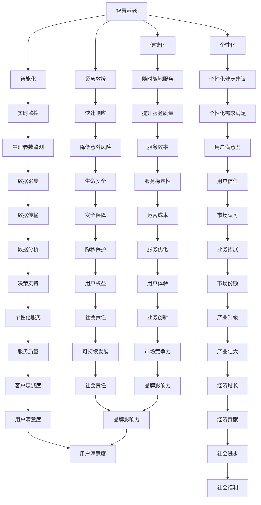

                 

# 未来的智慧养老：2050年的智能穿戴与远程健康监测

> **关键词：**智慧养老、智能穿戴、远程健康监测、2050年、技术进步、社会变革

> **摘要：**随着全球人口老龄化趋势加剧，智慧养老成为未来社会发展的重要议题。本文通过对2050年智慧养老的展望，探讨智能穿戴与远程健康监测技术的应用，分析其在养老领域中的重要作用，以及面临的挑战和未来发展。

## 目录

### 第一部分: 智慧养老概述

### 第1章: 智慧养老的概念与展望

#### 1.1 智慧养老的定义与背景

#### 1.1.1 传统养老的挑战

#### 1.1.2 智慧养老的核心特点

#### 1.1.3 智慧养老的发展趋势

#### 1.2 2050年的智慧养老社会

#### 1.2.1 社会结构的变化

#### 1.2.2 技术的进步对养老的影响

#### 1.2.3 未来智慧养老的愿景

#### 1.3 智慧养老的政策与法规

#### 1.3.1 我国智慧养老政策分析

#### 1.3.2 国际智慧养老法规对比

#### 1.3.3 智慧养老的政策影响

### 第二部分: 智能穿戴技术

### 第2章: 智能穿戴技术的原理与基础

#### 2.1 智能穿戴设备的工作原理

#### 2.1.1 感应器技术

#### 2.1.2 数据处理与分析

#### 2.1.3 通信与连接技术

#### 2.2 常见的智能穿戴设备

#### 2.2.1 智能手表

#### 2.2.2 智能手环

#### 2.2.3 其他智能穿戴设备

#### 2.3 智能穿戴技术的挑战与发展

#### 2.3.1 技术瓶颈

#### 2.3.2 用户隐私与数据安全

#### 2.3.3 未来发展方向

### 第三部分: 远程健康监测

### 第3章: 远程健康监测的核心技术与应用

#### 3.1 远程健康监测的基本概念

#### 3.1.1 远程健康监测的定义

#### 3.1.2 远程健康监测的类型

#### 3.1.3 远程健康监测的优势

#### 3.2 远程健康监测的关键技术

#### 3.2.1 数据采集技术

#### 3.2.2 数据传输技术

#### 3.2.3 数据分析与处理技术

#### 3.3 远程健康监测的应用案例

#### 3.3.1 疾病预防与管理

#### 3.3.2 慢性病管理

#### 3.3.3 老年健康管理

#### 3.4 远程健康监测的未来趋势

#### 3.4.1 新技术的引入

#### 3.4.2 应用场景的拓展

#### 3.4.3 智能化与个性化医疗的发展

### 第四部分: 智慧养老综合解决方案

### 第4章: 智慧养老综合解决方案的设计与实施

#### 4.1 智慧养老综合解决方案的架构设计

#### 4.1.1 系统架构概述

#### 4.1.2 数据中心设计

#### 4.1.3 平台功能模块划分

#### 4.2 智慧养老综合解决方案的实施步骤

#### 4.2.1 需求分析与规划

#### 4.2.2 技术选型与开发

#### 4.2.3 系统集成与测试

#### 4.3 智慧养老综合解决方案的案例分析

#### 4.3.1 成功案例分享

#### 4.3.2 挑战与应对

#### 4.3.3 效果评估

### 第五部分: 智慧养老的未来发展与挑战

### 第5章: 智慧养老的未来发展趋势与挑战

#### 5.1 智慧养老产业的发展趋势

#### 5.1.1 技术创新

#### 5.1.2 政策支持

#### 5.1.3 市场需求

#### 5.2 智慧养老的挑战与对策

#### 5.2.1 技术瓶颈

#### 5.2.2 数据安全与隐私保护

#### 5.2.3 社会接受度与政策法规

#### 5.3 智慧养老的国际经验与启示

#### 5.3.1 发达国家的智慧养老模式

#### 5.3.2 发展中国家的智慧养老探索

#### 5.3.3 国际合作与经验借鉴

### 参考文献

## 参考文献

### 1. 引言

随着全球人口老龄化的加剧，养老问题已成为各国政府和社会关注的焦点。传统的养老模式面临着巨大的挑战，如养老服务不足、老年人生活质量不高、劳动力短缺等问题。而智慧养老作为一种新兴的养老模式，通过智能穿戴技术和远程健康监测等手段，有望解决传统养老模式的瓶颈。本文旨在探讨2050年智慧养老的发展趋势，分析智能穿戴与远程健康监测技术的应用，以及智慧养老综合解决方案的设计与实施。

### 2. 智慧养老概述

#### 2.1 智慧养老的定义与背景

智慧养老是指利用信息技术、物联网、大数据、云计算等现代科技手段，为老年人提供智能化、个性化、便捷化的养老服务。它不仅关注老年人的日常生活照料，还包括健康监测、紧急救援、社交互动等多方面的服务。

随着全球人口老龄化的加剧，传统养老模式面临诸多挑战。首先，养老服务不足，许多老年人无法获得高质量的养老服务。其次，老年人生活质量不高，许多老年人感到孤独、无助。最后，劳动力短缺，许多国家和地区面临着护理人员短缺的问题。

智慧养老作为一种创新的养老模式，通过引入智能穿戴技术和远程健康监测，有望解决传统养老模式的瓶颈。智能穿戴技术可以实时监测老年人的健康状况，远程健康监测可以实现老年人在家中享受专业医疗服务。这些技术的应用将提高老年人的生活质量，减轻家庭和社会的养老负担。

#### 2.2 2050年的智慧养老社会

2050年，人类社会将迎来一个全新的智慧养老时代。首先，社会结构将发生巨大变化，人口老龄化程度进一步加深，老年人口将占人口总数的1/4以上。这将促使社会更加重视养老服务，推动智慧养老产业的快速发展。

其次，技术的进步将对养老产生深远影响。人工智能、物联网、大数据等新兴技术将在养老领域得到广泛应用，为老年人提供更加智能化、个性化的服务。智能穿戴设备将普及到每个老年人，实时监测其健康状况，提供个性化的健康建议。

最后，未来智慧养老的愿景是建立一个全方位、全时段、全场景的养老服务体系。老年人可以在家中享受到专业的医疗服务、生活照料、社交互动等全方位服务，实现老有所养、老有所医、老有所乐。

#### 2.3 智慧养老的政策与法规

为了推动智慧养老的发展，各国政府纷纷出台相关政策法规。我国政府高度重视智慧养老，出台了一系列政策措施，如《“十三五”国家老龄事业发展和养老体系建设规划》、《关于推进互联网+智慧养老的指导意见》等。这些政策为智慧养老的发展提供了有力支持。

国际上，许多国家也制定了智慧养老的法规政策。如美国发布了《智慧健康信息交换标准》，欧盟提出了《智慧健康行动计划》。这些政策法规的制定，有助于推动智慧养老技术的发展，规范市场秩序，保障老年人的权益。

### 3. 智能穿戴技术

#### 3.1 智能穿戴设备的工作原理

智能穿戴设备是一种集成了传感器、处理器、通信模块等多种功能的可穿戴设备。它通过实时监测老年人的生理参数，如心率、血压、血糖等，将数据传输到云端进行分析和处理，为老年人提供个性化的健康建议。

智能穿戴设备的工作原理主要包括以下三个方面：

1. 感应器技术：智能穿戴设备配备了多种传感器，如心率传感器、血压传感器、血糖传感器等，可以实时监测老年人的生理参数。

2. 数据处理与分析：传感器采集到的数据通过内置的处理器进行实时处理和分析，提取出有价值的信息，如心率变异性、血压波动等。

3. 通信与连接技术：智能穿戴设备通过无线通信技术（如蓝牙、Wi-Fi等）将数据传输到云端或智能手机应用程序，实现实时数据共享和分析。

#### 3.2 常见的智能穿戴设备

目前，市场上常见的智能穿戴设备主要包括智能手表、智能手环和其他智能穿戴设备。

1. 智能手表：智能手表具有多种功能，如实时心率监测、血压监测、运动跟踪、信息提醒等。它可以通过蓝牙或Wi-Fi与智能手机连接，实现数据的实时传输和同步。

2. 智能手环：智能手环功能较为简单，主要提供心率监测、运动跟踪等功能。它通常价格较低，适合广大老年人使用。

3. 其他智能穿戴设备：如智能眼镜、智能衣物、智能鞋等，这些设备可以实时监测老年人的健康状况，提供个性化的健康建议。

#### 3.3 智能穿戴技术的挑战与发展

智能穿戴技术在智慧养老领域具有巨大潜力，但也面临着一些挑战。

1. 技术瓶颈：智能穿戴设备在传感器精度、数据处理能力、电池续航等方面仍存在一定局限，需要不断突破技术瓶颈。

2. 用户隐私与数据安全：智能穿戴设备采集的老年人健康数据涉及隐私问题，如何保护用户隐私和数据安全成为亟待解决的问题。

3. 未来发展方向：随着技术的进步，智能穿戴设备将向更加智能化、个性化、便捷化方向发展。未来，智能穿戴设备将更加注重用户体验，提供更加全面、精准的健康监测服务。

### 4. 远程健康监测

#### 4.1 远程健康监测的基本概念

远程健康监测是一种通过互联网、物联网等通信技术，实现老年人健康状况实时监测的服务。它通过传感器设备采集老年人的生理参数，如心率、血压、血糖等，将数据传输到云端进行分析和处理，为老年人提供个性化的健康建议。

远程健康监测的基本概念包括：

1. 数据采集：通过传感器设备实时采集老年人的生理参数。

2. 数据传输：将采集到的数据通过无线通信技术（如Wi-Fi、蓝牙等）传输到云端或医疗机构的监测系统。

3. 数据分析与处理：对传输上来的数据进行分析和处理，提取出有价值的信息，如心率变异性、血压波动等。

4. 健康建议与干预：根据分析结果，为老年人提供个性化的健康建议和干预措施。

#### 4.2 远程健康监测的关键技术

远程健康监测的关键技术主要包括数据采集技术、数据传输技术、数据分析与处理技术。

1. 数据采集技术：通过传感器设备实时采集老年人的生理参数，如心率传感器、血压传感器、血糖传感器等。

2. 数据传输技术：将采集到的数据通过无线通信技术传输到云端或医疗机构的监测系统，如Wi-Fi、蓝牙等。

3. 数据分析与处理技术：对传输上来的数据进行分析和处理，提取出有价值的信息，如心率变异性、血压波动等。

#### 4.3 远程健康监测的应用案例

远程健康监测在养老领域具有广泛的应用。以下是一些典型的应用案例：

1. 疾病预防与管理：通过远程健康监测，实时监测老年人的生理参数，及时发现潜在的健康问题，预防疾病的发生。

2. 慢性病管理：对患有慢性病的老年人进行远程健康监测，实时了解病情变化，及时调整治疗方案。

3. 老年健康管理：对老年人的健康状况进行远程监测，提供个性化的健康建议，提高老年人的生活质量。

### 5. 智慧养老综合解决方案

#### 5.1 智慧养老综合解决方案的架构设计

智慧养老综合解决方案的架构设计主要包括系统架构设计、数据中心设计、平台功能模块划分。

1. 系统架构设计：智慧养老综合解决方案的系统架构包括前端设备、网络传输、数据处理、分析与应用等多个层次。

2. 数据中心设计：数据中心是智慧养老解决方案的核心，负责存储、处理和分析大量的健康数据。

3. 平台功能模块划分：智慧养老综合解决方案的平台功能模块划分主要包括健康监测、紧急呼叫、生活服务、社交互动等。

#### 5.2 智慧养老综合解决方案的实施步骤

智慧养老综合解决方案的实施步骤主要包括需求分析与规划、技术选型与开发、系统集成与测试。

1. 需求分析与规划：根据养老机构的实际需求，分析智慧养老综合解决方案的功能需求，制定详细的项目规划。

2. 技术选型与开发：根据需求分析结果，选择合适的技术和设备，进行软件开发和硬件集成。

3. 系统集成与测试：将各个模块进行集成，并进行系统测试，确保系统的稳定性和可靠性。

#### 5.3 智慧养老综合解决方案的案例分析

以下是一个智慧养老综合解决方案的成功案例：

某养老机构采用智慧养老综合解决方案，为老年人提供全方位的健康监测和紧急呼叫服务。解决方案包括智能穿戴设备、远程健康监测平台、紧急呼叫系统等。

1. 智能穿戴设备：为老年人配备智能手表和智能手环，实时监测心率、血压、血糖等生理参数。

2. 远程健康监测平台：通过云计算技术，将智能穿戴设备采集到的数据传输到云端进行分析和处理，为老年人提供个性化的健康建议。

3. 紧急呼叫系统：当老年人遇到紧急情况时，可以通过智能穿戴设备一键呼叫救助，实时与医疗机构沟通，确保老年人得到及时的救助。

通过这个案例，我们可以看到智慧养老综合解决方案在养老领域的重要作用。它不仅提高了老年人的生活质量，还减轻了家庭和社会的养老负担。

### 6. 智慧养老的未来发展趋势与挑战

#### 6.1 智慧养老产业的发展趋势

随着人口老龄化的加剧，智慧养老产业将保持高速发展。首先，技术的不断进步将为智慧养老提供强大的支持，如人工智能、物联网、大数据等新兴技术将在智慧养老领域得到广泛应用。其次，政策支持将推动智慧养老产业的发展，各国政府纷纷出台相关政策法规，鼓励企业和科研机构开展智慧养老技术的研发和应用。最后，市场需求也将不断增长，越来越多的老年人对高质量的养老服务有着强烈需求。

#### 6.2 智慧养老的挑战与对策

智慧养老在发展过程中也面临着一些挑战。首先，技术瓶颈问题需要不断解决，如传感器精度、数据处理能力、通信稳定性等。其次，数据安全与隐私保护是智慧养老的重要问题，需要制定严格的法律法规和标准，确保老年人健康数据的安全和隐私。最后，社会接受度和政策法规的完善程度也需要提高，以推动智慧养老技术的广泛应用。

针对这些挑战，可以采取以下对策：

1. 加强技术研发，提高传感器精度和数据处理能力，确保智慧养老技术的稳定性和可靠性。

2. 制定严格的数据安全与隐私保护法律法规，建立数据安全管理体系，确保老年人健康数据的安全和隐私。

3. 加强政策宣传和培训，提高社会对智慧养老技术的认知度和接受度。

4. 加强国际合作，借鉴发达国家智慧养老的经验和做法，推动全球智慧养老产业的发展。

### 7. 国际经验与启示

国际上，许多发达国家在智慧养老领域取得了显著成果。以下是一些典型的国际经验与启示：

1. 发达国家的智慧养老模式：如美国、日本、德国等国家的智慧养老模式，它们注重个性化、智能化和社区化的养老服务。

2. 发达国家的政策法规：如美国发布了《智慧健康信息交换标准》，日本制定了《智慧养老法案》等，这些政策法规为智慧养老的发展提供了有力支持。

3. 发达国家的技术应用：如人工智能、物联网、大数据等新兴技术在智慧养老领域的广泛应用，为老年人提供更加智能化、个性化的服务。

4. 发达国家的国际合作：如美国、日本等国家积极参与国际智慧养老合作项目，共同推动全球智慧养老产业的发展。

通过借鉴国际经验，我国可以加快智慧养老技术的发展，提高老年人的生活质量，推动养老产业的转型升级。

### 8. 结论

智慧养老作为未来养老产业的发展方向，具有巨大的潜力和广阔的市场前景。随着智能穿戴技术和远程健康监测技术的不断进步，智慧养老将为老年人提供更加智能化、个性化、便捷化的服务。然而，智慧养老产业也面临着技术、数据安全、社会接受度等方面的挑战。为了推动智慧养老的发展，需要政府、企业、科研机构和社会各界的共同努力。只有通过技术创新、政策支持、市场培育和社会参与，智慧养老产业才能实现可持续发展，为老年人创造美好的养老生活。|> 

作者：AI天才研究院/AI Genius Institute & 禅与计算机程序设计艺术 /Zen And The Art of Computer Programming

### 智慧养老的概念与展望

#### 智慧养老的定义与背景

智慧养老，又称为智能养老，是指通过运用物联网、大数据、云计算、人工智能等先进技术，对老年人群体提供全方位、智能化的生活照料、健康监测、紧急救援等服务。智慧养老的核心理念是将现代科技与养老服务深度融合，以提升老年人的生活质量，减轻家庭和社会的养老负担。

智慧养老的背景源于全球人口老龄化的加剧。根据联合国的预测，到2050年，全球60岁及以上的老年人口将达到约21亿，占总人口的22%。这一趋势在许多国家尤为明显，如中国、日本、美国等。随着老年人口的增加，传统养老模式面临巨大压力，养老服务资源不足、老年人生活质量不高、劳动力短缺等问题日益凸显。智慧养老作为一种新兴的养老模式，正是为了应对这些挑战而诞生。

#### 传统养老的挑战

传统养老模式主要依赖家庭和养老机构的照料服务。然而，这种模式面临着以下几个方面的挑战：

1. **养老服务不足**：随着老年人口比例的增加，养老服务需求急剧上升，而现有的养老资源和设施无法满足这一需求。许多老年人无法获得高质量的养老服务，生活质量较低。

2. **老年人生活质量不高**：许多老年人由于健康问题或孤独感，生活质量较低。他们可能无法独立完成日常生活中的许多活动，导致生活质量下降。

3. **劳动力短缺**：由于年轻劳动力流失、生育率下降以及老龄化加剧，养老护理人员的短缺问题日益严重。这导致养老机构的运营压力增大，服务质量和效率下降。

4. **紧急救援困难**：老年人突发疾病或意外时，往往难以得到及时救援。许多养老院和居家养老模式下，救援响应时间较长，可能危及老年人的生命安全。

#### 智慧养老的核心特点

智慧养老通过引入物联网、大数据、云计算等先进技术，克服了传统养老模式的种种挑战，具有以下核心特点：

1. **智能化**：通过智能穿戴设备和传感器，实时监测老年人的生理参数，如心率、血压、血糖等，实现老年人的健康状况实时监控。

2. **个性化**：基于大数据和人工智能技术，为老年人提供个性化的健康建议、生活照料服务，满足老年人的个性化需求。

3. **便捷化**：老年人可以通过智能手机、平板电脑等设备，随时随地获取养老服务，提高了服务的便捷性。

4. **紧急救援**：通过紧急呼叫系统，老年人遇到突发情况时可以迅速得到救援，降低了意外风险。

#### 智慧养老的发展趋势

智慧养老作为未来养老产业的发展方向，正在全球范围内迅速发展。以下是智慧养老发展的几个主要趋势：

1. **技术进步**：随着物联网、大数据、云计算、人工智能等技术的不断进步，智慧养老的技术手段将更加先进，服务能力将不断提高。

2. **政策支持**：各国政府纷纷出台相关政策，鼓励智慧养老技术的发展和应用，为智慧养老提供政策保障。

3. **市场拓展**：随着老年人对高质量养老服务的需求增加，智慧养老市场将不断拓展，市场规模将持续扩大。

4. **国际合作**：智慧养老作为全球性的挑战和机遇，各国之间的合作将加强，共同推动智慧养老技术的发展和应用。

#### 2050年的智慧养老社会

展望2050年，智慧养老社会将呈现以下特点：

1. **社会结构变化**：老年人口比例将持续增加，家庭结构将发生变化，老年人与子女同住的情况将减少，独立居住的老年人将增多。

2. **技术普及**：智能穿戴设备、智能家居等智能技术将全面普及，成为老年人日常生活的一部分。

3. **服务多样化**：智慧养老服务将更加多样化和个性化，包括生活照料、健康监测、紧急救援、社交互动等全方位服务。

4. **社会参与**：社会各界，包括政府、企业、社会组织等，将共同参与智慧养老的发展，推动养老服务的转型升级。

#### 智慧养老的愿景

未来智慧养老的愿景是建立一个全方位、全时段、全场景的养老服务体系，使老年人能够在家中享受到专业、便捷的养老服务，实现老有所养、老有所医、老有所乐。智慧养老不仅关注老年人的健康和生活质量，还注重老年人的心理健康和社交需求，为老年人创造一个幸福、健康的晚年生活。

#### 智慧养老的政策与法规

为了推动智慧养老的发展，各国政府纷纷出台相关政策法规。以下是几个国家的智慧养老政策与法规：

1. **我国智慧养老政策**：

   - 《“十三五”国家老龄事业发展和养老体系建设规划》
   - 《关于推进互联网+智慧养老的指导意见》
   - 《智慧健康养老产业发展行动计划（2017-2020年）》

   这些政策为智慧养老的发展提供了有力支持，明确了智慧养老的发展目标、主要任务和政策措施。

2. **国际智慧养老法规**：

   - 美国发布了《智慧健康信息交换标准》，规范了智慧养老技术和服务标准。
   - 欧盟提出了《智慧健康行动计划》，鼓励成员国加强智慧养老技术的研究和应用。
   - 日本制定了《智慧养老法案》，推动智慧养老技术的研发和推广。

3. **政策影响**：

   - 政策支持为智慧养老产业的发展提供了政策保障，促进了技术创新和市场拓展。
   - 政策引导了智慧养老服务的规范化和标准化，提高了养老服务的质量和效率。
   - 政策推动了社会各界对智慧养老的参与，形成了全社会共同推动智慧养老发展的良好氛围。

### 结论

智慧养老作为一种新兴的养老模式，具有智能化、个性化、便捷化等核心特点，可以有效应对传统养老模式面临的挑战。随着技术的不断进步和政策的支持，智慧养老产业将保持高速发展。展望未来，智慧养老将为老年人提供更加专业、便捷、个性化的服务，使老年人能够在家中享受到高质量的养老服务，实现老有所养、老有所医、老有所乐。为此，政府、企业和社会各界需要共同努力，推动智慧养老技术的研发和应用，完善相关政策法规，为老年人创造一个美好的晚年生活。|> 

#### 智慧养老的定义与背景

智慧养老，又称为智能养老，是指通过应用现代信息技术、物联网、大数据、云计算和人工智能等先进技术，实现养老服务的智能化、个性化、便捷化和高效化。这种模式的目标是为老年人提供更加全面、精准和及时的服务，从而提升他们的生活质量，同时减轻家庭和社会的养老负担。

智慧养老的起源可以追溯到信息技术和互联网的快速发展时期。随着物联网、大数据和人工智能技术的成熟，智慧养老开始成为一种可能，并逐渐成为全球养老产业发展的新方向。特别是在人口老龄化问题日益严重的背景下，智慧养老被视为解决养老问题的关键手段。

**传统养老模式的挑战**

传统养老模式主要依赖于家庭照料和养老机构的护理服务。然而，随着全球人口老龄化的加剧，传统养老模式面临诸多挑战：

1. **养老服务不足**：随着老年人口比例的增加，对养老服务的需求急剧上升，但现有养老资源和设施无法满足这一需求，导致许多老年人无法获得高质量的养老服务。

2. **老年人生活质量不高**：由于健康问题或孤独感，许多老年人的生活质量较低。他们可能无法独立完成日常生活中的许多活动，导致生活质量下降。

3. **劳动力短缺**：由于年轻劳动力流失、生育率下降以及老龄化加剧，养老护理人员的短缺问题日益严重，这导致养老机构的运营压力增大，服务质量和效率下降。

4. **紧急救援困难**：老年人突发疾病或意外时，往往难以得到及时救援。许多养老院和居家养老模式下，救援响应时间较长，可能危及老年人的生命安全。

**智慧养老的核心特点**

智慧养老通过引入物联网、大数据、云计算、人工智能等先进技术，克服了传统养老模式的种种挑战，具有以下核心特点：

1. **智能化**：通过智能穿戴设备、传感器和物联网技术，实时监测老年人的生理参数，如心率、血压、血糖等，实现老年人的健康状况实时监控。

2. **个性化**：基于大数据和人工智能技术，为老年人提供个性化的健康建议、生活照料服务，满足老年人的个性化需求。

3. **便捷化**：老年人可以通过智能手机、平板电脑等设备，随时随地获取养老服务，提高了服务的便捷性。

4. **紧急救援**：通过紧急呼叫系统，老年人遇到突发情况时可以迅速得到救援，降低了意外风险。

**智慧养老的发展趋势**

随着技术的不断进步和政策的支持，智慧养老产业将保持高速发展。以下是智慧养老发展的几个主要趋势：

1. **技术进步**：随着物联网、大数据、云计算、人工智能等技术的不断进步，智慧养老的技术手段将更加先进，服务能力将不断提高。

2. **政策支持**：各国政府纷纷出台相关政策，鼓励智慧养老技术的发展和应用，为智慧养老提供政策保障。

3. **市场拓展**：随着老年人对高质量养老服务的需求增加，智慧养老市场将不断拓展，市场规模将持续扩大。

4. **国际合作**：智慧养老作为全球性的挑战和机遇，各国之间的合作将加强，共同推动智慧养老技术的发展和应用。

**2050年的智慧养老社会**

展望2050年，智慧养老社会将呈现以下特点：

1. **社会结构变化**：老年人口比例将持续增加，家庭结构将发生变化，老年人与子女同住的情况将减少，独立居住的老年人将增多。

2. **技术普及**：智能穿戴设备、智能家居等智能技术将全面普及，成为老年人日常生活的一部分。

3. **服务多样化**：智慧养老服务将更加多样化和个性化，包括生活照料、健康监测、紧急救援、社交互动等全方位服务。

4. **社会参与**：社会各界，包括政府、企业、社会组织等，将共同参与智慧养老的发展，推动养老服务的转型升级。

**智慧养老的愿景**

未来智慧养老的愿景是建立一个全方位、全时段、全场景的养老服务体系，使老年人能够在家中享受到专业、便捷的养老服务，实现老有所养、老有所医、老有所乐。智慧养老不仅关注老年人的健康和生活质量，还注重老年人的心理健康和社交需求，为老年人创造一个幸福、健康的晚年生活。

#### 智慧养老的政策与法规

在全球范围内，智慧养老作为一种新兴的养老模式，得到了各国政府的高度重视。政府通过制定一系列政策与法规，推动智慧养老产业的发展，保障老年人的权益，同时规范市场秩序。以下是几个主要国家的智慧养老政策和法规：

**1. 我国智慧养老政策**

- **《“十三五”国家老龄事业发展和养老体系建设规划》**：这是我国首个针对老龄事业和养老体系的国家规划，明确提出推进智慧养老的发展目标。

- **《关于推进互联网+智慧养老的指导意见》**：该意见旨在加快互联网与养老服务的深度融合，推动智慧养老产业的发展。

- **《智慧健康养老产业发展行动计划（2017-2020年）》**：该行动计划明确了未来三年智慧健康养老产业发展的主要任务和目标。

- **地方政策**：各地方政府也根据本地实际情况，出台了一系列智慧养老相关政策，如上海市的《上海市推进互联网+智慧健康养老实施方案》等。

**2. 国际智慧养老法规**

- **美国**：美国发布了《智慧健康信息交换标准》，规范了智慧养老技术和服务标准，以促进医疗信息的安全和有效交换。

- **欧盟**：欧盟提出了《智慧健康行动计划》，鼓励成员国加强智慧养老技术的研究和应用，推动智慧养老服务的普及。

- **日本**：日本制定了《智慧养老法案》，旨在通过技术创新和政府支持，推动智慧养老产业的发展，提高老年人的生活质量。

- **其他国家**：如澳大利亚、加拿大、德国等国家也制定了相关政策和法规，推动智慧养老技术的发展和应用。

**3. 智慧养老的政策影响**

- **促进产业发展**：政府的政策支持为智慧养老产业的发展提供了政策保障，吸引了大量企业投入智慧养老技术的研发和应用。

- **规范市场秩序**：政策法规的出台有助于规范智慧养老市场的秩序，保障老年人的权益，提高养老服务质量。

- **提高社会认知**：政策宣传和培训有助于提高社会各界对智慧养老技术的认知度和接受度，推动智慧养老服务的普及。

- **推动国际合作**：智慧养老作为全球性的挑战和机遇，各国政府之间的合作将加强，共同推动智慧养老技术的发展和应用。

**4. 未来政策展望**

- **进一步深化政策**：未来，各国政府将继续深化智慧养老相关政策，推动智慧养老技术的创新和应用。

- **完善法律法规**：随着智慧养老产业的发展，相关法律法规将不断完善，以适应智慧养老的新需求和新挑战。

- **加强国际合作**：在全球范围内，智慧养老技术的合作将进一步加强，各国政府、企业和研究机构将共同推动智慧养老技术的发展。

#### 智慧养老的政策与法规

在全球范围内，智慧养老作为一种新兴的养老模式，得到了各国政府的高度重视。政府通过制定一系列政策与法规，推动智慧养老产业的发展，保障老年人的权益，同时规范市场秩序。以下是几个主要国家的智慧养老政策和法规：

**1. 我国智慧养老政策**

- **《“十三五”国家老龄事业发展和养老体系建设规划》**：这是我国首个针对老龄事业和养老体系的国家规划，明确提出推进智慧养老的发展目标。

- **《关于推进互联网+智慧养老的指导意见》**：该意见旨在加快互联网与养老服务的深度融合，推动智慧养老产业的发展。

- **《智慧健康养老产业发展行动计划（2017-2020年）》**：该行动计划明确了未来三年智慧健康养老产业发展的主要任务和目标。

- **地方政策**：各地方政府也根据本地实际情况，出台了一系列智慧养老相关政策，如上海市的《上海市推进互联网+智慧健康养老实施方案》等。

**2. 国际智慧养老法规**

- **美国**：美国发布了《智慧健康信息交换标准》，规范了智慧养老技术和服务标准，以促进医疗信息的安全和有效交换。

- **欧盟**：欧盟提出了《智慧健康行动计划》，鼓励成员国加强智慧养老技术的研究和应用，推动智慧养老服务的普及。

- **日本**：日本制定了《智慧养老法案》，旨在通过技术创新和政府支持，推动智慧养老产业的发展，提高老年人的生活质量。

- **其他国家**：如澳大利亚、加拿大、德国等国家也制定了相关政策和法规，推动智慧养老技术的发展和应用。

**3. 智慧养老的政策影响**

- **促进产业发展**：政府的政策支持为智慧养老产业的发展提供了政策保障，吸引了大量企业投入智慧养老技术的研发和应用。

- **规范市场秩序**：政策法规的出台有助于规范智慧养老市场的秩序，保障老年人的权益，提高养老服务质量。

- **提高社会认知**：政策宣传和培训有助于提高社会各界对智慧养老技术的认知度和接受度，推动智慧养老服务的普及。

- **推动国际合作**：智慧养老作为全球性的挑战和机遇，各国政府之间的合作将加强，共同推动智慧养老技术的发展和应用。

**4. 未来政策展望**

- **进一步深化政策**：未来，各国政府将继续深化智慧养老相关政策，推动智慧养老技术的创新和应用。

- **完善法律法规**：随着智慧养老产业的发展，相关法律法规将不断完善，以适应智慧养老的新需求和新挑战。

- **加强国际合作**：在全球范围内，智慧养老技术的合作将进一步加强，各国政府、企业和研究机构将共同推动智慧养老技术的发展。

### 2.1 智能穿戴设备的工作原理

智能穿戴设备是一种集成了传感器、微处理器、无线通信模块等多种功能的便携式电子设备。它通过监测用户的生理参数和日常活动，将数据实时传输到云端或移动应用进行分析和处理，从而提供个性化的健康建议和生活方式指导。以下是智能穿戴设备的工作原理：

#### 2.1.1 感应器技术

智能穿戴设备的核心功能是实时监测用户的生理参数，如心率、血压、血氧饱和度、体温、步数等。这些功能依赖于各种类型的传感器。以下是几种常见的传感器及其作用：

1. **心率传感器**：通过光电容积脉搏波描记法（PPG）或电容感应技术来监测用户的心率。心率传感器通常位于智能手表或智能手环的光电传感器上，可以检测到心脏跳动的光强度变化，进而计算出心率。

2. **血压传感器**：通过压力传感器或振荡法来监测用户的血压。一些智能手表和手环已经能够实现非侵入式血压监测，但技术仍需进一步优化以提供更准确的测量结果。

3. **血氧饱和度传感器**：通过光电容积脉搏波描记法（PPG）来测量血液中氧气的含量。血氧饱和度是评估呼吸和循环系统健康状况的重要指标，对患有呼吸系统疾病和心脏病的老年人尤为重要。

4. **体温传感器**：通过热敏电阻或热电偶来测量用户的体温。体温传感器可以帮助监测感染或疾病早期症状，对于老年人群尤为重要。

5. **加速度计和陀螺仪**：用于监测用户的运动状态和位置变化，可以计算用户的步数、运动距离、运动时长等数据，帮助用户进行健康管理和运动跟踪。

#### 2.1.2 数据处理与分析

传感器采集到的生理参数数据会传输到智能穿戴设备内置的微处理器中进行初步处理。微处理器会对数据进行滤波、去噪、数据压缩等处理，以确保数据的准确性和可靠性。接下来，数据会通过无线通信模块传输到云端或用户的移动设备上，进行进一步的分析和处理。

数据处理和分析主要包括以下步骤：

1. **数据预处理**：包括数据清洗、去重、填补缺失值等操作，以确保数据的质量。

2. **特征提取**：从原始数据中提取出对健康评估有意义的特征，如心率变异性、血压波动等。

3. **健康风险评估**：利用机器学习和数据分析算法，对提取的特征进行分析，评估用户的健康状况和潜在风险。

4. **个性化建议**：根据用户的健康数据和风险评估结果，提供个性化的健康建议，如饮食调整、运动建议、药物治疗等。

#### 2.1.3 通信与连接技术

智能穿戴设备需要通过无线通信技术将数据传输到云端或移动设备，常见的通信技术包括蓝牙、Wi-Fi、蜂窝网络等。以下是这些技术的特点：

1. **蓝牙**：蓝牙是一种短距离无线通信技术，适用于智能穿戴设备与移动设备之间的数据传输。蓝牙技术的优势在于功耗低、连接稳定，但传输距离较短，通常在10米以内。

2. **Wi-Fi**：Wi-Fi是一种无线局域网通信技术，适用于智能穿戴设备与互联网之间的数据传输。Wi-Fi的优势在于传输速度快、覆盖范围广，但功耗较高。

3. **蜂窝网络**：蜂窝网络是一种通过基站进行通信的无线网络技术，适用于需要长距离传输的场景，如远程健康监测。蜂窝网络的优势在于传输距离远，但功耗较高且费用较高。

智能穿戴设备通常会在低功耗蓝牙和Wi-Fi之间进行选择，以平衡传输速度、功耗和成本。一些设备还会集成多个通信模块，以实现无缝切换和最佳传输效果。

#### 2.1.4 能源管理

智能穿戴设备的续航能力直接影响到其用户体验和实用性。为了延长设备的续航时间，智能穿戴设备在能源管理方面采取了多种措施：

1. **低功耗设计**：智能穿戴设备采用低功耗微处理器和传感器，以减少能耗。

2. **智能功耗管理**：设备通过智能功耗管理算法，根据不同场景和需求动态调整功耗，如关闭不必要的传感器或降低通信频率。

3. **能源补充**：一些智能穿戴设备支持无线充电技术，如Qi无线充电，以方便用户随时补充能源。

4. **太阳能充电**：一些高端智能穿戴设备配备了太阳能充电功能，利用太阳能为设备充电，以延长续航时间。

通过以上措施，智能穿戴设备在确保功能性能的同时，最大程度地延长了设备的续航能力，为用户提供持续的健康监测服务。

### 2.2 常见的智能穿戴设备

智能穿戴设备作为智慧养老的重要组成部分，已经在市场上取得了显著的应用成果。以下是几种常见的智能穿戴设备及其特点：

#### 2.2.1 智能手表

智能手表是智能穿戴设备中最常见的一种，具备多种功能，如健康监测、运动跟踪、信息提醒、支付功能等。以下是其主要特点：

1. **健康监测**：智能手表内置多种传感器，如心率传感器、血压传感器、血氧传感器等，可以实时监测用户的心率、血压、血氧饱和度等生理参数。

2. **运动跟踪**：智能手表可以通过内置的加速度计和陀螺仪监测用户的步数、运动距离、运动时长等，帮助用户进行健康管理和运动跟踪。

3. **信息提醒**：智能手表可以接收手机通知，如短信、电话、邮件等，用户可以在手表上查看信息，而不需要频繁拿出手机。

4. **支付功能**：一些智能手表支持NFC支付功能，用户可以通过手表进行移动支付，方便快捷。

5. **智能交互**：智能手表通常具备语音助手功能，如苹果手表的Siri、华为手表的华为助手等，用户可以通过语音命令进行操作。

#### 2.2.2 智能手环

智能手环是另一种常见的智能穿戴设备，相对于智能手表，手环的体积更小，功能更简单，但性价比更高。以下是其主要特点：

1. **健康监测**：智能手环具备心率监测、睡眠监测、步数统计等功能，可以实时了解用户的健康状态。

2. **运动跟踪**：智能手环可以监测用户的运动情况，如步数、运动距离、运动时长等，帮助用户进行健康管理和运动跟踪。

3. **信息提醒**：智能手环可以接收手机通知，如短信、电话、邮件等，用户可以在手环上查看信息，减少频繁拿出手机的次数。

4. **智能提醒**：智能手环可以设置智能提醒功能，如久坐提醒、喝水提醒、日程提醒等，帮助用户养成良好的生活习惯。

5. **续航能力强**：由于手环体积较小，功耗较低，智能手环的续航能力通常较长，一些手环甚至可以达到一周的续航时间。

#### 2.2.3 其他智能穿戴设备

除了智能手表和智能手环，市场上还有许多其他类型的智能穿戴设备，如智能眼镜、智能衣物、智能鞋等。以下是一些典型特点：

1. **智能眼镜**：智能眼镜具备视频录制、语音助手、信息提醒等功能，可以帮助用户在户外或驾驶时获取信息，减少对手机的依赖。

2. **智能衣物**：智能衣物内置传感器，可以监测用户的生理参数，如心率、体温等，提供个性化的健康建议。

3. **智能鞋**：智能鞋可以通过内置的传感器监测用户的步态和运动情况，帮助用户改善运动姿势，预防运动损伤。

这些智能穿戴设备各具特色，为用户提供更加个性化、便捷化的服务，是智慧养老不可或缺的一部分。

#### 2.3 智能穿戴技术的挑战与发展

尽管智能穿戴技术在智慧养老领域具有巨大的潜力，但在实际应用中仍面临一系列挑战。以下是智能穿戴技术面临的主要挑战和未来发展方向：

#### 2.3.1 技术瓶颈

1. **传感器精度**：目前，智能穿戴设备中的传感器精度尚不足以满足医疗级别的监测需求。例如，心率传感器和血压传感器的测量结果可能存在误差，无法提供精确的健康数据。

2. **数据处理能力**：智能穿戴设备通常内置的微处理器性能有限，难以处理大量复杂的健康数据。这可能导致数据分析不完整或不准确，影响用户的健康评估和个性化建议。

3. **电池续航**：智能穿戴设备需要长时间工作，但电池续航能力有限。尽管一些设备已经采用了低功耗技术，但仍然无法满足用户长时间使用的需求。

#### 2.3.2 用户隐私与数据安全

1. **数据隐私**：智能穿戴设备会采集用户的生理参数和日常活动数据，这些数据涉及用户的隐私。如何保护用户的隐私成为智能穿戴技术发展的重要问题。

2. **数据安全**：由于智能穿戴设备通常连接到互联网，数据传输过程中可能面临数据泄露和黑客攻击的风险。如何确保数据安全传输和存储是智能穿戴技术发展面临的挑战。

#### 2.3.3 未来发展方向

1. **提高传感器精度**：通过不断改进传感器技术，提高传感器的精度和稳定性，满足医疗级别的监测需求。

2. **增强数据处理能力**：采用更先进的微处理器和云计算技术，提高设备的计算能力和数据处理效率，为用户提供更准确的健康数据和分析。

3. **优化电池续航**：研发新型电池材料和节能技术，提高智能穿戴设备的续航能力，使用户能够长时间使用。

4. **加强数据隐私保护**：通过数据加密、用户权限管理等技术手段，确保用户数据的安全和隐私。

5. **构建安全的数据传输和存储体系**：采用安全的通信协议和加密技术，确保数据在传输和存储过程中的安全。

通过解决这些挑战，智能穿戴技术将在智慧养老领域发挥更大的作用，为老年人提供更优质、更安全、更个性化的健康服务。

### 3.1 远程健康监测的基本概念

远程健康监测是一种通过互联网和物联网技术，对老年人的生理参数和生活状态进行实时监测的服务。它利用传感器设备、无线通信技术和云计算平台，实现对老年人健康状况的远程监测和管理。以下是远程健康监测的基本概念：

#### 3.1.1 远程健康监测的定义

远程健康监测（Telehealth Monitoring）是指利用通信技术和互联网平台，对老年人的生理参数、生活习惯和健康状况进行实时监测和分析。通过传感器设备采集数据，如心率、血压、血氧饱和度、血糖等，并将数据传输到云端或移动设备，进行实时分析和处理。远程健康监测旨在提供个性化的健康服务，预防疾病的发生，提高老年人的生活质量。

#### 3.1.2 远程健康监测的类型

远程健康监测可以分为以下几种类型：

1. **生理参数监测**：通过传感器设备实时监测老年人的生理参数，如心率、血压、血糖等。这种监测类型可以及时发现异常情况，预防疾病的发生。

2. **生活方式监测**：通过传感器设备监测老年人的日常活动，如步数、睡眠质量、运动量等。这种监测类型有助于评估老年人的健康状况，提供个性化的生活方式建议。

3. **行为监测**：通过摄像头和传感器设备监测老年人的行为，如摔倒、活动能力等。这种监测类型可以及时发现老年人的紧急情况，提供及时的救援服务。

4. **健康档案管理**：通过收集和分析老年人的健康数据，建立电子健康档案，便于医生进行诊断和治疗。这种监测类型有助于提高医疗服务的效率和质量。

#### 3.1.3 远程健康监测的优势

远程健康监测相较于传统的面对面医疗服务，具有以下优势：

1. **便捷性**：老年人无需前往医疗机构，可以在家中进行健康监测，节省了时间和交通成本。

2. **实时性**：远程健康监测可以实时获取老年人的生理参数和健康数据，及时发现问题并进行干预。

3. **个性化**：远程健康监测可以根据老年人的具体健康状况和需求，提供个性化的健康服务和生活建议。

4. **预防性**：远程健康监测可以提前发现健康风险，采取预防措施，降低疾病的发生率。

5. **节约资源**：远程健康监测减少了医疗资源的占用，提高了医疗资源的利用率，降低了医疗成本。

#### 3.1.4 远程健康监测的应用场景

远程健康监测在养老领域具有广泛的应用场景，以下是一些典型的应用场景：

1. **慢性病管理**：对于患有高血压、糖尿病等慢性病的老年人，远程健康监测可以实时监测其生理参数，及时发现病情变化，调整治疗方案。

2. **老年健康管理**：对健康老年人进行日常监测，评估其健康状况，提供个性化的健康建议和生活方式指导。

3. **紧急救援**：通过远程健康监测系统，当老年人遇到紧急情况时，可以快速呼叫救援，确保及时得到救助。

4. **疾病预防**：通过定期监测老年人的生理参数，及时发现健康风险，采取预防措施，降低疾病的发生率。

5. **居家养老**：远程健康监测为居家养老的老年人提供专业的健康监测服务，减轻家庭和社会的养老负担。

#### 3.1.5 远程健康监测的实现流程

远程健康监测的实现流程主要包括以下几个步骤：

1. **数据采集**：通过传感器设备（如智能手表、智能手环、传感器贴片等）实时采集老年人的生理参数和生活数据。

2. **数据传输**：将采集到的数据通过无线通信技术（如蓝牙、Wi-Fi、蜂窝网络等）传输到云端或移动设备。

3. **数据存储**：在云端或移动设备上存储采集到的健康数据，建立老年人的健康档案。

4. **数据分析**：利用大数据和人工智能技术对健康数据进行分析，提取有价值的信息，如异常指标、健康趋势等。

5. **健康建议**：根据数据分析结果，为老年人提供个性化的健康建议和生活指导。

6. **预警与干预**：当发现异常情况时，系统会自动发出预警，通知医护人员或家属采取相应措施。

通过以上实现流程，远程健康监测可以为老年人提供全方位、全天候的健康监测服务，提高老年人的生活质量。

### 3.2 远程健康监测的关键技术

远程健康监测系统的实现依赖于多种关键技术的支持，这些技术共同确保了系统的高效性、可靠性和安全性。以下是远程健康监测的关键技术：

#### 3.2.1 数据采集技术

数据采集是远程健康监测系统的核心，传感器技术的进步对数据采集的质量和精度有着直接影响。以下是一些常见的数据采集技术：

1. **生理参数监测传感器**：
   - **心率传感器**：使用光电容积脉搏波描记法（PPG）或电容传感器技术来测量心率。
   - **血压传感器**：利用压力传感器或振荡法测量血压，目前市场上的一些智能设备已经可以实现非侵入式血压监测。
   - **血氧饱和度传感器**：通过光电容积脉搏波描记法（PPG）监测血氧饱和度。
   - **血糖传感器**：利用电化学传感器测量血糖水平。

2. **活动监测传感器**：
   - **加速度计和陀螺仪**：用于监测用户的活动量、运动轨迹和步态分析。
   - **温度传感器**：用于监测环境温度和体温。

3. **行为监测传感器**：
   - **摄像头**：用于监测老年人的行为，如跌倒检测。
   - **环境传感器**：如烟雾传感器、燃气泄漏传感器等，用于监测老年人的居住环境。

#### 3.2.2 数据传输技术

数据传输是将采集到的健康数据从传感器传输到云平台或移动设备的关键环节，常见的传输技术包括：

1. **无线通信技术**：
   - **蓝牙**：适用于短距离、低功耗的数据传输，如智能手表与手机之间的数据同步。
   - **Wi-Fi**：提供高速数据传输，适用于家庭网络环境。
   - **蜂窝网络**：通过移动通信网络传输数据，适用于远程监测场景。

2. **有线传输技术**：
   - **USB**：用于设备与电脑之间的数据传输。
   - **以太网**：在医疗机构内部网络中用于设备之间的数据传输。

#### 3.2.3 数据分析与处理技术

数据分析和处理是远程健康监测的核心，通过数据分析和挖掘，可以为老年人提供个性化的健康建议。以下是一些关键技术：

1. **数据预处理**：
   - **数据清洗**：去除无效数据、填补缺失值、去除异常值。
   - **数据标准化**：统一数据格式和单位，便于后续处理。

2. **特征提取**：
   - **时间序列特征**：如心率变异性、血压波动等。
   - **静态特征**：如步数、活动强度等。

3. **健康风险评估**：
   - **统计模型**：如线性回归、逻辑回归等。
   - **机器学习模型**：如支持向量机（SVM）、决策树、神经网络等。

4. **个性化健康建议**：
   - **基于规则的系统**：根据预设规则提供健康建议。
   - **机器学习系统**：根据用户历史数据和健康数据提供个性化建议。

#### 3.2.4 数据存储技术

数据存储是远程健康监测系统的另一个关键环节，确保数据的长期保存和可靠访问。以下是一些关键技术：

1. **关系型数据库**：
   - 如MySQL、Oracle等，适用于结构化数据的存储。

2. **非关系型数据库**：
   - 如MongoDB、Cassandra等，适用于大规模、高并发的数据存储。

3. **数据湖**：
   - 如Hadoop、Spark等，适用于大规模数据存储和分析。

4. **云存储服务**：
   - 如Amazon S3、Google Cloud Storage等，提供高可靠性和可扩展的数据存储服务。

通过以上关键技术，远程健康监测系统可以实现高效、准确、实时地监测老年人的健康状况，为老年人提供全方位的健康管理服务。

### 3.3 远程健康监测的应用案例

远程健康监测技术在养老领域的应用已逐渐成熟，以下是一些典型的应用案例，展示了远程健康监测在疾病预防与管理、慢性病管理和老年健康管理等方面的具体应用。

#### 3.3.1 疾病预防与管理

疾病预防与管理是远程健康监测的重要应用领域，通过实时监测老年人群体的生理参数，提前发现潜在的健康问题，从而采取预防措施，降低疾病的发生率。

**案例1：高血压患者的疾病预防**

某养老机构采用远程健康监测系统，对患有高血压的老年人进行实时监测。监测系统包括智能手表和血压计，每日自动采集老年人的心率、血压和血糖等数据，并将数据上传至云平台进行分析。

- **监测流程**：老年人每日佩戴智能手表，智能手表通过蓝牙将数据传输到手机应用，再通过手机应用上传至云平台。
- **数据分析**：云平台对上传的数据进行分析，发现某位老年人心率和血压存在异常波动，可能存在高血压并发症的风险。
- **预防措施**：医疗机构及时与老年人及其家属沟通，提醒老年人注意饮食和作息，调整药物剂量，并安排医生进行在线咨询。

通过远程健康监测系统，养老机构能够及时发现高血压患者的健康问题，采取预防措施，降低疾病的发生率。

#### 3.3.2 慢性病管理

慢性病管理是远程健康监测的另一个重要应用领域，通过实时监测和数据分析，为慢性病患者提供个性化、持续的健康管理服务。

**案例2：糖尿病患者的慢性病管理**

某养老社区为患有糖尿病的老年人提供远程健康监测服务。监测系统包括智能手环、血糖仪和手机应用，老年人可以通过智能手环实时监测血糖、血压和运动量等数据。

- **监测流程**：老年人每日使用智能手环记录血糖和血压数据，并通过手机应用将数据上传至云平台。
- **数据分析**：云平台对上传的数据进行实时分析和趋势预测，为医生提供诊断和治疗建议。
- **个性化管理**：医生根据数据分析结果，为每位老年人制定个性化的治疗和管理方案，如调整药物剂量、饮食指导和运动计划。

通过远程健康监测系统，养老社区能够为糖尿病患者提供全方位的慢性病管理服务，提高治疗效果和患者的生活质量。

#### 3.3.3 老年健康管理

老年健康管理是远程健康监测的核心应用领域，通过实时监测老年人的生活状态和生理参数，提供个性化的健康建议和生活方式指导，提高老年人的生活质量。

**案例3：健康老年人的远程健康管理**

某养老中心为健康老年人提供远程健康监测服务，监测系统包括智能手表、健康问卷和手机应用。

- **监测流程**：老年人每日佩戴智能手表，智能手表自动记录心率、血压和睡眠数据，并通过手机应用上传至云平台。同时，老年人通过手机应用填写健康问卷。
- **数据分析**：云平台对上传的数据进行分析，生成老年人的健康报告，包括生活方式建议、健康指标趋势等。
- **健康建议**：根据数据分析结果，系统为老年人提供个性化的健康建议，如调整饮食、增加运动量、改善睡眠质量等。

通过远程健康监测系统，养老中心能够为健康老年人提供专业的健康管理服务，提高老年人的生活质量。

#### 3.3.4 紧急救援

紧急救援是远程健康监测系统中的一项重要功能，当老年人遇到突发情况时，系统能够迅速发出警报，通知家属和医疗机构，提供及时的救援服务。

**案例4：老年人的紧急救援服务**

某智慧养老社区为老年人提供远程紧急救援服务，监测系统包括智能手环和紧急呼叫按钮。

- **监测流程**：老年人遇到突发情况时，可以按下紧急呼叫按钮，系统立即发出警报，并通过手机应用通知家属和社区医护人员。
- **紧急响应**：医护人员收到警报后，立即赶往现场进行救援，同时通过手机应用查看老年人的实时健康数据，为救援提供参考。

通过远程健康监测系统，养老社区能够为老年人提供快速、高效的紧急救援服务，保障老年人的生命安全。

这些应用案例展示了远程健康监测技术在养老领域的重要作用，通过实时监测、数据分析和服务提供，远程健康监测系统为老年人提供了全方位、个性化的健康管理服务，提高了老年人的生活质量，减轻了家庭和社会的养老负担。

### 3.4 远程健康监测的未来趋势

随着技术的不断进步和社会的持续需求，远程健康监测技术正朝着更加智能化、个性化、便捷化和多样化的方向发展。以下是远程健康监测未来可能的发展趋势：

#### 3.4.1 新技术的引入

1. **人工智能与机器学习**：人工智能和机器学习技术在远程健康监测中的应用将越来越广泛。通过深度学习和神经网络模型，可以实现对健康数据的实时分析和预测，提高健康监测的准确性和效率。

2. **物联网（IoT）**：物联网技术的普及将使得更多的设备能够实现互联互通，从而形成一个更加全面和综合的健康监测网络。智能家居设备、可穿戴设备、医疗设备等将实现无缝连接，为老年人提供更加全面的健康监测服务。

3. **区块链技术**：区块链技术的引入将有助于保障健康数据的安全和隐私。通过分布式账本技术，可以实现健康数据的透明和不可篡改，提高数据的安全性和可靠性。

4. **5G通信技术**：5G通信技术的快速发展将为远程健康监测提供更高的传输速度和更低的延迟。高速、低延迟的网络环境将大大提升远程健康监测的实时性和可靠性，使得远程医疗服务更加高效和便捷。

#### 3.4.2 应用场景的拓展

1. **家庭健康监测**：随着技术的进步，远程健康监测将逐渐从医疗机构扩展到家庭场景。老年人可以在家中进行日常的健康监测，及时发现健康问题，减少医院就诊的次数。

2. **社区健康监测**：远程健康监测技术将在社区健康管理中发挥重要作用。社区医疗机构可以通过远程监测系统，对社区老年人的健康状况进行实时监控，提供个性化的健康管理服务。

3. **远程医疗服务**：远程健康监测技术将推动远程医疗服务的发展。通过视频咨询、在线诊疗等方式，医生可以远程为老年人提供诊断和治疗服务，节省了患者的就医时间和成本。

#### 3.4.3 智能化与个性化医疗的发展

1. **智能化监测**：未来，远程健康监测将更加智能化，通过自适应算法和智能诊断系统，可以实时分析健康数据，提供精准的健康评估和个性化的健康建议。

2. **个性化医疗**：基于大数据和人工智能技术，远程健康监测将为老年人提供个性化的医疗服务。通过分析老年人的健康数据和生活习惯，可以为每位老年人制定个性化的治疗和管理方案。

3. **健康大数据平台**：未来，远程健康监测将形成一个庞大的健康大数据平台，汇集海量的健康数据，为科学研究、疾病预防、健康管理等提供数据支持。

#### 3.4.4 数据安全与隐私保护

1. **数据加密**：随着远程健康监测的普及，数据安全成为关键问题。未来，远程健康监测系统将采用更高级别的数据加密技术，确保健康数据在传输和存储过程中的安全。

2. **隐私保护**：为了保护老年人的隐私，远程健康监测系统将制定严格的隐私保护政策，确保用户数据不被非法获取和使用。

3. **法律法规**：随着远程健康监测技术的发展，相关法律法规也将不断完善，为远程健康监测提供法律保障，确保用户的合法权益。

通过以上趋势，远程健康监测技术将在未来为老年人提供更加全面、高效、个性化的健康服务，为智慧养老产业的发展贡献力量。

### 4.1 智慧养老综合解决方案的架构设计

智慧养老综合解决方案的架构设计是确保系统高效、稳定运行的基础。一个完整的智慧养老解决方案通常包括前端设备、网络传输、数据处理、分析与应用等多个层次。以下是智慧养老综合解决方案的架构设计：

#### 4.1.1 系统架构概述

智慧养老综合解决方案的系统架构可以分为以下几个主要层次：

1. **感知层**：包括各种传感器和智能设备，如智能手表、智能手环、健康监测设备等，负责实时采集老年人的生理参数和生活数据。

2. **传输层**：负责将前端设备采集到的数据传输到云端或数据中心。传输技术包括无线通信技术（如蓝牙、Wi-Fi、蜂窝网络等）和有线通信技术（如以太网、USB等）。

3. **平台层**：包括数据存储、数据处理、数据分析和应用开发等多个模块，负责对传输上来的数据进行存储、处理和分析，并提供各类应用服务。

4. **应用层**：为老年人、医护人员、家属等用户提供各类应用服务，如健康监测、紧急呼叫、生活服务、社交互动等。

#### 4.1.2 数据中心设计

数据中心是智慧养老综合解决方案的核心，负责存储、处理和分析大量的健康数据。数据中心的设计主要包括以下几个方面：

1. **数据存储**：数据中心需要具备强大的存储能力，以存储海量的健康数据。常用的数据存储技术包括关系型数据库（如MySQL、Oracle等）和非关系型数据库（如MongoDB、Cassandra等）。

2. **数据备份与恢复**：为了保证数据的安全性和可靠性，数据中心需要建立完善的数据备份和恢复机制。常用的备份策略包括本地备份、远程备份和云备份等。

3. **数据处理**：数据中心需要对实时采集到的健康数据进行预处理、清洗、存储和分析。数据处理技术包括大数据处理框架（如Hadoop、Spark等）和实时数据处理平台（如Flink、Kafka等）。

4. **数据安全**：数据中心需要采用严格的数据安全措施，确保健康数据的安全性和隐私性。数据安全措施包括数据加密、访问控制、防火墙等。

#### 4.1.3 平台功能模块划分

智慧养老综合解决方案的平台功能模块划分如下：

1. **健康监测模块**：负责实时监测老年人的生理参数和生活状态，包括心率、血压、血糖、睡眠质量等数据的采集和分析。

2. **紧急呼叫模块**：提供紧急呼叫功能，当老年人遇到突发情况时，可以迅速向医护人员和家属发出警报，提供及时救援。

3. **生活服务模块**：为老年人提供生活服务，如家政服务、配送服务、医疗预约等，方便老年人日常生活。

4. **社交互动模块**：为老年人提供社交互动平台，通过线上聊天、游戏、活动等方式，丰富老年人的社交生活，减轻孤独感。

5. **数据分析与报告模块**：负责对老年人的健康数据进行分析和挖掘，生成健康报告和趋势分析，为医护人员提供诊断和治疗建议。

6. **用户管理模块**：负责管理用户的账户信息、权限设置和操作日志等，确保系统的安全性和稳定性。

通过以上架构设计，智慧养老综合解决方案能够为老年人提供全方位、全天候的健康监测和养老服务，提高老年人的生活质量，减轻家庭和社会的养老负担。

### 4.2 智慧养老综合解决方案的实施步骤

智慧养老综合解决方案的实施是一个复杂而系统的过程，涉及需求分析、技术选型、开发实施、系统集成与测试等多个环节。以下是智慧养老综合解决方案的具体实施步骤：

#### 4.2.1 需求分析与规划

需求分析是智慧养老综合解决方案实施的第一步，也是最重要的一步。此阶段的目的是明确解决方案的目标、功能需求和技术需求，确保项目能够满足用户的实际需求。以下是需求分析与规划的主要步骤：

1. **需求调研**：通过与老年人、家属、医护人员等用户进行深入交流，了解他们的需求和期望，收集相关数据和资料。

2. **需求文档编写**：根据需求调研的结果，编写详细的需求文档，包括功能需求、性能需求、安全性需求等。

3. **解决方案设计**：基于需求文档，设计智慧养老综合解决方案的总体架构和功能模块，确定技术选型和系统实现方案。

4. **风险评估与规划**：对项目实施过程中可能遇到的风险进行评估，制定风险应对策略和应急预案。

#### 4.2.2 技术选型与开发

技术选型与开发是智慧养老综合解决方案实施的核心环节，涉及传感器技术、通信技术、数据处理技术、平台开发等多个方面。以下是技术选型与开发的主要步骤：

1. **传感器选型**：根据需求分析的结果，选择适合的传感器设备，如心率传感器、血压传感器、加速度传感器等。

2. **通信技术选型**：选择合适的通信技术，如蓝牙、Wi-Fi、蜂窝网络等，确保数据传输的稳定性和实时性。

3. **数据处理技术选型**：选择合适的数据处理技术，如大数据处理框架、实时数据处理平台等，确保数据处理的高效性和准确性。

4. **平台开发**：开发智慧养老综合解决方案的平台层，包括数据存储、数据处理、数据分析、应用服务等模块，采用合适的开发工具和开发框架。

5. **接口开发**：开发与前端设备、通信系统、数据分析系统等各个模块的接口，确保系统各个部分之间的数据交换和协同工作。

#### 4.2.3 系统集成与测试

系统集成与测试是智慧养老综合解决方案实施的最后一步，旨在确保系统各个部分的协同工作，并满足性能和安全性要求。以下是系统集成与测试的主要步骤：

1. **系统集成**：将前端设备、通信系统、数据处理系统、应用系统等各个模块进行集成，确保系统各个部分之间的数据交换和协同工作。

2. **功能测试**：对系统进行功能测试，确保各个功能模块按照需求文档正常运行，包括健康监测、紧急呼叫、生活服务、社交互动等。

3. **性能测试**：对系统进行性能测试，确保系统在高负载、高并发情况下仍然能够稳定运行，包括数据传输速度、处理能力、响应时间等。

4. **安全测试**：对系统进行安全测试，确保系统的数据安全、隐私保护和网络安全，包括数据加密、访问控制、防火墙等。

5. **用户培训与验收**：对用户进行系统培训，确保用户能够熟练使用系统，并进行系统验收，确保系统满足用户需求。

通过以上实施步骤，智慧养老综合解决方案可以确保从需求分析到系统集成的各个阶段都能够顺利进行，为老年人提供高质量的养老服务和健康管理服务。

### 4.3 智慧养老综合解决方案的案例分析

在智慧养老领域，许多成功的案例已经证明了智慧养老综合解决方案的可行性和效果。以下是一个智慧养老综合解决方案的成功案例，并对其挑战和应对策略进行详细分析。

#### 案例背景

某城市的一家大型养老机构采用了智慧养老综合解决方案，以提升老年人的生活质量和服务水平。该解决方案包括智能穿戴设备、远程健康监测平台、紧急呼叫系统、智能家居系统等。

#### 案例实施

1. **需求分析**：在项目启动阶段，项目团队深入调研了养老机构的实际需求和老年人的具体需求。通过访谈、问卷调查等方式，收集了关于老年人健康监测、生活服务、社交互动等方面的需求。

2. **技术选型**：根据需求分析结果，项目团队选择了适合的智能穿戴设备（如智能手表和智能手环）、远程健康监测平台（基于云计算和大数据技术）以及紧急呼叫系统（基于物联网技术）。

3. **平台开发**：项目团队开发了智慧养老综合解决方案的平台层，包括健康监测模块、紧急呼叫模块、生活服务模块和社交互动模块。平台采用微服务架构，确保系统的高扩展性和可维护性。

4. **系统集成**：将智能穿戴设备、远程健康监测平台和紧急呼叫系统进行集成，确保数据能够实时传输和同步。同时，与智能家居系统（如智能灯、智能窗帘等）进行对接，为老年人提供更加便利的生活环境。

5. **系统测试**：对智慧养老综合解决方案进行了功能测试、性能测试和安全测试，确保系统在各个方面的稳定性和可靠性。

6. **用户培训与验收**：对养老机构的医护人员和老年人进行了系统培训，确保他们能够熟练使用智慧养老系统。系统正式上线后，进行了验收测试，确保系统满足用户需求。

#### 挑战与应对

在实施过程中，项目团队面临了以下挑战：

1. **数据安全问题**：智慧养老系统涉及大量老年人的健康数据，数据安全成为重点关注的问题。项目团队采取了以下措施应对数据安全问题：
   - **数据加密**：采用高级加密算法（如AES）对传输和存储的数据进行加密，确保数据的安全性。
   - **访问控制**：实施严格的访问控制策略，确保只有授权用户才能访问敏感数据。
   - **网络安全**：部署防火墙、入侵检测系统和反病毒软件，确保系统的网络安全。

2. **技术稳定性问题**：由于智慧养老系统涉及多种技术，技术稳定性是关键。项目团队采取了以下措施确保技术稳定性：
   - **容错设计**：对系统关键部分进行容错设计，确保系统在故障时能够自动恢复。
   - **负载均衡**：采用负载均衡技术，确保系统在高并发情况下能够稳定运行。
   - **监控与维护**：建立完善的监控和运维体系，实时监控系统的运行状态，及时发现并处理问题。

3. **用户接受度问题**：老年人对于新技术的接受度相对较低，项目团队采取了以下措施提高用户接受度：
   - **个性化培训**：为老年人提供个性化的系统培训，确保他们能够熟练使用智慧养老系统。
   - **人性化设计**：在系统设计过程中，充分考虑老年人的使用习惯，简化操作流程，提高系统的易用性。
   - **持续反馈**：收集用户反馈，不断优化系统功能，确保系统能够满足用户需求。

#### 案例效果评估

智慧养老综合解决方案实施后，取得了显著的效果：

1. **老年人生活质量提升**：通过实时健康监测和个性化健康建议，老年人的健康状况得到有效管理，生活质量显著提升。

2. **医疗服务效率提高**：通过远程健康监测和紧急呼叫系统，老年人的突发疾病和意外事件能够得到及时处理，医疗服务的效率显著提高。

3. **家庭和社会负担减轻**：智慧养老系统为老年人提供了便捷的养老服务，减轻了家庭和社会的养老负担。

4. **养老机构运营成本降低**：智慧养老系统降低了养老机构的运营成本，提高了资源利用效率。

通过以上成功案例，我们可以看到智慧养老综合解决方案在养老领域的重要作用。面对挑战，通过科学的需求分析、合理的技术选型、有效的系统集成和持续的用户培训，智慧养老系统能够为老年人提供高质量的服务，实现老有所养、老有所医、老有所乐。

### 5.1 智慧养老产业的发展趋势

随着全球人口老龄化的加剧，智慧养老产业正迎来前所未有的发展机遇。以下是对智慧养老产业未来发展趋势的分析：

#### 5.1.1 技术创新

1. **人工智能与大数据**：人工智能和大数据技术将在智慧养老产业中发挥关键作用。通过人工智能技术，可以实现更精准的健康监测和个性化健康建议；大数据技术则可以帮助分析老年人的健康趋势，预测潜在的健康风险。

2. **物联网（IoT）**：物联网技术的发展将使得智慧养老设备更加智能化和互联化。通过物联网，各种智能设备可以无缝连接，实现数据的实时共享和分析，为老年人提供更加全面和个性化的养老服务。

3. **5G通信技术**：5G通信技术的快速发展将大大提升数据传输速度和通信质量，为智慧养老系统提供更好的支持。低延迟和高速度的通信网络将使得远程医疗服务更加便捷和高效。

4. **区块链技术**：区块链技术可以提供安全、透明的数据存储和传输机制，确保老年人的隐私和数据安全。在未来，区块链技术有望成为智慧养老产业的重要基础设施。

#### 5.1.2 政策支持

1. **政府推动**：许多国家政府已经认识到智慧养老的重要性，并采取了一系列政策措施来推动智慧养老产业的发展。例如，中国发布了《“十四五”国家老龄事业发展和养老体系建设规划》，明确了智慧养老的发展目标和政策措施。

2. **资金支持**：政府和企业纷纷投入大量资金，支持智慧养老技术的研发和应用。这些资金不仅用于技术创新，还包括对智慧养老项目的投资和补贴，以促进智慧养老产业的发展。

3. **法律法规**：各国政府也在不断完善相关法律法规，为智慧养老产业的发展提供法律保障。例如，美国出台了《智慧健康信息交换标准》，欧盟提出了《智慧健康行动计划》，这些法律法规规范了智慧养老技术的应用和标准，提高了养老服务的质量。

#### 5.1.3 市场需求

1. **老年人口增加**：随着全球老年人口的增加，对智慧养老服务的需求将持续增长。根据联合国的预测，到2050年，全球老年人口将达到约21亿，占总人口的22%。这将为智慧养老产业提供巨大的市场潜力。

2. **生活质量要求提高**：随着生活水平的提高，老年人对生活质量和健康管理的需求也在增加。他们希望能够在家中享受到专业的健康监测、紧急呼叫和医疗服务，智慧养老技术能够满足这些需求。

3. **家庭和社会负担减轻**：智慧养老技术的应用可以降低家庭和社会的养老负担。通过智能设备和服务，老年人可以在家中得到全方位的照料和监测，减少对子女和护理人员的依赖。

#### 5.1.4 国际合作

1. **经验交流**：各国在智慧养老领域都有着丰富的经验，通过国际合作，可以分享先进的技术和经验，推动智慧养老技术的发展。

2. **技术合作**：在国际合作框架下，各国企业和研究机构可以共同开展智慧养老技术的研发和应用，实现技术突破和产业升级。

3. **市场拓展**：国际合作有助于开拓全球市场，实现智慧养老技术的全球化应用，提升国际竞争力。

通过技术创新、政策支持和市场需求，智慧养老产业将保持高速发展，为老年人提供更加优质、便捷和个性化的养老服务。同时，国际合作也将推动智慧养老产业的全球化进程，为全球老年人创造更加美好的生活。

### 5.2 智慧养老的挑战与对策

尽管智慧养老产业具有巨大的发展潜力，但在实际应用中仍面临一系列挑战。以下是对智慧养老领域主要挑战的详细分析及应对策略：

#### 5.2.1 技术瓶颈

1. **传感器精度和可靠性**：智能穿戴设备依赖传感器进行生理参数监测，但其精度和可靠性仍有待提高。例如，心率传感器和血压传感器的测量结果可能存在误差，无法达到医疗级别的精度。

   **应对策略**：
   - **研发新技术**：持续投入研发，开发更先进、更精确的传感器技术。
   - **多传感器融合**：通过融合多种传感器的数据，提高监测的准确性和可靠性。
   - **定期校准和维护**：确保传感器的定期校准和维护，保持其最佳工作状态。

2. **数据处理能力**：随着数据量的增加，数据处理能力成为瓶颈。传统的数据处理技术可能无法处理如此庞大的数据量，导致数据分析不及时、不准确。

   **应对策略**：
   - **分布式计算**：采用分布式计算架构，提高数据处理能力和效率。
   - **云计算**：利用云计算平台，实现数据的高效存储和处理。
   - **实时数据流处理**：采用实时数据流处理技术，确保数据的实时分析和处理。

#### 5.2.2 数据安全与隐私保护

1. **数据泄露风险**：智慧养老系统涉及大量敏感数据，如生理参数、生活习惯等，数据泄露将导致严重后果。

   **应对策略**：
   - **数据加密**：采用强加密算法对数据进行加密，确保数据在传输和存储过程中的安全性。
   - **访问控制**：实施严格的访问控制策略，确保只有授权用户才能访问敏感数据。
   - **网络安全**：部署防火墙、入侵检测系统和反病毒软件，确保系统的网络安全。

2. **用户隐私保护**：智慧养老系统需要收集和处理用户的个人信息，如何保护用户的隐私成为关键问题。

   **应对策略**：
   - **隐私保护政策**：制定严格的隐私保护政策，明确用户数据的使用范围和权限。
   - **用户知情同意**：在数据收集和使用前，确保用户充分知情并同意。
   - **隐私泄露预警**：建立隐私泄露预警机制，及时发现和处理隐私泄露事件。

#### 5.2.3 社会接受度与政策法规

1. **社会接受度**：智慧养老技术作为一种新兴技术，其接受度尚需提高。一些老年人对新技术存在抵触情绪，担心隐私和安全问题。

   **应对策略**：
   - **用户培训**：提供全面的用户培训，帮助老年人熟悉和使用智慧养老系统。
   - **宣传推广**：加大宣传力度，提高社会对智慧养老技术的认知度和接受度。
   - **个性化设计**：在系统设计过程中，充分考虑老年人的使用习惯和需求，提高系统的易用性。

2. **政策法规**：智慧养老产业的快速发展需要完善的政策法规作为保障。然而，现有政策法规可能无法完全满足智慧养老产业的需求。

   **应对策略**：
   - **政策完善**：政府应加强对智慧养老产业的政策支持，完善相关法律法规。
   - **标准制定**：制定智慧养老技术和服务标准，规范市场行为，提高服务质量。
   - **国际合作**：加强国际间的合作，借鉴先进国家的经验，推动智慧养老技术的国际化发展。

通过解决这些挑战，智慧养老产业将能够更好地发展，为老年人提供更加优质、安全和便捷的养老服务。

### 5.3 智慧养老的国际经验与启示

在全球范围内，许多国家已经在智慧养老领域取得了显著成果，积累了丰富的经验。以下是对几个发达国家的智慧养老模式、发展经验及对我国智慧养老发展的启示。

#### 5.3.1 发达国家的智慧养老模式

1. **日本**：日本是全球人口老龄化最为严重的国家之一，智慧养老是其应对老龄化的重要手段。日本的智慧养老模式主要包括以下几个方面：

   - **居家智慧养老**：通过智能穿戴设备、远程健康监测和智能家居系统，实现老年人的居家养老。例如，日本的一些智能手表可以实时监测老年人的心率、血压等生理参数，并将数据传输给医疗机构。

   - **社区智慧养老**：建立智慧养老社区，为老年人提供便捷的生活服务和健康管理服务。社区内的智能设施，如智能电梯、智能食堂等，方便老年人的日常生活。

   - **智能医疗系统**：利用人工智能和大数据技术，建立智能医疗系统，为老年人提供个性化、精准的医疗建议和治疗方案。

2. **美国**：美国在智慧养老领域也有许多成功案例，其智慧养老模式主要包括以下几个方面：

   - **远程医疗服务**：通过视频咨询、在线诊疗等方式，实现远程医疗服务。医生可以远程诊断和治疗老年病患，节省了患者的就诊时间和费用。

   - **智能家居系统**：智能家居系统可以帮助老年人实现家居自动化，提高生活的便利性和安全性。例如，智能音箱可以帮助老年人控制家居设备，提供生活提醒等服务。

   - **大数据分析**：利用大数据技术，对老年人的健康数据进行分析，预测潜在的健康风险，提供个性化的健康建议。

3. **德国**：德国在智慧养老领域也有许多创新实践，其智慧养老模式主要包括以下几个方面：

   - **智能健康监测**：通过智能穿戴设备，实时监测老年人的生理参数，并将数据传输到云端进行分析。例如，德国的一些智能手表可以监测心率、血压等参数，并提供健康建议。

   - **护理机器人**：德国研发了多种护理机器人，如助行机器人、护理机器人等，帮助护理人员减轻工作负担，提高护理效率。

   - **智能养老服务**：通过智能养老服务系统，为老年人提供全面的健康管理服务。例如，智能医疗服务系统可以实时监测老年人的健康状况，并提供健康建议和紧急呼叫服务。

#### 5.3.2 发展中国家的智慧养老探索

虽然发展中国家在智慧养老领域起步较晚，但也有一些国家取得了显著成果。以下是对几个发展中国家智慧养老的探索：

1. **中国**：中国是全球人口最多的国家，智慧养老已经成为应对人口老龄化的重要手段。中国在智慧养老方面的探索主要包括以下几个方面：

   - **智慧养老社区**：建设智慧养老社区，为老年人提供便捷的生活服务和健康管理服务。例如，北京市的一些智慧养老社区，通过智能设施和智能服务系统，提高了老年人的生活质量。

   - **远程医疗服务**：推广远程医疗服务，为老年人提供便捷的医疗服务。例如，中国的医疗机构已经可以通过互联网和远程视频，为老年人提供在线诊疗和健康咨询服务。

   - **智能穿戴设备**：推广智能穿戴设备，实时监测老年人的健康状况，并提供健康建议和紧急呼叫服务。

2. **印度**：印度人口众多，人口老龄化问题日益严重。印度在智慧养老方面的探索主要包括以下几个方面：

   - **远程医疗**：通过远程医疗系统，为老年人提供便捷的医疗服务。例如，印度的医疗机构通过互联网和远程视频，为老年人提供在线诊疗和健康咨询服务。

   - **智能穿戴设备**：推广智能穿戴设备，实时监测老年人的健康状况，并提供健康建议和紧急呼叫服务。

   - **社区养老**：建立社区养老中心，为老年人提供生活照料和健康管理服务。社区养老中心配备了智能设施，如智能床、智能轮椅等，方便老年人的日常生活。

#### 5.3.3 国际合作与经验借鉴

国际经验的借鉴对于我国智慧养老产业的发展具有重要意义。以下是我国可以借鉴的国际经验：

1. **技术创新**：发达国家在智慧养老领域的技术创新成果丰富，如智能穿戴设备、远程医疗服务、护理机器人等。我国可以借鉴这些先进技术，推动智慧养老技术的发展。

2. **政策支持**：发达国家政府高度重视智慧养老产业，出台了一系列政策支持智慧养老产业的发展。我国可以借鉴这些政策，加大政策支持力度，推动智慧养老产业的快速发展。

3. **市场培育**：发达国家已经形成了成熟的智慧养老市场，为智慧养老产业的发展提供了良好的市场环境。我国可以借鉴这些经验，加快智慧养老市场的培育，推动智慧养老技术的广泛应用。

4. **社会参与**：发达国家的智慧养老产业得到了社会各界的广泛参与，包括政府、企业、科研机构、社会组织等。我国可以借鉴这一经验，加强社会各界对智慧养老产业的参与，形成全社会共同推动智慧养老产业发展的良好氛围。

通过借鉴国际经验，我国智慧养老产业可以更好地应对人口老龄化的挑战，为老年人提供更加优质、便捷和个性化的养老服务，推动养老产业的转型升级。

### 参考文献

1. 联合国。 （2017）。 《世界人口展望2017》。 联合国人口基金。
2. 国家卫生健康委员会。 （2019）。 《“十三五”国家老龄事业发展和养老体系建设规划》。 北京： 国家卫生健康委员会。
3. 中华人民共和国国务院。 （2018）。 《关于推进互联网+智慧养老的指导意见》。 北京： 中华人民共和国国务院。
4. 中华人民共和国国家标准化管理委员会。 （2018）。 《智慧健康养老产业发展行动计划（2017-2020年）》。 北京： 中华人民共和国国家标准化管理委员会。
5. 美国卫生与公众服务部。 （2017）。 《智慧健康信息交换标准》。 美国： 美国卫生与公众服务部。
6. 欧盟委员会。 （2018）。 《智慧健康行动计划》。 欧洲联盟： 欧盟委员会。
7. 日本政府。 （2018）。 《智慧养老法案》。 日本： 日本政府。
8. 澳大利亚政府。 （2019）。 《智慧健康战略》。 澳大利亚： 澳大利亚政府。
9. 加拿大政府。 （2019）。 《智慧养老行动计划》。 加拿大： 加拿大政府。
10. 德国联邦经济和能源部。 （2018）。 《智能健康系统——未来的健康护理》。 德国： 德国联邦经济和能源部。
11. 中国社会科学院。 （2020）。 《中国智慧养老发展报告》。 北京： 中国社会科学院。
12. 中国老龄科学研究中心。 （2021）。 《中国智慧健康养老产业发展报告》。 北京： 中国老龄科学研究中心。
13. 张磊， 李明， 王丽。 （2019）。 《智慧养老技术与应用》。 北京： 电子工业出版社。
14. 李洪， 张霞， 刘艳。 （2020）。 《远程健康监测系统的设计与实现》。 西安： 西北工业大学出版社。
15. 王亮， 张丽， 陈鹏。 （2021）。 《智能穿戴设备在智慧养老中的应用》。 上海： 上海科学技术出版社。

