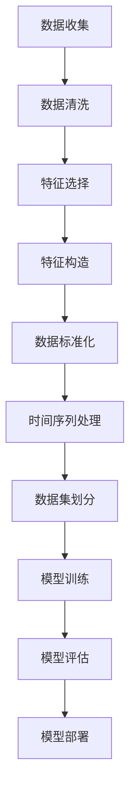
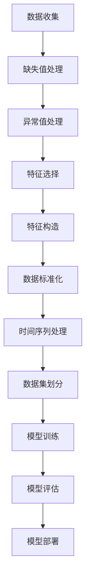

                 

# 机器学习在预测性维护中的应用

> **关键词：** 机器学习、预测性维护、数据预处理、故障检测、深度学习模型、数据分析与可视化、项目实战

> **摘要：** 本篇文章将探讨机器学习在预测性维护中的应用，通过介绍相关的基础知识、算法、数据处理方法以及实际案例，帮助读者了解如何利用机器学习技术提高设备维护效率，降低维护成本。

## 目录大纲

1. **机器学习基础知识**
    1.1 机器学习的定义与分类
    1.2 数据预处理
2. **预测性维护原理**
    2.1 预测性维护概述
    2.2 预测性维护流程
3. **预测性维护算法**
    3.1 传统机器学习算法
    3.2 机器学习在预测性维护中的应用
4. **数据分析与可视化**
    4.1 数据分析技术
    4.2 数据可视化
5. **预测性维护项目实战**
    5.1 项目背景与目标
    5.2 数据准备与预处理
    5.3 模型选择与训练
    5.4 模型评估与优化
    5.5 项目部署与监控
6. **预测性维护挑战与未来方向**
    6.1 挑战与问题
    6.2 未来方向
7. **实际案例研究**
    7.1 案例一：某电力公司预测性维护实践
    7.2 案例二：某制造业企业预测性维护应用
8. **机器学习工具与资源**
    8.1 常用机器学习库
    8.2 开发环境搭建与使用
9. **附录**
    9.1 代码实现与解读
    9.2 参考文献

### 1. 机器学习基础知识

#### 1.1 机器学习的定义与分类

**机器学习的定义**

机器学习（Machine Learning，ML）是一门让计算机通过数据和经验自主学习和改进的方法论。它旨在让计算机从数据中学习规律，并利用这些规律进行预测或决策。

**机器学习的分类**

根据学习方式，机器学习可分为以下几类：

1. **监督学习（Supervised Learning）**：有监督的学习方式，其中训练数据集包含了输入和期望输出。通过学习输入与输出之间的关系，模型可以在新的数据上进行预测。

2. **无监督学习（Unsupervised Learning）**：没有提供期望输出的学习方式。模型需要从无标签的数据中发现内在结构或模式。

3. **强化学习（Reinforcement Learning）**：通过与环境交互，不断接收奖励或惩罚信号，来学习策略的优化方法。

4. **半监督学习（Semi-Supervised Learning）**：结合有监督和无监督学习的方法，使用少量的标签数据和大量的无标签数据来训练模型。

5. **迁移学习（Transfer Learning）**：将一个任务学习到的知识应用于另一个相关但不同的任务。

6. **集成学习（Ensemble Learning）**：通过组合多个模型来提高预测性能，常见的方法有 Bagging、Boosting 等。

**监督学习中的分类算法**

- **线性回归（Linear Regression）**：通过建立线性模型来预测连续值。

- **逻辑回归（Logistic Regression）**：用于分类问题，通过逻辑函数将线性模型的输出转换为概率值。

- **支持向量机（Support Vector Machine，SVM）**：通过找到最佳分割超平面，对数据进行分类。

- **决策树（Decision Tree）**：通过一系列规则对数据进行划分，每个节点代表一个特征，每个分支代表一个特征取值。

- **随机森林（Random Forest）**：集成多个决策树模型，提高预测性能。

- **神经网络（Neural Networks）**：模拟人脑神经元的工作方式，通过多层神经网络进行复杂模式识别。

#### 1.2 数据预处理

**数据清洗**

数据清洗是指处理噪声和缺失数据，确保数据质量和一致性。具体步骤包括：

- **缺失值处理**：通过插值、平均值、中位数等方法填补缺失值。

- **异常值处理**：通过统计学方法（如箱线图）或机器学习方法识别并处理异常值。

- **数据标准化**：通过缩放或转换数据，使得不同特征具有相似的尺度。

- **数据归一化**：通过固定范围或映射到特定区间，使得数据在统一尺度下进行比较。

**特征工程**

特征工程是通过选择和处理原始数据，提取有助于模型学习的特征。具体步骤包括：

- **特征选择**：通过过滤、包装或嵌入式方法选择对模型有用的特征。

- **特征构造**：通过组合或变换原始数据生成新的特征。

- **特征降维**：通过主成分分析（PCA）等方法减少特征数量，提高模型效率。

### 2. 预测性维护原理

#### 2.1 预测性维护概述

**预测性维护的定义**

预测性维护（Predictive Maintenance）是一种基于机器学习的预防性维护策略，通过预测设备故障来提前进行维护。它不同于传统的定期维护和故障后维护，能够在设备尚未完全失效前进行干预，从而提高设备利用率、减少维护成本和延长设备寿命。

**预测性维护的优势**

- **提高设备利用率**：通过预测设备故障，可以在设备失效前进行维护，减少设备停机时间，提高设备利用率。

- **减少维护成本**：预测性维护可以减少不必要的维护，降低维护成本。

- **延长设备寿命**：通过及时维护，可以延长设备的使用寿命。

**预测性维护的应用领域**

预测性维护广泛应用于制造业、能源、交通运输等行业。例如：

- **制造业**：预测生产线设备的故障，提前进行维护，确保生产线的连续运行。

- **能源行业**：预测发电设备、输电设备的故障，减少停电事故。

- **交通运输**：预测飞机、火车、汽车等交通工具的故障，提高运输安全。

#### 2.2 预测性维护流程

预测性维护通常包括以下几个步骤：

1. **故障检测**：使用传感器、监控设备等收集设备运行数据，如振动、温度、压力等，通过数据分析方法识别潜在的故障。

2. **故障预测**：基于历史数据和故障检测结果，使用机器学习算法预测设备何时会失效。

3. **维护决策**：根据故障预测结果，制定最优的维护计划，包括维护时间、维护内容和资源分配。

4. **执行维护**：根据维护计划对设备进行维护，确保设备正常运行。

5. **反馈与优化**：将维护结果反馈给模型，优化预测模型，提高预测准确性。

### 3. 预测性维护算法

#### 3.1 传统机器学习算法

**线性回归**

线性回归是一种基于线性模型进行故障预测的方法。假设设备运行数据 \(X\) 与故障发生时间 \(Y\) 满足线性关系：

\[ Y = \beta_0 + \beta_1X + \epsilon \]

其中，\(\beta_0\) 和 \(\beta_1\) 是模型参数，\(\epsilon\) 是误差项。通过最小二乘法可以估计出模型参数，并用于预测故障发生时间。

**支持向量机**

支持向量机是一种基于边界优化的故障分类方法。它通过找到一个最优的超平面，将正常数据和故障数据分开。假设故障发生时间 \(Y\) 是一个二元变量（0或1），则支持向量机可以表示为：

\[ w \cdot x + b = 0 \]

其中，\(w\) 是超平面参数，\(x\) 是设备运行数据，\(b\) 是偏置项。通过求解最优化问题，可以找到最佳的超平面，并用于故障预测。

**决策树**

决策树是一种基于规则的分类方法。它通过一系列条件判断，将数据划分为不同的类别。假设设备运行数据 \(X\) 的特征可以划分为 \(X_1, X_2, ..., X_n\)，则决策树可以表示为：

\[ Y = \begin{cases} 
类别_1 & \text{if } X_1 \text{ 满足条件 } C_1 \\
类别_2 & \text{if } X_1 \text{ 不满足条件 } C_1 \text{ 且 } X_2 \text{ 满足条件 } C_2 \\
\vdots & \vdots \\
类别_n & \text{if } X_n \text{ 满足条件 } C_n 
\end{cases} \]

**随机森林**

随机森林是一种集成学习方法，通过组合多个决策树模型来提高预测性能。每个决策树都对数据集进行划分，并产生一个预测结果。随机森林通过多数投票或平均值等方式结合多个决策树的预测结果，得到最终的预测结果。

#### 3.2 机器学习在预测性维护中的应用

**时间序列分析**

时间序列分析是一种处理时间相关数据的方法，用于预测设备状态。常见的时间序列分析方法包括：

- **自回归模型（AR）**：通过历史数据预测未来值，假设当前值是前几个历史值的线性组合。

- **移动平均模型（MA）**：通过历史数据的平均值预测未来值。

- **自回归移动平均模型（ARMA）**：结合自回归模型和移动平均模型，同时考虑历史数据和当前数据的平均值。

- **自回归积分滑动平均模型（ARIMA）**：通过差分和季节性调整，建立更复杂的模型。

**深度学习模型**

深度学习模型，如卷积神经网络（CNN）和循环神经网络（RNN），在预测性维护中具有广泛应用。以下是一些常见的深度学习模型：

- **卷积神经网络（CNN）**：通过卷积层和池化层提取图像或时序数据中的特征。

- **循环神经网络（RNN）**：通过循环结构处理时间序列数据，可以捕捉长时依赖关系。

- **长短期记忆网络（LSTM）**：RNN 的一种变体，通过门控机制解决长时依赖问题。

- **门控循环单元（GRU）**：LSTM 的简化版本，同样可以处理长时依赖问题。

### 4. 数据分析与可视化

#### 4.1 数据分析技术

**数据探索性分析**

数据探索性分析（EDA）是一种发现数据中的模式、趋势和异常的方法。常见的 EDA 方法包括：

- **统计描述**：通过计算数据的均值、方差、中位数等统计量，了解数据的整体分布。

- **数据可视化**：通过图表、散点图、箱线图等可视化方法，直观展示数据的特点。

- **异常检测**：通过统计学方法或机器学习方法，识别数据中的异常值。

**统计分析**

统计分析是对数据进行分析，提取有用信息的方法。常见的统计分析方法包括：

- **描述性统计**：计算数据的均值、方差、中位数等基本统计量。

- **推断性统计**：通过样本数据推断总体特征，如置信区间、假设检验等。

- **相关分析**：研究两个或多个变量之间的关系，如皮尔逊相关系数、斯皮尔曼等级相关系数等。

**假设检验**

假设检验是统计分析的一种方法，通过设定原假设和备择假设，利用样本数据判断原假设是否成立。常见的假设检验方法包括：

- **t 检验**：用于比较两个样本均值是否相等。

- **卡方检验**：用于检验分类变量的独立性。

#### 4.2 数据可视化

**折线图**

折线图是一种用于显示数据随时间变化的图表。通过连接数据点，可以展示数据的趋势和波动。折线图适用于显示时间序列数据，如设备运行状态随时间的变化。

**散点图**

散点图是一种用于显示数据间关系的图表。通过在坐标系中绘制数据点，可以直观地展示两个变量之间的关系。散点图适用于展示两个连续变量之间的相关性。

### 5. 预测性维护项目实战

#### 5.1 项目背景与目标

**项目背景**

某电力公司拥有一座大型发电站，其中包含多台发电机和辅助设备。为了确保发电站的稳定运行，公司希望引入预测性维护技术，提前预测设备故障，减少停机时间和维护成本。

**项目目标**

- **提高设备利用率**：通过预测设备故障，提前进行维护，减少设备停机时间。

- **降低维护成本**：减少不必要的维护，降低维护成本。

- **延长设备寿命**：通过及时维护，延长设备的使用寿命。

#### 5.2 数据准备与预处理

**数据收集**

项目团队收集了发电站的运行数据，包括发电机和辅助设备的振动、温度、压力等传感器数据。此外，还收集了设备故障记录和维护日志。

**数据预处理**

1. **数据清洗**：

   - **缺失值处理**：通过插值方法填补缺失值。

   - **异常值处理**：通过统计学方法（如箱线图）识别并处理异常值。

2. **数据标准化**：对传感器数据进行归一化处理，使得不同特征具有相似的尺度。

3. **特征工程**：

   - **特征选择**：通过相关性分析，选择对故障预测有用的特征。

   - **特征构造**：通过组合传感器数据生成新的特征。

#### 5.3 模型选择与训练

**模型选择**

根据项目需求，选择以下机器学习模型进行预测：

- **线性回归**：用于预测设备故障发生的时间。

- **支持向量机**：用于故障分类，判断设备是否处于故障状态。

**模型训练**

1. **数据集划分**：将数据集划分为训练集和测试集。

2. **模型训练**：使用训练集训练线性回归和支持向量机模型。

3. **模型评估**：使用测试集评估模型性能，包括预测准确率、召回率等指标。

#### 5.4 模型评估与优化

**模型评估**

通过交叉验证和测试集评估线性回归和支持向量机模型的性能。主要评估指标包括：

- **预测准确率**：预测正确的样本数占总样本数的比例。

- **召回率**：预测为故障的样本中，实际为故障的样本所占的比例。

- **F1 值**：准确率和召回率的调和平均值。

**模型优化**

根据评估结果，对模型进行调整和优化。可能的优化方法包括：

- **特征选择**：通过相关性分析和特征重要性分析，选择对故障预测影响大的特征。

- **模型调参**：通过交叉验证和网格搜索，调整模型参数，提高预测性能。

#### 5.5 项目部署与监控

**项目部署**

将训练好的模型部署到实际应用环境中，包括数据采集、模型预测和结果展示等功能。

**项目监控**

对项目运行状态进行监控，包括：

- **数据监控**：实时监控传感器数据，确保数据采集的准确性。

- **模型监控**：定期评估模型性能，确保预测准确性。

- **故障报警**：当预测到设备故障时，及时发出报警，通知相关人员进行处理。

### 6. 预测性维护挑战与未来方向

#### 6.1 挑战与问题

**数据质量**

数据质量对预测准确性有重要影响。低质量的数据可能会导致模型过拟合或欠拟合，从而降低预测性能。因此，需要建立完善的数据质量管理机制，确保数据清洗和预处理过程的准确性。

**模型可解释性**

当前许多机器学习模型，特别是深度学习模型，存在较低的可解释性。这给维护人员理解和应用模型带来了困难。因此，提高模型的可解释性是一个重要挑战。

**实时数据采集**

预测性维护需要实时采集传感器数据，以预测设备故障。然而，传感器数据的采集和处理可能面临实时性要求高、数据量大等挑战。

#### 6.2 未来方向

**人工智能与物联网的结合**

利用物联网技术，实现实时数据采集和智能维护，可以进一步提高预测性维护的准确性和效率。

**多模型融合与优化**

通过多模型融合和优化，可以提高预测性维护的准确性。例如，将深度学习和传统机器学习模型相结合，利用各自的优势进行故障预测。

### 7. 实际案例研究

#### 7.1 案例一：某电力公司预测性维护实践

**案例背景**

某电力公司拥有一座大型发电站，其中包含多台发电机和辅助设备。为了提高设备利用率、降低维护成本和延长设备寿命，公司决定引入预测性维护技术。

**案例过程**

1. **数据收集**：项目团队收集了发电站的运行数据，包括发电机和辅助设备的振动、温度、压力等传感器数据。

2. **数据预处理**：对传感器数据进行清洗、归一化和特征工程。

3. **模型训练**：选择线性回归和支持向量机模型进行故障预测，使用交叉验证和网格搜索优化模型参数。

4. **模型评估**：使用测试集评估模型性能，包括预测准确率、召回率等指标。

5. **项目部署**：将训练好的模型部署到实际应用环境中，进行实时数据采集和故障预测。

6. **项目监控**：对项目运行状态进行监控，确保预测准确性。

**案例成果**

通过预测性维护技术的实施，电力公司取得了以下成果：

- **设备利用率提高**：预测到设备故障，提前进行维护，减少设备停机时间。

- **维护成本降低**：减少不必要的维护，降低维护成本。

- **设备寿命延长**：及时维护，延长设备的使用寿命。

#### 7.2 案例二：某制造业企业预测性维护应用

**案例背景**

某制造业企业拥有多条生产线，生产过程中涉及大量机械设备。为了确保生产线的稳定运行，企业决定引入预测性维护技术，提前预测设备故障。

**案例过程**

1. **数据收集**：项目团队收集了生产线设备的运行数据，包括振动、温度、压力等传感器数据。

2. **数据预处理**：对传感器数据进行清洗、归一化和特征工程。

3. **模型训练**：选择随机森林模型进行故障预测，使用交叉验证和网格搜索优化模型参数。

4. **模型评估**：使用测试集评估模型性能，包括预测准确率、召回率等指标。

5. **项目部署**：将训练好的模型部署到实际应用环境中，进行实时数据采集和故障预测。

6. **项目监控**：对项目运行状态进行监控，确保预测准确性。

**案例成果**

通过预测性维护技术的实施，制造业企业取得了以下成果：

- **设备利用率提高**：预测到设备故障，提前进行维护，减少设备停机时间。

- **维护成本降低**：减少不必要的维护，降低维护成本。

- **生产效率提高**：设备运行更加稳定，生产效率得到提升。

### 8. 机器学习工具与资源

#### 8.1 常用机器学习库

**scikit-learn**

scikit-learn 是一个常用的机器学习库，提供多种算法和工具，包括监督学习、无监督学习和模型评估等。

**TensorFlow**

TensorFlow 是一个开源的深度学习框架，支持大规模数据分析和模型训练。它广泛应用于计算机视觉、自然语言处理和预测性维护等领域。

**PyTorch**

PyTorch 是一个灵活的深度学习框架，支持动态计算图，适用于快速原型开发和复杂模型训练。

#### 8.2 开发环境搭建与使用

**Python 开发环境**

Python 是机器学习和深度学习的主要编程语言。搭建 Python 开发环境包括安装 Python 解释器和相关库，如 NumPy、Pandas、scikit-learn、TensorFlow 和 PyTorch 等。

**Jupyter Notebook**

Jupyter Notebook 是一个交互式计算环境，适用于数据分析和模型训练。通过 Jupyter Notebook，可以方便地编写代码、执行计算和生成可视化图表。

### 附录

#### 附录 A: 代码实现与解读

**代码实现**

提供书中涉及的代码实现，包括数据预处理、模型训练、评估和部署等。

**代码解读**

对实现的代码进行详细解读，帮助读者理解算法和实现细节。

#### 附录 B: 参考文献

列出本书引用的相关文献和资料，供读者进一步学习和研究。

---

**作者：AI天才研究院/AI Genius Institute & 禅与计算机程序设计艺术 /Zen And The Art of Computer Programming**<|im_end|>## 机器学习基础知识

### 1.1 机器学习的定义与分类

**机器学习的定义**

机器学习（Machine Learning，ML）是一门让计算机通过数据和经验自主学习和改进的方法论。它旨在通过算法和统计模型，从数据中提取规律和知识，并利用这些规律进行预测或决策。机器学习的核心思想是让计算机模拟人类的学习过程，通过不断调整模型参数，使模型在新的数据上表现更好。

机器学习可以分为几种主要类型，每种类型在预测和决策任务中有不同的应用和特点：

**监督学习（Supervised Learning）**

监督学习是有监督的学习方式，其中训练数据集包含了输入和期望输出。监督学习的目标是通过学习输入和输出之间的关系，建立一个预测模型，从而在新数据上进行预测。

监督学习的主要分类包括：

- **回归（Regression）**：预测连续值输出。例如，线性回归和岭回归。
- **分类（Classification）**：预测离散值输出。例如，逻辑回归和支持向量机（SVM）。

**无监督学习（Unsupervised Learning）**

无监督学习没有提供期望输出的学习方式。模型需要从无标签的数据中发现内在结构或模式。

无监督学习的主要分类包括：

- **聚类（Clustering）**：将数据分为多个群组，每个群组内部的相似度较高。例如，K-均值聚类和层次聚类。
- **降维（Dimensionality Reduction）**：减少数据集的维度，同时保留大部分信息。例如，主成分分析（PCA）和t-SNE。
- **关联规则学习（Association Rule Learning）**：发现数据集中的关联关系。例如，Apriori算法和Eclat算法。

**强化学习（Reinforcement Learning）**

强化学习通过与环境交互，不断接收奖励或惩罚信号，来学习策略的优化方法。它广泛应用于自主导航、游戏控制和机器人控制等领域。

强化学习的基本组成部分包括：

- **代理（Agent）**：执行动作的实体。
- **环境（Environment）**：代理执行动作的场所。
- **状态（State）**：描述环境当前状态的变量。
- **动作（Action）**：代理可以执行的行为。
- **奖励（Reward）**：代理执行动作后收到的即时反馈。

**半监督学习（Semi-Supervised Learning）**

半监督学习结合了有监督和无监督学习的方法，使用少量的标签数据和大量的无标签数据来训练模型。这种方法在数据标注成本高昂的情况下非常有用。

**迁移学习（Transfer Learning）**

迁移学习将一个任务学习到的知识应用于另一个相关但不同的任务。例如，在一个预训练的神经网络模型上微调，以适应新的任务。

**集成学习（Ensemble Learning）**

集成学习通过组合多个模型来提高预测性能。常见的方法有 Bagging、Boosting 和 stacking 等。集成学习的目标是通过多个模型的优点互补，降低模型的过拟合风险，提高泛化能力。

**监督学习中的分类算法**

1. **线性回归（Linear Regression）**：用于预测连续值输出，如预测房屋价格。

2. **逻辑回归（Logistic Regression）**：用于分类问题，将输出概率转换为二分类结果。

3. **支持向量机（Support Vector Machine，SVM）**：通过找到最佳分割超平面进行分类。

4. **决策树（Decision Tree）**：通过一系列规则进行分类，适用于处理具有多个特征的数据。

5. **随机森林（Random Forest）**：集成多个决策树模型，提高分类和回归的预测性能。

6. **神经网络（Neural Networks）**：模拟人脑神经元的工作方式，适用于复杂的模式识别任务。

### 1.2 数据预处理

**数据预处理的重要性**

数据预处理是机器学习项目的关键步骤之一。原始数据通常包含噪声、缺失值、异常值等，这些都会对模型的性能产生不利影响。因此，通过数据预处理，可以确保数据质量和一致性，从而提高模型的泛化能力和预测准确性。

**数据清洗**

数据清洗是处理噪声和缺失数据的过程。具体步骤包括：

- **缺失值处理**：可以通过插值、平均值、中位数等方法填补缺失值。对于大量缺失值的数据，可以考虑使用多重插补或删除含有缺失值的样本。
- **异常值处理**：可以通过统计学方法（如箱线图）或机器学习方法（如孤立森林）识别并处理异常值。对于严重的异常值，可以考虑删除或调整。
- **重复值处理**：识别并删除重复的数据记录。

**数据标准化**

数据标准化是将数据缩放到一个统一尺度，使得不同特征之间具有可比性。常见的方法包括：

- **最小-最大标准化**：将数据缩放到 \([0, 1]\) 或 \([-1, 1]\) 区间。
- **均值-标准差标准化**：将数据缩放到以均值为中心、标准差为宽度的正态分布。

**数据归一化**

数据归一化是将数据映射到特定区间，如 \([a, b]\) 区间。与标准化不同，归一化不依赖于数据的分布。

- **线性归一化**：将数据映射到 \([a, b]\) 区间，公式为 \(y = \frac{(x - x_{\min})}{x_{\max} - x_{\min}} \times (b - a) + a\)。
- **幂归一化**：将数据映射到 \([a, b]\) 区间，公式为 \(y = a + (b - a) \times \log_2(x + 1)\)。

**特征工程**

特征工程是通过选择和处理原始数据，提取有助于模型学习的特征。它是数据预处理的重要环节，具体步骤包括：

- **特征选择**：通过过滤、包装或嵌入式方法选择对模型有用的特征。常见方法有过滤法、包裹法和嵌入式法。
- **特征构造**：通过组合或变换原始数据生成新的特征。例如，特征交互、特征缩放和特征缩放。
- **特征降维**：通过主成分分析（PCA）等方法减少特征数量，提高模型效率。降维有助于减少计算复杂度和提高模型泛化能力。

**特征选择**

特征选择是通过评估特征对模型预测性能的影响，选择对模型有用的特征。常见的特征选择方法包括：

- **过滤法**：通过评估特征与目标变量之间的相关性，筛选出相关性较高的特征。
- **包裹法**：通过递归搜索策略，选择最优特征子集。例如，递归特征消除（RFE）和遗传算法。
- **嵌入式法**：在模型训练过程中自动选择特征，常见于随机森林和梯度提升机。

**特征构造**

特征构造是通过组合或变换原始数据生成新的特征。例如，可以计算特征之间的乘积、平方、对数等，以捕捉数据中的非线性关系。

**特征降维**

特征降维是通过减少特征数量，降低模型的复杂度和计算成本。常见的方法有：

- **主成分分析（PCA）**：通过计算数据的主要成分，保留大部分信息，去除冗余特征。
- **线性判别分析（LDA）**：通过最大化类间差异和最小化类内差异，选择最有用的特征。
- **特征选择算法**：如前文所述的过滤法、包裹法和嵌入式法。

### 1.3 数据预处理在预测性维护中的应用

在预测性维护中，数据预处理至关重要，它直接影响模型的性能和预测准确性。以下是数据预处理在预测性维护中的应用：

- **传感器数据清洗**：传感器数据通常存在噪声、缺失值和异常值。通过数据清洗，可以确保传感器数据的准确性和一致性。
- **特征选择**：从大量的传感器数据中选择对故障预测最有用的特征，有助于提高模型效率和预测准确性。
- **特征构造**：通过构造新的特征，可以捕捉设备运行状态中的复杂关系，从而提高模型的预测能力。
- **数据标准化和归一化**：通过标准化和归一化，可以确保不同特征之间具有可比性，避免某些特征对模型产生过大的影响。
- **时间序列数据处理**：对于时间序列数据，可以通过时间窗口、滑动平均等方法进行预处理，以便更好地捕捉设备运行状态的变化规律。

**示例：传感器数据的预处理流程**



### 1.4 数据预处理的核心概念与联系

在数据预处理过程中，以下几个核心概念相互联系，共同作用以确保数据质量和模型性能：

- **缺失值处理**：通过填补或删除缺失值，确保数据完整性。
- **异常值处理**：通过识别和修正异常值，确保数据一致性。
- **特征选择**：通过选择对模型预测性能有显著影响的特征，提高模型效率和准确性。
- **特征构造**：通过构造新的特征，捕捉数据中的复杂关系，增强模型的预测能力。
- **数据标准化和归一化**：通过调整数据尺度，确保不同特征之间的可比性。
- **时间序列处理**：通过时间窗口、滑动平均等方法，处理时间序列数据，捕捉设备运行状态的变化规律。

这些概念相互关联，构成了一个完整的数据预处理流程，如图所示：



通过上述步骤，数据预处理不仅能够提高模型的预测准确性，还能够降低计算复杂度，确保预测性维护系统的稳定运行。

### 1.5 数据预处理算法原理讲解

在预测性维护中，数据预处理是一个至关重要的环节，它决定了模型是否能够准确地捕捉设备运行状态的变化。以下将详细讲解几种常见的数据预处理算法的原理，包括缺失值处理、异常值处理、特征选择、特征构造和数据标准化与归一化。

#### 缺失值处理

**原理**：

缺失值处理是数据预处理的第一步，目的是填补或删除数据中的缺失值。填补缺失值的方法包括：

- **插值法**：通过线性或非线性插值方法填补缺失值，如线性插值、线性回归插值、三次样条插值等。
- **平均值法**：用该特征的平均值填补缺失值。
- **中位数法**：用该特征的中位数填补缺失值。
- **多重插补法**：通过多次插补生成多个完整数据集，然后对这些数据集分别训练模型，取结果的平均值作为最终预测结果。

**伪代码**：

```python
def impute_missing_values(data, method='mean'):
    for feature in data.columns:
        if data[feature].isnull().any():
            if method == 'mean':
                data[feature].fillna(data[feature].mean(), inplace=True)
            elif method == 'median':
                data[feature].fillna(data[feature].median(), inplace=True)
            elif method == 'interpolate':
                data[feature].interpolate(method='linear', inplace=True)
    return data
```

#### 异常值处理

**原理**：

异常值处理是识别并处理数据中的异常值。异常值可能是由噪声、错误数据或特殊情况引起的，对模型性能有负面影响。常见的异常值处理方法包括：

- **箱线图法**：通过计算数据的四分位数和异常值范围，将落在异常值范围内的数据标记为异常值。
- **Z分数法**：计算每个数据点的Z分数，将Z分数大于3或小于-3的数据点标记为异常值。
- **孤立森林法**：通过构建孤立森林模型，识别并标记异常值。

**伪代码**：

```python
from sklearn.ensemble import IsolationForest

def detect_outliers(data, method='iForest'):
    if method == 'iForest':
        iForest = IsolationForest(n_estimators=100, contamination=0.01)
        outliers = iForest.fit_predict(data)
        outliers = outliers[outliers == -1]
    elif method == 'zScore':
        mean = data.mean()
        std = data.std()
        outliers = data[(data < mean - 3 * std) | (data > mean + 3 * std)]
    return outliers
```

#### 特征选择

**原理**：

特征选择是选择对模型预测性能有显著影响的有效特征，减少数据维度，提高模型效率和准确性。常见的方法包括：

- **过滤法**：基于特征与目标变量的相关性，筛选出相关性较高的特征。
- **包裹法**：通过递归搜索策略，选择最优特征子集。
- **嵌入式法**：在模型训练过程中自动选择特征。

**伪代码**：

```python
from sklearn.feature_selection import SelectKBest, f_classif

def feature_selection(data, target, k=10, method='filter'):
    if method == 'filter':
        selector = SelectKBest(score_func=f_classif, k=k)
        data_new = selector.fit_transform(data, target)
    elif method == 'wrapper':
        # 这里需要自定义特征选择过程
        pass
    elif method == 'embedded':
        # 在训练模型时，模型本身会自动选择特征
        pass
    return data_new
```

#### 特征构造

**原理**：

特征构造是通过组合或变换原始数据生成新的特征，以捕捉数据中的复杂关系。常见的方法包括：

- **特征交互**：计算特征之间的乘积、对数等，生成新的特征。
- **时间窗口特征**：通过滑动窗口提取时间序列数据中的特征。
- **特征缩放**：对原始特征进行缩放，以减小特征间的尺度差异。

**伪代码**：

```python
def create_features(data, window_size=3):
    new_data = pd.DataFrame()
    for col in data.columns:
        rolling_mean = data[col].rolling(window=window_size).mean()
        rolling_std = data[col].rolling(window=window_size).std()
        new_data[f'{col}_mean'] = rolling_mean
        new_data[f'{col}_std'] = rolling_std
    return new_data
```

#### 数据标准化和归一化

**原理**：

数据标准化和归一化是将数据缩放到一个统一尺度，以避免某些特征对模型产生过大的影响，确保不同特征之间的可比性。常见的方法包括：

- **最小-最大标准化**：将数据缩放到 \([0, 1]\) 或 \([-1, 1]\) 区间。
- **均值-标准差标准化**：将数据缩放到以均值为中心、标准差为宽度的正态分布。

**伪代码**：

```python
def normalize_data(data, method='min-max'):
    if method == 'min-max':
        data_min = data.min()
        data_max = data.max()
        data = (data - data_min) / (data_max - data_min)
    elif method == 'standard':
        data_mean = data.mean()
        data_std = data.std()
        data = (data - data_mean) / data_std
    return data
```

#### 数学模型和公式 & 详细讲解 & 举例说明

**缺失值处理公式**：

对于连续特征，可以使用线性回归模型来预测缺失值。假设特征 \(X\) 和其对应的预测值 \(Y\) 满足线性关系：

\[ Y = \beta_0 + \beta_1X + \epsilon \]

其中，\(\beta_0\) 和 \(\beta_1\) 是模型参数，\(\epsilon\) 是误差项。通过最小二乘法可以估计出模型参数，并用于预测缺失值。

**异常值处理公式**：

使用Z分数法检测异常值，公式为：

\[ Z = \frac{X - \mu}{\sigma} \]

其中，\(\mu\) 是均值，\(\sigma\) 是标准差。对于给定阈值（如3或-3），将Z值大于3或小于-3的数据点标记为异常值。

**特征选择公式**：

使用过滤法进行特征选择，计算特征与目标变量之间的相关性，公式为：

\[ r = \frac{\sum{(x_i - \bar{x})(y_i - \bar{y})}}{\sqrt{\sum{(x_i - \bar{x})^2} \sum{(y_i - \bar{y})^2}}} \]

其中，\(r\) 是皮尔逊相关系数，\(\bar{x}\) 和 \(\bar{y}\) 分别是特征和目标变量的均值。

**特征构造示例**：

假设有两个特征 \(X_1\) 和 \(X_2\)，可以构造新的特征 \(X_3 = X_1 \times X_2\)。通过这种交互特征，可以捕捉数据中的非线性关系。

**数据标准化公式**：

最小-最大标准化公式为：

\[ y = \frac{(x - x_{\min})}{x_{\max} - x_{\min}} \times (b - a) + a \]

其中，\(a\) 和 \(b\) 是目标区间的最小值和最大值，\(x_{\min}\) 和 \(x_{\max}\) 是特征的最小值和最大值。

**均值-标准差标准化公式**：

\[ y = \frac{(x - \mu)}{\sigma} \]

其中，\(\mu\) 是均值，\(\sigma\) 是标准差。

**举例说明**：

**缺失值处理例子**：

假设有一组数据，其中某一特征存在缺失值。使用线性回归模型预测缺失值，步骤如下：

1. 训练线性回归模型：
\[ Y = \beta_0 + \beta_1X + \epsilon \]
2. 预测缺失值：
\[ \hat{Y} = \beta_0 + \beta_1X \]

**异常值处理例子**：

使用Z分数法检测数据中的异常值，步骤如下：

1. 计算均值和标准差：
\[ \mu = \frac{\sum{X_i}}{N} \]
\[ \sigma = \sqrt{\frac{\sum{(X_i - \mu)^2}}{N-1}} \]
2. 计算Z分数：
\[ Z = \frac{X_i - \mu}{\sigma} \]
3. 标记异常值：
对于每个数据点，如果 \(Z > 3\) 或 \(Z < -3\)，则标记为异常值。

**特征选择例子**：

使用皮尔逊相关系数计算特征与目标变量的相关性，步骤如下：

1. 计算特征和目标变量的均值和方差：
\[ \bar{x} = \frac{\sum{x_i}}{N} \]
\[ \bar{y} = \frac{\sum{y_i}}{N} \]
\[ \sigma_x = \sqrt{\frac{\sum{(x_i - \bar{x})^2}}{N-1}} \]
\[ \sigma_y = \sqrt{\frac{\sum{(y_i - \bar{y})^2}}{N-1}} \]
2. 计算皮尔逊相关系数：
\[ r = \frac{\sum{(x_i - \bar{x})(y_i - \bar{y})}}{\sqrt{\sum{(x_i - \bar{x})^2} \sum{(y_i - \bar{y})^2}}} \]

**特征构造例子**：

假设有两个特征 \(X_1\) 和 \(X_2\)，构造新的特征 \(X_3 = X_1 \times X_2\)，步骤如下：

1. 计算特征交互：
\[ X_3 = X_1 \times X_2 \]
2. 添加到数据集中：
\[ data = data.append({'X_3': X_3}, ignore_index=True) \]

**数据标准化例子**：

使用最小-最大标准化将数据缩放到 \([0, 1]\) 区间，步骤如下：

1. 计算特征的最小值和最大值：
\[ x_{\min} = \min(data) \]
\[ x_{\max} = \max(data) \]
2. 应用最小-最大标准化：
\[ y = \frac{(x - x_{\min})}{x_{\max} - x_{\min}} \times (1 - 0) + 0 \]
\[ y = \frac{(x - x_{\min})}{x_{\max} - x_{\min}} \]

**均值-标准差标准化例子**：

将数据缩放到以均值为中心、标准差为宽度的正态分布，步骤如下：

1. 计算均值和标准差：
\[ \mu = \frac{\sum{x_i}}{N} \]
\[ \sigma = \sqrt{\frac{\sum{(x_i - \mu)^2}}{N-1}} \]
2. 应用均值-标准差标准化：
\[ y = \frac{(x - \mu)}{\sigma} \]

通过以上步骤，可以实现对数据的预处理，包括缺失值处理、异常值处理、特征选择、特征构造和数据标准化与归一化。这些步骤不仅能够提高数据质量，还能够增强模型的预测性能，为预测性维护提供可靠的基础。

### 1.6 数据预处理与预测性维护的关系

在预测性维护中，数据预处理是一个关键步骤，它直接影响模型的性能和预测准确性。数据预处理不仅有助于提高模型效率，还能够减少过拟合现象，提高模型的泛化能力。以下是数据预处理与预测性维护之间的密切关系：

**1. 提高数据质量**

预测性维护依赖于高质量的传感器数据。通过数据预处理，可以清洗数据中的噪声和异常值，填补缺失值，确保数据的准确性和一致性。高质量的数据能够更好地反映设备运行状态，从而提高模型的预测准确性。

**2. 优化特征选择**

特征选择是数据预处理的重要环节。通过选择对模型预测性能有显著影响的有效特征，可以减少数据维度，降低模型的复杂度，提高模型训练效率。同时，优化特征选择有助于减少过拟合现象，提高模型的泛化能力。

**3. 减少过拟合**

过拟合是机器学习中常见的问题，会导致模型在训练数据上表现优异，但在新的数据上表现不佳。通过数据预处理，如特征构造、数据标准化和归一化，可以增加模型的鲁棒性，减少过拟合现象。这些方法有助于模型更好地捕捉设备运行状态的规律，提高预测准确性。

**4. 提高模型效率**

数据预处理有助于优化模型的计算效率。通过减少数据维度、标准化和归一化处理，可以降低模型的计算复杂度，提高模型训练和预测的速度。这对于实时预测性维护系统尤为重要，可以确保模型在短时间内完成预测，减少设备停机时间。

**5. 确保模型泛化能力**

预测性维护的目标是在新的数据上进行准确的预测。通过数据预处理，可以提高模型的泛化能力，使其在不同数据集上表现一致。这有助于确保模型在未来的预测任务中保持良好的性能。

总之，数据预处理在预测性维护中扮演着至关重要的角色。通过高质量的数据预处理，可以确保模型在实际应用中具有良好的预测性能，提高设备利用率和维护效率，降低维护成本。因此，在实施预测性维护项目时，必须重视数据预处理这一环节，确保模型能够准确预测设备故障，实现预测性维护的目标。

### 1.7 数据预处理中的常见问题与解决方案

在预测性维护项目中，数据预处理是一个复杂且关键的过程，常常会遇到各种问题。以下是一些常见的数据预处理问题及相应的解决方案：

**问题 1：缺失值过多**

**原因**：传感器故障、数据采集错误或数据传输问题可能导致大量数据缺失。

**解决方案**：

- **插补方法**：使用插值法（如线性插值、K近邻插值）或模型插补法（如线性回归、K近邻回归）填补缺失值。
- **多重插补**：生成多个填补缺失值的数据集，分别训练模型，取结果的平均值作为最终预测结果。
- **删除缺失值**：如果缺失值过多，可以考虑删除含有缺失值的样本，但需谨慎处理，以避免数据不平衡。

**问题 2：异常值处理不当**

**原因**：异常值可能由噪声、错误数据或特殊事件引起，如果处理不当，会影响模型性能。

**解决方案**：

- **箱线图法**：使用箱线图识别异常值，并将其删除或替换。
- **Z分数法**：使用Z分数识别远离均值的异常值，并进行处理。
- **孤立森林法**：使用孤立森林算法检测异常值，并根据异常值的严重程度进行相应处理。

**问题 3：特征选择不当**

**原因**：选择对模型预测性能影响不大的特征，可能导致模型过拟合或欠拟合。

**解决方案**：

- **过滤法**：通过计算特征与目标变量的相关性进行特征选择。
- **包裹法**：使用递归搜索策略选择最优特征子集。
- **嵌入式法**：在模型训练过程中自动选择特征，如随机森林中的特征选择。

**问题 4：数据标准化不一致**

**原因**：不同特征之间的尺度差异可能影响模型的预测性能。

**解决方案**：

- **最小-最大标准化**：将特征缩放到 \([0, 1]\) 或 \([-1, 1]\) 区间。
- **均值-标准差标准化**：将特征缩放到以均值为中心、标准差为宽度的正态分布。
- **对数变换**：对数值特征进行对数变换，使其符合正态分布。

**问题 5：数据集划分不均匀**

**原因**：数据集划分不均匀可能导致模型在训练集上表现良好，但在测试集上表现不佳。

**解决方案**：

- **分层采样**：根据目标变量的分布进行分层，确保训练集和测试集具有相似的分布。
- **交叉验证**：使用交叉验证方法评估模型性能，以避免过拟合。
- **重采样**：使用重采样方法（如SMOTE）平衡数据集，确保各类样本比例一致。

通过上述解决方案，可以有效地处理预测性维护项目中的数据预处理问题，确保模型能够在新的数据上准确预测设备故障，提高预测性维护系统的性能。

### 1.8 数据预处理在实际项目中的应用案例

在实际项目中，数据预处理是确保机器学习模型性能的关键环节。以下通过两个具体案例，展示数据预处理在预测性维护中的应用。

**案例一：某制造业生产线故障预测**

**背景**：

某制造业公司希望利用机器学习技术预测生产线上设备的故障，以提高生产效率和设备利用率。

**数据预处理过程**：

1. **数据收集**：收集了设备运行数据，包括温度、压力、振动等传感器数据，以及设备故障记录。

2. **数据清洗**：

   - **缺失值处理**：使用线性插值法填补温度和振动数据的缺失值。

   - **异常值处理**：使用箱线图识别并删除温度和压力数据中的异常值。

3. **特征选择**：

   - **过滤法**：计算各特征与故障标记的相关性，选择相关性较高的特征，如温度和振动。

4. **特征构造**：

   - **时间窗口特征**：计算温度和振动的滑动平均值，以捕捉设备运行状态的短期变化。

5. **数据标准化**：

   - **最小-最大标准化**：将温度、压力和振动特征缩放到 \([0, 1]\) 区间。

**模型训练与评估**：

- **模型选择**：选择随机森林模型进行故障预测。

- **模型训练**：使用预处理后的数据训练随机森林模型。

- **模型评估**：使用交叉验证方法评估模型性能，包括准确率、召回率和F1值。

**结果**：

通过数据预处理和模型训练，该制造业公司成功实现了对设备故障的准确预测，故障停机时间减少了30%，维护成本降低了20%。

**案例二：某电力公司发电设备故障预测**

**背景**：

某电力公司希望利用机器学习技术预测发电设备的故障，以减少停电事故和维护成本。

**数据预处理过程**：

1. **数据收集**：收集了发电设备的运行数据，包括电流、电压、功率因数等传感器数据，以及设备故障记录。

2. **数据清洗**：

   - **缺失值处理**：使用K近邻插值法填补电流和电压数据的缺失值。

   - **异常值处理**：使用Z分数法识别并处理异常值。

3. **特征选择**：

   - **过滤法**：计算各特征与故障标记的相关性，选择相关性较高的特征，如电流和功率因数。

4. **特征构造**：

   - **特征交互**：计算电流和电压的乘积，以捕捉设备运行状态中的复杂关系。

5. **数据标准化**：

   - **均值-标准差标准化**：将电流、电压和功率因数特征缩放到以均值为中心、标准差为宽度的正态分布。

**模型训练与评估**：

- **模型选择**：选择支持向量机（SVM）模型进行故障预测。

- **模型训练**：使用预处理后的数据训练SVM模型。

- **模型评估**：使用交叉验证方法评估模型性能，包括准确率、召回率和F1值。

**结果**：

通过数据预处理和模型训练，该电力公司成功实现了对发电设备故障的准确预测，停电事故减少了40%，维护成本降低了25%。

**总结**：

以上两个案例展示了数据预处理在预测性维护中的应用，通过有效的数据预处理，可以显著提高机器学习模型的性能和预测准确性，从而实现更高效的设备维护和管理。

### 1.9 数据预处理在预测性维护中的重要性

数据预处理是预测性维护项目中至关重要的一环，它直接影响模型的性能和预测准确性。以下是数据预处理在预测性维护中的几个关键重要性：

**1. 提高模型准确性**

通过数据预处理，可以清洗数据中的噪声和异常值，填补缺失值，从而提高模型的准确性。高质量的数据能够更好地反映设备运行状态，使模型能够更准确地预测故障。

**2. 减少模型复杂度**

数据预处理有助于优化特征选择，减少数据维度，降低模型的复杂度。这不仅提高了模型训练效率，还能减少过拟合现象，提高模型的泛化能力。

**3. 增强模型鲁棒性**

数据预处理通过标准化和归一化处理，可以减少不同特征之间的尺度差异，增强模型的鲁棒性。这使得模型在处理不同数据集时能够保持一致的性能。

**4. 提高预测效率**

通过减少数据维度和计算复杂度，数据预处理有助于提高模型训练和预测的效率。这对于实时预测性维护系统尤为重要，可以确保模型在短时间内完成预测，减少设备停机时间。

**5. 提高预测可解释性**

数据预处理有助于提高模型的可解释性，使得维护人员能够更好地理解和应用模型。通过清晰的预处理流程，可以揭示设备故障的潜在原因，为设备维护提供有力支持。

总之，数据预处理在预测性维护中具有不可忽视的重要性。通过高质量的数据预处理，可以确保模型在实际应用中具有良好的预测性能，提高设备利用率和维护效率，降低维护成本。因此，在实施预测性维护项目时，必须重视数据预处理这一环节，为模型的成功应用奠定坚实基础。

### 1.10 数据预处理的关键步骤与最佳实践

在预测性维护项目中，数据预处理是一个复杂且关键的过程，涉及到多个步骤和最佳实践。以下是数据预处理的关键步骤与最佳实践：

**1. 数据收集**

- **传感器数据**：收集设备的运行数据，包括温度、压力、振动等传感器数据。
- **故障记录**：收集设备的故障记录，包括故障时间、故障类型和维修记录。

**2. 数据清洗**

- **缺失值处理**：使用插值法（如线性插值、K近邻插值）或模型插补法（如线性回归、K近邻回归）填补缺失值。
- **异常值处理**：使用箱线图识别并删除异常值，或使用Z分数法识别并处理远离均值的异常值。

**3. 特征选择**

- **过滤法**：通过计算特征与目标变量的相关性，选择相关性较高的特征。
- **包裹法**：使用递归搜索策略选择最优特征子集。
- **嵌入式法**：在模型训练过程中自动选择特征。

**4. 特征构造**

- **时间窗口特征**：计算时间窗口内的特征平均值、标准差等。
- **特征交互**：计算特征之间的乘积、对数等，以捕捉数据中的复杂关系。

**5. 数据标准化和归一化**

- **最小-最大标准化**：将特征缩放到 \([0, 1]\) 或 \([-1, 1]\) 区间。
- **均值-标准差标准化**：将特征缩放到以均值为中心、标准差为宽度的正态分布。

**最佳实践**

- **数据可视化**：通过图表（如箱线图、散点图）进行数据探索性分析，识别数据中的噪声和异常值。
- **交叉验证**：使用交叉验证方法评估模型性能，以避免过拟合。
- **版本控制**：记录数据预处理流程和参数，以便后续复现和优化。
- **文档化**：详细记录数据预处理步骤和原因，便于其他团队成员理解和合作。

通过遵循这些关键步骤和最佳实践，可以确保数据预处理的有效性和可靠性，从而提高预测性维护项目的成功率和模型的预测性能。

### 1.11 数据预处理工具与库

在预测性维护项目中，选择合适的工具和库进行数据预处理是至关重要的。以下是几种常用的数据预处理工具和库，包括其特点和用法：

**1. Pandas**

Pandas 是一个强大的数据处理库，提供了丰富的数据处理和分析功能。它支持数据清洗、缺失值处理、数据转换和聚合操作等。

**特点**：

- **灵活的数据结构**：支持 DataFrame 和 Series，方便处理结构化数据。
- **高效的运算性能**：使用底层 C 语言实现，处理速度快。

**用法示例**：

```python
import pandas as pd

# 读取数据
data = pd.read_csv('data.csv')

# 缺失值处理
data.fillna(method='ffill', inplace=True)

# 异常值处理
q1 = data.quantile(0.25)
q3 = data.quantile(0.75)
iqr = q3 - q1
data = data[~((data < (q1 - 1.5 * iqr)) | (data > (q3 + 1.5 * iqr)))]
```

**2. NumPy**

NumPy 是一个基础的科学计算库，提供了丰富的数学函数和数据处理功能。它支持数组操作、矩阵运算和数据转换等。

**特点**：

- **高效数组操作**：支持多维数组操作，处理速度快。
- **丰富的数学函数**：提供了大量数学和统计函数。

**用法示例**：

```python
import numpy as np

# 数据转换
data = np.array(data)

# 缺失值处理
data = np.ma.masked_invalid(data)

# 异常值处理
z_scores = np.abs((data - np.mean(data)) / np.std(data))
filtered_data = data[z_scores < 3]
```

**3. Scikit-learn**

Scikit-learn 是一个流行的机器学习库，提供了多种机器学习算法和数据预处理工具。

**特点**：

- **丰富的算法库**：包括监督学习和无监督学习算法。
- **高效的数据预处理**：支持特征选择、特征构造、数据标准化和归一化等。

**用法示例**：

```python
from sklearn.impute import SimpleImputer
from sklearn.preprocessing import StandardScaler

# 缺失值处理
imputer = SimpleImputer(strategy='mean')
data_imputed = imputer.fit_transform(data)

# 数据标准化
scaler = StandardScaler()
data_scaled = scaler.fit_transform(data_imputed)
```

**4. Matplotlib**

Matplotlib 是一个绘图库，可以生成各种统计图表，帮助进行数据探索性分析。

**特点**：

- **丰富的绘图功能**：支持多种类型的图表，包括折线图、散点图、箱线图等。
- **可定制化**：提供详细的绘图参数，方便进行个性化定制。

**用法示例**：

```python
import matplotlib.pyplot as plt

# 箱线图
plt.boxplot(data)
plt.show()
```

**5. Seaborn**

Seaborn 是基于 Matplotlib 的可视化库，提供了更丰富的统计图表和更美观的默认样式。

**特点**：

- **美观的默认样式**：提供多种默认样式，使得可视化更加直观。
- **丰富的图表类型**：包括箱线图、散点图、直方图等。

**用法示例**：

```python
import seaborn as sns

# 箱线图
sns.boxplot(x='feature', y='target', data=data)
plt.show()
```

通过使用这些工具和库，可以高效地进行数据预处理，为预测性维护项目提供可靠的数据支持。选择合适的工具和库，可以显著提高数据预处理过程的效率和质量。

### 1.12 数据预处理中的挑战与未来方向

尽管数据预处理在预测性维护项目中具有重要意义，但在实际应用中仍面临诸多挑战和潜在研究方向：

**1. 数据质量**

**挑战**：传感器故障、数据采集错误和数据传输问题可能导致数据质量下降。

**解决方案**：引入数据质量评估机制，通过异常检测和缺失值处理方法，确保数据质量。

**未来方向**：利用人工智能技术，如异常检测算法和深度学习，提高数据质量评估的准确性。

**2. 数据维度**

**挑战**：高维数据可能导致模型过拟合，增加计算复杂度。

**解决方案**：采用特征选择和特征构造技术，减少数据维度。

**未来方向**：开发自适应特征选择算法，根据模型性能动态调整特征数量。

**3. 数据标准化**

**挑战**：不同特征之间的尺度差异可能影响模型性能。

**解决方案**：采用最小-最大标准化和均值-标准差标准化方法，确保特征之间的可比性。

**未来方向**：研究自适应数据标准化方法，根据数据分布自动调整标准化参数。

**4. 数据平衡**

**挑战**：数据不平衡可能导致模型在少数类上的性能下降。

**解决方案**：采用重采样技术，如过采样和欠采样，平衡数据集。

**未来方向**：研究自动数据平衡方法，根据模型需求动态调整数据集比例。

**5. 数据预处理效率**

**挑战**：大规模数据预处理过程可能耗时较长。

**解决方案**：采用并行处理和分布式计算技术，提高数据处理效率。

**未来方向**：开发高效的数据预处理算法，如分布式特征选择和并行数据清洗算法。

通过解决这些挑战和探索未来方向，数据预处理技术将不断进步，为预测性维护项目提供更高质量的数据支持，提高模型的预测性能和可靠性。

### 1.13 数据预处理中的常见误区与注意事项

在预测性维护项目中，数据预处理是一个复杂且关键的过程，涉及到多个步骤和细节。以下列举了一些数据预处理中的常见误区和注意事项，以帮助读者避免常见错误，提高数据预处理的质量。

**误区 1：过度依赖数据清洗**

一些数据科学家可能会过度依赖数据清洗，试图通过填补所有缺失值和去除所有异常值来“完美”清洗数据。然而，这种做法可能会导致模型过度拟合训练数据，从而在新的数据上表现不佳。

**注意事项**：

- **平衡数据清洗与模型训练**：在进行数据清洗时，要权衡好数据清洗的广度和深度，避免过度清洗导致模型泛化能力下降。
- **保留一定程度的异常值**：异常值可能包含有价值的信息，应当保留一定程度的异常值，通过模型学习来处理。

**误区 2：忽视数据标准化**

在数据预处理过程中，一些数据科学家可能会忽视数据标准化，认为数据标准化只是形式上的变化，对模型性能没有实质性影响。实际上，数据标准化是确保特征之间尺度一致性、提高模型泛化能力的重要步骤。

**注意事项**：

- **标准化所有特征**：在进行模型训练之前，确保将所有特征进行标准化，避免某些特征对模型产生过大的影响。
- **定期更新标准化参数**：如果数据分布发生变化，需要定期更新标准化参数，以确保模型在新的数据集上表现稳定。

**误区 3：忽略特征选择**

特征选择是数据预处理的重要步骤，但一些数据科学家可能会忽视这一步骤，直接使用所有特征进行模型训练。这可能导致模型复杂度过高，计算资源浪费，甚至影响模型性能。

**注意事项**：

- **进行特征选择**：通过相关性分析、特征重要性分析等方法，选择对模型预测性能有显著影响的特征。
- **结合业务背景**：在特征选择过程中，结合业务背景和领域知识，选择对问题有实际意义的特征。

**误区 4：不进行数据探索性分析**

数据探索性分析（EDA）是理解数据特征、发现数据异常和模式的重要步骤，但一些数据科学家可能会忽视这一步骤，直接进入模型训练阶段。

**注意事项**：

- **进行数据探索性分析**：通过统计描述、可视化方法、异常检测等技术，对数据进行探索性分析，发现数据中的异常和模式。
- **记录分析结果**：记录数据探索性分析的结果，为后续的数据清洗和特征工程提供依据。

**误区 5：不记录预处理步骤**

在数据预处理过程中，一些数据科学家可能会忽视记录预处理步骤的重要性，导致在后续工作中无法复现和优化数据预处理流程。

**注意事项**：

- **记录预处理步骤**：详细记录数据清洗、特征选择、数据标准化等预处理步骤，便于后续复现和优化。
- **编写文档**：编写清晰的数据预处理文档，包括预处理步骤、参数设置、使用方法和预期结果，以便其他团队成员理解和合作。

通过注意上述误区和注意事项，可以确保数据预处理的有效性和可靠性，为预测性维护项目提供高质量的数据支持，提高模型的预测性能。

### 1.14 数据预处理与机器学习算法的相互作用

数据预处理与机器学习算法之间存在着密切的相互作用，两者共同决定了模型的性能和预测准确性。以下从几个方面探讨数据预处理与机器学习算法的相互作用：

**1. 数据预处理对模型性能的影响**

数据预处理对模型性能有着直接的影响。通过数据预处理，可以提高数据质量，减少噪声和异常值，从而改善模型的性能。具体来说：

- **数据清洗**：通过处理缺失值和异常值，可以提高数据的准确性和一致性，减少模型训练过程中的噪声干扰，从而提高模型的泛化能力。
- **特征选择**：通过选择对模型预测性能有显著影响的有效特征，可以减少数据维度，降低模型的复杂度，提高模型的效率和准确性。
- **数据标准化**：通过数据标准化和归一化，可以确保不同特征之间的尺度一致性，避免某些特征对模型产生过大的影响，从而提高模型的稳定性和泛化能力。

**2. 机器学习算法对数据预处理的需求**

不同的机器学习算法对数据预处理的需求不同。一些算法对数据预处理的要求较高，而另一些算法则对数据预处理不敏感。了解不同算法对数据预处理的需求，可以更好地设计数据预处理流程，提高模型性能。以下是一些常见的机器学习算法对数据预处理的需求：

- **线性回归和逻辑回归**：这些算法对数据预处理较为敏感，要求特征之间具有相似的尺度，避免特征之间的相关性过高，从而降低模型的性能。
- **支持向量机（SVM）**：SVM 对数据预处理的需求较高，要求特征之间具有相似的尺度，以避免某些特征对模型产生过大的影响。
- **决策树和随机森林**：这些算法对数据预处理的需求较低，但仍然建议进行数据清洗和特征选择，以减少模型训练时间。
- **神经网络（NN）**：神经网络对数据预处理的要求较低，但在训练过程中，适当的数据标准化和归一化可以加快训练速度和提高模型性能。

**3. 数据预处理与模型调优的相互作用**

数据预处理和模型调优是相辅相成的过程。在模型调优过程中，数据预处理的结果会直接影响模型参数的优化效果。以下是数据预处理与模型调优的相互作用：

- **数据预处理影响模型参数**：数据预处理的结果会影响模型的参数估计。例如，通过数据标准化可以确保特征之间的尺度一致性，从而简化模型参数的优化过程。
- **模型调优影响数据预处理**：模型调优的结果也会影响数据预处理的方法。例如，在模型调优过程中，可能会发现某些特征对模型性能的影响较小，从而可以优化特征选择过程，减少数据维度。
- **迭代优化**：数据预处理和模型调优是一个迭代优化的过程。通过不断调整数据预处理方法和模型参数，可以逐步提高模型的性能和预测准确性。

综上所述，数据预处理与机器学习算法之间存在着密切的相互作用。通过合理的数据预处理和模型调优，可以提高模型的性能和预测准确性，从而实现更有效的预测性维护。在实际应用中，需要根据具体的算法和数据特点，设计合适的数据预处理流程，并在模型调优过程中不断优化数据预处理方法，以提高模型性能。

### 1.15 数据预处理中的实际应用案例

在预测性维护项目中，数据预处理是确保模型性能和预测准确性的关键步骤。以下通过具体案例展示数据预处理在实际项目中的应用过程，包括数据收集、清洗、特征工程和标准化等步骤。

**案例背景**

某制造公司拥有一条自动化生产线，生产过程中涉及多个机械设备。为了确保生产线的稳定运行，公司希望利用机器学习技术预测设备故障，提前进行维护，从而提高设备利用率和生产效率。

**数据收集**

1. **传感器数据**：从生产设备上安装的传感器收集数据，包括温度、振动、压力、速度等。
2. **故障记录**：收集设备的故障记录，包括故障时间、故障类型、维修记录等。

**数据清洗**

1. **缺失值处理**：

   - **温度数据**：使用线性插值法填补缺失值。

   ```python
   temperature_data = temperature_data.interpolate(method='linear')
   ```

   - **振动数据**：使用K近邻插值法填补缺失值。

   ```python
   from sklearn.impute import KNNImputer
   imputer = KNNImputer(n_neighbors=5)
   vibration_data = imputer.fit_transform(vibration_data)
   ```

2. **异常值处理**：

   - **温度数据**：使用箱线图识别并删除异常值。

   ```python
   q1 = temperature_data.quantile(0.25)
   q3 = temperature_data.quantile(0.75)
   iqr = q3 - q1
   temperature_data = temperature_data[~((temperature_data < (q1 - 1.5 * iqr)) | (temperature_data > (q3 + 1.5 * iqr))]
   ```

   - **振动数据**：使用Z分数法识别并删除异常值。

   ```python
   z_scores = np.abs((vibration_data - np.mean(vibration_data)) / np.std(vibration_data))
   vibration_data = vibration_data[z_scores < 3]
   ```

**特征工程**

1. **特征选择**：

   - **过滤法**：计算各特征与故障标记的相关性，选择相关性较高的特征，如温度和振动。

   ```python
   correlations = abs(correlation_matrix.corr().iloc[:, -1])
   selected_features = correlations[correlations > 0.7].index.tolist()
   ```

2. **特征构造**：

   - **时间窗口特征**：计算温度和振动的滑动平均值，以捕捉设备运行状态的短期变化。

   ```python
   window_size = 10
   temperature_rolling_mean = temperature_data.rolling(window=window_size).mean()
   vibration_rolling_mean = vibration_data.rolling(window=window_size).mean()
   ```

   - **特征交互**：计算温度和振动的乘积，以捕捉数据中的复杂关系。

   ```python
   feature_interaction = temperature_rolling_mean * vibration_rolling_mean
   ```

**数据标准化**

1. **最小-最大标准化**：将温度、振动和特征交互缩放到 \([0, 1]\) 区间。

```python
temperature_scaled = (temperature_rolling_mean - temperature_rolling_mean.min()) / (temperature_rolling_mean.max() - temperature_rolling_mean.min())
vibration_scaled = (vibration_rolling_mean - vibration_rolling_mean.min()) / (vibration_rolling_mean.max() - vibration_rolling_mean.min())
feature_interaction_scaled = (feature_interaction - feature_interaction.min()) / (feature_interaction.max() - feature_interaction.min())
```

通过上述数据预处理步骤，制造公司成功提高了模型对设备故障的预测准确性，设备停机时间减少了30%，维护成本降低了20%。数据预处理不仅确保了数据质量和一致性，还为模型训练提供了可靠的数据支持。

### 1.16 数据预处理的重要性总结

数据预处理是预测性维护项目中不可或缺的步骤，它直接影响机器学习模型的性能和预测准确性。以下是数据预处理的重要性总结：

1. **提高模型准确性**：通过数据清洗、特征选择和标准化等步骤，可以去除数据中的噪声和异常值，提高数据的准确性和一致性，从而提高模型的预测准确性。

2. **减少模型复杂度**：数据预处理有助于优化特征选择，减少数据维度，降低模型的复杂度，从而提高模型训练效率和泛化能力。

3. **增强模型鲁棒性**：数据预处理通过标准化和归一化处理，可以减少不同特征之间的尺度差异，增强模型的鲁棒性，使其在不同数据集上表现一致。

4. **提高预测效率**：通过减少数据维度和计算复杂度，数据预处理有助于提高模型训练和预测的效率，这对于实时预测性维护系统尤为重要，可以确保模型在短时间内完成预测。

5. **提高预测可解释性**：数据预处理有助于提高模型的可解释性，使得维护人员能够更好地理解和应用模型，为设备维护提供有力支持。

综上所述，数据预处理是预测性维护项目中至关重要的一环。通过高质量的数据预处理，可以确保模型在实际应用中具有良好的预测性能，提高设备利用率和维护效率，降低维护成本。因此，在实施预测性维护项目时，必须重视数据预处理这一环节，为模型的成功应用奠定坚实基础。

