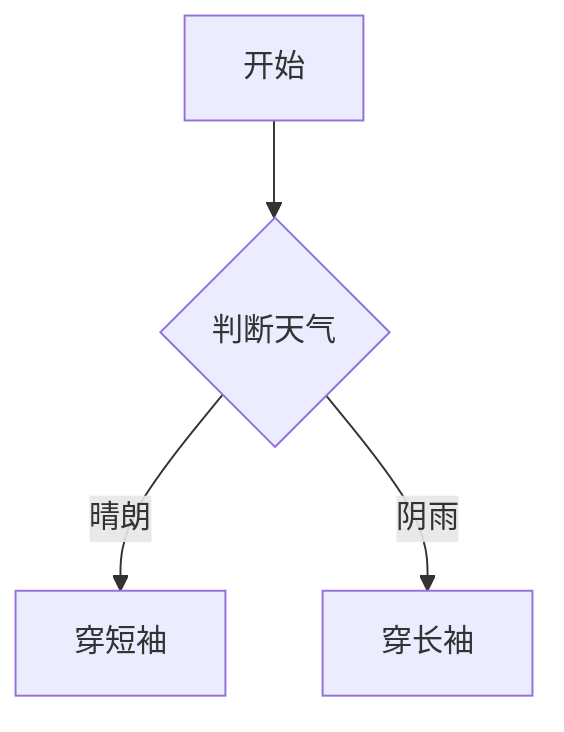

                 

### 文章标题

> **机器学习毕业设计选题案例与实践**

---

**关键词：** 机器学习、毕业设计、选题案例、实践、深度学习

**摘要：** 本文将围绕机器学习毕业设计的选题案例与实践进行探讨。通过对机器学习基本概念、统计学习基础、深度学习技术以及实战项目的深入分析，本文旨在为即将进行毕业设计的学生提供实用的指导和建议，帮助他们在实际项目中运用机器学习技术，实现学术与实践的有机结合。

---

### 第一部分：机器学习基础概念

#### 第1章：机器学习概述

##### 1.1 机器学习的基本概念

机器学习（Machine Learning，简称ML）是人工智能（Artificial Intelligence，简称AI）的一个重要分支，旨在使计算机系统能够从数据中自动学习和改进。机器学习的定义如下：

$$
\text{机器学习} = \text{数据} + \text{算法} + \text{评估}
$$

其中，数据是机器学习的原材料，算法是处理数据的工具，评估是确保学习效果的手段。机器学习分为以下三类：

- **监督学习（Supervised Learning）**：通过已有标记的数据训练模型，使其能够对新数据进行预测。
- **无监督学习（Unsupervised Learning）**：在没有任何先验标签的数据上进行学习，目的是发现数据中的结构或模式。
- **强化学习（Reinforcement Learning）**：通过与环境的交互来学习最佳策略。

##### 1.2 机器学习的基本原理

机器学习的基本原理主要包括以下几个方面：

- **数据预处理**：对原始数据进行清洗、归一化、缺失值处理等，以提高数据质量和模型性能。
- **特征工程**：通过选择、构造和转换特征，使数据更适合于模型训练。
- **模型选择与评估**：选择合适的模型，并通过交叉验证等方法对模型进行评估，确保其泛化能力。

#### 第2章：统计学习基础

##### 2.1 统计学习基础理论

统计学习（Statistical Learning）是机器学习的一个重要分支，它基于统计学原理，通过建立数学模型来描述数据之间的依赖关系。以下是两个常见的统计学习方法：

- **线性回归（Linear Regression）**：通过拟合数据点的一条直线，预测连续值。
  
  $$y = \beta_0 + \beta_1x$$

- **逻辑回归（Logistic Regression）**：通过拟合数据点的一个曲线，预测概率。

  $$\log\frac{p}{1-p} = \beta_0 + \beta_1x$$

##### 2.2 决策树与随机森林

决策树（Decision Tree）是一种简单但有效的分类和回归方法。它通过一系列规则将数据分割成不同的区域，每个区域对应一个类别或值。

- **决策树的基本结构**：由多个内部节点和叶节点组成，内部节点表示特征分割，叶节点表示类别或值。

- **决策树的算法**：ID3、C4.5和CART等。

随机森林（Random Forest）是一种集成学习方法，它通过构建多棵决策树，并对它们的结果进行投票来获得最终的预测结果。

- **随机森林的应用**：在多个数据集上都有较好的表现，特别适合处理高维数据和少量样本。

#### 第3章：支持向量机

##### 3.1 支持向量机基础

支持向量机（Support Vector Machine，简称SVM）是一种强大的分类和回归方法，它通过寻找一个最优的超平面，将不同类别的数据点分开。

- **支持向量机的定义**：在特征空间中找到一个最大间隔超平面，使得同类别数据点之间的间隔最大化。

- **最大边界超平面**：SVM的目标是找到一个超平面，使得同类别的数据点之间的间隔最大化，同时不同类别的数据点被正确分类。

- **核函数**：通过将数据映射到高维空间，SVM可以处理非线性问题。常见的核函数有线性核、多项式核和径向基函数核等。

##### 3.2 SVM算法详解

- **SVM的数学公式**：

  $$\min_{\beta, \beta_0} \frac{1}{2} ||\beta||^2 + C \sum_{i=1}^n \max(0, 1 - y_i(\beta^T x_i + \beta_0))$$

  其中，$\beta$为模型参数，$\beta_0$为偏置项，$C$为正则化参数。

- **SMO算法**：Sequential Minimal Optimization（SMO）是一种常用的SVM算法，它通过迭代优化两个变量，使得整个优化过程更加高效。

- **SVM的应用场景**：SVM在图像分类、文本分类、生物信息学等领域都有广泛的应用。

### 第二部分：深度学习技术

#### 第4章：深度学习基础

##### 4.1 深度学习概述

深度学习（Deep Learning，简称DL）是一种基于人工神经网络的学习方法，它通过多层的非线性变换，自动学习数据的特征表示。以下是深度学习的一些基本概念：

- **深度学习的基本概念**：深度学习由多个隐层组成，每个隐层都能从输入数据中提取更高层次的抽象特征。

- **神经网络的结构**：神经网络由输入层、隐藏层和输出层组成。每个神经元都与前一层和后一层相连。

- **深度学习的发展历史**：从早期的前馈神经网络到深度信念网络（DBN）、卷积神经网络（CNN）、循环神经网络（RNN）以及生成对抗网络（GAN）等，深度学习的发展历程充满了创新和突破。

##### 4.2 前馈神经网络

前馈神经网络（Feedforward Neural Network）是一种简单的神经网络结构，其中数据从输入层流向输出层，中间经过多个隐藏层。以下是前馈神经网络的一些关键组成部分：

- **前馈神经网络的组成**：输入层、隐藏层和输出层。每个层中的神经元都与前一层的所有神经元相连。

- **激活函数**：激活函数用于引入非线性特性，常见的激活函数有Sigmoid、ReLU和Tanh等。

- **前向传播与反向传播**：前向传播是将数据从输入层传递到输出层，计算每个神经元的输出值；反向传播则是通过计算损失函数关于每个神经元的梯度，更新模型参数。

### 第三部分：机器学习实战

#### 第5章：机器学习项目实战

##### 5.1 项目概述

机器学习项目实战是学习机器学习的最佳途径。本节将介绍一个简单的机器学习项目，包括项目背景与目标、数据集介绍、模型选择与训练等。

- **项目背景与目标**：假设我们想要构建一个基于情感分析的文本分类模型，目标是判断一段文本是积极情感还是消极情感。

- **数据集介绍**：我们可以使用一个公开的文本情感分析数据集，如IMDB电影评论数据集。

- **模型选择与训练**：选择一个合适的模型，如循环神经网络（RNN）或长短期记忆网络（LSTM），并对其进行训练和调参。

##### 5.2 数据预处理

数据预处理是机器学习项目的重要环节。以下是数据预处理的一些步骤：

- **数据清洗**：去除文本中的噪声、标点符号和停用词等。

- **特征提取**：将文本数据转化为数值特征，如词袋模型、TF-IDF等。

##### 5.3 模型选择与训练

在选择模型时，我们需要考虑数据的特点和项目的目标。以下是几种常见的模型选择：

- **循环神经网络（RNN）**：适合处理序列数据，如时间序列数据或文本数据。

- **长短期记忆网络（LSTM）**：是RNN的一种变体，能够有效避免长短期依赖问题。

- **卷积神经网络（CNN）**：擅长处理图像数据。

在训练模型时，我们需要注意以下方面：

- **参数调优**：通过调整学习率、批次大小等超参数，提高模型性能。

- **交叉验证**：使用交叉验证方法，评估模型在不同数据集上的性能。

##### 5.4 项目评估与优化

在项目评估阶段，我们需要使用适当的评估指标，如准确率、召回率、F1值等，来评估模型的性能。如果模型性能不佳，我们可以通过以下方法进行优化：

- **调整模型结构**：修改网络层数、神经元数量等。

- **增加训练数据**：收集更多的训练数据，提高模型的泛化能力。

- **数据增强**：对训练数据进行随机裁剪、旋转、翻转等操作，增加数据的多样性。

### 第四部分：毕业设计选题案例

#### 第6章：毕业设计选题案例

本节将介绍三个具体的毕业设计选题案例，包括基于深度学习的图像分类、使用循环神经网络的文本分类以及基于生成对抗网络的图像生成。

##### 6.1 基于深度学习的图像分类

- **项目概述**：使用深度学习模型对图像进行分类，如人脸识别、物体识别等。

- **技术路线**：采用卷积神经网络（CNN）模型，利用预训练的模型（如VGG、ResNet等）进行迁移学习。

- **实现细节**：包括数据预处理、模型训练、评估与优化等。

##### 6.2 使用循环神经网络的文本分类

- **项目概述**：使用循环神经网络（RNN）或长短期记忆网络（LSTM）对文本数据进行分类，如情感分析、垃圾邮件分类等。

- **技术路线**：采用词嵌入技术（如Word2Vec、GloVe等），构建RNN或LSTM模型。

- **实现细节**：包括数据预处理、模型训练、评估与优化等。

##### 6.3 基于生成对抗网络的图像生成

- **项目概述**：使用生成对抗网络（GAN）模型生成具有逼真外观的图像。

- **技术路线**：采用深度卷积生成对抗网络（DCGAN）或条件生成对抗网络（cGAN）。

- **实现细节**：包括数据预处理、模型训练、评估与优化等。

### 附录

#### 附录A：机器学习常用工具与库

本附录将介绍一些常用的机器学习和深度学习工具与库，包括Python库、深度学习框架以及其他资源。

- **Python库**：NumPy、Pandas、Matplotlib等。
- **深度学习框架**：TensorFlow、PyTorch、Keras等。
- **其他资源**：OpenCV、Scikit-learn、NLTK等。

#### 附录B：Mermaid流程图示例

以下是使用Mermaid绘制的流程图示例：



#### 附录C：伪代码示例

以下是线性回归算法的伪代码示例：

```plaintext
算法：线性回归
输入：X（特征矩阵），Y（目标向量）
输出：模型参数 w

w = [0, 0]  // 初始化模型参数

for epoch in 1 to MAX_EPOCHS do
    for each sample (x, y) in X, Y do
        // 前向传播
        z = x * w
        loss = (z - y)^2

        // 反向传播
        dw = 2 * (z - y) * x

        // 更新模型参数
        w = w - LEARNING_RATE * dw
    end for
end for

return w
```

### 作者信息

**作者：** AI天才研究院/AI Genius Institute & 禅与计算机程序设计艺术 /Zen And The Art of Computer Programming

---

通过本文，我们详细介绍了机器学习的基本概念、统计学习基础、深度学习技术以及机器学习项目实战。同时，我们还提供了毕业设计选题案例，旨在帮助读者在学术和实践之间搭建桥梁。希望本文能够为即将进行毕业设计的同学提供一些实用的指导和建议。在未来的研究中，我们将继续探索更先进的机器学习技术，为社会带来更多的创新和进步。

