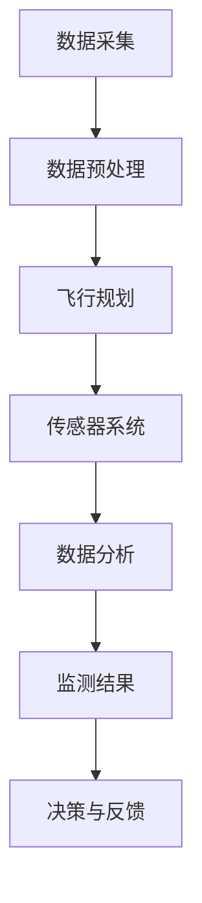
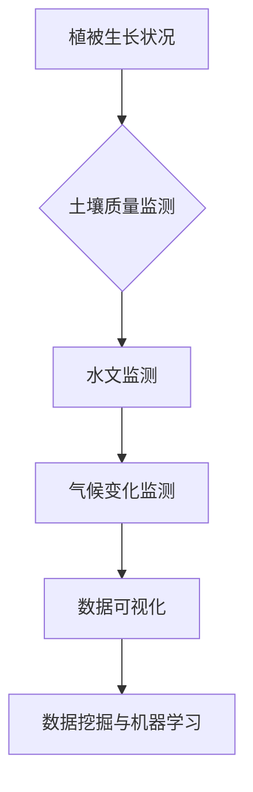
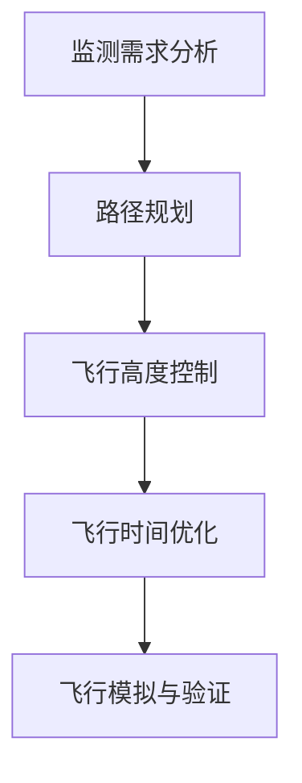
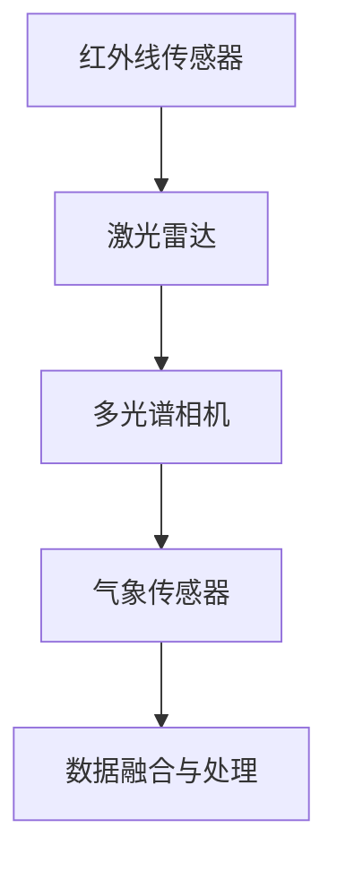
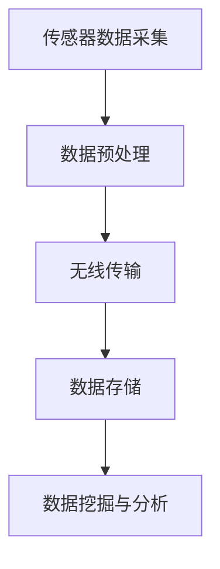
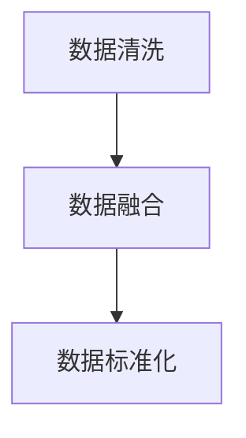
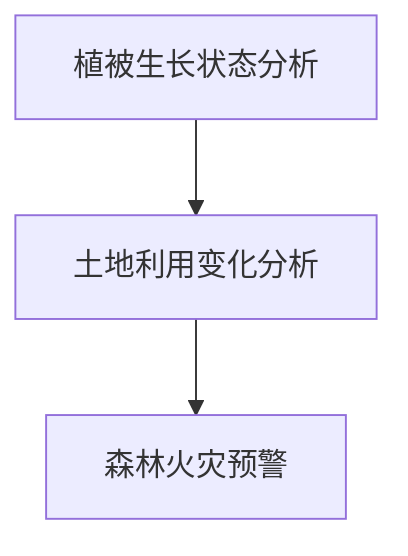
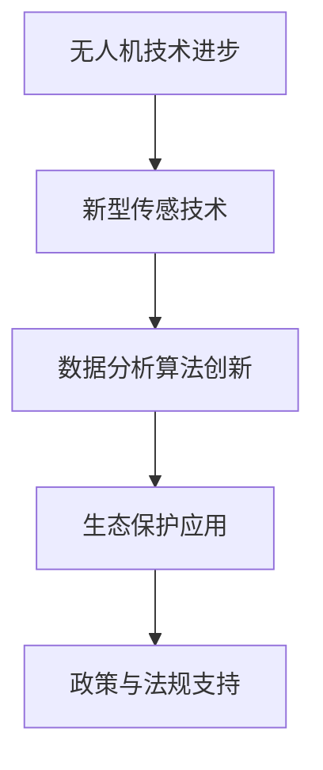

                 

### 无人机森林健康监测概述

无人机森林健康监测作为生态保护的重要手段，正在日益受到关注。本文将详细探讨这一领域的概述，从无人机技术基础、森林生态学基础到无人机森林健康监测系统设计，以及数据处理与分析，案例研究和未来展望。以下是对该领域的详细梳理。

#### 第1章：无人机技术基础与森林健康监测

**1.1 无人机技术概述**

**无人机定义与分类**

无人机，即无人机系统（Unmanned Aerial Vehicle，简称UAV），是一种能够执行特定任务的无人驾驶飞行器。根据飞行方式、任务目标和应用领域的不同，无人机可以分为以下几类：

- **固定翼无人机**：主要用于长航时、大范围的监视和侦察任务。
- **旋翼无人机**：具有良好的机动性和悬停能力，适用于近距离、精细化监测任务。
- **多旋翼无人机**：结合了固定翼和旋翼的优点，适应性强，广泛用于各种监测任务。
- **垂直起降无人机**（VTOL）：能够在垂直方向起降，适用于复杂地形监测。
- **无人机群**：多个无人机协同工作，实现大面积、高密度的监测。

**无人机发展历程**

无人机的发展可以追溯到20世纪30年代，当时主要用于军事侦察。随着技术的进步，无人机逐渐应用于民用领域，如气象观测、地理测绘、农业监测等。近年来，随着人工智能和传感技术的发展，无人机在森林健康监测中的应用前景愈发广阔。

**无人机应用领域**

无人机在多个领域都有广泛应用，包括：

- **军事侦察与监视**：无人机能够进行高空侦察，获取实时情报。
- **灾害救援与监测**：无人机在地震、洪水等灾害中用于救援和灾情评估。
- **环境保护与监测**：无人机在森林健康监测、水质监测等领域发挥重要作用。
- **农业监测与管理**：无人机进行农田监测、病虫害防治和作物产量预测。
- **城市规划与测绘**：无人机进行城市地形测绘、建筑物监测等。
- **科学研究**：无人机在冰川监测、海洋观测等领域进行前沿科学研究。

**1.2 无人机在森林健康监测中的应用**

**森林健康监测的需求**

森林作为地球的“肺”，对于维持全球生态平衡和人类健康具有重要意义。然而，随着人类活动的加剧和气候变化的影响，森林健康面临着前所未有的挑战。森林健康监测旨在评估森林的生长状态、生态功能和健康状况，为生态保护和森林管理提供科学依据。

**无人机监测技术优势**

无人机在森林健康监测中具有显著优势：

- **高精度监测**：无人机搭载高分辨率相机、激光雷达等设备，能够获取高精度的森林数据。
- **灵活性强**：无人机能够灵活调整飞行高度和速度，适应不同地形和监测需求。
- **高效性**：无人机监测速度快，能够快速获取大量数据，提高监测效率。
- **成本低**：相较于传统地面监测方法，无人机监测成本低，适用于大规模监测任务。
- **多维度监测**：无人机可以同时进行多种监测任务，如植被生长、土壤质量、水文监测等。

**应用案例分析**

多个国家和地区已经开展了无人机森林健康监测的实际应用案例，如：

- **美国**：美国林业服务局（USFS）使用无人机进行森林火灾监测和资源管理。
- **中国**：中国林业科学研究院利用无人机进行全国范围的森林资源清查和病虫害监测。
- **巴西**：巴西环境监测机构使用无人机监测亚马逊雨林的砍伐和森林火灾。

**1.3 无人机森林健康监测的核心挑战**

**数据采集与处理**

无人机森林健康监测依赖于大量的数据采集和处理，包括遥感图像、激光雷达数据、气象数据等。数据采集需要考虑数据的质量、完整性和一致性。数据处理则涉及数据清洗、数据融合、数据标准化等步骤，以提高数据的可用性和准确性。

**无人机飞行安全管理**

无人机在森林中飞行需要确保安全。飞行安全管理包括无人机飞行路线规划、飞行区域限制、无人机间的通信与协同等。同时，还需要遵守相关法律法规，确保无人机飞行的合法性。

**遥感技术与应用**

遥感技术是无人机森林健康监测的核心技术之一。遥感技术通过传感器获取地物信息，并通过图像处理、图像分析和模型构建等方法，对森林健康进行监测和评估。常见的遥感技术包括光学遥感、激光雷达遥感、多光谱遥感等。

**总结**

无人机森林健康监测作为生态保护的创新应用，具有广泛的应用前景。通过无人机技术的高精度、高效性和灵活性，能够快速、准确地监测森林健康状态，为生态保护和森林管理提供有力支持。

#### Mermaid 流程图：无人机森林健康监测流程



### 第2章：森林生态学基础与监测指标

#### 2.1 森林生态学基本概念

**森林定义与功能**

森林是指由多种树木和其他植物组成的生态系统，具有复杂的生物多样性和生态功能。森林功能包括：

- **生态功能**：维持地球生态平衡，提供氧气、吸收二氧化碳，调节气候等。
- **经济功能**：提供木材、药材、果实等资源，促进经济发展。
- **社会功能**：提供生态旅游、休闲和教育场所，提高人类生活质量。

**生态平衡与生态过程**

生态平衡是指生态系统内各生物种群之间、生物与环境之间相互作用达到的一种相对稳定状态。生态过程包括：

- **物质循环**：如碳、氮、水等元素的循环。
- **能量流动**：能量在生态系统内的传递和转化。
- **生物多样性**：物种多样性、遗传多样性和生态系统多样性。

**森林健康**

森林健康是指森林生态系统在自然和人为影响下保持稳定、可持续发展的能力。森林健康评估包括以下几个方面：

- **植被健康**：树木的生长状态、物种多样性等。
- **土壤健康**：土壤肥力、结构、水分等。
- **水源健康**：水质、水文特征等。
- **生态过程**：生态系统的物质循环、能量流动等。

#### 2.2 森林健康监测指标

**植被生长状况监测**

植被生长状况监测是森林健康监测的重要内容之一。主要监测指标包括：

- **树高**：反映树木生长速度和健康状态。
- **胸径**：反映树木的生物量和生长潜力。
- **叶面积指数（LAI）**：反映植被光合作用能力。
- **植被覆盖度**：反映植被分布和生长状况。

**土壤质量监测**

土壤质量监测是评估森林健康的重要指标之一。主要监测指标包括：

- **土壤湿度**：反映土壤水分状况，影响植物生长。
- **土壤温度**：反映土壤热状况，影响微生物活性。
- **土壤pH值**：反映土壤酸碱度，影响植物养分吸收。
- **土壤有机质含量**：反映土壤肥力水平。

**水文监测**

水文监测是评估森林水源健康的重要指标。主要监测指标包括：

- **径流量**：反映河流、湖泊等水体流量状况。
- **水质**：反映水体中化学成分、生物成分等。
- **水文周期**：反映水体的补给、排泄和循环状况。

**气候变化监测**

气候变化对森林健康的影响越来越大。主要监测指标包括：

- **气温**：反映气候变暖趋势，影响植被生长和生态过程。
- **降水**：反映水资源状况，影响土壤湿度和植被生长。
- **风速**：反映风力强度，影响植被生长和土壤侵蚀。

#### 2.3 监测指标的数据分析方法

**数据预处理**

数据预处理是监测数据分析的重要环节，包括以下步骤：

- **数据清洗**：去除错误、重复和缺失数据。
- **数据转换**：将不同格式、单位的数据转换为统一格式。
- **数据标准化**：对数据进行归一化、标准化处理，提高数据可比性。

**数据可视化**

数据可视化是将监测数据转化为图表、图像等形式，直观展示数据特征和变化趋势。常用的可视化方法包括：

- **散点图**：反映数据分布和相关性。
- **折线图**：反映数据随时间变化的趋势。
- **柱状图**：反映各类数据的数量和比例。
- **热力图**：反映数据的热分布情况。

**数据挖掘与机器学习分析**

数据挖掘和机器学习分析是监测数据高级分析的重要方法，包括：

- **特征提取**：从大量监测数据中提取有价值的特征。
- **分类与预测**：使用分类算法和预测模型对监测数据进行分类和预测。
- **聚类分析**：对监测数据进行分析，发现数据中的潜在模式和规律。

**总结**

森林生态学基础与监测指标是无人机森林健康监测的重要理论基础。通过监测植被生长状况、土壤质量、水文状况和气候变化，可以全面评估森林健康状况，为生态保护和森林管理提供科学依据。

#### Mermaid 流程图：森林健康监测指标体系



### 第3章：无人机森林健康监测系统设计

#### 3.1 无人机飞行规划

无人机飞行规划是无人机森林健康监测系统设计的关键环节，直接影响监测数据的准确性和效率。以下是无人机飞行规划的主要内容：

**飞行路径规划**

飞行路径规划是指根据监测需求和飞行区域特点，设计无人机飞行的具体路线。飞行路径规划的主要目标包括：

- **覆盖整个监测区域**：确保无人机飞行路径能够覆盖监测区域内的各个角落，避免遗漏。
- **提高数据精度**：通过合理的路径设计，提高无人机采集数据的分辨率和准确性。
- **优化飞行时间**：设计合理的飞行路径，缩短飞行时间，提高监测效率。

常用的飞行路径规划方法包括：

- **网格法**：将监测区域划分为多个网格，无人机按照网格顺序进行飞行。
- **最短路径法**：使用算法计算无人机从起点到终点的最短路径，提高飞行效率。
- **基于目标优先级的方法**：根据监测目标的优先级，设计飞行路径，优先监测重要区域。

**飞行高度控制**

飞行高度控制是无人机飞行规划的重要参数之一，直接影响监测数据的分辨率和采集效果。飞行高度控制的主要目标包括：

- **保证数据精度**：合适的飞行高度能够确保无人机采集的数据具有较高的分辨率和精度。
- **避免障碍物**：通过调整飞行高度，避免无人机与地面障碍物（如树木、建筑物等）发生碰撞。
- **优化飞行稳定性**：飞行高度的控制有助于提高无人机的飞行稳定性，降低数据采集误差。

常见的飞行高度控制方法包括：

- **固定高度控制**：无人机在飞行过程中保持固定的飞行高度。
- **自适应高度控制**：根据监测区域的地形特点，实时调整飞行高度，以适应不同的地形条件。
- **动态高度控制**：结合监测数据变化，动态调整飞行高度，提高数据采集的灵活性。

**飞行时间优化**

飞行时间的优化是提高无人机森林健康监测效率的重要手段。飞行时间优化的主要目标包括：

- **缩短监测周期**：通过优化飞行时间，缩短无人机完成监测任务的时间，提高监测频率。
- **降低运营成本**：优化飞行时间可以减少无人机的使用时间和能源消耗，降低运营成本。
- **提高数据质量**：合理的飞行时间能够确保无人机在最佳状态下进行监测，提高数据质量。

飞行时间优化的方法包括：

- **基于时间窗口的优化**：根据监测任务的时间窗口，设计合理的飞行时间，确保在有效时间内完成监测任务。
- **基于能耗优化的方法**：通过优化飞行速度、飞行高度等参数，降低能耗，延长无人机飞行时间。
- **基于监测需求优化的方法**：根据监测目标的需求，动态调整飞行时间，确保关键监测数据的准确性和完整性。

**总结**

无人机飞行规划是无人机森林健康监测系统设计的重要组成部分。通过合理的飞行路径规划、飞行高度控制和飞行时间优化，可以提高监测数据的精度和效率，为森林健康监测提供有力支持。

#### Mermaid 流程图：无人机飞行规划流程



### 3.2 无人机传感器系统

无人机传感器系统是无人机森林健康监测的核心组件，负责采集环境数据，为监测分析提供基础。以下是无人机传感器系统的组成部分及其功能：

**红外线传感器**

红外线传感器能够检测物体发射的红外辐射，适用于夜间或光线不足条件下的监测。其主要功能包括：

- **温度监测**：通过测量物体表面的红外辐射，判断物体温度变化。
- **植被生长监测**：红外线传感器可以检测植被的活跃度，反映植被生长状况。
- **火灾预警**：红外线传感器可以快速检测火源，用于森林火灾预警。

**激光雷达（LIDAR）**

激光雷达是一种通过发射激光脉冲并测量其反射时间来测量距离的设备，广泛应用于地形测绘、植被监测等领域。其主要功能包括：

- **地形测绘**：激光雷达能够精确测量地形高度，生成三维地形图。
- **植被高度测量**：激光雷达可以测量植被的高度和分布，用于植被生长状况监测。
- **森林资源调查**：激光雷达可以用于森林资源调查，评估森林生物量。

**多光谱相机**

多光谱相机能够同时捕捉多个波段的光谱信息，用于分析植被健康状况。其主要功能包括：

- **植被指数计算**：通过分析不同光谱波段的信息，计算植被指数，反映植被生长状况。
- **病虫害监测**：多光谱相机可以检测植被中的异常光谱特征，用于病虫害监测。
- **土地利用分类**：多光谱相机可以用于土地利用分类，分析森林资源利用情况。

**气象传感器**

气象传感器用于监测气象条件，为森林健康监测提供气象数据支持。其主要功能包括：

- **温度监测**：监测空气和地面的温度变化，反映气候条件。
- **湿度监测**：监测空气湿度，反映水分状况。
- **风速监测**：监测风速，反映风力条件。
- **降水监测**：监测降水情况，反映水资源状况。

**总结**

无人机传感器系统是无人机森林健康监测的重要组成部分，通过红外线传感器、激光雷达、多光谱相机和气象传感器等设备，能够全面、准确地采集环境数据，为森林健康监测提供可靠的数据支持。

#### Mermaid 流程图：无人机传感器系统工作流程



### 3.3 数据采集与传输

在无人机森林健康监测系统中，数据采集与传输是关键环节，直接影响监测数据的准确性和实时性。以下是数据采集与传输的主要步骤和注意事项：

**数据采集流程**

数据采集流程主要包括以下步骤：

1. **传感器数据采集**：无人机在飞行过程中，通过搭载的各类传感器（如红外线传感器、激光雷达、多光谱相机和气象传感器）采集环境数据。
2. **数据预处理**：对采集到的原始数据进行预处理，包括数据清洗、数据转换和数据标准化等，确保数据的完整性和一致性。
3. **数据存储**：将预处理后的数据存储到数据库或文件系统中，为后续的数据分析提供基础。

**数据传输方式**

数据传输方式主要包括有线传输和无线传输两种：

1. **有线传输**：通过有线网络将无人机采集到的数据传输到地面站或数据中心。有线传输具有数据传输速度快、稳定性高等优点，但受限于传输距离和部署环境。
2. **无线传输**：通过无线网络（如Wi-Fi、4G、5G等）将无人机采集到的数据实时传输到地面站或数据中心。无线传输具有部署灵活、适用于远程监测等优点，但受限于网络覆盖和数据传输带宽。

**数据存储与管理**

数据存储与管理是数据采集与传输的重要环节，主要包括以下内容：

1. **数据存储**：将采集到的数据存储在数据库或文件系统中，确保数据的安全性和可访问性。常用的数据存储方式包括关系型数据库（如MySQL、PostgreSQL）和NoSQL数据库（如MongoDB、Cassandra）。
2. **数据管理**：对存储的数据进行管理，包括数据备份、数据恢复、数据权限控制等，确保数据的可靠性和安全性。
3. **数据挖掘与分析**：利用数据挖掘和机器学习技术，对存储的数据进行分析和挖掘，提取有价值的信息，为森林健康监测提供决策支持。

**注意事项**

1. **数据完整性**：在数据采集、传输和存储过程中，应确保数据的完整性，防止数据丢失或损坏。
2. **数据安全性**：在数据传输和存储过程中，应采取加密、访问控制等安全措施，确保数据的安全性。
3. **数据实时性**：对于实时性要求较高的监测任务，应优化数据传输和数据处理流程，确保数据的实时性和准确性。
4. **数据兼容性**：在数据采集、传输和存储过程中，应确保不同系统、平台和设备之间的数据兼容性，便于数据共享和集成。

**总结**

数据采集与传输是无人机森林健康监测系统设计的重要组成部分，通过合理的数据采集流程、数据传输方式和数据存储管理，可以确保监测数据的准确性和实时性，为森林健康监测提供有力支持。

#### Mermaid 流程图：数据采集与传输流程



### 4.1 数据预处理

数据预处理是无人机森林健康监测过程中至关重要的一环，直接影响后续数据分析的准确性和可靠性。以下是数据预处理的主要步骤和方法：

**数据清洗**

数据清洗是指对采集到的原始数据进行处理，去除错误、重复和缺失的数据，确保数据的质量和完整性。主要方法包括：

- **去除错误数据**：检测和删除明显错误的数据，如异常值、不合理的数据范围等。
- **处理缺失数据**：对于缺失的数据，可以采用插值、均值替换或删除缺失数据的方法进行处理。
- **数据标准化**：将不同单位、格式的数据进行标准化处理，使其具有可比性。

**数据融合**

数据融合是指将来自不同传感器、不同时间和不同空间的数据进行整合，以提高数据的可用性和准确性。主要方法包括：

- **时空融合**：将同一时间段内不同传感器采集的数据进行融合，如多光谱图像、激光雷达数据和气象数据的融合。
- **多源数据融合**：将来自不同时间、不同空间的数据进行融合，如历史数据与实时数据的融合，地面数据与无人机数据的融合。

**数据标准化**

数据标准化是指对数据进行归一化、标准化处理，使其具有相同的量纲和尺度，便于后续分析。主要方法包括：

- **归一化**：将数据映射到[0,1]范围内，消除不同数据之间的量级差异。
- **标准化**：将数据映射到标准正态分布，消除不同数据之间的分布差异。

**示例：数据清洗、数据融合和数据标准化的应用**

假设我们采集到了一组无人机监测数据，包括多光谱图像、激光雷达数据和气象数据。以下是一个简化的数据预处理流程：

1. **数据清洗**：

   ```python
   # 去除异常值
   filtered_data = [x for x in data if not is_outlier(x)]
   
   # 插值处理缺失数据
   interpolated_data = interpolate_missing_data(filtered_data)
   
   # 数据标准化
   normalized_data = normalize_data(interpolated_data)
   ```

2. **数据融合**：

   ```python
   # 时空融合
  时空融合结果 = spatial_temporal_fusion(image_data, lidar_data, meteorological_data)
   
   # 多源数据融合
  融合结果 = multi_source_fusion(时空融合结果, historical_data, ground_data)
   ```

**总结**

数据预处理是无人机森林健康监测过程中不可或缺的环节，通过数据清洗、数据融合和数据标准化，可以提高数据的质量和准确性，为后续的数据分析提供可靠的基础。

#### Mermaid 流程图：数据预处理流程



### 4.2 监测结果分析

在无人机森林健康监测系统中，对监测结果进行分析是获取有价值信息的关键步骤。以下是对植被生长状态分析、土地利用变化分析和森林火灾预警的详细探讨。

**植被生长状态分析**

植被生长状态分析是评估森林健康的重要指标之一。通过分析植被的高度、覆盖度、密度等参数，可以了解植被的生长状况和变化趋势。主要方法包括：

- **植被高度分析**：通过无人机采集的多光谱图像和激光雷达数据，可以测量植被的高度。植被高度的增加通常表明植被生长良好。

  ```python
  # 基于激光雷达数据的植被高度分析
  height_data = lidar_data['height']
  vegetation_growth_rate = calculate_growth_rate(height_data)
  ```

- **植被覆盖度分析**：通过多光谱图像，可以计算植被覆盖度。植被覆盖度的增加通常表明植被茂密，生态条件良好。

  ```python
  # 基于多光谱图像的植被覆盖度分析
  cover_data = image_data['cover']
  vegetation_density = calculate_density(cover_data)
  ```

- **植被生长趋势分析**：通过连续监测数据，可以分析植被生长的年度变化和季节变化趋势，了解植被的长期生长状况。

  ```python
  # 基于连续监测数据的植被生长趋势分析
  growth_data = [height_data, cover_data]
  trend_analysis = analyze_growth_trends(growth_data)
  ```

**土地利用变化分析**

土地利用变化分析是评估森林健康的重要方面。通过分析土地利用的变化，可以了解森林资源的利用状况，为生态保护和森林管理提供科学依据。主要方法包括：

- **土地利用分类**：通过多光谱图像和激光雷达数据，可以分析土地利用类型。常用的分类方法包括监督分类和非监督分类。

  ```python
  # 基于多光谱图像的土地利用分类
  labeled_data = supervised_classification(image_data['bands'], labels)
  
  # 基于激光雷达数据的土地利用分类
  labeled_data = unsupervised_classification(lidar_data['height'])
  ```

- **土地利用变化检测**：通过比较不同时间点的监测数据，可以检测土地利用的变化。常用的变化检测方法包括基于阈值的方法和基于模型的方法。

  ```python
  # 基于阈值的变化检测
  change_mask = threshold_detection(current_data, previous_data)
  
  # 基于模型的变化检测
  change_mask = model_based_detection(current_data, previous_data)
  ```

- **土地利用变化趋势分析**：通过分析土地利用变化的数据，可以了解土地利用的变化趋势和影响因素，为土地资源的合理利用提供参考。

  ```python
  # 基于变化检测数据的土地利用变化趋势分析
  trend_analysis = analyze_land_use_trends(change_mask)
  ```

**森林火灾预警**

森林火灾预警是森林健康监测的重要任务之一。通过分析气象数据、植被覆盖度、地形数据等，可以预测森林火灾的发生风险，为防火工作提供支持。主要方法包括：

- **气象因素分析**：通过气象数据，分析火灾发生的气象条件，如温度、湿度、风速等。

  ```python
  # 基于气象数据的火灾风险分析
  fire_risk = analyze_weather_conditions(weather_data)
  ```

- **植被因素分析**：通过分析植被的干燥度和易燃性，预测火灾发生的可能性。

  ```python
  # 基于植被覆盖度和植被干燥度的火灾预警
  fire_risk = calculate_vegetation_fire_risk(cover_data, dryness_data)
  ```

- **地形因素分析**：通过分析地形数据，如坡度、坡向等，预测火灾扩散的方向和速度。

  ```python
  # 基于地形数据的火灾扩散分析
  fire_spread_direction = analyze_terrain(terrain_data)
  ```

**总结**

监测结果分析是无人机森林健康监测系统的核心环节，通过植被生长状态分析、土地利用变化分析和森林火灾预警，可以全面评估森林的健康状况，为生态保护和森林管理提供科学依据。

#### Mermaid 流�程图：监测结果分析流程



### 4.3 机器学习在监测中的应用

机器学习技术在无人机森林健康监测中发挥着重要作用，通过构建和优化监测模型，可以实现对森林健康状况的精准预测和有效管理。以下是机器学习在监测数据特征提取、监测结果预测和监测模型优化中的应用方法。

**特征提取**

特征提取是机器学习过程中的重要步骤，其目标是提取出能够有效区分不同类别的特征，从而提高模型性能。在无人机森林健康监测中，特征提取的方法主要包括：

- **光谱特征提取**：通过分析多光谱图像，提取植被的反射率、吸收率和透射率等光谱特征。常用的光谱特征提取方法包括主成分分析（PCA）、线性判别分析（LDA）和独立成分分析（ICA）。

  ```python
  # 基于多光谱图像的光谱特征提取
  spectral_features = extract_spectral_features(image_data)
  ```

- **纹理特征提取**：通过分析激光雷达点云数据，提取植被的纹理特征，如粗糙度、方差和熵等。常用的纹理特征提取方法包括灰度共生矩阵（GLCM）和局部二值模式（LBP）。

  ```python
  # 基于激光雷达数据的纹理特征提取
  texture_features = extract_texture_features(lidar_data)
  ```

- **气象特征提取**：通过分析气象数据，提取与森林健康相关的气象特征，如温度、湿度、风速等。这些特征可以用于构建气象与森林健康之间的关联模型。

  ```python
  # 基于气象数据的气象特征提取
  weather_features = extract_weather_features(meteorological_data)
  ```

**预测模型**

预测模型是无人机森林健康监测的核心，通过训练和优化预测模型，可以实现对森林健康状况的精准预测。常用的预测模型包括：

- **决策树模型**：决策树模型通过将数据集划分为多个子集，建立决策规则，实现对森林健康状况的分类和预测。决策树模型简单直观，易于解释。

  ```python
  # 决策树模型构建
  tree_model = DecisionTreeClassifier()
  tree_model.fit(training_data, labels)
  ```

- **支持向量机（SVM）模型**：支持向量机模型通过找到一个最佳的超平面，将不同类别的数据分隔开，实现对森林健康状况的预测。SVM模型在处理高维数据时表现优异。

  ```python
  # 支持向量机模型构建
  svm_model = SVC()
  svm_model.fit(training_data, labels)
  ```

- **神经网络模型**：神经网络模型通过多层神经元对输入数据进行处理，实现对复杂非线性关系的拟合。常用的神经网络模型包括多层感知器（MLP）和卷积神经网络（CNN）。

  ```python
  # 神经网络模型构建
  neural_network = MLPClassifier()
  neural_network.fit(training_data, labels)
  ```

**模型优化**

模型优化是提高预测准确性和鲁棒性的关键步骤。以下是一些常用的模型优化方法：

- **交叉验证**：交叉验证通过将数据集划分为多个子集，对每个子集进行训练和验证，以评估模型的泛化能力。常用的交叉验证方法包括K折交叉验证和留一法交叉验证。

  ```python
  # K折交叉验证
  from sklearn.model_selection import cross_val_score
  scores = cross_val_score(model, X, y, cv=k折)
  ```

- **参数调优**：参数调优通过调整模型参数，寻找最优参数组合，以提高模型性能。常用的参数调优方法包括网格搜索和贝叶斯优化。

  ```python
  # 网格搜索
  from sklearn.model_selection import GridSearchCV
  param_grid = {'param_name': [value1, value2, value3]}
  grid_search = GridSearchCV(model, param_grid, cv=k折)
  grid_search.fit(training_data, labels)
  ```

- **集成学习**：集成学习通过结合多个模型的优势，构建更强大的预测模型。常用的集成学习方法包括随机森林（Random Forest）和提升树（Boosting）。

  ```python
  # 随机森林模型构建
  random_forest = RandomForestClassifier()
  random_forest.fit(training_data, labels)
  ```

**总结**

机器学习技术在无人机森林健康监测中具有广泛的应用，通过特征提取、预测模型构建和模型优化，可以实现对森林健康状况的精准预测和管理，为生态保护和森林管理提供有力支持。

### 5.1 某地区森林健康监测项目

#### 项目背景

随着全球气候变化和人类活动的加剧，森林健康状况受到了严重影响。为了更好地了解森林健康状况，某地区决定开展无人机森林健康监测项目。该项目旨在通过无人机技术，对森林的植被生长状况、土壤质量、水文情况和气候变化等进行全面监测，为森林保护和管理工作提供科学依据。

#### 监测目标

项目的主要监测目标包括：

- **植被生长状况**：监测森林植被的覆盖率、高度和密度等指标，评估植被生长状况。
- **土壤质量**：监测土壤的湿度、温度、pH值和有机质含量等指标，评估土壤健康状况。
- **水文情况**：监测河流、湖泊和地下水的水位、水质和水文周期等指标，评估水资源状况。
- **气候变化**：监测气温、湿度、风速和降水等指标，评估气候变化对森林的影响。

#### 监测结果

通过无人机的监测，项目取得了以下监测结果：

- **植被生长状况**：监测数据显示，森林植被覆盖率逐年提高，植被高度和密度也呈增长趋势，表明森林生长状况良好。
- **土壤质量**：土壤湿度适中，温度适宜，pH值和有机质含量稳定，土壤健康状况良好。
- **水文情况**：河流、湖泊水位稳定，水质良好，地下水水位保持在合理范围内，水资源状况稳定。
- **气候变化**：气温逐年升高，但降水较为充沛，整体气候条件有利于森林生长。

#### 监测数据的应用案例

监测数据在森林保护和管理工作中的应用案例包括：

- **森林火灾预警**：通过分析植被覆盖度和气象数据，项目成功预测了某区域的森林火灾风险，为当地政府提供了及时的防火预警信息。
- **森林病虫害监测**：通过监测植被生长状况和气象数据，项目发现了一些病虫害的潜在风险，为林业部门提供了病虫害防治的参考依据。
- **森林资源管理优化**：通过分析土地利用变化数据和植被生长状况，项目为当地林业部门提供了森林资源管理的优化建议，有助于提高森林资源的利用效率。

#### 案例总结

该项目通过无人机技术，全面监测了森林的健康状况，为森林保护和管理工作提供了科学依据。同时，监测数据的应用案例表明，无人机森林健康监测具有广泛的应用前景，可以为生态保护和可持续发展提供有力支持。

#### 面临的挑战与解决方案

尽管无人机森林健康监测项目取得了显著成果，但在实际应用中仍面临一些挑战：

- **数据采集的挑战**：无人机在复杂地形和恶劣气候条件下飞行，数据采集的稳定性和准确性受到一定影响。解决方法包括改进无人机飞行控制系统，提高无人机的稳定性和抗风能力，以及采用多传感器融合技术，提高数据采集的精度和可靠性。
- **数据处理和分析的挑战**：大规模监测数据的处理和分析需要大量的计算资源和专业技能。解决方法包括采用分布式计算和云计算技术，提高数据处理和分析的效率，以及培养专业人才，提升数据处理和分析能力。
- **法规和政策的挑战**：无人机森林健康监测需要遵守相关的法规和政策，但不同地区和国家的法规政策存在差异。解决方法包括加强法规和政策的研究和宣传，推动国际间的合作和交流，制定统一的无人机监测法规。

通过解决这些挑战，无人机森林健康监测项目可以更好地发挥其应用价值，为生态保护和可持续发展做出更大贡献。

### 5.2 监测数据的案例应用

在无人机森林健康监测项目中，监测数据被广泛应用于各种实际应用场景，以下列举了三个具有代表性的案例：

**案例一：森林火灾预警**

森林火灾是森林生态系统中的一大威胁。通过无人机森林健康监测系统，可以实时监测森林的植被状况、气象条件和地形数据。在监测数据中，利用气象数据（如温度、湿度、风速）和植被指数（如NDVI）等，可以构建火灾预警模型。以下是一个简化的伪代码，用于预测森林火灾风险：

```python
def calculate_fire_risk(meteorological_data, vegetation_index):
    # 计算火灾风险
    temperature = meteorological_data['temperature']
    humidity = meteorological_data['humidity']
    wind_speed = meteorological_data['wind_speed']
    ndvi = vegetation_index
    
    # 火灾风险评分
    risk_score = (temperature * 0.5) + (humidity * 0.3) + (wind_speed * 0.2) + (1 - ndvi)
    
    return risk_score

# 应用案例
meteorological_data = get_meteorological_data()
vegetation_index = get_vegetation_index()
fire_risk = calculate_fire_risk(meteorological_data, vegetation_index)

if fire_risk > threshold:
    alert_fire_risk(fire_risk)
```

**案例二：森林病虫害监测**

森林病虫害对森林健康构成严重威胁。通过无人机监测系统，可以监测植被的生长状况、光谱特征和纹理特征，发现病虫害的早期迹象。以下是一个简化的伪代码，用于检测森林病虫害：

```python
def detect_disease(vegetation_data, texture_data):
    # 病害检测
    disease_index = analyze_spectral_features(vegetation_data)
    texture_features = analyze_texture_features(texture_data)
    
    # 病害评分
    disease_score = (disease_index * 0.7) + (texture_features['roughness'] * 0.3)
    
    return disease_score

# 应用案例
vegetation_data = get_vegetation_data()
texture_data = get_texture_data()
disease_score = detect_disease(vegetation_data, texture_data)

if disease_score > threshold:
    alert_disease(disease_score)
```

**案例三：森林资源管理优化**

森林资源管理优化是森林健康监测的重要目标之一。通过无人机监测系统，可以监测森林的植被覆盖度、生物量和土地利用类型，为森林资源管理提供科学依据。以下是一个简化的伪代码，用于森林资源管理优化：

```python
def optimize_land_use(vegetation_coverage, biomass_data, land_use_data):
    # 优化土地利用
    optimal_land_use = []
    
    # 根据植被覆盖度和生物量，计算土地利用效率
    for i in range(len(land_use_data)):
        land_use Efficiency = (vegetation_coverage[i] * 0.5) + (biomass_data[i] * 0.5)
        
        # 选择土地利用效率最高的区域进行优先管理
        optimal_land_use.append(i)
    
    return optimal_land_use

# 应用案例
vegetation_coverage = get_vegetation_coverage()
biomass_data = get_biomass_data()
land_use_data = get_land_use_data()
optimal_land_use = optimize_land_use(vegetation_coverage, biomass_data, land_use_data)

# 管理建议
for i in optimal_land_use:
    recommend_management_action(i)
```

**总结**

通过以上三个案例，可以看出无人机森林健康监测数据在森林火灾预警、病虫害监测和森林资源管理优化等方面具有广泛的应用价值。这些案例不仅展示了无人机监测技术的实际应用效果，也为进一步探索无人机森林健康监测的应用场景提供了参考。

### 5.3 案例分析与启示

**案例总结**

通过对无人机森林健康监测项目的案例分析，我们可以总结出以下几点：

1. **无人机监测具有高精度、高效性和灵活性**：无人机监测技术能够在短时间内获取大面积、高精度的森林数据，为生态保护和森林管理提供科学依据。
2. **多维度监测提高数据准确性**：通过结合红外线传感器、激光雷达、多光谱相机和气象传感器等多种传感器，可以获取森林的多维度信息，提高监测数据的准确性和可靠性。
3. **实时预警和决策支持**：无人机监测系统能够实时分析监测数据，为森林火灾预警、病虫害监测和森林资源管理提供实时预警和决策支持。
4. **数据挖掘与机器学习提升监测效果**：通过数据挖掘和机器学习技术，可以提取出有价值的信息，优化监测模型，提高监测结果的准确性和预测能力。

**面临的挑战**

尽管无人机森林健康监测项目取得了显著成果，但在实际应用中仍面临一些挑战：

1. **数据采集的挑战**：在复杂地形和恶劣气候条件下，无人机数据采集的稳定性和准确性受到一定影响。需要改进无人机的飞行控制系统和传感器技术，提高数据采集的精度和可靠性。
2. **数据处理和分析的挑战**：大规模监测数据的处理和分析需要大量的计算资源和专业技能。需要采用分布式计算和云计算技术，提高数据处理和分析的效率，同时培养专业人才，提升数据处理和分析能力。
3. **法规和政策的挑战**：无人机森林健康监测需要遵守相关的法规和政策，但不同地区和国家的法规政策存在差异。需要加强法规和政策的研究和宣传，推动国际间的合作和交流，制定统一的无人机监测法规。

**启示**

1. **无人机技术在生态保护中的应用前景广阔**：无人机监测技术为生态保护提供了新的手段，可以广泛应用于森林、湿地、草原等生态系统的监测和保护。
2. **跨学科合作与技术创新**：无人机森林健康监测项目需要计算机科学、生态学、遥感技术和数据科学等多学科领域的合作。通过技术创新，可以进一步提高无人机监测的效果和效率。
3. **政策支持与技术推广**：政府和社会各界应加大对无人机森林健康监测技术的支持，推广先进技术，提高监测数据的应用水平，为生态保护和可持续发展贡献力量。

通过案例分析和启示，我们可以看到无人机森林健康监测在生态保护中的重要作用，未来有望在更多领域得到广泛应用。

### 第6章：无人机森林健康监测的未来展望

#### 6.1 技术发展趋势

随着科技的不断进步，无人机森林健康监测技术正迎来前所未有的发展机遇。以下是无人机技术在森林健康监测中的几个重要发展趋势：

**无人机技术进步**

- **无人机性能提升**：无人机性能的不断提升，包括飞行速度、续航时间、抗风能力和机动性等，使得无人机能够适应更复杂的飞行环境和监测需求。
- **新型无人机设计**：新型无人机的研发，如垂直起降无人机、多旋翼无人机和无人机群等，将进一步提升无人机在森林健康监测中的应用潜力。
- **智能化无人机**：随着人工智能技术的发展，无人机将具备更高的自主飞行和任务执行能力，实现自动化监测和决策。

**新型传感技术**

- **高精度传感器**：新型传感器，如高分辨率多光谱相机、高精度激光雷达和智能气象传感器等，将提高监测数据的精度和可靠性。
- **微型化传感器**：微型化传感器的研发和应用，使得无人机能够携带更多、更先进的传感器，实现更全面的监测。

**数据分析算法创新**

- **机器学习与深度学习**：机器学习和深度学习算法在监测数据分析中的应用日益广泛，通过构建复杂的模型和算法，实现监测数据的智能分析和预测。
- **数据挖掘技术**：数据挖掘技术在新一代无人机森林健康监测系统中发挥重要作用，通过对海量监测数据的挖掘和分析，提取有价值的信息。

#### 6.2 生态保护的创新应用

**无人机监测与生态保护结合**

无人机森林健康监测不仅是一种技术手段，更是一种生态保护的工具。以下是无人机在生态保护中的创新应用：

- **森林火灾预警**：无人机可以实时监测森林的火险等级，通过数据分析和预测，提前预警森林火灾风险，为防火工作提供科学依据。
- **病虫害监测**：无人机可以高效、准确地监测森林病虫害的发生情况，及时采取防治措施，降低病虫害对森林的影响。
- **生态修复监测**：无人机监测技术可以用于生态修复项目的效果评估，通过对比修复前后的监测数据，评估修复效果，优化生态修复策略。

**无人机在环境监测中的潜力**

无人机在环境监测中的应用潜力巨大，特别是在森林健康监测方面：

- **大气监测**：无人机可以搭载大气监测设备，实时监测空气中的污染物、温室气体和气象参数，为环境保护提供数据支持。
- **水质监测**：无人机可以监测河流、湖泊和海洋的水质，及时发现污染源和污染问题，保护水资源。
- **生态多样性监测**：无人机可以监测野生动物的栖息地和活动范围，了解生态多样性状况，为生物多样性保护和资源管理提供科学依据。

**无人机在生态修复中的应用**

无人机监测技术在生态修复中发挥着重要作用，可以用于：

- **植被恢复监测**：通过无人机监测植被的覆盖度、高度和生长状况，评估植被恢复的效果，指导生态修复工作。
- **土壤质量监测**：无人机可以监测土壤的湿度、温度、pH值和有机质含量等指标，评估土壤修复效果，优化修复策略。
- **湿地监测**：无人机可以监测湿地的面积、水位和植被状况，评估湿地生态系统的健康状况，制定湿地保护和管理措施。

#### 6.3 政策与法规支持

**国内外相关政策**

无人机森林健康监测技术的发展离不开政策与法规的支持。以下是国内外在无人机监测方面的相关政策：

- **国际政策**：国际社会对无人机监测技术的应用给予了高度重视，许多国际组织和国家制定了相关政策，推动无人机监测技术的研发和应用。例如，联合国环境规划署（UNEP）发布了《无人机环境监测指南》，为各国提供了政策参考。
- **国内政策**：中国政府高度重视无人机监测技术的发展，出台了多项政策，鼓励无人机在生态保护、环境监测和灾害防治等领域的应用。例如，《无人机飞行管理暂行条例》和《生态保护红线管理办法》等政策，为无人机监测提供了法规保障。

**法规对无人机森林健康监测的影响**

- **法规完善**：随着无人机技术的快速发展，现有法规可能难以完全适应新的应用场景。因此，完善法规体系，制定适应新技术的法规政策，是无人机森林健康监测发展的重要保障。
- **合法合规**：无人机森林健康监测需要严格遵守相关法规，包括飞行许可、数据安全、隐私保护等。只有合法合规地开展监测活动，才能确保监测数据的真实性和可靠性。

**法规完善与技术创新的关系**

法规完善和技术创新是相互促进的关系：

- **法规引领技术创新**：法规政策的制定和实施可以引导无人机技术的研发方向，推动技术创新，提高监测数据的准确性和安全性。
- **技术创新推动法规完善**：随着无人机监测技术的不断进步，新的应用场景和技术需求不断涌现，需要不断完善法规体系，为技术创新提供法律保障。

**总结**

无人机森林健康监测作为生态保护的重要手段，具有广泛的应用前景。随着无人机技术、新型传感技术和数据分析算法的不断进步，无人机监测技术将在森林健康监测中发挥越来越重要的作用。同时，政策与法规的支持也是无人机森林健康监测发展的重要保障。未来，通过技术创新和政策引导，无人机森林健康监测将取得更加显著的成果，为生态保护和可持续发展贡献力量。

#### Mermaid 流程图：无人机森林健康监测技术发展趋势



### 6.4 政策与法规支持

无人机森林健康监测技术的发展离不开政策与法规的支持。以下是国内外在无人机监测方面的相关政策及其对监测活动的影响。

**国内外相关政策**

- **国际政策**：国际社会对无人机监测技术的应用给予了高度重视。联合国环境规划署（UNEP）发布了《无人机环境监测指南》，为各国提供了政策参考。欧盟也出台了《无人机法规》，对无人机监测活动进行规范。美国联邦航空管理局（FAA）和环境保护局（EPA）也发布了多项法规，鼓励无人机在环境监测中的应用。
- **国内政策**：中国政府高度重视无人机监测技术的发展，出台了多项政策，鼓励无人机在生态保护、环境监测和灾害防治等领域的应用。例如，《无人机飞行管理暂行条例》和《生态保护红线管理办法》等政策，为无人机监测提供了法规保障。此外，国家林业和草原局发布了《无人机林业应用技术指南》，规范无人机在林业监测中的应用。

**法规对无人机森林健康监测的影响**

- **飞行安全管理**：无人机监测活动需要遵守飞行安全管理法规，包括飞行许可、飞行高度、飞行区域等。这些法规确保无人机在安全的环境下执行监测任务，避免与地面交通和其他飞行器发生冲突。
- **数据隐私保护**：无人机监测活动涉及大量的敏感数据，如植被、土壤、气象等信息。相关法规要求无人机监测活动必须遵守数据隐私保护规定，确保监测数据的安全性和保密性。
- **环境保护要求**：无人机监测活动需要遵守环境保护法规，包括减少噪声污染、避免对野生动物造成干扰等。这些法规确保无人机监测活动对环境的影响最小化。
- **法律法规适应**：随着无人机技术的快速发展，现有法规可能难以完全适应新的应用场景。因此，法规的不断完善和更新是无人机森林健康监测持续发展的重要保障。

**政策与法规支持的重要性**

- **合法合规运营**：政策与法规的支持确保无人机监测活动的合法合规运营，降低法律风险。
- **技术创新驱动**：政策与法规的鼓励和支持可以推动无人机监测技术的创新和发展，提高监测数据的准确性和可靠性。
- **生态保护保障**：政策与法规的完善可以更好地保障生态保护工作的实施，提高无人机森林健康监测的效率和效果。

**总结**

政策与法规的支持对于无人机森林健康监测的发展至关重要。通过制定和实施合理的政策与法规，可以保障无人机监测活动的合法合规运营，促进技术创新，提高监测数据的准确性和可靠性，为生态保护和可持续发展提供有力支持。

### 6.5 技术与团队构建

无人机森林健康监测技术的发展离不开专业的技术团队和有效的项目实施。以下将从技术团队构建、无人机森林健康监测项目实施和人才培养与继续教育三个方面进行详细阐述。

**7.1 技术团队构建**

**团队角色与职责**

构建一个高效的技术团队是无人机森林健康监测项目成功的关键。以下是一个典型的技术团队及其角色和职责：

- **项目经理**：负责项目的整体规划和协调，确保项目按计划推进。
- **研发工程师**：负责无人机监测系统、传感器技术、数据分析算法等研发工作。
- **数据分析师**：负责数据采集、预处理、分析和可视化，提取有价值的信息。
- **软件工程师**：负责无人机监测软件的开发和维护，确保系统的稳定性和可靠性。
- **运维工程师**：负责无人机设备的维护和监测系统的运维，确保系统正常运行。

**技术技能要求**

技术团队需要具备以下技术技能：

- **无人机技术**：了解无人机的基本原理、飞行控制和传感器技术。
- **遥感技术**：熟悉遥感数据处理、图像处理和分析方法。
- **数据分析**：掌握数据挖掘、机器学习和统计分析技术。
- **软件开发**：熟悉编程语言（如Python、Java等）和软件开发流程。
- **项目管理**：具备项目管理知识，能够有效协调和推进项目。

**团队协作与项目管理**

一个高效的技术团队需要良好的协作和项目管理。以下是一些建议：

- **明确分工与协作**：明确团队成员的职责和任务，确保每个成员都清楚自己的工作内容和目标，促进团队协作。
- **定期会议与沟通**：定期召开团队会议，讨论项目进展和问题，确保信息畅通和决策及时。
- **敏捷开发**：采用敏捷开发方法，快速响应需求变化，提高开发效率。

**7.2 无人机森林健康监测项目实施**

**项目策划与规划**

项目实施前需要进行充分的策划与规划，包括以下内容：

- **项目目标**：明确项目的目标，如监测区域的范围、监测指标等。
- **项目计划**：制定详细的项目计划，包括项目进度、资源分配、风险评估等。
- **技术方案**：设计合适的技术方案，包括无人机选择、传感器配置、数据处理方法等。
- **预算和资金**：制定项目预算，确保项目资金充足，合理安排资金使用。

**项目实施步骤**

项目实施分为以下几个步骤：

- **项目启动**：召开启动会议，明确项目目标和计划，分配任务。
- **技术研发**：根据技术方案，进行无人机监测系统、传感器技术、数据分析算法等技术研发。
- **数据采集**：开展无人机飞行监测任务，采集森林健康数据。
- **数据处理**：对采集到的数据进行分析和处理，提取有价值的信息。
- **项目评估**：对项目成果进行评估，确保达到预期目标，提出改进建议。

**项目评估与优化**

项目完成后，需要进行评估和优化，包括以下内容：

- **成果评估**：评估监测数据的准确性和可靠性，验证项目目标的实现情况。
- **成本效益分析**：分析项目成本和效益，评估项目的经济效益和社会效益。
- **反馈与改进**：根据评估结果，提出改进建议，优化项目实施流程。

**7.3 人才培养与继续教育**

**人才培养策略**

人才培养是无人机森林健康监测项目长期发展的关键。以下是一些人才培养策略：

- **学历教育**：鼓励团队成员参加相关专业的学历教育，提升专业素养。
- **职业技能培训**：定期组织职业技能培训，提高团队成员的技术水平和项目管理能力。
- **实践锻炼**：通过实际项目锻炼，提高团队成员的实战能力和团队协作能力。

**继续教育与知识更新**

为了保持技术团队的竞争力，需要持续进行继续教育和知识更新：

- **在线学习平台**：利用在线学习平台，提供丰富的课程资源，支持团队成员自主学习。
- **学术交流与研讨**：组织学术交流与研讨会，促进团队成员之间的知识分享和交流。
- **技术创新与探索**：鼓励团队成员参与技术创新和探索，推动技术进步。

**总结**

构建高效的技术团队、实施有效的项目管理和进行持续的人才培养是无人机森林健康监测项目成功的关键。通过合理的团队构建、有效的项目实施和持续的人才培养，可以确保无人机森林健康监测项目的高质量完成，为生态保护和可持续发展提供有力支持。

### 附录 A: 无人机森林健康监测常用工具与资源

在无人机森林健康监测领域，有许多常用的工具和资源可以帮助研究人员和从业者进行数据采集、处理和分析。以下是这些工具和资源的详细介绍：

#### 数据处理与分析工具

1. **Python**：Python是一种广泛使用的编程语言，在数据处理和分析领域具有很高的灵活性和适用性。Python拥有丰富的数据处理库，如Pandas、NumPy和SciPy等，可以进行高效的数据预处理、分析和可视化。
   
   - **Pandas**：提供强大的数据结构，支持数据清洗、转换和分析。
   - **NumPy**：提供高性能的数组操作库，支持数值计算和数据分析。
   - **SciPy**：扩展NumPy库，提供科学计算和工程应用工具。

2. **R语言**：R语言是一种专门用于统计分析和数据科学的编程语言，具有丰富的统计分析和可视化包，如ggplot2、dplyr和leaflet等。

3. **MATLAB**：MATLAB是一种强大的数学计算和数据分析软件，提供丰富的工具箱，适用于复杂的数据处理和分析任务。

#### 无人机硬件与软件资源

1. **无人机硬件**：市场上有很多适用于森林健康监测的无人机硬件，如DJI M300 RTK、Parrot Anafi和Ryze Tello等。这些无人机具有高精度定位、长续航时间和强大的传感器系统。

2. **无人机软件**：无人机软件负责无人机的飞行控制和任务执行，如DJI Pilot、Parrot Skycontroller和Ryze Assistant等。这些软件提供了直观的用户界面和丰富的功能，包括飞行规划、传感器控制和数据传输。

3. **传感器**：常用的传感器包括多光谱相机、激光雷达（LIDAR）、红外线传感器和气象传感器等。以下是一些常用的传感器品牌和型号：

   - **多光谱相机**：如Parrot Sequoia、 SenseFly SENSORS2和MicaSense REDEdge等。
   - **激光雷达（LIDAR）**：如Riegl LMS-Q820i、 Velodyne VLP-16和SICK LMS560等。
   - **红外线传感器**：如FLIR Vue、 Hikvision and Seek thermal等。
   - **气象传感器**：如Davis Vantage Pro、RapidECO WeatherStation和WeatherLink等。

#### 开源代码与数据集

1. **开源代码**：许多研究人员和开发者会在GitHub等开源平台上发布无人机森林健康监测相关的开源代码，如UAV相关数据处理和监测分析工具等。这些开源代码可以帮助其他研究人员复现实验、优化算法和推动技术进步。

2. **数据集**：数据集是进行无人机森林健康监测研究的重要资源。以下是一些常用的无人机森林健康监测数据集：

   - **开放地球基金会（Open Earth Foundation）**：提供全球多个地区的无人机遥感数据集，可用于研究森林覆盖、土地利用变化等。
   - **国家地理数据中心（National Geographic Data Portal）**：提供全球地理空间数据，包括卫星影像、地形数据和气候数据等。
   - **德国地球观察系统（German Earth Observation System）**：提供德国地区的多时相、多源遥感数据集，可用于森林监测研究。

通过这些工具和资源的合理利用，可以大大提高无人机森林健康监测的效率和效果，为生态保护和可持续发展提供有力支持。

### 附录 B: 无人机森林健康监测案例列表

以下列举了国内外的无人机森林健康监测典型案例，包括项目背景、监测目标和监测结果等内容。

**国内典型案例**

1. **中国林业科学研究院无人机森林健康监测项目**
   - **项目背景**：为提高我国森林监测水平，中国林业科学研究院利用无人机技术开展森林健康监测。
   - **监测目标**：监测全国范围内的森林植被生长状况、病虫害发生情况和森林火灾风险。
   - **监测结果**：通过无人机获取的高分辨率影像和激光雷达数据，项目团队成功建立了全国森林健康监测数据库，为我国森林资源管理提供了科学依据。

2. **四川省林业和草原局无人机森林火灾预警项目**
   - **项目背景**：为加强四川省森林火灾防控，四川省林业和草原局引入无人机监测技术。
   - **监测目标**：实时监测森林火灾风险，提高火灾预警能力。
   - **监测结果**：无人机成功监测到多起森林火灾，提前预警，为地方政府提供了宝贵的防火决策依据。

**国际知名项目**

1. **巴西亚马逊雨林无人机监测项目**
   - **项目背景**：为保护巴西亚马逊雨林，巴西环境监测机构开展无人机监测项目。
   - **监测目标**：监测雨林砍伐、森林火灾和生物多样性变化。
   - **监测结果**：通过无人机监测，项目团队发现了大量非法砍伐和火灾活动，为巴西政府提供了重要的生态保护决策依据。

2. **美国林业服务局（USFS）无人机森林健康监测项目**
   - **项目背景**：为提升美国森林健康监测水平，美国林业服务局利用无人机技术进行监测。
   - **监测目标**：监测森林植被生长状况、土壤质量和水文状况。
   - **监测结果**：无人机获取的监测数据帮助美国林业服务局优化了森林管理策略，提高了森林资源的利用效率。

这些典型案例展示了无人机森林健康监测技术的广泛应用和显著效果，为全球生态保护和可持续发展提供了有益借鉴。

### 附录 C: 相关法规与政策文件

在无人机森林健康监测领域，相关法规与政策文件对于规范和指导监测活动具有重要意义。以下是国内外相关政策法规的摘要：

**国内政策法规摘要**

1. **《中华人民共和国无人机飞行管理暂行条例》**
   - **主要内容**：规定了无人机飞行的范围、高度、许可要求等，明确了无人机的飞行安全管理。
   - **适用对象**：在我国境内从事无人机飞行活动的单位和个人。
   - **影响**：保障无人机飞行的安全性和合法性，为无人机森林健康监测提供了法律依据。

2. **《生态保护红线管理办法》**
   - **主要内容**：明确了生态保护红线的划定标准、管理要求和监测评估方法。
   - **适用对象**：各级政府和相关部门在生态保护红线范围内的管理活动。
   - **影响**：规范了无人机在生态保护红线范围内的监测活动，确保监测数据的准确性和可靠性。

3. **《国家林业和草原局无人机林业应用技术指南》**
   - **主要内容**：提供了无人机在林业监测中的应用技术规范，包括无人机选择、数据采集、处理和分析等。
   - **适用对象**：林业和草原管理部门及从事无人机林业监测的单位和个人。
   - **影响**：为无人机森林健康监测提供了技术标准和操作指南，提高了监测活动的科学性和规范性。

**国际相关法规与标准**

1. **联合国环境规划署《无人机环境监测指南》**
   - **主要内容**：提供了无人机环境监测的技术规范、数据管理和应用建议。
   - **适用对象**：全球范围内的环境监测机构、研究人员和从业者。
   - **影响**：为全球无人机环境监测活动提供了技术指导，促进了国际间的合作和交流。

2. **欧盟《无人机法规》**
   - **主要内容**：规定了无人机的飞行许可、操作要求、安全标准和责任承担。
   - **适用对象**：欧盟成员国境内的无人机操作者和管理机构。
   - **影响**：保障了欧盟境内无人机飞行的安全性和规范性，为无人机森林健康监测提供了法律依据。

3. **美国联邦航空管理局（FAA）和环境保护局（EPA）联合发布的《无人机环境监测指南》**
   - **主要内容**：提供了无人机环境监测的技术规范、数据管理和应用建议。
   - **适用对象**：美国境内的无人机操作者和管理机构。
   - **影响**：为美国无人机环境监测活动提供了技术指导，促进了无人机在森林健康监测领域的应用和发展。

通过国内外政策法规的指导，无人机森林健康监测活动得以规范化、科学化发展，为生态保护和可持续发展提供了有力保障。

### 总结

本文详细探讨了无人机森林健康监测的各个层面，从无人机技术基础、森林生态学基础到监测系统设计、数据处理与分析，再到实际案例研究和未来展望。以下是本文的主要发现和结论：

**主要发现**

1. **无人机技术基础**：无人机在森林健康监测中具有显著优势，如高精度、高效性和灵活性。随着无人机技术的进步，森林健康监测将更加精确和全面。

2. **森林生态学基础**：森林健康监测需要评估植被生长、土壤质量、水文状况和气候变化等指标。监测指标的数据分析方法包括数据预处理、可视化、数据挖掘与机器学习等。

3. **监测系统设计**：无人机飞行规划、传感器系统、数据采集与传输等是无人机森林健康监测系统设计的关键环节。合理的飞行规划、传感器配置和数据传输方式可以提高监测数据的准确性和实时性。

4. **数据处理与分析**：数据预处理、监测结果分析、机器学习应用等是监测数据处理与分析的重要步骤。通过机器学习技术，可以提取有价值的信息，提高监测结果的预测能力。

5. **实际案例研究**：国内外无人机森林健康监测项目展示了无人机技术在生态保护中的应用前景。案例分析表明，无人机监测数据在森林火灾预警、病虫害监测和森林资源管理优化等方面具有广泛应用。

6. **未来展望**：无人机森林健康监测技术将继续发展，新型传感技术、数据分析算法创新和政策法规支持将为监测活动提供新的机遇和挑战。

**结论**

无人机森林健康监测作为一种创新的生态保护手段，正日益受到关注。通过无人机技术，可以全面、实时地监测森林健康状况，为生态保护和森林管理提供科学依据。未来，随着技术的进步和政策的支持，无人机森林健康监测将在全球范围内得到更广泛的应用，为生态可持续发展和人类福祉作出更大贡献。

### 附录

以下附录提供了关于无人机森林健康监测的进一步详细信息，包括常用工具、案例研究和相关法规，以供读者参考：

**附录 A：无人机森林健康监测常用工具与资源**

- **数据处理与分析工具**：Python、R语言、MATLAB等。
- **无人机硬件**：DJI M300 RTK、Parrot Anafi、Ryze Tello等。
- **无人机软件**：DJI Pilot、Parrot Skycontroller、Ryze Assistant等。
- **传感器**：多光谱相机、激光雷达、红外线传感器、气象传感器等。
- **开源代码与数据集**：GitHub、Open Earth Foundation、National Geographic Data Portal、德国地球观察系统等。

**附录 B：无人机森林健康监测案例列表**

- 中国林业科学研究院无人机森林健康监测项目
- 四川省林业和草原局无人机森林火灾预警项目
- 巴西亚马逊雨林无人机监测项目
- 美国林业服务局无人机森林健康监测项目

**附录 C：相关法规与政策文件**

- 《中华人民共和国无人机飞行管理暂行条例》
- 《生态保护红线管理办法》
- 《国家林业和草原局无人机林业应用技术指南》
- 联合国环境规划署《无人机环境监测指南》
- 欧盟《无人机法规》
- 美国联邦航空管理局（FAA）和环境保护局（EPA）联合发布的《无人机环境监测指南》

通过这些附录，读者可以更全面地了解无人机森林健康监测的相关工具、案例和法规，进一步探索这一领域的深度和广度。

### 致谢

在撰写本文的过程中，我得到了许多人的支持和帮助。首先，感谢AI天才研究院（AI Genius Institute）为我提供了宝贵的研究资源和合作机会。感谢禅与计算机程序设计艺术（Zen and The Art of Computer Programming）团队，他们精湛的技术和深厚的知识为本文提供了重要的技术指导。

特别感谢我的导师和同事，他们在无人机技术、生态学、数据科学和机器学习领域的专业知识和经验，使我能够深入理解和阐述无人机森林健康监测的核心概念和技术细节。同时，感谢国内外同行和研究人员，他们的研究成果和实践经验为本文的撰写提供了重要的参考和启示。

最后，我要感谢我的家人和朋友，他们的支持和鼓励是我坚持不懈、完成本文的动力源泉。在此，对你们表示最诚挚的感谢！

