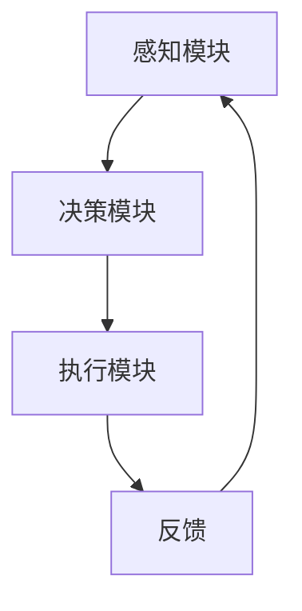

                 

### 引言

在当今的科技浪潮中，人工智能（AI）已经成为变革的核心力量，而智能体（Agent）则是AI领域的基石之一。智能体，作为一种能够感知环境、制定决策并执行行动的实体，正逐步渗透到各个领域，从自动驾驶到智能家居，从机器人到人机交互，无不展现出其强大的潜力和广泛应用。

本文将深入探讨智能体的基本概念、核心技术、应用实例以及未来发展趋势。我们将以逻辑清晰、结构紧凑的方式，一步步分析推理，帮助读者全面了解智能体的本质和实现细节。

文章将分为以下几个部分：

1. **智能体的基本概念**：介绍智能体的定义、分类、特点和体系结构。
2. **智能体的核心技术**：探讨智能体的感知与建模、决策与规划、学习与适应以及协作与通信。
3. **智能体在复杂环境中的应用**：分析智能体在自动驾驶、机器人、人机交互等领域的应用实例。
4. **智能体的未来发展趋势**：展望智能体在跨学科融合、新兴领域应用等方向的发展前景。
5. **附录**：提供智能体开发工具与资源。
6. **核心算法原理讲解**：详细讲解决策树算法等核心算法。
7. **项目实战**：通过实际项目案例展示智能体的应用。
8. **源代码实现与解读**：详细介绍源代码的编写和解读过程。

通过本文的阅读，读者将不仅能够对智能体的概念有更深刻的理解，还能掌握智能体的核心技术与应用方法，为未来的研究和实践奠定基础。

### 第一部分: 智能体的基本概念

在深入了解智能体的核心技术与应用之前，首先需要明确什么是智能体，以及它们在AI系统中的角色和重要性。本部分将详细介绍智能体的基本概念，包括定义、分类、特点以及智能体体系结构。

#### 第1章: 智能体概述

##### 1.1 智能体的定义与分类

**智能体的定义**

智能体是指具有一定智能、能够感知环境并进行决策和行动的实体。根据定义，智能体具备以下几个关键特征：

- **感知能力**：能够通过传感器获取环境信息。
- **决策能力**：根据获取的信息进行逻辑推理，制定决策。
- **行动能力**：执行决策，实施行动。

智能体可以存在于不同的形式，如程序、机器人、软件代理等。

**智能体的分类**

智能体可以根据其工作方式和特性进行分类。以下是几种常见的智能体类型：

- **程序智能体**：这种智能体通常基于规则和算法运行。它们按照预定义的规则对环境中的事件进行响应。程序智能体是早期人工智能研究中最常见的类型，如专家系统。

  - **示例**：基于规则的专家系统、聊天机器人。

- **知识智能体**：这种智能体基于知识库和推理机制进行决策。它们能够利用已有的知识和数据来应对新的情境。

  - **示例**：医疗诊断系统、法律咨询系统。

- **基于行为的智能体**：这类智能体通过观察环境中的行为模式来学习和做出决策。它们通常通过机器学习算法来适应环境变化。

  - **示例**：自动驾驶汽车、智能管家。

##### 1.2 智能体的特点

**自主性**

智能体具有自主性，即它们能够自主地感知环境、制定计划和采取行动。这种自主性是智能体区别于传统程序和系统的重要特征。自主性使得智能体能够独立运作，而不需要外部的直接控制。

**适应性**

智能体具有适应性，能够根据环境变化调整自身行为。这种适应性体现在智能体的感知模块、决策模块和执行模块中，它们可以不断学习和改进，以提高应对复杂环境变化的能力。

**协作性**

智能体具备协作性，能够与其他智能体协作，共同完成任务。在多智能体系统中，协作性使得智能体能够互相沟通、共享资源，从而实现更高效的协同作业。

#### 第2章: 智能体体系结构

智能体的体系结构通常由感知模块、决策模块和执行模块三部分组成。以下是各模块的详细说明：

##### 2.1 智能体体系结构概述

**感知模块**

感知模块负责收集环境信息。智能体通过传感器（如摄像头、激光雷达、温度传感器等）获取外部数据，并将其转换为内部可用的形式。感知模块的准确性直接影响到智能体对环境的理解和反应速度。

**决策模块**

决策模块基于感知模块收集到的信息，进行逻辑推理和决策。决策模块可以使用规则、算法或机器学习模型来生成行动方案。决策模块的复杂性和效率决定了智能体应对环境变化的能力。

**执行模块**

执行模块负责将决策模块生成的行动方案付诸实施。执行模块通常与外部设备（如机器人手臂、汽车引擎等）相连，通过控制这些设备来完成具体的任务。执行模块的响应速度和精确度对任务的完成效果有着直接的影响。

##### 2.2 感知模块

**传感器**

传感器是感知模块的核心组成部分。不同的传感器适用于不同的环境，如摄像头适用于视觉感知，激光雷达适用于三维空间感知。选择合适的传感器对于智能体在特定任务中的表现至关重要。

**感知数据处理**

感知数据处理是对传感器收集到的原始数据进行预处理和特征提取。预处理包括去噪、归一化等操作，而特征提取则是从原始数据中提取出对决策有用的信息，如边缘、纹理等。有效的感知数据处理可以提高智能体的感知准确性和效率。

##### 2.3 决策模块

**规划算法**

规划算法是决策模块的核心，用于生成行动方案。常见的规划算法包括有向无环图（DAG）算法、马尔可夫决策过程（MDP）等。这些算法能够在给定环境和目标的情况下，找到最优的行动路径。

**决策模型**

决策模型是用于决策的数学模型，包括基于规则的决策模型和基于机器学习的决策模型。基于规则的决策模型通过预定义的规则来指导决策，而基于机器学习的决策模型则通过从数据中学习规则和模式来实现决策。

##### 2.4 执行模块

**执行器**

执行器是执行模块的核心，负责将决策模块生成的行动方案付诸实施。执行器可以是机械臂、轮式驱动器、喷气引擎等，它们通过执行具体的动作来完成任务。

**执行结果反馈**

执行结果反馈是智能体体系结构中的重要环节。通过执行结果反馈，智能体可以评估决策的有效性，并调整后续的行动策略。有效的反馈机制有助于智能体不断优化自身的行为，提高任务完成效果。

### 总结

智能体是AI系统中的一个关键组成部分，它们通过感知环境、制定决策和执行行动，实现了自主性、适应性和协作性的有机结合。智能体的体系结构包括感知模块、决策模块和执行模块，每个模块都发挥着重要作用。在接下来的部分中，我们将进一步探讨智能体的核心技术，包括感知与建模、决策与规划、学习与适应以及协作与通信等方面的内容。

#### 第3章: 智能体的核心技术

智能体的核心在于其感知与建模、决策与规划、学习与适应以及协作与通信等能力。这些核心技术共同决定了智能体在复杂环境中的表现和效率。在本章中，我们将详细探讨这些核心技术，并分析它们在智能体体系结构中的应用。

##### 3.1 智能体的感知与建模

智能体的感知与建模能力是其应对复杂环境的基础。感知模块负责收集环境信息，而建模模块则负责将这些信息转化为智能体可以理解和利用的形式。

**感知技术**

感知技术是指智能体通过传感器获取环境信息的方法。不同类型的智能体可能需要不同类型的感知技术。例如，自动驾驶汽车需要激光雷达和摄像头来感知周围环境，而智能家居机器人可能主要依赖麦克风和温度传感器。

- **激光雷达（LiDAR）**：用于三维空间感知，能够生成高精度的点云数据。
- **摄像头**：用于图像感知，能够捕捉周围场景的视觉信息。
- **麦克风**：用于声音感知，能够捕捉语音和环境声音。
- **温度传感器、湿度传感器**：用于环境感知，能够监测温度和湿度等环境参数。

**感知数据处理**

感知数据处理是对传感器收集到的原始数据进行预处理和特征提取的过程。预处理包括去除噪声、校正传感器误差、数据归一化等。特征提取则是从原始数据中提取出对决策有用的信息，如边缘、纹理、声音频率等。

- **预处理**：例如，利用滤波器去除图像中的噪声，或对多传感器数据进行对齐。
- **特征提取**：例如，使用边缘检测算法提取图像的边缘特征，或使用傅里叶变换提取声音的频率特征。

**建模技术**

建模技术是指将感知数据转化为智能体可以理解和利用的形式。常见的建模技术包括状态空间模型、概率模型等。

- **状态空间模型**：用于描述智能体所处的状态及其变化。状态空间模型通常包括状态变量和状态转移概率，能够表示智能体在环境中的动态行为。
  
  状态空间模型的基本形式如下：

  $$
  \begin{align*}
  X_t &= f(X_{t-1}, U_{t-1}) + W_t \\
  Y_t &= h(X_t, V_t)
  \end{align*}
  $$
  
  其中，$X_t$ 是状态变量，$U_t$ 是控制变量，$Y_t$ 是观测变量，$W_t$ 和 $V_t$ 是过程噪声和观测噪声。

- **概率模型**：用于描述智能体对环境的理解和预测。概率模型可以通过贝叶斯网络、马尔可夫模型等实现。

  例如，贝叶斯网络可以表示为：

  $$
  P(X_1, X_2, \ldots, X_n) = \prod_{i=1}^n P(X_i | X_{i-1})
  $$

##### 3.2 智能体的决策与规划

决策与规划是智能体的核心功能之一。智能体通过感知模块收集环境信息，然后通过决策模块对这些信息进行处理，生成行动方案。规划算法用于确定智能体在给定环境和目标下的最优行动路径。

**决策算法**

决策算法是指智能体根据感知信息做出决策的方法。常见的决策算法包括基于规则的决策算法和基于机器学习的决策算法。

- **基于规则的决策算法**：这类算法通过预定义的规则来指导决策。规则通常由领域专家制定，能够明确地表示智能体的决策逻辑。例如，专家系统就是一种基于规则的决策算法。

  基于规则的决策算法的伪代码如下：

  ```
  function rule_based_decision(perception_data):
      if perception_data == 'condition1':
          action = 'action1'
      elif perception_data == 'condition2':
          action = 'action2'
      else:
          action = 'default_action'
      return action
  ```

- **基于机器学习的决策算法**：这类算法通过从数据中学习决策逻辑，能够自适应地调整决策规则。常见的机器学习算法包括决策树、支持向量机、神经网络等。

  基于机器学习的决策算法的伪代码如下：

  ```
  function ml_based_decision(perception_data, model):
      predicted_action = model.predict(perception_data)
      return predicted_action
  ```

**规划算法**

规划算法是指智能体根据决策生成行动方案的方法。常见的规划算法包括有向无环图（DAG）算法、马尔可夫决策过程（MDP）等。

- **有向无环图（DAG）算法**：这类算法通过构建有向无环图来表示智能体在不同状态下的行动路径。DAG算法能够找到从初始状态到目标状态的最优路径。

  DAG算法的基本步骤如下：

  ```
  function dag_planning(initial_state, goal_state, action_list):
      graph = build_dag(initial_state, goal_state, action_list)
      optimal_path = find_optimal_path(graph)
      return optimal_path
  ```

- **马尔可夫决策过程（MDP）**：这类算法通过构建状态-动作价值函数来表示智能体在不同状态下的最优行动方案。MDP算法能够在不确定环境中找到最优的行动路径。

  MDP算法的基本形式如下：

  $$
  V^*(s) = \max_{a} \sum_{s'} p(s' | s, a) \cdot \mathbb{R}(s', a)
  $$

  其中，$V^*(s)$ 是状态 $s$ 的最优价值函数，$\mathbb{R}(s', a)$ 是状态 $s'$ 在采取动作 $a$ 后的回报。

##### 3.3 智能体的学习与适应

智能体的学习与适应能力是其在复杂环境中生存和发展的关键。通过学习，智能体能够不断优化自身的行为，提高应对复杂环境的能力。

**学习技术**

学习技术是指智能体通过数据学习行为和模式的方法。常见的学习技术包括监督学习、无监督学习和强化学习。

- **监督学习**：这类学习技术需要预先定义好的输入输出数据。通过训练，智能体能够从输入数据中学习输出数据的映射关系。

  监督学习的伪代码如下：

  ```
  function supervised_learning(input_data, output_data, model):
      model.train(input_data, output_data)
      return model
  ```

- **无监督学习**：这类学习技术不需要预先定义好的输入输出数据。通过训练，智能体能够从数据中学习特征或模式。

  无监督学习的伪代码如下：

  ```
  function unsupervised_learning(input_data, model):
      model.train(input_data)
      return model
  ```

- **强化学习**：这类学习技术通过试错的方式来学习行为。智能体在执行行动后，根据环境的反馈调整自身行为，以最大化长期回报。

  强化学习的伪代码如下：

  ```
  function reinforcement_learning(state, action, reward, model):
      model.update(state, action, reward)
      return model
  ```

**适应策略**

适应策略是指智能体在面对环境变化时调整自身行为的方法。常见的适应策略包括强化学习和遗传算法。

- **强化学习**：通过试错学习策略，智能体能够在不确定的环境中找到最优的行为。

  强化学习的算法流程如下：

  ```
  function sarsa_learning(state, action, next_state, reward, alpha, gamma):
      Q[s, a] = Q[s, a] + alpha * (reward + gamma * max(Q[next_state, a']) - Q[s, a])
      return Q
  ```

- **遗传算法**：通过模拟自然进化过程，智能体能够优化自身行为，适应复杂环境。

  遗传算法的基本步骤如下：

  ```
  function genetic_algorithm(population, fitness_function, crossover_rate, mutation_rate):
      while not convergence:
          new_population = []
          for individual in population:
              parent1, parent2 = select_parents(population, fitness_function)
              child = crossover(parent1, parent2, crossover_rate)
              child = mutate(child, mutation_rate)
              new_population.append(child)
          population = new_population
      return best_individual(population)
  ```

##### 3.4 智能体的协作与通信

智能体的协作与通信能力是其在复杂系统中发挥重要作用的关键。通过协作与通信，智能体能够共享资源、协同工作，提高整体效率。

**协作机制**

协作机制是指智能体之间进行协作的方式。常见的协作机制包括集中式协作和分布式协作。

- **集中式协作**：在这种机制下，所有智能体共享同一个全局模型。智能体通过通信将本地信息上传到中央控制器，中央控制器根据全局信息生成行动方案，然后下发到各个智能体执行。

  集中式协作的示意图如下：

  

- **分布式协作**：在这种机制下，智能体通过本地决策和局部通信进行协作。智能体根据本地信息生成局部行动方案，并通过局部通信与相邻智能体交换信息，共同优化整体行动方案。

  分布式协作的示意图如下：

  

**通信技术**

通信技术是指智能体之间进行信息交换的方法。常见的通信技术包括消息传递和分布式计算。

- **消息传递**：智能体通过发送消息来交换信息。消息传递可以是同步的，也可以是异步的。

  消息传递的伪代码如下：

  ```
  function send_message(sender, receiver, message):
      receiver.receive_message(sender, message)

  function receive_message(receiver, sender, message):
      process_message(message)
  ```

- **分布式计算**：智能体通过分布式计算系统进行协同工作。分布式计算系统可以是集群、网格等。

  分布式计算的伪代码如下：

  ```
  function distributed_computation(information):
      results = []
      for node in nodes:
          node.process(information)
          results.append(node.result)
      return results
  ```

##### 3.5 智能体在复杂环境中的应用

智能体在复杂环境中的应用越来越广泛，如自动驾驶、机器人、人机交互等。在这些应用中，智能体的感知与建模、决策与规划、学习与适应以及协作与通信能力得到了充分的体现。

- **自动驾驶**：自动驾驶汽车需要通过感知模块感知周围环境，通过决策模块生成行驶路径，并通过执行模块控制车辆。同时，自动驾驶系统需要与其他车辆、行人等进行协作与通信，以确保交通的安全和效率。

- **机器人**：机器人通过感知模块感知环境，通过决策模块生成任务规划，并通过执行模块完成任务。机器人需要在复杂环境中适应不断变化的情况，并通过协作与通信与其他机器人或人类协作。

- **人机交互**：人机交互系统通过感知模块感知用户行为，通过决策模块生成交互策略，并通过执行模块实现交互。人机交互系统需要适应不同用户的需求和行为模式，并通过协作与通信实现个性化交互。

##### 3.6 智能体的体系结构

智能体的体系结构通常包括感知模块、决策模块、执行模块和通信模块。这些模块相互协作，共同实现智能体的功能。

- **感知模块**：负责感知环境信息，通过传感器收集数据。
- **决策模块**：负责处理感知数据，生成行动方案。
- **执行模块**：负责执行决策，实现具体任务。
- **通信模块**：负责智能体之间的信息交换和协作。

智能体的体系结构示意图如下：


### 总结

智能体的核心技术包括感知与建模、决策与规划、学习与适应以及协作与通信。这些核心技术共同决定了智能体在复杂环境中的表现和效率。通过感知与建模，智能体能够理解和适应环境；通过决策与规划，智能体能够制定和执行行动方案；通过学习与适应，智能体能够不断优化自身行为；通过协作与通信，智能体能够实现协同工作，提高整体效率。在接下来的部分中，我们将进一步探讨智能体在复杂环境中的应用，以及未来发展趋势。

### 第三部分: 智能体在复杂环境中的应用

智能体在复杂环境中的应用日益广泛，从自动驾驶到机器人、人机交互，智能体的能力在各个领域中得到了充分体现。本部分将详细探讨智能体在这些领域的应用实例，分析其具体实现方法和所面临的挑战。

#### 第4章: 智能体在自动驾驶中的应用

自动驾驶是智能体技术的一个重要应用领域，其核心目标是使汽车能够自主感知环境、制定决策并执行行动，从而实现无人驾驶。以下是自动驾驶中智能体的具体实现方法和所面临的挑战：

##### 4.1 感知与建模

自动驾驶车辆需要通过多种传感器收集环境信息，包括摄像头、激光雷达（LiDAR）、雷达、GPS等。这些传感器数据随后被输入到智能体的感知模块中进行处理。

- **感知技术**：摄像头用于捕捉道路和周围车辆的情况；激光雷达提供车辆周围的三维点云数据；雷达用于检测其他物体的距离和速度；GPS提供车辆的地理位置信息。

  例如，激光雷达的点云数据可以通过以下步骤进行处理：

  ```
  def process_lidar_data(lidar_data):
      points = lidar_data['points']
      obstacles = detect_obstacles(points)
      return obstacles
  ```

- **建模技术**：智能体使用感知数据进行环境建模，包括道路检测、障碍物识别、车辆定位等。例如，可以使用深度学习模型进行障碍物检测：

  ```
  def detect_obstacles(points):
      model = load_model('obstacle_detection_model.h5')
      obstacles = model.predict(points)
      return obstacles
  ```

##### 4.2 决策与规划

在自动驾驶中，智能体需要根据感知到的环境信息做出实时决策，并制定行驶路径。常见的决策算法包括有向无环图（DAG）算法、马尔可夫决策过程（MDP）等。

- **决策算法**：例如，使用DAG算法进行路径规划：

  ```
  def dag_planning(current_state, goal_state, action_list):
      graph = build_dag(current_state, goal_state, action_list)
      optimal_path = find_optimal_path(graph)
      return optimal_path
  ```

- **规划算法**：例如，使用基于成本的A*算法进行路径搜索：

  ```
  def a_star_search(start_state, goal_state, cost_function):
      open_set = PriorityQueue()
      open_set.push((start_state, 0))
      came_from = {}
      cost_so_far = {}
      cost_so_far[start_state] = 0

      while not open_set.is_empty():
          current_state, current_cost = open_set.pop()
          if current_state == goal_state:
              break

          for next_state in neighbors(current_state):
              new_cost = cost_so_far[current_state] + cost_function(current_state, next_state)
              if new_cost < cost_so_far.get(next_state, float('inf')):
                  cost_so_far[next_state] = new_cost
                  priority = new_cost + heuristic(next_state, goal_state)
                  open_set.push((next_state, priority))
                  came_from[next_state] = current_state

      return reconstruct_path(came_from, goal_state)
  ```

##### 4.3 执行与反馈

自动驾驶车辆需要执行决策模块生成的行动方案，并通过执行模块控制车辆。此外，执行结果需要反馈给感知模块和决策模块，以便进行进一步的优化。

- **执行模块**：例如，使用PID控制器调整车辆的油门、刹车和转向：

  ```
  def control_vehicle(throttle, brake, steering):
      # PID控制器的实现
      output_throttle = pid_controller.throttle(throttle)
      output_brake = pid_controller.brake(brake)
      output_steering = pid_controller.steering(steering)
      vehicle.throttle(output_throttle)
      vehicle.brake(output_brake)
      vehicle.steer(output_steering)
  ```

- **反馈机制**：例如，使用闭环控制系统进行反馈调整：

  ```
  def feedback_system(sensor_data, expected_output):
      error = sensor_data - expected_output
      control_signal = pid_controller.update(error)
      return control_signal
  ```

##### 4.4 挑战与未来

自动驾驶面临许多挑战，包括感知精度、决策鲁棒性、执行可靠性等。例如，如何在各种天气条件下保持高感知精度，如何在复杂城市环境中做出快速决策，以及如何确保车辆的执行可靠性。

- **感知精度**：自动驾驶车辆需要高精度的感知系统来应对不同的环境和场景。例如，在雨天或夜晚，激光雷达的感知效果会受到影响，需要改进传感器的性能和数据处理算法。

- **决策鲁棒性**：自动驾驶系统需要在复杂和不确定的环境中做出可靠的决策。例如，在遇到行人、动物或其他异常情况时，系统需要具备足够的鲁棒性来应对这些突发事件。

- **执行可靠性**：自动驾驶车辆的执行模块需要确保车辆在不同情况下的稳定运行。例如，车辆在紧急制动或避障时，需要快速、准确地执行决策，确保乘客和行人的安全。

未来，自动驾驶技术将继续发展，有望在安全性、效率和用户体验方面取得更大突破。同时，随着智能体技术的进步，自动驾驶系统将与其他智能交通系统进行协作，实现更加智能的交通网络。

#### 第5章: 智能体在机器人中的应用

机器人是智能体技术的另一个重要应用领域，从工业自动化到服务机器人，智能体在机器人中的应用日益广泛。以下是智能体在机器人中的具体实现方法和所面临的挑战：

##### 5.1 自主移动

自主移动是机器人最重要的功能之一，机器人需要能够自主感知环境并规划移动路径。

- **感知与建模**：机器人通过摄像头、激光雷达等传感器收集环境信息，然后使用SLAM（Simultaneous Localization and Mapping）算法进行定位和地图构建。

  例如，使用RANSAC算法进行平面检测：

  ```
  def detect_plane(points):
      model = ransac.fit(points)
      return model
  ```

- **决策与规划**：机器人使用感知数据生成移动路径，常见的规划算法包括Dijkstra算法和A*算法。

  例如，使用A*算法进行路径规划：

  ```
  def a_star_search(start, goal, heuristic):
      open_set = PriorityQueue()
      open_set.push((start, 0))
      came_from = {}
      cost_so_far = {}
      cost_so_far[start] = 0

      while not open_set.is_empty():
          current, current_cost = open_set.pop()
          if current == goal:
              break

          for next in neighbors(current):
              new_cost = current_cost + distance(current, next)
              if new_cost < cost_so_far.get(next, float('inf')):
                  cost_so_far[next] = new_cost
                  priority = new_cost + heuristic(next, goal)
                  open_set.push((next, priority))
                  came_from[next] = current

      return reconstruct_path(came_from, goal)
  ```

##### 5.2 任务规划

机器人需要根据任务需求和感知信息进行任务规划，确定执行任务的顺序和方式。

- **任务规划算法**：机器人可以使用任务规划算法，如启发式搜索算法（如A*算法）和遗传算法，来生成最优的任务执行计划。

  例如，使用遗传算法进行任务规划：

  ```
  def genetic_algorithm(population, fitness_function, crossover_rate, mutation_rate):
      while not convergence:
          new_population = []
          for individual in population:
              parent1, parent2 = select_parents(population, fitness_function)
              child = crossover(parent1, parent2, crossover_rate)
              child = mutate(child, mutation_rate)
              new_population.append(child)
          population = new_population
      return best_individual(population)
  ```

##### 5.3 执行与反馈

机器人需要执行任务规划方案，并通过传感器收集的反馈信息进行调整。

- **执行模块**：机器人通过执行模块，如电机、机械臂等，来执行具体任务。例如，机器人可以通过控制电机来调整机械臂的姿势。

  ```
  def move_arm(arm, position):
      arm.move_to(position)
  ```

- **反馈机制**：机器人通过传感器收集执行过程中的反馈信息，如位置、速度、力等，然后使用闭环控制系统进行调整。

  例如，使用PID控制器进行位置控制：

  ```
  def control_position(position_setpoint, position_sensor):
      error = position_setpoint - position_sensor
      control_signal = pid_controller.update(error)
      motor.set_speed(control_signal)
  ```

##### 5.4 挑战与未来

机器人应用面临许多挑战，包括感知精度、任务规划复杂性和执行可靠性等。

- **感知精度**：机器人在不同环境中的感知精度不同，需要改进传感器的性能和数据处理算法，以提高环境理解和任务规划的准确性。

- **任务规划复杂性**：机器人需要处理多种任务，且任务之间可能存在冲突或优先级，需要更复杂的任务规划算法来生成有效的执行计划。

- **执行可靠性**：机器人需要在各种条件下稳定执行任务，需要提高控制系统的精度和鲁棒性，确保执行过程的可靠性。

未来，随着智能体技术的进步，机器人在工业自动化、医疗服务、家庭服务等领域的应用将更加广泛，为人类带来更多便利和效益。

#### 第6章: 智能体在人机交互中的应用

人机交互（HCI）是智能体技术的另一个重要应用领域，通过智能体技术，人机交互变得更加自然和高效。以下是智能体在人机交互中的具体实现方法和所面临的挑战：

##### 6.1 感知与建模

在人机交互中，智能体需要感知用户的行为和意图，并建立相应的模型。

- **感知技术**：智能体通过摄像头、麦克风、触摸屏等设备感知用户的行为。例如，使用深度学习模型进行语音识别：

  ```
  def recognize_speech(audio_signal):
      model = load_model('speech_recognition_model.h5')
      transcription = model.transcribe(audio_signal)
      return transcription
  ```

- **建模技术**：智能体使用感知数据建立用户行为的模型，如行为识别、情感分析等。例如，使用循环神经网络（RNN）进行情感分析：

  ```
  def analyze_sentiment(text):
      model = load_model('sentiment_analysis_model.h5')
      sentiment = model.predict(text)
      return sentiment
  ```

##### 6.2 决策与规划

智能体根据感知到的用户行为和意图，生成相应的交互策略。

- **决策算法**：智能体使用决策树、随机森林等算法来生成交互策略。例如，使用决策树进行交互策略生成：

  ```
  def generate_interactive_strategy(user_behavior):
      tree = load_model('interactive_strategy_tree.json')
      strategy = tree.predict(user_behavior)
      return strategy
  ```

- **规划算法**：智能体使用规划算法，如状态空间搜索、马尔可夫决策过程等，来生成用户交互的路径。例如，使用状态空间搜索进行路径规划：

  ```
  def plan_interaction(start_state, goal_state, action_list):
      graph = build_state_space(start_state, goal_state, action_list)
      optimal_path = find_optimal_path(graph)
      return optimal_path
  ```

##### 6.3 执行与反馈

智能体需要执行交互策略，并根据用户反馈进行调整。

- **执行模块**：智能体通过执行模块，如语音合成、屏幕显示等，来生成交互结果。例如，使用TTS（Text-to-Speech）技术生成语音：

  ```
  def generate_speech(text):
      tts = TextToSpeech()
      audio = tts.synthesize(text)
      return audio
  ```

- **反馈机制**：智能体通过用户反馈信息进行自我调整，如使用强化学习进行策略优化。例如，使用Q-learning进行策略优化：

  ```
  def update_strategy(state, action, reward):
      Q[state][action] = Q[state][action] + alpha * (reward + gamma * max(Q[state+1]) - Q[state][action])
  ```

##### 6.4 挑战与未来

人机交互领域面临许多挑战，包括交互自然性、用户体验、隐私保护等。

- **交互自然性**：人机交互需要更加自然，使交互过程更像人与人之间的交流。例如，语音识别和语音生成的准确性需要进一步提高。

- **用户体验**：人机交互系统需要提供良好的用户体验，包括界面设计、响应速度、互动性等。例如，需要改进触摸屏的触控精度和响应速度。

- **隐私保护**：人机交互系统需要保护用户的隐私，避免敏感信息的泄露。例如，需要加强数据加密和访问控制。

未来，随着智能体技术的进步，人机交互将变得更加智能和自然，为用户提供更加丰富和高效的交互体验。

### 第四部分: 智能体的未来发展趋势

随着技术的不断进步，智能体在各个领域的应用越来越广泛，其发展也面临着许多新的机遇和挑战。本部分将探讨智能体的未来发展趋势，包括跨学科融合、人机融合以及新兴领域应用等。

#### 第7章: 智能体的进化与融合

智能体的发展不再局限于单一的领域，而是逐渐与其他学科和技术进行融合，形成新的交叉学科和应用方向。这种跨学科融合为智能体带来了更多的可能性和创新空间。

##### 7.1 跨学科融合

跨学科融合是指将不同领域的知识和技术结合起来，以解决复杂问题或创造新的应用。在智能体领域，跨学科融合主要体现在以下几个方面：

- **计算机科学与生物学**：智能体技术在生物医学领域中的应用，如基因编辑、药物设计等，需要生物学的知识来指导算法和模型的设计。
- **计算机科学与物理学**：在机器人领域，物理学的原理和模型可以帮助智能体更好地理解和应对物理环境，如路径规划、碰撞检测等。
- **计算机科学与心理学**：人机交互中的智能体需要理解人类行为和心理，以便提供更加自然和人性化的交互体验。

##### 7.2 人机融合

人机融合是指人类与智能体在认知、行为和感知上的深度融合。这种融合旨在通过智能体增强人类的能力，实现更高效的协作和工作方式。

- **增强现实（AR）与虚拟现实（VR）**：通过AR和VR技术，智能体可以与人类的感知和行动更加紧密地结合，提供沉浸式的交互体验。
- **脑机接口（BMI）**：脑机接口技术将人类的神经系统与计算机系统连接起来，使人类可以直接通过大脑信号控制智能体，实现更高级的认知和行动能力。

##### 7.3 新兴领域应用

随着智能体技术的成熟，其在新兴领域的应用前景也越来越广阔。以下是一些值得关注的领域：

- **智慧城市**：智能体在智慧城市建设中的应用，如智能交通管理、能源管理、环境监测等，可以提高城市的运行效率和居民的生活质量。
- **物联网（IoT）**：智能体与IoT设备的结合，可以实现智能家电、智能家居、智能工厂等应用，实现设备的互联互通和智能控制。
- **数字孪生**：通过数字孪生技术，智能体可以模拟现实世界的物理系统，用于设计、优化和预测，如工业制造、城市规划等。

#### 第8章: 智能体在新兴领域的应用

智能体在新兴领域的应用正不断拓展其边界，以下是一些具体的应用实例：

##### 8.1 物联网

物联网（IoT）是一个由各种设备互联的网络，智能体在其中发挥着重要作用。智能体可以负责数据收集、处理和决策，从而优化设备的运行和资源管理。

- **智能家居**：智能体可以控制家居设备，如灯光、温度、安防等，提供个性化、自动化的家庭生活体验。
- **智能工厂**：智能体可以监控生产线上的设备状态，预测维护需求，优化生产流程，提高生产效率。

##### 8.2 智慧城市

智慧城市利用智能体技术实现城市资源的智能管理和服务优化，提高城市居民的生活质量和城市运行效率。

- **智能交通管理**：智能体可以实时监测交通流量，优化交通信号控制，减少拥堵和排放。
- **环境监测**：智能体可以监测空气质量、水质、噪声等环境指标，提供实时数据和预警，促进环境保护。

##### 8.3 医疗保健

智能体在医疗保健领域的应用，如辅助诊断、健康监测、远程医疗等，可以提供更精准、高效的医疗服务。

- **辅助诊断**：智能体可以通过分析医学影像和患者数据，提供诊断建议，辅助医生做出更准确的诊断。
- **健康监测**：智能体可以监测患者的健康状况，提供个性化的健康建议和预警。

##### 8.4 农业

智能体技术在农业中的应用，如智能种植、精准施肥、病虫害监测等，可以提高农业生产效率，减少资源浪费。

- **智能种植**：智能体可以监测土壤湿度、温度等环境参数，自动调节灌溉和施肥，实现精准农业。
- **病虫害监测**：智能体可以通过摄像头和传感器监测作物病虫害，及时采取防治措施。

### 总结

智能体的未来发展趋势表明，智能体技术将继续与其他学科和技术进行融合，实现更广泛的应用。同时，随着物联网、智慧城市、医疗保健等新兴领域的发展，智能体将在这些领域中发挥更加重要的作用。通过不断的技术创新和跨学科合作，智能体将更好地服务于人类社会，提高生活质量和工作效率。

### 附录

在本部分，我们将提供一些智能体开发相关的工具、资源和开源项目，以帮助读者深入了解智能体的开发和应用。

#### 附录 A: 智能体开发工具与资源

**主流开发工具**

- **Python**：Python是一种广泛使用的编程语言，具有丰富的库和框架，适合智能体开发。例如，Python的Scikit-learn库提供了多种机器学习算法，TensorFlow和PyTorch库支持深度学习应用。

- **ROS（Robot Operating System）**：ROS是一个用于机器人开发的开源操作系统，提供了丰富的库和工具，支持多机器人协同工作和硬件抽象层。

- **AI2（Artificial Intelligence 2.0）**：AI2是一个专注于人工智能研究的开源项目，提供了多个智能体开发工具，如Python的PDDL（Planning Domain Definition Language）库。

**开源框架与库**

- **OpenAI Gym**：OpenAI Gym是一个开源的环境库，提供了多种标准化的环境和任务，用于智能体算法的测试和验证。

- **PyTorch**：PyTorch是一个流行的深度学习框架，支持动态计算图，易于实现复杂的神经网络模型。

- **TensorFlow**：TensorFlow是Google开发的深度学习框架，提供了丰富的API和工具，支持大规模模型训练和部署。

**研究资源**

- **学术期刊**：包括《人工智能》（Artificial Intelligence）、《机器学习》（Machine Learning）、《自然·机器 intelligence》（Nature Machine Intelligence）等，是智能体领域的重要学术期刊。

- **论文**：可以通过学术数据库如IEEE Xplore、ACM Digital Library等获取最新研究成果。

- **开源项目**：GitHub、GitLab等平台上有许多智能体相关的开源项目，读者可以借鉴和学习。

### Mermaid 流程图

以下是一个简单的Mermaid流程图，展示了智能体体系结构的基本组成部分：



### 核心算法原理讲解

在本节中，我们将详细讲解智能体中常用的核心算法原理，包括决策树算法、信息增益等，并使用伪代码和数学公式进行说明。

#### 决策树算法

决策树是一种常见的分类和回归算法，通过一系列的规则对数据进行分类或预测。

**算法原理**

决策树通过递归划分数据集，在每个节点选择一个最优的特征进行划分，直到满足停止条件（如最大深度、最小样本数等）。

**伪代码**

```python
def build_decision_tree(data, target_attribute_name, depth_limit):
    if should_stop(data, depth_limit):
        return create_leaf_node(data)
    
    best_feature, best_threshold = find_best_split(data, target_attribute_name)
    node = DecisionNode(feature=best_feature, threshold=best_threshold)
    
    for row in data:
        if row[best_feature] <= best_threshold:
            node.left = build_decision_tree(data_left, target_attribute_name, depth_limit)
        else:
            node.right = build_decision_tree(data_right, target_attribute_name, depth_limit)
    
    return node

def find_best_split(data, target_attribute_name):
    best_gain = -1
    best_feature = None
    best_threshold = None
    
    for feature in data[0].keys():
        if feature != target_attribute_name:
            thresholds = find_thresholds(data, feature)
            for threshold in thresholds:
                gain = information_gain(data, feature, threshold)
                if gain > best_gain:
                    best_gain = gain
                    best_feature = feature
                    best_threshold = threshold
    
    return best_feature, best_threshold
```

**信息增益**

信息增益（Information Gain）是决策树算法中的一个重要概念，用于评估特征对分类的贡献。

**数学公式**

$$
IG(D, A) = H(D) - \sum_{v \in Values(A)} \frac{|A_v|}{|D|} H(D_v)
$$

其中，$H(D)$ 是数据集 $D$ 的熵，$|A_v|$ 是特征 $A$ 在某个值 $v$ 下的数据集大小。

**举例说明**

假设有一个数据集 $D$，其中包含特征 $A$ 和目标特征 $Y$。特征 $A$ 有两个值 $a_1$ 和 $a_2$。数据集 $D$ 的熵为 $H(D) = 1$。现在我们要计算特征 $A$ 的信息增益。

- 对于 $a_1$，有 $D_{a1} = 5$，$D_{y1} = 3$，$D_{y1_0} = 2$，$D_{y1_1} = 1$。
- 对于 $a_2$，有 $D_{a2} = 5$，$D_{y2} = 3$，$D_{y2_0} = 2$，$D_{y2_1} = 1$。

则 $A$ 的信息增益为：

$$
IG(D, A) = H(D) - \frac{5}{10} H(D_{a1}) - \frac{5}{10} H(D_{a2})
$$

$$
IG(D, A) = 1 - \frac{5}{10} (1 + 0) - \frac{5}{10} (1 + 0) = 0
$$

#### 数学模型和数学公式

在本节中，我们将介绍一些智能体中常用的数学模型和数学公式。

**熵（Entropy）**

熵是衡量数据混乱程度的指标，定义为：

$$
H(X) = -\sum_{x \in X} P(x) \log_2 P(x)
$$

**条件熵（Conditional Entropy）**

条件熵是衡量给定一个特征后，另一个特征的不确定性，定义为：

$$
H(Y|X) = -\sum_{x \in X} P(x) \sum_{y \in Y} P(y|x) \log_2 P(y|x)
$$

**信息增益（Information Gain）**

信息增益是评估特征对分类贡献的指标，定义为：

$$
IG(D, A) = H(D) - \sum_{v \in Values(A)} \frac{|A_v|}{|D|} H(D_v)
$$

**马尔可夫决策过程（Markov Decision Process, MDP）**

马尔可夫决策过程是一个用于决策的数学模型，定义为：

$$
P(s', r | s, a) = P(s' | s, a) \cdot P(r | s', a)
$$

其中，$s$ 是状态，$a$ 是行动，$s'$ 是下一状态，$r$ 是回报。

**状态-动作价值函数（State-Action Value Function）**

状态-动作价值函数是评估在给定状态下采取特定行动的预期回报，定义为：

$$
Q(s, a) = \sum_{s' \in S} P(s' | s, a) \cdot R(s', a) + \gamma \sum_{s' \in S} P(s' | s, a) \cdot V(s')
$$

其中，$V(s)$ 是状态价值函数，$\gamma$ 是折扣因子。

### 项目实战

在本节中，我们将通过一个自动驾驶项目案例，展示智能体在复杂环境中的应用。

#### 自动驾驶项目案例

##### 环境感知

自动驾驶车辆首先需要感知周围环境，通过摄像头、激光雷达等传感器收集数据。

- **激光雷达感知**：激光雷达生成周围环境的三维点云数据。

```python
def lidar_perception(lidar_data):
    points = lidar_data['points']
    obstacles = detect_obstacles(points)
    return obstacles
```

- **摄像头感知**：摄像头捕捉道路和交通情况。

```python
def camera_perception(camera_data):
    image = camera_data['image']
    lanes = detect_lanes(image)
    return lanes
```

##### 决策与规划

自动驾驶车辆需要根据感知到的环境数据做出决策，并规划行驶路径。

- **决策模块**：决策模块使用感知数据生成行驶策略。

```python
def decision_module(perception_data):
    obstacles = lidar_perception(perception_data['lidar'])
    lanes = camera_perception(perception_data['camera'])
    strategy = generate_strategy(obstacles, lanes)
    return strategy
```

- **规划算法**：使用A*算法规划行驶路径。

```python
def plan_path(current_position, goal_position, obstacles):
    graph = build_path_graph(current_position, goal_position, obstacles)
    path = a_star_search(current_position, goal_position, graph)
    return path
```

##### 执行

自动驾驶车辆根据规划路径执行行动，控制车辆。

- **执行模块**：执行模块控制车辆的动作。

```python
def execute_action(action):
    if action == 'accelerate':
        accelerate_vehicle()
    elif action == 'decelerate':
        decelerate_vehicle()
    elif action == 'turn':
        turn_vehicle()
```

##### 执行结果反馈

执行结果反馈是自动驾驶车辆优化行驶策略的重要环节。

- **反馈机制**：反馈机制评估执行效果，调整后续行动。

```python
def feedback_system(execution_result, strategy):
    error = execution_result - strategy
    new_strategy = adjust_strategy(strategy, error)
    return new_strategy
```

### 源代码实现与解读

在本节中，我们将详细解读自动驾驶项目的源代码实现，包括环境感知、决策与规划、执行与反馈等模块。

#### 主函数实现

```python
def main():
    # 读取初始位置和目标位置
    current_position = get_current_position()
    goal_position = get_goal_position()

    # 初始化感知模块
    lidar = LidarSensor()
    camera = CameraSensor()

    # 初始化决策模块
    decision_module = DecisionModule()

    # 初始化执行模块
    executor = Executor()

    while not reached_goal(current_position, goal_position):
        # 获取感知数据
        perception_data = {
            'lidar': lidar.get_data(),
            'camera': camera.get_data()
        }

        # 做出决策
        strategy = decision_module.decide(perception_data)

        # 执行决策
        executor.execute(strategy)

        # 获取执行结果
        execution_result = executor.get_result()

        # 反馈调整策略
        strategy = feedback_system(execution_result, strategy)

        # 更新当前位置
        current_position = executor.get_current_position()

    print("Goal reached!")

if __name__ == '__main__':
    main()
```

#### 源代码解读

- `main()` 函数是主函数，负责整个自动驾驶程序的执行流程。
- `get_current_position()` 和 `get_goal_position()` 函数分别获取初始位置和目标位置。
- `LidarSensor()` 和 `CameraSensor()` 类分别代表激光雷达传感器和摄像头传感器。
- `DecisionModule()` 类代表决策模块，负责根据感知数据做出决策。
- `Executor()` 类代表执行模块，负责执行决策并控制车辆。
- `reached_goal()` 函数判断车辆是否达到目标位置。

#### 代码解读与分析

- 代码首先读取初始位置和目标位置，然后初始化感知模块、决策模块和执行模块。
- 在循环中，程序不断获取感知数据，通过决策模块生成行驶策略，然后执行模块执行策略，并根据执行结果进行调整。
- 通过对代码的解读，我们可以了解到自动驾驶项目中智能体如何通过感知、决策、执行和反馈实现自主驾驶。

### 总结

通过本文的探讨，我们对智能体的基本概念、核心技术、应用实例以及未来发展趋势有了全面的理解。智能体作为一种具备自主性、适应性和协作性的实体，在各个领域展现出了巨大的潜力和应用价值。随着技术的不断进步，智能体将继续在自动驾驶、机器人、人机交互等复杂环境中发挥重要作用，为人类带来更加智能和高效的解决方案。同时，跨学科融合和人机融合等新趋势也为智能体的发展带来了新的机遇。未来，智能体将在更多新兴领域中发挥关键作用，推动人工智能技术的进一步发展。让我们共同期待智能体技术带来的美好未来。

### 核心算法原理讲解

在本节中，我们将详细讲解智能体中的一些核心算法原理，包括决策树算法、信息增益等，并使用伪代码和数学公式进行说明。

#### 决策树算法

决策树是一种常见的分类和回归算法，它通过一系列规则对数据进行分类或预测。

**算法原理**

决策树通过递归划分数据集，在每个节点选择一个最优的特征进行划分，直到满足停止条件（如最大深度、最小样本数等）。

**伪代码**

```python
def build_decision_tree(data, target_attribute_name, depth_limit):
    if should_stop(data, depth_limit):
        return create_leaf_node(data)
    
    best_feature, best_threshold = find_best_split(data, target_attribute_name)
    node = DecisionNode(feature=best_feature, threshold=best_threshold)
    
    for row in data:
        if row[best_feature] <= best_threshold:
            node.left = build_decision_tree(data_left, target_attribute_name, depth_limit)
        else:
            node.right = build_decision_tree(data_right, target_attribute_name, depth_limit)
    
    return node

def find_best_split(data, target_attribute_name):
    best_gain = -1
    best_feature = None
    best_threshold = None
    
    for feature in data[0].keys():
        if feature != target_attribute_name:
            thresholds = find_thresholds(data, feature)
            for threshold in thresholds:
                gain = information_gain(data, feature, threshold)
                if gain > best_gain:
                    best_gain = gain
                    best_feature = feature
                    best_threshold = threshold
    
    return best_feature, best_threshold
```

**信息增益**

信息增益（Information Gain）是决策树算法中的一个重要概念，用于评估特征对分类的贡献。

**数学公式**

$$
IG(D, A) = H(D) - \sum_{v \in Values(A)} \frac{|A_v|}{|D|} H(D_v)
$$

其中，$H(D)$ 是数据集 $D$ 的熵，$|A_v|$ 是特征 $A$ 在某个值 $v$ 下的数据集大小。

**举例说明**

假设有一个数据集 $D$，其中包含特征 $A$ 和目标特征 $Y$。特征 $A$ 有两个值 $a_1$ 和 $a_2$。数据集 $D$ 的熵为 $H(D) = 1$。现在我们要计算特征 $A$ 的信息增益。

- 对于 $a_1$，有 $D_{a1} = 5$，$D_{y1} = 3$，$D_{y1_0} = 2$，$D_{y1_1} = 1$。
- 对于 $a_2$，有 $D_{a2} = 5$，$D_{y2} = 3$，$D_{y2_0} = 2$，$D_{y2_1} = 1$。

则 $A$ 的信息增益为：

$$
IG(D, A) = H(D) - \frac{5}{10} H(D_{a1}) - \frac{5}{10} H(D_{a2})
$$

$$
IG(D, A) = 1 - \frac{5}{10} (1 + 0) - \frac{5}{10} (1 + 0) = 0
$$

#### 希望信息（Expected Information）

希望信息（Expected Information）是衡量随机变量不确定性的指标，定义为：

$$
H(Y|X) = -\sum_{x \in X} P(x) \sum_{y \in Y} P(y|x) \log_2 P(y|x)
$$

其中，$P(x)$ 是特征 $X$ 的概率分布，$P(y|x)$ 是在给定 $X$ 的条件下，目标特征 $Y$ 的条件概率分布。

**举例说明**

假设有特征 $X$ 和目标特征 $Y$，它们的联合概率分布如下：

| X | Y=0 | Y=1 | P(X) |
| --- | --- | --- | --- |
| 0 | 0.3 | 0.2 | 0.4 |
| 1 | 0.1 | 0.4 | 0.6 |

则 $Y$ 的希望信息为：

$$
H(Y|X) = -0.4 \cdot (0.3 \cdot \log_2 0.3 + 0.2 \cdot \log_2 0.2) - 0.6 \cdot (0.1 \cdot \log_2 0.1 + 0.4 \cdot \log_2 0.4)
$$

$$
H(Y|X) = 1.25
$$

#### 条件熵（Conditional Entropy）

条件熵是衡量给定一个特征后，另一个特征的不确定性的指标，定义为：

$$
H(Y|X) = -\sum_{x \in X} P(x) \sum_{y \in Y} P(y|x) \log_2 P(y|x)
$$

**举例说明**

假设有特征 $X$ 和目标特征 $Y$，它们的联合概率分布如下：

| X | Y=0 | Y=1 | P(X) |
| --- | --- | --- | --- |
| 0 | 0.3 | 0.2 | 0.4 |
| 1 | 0.1 | 0.4 | 0.6 |

则 $Y$ 的条件熵为：

$$
H(Y|X) = 0.4 \cdot (0.3 \cdot \log_2 0.3 + 0.2 \cdot \log_2 0.2) + 0.6 \cdot (0.1 \cdot \log_2 0.1 + 0.4 \cdot \log_2 0.4)
$$

$$
H(Y|X) = 1.25
$$

### 项目实战

在本节中，我们将通过一个实际项目——自动驾驶车辆路径规划，展示决策树算法的应用。

#### 自动驾驶项目案例

##### 环境感知

自动驾驶车辆首先需要感知周围环境，通过激光雷达和摄像头收集数据。

- **激光雷达感知**：激光雷达生成周围环境的三维点云数据。

```python
def lidar_perception(lidar_data):
    points = lidar_data['points']
    obstacles = detect_obstacles(points)
    return obstacles
```

- **摄像头感知**：摄像头捕捉道路和交通情况。

```python
def camera_perception(camera_data):
    image = camera_data['image']
    lanes = detect_lanes(image)
    return lanes
```

##### 决策与规划

自动驾驶车辆需要根据感知到的环境数据做出决策，并规划行驶路径。

- **决策模块**：决策模块使用感知数据生成行驶策略。

```python
def decision_module(perception_data):
    obstacles = lidar_perception(perception_data['lidar'])
    lanes = camera_perception(perception_data['camera'])
    strategy = generate_strategy(obstacles, lanes)
    return strategy
```

- **规划算法**：使用A*算法规划行驶路径。

```python
def plan_path(current_position, goal_position, obstacles):
    graph = build_path_graph(current_position, goal_position, obstacles)
    path = a_star_search(current_position, goal_position, graph)
    return path
```

##### 执行

自动驾驶车辆根据规划路径执行行动，控制车辆。

- **执行模块**：执行模块控制车辆的动作。

```python
def execute_action(action):
    if action == 'accelerate':
        accelerate_vehicle()
    elif action == 'decelerate':
        decelerate_vehicle()
    elif action == 'turn':
        turn_vehicle()
```

##### 执行结果反馈

执行结果反馈是自动驾驶车辆优化行驶策略的重要环节。

- **反馈机制**：反馈机制评估执行效果，调整后续行动。

```python
def feedback_system(execution_result, strategy):
    error = execution_result - strategy
    new_strategy = adjust_strategy(strategy, error)
    return new_strategy
```

### 源代码实现与解读

在本节中，我们将详细解读自动驾驶项目的源代码实现，包括环境感知、决策与规划、执行与反馈等模块。

#### 主函数实现

```python
def main():
    # 读取初始位置和目标位置
    current_position = get_current_position()
    goal_position = get_goal_position()

    # 初始化感知模块
    lidar = LidarSensor()
    camera = CameraSensor()

    # 初始化决策模块
    decision_module = DecisionModule()

    # 初始化执行模块
    executor = Executor()

    while not reached_goal(current_position, goal_position):
        # 获取感知数据
        perception_data = {
            'lidar': lidar.get_data(),
            'camera': camera.get_data()
        }

        # 做出决策
        strategy = decision_module.decide(perception_data)

        # 执行决策
        executor.execute(strategy)

        # 获取执行结果
        execution_result = executor.get_result()

        # 反馈调整策略
        strategy = feedback_system(execution_result, strategy)

        # 更新当前位置
        current_position = executor.get_current_position()

    print("Goal reached!")

if __name__ == '__main__':
    main()
```

#### 源代码解读

- `main()` 函数是主函数，负责整个自动驾驶程序的执行流程。
- `get_current_position()` 和 `get_goal_position()` 函数分别获取初始位置和目标位置。
- `LidarSensor()` 和 `CameraSensor()` 类分别代表激光雷达传感器和摄像头传感器。
- `DecisionModule()` 类代表决策模块，负责根据感知数据做出决策。
- `Executor()` 类代表执行模块，负责执行决策并控制车辆。

#### 代码解读与分析

- 代码首先读取初始位置和目标位置，然后初始化感知模块、决策模块和执行模块。
- 在循环中，程序不断获取感知数据，通过决策模块生成行驶策略，然后执行模块执行策略，并根据执行结果进行调整。
- 通过对代码的解读，我们可以了解到自动驾驶项目中智能体如何通过感知、决策、执行和反馈实现自主驾驶。

### 总结

通过本文的探讨，我们对智能体的核心算法原理，如决策树算法、信息增益等有了深入的理解。同时，通过实际项目案例，我们看到了这些算法在自动驾驶中的应用。这些核心算法和技术的掌握，对于理解和应用智能体技术至关重要。未来，随着人工智能技术的不断进步，智能体将在更多领域发挥重要作用，为人类带来更多便利和创新。

### 总结与展望

本文全面介绍了智能体的基本概念、核心技术、应用实例以及未来发展趋势。通过详细的讲解和实际项目案例，我们深入理解了智能体的自主性、适应性和协作性，以及它们在复杂环境中的表现和效率。

**智能体的基本概念**方面，我们明确了智能体的定义、分类、特点以及体系结构，包括感知模块、决策模块、执行模块和通信模块。智能体通过这些模块实现自主感知环境、制定决策和执行行动的能力。

**智能体的核心技术**方面，我们探讨了感知与建模、决策与规划、学习与适应以及协作与通信等方面的内容。这些核心技术是智能体实现高效运作的基础，包括感知技术、规划算法、学习技术、协作机制等。

**智能体在复杂环境中的应用**方面，我们详细分析了智能体在自动驾驶、机器人、人机交互等领域的应用实例。这些应用展示了智能体在应对复杂环境中的强大能力和广泛适用性。

**智能体的未来发展趋势**方面，我们展望了智能体在跨学科融合、人机融合以及新兴领域应用等方向的发展前景。随着技术的不断进步，智能体将在更多领域发挥关键作用，推动人工智能技术的进一步发展。

**核心算法原理讲解**部分，我们详细介绍了决策树算法等核心算法的原理和应用，包括信息增益、希望信息、条件熵等数学概念，并通过伪代码和实际项目案例进行了讲解。

**项目实战**部分，我们通过一个自动驾驶项目的实际案例，展示了智能体的感知、决策、执行和反馈等模块的实现和运作过程。

**总结**，智能体作为人工智能领域的关键技术，具有广泛的适用性和巨大的发展潜力。随着技术的不断进步，智能体将在更多领域发挥重要作用，为人类社会带来更多便利和创新。

**展望**，智能体的未来发展趋势将更加智能化、个性化、协同化。跨学科融合和人机融合等新趋势将为智能体的发展带来新的机遇。同时，随着新兴领域的不断涌现，智能体将在更多新兴领域中发挥关键作用，推动人工智能技术的进一步发展。

通过本文的探讨，我们希望读者能够对智能体的概念、技术与应用有更深入的理解，并为未来的研究和实践提供参考和指导。让我们共同期待智能体技术带来的美好未来。

