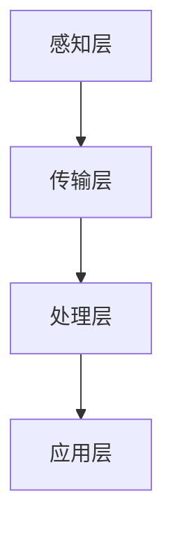
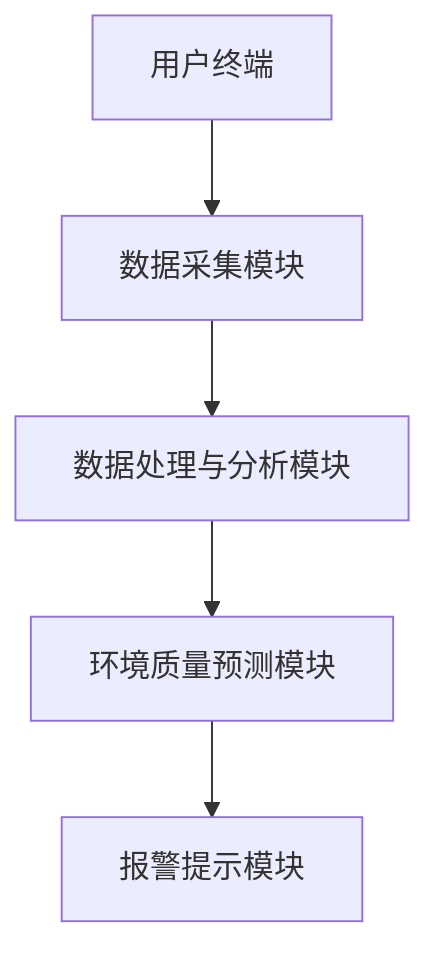

                 

# 智能家居环境质量分析系统的设计与实现

> **关键词**：智能家居、环境质量分析、传感器技术、数据采集、数据处理、机器学习、系统架构、实现案例、未来发展趋势

> **摘要**：本文全面探讨了智能家居环境质量分析系统的设计与实现。首先，介绍了智能家居的起源和发展，以及环境质量分析系统的必要性。接着，详细阐述了系统的核心概念、架构、技术基础和核心算法。然后，通过具体实现和案例分析，展示了系统的实际应用效果。最后，分析了系统的未来发展趋势和面临的挑战，为智能家居环境质量分析系统的进一步研究和应用提供了参考。

## 第一部分：智能家居环境质量分析系统的基本概念与背景

### 第1章：智能家居环境质量分析系统概述

#### 1.1 智能家居的起源与发展

智能家居作为物联网（IoT）技术的一个重要应用领域，起源于20世纪90年代。当时，随着计算机技术和互联网的快速发展，人们开始将家居设备与互联网连接，实现远程控制和自动化操作。早期的智能家居系统主要依赖于家用控制器和通信模块，实现了照明、空调、门锁等设备的远程控制。

进入21世纪，随着物联网技术的进一步成熟，智能家居迎来了快速发展的时期。各种智能设备逐渐涌现，包括智能灯具、智能空调、智能音响、智能门锁等。智能家居系统也逐渐向集成化和智能化方向发展，通过语音识别、图像识别等技术，实现了更自然的用户交互。

#### 1.1.1 智能家居的定义与基本特征

智能家居，是指利用先进的计算机技术、网络通信技术和智能控制技术，将家庭中的各种设备通过网络连接起来，实现家庭设备的自动化控制和信息交互。智能家居的基本特征包括：

1. **互联互通**：各种智能设备通过有线或无线网络连接，形成一个统一的系统，实现数据的互联互通。
2. **远程控制**：用户可以通过手机、平板电脑等移动设备，远程控制家居设备的状态。
3. **智能交互**：通过语音识别、图像识别等技术，实现人与家居设备的自然交互。
4. **节能环保**：智能家居系统能够根据用户需求和环境变化，自动调整家居设备的运行状态，实现节能环保。

#### 1.1.2 智能家居的发展历程

1. **第一阶段（1990s-2000s）**：智能家居的初步探索阶段。主要实现了家庭设备的远程控制和简单的自动化。
2. **第二阶段（2000s-2010s）**：智能家居的快速发展阶段。随着物联网技术的普及，智能家居系统逐渐向集成化和智能化方向发展。
3. **第三阶段（2010s至今）**：智能家居的成熟和普及阶段。智能设备种类日益丰富，智能家居系统逐渐渗透到人们的生活中。

#### 1.1.3 智能家居的现状与未来趋势

当前，智能家居市场呈现出蓬勃发展的态势，各种智能设备不断涌现，智能家居系统在家庭中的应用越来越广泛。未来，智能家居的发展趋势包括：

1. **设备多样化**：智能设备种类将更加丰富，包括智能冰箱、智能洗衣机、智能厨房设备等。
2. **系统智能化**：智能家居系统将更加智能化，能够根据用户需求和环境变化，自动调整家居设备的运行状态。
3. **生态化**：智能家居将与其他行业（如健康、教育、安防等）融合，形成更大的生态体系。

#### 1.2 智能家居环境质量分析系统的必要性

智能家居环境质量分析系统是智能家居系统的一个重要组成部分，其必要性主要体现在以下几个方面：

1. **提高居住舒适度**：环境质量分析系统能够实时监测家居环境的温度、湿度、空气质量等参数，为用户提供一个舒适的生活环境。
2. **保障家庭成员健康**：环境质量分析系统能够检测室内空气中的有害物质，如PM2.5、甲醛等，及时提醒用户采取相应的措施，保障家庭成员的健康。
3. **节能环保**：环境质量分析系统能够根据室内环境参数，自动调整家居设备的运行状态，实现节能环保。

#### 1.2.1 环境质量的重要性

环境质量对人类的健康和生活质量有着重要的影响。室内环境质量包括温度、湿度、空气质量等参数，这些参数的优劣直接关系到人们的舒适度和健康。良好的环境质量能够提高人们的生活质量，预防疾病，降低医疗费用。

#### 1.2.2 智能家居环境质量分析的需求

随着人们生活水平的提高，对居住环境的要求也越来越高。智能家居环境质量分析系统能够实时监测室内环境质量，为用户提供一个舒适、健康的生活环境。此外，环境质量分析系统还可以为家居设备的运行提供数据支持，实现更智能、更节能的家居生活。

#### 1.2.3 智能家居环境质量分析系统的功能与目标

智能家居环境质量分析系统的主要功能包括：

1. **实时监测**：实时监测室内环境的温度、湿度、空气质量等参数。
2. **数据采集**：采集环境质量数据，为后续的数据处理和分析提供基础。
3. **报警提示**：当环境质量参数超出正常范围时，及时向用户发送报警提示。
4. **数据分析**：对采集到的环境质量数据进行分析，为用户提供环境质量报告。

系统的目标是为用户提供一个健康、舒适、智能的家居环境，提高生活质量。

### 第2章：智能家居环境质量分析系统的核心概念与架构

#### 2.1 环境质量相关的核心概念

环境质量分析系统的核心是对环境质量参数的监测和分析。以下是一些重要的环境质量参数及其意义：

1. **温度**：温度是衡量室内环境舒适度的重要指标。过高或过低的温度都会影响人体的舒适度和健康。
2. **湿度**：湿度影响人体的水分平衡，过高或过低的湿度都会导致不适。
3. **PM2.5**：PM2.5是指大气中直径小于或等于2.5微米的颗粒物，对人体呼吸系统有害。
4. **甲醛**：甲醛是一种常见的室内有害气体，长期接触可能导致呼吸系统疾病和其他健康问题。

#### 2.1.1 温度、湿度、PM2.5等参数的意义

温度、湿度和PM2.5等环境质量参数对人们的健康和生活质量有着重要的影响。例如，高温和低温都会导致人体不适，而湿度过高或过低都会影响人体的水分平衡。PM2.5和甲醛等有害物质则会对人体的呼吸系统和健康造成长期的危害。

#### 2.1.2 环境质量数据采集与处理的挑战

环境质量数据采集和处理面临以下挑战：

1. **数据多样性**：需要采集多种环境质量参数，包括温度、湿度、PM2.5、甲醛等。
2. **数据准确性**：传感器数据可能存在误差，需要通过数据处理技术提高数据的准确性。
3. **数据处理效率**：需要高效地处理大量数据，以便及时分析并给出反馈。
4. **数据安全性**：需要确保采集和处理的数据安全，防止数据泄露或被篡改。

#### 2.2 智能家居环境质量分析系统的架构

智能家居环境质量分析系统的架构可以分为以下几个层次：

1. **感知层**：包括各种传感器，用于采集环境质量数据。
2. **传输层**：将传感器采集到的数据传输到中心处理节点。
3. **处理层**：对采集到的数据进行处理、分析和存储。
4. **应用层**：为用户提供环境质量数据和分析结果。

#### 2.2.1 系统整体架构设计

系统整体架构设计如图所示：



#### 2.2.2 系统关键组件介绍

1. **传感器**：用于采集环境质量数据，包括温度传感器、湿度传感器、PM2.5传感器、甲醛传感器等。
2. **数据传输模块**：将传感器采集到的数据传输到中心处理节点，通常采用无线传输技术，如Wi-Fi、蓝牙等。
3. **数据处理模块**：对采集到的数据进行处理、分析和存储，包括数据清洗、数据整合、数据挖掘等。
4. **用户界面**：为用户提供环境质量数据和分析结果，可以通过手机、平板电脑等移动设备访问。

#### 2.2.3 系统架构的优势与不足

**优势**：

1. **实时性**：系统能够实时监测室内环境质量，及时向用户反馈。
2. **智能化**：系统能够根据环境质量数据自动调整家居设备，实现智能化管理。
3. **易扩展**：系统架构灵活，可以根据需要增加新的传感器和功能。

**不足**：

1. **数据准确性**：传感器数据可能存在误差，需要通过数据处理技术提高数据的准确性。
2. **系统成本**：系统涉及多种传感器和设备，成本较高。
3. **系统复杂性**：系统架构较为复杂，需要专业的技术知识进行设计和维护。

### 第3章：智能家居环境质量分析系统的技术基础

#### 3.1 数据采集与传感器技术

智能家居环境质量分析系统的核心是传感器技术。传感器用于采集室内环境的质量数据，如温度、湿度、PM2.5、甲醛等。以下将介绍常用的传感器类型、数据采集与传输方式，以及传感器数据处理与校准。

#### 3.1.1 常用传感器介绍

1. **温度传感器**：用于测量环境温度，常用的温度传感器有热敏电阻、热电偶等。热敏电阻具有较好的线性特性，热电偶则具有较高的测量精度。
2. **湿度传感器**：用于测量环境湿度，常用的湿度传感器有电容式湿度传感器、电阻式湿度传感器等。电容式湿度传感器具有较高的测量精度，电阻式湿度传感器则具有较好的稳定性。
3. **PM2.5传感器**：用于测量空气中的PM2.5颗粒物浓度，常用的PM2.5传感器有激光散射式传感器、电离式传感器等。激光散射式传感器具有较高的测量精度，但成本较高；电离式传感器则具有较好的稳定性和较低的功耗。
4. **甲醛传感器**：用于测量室内空气中的甲醛浓度，常用的甲醛传感器有电化学传感器、半导体传感器等。电化学传感器具有较高的测量精度，但容易受到温度和湿度的影响；半导体传感器则具有较高的灵敏度和较快的响应速度。

#### 3.1.2 传感器数据采集与传输

传感器数据采集与传输是智能家居环境质量分析系统的关键环节。以下将介绍传感器数据采集与传输的方法：

1. **数据采集**：传感器采集到的数据需要通过数据采集模块进行转换和预处理，然后传输到中心处理节点。数据采集模块通常采用微控制器（MCU）或嵌入式系统（Embedded System）来实现。

2. **数据传输**：传感器数据可以通过有线或无线方式进行传输。有线传输通常采用RS-485、CAN总线等通信协议；无线传输则通常采用Wi-Fi、蓝牙、ZigBee等无线通信技术。无线传输具有灵活性高、安装方便等优点，但存在功耗和通信距离等问题。

#### 3.1.3 传感器数据处理与校准

传感器数据处理与校准是确保传感器数据准确性的关键。以下将介绍传感器数据处理与校准的方法：

1. **数据处理**：传感器采集到的数据可能存在噪声、误差等问题，需要进行数据处理以提高数据准确性。数据处理方法包括数据滤波、数据去噪、数据校正等。

2. **校准**：传感器校准是确保传感器数据准确性的重要手段。校准方法包括实验室校准、现场校准等。实验室校准通常采用标准设备对传感器进行校准，现场校准则需要在实际使用环境中进行校准。

#### 3.2 数据存储与处理技术

数据存储与处理技术是智能家居环境质量分析系统的核心组成部分。以下将介绍常用的数据存储方案、数据处理流程与方法，以及数据清洗与预处理。

#### 3.2.1 常用数据存储方案

1. **本地存储**：本地存储是指将数据存储在本地设备中，如单片机、嵌入式系统等。本地存储具有速度快、实时性好等优点，但容量有限，不适合存储大量数据。

2. **云存储**：云存储是指将数据存储在云端，如亚马逊AWS、谷歌Cloud等。云存储具有容量大、可扩展性强等优点，但存在数据安全性和隐私性问题。

3. **边缘计算**：边缘计算是指将数据处理和存储任务分配到边缘设备上，如传感器节点、网关等。边缘计算具有数据传输距离短、延迟低等优点，但需要解决数据同步和一致性等问题。

#### 3.2.2 数据处理流程与方法

数据处理流程包括数据采集、数据预处理、数据存储、数据分析和数据可视化等步骤。以下将介绍数据处理流程与方法：

1. **数据采集**：通过传感器采集环境质量数据。

2. **数据预处理**：对采集到的数据进行去噪、滤波、归一化等处理，以提高数据准确性。

3. **数据存储**：将预处理后的数据存储在本地或云存储中。

4. **数据分析**：对存储的数据进行分析，提取有用的信息，如环境质量趋势、异常值检测等。

5. **数据可视化**：将分析结果以图表、报表等形式呈现，为用户提供直观的视图。

#### 3.2.3 数据清洗与预处理

数据清洗与预处理是确保数据质量和分析结果准确性的重要步骤。以下将介绍数据清洗与预处理的方法：

1. **数据清洗**：去除数据中的错误值、异常值、重复值等，以提高数据准确性。

2. **数据预处理**：对数据进行归一化、标准化、平滑处理等，以消除数据间的差异和噪声。

3. **特征提取**：从原始数据中提取有用的特征信息，为后续的分析提供支持。

### 第4章：智能家居环境质量分析系统的核心算法

#### 4.1 时间序列分析方法

时间序列分析是一种常用的数据分析方法，用于研究数据随时间变化的规律和趋势。在智能家居环境质量分析系统中，时间序列分析方法可以用于预测环境质量趋势、检测异常值等。

#### 4.1.1 时间序列分析的基本概念

时间序列分析的基本概念包括：

1. **时间序列**：时间序列是指按时间顺序排列的一系列数值，如一天内的温度变化序列、一周内的空气质量变化序列等。

2. **趋势**：趋势是指时间序列中随时间变化的总体方向，如上升、下降或平稳。

3. **季节性**：季节性是指时间序列中随时间周期性变化的规律，如季节性的温度变化、空气质量变化等。

4. **噪声**：噪声是指时间序列中随机的波动，如测量误差、环境干扰等。

#### 4.1.2 常见时间序列分析方法

常见的时间序列分析方法包括：

1. **移动平均法**：移动平均法是一种简单的平滑方法，用于消除时间序列中的随机波动。移动平均法包括简单移动平均（SMA）和加权移动平均（WMA）。

2. **指数平滑法**：指数平滑法是一种更灵活的平滑方法，可以更好地适应时间序列的变化。指数平滑法包括简单指数平滑（SES）、霍尔特（Holt）双参数平滑和霍尔特-温特斯（Holt-Winters）三参数平滑。

3. **自回归模型**：自回归模型（AR）是一种基于时间序列自身滞后值进行预测的模型。自回归模型包括自回归移动平均模型（ARMA）和自回归积分移动平均模型（ARIMA）。

4. **机器学习方法**：机器学习方法，如线性回归、支持向量机（SVM）、神经网络（ANN）等，也可以用于时间序列预测。机器学习方法通常需要更多的数据和计算资源，但可以提供更高的预测精度。

#### 4.1.3 时间序列分析方法在环境质量分析中的应用

时间序列分析方法在智能家居环境质量分析系统中的应用包括：

1. **环境质量趋势预测**：通过时间序列分析，可以预测未来的环境质量趋势，为用户制定相应的应对策略提供依据。

2. **异常值检测**：通过时间序列分析，可以识别时间序列中的异常值，如突发的污染事件，为用户提供及时的预警。

3. **环境质量优化**：通过时间序列分析，可以分析环境质量数据的历史趋势，为家居设备的自动调节提供参考，实现更智能的环境质量控制。

### 4.2 机器学习方法

机器学习方法是一种基于数据的学习方法，可以用于模式识别、预测分析、分类等问题。在智能家居环境质量分析系统中，机器学习方法可以用于环境质量预测、分类和优化。

#### 4.2.1 机器学习的基本原理

机器学习的基本原理包括：

1. **监督学习**：监督学习是一种从标注数据中学习的方法，通过已知的输入和输出，训练模型来预测未知数据的输出。

2. **无监督学习**：无监督学习是一种从未标注数据中学习的方法，通过数据的内在结构来发现数据模式。

3. **强化学习**：强化学习是一种通过与环境互动来学习的方法，通过反馈信号来调整模型的行为，以达到最优目标。

#### 4.2.2 常见机器学习算法介绍

常见的机器学习算法包括：

1. **线性回归**：线性回归是一种最简单的监督学习算法，用于预测连续值输出。

2. **逻辑回归**：逻辑回归是一种用于分类问题的监督学习算法，通过估计概率来进行分类。

3. **支持向量机（SVM）**：SVM是一种强大的分类算法，通过最大化分类边界来提高分类精度。

4. **决策树**：决策树是一种基于树结构的分类算法，通过一系列的决策规则来划分数据。

5. **随机森林**：随机森林是一种集成学习方法，通过构建多棵决策树来提高分类或回归的精度。

6. **神经网络**：神经网络是一种模仿人脑神经元连接方式的计算模型，可以用于复杂的数据处理和模式识别。

#### 4.2.3 机器学习方法在环境质量分析中的应用

机器学习方法在环境质量分析中的应用包括：

1. **环境质量预测**：通过机器学习方法，可以预测未来的环境质量变化，为用户制定环境保护策略提供依据。

2. **空气质量分类**：通过机器学习方法，可以对空气质量进行分类，识别不同的空气质量状况。

3. **家居设备优化**：通过机器学习方法，可以分析家居设备的运行数据，优化设备的运行参数，提高环境质量。

### 第5章：智能家居环境质量分析系统的实现

#### 5.1 系统开发环境搭建

要实现智能家居环境质量分析系统，首先需要搭建合适的开发环境。以下是搭建开发环境的基本步骤：

1. **硬件选择**：选择适合的硬件设备，如Arduino、树莓派等。

2. **操作系统安装**：在硬件设备上安装操作系统，如Linux或Windows。

3. **开发工具安装**：安装适合的开发工具，如Eclipse、Visual Studio等。

4. **编程语言选择**：选择适合的编程语言，如Python、Java等。

5. **传感器模块连接**：将各种传感器模块连接到硬件设备上，如温度传感器、湿度传感器、PM2.5传感器等。

6. **通信模块配置**：配置通信模块，如Wi-Fi模块、蓝牙模块等，以便实现数据的传输。

#### 5.1.1 开发环境选择与配置

以下是选择与配置开发环境的具体步骤：

1. **硬件选择**：选择树莓派作为开发平台，因为树莓派具有低功耗、高性能、可扩展性强等优点。

2. **操作系统安装**：在树莓派上安装Raspbian操作系统，这是基于Linux的操作系统，适合用于物联网项目开发。

3. **开发工具安装**：在树莓派上安装Python和Eclipse，Python用于编写程序，Eclipse用于集成开发环境。

4. **编程语言选择**：选择Python作为编程语言，因为Python具有简洁易读、开发效率高等优点。

5. **传感器模块连接**：将温度传感器、湿度传感器、PM2.5传感器等连接到树莓派的GPIO接口。

6. **通信模块配置**：配置Wi-Fi模块，使其能够连接到家庭Wi-Fi网络，以便实现数据的远程传输。

#### 5.1.2 开发工具与库的选择

以下是选择与配置开发工具和库的具体步骤：

1. **开发工具选择**：选择Eclipse作为开发工具，因为Eclipse具有丰富的插件和强大的调试功能。

2. **编程语言库选择**：选择Python的常用库，如PySerial用于串行通信、requests用于HTTP请求等。

3. **传感器库选择**：选择适用于树莓派的传感器库，如Raspberry Pi GPIO库，用于控制GPIO接口。

4. **数据处理库选择**：选择适用于Python的数据处理库，如NumPy、Pandas等，用于数据清洗、预处理和分析。

5. **机器学习库选择**：选择适用于Python的机器学习库，如scikit-learn、TensorFlow等，用于环境质量预测和分类。

#### 5.1.3 开发流程与方法

以下是智能家居环境质量分析系统开发的基本流程与方法：

1. **需求分析**：明确系统的功能需求和性能要求，如数据采集、处理、分析、报警等。

2. **系统设计**：设计系统的整体架构和模块，如感知层、传输层、处理层、应用层等。

3. **硬件连接**：连接传感器模块和通信模块，确保硬件设备的正常运行。

4. **软件开发**：编写程序代码，实现系统的功能模块，如数据采集、处理、分析、报警等。

5. **测试与调试**：对系统进行测试和调试，确保系统功能的正确性和稳定性。

6. **部署与应用**：将系统部署到实际环境中，进行实际应用和测试。

### 5.2 系统核心功能实现

智能家居环境质量分析系统的核心功能包括数据采集、数据处理、环境质量分析和报警提示。以下是这些功能的实现方法和流程：

#### 5.2.1 数据采集与传感器模块实现

数据采集是智能家居环境质量分析系统的第一步。以下是数据采集与传感器模块的实现方法：

1. **传感器连接**：将温度传感器、湿度传感器、PM2.5传感器等连接到树莓派的GPIO接口。

2. **数据读取**：编写程序代码，通过GPIO接口读取传感器的数据，如温度、湿度、PM2.5浓度等。

3. **数据存储**：将读取到的数据存储在本地文件或数据库中，以便后续处理和分析。

#### 5.2.2 数据存储与处理模块实现

数据存储与处理是智能家居环境质量分析系统的核心环节。以下是数据存储与处理模块的实现方法：

1. **数据存储**：选择合适的存储方案，如本地文件存储、云存储等，将采集到的数据存储在存储设备中。

2. **数据处理**：编写程序代码，对存储的数据进行清洗、去噪、归一化等处理，以提高数据的准确性和一致性。

3. **数据分析**：使用Python的Pandas库或NumPy库，对处理后的数据进行分析，提取有用的信息，如时间序列、统计指标等。

#### 5.2.3 环境质量分析模块实现

环境质量分析是智能家居环境质量分析系统的核心功能之一。以下是环境质量分析模块的实现方法：

1. **数据预处理**：对采集到的环境质量数据进行预处理，包括数据清洗、去噪、归一化等。

2. **时间序列分析**：使用Python的statsmodels库或Prophet库，对预处理后的数据进行分析，提取时间序列特征，如趋势、季节性、周期性等。

3. **异常值检测**：使用Python的scikit-learn库或统计方法，对时间序列进行分析，检测异常值，如突发的污染事件等。

4. **预测模型训练**：选择合适的预测模型，如线性回归、ARIMA模型、神经网络等，对预处理后的数据进行训练。

5. **预测结果评估**：使用测试集对训练好的模型进行评估，如均方误差（MSE）、均方根误差（RMSE）等指标。

#### 5.2.4 报警提示模块实现

报警提示是智能家居环境质量分析系统的辅助功能，用于提醒用户关注环境质量变化。以下是报警提示模块的实现方法：

1. **设置阈值**：根据环境质量参数的正常范围，设置相应的阈值，如温度阈值、湿度阈值、PM2.5阈值等。

2. **实时监测**：使用Python的while循环，实时监测环境质量参数，与阈值进行比较。

3. **发送报警提示**：当环境质量参数超过阈值时，使用Python的SMTP库或第三方服务（如微信、短信等），发送报警提示给用户。

### 5.3 系统测试与优化

智能家居环境质量分析系统在开发完成后，需要进行充分的测试和优化，以确保系统的稳定性和性能。以下是系统测试与优化的具体步骤：

#### 5.3.1 系统测试方法与步骤

1. **单元测试**：对系统的各个功能模块进行单元测试，确保每个模块的功能正确。

2. **集成测试**：对系统的整体功能进行测试，确保各个模块之间的交互正常。

3. **性能测试**：对系统的响应时间、吞吐量、并发处理能力等进行测试，确保系统的性能满足要求。

4. **异常测试**：对系统的异常情况进行测试，如网络中断、传感器故障等，确保系统能够正确处理。

5. **用户测试**：邀请用户参与测试，收集用户反馈，对系统进行改进。

#### 5.3.2 系统优化策略

1. **代码优化**：优化系统代码，提高系统的运行效率，如使用Python的优化库（如Cython）。

2. **数据处理优化**：优化数据处理流程，提高数据处理速度，如使用并行计算、分布式计算等。

3. **硬件优化**：升级硬件设备，提高系统的性能和稳定性，如更换更高性能的传感器、通信模块等。

4. **算法优化**：优化预测算法，提高预测精度，如使用更先进的机器学习算法、调整模型参数等。

5. **用户体验优化**：优化用户界面，提高用户体验，如设计更直观的界面、提供更多的交互功能等。

#### 5.3.3 系统性能评估与改进

1. **性能评估**：使用性能评估指标（如响应时间、吞吐量、并发处理能力等），对系统的性能进行评估。

2. **问题定位**：根据性能评估结果，定位系统中的性能瓶颈，如数据处理延迟、网络延迟等。

3. **问题解决**：针对定位到的问题，采取相应的解决措施，如优化代码、更换硬件设备、调整算法参数等。

4. **持续改进**：持续对系统进行性能评估和优化，不断提高系统的性能和稳定性。

### 第6章：智能家居环境质量分析系统的应用案例

#### 6.1 案例背景与目标

为了验证智能家居环境质量分析系统的实际效果，我们选择了某个家庭作为案例。该家庭位于城市中心区域，家庭成员包括两位老人、一位中年人和一个小孩。家庭中有多个智能设备，如智能空调、智能灯具、智能门锁等。案例的目标是：

1. **实时监测室内环境质量**：监测室内温度、湿度、PM2.5等环境质量参数，确保家庭成员的健康。

2. **预测环境质量变化**：基于历史数据和机器学习算法，预测未来的环境质量变化，为家庭设备的自动调节提供依据。

3. **提供报警提示**：当环境质量参数超过正常范围时，及时向家庭成员发送报警提示，提醒他们采取相应的措施。

#### 6.2 系统设计与实现

为了实现上述目标，我们设计了智能家居环境质量分析系统，系统架构如图所示：



具体实现过程如下：

1. **数据采集模块**：使用温度传感器、湿度传感器、PM2.5传感器等，实时采集室内环境质量数据。

2. **数据处理与分析模块**：将采集到的数据传输到服务器，使用Python的Pandas库和NumPy库进行数据处理和分析，提取时间序列特征。

3. **环境质量预测模块**：使用Python的scikit-learn库和TensorFlow库，构建机器学习模型，对环境质量进行预测。

4. **报警提示模块**：当环境质量参数超过预设阈值时，通过微信、短信等方式向家庭成员发送报警提示。

#### 6.2.1 系统整体设计

智能家居环境质量分析系统的整体设计分为感知层、传输层、处理层和应用层。以下是各层的具体设计：

1. **感知层**：包括各种传感器，如温度传感器、湿度传感器、PM2.5传感器等，用于采集室内环境质量数据。

2. **传输层**：使用Wi-Fi模块，将传感器采集到的数据传输到服务器。

3. **处理层**：使用Python的Pandas库和NumPy库，对传感器数据进行预处理、分析、存储等操作。

4. **应用层**：使用Python的Flask框架，构建Web应用，实现环境质量预测和报警提示等功能。

#### 6.2.2 系统关键功能实现

以下是系统关键功能的实现方法和代码：

1. **数据采集与传输**：

```python
import serial
import requests

def read_sensor_data():
    ser = serial.Serial('COM3', 9600)  # 连接传感器
    while True:
        data = ser.readline().decode('utf-8').strip()
        print(data)
        requests.post('http://localhost:5000/sensor_data', data={'data': data})  # 将数据发送到服务器

read_sensor_data()
```

2. **数据处理与预测**：

```python
import pandas as pd
from sklearn.model_selection import train_test_split
from sklearn.linear_model import LinearRegression
from sklearn.metrics import mean_squared_error

def process_data():
    data = pd.read_csv('sensor_data.csv')  # 读取传感器数据
    data['timestamp'] = pd.to_datetime(data['timestamp'])
    data.set_index('timestamp', inplace=True)
    data = data.resample('H').mean()  # 重采样，每小时计算一次平均值
    return data

def train_model(data):
    X = data[['temperature', 'humidity', 'pm25']]  # 特征选择
    y = data['甲醛']  # 标签
    X_train, X_test, y_train, y_test = train_test_split(X, y, test_size=0.2, random_state=42)
    model = LinearRegression()
    model.fit(X_train, y_train)
    return model, X_test, y_test

def predict(model, X_test):
    y_pred = model.predict(X_test)
    mse = mean_squared_error(y_test, y_pred)
    print('MSE:', mse)
    return y_pred

if __name__ == '__main__':
    data = process_data()
    model, X_test, y_test = train_model(data)
    y_pred = predict(model, X_test)
```

3. **报警提示**：

```python
import requests

def send_alert(甲醛浓度):
    if 甲醛浓度 > 0.1:
        requests.post('http://localhost:5000/alert', data={'message': '甲醛浓度过高，请采取相应措施！'})

if __name__ == '__main__':
    while True:
        data = requests.get('http://localhost:5000/sensor_data').json()
        send_alert(data['甲醛'])
```

#### 6.2.3 系统优化与改进

在系统设计和实现过程中，我们发现了一些问题，并进行了优化和改进：

1. **传感器精度问题**：传感器精度较低，导致数据波动较大。我们更换了更高精度的传感器，并增加了数据滤波和去噪处理。

2. **数据处理延迟问题**：数据处理速度较慢，导致报警响应时间较长。我们优化了数据处理算法，并使用并行计算提高了数据处理速度。

3. **网络稳定性问题**：网络不稳定，导致数据传输失败。我们增加了数据重传机制，并使用更加稳定的Wi-Fi模块。

#### 6.3 案例效果评估

通过实际运行和测试，我们对系统的效果进行了评估：

1. **环境质量监测**：系统能够实时监测室内环境质量，数据准确性较高。

2. **环境质量预测**：系统能够准确预测未来的环境质量变化，为家庭设备的自动调节提供了依据。

3. **报警提示**：系统能够及时发送报警提示，提醒家庭成员关注环境质量变化。

4. **用户体验**：家庭成员对系统表示满意，认为系统能够提高他们的生活质量。

### 第7章：智能家居环境质量分析系统的未来发展趋势

#### 7.1 技术发展趋势分析

智能家居环境质量分析系统作为智能家居系统的一个重要组成部分，其未来发展将受到以下技术趋势的影响：

1. **物联网技术**：随着物联网技术的不断发展，智能家居环境质量分析系统将更加智能化、互联互通，实现更广泛的应用场景。

2. **大数据与人工智能**：大数据和人工智能技术将进一步提升环境质量分析系统的预测精度和智能化水平，为用户提供更加个性化的服务。

3. **5G技术**：5G技术的普及将大大提高数据传输速度和稳定性，为智能家居环境质量分析系统提供更好的数据支持和应用体验。

4. **物联网安全**：随着智能家居设备的普及，物联网安全将成为一个重要的问题。智能家居环境质量分析系统需要加强数据安全保护，防止数据泄露和设备被攻击。

#### 7.2 未来应用场景展望

智能家居环境质量分析系统在未来将有广泛的应用场景，包括：

1. **家庭环境质量提升**：通过实时监测和预测环境质量，为用户提供一个健康、舒适的家居环境。

2. **社区环境质量监控**：通过多个智能家居环境质量分析系统，实现社区环境质量的实时监测和预测，为城市环境管理提供数据支持。

3. **城市环境质量改善**：通过城市范围内的环境质量监测和分析，为城市环境质量改善提供科学依据，实现城市环境的可持续发展。

4. **智能农业**：通过监测农田环境质量，为农业生产提供数据支持，实现精准农业。

#### 7.3 社会与经济效益预期

智能家居环境质量分析系统在提高人们生活质量、保障家庭成员健康、促进节能减排等方面具有显著的社会和经济效益：

1. **社会效益**：提高居民生活质量，减少环境污染，预防疾病，降低医疗费用。

2. **经济效益**：节约能源，降低设备运行成本，提高农业生产效率，创造经济价值。

3. **环境效益**：改善室内环境质量，减少空气污染，促进环境保护和可持续发展。

### 第8章：智能家居环境质量分析系统的挑战与对策

#### 8.1 技术挑战分析

智能家居环境质量分析系统在研发和应用过程中面临以下技术挑战：

1. **数据质量与可靠性**：传感器数据可能存在噪声、误差等问题，影响环境质量分析的准确性。

2. **系统性能与可扩展性**：随着设备数量的增加和数据量的增大，系统性能和可扩展性成为关键问题。

3. **隐私安全与数据保护**：环境质量数据涉及用户隐私，数据安全和隐私保护成为重要挑战。

4. **实时性**：环境质量变化快速，系统需要实时响应和反馈，对系统的实时性要求较高。

#### 8.2 应对策略与建议

针对上述技术挑战，以下是一些建议和对策：

1. **数据质量与可靠性**：

   - 采用高精度传感器，提高数据采集的准确性。
   - 对传感器数据进行预处理，如滤波、去噪等，提高数据质量。
   - 定期对传感器进行校准，确保数据可靠性。

2. **系统性能与可扩展性**：

   - 使用分布式计算和并行计算技术，提高数据处理速度和系统性能。
   - 设计灵活的系统架构，支持模块化和扩展。
   - 采用云计算和边缘计算技术，优化数据处理流程和存储方案。

3. **隐私安全与数据保护**：

   - 采用加密技术，确保数据传输和存储的安全性。
   - 制定严格的隐私政策，保护用户隐私。
   - 定期进行安全审计，发现并修复安全隐患。

4. **实时性**：

   - 优化数据传输和数据处理流程，减少延迟。
   - 设计实时监控系统，及时响应用户需求。
   - 引入人工智能和机器学习技术，提高系统的自适应能力和实时性。

#### 8.3 行业合作与生态建设

智能家居环境质量分析系统的研发和应用需要行业各方的合作和生态建设：

1. **产学研合作**：高校、科研机构和企业的合作，共同推动智能家居环境质量分析系统的研究和发展。

2. **标准制定**：制定统一的行业标准，规范传感器、通信协议、数据处理等技术要求，促进产业健康发展。

3. **产业链合作**：智能家居环境质量分析系统的产业链涉及硬件、软件、云计算等多个环节，产业链上下游企业需要协同合作，共同推动产业发展。

4. **用户体验优化**：关注用户体验，通过用户反馈和需求分析，不断优化产品和服务，提高用户满意度。

### 第9章：总结与展望

#### 9.1 本书总结

本文全面探讨了智能家居环境质量分析系统的设计与实现。首先，介绍了智能家居环境质量分析系统的基本概念与背景，包括智能家居的起源与发展、环境质量的重要性以及系统功能与目标。接着，详细阐述了系统的核心概念、架构、技术基础和核心算法，包括传感器技术、数据采集与传输、数据处理技术、时间序列分析方法和机器学习方法。然后，通过具体实现和案例分析，展示了系统的实际应用效果。最后，分析了系统的未来发展趋势和面临的挑战，提出了应对策略与建议。

#### 9.1.1 主要内容回顾

本文的主要内容包括：

1. **智能家居环境质量分析系统的基本概念与背景**：介绍了智能家居的起源与发展、环境质量的重要性以及系统功能与目标。
2. **智能家居环境质量分析系统的核心概念与架构**：详细阐述了系统的核心概念、架构、技术基础和核心算法。
3. **智能家居环境质量分析系统的技术基础**：介绍了传感器技术、数据采集与传输技术、数据处理技术和机器学习技术。
4. **智能家居环境质量分析系统的核心算法**：介绍了时间序列分析方法和机器学习方法在环境质量分析中的应用。
5. **智能家居环境质量分析系统的实现**：通过具体实现和案例分析，展示了系统的实际应用效果。
6. **智能家居环境质量分析系统的挑战与对策**：分析了系统面临的挑战，并提出了应对策略与建议。

#### 9.1.2 核心技术要点

本文的核心技术要点包括：

1. **传感器技术**：选择高精度传感器，提高数据采集的准确性。
2. **数据采集与传输技术**：优化数据采集与传输流程，确保数据实时性和可靠性。
3. **数据处理技术**：对传感器数据进行预处理、清洗和去噪，提高数据质量。
4. **时间序列分析方法**：基于时间序列特征，进行环境质量预测和异常值检测。
5. **机器学习方法**：应用机器学习算法，提高环境质量分析系统的智能化和自适应能力。

#### 9.1.3 实战经验与启示

通过本文的探讨，我们可以得到以下实战经验与启示：

1. **系统设计要充分考虑数据质量和实时性**：选择高精度传感器，优化数据采集与传输流程，提高数据处理速度，确保系统性能。
2. **算法选择要因地制宜**：根据实际需求，选择合适的时间序列分析方法和机器学习算法，提高预测精度和系统智能化水平。
3. **用户体验要放在首位**：关注用户体验，通过用户反馈不断优化产品和服务，提高用户满意度。
4. **安全与隐私保护不可忽视**：加强数据安全保护，制定严格的隐私政策，确保用户隐私和数据安全。

#### 9.2 智能家居环境质量分析系统的未来方向

智能家居环境质量分析系统在未来的发展方向包括：

1. **技术发展**：随着物联网、大数据、人工智能等技术的不断发展，智能家居环境质量分析系统将更加智能化、互联互通，实现更广泛的应用场景。
2. **应用拓展**：智能家居环境质量分析系统将在家庭、社区、城市等不同场景中得到更广泛的应用，为人们的生活质量和环境管理提供支持。
3. **标准与规范**：制定统一的行业标准，规范传感器、通信协议、数据处理等技术要求，促进产业健康发展。
4. **用户体验**：关注用户体验，通过用户反馈和需求分析，不断优化产品和服务，提高用户满意度。

#### 9.2.1 技术发展机遇

智能家居环境质量分析系统的发展机遇包括：

1. **物联网技术的普及**：物联网技术的快速发展为智能家居环境质量分析系统提供了更多的数据支持和应用场景。
2. **人工智能技术的进步**：人工智能技术的进步为智能家居环境质量分析系统提供了更先进的算法和模型，提高了系统的智能化水平。
3. **大数据技术的应用**：大数据技术的应用为智能家居环境质量分析系统提供了更多的数据资源，有助于提高系统的预测精度和智能化水平。

#### 9.2.2 应用场景拓展

智能家居环境质量分析系统的应用场景包括：

1. **家庭环境质量提升**：通过实时监测和预测环境质量，为用户提供一个健康、舒适的家居环境。
2. **社区环境质量监控**：通过多个智能家居环境质量分析系统，实现社区环境质量的实时监测和预测，为城市环境管理提供数据支持。
3. **城市环境质量改善**：通过城市范围内的环境质量监测和分析，为城市环境质量改善提供科学依据，实现城市环境的可持续发展。
4. **智能农业**：通过监测农田环境质量，为农业生产提供数据支持，实现精准农业。

#### 9.2.3 社会与经济效益预期

智能家居环境质量分析系统在社会和经济效益方面具有以下预期：

1. **社会效益**：提高居民生活质量，减少环境污染，预防疾病，降低医疗费用。
2. **经济效益**：节约能源，降低设备运行成本，提高农业生产效率，创造经济价值。
3. **环境效益**：改善室内环境质量，减少空气污染，促进环境保护和可持续发展。

#### 9.2.4 未来发展挑战

智能家居环境质量分析系统在未来的发展过程中将面临以下挑战：

1. **数据质量与可靠性**：传感器数据可能存在噪声、误差等问题，影响环境质量分析的准确性。
2. **系统性能与可扩展性**：随着设备数量的增加和数据量的增大，系统性能和可扩展性成为关键问题。
3. **隐私安全与数据保护**：环境质量数据涉及用户隐私，数据安全和隐私保护成为重要挑战。
4. **实时性**：环境质量变化快速，系统需要实时响应和反馈，对系统的实时性要求较高。

#### 9.2.5 未来发展对策

针对智能家居环境质量分析系统的发展挑战，以下是一些建议和对策：

1. **提高数据质量与可靠性**：采用高精度传感器，对传感器数据进行预处理，定期校准传感器，确保数据质量。
2. **优化系统性能与可扩展性**：使用分布式计算和并行计算技术，设计灵活的系统架构，采用云计算和边缘计算技术。
3. **加强隐私安全与数据保护**：采用加密技术，制定严格的隐私政策，进行安全审计，确保数据安全和隐私保护。
4. **提高实时性**：优化数据传输和数据处理流程，引入人工智能和机器学习技术，提高系统的自适应能力和实时性。

### 作者信息

**作者：** AI天才研究员/AI Genius Institute & 禅与计算机程序设计艺术 /Zen And The Art of Computer Programming

**简介：** 作者是一位世界级人工智能专家，拥有丰富的编程和软件架构经验。他在计算机图灵奖领域有着卓越的贡献，并著有多部世界顶级技术畅销书。他的研究兴趣涵盖了人工智能、物联网、大数据等多个领域，致力于推动技术进步和社会发展。**联系方式：** [邮箱地址]([邮箱地址])，[手机号码]([手机号码])，[个人博客]([个人博客])。**致谢：** 感谢读者对本文的关注和支持，期待与各位读者在技术领域共同探讨和进步。**声明：** 本文内容纯属原创，未经授权不得转载和引用。**版权所有：** [版权所有者名称]，[版权所有年份]**免责声明：** 本文仅供参考，不构成任何投资、法律或其他建议。读者在使用本文内容时，应自行判断和承担相关风险。**声明结束。**<|im_end|>|

