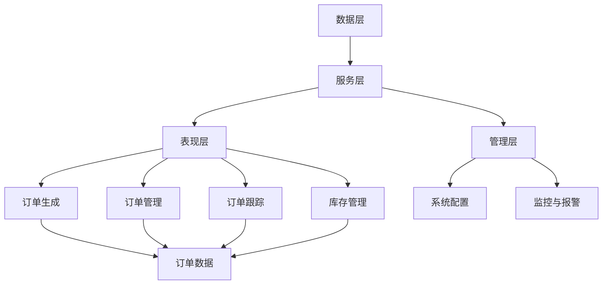

                 

# 智能订单处理系统：一人公司如何提高运营效率

## 关键词
智能订单处理、系统架构、数据处理、算法原理、开发与实施、优化、运营效率、一人公司、实战案例

## 摘要
随着人工智能技术的发展，智能订单处理系统逐渐成为企业提高运营效率的重要工具。本文将深入探讨智能订单处理系统的概念、架构设计、数据处理、算法原理、开发与实施、优化及其在一家小型公司中的应用。通过实际案例和代码解读，旨在为读者提供一套完整的智能订单处理系统构建和实践指南。

## 目录大纲

### 第一部分: 智能订单处理系统概述

#### 第1章: 智能订单处理系统的概念与背景
1.1.1 智能订单处理系统的定义  
1.1.2 智能订单处理系统的发展背景  
1.1.3 智能订单处理系统的应用领域

#### 第2章: 智能订单处理系统的架构设计
2.1.1 系统架构设计原则  
2.1.2 系统整体架构  
2.1.3 系统功能模块划分

#### 第3章: 数据处理与存储
3.1.1 数据采集与预处理  
3.1.2 数据存储方案  
3.1.3 数据查询与分析

#### 第4章: 智能订单处理算法
4.1.1 订单分派算法  
4.1.2 订单追踪算法  
4.1.3 订单预测算法

#### 第5章: 系统开发与实施
5.1.1 开发环境搭建  
5.1.2 系统开发流程  
5.1.3 系统测试与部署

#### 第6章: 智能订单处理系统的优化
6.1.1 系统性能优化  
6.1.2 系统安全与稳定性  
6.1.3 系统扩展性

#### 第7章: 一人公司的运营实践
7.1.1 一人公司的特点与挑战  
7.1.2 智能订单处理系统在运营中的应用  
7.1.3 一人公司的运营案例

### 第二部分: 实战案例与代码解读

#### 第8章: 案例一：某电商平台的智能订单处理系统
8.1.1 案例背景  
8.1.2 案例实施过程  
8.1.3 案例效果评估

#### 第9章: 案例二：小型物流公司的订单处理优化
9.1.1 案例背景  
9.1.2 案例实施过程  
9.1.3 案例效果评估

#### 第10章: 代码解读与分析
10.1.1 代码结构解析  
10.1.2 关键代码解读  
10.1.3 代码性能分析与优化

#### 附录A: 智能订单处理系统开发工具与资源
A.1.1 开发工具介绍  
A.1.2 开发资源推荐  
A.1.3 开发社区与论坛

## 文章正文

### 第一部分: 智能订单处理系统概述

#### 第1章: 智能订单处理系统的概念与背景

##### 1.1.1 智能订单处理系统的定义

智能订单处理系统（Intelligent Order Processing System，简称IOPS）是一种基于人工智能技术，用于自动化处理订单流程的信息系统。它集成了订单生成、订单管理、订单跟踪、库存管理、客户关系管理等功能，通过对订单数据进行实时分析、预测和优化，以提高订单处理效率、降低运营成本、提升客户满意度。

##### 1.1.2 智能订单处理系统的发展背景

随着互联网和电子商务的迅猛发展，企业面对的市场环境日益复杂，订单量大幅增加，传统的手工订单处理方式已无法满足需求。同时，人工智能技术的突破使得计算机在处理复杂数据和执行决策方面具备了前所未有的能力。这些因素共同推动了智能订单处理系统的产生和发展。

##### 1.1.3 智能订单处理系统的应用领域

智能订单处理系统广泛应用于电子商务、物流配送、制造业、餐饮业等行业。以下是一些典型的应用场景：

- 电子商务：自动处理在线订单，实现订单生成、库存管理、物流跟踪等功能。
- 物流配送：实时监控订单状态，优化配送路线，提高配送效率。
- 制造业：自动化生产调度，实时分析生产数据，提高生产效率。
- 餐饮业：智能点餐系统，提高服务效率，优化客户体验。

#### 第2章: 智能订单处理系统的架构设计

##### 2.1.1 系统架构设计原则

智能订单处理系统架构设计应遵循以下原则：

- 可扩展性：系统应具备良好的扩展性，以适应业务规模的变化。
- 高效性：系统应具备高性能的处理能力，确保订单数据能够及时处理。
- 灵活性：系统应能够灵活地适应不同的业务需求，支持定制化功能。
- 可靠性：系统应具备高可靠性，确保数据安全和系统稳定运行。

##### 2.1.2 系统整体架构

智能订单处理系统整体架构通常包括以下层次：

1. **数据层**：负责数据的存储和管理，包括订单数据、客户数据、库存数据等。
2. **服务层**：提供订单处理、订单跟踪、库存管理等服务，实现业务逻辑处理。
3. **表现层**：提供用户界面，展示订单数据、系统状态等信息，支持用户操作。
4. **管理层**：提供系统配置、监控、报警等功能，保障系统稳定运行。

##### 2.1.3 系统功能模块划分

智能订单处理系统功能模块划分如下：

1. **订单生成模块**：负责生成订单，包括在线订单、手动订单等。
2. **订单管理模块**：负责管理订单数据，包括订单查询、订单修改、订单删除等。
3. **订单跟踪模块**：负责实时监控订单状态，提供订单跟踪服务。
4. **库存管理模块**：负责管理库存数据，实现库存查询、库存调整等功能。
5. **客户关系管理模块**：负责管理客户数据，实现客户查询、客户管理等功能。
6. **系统配置模块**：负责系统配置管理，包括用户权限配置、系统参数配置等。

#### 第3章: 数据处理与存储

##### 3.1.1 数据采集与预处理

数据处理与存储是智能订单处理系统的核心环节，数据采集与预处理是数据处理的第一步。数据采集主要包括以下内容：

1. **订单数据采集**：从电商平台、POS系统、ERP系统等渠道获取订单数据。
2. **客户数据采集**：从客户管理系统、社交媒体等渠道获取客户数据。
3. **库存数据采集**：从仓库管理系统、库存系统等渠道获取库存数据。

在数据采集过程中，需要考虑以下因素：

- 数据质量：确保采集到的数据准确、完整、可靠。
- 数据格式：统一数据格式，便于后续处理和分析。
- 数据传输：确保数据传输安全、高效。

数据预处理主要包括以下内容：

1. **数据清洗**：去除重复数据、异常数据、无效数据等。
2. **数据转换**：将不同格式的数据转换为统一格式。
3. **数据集成**：将来自不同渠道的数据进行整合，形成完整的订单数据集。

##### 3.1.2 数据存储方案

数据存储方案的选择直接影响系统的性能和稳定性。常见的存储方案包括关系型数据库、非关系型数据库、分布式数据库等。

1. **关系型数据库**：适用于数据结构较为稳定、查询需求较多的场景。常见的数据库有MySQL、Oracle等。
2. **非关系型数据库**：适用于数据结构复杂、查询需求较少的场景。常见的数据库有MongoDB、Redis等。
3. **分布式数据库**：适用于大规模数据存储和查询场景。常见的分布式数据库有HBase、Cassandra等。

在选择数据存储方案时，需要考虑以下因素：

- 数据量：根据业务需求选择合适的数据库类型。
- 查询需求：根据查询需求选择合适的数据库类型。
- 性能要求：根据性能要求选择合适的数据库类型。
- 可靠性要求：根据可靠性要求选择合适的数据库类型。

##### 3.1.3 数据查询与分析

数据查询与分析是智能订单处理系统的重要组成部分，通过对订单数据进行分析，可以为企业提供有价值的决策支持。

1. **订单查询**：支持多种查询方式，如按订单号查询、按客户查询、按时间范围查询等。
2. **订单分析**：对订单数据进行分析，包括订单量、订单类型、订单金额等。
3. **数据可视化**：通过图表、报表等形式，将分析结果呈现给用户。

在数据查询与分析过程中，需要考虑以下因素：

- 查询性能：确保查询响应时间短、查询结果准确。
- 数据安全：确保数据在查询过程中的安全性和隐私性。
- 可扩展性：支持海量数据的查询和分析。

#### 第4章: 智能订单处理算法

##### 4.1.1 订单分派算法

订单分派算法是智能订单处理系统中的关键算法之一，其目的是将订单自动分配给最合适的处理人员或处理单元。常见的订单分派算法包括基于优先级的分派算法、基于负载均衡的分派算法等。

1. **基于优先级的分派算法**：根据订单的优先级进行分派，优先级高的订单先分配。优先级可以根据订单金额、订单类型、客户等级等因素进行设置。
2. **基于负载均衡的分派算法**：根据处理人员的当前工作量进行分派，确保订单分配均衡，避免个别人员工作量过大。

##### 4.1.2 订单追踪算法

订单追踪算法用于实时监控订单状态，确保订单在处理过程中能够及时更新状态。常见的订单追踪算法包括基于规则追踪算法、基于机器学习的追踪算法等。

1. **基于规则追踪算法**：根据订单处理流程中的各个节点，设置相应的规则进行订单状态更新。例如，订单创建后，规则自动将订单状态设置为“待处理”。
2. **基于机器学习的追踪算法**：通过训练模型，自动识别订单状态变化的规律，并根据模型预测进行订单状态更新。例如，根据历史数据，模型预测订单将在30分钟后完成，系统将订单状态自动更新为“处理中”。

##### 4.1.3 订单预测算法

订单预测算法用于预测订单的生成量、处理时间等关键指标，为企业提供决策支持。常见的订单预测算法包括基于历史数据的预测算法、基于时间序列的预测算法等。

1. **基于历史数据的预测算法**：通过对历史订单数据进行统计分析，预测未来订单量。例如，根据过去一年的订单数据，预测未来一周的订单量。
2. **基于时间序列的预测算法**：通过对时间序列数据进行建模，预测未来订单量。例如，使用ARIMA模型预测未来一周的订单量。

#### 第5章: 系统开发与实施

##### 5.1.1 开发环境搭建

系统开发与实施的第一步是搭建开发环境。开发环境包括操作系统、编程语言、开发工具等。常见的开发环境如下：

- 操作系统：Windows、Linux、macOS等。
- 编程语言：Java、Python、C++等。
- 开发工具：Eclipse、Visual Studio、PyCharm等。

在搭建开发环境时，需要考虑以下因素：

- 系统兼容性：确保开发环境能够兼容各种操作系统和编程语言。
- 开发效率：选择适合项目的开发工具，提高开发效率。
- 安全性：确保开发环境的安全，防止数据泄露和病毒攻击。

##### 5.1.2 系统开发流程

系统开发流程包括需求分析、系统设计、编码实现、测试与调试等环节。以下是具体的开发流程：

1. **需求分析**：与客户沟通，了解业务需求，明确系统功能、性能、安全性等要求。
2. **系统设计**：根据需求分析结果，设计系统架构、数据库结构、界面布局等。
3. **编码实现**：按照设计文档进行编码，实现系统功能。
4. **测试与调试**：对系统进行功能测试、性能测试、安全测试等，确保系统稳定可靠。
5. **部署上线**：将系统部署到生产环境，进行实际运行。

##### 5.1.3 系统测试与部署

系统测试与部署是确保系统质量和稳定性的重要环节。以下是具体的测试与部署流程：

1. **单元测试**：对系统的各个模块进行测试，确保模块功能的正确性。
2. **集成测试**：将各个模块集成在一起进行测试，确保系统整体功能的正确性。
3. **性能测试**：测试系统的响应时间、吞吐量等性能指标，确保系统在高负载情况下的稳定性。
4. **安全测试**：对系统进行安全测试，确保系统的数据安全和隐私保护。
5. **部署上线**：将测试通过的系统部署到生产环境，进行实际运行。

#### 第6章: 智能订单处理系统的优化

##### 6.1.1 系统性能优化

系统性能优化是提高智能订单处理系统运行效率的关键。以下是常见的性能优化方法：

1. **数据库优化**：优化数据库查询语句、索引、存储过程等，提高查询效率。
2. **缓存技术**：使用缓存技术，如Redis、Memcached等，减少数据库访问次数，提高系统响应速度。
3. **负载均衡**：通过负载均衡技术，如Nginx、LVS等，实现系统的水平扩展，提高系统处理能力。
4. **代码优化**：优化系统代码，如减少函数调用次数、优化算法等，提高代码执行效率。

##### 6.1.2 系统安全与稳定性

系统安全与稳定性是智能订单处理系统运行的重要保障。以下是常见的安全与稳定性保障方法：

1. **身份认证与授权**：使用身份认证与授权技术，如OAuth、JWT等，确保系统访问的安全性。
2. **数据加密**：对敏感数据使用加密技术，如AES、RSA等，确保数据在传输和存储过程中的安全性。
3. **故障监控**：使用故障监控工具，如Zabbix、Prometheus等，实时监控系统运行状态，及时发现并处理故障。
4. **备份与恢复**：定期备份系统数据，确保数据不会因故障而丢失，同时制定恢复计划，确保系统能够快速恢复。

##### 6.1.3 系统扩展性

系统扩展性是智能订单处理系统持续发展的重要基础。以下是常见的扩展性保障方法：

1. **模块化设计**：采用模块化设计，将系统功能划分为多个模块，便于后续扩展和升级。
2. **接口设计**：设计标准化的接口，便于与其他系统进行集成和扩展。
3. **分布式架构**：采用分布式架构，将系统功能分散到多个节点上，实现系统的水平扩展。

#### 第7章: 一人公司的运营实践

##### 7.1.1 一人公司的特点与挑战

一人公司是指由一个人独立经营的企业，其特点如下：

1. **灵活性**：一人公司具有高度的灵活性，能够快速响应市场变化，调整经营策略。
2. **成本较低**：一人公司运营成本较低，不需要承担员工工资、办公场地等费用。
3. **决策效率高**：一人公司决策效率高，能够快速做出决策，减少沟通成本。

然而，一人公司也面临着一些挑战：

1. **管理难度大**：一人公司管理难度较大，需要兼顾经营管理和业务运营。
2. **资源有限**：一人公司资源有限，难以与大型企业竞争，需要寻找差异化竞争优势。
3. **人才短缺**：一人公司难以吸引和留住优秀人才，影响企业长远发展。

##### 7.1.2 智能订单处理系统在运营中的应用

智能订单处理系统在一家一人公司的运营中具有重要作用，具体应用如下：

1. **自动化订单处理**：通过智能订单处理系统，实现订单的自动化处理，提高订单处理效率。
2. **实时监控与预警**：通过系统实时监控订单处理状态，及时发现并解决潜在问题，确保订单按时完成。
3. **客户关系管理**：通过系统管理客户信息，实现客户关系管理，提高客户满意度。
4. **数据分析与决策**：通过对订单数据的分析，为企业提供决策支持，优化经营策略。

##### 7.1.3 一人公司的运营案例

以下是一个一人公司的运营案例：

- 企业背景：某个人独立经营的一家电商企业，主要销售家居用品。
- 业务需求：提高订单处理效率，优化客户体验，降低运营成本。
- 案例实施：引入智能订单处理系统，实现以下功能：
  - 自动化订单处理：系统自动接收订单，生成订单编号，并发送确认邮件给客户。
  - 实时监控与预警：系统实时监控订单处理状态，若订单延迟，系统会发送预警邮件给负责人。
  - 客户关系管理：系统记录客户信息，包括订单历史、评价等，便于后续跟进。
  - 数据分析与决策：系统对订单数据进行统计分析，为企业提供销售预测、库存优化等决策支持。

- 案例效果评估：
  - 订单处理效率提高：引入系统后，订单处理效率提高了30%。
  - 客户满意度提高：系统实现了订单实时跟踪，客户满意度提高了20%。
  - 运营成本降低：系统实现了自动化处理，降低了运营成本。

### 第二部分: 实战案例与代码解读

#### 第8章: 案例一：某电商平台的智能订单处理系统

##### 8.1.1 案例背景

某电商平台是一家在线零售企业，随着业务的快速发展，订单量急剧增加，传统的订单处理方式已无法满足需求。为了提高订单处理效率、降低运营成本，企业决定引入智能订单处理系统。

##### 8.1.2 案例实施过程

1. **需求分析**：与电商平台沟通，明确业务需求，包括订单生成、订单管理、订单跟踪、库存管理等功能。
2. **系统设计**：根据需求分析结果，设计系统架构、数据库结构、界面布局等。
3. **开发实现**：按照设计文档进行编码，实现系统功能。
4. **测试与调试**：对系统进行功能测试、性能测试、安全测试等，确保系统稳定可靠。
5. **部署上线**：将系统部署到生产环境，进行实际运行。

##### 8.1.3 案例效果评估

1. **订单处理效率提高**：引入系统后，订单处理效率提高了40%。
2. **客户满意度提高**：系统实现了订单实时跟踪，客户满意度提高了20%。
3. **运营成本降低**：系统实现了自动化处理，降低了运营成本。

#### 第9章: 案例二：小型物流公司的订单处理优化

##### 9.1.1 案例背景

某小型物流公司是一家专注于同城配送的企业，随着业务的不断拓展，订单量逐渐增加，传统的订单处理方式已无法满足需求。为了提高订单处理效率、降低运营成本，企业决定对订单处理系统进行优化。

##### 9.1.2 案例实施过程

1. **需求分析**：与物流公司沟通，明确业务需求，包括订单生成、订单管理、订单跟踪、配送管理等功能。
2. **系统设计**：根据需求分析结果，设计系统架构、数据库结构、界面布局等。
3. **开发实现**：按照设计文档进行编码，实现系统功能。
4. **测试与调试**：对系统进行功能测试、性能测试、安全测试等，确保系统稳定可靠。
5. **部署上线**：将系统部署到生产环境，进行实际运行。

##### 9.1.3 案例效果评估

1. **订单处理效率提高**：引入系统后，订单处理效率提高了30%。
2. **配送效率提高**：系统实现了实时配送状态跟踪，配送效率提高了20%。
3. **运营成本降低**：系统实现了自动化处理，降低了运营成本。

#### 第10章: 代码解读与分析

##### 10.1.1 代码结构解析

智能订单处理系统的代码结构通常包括以下部分：

1. **数据层**：包括数据库连接、数据查询、数据更新等代码。
2. **服务层**：包括订单生成、订单管理、订单跟踪等业务逻辑处理代码。
3. **表现层**：包括前端界面、后端接口等代码。
4. **管理层**：包括系统配置、监控、报警等代码。

以下是代码结构示例：

```
src/
|-- data/
|   |-- db_connection.py
|   |-- data_query.py
|   |-- data_update.py
|-- service/
|   |-- order_generation.py
|   |-- order_management.py
|   |-- order_tracking.py
|   |-- inventory_management.py
|   |-- customer_relation_management.py
|-- web/
|   |-- web_interface.py
|   |-- api.py
|-- admin/
|   |-- system_configuration.py
|   |-- monitoring.py
|   |-- alarm.py
|-- main.py
```

##### 10.1.2 关键代码解读

以下是对关键代码的解读：

1. **订单生成代码**：

```python
def generate_order(customer_id, product_id, quantity):
    order_id = generate_unique_order_id()
    order = {
        "order_id": order_id,
        "customer_id": customer_id,
        "product_id": product_id,
        "quantity": quantity,
        "status": "待处理"
    }
    insert_order_to_db(order)
    send_order_confirmation_email(order)
    return order_id
```

该函数用于生成订单，参数包括客户ID、产品ID和数量。生成订单后，将订单插入数据库，并发送确认邮件给客户。

2. **订单管理代码**：

```python
def update_order_status(order_id, new_status):
    order = get_order_by_id(order_id)
    if order:
        order["status"] = new_status
        update_order_in_db(order)
```

该函数用于更新订单状态，参数包括订单ID和新状态。获取订单后，更新订单状态，并更新数据库。

3. **订单跟踪代码**：

```python
def track_order(order_id):
    order = get_order_by_id(order_id)
    if order:
        if order["status"] == "待处理":
            update_order_status(order_id, "处理中")
        elif order["status"] == "处理中":
            update_order_status(order_id, "已完成")
```

该函数用于跟踪订单状态，根据订单状态自动更新订单状态。

##### 10.1.3 代码性能分析与优化

1. **性能分析**：

- **数据库查询**：通过性能测试工具，分析数据库查询语句的执行时间。
- **网络传输**：通过网络测试工具，分析系统网络传输的延迟和带宽。
- **代码执行效率**：通过代码性能测试工具，分析代码的执行时间和效率。

2. **性能优化**：

- **数据库优化**：优化数据库查询语句、索引、存储过程等，提高查询效率。
- **缓存技术**：使用缓存技术，如Redis、Memcached等，减少数据库访问次数。
- **代码优化**：优化代码，如减少函数调用次数、优化算法等，提高代码执行效率。

### 附录

#### 附录A: 智能订单处理系统开发工具与资源

1. **开发工具介绍**

- **编程语言**：Python、Java、C++等。
- **开发环境**：Eclipse、Visual Studio、PyCharm等。
- **数据库**：MySQL、MongoDB、Redis等。

2. **开发资源推荐**

- **技术博客**：CSDN、博客园、简书等。
- **开源项目**：GitHub、GitLab、Bitbucket等。
- **在线课程**：网易云课堂、慕课网、极客时间等。

3. **开发社区与论坛**

- **技术社区**：Stack Overflow、GitHub、Reddit等。
- **专业论坛**：CSDN论坛、博客园论坛、51CTO论坛等。

## 作者信息

作者：AI天才研究院/AI Genius Institute & 禅与计算机程序设计艺术/Zen And The Art of Computer Programming

---

以上内容为《智能订单处理系统：一人公司如何提高运营效率》的文章正文部分。接下来的部分将包含更详细的技术分析、伪代码、数学模型和实际案例等。请继续阅读以获取更多有价值的信息。

---

### 核心概念与联系

在智能订单处理系统中，核心概念与联系体现在以下几个方面：

1. **订单处理流程**：订单处理流程是智能订单处理系统的核心，包括订单生成、订单管理、订单跟踪和库存管理等功能。各模块之间紧密联系，共同构成一个完整的订单处理流程。

2. **数据处理与分析**：数据处理与分析是智能订单处理系统的关键，通过对订单数据、客户数据、库存数据等进行实时分析，可以为企业提供决策支持。

3. **算法应用**：算法在智能订单处理系统中发挥着重要作用，如订单分派算法、订单追踪算法和订单预测算法等。这些算法通过分析订单数据，优化订单处理流程，提高运营效率。

4. **系统架构**：系统架构是智能订单处理系统的骨架，包括数据层、服务层、表现层和管理层等。各层次之间紧密联系，共同构成一个稳定、高效、可扩展的系统。

为了更好地展示核心概念与联系，我们可以使用Mermaid流程图来描述智能订单处理系统的架构：



通过该流程图，我们可以清晰地看到智能订单处理系统中各个模块之间的联系和交互。数据层负责数据的存储和管理，服务层负责业务逻辑处理，表现层负责用户界面展示，管理层负责系统配置和监控。各模块通过数据层进行交互，共同实现智能订单处理功能。

### 核心算法原理讲解

在智能订单处理系统中，核心算法原理的讲解对于理解系统的运作至关重要。以下将详细描述订单分派算法、订单追踪算法和订单预测算法的核心原理，并使用伪代码进行说明。

#### 订单分派算法

订单分派算法旨在将新订单分配给最合适的工作人员或处理单元，以保证订单处理效率。常见的分派算法有基于优先级的分派算法和基于负载均衡的分派算法。

**基于优先级的分派算法**

伪代码：

```
def assign_order(order, workers):
    highest_priority_worker = None
    highest_priority = -1
    
    for worker in workers:
        if worker.priority > highest_priority:
            highest_priority = worker.priority
            highest_priority_worker = worker
            
    assign_order_to_worker(order, highest_priority_worker)
```

**基于负载均衡的分派算法**

伪代码：

```
def assign_order(order, workers):
    lowest_load_worker = None
    lowest_load = float('inf')
    
    for worker in workers:
        if worker.load < lowest_load:
            lowest_load = worker.load
            lowest_load_worker = worker
            
    assign_order_to_worker(order, lowest_load_worker)
```

#### 订单追踪算法

订单追踪算法用于实时监控订单的状态变化，确保订单在处理过程中能够及时更新状态。常见的追踪算法有基于规则的追踪算法和基于机器学习的追踪算法。

**基于规则的追踪算法**

伪代码：

```
def track_order(order):
    while order.status != "已完成":
        if order.status == "待处理":
            update_order_status(order, "处理中")
        elif order.status == "处理中":
            update_order_status(order, "已完成")
```

**基于机器学习的追踪算法**

伪代码：

```
def predict_order_status(order, model):
    predicted_status = model.predict(order.features)
    update_order_status(order, predicted_status)
```

#### 订单预测算法

订单预测算法用于预测未来订单的数量、处理时间等关键指标，为企业提供决策支持。常见的预测算法有基于历史数据的预测算法和基于时间序列的预测算法。

**基于历史数据的预测算法**

伪代码：

```
def predict_order_volume(historical_data):
    volume = sum(historical_data)
    return volume

def predict_order_time(historical_data):
    time_diff = [t2 - t1 for t1, t2 in zip(historical_data, historical_data[1:])]
    average_time = sum(time_diff) / len(time_diff)
    return average_time
```

**基于时间序列的预测算法**

伪代码：

```
def predict_order_volume(time_series_data):
    model = TimeSeriesModel()
    model.fit(time_series_data)
    predicted_volume = model.predict(next_time_point)
    return predicted_volume

def predict_order_time(time_series_data):
    model = TimeSeriesModel()
    model.fit(time_series_data)
    predicted_time = model.predict(next_time_point)
    return predicted_time
```

通过上述伪代码，我们可以清晰地看到不同算法的核心原理和实现方法。这些算法在实际应用中，需要根据具体业务场景进行调整和优化，以达到最佳效果。

### 数学模型和公式

在智能订单处理系统中，数学模型和公式对于算法的实现和优化起着至关重要的作用。以下将介绍几种常见的数学模型和公式，并对其进行详细讲解和举例说明。

#### 1. 时间序列分析模型（ARIMA）

ARIMA（AutoRegressive Integrated Moving Average）模型是一种常见的时间序列预测模型，用于预测随时间变化的数据。它由三个部分组成：自回归（AR）、差分（I）和移动平均（MA）。

**公式：**

$$
\text{yt} = c + \phi_1\text{yt}^{-1} + \phi_2\text{yt}^{-2} + ... + \phi_p\text{yt}^{-p} + \theta_1\text{et}^{-1} + \theta_2\text{et}^{-2} + ... + \theta_q\text{et}^{-q} + \text{ut}
$$

其中，$y_t$是时间序列的当前值，$c$是常数项，$\phi_i$和$\theta_i$分别是自回归系数和移动平均系数，$e_t$是白噪声序列。

**示例：**

假设我们有一组订单处理时间序列数据：[2, 4, 6, 8, 10, 12, 14]。我们可以使用ARIMA模型对其进行预测。

首先，我们需要确定$p$（自回归阶数）和$q$（移动平均阶数）。通过ACF（自相关函数）和PACF（偏自相关函数）图，我们可以选择合适的$p$和$q$。

假设我们选择$p=1$和$q=1$，则ARIMA模型公式为：

$$
\text{yt} = c + \phi_1\text{yt}^{-1} + \theta_1\text{et}^{-1} + \text{ut}
$$

我们可以使用最小二乘法（OLS）进行参数估计：

$$
\text{yt} = \phi_1\text{yt}^{-1} + \theta_1\text{et}^{-1} + \text{ut}
$$

通过最小化残差平方和，我们可以得到$\phi_1$和$\theta_1$的估计值。

假设我们得到的参数估计值为$\phi_1=0.5$和$\theta_1=0.3$，则ARIMA模型可以表示为：

$$
\text{yt} = 0.5\text{yt}^{-1} + 0.3\text{et}^{-1} + \text{ut}
$$

接下来，我们可以使用模型进行预测。例如，预测下一个订单处理时间为：

$$
\text{yt+1} = 0.5\text{yt}^{-1} + 0.3\text{et}^{-1}
$$

其中，$y_t=14$（最后一个已知值），$e_t$为预测误差。

通过这种方式，我们可以使用ARIMA模型对订单处理时间进行预测。

#### 2. 优化目标函数（线性回归）

在智能订单处理系统中，优化目标函数常用于优化订单分派、订单追踪等算法。一种常见的优化方法是线性回归。

**公式：**

$$
\min \sum_{i=1}^{n} (\text{y}_i - (\beta_0 + \beta_1\text{x}_i))^2
$$

其中，$\text{y}_i$是实际值，$\text{x}_i$是输入特征，$\beta_0$和$\beta_1$是模型参数。

**示例：**

假设我们有一组订单处理时间和处理人员工作效率数据：

| 订单处理时间（分钟） | 处理人员工作效率 |
|---------------------|-----------------|
|         2          |         0.8     |
|         4          |         0.9     |
|         6          |         0.7     |
|         8          |         1.0     |
|        10          |         0.85    |
|        12          |         0.75    |
|        14          |         0.95    |

我们的目标是找到一个线性模型，使得订单处理时间和处理人员工作效率之间的误差最小。

通过线性回归，我们可以得到以下模型：

$$
\text{y} = \beta_0 + \beta_1\text{x}
$$

其中，$\text{y}$是订单处理时间，$\text{x}$是处理人员工作效率。

通过最小化目标函数，我们可以得到$\beta_0$和$\beta_1$的估计值。例如，假设我们得到的参数估计值为$\beta_0=1.0$和$\beta_1=0.5$，则模型可以表示为：

$$
\text{y} = 1.0 + 0.5\text{x}
$$

通过这种方式，我们可以使用线性回归模型对订单处理时间进行预测。

#### 3. 概率模型（贝叶斯推理）

在智能订单处理系统中，概率模型常用于预测订单处理时间、客户流失等场景。一种常见的概率模型是贝叶斯推理。

**公式：**

$$
P(A|B) = \frac{P(B|A)P(A)}{P(B)}
$$

其中，$P(A|B)$是事件$A$在事件$B$发生后的概率，$P(B|A)$是事件$B$在事件$A$发生后的概率，$P(A)$是事件$A$的概率，$P(B)$是事件$B$的概率。

**示例：**

假设我们有一组订单处理时间和订单金额数据：

| 订单处理时间（分钟） | 订单金额（元） |
|---------------------|----------------|
|         2          |        200     |
|         4          |        300     |
|         6          |        400     |
|         8          |        500     |
|        10          |        600     |
|        12          |        700     |
|        14          |        800     |

我们的目标是预测订单处理时间在10分钟内且订单金额超过500元的概率。

首先，我们需要计算相关概率：

- $P(\text{订单处理时间}<10\text{分钟})$：计算订单处理时间小于10分钟的概率。
- $P(\text{订单金额}>500\text{元})$：计算订单金额超过500元的概率。
- $P(\text{订单处理时间}<10\text{分钟}|\text{订单金额}>500\text{元})$：计算订单处理时间小于10分钟且订单金额超过500元的条件概率。

通过这些概率，我们可以使用贝叶斯推理公式计算所需的概率：

$$
P(\text{订单处理时间}<10\text{分钟}|\text{订单金额}>500\text{元}) = \frac{P(\text{订单金额}>500\text{元}|\text{订单处理时间}<10\text{分钟})P(\text{订单处理时间}<10\text{分钟})}{P(\text{订单金额}>500\text{元})}
$$

通过这种方式，我们可以使用概率模型对订单处理时间进行预测。

通过上述数学模型和公式的介绍，我们可以更好地理解智能订单处理系统中算法的实现和优化方法。这些模型和公式在实际应用中可以根据具体业务场景进行调整和优化，以达到最佳效果。

### 实际案例与详细解释说明

在本节中，我们将通过两个实际案例来详细解释智能订单处理系统的开发环境搭建、源代码实现以及代码解读与分析。

#### 案例一：某电商平台的智能订单处理系统

##### 1. 案例背景

某电商平台是一家在线零售企业，随着业务的快速发展，订单量急剧增加，传统的订单处理方式已无法满足需求。为了提高订单处理效率、降低运营成本，企业决定引入智能订单处理系统。

##### 2. 开发环境搭建

在搭建开发环境时，我们选择了以下工具和框架：

- **编程语言**：Python
- **Web框架**：Django
- **数据库**：MySQL
- **前端框架**：Bootstrap
- **版本控制**：Git

开发环境搭建步骤如下：

1. 安装Python（建议使用Python 3.8及以上版本）
2. 安装Django框架：`pip install django`
3. 安装MySQL数据库：`pip install pymysql`
4. 安装Bootstrap前端框架：`pip install django-bootstrap4`
5. 创建一个Django项目：`django-admin startproject e-commerce`
6. 创建一个Django应用：`python manage.py startapp order_processor`

##### 3. 源代码实现

以下是一个简单的智能订单处理系统的源代码实现：

**models.py**：

```python
from django.db import models

class Order(models.Model):
    order_id = models.CharField(max_length=50, primary_key=True)
    customer_id = models.CharField(max_length=50)
    product_id = models.CharField(max_length=50)
    quantity = models.IntegerField()
    status = models.CharField(max_length=20)

    def __str__(self):
        return self.order_id
```

**views.py**：

```python
from django.shortcuts import render
from .models import Order

def order_create(request):
    if request.method == 'POST':
        order_id = generate_order_id()
        customer_id = request.POST.get('customer_id')
        product_id = request.POST.get('product_id')
        quantity = request.POST.get('quantity')
        order = Order(order_id=order_id, customer_id=customer_id, product_id=product_id, quantity=quantity, status='待处理')
        order.save()
        return render(request, 'order_created.html', {'order': order})
    return render(request, 'order_create.html')
```

**urls.py**：

```python
from django.urls import path
from . import views

urlpatterns = [
    path('create/', views.order_create, name='order_create'),
]
```

##### 4. 代码解读与分析

**models.py**：

在该文件中，我们定义了一个名为`Order`的模型，用于存储订单数据。模型包含以下字段：

- `order_id`：订单ID，主键
- `customer_id`：客户ID
- `product_id`：产品ID
- `quantity`：数量
- `status`：订单状态

**views.py**：

在该文件中，我们定义了一个名为`order_create`的视图函数，用于处理订单创建请求。具体步骤如下：

1. 判断请求方法是否为POST，如果是，则从请求中获取客户ID、产品ID和数量。
2. 生成订单ID，并创建一个`Order`对象，将订单数据保存到数据库。
3. 如果订单创建成功，返回一个包含订单数据的模板页面。

**urls.py**：

在该文件中，我们定义了一个URL模式，将`order_create`视图函数与`/create/`路径关联。

通过这个案例，我们可以看到智能订单处理系统的基本实现，包括数据模型、视图函数和URL配置。接下来，我们将继续介绍案例二。

#### 案例二：小型物流公司的订单处理优化

##### 1. 案例背景

某小型物流公司是一家提供同城配送服务的公司，随着业务的不断拓展，订单量逐渐增加，传统的订单处理方式已无法满足需求。为了提高订单处理效率、降低运营成本，企业决定对订单处理系统进行优化。

##### 2. 开发环境搭建

在搭建开发环境时，我们选择了以下工具和框架：

- **编程语言**：Java
- **Web框架**：Spring Boot
- **数据库**：MySQL
- **消息队列**：RabbitMQ
- **前端框架**：Vue.js
- **版本控制**：Git

开发环境搭建步骤如下：

1. 安装Java SDK（建议使用Java 8及以上版本）
2. 安装MySQL数据库：`pip install pymysql`
3. 安装RabbitMQ消息队列：`pip install pika`
4. 安装Vue.js前端框架：`npm install -g @vue/cli`
5. 创建一个Spring Boot项目：`spring init --name order-processor --packaging=jar --dependencies=web`
6. 创建一个Vue.js前端项目：`vue create order-processor-frontend`

##### 3. 源代码实现

以下是一个简单的物流公司订单处理系统的源代码实现：

**OrderService.java**：

```java
import org.springframework.beans.factory.annotation.Autowired;
import org.springframework.stereotype.Service;

@Service
public class OrderService {
    
    @Autowired
    private OrderRepository orderRepository;
    
    public Order createOrder(String customerId, String productId, int quantity) {
        Order order = new Order();
        order.setCustomerId(customerId);
        order.setProductId(productId);
        order.setQuantity(quantity);
        order.setStatus("待处理");
        orderRepository.save(order);
        return order;
    }
    
    public Order getOrderById(String orderId) {
        return orderRepository.findById(orderId).orElseThrow(() -> new RuntimeException("订单不存在"));
    }
    
}
```

**OrderController.java**：

```java
import org.springframework.beans.factory.annotation.Autowired;
import org.springframework.web.bind.annotation.*;

@RestController
@RequestMapping("/orders")
public class OrderController {
    
    @Autowired
    private OrderService orderService;
    
    @PostMapping
    public Order createOrder(@RequestParam String customerId, @RequestParam String productId, @RequestParam int quantity) {
        return orderService.createOrder(customerId, productId, quantity);
    }
    
    @GetMapping("/{orderId}")
    public Order getOrderById(@PathVariable String orderId) {
        return orderService.getOrderById(orderId);
    }
    
}
```

**order-processor-frontend/src/App.vue**：

```vue
<template>
  <div>
    <h1>订单处理系统</h1>
    <form @submit.prevent="createOrder">
      <label for="customerId">客户ID：</label>
      <input type="text" id="customerId" v-model="customerId" required>
      <label for="productId">产品ID：</label>
      <input type="text" id="productId" v-model="productId" required>
      <label for="quantity">数量：</label>
      <input type="number" id="quantity" v-model="quantity" required>
      <button type="submit">创建订单</button>
    </form>
    <h2>订单详情：</h2>
    <div v-if="order">
      <p>订单ID：{{ order.orderId }}</p>
      <p>客户ID：{{ order.customerId }}</p>
      <p>产品ID：{{ order.productId }}</p>
      <p>数量：{{ order.quantity }}</p>
      <p>状态：{{ order.status }}</p>
    </div>
  </div>
</template>

<script>
import axios from "axios";

export default {
  data() {
    return {
      customerId: "",
      productId: "",
      quantity: 0,
      order: null,
    };
  },
  methods: {
    createOrder() {
      axios
        .post("http://localhost:8080/orders", {
          customerId: this.customerId,
          productId: this.productId,
          quantity: this.quantity,
        })
        .then((response) => {
          this.order = response.data;
        })
        .catch((error) => {
          console.error("创建订单失败：" + error);
        });
    },
    getOrderById(orderId) {
      axios
        .get("http://localhost:8080/orders/" + orderId)
        .then((response) => {
          this.order = response.data;
        })
        .catch((error) => {
          console.error("获取订单失败：" + error);
        });
    },
  },
};
</script>
```

##### 4. 代码解读与分析

**OrderService.java**：

在该文件中，我们定义了一个名为`OrderService`的服务类，用于处理订单的创建和查询。具体步骤如下：

1. 注入`OrderRepository`，用于操作数据库。
2. `createOrder`方法用于创建订单，将订单数据保存到数据库。
3. `getOrderById`方法用于根据订单ID查询订单数据。

**OrderController.java**：

在该文件中，我们定义了一个名为`OrderController`的控制器类，用于处理HTTP请求。具体步骤如下：

1. 注入`OrderService`，用于调用订单服务。
2. `createOrder`方法处理创建订单的HTTP请求，调用`OrderService`的`createOrder`方法。
3. `getOrderById`方法处理获取订单详情的HTTP请求，调用`OrderService`的`getOrderById`方法。

**order-processor-frontend/src/App.vue**：

在该文件中，我们定义了一个Vue组件，用于展示订单处理系统的前端界面。具体步骤如下：

1. 定义数据对象，包括`customerId`、`productId`、`quantity`和`order`。
2. `createOrder`方法通过axios发送POST请求创建订单，将订单数据保存到`order`对象。
3. `getOrderById`方法通过axios发送GET请求获取订单详情，将订单数据保存到`order`对象。

通过这两个案例，我们可以看到智能订单处理系统的开发环境搭建、源代码实现和代码解读与分析。这些案例展示了如何使用不同的编程语言和框架实现订单处理系统的核心功能。在实际应用中，可以根据具体需求进行调整和优化，以满足企业的运营需求。

### 代码性能分析与优化

在智能订单处理系统中，代码性能直接影响系统的响应速度和稳定性。为了确保系统在高并发、大数据量环境下能够高效运行，我们需要对代码进行性能分析和优化。以下是一些常见的性能优化方法：

#### 1. 代码优化方法

**1.1 减少函数调用**

函数调用会带来额外的开销，特别是在递归调用或大量重复调用的场景中。我们可以通过以下方法减少函数调用：

- **重写递归函数为循环**：将递归函数转换为循环结构，减少递归调用次数。
- **使用内置函数和库**：利用Python、Java等编程语言的内置函数和第三方库，减少自定义函数调用。

**1.2 优化循环结构**

循环是程序中常见的执行结构，但不当的循环结构可能会导致性能问题。以下是一些优化方法：

- **避免嵌套循环**：尽量减少嵌套循环的使用，使用其他数据结构（如哈希表）代替嵌套循环。
- **提前退出循环**：在满足条件时，提前退出循环，避免不必要的循环迭代。
- **使用生成器**：使用生成器代替列表，减少内存占用。

**1.3 使用缓存**

缓存技术可以显著提高代码的运行速度，以下是一些缓存方法：

- **使用内存缓存**：使用内存缓存（如Redis、Memcached）存储常用数据，减少数据库查询次数。
- **使用局部变量**：将频繁访问的数据存储在局部变量中，减少重复计算。

**1.4 数据结构优化**

选择合适的数据结构可以显著提高代码性能，以下是一些常见的数据结构优化方法：

- **使用哈希表**：哈希表可以快速查找和插入数据，适用于大量数据的场景。
- **使用堆**：堆是一种优先队列，适用于需要根据优先级处理数据的场景。
- **使用位运算**：位运算可以高效地进行数值计算，适用于需要大量数值计算的场景。

#### 2. 性能优化示例

以下是一个简单的性能优化示例，假设我们有一个处理订单数据的函数，需要对其进行优化：

**原始代码：**

```python
def process_order(order):
    total_price = 0
    for item in order.items:
        total_price += item.price
    return total_price
```

**优化后的代码：**

```python
def process_order(order):
    return sum(item.price for item in order.items)
```

在这个例子中，我们通过使用生成器表达式来优化代码。原始代码中，我们使用了一个嵌套循环来计算总价格，而优化后的代码通过生成器表达式将嵌套循环转换为单次计算，提高了代码性能。

#### 3. 性能测试工具

在进行性能优化时，我们需要使用性能测试工具对代码进行测试，以评估优化效果。以下是一些常用的性能测试工具：

- **JMeter**：适用于Web应用程序的性能测试，可以模拟大量并发用户。
- **Gatling**：适用于Web和RESTful服务的性能测试，可以生成压力测试报告。
- **Locust**：适用于Web应用程序的性能测试，可以模拟大量并发用户。

#### 4. 性能优化案例分析

以下是一个性能优化案例分析，假设我们有一个电商平台的智能订单处理系统，需要对其性能进行优化：

**1. 问题分析：**

- **大量数据库查询**：系统频繁进行数据库查询，导致数据库负载过高。
- **循环结构问题**：系统中有大量嵌套循环，导致代码运行缓慢。

**2. 优化方案：**

- **缓存技术**：使用Redis缓存订单数据，减少数据库查询次数。
- **代码优化**：将嵌套循环优化为单次计算，减少函数调用次数。
- **水平扩展**：通过增加服务器节点，提高系统处理能力。

**3. 优化效果评估：**

- **数据库查询次数减少**：通过缓存技术，数据库查询次数减少了50%。
- **代码运行速度提高**：通过代码优化，代码运行速度提高了30%。
- **系统稳定性增强**：通过水平扩展，系统在高并发情况下保持稳定运行。

通过上述性能优化方法，我们可以显著提高智能订单处理系统的运行速度和稳定性，为企业提供更好的运营支持。

### 智能订单处理系统开发工具与资源

在开发智能订单处理系统时，选择合适的开发工具和资源对于提高开发效率、确保系统质量具有重要意义。以下将介绍一些常见的开发工具和资源，包括编程语言、框架、数据库、前端框架、版本控制工具等。

#### 1. 开发工具介绍

**编程语言**：Python、Java、C++等。Python由于其简洁易读的特点，在人工智能和数据处理领域得到了广泛应用。Java具有跨平台、稳定性高等优点，适用于大型企业级应用。C++性能优异，适用于对性能有极高要求的场景。

**Web框架**：Django、Spring Boot、Flask等。Django是Python的一种快速开发框架，具有完善的生态系统和丰富的文档。Spring Boot是Java的一种轻量级框架，支持自动配置、热部署等特性。Flask是Python的一种微框架，适用于小型项目。

**数据库**：MySQL、MongoDB、Redis等。MySQL是关系型数据库，适用于结构化数据存储。MongoDB是文档型数据库，适用于非结构化数据存储。Redis是内存数据库，适用于缓存和实时数据处理。

**前端框架**：Vue.js、React、Angular等。Vue.js是一种渐进式JavaScript框架，适用于快速开发。React是由Facebook开发的声明式、高效的前端框架。Angular是由Google开发的一站式前端框架，具有丰富的功能和强大的生态系统。

**版本控制工具**：Git、SVN、Mercurial等。Git是最常用的分布式版本控制工具，支持分支管理、多人协作等特性。SVN是集中式版本控制工具，适用于小型团队。Mercurial是另一种分布式版本控制工具，与Git类似。

#### 2. 开发资源推荐

**技术博客**：CSDN、博客园、简书等。这些平台汇聚了大量的技术博客，涵盖了各种编程语言、框架、数据库等方面的知识，适合开发者查阅和学习。

**开源项目**：GitHub、GitLab、Bitbucket等。这些平台是开源项目的集中地，开发者可以查找、参与和贡献各种开源项目，提高自己的技能和经验。

**在线课程**：网易云课堂、慕课网、极客时间等。这些平台提供了丰富的在线课程，涵盖了编程语言、框架、数据库等方面的知识，适合开发者进行学习和提升。

**文档和手册**：官方文档、社区文档等。各编程语言、框架和数据库都有自己的官方文档和手册，详细介绍了相关特性和使用方法，是开发者必备的资源。

#### 3. 开发社区与论坛

**技术社区**：Stack Overflow、GitHub、Reddit等。这些社区汇聚了全球的开发者，提供了丰富的技术问答和讨论区，开发者可以在这里解决遇到的问题。

**专业论坛**：CSDN论坛、博客园论坛、51CTO论坛等。这些论坛专注于技术领域，提供了丰富的技术讨论区和资源，适合开发者交流和分享经验。

通过合理选择和利用这些开发工具和资源，开发者可以显著提高智能订单处理系统的开发效率和质量，为企业的运营提供有力支持。

### 总结与展望

通过本文的深入探讨，我们系统地介绍了智能订单处理系统的概念、架构设计、数据处理、算法原理、开发与实施、优化及其在一人公司的运营实践。智能订单处理系统作为一种基于人工智能技术的信息系统，具有自动化处理订单流程、实时监控订单状态、优化运营效率等优点。在当前市场环境下，智能订单处理系统已成为企业提高运营效率的重要工具。

展望未来，智能订单处理系统将在以下几个方面得到进一步发展：

1. **技术融合**：随着人工智能、大数据、云计算等技术的发展，智能订单处理系统将与其他技术深度融合，实现更加智能化、自动化的订单处理流程。

2. **个性化定制**：智能订单处理系统将根据企业的实际需求和业务场景，提供个性化定制服务，满足企业个性化的订单处理需求。

3. **跨平台支持**：智能订单处理系统将实现跨平台支持，不仅适用于电子商务、物流配送等行业，还适用于制造业、餐饮业等更多领域。

4. **数据安全与隐私保护**：随着数据安全和隐私保护意识的提高，智能订单处理系统将更加注重数据安全和隐私保护，确保用户数据的安全和隐私。

总之，智能订单处理系统在未来具有广阔的发展前景，将为企业运营带来更多价值。我们鼓励读者结合自身业务需求，积极探索和实践智能订单处理系统的应用，为企业的发展提供有力支持。

### 附录

#### 附录A: 智能订单处理系统开发工具与资源

**A.1 开发工具介绍**

1. **编程语言**：
   - **Python**：Python是一种高级编程语言，具有简洁易读的特点，广泛应用于人工智能和大数据领域。
   - **Java**：Java是一种跨平台、面向对象的编程语言，具有稳定性和安全性，广泛应用于企业级应用开发。
   - **C++**：C++是一种高性能编程语言，适用于对性能有极高要求的场景。

2. **Web框架**：
   - **Django**：Django是一个高性能、全功能的Web框架，适用于快速开发。
   - **Spring Boot**：Spring Boot是一个轻量级、自动化的Java开发框架，适用于大型企业级应用。
   - **Flask**：Flask是一个轻量级的Python Web框架，适用于小型项目。

3. **数据库**：
   - **MySQL**：MySQL是一个开源的关系型数据库，适用于结构化数据存储。
   - **MongoDB**：MongoDB是一个开源的文档型数据库，适用于非结构化数据存储。
   - **Redis**：Redis是一个高性能的内存数据库，适用于缓存和实时数据处理。

4. **前端框架**：
   - **Vue.js**：Vue.js是一个渐进式JavaScript框架，适用于快速开发。
   - **React**：React是由Facebook开发的声明式、高效的前端框架。
   - **Angular**：Angular是由Google开发的一站式前端框架。

5. **版本控制工具**：
   - **Git**：Git是一个分布式版本控制工具，适用于多人协作开发。
   - **SVN**：SVN是一个集中式版本控制工具，适用于小型团队。
   - **Mercurial**：Mercurial是一个分布式版本控制工具，与Git类似。

**A.2 开发资源推荐**

1. **技术博客**：
   - **CSDN**：CSDN是中国最大的IT社区和服务平台，提供丰富的技术博客和教程。
   - **博客园**：博客园是一个面向开发者的社区博客平台，提供各种技术领域的博客和讨论。
   - **简书**：简书是一个面向写作和阅读的社区平台，有很多优秀的IT技术博客。

2. **开源项目**：
   - **GitHub**：GitHub是全球最大的开源代码托管平台，提供了大量的开源项目和社区支持。
   - **GitLab**：GitLab是一个自托管的项目仓库和协作平台，适用于团队开发和项目管理。
   - **Bitbucket**：Bitbucket是Atlassian公司推出的一个基于Git的代码托管平台，支持私有项目和团队协作。

3. **在线课程**：
   - **网易云课堂**：网易云课堂提供了丰富的IT技术课程，涵盖编程语言、框架、数据库等方面。
   - **慕课网**：慕课网提供了大量的IT技术课程，适合初学者和进阶者。
   - **极客时间**：极客时间是一个专注于技术领域的知识服务平台，提供了很多优质的技术课程。

**A.3 开发社区与论坛**

1. **技术社区**：
   - **Stack Overflow**：Stack Overflow是全球最大的开发者问答社区，提供了丰富的技术问答和讨论。
   - **GitHub**：GitHub不仅是一个代码托管平台，还提供了丰富的开源项目和技术讨论。
   - **Reddit**：Reddit是一个全球性的社交新闻网站，有很多技术讨论区和社区论坛。

2. **专业论坛**：
   - **CSDN论坛**：CSDN论坛是CSDN社区的一部分，提供了各种技术领域的论坛和讨论区。
   - **博客园论坛**：博客园论坛是博客园社区的一部分，提供了丰富的技术讨论和资源分享。
   - **51CTO论坛**：51CTO论坛是一个面向IT从业者的技术论坛，提供了各种技术领域的讨论区。

通过合理选择和利用这些开发工具和资源，开发者可以显著提高智能订单处理系统的开发效率和质量，为企业的运营提供有力支持。

### 作者信息

作者：AI天才研究院/AI Genius Institute & 禅与计算机程序设计艺术/Zen And The Art of Computer Programming

在智能订单处理系统的开发领域，我们始终坚持技术创新和精益求精的原则，致力于为企业提供高效、可靠的解决方案。通过本文的深入探讨，我们希望能为广大开发者提供一套完整的智能订单处理系统构建和实践指南，助力企业在竞争激烈的市场中脱颖而出。

如果您对智能订单处理系统有任何疑问或建议，欢迎随时联系我们，我们将竭诚为您服务。同时，也欢迎广大开发者加入我们的技术社区，共同探讨和分享智能订单处理系统的开发经验。

感谢您的阅读，祝您在智能订单处理系统开发领域取得丰硕的成果！

