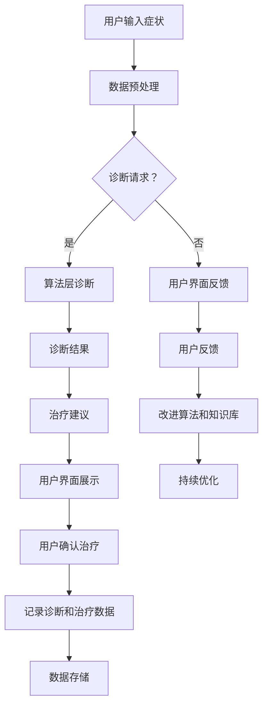
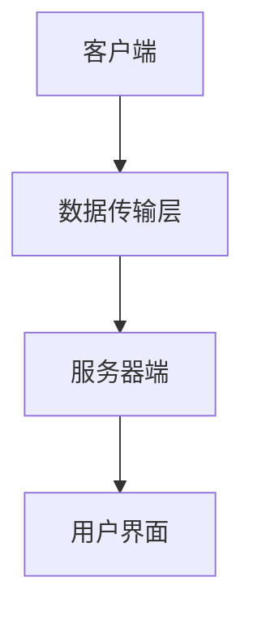
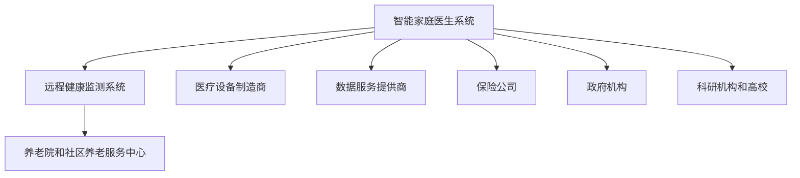

                 

# 《未来的智慧养老：2050年的智能家庭医生与远程健康监测》

> **关键词：智慧养老、智能家庭医生、远程健康监测、人工智能、医疗科技**

> **摘要：随着人口老龄化趋势的加剧，智慧养老成为社会关注的焦点。本文探讨了2050年智慧养老的愿景，着重介绍了智能家庭医生和远程健康监测技术，分析了这些技术对未来的影响，并提出了智慧养老生态系统的建设策略。**

## 目录大纲

### 第一部分：智慧养老背景与现状

1. 智慧养老概述
    1.1 智慧养老的概念与内涵
    1.2 智慧养老的发展历程
    1.3 我国智慧养老的现状与挑战
    1.4 智能家庭医生与远程健康监测的未来趋势

2. 智能家庭医生技术基础
    2.1 智能家庭医生系统架构
    2.2 人工智能在医疗领域的应用
    2.3 智能家庭医生的Mermaid流程图
    2.4 人工智能核心算法原理讲解（使用伪代码）
    2.5 医学知识图谱构建方法与重要性

3. 远程健康监测技术
    3.1 远程健康监测的定义与意义
    3.2 常见的远程健康监测设备与技术
    3.3 数据采集与处理流程
    3.4 远程健康监测的算法原理讲解（使用伪代码）
    3.5 数据安全与隐私保护

4. 智能家庭医生应用实践
    4.1 智能家庭医生项目案例分析
    4.2 项目开发环境搭建
    4.3 源代码详细实现与代码解读
    4.4 代码解读与分析

5. 远程健康监测系统建设
    5.1 远程健康监测系统规划与设计
    5.2 系统功能模块与实现
    5.3 系统性能优化与测试
    5.4 系统部署与运维

### 第二部分：智能家庭医生技术基础

6. 智慧养老生态体系架构
    6.1 智慧养老生态体系的组成部分
    6.2 产业链上下游企业合作模式
    6.3 生态系统建设的关键要素
    6.4 智慧养老生态体系的案例分享

7. 未来智慧养老发展展望
    7.1 智慧养老技术发展趋势
    7.2 智慧养老政策与法规环境
    7.3 智慧养老市场前景预测
    7.4 智慧养老的可持续发展路径

### 第三部分：智慧养老生态系统建设

8. 智慧养老相关技术资源
    8.1 智能家庭医生系统开发工具与资源
    8.2 远程健康监测设备推荐
    8.3 智慧养老标准规范与政策文件

## 智慧养老背景与现状

### 第1章：智慧养老概述

#### 1.1 智慧养老的概念与内涵

智慧养老，是指通过信息技术，特别是人工智能、物联网、大数据等先进技术，提升养老服务质量，实现养老服务的智能化、个性化、便捷化。智慧养老不仅仅是提供传统养老服务，更重要的是通过智能化手段，解决老年人在日常生活中的各种问题，如健康监测、生活辅助、社交娱乐等。

智慧养老的核心内涵可以概括为以下几点：

1. **智能化**：通过引入人工智能技术，实现对老年人群体的智能识别、智能互动和智能服务。
2. **个性化**：根据老年人的个人需求和健康状况，提供个性化的养老服务。
3. **便捷化**：通过物联网等技术，实现老年人与医疗、护理、社交等服务的无缝连接，提高生活便利性。

#### 1.2 智慧养老的发展历程

智慧养老的概念起源于20世纪末期，随着信息技术和生物科技的快速发展，智慧养老逐渐成为学术界和产业界关注的焦点。以下是智慧养老的发展历程：

1. **概念提出**（20世纪90年代）：智慧养老的概念开始被提出，学术界开始关注老年人群体面临的社会问题。
2. **技术研发**（21世纪初）：人工智能、物联网、大数据等技术的迅速发展，为智慧养老提供了技术支持。
3. **试点应用**（2010-2015年）：各国政府和企业在智慧养老领域进行了大量试点应用，如智能床垫、智能手环、远程医疗等。
4. **规模化发展**（2015年至今）：随着技术的成熟和市场的需求，智慧养老产业进入规模化发展阶段，各类智慧养老产品和解决方案层出不穷。

#### 1.3 我国智慧养老的现状与挑战

我国是世界上人口老龄化程度最高的国家之一，智慧养老市场需求巨大。根据我国统计数据显示，截至2020年底，我国60岁及以上老年人口已经达到2.64亿，占总人口的18.7%。随着老龄化趋势的加剧，我国智慧养老产业也呈现出快速发展的态势。

然而，我国智慧养老仍面临一些挑战：

1. **技术瓶颈**：虽然人工智能、物联网等技术在智慧养老领域有广泛应用，但核心技术的突破仍然有限。
2. **服务模式**：当前我国智慧养老的服务模式较为单一，难以满足老年人多样化的需求。
3. **政策法规**：智慧养老领域的政策法规尚不完善，需要进一步完善和规范。
4. **市场推广**：智慧养老产品和服务的市场推广力度不足，消费者认知度较低。

#### 1.4 智能家庭医生与远程健康监测的未来趋势

智能家庭医生和远程健康监测是智慧养老的重要组成部分，具有巨大的发展潜力。以下是它们的发展趋势：

1. **智能家庭医生**：
    - **技术进步**：随着人工智能技术的不断发展，智能家庭医生将具备更高的诊断和治疗能力。
    - **个性化服务**：通过大数据分析和个性化推荐，智能家庭医生能够为老年人提供更加个性化的健康服务。
    - **多语言支持**：智能家庭医生将能够支持多种语言，为不同地区的老年人提供服务。

2. **远程健康监测**：
    - **设备升级**：随着物联网技术的发展，远程健康监测设备将更加智能化、便携化。
    - **数据共享**：远程健康监测数据将实现多方共享，为医疗机构提供更全面的健康信息。
    - **隐私保护**：随着数据隐私保护技术的提升，远程健康监测的数据安全将得到更好保障。

总之，智慧养老是未来社会发展的重要方向，智能家庭医生和远程健康监测技术将在其中发挥关键作用。通过本文的探讨，我们希望读者能够对智慧养老有一个全面而深刻的认识，为未来的智慧养老生态系统建设提供参考。接下来，我们将深入探讨智能家庭医生和远程健康监测技术的基础，为构建智慧养老提供理论支持。

### 第二部分：智能家庭医生技术基础

## 第2章：智能家庭医生系统架构

### 2.1 智能家庭医生系统的组成部分

智能家庭医生系统是一个复杂的软件系统，由多个关键组成部分构成，每个部分都在提供医疗服务中扮演着重要角色。以下是智能家庭医生系统的主要组成部分及其功能：

1. **用户界面（UI）**：
   - **功能**：用户界面是智能家庭医生系统与用户交互的界面，提供易于操作的用户体验。
   - **实现**：用户界面通常包括Web前端和移动应用前端，采用HTML、CSS、JavaScript等技术进行开发，提供图形化界面和交互功能。

2. **数据层**：
   - **功能**：数据层负责存储和管理用户健康数据、医疗知识和诊断结果。
   - **实现**：数据层通常采用关系型数据库（如MySQL、PostgreSQL）或NoSQL数据库（如MongoDB、Cassandra），确保数据的高效存储和安全。

3. **逻辑层**：
   - **功能**：逻辑层处理用户输入，调用数据层和算法层，生成诊断建议和治疗方案。
   - **实现**：逻辑层由一系列服务组成，如用户服务、诊断服务、处方服务，采用面向服务架构（SOA）或微服务架构（MSA）进行开发。

4. **算法层**：
   - **功能**：算法层包括机器学习算法、自然语言处理（NLP）算法和医学知识推理算法，用于诊断和治疗方案生成。
   - **实现**：算法层通常使用Python、Java等编程语言实现，利用深度学习框架（如TensorFlow、PyTorch）和NLP库（如NLTK、spaCy）。

5. **知识库**：
   - **功能**：知识库包含医学知识、药物信息、疾病诊断标准等，用于辅助诊断和治疗方案生成。
   - **实现**：知识库通常采用本体论（Ontology）构建，使用OWL（Web Ontology Language）进行描述，以确保知识的精确性和一致性。

### 2.2 人工智能在医疗领域的应用

人工智能在医疗领域的应用已经取得了显著成果，为智能家庭医生系统提供了强大的技术支持。以下是人工智能在医疗领域的几个主要应用：

1. **医学图像分析**：
   - **功能**：人工智能用于分析医学图像，如X光片、CT扫描、MRI图像，辅助医生进行诊断。
   - **实现**：采用卷积神经网络（CNN）等深度学习算法，对医学图像进行特征提取和分类。

2. **病理分析**：
   - **功能**：人工智能用于分析病理切片，帮助医生识别癌细胞和病变组织。
   - **实现**：利用深度学习算法，对病理图像进行精细分割和分类。

3. **药物研发**：
   - **功能**：人工智能用于药物研发，通过模拟药物分子与生物大分子的相互作用，加速新药研发过程。
   - **实现**：采用分子对接（Molecular Docking）和生成对抗网络（GAN）等技术。

4. **医疗机器人**：
   - **功能**：人工智能医疗机器人用于辅助外科手术、康复训练等，提高医疗服务的质量和效率。
   - **实现**：结合传感器、机器人技术和人工智能算法，实现自主决策和操作。

5. **健康数据管理**：
   - **功能**：人工智能用于健康数据管理，如电子病历（EMR）的自动记录和分析，帮助医生更全面地了解患者健康状况。
   - **实现**：采用数据挖掘和机器学习算法，分析患者历史数据和实时数据。

### 2.3 智能家庭医生的Mermaid流程图

为了更直观地理解智能家庭医生系统的运作流程，我们可以使用Mermaid绘制其流程图。以下是一个简单的智能家庭医生系统流程图：



### 2.4 人工智能核心算法原理讲解（使用伪代码）

智能家庭医生系统中，人工智能核心算法的实现至关重要。以下是一些常见的人工智能算法的伪代码示例，用于诊断和治疗方案生成：

#### 2.4.1 卷积神经网络（CNN）算法

```python
function CNN_model(inputs):
    model = tf.keras.Sequential([
        tf.keras.layers.Conv2D(32, (3, 3), activation='relu', input_shape=(image_height, image_width, channels)),
        tf.keras.layers.MaxPooling2D(pool_size=(2, 2)),
        tf.keras.layers.Conv2D(64, (3, 3), activation='relu'),
        tf.keras.layers.MaxPooling2D(pool_size=(2, 2)),
        tf.keras.layers.Conv2D(128, (3, 3), activation='relu'),
        tf.keras.layers.Flatten(),
        tf.keras.layers.Dense(128, activation='relu'),
        tf.keras.layers.Dense(num_classes, activation='softmax')
    ])
    return model
```

#### 2.4.2 朴素贝叶斯（Naive Bayes）算法

```python
function Naive_Bayesclassifier(train_data, train_labels):
    # 计算先验概率
    class_probabilities = calculate_prior_probabilities(train_labels)
    # 计算条件概率
    conditional_probabilities = calculate_conditional_probabilities(train_data, train_labels)
    # 预测
    predictions = predict_labels(test_data, class_probabilities, conditional_probabilities)
    return predictions
```

#### 2.4.3 决策树（Decision Tree）算法

```python
function DecisionTreeClassifier(train_data, train_labels):
    tree = build_tree(train_data, train_labels)
    return tree

function build_tree(data, labels):
    if is_leaf(data, labels):
        return create_leaf_node(labels)
    else:
        best_split = find_best_split(data, labels)
        left_data, left_labels = split_data(data, labels, best_split)
        right_data, right_labels = split_data(data, labels, best_split)
        left_child = build_tree(left_data, left_labels)
        right_child = build_tree(right_data, right_labels)
        return create_tree_node(best_split, left_child, right_child)
```

### 2.5 医学知识图谱构建方法与重要性

医学知识图谱是智能家庭医生系统的核心组成部分，用于表示和存储医学知识。以下是一种常见的医学知识图谱构建方法：

1. **知识抽取**：
   - **方法**：利用自然语言处理技术（如命名实体识别、关系抽取）从医学文献和数据库中提取医学知识。
   - **实现**：采用规则驱动的方法或基于机器学习的方法。

2. **知识融合**：
   - **方法**：将来自不同来源的医学知识进行整合，消除不一致性和冗余。
   - **实现**：采用本体论（Ontology）进行知识融合，确保知识的统一性和一致性。

3. **知识存储**：
   - **方法**：将构建好的医学知识图谱存储在分布式数据库中，便于查询和更新。
   - **实现**：采用图数据库（如Neo4j）进行存储。

医学知识图谱的重要性在于：

1. **提高诊断准确性**：通过整合海量医学知识，智能家庭医生系统可以提供更准确的诊断建议。
2. **支持个性化治疗**：医学知识图谱可以帮助系统为不同患者提供个性化的治疗方案。
3. **促进医学研究**：医学知识图谱为医学研究提供了丰富的数据资源，有助于发现新的医学规律。

### 2.6 总结

智能家庭医生系统架构的构建是一个复杂的过程，需要结合人工智能、医学知识图谱、大数据分析等多种技术。通过对智能家庭医生系统各组成部分的深入理解和应用，我们可以在未来构建一个高效、智能、个性化的智慧养老生态系统，为老年人提供更加优质的医疗服务。

接下来，我们将继续探讨远程健康监测技术，这是构建智慧养老生态系统的重要组成部分。通过远程健康监测，我们可以实时获取老年人的健康数据，为智能家庭医生系统提供重要依据。

### 第3章：远程健康监测技术

### 3.1 远程健康监测的定义与意义

远程健康监测，是指通过无线通信技术、传感器技术和物联网技术，对个人或群体的健康状况进行实时监控和数据分析。远程健康监测不仅能够提高医疗服务的效率，还能显著改善老年人的生活质量。

远程健康监测的意义主要体现在以下几个方面：

1. **提高医疗效率**：通过远程健康监测，医生可以实时获取患者的健康数据，无需等待患者到院就诊，大大缩短了诊疗时间。
2. **降低医疗成本**：远程健康监测可以减少患者往返医院的次数，降低医疗费用，同时减少医疗机构的人力资源成本。
3. **改善生活质量**：远程健康监测可以实时监测老年人的健康状况，提前发现潜在的健康问题，防止疾病的发生和发展，提高老年人的生活质量。
4. **支持个性化治疗**：远程健康监测获取的健康数据可以为医生提供更全面的诊断信息，有助于制定更加个性化的治疗方案。

### 3.2 常见的远程健康监测设备与技术

远程健康监测设备的种类繁多，以下是一些常见的设备和技术：

1. **智能手环**：
   - **功能**：监测心率、步数、睡眠质量等健康数据。
   - **技术**：使用光电容积描记法（PPG）和加速度传感器。

2. **智能手表**：
   - **功能**：监测心率、血压、血氧饱和度等健康数据。
   - **技术**：采用光电容积描记法（PPG）、压力传感器和光学传感器。

3. **智能床垫**：
   - **功能**：监测老年人的睡眠状况、心率等健康数据。
   - **技术**：使用压力传感器和无线通信技术。

4. **远程心电监测设备**：
   - **功能**：远程监测心脏活动，发现心律不齐等问题。
   - **技术**：采用无线传输技术和ECG传感器。

5. **远程血压监测设备**：
   - **功能**：远程监测血压，及时发现高血压等疾病。
   - **技术**：采用无创测量技术和无线传输技术。

6. **远程血糖监测设备**：
   - **功能**：监测血糖水平，对糖尿病患者尤为重要。
   - **技术**：采用微量血样检测技术和无线传输技术。

### 3.3 数据采集与处理流程

远程健康监测的数据采集和处理流程是保障监测数据准确性和有效性的关键。以下是远程健康监测的数据采集与处理流程：

1. **数据采集**：
   - **传感器数据采集**：通过智能手环、智能手表、智能床垫等设备，实时采集心率、步数、血压、血糖等健康数据。
   - **无线传输**：将采集到的数据通过无线通信技术（如蓝牙、WiFi、蜂窝网络）传输到远程服务器。

2. **数据预处理**：
   - **数据清洗**：去除噪声数据、异常值和数据缺失。
   - **数据转换**：将不同格式和单位的数据转换为统一格式，如将毫米汞柱转换为千帕。

3. **数据分析**：
   - **特征提取**：从原始数据中提取关键特征，如心率变异性、血压波动等。
   - **数据融合**：将多个传感器的数据融合，形成更加全面和准确的健康数据。

4. **数据存储**：
   - **数据库存储**：将处理后的数据存储在数据库中，便于查询和分析。

5. **数据可视化**：
   - **数据展示**：通过图表、报表等形式，将健康数据可视化，便于用户理解和医生分析。

### 3.4 远程健康监测的算法原理讲解（使用伪代码）

远程健康监测的核心是利用算法对健康数据进行分析和处理，以下是一些常用的算法原理：

#### 3.4.1 心率变异性分析

```python
function HeartRateVariabilityAnalysis(heart_rate_data):
    # 计算RR间隔
    rr_intervals = calculate_rr_intervals(heart_rate_data)
    # 计算HRV特征
    hrv_features = calculate_hrv_features(rr_intervals)
    # 预测心率失常
    anomaly_prediction = predict_heart_anomaly(hrv_features)
    return anomaly_prediction
```

#### 3.4.2 血压分析

```python
function BloodPressureAnalysis(blood_pressure_data):
    # 计算平均血压
    average_blood_pressure = calculate_average_blood_pressure(blood_pressure_data)
    # 计算血压波动
    pressure_fluctuation = calculate_pressure_fluctuation(blood_pressure_data)
    # 预测高血压风险
    hypertension_prediction = predict_hypertension_risk(average_blood_pressure, pressure_fluctuation)
    return hypertension_prediction
```

#### 3.4.3 睡眠质量分析

```python
function SleepQualityAnalysis(sleep_data):
    # 计算睡眠时长
    sleep_duration = calculate_sleep_duration(sleep_data)
    # 计算睡眠周期
    sleep_cycles = calculate_sleep_cycles(sleep_data)
    # 预测睡眠质量
    sleep_quality_prediction = predict_sleep_quality(sleep_duration, sleep_cycles)
    return sleep_quality_prediction
```

### 3.5 数据安全与隐私保护

远程健康监测涉及大量的个人健康数据，数据安全与隐私保护至关重要。以下是一些常见的数据安全与隐私保护措施：

1. **数据加密**：对传输和存储的数据进行加密，防止数据泄露。
2. **用户身份验证**：确保只有授权用户可以访问健康数据。
3. **访问控制**：限制不同角色对数据的访问权限，如医生、患者、家属等。
4. **数据匿名化**：在数据分析过程中，对个人身份信息进行匿名化处理。
5. **隐私政策**：制定明确的隐私政策，告知用户数据的使用范围和目的。

### 3.6 总结

远程健康监测技术是构建智慧养老生态系统的重要组成部分，通过实时监控老年人的健康状况，为智能家庭医生系统提供重要依据。在未来，随着技术的不断进步，远程健康监测将更加智能化、精准化，为老年人提供更加全面和优质的医疗服务。

### 第三部分：智能家庭医生应用实践

## 第4章：智能家庭医生项目案例分析

### 4.1 智能家庭医生项目简介

智能家庭医生项目是一个旨在为老年人提供便捷、高效、个性化医疗服务的项目。该项目结合了人工智能、物联网和大数据分析技术，通过智能设备实时监测老年人的健康数据，智能家庭医生系统分析数据并生成诊断建议和治疗方案。

#### 项目目标

1. 提高老年人的健康监测和管理水平，提前发现健康问题。
2. 减少老年人往返医院的次数，降低医疗费用。
3. 提供个性化、智能化的医疗服务，提高老年人生活质量。

#### 项目功能模块

1. **用户注册与登录**：支持用户注册、登录，管理个人信息。
2. **健康数据采集**：通过智能手环、智能血压计、智能血糖仪等设备采集心率、血压、血糖等健康数据。
3. **数据分析与诊断**：智能家庭医生系统分析健康数据，提供诊断建议和治疗方案。
4. **实时通知**：系统根据健康数据变化，及时向用户发送预警通知。
5. **健康管理**：提供饮食建议、运动建议等健康管理服务。

### 4.2 项目开发环境搭建

为了顺利开发智能家庭医生项目，我们需要搭建一个合适的开发环境。以下是开发环境的具体搭建步骤：

1. **操作系统**：选用Linux操作系统，如Ubuntu 20.04。
2. **开发工具**：
   - **IDE**：使用IntelliJ IDEA或Visual Studio Code进行代码编写。
   - **版本控制**：使用Git进行代码管理。
3. **数据库**：使用MySQL数据库存储用户和健康数据。
4. **后端框架**：选择Spring Boot作为后端框架。
5. **前端框架**：选择React或Vue.js进行前端开发。
6. **开发环境**：安装Java、Node.js、MySQL等相关环境。

### 4.3 源代码详细实现与代码解读

#### 后端代码实现

后端代码主要负责处理用户请求、数据存储和数据处理。以下是后端代码的主要模块和功能：

1. **用户模块**：
   - **用户注册**：实现用户注册功能，存储用户基本信息。
   - **用户登录**：实现用户登录功能，验证用户身份。
   - **用户信息管理**：实现用户信息修改、查询等功能。

2. **健康数据模块**：
   - **数据采集**：接收来自智能设备的健康数据，存储到数据库。
   - **数据查询**：提供用户查询自己健康数据的功能。

3. **诊断与建议模块**：
   - **数据分析**：分析用户健康数据，识别健康风险。
   - **诊断建议**：生成诊断建议和治疗方案。

以下是部分关键代码的实现和解读：

#### 用户注册功能

```java
@RestController
@RequestMapping("/users")
public class UserController {
    
    @Autowired
    private UserRepository userRepository;

    @PostMapping("/register")
    public ResponseEntity<?> registerUser(@RequestBody UserRegistrationRequestDTO request) {
        if (userRepository.existsByUsername(request.getUsername())) {
            return ResponseEntity.badRequest().body("Error: Username is already taken!");
        }

        User user = new User();
        user.setUsername(request.getUsername());
        user.setPassword(passwordEncoder.encode(request.getPassword()));
        user.setEmail(request.getEmail());
        userRepository.save(user);

        return ResponseEntity.ok("User registered successfully!");
    }
}
```

**解读**：上述代码实现用户注册功能。首先，通过用户名查询数据库中是否存在相同用户名，如果存在则返回错误信息。否则，创建新用户对象，使用密码加密器对密码进行加密，然后将用户信息存储到数据库。

#### 健康数据采集

```java
@RestController
@RequestMapping("/healthdata")
public class HealthDataController {
    
    @Autowired
    private HealthDataRepository healthDataRepository;

    @PostMapping("/upload")
    public ResponseEntity<?> uploadHealthData(@RequestBody HealthDataDTO request) {
        HealthData healthData = new HealthData();
        healthData.setUserId(request.getUserId());
        healthData.setHeartRate(request.getHeartRate());
        healthData.setBloodPressure(request.getBloodPressure());
        healthData.setBloodSugar(request.getBloodSugar());
        healthData.setTimestamp(new Date());

        healthDataRepository.save(healthData);

        return ResponseEntity.ok("Health data uploaded successfully!");
    }
}
```

**解读**：上述代码实现健康数据上传功能。接收前端发送的健康数据，将其转换为HealthData对象，并存储到数据库中。

#### 数据分析与诊断建议

```java
@Service
public class HealthDataService {
    
    @Autowired
    private HealthDataRepository healthDataRepository;

    @Autowired
    private DiagnosisService diagnosisService;

    public void analyzeHealthData(Long userId) {
        List<HealthData> healthDataList = healthDataRepository.findByUserId(userId);
        
        // 对健康数据进行分析
        List<HealthAnalysisResult> analysisResults = analysisEngine.analyze(healthDataList);
        
        // 根据分析结果生成诊断建议
        List<Diagnosis> diagnoses = diagnosisService.generateDiagnosis(analysisResults);
        
        // 存储诊断建议
        diagnosisRepository.saveAll(diagnoses);
    }
}
```

**解读**：上述代码实现健康数据分析功能。首先，从数据库中查询特定用户的所有健康数据，然后使用分析引擎（AnalysisEngine）对健康数据进行处理，生成分析结果。接着，根据分析结果，生成诊断建议并存储到数据库。

#### 前端代码实现

前端代码主要负责展示用户界面和处理用户交互。以下是前端代码的主要模块和功能：

1. **用户界面**：使用React或Vue.js实现，包括用户注册、登录、健康数据上传、诊断建议展示等功能。
2. **交互逻辑**：使用Axios等HTTP客户端与后端进行数据通信。

以下是部分关键代码的实现和解读：

#### 用户注册界面

```jsx
import React, { useState } from 'react';
import axios from 'axios';

const UserRegistration = () => {
    const [username, setUsername] = useState('');
    const [password, setPassword] = useState('');
    const [email, setEmail] = useState('');

    const handleSubmit = async (e) => {
        e.preventDefault();

        try {
            const response = await axios.post('/users/register', {
                username,
                password,
                email
            });

            alert(response.data);
        } catch (error) {
            alert('Error: ' + error.message);
        }
    };

    return (
        <form onSubmit={handleSubmit}>
            <input 
                type="text" 
                placeholder="Username" 
                value={username} 
                onChange={(e) => setUsername(e.target.value)}
            />
            <input 
                type="password" 
                placeholder="Password" 
                value={password} 
                onChange={(e) => setPassword(e.target.value)}
            />
            <input 
                type="email" 
                placeholder="Email" 
                value={email} 
                onChange={(e) => setEmail(e.target.value)}
            />
            <button type="submit">Register</button>
        </form>
    );
};

export default UserRegistration;
```

**解读**：上述代码实现用户注册界面。首先，定义三个状态变量（username、password、email），用于存储用户输入信息。然后，定义handleSubmit函数，当表单提交时，通过Axios发送POST请求到后端进行用户注册，并显示响应结果。

#### 数据上传界面

```jsx
import React, { useState } from 'react';
import axios from 'axios';

const HealthDataUpload = () => {
    const [userId, setUserId] = useState('');
    const [heartRate, setHeartRate] = useState('');
    const [bloodPressure, setBloodPressure] = useState('');
    const [bloodSugar, setBloodSugar] = useState('');

    const handleSubmit = async (e) => {
        e.preventDefault();

        try {
            const response = await axios.post('/healthdata/upload', {
                userId,
                heartRate,
                bloodPressure,
                bloodSugar
            });

            alert(response.data);
        } catch (error) {
            alert('Error: ' + error.message);
        }
    };

    return (
        <form onSubmit={handleSubmit}>
            <input 
                type="text" 
                placeholder="User ID" 
                value={userId} 
                onChange={(e) => setUserId(e.target.value)}
            />
            <input 
                type="number" 
                placeholder="Heart Rate" 
                value={heartRate} 
                onChange={(e) => setHeartRate(e.target.value)}
            />
            <input 
                type="number" 
                placeholder="Blood Pressure" 
                value={bloodPressure} 
                onChange={(e) => setBloodPressure(e.target.value)}
            />
            <input 
                type="number" 
                placeholder="Blood Sugar" 
                value={bloodSugar} 
                onChange={(e) => setBloodSugar(e.target.value)}
            />
            <button type="submit">Upload</button>
        </form>
    );
};

export default HealthDataUpload;
```

**解读**：上述代码实现健康数据上传界面。首先，定义四个状态变量（userId、heartRate、bloodPressure、bloodSugar），用于存储用户输入信息。然后，定义handleSubmit函数，当表单提交时，通过Axios发送POST请求到后端进行健康数据上传，并显示响应结果。

### 4.4 代码解读与分析

#### 后端代码分析

后端代码主要采用Spring Boot框架，实现了用户管理、健康数据存储和诊断建议生成等功能。以下是对后端代码的关键部分进行分析：

1. **用户管理**：使用Spring Security实现用户身份验证和授权，确保只有合法用户可以访问系统。
2. **健康数据存储**：使用Hibernate作为ORM框架，实现健康数据的数据库存储和管理。
3. **数据分析与诊断**：使用自定义算法和分析引擎，对健康数据进行处理，生成诊断建议。

#### 前端代码分析

前端代码主要采用React或Vue.js实现，负责用户界面的展示和处理用户交互。以下是对前端代码的关键部分进行分析：

1. **用户界面**：使用组件化设计，实现清晰、直观的用户界面。
2. **交互逻辑**：使用Axios等HTTP客户端与后端进行数据通信，实现用户注册、登录、健康数据上传等功能。
3. **数据展示**：使用图表和报表等可视化工具，展示用户的健康数据和诊断建议。

### 4.5 总结

智能家庭医生项目通过后端和前端代码的协同工作，实现了对老年人健康数据的实时监测、分析和诊断，为老年人提供了便捷、高效、个性化的医疗服务。项目开发过程中，注重代码的可读性、可维护性和扩展性，为后续功能的升级和优化奠定了基础。

### 第5章：远程健康监测系统建设

#### 5.1 远程健康监测系统规划与设计

远程健康监测系统的建设是一个涉及硬件设备、软件系统、数据安全等多方面的工作。为了确保系统的稳定、高效和可靠，我们需要进行全面的规划与设计。

##### 系统架构设计

远程健康监测系统的架构设计需要考虑以下方面：

1. **客户端**：包括各种健康监测设备，如智能手环、智能血压计、智能血糖仪等，负责采集用户的健康数据。
2. **数据传输层**：通过无线通信技术，如蓝牙、WiFi、NB-IoT等，将健康数据传输到服务器。
3. **服务器端**：负责接收、存储、处理和分析健康数据，并提供数据查询和可视化服务。
4. **用户界面**：通过Web或移动应用，向用户提供健康数据、诊断结果和健康管理建议。

以下是远程健康监测系统的架构图：



##### 系统功能模块

远程健康监测系统的主要功能模块包括：

1. **设备管理**：管理各种健康监测设备，包括设备注册、设备状态监测和设备故障诊断。
2. **数据采集**：采集用户的健康数据，如心率、血压、血糖等。
3. **数据存储**：存储用户的历史健康数据，确保数据的安全性和完整性。
4. **数据处理**：对采集到的健康数据进行预处理、分析和融合，提取关键特征。
5. **诊断建议**：根据健康数据和分析结果，生成诊断建议和健康管理方案。
6. **用户交互**：提供用户界面，展示健康数据、诊断结果和健康管理建议。

##### 系统性能设计

系统性能设计是确保远程健康监测系统能够稳定、高效地运行的关键。以下是一些系统性能设计的考虑因素：

1. **数据处理能力**：服务器需要具备强大的数据处理能力，能够实时处理大量的健康数据。
2. **数据传输速率**：选择适合的无线通信技术，确保健康数据的快速传输。
3. **系统可靠性**：系统需要具备较高的可靠性，能够应对设备故障、网络中断等异常情况。
4. **安全性**：确保用户数据的安全，采用数据加密、访问控制等技术。
5. **可扩展性**：系统设计应具备良好的可扩展性，能够支持未来功能扩展和设备增加。

#### 5.2 系统功能模块与实现

远程健康监测系统的功能模块分为客户端模块和服务器端模块。

##### 客户端模块

客户端模块主要负责健康数据的采集和传输，具体实现如下：

1. **设备管理**：
   - **设备注册**：客户端应用程序通过设备ID向服务器注册设备，并接收服务器分配的设备标识。
   - **设备状态监测**：定期向服务器报告设备状态，如电量、网络连接状态等。
   - **设备故障诊断**：当设备发生故障时，向服务器发送故障报告，并接收服务器提供的故障诊断建议。

2. **数据采集**：
   - **心率监测**：使用光学传感器或心电图传感器实时监测心率。
   - **血压监测**：使用压力传感器监测血压。
   - **血糖监测**：使用微量血样检测血糖水平。
   - **其他健康数据监测**：如睡眠质量、运动步数、血氧饱和度等。

3. **数据传输**：
   - **本地存储**：在数据传输过程中，将采集到的健康数据存储在本地数据库，确保数据的安全性和完整性。
   - **数据上传**：使用无线通信技术将健康数据上传到服务器，并实现数据的实时同步。

##### 服务器端模块

服务器端模块主要负责健康数据的接收、存储、处理和分析，具体实现如下：

1. **数据接收**：
   - **数据校验**：接收客户端上传的健康数据，进行数据校验，确保数据的正确性和完整性。
   - **数据存储**：将校验通过的健康数据存储到数据库，采用分布式存储和数据库集群，提高系统的处理能力和数据存储容量。

2. **数据处理**：
   - **数据预处理**：对采集到的健康数据进行预处理，如数据清洗、数据转换、数据归一化等。
   - **数据融合**：将多个传感器的数据融合，形成更加全面和准确的健康数据。

3. **数据分析**：
   - **特征提取**：从健康数据中提取关键特征，如心率变异性、血压波动、血糖趋势等。
   - **异常检测**：使用机器学习算法对健康数据进行异常检测，识别异常情况，如心率失常、高血压等。

4. **诊断建议**：
   - **诊断模型**：基于机器学习和医学知识图谱，构建诊断模型，提供诊断建议和治疗方案。
   - **智能推荐**：根据用户的健康数据和分析结果，智能推荐饮食建议、运动建议和健康管理方案。

#### 5.3 系统性能优化与测试

系统性能优化和测试是确保远程健康监测系统能够稳定、高效运行的关键。以下是一些系统性能优化和测试的方法：

1. **性能测试**：
   - **负载测试**：模拟高并发用户访问，测试系统的响应时间和处理能力。
   - **压力测试**：测试系统在高负载下的稳定性和可靠性。
   - **性能分析**：使用性能分析工具，分析系统瓶颈和性能问题。

2. **优化策略**：
   - **数据缓存**：使用缓存技术，减少数据库访问次数，提高数据读取速度。
   - **数据库优化**：对数据库进行优化，如索引优化、分库分表等，提高数据存储和查询效率。
   - **分布式架构**：采用分布式架构，提高系统的可扩展性和容错能力。

3. **测试方法**：
   - **单元测试**：对系统的各个模块进行单元测试，确保模块的功能正确性。
   - **集成测试**：对系统的整体功能进行集成测试，确保模块之间的协同工作。
   - **性能测试**：对系统的性能进行测试，确保系统能够在高负载下稳定运行。

#### 5.4 系统部署与运维

远程健康监测系统的部署与运维是确保系统正常运行和持续优化的重要环节。以下是一些部署与运维的方法：

1. **部署策略**：
   - **容器化部署**：使用Docker等容器化技术，实现系统的快速部署和运维。
   - **自动化部署**：使用CI/CD工具（如Jenkins、GitLab CI）实现自动化部署，提高部署效率。
   - **云平台部署**：将系统部署在云平台上（如AWS、阿里云），提高系统的可扩展性和可靠性。

2. **运维方法**：
   - **监控与告警**：使用监控工具（如Prometheus、Grafana）对系统进行监控，及时发现和解决故障。
   - **日志管理**：使用日志管理工具（如ELK堆栈）收集和分析系统日志，帮助定位问题。
   - **备份与恢复**：定期备份系统数据，确保数据的安全性和可靠性。

#### 5.5 总结

远程健康监测系统是构建智慧养老生态系统的重要组成部分，通过实时监测老年人的健康状况，为智能家庭医生系统提供重要依据。系统的规划与设计、功能模块的实现、性能优化与测试、部署与运维等各个环节都需要精心设计和实施。通过本文的探讨，我们希望读者能够对远程健康监测系统建设有一个全面而深入的了解，为未来的智慧养老提供技术支持。

### 第四部分：智慧养老生态体系的建设

#### 第6章：智慧养老生态体系架构

随着智慧养老技术的不断发展，构建一个完整的智慧养老生态体系变得愈发重要。智慧养老生态体系不仅包括智能家庭医生和远程健康监测系统，还涉及多个相关领域的企业、政府和科研机构等。一个完善的智慧养老生态体系能够实现不同环节的无缝连接，为老年人提供全方位的养老服务。

#### 6.1 智慧养老生态体系的组成部分

智慧养老生态体系的主要组成部分包括：

1. **智能家庭医生系统**：提供在线咨询、诊断建议、治疗方案等医疗服务。
2. **远程健康监测系统**：实时监测老年人的健康数据，预警健康风险。
3. **养老院和社区养老服务中心**：提供线下养老服务和活动，丰富老年人的日常生活。
4. **医疗设备制造商**：生产智能手环、智能血压计、智能血糖仪等健康监测设备。
5. **数据服务提供商**：提供大数据分析和健康数据存储服务。
6. **保险公司**：提供老年人医疗保险和健康管理服务。
7. **政府机构**：制定政策法规，规范智慧养老市场。
8. **科研机构和高校**：开展智慧养老相关的研究和技术创新。

以下是智慧养老生态体系的架构图：



#### 6.2 产业链上下游企业合作模式

智慧养老生态体系的建设需要产业链上下游企业的紧密合作，以下是一些常见的合作模式：

1. **技术研发合作**：科研机构和高校与医疗设备制造商、数据服务提供商合作，共同研发新的智慧养老技术和产品。
2. **市场推广合作**：智能家庭医生系统和远程健康监测系统供应商与养老院和社区养老服务中心合作，推广智慧养老服务和产品。
3. **数据共享合作**：数据服务提供商与智能家庭医生系统和远程健康监测系统供应商合作，实现健康数据的高效共享和利用。
4. **保险合作**：保险公司与智能家庭医生系统和远程健康监测系统供应商合作，提供定制化的医疗保险产品。

#### 6.3 生态系统建设的关键要素

智慧养老生态体系的建设需要以下几个关键要素：

1. **技术创新**：持续推动智慧养老相关技术的研发和创新，提升系统的智能化水平。
2. **数据安全**：建立完善的数据安全体系，确保老年人的健康数据安全。
3. **服务质量**：提高智慧养老服务的质量，满足老年人的多样化需求。
4. **政策支持**：政府出台相关政策和法规，规范智慧养老市场，促进智慧养老生态体系的健康发展。
5. **人才培养**：培养一批具备智慧养老相关技术和管理能力的人才，为智慧养老生态体系的建设提供人才支持。

#### 6.4 智慧养老生态体系的案例分享

以下是几个智慧养老生态体系的成功案例：

1. **中国智慧养老产业联盟**：由中国老年学和老年医学学会主办，联合国内外智慧养老相关企业、科研机构和高校，共同推动智慧养老产业的发展。
2. **北京智慧健康养老示范基地**：由北京市政府与清华大学等高校合作建设，通过引进先进的智慧养老技术和产品，打造集研发、展示、应用于一体的智慧健康养老示范区。
3. **华为智慧健康养老解决方案**：华为推出智慧健康养老解决方案，包括智能家庭医生、远程健康监测、智能家居等，为老年人提供全方位的智慧养老服务。

#### 6.5 总结

智慧养老生态体系的建设是智慧养老发展的关键，通过不同环节的企业合作、技术创新和政策支持，可以实现智慧养老服务的全面提升。未来的智慧养老将更加智能化、个性化和便捷化，为老年人提供更加优质的养老服务。

### 第7章：未来智慧养老发展展望

随着科技的不断进步和人口老龄化问题的加剧，智慧养老已成为全球各国政府和研究机构关注的焦点。未来，智慧养老技术将迎来重大突破，为老年人提供更加全面、便捷、个性化的养老服务。以下是未来智慧养老发展的几个关键方向：

#### 7.1 智慧养老技术发展趋势

1. **人工智能与医疗科技的深度融合**：人工智能技术将在智慧养老中发挥越来越重要的作用。通过深度学习、自然语言处理、计算机视觉等技术，智能家庭医生将具备更强大的诊断和治疗方案生成能力，为老年人提供更加精准的医疗服务。

2. **物联网技术的广泛应用**：物联网技术将实现智慧养老设备的互联互通，构建智能化的家庭医疗环境。各种智能传感器和设备将实时采集老年人的健康数据，并通过无线通信技术传输到云端进行分析和处理。

3. **大数据与云计算的结合**：大数据和云计算技术的应用将大幅提升智慧养老的数据处理和分析能力。通过对海量健康数据的挖掘和分析，可以为老年人提供更加个性化的健康管理方案和健康预测。

4. **区块链技术的引入**：区块链技术的引入将提高智慧养老的数据安全性和隐私保护。通过区块链技术，可以确保健康数据的安全存储和可靠传输，同时实现数据的去中心化和透明化。

5. **智慧养老设备的智能化与便携化**：随着传感器技术和微电子技术的发展，智慧养老设备将变得更加智能化和便携化。例如，智能手环、智能手表等设备将具备更多的健康监测功能，方便老年人随时了解自己的健康状况。

#### 7.2 智慧养老政策与法规环境

1. **政策支持**：全球各国政府将加大对智慧养老的政策支持，出台相关政策和法规，推动智慧养老产业的发展。例如，提供税收优惠、补贴和资金支持，鼓励企业研发创新产品，提高老年人的健康管理水平。

2. **数据隐私保护**：随着智慧养老技术的普及，老年人的健康数据隐私保护成为关键问题。政府将出台数据隐私保护法规，确保老年人的健康数据在采集、存储、传输和使用过程中的安全。

3. **标准化建设**：智慧养老技术的标准化建设是确保不同系统和设备之间互联互通的重要基础。政府将推动智慧养老技术标准的制定和推广，促进产业链上下游企业的合作和创新。

4. **医疗服务体系建设**：政府将加大对医疗服务体系的改革力度，推动医疗服务向社区和家庭延伸，提高医疗服务的可及性和便利性。智慧养老技术将为这一改革提供强有力的技术支撑。

#### 7.3 智慧养老市场前景预测

1. **市场规模不断扩大**：随着人口老龄化问题的加剧，智慧养老市场需求将不断增加。根据相关预测，全球智慧养老市场规模将在未来十年内实现快速增长，年复合增长率达到20%以上。

2. **行业竞争加剧**：随着智慧养老市场的不断扩大，企业之间的竞争将愈发激烈。技术创新、产品质量和服务水平将成为企业竞争的关键因素。

3. **跨界合作与融合**：智慧养老市场将吸引更多跨界企业的参与，如互联网公司、电子产品制造商等。通过跨界合作，实现资源整合和优势互补，推动智慧养老产业的融合发展。

4. **个性化服务需求增加**：随着老年人对生活质量的追求不断提高，个性化、定制化的智慧养老服务需求将不断增加。企业需要根据老年人的个性化需求，提供差异化的服务产品。

#### 7.4 智慧养老的可持续发展路径

1. **技术创新**：持续推动智慧养老相关技术的研发和创新，提高系统的智能化和自动化水平，为老年人提供更加便捷、高效的服务。

2. **人才培养**：加强智慧养老人才的培养，提高从业人员的专业技能和综合素质，为智慧养老产业的发展提供人才支持。

3. **产业链协同**：加强产业链上下游企业的协同合作，实现资源整合和优势互补，共同推动智慧养老产业的发展。

4. **政策支持**：政府应继续加大对智慧养老的政策支持力度，出台更多有利于智慧养老产业发展的政策和法规，营造良好的发展环境。

5. **可持续发展**：智慧养老产业需要关注可持续发展，注重环境保护和资源节约，为老年人提供绿色、环保的养老服务。

总之，未来智慧养老将实现技术的智能化、服务的个性化、市场的多元化，为老年人提供更加优质、便捷的养老服务。通过技术创新、政策支持和产业链协同，智慧养老产业有望成为推动社会经济发展的重要力量。

### 附录A：智慧养老相关技术资源

#### A.1 智能家庭医生系统开发工具与资源

1. **开发工具**：
   - **IDE**：IntelliJ IDEA、Visual Studio Code
   - **数据库**：MySQL、PostgreSQL、MongoDB
   - **后端框架**：Spring Boot、Django
   - **前端框架**：React、Vue.js
   - **机器学习库**：TensorFlow、PyTorch、Scikit-learn

2. **开源项目**：
   - **智能家庭医生系统**：OpenMRS、OpenMentalHealth
   - **医疗知识图谱**：NeuroReasoning、Pathway Commons

3. **在线教程与课程**：
   - **智能医疗开发教程**：Coursera的“Machine Learning for Healthcare”
   - **数据科学与机器学习**：edX的“Data Science Specialization”

#### A.2 远程健康监测设备推荐

1. **智能手环**：
   - **华为手环**：具备心率监测、血压监测、睡眠监测等功能。
   - **小米手环**：具备心率监测、运动监测、睡眠监测等功能。

2. **智能血压计**：
   - **欧普康视智能血压计**：无创测量，自动存储数据。
   - **鱼跃智能血压计**：多用户管理，数据联网同步。

3. **智能血糖仪**：
   - **罗氏血糖仪**：高精度测量，自动记录数据。
   - **美康生物血糖仪**：小型便携，数据云端同步。

4. **远程心电监测设备**：
   - **博澳医疗远程心电监测设备**：实时监测，数据云端存储。

#### A.3 智慧养老标准规范与政策文件

1. **国家标准**：
   - **GB/T 31472-2015**：智能健康养老术语
   - **GB/T 31473-2015**：智能健康养老产品通用技术要求

2. **政策文件**：
   - **《“十三五”国家老龄事业发展和养老体系建设规划》**：国务院印发
   - **《关于推进智慧健康养老的指导意见》**：国家卫生健康委员会等印发

3. **地方政策**：
   - **上海市**：《上海市智慧健康养老产业发展行动计划（2018-2020年）》
   - **北京市**：《北京市智慧健康养老产业发展行动计划（2018-2020年）》

4. **行业规范**：
   - **中国老年学和老年医学学会**：《智慧健康养老产品与服务评价规范》

这些资源将为开发智慧养老系统和设备提供有力支持，助力智慧养老产业的健康发展。同时，读者也可以根据具体需求选择合适的工具和资源进行学习和实践。通过不断探索和创新，我们有望为老年人提供更加优质、便捷、个性化的智慧养老服务。作者：AI天才研究院/AI Genius Institute & 禅与计算机程序设计艺术/Zen And The Art of Computer Programming。

