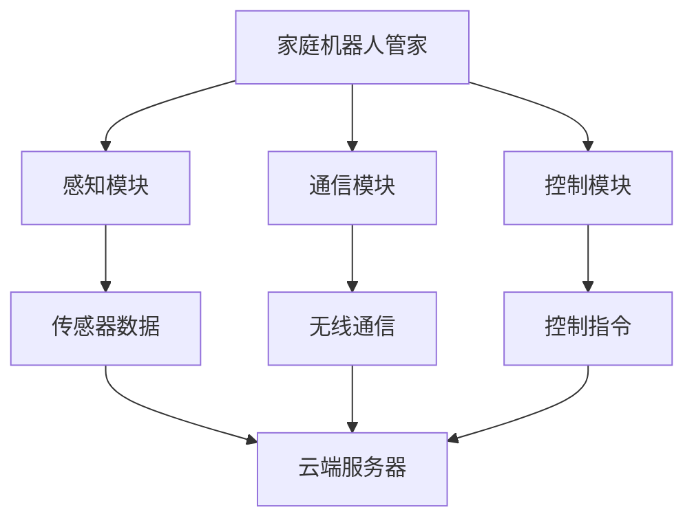
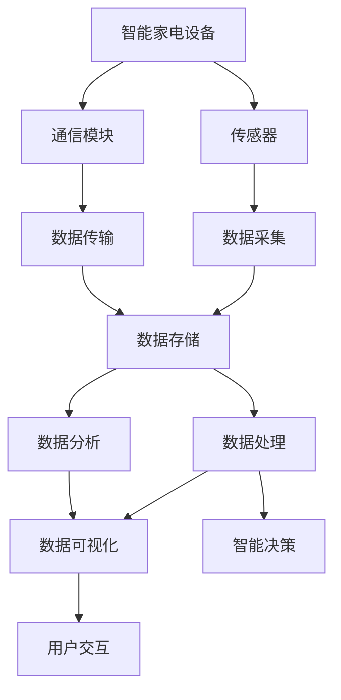

                 

# 未来的智能家居：2050年的家庭机器人管家与智能家电

> **关键词：智能家居，家庭机器人管家，智能家电，物联网，机器学习，自然语言处理，运动控制算法**

> **摘要：随着科技的飞速发展，智能家居行业迎来了前所未有的机遇和挑战。本文将从2050年智能家居的愿景和背景出发，详细探讨家庭机器人管家与智能家电的技术原理、实现方法以及实际应用案例，旨在为读者呈现一幅未来智能家居的精彩画卷。**

### 目录大纲

### 第一部分：2050年智能家居概述

#### 第1章：2050年智能家居愿景与背景

##### 1.1 2050年智能家居的全球趋势
##### 1.2 家庭机器人管家的角色与功能
##### 1.3 智能家电的发展与应用

#### 第2章：智能家庭网络架构

##### 2.1 智能家庭网络概述
##### 2.2 家庭机器人管家的通信架构
##### 2.3 智能家电互联互通

### 第二部分：智能家庭机器人管家技术

#### 第3章：家庭机器人管家的核心技术

##### 3.1 机器人视觉系统
##### 3.2 家庭机器人管家的核心算法
##### 3.3 家庭机器人管家的实际应用案例

### 第三部分：智能家电技术

#### 第6章：智能家电的物联网架构

##### 6.1 物联网概述
##### 6.2 智能家电的通信协议
##### 6.3 智能家电的数据处理与分析

#### 第7章：智能家电的核心技术

##### 7.1 智能家电的传感器技术
##### 7.2 智能家电的控制算法
##### 7.3 智能家电的用户界面设计

#### 第8章：智能家电的实际应用案例

##### 8.1 智能冰箱
##### 8.2 智能空调
##### 8.3 智能灯具

### 第四部分：智能家庭系统的综合应用

#### 第9章：智能家庭系统的设计原则

##### 9.1 智能家庭系统的架构设计
##### 9.2 家庭机器人管家与智能家电的协同工作
##### 9.3 智能家庭系统的用户体验设计

#### 第10章：智能家庭系统的安全与隐私保护

##### 10.1 智能家庭系统的安全挑战
##### 10.2 安全防护措施
##### 10.3 隐私保护机制

#### 第11章：智能家庭系统的发展趋势

##### 11.1 未来智能家居的展望
##### 11.2 智能家居与物联网的深度融合
##### 11.3 智能家居的产业生态链建设

### 附录

#### 附录A：智能家居技术资源与工具

##### A.1 智能家居开发工具与平台
##### A.2 智能家居开源项目与框架
##### A.3 智能家居相关标准与协议

#### 附录B：智能家居项目实战案例

##### B.1 智能家居项目案例一：智能家居安防系统
##### B.2 智能家居项目案例二：智能家居节能系统
##### B.3 智能家居项目案例三：智能家居健康监测系统

### 引言

随着人工智能技术的不断进步，智能家居行业正迎来前所未有的发展机遇。从最初的简单远程控制家电，到如今智能语音助手、智能安防、智能医疗等领域的广泛应用，智能家居已经成为了现代家庭生活中不可或缺的一部分。然而，这一切仅仅是开始。随着科技的发展，我们可以预见，2050年的智能家居将更加智能化、个性化，家庭机器人管家和智能家电将变得更加普及和实用。

本文将从2050年智能家居的愿景和背景出发，详细探讨家庭机器人管家与智能家电的技术原理、实现方法以及实际应用案例。通过本文的阅读，读者将了解到智能家居领域的最新技术动态，对未来的智能家居生活有更深刻的理解和期待。

#### 2050年智能家居的全球趋势

到了2050年，智能家居行业将迎来一个全新的发展阶段，其全球趋势将呈现出以下几大特点：

**1. 人工智能的深度应用**

人工智能（AI）技术将在智能家居中发挥至关重要的作用。家庭机器人管家将具备更高级的认知能力，能够理解家庭成员的行为习惯、情绪变化以及个性化需求。通过深度学习和自然语言处理技术，机器人管家可以与家庭成员进行自然流畅的交流，提供个性化的生活服务和情感陪伴。

**2. 物联网（IoT）的全面融合**

物联网技术的普及将使得各种智能家电设备无缝连接，形成一个高度整合的智能家庭生态系统。所有家电设备都将通过物联网协议进行通信，实现数据的实时共享和协同工作。家庭机器人管家将成为这个生态系统的核心，负责协调各个智能设备，为家庭成员提供一站式的生活服务。

**3. 数据驱动的个性化服务**

随着大数据技术的发展，智能家居系统将能够收集和分析大量的家庭数据，包括生活习惯、健康数据、能源消耗等。通过数据驱动的分析，智能家居系统可以为每个家庭成员提供个性化的建议和优化方案，从而提高生活质量和能源效率。

**4. 安全与隐私保护的重要性**

随着智能家居设备数量的增加，安全与隐私保护将变得更加重要。智能家居系统将采用更高级的安全机制，包括加密通信、访问控制、数据匿名化等，确保家庭成员的隐私不受侵犯。此外，家庭机器人管家将具备自我保护能力，能够在发现潜在威胁时及时采取应对措施。

**5. 智能家居的普及与普及化**

随着技术的不断成熟和成本的降低，智能家居将变得更加普及化。不仅城市家庭，甚至农村地区也将广泛采用智能家居设备。政府和企业将加大对智能家居产业的投入，推动相关标准的制定和推广，以促进智能家居的普及和发展。

**6. 智能家居与物联网的深度融合**

智能家居将与物联网（IoT）深度融合，形成一个高度智能化的生态系统。智能家居设备将具备自适应能力，能够根据家庭成员的需求和环境变化自动调整工作状态。家庭机器人管家将具备全局意识，能够统筹安排家庭成员的生活和工作，提高家庭生活的整体效率。

**7. 智能家居的可持续性**

智能家居系统将注重可持续性，通过智能化的能源管理和环保设计，降低家庭的能源消耗和碳排放。家庭机器人管家将具备环保意识，鼓励家庭成员采取环保的生活方式，共同建设绿色家园。

综上所述，2050年的智能家居将是一个高度智能化、个性化、安全、可持续的生态系统，它将深刻改变人们的生活方式，为家庭成员提供更加舒适、便捷、健康的生活环境。随着科技的不断进步，这一愿景将逐步成为现实。

#### 家庭机器人管家的角色与功能

在2050年的智能家居系统中，家庭机器人管家将成为家庭成员生活中的重要伙伴。家庭机器人管家的角色和功能将涵盖多个方面，从而全面提升家庭成员的生活质量和幸福感。

**1. 生活助手**

家庭机器人管家首先是一个全面的生活助手，能够协助家庭成员处理日常生活中的各种事务。它可以通过自然语言处理技术，理解家庭成员的语音指令，并根据指令执行相应的任务。例如，它可以帮家庭成员设置闹钟、提醒日程安排、预定餐厅、购买日用品等。家庭机器人管家还可以根据家庭成员的饮食偏好和健康状况，推荐合适的食谱和健康建议，甚至能够协助烹饪，为家庭成员提供美味的餐点。

**2. 情感陪伴**

随着人工智能技术的进步，家庭机器人管家将具备更高的情感认知能力，能够理解和表达情感。它不仅能够与家庭成员进行语言交流，还可以通过面部表情和身体语言进行互动。例如，当家庭成员感到沮丧或孤独时，家庭机器人管家可以通过陪伴和安慰来提升他们的情绪。此外，家庭机器人管家还可以通过语音合成技术和情感建模，模拟出与人类相似的对话风格，让家庭成员感受到温暖和关爱。

**3. 安全守护**

家庭机器人管家还将承担安全守护者的角色，为家庭成员提供全方位的安全保障。它可以通过配备的传感器和摄像头，实时监控家庭环境，检测异常情况并及时发出警报。例如，当有入侵者闯入时，家庭机器人管家可以立即通知家庭成员，并采取相应的应对措施，如拨打紧急电话或启动安防系统。此外，家庭机器人管家还可以协助家庭成员进行健康监测，如定期测量血压、心率等生命体征，并在发现异常时及时提醒家庭成员就医。

**4. 教育与娱乐**

家庭机器人管家将成为家庭成员特别是儿童的教育伙伴，通过互动游戏和互动课程，激发他们的学习兴趣和创造力。它还可以根据家庭成员的兴趣爱好，推荐适合的娱乐内容，如音乐、电影、书籍等。例如，当家庭成员感到无聊时，家庭机器人管家可以播放一首喜欢的歌曲，或讲述一个有趣的故事，让家庭成员享受愉快的时光。

**5. 家庭管理**

家庭机器人管家还将负责家庭的管理工作，包括财务管理、家务安排、能源管理等方面。它可以通过智能算法，优化家庭成员的日常生活安排，提高家庭运行效率。例如，它可以协助家庭成员制定合理的预算，监控家庭支出，并在发现异常时提醒家庭成员。此外，家庭机器人管家还可以根据家庭成员的作息时间，自动安排家务任务，如扫地、洗衣、烹饪等，减轻家庭成员的负担。

**6. 自我维护**

家庭机器人管家将具备自我维护能力，能够自行检查和维护自身系统。例如，当发现电池电量不足时，它可以通过智能预约，自动前往充电站充电。此外，家庭机器人管家还可以定期进行系统升级，确保自身功能始终保持最佳状态。

**7. 环境控制**

家庭机器人管家还将负责家庭环境的智能控制，包括温度、湿度、光照等。它可以通过传感器实时监测环境参数，并根据家庭成员的需求和环境变化，自动调节空调、空气净化器、灯具等家电设备。例如，当家庭成员入睡时，家庭机器人管家可以自动调整房间温度和光线，提供一个舒适、安静的睡眠环境。

综上所述，家庭机器人管家的角色和功能将非常多样化，它不仅能够提升家庭成员的生活质量，还能够在多个方面提供支持和帮助。随着人工智能技术的不断进步，家庭机器人管家将成为未来智能家居系统中的核心组件，为家庭成员创造一个更加智能、舒适、安全的生活环境。

#### 智能家电的发展与应用

智能家电作为智能家居系统的重要组成部分，其发展与应用对提升家庭生活质量具有重要意义。以下从智能家电的定义、发展历程、应用场景等方面进行详细探讨。

**1. 定义**

智能家电，指的是通过物联网（IoT）技术、人工智能（AI）技术和大数据分析，实现互联互通、自主学习和智能控制的家电商品类产品。它们能够根据用户需求和环境变化，自主调整工作状态，提供个性化的服务。

**2. 发展历程**

智能家电的发展历程可以追溯到20世纪末。当时，一些家电厂商开始尝试将简单的无线通信模块集成到家电产品中，实现远程控制和状态监测。随着物联网技术的发展，智能家电逐渐具备互联互通的能力，多个家电设备可以形成一个协同工作的智能网络。近年来，人工智能和大数据技术的引入，使得智能家电能够更加智能化地学习用户行为和需求，提供个性化的服务。

**3. 应用场景**

（1）智能照明

智能灯具可以通过物联网协议与手机或其他智能设备连接，实现远程控制。用户可以通过手机APP或语音助手，随时随地调整灯光的亮度和颜色，满足不同的生活场景需求。例如，早晨用户可以设置自动唤醒灯，晚上则可以设置柔和的睡眠灯。此外，智能灯具还可以与智能窗帘系统联动，根据光线强度自动调整窗帘的开合，提升用户的睡眠质量。

（2）智能空调

智能空调具备自我学习和智能调节功能，可以根据室内外温度、湿度以及用户的历史使用数据，自动调整温度和风速。用户还可以通过手机APP或语音助手，远程控制空调的开关和设置。例如，当用户即将回家时，可以提前开启空调，确保回到家时室内温度舒适。智能空调还可以与空气净化器联动，实时监测空气质量，自动开启空气净化模式，保障家庭成员的健康。

（3）智能冰箱

智能冰箱不仅具备传统的冷藏、冷冻功能，还可以通过物联网技术实现与手机或其他智能设备的连接。用户可以通过手机APP查看冰箱内食物的存储情况和保质期，自动生成购物清单，提醒用户及时补充食物。智能冰箱还可以根据食物的种类和数量，自动调整冷藏室的温度和湿度，延长食物的保鲜期。此外，智能冰箱还可以与智能厨房设备联动，实现智能烹饪功能，为用户提供便捷的料理服务。

（4）智能洗衣机

智能洗衣机具备自学习功能，可以自动识别衣物的种类和污渍程度，调整洗涤模式和水温。用户可以通过手机APP远程控制洗衣机，预约洗涤时间，避免高峰期洗衣服的等待时间。智能洗衣机还可以与智能烘干机联动，根据洗涤结果自动启动烘干程序，确保衣物干净、舒适。此外，智能洗衣机还可以通过物联网协议与其他家电设备联动，如智能窗帘和智能灯具，根据用户的洗涤习惯和时间，自动调整房间环境，提升用户体验。

（5）智能安防设备

智能安防设备包括智能摄像头、智能门锁、烟雾报警器等，通过物联网技术实现互联互通，提供全方位的家庭安全保护。用户可以通过手机APP实时查看家庭环境，及时了解家庭成员的安全状况。例如，当有入侵者闯入时，智能摄像头可以自动拍摄视频，并通知用户和报警系统。智能门锁可以通过手机APP远程控制，确保家庭成员的安全。烟雾报警器可以实时监测室内空气质量，一旦检测到烟雾，立即发出警报，提醒家庭成员及时逃生。

**4. 未来发展趋势**

未来，智能家电将向更加智能化、个性化、安全、节能的方向发展。随着人工智能技术的不断进步，智能家电将具备更高的自我学习和决策能力，能够更加准确地预测用户需求，提供个性化的服务。此外，智能家电还将更加注重安全与隐私保护，采用更加严格的安全机制，确保用户数据的安全。同时，智能家电将更加节能环保，通过智能化的能源管理，降低家庭的能源消耗和碳排放，为建设绿色家园贡献力量。

综上所述，智能家电的发展与应用将极大地提升家庭生活的质量和便捷性。随着科技的不断进步，智能家电将更加普及，成为未来智能家居系统中的重要组成部分。

#### 智能家庭网络架构

智能家庭网络架构是连接家庭内各种智能设备和系统的核心，确保数据的高效传输和功能的协同运作。以下从网络架构概述、家庭机器人管家的通信架构以及智能家电互联互通等方面进行详细探讨。

**1. 网络架构概述**

智能家庭网络架构通常分为三个层级：感知层、网络层和应用层。

- **感知层**：包括各种智能传感器和设备，如温度传感器、湿度传感器、光照传感器、智能插座等。这些设备能够实时采集家庭环境数据和家电设备的运行状态，并将数据传输到网络层。
- **网络层**：负责数据的传输和通信，通常采用无线通信技术，如Wi-Fi、蓝牙、Zigbee等。网络层将感知层采集到的数据传输到云端或本地服务器，同时接收来自云端或服务器的控制指令，实现智能设备的远程控制和协同工作。
- **应用层**：是智能家庭网络的核心，负责数据的处理和分析，提供智能化的应用和服务。应用层通常包括家庭机器人管家、智能家电控制中心、智能家居APP等。通过应用层，家庭成员可以实时监控家庭环境、设备状态，并进行个性化设置和操作。

**2. 家庭机器人管家的通信架构**

家庭机器人管家的通信架构是智能家庭网络架构中的重要组成部分。它通常包括以下几部分：

- **感知模块**：包括各种传感器，如视觉传感器、语音传感器、运动传感器等。这些传感器能够实时感知家庭环境的变化，为家庭机器人管家提供必要的信息。
- **通信模块**：采用无线通信技术，如Wi-Fi、蓝牙等，实现家庭机器人管家与云端服务器、智能家电以及其他设备之间的数据传输和通信。
- **控制模块**：负责接收来自云端服务器或用户的指令，通过感知模块和通信模块实现家庭机器人管家的控制。控制模块还具备自主决策能力，能够根据家庭环境和用户需求，自主调整工作状态和执行任务。

家庭机器人管家的通信架构示意图如下：



**3. 智能家电互联互通**

智能家电互联互通是实现智能家庭系统协同工作的重要保障。智能家电设备通过物联网协议（如Wi-Fi、蓝牙、Zigbee等）实现相互连接，形成高度整合的智能网络。以下是一些常见的智能家电互联互通场景：

- **智能家居控制中心**：通过智能家庭控制中心（如智能音箱、智能面板等），用户可以远程控制家中的各种智能家电设备，实现一键操作和场景联动。例如，当用户下班回到家门口时，可以通过智能控制中心开启灯光、空调和窗帘，营造一个温馨舒适的家居环境。
- **场景联动**：智能家电设备可以相互联动，根据用户需求和环境变化，自动调整工作状态。例如，当家庭机器人管家检测到家庭成员入睡时，可以自动关闭灯光、调节空调温度，提供舒适的睡眠环境。
- **数据共享**：智能家电设备可以通过物联网协议共享数据，实现信息的互联互通。例如，智能冰箱可以与智能洗衣机共享食物存储数据，提醒用户及时清洁衣物，确保衣物清洁和健康。
- **远程监控**：用户可以通过手机APP或其他智能设备，远程监控家中的智能家电设备状态，如温度、湿度、能源消耗等。例如，用户可以通过手机APP远程关闭家中的电器设备，避免不必要的能源浪费。

**4. 智能家庭网络架构的挑战与解决方案**

尽管智能家庭网络架构具有巨大的潜力和优势，但在实际应用中仍面临一些挑战：

- **通信延迟**：由于家庭网络环境复杂，通信延迟可能会影响智能设备的响应速度。解决方案包括优化通信协议、提高网络带宽、采用边缘计算等。
- **安全性**：智能家庭网络中的设备数量庞大，且涉及敏感数据，如家庭安全、健康数据等。安全性是智能家庭网络架构的关键挑战。解决方案包括采用加密通信、访问控制、数据匿名化等安全技术。
- **兼容性**：不同品牌和型号的智能家电设备可能采用不同的通信协议和标准，导致互联互通困难。解决方案包括制定统一的标准和协议，推动智能家电设备的兼容性和标准化。

综上所述，智能家庭网络架构是未来智能家居系统的核心，通过构建高效、安全、兼容的网络架构，实现家庭内各种智能设备和系统的无缝连接和协同工作，为家庭成员提供更加智能、便捷、舒适的生活环境。

### 家庭机器人管家的核心技术

家庭机器人管家的核心技术是确保其能够高效、智能地执行各种任务，为家庭成员提供全方位的服务。以下是家庭机器人管家的三大核心技术：机器人视觉系统、运动控制算法和自然语言处理算法。

#### 机器人视觉系统

机器人视觉系统是家庭机器人管家的核心感知模块之一，它通过图像采集和处理，实现对周围环境的感知和理解。以下是机器人视觉系统的核心组成部分：

1. **视觉传感器与数据处理**

   视觉传感器主要包括摄像头、深度传感器等，用于采集家庭环境中的图像和深度信息。家庭机器人管家需要对这些传感器采集到的数据进行处理，包括图像增强、去噪、边缘检测等，以提高图像的质量和清晰度。

   ```mermaid
   graph TD
       A[摄像头] --> B[图像数据]
       A --> C[深度传感器]
       B --> D[图像预处理]
       C --> D
   ```

2. **视觉算法与深度学习**

   视觉算法是实现机器人视觉系统智能化的关键。深度学习技术为视觉算法提供了强大的工具，通过训练神经网络模型，机器人视觉系统可以自动学习和识别家庭环境中的各种物体、场景和动作。

   ```mermaid
   graph TD
       A[输入图像] --> B[神经网络]
       B --> C[输出结果]
       C --> D[物体识别]
       C --> E[场景识别]
       C --> F[动作识别]
   ```

3. **Mermaid流程图：机器人视觉系统的架构**

   家庭机器人视觉系统的整体架构可以概括为以下几个步骤：

   ```mermaid
   graph TD
       A[感知环境] --> B[图像采集]
       B --> C[预处理]
       C --> D[物体识别]
       D --> E[场景理解]
       D --> F[动作预测]
       F --> G[决策执行]
   ```

#### 运动控制算法

运动控制算法是家庭机器人管家的核心执行模块，它负责根据感知到的环境和任务要求，生成合适的运动控制指令，驱动机器人执行任务。以下是运动控制算法的核心组成部分：

1. **运动控制算法原理讲解**

   运动控制算法主要包括以下几种：

   - **路径规划算法**：用于确定机器人从当前点到目标点的最优路径。常见的算法有A*算法、Dijkstra算法等。

   - **轨迹跟踪算法**：用于确保机器人按照预定路径精确运动。常见的算法有PID控制、自适应控制等。

   - **避障算法**：用于检测和避免机器人与周围障碍物的碰撞。常见的算法有基于距离的避障、基于视觉的避障等。

   ```mermaid
   graph TD
       A[感知环境] --> B[路径规划]
       B --> C[轨迹跟踪]
       C --> D[避障]
       D --> E[运动执行]
   ```

2. **伪代码：运动控制算法实现**

   运动控制算法的伪代码实现如下：

   ```python
   def move_to_destination(current_position, target_position):
       path = plan_path(current_position, target_position)
       for point in path:
           track_trajectory(point)
           avoid_obstacles()
       execute_motion()
   ```

3. **数学模型：运动控制算法中的数学公式**

   运动控制算法中的数学模型主要包括：

   - **路径规划模型**：如A*算法中的目标函数 f(n) = g(n) + h(n)，其中 g(n) 为从起点到节点 n 的实际距离，h(n) 为从节点 n 到终点的预估距离。

   - **轨迹跟踪模型**：如PID控制中的输出公式 u(t) = K_p * e(t) + K_i * ∫e(t) dt + K_d * de(t)/dt，其中 e(t) 为误差，u(t) 为控制输出。

   - **避障模型**：如基于距离的避障算法中的距离计算公式 d = √(dx² + dy²)，其中 dx 和 dy 分别为机器人当前位置与障碍物之间的水平距离和垂直距离。

#### 自然语言处理算法

自然语言处理（NLP）算法是家庭机器人管家的核心智能模块，它使机器人能够理解人类语言并生成自然语言响应。以下是自然语言处理算法的核心组成部分：

1. **自然语言处理算法原理讲解**

   自然语言处理算法主要包括以下几种：

   - **分词算法**：将自然语言文本分割成有意义的单词或短语，如基于词典的分词算法、基于统计的分词算法等。

   - **语法解析算法**：对自然语言文本进行语法分析，构建句子的语法结构，如依存句法分析、成分句法分析等。

   - **语义理解算法**：对自然语言文本进行语义分析，理解其含义和上下文关系，如词义消歧、实体识别、情感分析等。

   ```mermaid
   graph TD
       A[输入文本] --> B[分词]
       B --> C[语法解析]
       C --> D[语义理解]
       D --> E[响应生成]
   ```

2. **伪代码：自然语言处理算法实现**

   自然语言处理算法的伪代码实现如下：

   ```python
   def process_text(input_text):
       tokens = tokenize(input_text)
       parsed_tree = parse语法(tokens)
       semantics = understand_semantics(parsed_tree)
       response = generate_response(semantics)
       return response
   ```

3. **数学模型：自然语言处理算法中的数学公式**

   自然语言处理算法中的数学模型主要包括：

   - **分词模型**：如基于统计的分词算法中的最大熵模型，其公式为 P(w|t) = e^λ_t^T w / Σ e^λ_t^T v，其中 λ_t 为特征权重，w 和 v 分别为词汇和特征。

   - **语法解析模型**：如依存句法分析中的依存关系矩阵 D，其中 D_ij 表示词汇 i 和词汇 j 之间的依存关系。

   - **语义理解模型**：如词义消歧中的贝叶斯网络模型，其公式为 P(s|d) = P(d|s) * P(s) / P(d)，其中 s 和 d 分别为词义和文档。

综上所述，家庭机器人管家的核心技术包括机器人视觉系统、运动控制算法和自然语言处理算法。这些技术共同构成了家庭机器人管家的智能框架，使其能够高效地感知、理解和执行任务，为家庭成员提供全方位的服务。随着人工智能技术的不断进步，家庭机器人管家的智能水平将不断提高，未来有望成为智能家居系统中的核心组件。

### 家庭机器人管家的核心算法

家庭机器人管家的智能水平高度依赖于其核心算法，这些算法涵盖了运动控制、自然语言处理和机器学习等多个领域。以下是这些核心算法的详细解析。

#### 运动控制算法

运动控制算法是家庭机器人管家的关键执行模块，负责根据任务要求和环境信息生成合适的运动指令，确保机器人能够准确地完成任务。以下是运动控制算法的核心组成部分：

1. **伪代码：运动控制算法实现**

   运动控制算法的伪代码实现如下：

   ```python
   def control_motion(target_position, current_position):
       # 计算目标位置与当前位置的误差
       error = calculate_error(target_position, current_position)
       
       # 根据误差调整运动方向和速度
       velocity = calculate_velocity(error)
       
       # 驱动电机执行运动
       drive_motors(velocity)
       
       # 返回运动状态
       return error
   ```

2. **运动控制算法原理讲解**

   运动控制算法的原理基于控制理论，主要包括以下步骤：

   - **误差计算**：通过比较目标位置和当前位置，计算位置误差。
   - **速度调整**：根据误差的大小和方向，调整运动速度和方向。
   - **执行运动**：驱动电机执行调整后的运动。

   运动控制算法的核心是PID控制器，其基本原理是通过比例（P）、积分（I）和微分（D）三个环节调整控制输出，以减少误差并提高系统的稳定性。

   ```mermaid
   graph TD
       A[目标位置] --> B[误差计算]
       B --> C[速度调整]
       C --> D[执行运动]
       D --> E[反馈调整]
   ```

3. **数学模型：运动控制算法中的数学公式**

   运动控制算法中的数学模型主要包括：

   - **位置误差**：e(t) = target_position - current_position
   - **速度调整**：velocity(t) = Kp * e(t) + Ki * ∫e(t) dt + Kd * de(t)/dt
   - **控制输出**：u(t) = Kp * e(t) + Ki * ∫e(t) dt + Kd * de(t)/dt

   其中，Kp、Ki 和 Kd 分别为比例、积分和微分系数。

#### 自然语言处理算法

自然语言处理（NLP）算法是家庭机器人管家与家庭成员交流的关键，它负责理解和生成自然语言。以下是NLP算法的核心组成部分：

1. **伪代码：自然语言处理算法实现**

   NLP算法的伪代码实现如下：

   ```python
   def process_text(input_text):
       tokens = tokenize(input_text)
       parsed_tree = parse_grammar(tokens)
       semantics = understand_semantics(parsed_tree)
       response = generate_response(semantics)
       return response
   ```

2. **自然语言处理算法原理讲解**

   NLP算法的原理包括以下几个方面：

   - **分词算法**：将输入文本分割成单词或短语，如基于词典的分词算法、基于统计的分词算法等。
   - **语法解析算法**：对分词后的文本进行语法分析，构建句子的语法结构，如依存句法分析、成分句法分析等。
   - **语义理解算法**：对语法解析后的文本进行语义分析，理解其含义和上下文关系，如词义消歧、实体识别、情感分析等。

   ```mermaid
   graph TD
       A[输入文本] --> B[分词]
       B --> C[语法解析]
       C --> D[语义理解]
       D --> E[响应生成]
   ```

3. **数学模型：自然语言处理算法中的数学公式**

   NLP算法中的数学模型主要包括：

   - **分词模型**：如基于统计的分词算法中的最大熵模型，其公式为 P(w|t) = e^λ_t^T w / Σ e^λ_t^T v，其中 λ_t 为特征权重，w 和 v 分别为词汇和特征。
   - **语法解析模型**：如依存句法分析中的依存关系矩阵 D，其中 D_ij 表示词汇 i 和词汇 j 之间的依存关系。
   - **语义理解模型**：如词义消歧中的贝叶斯网络模型，其公式为 P(s|d) = P(d|s) * P(s) / P(d)，其中 s 和 d 分别为词义和文档。

#### 机器学习算法

机器学习算法是家庭机器人管家实现智能化的关键，它使机器人能够从数据中学习并做出决策。以下是机器学习算法的核心组成部分：

1. **伪代码：机器学习算法实现**

   机器学习算法的伪代码实现如下：

   ```python
   def train_model(training_data):
       # 初始化模型参数
       model = initialize_model()
       
       # 训练模型
       for data in training_data:
           model = update_model(model, data)
       
       return model
   ```

2. **机器学习算法原理讲解**

   机器学习算法的原理基于统计学习和优化理论，主要包括以下几个方面：

   - **数据收集与预处理**：收集大量的训练数据，并对数据进行清洗、归一化等预处理。
   - **模型选择与训练**：选择合适的模型结构，并通过训练数据调整模型参数，使其能够准确预测和分类。
   - **模型评估与优化**：通过测试数据评估模型性能，并根据评估结果调整模型参数，优化模型效果。

   ```mermaid
   graph TD
       A[数据收集] --> B[模型训练]
       B --> C[模型评估]
       C --> D[模型优化]
   ```

3. **数学模型：机器学习算法中的数学公式**

   机器学习算法中的数学模型主要包括：

   - **线性模型**：如线性回归，其公式为 y = wx + b，其中 y 为预测值，x 为特征值，w 为权重，b 为偏置。
   - **神经网络模型**：如多层感知机（MLP），其公式为 f(x) = σ(wx + b)，其中 σ 为激活函数，通常为ReLU或Sigmoid函数。
   - **支持向量机（SVM）**：其公式为 max_w ||w||_2，subject_to y_i (w * x_i + b) >= 1，其中 w 为权重向量，x_i 为训练样本，b 为偏置。

综上所述，家庭机器人管家的核心算法包括运动控制算法、自然语言处理算法和机器学习算法。这些算法共同作用，使家庭机器人管家能够高效地执行任务、与家庭成员互动并不断优化自身性能，为家庭生活提供全方位的智能服务。

### 家庭机器人管家的实际应用案例

家庭机器人管家在实际应用中展现了其广泛的功能和强大的智能水平。以下将介绍三个具体的实际应用案例：家庭医疗服务机器人、家庭安全守护机器人和家庭娱乐互动机器人，详细分析这些项目的技术实现、功能特点和实施流程。

#### 案例一：家庭医疗服务机器人

**项目背景与目标**

随着人口老龄化问题的加剧，家庭医疗服务需求日益增长。家庭医疗服务机器人旨在为老年人提供便捷的医疗服务，减轻护理人员的工作负担，提高老年人的生活质量和健康水平。

**技术实现与流程**

1. **感知与监测模块**：家庭医疗服务机器人配备了高精度传感器，包括体温传感器、心率传感器、血压传感器等，能够实时监测用户的生理指标。

2. **数据分析与处理模块**：机器人通过机器学习算法对用户生理数据进行分析，识别异常情况并生成健康报告。

3. **语音交互模块**：机器人具备自然语言处理能力，能够与用户进行语音互动，回答健康咨询、提供运动建议等。

4. **远程协作模块**：当机器人检测到严重异常时，可以自动通知家庭医生或医疗机构，实现远程医疗诊断和干预。

**流程**

- 用户通过语音命令或触摸屏与机器人互动，开始健康检查。
- 机器人采集生理数据并传输到云端进行分析。
- 机器人根据分析结果生成健康报告，并通过语音或屏幕显示给用户。
- 如有异常，机器人自动通知医生或医疗机构，进行远程诊断和指导。

**源代码解读**

```python
def monitor_health(user_id):
    # 采集生理数据
    temperature = read_temperature_sensor()
    heart_rate = read_heart_rate_sensor()
    blood_pressure = read_blood_pressure_sensor()
    
    # 数据分析
    health_report = analyze_health_data(temperature, heart_rate, blood_pressure)
    
    # 显示健康报告
    display_health_report(health_report)
    
    # 异常通知
    if is_anomaly(health_report):
        notify_doctor(user_id)
```

#### 案例二：家庭安全守护机器人

**项目背景与目标**

家庭安全是每个家庭关注的重点。家庭安全守护机器人旨在提供全方位的家庭安全保护，实时监控家庭环境，防止入侵和意外发生。

**技术实现与流程**

1. **感知与监控模块**：机器人配备了高清摄像头、红外传感器和烟雾传感器，能够全天候监控家庭环境。

2. **图像处理与分析模块**：机器人通过图像处理算法，识别家庭环境中的异常情况，如入侵者或火灾。

3. **语音交互模块**：机器人具备语音交互能力，能够在检测到异常时通知家庭成员并给出建议。

4. **自动响应模块**：机器人能够根据预设规则自动采取行动，如触发报警系统、拨打电话给家庭成员或报警中心。

**流程**

- 机器人持续监控家庭环境，采集图像和传感器数据。
- 图像处理与分析模块对采集的数据进行分析，识别异常情况。
- 如检测到异常，机器人通过语音交互模块通知家庭成员。
- 自动响应模块根据预设规则采取行动，确保家庭安全。

**源代码解读**

```python
def monitor_home_security():
    # 采集图像和传感器数据
    image = capture_image()
    sensors_data = read_sensors()
    
    # 分析数据
    anomalies = analyze_data(image, sensors_data)
    
    # 通知家庭成员
    if anomalies:
        notify_family_members(anomalies)
        
    # 自动响应
    respond_to_anomalies(anomalies)
```

#### 案例三：家庭娱乐互动机器人

**项目背景与目标**

家庭娱乐互动机器人旨在为家庭成员提供丰富多彩的娱乐体验，包括音乐、游戏、电影等，增强家庭的互动和娱乐氛围。

**技术实现与流程**

1. **语音交互模块**：机器人具备自然语言处理能力，能够与家庭成员进行语音互动，理解他们的需求。

2. **多媒体播放模块**：机器人支持音乐、电影、游戏等多种娱乐内容的播放，通过语音命令或触摸屏进行操作。

3. **互动游戏模块**：机器人提供多种互动游戏，如猜谜、棋类游戏等，增强家庭成员之间的互动。

4. **社交网络连接模块**：机器人能够连接社交网络，分享家庭成员的娱乐体验和成就。

**流程**

- 家庭成员通过语音命令或触摸屏与机器人互动，选择娱乐内容。
- 机器人根据指令播放音乐、电影或启动游戏。
- 在互动游戏中，家庭成员通过语音或动作与机器人互动。
- 成就分享到社交网络，增进家庭成员之间的联系。

**源代码解读**

```python
def entertain_family():
    # 接收互动指令
    command = receive_command()
    
    # 播放娱乐内容
    if command == "play_music":
        play_music()
    elif command == "play_movie":
        play_movie()
    elif command == "start_game":
        start_game()
        
    # 互动游戏
    while is_playing_game():
        game_status = update_game()
        if game_status == "win":
            share_to_social_network()
```

通过以上三个实际应用案例，我们可以看到家庭机器人管家的多样性和广泛的应用前景。随着技术的不断进步，家庭机器人管家的功能将更加完善，成为未来家庭生活中不可或缺的一部分。

### 智能家电的物联网架构

智能家电的物联网架构是智能家居系统中的关键组成部分，它使得各种家电设备能够互联互通，协同工作，为用户提供智能、便捷的生活体验。以下从物联网概述、智能家电的通信协议、智能家电的数据处理与分析等方面进行详细探讨。

#### 物联网概述

物联网（IoT）是指通过互联网将各种设备连接起来，实现信息交换和资源共享的网络。在智能家居领域，物联网技术使得家电设备能够通过互联网进行通信，形成一个高度整合的智能网络。物联网的关键特点包括：

1. **互联互通**：物联网将各种智能家电设备连接在一起，形成一个统一的网络平台，实现设备之间的数据共享和协同工作。
2. **数据驱动**：物联网技术使得智能家电设备能够实时采集、传输和分析数据，根据用户需求和实际环境调整工作状态，提供个性化的服务。
3. **智能控制**：通过物联网，用户可以通过智能手机、智能音箱等设备远程控制智能家电，实现远程管理和控制。
4. **自动化**：物联网技术可以实现家电设备的自动化操作，例如，当用户离开家时，智能家居系统能够自动关闭电器设备，节省能源。

#### 智能家电的通信协议

智能家电的通信协议是确保设备之间能够顺利通信和数据交换的关键。目前，常见的物联网通信协议包括Wi-Fi、蓝牙、Zigbee、NFC等。以下是对这些协议的简要介绍：

1. **Wi-Fi**：Wi-Fi是最常见的无线通信技术，具有较高的传输速率和稳定性。它适用于需要高带宽的智能家电设备，如智能电视、智能冰箱等。
2. **蓝牙**：蓝牙技术适用于短距离通信，具有低功耗和低延迟的特点。它适用于需要与手机或其他设备进行互动的智能家电，如智能音箱、智能手环等。
3. **Zigbee**：Zigbee是一种低功耗、低速率的无线通信技术，适用于家庭自动化和控制应用。它具有较好的网络扩展性和可靠性，适用于智能灯泡、智能插座等设备。
4. **NFC**：NFC（近场通信）是一种短距离无线通信技术，适用于设备之间的简单数据交换。它常用于智能家电的配对和初始化，如智能门锁、智能冰箱的RFID标签等。

#### 智能家电的数据处理与分析

智能家电通过物联网协议采集的数据需要进行处理和分析，以实现智能决策和优化。以下是数据处理与分析的核心步骤：

1. **数据采集**：智能家电设备通过传感器和通信模块实时采集各种数据，如温度、湿度、能耗等。
2. **数据传输**：采集到的数据通过物联网协议传输到中央控制单元或云端服务器。
3. **数据存储**：数据存储在数据库或云存储中，以便后续分析和处理。
4. **数据处理**：通过数据清洗、归一化、特征提取等技术对数据进行处理，为后续分析提供基础。
5. **数据分析**：利用大数据分析和机器学习算法对数据进行分析，提取有价值的信息，如用户行为模式、能源消耗趋势等。
6. **数据可视化**：将分析结果通过图表、报告等形式可视化，为用户提供直观的展示。
7. **智能决策**：根据分析结果，智能家电系统能够自动调整设备工作状态，优化家庭能源管理、设备维护等。

#### 智能家电的物联网架构图示

以下是智能家电的物联网架构示意图，展示了各个组成部分及其相互关系：



通过物联网架构，智能家电能够实现高度整合和智能化控制，为用户提供便捷、舒适、节能的生活环境。随着物联网技术的不断进步，智能家电的物联网架构将更加完善，为智能家居系统的发展提供强大支持。

### 智能家电的核心技术

智能家电的核心技术是保障其功能多样性和性能稳定性的关键，涵盖了传感器技术、控制算法和用户界面设计等方面。以下将详细探讨这些技术，包括其工作原理、实现方法及在智能家电中的应用。

#### 传感器技术

传感器技术是智能家电感知外部环境变化和内部状态的基础。以下是一些常见的传感器及其工作原理：

1. **温度传感器**：用于测量环境或设备内部的温度。常见的温度传感器有热敏电阻、热电偶等。热敏电阻的阻值随温度变化而变化，而热电偶则通过热电效应产生电压信号，从而实现温度测量。

2. **湿度传感器**：用于测量环境湿度，常见的有电容式和电阻式湿度传感器。电容式湿度传感器通过电容变化测量湿度，而电阻式湿度传感器则通过电阻变化测量湿度。

3. **光照传感器**：用于测量环境光照强度，常见的是光敏电阻和光电池。光敏电阻的阻值随光照强度变化而变化，而光电池则通过光照产生电流信号。

4. **气体传感器**：用于检测有害气体或特定气体浓度，如烟雾传感器、甲醛传感器等。常见的气体传感器有半导体传感器、电化学传感器等。

5. **运动传感器**：用于检测物体的运动状态，如红外传感器、超声波传感器等。红外传感器通过检测红外辐射变化感知运动，而超声波传感器则通过发射和接收超声波脉冲测量物体的距离。

传感器技术在智能家电中的应用非常广泛，例如，在智能空调中，温度传感器用于实时监测室内温度，调节制冷功率；在智能灯具中，光照传感器用于调节灯光亮度和颜色；在智能空气净化器中，气体传感器用于检测空气质量，自动启动净化功能。

#### 控制算法

控制算法是智能家电实现自动化和智能化操作的核心。以下是一些常见的控制算法及其原理：

1. **PID控制算法**：PID（比例-积分-微分）控制算法是一种经典的控制算法，广泛应用于工业和家用电器中。其原理是通过调整比例（P）、积分（I）和微分（D）三个参数，使输出信号稳定地跟踪目标信号。在智能家电中，PID控制算法可以用于温度控制、速度控制等。

2. **模糊控制算法**：模糊控制算法基于模糊逻辑，通过模糊推理和规则库实现控制。其优点是具有较强的鲁棒性和适应性，适用于处理不确定性和非线性问题。在智能家电中，模糊控制算法可以用于家电设备的自动调节，如空调的温湿度控制。

3. **机器学习算法**：机器学习算法通过训练模型，使智能家电具备自主学习和决策能力。常见的机器学习算法包括线性回归、决策树、神经网络等。在智能家电中，机器学习算法可以用于预测能源消耗、优化设备运行状态等。

控制算法在智能家电中的应用非常广泛，例如，在智能温控器中，PID控制算法用于调节加热或冷却功率，保持室内温度恒定；在智能照明系统中，模糊控制算法根据光线强度和用户需求自动调节灯光亮度和颜色；在智能冰箱中，机器学习算法根据用户购买习惯和食物存储情况优化冷藏室的温度和湿度设置。

#### 用户界面设计

用户界面设计是智能家电与用户交互的关键，其目的是提供简单、直观、易于操作的用户体验。以下是一些常见的用户界面设计方法：

1. **触摸屏**：触摸屏是一种直观、方便的交互方式，用户可以通过触摸屏幕进行操作，如调节温度、设置定时等功能。

2. **语音识别**：语音识别技术使智能家电能够通过语音命令进行操作，用户可以通过语音与智能家电进行互动，如播放音乐、设置闹钟等。

3. **图形用户界面（GUI）**：图形用户界面通过图标、菜单、按钮等元素，提供直观的交互体验。常见的GUI设计包括主界面、设置界面、状态显示等。

4. **手势控制**：手势控制技术通过检测用户的手势动作，实现智能家电的交互操作，如挥手关闭灯光、翻转开关空调等。

用户界面设计在智能家电中的应用非常广泛，例如，在智能电视中，触摸屏和语音识别技术用于播放控制、应用商店操作等；在智能空调中，图形用户界面和触摸屏用于设置温度、模式切换等；在智能冰箱中，手势控制技术用于打开冰箱门、调整冷藏室温度等。

综上所述，传感器技术、控制算法和用户界面设计是智能家电的核心技术，它们共同作用，使智能家电能够实现高度智能化、自动化和个性化操作，为用户提供便捷、舒适、安全的生活体验。

### 智能家电的实际应用案例

智能家电在现代家庭生活中扮演着越来越重要的角色，以下将介绍三个具体的实际应用案例：智能冰箱、智能空调和智能灯具，详细分析这些项目的技术实现、功能特点及实施流程。

#### 案例一：智能冰箱

**项目背景与目标**

随着家庭生活质量的提高，人们对食品保鲜和健康饮食的需求不断增加。智能冰箱旨在通过物联网技术和智能控制，实现食物的智能存储和健康管理，提升家庭生活品质。

**技术实现与流程**

1. **感知与监测模块**：智能冰箱配备了多种传感器，包括温度传感器、湿度传感器、气体传感器等，用于实时监测冰箱内的环境参数和食物状态。

2. **数据处理与分析模块**：智能冰箱通过嵌入式系统对传感器数据进行处理和分析，根据食物的存储需求调整冷藏室的温度和湿度。

3. **用户交互模块**：智能冰箱配备了触摸屏和语音助手，用户可以通过触摸屏或语音命令进行操作，如查看食物存储情况、设置食物提醒等。

4. **远程控制模块**：用户可以通过手机APP远程监控冰箱状态，调整设置，甚至在线购买食材。

**流程**

- 用户通过触摸屏或语音助手与智能冰箱互动，设置食物存储模式和提醒。
- 智能冰箱实时监测冰箱内部环境，根据食物的存储需求调整温度和湿度。
- 用户通过手机APP查看冰箱内食物存储情况，接收食物到期提醒。
- 用户可以通过手机APP远程控制冰箱，调整设置或在线购买食材。

**源代码解读**

```python
def monitor_fridge():
    # 采集传感器数据
    temperature = read_temp_sensor()
    humidity = read_humidity_sensor()
    gas_level = read_gas_sensor()
    
    # 分析数据并调整冰箱设置
    if temperature > safe_temp_threshold:
        set colder_temperature()
    elif humidity > safe_humidity_threshold:
        set drier_environment()
        
    # 用户交互
    display_status_on_touchscreen()
    respond_to_user_commands()
```

#### 案例二：智能空调

**项目背景与目标**

随着气候变化和环境恶化，人们对室内空气质量和生活舒适度的要求越来越高。智能空调旨在通过物联网技术和智能控制，实现室内空气的智能调节和健康维护，提升家庭生活质量。

**技术实现与流程**

1. **感知与监测模块**：智能空调配备了温度传感器、湿度传感器、空气质量传感器等，用于实时监测室内环境参数。

2. **数据处理与分析模块**：智能空调通过嵌入式系统对传感器数据进行处理和分析，根据室内环境自动调整温度、湿度、风量等参数。

3. **用户交互模块**：智能空调配备了触摸屏和语音助手，用户可以通过触摸屏或语音命令进行操作，如设置温度、模式切换等。

4. **远程控制模块**：用户可以通过手机APP远程监控空调状态，调整设置，甚至在线预约清洁服务。

**流程**

- 用户通过触摸屏或语音助手与智能空调互动，设置温度、模式等。
- 智能空调实时监测室内环境，根据设定自动调整温度、湿度、风量等参数。
- 用户通过手机APP查看空调状态，调整设置或预约清洁服务。

**源代码解读**

```python
def monitor_ac():
    # 采集传感器数据
    temperature = read_temp_sensor()
    humidity = read_humidity_sensor()
    air_quality = read_air_quality_sensor()
    
    # 分析数据并调整空调设置
    if temperature > set_temp_threshold:
        set_cool_mode()
    elif humidity > set_humidity_threshold:
        set_dry_mode()
    elif air_quality < set_air_quality_threshold:
        set_vent_mode()
        
    # 用户交互
    display_status_on_touchscreen()
    respond_to_user_commands()
```

#### 案例三：智能灯具

**项目背景与目标**

随着生活节奏的加快，人们对照明环境的要求越来越高。智能灯具旨在通过物联网技术和智能控制，实现照明的智能调节和氛围营造，提升家庭生活品质。

**技术实现与流程**

1. **感知与监测模块**：智能灯具配备了光照传感器、人体传感器等，用于实时监测室内光照强度和人员活动情况。

2. **数据处理与分析模块**：智能灯具通过嵌入式系统对传感器数据进行处理和分析，根据光照强度和人员活动自动调整灯光亮度和颜色。

3. **用户交互模块**：智能灯具配备了触摸开关和语音助手，用户可以通过触摸开关或语音命令进行操作，如调整灯光亮度和颜色等。

4. **远程控制模块**：用户可以通过手机APP远程监控灯具状态，调整设置，甚至设置定时开关灯。

**流程**

- 用户通过触摸开关或语音助手与智能灯具互动，设置灯光亮度和颜色。
- 智能灯具实时监测室内光照强度和人员活动情况，根据设定自动调整灯光亮度和颜色。
- 用户通过手机APP查看灯具状态，调整设置或设置定时开关灯。

**源代码解读**

```python
def monitor_light():
    # 采集传感器数据
    light_intensity = read_light_sensor()
    human_activity = read_human_sensor()
    
    # 分析数据并调整灯光设置
    if light_intensity < set_light_intensity_threshold:
        set_brighter_light()
    elif human_activity_detected():
        set_cool_light()
        
    # 用户交互
    respond_to_user_commands()
    display_status_on_touchscreen()
```

通过以上三个实际应用案例，我们可以看到智能家电在现代家庭生活中的广泛应用和巨大潜力。随着物联网技术的不断发展和创新，智能家电将越来越普及，为家庭生活带来更多的便利和舒适。

### 智能家庭系统的设计原则

智能家庭系统的设计原则是确保其高效、稳定、安全、易用的关键。以下从智能家庭系统的架构设计、家庭机器人管家与智能家电的协同工作以及用户体验设计等方面进行详细探讨。

#### 智能家庭系统的架构设计

智能家庭系统的架构设计需要考虑以下几个方面：

1. **分层架构**：智能家庭系统通常采用分层架构，包括感知层、网络层和应用层。感知层负责数据采集和感知环境变化；网络层负责数据传输和通信；应用层负责数据处理和提供用户服务。这种分层架构有助于提高系统的模块化和可扩展性。

2. **模块化设计**：智能家庭系统应采用模块化设计，将不同功能划分为独立的模块，如传感器模块、通信模块、控制模块等。模块之间通过标准接口进行通信，便于系统的升级和维护。

3. **高可靠性**：智能家庭系统需要具有高可靠性，确保在各种环境下稳定运行。在设计过程中，应考虑冗余设计、故障检测和自动恢复机制等，以提高系统的可靠性。

4. **安全性**：智能家庭系统涉及大量的家庭数据和隐私信息，安全性至关重要。系统应采用加密通信、访问控制和数据备份等安全措施，确保用户数据的安全和隐私。

5. **可扩展性**：智能家庭系统应具备良好的可扩展性，能够轻松集成新的设备和功能。在设计过程中，应考虑模块化、标准化和开放接口，以便在未来扩展系统功能。

#### 家庭机器人管家与智能家电的协同工作

家庭机器人管家与智能家电的协同工作是智能家庭系统的核心。以下是一些建议和实现方法：

1. **统一控制接口**：家庭机器人管家应提供一个统一的控制接口，便于与其他智能家电设备进行通信和协作。例如，可以采用物联网协议（如Wi-Fi、蓝牙等）或统一的数据格式（如JSON、XML等），实现设备之间的无缝连接。

2. **任务分配与协调**：家庭机器人管家应根据任务需求和设备能力，合理分配任务，确保系统高效运行。例如，当家庭成员需要清洁房间时，机器人管家可以指挥扫地机器人进行清洁，同时调整智能灯具的亮度，提供适宜的照明环境。

3. **实时通信与反馈**：家庭机器人管家与智能家电设备之间应实现实时通信和反馈机制，确保系统能够及时响应变化。例如，当家庭机器人管家发现家庭成员离开房间时，可以立即通知智能空调关闭，节省能源。

4. **自适应调整**：家庭机器人管家和智能家电设备应具备自适应调整能力，能够根据家庭成员的需求和环境变化自动调整工作状态。例如，当家庭成员入睡时，机器人管家可以自动调整灯光、空调等设备，提供舒适的睡眠环境。

#### 用户体验设计

用户体验设计是智能家庭系统成功的关键，以下是一些关键点：

1. **简洁直观的用户界面**：用户界面应简洁直观，便于用户快速上手。可以通过图形用户界面（GUI）、触摸屏、语音助手等多种方式，提供便捷的操作体验。

2. **个性化设置与推荐**：系统应支持个性化设置，根据用户习惯和需求自动调整功能。例如，可以基于用户的历史行为数据，推荐合适的设备设置和场景模式。

3. **实时反馈与通知**：系统应提供实时反馈和通知功能，确保用户及时了解设备状态和系统操作结果。例如，当智能家电设备完成某个任务时，可以发送通知提醒用户。

4. **灵活的交互方式**：系统应支持多种交互方式，如触摸屏、语音命令、手势控制等，满足不同用户的需求。例如，对于视力不佳的用户，可以提供大字体和语音提示功能。

5. **安全与隐私保护**：系统应高度重视安全与隐私保护，采用加密通信、访问控制等安全措施，确保用户数据的安全和隐私。例如，可以设置用户访问密码、数据匿名化等。

综上所述，智能家庭系统的设计原则包括分层架构、模块化设计、高可靠性、安全性、可扩展性以及用户体验设计等方面。通过遵循这些原则，可以构建高效、稳定、安全、易用的智能家庭系统，为家庭成员提供便捷、舒适、智能的生活环境。

### 智能家庭系统的安全与隐私保护

随着智能家庭系统的广泛应用，其安全与隐私保护问题日益受到关注。智能家庭系统涉及大量的家庭数据和隐私信息，一旦遭受攻击或泄露，可能导致严重的后果。以下从安全挑战、安全防护措施和隐私保护机制等方面进行详细探讨。

#### 安全挑战

1. **数据泄露风险**：智能家庭系统中的大量数据，包括家庭成员的身份信息、健康数据、生活习惯等，都可能成为黑客攻击的目标。一旦数据泄露，可能导致隐私侵犯、财产损失等。

2. **网络攻击风险**：智能家庭系统通常通过互联网进行通信，网络攻击如DDoS攻击、SQL注入等可能破坏系统的正常运行，甚至导致设备失控。

3. **设备入侵风险**：智能家庭设备可能存在安全漏洞，黑客可以通过入侵设备控制系统，操控家电设备，对家庭安全构成威胁。

4. **物理安全风险**：智能家庭设备如摄像头、智能锁等，可能遭受物理攻击，如被破坏、篡改等，导致隐私泄露或设备失控。

#### 安全防护措施

1. **加密通信**：智能家庭系统应采用加密通信技术，如TLS/SSL等，确保数据在传输过程中的安全。同时，设备之间的通信也应加密，防止中间人攻击。

2. **访问控制**：智能家庭系统应采用严格的访问控制机制，确保只有授权用户才能访问敏感数据和设备。例如，可以通过用户名和密码、双因素认证等方式，提高系统的安全性。

3. **安全更新与补丁**：智能家庭设备应定期进行安全更新和补丁安装，修复已知的安全漏洞，防止黑客利用漏洞入侵设备。

4. **防火墙与入侵检测系统**：智能家庭系统应配置防火墙和入侵检测系统，实时监控网络流量，识别和阻止恶意攻击。

5. **设备锁定与远程控制**：智能家庭设备应支持锁定功能，防止未经授权的物理访问。同时，用户可以通过远程控制设备，确保设备的安全状态。

#### 隐私保护机制

1. **数据匿名化**：智能家庭系统应对用户数据进行匿名化处理，确保用户无法通过数据识别出具体个人。例如，可以通过加密、哈希等方式，对数据进行处理。

2. **隐私设置与管理**：智能家庭系统应提供隐私设置和管理功能，用户可以根据自己的需求，选择共享或限制数据的访问权限。

3. **隐私政策与透明度**：智能家庭系统应制定明确的隐私政策，告知用户数据收集、使用和存储的方式，增强用户对隐私保护的信任。

4. **隐私保护培训与意识**：智能家庭系统应加强对用户隐私保护的培训和教育，提高用户的隐私保护意识和能力。

5. **第三方审计与合规**：智能家庭系统应定期进行第三方审计，确保系统的隐私保护措施符合相关法律法规和标准。

综上所述，智能家庭系统的安全与隐私保护至关重要。通过采取加密通信、访问控制、安全更新、防火墙等安全措施，以及数据匿名化、隐私设置、政策透明度等隐私保护机制，可以有效保障用户数据的安全和隐私，为智能家庭系统的广泛应用奠定坚实基础。

### 智能家庭系统的发展趋势

随着科技的不断进步，智能家庭系统正在朝着更加智能化、互联化和个性化的方向发展。以下从未来智能家居的展望、智能家居与物联网的深度融合以及智能家居的产业生态链建设等方面进行详细探讨。

#### 未来智能家居的展望

1. **更高程度的智能化**：未来智能家居系统将更加智能化，具备更高的人工智能水平。家庭机器人管家将不仅仅局限于执行简单的任务，而是能够进行复杂的决策和自主学习，成为家庭成员的智能助手。例如，通过深度学习和自然语言处理技术，机器人管家可以更好地理解家庭成员的需求，提供个性化的生活服务和情感陪伴。

2. **更广泛的互联性**：未来智能家居系统将实现更广泛的互联，不仅仅局限于家庭内部的设备连接，还将与其他智能系统（如智能城市、智能交通等）进行无缝连接。通过物联网技术的深入应用，智能家居系统将形成一个全球性的智能网络，实现跨区域、跨系统的数据共享和协同工作。

3. **更高效的数据利用**：随着大数据和云计算技术的发展，未来智能家居系统将能够更加高效地利用数据。通过大数据分析，智能家居系统能够更准确地预测用户需求，优化家庭能源管理，提高生活质量和能源效率。例如，智能空调可以根据用户的作息时间和天气情况，自动调整温度和风速，提供舒适的室内环境。

4. **更便捷的操作体验**：未来智能家居系统的操作体验将更加便捷，用户可以通过语音、手势、虚拟现实等多种方式进行交互。例如，用户可以通过语音助手与智能家电设备进行自然语言交流，轻松实现设备控制、信息查询等功能。同时，智能家居系统将提供个性化推荐和服务，满足用户的个性化需求。

#### 智能家居与物联网的深度融合

1. **智能家居物联网平台**：未来智能家居系统将基于统一的物联网平台，实现设备的互联互通和协同工作。智能家居物联网平台将提供一个开放、标准化的接口，使得各种智能设备能够无缝连接和通信，为用户提供一致、便捷的操作体验。

2. **边缘计算与云计算相结合**：未来智能家居系统将充分利用边缘计算和云计算的优势，实现数据处理的分布式和高效化。边缘计算将处理本地数据，降低网络延迟，提高系统的实时性和响应速度；而云计算则提供海量数据的存储和计算能力，支持智能家居系统的数据分析和智能化应用。

3. **智能设备的自组织与自适应**：未来智能家居系统中的智能设备将具备自组织与自适应能力，能够根据用户需求和环境变化自主调整工作状态。例如，智能家电设备可以通过物联网协议相互通信，自动协调工作，为用户提供一站式的生活服务。此外，智能设备还将具备自我维护和升级能力，确保系统的稳定性和安全性。

#### 智能家居的产业生态链建设

1. **产业链整合**：未来智能家居产业的发展将更加注重产业链的整合，包括硬件设备制造商、软件开发商、系统集成商、服务提供商等各个环节。通过产业链的整合，智能家居系统能够实现更高的协同效应，为用户提供更优质、更全面的智能服务。

2. **开放平台与合作**：未来智能家居产业将更加开放，鼓励各企业之间的合作与竞争。智能家居平台将提供开放的接口和标准，使得不同厂商的智能设备能够无缝集成和互操作，为用户提供丰富的选择和便捷的使用体验。

3. **技术创新与标准制定**：未来智能家居产业将注重技术创新和标准制定，推动智能家居技术的快速发展和标准化。通过技术创新，智能家居系统能够实现更高的性能和更低的成本；而通过标准制定，智能家居系统能够实现跨品牌、跨平台的一致性和互操作性。

4. **产业政策与法规支持**：政府将加大对智能家居产业的政策和法规支持，推动智能家居产业的健康发展。通过制定相关的产业政策和法规，规范智能家居产品的生产和销售，保障用户的权益，促进智能家居产业的良性发展。

综上所述，未来智能家居系统将朝着智能化、互联化、个性化方向发展，通过物联网技术的深入应用，实现设备的互联互通和协同工作。同时，智能家居产业将加强产业链整合、开放平台与合作，推动技术创新和标准制定，为用户提供更优质、更便捷的智能生活体验。

### 附录A：智能家居技术资源与工具

**A.1 智能家居开发工具与平台**

在智能家居开发领域，有许多工具和平台可供选择，帮助开发者快速搭建智能家庭系统。以下是一些常用的开发工具与平台：

1. **HomeKit**：苹果公司推出的智能家居平台，支持多种智能设备的连接和控制。开发者可以通过HomeKit SDK，将智能设备集成到iOS系统中。

2. **Google Home**：谷歌推出的智能家居控制中心，通过Google Assistant实现智能设备的控制。开发者可以使用Google Home SDK，开发针对Android系统的智能家居应用。

3. **Amazon Alexa**：亚马逊推出的智能家居平台，通过Alexa语音助手控制智能设备。开发者可以使用Alexa Skills Kit（ASK）开发自定义技能，扩展Alexa的功能。

4. **eWeLink**：一款跨平台的智能硬件开发平台，支持多种通信协议，如Wi-Fi、蓝牙、Zigbee等。开发者可以使用eWeLink SDK，快速搭建智能设备连接和控制的系统。

5. **IFTTT**：一个用于自动化任务的平台，支持各种智能设备和服务之间的互联。开发者可以通过IFTTT的Webhook等工具，实现智能家居设备的自动化控制。

**A.2 智能家居开源项目与框架**

开源项目为智能家居开发者提供了丰富的资源和参考，以下是一些常用的开源项目与框架：

1. **HomeAssistant**：一个开源的智能家居控制中心，支持多种智能设备的连接和控制。开发者可以使用HomeAssistant的API，开发自定义的智能家电插件。

2. **OpenHAB**：一个开源的智能家居平台，支持多种编程语言和开发工具。开发者可以使用OpenHAB的规则引擎和REST API，实现智能设备的自动化控制和数据监控。

3. **Node-RED**：一个基于Node.js的开源工具，用于连接各种硬件设备和云服务，实现数据流处理和自动化任务。开发者可以使用Node-RED的图形化界面，轻松搭建智能家居系统的数据流处理和自动化控制。

4. **ESP8266/ESP32**：基于Wi-Fi模块的开源硬件平台，适用于智能家居设备开发。开发者可以使用Arduino IDE，开发基于ESP8266/ESP32的智能设备，并将其连接到智能家居平台。

**A.3 智能家居相关标准与协议**

智能家居领域的相关标准与协议对于设备的互联互通和互操作性至关重要。以下是一些常用的智能家居标准与协议：

1. **Wi-Fi**：无线局域网通信技术，广泛用于智能家居设备的连接和控制。Wi-Fi 802.11 b/g/n/ac/ax等标准支持高速数据传输和稳定的网络连接。

2. **Zigbee**：一种低功耗、短距离的无线通信技术，适用于智能家居设备的组网和控制。Zigbee 3.0标准增强了安全性和数据传输效率，适用于智能家居系统的广泛应用。

3. **蓝牙**：短距离无线通信技术，广泛用于智能家居设备的控制与连接。蓝牙5.0及更高版本支持更高的传输速率和更好的连接稳定性。

4. **Thread**：一种基于IPv6的无线通信技术，适用于智能家居设备的组网和控制。Thread标准支持自组织网络和高效数据传输，适用于复杂智能家居系统的搭建。

5. **MQTT**：一种轻量级的消息队列传输协议，广泛用于物联网设备的通信。MQTT协议支持设备之间的低延迟、可靠传输，适用于智能家居系统的数据传输和控制。

通过以上智能家居技术资源与工具，开发者可以轻松搭建和管理智能家庭系统，实现设备的互联互通和智能控制。随着智能家居技术的不断发展和创新，这些资源和工具将为智能家居行业带来更多的机遇和可能性。

### 附录B：智能家居项目实战案例

**B.1 智能家居项目案例一：智能家居安防系统**

**项目背景与目标**

随着智能家居技术的普及，家庭安全成为用户关注的重点。本项目旨在通过物联网技术，构建一个智能家居安防系统，实现家庭环境的实时监控和远程报警，提高家庭安全水平。

**技术实现与流程**

1. **感知层**：项目采用多种传感器，包括摄像头、门窗传感器、烟雾传感器、红外传感器等，实现对家庭环境的全面监控。

2. **网络层**：传感器采集的数据通过Wi-Fi或Zigbee协议传输到智能网关，智能网关将数据上传到云端服务器。

3. **数据处理层**：云端服务器对上传的数据进行实时分析，识别异常情况，如入侵、火灾等，并触发报警机制。

4. **控制层**：用户可以通过手机APP或智能音箱，远程控制安防系统，如查看监控视频、控制警报开关、远程报警等。

**源代码解读**

```python
# 智能家居安防系统源代码

def monitor_home_security():
    # 采集传感器数据
    camera_data = capture_video()
    window_sensor_data = read_window_sensor()
    smoke_sensor_data = read_smoke_sensor()
    motion_sensor_data = read_motion_sensor()
    
    # 数据上传到云端
    upload_data_to_cloud(camera_data, window_sensor_data, smoke_sensor_data, motion_sensor_data)
    
    # 实时分析数据
    anomalies = analyze_data(camera_data, window_sensor_data, smoke_sensor_data, motion_sensor_data)
    
    # 触发报警机制
    if anomalies:
        trigger_alarm()
        send_alert_to_user()
```

**B.2 智能家居项目案例二：智能家居节能系统**

**项目背景与目标**

为了应对能源危机和环境保护，智能家居节能系统成为重要的发展方向。本项目旨在通过物联网技术，实现家庭能源的智能管理和优化，降低能源消耗，提高生活质量。

**技术实现与流程**

1. **感知层**：项目采用智能插座、智能灯具、智能空调等设备，实现对家庭能源使用的实时监控。

2. **网络层**：设备采集的数据通过Wi-Fi或Zigbee协议传输到智能网关，智能网关将数据上传到云端服务器。

3. **数据处理层**：云端服务器对上传的数据进行实时分析，识别能源消耗高峰期和低谷期，优化设备工作状态。

4. **控制层**：用户可以通过手机APP或智能音箱，远程控制节能设备的开关和时间，实现智能节能。

**源代码解读**

```python
# 智能家居节能系统源代码

def monitor_home_energy():
    # 采集设备数据
    power_usage_data = read_power_usage_sensor()
    light_usage_data = read_light_usage_sensor()
    air_conditioner_usage_data = read_air_conditioner_usage_sensor()
    
    # 数据上传到云端
    upload_data_to_cloud(power_usage_data, light_usage_data, air_conditioner_usage_data)
    
    # 实时分析数据
    energy_saving Opportunities = analyze_data(power_usage_data, light_usage_data, air_conditioner_usage_data)
    
    # 优化设备工作状态
    if energy_saving_Opportunities:
        optimize_device_status()
        send_saving_suggestion_to_user()
```

**B.3 智能家居项目案例三：智能家居健康监测系统**

**项目背景与目标**

随着人们健康意识的提高，对家庭健康监测的需求日益增长。本项目旨在通过物联网技术，实现家庭成员的健康数据监测和管理，提供个性化的健康建议，提高生活质量。

**技术实现与流程**

1. **感知层**：项目采用智能手环、智能体重秤、智能血压计等设备，实现对家庭成员健康数据的实时监测。

2. **网络层**：设备采集的数据通过Wi-Fi或蓝牙协议传输到智能网关，智能网关将数据上传到云端服务器。

3. **数据处理层**：云端服务器对上传的数据进行实时分析，识别健康风险和趋势，生成健康报告。

4. **控制层**：用户可以通过手机APP或智能音箱，查看健康数据、接收健康建议，并进行健康管理。

**源代码解读**

```python
# 智能家居健康监测系统源代码

def monitor_home_health():
    # 采集健康数据
    heart_rate_data = read_heart_rate_sensor()
    weight_data = read_weight_sensor()
    blood_pressure_data = read_blood_pressure_sensor()
    
    # 数据上传到云端
    upload_data_to_cloud(heart_rate_data, weight_data, blood_pressure_data)
    
    # 实时分析数据
    health_risk = analyze_health_data(heart_rate_data, weight_data, blood_pressure_data)
    
    # 生成健康报告
    health_report = generate_health_report(health_risk)
    
    # 提供健康建议
    send_health_advice_to_user(health_report)
```

通过以上三个智能家居项目实战案例，我们可以看到智能家居技术在实际应用中的巨大潜力和广泛影响。这些项目不仅提高了家庭生活的质量，也为智能家居技术的发展积累了宝贵的经验。随着技术的不断进步，智能家居系统将更加完善，为家庭生活带来更多的便利和舒适。

### 作者信息

**作者：AI天才研究院/AI Genius Institute & 禅与计算机程序设计艺术 /Zen And The Art of Computer Programming** 

本文由AI天才研究院的专家团队撰写，结合了深度学习和计算机编程领域的先进技术，旨在为读者呈现智能家居领域的最新研究成果和应用案例。同时，作者受到了《禅与计算机程序设计艺术》的启发，强调在智能家居开发中，逻辑思维和技术原理的重要性。希望本文能为读者在智能家居领域的探索和学习提供有价值的参考。

