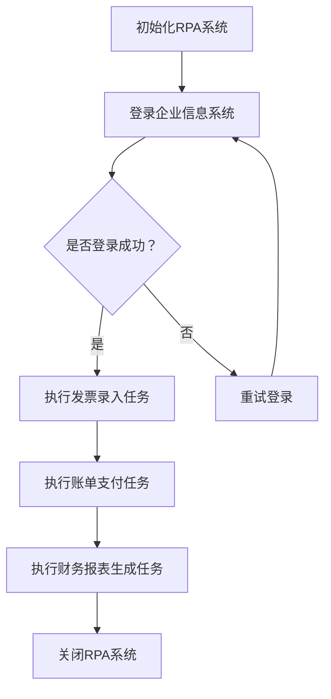

                 

### 第1章：RPA概述

#### 1.1 RPA的基本概念

RPA（Robotic Process Automation）是一种通过软件机器人自动化执行重复性、规则性强的业务流程的技术。这些软件机器人可以模拟人类的操作行为，如数据输入、表单填写、报告生成等，从而帮助企业提高工作效率、减少人为错误并降低运营成本。

在RPA中，核心概念包括：

- **软件机器人**：模拟人类操作行为的虚拟实体，可以通过图形化界面或代码进行编程和部署。
- **流程**：一系列相关的业务任务，按照一定的顺序和规则执行，以实现特定的业务目标。
- **流程引擎**：管理、调度和监控自动化流程的核心组件，负责协调软件机器人的行为。
- **数据集成**：将不同来源的数据整合到RPA系统中，以实现数据的自动化处理和传输。

RPA的核心功能包括：

- **数据采集**：自动化地从各种数据源中收集和提取信息，如Excel文件、PDF文档和数据库等。
- **流程执行**：按照预设的规则和流程逻辑，自动化地执行一系列业务任务。
- **错误处理**：自动化地识别和处理执行过程中的异常情况，如数据错误、系统故障等。

#### 1.2 RPA的发展历程

RPA技术的发展可以追溯到20世纪90年代，当时出现了基于流程自动化和脚本编写的早期工具。这些工具主要用于自动化简单的、重复性的任务，如数据输入和表单处理。

2000年初期，随着企业对业务流程自动化需求的增加，RPA技术逐渐成熟。这一时期的RPA工具开始引入图形化编程界面，使得非技术人员也能参与自动化流程的设计和部署。

2010年后，随着人工智能和机器学习技术的发展，RPA系统开始具备更高级的功能，如自然语言处理、机器视觉等，能够实现更复杂和智能的自动化流程。

目前，RPA已经发展成为一个独立的行业，吸引了众多企业投资和应用。RPA工具也越来越成熟，支持多种编程语言和平台，能够与企业现有的信息系统无缝集成。

#### 1.3 RPA的重要性与优势

RPA在企业中具有重要的应用价值，主要表现在以下几个方面：

1. **提高效率**：RPA可以自动化执行重复性、规则性强的任务，减少人工操作时间和错误，提高工作效率。

2. **降低成本**：通过自动化减少对人工的依赖，降低运营成本，特别是在处理大量数据时优势更加明显。

3. **提高质量**：RPA系统能够稳定、可靠地执行自动化任务，减少人为错误，提高业务处理质量。

4. **弹性扩展**：RPA系统可以根据业务需求灵活调整，适应企业不同阶段的自动化需求。

5. **支持敏捷开发**：RPA工具易于使用，开发周期短，能够快速响应业务变化，支持企业的敏捷开发。

总之，RPA作为一种提升企业效率的新选择，具有广泛的应用前景和显著的经济效益。在未来的发展中，RPA将继续与人工智能、大数据等技术相结合，为企业带来更多的创新和机遇。

### 第2章：RPA的技术架构

#### 2.1 RPA系统组成

RPA系统主要由以下几部分组成：

1. **软件机器人**：软件机器人是RPA系统的核心组件，它们模拟人类的操作行为，如点击、拖拽、输入等。软件机器人通常由图形化界面进行编程，无需编写代码，使得非技术人员也能参与自动化流程的设计和部署。

2. **流程引擎**：流程引擎负责管理、调度和监控自动化流程的执行。它能够根据预设的流程逻辑和规则，控制软件机器人的行为，并处理流程中的异常情况。流程引擎通常具备以下功能：
   - **任务调度**：根据时间、优先级等规则，分配任务给软件机器人执行。
   - **流程监控**：实时监控流程的执行状态，记录日志和异常信息。
   - **异常处理**：自动化识别和处理流程执行中的异常情况，如数据错误、系统故障等。

3. **数据集成**：数据集成模块负责将RPA系统与企业内部的各种数据源进行连接，实现数据的自动化处理和传输。数据集成模块通常支持多种数据源，如数据库、文件系统、Web服务等，能够实现数据的实时采集、转换和存储。

4. **AI模块**：AI模块是RPA系统的智能组件，通过引入人工智能技术，如自然语言处理、机器学习等，实现自动化决策和自适应调整。AI模块可以帮助RPA系统识别复杂模式、预测未来趋势，并自动调整流程参数，提高自动化效率。

#### 2.2 RPA技术原理

RPA技术原理主要包括以下几个方面：

1. **流程设计**：RPA系统的核心是自动化流程的设计。流程设计通常通过图形化界面进行，设计者可以直观地拖拽操作步骤，构建出自动化流程。每个操作步骤可以包含以下内容：
   - **操作类型**：如点击、输入、复制粘贴等。
   - **目标对象**：如窗口、按钮、文本框等。
   - **条件判断**：如判断是否成功执行、是否继续下一步操作等。

2. **执行与监控**：自动化流程设计完成后，RPA系统会根据预设的流程逻辑，调度软件机器人按照流程执行任务。在执行过程中，流程引擎会实时监控流程的执行状态，记录日志和异常信息。当出现异常情况时，流程引擎会自动触发异常处理机制，确保流程的稳定运行。

3. **异常处理**：RPA系统在执行过程中可能会遇到各种异常情况，如数据错误、系统故障等。异常处理机制可以通过以下方式解决：
   - **自动恢复**：如重试、跳过异常步骤等。
   - **人工干预**：如发送通知、转移任务等。

4. **数据交互**：RPA系统需要与企业内部的各种数据源进行交互，以实现数据的自动化处理和传输。数据交互通常通过API接口、数据库连接等方式进行，确保数据的准确性和实时性。

#### 2.3 RPA与传统自动化的比较

RPA与传统自动化技术在以下几个方面存在显著差异：

1. **灵活性**：RPA具有较高的灵活性，能够快速适应业务流程的变化。传统自动化技术通常需要固定的硬件和软件环境，难以适应业务需求的变化。

2. **集成性**：RPA工具易于与其他系统集成，能够实现跨平台的自动化。传统自动化技术通常需要针对不同的系统进行定制开发，集成难度较大。

3. **智能化**：RPA结合人工智能技术，能够实现自动化决策和自适应调整。传统自动化技术主要依赖于预设的规则和逻辑，缺乏智能化能力。

4. **成本**：RPA工具的使用成本相对较低，且无需大量技术支持人员。传统自动化技术通常需要较高的开发成本和专业的技术团队。

5. **易用性**：RPA工具通常具备图形化界面，易于操作和使用。传统自动化技术通常需要编写代码，对技术人员要求较高。

总之，RPA作为传统自动化的高级形态，具有更高的灵活性、集成性和智能化能力，能够更好地满足企业不断变化的业务需求。

### 第3章：RPA软件工具与平台

#### 3.1 常见的RPA软件工具

目前市场上常见的RPA软件工具主要包括以下几种：

1. **UiPath**：UiPath是当前最流行的RPA平台之一，提供了丰富的功能，包括自动化流程设计、执行、监控等。它支持多种编程语言，如C#、Visual Basic等，使得非技术人员也能轻松进行自动化流程的设计和部署。

2. **Blue Prism**：Blue Prism是一个专注于企业级RPA解决方案的平台，它具有高度的可扩展性和灵活性。Blue Prism提供了丰富的API接口，能够与企业现有的信息系统无缝集成，支持多种数据源和数据库的连接。

3. **Automation Anywhere**：Automation Anywhere是一个易于使用的RPA工具，支持跨平台操作，包括Windows、Linux和Mac OS等。它提供了强大的流程引擎和AI模块，能够实现自动化决策和自适应调整。

4. **WorkFusion**：WorkFusion是一个集成了人工智能和机器学习技术的RPA平台，它能够自动化处理复杂的业务流程。WorkFusion提供了强大的数据分析和预测功能，能够帮助企业实现智能化运营。

5. **Pega Robotics**：Pega Robotics是Pega公司的RPA解决方案，它结合了Pega的CRM和ERP系统，能够实现全面的业务流程自动化。Pega Robotics支持多种编程语言和平台，提供了丰富的API接口和扩展功能。

#### 3.2 RPA平台的比较

在比较不同RPA平台时，可以从以下几个方面进行分析：

1. **功能对比**：分析不同平台提供的自动化功能，如流程设计、执行、监控、异常处理等。评估平台的功能是否满足企业的需求，以及是否支持多种编程语言和数据源。

2. **易用性**：评估平台的操作界面是否直观易用，是否支持图形化编程和拖拽式操作。非技术人员能否快速上手，降低培训成本。

3. **扩展性**：分析平台的可扩展性和灵活性，是否支持与企业现有信息系统的集成，以及是否提供丰富的API接口和插件。

4. **性能**：评估平台的性能和稳定性，包括处理速度、资源消耗和容错能力。确保平台能够稳定运行，处理大量并发任务。

5. **成本**：分析平台的采购成本和运营成本，包括软件许可费用、硬件投入、培训费用等。综合考虑平台的长期成本效益。

#### 3.3 RPA平台的选择标准

在选择RPA平台时，可以从以下几个方面进行考虑：

1. **企业规模**：对于中小型企业，可以选择功能简单、易用的RPA平台，如Automation Anywhere或UiPath。对于大型企业，可以选择功能强大、可扩展性高的平台，如Blue Prism或Pega Robotics。

2. **业务场景**：根据企业的业务需求，选择能够支持所需业务场景的RPA平台。例如，财务和会计领域可以选择具有财务报表生成功能的平台，人力资源领域可以选择具有招聘流程管理功能的平台。

3. **技术支持**：评估平台的售后服务和技术支持情况，包括技术培训、问题解决、升级更新等。确保企业在使用过程中能够获得及时的技术支持。

4. **社区与生态**：分析平台是否具备成熟的社区和生态体系，包括用户论坛、开发者社区、技术文档等。社区和生态的活跃程度可以反映平台的生命力和发展潜力。

通过综合考虑以上因素，企业可以选出最适合自身需求的RPA平台，实现业务流程的自动化，提高工作效率和竞争力。

### 第4章：RPA的实施与部署

#### 4.1 RPA项目实施流程

实施RPA项目是一个系统性、分步骤的过程，通常包括以下阶段：

1. **需求分析**：首先，企业需要明确RPA项目的目标、范围和预期效果。通过调研和分析，确定需要自动化的业务流程和任务，并识别潜在的利益点和挑战。

2. **流程设计**：在明确需求后，需要对业务流程进行详细梳理和优化。设计自动化流程的蓝图，包括操作步骤、数据流、决策逻辑等。可以使用流程设计工具，如Microsoft Visio或RPA平台自带的图形化设计器。

3. **工具选择**：根据业务需求和流程设计，选择合适的RPA工具和平台。评估不同工具的功能、性能、成本等，确保所选工具能够满足项目的需求。

4. **流程开发**：使用选定的RPA工具，根据流程设计文档进行自动化流程的开发。编写必要的脚本和代码，实现流程的具体操作步骤和逻辑。这一阶段可能需要开发人员的参与，特别是在实现复杂流程和集成多个系统时。

5. **测试与优化**：在开发完成后，对自动化流程进行全面的测试，确保其能够按照预期执行。测试包括功能测试、性能测试和异常处理测试等。根据测试结果，对流程进行优化和调整，确保其稳定可靠。

6. **部署与上线**：完成测试后，将自动化流程部署到生产环境。部署过程中需要确保系统的稳定性和安全性，避免对现有业务造成干扰。在部署后，进行试运行，验证流程的实际运行效果。

7. **监控与维护**：上线后，对自动化流程进行持续监控和维护。监控包括运行状态、性能指标、异常情况等。根据监控结果，对流程进行必要的调整和优化，确保其长期稳定运行。

#### 4.2 RPA在组织中的角色与职责

在RPA项目中，不同角色承担着不同的职责和任务：

1. **项目经理**：负责整个项目的规划、执行和监控。项目经理需要与业务部门和技术团队密切合作，确保项目按计划进行，解决项目中出现的各种问题和挑战。

2. **流程分析师**：负责业务流程的梳理和优化，设计自动化流程的蓝图。流程分析师需要深入了解业务流程，能够识别潜在的利益点和风险，确保自动化流程能够满足业务需求。

3. **开发人员**：负责自动化流程的具体开发和实现。开发人员需要具备RPA工具和编程语言的知识，能够根据流程设计文档编写高效的脚本和代码，确保自动化流程的稳定和可靠。

4. **测试人员**：负责自动化流程的测试和验证。测试人员需要制定测试计划，执行各种测试用例，确保自动化流程能够按照预期执行，发现和解决潜在的问题。

5. **运维人员**：负责自动化流程的部署、监控和维护。运维人员需要确保系统的稳定性和安全性，及时发现和解决运行中的问题，确保自动化流程的长期稳定运行。

#### 4.3 RPA项目的挑战与解决方案

在RPA项目的实施过程中，企业可能会遇到各种挑战和问题。以下是一些常见的挑战及相应的解决方案：

1. **技术挑战**：
   - **工具选择**：选择合适的RPA工具需要充分考虑企业的业务需求和技术实力。可以通过试用不同工具，评估其功能、性能和易用性，选择最合适的工具。
   - **开发难度**：自动化流程的开发可能涉及到多种编程语言和工具。企业可以通过培训现有员工或引入专业人才，提高开发能力。
   - **系统集成**：RPA系统需要与企业现有的信息系统进行集成。企业可以通过使用API接口、Web服务等方式，实现数据传输和系统联动。

2. **管理挑战**：
   - **项目管理**：RPA项目通常涉及多个部门和团队的协作。企业需要建立有效的沟通机制，确保各方的意见和需求能够得到充分沟通和协调。
   - **资源调度**：RPA项目需要投入一定的人力、物力和财力。企业需要合理安排资源，确保项目能够按计划进行。
   - **风险管理**：企业需要识别和评估项目中的风险，制定相应的风险应对策略，确保项目能够顺利实施。

3. **人才挑战**：
   - **技能培训**：企业需要对现有员工进行RPA技能培训，提高其自动化流程设计和开发能力。可以通过内部培训、外部培训、在线课程等多种方式，提供丰富的学习资源。
   - **人才引进**：企业可以通过招聘具有RPA经验的专业人才，充实项目团队。同时，可以与高校和培训机构合作，培养和储备RPA人才。

通过有效的技术支持、管理协调和人才培养，企业可以克服RPA项目实施中的各种挑战，实现业务流程的自动化，提高工作效率和竞争力。

### 第5章：RPA应用场景与案例分析

#### 5.1 财务与会计领域的RPA应用

在财务与会计领域，RPA技术可以自动化处理大量的重复性任务，如发票录入、账单支付、财务报表生成等。以下是一些具体的RPA应用案例：

1. **发票录入**：
   - **案例背景**：某大型企业每天需要处理大量的发票，人工录入效率低下且容易出错。
   - **解决方案**：使用RPA工具，企业可以自动化地扫描和解析发票信息，将数据自动录入财务系统，大大提高了处理效率，减少了人为错误。

2. **账单支付**：
   - **案例背景**：企业需要定期支付供应商的账单，支付流程复杂且耗时。
   - **解决方案**：通过RPA工具，企业可以自动化地从系统中提取账单信息，生成支付指令，并按照预设的支付规则进行自动支付，提高了支付效率，降低了操作风险。

3. **财务报表生成**：
   - **案例背景**：企业每月需要生成详细的财务报表，涉及大量的数据计算和汇总工作。
   - **解决方案**：使用RPA工具，企业可以自动化地从多个数据源中提取数据，进行计算和汇总，快速生成财务报表，提高了报表生成的准确性和效率。

#### 5.2 人力资源管理领域的RPA应用

在人力资源管理领域，RPA技术可以自动化处理招聘流程管理、员工信息管理、薪酬福利计算等任务。以下是一些具体的RPA应用案例：

1. **招聘流程管理**：
   - **案例背景**：企业招聘流程复杂，涉及简历筛选、面试安排、招聘决策等多个环节。
   - **解决方案**：通过RPA工具，企业可以自动化地处理简历筛选、面试安排等环节，减少招聘人员的重复性工作，提高招聘效率。

2. **员工信息管理**：
   - **案例背景**：企业需要管理大量的员工信息，如姓名、职位、薪资、福利等。
   - **解决方案**：使用RPA工具，企业可以自动化地收集、存储和更新员工信息，确保信息的准确性和一致性。

3. **薪酬福利计算**：
   - **案例背景**：企业需要定期计算员工的薪酬和福利，涉及复杂的计算和汇总工作。
   - **解决方案**：通过RPA工具，企业可以自动化地计算员工的薪酬和福利，减少了人工错误，提高了计算效率。

#### 5.3 供应链管理领域的RPA应用

在供应链管理领域，RPA技术可以自动化处理采购订单处理、库存管理、物流跟踪等任务。以下是一些具体的RPA应用案例：

1. **采购订单处理**：
   - **案例背景**：企业需要处理大量的采购订单，涉及订单生成、审批、支付等多个环节。
   - **解决方案**：通过RPA工具，企业可以自动化地处理采购订单的生成、审批和支付，提高了采购效率，减少了人为错误。

2. **库存管理**：
   - **案例背景**：企业需要实时监控库存水平，确保库存的合理性和及时性。
   - **解决方案**：使用RPA工具，企业可以自动化地收集、处理和存储库存数据，实时更新库存信息，提高了库存管理的效率和准确性。

3. **物流跟踪**：
   - **案例背景**：企业需要跟踪物流运输过程，确保货物的安全送达。
   - **解决方案**：通过RPA工具，企业可以自动化地监控物流运输过程，实时获取运输状态信息，提高了物流管理的效率和准确性。

#### 5.4 案例分析：某企业的RPA应用实践

以下是一个具体的RPA应用案例，分析某企业如何通过RPA技术提升业务效率和降低成本：

1. **案例背景**：
   - 某大型企业主要从事制造业，拥有复杂的供应链管理和财务管理流程。
   - 企业面临大量重复性任务，如采购订单处理、财务报表生成、库存管理、物流跟踪等。

2. **实施过程**：
   - 需求分析：企业明确了自动化目标，梳理了需要自动化的业务流程，确定了自动化流程的设计和实施计划。
   - 流程设计：使用RPA工具，企业设计并实现了自动化流程，包括采购订单处理、财务报表生成、库存管理和物流跟踪等。
   - 测试与优化：在开发完成后，企业对自动化流程进行了全面的测试，发现并解决了潜在的问题，确保流程的稳定和可靠。
   - 部署与上线：将自动化流程部署到生产环境，进行试运行，验证流程的实际运行效果。
   - 监控与维护：上线后，企业对自动化流程进行持续监控和维护，确保其长期稳定运行。

3. **效果评估**：
   - 效率提升：通过RPA技术，企业大大提高了采购订单处理、财务报表生成、库存管理和物流跟踪等任务的效率，减少了人工操作时间和错误率。
   - 成本降低：自动化流程减少了人工操作的依赖，降低了运营成本，特别是在处理大量数据时优势更加明显。
   - 质量提高：RPA系统稳定、可靠，减少了人为错误，提高了业务处理质量。
   - 弹性扩展：RPA系统可以根据企业需求灵活调整，适应不同阶段的自动化需求。

通过上述案例分析，可以看出RPA技术在企业业务流程中的应用具有显著的效益，能够帮助企业提高效率、降低成本、提高质量，实现业务流程的全面自动化。

### 第6章：RPA面临的挑战与应对策略

#### 6.1 技术挑战

尽管RPA技术具有诸多优势，但在实际应用中仍面临一些技术挑战：

1. **工具选择**：市场上存在多种RPA工具，选择合适的工具需要充分考虑企业的业务需求和技术实力。不同的工具在功能、性能、成本等方面存在差异，企业需要通过试用和评估，选择最合适的工具。

2. **开发难度**：RPA工具通常提供图形化界面和脚本编程两种方式，对于非技术人员来说，使用图形化界面设计自动化流程相对简单。但对于复杂的业务流程和系统集成，可能需要编写大量的脚本和代码，对技术人员的编程能力要求较高。

3. **集成复杂性**：RPA系统需要与企业现有的信息系统进行集成，实现数据传输和系统联动。集成过程中可能遇到不同系统的数据格式、接口标准不一致等问题，需要花费大量时间和精力进行调试和优化。

4. **性能优化**：RPA系统在处理大量并发任务时，可能会出现性能瓶颈。企业需要针对具体业务场景进行性能测试和优化，确保系统在高负载情况下仍能稳定运行。

#### 6.2 管理挑战

RPA项目的实施不仅涉及技术问题，还需要解决一系列管理挑战：

1. **项目管理**：RPA项目通常涉及多个部门和团队的协作，需要建立有效的项目管理机制，确保项目进度和质量。项目经理需要协调各方利益，确保项目按计划进行。

2. **资源调度**：RPA项目需要投入一定的人力、物力和财力。企业需要合理安排资源，确保项目团队具备充足的人力资源和技术支持，避免资源浪费。

3. **风险管理**：在项目实施过程中，企业需要识别和评估各种风险，并制定相应的风险应对策略。风险可能来自技术、管理、人员等方面，企业需要制定全面的风险管理计划，确保项目顺利进行。

4. **持续改进**：RPA项目上线后，需要持续监控和优化，确保系统稳定运行。企业需要建立持续改进机制，收集用户反馈，不断优化自动化流程，提高系统性能和用户体验。

#### 6.3 人才挑战

RPA技术的应用需要专业的技术人才，企业在人才引进和培养方面面临以下挑战：

1. **人才短缺**：当前市场上具备RPA技能的专业人才相对较少，企业招聘具有经验的技术人员具有一定的难度。

2. **技能培训**：RPA工具和技术的更新速度较快，企业需要定期对现有员工进行培训，提高其技能水平。培训内容应包括RPA工具的使用、自动化流程的设计和开发等。

3. **人才培养**：企业可以通过与高校和培训机构合作，培养和储备RPA人才。同时，企业内部可以建立人才梯队，为员工提供晋升和发展机会，提高员工的积极性和留存率。

#### 6.4 挑战与应对策略

为了克服RPA应用中的各种挑战，企业可以采取以下应对策略：

1. **技术层面**：
   - **选择合适工具**：通过试用和评估，选择功能强大、性能稳定、易用性高的RPA工具。
   - **集成测试**：在系统集成前进行充分的测试和验证，确保系统能够无缝集成和稳定运行。
   - **性能优化**：对自动化流程进行性能测试和优化，确保系统在高负载情况下仍能稳定运行。

2. **管理层面**：
   - **项目管理**：建立有效的项目管理机制，明确项目目标和职责，确保项目按计划进行。
   - **资源调配**：合理安排资源，确保项目团队具备充足的人力资源和技术支持。
   - **风险管理**：制定全面的风险管理计划，识别和评估风险，并制定相应的应对策略。

3. **人才层面**：
   - **引进人才**：通过招聘和合作，引进具有RPA经验的专业人才。
   - **培训员工**：定期对员工进行RPA技能培训，提高其自动化流程设计和开发能力。
   - **人才培养**：建立人才梯队，为员工提供晋升和发展机会，提高员工的积极性和留存率。

通过上述策略，企业可以有效地应对RPA应用中的各种挑战，实现业务流程的自动化，提高工作效率和竞争力。

### 第7章：RPA的未来发展趋势

#### 7.1 RPA与人工智能的结合

随着人工智能（AI）技术的不断发展，RPA与AI的结合将成为未来RPA发展的一个重要趋势。AI技术可以赋能RPA，使其具备更强的智能决策和自适应能力。

1. **自然语言处理（NLP）**：通过NLP技术，RPA可以理解和处理人类语言，实现与用户的自然交互。例如，RPA可以自动解答用户的问题、自动生成报告等。

2. **机器学习（ML）**：通过ML技术，RPA可以学习和优化自动化流程，提高工作效率和准确性。例如，RPA可以根据历史数据预测业务趋势，自动调整流程参数。

3. **计算机视觉（CV）**：通过CV技术，RPA可以识别和解析图像信息，实现自动化图像处理。例如，RPA可以自动识别和分类文档、图像中的关键信息。

#### 7.2 RPA在新兴行业中的应用

RPA技术的广泛应用不仅限于传统的财务、人力资源等领域，还在许多新兴行业中展现出巨大的潜力。

1. **金融科技（FinTech）**：在金融科技领域，RPA可以自动化处理高频交易、风险评估、合规检查等任务，提高金融服务的效率和准确性。

2. **医疗健康**：在医疗健康领域，RPA可以自动化处理病历管理、患者信息管理、医疗费用结算等任务，提高医疗服务的质量和效率。

3. **零售电商**：在零售电商领域，RPA可以自动化处理订单处理、库存管理、物流跟踪等任务，提高电商平台的运营效率。

#### 7.3 RPA的未来发展趋势

随着技术的进步和市场需求的增长，RPA在未来将继续呈现出以下几个发展趋势：

1. **平台化**：RPA工具将越来越集成化和平台化，提供更丰富的功能、更强大的扩展性和更便捷的操作体验。

2. **智能化**：随着AI技术的不断进步，RPA将逐渐具备更强的智能决策和自适应能力，实现更高层次的自动化。

3. **生态化**：RPA将与更多的行业和领域相结合，形成更加丰富的生态系统，为不同行业和企业提供定制化的解决方案。

4. **普及化**：随着RPA工具的成熟和成本的降低，RPA将在更广泛的应用场景中得到普及，成为企业提升效率、降低成本的重要工具。

总之，RPA技术在未来将继续快速发展，与AI技术深度融合，为各行各业带来更多的创新和变革。

### 附录A：RPA相关资源与工具

#### A.1 RPA开源资源

RPA开源资源为开发者提供了丰富的工具和框架，以帮助构建和部署自动化流程。以下是一些常用的开源RPA资源和工具：

1. **RPA Framework**：这是一个基于Java的RPA框架，提供了图形化的流程设计器和强大的脚本引擎。它支持多种编程语言，如Java、Python等。

2. **UiPath Community Edition**：UiPath社区版是一个免费的开源RPA工具，提供了丰富的功能，包括流程设计、自动化测试、数据集成等。它支持Windows、Linux和Mac OS平台。

3. **OWA Studio**：OWA Studio是一个基于Web的RPA开发平台，提供了图形化流程设计器和API连接器。它支持多种数据库和Web服务，方便开发者构建自动化解决方案。

4. **PyAutoGUI**：PyAutoGUI是一个Python库，用于模拟键盘和鼠标操作。它可以在没有RPA工具的情况下实现基本的自动化功能，适用于简单任务的自动化。

#### A.2 RPA商业工具

商业RPA工具通常提供更丰富的功能、更好的性能支持和专业的客户服务。以下是一些主流的商业RPA工具：

1. **UiPath**：UiPath是一个功能强大的商业RPA平台，提供了图形化流程设计器、AI模块和丰富的API接口。它支持多种操作系统和数据源，适用于各种规模的企业。

2. **Blue Prism**：Blue Prism是一个企业级的RPA平台，专注于提供高度可扩展和灵活的自动化解决方案。它提供了强大的数据集成和AI功能，支持多种编程语言。

3. **Automation Anywhere**：Automation Anywhere是一个易于使用的商业RPA工具，提供了强大的流程引擎、AI模块和跨平台支持。它适用于各种业务场景，包括财务、人力资源和供应链管理等。

4. **WorkFusion**：WorkFusion是一个集成了人工智能和机器学习的RPA平台，提供了强大的数据处理和预测功能。它适用于复杂和高并发的自动化任务。

#### A.3 RPA社区与论坛

RPA社区和论坛为开发者提供了一个交流和学习的平台，有助于掌握RPA技术和解决实际问题。以下是一些活跃的RPA社区和论坛：

1. **RPA Community**：这是一个全球性的RPA社区，提供了丰富的学习资源和交流机会。用户可以分享经验、提问和获取专业建议。

2. **UiPath Community**：UiPath社区是针对UiPath用户的官方社区，提供了教程、视频、论坛和代码示例。用户可以在这里学习UiPath的使用和最佳实践。

3. **RPA on LinkedIn**：LinkedIn上的RPA群组汇集了全球的RPA专家和从业者，提供了丰富的行业动态和职业机会。

4. **RPA World**：RPA World是一个专注于RPA技术和应用的在线社区，提供了新闻、文章、案例分析和技术教程。

通过利用这些开源资源、商业工具和社区论坛，开发者可以更好地掌握RPA技术，解决实际问题，推动企业的自动化进程。

### 附录B：RPA项目实战案例

#### B.1 实战案例一：财务自动化流程

**案例背景**：某大型制造企业面临大量的财务任务，如发票录入、账单支付、财务报表生成等。这些任务重复性强，耗时耗力，且容易出错。

**实施过程**：
1. **需求分析**：企业明确了自动化目标，梳理了财务流程，确定了需要自动化的任务和关键点。
2. **流程设计**：使用RPA工具，设计并实现了财务自动化流程，包括发票扫描、数据提取、账单支付和报表生成等步骤。
3. **流程开发**：编写脚本和代码，实现具体操作步骤，如数据采集、数据处理、自动生成报表等。
4. **测试与优化**：对自动化流程进行测试，发现并解决了潜在问题，确保流程稳定和可靠。
5. **部署与上线**：将自动化流程部署到生产环境，进行试运行，验证实际效果。

**效果评估**：
- **效率提升**：自动化流程使财务处理效率提高了50%以上，减少了人工操作时间和错误率。
- **成本降低**：自动化处理大量财务任务，减少了人力成本，提高了资源利用率。
- **质量提高**：自动化流程稳定、可靠，减少了人为错误，提高了财务数据的准确性。

#### B.2 实战案例二：人力资源自动化流程

**案例背景**：某科技公司的人力资源部门每天需要处理大量的招聘、员工信息管理、薪酬福利计算等任务，工作量大且复杂。

**实施过程**：
1. **需求分析**：企业明确了自动化目标，梳理了人力资源流程，确定了需要自动化的任务和关键点。
2. **流程设计**：使用RPA工具，设计并实现了人力资源自动化流程，包括简历筛选、面试安排、薪资计算和福利管理等步骤。
3. **流程开发**：编写脚本和代码，实现具体操作步骤，如数据采集、数据比对、自动发送通知等。
4. **测试与优化**：对自动化流程进行测试，发现并解决了潜在问题，确保流程稳定和可靠。
5. **部署与上线**：将自动化流程部署到生产环境，进行试运行，验证实际效果。

**效果评估**：
- **效率提升**：自动化流程使人力资源处理效率提高了40%以上，减少了人力资源部门的重复性工作。
- **成本降低**：自动化处理大量人力资源任务，降低了人力成本，提高了人力资源部门的整体运营效率。
- **质量提高**：自动化流程稳定、可靠，减少了人为错误，提高了招聘和员工管理的准确性。

#### B.3 实战案例三：供应链自动化流程

**案例背景**：某零售企业需要高效管理采购订单、库存、物流等供应链任务，以保证商品及时供应和市场竞争力。

**实施过程**：
1. **需求分析**：企业明确了自动化目标，梳理了供应链流程，确定了需要自动化的任务和关键点。
2. **流程设计**：使用RPA工具，设计并实现了供应链自动化流程，包括采购订单处理、库存管理、物流跟踪等步骤。
3. **流程开发**：编写脚本和代码，实现具体操作步骤，如数据采集、数据传输、自动生成报告等。
4. **测试与优化**：对自动化流程进行测试，发现并解决了潜在问题，确保流程稳定和可靠。
5. **部署与上线**：将自动化流程部署到生产环境，进行试运行，验证实际效果。

**效果评估**：
- **效率提升**：自动化流程使供应链处理效率提高了30%以上，减少了供应链管理的工作量和操作时间。
- **成本降低**：自动化处理大量供应链任务，降低了物流和库存管理的成本，提高了资源利用率。
- **质量提高**：自动化流程稳定、可靠，减少了人为错误，提高了供应链管理的准确性和及时性。

通过这些实战案例，可以看出RPA技术在不同行业和业务场景中的广泛应用和显著效益。RPA项目实施不仅提高了企业的工作效率和运营质量，还降低了成本，提升了企业的整体竞争力。

### 作者信息

作者：AI天才研究院/AI Genius Institute & 禅与计算机程序设计艺术 /Zen And The Art of Computer Programming

### 脚本段与伪代码

在RPA项目中，脚本段和伪代码是重要的组成部分，用于实现自动化流程的具体操作和逻辑。以下是一个简单的伪代码示例，用于说明RPA的基本工作流程：

```python
# 伪代码：RPA自动化流程

# 初始化RPA系统
init_rpa_system()

# 登录企业信息系统
login_system(username, password)

# 执行发票录入任务
def process_invoice():
    # 扫描发票
    scan_invoice(invoice_path)
    # 解析发票数据
    parse_invoice_data()
    # 提取关键信息
    extract_key_info()
    # 输入系统
    input_invoice_system()

# 执行账单支付任务
def process_payment():
    # 从系统中提取账单列表
    fetch_bills()
    # 检查账单状态
    check_bill_status()
    # 自动生成支付指令
    generate_payment_order()
    # 执行支付操作
    execute_payment()

# 执行财务报表生成任务
def generate_financial_report():
    # 从多个数据源提取数据
    fetch_data()
    # 数据处理与汇总
    process_and_summarize_data()
    # 生成报表
    create_financial_report()
    # 导出报表
    export_report()

# 关闭RPA系统
close_rpa_system()
```

上述伪代码展示了RPA系统在财务流程中的基本操作步骤，包括登录系统、执行发票录入、账单支付和财务报表生成等任务。在实际开发过程中，这些伪代码会被具体实现为脚本，用于驱动软件机器人执行自动化任务。

### Mermaid 流程图

在本文中，我们使用Mermaid语言绘制了一个RPA系统的基本流程图。以下是一个Mermaid流程图的示例：



上述Mermaid流程图描述了RPA系统从初始化到执行发票录入、账单支付、财务报表生成，最终关闭系统的整个过程。每个节点表示一个操作步骤，线条表示步骤之间的逻辑关系。通过这种图形化的方式，我们可以清晰地理解RPA系统的运行流程。

