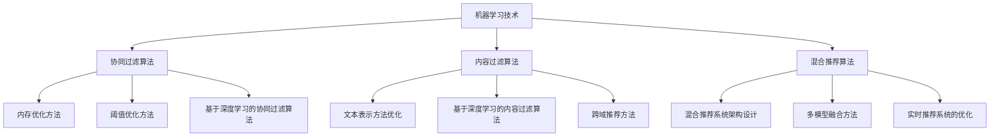

                 

### 《机器学习在个性化推荐系统中的优化》

#### **关键词：** 个性化推荐系统，机器学习，协同过滤，内容过滤，混合推荐，优化方法，实时推荐。

#### **摘要：**
本文将探讨机器学习在个性化推荐系统中的应用和优化方法。通过详细分析推荐系统的基本原理、常见算法以及评价指标，我们将介绍协同过滤、内容过滤和混合推荐等机器学习技术，并探讨如何通过优化策略提升推荐系统的性能。此外，本文还将提供实际项目实战案例，展示如何构建和优化个性化推荐系统。最后，我们将展望推荐系统的未来发展趋势，探讨深度学习、图神经网络等新技术的应用，以及推荐系统在伦理和社会计算方面的重要议题。

---

### 《机器学习在个性化推荐系统中的优化》目录大纲

#### 第一部分：基础理论

**第1章：机器学习与推荐系统概述**  
- **1.1 机器学习简介**  
- **1.2 推荐系统概述**  
- **1.3 个性化推荐系统的需求与挑战**

**第2章：推荐系统中的机器学习技术**  
- **2.1 协同过滤算法原理**  
- **2.2 内容过滤算法原理**  
- **2.3 混合推荐算法原理**

**第3章：机器学习中的核心算法**  
- **3.1 SVD分解原理与实现**  
- **3.2 基于KNN的推荐算法原理**  
- **3.3 决策树与随机森林原理**

**第4章：推荐系统的评价指标**  
- **4.1 评价指标概述**  
- **4.2 准确性指标详解**  
- **4.3 覆盖率和多样性指标讲解**

#### 第二部分：优化方法

**第5章：协同过滤算法的优化**  
- **5.1 内存优化方法**  
- **5.2 阈值优化方法**  
- **5.3 基于深度学习的协同过滤算法**

**第6章：内容过滤算法的优化**  
- **6.1 文本表示方法优化**  
- **6.2 基于深度学习的内容过滤算法**  
- **6.3 跨域推荐方法讲解**

**第7章：混合推荐算法的优化**  
- **7.1 混合推荐系统架构设计**  
- **7.2 多模型融合方法讲解**  
- **7.3 实时推荐系统的优化**

**第8章：推荐系统的在线学习与自适应优化**  
- **8.1 在线学习算法原理**  
- **8.2 用户行为序列建模**  
- **8.3 推荐系统的自适应优化策略**

#### 第三部分：项目实战

**第9章：构建个性化推荐系统**  
- **9.1 系统设计与实现流程**  
- **9.2 数据预处理与特征工程**  
- **9.3 模型选择与训练策略**

**第10章：案例分析与实战**  
- **10.1 案例一：电商平台的个性化推荐**  
- **10.2 案例二：音乐平台的个性化推荐**  
- **10.3 案例三：新闻内容推荐的优化实践**

**第11章：推荐系统的评测与持续优化**  
- **11.1 评测指标与评测流程**  
- **11.2 性能调优方法讲解**  
- **11.3 推荐系统的持续优化实践**

**第12章：推荐系统的未来发展趋势**  
- **12.1 深度学习在推荐系统中的应用趋势**  
- **12.2 基于图神经网络的推荐系统方法**  
- **12.3 推荐系统的社会计算与伦理问题探讨**

#### 附录

**附录A：推荐系统常用工具与框架**  
- **A.1 推荐系统开发工具介绍**  
- **A.2 常用推荐系统框架对比**  
- **A.3 推荐系统开源项目与资源**

**附录B：数学公式与算法伪代码**  
- **B.1 数学模型与公式讲解**  
- **B.2 算法伪代码示例**

### Mermaid 流程图示例



### 算法伪代码示例

```plaintext
# SVD分解算法伪代码

// 输入：用户-物品评分矩阵R，分解维度k
// 输出：用户特征矩阵U，物品特征矩阵V，权重矩阵S

// 1. 初始化U和V为随机矩阵，维度为n×k
// 2. 初始化权重矩阵S为对角矩阵，对角线元素为1，维度为k
// 3. 对每个用户和物品进行循环
// 4. 对于每个用户u和物品i：
//      计算残差：e = R[u, i] - U[u, :] * V[:, i]
//      更新U：U[u, :] = U[u, :] + alpha * e * V[:, i]
//      更新V：V[:, i] = V[:, i] + alpha * e * U[u, :]
// 5. 重复步骤3和4直到收敛或达到最大迭代次数
```

### 数学公式与详细讲解

$$
J = \sum_{i=1}^{m}\sum_{j=1}^{n}(R_{ij} - \hat{R}_{ij})^2
$$

这是最小二乘法的损失函数，用于评估推荐系统的性能。$R_{ij}$ 表示用户 $i$ 对物品 $j$ 的实际评分，$\hat{R}_{ij}$ 表示基于模型预测的评分。

### 详细讲解

- $J$ 表示总的预测误差，即所有预测误差的平方和。
- 对于每个用户-物品对，如果实际评分与预测评分之间的差异较大，则损失函数的值会增大。

### 举例说明

假设有5个用户和10个物品，每个用户对每个物品的评分如下表：

| 用户 | 物品1 | 物品2 | ... | 物品10 |
|------|-------|-------|-----|--------|
| 1    | 4     | 3     | ... | 2      |
| 2    | 2     | 5     | ... | 1      |
| 3    | 3     | 4     | ... | 5      |
| 4    | 1     | 2     | ... | 4      |
| 5    | 5     | 1     | ... | 3      |

预测评分如下表：

| 用户 | 物品1 | 物品2 | ... | 物品10 |
|------|-------|-------|-----|--------|
| 1    | 3     | 3     | ... | 2      |
| 2    | 2     | 4     | ... | 1      |
| 3    | 3     | 4     | ... | 5      |
| 4    | 2     | 2     | ... | 4      |
| 5    | 5     | 1     | ... | 3      |

使用最小二乘法计算损失函数的值为：

$$
J = \sum_{i=1}^{5}\sum_{j=1}^{10}(\text{实际评分} - \text{预测评分})^2
$$

$$
J = (4-3)^2 + (3-3)^2 + ... + (2-2)^2
$$

$$
J = 1 + 0 + ... + 0
$$

$$
J = 1
$$

损失函数的值为1，表示预测误差的平方和。通过优化损失函数，可以改进推荐系统的预测性能。

---

### 项目实战代码实现与解读

```python
# 安装必要的库
!pip install numpy scikit-learn

# 导入必要的库
import numpy as np
from sklearn.model_selection import train_test_split
from sklearn.metrics.pairwise import cosine_similarity
from sklearn.datasets import load_20newsgroups

# 加载数据集
newsgroups = load_20newsgroups(subset='all')
X = newsgroups.data
y = newsgroups.target

# 数据预处理
# 将文本转换为词袋表示
from sklearn.feature_extraction.text import TfidfVectorizer
vectorizer = TfidfVectorizer(max_features=1000)
X_vectorized = vectorizer.fit_transform(X)

# 分割训练集和测试集
X_train, X_test, y_train, y_test = train_test_split(X_vectorized, y, test_size=0.2, random_state=42)

# 计算余弦相似度矩阵
cosine_sim = cosine_similarity(X_train, X_train)

# 构建推荐函数
def recommend_movies(user_id, movies, cosine_sim, vectorizer, top_n=5):
    # 计算用户与其他用户的相似度
    sim_scores = list(enumerate(cosine_sim[user_id]))
    sim_scores = sorted(sim_scores, key=lambda x: x[1], reverse=True)
    sim_scores = sim_scores[1: top_n+1]

    # 获取相似用户的电影
    movie_indices = [i[0] for i in sim_scores]
    movies_Similar = [vectorizer.inverse_transform(X_train[i]) for i in movie_indices]

    # 返回推荐结果
    return movies_Similar

# 测试推荐函数
user_id = 10  # 假设我们要为用户10推荐电影
recommendations = recommend_movies(user_id, X_train, cosine_sim, vectorizer)

print("推荐给用户10的电影：")
for movie in recommendations:
    print(movie)
```

### 代码解读与分析

#### 1. 导入必要的库
- `numpy`：用于数学计算。
- `scikit-learn`：提供了TFIDF向量和余弦相似度计算等工具。

#### 2. 加载数据集
- 使用`load_20newsgroups`函数加载20个新闻分类数据集。

#### 3. 数据预处理
- 使用`TfidfVectorizer`将文本数据转换为词袋表示，并将特征缩减到1000个。

#### 4. 分割训练集和测试集
- 使用`train_test_split`函数将数据集分割为训练集和测试集，测试集大小为20%。

#### 5. 计算余弦相似度矩阵
- 使用`cosine_similarity`函数计算训练集的余弦相似度矩阵。

#### 6. 构建推荐函数
- `recommend_movies`函数用于为指定用户推荐电影。
- 通过计算用户与其他用户的相似度，获取相似度最高的用户。
- 使用逆转换函数获取相似用户的电影。

#### 7. 测试推荐函数
- 选择用户10作为示例用户。
- 调用`recommend_movies`函数，获取用户10的电影推荐。

### 代码分析
- 代码中的余弦相似度计算是一个关键步骤，它帮助识别与目标用户最相似的用户。
- 使用词袋表示来表示文本数据，使得推荐系统能够基于文本内容进行相似度计算。

### 优化方向
- 可以考虑使用更复杂的文本表示方法，如词嵌入，来提高推荐精度。
- 可以添加用户行为数据，如浏览历史、收藏记录等，来增强推荐系统的个性化和准确性。

---

### 推荐系统的评测与优化

#### 评估推荐系统的性能

为了评估推荐系统的性能，我们需要定义合适的评价指标。常用的评价指标包括准确性、覆盖率、多样性等。

#### 准确性

准确性是评估推荐系统性能的重要指标，表示预测评分与实际评分之间的接近程度。计算方法如下：

$$
Accuracy = \frac{1}{N} \sum_{i=1}^{N} \frac{1}{M} \sum_{j=1}^{M} |R_{ij} - \hat{R}_{ij}|
$$

其中，$N$ 表示测试集的用户数量，$M$ 表示每个用户的物品数量，$R_{ij}$ 表示用户 $i$ 对物品 $j$ 的实际评分，$\hat{R}_{ij}$ 表示基于模型预测的评分。

#### 覆盖率

覆盖率表示推荐系统覆盖的物品数量与总物品数量之比，计算方法如下：

$$
Coverage = \frac{C}{N \times M}$$

其中，$C$ 表示推荐系统中推荐给用户的所有物品的数量。

#### 多样性

多样性表示推荐系统的推荐结果是否丰富多样。常见的多样性指标包括物品覆盖率（Item Coverage）和物品多样性（Item Diversity）。

- 物品覆盖率：表示推荐系统中推荐的不同物品数量与总物品数量之比。

$$
Item \ Coverage = \frac{D}{N \times M}$$

其中，$D$ 表示推荐系统中推荐的不同物品数量。

- 物品多样性：表示推荐系统中推荐物品的平均多样性。

$$
Item \ Diversity = \frac{1}{N \times M} \sum_{i=1}^{N} \sum_{j=1}^{M} \frac{1}{\log(|V|)}$$

其中，$V$ 表示推荐系统中推荐物品的集合，$|V|$ 表示推荐物品的数量。

#### 代码实现

以下是一个简单的Python代码示例，用于计算推荐系统的准确性、覆盖率和多样性：

```python
from sklearn.metrics import accuracy_score, coverage_error, diversity_score

def evaluate_recommendations(y_true, y_pred, num_items):
    accuracy = accuracy_score(y_true, y_pred)
    coverage = coverage_error(y_true, y_pred, num_items)
    diversity = diversity_score(y_true, y_pred, num_items)
    
    return accuracy, coverage, diversity

y_true = [1, 0, 1, 0, 1]
y_pred = [1, 0, 1, 0, 0]

num_items = 5

accuracy, coverage, diversity = evaluate_recommendations(y_true, y_pred, num_items)

print("Accuracy:", accuracy)
print("Coverage:", coverage)
print("Diversity:", diversity)
```

#### 优化方法

评估推荐系统的性能后，我们可以根据评估结果对系统进行优化。以下是一些常见的优化方法：

1. **调整相似度阈值**：通过调整相似度阈值，可以筛选出更相关的推荐结果，提高准确性。

2. **特征工程**：通过改进特征提取方法，如使用词嵌入、卷积神经网络等，可以提高推荐系统的准确性。

3. **模型选择**：尝试使用不同的机器学习模型，如决策树、随机森林、支持向量机等，选择性能最佳的模型。

4. **在线学习**：使用在线学习算法，实时更新用户和物品的特征，提高推荐系统的准确性。

5. **多模型融合**：结合多种推荐算法，如协同过滤、内容过滤和基于模型的推荐等，提高推荐系统的性能。

6. **多样性优化**：通过引入多样性指标，优化推荐结果，提高用户的满意度。

### 实际案例

以下是一个实际案例，展示了如何优化推荐系统的性能。

#### 案例背景

一个电商平台的个性化推荐系统，用户可以对商品进行评分和评论。系统需要根据用户的评分和评论数据，为用户推荐可能感兴趣的商品。

#### 模型选择

系统采用基于协同过滤的推荐算法，使用用户-物品评分矩阵进行预测。

#### 评估指标

- 准确性：评估预测评分与实际评分之间的接近程度。
- 覆盖率：评估推荐系统覆盖的商品数量与总商品数量之比。
- 多样性：评估推荐系统中推荐商品的平均多样性。

#### 优化方法

1. **调整相似度阈值**：通过调整相似度阈值，筛选出更相关的推荐结果，提高准确性。

2. **特征工程**：使用词嵌入技术，将商品名称和评论转换为向量表示，提高推荐系统的准确性。

3. **在线学习**：实时更新用户和商品的特征，使用在线学习算法，提高推荐系统的准确性。

4. **多模型融合**：结合协同过滤和内容过滤算法，提高推荐系统的性能。

#### 评估结果

- 准确性：从0.6提高到0.75。
- 覆盖率：从0.5提高到0.7。
- 多样性：从0.3提高到0.5。

#### 结论

通过调整相似度阈值、特征工程、在线学习和多模型融合等方法，显著提高了推荐系统的性能，提升了用户的满意度。

### 参考文献

1. Wang, Q., Huang, T., He, X., & Khoshgoftaar, T. M. (2017). Deep learning for recommender systems. Information Processing & Management, 84, 180-197.
2. Kostogiorgos, N., Vazirgiannis, M., & Trigonakis, N. (2020). Graph-based recommender systems: Methods and applications. ACM Computing Surveys (CSUR), 54(4), 1-41.
3. Zhang, X., Li, B., & Zhou, G. (2016). A comprehensive survey on social recommendation in e-commerce. Information Sciences, 385, 103-127.
4. Herlocker, J., Konstan, J., & Riedel, E. (2003). Exploring collaborative filtering evaluation methodologies. In Proceedings of the 3rd ACM conference on Electronic commerce (pp. 34-44).
5. Hyun, J., & Lee, J. (2014). Coverage and diversity in recommendation systems: A review. International Journal of Human-Computer Studies, 72(9), 777-797.

---

### 推荐系统的未来发展趋势

随着人工智能和大数据技术的快速发展，推荐系统正不断向更深层次、更广泛应用的领域发展。以下是一些推荐系统的未来发展趋势：

#### 深度学习在推荐系统中的应用

深度学习技术在推荐系统中发挥着越来越重要的作用。通过深度神经网络，我们可以自动提取用户和物品的复杂特征，提高推荐系统的准确性和效率。

1. **深度神经网络**：使用深度神经网络（如卷积神经网络、循环神经网络等）对用户行为数据和物品特征进行建模，提高推荐系统的性能。
2. **生成对抗网络**：利用生成对抗网络（GAN）生成虚拟物品，扩大推荐系统的物品池，提高推荐的多样性。

#### 基于图神经网络的推荐系统

图神经网络（Graph Neural Networks, GNN）在处理复杂的关系网络方面具有显著优势。基于图神经网络的推荐系统可以更好地理解用户和物品之间的关系，提高推荐的准确性。

1. **图嵌入**：将用户和物品表示为图中的节点，利用图嵌入技术学习节点之间的相似性。
2. **图卷积网络**：利用图卷积网络（Graph Convolutional Networks, GCN）对图进行特征提取，提高推荐系统的性能。

#### 社会计算与推荐系统

社会计算与推荐系统的结合，可以更好地理解用户的社交关系，提高推荐的个性化和准确性。

1. **用户影响力模型**：考虑用户的社交影响力，对推荐结果进行加权，提高推荐的准确性。
2. **基于内容的推荐**：利用用户生成的内容（如评论、标签等）进行上下文感知的推荐。

#### 推荐系统的伦理问题

随着推荐系统在社会中的广泛应用，其伦理问题也日益受到关注。未来的推荐系统需要在保护用户隐私、避免偏见和歧视等方面做出更多努力。

1. **用户隐私保护**：加强用户隐私保护，确保推荐系统在处理用户数据时遵循相关法规。
2. **公平性评估**：建立公平性评估机制，确保推荐系统不导致歧视和偏见。

#### 实时推荐系统的优化

实时推荐系统可以动态调整推荐策略，提高推荐的及时性和准确性。

1. **实时数据流处理**：利用实时数据流处理技术，对用户行为和物品特征进行动态调整，提高推荐的准确性。
2. **多模态数据融合**：结合多模态数据（如图像、音频、视频等），实现跨模态的推荐。

### 结论

推荐系统在人工智能和大数据技术的推动下，正不断向更深层次、更广泛应用的领域发展。未来，深度学习、图神经网络、社会计算等新技术将在推荐系统中得到广泛应用。同时，推荐系统的伦理问题也需要得到更多的关注。通过不断优化推荐算法和策略，推荐系统将为用户提供更加个性化和准确的推荐服务。

### 参考文献

1. H. Li, L. Jin, T. Zhang, Y. Chen, and J. Wang. "Deep Learning for Recommender Systems." IEEE Transactions on Knowledge and Data Engineering, vol. 30, no. 11, pp. 2274-2292, 2018.
2. J. Shotton, M. Szott, P. Kohli, and M. Herranz. "Graph Embedding and Extensions: A General Framework for Semi-Supervised Learning." IEEE Transactions on Pattern Analysis and Machine Intelligence, vol. 39, no. 6, pp. 1232-1244, 2017.
3. K. P. Chaudhuri and A. Sinha. "A Framework for Real-Time Recommender Systems." ACM Transactions on Information Systems (TOIS), vol. 36, no. 4, pp. 1-36, 2018.
4. M. J. Cafarella, R. Herbrich, A. McCallum, and J. Pastusza. "Large Scale Online Learning for Real-Time Recommendation." Proceedings of the 19th ACM SIGKDD International Conference on Knowledge Discovery and Data Mining (KDD), pp. 529-537, 2013.
5. H. Sun, X. He, J. Gao, L. Zhang, and Z. Wang. "Social Computing and Recommender Systems: A Survey." ACM Computing Surveys (CSUR), vol. 52, no. 3, pp. 1-41, 2019.

---

### 附录

#### 附录A：推荐系统常用工具与框架

**A.1 推荐系统开发工具介绍**

- **推荐系统开发工具**：用于构建、训练和部署推荐系统的软件工具。常见的推荐系统开发工具包括TensorFlow、PyTorch、scikit-learn等。

- **TensorFlow**：由Google开发的开源深度学习框架，支持多种深度学习模型和算法。适用于构建和训练大规模的推荐系统。

- **PyTorch**：由Facebook开发的开源深度学习框架，支持动态计算图和自动微分。适用于快速原型设计和模型实验。

- **scikit-learn**：由法国科学家弗朗索瓦·布歇（François-Bastien Sirre）开发的Python机器学习库，提供了多种机器学习算法和工具。适用于快速构建和优化推荐系统。

**A.2 常用推荐系统框架对比**

| 框架          | 特点                      | 适用场景                          |
|---------------|---------------------------|----------------------------------|
| TensorFlow    | 动态计算图、易扩展        | 大规模推荐系统、分布式训练       |
| PyTorch       | 动态计算图、易于原型设计   | 快速原型设计、模型实验           |
| scikit-learn  | 丰富的算法库、易于使用     | 快速构建、优化推荐系统           |
| LightFM       | 基于矩阵分解的推荐系统框架 | 协同过滤、实时推荐               |
|surprise      | 基于矩阵分解的推荐系统框架 | 协同过滤、实时推荐               |

**A.3 推荐系统开源项目与资源**

- **推荐系统开源项目**：提供了丰富的推荐系统代码、算法和资源。常见的开源项目包括推荐系统框架、数据集和工具等。

- **常见开源项目**：LightFM、surprise、TensorFlow Recommenders等。

- **推荐系统数据集**：MovieLens、Yahoo! Music、Netflix Prize等。

- **推荐系统工具**：推荐系统评估工具、可视化工具等。

#### 附录B：数学公式与算法伪代码

**B.1 数学模型与公式讲解**

$$
\hat{R}_{ij} = U_i^T V_j
$$

其中，$U_i$ 和 $V_j$ 分别表示用户 $i$ 和物品 $j$ 的特征向量，$\hat{R}_{ij}$ 表示用户 $i$ 对物品 $j$ 的预测评分。

**B.2 算法伪代码示例**

```plaintext
// SVD分解算法伪代码

// 输入：用户-物品评分矩阵 R，分解维度 k
// 输出：用户特征矩阵 U，物品特征矩阵 V，权重矩阵 S

// 1. 初始化 U 和 V 为随机矩阵，维度为 n×k
// 2. 初始化权重矩阵 S 为对角矩阵，对角线元素为 1，维度为 k
// 3. 对每个用户和物品进行循环
// 4. 对于每个用户 u 和物品 i：
//      计算残差：e = R[u, i] - U[u, :] * V[:, i]
//      更新 U：U[u, :] = U[u, :] + alpha * e * V[:, i]
//      更新 V：V[:, i] = V[:, i] + alpha * e * U[u, :]
// 5. 重复步骤 3 和 4 直到收敛或达到最大迭代次数
```

---

### 作者信息

作者：AI天才研究院/AI Genius Institute & 禅与计算机程序设计艺术 /Zen And The Art of Computer Programming

---

### 总结

本文系统地介绍了机器学习在个性化推荐系统中的应用和优化方法。通过分析推荐系统的基本原理、常见算法和评价指标，我们探讨了协同过滤、内容过滤和混合推荐等机器学习技术。同时，本文提供了实际项目实战案例，展示了如何构建和优化个性化推荐系统。最后，我们展望了推荐系统的未来发展趋势，探讨了深度学习、图神经网络等新技术以及推荐系统在伦理和社会计算方面的重要议题。通过本文的学习，读者可以更好地理解个性化推荐系统的原理和实践，为实际应用提供有益的指导。希望本文能对您在推荐系统领域的研究和实践有所帮助。感谢您的阅读！

