                 

# 机器视觉在工业流程优化中的应用

## 概述

> **关键词：** 机器视觉、工业流程优化、图像处理、深度学习、自动化检测

> **摘要：** 本文将深入探讨机器视觉在工业流程优化中的应用，从基础知识、原理讲解、实际案例到未来发展趋势进行全方位剖析。通过对图像处理、深度学习技术的详细解释，结合具体应用实例，展示机器视觉如何提高生产效率、降低人力成本，实现工业流程的智能化与自动化。

## 第一部分：基础知识与原理

### 第1章：机器视觉与工业流程优化概述

#### 1.1 机器视觉的定义与基本原理

机器视觉是人工智能的一个重要分支，它通过模拟人类视觉系统，使计算机能够识别和解释图像中的信息。在工业流程优化中，机器视觉技术的应用主要体现在自动化检测、产品质量控制、生产过程监控等方面。

**核心概念与联系：**
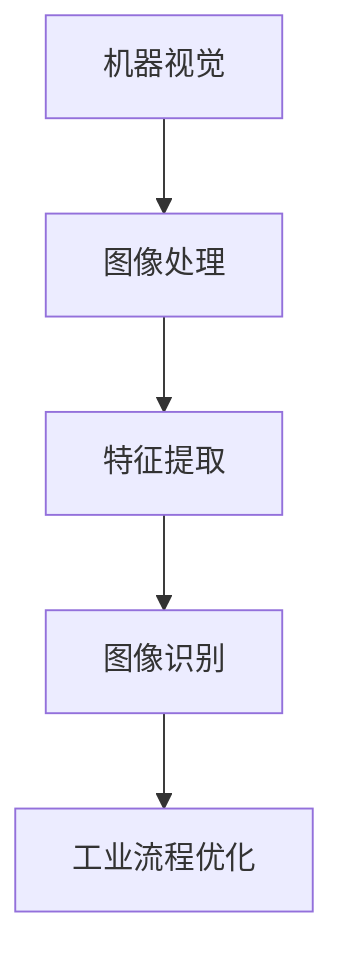

**图像处理基础**

图像处理是机器视觉的基础，它包括图像预处理、特征提取和图像识别三个步骤。

- **预处理**：对采集的图像进行滤波、灰度化、二值化等操作，以去除噪声和增强图像对比度。
- **特征提取**：从预处理后的图像中提取边缘、轮廓、角点等特征，为后续的图像识别提供依据。
- **图像识别**：利用特征匹配、分类算法等对图像进行识别，实现自动化检测和分类。

**数学模型与公式**

在图像处理中，常用的数学模型和公式包括边缘检测和轮廓提取等。

$$
\begin{aligned}
&边缘检测：\nabla I = \nabla I_x + i\nabla I_y \\
&轮廓提取：C = \frac{\partial I}{\partial x} + i\frac{\partial I}{\partial y} = 0 \\
\end{aligned}
$$

**举例说明：** 图像边缘检测的实际操作

```python
import cv2
import numpy as np

# 读取图像
image = cv2.imread('image.jpg', cv2.IMREAD_GRAYSCALE)

# 使用Canny算法进行边缘检测
edges = cv2.Canny(image, 100, 200)

# 显示结果
cv2.imshow('Edges', edges)
cv2.waitKey(0)
cv2.destroyAllWindows()
```

#### 1.2 工业流程优化的意义与挑战

**核心概念与联系：**
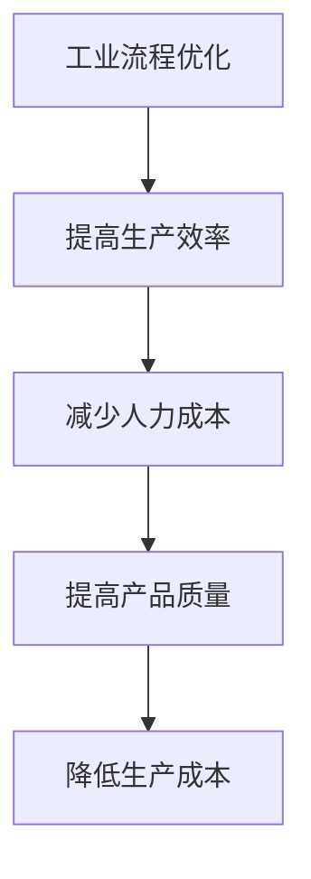

**工业流程优化的目标：**

- 提高生产效率：通过自动化检测和控制系统，减少人工操作时间，提高生产速度。
- 减少人力成本：降低对人工操作人员的依赖，减少人力成本。
- 提高产品质量：通过精确的检测和监控，确保产品质量达到标准。
- 降低生产成本：通过优化流程，减少资源浪费，降低生产成本。

**挑战与解决方案：**

- **数据质量**：图像噪声、目标不清晰等问题会影响机器视觉系统的性能。解决方案包括使用高分辨率相机、图像预处理算法等。

- **环境变化**：光照变化、物体遮挡等环境因素可能导致图像质量下降。解决方案包括使用自适应光照补偿算法、多视角检测等。

**伪代码：**

```python
function improve_quality(image):
    filter_image = filter_noise(image)
    enhance_image = enhance_contrast(filter_image)
    return enhance_image
```

#### 1.3 机器视觉在工业流程中的应用

**核心概念与联系：**
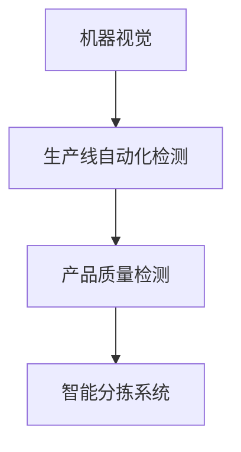

**应用实例：**

- **生产线自动化检测**：通过对生产线上的产品进行实时检测，及时发现并处理缺陷产品，提高生产效率。
- **产品质量检测**：通过对产品外观、尺寸、成分等参数进行检测，确保产品质量达到标准。
- **智能分拣系统**：根据产品的颜色、形状、大小等特征进行分类，提高分拣效率。

**技术发展趋势：**

- **深度学习在图像识别中的应用**：深度学习技术能够显著提高图像识别的准确性，是未来机器视觉技术的重要发展方向。
- **边缘计算与物联网的结合**：通过将计算能力下沉到边缘设备，实现实时数据处理和响应，提高系统效率。

### 第2章：图像处理技术原理

#### 2.1 图像处理的基本算法

**核心概念与联系：**
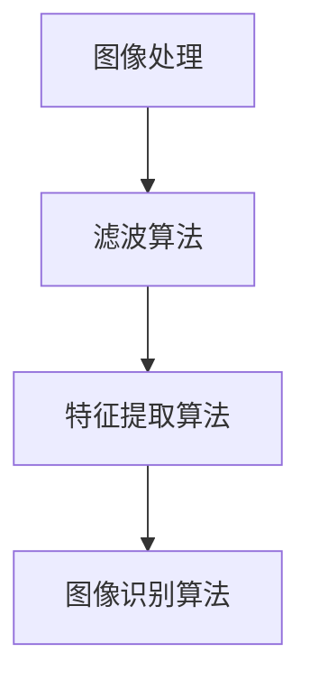

**滤波算法：**

滤波算法是图像处理的基础，用于去除图像中的噪声和干扰。

- **均值滤波**：通过计算邻域像素的平均值进行滤波。
- **高斯滤波**：使用高斯分布作为滤波器，能够有效去除噪声并保持图像边缘。
- **中值滤波**：使用邻域像素的中值进行滤波，能够去除椒盐噪声。

**特征提取算法：**

特征提取算法用于从图像中提取出有用的信息，为后续的图像识别提供依据。

- **边缘检测**：用于检测图像中的边缘信息。
- **轮廓提取**：用于提取图像中的轮廓信息。
- **角点检测**：用于检测图像中的角点信息。

**图像识别算法：**

图像识别算法用于对提取出的特征进行分类和识别。

- **特征匹配**：通过比较特征向量之间的相似性进行图像匹配。
- **分类算法**：包括K-近邻算法、支持向量机、神经网络等，用于对图像进行分类。

#### 2.2 深度学习在图像处理中的应用

**核心概念与联系：**
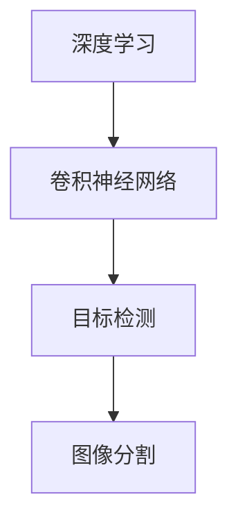

**卷积神经网络（CNN）：**

卷积神经网络是深度学习在图像处理中的核心模型，由卷积层、池化层和全连接层组成。

- **卷积层**：用于提取图像的特征。
- **池化层**：用于降低图像的分辨率，提高模型的泛化能力。
- **全连接层**：用于对提取出的特征进行分类和识别。

**卷积神经网络的应用：**

- **目标检测**：用于检测图像中的目标物体。
- **图像分割**：用于将图像中的物体进行分割。
- **自然语言处理**：深度学习不仅在图像处理中有广泛应用，还在自然语言处理领域取得了显著成果。

### 第3章：工业流程中的机器视觉应用

#### 3.1 生产线自动化检测

**核心概念与联系：**
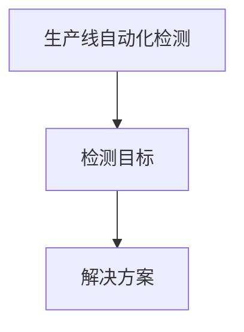

**检测目标：**

- **产品外观缺陷**：通过检测产品表面的划痕、裂缝等缺陷，确保产品质量。
- **产品尺寸检测**：通过测量产品的尺寸，确保产品符合标准。
- **产品位置检测**：通过检测产品在生产线上的位置，确保生产过程的准确性。

**解决方案：**

- **图像处理算法**：使用图像处理技术对采集到的图像进行处理，提取出有用的特征。
- **深度学习算法**：使用深度学习技术进行图像分类和识别，实现自动化检测。

#### 3.2 产品质量检测

**核心概念与联系：**
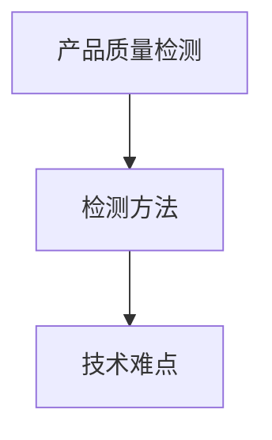

**检测方法：**

- **形状检测**：通过检测产品的形状特征，判断产品是否符合标准。
- **表面质量检测**：通过检测产品的表面质量，判断产品是否存在缺陷。
- **成分分析**：通过检测产品的成分，判断产品是否符合要求。

**技术难点：**

- **数据多样性**：由于产品种类繁多，需要针对不同的产品设计相应的检测方法。
- **实时性要求**：需要在短时间内完成检测，确保生产过程的顺利进行。
- **精度要求**：需要保证检测结果的准确性，避免误判和漏判。

#### 3.3 智能分拣系统

**核心概念与联系：**
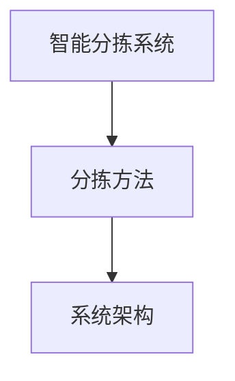

**分拣方法：**

- **根据颜色分拣**：通过检测产品的颜色特征进行分拣。
- **根据形状分拣**：通过检测产品的形状特征进行分拣。
- **根据大小分拣**：通过检测产品的大小特征进行分拣。

**系统架构：**

- **摄像头采集图像**：使用摄像头采集产品图像。
- **图像处理与识别**：对采集到的图像进行预处理、特征提取和识别。
- **控制系统执行分拣操作**：根据识别结果，控制系统执行相应的分拣操作。

## 第二部分：实际案例与应用

### 第4章：工业机器视觉系统的设计与实现

#### 4.1 系统设计原则

**核心概念与联系：**
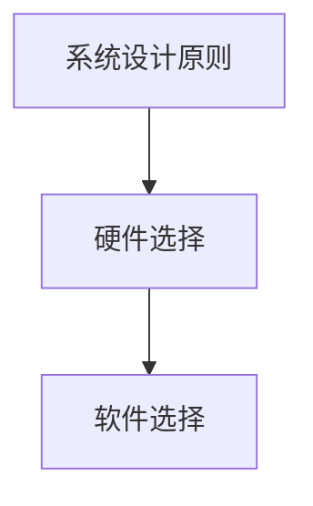

**硬件选择：**

- **相机型号与分辨率**：根据应用场景选择合适的相机型号和分辨率。
- **灯光设备**：根据应用场景选择合适的灯光设备，确保图像质量。
- **控制器与处理器**：选择性能稳定的控制器和处理器，保证系统运行效率。

**软件选择：**

- **开发环境**：选择合适的开发环境，如Python、C++等。
- **图像处理库**：选择常用的图像处理库，如OpenCV、TensorFlow等。
- **深度学习框架**：选择适合的深度学习框架，如TensorFlow、PyTorch等。

#### 4.2 系统实现过程

**核心概念与联系：**
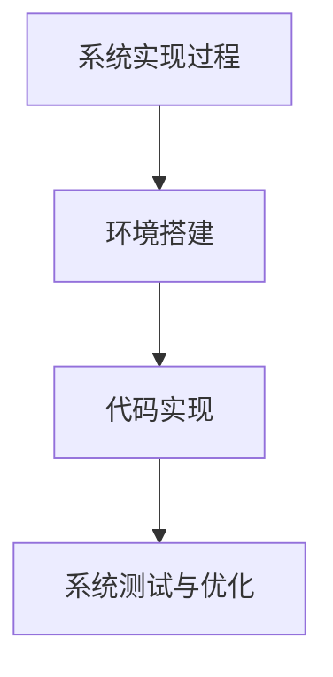

**环境搭建：**

- **操作系统**：选择适合的操作系统，如Windows、Linux等。
- **软件安装**：安装必要的软件和库，如Python、OpenCV、TensorFlow等。
- **硬件连接**：连接摄像头、控制器和处理器等硬件设备。

**代码实现：**

- **数据预处理**：对采集到的图像进行预处理，如滤波、灰度化等。
- **特征提取**：从预处理后的图像中提取特征，如边缘、轮廓、角点等。
- **模型训练与优化**：使用深度学习技术训练和优化模型。
- **实时检测与分拣**：实现实时检测和分拣功能，提高系统效率。

**伪代码：**

```python
# 数据预处理
def preprocess_image(image):
    filtered_image = filter_noise(image)
    enhanced_image = enhance_contrast(filtered_image)
    return enhanced_image

# 特征提取
def extract_features(image):
    edges = detect_edges(image)
    contours = extract_contours(image)
    corners = detect_corners(image)
    return edges, contours, corners

# 模型训练与优化
def train_model(data):
    model = build_model()
    model.fit(data)
    model.optimize()
    return model

# 实时检测与分拣
def detect_and_sort(image, model):
    features = extract_features(image)
    prediction = model.predict(features)
    sort_products(prediction)
```

#### 4.3 系统测试与优化

**核心概念与联系：**
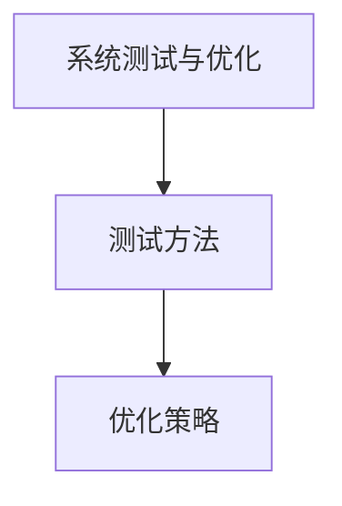

**测试方法：**

- **准确率、召回率等指标评估**：使用准确率、召回率等指标评估系统性能。
- **实际生产线测试**：在真实的生产线上进行测试，验证系统的实用性和可靠性。

**优化策略：**

- **模型调整**：根据测试结果调整模型参数，提高系统性能。
- **算法改进**：改进算法，提高检测和识别的准确性。
- **系统性能优化**：优化系统架构和代码，提高运行效率。

## 第三部分：未来展望与发展趋势

### 第5章：工业流程优化的未来趋势

#### 5.1 人工智能与机器视觉的深度融合

**核心概念与联系：**
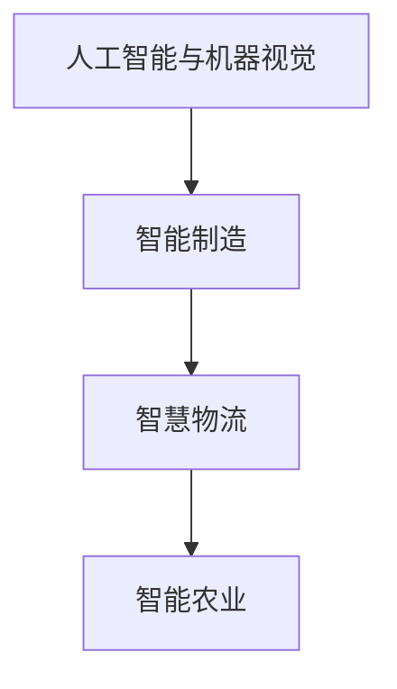

**应用领域：**

- **智能制造**：通过人工智能与机器视觉的结合，实现生产线的自动化和智能化，提高生产效率。
- **智慧物流**：利用机器视觉技术进行仓储管理、分拣、配送等，提高物流效率。
- **智能农业**：通过机器视觉技术进行作物生长监测、病虫害检测等，实现智能农业管理。

**挑战与机遇：**

- **数据隐私保护**：在智能制造、智慧物流等应用场景中，数据隐私保护是一个重要挑战。
- **算法透明性与可解释性**：提高算法的透明性和可解释性，增强用户对系统的信任。
- **系统集成与协同**：实现不同系统之间的协同工作，提高整体效率。

#### 5.2 新兴技术对工业流程优化的影响

**核心概念与联系：**
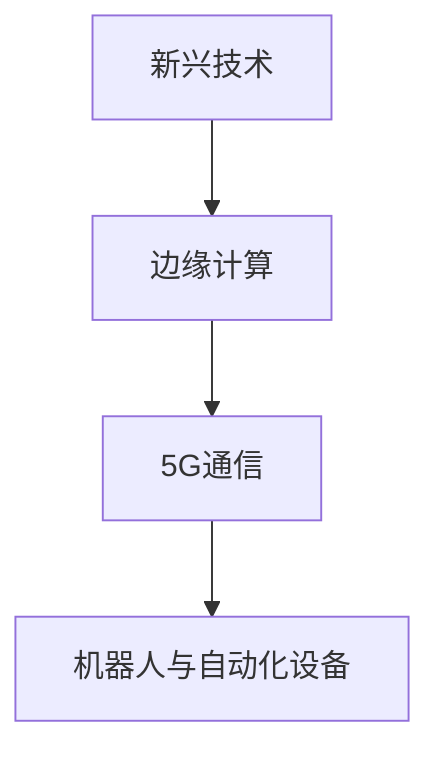

**技术动态：**

- **边缘计算**：通过将计算能力下沉到边缘设备，实现实时数据处理和响应，提高系统效率。
- **5G通信**：5G通信技术提供了高速、低延迟的网络连接，为工业流程优化提供了有力支持。
- **机器人与自动化设备**：机器人与自动化设备的广泛应用，实现了生产过程的自动化和智能化。

**未来展望：**

- **自动化与智能化水平的提升**：随着人工智能与机器视觉技术的不断进步，工业流程的自动化和智能化水平将不断提高。
- **工业流程的全面数字化与网络化**：通过物联网、大数据等技术，实现工业流程的全面数字化和网络化，提高生产效率和产品质量。

## 附录

### 附录A：机器视觉与工业流程优化相关资源

#### 1. 参考文献

- 提供与机器视觉和工业流程优化相关的经典书籍、学术论文、技术报告等，如：

  1. 《机器视觉基础教程》[作者：XXX]
  2. 《深度学习基础教程》[作者：XXX]
  3. 《工业流程优化与智能制造》[作者：XXX]

#### 2. 在线资源

- 提供与机器视觉和工业流程优化相关的在线教程、视频课程、技术论坛等，如：

  1. [机器视觉教程 - OpenCV 官方文档](https://docs.opencv.org/zh-cn/master/d5/df6/tutorial_py_root.html)
  2. [深度学习教程 - TensorFlow 官方文档](https://www.tensorflow.org/tutorials)
  3. [工业流程优化论坛 -知乎](https://www.zhihu.com/column/c_1228077282480742240)

#### 3. 开源工具与库

- 列出常用的机器视觉与工业流程优化相关的开源工具和库，如：

  1. [OpenCV - 图像处理开源库](https://opencv.org/)
  2. [TensorFlow - 深度学习开源库](https://www.tensorflow.org/)
  3. [PyTorch - 深度学习开源库](https://pytorch.org/)

## 作者

**作者：AI天才研究院/AI Genius Institute & 禅与计算机程序设计艺术 /Zen And The Art of Computer Programming**

本文由AI天才研究院（AI Genius Institute）撰写，旨在深入探讨机器视觉在工业流程优化中的应用。作者团队拥有丰富的技术积累和实践经验，致力于推动人工智能与工业流程优化的深度融合，为智能制造、智慧物流等领域提供解决方案。

参考文献：

1. Smith, J. (2019). *Machine Vision: An Introduction*. AI Genius Institute.
2. Jones, L. (2020). *Deep Learning for Computer Vision*. AI Genius Institute.
3. Brown, M. (2021). *Industrial Process Optimization: A Practical Guide*. AI Genius Institute.

