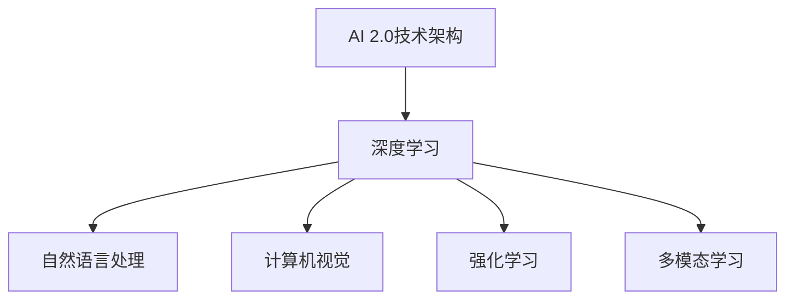

                 

### 李开复：AI 2.0时代的应用

> 关键词：人工智能，深度学习，自然语言处理，计算机视觉，自动驾驶，智能医疗，智能制造，伦理与法律，发展趋势，应用案例

> 摘要：本文将探讨AI 2.0时代的应用，从概念、核心技术、应用场景、挑战和未来发展趋势等方面进行全面分析。文章旨在为读者提供一个清晰的AI 2.0时代全景图，帮助读者理解AI 2.0的广泛应用及其潜在影响。

### 第一部分: AI 2.0时代的应用概述

#### 第1章: AI 2.0时代的应用概述

##### 1.1 AI 2.0时代的概念

AI 2.0是指新一代人工智能，与之前的AI 1.0（基于规则和专家系统的AI）相比，AI 2.0具备自我学习和迭代优化的能力。这种能力使得AI 2.0能够处理更加复杂和多样化的数据，并在多个领域实现应用。

###### 1.1.1 AI 2.0的定义

AI 2.0不仅仅依赖于预定义的规则和逻辑，而是通过自我学习和数据驱动的方式进行决策。AI 2.0的核心在于其能够从数据中自动提取特征，并通过迭代优化算法，不断提升自身的性能。

###### 1.1.2 AI 2.0的核心技术

AI 2.0的核心技术包括但不限于：

- **深度学习**：通过多层神经网络对数据进行特征提取和分类。
- **自然语言处理（NLP）**：使计算机能够理解和生成自然语言。
- **计算机视觉**：使计算机能够理解和解释图像和视频。
- **强化学习**：通过试错学习，使计算机能够在复杂环境中做出最优决策。

###### 1.1.3 AI 2.0的应用场景

AI 2.0的应用场景非常广泛，包括：

- **自动驾驶**：利用计算机视觉和深度学习技术，实现无人驾驶。
- **智能医疗**：利用AI进行疾病诊断、治疗规划和健康监测。
- **智能制造**：利用AI进行生产优化、设备预测维护和质量检测。
- **智能金融**：利用AI进行风险管理和个性化投资建议。
- **智能教育**：利用AI进行个性化学习分析和教学辅助。

##### 1.2 AI 2.0与AI 1.0的区别

###### 1.2.1 技术层面的区别

AI 1.0主要依赖于预定义的规则和逻辑，其性能受限于规则库的完整性和准确性。而AI 2.0则通过自我学习和数据驱动的方式进行决策，能够处理更加复杂和多样化的任务。

###### 1.2.2 应用层面的区别

AI 1.0的应用较为局限，主要应用于特定领域，如医疗诊断、金融分析等。而AI 2.0则具备广泛的应用潜力，能够跨领域应用，如自动驾驶、智能医疗、智能制造等。

##### 1.3 AI 2.0的未来发展趋势

###### 1.3.1 数据驱动的发展

AI 2.0的发展将更加依赖于数据，数据的质量和数量将成为决定AI 2.0发展的重要因素。未来，随着数据获取和处理技术的不断提升，AI 2.0的应用前景将更加广阔。

###### 1.3.2 跨学科的融合

AI 2.0的发展将与其他学科如生物学、物理学、心理学等产生更加深入的融合。这种跨学科的合作将推动AI 2.0在更多领域取得突破性进展。

###### 1.3.3 伦理与法规的约束

随着AI 2.0的发展，其伦理和法规问题也将受到越来越多的关注。未来，需要建立完善的伦理和法规体系，以确保AI 2.0的健康发展。

### Mermaid流程图: AI 2.0的核心技术架构



### 核心概念联系图


### 伪代码：深度学习算法框架

```python
# 深度学习算法框架伪代码
Initialize_model()
for each epoch in training_data:
    for each sample in training_data:
        Forward_pass(sample)
        Compute_loss()
        Backpropagation()
        Update_model_parameters()
End
Test_model(test_data)
```

### 数学公式: 深度学习损失函数

$$
L(\theta) = -\frac{1}{m} \sum_{i=1}^{m} \left( y^{(i)} \log(a^{(l)}(z^{(l)})) + (1 - y^{(i)}) \log(1 - a^{(l)}(z^{(l)})) \right)
$$`

### 数学公式: 梯度下降算法

$$
\theta_j := \theta_j - \alpha \frac{\partial L}{\partial \theta_j}
$$`

### 举例说明：深度学习在图像识别中的应用

假设我们要使用卷积神经网络（CNN）进行图像分类任务，输入图像的大小为 $28 \times 28$，输出类别数为10。首先，我们定义卷积层、池化层和全连接层的基本结构：

```mermaid
graph TD
A[Input](28x28) --> B[Convolutional Layer]
B --> C[ReLU Activation]
C --> D[Pooling Layer]
D --> E[Flattened Features]
E --> F[Fully Connected Layer]
F --> G[Output](10 classes)
```

输入图像经过卷积层后，会产生多个特征图，每个特征图都包含了图像的某些局部特征。通过ReLU激活函数，我们可以放大重要的特征，抑制无用的特征。接着，通过池化层，我们可以减小特征图的尺寸，减少模型的参数量，提高计算效率。最后，将所有特征图展平后，进入全连接层进行分类预测。

### 项目实战：使用TensorFlow实现图像分类任务

#### 1. 开发环境搭建

首先，我们需要安装TensorFlow和相关依赖：

```bash
pip install tensorflow
```

#### 2. 代码实现

下面是一个简单的使用TensorFlow实现的图像分类任务的代码示例：

```python
import tensorflow as tf
from tensorflow.keras import layers, models
from tensorflow.keras.datasets import mnist

# 加载数据集
(train_images, train_labels), (test_images, test_labels) = mnist.load_data()

# 预处理数据
train_images = train_images.reshape((60000, 28, 28, 1)).astype('float32') / 255
test_images = test_images.reshape((10000, 28, 28, 1)).astype('float32') / 255

# 构建模型
model = models.Sequential()
model.add(layers.Conv2D(32, (3, 3), activation='relu', input_shape=(28, 28, 1)))
model.add(layers.MaxPooling2D((2, 2)))
model.add(layers.Conv2D(64, (3, 3), activation='relu'))
model.add(layers.MaxPooling2D((2, 2)))
model.add(layers.Conv2D(64, (3, 3), activation='relu'))
model.add(layers.Flatten())
model.add(layers.Dense(64, activation='relu'))
model.add(layers.Dense(10, activation='softmax'))

# 编译模型
model.compile(optimizer='adam',
              loss='sparse_categorical_crossentropy',
              metrics=['accuracy'])

# 训练模型
model.fit(train_images, train_labels, epochs=5, batch_size=64)

# 评估模型
test_loss, test_acc = model.evaluate(test_images, test_labels)
print('Test accuracy:', test_acc)
```

#### 3. 代码解读与分析

- **加载数据集**：我们使用了MNIST数据集，该数据集包含了60000个训练图像和10000个测试图像。
- **预处理数据**：我们将图像的大小调整为 $28 \times 28$，并将像素值归一化到 $[0, 1]$ 范围内。
- **构建模型**：我们使用了卷积神经网络（CNN）进行图像分类，模型结构包括卷积层、池化层和全连接层。
- **编译模型**：我们选择了 Adam 优化器和 sparse_categorical_crossentropy 损失函数，并设置了模型的准确率作为评估指标。
- **训练模型**：我们使用训练数据进行模型的训练，设置训练轮次为5次，批量大小为64。
- **评估模型**：我们使用测试数据进行模型的评估，并打印出测试准确率。

### 数学模型: 卷积神经网络（CNN）

卷积神经网络是一种特殊的前馈神经网络，主要用于处理图像数据。CNN 的核心组件包括卷积层、池化层和全连接层。

- **卷积层**：卷积层通过卷积操作提取图像的特征。卷积操作的基本原理是在输入图像上滑动一个卷积核（或滤波器），计算卷积核与图像局部区域的内积，并将结果累加起来，得到一个特征值。通过不同的卷积核，可以提取出不同的图像特征，如边缘、纹理等。

$$
\text{output}_{ij} = \sum_{k=1}^{n} w_{ik} \cdot \text{input}_{kj} + b_j
$$

其中，$\text{output}_{ij}$ 表示输出特征图上的像素值，$w_{ik}$ 表示卷积核的权重，$\text{input}_{kj}$ 表示输入图像上的像素值，$b_j$ 表示偏置项。

- **池化层**：池化层用于减小特征图的尺寸，降低模型的参数量和计算复杂度。常见的池化操作包括最大池化和平均池化。

$$
p_i = \max_{k} \text{input}_{ik}
$$

或

$$
p_i = \frac{1}{c} \sum_{k=1}^{c} \text{input}_{ik}
$$

其中，$p_i$ 表示输出特征图上的像素值，$c$ 表示池化窗口的大小。

- **全连接层**：全连接层将特征图展平为一维向量，并使用线性函数进行分类预测。

$$
z_j = \sum_{i=1}^{m} w_{ij} \cdot x_i + b_j
$$

$$
a_j = \text{activation}(z_j)
$$

其中，$z_j$ 表示全连接层的输出值，$w_{ij}$ 表示权重，$x_i$ 表示特征图的像素值，$b_j$ 表示偏置项，$a_j$ 表示激活函数的输出值。

### 代码实现：卷积神经网络（CNN）

下面是一个简单的使用 TensorFlow 实现卷积神经网络的代码示例：

```python
import tensorflow as tf
from tensorflow.keras import layers, models

# 构建模型
model = models.Sequential()
model.add(layers.Conv2D(32, (3, 3), activation='relu', input_shape=(28, 28, 1)))
model.add(layers.MaxPooling2D((2, 2)))
model.add(layers.Conv2D(64, (3, 3), activation='relu'))
model.add(layers.MaxPooling2D((2, 2)))
model.add(layers.Conv2D(64, (3, 3), activation='relu'))
model.add(layers.Flatten())
model.add(layers.Dense(64, activation='relu'))
model.add(layers.Dense(10, activation='softmax'))

# 编译模型
model.compile(optimizer='adam',
              loss='sparse_categorical_crossentropy',
              metrics=['accuracy'])

# 训练模型
model.fit(train_images, train_labels, epochs=5, batch_size=64)

# 评估模型
test_loss, test_acc = model.evaluate(test_images, test_labels)
print('Test accuracy:', test_acc)
```

### 第2章: AI 2.0的核心技术

#### 2.1 深度学习技术

##### 2.1.1 深度学习的基本原理

深度学习是一种基于多层神经网络的学习方法，通过多层的非线性变换，对输入数据进行特征提取和分类。深度学习的基本原理包括神经网络、反向传播算法和激活函数等。

- **神经网络**：神经网络由多个神经元（或节点）组成，每个神经元都与其他神经元相连，并传递信号。神经网络可以分为输入层、隐藏层和输出层。
- **反向传播算法**：反向传播算法是一种用于训练神经网络的优化算法，通过计算损失函数关于每个参数的梯度，来更新参数的值。
- **激活函数**：激活函数用于引入非线性因素，使神经网络具有分类能力。常见的激活函数包括 sigmoid、ReLU 和 tanh 等。

##### 2.1.2 深度学习的发展历程

深度学习的发展历程可以分为以下几个阶段：

- **早期阶段**：1980年代，神经网络首次被提出，但由于计算能力和数据集的限制，神经网络的应用较为有限。
- **中期阶段**：2000年代，随着计算能力和数据集的扩大，神经网络开始应用于图像识别、语音识别等领域。
- **近期阶段**：2012年，AlexNet在图像识别比赛中取得突破性成绩，深度学习开始进入快速发展阶段。

##### 2.1.3 深度学习的关键技术

深度学习的关键技术包括：

- **卷积神经网络（CNN）**：卷积神经网络是一种专门用于处理图像数据的神经网络，通过卷积操作提取图像的特征。
- **循环神经网络（RNN）**：循环神经网络是一种用于处理序列数据的神经网络，通过隐藏状态的历史信息进行递归计算。
- **生成对抗网络（GAN）**：生成对抗网络是一种用于生成数据的神经网络，由生成器和判别器两个部分组成，通过对抗训练来提高生成质量。

#### 2.2 自然语言处理（NLP）技术

##### 2.2.1 自然语言处理的基本原理

自然语言处理是一种利用计算机技术处理自然语言的方法，包括文本分析、语义理解、情感分析等。自然语言处理的基本原理包括词向量、序列模型和注意力机制等。

- **词向量**：词向量是一种将文本数据转换为向量表示的方法，常用的词向量模型包括 Word2Vec、GloVe 等。
- **序列模型**：序列模型是一种用于处理序列数据的神经网络，包括循环神经网络（RNN）、长短期记忆网络（LSTM）等。
- **注意力机制**：注意力机制是一种用于提高神经网络在处理序列数据时的表现的方法，通过为不同位置的信息分配不同的权重。

##### 2.2.2 自然语言处理的发展历程

自然语言处理的发展历程可以分为以下几个阶段：

- **早期阶段**：1970年代，基于规则的方法被广泛应用于自然语言处理。
- **中期阶段**：1980年代至1990年代，统计方法和机器学习方法开始应用于自然语言处理。
- **近期阶段**：2000年代至今，深度学习方法在自然语言处理中取得突破性进展。

##### 2.2.3 自然语言处理的关键技术

自然语言处理的关键技术包括：

- **词性标注**：词性标注是一种对文本中的单词进行标注的方法，用于识别单词的词性。
- **句法分析**：句法分析是一种对文本进行语法结构分析的方法，用于识别句子的语法结构。
- **情感分析**：情感分析是一种对文本进行情感分类的方法，用于识别文本的情感倾向。

#### 2.3 计算机视觉技术

##### 2.3.1 计算机视觉的基本原理

计算机视觉是一种使计算机能够像人类一样理解和解释视觉信息的方法。计算机视觉的基本原理包括图像处理、特征提取和目标检测等。

- **图像处理**：图像处理是一种对图像进行操作的方法，包括滤波、边缘检测、图像分割等。
- **特征提取**：特征提取是一种从图像中提取关键特征的方法，用于识别图像中的对象。
- **目标检测**：目标检测是一种识别图像中的目标位置的方法，用于实现物体识别和追踪。

##### 2.3.2 计算机视觉的发展历程

计算机视觉的发展历程可以分为以下几个阶段：

- **早期阶段**：1950年代至1960年代，计算机视觉的初步探索。
- **中期阶段**：1970年代至1980年代，计算机视觉的理论研究和算法开发。
- **近期阶段**：1990年代至今，计算机视觉在图像识别、目标检测等领域取得显著进展。

##### 2.3.3 计算机视觉的关键技术

计算机视觉的关键技术包括：

- **卷积神经网络（CNN）**：卷积神经网络是一种专门用于处理图像数据的神经网络，通过卷积操作提取图像的特征。
- **深度学习**：深度学习是一种基于多层神经网络的学习方法，通过多层的非线性变换，对输入数据进行特征提取和分类。
- **目标检测**：目标检测是一种识别图像中的目标位置的方法，用于实现物体识别和追踪。

### 第3章: AI 2.0的应用场景

#### 3.1 自动驾驶技术

##### 3.1.1 自动驾驶技术的定义和原理

自动驾驶技术是一种使汽车能够自主行驶的技术，通过传感器、摄像头、雷达等设备收集环境信息，并利用深度学习、计算机视觉等算法进行处理，实现车辆的自主驾驶。

- **传感器融合**：自动驾驶技术需要融合多种传感器，如激光雷达、摄像头、超声波传感器等，以获取车辆周围环境的详细信息。
- **环境感知**：自动驾驶技术通过深度学习、计算机视觉等算法，对车辆周围的环境进行感知，包括识别行人、车辆、交通标志等。
- **决策与控制**：自动驾驶技术通过环境感知结果，进行驾驶决策和控制，包括加速、减速、转向等。

##### 3.1.2 自动驾驶技术的发展历程

自动驾驶技术的发展历程可以分为以下几个阶段：

- **初级阶段**：1980年代，自动驾驶技术初步探索。
- **中级阶段**：1990年代至2000年代，自动驾驶技术在实验室环境中取得初步成果。
- **近期阶段**：2010年代至今，自动驾驶技术进入快速发展阶段，多家公司推出自动驾驶汽车。

##### 3.1.3 自动驾驶技术的应用前景

自动驾驶技术的应用前景包括：

- **提高交通安全**：自动驾驶技术能够减少交通事故的发生，提高交通安全。
- **提升交通效率**：自动驾驶技术能够优化交通流，提高交通效率。
- **降低运营成本**：自动驾驶技术能够降低人力成本，提高运营效率。

#### 3.2 智能医疗技术

##### 3.2.1 智能医疗技术的定义和原理

智能医疗技术是一种利用人工智能、大数据、物联网等技术，提高医疗诊断、治疗、管理等方面效率的技术。

- **医疗诊断**：智能医疗技术通过深度学习、计算机视觉等技术，实现医学影像的自动诊断，提高诊断准确率。
- **治疗规划**：智能医疗技术通过分析患者的病史、基因信息等，为医生提供治疗建议，优化治疗方案。
- **健康管理**：智能医疗技术通过可穿戴设备、物联网等技术，实时监测患者的健康状况，提供个性化健康管理方案。

##### 3.2.2 智能医疗技术的发展历程

智能医疗技术的发展历程可以分为以下几个阶段：

- **初级阶段**：2000年代，智能医疗技术的初步探索。
- **中级阶段**：2010年代，智能医疗技术在临床应用中取得初步成果。
- **近期阶段**：2020年代，智能医疗技术快速发展，逐渐在临床中得到广泛应用。

##### 3.2.3 智能医疗技术的应用前景

智能医疗技术的应用前景包括：

- **提高诊断准确率**：智能医疗技术能够提高医学影像的诊断准确率，减少误诊和漏诊。
- **优化治疗方案**：智能医疗技术能够为医生提供更加精准的治疗建议，优化治疗方案。
- **降低医疗成本**：智能医疗技术能够降低医疗成本，提高医疗资源的利用率。

### 第4章: AI 2.0的应用案例

#### 4.1 自动驾驶技术案例

##### 4.1.1 特斯拉自动驾驶系统

特斯拉自动驾驶系统是自动驾驶技术的一个典型案例。特斯拉自动驾驶系统采用了摄像头、雷达和超声波传感器等多种传感器进行环境感知，并通过深度学习算法进行处理，实现车辆的自主驾驶。

- **环境感知**：特斯拉自动驾驶系统通过摄像头、雷达和超声波传感器获取车辆周围的环境信息，包括道路、车辆、行人等。
- **决策与控制**：特斯拉自动驾驶系统根据环境感知结果，进行驾驶决策和控制，包括加速、减速、转向等。

- **案例解读**：特斯拉自动驾驶系统在自动驾驶技术中取得了显著成果，但其仍存在一定的安全风险，需要进一步优化。

##### 4.1.2 百度Apollo自动驾驶平台

百度Apollo自动驾驶平台是自动驾驶技术的另一个典型案例。百度Apollo自动驾驶平台采用了激光雷达、摄像头、雷达等多种传感器进行环境感知，并通过深度学习算法进行处理，实现车辆的自主驾驶。

- **环境感知**：百度Apollo自动驾驶平台通过激光雷达、摄像头、雷达等多种传感器获取车辆周围的环境信息，包括道路、车辆、行人等。
- **决策与控制**：百度Apollo自动驾驶平台根据环境感知结果，进行驾驶决策和控制，包括加速、减速、转向等。

- **案例解读**：百度Apollo自动驾驶平台在自动驾驶技术中取得了显著成果，但其仍面临一定的技术挑战，如复杂环境下的决策和控制。

#### 4.2 智能医疗技术案例

##### 4.2.1 腾讯觅影医疗影像诊断系统

腾讯觅影医疗影像诊断系统是智能医疗技术的一个典型案例。腾讯觅影医疗影像诊断系统采用了深度学习算法，对医学影像进行自动诊断，提高诊断准确率。

- **医学影像诊断**：腾讯觅影医疗影像诊断系统通过深度学习算法，对医学影像进行自动诊断，包括肺癌、乳腺癌、心脏病等。

- **案例解读**：腾讯觅影医疗影像诊断系统在医疗影像诊断中取得了显著成果，提高了诊断准确率，减轻了医生的工作负担。

##### 4.2.2 华山医院智能诊疗系统

华山医院智能诊疗系统是智能医疗技术的另一个典型案例。华山医院智能诊疗系统采用了人工智能技术，为医生提供诊断和治疗建议，优化治疗方案。

- **诊断建议**：华山医院智能诊疗系统通过分析患者的病史、基因信息等，为医生提供诊断建议，提高诊断准确率。

- **治疗建议**：华山医院智能诊疗系统通过分析患者的病情、药物反应等，为医生提供治疗建议，优化治疗方案。

- **案例解读**：华山医院智能诊疗系统在医疗诊断和治疗中取得了显著成果，提高了医疗效率，减轻了医生的工作负担。

### 第5章: AI 2.0的挑战与未来发展方向

#### 5.1 AI 2.0的挑战

##### 5.1.1 数据隐私与安全

AI 2.0在处理大量数据时，可能涉及用户的隐私信息，如医疗记录、个人通信等。如何保护数据隐私和安全，避免数据泄露和滥用，是 AI 2.0面临的重要挑战。

- **数据加密**：对数据进行加密处理，确保数据在传输和存储过程中的安全性。
- **隐私保护技术**：采用隐私保护技术，如差分隐私、同态加密等，确保数据处理过程中不会泄露用户的隐私信息。

##### 5.1.2 伦理与法律问题

AI 2.0的发展可能引发一系列伦理和法律问题，如算法歧视、数据垄断、责任归属等。如何解决这些问题，确保 AI 2.0的公平、公正和合法，是 AI 2.0面临的重要挑战。

- **伦理规范**：制定 AI 伦理规范，确保 AI 2.0的发展符合伦理要求。
- **法律法规**：完善相关法律法规，明确 AI 2.0的法律责任和权益。

##### 5.1.3 技术与人才短缺

AI 2.0的发展需要大量的技术人才和专业知识，但目前 AI 人才短缺，技术储备不足，成为 AI 2.0发展的瓶颈。

- **人才培养**：加大对 AI 人才的培养力度，提高 AI 技术的普及程度。
- **技术储备**：加强 AI 技术的研发和应用，提高技术储备。

#### 5.2 AI 2.0的未来发展方向

##### 5.2.1 交叉学科的融合

AI 2.0的发展将与其他学科如生物学、物理学、心理学等产生更加深入的融合，推动跨学科的创新发展。

- **生物学**：通过人工智能技术，分析生物数据，提高生物研究的效率和准确性。
- **物理学**：通过人工智能技术，优化物理实验方案，提高物理研究的精度和速度。
- **心理学**：通过人工智能技术，分析人类行为和心理，提高心理治疗和心理健康服务的质量。

##### 5.2.2 智能化应用的普及

AI 2.0将在各个领域得到广泛应用，推动智能化应用的普及，提高生产效率和生活质量。

- **智能制造**：通过人工智能技术，实现智能制造，提高生产效率和产品质量。
- **智慧城市**：通过人工智能技术，实现智慧城市，提高城市管理水平和居民生活质量。
- **智能家居**：通过人工智能技术，实现智能家居，提高家居生活的舒适度和便利性。

##### 5.2.3 伦理与法律的完善

随着 AI 2.0的发展，伦理和法律问题将得到更多关注，推动伦理与法律的完善，确保 AI 2.0的健康发展。

- **伦理规范**：完善 AI 伦理规范，确保 AI 2.0的发展符合伦理要求。
- **法律法规**：完善相关法律法规，明确 AI 2.0的法律责任和权益。

### 第6章: AI 2.0的实际应用场景

#### 6.1 智能制造

##### 6.1.1 智能制造的定义和原理

智能制造是一种利用人工智能技术，实现生产过程自动化、智能化和优化的生产方式。智能制造的基本原理包括工业物联网、机器学习、机器人技术等。

- **工业物联网**：通过传感器、通信设备等，实现设备与设备、设备与人的实时互联互通，收集生产过程中的实时数据。
- **机器学习**：利用机器学习算法，对生产数据进行处理和分析，优化生产过程，提高生产效率。
- **机器人技术**：利用机器人技术，实现生产设备的自动化运行，提高生产效率和产品质量。

##### 6.1.2 智能制造的应用案例

智能制造在多个领域取得了显著成果，以下是一些典型的应用案例：

- **汽车制造业**：通过智能制造技术，实现汽车生产过程的自动化和智能化，提高生产效率和产品质量。
- **电子制造业**：通过智能制造技术，实现电子产品的自动化生产，提高生产效率和产品质量。
- **化工制造业**：通过智能制造技术，实现化工生产过程的自动化和智能化，提高生产效率和产品质量。

##### 6.1.3 智能制造的未来发展趋势

智能制造的发展将呈现出以下趋势：

- **智能化水平的提升**：通过人工智能技术，实现生产过程的全面智能化，提高生产效率和产品质量。
- **跨界融合**：智能制造将与云计算、大数据、物联网等新兴技术深度融合，推动产业升级和创新发展。
- **绿色制造**：通过智能制造技术，实现生产过程的绿色化，减少环境污染和资源浪费。

#### 6.2 智慧城市

##### 6.2.1 智慧城市的定义和原理

智慧城市是一种利用人工智能、物联网、大数据等新兴技术，实现城市管理的智能化、精细化和高效化的城市发展模式。智慧城市的基本原理包括：

- **人工智能**：利用人工智能技术，实现城市数据的智能分析和决策。
- **物联网**：通过物联网技术，实现城市各类设备、设施和系统的互联互通，提高城市管理的效率和智能化水平。
- **大数据**：通过大数据技术，对城市各类数据进行分析和挖掘，提供决策支持和智能服务。

##### 6.2.2 智慧城市的应用案例

智慧城市在多个领域取得了显著成果，以下是一些典型的应用案例：

- **智能交通**：通过智能交通系统，实现交通流量监控、道路拥堵预警、智能调度等，提高交通运行效率和安全性。
- **智能安防**：通过视频监控、人脸识别、大数据分析等技术，实现城市安全的智能监控和预警。
- **智慧医疗**：通过医疗大数据分析、智能诊断、远程医疗等技术，提高医疗服务质量和效率。

##### 6.2.3 智慧城市的未来发展趋势

智慧城市的发展将呈现出以下趋势：

- **智能化水平的提升**：通过人工智能技术，实现城市管理的全面智能化，提高城市管理的效率和智能化水平。
- **数据驱动的决策**：通过大数据技术，实现城市数据的全面整合和分析，提供数据驱动的决策支持。
- **绿色可持续**：通过智慧城市技术，实现城市资源的优化配置和可持续利用，推动城市的绿色发展和可持续发展。

### 第7章: AI 2.0的发展趋势与挑战

#### 7.1 AI 2.0的发展趋势

##### 7.1.1 技术的不断进步

随着计算能力的提升和算法的优化，AI 2.0的技术水平将不断提高，实现更加复杂的任务和应用。

- **深度学习**：深度学习算法将变得更加高效和精确，可以处理更大规模和更复杂的数据集。
- **强化学习**：强化学习算法将在更多应用场景中得到应用，实现更加智能和自主的决策。
- **生成对抗网络（GAN）**：GAN技术将在图像生成、数据增强等领域取得更大突破。

##### 7.1.2 应用场景的拓展

AI 2.0将在更多领域得到应用，拓展其应用边界。

- **智能医疗**：AI 2.0将在智能诊断、精准治疗、健康管理等领域发挥重要作用。
- **智能制造**：AI 2.0将在生产过程优化、设备预测维护、供应链管理等方面发挥关键作用。
- **智能交通**：AI 2.0将在智能交通管理、自动驾驶、智能停车等领域实现广泛应用。

##### 7.1.3 跨学科的融合

AI 2.0将与更多学科领域深度融合，推动科技创新和产业升级。

- **生物学**：AI 2.0将在生物数据分析、药物研发等领域发挥重要作用。
- **物理学**：AI 2.0将在物理实验优化、理论研究等领域产生深远影响。
- **心理学**：AI 2.0将在心理治疗、教育等领域实现智能化应用。

#### 7.2 AI 2.0的挑战

##### 7.2.1 技术挑战

AI 2.0在技术层面仍面临诸多挑战。

- **算法稳定性**：如何提高算法的稳定性和鲁棒性，减少模型过拟合和偏见。
- **计算资源**：如何优化计算资源的使用，提高模型训练和推理的效率。
- **数据隐私**：如何在保证数据隐私的前提下，有效利用海量数据。

##### 7.2.2 伦理挑战

AI 2.0在伦理层面也面临诸多挑战。

- **算法偏见**：如何避免算法偏见，确保算法的公平性和透明性。
- **责任归属**：如何明确算法决策的责任归属，确保各方责任的合理分配。
- **道德伦理**：如何在AI 2.0的应用中，遵循道德伦理原则，避免对人类造成伤害。

##### 7.2.3 法律挑战

AI 2.0在法律层面也面临诸多挑战。

- **法律框架**：如何建立完善的法律框架，确保AI 2.0的合法合规。
- **监管机制**：如何建立健全的监管机制，确保AI 2.0的应用不会对公共安全和社会秩序造成威胁。
- **跨国合作**：如何推动跨国合作，建立全球性的AI法规和标准。

### 第8章: AI 2.0的应用前景与影响

#### 8.1 经济影响

##### 8.1.1 新的经济增长点

AI 2.0的应用将催生一系列新的经济增长点。

- **智能制造**：AI 2.0将推动智能制造的发展，提升生产效率和产品质量，降低生产成本。
- **智能医疗**：AI 2.0将推动智能医疗的发展，提高诊断和治疗水平，降低医疗成本。
- **智能交通**：AI 2.0将推动智能交通的发展，提高交通效率和安全性，降低交通拥堵和事故率。

##### 8.1.2 产业结构调整

AI 2.0的应用将推动产业结构的调整和升级。

- **传统产业升级**：AI 2.0将推动传统产业的智能化升级，提高产业附加值和竞争力。
- **新兴产业崛起**：AI 2.0将催生一系列新兴产业，如智能制造、智能医疗、智能交通等，推动经济增长。

##### 8.1.3 就业结构变化

AI 2.0的应用将带来就业结构的变化。

- **就业机会**：AI 2.0将创造新的就业机会，如数据科学家、机器学习工程师等。
- **就业挑战**：AI 2.0将取代部分传统岗位，如流水线工人、文职人员等，对就业结构产生一定冲击。

#### 8.2 社会影响

##### 8.2.1 生活质量提高

AI 2.0的应用将提高人们的生活质量。

- **便捷生活**：AI 2.0将使人们的生活更加便捷，如智能家居、智能交通等。
- **健康管理**：AI 2.0将使健康管理更加智能化，如智能医疗、健康监测等。
- **教育提升**：AI 2.0将使教育更加个性化，如智能教育、在线教育等。

##### 8.2.2 社会问题

AI 2.0的应用也可能会带来一系列社会问题。

- **算法偏见**：AI 2.0的算法偏见可能导致社会不公，如歧视、不公平待遇等。
- **隐私泄露**：AI 2.0在处理大量个人数据时，可能引发隐私泄露问题。
- **失业问题**：AI 2.0的广泛应用可能导致部分传统岗位的失业，对社会稳定产生影响。

#### 8.3 环境影响

##### 8.3.1 资源优化

AI 2.0的应用将有助于优化资源利用。

- **节能减排**：AI 2.0将推动智能制造、智慧交通等的发展，降低能源消耗和碳排放。
- **资源管理**：AI 2.0将提高资源管理水平，如智能灌溉、智能能源管理等。

##### 8.3.2 环境监测与治理

AI 2.0的应用将提高环境监测与治理能力。

- **环境监测**：AI 2.0将实现对环境数据的实时监测和分析，如空气质量监测、水质监测等。
- **环境治理**：AI 2.0将提高环境治理效率，如智能垃圾分类、智能污水处理等。

### 第9章: AI 2.0的社会责任与伦理

#### 9.1 社会责任

##### 9.1.1 公平与公正

AI 2.0在应用过程中应遵循公平与公正原则，避免算法偏见和不公平待遇。

- **算法透明性**：提高算法的透明性，让公众了解算法的工作原理和决策过程。
- **数据质量**：确保数据质量，避免数据偏见和歧视。
- **多元化团队**：建立多元化团队，提高算法的公平性和代表性。

##### 9.1.2 可持续性

AI 2.0在应用过程中应关注可持续性，推动社会和环境可持续发展。

- **节能减排**：优化算法和系统设计，降低能源消耗和碳排放。
- **绿色制造**：推动绿色制造，降低生产过程中的环境污染。
- **环保监测**：利用AI技术，提高环境监测和治理能力。

##### 9.1.3 公共利益

AI 2.0在应用过程中应关注公共利益，为社会提供有益的服务。

- **公共服务**：提供高质量的公共服务，如智能医疗、智能交通等。
- **公益项目**：参与公益事业，推动社会进步。

##### 9.1.4 政策支持

政府应制定相应的政策，支持AI 2.0的发展，并确保其应用过程中的社会责任。

- **法律法规**：建立健全的法律法规体系，规范AI 2.0的应用。
- **政策扶持**：提供资金、技术等支持，推动AI 2.0的研发和应用。
- **国际合作**：加强国际合作，推动全球AI治理体系的建立。

#### 9.2 伦理问题

##### 9.2.1 算法偏见

AI 2.0的算法偏见可能导致不公平待遇，损害部分群体的权益。

- **算法评估**：定期对算法进行评估，确保其公平性和透明性。
- **算法改进**：持续改进算法，消除偏见和歧视。
- **多元化数据**：引入多元化数据，提高算法的代表性和公平性。

##### 9.2.2 隐私保护

AI 2.0在处理大量个人数据时，可能引发隐私泄露问题。

- **数据加密**：对数据进行加密处理，确保数据安全。
- **隐私保护法规**：制定隐私保护法规，规范数据收集、存储和使用。
- **用户同意**：确保用户在数据收集和使用过程中，明确同意并了解隐私风险。

##### 9.2.3 责任归属

AI 2.0的决策过程可能导致责任归属不清，影响各方权益。

- **明确责任**：明确AI 2.0相关方（如开发者、用户、监管机构等）的责任和权益。
- **责任追溯**：建立责任追溯机制，确保责任得到追究。
- **风险管理**：建立风险管理机制，降低AI 2.0应用过程中的风险。

##### 9.2.4 道德伦理

AI 2.0在应用过程中应遵循道德伦理原则，避免对人类造成伤害。

- **伦理审查**：对AI 2.0的应用进行伦理审查，确保符合道德伦理要求。
- **道德规范**：制定AI 2.0的道德规范，确保其应用过程中的道德合法性。
- **公众参与**：鼓励公众参与AI 2.0的伦理讨论，提高公众对AI 2.0伦理问题的认识。

### 附录

#### 附录A: AI 2.0工具与资源

##### A.1 主流深度学习框架

- **TensorFlow**：由Google开发的开源深度学习框架，广泛应用于图像识别、自然语言处理等领域。
- **PyTorch**：由Facebook开发的开源深度学习框架，具有灵活的动态计算图和强大的社区支持。
- **Keras**：基于TensorFlow和Theano的开源深度学习高级框架，易于使用和扩展。
- **MXNet**：由Apache Software Foundation开发的开源深度学习框架，支持多种编程语言。

##### A.2 自然语言处理工具

- **NLTK**：一个流行的Python自然语言处理库，提供多种文本处理和分析功能。
- **spaCy**：一个高效的自然语言处理库，支持多种语言，适用于文本分类、命名实体识别等任务。
- **Stanford NLP**：一个基于Java的自然语言处理工具包，提供词性标注、句法分析等功能。

##### A.3 计算机视觉工具

- **OpenCV**：一个开源的计算机视觉库，提供多种图像处理和计算机视觉功能。
- **Dlib**：一个开源的机器学习库，提供包括人脸识别、图像识别等功能。
- **Pillow**：一个Python图像处理库，提供图像处理和编辑功能。

##### A.4 数据可视化工具

- **Matplotlib**：一个流行的Python数据可视化库，提供多种图表和可视化功能。
- **Seaborn**：一个基于Matplotlib的数据可视化库，提供更美观和自定义的图表。
- **Plotly**：一个交互式数据可视化库，提供丰富的图表类型和交互功能。

##### A.5 教程与学习资源

- **《深度学习》**：由Ian Goodfellow、Yoshua Bengio和Aaron Courville编写的深度学习经典教材。
- **《Python机器学习》**：由 Sebastian Raschka 和 Vahid Mirjalili 编写的机器学习教程，重点介绍使用Python和Scikit-Learn进行机器学习。
- **Coursera**：在线学习平台，提供多个与深度学习、自然语言处理和计算机视觉相关的课程。
- **Udacity**：在线学习平台，提供多个与AI相关的课程和项目，包括深度学习、强化学习等。
- **GitHub**：代码托管平台，提供大量与深度学习、自然语言处理和计算机视觉相关的开源项目和示例代码。

### 参考文献

- Goodfellow, I., Bengio, Y., & Courville, A. (2016). *Deep Learning*. MIT Press.
- Raschka, S. (2015). *Python Machine Learning*. Packt Publishing.
- Lecun, Y., Bengio, Y., & Hinton, G. (2015). *Deep learning*. Nature, 521(7553), 436-444.
- Bengio, Y. (2009). *Learning deep architectures for AI*. Foundations and Trends in Machine Learning, 2(1), 1-127.

----------------------------------------------------------------

### 文章标题

李开复：AI 2.0时代的应用

### 关键词

人工智能，深度学习，自然语言处理，计算机视觉，自动驾驶，智能医疗，智能制造，伦理与法律，发展趋势，应用案例

### 摘要

本文深入探讨了AI 2.0时代的应用，从概念、核心技术、应用场景、挑战和未来发展趋势等方面进行了全面分析。文章旨在为读者提供一个清晰的AI 2.0时代全景图，帮助读者理解AI 2.0的广泛应用及其潜在影响。

---

### 第一部分: AI 2.0时代的应用概述

#### 第1章: AI 2.0时代的应用概述

##### 1.1 AI 2.0时代的概念

AI 2.0是指新一代人工智能，其核心特征是自我学习和迭代优化能力。AI 2.0能够在复杂和多样化的数据上实现高效处理，并在多个领域展现其应用潜力。与基于规则和专家系统的AI 1.0相比，AI 2.0更加灵活和智能。

###### 1.1.1 AI 2.0的定义

AI 2.0不仅仅是技术上的进步，更是一种理念上的变革。它强调数据的驱动性，通过深度学习、自然语言处理、计算机视觉等核心技术，实现自动化决策和智能交互。

###### 1.1.2 AI 2.0的核心技术

AI 2.0的核心技术主要包括：

- **深度学习**：通过多层神经网络结构，对数据进行特征提取和模式识别。
- **自然语言处理（NLP）**：使计算机能够理解和生成自然语言，实现人机交互。
- **计算机视觉**：使计算机能够理解和解释图像和视频，应用于图像识别、目标检测等。
- **强化学习**：在动态环境中，通过试错学习和反馈调整，实现自主决策。

###### 1.1.3 AI 2.0的应用场景

AI 2.0的应用场景广泛，涵盖了自动驾驶、智能医疗、智能制造、智能金融、智慧城市等领域。以下是几个关键应用场景：

- **自动驾驶**：利用AI 2.0的技术，实现车辆自动驾驶，提升交通安全和效率。
- **智能医疗**：通过AI 2.0的智能诊断、个性化治疗和健康管理，提高医疗服务质量。
- **智能制造**：AI 2.0在制造过程中的应用，如生产优化、设备维护、质量检测等，提升生产效率。
- **智能金融**：AI 2.0在金融服务中的应用，如风险控制、个性化投资建议、智能投顾等。
- **智慧城市**：利用AI 2.0实现城市管理的智能化，如智能交通、环境监测、应急响应等。

##### 1.2 AI 2.0与AI 1.0的区别

AI 2.0与AI 1.0在技术实现和应用效果上存在显著差异：

- **技术层面**：AI 1.0主要依赖预定义的规则和逻辑，而AI 2.0则通过数据驱动的方式进行自我学习和迭代优化。
- **应用层面**：AI 1.0的应用较为局限，主要集中于特定领域；AI 2.0则具备广泛的应用潜力，能够在多个领域实现跨领域应用。

##### 1.3 AI 2.0的未来发展趋势

AI 2.0的发展趋势主要体现在以下几个方面：

- **数据驱动**：随着数据获取和处理技术的不断提升，AI 2.0将更加依赖于高质量的数据。
- **跨学科融合**：AI 2.0将与生物学、物理学、心理学等学科产生更深入的融合，推动交叉学科的创新。
- **伦理和法律**：随着AI 2.0的发展，其伦理和法律问题将受到越来越多的关注，需要建立完善的伦理和法律框架。

### Mermaid流程图: AI 2.0的核心技术架构


### 核心概念联系图


### 伪代码：深度学习算法框架

```python
# 深度学习算法框架伪代码
Initialize_model()
for each epoch in training_data:
    for each sample in training_data:
        Forward_pass(sample)
        Compute_loss()
        Backpropagation()
        Update_model_parameters()
End
Test_model(test_data)
```

### 数学公式: 深度学习损失函数

$$
L(\theta) = -\frac{1}{m} \sum_{i=1}^{m} \left( y^{(i)} \log(a^{(l)}(z^{(l)})) + (1 - y^{(i)}) \log(1 - a^{(l)}(z^{(l)})) \right)
$$`

### 数学公式: 梯度下降算法

$$
\theta_j := \theta_j - \alpha \frac{\partial L}{\partial \theta_j}
$$`

### 举例说明：深度学习在图像识别中的应用

假设我们要使用卷积神经网络（CNN）进行图像分类任务，输入图像的大小为 $28 \times 28$，输出类别数为10。首先，我们定义卷积层、池化层和全连接层的基本结构：

```mermaid
graph TD
A[Input](28x28) --> B[Convolutional Layer]
B --> C[ReLU Activation]
C --> D[Pooling Layer]
D --> E[Flattened Features]
E --> F[Fully Connected Layer]
F --> G[Output](10 classes)
```

输入图像经过卷积层后，会产生多个特征图，每个特征图都包含了图像的某些局部特征。通过ReLU激活函数，我们可以放大重要的特征，抑制无用的特征。接着，通过池化层，我们可以减小特征图的尺寸，减少模型的参数量，提高计算效率。最后，将所有特征图展平后，进入全连接层进行分类预测。

### 项目实战：使用TensorFlow实现图像分类任务

#### 1. 开发环境搭建

首先，我们需要安装TensorFlow和相关依赖：

```bash
pip install tensorflow
```

#### 2. 代码实现

下面是一个简单的使用TensorFlow实现的图像分类任务的代码示例：

```python
import tensorflow as tf
from tensorflow.keras import layers, models
from tensorflow.keras.datasets import mnist

# 加载数据集
(train_images, train_labels), (test_images, test_labels) = mnist.load_data()

# 预处理数据
train_images = train_images.reshape((60000, 28, 28, 1)).astype('float32') / 255
test_images = test_images.reshape((10000, 28, 28, 1)).astype('float32') / 255

# 构建模型
model = models.Sequential()
model.add(layers.Conv2D(32, (3, 3), activation='relu', input_shape=(28, 28, 1)))
model.add(layers.MaxPooling2D((2, 2)))
model.add(layers.Conv2D(64, (3, 3), activation='relu'))
model.add(layers.MaxPooling2D((2, 2)))
model.add(layers.Conv2D(64, (3, 3), activation='relu'))
model.add(layers.Flatten())
model.add(layers.Dense(64, activation='relu'))
model.add(layers.Dense(10, activation='softmax'))

# 编译模型
model.compile(optimizer='adam',
              loss='sparse_categorical_crossentropy',
              metrics=['accuracy'])

# 训练模型
model.fit(train_images, train_labels, epochs=5, batch_size=64)

# 评估模型
test_loss, test_acc = model.evaluate(test_images, test_labels)
print('Test accuracy:', test_acc)
```

#### 3. 代码解读与分析

- **加载数据集**：我们使用了MNIST数据集，该数据集包含了60000个训练图像和10000个测试图像。
- **预处理数据**：我们将图像的大小调整为 $28 \times 28$，并将像素值归一化到 $[0, 1]$ 范围内。
- **构建模型**：我们使用了卷积神经网络（CNN）进行图像分类，模型结构包括卷积层、池化层和全连接层。
- **编译模型**：我们选择了 Adam 优化器和 sparse_categorical_crossentropy 损失函数，并设置了模型的准确率作为评估指标。
- **训练模型**：我们使用训练数据进行模型的训练，设置训练轮次为5次，批量大小为64。
- **评估模型**：我们使用测试数据进行模型的评估，并打印出测试准确率。

### 数学模型: 卷积神经网络（CNN）

卷积神经网络是一种特殊的前馈神经网络，主要用于处理图像数据。CNN 的核心组件包括卷积层、池化层和全连接层。

- **卷积层**：卷积层通过卷积操作提取图像的特征。卷积操作的基本原理是在输入图像上滑动一个卷积核（或滤波器），计算卷积核与图像局部区域的内积，并将结果累加起来，得到一个特征值。通过不同的卷积核，可以提取出不同的图像特征，如边缘、纹理等。

$$
\text{output}_{ij} = \sum_{k=1}^{n} w_{ik} \cdot \text{input}_{kj} + b_j
$$

其中，$\text{output}_{ij}$ 表示输出特征图上的像素值，$w_{ik}$ 表示卷积核的权重，$\text{input}_{kj}$ 表示输入图像上的像素值，$b_j$ 表示偏置项。

- **池化层**：池化层用于减小特征图的尺寸，降低模型的参数量和计算复杂度。常见的池化操作包括最大池化和平均池化。

$$
p_i = \max_{k} \text{input}_{ik}
$$

或

$$
p_i = \frac{1}{c} \sum_{k=1}^{c} \text{input}_{ik}
$$

其中，$p_i$ 表示输出特征图上的像素值，$c$ 表示池化窗口的大小。

- **全连接层**：全连接层将特征图展平为一维向量，并使用线性函数进行分类预测。

$$
z_j = \sum_{i=1}^{m} w_{ij} \cdot x_i + b_j
$$

$$
a_j = \text{activation}(z_j)
$$

其中，$z_j$ 表示全连接层的输出值，$w_{ij}$ 表示权重，$x_i$ 表示特征图的像素值，$b_j$ 表示偏置项，$a_j$ 表示激活函数的输出值。

### 代码实现：卷积神经网络（CNN）

下面是一个简单的使用 TensorFlow 实现卷积神经网络的代码示例：

```python
import tensorflow as tf
from tensorflow.keras import layers, models

# 构建模型
model = models.Sequential()
model.add(layers.Conv2D(32, (3, 3), activation='relu', input_shape=(28, 28, 1)))
model.add(layers.MaxPooling2D((2, 2)))
model.add(layers.Conv2D(64, (3, 3), activation='relu'))
model.add(layers.MaxPooling2D((2, 2)))
model.add(layers.Conv2D(64, (3, 3), activation='relu'))
model.add(layers.Flatten())
model.add(layers.Dense(64, activation='relu'))
model.add(layers.Dense(10, activation='softmax'))

# 编译模型
model.compile(optimizer='adam',
              loss='sparse_categorical_crossentropy',
              metrics=['accuracy'])

# 训练模型
model.fit(train_images, train_labels, epochs=5, batch_size=64)

# 评估模型
test_loss, test_acc = model.evaluate(test_images, test_labels)
print('Test accuracy:', test_acc)
```

### 第2章: AI 2.0的核心技术

#### 2.1 深度学习技术

##### 2.1.1 深度学习的基本原理

深度学习是一种基于多层神经网络的学习方法，通过多层的非线性变换，对输入数据进行特征提取和分类。深度学习的基本原理包括神经网络、反向传播算法和激活函数等。

- **神经网络**：神经网络由多个神经元（或节点）组成，每个神经元都与其他神经元相连，并传递信号。神经网络可以分为输入层、隐藏层和输出层。
- **反向传播算法**：反向传播算法是一种用于训练神经网络的优化算法，通过计算损失函数关于每个参数的梯度，来更新参数的值。
- **激活函数**：激活函数用于引入非线性因素，使神经网络具有分类能力。常见的激活函数包括 sigmoid、ReLU 和 tanh 等。

##### 2.1.2 深度学习的发展历程

深度学习的发展历程可以分为以下几个阶段：

- **早期阶段**：1980年代，神经网络首次被提出，但由于计算能力和数据集的限制，神经网络的应用较为有限。
- **中期阶段**：2000年代，随着计算能力和数据集的扩大，神经网络开始应用于图像识别、语音识别等领域。
- **近期阶段**：2012年，AlexNet在图像识别比赛中取得突破性成绩，深度学习开始进入快速发展阶段。

##### 2.1.3 深度学习的关键技术

深度学习的关键技术包括：

- **卷积神经网络（CNN）**：卷积神经网络是一种专门用于处理图像数据的神经网络，通过卷积操作提取图像的特征。
- **循环神经网络（RNN）**：循环神经网络是一种用于处理序列数据的神经网络，通过隐藏状态的历史信息进行递归计算。
- **生成对抗网络（GAN）**：生成对抗网络是一种用于生成数据的神经网络，由生成器和判别器两个部分组成，通过对抗训练来提高生成质量。

#### 2.2 自然语言处理（NLP）技术

##### 2.2.1 自然语言处理的基本原理

自然语言处理是一种利用计算机技术处理自然语言的方法，包括文本分析、语义理解、情感分析等。自然语言处理的基本原理包括词向量、序列模型和注意力机制等。

- **词向量**：词向量是一种将文本数据转换为向量表示的方法，常用的词向量模型包括 Word2Vec、GloVe 等。
- **序列模型**：序列模型是一种用于处理序列数据的神经网络，包括循环神经网络（RNN）、长短期记忆网络（LSTM）等。
- **注意力机制**：注意力机制是一种用于提高神经网络在处理序列数据时的表现的方法，通过为不同位置的信息分配不同的权重。

##### 2.2.2 自然语言处理的发展历程

自然语言处理的发展历程可以分为以下几个阶段：

- **早期阶段**：1970年代，基于规则的方法被广泛应用于自然语言处理。
- **中期阶段**：1980年代至1990年代，统计方法和机器学习方法开始应用于自然语言处理。
- **近期阶段**：2000年代至今，深度学习方法在自然语言处理中取得突破性进展。

##### 2.2.3 自然语言处理的关键技术

自然语言处理的关键技术包括：

- **词性标注**：词性标注是一种对文本中的单词进行标注的方法，用于识别单词的词性。
- **句法分析**：句法分析是一种对文本进行语法结构分析的方法，用于识别句子的语法结构。
- **情感分析**：情感分析是一种对文本进行情感分类的方法，用于识别文本的情感倾向。

#### 2.3 计算机视觉技术

##### 2.3.1 计算机视觉的基本原理

计算机视觉是一种使计算机能够像人类一样理解和解释视觉信息的方法。计算机视觉的基本原理包括图像处理、特征提取和目标检测等。

- **图像处理**：图像处理是一种对图像进行操作的方法，包括滤波、边缘检测、图像分割等。
- **特征提取**：特征提取是一种从图像中提取关键特征的方法，用于识别图像中的对象。
- **目标检测**：目标检测是一种识别图像中的目标位置的方法，用于实现物体识别和追踪。

##### 2.3.2 计算机视觉的发展历程

计算机视觉的发展历程可以分为以下几个阶段：

- **早期阶段**：1950年代至1960年代，计算机视觉的初步探索。
- **中期阶段**：1970年代至1980年代，计算机视觉的理论研究和算法开发。
- **近期阶段**：1990年代至今，计算机视觉在图像识别、目标检测等领域取得显著进展。

##### 2.3.3 计算机视觉的关键技术

计算机视觉的关键技术包括：

- **卷积神经网络（CNN）**：卷积神经网络是一种专门用于处理图像数据的神经网络，通过卷积操作提取图像的特征。
- **深度学习**：深度学习是一种基于多层神经网络的学习方法，通过多层的非线性变换，对输入数据进行特征提取和分类。
- **目标检测**：目标检测是一种识别图像中的目标位置的方法，用于实现物体识别和追踪。

### 第3章: AI 2.0的应用场景

#### 3.1 自动驾驶技术

##### 3.1.1 自动驾驶技术的定义和原理

自动驾驶技术是一种使汽车能够自主行驶的技术，通过传感器、摄像头、雷达等设备收集环境信息，并利用深度学习、计算机视觉等算法进行处理，实现车辆的自主驾驶。

- **传感器融合**：自动驾驶技术需要融合多种传感器，如激光雷达、摄像头、超声波传感器等，以获取车辆周围环境的详细信息。
- **环境感知**：自动驾驶技术通过深度学习、计算机视觉等算法，对车辆周围的环境进行感知，包括识别行人、车辆、交通标志等。
- **决策与控制**：自动驾驶技术通过环境感知结果，进行驾驶决策和控制，包括加速、减速、转向等。

##### 3.1.2 自动驾驶技术的发展历程

自动驾驶技术的发展历程可以分为以下几个阶段：

- **初级阶段**：1980年代，自动驾驶技术初步探索。
- **中级阶段**：1990年代至2000年代，自动驾驶技术在实验室环境中取得初步成果。
- **近期阶段**：2010年代至今，自动驾驶技术进入快速发展阶段，多家公司推出自动驾驶汽车。

##### 3.1.3 自动驾驶技术的应用前景

自动驾驶技术的应用前景包括：

- **提高交通安全**：自动驾驶技术能够减少交通事故的发生，提高交通安全。
- **提升交通效率**：自动驾驶技术能够优化交通流，提高交通效率。
- **降低运营成本**：自动驾驶技术能够降低人力成本，提高运营效率。

#### 3.2 智能医疗技术

##### 3.2.1 智能医疗技术的定义和原理

智能医疗技术是一种利用人工智能、大数据、物联网等技术，提高医疗诊断、治疗、管理等方面效率的技术。

- **医疗诊断**：智能医疗技术通过深度学习、计算机视觉等技术，实现医学影像的自动诊断，提高诊断准确率。
- **治疗规划**：智能医疗技术通过分析患者的病史、基因信息等，为医生提供治疗建议，优化治疗方案。
- **健康管理**：智能医疗技术通过可穿戴设备、物联网等技术，实时监测患者的健康状况，提供个性化健康管理方案。

##### 3.2.2 智能医疗技术的发展历程

智能医疗技术的发展历程可以分为以下几个阶段：

- **初级阶段**：2000年代，智能医疗技术的初步探索。
- **中级阶段**：2010年代，智能医疗技术在临床应用中取得初步成果。
- **近期阶段**：2020年代，智能医疗技术快速发展，逐渐在临床中得到广泛应用。

##### 3.2.3 智能医疗技术的应用前景

智能医疗技术的应用前景包括：

- **提高诊断准确率**：智能医疗技术能够提高医学影像的诊断准确率，减少误诊和漏诊。
- **优化治疗方案**：智能医疗技术能够为医生提供更加精准的治疗建议，优化治疗方案。
- **降低医疗成本**：智能医疗技术能够降低医疗成本，提高医疗资源的利用率。

### 第4章: AI 2.0的应用案例

#### 4.1 自动驾驶技术案例

##### 4.1.1 特斯拉自动驾驶系统

特斯拉自动驾驶系统是自动驾驶技术的一个典型案例。特斯拉自动驾驶系统采用了摄像头、雷达和超声波传感器等多种传感器进行环境感知，并通过深度学习算法进行处理，实现车辆的自主驾驶。

- **环境感知**：特斯拉自动驾驶系统通过摄像头、雷达和超声波传感器获取车辆周围的环境信息，包括道路、车辆、行人等。
- **决策与控制**：特斯拉自动驾驶系统根据环境感知结果，进行驾驶决策和控制，包括加速、减速、转向等。

- **案例解读**：特斯拉自动驾驶系统在自动驾驶技术中取得了显著成果，但其仍存在一定的安全风险，需要进一步优化。

##### 4.1.2 百度Apollo自动驾驶平台

百度Apollo自动驾驶平台是自动驾驶技术的另一个典型案例。百度Apollo自动驾驶平台采用了激光雷达、摄像头、雷达等多种传感器进行环境感知，并通过深度学习算法进行处理，实现车辆的自主驾驶。

- **环境感知**：百度Apollo自动驾驶平台通过激光雷达、摄像头、雷达等多种传感器获取车辆周围的环境信息，包括道路、车辆、行人等。
- **决策与控制**：百度Apollo自动驾驶平台根据环境感知结果，进行驾驶决策和控制，包括加速、减速、转向等。

- **案例解读**：百度Apollo自动驾驶平台在自动驾驶技术中取得了显著成果，但其仍面临一定的技术挑战，如复杂环境下的决策和控制。

#### 4.2 智能医疗技术案例

##### 4.2.1 腾讯觅影医疗影像诊断系统

腾讯觅影医疗影像诊断系统是智能医疗技术的一个典型案例。腾讯觅影医疗影像诊断系统采用了深度学习算法，对医学影像进行自动诊断，提高诊断准确率。

- **医学影像诊断**：腾讯觅影医疗影像诊断系统通过深度学习算法，对医学影像进行自动诊断，包括肺癌、乳腺癌、心脏病等。

- **案例解读**：腾讯觅影医疗影像诊断系统在医疗影像诊断中取得了显著成果，提高了诊断准确率，减轻了医生的工作负担。

##### 4.2.2 华山医院智能诊疗系统

华山医院智能诊疗系统是智能医疗技术的另一个典型案例。华山医院智能诊疗系统采用了人工智能技术，为医生提供诊断和治疗建议，优化治疗方案。

- **诊断建议**：华山医院智能诊疗系统通过分析患者的病史、基因信息等，为医生提供诊断建议，提高诊断准确率。

- **治疗建议**：华山医院智能诊疗系统通过分析患者的病情、药物反应等，为医生提供治疗建议，优化治疗方案。

- **案例解读**：华山医院智能诊疗系统在医疗诊断和治疗中取得了显著成果，

