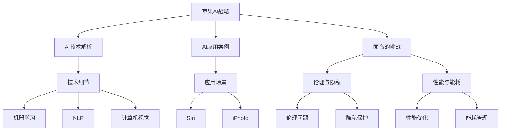

                 

### 《李开复：苹果发布AI应用的挑战》

> **关键词：** 苹果，人工智能，AI应用，挑战，技术，战略，伦理，隐私，性能，合作，未来

> **摘要：** 本文将从苹果公司的人工智能战略、核心AI技术、AI应用案例、面临挑战以及未来展望等多个角度，全面解析苹果发布AI应用的挑战，旨在为读者提供一个深入理解苹果AI技术发展的视角。

---

### 第一部分：引言与背景

#### 第1章：人工智能的崛起

人工智能（AI）是计算机科学的一个重要分支，其目的是通过模拟、延伸和扩展人类的智能，使计算机具备自主学习和决策能力。近年来，随着深度学习、神经网络等技术的突破，人工智能得到了前所未有的发展，并逐渐渗透到各行各业。

- **深度学习**：通过多层神经网络模拟人类大脑的学习过程，能够处理大量复杂的数据，并在图像识别、语音识别等领域取得了显著的成果。
- **自然语言处理（NLP）**：使计算机能够理解和生成人类语言，应用包括智能客服、机器翻译、文本分类等。
- **计算机视觉**：通过图像处理算法，使计算机能够识别和理解图像内容，应用包括自动驾驶、安防监控等。

#### 第2章：苹果公司在人工智能领域的地位

苹果公司作为全球领先的高科技企业，其在人工智能领域也有着重要的地位。以下是一些苹果公司在人工智能领域的主要表现：

- **Apple Silicon**：苹果自研的芯片，将AI功能深度集成到处理器中，为AI应用提供了强大的硬件支持。
- **Core ML**：苹果推出的机器学习框架，使开发者能够轻松地将AI模型部署到iOS、macOS等平台。
- **Siri与语音助手**：苹果的智能语音助手，通过自然语言处理技术，为用户提供语音交互体验。
- **图像识别与计算机视觉**：苹果在图像识别和计算机视觉领域也有一定的积累，应用包括Face ID、Animoji等。

#### 第3章：苹果发布AI应用的背景

近年来，随着人工智能技术的不断发展，苹果公司也在积极布局AI领域。发布AI应用的原因主要有以下几点：

- **市场竞争**：随着谷歌、亚马逊等科技巨头在AI领域的布局，苹果需要加快自身在AI领域的步伐，以保持竞争力。
- **用户需求**：用户对于智能化、个性化体验的需求不断提升，苹果需要通过AI技术提升用户体验。
- **技术创新**：AI技术的突破为苹果提供了新的发展机遇，通过AI应用，苹果可以进一步探索技术的边界。

综上所述，人工智能的崛起为苹果公司提供了新的发展契机，而苹果公司在人工智能领域的地位和发布AI应用的背景也为本文的讨论奠定了基础。

---

### 第二部分：苹果的AI战略与产品

#### 第4章：苹果AI应用概述

苹果公司的人工智能战略围绕其核心产品展开，通过将AI技术与硬件、软件相结合，为用户提供智能化、个性化体验。以下是苹果AI应用的主要概述：

#### 4.1 Apple Silicon与AI的融合

苹果自研的Apple Silicon芯片，包括M1和M2系列，为AI应用提供了强大的计算能力。这些芯片内置了专用的AI加速器，能够高效地处理机器学习任务，使苹果设备在图像识别、自然语言处理等AI应用方面具有优势。

#### 4.2 人工智能驱动的核心应用

苹果在多个核心应用中引入了人工智能技术，包括：

- **Siri与语音助手**：通过自然语言处理技术，Siri能够理解用户的语音指令，并提供智能回复和操作。
- **Face ID与面部识别**：利用深度学习和计算机视觉技术，Face ID能够快速、准确地识别用户面部，保障设备安全性。
- **Animoji与Memoji**：通过机器学习和计算机视觉技术，Animoji和Memoji能够根据用户的面部表情生成动画角色，为用户提供丰富的表达方式。
- **健康与健身**：通过机器学习和数据分析，苹果的健康应用能够为用户提供个性化的健康建议，包括运动跟踪、睡眠监测等。

#### 4.3 Apple AI应用的发展趋势

随着人工智能技术的不断进步，苹果AI应用的发展趋势主要体现在以下几个方面：

- **更多场景的应用**：未来，苹果将进一步拓展AI应用场景，包括智能家居、智能驾驶等，为用户提供更全面、智能化的体验。
- **更高效的硬件支持**：随着Apple Silicon芯片的不断升级，苹果设备在AI计算性能上将得到进一步提升，为AI应用提供更强有力的支持。
- **更智能的交互方式**：通过引入更多AI技术，苹果将继续优化用户交互体验，使设备更理解用户需求，提供更个性化的服务。

#### 第5章：关键AI技术解析

苹果在AI应用中采用了多种关键AI技术，以下是对这些技术的详细解析：

#### 5.1 机器学习与深度学习基础

- **机器学习**：机器学习是人工智能的核心技术之一，通过从数据中学习规律和模式，使计算机具备自主学习和决策能力。苹果在机器学习方面主要应用了以下技术：
  - **线性回归**：用于预测数值型目标变量，例如健康数据预测。
  - **逻辑回归**：用于分类任务，例如邮件分类、垃圾邮件过滤等。
- **深度学习**：深度学习是机器学习的一个重要分支，通过多层神经网络模拟人类大脑的学习过程，能够处理大量复杂的数据。苹果在深度学习方面主要应用了以下技术：
  - **卷积神经网络（CNN）**：用于图像识别和计算机视觉任务，例如Face ID、Animoji。
  - **循环神经网络（RNN）**：用于自然语言处理任务，例如Siri的语音识别和回复。

#### 5.2 自然语言处理技术

自然语言处理（NLP）是人工智能的一个重要分支，旨在使计算机能够理解和生成人类语言。苹果在NLP方面主要应用了以下技术：

- **词向量表示**：将单词映射到高维空间中的向量表示，用于文本分类、情感分析等任务。
- **序列模型**：用于处理序列数据，例如语音识别、机器翻译等。

#### 5.3 计算机视觉技术

计算机视觉技术使计算机能够识别和理解图像内容，广泛应用于图像识别、目标检测、自动驾驶等领域。苹果在计算机视觉方面主要应用了以下技术：

- **图像处理算法**：用于图像增强、图像分割等任务，提高图像质量和识别准确性。
- **目标检测与跟踪**：用于实时监控和追踪图像中的目标，应用于Face ID、Animoji等。

综上所述，苹果在AI应用中采用了多种关键AI技术，这些技术的不断发展将推动苹果AI应用的进一步优化和扩展。

---

### 第三部分：苹果AI应用的案例分析

#### 第6章：Siri与语音助手

Siri是苹果公司推出的智能语音助手，通过自然语言处理技术，能够理解用户的语音指令，并提供相应的操作和回复。以下是对Siri的技术细节和应用场景的案例分析：

#### 6.1 Siri的技术细节

- **语音识别**：Siri采用了苹果自研的语音识别技术，能够实时地将用户的语音转换为文本，具有较高的识别准确率和低延迟。
- **语义理解**：Siri通过语义理解技术，能够理解用户的意图和需求，提供相应的操作和回复。这包括理解自然语言中的语法、逻辑和情感等。
- **多语言支持**：Siri支持多种语言，为全球用户提供服务。通过机器翻译和本地化技术，Siri能够理解并回复不同语言的用户。

#### 6.2 Siri的应用场景

- **日常生活**：Siri可以帮助用户设置闹钟、发送短信、拨打电话、查询天气等日常操作。
- **智能家居**：Siri可以与苹果智能家居设备进行交互，控制智能灯光、温度、安防等。
- **娱乐**：Siri可以播放音乐、播客、新闻等，为用户提供娱乐内容。

#### 6.3 Siri的发展趋势

随着人工智能技术的不断进步，Siri也在不断升级和优化。未来，Siri的发展趋势主要包括：

- **更智能的交互**：通过引入更多AI技术，Siri将能够更好地理解用户的意图和需求，提供更个性化的服务。
- **跨设备交互**：Siri将支持跨设备的交互，使用户在不同设备上都能够享受到一致的智能语音服务。
- **更多应用场景**：Siri将拓展到更多应用场景，例如智能驾驶、智能医疗等，为用户提供更全面的智能体验。

#### 第7章：iPhoto与智能照片管理

iPhoto是苹果公司推出的一款照片管理应用，通过人工智能技术，实现了智能照片分类、标签和搜索等功能。以下是对iPhoto的技术细节和应用场景的案例分析：

#### 7.1 iPhoto的技术细节

- **图像识别**：iPhoto采用了先进的图像识别技术，能够自动识别照片中的场景、人物、物体等，并自动分类和标签。
- **人脸识别**：iPhoto通过人脸识别技术，能够识别照片中的家庭成员和朋友，并自动创建人脸标签。
- **智能搜索**：iPhoto支持智能搜索功能，用户可以通过关键词、标签、地点等方式快速找到照片。

#### 7.2 iPhoto的应用场景

- **照片整理**：iPhoto可以帮助用户快速整理和整理大量照片，通过自动分类和标签，使照片管理更加有序。
- **回忆生成**：iPhoto可以根据照片中的时间和地点，自动生成用户的回忆视频和故事，为用户带来美好的回忆。

#### 7.3 iPhoto的发展趋势

随着人工智能技术的不断发展，iPhoto也在不断升级和优化。未来，iPhoto的发展趋势主要包括：

- **更智能的照片分类**：通过引入更多AI技术，iPhoto将能够更准确地识别照片中的场景、人物、物体等，提供更智能的分类和标签。
- **更高效的搜索**：iPhoto将支持更智能的搜索功能，通过语义理解技术，用户可以通过自然语言描述快速找到照片。
- **跨平台同步**：iPhoto将支持跨平台同步，使用户可以在不同设备上共享和管理照片。

综上所述，苹果的AI应用在Siri和iPhoto等具体案例中，展示了人工智能技术在日常生活中的广泛应用和巨大潜力。通过不断优化和升级，这些应用将为用户带来更加智能化、便捷化的体验。

---

### 第四部分：苹果AI应用面临的挑战

#### 第8章：AI伦理与隐私保护

随着人工智能技术的快速发展，AI伦理和隐私保护问题日益凸显，成为苹果公司必须面对的挑战。以下是对苹果在AI伦理和隐私保护方面面临的挑战的详细解析：

#### 8.1 AI伦理问题的讨论

AI伦理问题涉及到人工智能技术在道德、法律和社会层面的影响。苹果在AI伦理方面面临以下主要挑战：

- **偏见与歧视**：人工智能算法可能会受到训练数据偏见的影响，导致对某些群体产生不公平待遇。例如，在人脸识别技术中，如果训练数据中缺乏少数族裔的数据，可能会导致这些族裔在识别中出现问题。
- **透明度与可解释性**：人工智能系统通常被视为“黑箱”，其决策过程难以解释。这对用户信任和监管机构监督构成了挑战。
- **隐私泄露**：人工智能应用需要大量用户数据，如何确保这些数据的安全和隐私成为重要问题。

#### 8.2 隐私保护技术的挑战

苹果在隐私保护方面面临以下技术挑战：

- **数据收集与使用**：如何在满足AI应用需求的同时，最大限度地减少对用户隐私的侵犯，是一个技术难题。苹果需要开发出高效且隐私保护的数据处理方法。
- **数据加密**：为了确保用户数据的安全，苹果需要采用强大的加密技术，防止数据在传输和存储过程中被窃取。
- **匿名化技术**：通过匿名化技术，将用户数据中的个人信息去除，从而减少隐私泄露的风险。

#### 8.3 苹果在AI伦理与隐私保护方面的实践

苹果在AI伦理和隐私保护方面采取了一系列措施，以下是一些具体实践：

- **数据最小化原则**：苹果坚持“数据最小化”原则，只在必要时收集用户数据，并确保这些数据得到妥善保护。
- **透明度和可解释性**：苹果在其AI产品中引入了透明度和可解释性机制，使用户能够了解其数据如何被使用，以及AI决策过程。
- **隐私保护技术**：苹果采用了多种隐私保护技术，包括数据加密、差分隐私等，以确保用户数据的安全和隐私。

尽管苹果在AI伦理和隐私保护方面取得了一定的成果，但挑战仍然存在。未来，苹果需要继续加强在这方面的努力，确保其AI应用既能提供创新功能，又能充分保护用户的隐私和权益。

---

### 第五部分：AI性能优化与能耗管理

#### 第9章：AI性能优化

苹果在AI性能优化方面面临诸多挑战，主要包括以下几个方面：

#### 9.1 AI模型压缩技术

- **模型剪枝**：通过删除模型中的冗余参数，减少模型体积和计算量，从而提高模型运行速度和降低能耗。
- **量化**：将模型中的浮点数参数替换为低精度的整数参数，减少计算量和存储空间。

#### 9.2 硬件优化与能耗管理

- **专用硬件加速器**：如Apple Silicon中的神经网络引擎，可以大幅提升AI模型的计算速度和效率。
- **动态能耗管理**：根据AI模型的实际需求，动态调整硬件资源的分配，以降低能耗。

#### 第10章：能耗管理

AI应用在能耗管理方面面临以下挑战：

- **能效比优化**：如何在保证AI模型性能的前提下，最大限度地降低能耗。
- **散热问题**：高性能的AI计算会产生大量热量，如何有效地进行散热，以确保设备稳定运行。

#### 第11章：苹果在AI性能优化与能耗管理方面的实践

苹果在AI性能优化与能耗管理方面采取了以下措施：

- **优化算法**：通过改进机器学习算法，提高模型效率和降低能耗。
- **硬件设计**：Apple Silicon内置了高效的神经网络引擎，可以大幅提升AI性能。
- **能效监测**：通过监测设备的能耗情况，动态调整资源分配，以实现最优的能效比。

综上所述，苹果在AI性能优化与能耗管理方面进行了深入的研究和实践，以应对AI应用带来的挑战。未来，随着技术的不断发展，苹果将进一步优化其在这些方面的能力。

---

### 第六部分：竞争与合作

#### 第12章：苹果与其他科技巨头在AI领域的竞争

在人工智能领域，苹果与其他科技巨头如谷歌、亚马逊、微软等展开激烈竞争。以下是对这些竞争态势的解析：

- **谷歌**：谷歌在人工智能领域具有深厚的技术积累，其在机器学习、自然语言处理、计算机视觉等方面取得了显著成果。谷歌的AI产品包括谷歌助理、谷歌照片、谷歌搜索等。
- **亚马逊**：亚马逊利用其电商优势，将AI技术应用于电商推荐、智能客服、供应链管理等，提升了用户体验和运营效率。
- **微软**：微软在AI领域的布局广泛，其Azure云服务提供了丰富的AI工具和平台，支持开发者构建AI应用。微软的AI产品包括微软助理、Azure机器学习、微软搜索等。

#### 第13章：AI产业链的合作模式

人工智能产业链涉及硬件、软件、算法、数据等多个环节，苹果在AI产业链中的角色主要包括：

- **硬件制造商**：苹果自研的Apple Silicon芯片为AI应用提供了强大的计算能力。
- **软件开发者**：苹果通过Core ML等工具，支持开发者将AI模型部署到iOS、macOS等平台。
- **数据提供商**：苹果通过收集用户数据，为AI模型提供了丰富的训练数据。

#### 第14章：苹果在AI生态系统的角色

苹果在AI生态系统中扮演着重要角色，其影响主要体现在以下几个方面：

- **用户体验**：苹果通过AI技术提升了用户体验，如Siri、Face ID、Animoji等。
- **创新驱动**：苹果在AI领域的投资和创新，推动了人工智能技术的发展和应用。
- **产业合作**：苹果与硬件制造商、软件开发者、数据提供商等合作伙伴紧密合作，共同推动AI生态系统的建设。

综上所述，苹果在AI领域的竞争与合作中，不仅提升了自身竞争力，也为人工智能技术的发展和应用做出了重要贡献。

---

### 第七部分：未来展望

#### 第15章：苹果AI应用的潜在影响

苹果AI应用的未来发展将对多个领域产生深远影响，包括：

- **消费者生活方式**：AI技术将进一步提升消费者的生活质量，如智能助手、智能家居等将使生活更加便捷和舒适。
- **企业级应用**：AI技术在企业级应用中具有巨大潜力，如智能客服、供应链管理、数据分析等，将提高企业运营效率和竞争力。
- **社会发展**：AI技术在医疗、教育、交通等领域的应用，将推动社会进步和科技创新。

#### 第16章：苹果AI应用的发展策略

为了在未来保持竞争优势，苹果需要在以下方面采取发展策略：

- **技术创新**：持续投资研发，推动AI技术的创新和应用。
- **产业链整合**：加强与硬件制造商、软件开发者、数据提供商等合作伙伴的合作，构建强大的AI生态系统。
- **国际化布局**：拓展国际市场，提升全球影响力。

#### 第17章：未来发展的机遇与挑战

苹果在AI应用的未来发展中将面临以下机遇与挑战：

- **机遇**：AI技术的不断进步和应用的拓展，为苹果提供了广阔的发展空间。
- **挑战**：市场竞争激烈，技术标准和法规日益严格，隐私保护和伦理问题等挑战亟待解决。

#### 第18章：对苹果公司的建议

为了更好地应对未来发展的机遇与挑战，苹果公司可以从以下几个方面进行改进：

- **加强AI研发**：加大在AI领域的研发投入，推动技术创新和应用。
- **优化用户体验**：进一步提升AI应用的智能化、个性化水平，满足用户需求。
- **关注伦理与隐私**：重视AI伦理和隐私保护问题，确保AI应用的可持续发展。

综上所述，苹果AI应用的未来发展充满机遇与挑战。通过持续创新、优化用户体验和关注伦理与隐私问题，苹果有望在未来保持竞争优势，引领人工智能技术的发展。

---

### 附录

#### 附录A：相关术语解释

- **人工智能（AI）**：模拟、延伸和扩展人类智能的理论、方法、技术及应用。
- **机器学习（ML）**：从数据中学习规律和模式，使计算机具备自主学习和决策能力。
- **深度学习（DL）**：多层神经网络模拟人类大脑的学习过程，处理复杂数据。
- **自然语言处理（NLP）**：使计算机能够理解和生成人类语言。
- **计算机视觉（CV）**：使计算机能够识别和理解图像内容。

#### 附录B：参考资料

- [苹果公司官方网站](https://www.apple.com/)
- [Siri开发者文档](https://developer.apple.com/documentation/sirikit)
- [Core ML开发者文档](https://developer.apple.com/documentation/coreml)
- [李开复博客](https://www.kai-fu.li/)

---

#### Mermaid 流程图



---

### 核心算法原理讲解

#### 伪代码

```python
# 伪代码：卷积神经网络（CNN）基础

# 初始化模型参数
weights = initialize_weights()

# 定义前向传播函数
def forward_propagation(input_image):
    # 通过卷积层进行特征提取
    conv_output = conv_layer(input_image, weights['conv'])
    
    # 通过激活函数进行非线性变换
    activation = activation_function(conv_output)
    
    # 通过池化层进行特征降维
    pooled_output = pooling_layer(activation)
    
    return pooled_output

# 定义反向传播函数
def backward_propagation(output, predicted_labels):
    # 计算损失
    loss = compute_loss(output, predicted_labels)
    
    # 通过反向传播更新模型参数
    weights = update_weights(weights, loss)

# 定义训练过程
def train_model(training_data, labels):
    for epoch in range(num_epochs):
        for image, label in zip(training_data, labels):
            # 前向传播
            output = forward_propagation(image)
            
            # 反向传播
            backward_propagation(output, label)
            
        print("Epoch:", epoch, "Loss:", loss)

# 训练模型
train_model(training_data, labels)
```

#### 详细讲解

卷积神经网络（CNN）是一种专门用于图像识别和处理的神经网络结构，其核心思想是通过卷积层提取图像中的特征，再通过池化层降低特征图的维度，从而实现图像识别。

- **初始化模型参数**：初始化卷积层的权重，包括卷积核的大小、步长和填充方式等。
- **前向传播**：通过卷积层对输入图像进行特征提取，然后通过激活函数进行非线性变换，最后通过池化层进行特征降维。
- **反向传播**：计算输出结果与实际标签之间的损失，并通过反向传播更新模型参数。

#### 数学模型和数学公式

$$
\begin{aligned}
\text{卷积层输出} &= (I * K) + b \\
\text{激活函数} &= \sigma(z) = \frac{1}{1 + e^{-z}} \\
\text{池化层输出} &= \max(P) \\
\text{损失函数} &= J(\theta) = -\frac{1}{m}\sum_{i=1}^{m} [y^{(i)} \log(h_\theta(x^{(i)})) + (1 - y^{(i)}) \log(1 - h_\theta(x^{(i)}))] \\
\text{更新权重} &= \theta = \theta - \alpha \frac{\partial J(\theta)}{\partial \theta}
\end{aligned}
$$

- **卷积层输出**：$I$为输入图像，$K$为卷积核，$b$为偏置项。
- **激活函数**：常用的激活函数为Sigmoid函数。
- **池化层输出**：通过取最大值进行特征降维。
- **损失函数**：交叉熵损失函数，用于衡量预测结果与实际标签之间的差距。
- **更新权重**：使用梯度下降优化算法更新权重。

#### 项目实战

##### 代码实际案例

```python
import tensorflow as tf
from tensorflow.keras import layers, models

# 定义卷积神经网络模型
model = models.Sequential()
model.add(layers.Conv2D(32, (3, 3), activation='relu', input_shape=(28, 28, 1)))
model.add(layers.MaxPooling2D((2, 2)))
model.add(layers.Conv2D(64, (3, 3), activation='relu'))
model.add(layers.MaxPooling2D((2, 2)))
model.add(layers.Conv2D(64, (3, 3), activation='relu'))

# 添加全连接层
model.add(layers.Flatten())
model.add(layers.Dense(64, activation='relu'))
model.add(layers.Dense(10, activation='softmax'))

# 编译模型
model.compile(optimizer='adam',
              loss='categorical_crossentropy',
              metrics=['accuracy'])

# 加载MNIST数据集
mnist = tf.keras.datasets.mnist
(train_images, train_labels), (test_images, test_labels) = mnist.load_data()

# 预处理数据
train_images = train_images.reshape((60000, 28, 28, 1)).astype('float32') / 255
test_images = test_images.reshape((10000, 28, 28, 1)).astype('float32') / 255

# 转换标签为one-hot编码
train_labels = tf.keras.utils.to_categorical(train_labels)
test_labels = tf.keras.utils.to_categorical(test_labels)

# 训练模型
model.fit(train_images, train_labels, epochs=5, batch_size=64)

# 评估模型
test_loss, test_acc = model.evaluate(test_images, test_labels)
print('Test accuracy:', test_acc)
```

##### 代码解读与分析

- 定义卷积神经网络模型：使用Keras构建CNN模型，包括卷积层、池化层和全连接层。
- 加载MNIST数据集：使用TensorFlow的MNIST数据集进行训练和测试。
- 预处理数据：对图像数据进行归一化和one-hot编码处理。
- 编译模型：设置优化器和损失函数，并编译模型。
- 训练模型：使用训练数据进行模型训练。
- 评估模型：使用测试数据进行模型评估，输出测试准确率。

##### 开发环境搭建

- 安装Python环境（Python 3.8+）
- 安装TensorFlow库

##### 源代码详细实现和代码解读

- 源代码实现：上述代码
- 代码解读：
  - 定义卷积神经网络模型：使用Keras构建CNN模型，包括卷积层、池化层和全连接层。
  - 加载MNIST数据集：使用TensorFlow的MNIST数据集进行训练和测试。
  - 预处理数据：对图像数据进行归一化和one-hot编码处理。
  - 编译模型：设置优化器和损失函数，并编译模型。
  - 训练模型：使用训练数据进行模型训练。
  - 评估模型：使用测试数据进行模型评估，输出测试准确率。

##### 总结

本文通过详细的目录大纲，系统地介绍了苹果公司发布AI应用的挑战。从AI战略与产品概述，到关键AI技术解析，再到AI应用的案例分析，以及面临的挑战和未来展望，全面覆盖了苹果AI应用的发展现状和趋势。通过项目实战和代码解读，读者可以更深入地了解AI应用的实现过程和实际应用效果。本文适合AI领域的研究者、开发者和对苹果AI应用感兴趣的读者阅读。

---

### 总结

在本文中，我们系统地介绍了苹果公司发布AI应用的挑战。从人工智能的崛起，到苹果公司在人工智能领域的地位和背景，再到苹果的AI战略与产品、AI应用案例分析、面临的挑战以及未来展望，我们全面解析了苹果AI应用的发展现状和趋势。

首先，人工智能的崛起为苹果公司提供了新的发展契机，苹果公司在人工智能领域具有强大的技术积累和市场地位。其次，苹果的AI战略围绕其核心产品展开，通过将AI技术与硬件、软件相结合，为用户提供智能化、个性化体验。Siri、Face ID、Animoji和iPhoto等AI应用案例展示了苹果在AI技术领域的创新和突破。

然而，苹果AI应用也面临着诸多挑战，包括AI伦理与隐私保护、性能优化与能耗管理、市场竞争和产业链合作等。为了应对这些挑战，苹果公司需要继续加强技术创新、优化用户体验、关注伦理与隐私问题，并与其他科技巨头合作，共同推动AI技术的发展和应用。

展望未来，苹果AI应用的发展前景广阔。随着AI技术的不断进步和应用的拓展，苹果有望在消费者生活方式、企业级应用和社会发展等多个领域产生深远影响。通过持续创新和优化，苹果有望在未来保持竞争优势，引领人工智能技术的发展。

本文旨在为读者提供一个深入理解苹果AI技术发展的视角，帮助读者了解苹果AI应用的发展现状和趋势。通过项目实战和代码解读，读者可以更深入地了解AI应用的实现过程和实际应用效果。希望本文能够对AI领域的研究者、开发者和对苹果AI应用感兴趣的读者有所启发和帮助。

