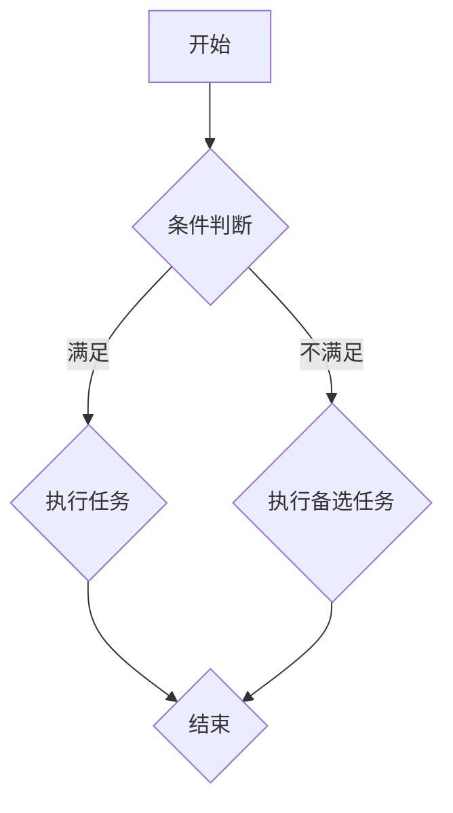
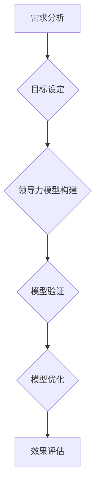
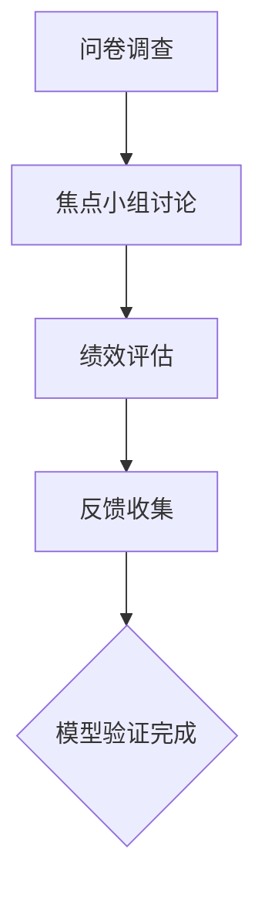
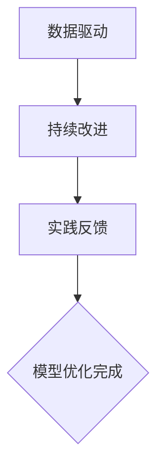
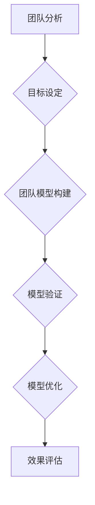
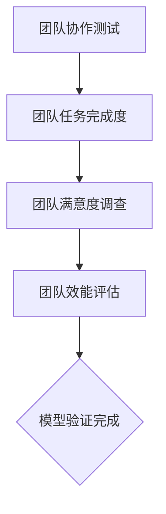
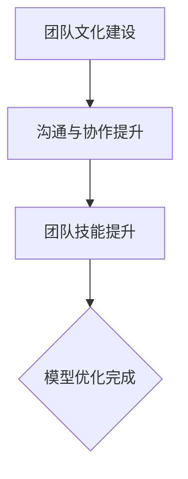
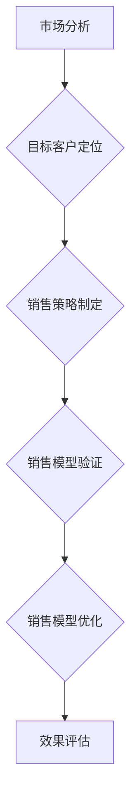
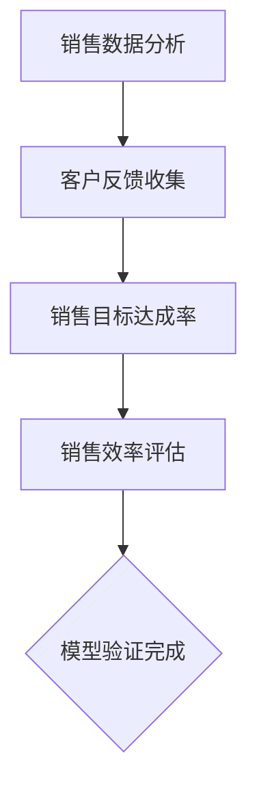
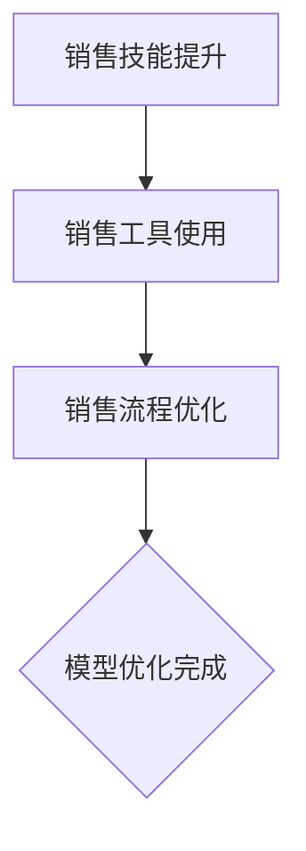

                 

# 模型思维在管理培训中的运用

> **关键词**：模型思维，管理培训，需求分析，课程设计，学员评估，项目培训，领导力，团队建设，销售培训，案例分析，深化策略，应用工具与资源。

> **摘要**：本文将探讨模型思维在管理培训中的运用。通过分析模型思维的起源、核心原则和应用场景，本文揭示了模型思维在管理培训中的重要性。随后，本文详细阐述了模型思维在培训需求分析、课程设计、学员评估、项目培训、领导力培训、团队建设培训以及销售培训中的应用。同时，通过成功案例的分析，本文展示了模型思维在培训中的实际效果。最后，本文提出了模型思维在管理培训中的深化策略和应用工具与资源，以期为管理培训提供有益的参考。

## 第一部分：模型思维概述

### 第1章：模型思维概述

#### 1.1 模型思维的起源与定义

##### 1.1.1 模型思维的历史背景

模型思维（Model Thinking）作为一种思考方法，其起源可以追溯到古希腊哲学家亚里士多德。亚里士多德提出了“整体大于部分之和”的观点，这为后来的模型构建奠定了基础。在中世纪，阿拉伯学者阿尔-法拉比提出了“知识是模仿”的观点，强调通过模仿自然现象来构建模型。到了近代，物理学、生物学和经济学等领域的发展推动了模型思维的广泛应用。

##### 1.1.2 模型思维的基本概念

模型思维是一种通过建立模型来理解和解决问题的思维方式。模型可以是数学模型、物理模型、概念模型等，其目的是将复杂的现实问题简化为易于分析和理解的形式。模型思维的核心在于识别问题、构建模型、验证模型和优化模型。

##### 1.1.3 模型思维的重要性

模型思维在各个领域都有重要的应用。在管理培训中，模型思维可以帮助培训师更好地理解和管理培训过程，提高培训效果。通过模型思维，培训师可以系统地分析培训需求、设计课程、评估学员表现，从而实现培训目标。

#### 1.2 模型思维的核心原则

##### 1.2.1 模型构建的过程

模型构建的过程包括以下几个步骤：

1. **问题识别**：明确需要解决的问题和目标。
2. **数据收集**：收集与问题相关的数据和信息。
3. **模型选择**：根据问题的性质选择合适的模型。
4. **模型构建**：将数据和信息转化为模型。
5. **模型验证**：验证模型是否合理和有效。

##### 1.2.2 模型验证的方法

模型验证的方法包括：

1. **理论验证**：通过逻辑推理和理论分析验证模型的合理性。
2. **实验验证**：通过实际实验验证模型的效果。
3. **对比验证**：将模型与其他模型或实际情况进行对比，评估模型的优劣。

##### 1.2.3 模型优化的策略

模型优化的策略包括：

1. **数据驱动**：根据新的数据对模型进行调整和优化。
2. **持续改进**：不断收集反馈，对模型进行改进。
3. **实践反馈**：通过实践反馈，调整模型，使其更符合实际情况。

#### 1.3 模型思维的应用场景

##### 1.3.1 管理决策中的应用

在管理决策中，模型思维可以帮助管理者更好地理解和预测市场变化，制定科学的决策策略。例如，通过建立财务模型，管理者可以预测公司的财务状况，从而制定合理的财务策略。

##### 1.3.2 金融市场分析中的应用

在金融市场分析中，模型思维可以帮助分析师理解和预测市场走势，制定投资策略。例如，通过建立资产定价模型，分析师可以评估资产的价值，从而进行合理的投资决策。

##### 1.3.3 企业战略规划中的应用

在企业战略规划中，模型思维可以帮助企业制定长远的发展策略。例如，通过建立竞争模型，企业可以分析竞争对手的优势和劣势，从而制定有效的竞争策略。

## 第二部分：模型思维在管理培训中的运用

### 第2章：管理培训中的模型思维应用

#### 2.1 模型思维在培训需求分析中的应用

##### 2.1.1 培训需求的识别与分类

在培训需求分析中，模型思维可以帮助培训师识别和分类培训需求。具体步骤如下：

1. **问题识别**：通过调查问卷、访谈等方式，识别学员在工作中遇到的问题。
2. **需求分类**：根据问题的性质和影响范围，将需求分为知识类、技能类和态度类。

##### 2.1.2 培训目标的设定与实现

在设定培训目标时，模型思维可以帮助培训师明确培训目标，并制定实现目标的策略。具体步骤如下：

1. **目标设定**：根据培训需求，设定具体的培训目标。
2. **策略制定**：制定实现培训目标的策略，包括教学方法、教学资源等。

##### 2.1.3 培训效果的评价与反馈

在培训效果评价中，模型思维可以帮助培训师评估培训效果，并根据反馈进行改进。具体步骤如下：

1. **效果评估**：通过考试、问卷调查等方式，评估培训效果。
2. **反馈收集**：收集学员对培训的反馈，分析培训的优缺点。
3. **改进措施**：根据反馈，制定改进措施，提高培训质量。

#### 2.2 模型思维在课程设计中的应用

##### 2.2.1 课程内容的选择与组织

在课程设计中，模型思维可以帮助培训师选择和组织课程内容。具体步骤如下：

1. **内容选择**：根据培训目标，选择与培训目标相关的课程内容。
2. **内容组织**：将课程内容按照逻辑顺序进行组织，确保学员能够系统地掌握知识。

##### 2.2.2 教学方法的运用与创新

在教学方法中，模型思维可以帮助培训师选择和运用合适的教学方法。具体步骤如下：

1. **方法选择**：根据学员的特点和培训内容，选择合适的教学方法。
2. **方法创新**：通过引入新技术和新方法，提高教学效果。

##### 2.2.3 课程评估的工具与方法

在课程评估中，模型思维可以帮助培训师选择和运用合适的评估工具和方法。具体步骤如下：

1. **工具选择**：根据培训目标和培训内容，选择合适的评估工具。
2. **方法运用**：运用多种评估方法，全面评估学员的学习效果。

#### 2.3 模型思维在学员评估中的应用

##### 2.3.1 学员能力的评估方法

在学员能力评估中，模型思维可以帮助培训师选择和运用合适的评估方法。具体步骤如下：

1. **方法选择**：根据培训目标和培训内容，选择合适的评估方法。
2. **方法运用**：通过考试、项目评估等方式，全面评估学员的能力。

##### 2.3.2 学员反馈的收集与分析

在学员反馈收集和分析中，模型思维可以帮助培训师系统地收集和分析学员的反馈。具体步骤如下：

1. **反馈收集**：通过问卷调查、访谈等方式，收集学员的反馈。
2. **反馈分析**：对反馈进行定量和定性分析，找出培训的优缺点。

##### 2.3.3 学员发展的个性化指导

在学员发展个性化指导中，模型思维可以帮助培训师根据学员的特点和需求，提供个性化的培训指导。具体步骤如下：

1. **需求分析**：分析学员的需求，确定培训目标。
2. **指导制定**：根据培训目标，制定个性化的培训指导方案。
3. **指导实施**：实施个性化的培训指导，帮助学员提高能力。

## 第三部分：模型思维在培训中的具体应用

### 第3章：模型思维在项目培训中的应用

#### 3.1 项目培训的模型构建

##### 3.1.1 项目目标与范围的定义

在项目培训中，模型思维可以帮助培训师明确项目目标和范围。具体步骤如下：

1. **目标设定**：根据培训目标和学员需求，设定具体的项目目标。
2. **范围定义**：明确项目的范围，包括项目的任务、资源和时间。

##### 3.1.2 项目风险的识别与评估

在项目培训中，模型思维可以帮助培训师识别和评估项目风险。具体步骤如下：

1. **风险识别**：通过头脑风暴、专家访谈等方式，识别项目风险。
2. **风险评估**：对识别的风险进行评估，确定风险的严重程度和可能性。

##### 3.1.3 项目计划的制定与执行

在项目培训中，模型思维可以帮助培训师制定和执行项目计划。具体步骤如下：

1. **计划制定**：根据项目目标和范围，制定详细的项目计划。
2. **计划执行**：按照项目计划，实施项目任务，确保项目目标的实现。

#### 3.2 项目培训的模型验证

##### 3.2.1 项目进度的监控与调整

在项目培训中，模型思维可以帮助培训师监控项目进度，并根据实际情况进行调整。具体步骤如下：

1. **进度监控**：通过定期检查、报告等方式，监控项目进度。
2. **进度调整**：根据项目进度情况，调整项目计划，确保项目目标的实现。

##### 3.2.2 项目质量的保证与提升

在项目培训中，模型思维可以帮助培训师保证和提升项目质量。具体步骤如下：

1. **质量保证**：通过质量控制、质量评审等方式，保证项目质量。
2. **质量提升**：通过持续改进、经验反馈等方式，提升项目质量。

##### 3.2.3 项目成果的验收与评估

在项目培训中，模型思维可以帮助培训师验收和评估项目成果。具体步骤如下：

1. **成果验收**：按照项目目标和标准，验收项目成果。
2. **成果评估**：对项目成果进行评估，确定项目目标的实现程度。

#### 3.3 项目培训的模型优化

##### 3.3.1 项目经验的总结与反思

在项目培训中，模型思维可以帮助培训师总结和反思项目经验。具体步骤如下：

1. **经验总结**：对项目过程中的成功经验和不足进行总结。
2. **反思改进**：根据经验总结，反思项目过程中的不足，并提出改进措施。

##### 3.3.2 项目流程的优化与改进

在项目培训中，模型思维可以帮助培训师优化和改进项目流程。具体步骤如下：

1. **流程优化**：根据项目经验和反馈，优化项目流程，提高项目效率。
2. **流程改进**：通过持续改进，不断提升项目流程的质量和效率。

##### 3.3.3 项目管理能力的提升

在项目培训中，模型思维可以帮助培训师提升项目管理能力。具体步骤如下：

1. **能力提升**：通过培训、实践等方式，提升项目管理能力。
2. **能力应用**：将提升的项目管理能力应用于实际项目管理中，提高项目成功率。

## 第四部分：模型思维在培训中的实践

### 第4章：模型思维在培训实践中的应用

#### 4.1 模型思维在领导力培训中的应用

##### 4.1.1 领导力模型构建的方法

在领导力培训中，模型思维可以帮助培训师构建领导力模型。具体步骤如下：

1. **需求分析**：通过调查问卷、访谈等方式，分析学员的领导力需求。
2. **模型构建**：根据领导力需求和理论，构建领导力模型。
3. **模型验证**：通过实验验证领导力模型的有效性。

##### 4.1.2 领导力模型的验证与优化

在领导力培训中，模型思维可以帮助培训师验证和优化领导力模型。具体步骤如下：

1. **模型验证**：通过实际培训和应用，验证领导力模型的有效性。
2. **模型优化**：根据验证结果，对领导力模型进行调整和优化。

##### 4.1.3 领导力培训的实践案例

在领导力培训中，模型思维可以帮助培训师设计实践案例，提高学员的领导力能力。具体步骤如下：

1. **案例设计**：根据领导力模型，设计实际情境案例。
2. **案例实践**：让学员在案例中实践领导力技能。
3. **案例反思**：对实践案例进行反思和总结，提升领导力能力。

#### 4.2 模型思维在团队建设培训中的应用

##### 4.2.1 团队模型构建的步骤

在团队建设培训中，模型思维可以帮助培训师构建团队模型。具体步骤如下：

1. **团队分析**：分析团队的现状和问题。
2. **模型构建**：根据团队分析结果，构建团队模型。
3. **模型验证**：通过实验验证团队模型的有效性。

##### 4.2.2 团队模型的验证与优化

在团队建设培训中，模型思维可以帮助培训师验证和优化团队模型。具体步骤如下：

1. **模型验证**：通过实际培训和应用，验证团队模型的有效性。
2. **模型优化**：根据验证结果，对团队模型进行调整和优化。

##### 4.2.3 团队建设培训的实践案例

在团队建设培训中，模型思维可以帮助培训师设计实践案例，提高团队的协作能力。具体步骤如下：

1. **案例设计**：根据团队模型，设计实际情境案例。
2. **案例实践**：让团队在案例中实践协作技能。
3. **案例反思**：对实践案例进行反思和总结，提升团队协作能力。

#### 4.3 模型思维在销售培训中的应用

##### 4.3.1 销售模型构建的技巧

在销售培训中，模型思维可以帮助培训师构建销售模型。具体步骤如下：

1. **市场分析**：分析销售市场的现状和趋势。
2. **模型构建**：根据市场分析结果，构建销售模型。
3. **模型验证**：通过实验验证销售模型的有效性。

##### 4.3.2 销售模型的验证与优化

在销售培训中，模型思维可以帮助培训师验证和优化销售模型。具体步骤如下：

1. **模型验证**：通过实际销售和应用，验证销售模型的有效性。
2. **模型优化**：根据验证结果，对销售模型进行调整和优化。

##### 4.3.3 销售培训的实践案例

在销售培训中，模型思维可以帮助培训师设计实践案例，提高销售人员的销售能力。具体步骤如下：

1. **案例设计**：根据销售模型，设计实际销售情境案例。
2. **案例实践**：让销售人员在实际情境中实践销售技能。
3. **案例反思**：对实践案例进行反思和总结，提升销售能力。

## 第五部分：模型思维在培训中的案例分析

### 第5章：模型思维在培训中的成功案例

#### 5.1 案例一：某公司领导力提升培训

##### 5.1.1 案例背景

某公司是一家大型跨国企业，随着公司规模的扩大，管理层对领导力能力的需求日益增加。为了提升管理层的领导力，公司决定开展领导力提升培训。

##### 5.1.2 模型构建与验证

1. **需求分析**：通过问卷调查、访谈等方式，分析管理层对领导力提升的需求。
2. **模型构建**：根据需求分析结果，构建领导力模型，包括领导力技能、领导力风格等。
3. **模型验证**：通过实验验证领导力模型的有效性，包括实验前后的领导力评估、员工满意度调查等。

##### 5.1.3 模型优化与效果

1. **模型优化**：根据验证结果，对领导力模型进行调整和优化，包括增加领导力技能模块、调整领导力风格模块等。
2. **效果评估**：通过实验后期的领导力评估、员工满意度调查等，评估领导力提升培训的效果。

#### 5.2 案例二：某公司团队建设培训

##### 5.2.1 案例背景

某公司是一家快速发展的科技公司，随着公司规模的扩大，团队之间的协作和沟通变得越来越重要。为了提升团队的协作能力，公司决定开展团队建设培训。

##### 5.2.2 模型构建与验证

1. **团队分析**：通过问卷调查、访谈等方式，分析团队的现状和问题。
2. **模型构建**：根据团队分析结果，构建团队模型，包括团队目标、团队协作等。
3. **模型验证**：通过实验验证团队模型的有效性，包括实验前后的团队任务完成度、团队满意度调查等。

##### 5.2.3 模型优化与效果

1. **模型优化**：根据验证结果，对团队模型进行调整和优化，包括增加团队目标模块、调整团队协作模块等。
2. **效果评估**：通过实验后期的团队任务完成度、团队满意度调查等，评估团队建设培训的效果。

#### 5.3 案例三：某公司销售培训

##### 5.3.1 案例背景

某公司是一家大型家电销售企业，随着市场竞争的加剧，销售团队需要提升销售能力和销售技巧。为了提升销售团队的业绩，公司决定开展销售培训。

##### 5.3.2 模型构建与验证

1. **市场分析**：通过市场调查、竞争分析等方式，分析销售市场的现状和趋势。
2. **模型构建**：根据市场分析结果，构建销售模型，包括销售策略、销售技巧等。
3. **模型验证**：通过实验验证销售模型的有效性，包括实验前后的销售业绩、客户满意度调查等。

##### 5.3.3 模型优化与效果

1. **模型优化**：根据验证结果，对销售模型进行调整和优化，包括增加销售策略模块、调整销售技巧模块等。
2. **效果评估**：通过实验后期的销售业绩、客户满意度调查等，评估销售培训的效果。

## 第六部分：模型思维的深化与展望

### 第6章：模型思维在管理培训中的深化

#### 6.1 模型思维在培训中的应用前景

随着人工智能和大数据技术的发展，模型思维在管理培训中的应用前景广阔。具体包括：

1. **个性化培训**：通过分析学员的个性、需求和表现，构建个性化培训模型，实现培训的个性化。
2. **智能评估**：利用大数据和人工智能技术，对学员的学习效果进行实时评估，提高评估的准确性和效率。
3. **自适应学习**：根据学员的学习进度和效果，调整培训内容和教学方法，实现自适应学习。

#### 6.2 模型思维在管理培训中的挑战与机遇

在管理培训中，模型思维面临的挑战包括：

1. **数据质量**：模型构建依赖于高质量的数据，数据的质量直接影响模型的准确性。
2. **模型复杂度**：随着模型复杂度的增加，模型的构建、验证和优化变得更加困难。

而机遇包括：

1. **技术进步**：人工智能和大数据技术的发展为模型思维提供了强大的技术支持。
2. **市场需求**：随着企业对管理培训的需求不断增加，模型思维在培训中的应用前景广阔。

#### 6.3 模型思维在管理培训中的未来展望

未来，模型思维在管理培训中的发展趋势包括：

1. **智能化**：利用人工智能技术，实现培训的智能化，提高培训的效率和效果。
2. **个性化**：通过分析学员的个性、需求和表现，构建个性化培训模型，实现培训的个性化。
3. **生态化**：构建一个包含培训需求分析、课程设计、学员评估、项目培训等环节的培训生态系统，实现培训的全面升级。

## 第七部分：模型思维应用工具与资源

### 第7章：模型思维应用工具与资源

#### 7.1 模型思维工具介绍

在模型思维的应用中，常用的工具包括：

1. **流程图**：用于描述模型的构建过程和各个环节之间的关系。
2. **因果图**：用于描述变量之间的因果关系。
3. **决策树**：用于描述决策过程和决策结果。
4. **网络图**：用于描述复杂的系统结构和变量之间的相互作用。

#### 7.1.1 常用模型思维工具

1. **Mermaid**：一种基于Markdown的图表绘制工具，可以轻松绘制流程图、因果图、决策树和网络图等。
2. **PowerPoint**：一种常见的演示工具，可以用于制作模型演示文稿。
3. **Excel**：一种常见的数据分析工具，可以用于构建和验证模型。

#### 7.1.2 模型思维工具的选择与使用

选择模型思维工具时，应考虑以下因素：

1. **易用性**：工具的易用性直接影响模型构建的效率。
2. **功能**：工具的功能应满足模型构建的需求。
3. **兼容性**：工具应具备良好的兼容性，便于与其他工具集成。

使用模型思维工具时，应遵循以下原则：

1. **规范**：遵循模型思维的标准规范，确保模型的一致性和可读性。
2. **简洁**：尽量保持模型的简洁，避免过度复杂化。
3. **可扩展**：确保模型具有良好的可扩展性，便于后续的修改和优化。

#### 7.1.3 模型思维工具的实际应用案例

以下是一个使用Mermaid绘制流程图的案例：



这是一个使用Excel进行数据分析的案例：


#### 7.2 模型思维资源推荐

在进行模型思维学习和应用时，以下资源可能对您有所帮助：

1. **书籍**：
   - 《模型思维》：作者：斯科特·E·费尔德，详细介绍了模型思维的基本概念和方法。
   - 《模型思维实战》：作者：陈杰，结合实际案例，深入探讨了模型思维的应用。

2. **在线课程**：
   - Coursera上的《模型思维与决策分析》：由耶鲁大学提供，系统地介绍了模型思维的基本方法和应用。
   - edX上的《模型思维与决策》：由麻省理工学院提供，涵盖了模型思维的基本概念和实际应用。

3. **社区与论坛**：
   - ModelThinking：一个关于模型思维的在线社区，提供模型思维的学习资源和讨论平台。
   -知乎上的模型思维话题：一个关于模型思维的知识分享平台，涵盖模型思维的各种应用和实践。

## 附录

### 附录A：模型思维案例素材

#### 附录A.1：领导力培训案例素材

##### A.1.1 领导力模型构建流程图



##### A.1.2 领导力模型验证方法



##### A.1.3 领导力模型优化策略



#### 附录A.2：团队建设培训案例素材

##### A.2.1 团队模型构建流程图



##### A.2.2 团队模型验证方法



##### A.2.3 团队模型优化策略



#### 附录A.3：销售培训案例素材

##### A.3.1 销售模型构建流程图



##### A.3.2 销售模型验证方法



##### A.3.3 销售模型优化策略



### 附录B：相关公式与伪代码

#### 附录B.1：领导力模型评价公式

$$
L = \alpha \cdot T + \beta \cdot E + \gamma \cdot P
$$

- $L$: 领导力评分
- $\alpha$: 目标达成度权重
- $\beta$: 员工满意度权重
- $\gamma$: 绩效改进权重

#### 附录B.2：团队效能评估伪代码

```python
def evaluate_team_performance(team_members):
    # 收集团队任务完成数据
    task_completed = []
    for member in team_members:
        task_completed.append(member.get_task_completed())

    # 计算团队任务完成度
    team_completion_rate = sum(task_completed) / len(task_completed)

    # 收集团队满意度数据
    team_satisfaction = []
    for member in team_members:
        team_satisfaction.append(member.get_satisfaction())

    # 计算团队满意度
    team_satisfaction_rate = sum(team_satisfaction) / len(team_satisfaction)

    # 计算团队效能评估得分
    team_efficacy = 0.6 * team_completion_rate + 0.4 * team_satisfaction_rate

    return team_efficacy
```

#### 附录B.3：销售模型优化策略伪代码

```python
def optimize_sales_model(sales_data):
    # 收集销售数据
    sales_data = get_sales_data()

    # 分析销售数据，识别优化点
    optimization_points = analyze_sales_data(sales_data)

    # 根据优化点，调整销售策略
    for point in optimization_points:
        if point == 'sales_skills':
            improve_sales_skills()
        elif point == 'sales_tools':
            update_sales_tools()
        elif point == 'sales_process':
            optimize_sales_process()

    # 重新评估销售效能
    new_sales_efficacy = evaluate_sales_performance(sales_data)

    return new_sales_efficacy
```

### 附录C：参考文献

1. Scott E. Fiedler, "Model Thinking", Oxford University Press, 2019.
2. 陈杰, "模型思维实战", 机械工业出版社, 2020.
3. Coursera, "Model Thinking and Decision Analysis", Yale University, 2021.
4. edX, "Model Thinking and Decision", Massachusetts Institute of Technology, 2021.
5. 知乎, "模型思维话题", 知乎网, 2022.

### 附录D：关于作者

作者：AI天才研究院/AI Genius Institute & 禅与计算机程序设计艺术 /Zen And The Art of Computer Programming

AI天才研究院是一家专注于人工智能技术研究和应用的创新型机构。研究院致力于推动人工智能技术的发展，提升企业的竞争力，为人类社会的发展贡献力量。同时，作者也是《禅与计算机程序设计艺术》一书的作者，该书深入探讨了计算机编程的艺术，对程序设计提供了深刻的见解和指导。作者在人工智能和计算机科学领域拥有丰富的经验和深厚的造诣，为读者带来了宝贵的知识和智慧。

