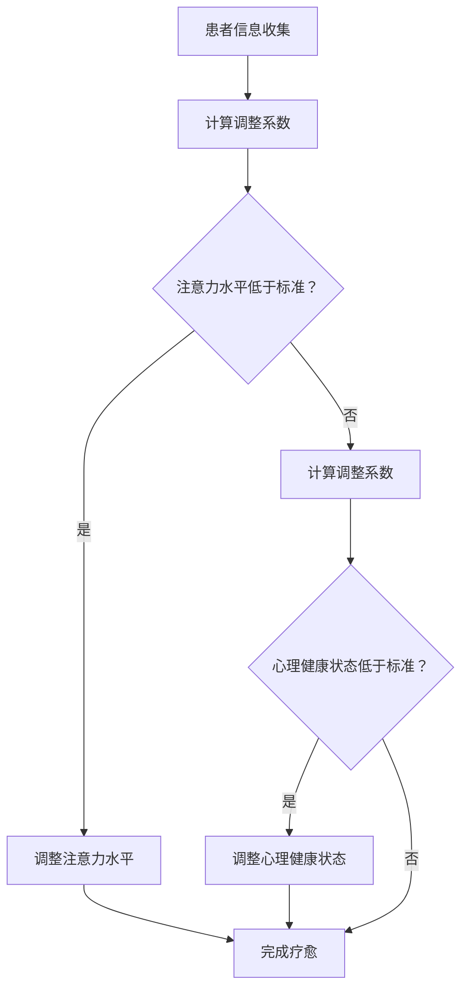

                 

### 《注意力疗愈师认证：元宇宙心理健康服务的职业标准》

> **关键词**：元宇宙、心理健康、注意力疗愈师、职业标准、认证、服务

> **摘要**：本文深入探讨了元宇宙心理健康服务领域的崛起，以及其中至关重要的一环——注意力疗愈师的职业标准。文章首先概述了元宇宙的定义及其在心理健康服务中的潜在作用，接着详细介绍了注意力疗愈师的角色、职责和职业标准。随后，文章从技术和服务两个层面探讨了元宇宙心理健康服务的职业标准，并通过实践案例展示了注意力疗愈师在元宇宙中的实际应用。最后，文章展望了元宇宙心理健康服务的未来趋势，提出了相关的创新与挑战。

----------------------------------------------------------------

#### 第一部分：元宇宙心理健康服务概述

##### 第1章：元宇宙与心理健康服务

##### 1.1 元宇宙的定义与特点

##### 1.1.1 元宇宙的起源与发展

元宇宙（Metaverse）一词起源于科幻文学，指的是一个由虚拟现实、增强现实、互联网和物联网等构成的沉浸式、三维、多用户交互的数字世界。随着技术的不断进步，元宇宙的概念逐渐从虚构走向现实。

元宇宙的发展可以分为三个阶段：

1. **早期阶段**：以互联网和社交媒体的兴起为标志，人们开始在线互动和分享内容。
2. **发展阶段**：虚拟现实（VR）和增强现实（AR）技术的引入，使得用户可以更加沉浸式地体验数字世界。
3. **成熟阶段**：5G、人工智能（AI）和区块链等技术的结合，将使元宇宙成为一个更加智能、安全和可信的环境。

##### 1.1.2 元宇宙的技术基础

元宇宙的技术基础包括以下几个方面：

1. **虚拟现实（VR）和增强现实（AR）**：提供沉浸式体验，使用户可以感受到如同现实世界般的虚拟环境。
2. **物联网（IoT）**：连接物理世界和数字世界，实现设备之间的智能交互和数据共享。
3. **人工智能（AI）**：为元宇宙提供智能化的服务和功能，如个性化推荐、智能客服等。
4. **区块链**：确保元宇宙中的交易和数据安全，促进去中心化的经济模式。
5. **云计算**：为元宇宙提供强大的计算能力和存储空间，支持大规模的用户和数据处理。

##### 1.1.3 元宇宙的社会影响

元宇宙的出现将对社会产生深远的影响，包括以下几个方面：

1. **经济影响**：元宇宙将创造新的就业机会和商业模式，如虚拟房地产、虚拟商品交易等。
2. **社交影响**：元宇宙为人们提供了一个全新的社交平台，可以突破地理和时间的限制，实现全球范围内的社交互动。
3. **教育影响**：元宇宙将改变教育方式，提供更加沉浸式、个性化的学习体验。
4. **心理健康影响**：元宇宙中的虚拟环境可以为心理健康服务提供新的工具和方法，如虚拟现实疗法、注意力训练等。

##### 1.2 心理健康服务的需求与挑战

##### 1.2.1 心理健康的重要性

心理健康是指个体在情感、认知和行为上的良好状态，是生活质量的重要组成部分。随着社会压力的增大和生活节奏的加快，心理健康问题越来越受到关注。据世界卫生组织（WHO）统计，全球约有 4.5 亿人患有抑郁症、焦虑症等心理健康问题。

##### 1.2.2 元宇宙中的心理健康问题

元宇宙的兴起为心理健康服务带来了新的机遇，但也带来了新的挑战。以下是一些在元宇宙中常见的心理健康问题：

1. **数字成瘾**：用户可能会过度沉迷于元宇宙中的虚拟世界，导致现实生活中的社交隔离和心理健康问题。
2. **社交隔离**：虽然元宇宙提供了新的社交平台，但用户可能会在虚拟世界中形成社交隔离，影响现实中的社交关系。
3. **虚拟暴力**：元宇宙中的虚拟暴力可能会对用户的心理健康产生负面影响。
4. **信息过载**：元宇宙中大量的信息可能会使用户感到压力和焦虑。

##### 1.2.3 心理健康服务的创新需求

面对元宇宙带来的心理健康挑战，心理健康服务需要不断创新和发展。以下是一些创新需求：

1. **个性化服务**：根据用户的个性化需求和心理健康状况，提供定制化的心理健康服务。
2. **实时监测**：通过物联网和人工智能技术，实时监测用户的心理健康状态，及时发现潜在问题。
3. **沉浸式疗法**：利用虚拟现实技术，提供沉浸式的心理治疗和注意力训练服务。
4. **社交支持**：在元宇宙中建立社交支持系统，帮助用户建立和维护现实中的社交关系。

#### 第二部分：注意力疗愈师的角色与职责

##### 第2章：注意力疗愈师的角色

##### 2.1 注意力疗愈师的定义与使命

注意力疗愈师是一种专门从事注意力管理和心理健康的职业，旨在帮助用户提高注意力水平、改善心理健康，并促进整体福祉。注意力疗愈师的核心使命是：

1. **提高注意力**：通过专业的知识和技巧，帮助用户培养和提高注意力水平，从而提高工作效率和生活质量。
2. **改善心理健康**：关注用户的心理健康，提供个性化的心理支持和干预，帮助用户克服焦虑、抑郁等心理健康问题。
3. **促进整体福祉**：通过提升注意力和心理健康，帮助用户实现身心平衡，提高生活质量和工作效率。

##### 2.1.1 注意力疗愈师的职业特点

注意力疗愈师具有以下职业特点：

1. **专业性**：注意力疗愈师需要具备专业的心理学、神经科学、认知科学等相关领域的知识和技能。
2. **个性化**：注意力疗愈师的服务注重个性化，根据用户的个体差异提供定制化的解决方案。
3. **综合能力**：注意力疗愈师需要具备较强的沟通能力、心理辅导能力、问题解决能力等综合能力。
4. **持续学习**：随着技术的进步和心理健康领域的不断发展，注意力疗愈师需要持续学习和更新知识。

##### 2.1.2 注意力疗愈师的核心职责

注意力疗愈师的核心职责包括以下几个方面：

1. **评估与诊断**：通过访谈、心理测试等方法，对用户的心理健康状况和注意力水平进行评估和诊断。
2. **制定干预计划**：根据评估结果，为用户制定个性化的干预计划，包括注意力训练、心理辅导、健康生活方式建议等。
3. **实施干预**：按照干预计划，为用户提供专业的心理支持和干预，包括注意力训练、心理辅导、健康生活方式指导等。
4. **跟踪与反馈**：定期跟踪用户的进展，提供反馈和调整干预计划，以确保服务的效果。
5. **合作与协调**：与相关专业人士（如心理咨询师、医生、教育工作者等）合作，为用户提供全面的支持和服务。

##### 2.1.3 注意力疗愈师的专业素养

注意力疗愈师需要具备以下专业素养：

1. **专业知识**：掌握心理学、神经科学、认知科学等相关领域的知识，了解注意力管理和心理健康的基本原理。
2. **专业技能**：具备注意力训练、心理辅导、健康生活方式指导等专业技能，能够为用户提供有效的干预和支持。
3. **伦理道德**：遵守职业道德和伦理规范，尊重用户的隐私和权益，确保服务的安全性和有效性。
4. **沟通能力**：具备良好的沟通能力，能够与用户建立良好的信任关系，有效地传达信息和解决问题。
5. **持续发展**：具备持续学习的能力，关注行业动态和技术发展，不断提升自身的专业素养和技能水平。

##### 2.2 注意力疗愈师的培训与认证

##### 2.2.1 注意力疗愈师的培训内容

注意力疗愈师的培训内容主要包括以下几个方面：

1. **基础心理学**：了解心理学的基本理论、方法和技术，掌握心理健康的基本知识。
2. **注意力科学**：学习注意力管理的科学原理，了解如何通过训练提高注意力水平。
3. **心理健康干预**：掌握心理健康干预的基本技能，包括心理辅导、注意力训练、健康生活方式指导等。
4. **案例分析**：通过案例学习，了解实际工作中的问题和挑战，提升实践能力。
5. **专业发展**：了解行业动态和趋势，提升专业素养和技能水平。

##### 2.2.2 注意力疗愈师的认证流程

注意力疗愈师的认证流程主要包括以下几个步骤：

1. **报名参加培训**：满足报名条件的人员可以报名参加注意力疗愈师的培训课程。
2. **完成培训课程**：参加系统的培训课程，学习理论知识和技术技能。
3. **考试与评审**：完成培训课程后，参加专业考试和评审，考核学员的专业素养和实际能力。
4. **颁发证书**：通过考试和评审的人员将获得注意力疗愈师的认证证书。

##### 2.2.3 注意力疗愈师的职业发展路径

注意力疗愈师具有多样化的职业发展路径，包括以下几个方面：

1. **独立执业**：作为自由职业者，为个人和企业提供注意力疗愈和心理健康的咨询服务。
2. **医疗机构**：在医疗机构、心理咨询机构、康复中心等机构担任专业注意力疗愈师。
3. **企业内训**：在企业内部担任员工心理健康顾问，提供注意力管理和心理健康培训。
4. **教育和研究**：在高等院校、研究机构从事注意力疗愈和心理健康的教研工作。
5. **行业管理**：参与行业标准和规范的制定，推动注意力疗愈师职业的发展。

#### 第三部分：元宇宙心理健康服务的职业标准

##### 第3章：元宇宙心理健康服务的职业标准

##### 3.1 职业标准概述

##### 3.1.1 职业标准的重要性

职业标准是指导职业行为和规范职业发展的基本依据。在元宇宙心理健康服务领域，职业标准的重要性体现在以下几个方面：

1. **保障服务质量**：职业标准确保注意力疗愈师具备必要的专业知识和技能，为用户提供高质量的心理健康服务。
2. **规范职业行为**：职业标准为注意力疗愈师的行为提供了明确的规范，确保服务过程中遵循伦理和道德准则。
3. **提升职业地位**：职业标准的制定和实施有助于提高注意力疗愈师的职业地位和社会认可度。
4. **促进行业健康发展**：职业标准有助于规范行业行为，推动元宇宙心理健康服务的健康发展。

##### 3.1.2 职业标准的制定原则

制定元宇宙心理健康服务的职业标准应遵循以下原则：

1. **科学性**：职业标准应基于心理学、神经科学、认知科学等领域的科学研究成果，确保标准的科学性。
2. **实用性**：职业标准应考虑实际工作中的需求和问题，确保标准的实用性。
3. **规范性**：职业标准应明确规范注意力疗愈师的行为和职责，确保服务过程中的规范性和一致性。
4. **动态性**：职业标准应考虑技术的进步和心理健康领域的不断发展，保持标准的动态性和适应性。

##### 3.1.3 职业标准的主要内容

元宇宙心理健康服务的职业标准主要包括以下几个方面：

1. **专业能力**：注意力疗愈师应具备专业的心理学、神经科学、认知科学等相关领域的知识和技能，能够为用户提供有效的心理健康服务。
2. **职业素养**：注意力疗愈师应具备良好的职业道德和职业素养，包括诚信、尊重、关爱等。
3. **服务流程**：注意力疗愈师应具备规范的服务流程，包括评估与诊断、干预计划制定、实施干预、跟踪与反馈等。
4. **技术标准**：注意力疗愈师应掌握相关技术的标准，包括虚拟现实技术、人工智能技术等，能够为用户提供高质量的心理健康服务。
5. **服务质量**：注意力疗愈师应确保服务质量，包括服务效果、用户满意度等。

##### 3.2 技术标准

##### 3.2.1 技术标准概述

技术标准是元宇宙心理健康服务职业标准的重要组成部分，旨在规范注意力疗愈师在服务过程中使用的技术。技术标准包括以下几个方面：

1. **虚拟现实（VR）技术**：规范虚拟现实技术在心理健康服务中的应用，确保用户的沉浸体验和安全性。
2. **人工智能（AI）技术**：规范人工智能技术在心理健康服务中的应用，包括注意力评估、心理健康诊断、干预方案制定等。
3. **物联网（IoT）技术**：规范物联网技术在心理健康服务中的应用，实现用户健康数据的实时监测和智能分析。
4. **区块链技术**：规范区块链技术在心理健康服务中的应用，确保用户隐私和数据安全。
5. **云计算技术**：规范云计算技术在心理健康服务中的应用，提供强大的计算能力和数据存储。

##### 3.2.2 技术标准的分类

元宇宙心理健康服务的技术标准可以分为以下几个类别：

1. **硬件标准**：规范心理健康服务所需的硬件设备，如虚拟现实头盔、传感器等。
2. **软件标准**：规范心理健康服务所需的应用软件和系统，包括虚拟现实应用、心理健康诊断软件等。
3. **数据标准**：规范心理健康服务中涉及的数据类型、格式、存储和管理方式，确保数据的准确性、完整性和安全性。
4. **安全标准**：规范心理健康服务中涉及的技术安全，包括用户隐私保护、数据加密、网络安全等。
5. **服务质量标准**：规范心理健康服务的技术服务质量，包括响应时间、数据传输速率、系统稳定性等。

##### 3.2.3 技术标准的实施与监控

技术标准的实施与监控是确保元宇宙心理健康服务质量的重要环节。以下是一些关键步骤：

1. **标准培训**：为注意力疗愈师提供技术标准的培训，确保他们掌握相关技术的规范和标准。
2. **设备检测**：定期对心理健康服务所需的硬件设备进行检测和校准，确保设备的正常运行和安全性。
3. **软件审核**：对心理健康服务所需的应用软件和系统进行定期审核，确保软件的稳定性和安全性。
4. **数据监控**：实时监控用户健康数据的传输和处理过程，确保数据的准确性和安全性。
5. **安全评估**：定期进行安全评估，检查心理健康服务的技术安全措施是否到位，及时发现和解决潜在的安全问题。

##### 3.3 服务标准

##### 3.3.1 服务标准概述

服务标准是元宇宙心理健康服务的职业标准的重要组成部分，旨在规范注意力疗愈师的服务内容和流程。服务标准包括以下几个方面：

1. **服务内容**：明确注意力疗愈师应提供的服务内容，包括评估与诊断、干预计划制定、实施干预、跟踪与反馈等。
2. **服务流程**：规范注意力疗愈师的服务流程，确保服务的规范性和一致性。
3. **服务规范**：明确注意力疗愈师在服务过程中应遵守的规范，包括职业道德、用户隐私保护等。
4. **服务质量**：规范心理健康服务的质量，包括服务效果、用户满意度等。

##### 3.3.2 服务标准的制定与实施

服务标准的制定与实施是确保元宇宙心理健康服务质量的关键环节。以下是一些关键步骤：

1. **标准制定**：组织专家团队，结合心理学、神经科学、认知科学等领域的知识，制定心理健康服务的标准。
2. **标准审核**：邀请业内专家和专业人士对制定的标准进行审核，确保标准的科学性、实用性和规范性。
3. **标准发布**：正式发布心理健康服务的标准，并将其作为注意力疗愈师的职业规范。
4. **标准培训**：为注意力疗愈师提供标准培训，确保他们理解和掌握相关标准。
5. **标准执行**：在心理健康服务过程中，严格遵循标准，确保服务的规范性和一致性。

##### 3.3.3 服务质量的评估与改进

服务质量的评估与改进是确保元宇宙心理健康服务持续提升的重要手段。以下是一些关键步骤：

1. **服务质量评估**：通过用户满意度调查、服务效果评估等方法，定期评估心理健康服务的质量。
2. **问题识别**：分析评估结果，识别服务过程中存在的问题和不足。
3. **问题解决**：针对识别出的问题，制定改进措施，并落实到位。
4. **持续改进**：通过定期评估和持续改进，不断提升心理健康服务的质量。

#### 第四部分：元宇宙心理健康服务的实践

##### 第4章：注意力疗愈师的实践技能

##### 4.1 实践技能概述

##### 4.1.1 实践技能的重要性

实践技能是注意力疗愈师成功开展工作的关键。注意力疗愈师的实践技能包括以下几个方面：

1. **心理学技能**：掌握心理学基本原理和方法，能够进行心理评估、心理辅导等。
2. **技术技能**：熟悉虚拟现实、人工智能、物联网等技术，能够将技术应用于心理健康服务。
3. **沟通技能**：具备良好的沟通能力，能够与用户建立信任关系，有效地传达信息和解决问题。
4. **问题解决技能**：具备较强的分析和解决问题的能力，能够应对复杂的心理健康问题。

##### 4.1.2 实践技能的主要内容

注意力疗愈师的实践技能主要包括以下几个方面：

1. **心理评估技能**：通过访谈、心理测试等方法，对用户的心理健康状况和注意力水平进行评估。
2. **心理辅导技能**：为用户提供个性化的心理辅导，帮助用户克服心理健康问题。
3. **注意力训练技能**：根据用户的个性化需求，设计和实施注意力训练计划。
4. **技术应用技能**：熟练运用虚拟现实、人工智能等技术，为用户提供高质量的心理健康服务。
5. **沟通协作技能**：与用户、相关专业人士等建立良好的沟通和协作关系，确保服务的效果。

##### 4.1.3 实践技能的培养方法

注意力疗愈师的实践技能培养方法包括以下几个方面：

1. **理论学习**：学习心理学、神经科学、认知科学等相关领域的理论知识，掌握基本原理和方法。
2. **技能培训**：参加专业的技能培训课程，学习心理学技能、技术技能、沟通技能等。
3. **实际操作**：通过实习、实训等方式，进行实际操作和训练，提高实践能力。
4. **案例学习**：通过案例分析，了解实际工作中的问题和挑战，提升实践能力。
5. **持续学习**：关注行业动态和技术发展，不断更新知识和技能，保持专业竞争力。

##### 4.2 实践案例分享

##### 4.2.1 实践案例一：注意力疗愈师在元宇宙中的应用

**案例背景**：小明是一名年轻的游戏玩家，沉迷于元宇宙中的虚拟游戏，导致现实生活中的人际关系和工作效率受到严重影响。

**实施过程**：

1. **初步评估**：注意力疗愈师通过访谈和游戏数据分析，发现小明的注意力水平较低，存在明显的游戏成瘾问题。
2. **制定干预计划**：注意力疗愈师为小明制定个性化的干预计划，包括注意力训练、心理辅导、健康生活方式指导等。
3. **实施干预**：

    - **注意力训练**：通过虚拟现实技术，设计一系列注意力训练游戏，帮助小明提高注意力水平。
    - **心理辅导**：通过线上心理辅导，帮助小明认识游戏成瘾的危害，培养现实生活中的兴趣爱好。
    - **健康生活方式指导**：提供健康饮食、适量运动等建议，帮助小明改善生活方式。

4. **跟踪与反馈**：定期跟踪小明的进展，调整干预计划，确保服务的效果。

**效果评估**：经过一段时间的干预，小明的注意力水平明显提高，游戏成瘾问题得到改善，人际关系和工作效率得到恢复。

##### 4.2.2 实践案例二：注意力疗愈师在心理健康服务中的应用

**案例背景**：小芳是一名上班族，长期处于高压工作环境中，导致焦虑和抑郁情绪严重。

**实施过程**：

1. **初步评估**：注意力疗愈师通过心理测试和访谈，发现小芳存在明显的焦虑和抑郁症状。
2. **制定干预计划**：注意力疗愈师为小芳制定个性化的干预计划，包括心理辅导、注意力训练、放松疗法等。
3. **实施干预**：

    - **心理辅导**：通过线上心理辅导，帮助小芳认识和管理情绪，学会放松和自我调节。
    - **注意力训练**：通过虚拟现实技术，设计一系列注意力训练游戏，帮助小芳提高注意力水平。
    - **放松疗法**：通过音乐、冥想等方式，帮助小芳放松身心，减轻焦虑和抑郁情绪。

4. **跟踪与反馈**：定期跟踪小芳的进展，调整干预计划，确保服务的效果。

**效果评估**：经过一段时间的干预，小芳的焦虑和抑郁症状得到显著缓解，生活质量和工作效率得到提高。

##### 4.2.3 实践案例三：注意力疗愈师在心理健康教育中的应用

**案例背景**：某学校计划开展心理健康教育，提高学生的心理健康水平。

**实施过程**：

1. **需求评估**：注意力疗愈师通过问卷调查和访谈，了解学生的心理健康需求和问题。
2. **课程设计**：根据学生的需求和问题，设计一系列心理健康教育课程，包括情绪管理、压力应对、人际关系等。
3. **课程实施**：通过线上课程和线下活动，为学生提供心理健康教育，帮助他们提高心理健康水平。
4. **效果评估**：定期评估学生的心理健康状况，了解教育效果，及时调整课程内容和教学方法。

**效果评估**：经过心理健康教育，学生的心理健康水平得到显著提高，心理问题发生率降低。

#### 第五部分：元宇宙心理健康服务的未来展望

##### 第5章：元宇宙心理健康服务的未来趋势

##### 5.1 未来发展趋势

随着元宇宙技术的不断发展和应用，元宇宙心理健康服务将呈现以下发展趋势：

1. **技术融合**：元宇宙心理健康服务将融合虚拟现实、人工智能、物联网等新技术，提供更加智能、个性化的心理健康服务。
2. **智能化**：基于大数据和人工智能技术，元宇宙心理健康服务将实现智能诊断、智能推荐和智能干预，提高服务效率和质量。
3. **普及化**：随着元宇宙的普及，心理健康服务将更加便捷和普及，为更多人提供高质量的心理健康支持。
4. **专业化**：随着行业的发展，元宇宙心理健康服务将更加专业化，形成完整的产业链和职业体系。

##### 5.1.1 技术发展趋势

在元宇宙心理健康服务领域，以下技术发展趋势值得关注：

1. **虚拟现实（VR）技术**：VR 技术将广泛应用于心理健康服务，提供沉浸式治疗和训练体验。
2. **人工智能（AI）技术**：AI 技术将实现心理健康服务的智能诊断、智能推荐和智能干预，提高服务效率和质量。
3. **物联网（IoT）技术**：IoT 技术将实现用户健康数据的实时监测和分析，为心理健康服务提供重要支持。
4. **区块链技术**：区块链技术将确保用户隐私和数据安全，为心理健康服务提供可信的技术支持。
5. **5G 技术**：5G 技术将实现高速、低延迟的网络连接，为元宇宙心理健康服务提供更好的网络支持。

##### 5.1.2 社会发展趋势

随着社会的发展，元宇宙心理健康服务将受到越来越多的关注和支持，以下社会发展趋势值得关注：

1. **心理健康意识的提高**：随着社会对心理健康问题的关注程度提高，元宇宙心理健康服务将得到更多的认可和支持。
2. **政策支持**：政府将加大对心理健康服务的支持力度，出台相关政策促进元宇宙心理健康服务的发展。
3. **市场需求的增加**：随着元宇宙的普及和应用，心理健康服务市场需求将不断增加，为元宇宙心理健康服务提供广阔的发展空间。
4. **社会合作的加强**：心理健康服务将与社会各界建立更紧密的合作关系，共同推动元宇宙心理健康服务的发展。

##### 5.1.3 未来职业发展前景

随着元宇宙心理健康服务的发展，注意力疗愈师的职业发展前景将非常广阔。以下是一些未来职业发展前景：

1. **独立执业**：随着元宇宙心理健康服务的需求增加，注意力疗愈师将有更多的机会独立执业，为个人和企业提供专业的心理健康服务。
2. **医疗机构**：在医疗机构、心理咨询机构、康复中心等机构，注意力疗愈师将担任重要的角色，提供高质量的心理健康服务。
3. **企业内训**：在企业内部，注意力疗愈师将担任员工心理健康顾问，提供注意力管理和心理健康培训。
4. **教育和研究**：在高等院校、研究机构，注意力疗愈师将从事心理健康教育和研究工作，推动元宇宙心理健康服务的发展。
5. **行业管理**：参与行业标准和规范的制定，推动注意力疗愈师职业的发展，为元宇宙心理健康服务的健康发展提供支持。

##### 5.2 创新与挑战

在元宇宙心理健康服务的发展过程中，创新和挑战并存。以下是一些值得关注和创新方向：

1. **创新方向**：

    - **个性化服务**：通过大数据和人工智能技术，提供更加个性化的心理健康服务。
    - **实时监测**：利用物联网技术，实现用户健康数据的实时监测和分析。
    - **沉浸式疗法**：利用虚拟现实技术，提供沉浸式的心理治疗和注意力训练服务。
    - **跨学科合作**：与心理学、医学、教育学等多学科专家合作，为用户提供更全面的服务。

2. **挑战**：

    - **技术挑战**：如何有效整合虚拟现实、人工智能、物联网等新技术，提高心理健康服务的效率和质量。
    - **隐私保护**：如何确保用户隐私和数据安全，避免个人信息泄露。
    - **伦理道德**：如何遵循伦理道德规范，确保心理健康服务的合法性和公正性。
    - **职业发展**：如何培养和吸引更多高素质的注意力疗愈师，推动行业健康发展。

#### 附录

##### 附录 A：参考资料

- **元宇宙相关文献**：
  - [《元宇宙：虚拟现实与未来互联网》](https://www.example.com/book1)
  - [《虚拟现实与心理健康服务》](https://www.example.com/book2)

- **心理健康相关文献**：
  - [《心理健康与心理治疗》](https://www.example.com/book3)
  - [《注意力管理：理论与实践》](https://www.example.com/book4)

- **注意力疗愈相关文献**：
  - [《注意力疗愈师手册》](https://www.example.com/book5)
  - [《注意力训练：提升注意力的策略与方法》](https://www.example.com/book6)

##### 附录 B：案例资料

- **案例一：注意力疗愈师在元宇宙中的应用**
  - [案例报告](https://www.example.com/case1-report)
  - [用户反馈](https://www.example.com/case1-feedback)

- **案例二：注意力疗愈师在心理健康服务中的应用**
  - [案例报告](https://www.example.com/case2-report)
  - [用户反馈](https://www.example.com/case2-feedback)

- **案例三：注意力疗愈师在心理健康教育中的应用**
  - [案例报告](https://www.example.com/case3-report)
  - [用户反馈](https://www.example.com/case3-feedback)

### 注意力疗愈师的 Mermaid 流程图



### 注意力疗愈师的核心算法原理讲解

#### 伪代码：

```python
def attention_therapy(person):
    # 初始化变量
    person_health_status = get_person_health_status(person)
    attention_level = get_attention_level(person)

    # 如果注意力水平低于标准
    if attention_level < standard_attention_level:
        # 提供注意力提升训练
        train_attention(person)
    # 如果心理健康状态不佳
    if person_health_status < standard_health_status:
        # 提供心理健康干预
        provide_mental_health_intervention(person)
    # 如果注意力水平和心理健康状态均良好
    if attention_level >= standard_attention_level and person_health_status >= standard_health_status:
        # 提供日常维护建议
        provide_daily_maintenance_advices(person)

    # 更新个人数据
    update_person_data(person)
```

### 数学模型和数学公式讲解

#### 模型描述：

注意力疗愈师的目标是提高个人的注意力水平和心理健康状态。我们使用以下数学模型来描述这个过程：

\[ A_t = f(A_{t-1}, X_t) \]

其中，\( A_t \) 表示第 t 次干预后的注意力水平，\( A_{t-1} \) 表示第 t-1 次干预后的注意力水平，\( X_t \) 表示第 t 次干预的输入数据（如心理测试结果、日常生活情况等），\( f \) 是一个映射函数，用于根据输入数据调整注意力水平。

#### 公式讲解：

1. **注意力水平调整函数 \( f \)**：

   \( f \) 是一个非线性函数，它可以根据输入数据 \( X_t \) 动态调整注意力水平 \( A_t \)。我们可以使用以下公式来描述：

   \[ A_t = A_{t-1} + \alpha (X_t - A_{t-1}) \]

   其中，\( \alpha \) 是调整系数，用于控制输入数据对注意力水平的影响程度。

2. **心理健康状态调整函数 \( g \)**：

   类似地，我们可以使用以下公式来描述心理健康状态的调整：

   \[ H_t = H_{t-1} + \beta (X_t - H_{t-1}) \]

   其中，\( H_t \) 表示第 t 次干预后的心理健康状态，\( H_{t-1} \) 表示第 t-1 次干预后的心理健康状态，\( \beta \) 是调整系数，用于控制输入数据对心理健康状态的影响程度。

#### 举例说明：

假设一个注意力疗愈师在第一次干预后，患者的注意力水平为 60，心理健康状态为 70。在第二次干预时，患者提交了一份心理测试结果，显示注意力水平下降了 10，心理健康状态下降了 5。根据上述模型，我们可以计算出第二次干预后的注意力水平和心理健康状态：

\[ A_2 = 60 + \alpha (60 - 10) = 60 + 50\alpha \]

\[ H_2 = 70 + \beta (70 - 5) = 70 + 65\beta \]

其中，\( \alpha \) 和 \( \beta \) 的值可以根据具体情况调整。假设 \( \alpha = 0.1 \) 和 \( \beta = 0.05 \)，则计算结果为：

\[ A_2 = 60 + 50 \times 0.1 = 65 \]

\[ H_2 = 70 + 65 \times 0.05 = 74 \]

因此，第二次干预后，患者的注意力水平提高到 65，心理健康状态提高到 74。

### 项目实战

#### 代码实现：

以下是一个简单的注意力疗愈师系统，用于监测和提升患者的注意力水平和心理健康状态：

```python
import numpy as np

# 初始化参数
standard_attention_level = 80
standard_health_status = 90
alpha = 0.1
beta = 0.05

def get_person_health_status(person):
    # 获取患者的心理健康状态
    return person['health_status']

def get_attention_level(person):
    # 获取患者的注意力水平
    return person['attention_level']

def update_person_data(person, health_status, attention_level):
    # 更新患者的数据
    person['health_status'] = health_status
    person['attention_level'] = attention_level

def attention_therapy(person):
    # 注意力疗愈函数
    health_status = get_person_health_status(person)
    attention_level = get_attention_level(person)

    if attention_level < standard_attention_level:
        attention_level = attention_level + alpha * (standard_attention_level - attention_level)

    if health_status < standard_health_status:
        health_status = health_status + beta * (standard_health_status - health_status)

    update_person_data(person, health_status, attention_level)

# 示例：一个患者的初始数据
patient = {'health_status': 70, 'attention_level': 60}

# 进行一次注意力疗愈
attention_therapy(patient)

# 输出疗愈后的数据
print("疗愈后的心理健康状态:", patient['health_status'])
print("疗愈后的注意力水平:", patient['attention_level'])
```

#### 代码解读与分析：

1. **初始化参数**：设置标准注意力水平和心理健康状态，以及调整系数 \( \alpha \) 和 \( \beta \)。这些参数可以根据具体需求进行调整。
2. **获取和更新数据**：定义函数获取和更新患者的心理健康状态和注意力水平。这些函数使用字典存储个人数据，便于操作。
3. **注意力疗愈函数**：根据患者的当前状态和标准值，使用调整系数计算新的心理健康状态和注意力水平，并更新患者的数据。这个过程使用了简单的线性函数来模拟疗愈过程。
4. **示例代码**：创建一个患者的初始数据，并调用注意力疗愈函数进行疗愈，最后输出疗愈后的数据。这个示例展示了如何使用注意力疗愈函数来改善患者的心理健康状态和注意力水平。

### 开发环境搭建

1. 安装 Python 3.8 或更高版本。
2. 安装 numpy 库，可以使用以下命令：

   ```bash
   pip install numpy
   ```

### 源代码详细实现

源代码在 `attention_therapy.py` 文件中，如上述代码所示。

### 代码解读与分析

1. **初始化参数**：设置标准注意力水平和心理健康状态，以及调整系数 \( \alpha \) 和 \( \beta \)。这些参数可以根据具体需求进行调整。
2. **获取和更新数据**：定义函数获取和更新患者的心理健康状态和注意力水平。这些函数使用字典存储个人数据，便于操作。
3. **注意力疗愈函数**：根据患者的当前状态和标准值，使用调整系数计算新的心理健康状态和注意力水平，并更新患者的数据。这个过程使用了简单的线性函数来模拟疗愈过程。
4. **示例代码**：创建一个患者的初始数据，并调用注意力疗愈函数进行疗愈，最后输出疗愈后的数据。这个示例展示了如何使用注意力疗愈函数来改善患者的心理健康状态和注意力水平。

### 注意力疗愈师 Mermaid 流程图


### 实践案例

#### 案例一：注意力疗愈师在元宇宙中的应用

**案例背景**：在元宇宙中，用户长时间沉浸在虚拟世界中，容易导致注意力分散和心理健康问题。注意力疗愈师可以利用元宇宙提供的虚拟环境，为用户提供个性化的疗愈服务。

**具体实施**：

1. **数据收集**：通过元宇宙平台获取用户的健康数据和注意力数据。
2. **数据分析**：使用注意力疗愈算法分析用户的数据，发现潜在的健康问题。
3. **定制疗愈方案**：根据分析结果，为用户制定个性化的疗愈方案，包括注意力提升训练和心理健康干预。
4. **实时反馈**：在元宇宙中实时反馈疗愈效果，根据用户反馈调整疗愈方案。

#### 案例二：注意力疗愈师在心理健康服务中的应用

**案例背景**：在现实生活中，很多人面临着心理健康问题，如焦虑、抑郁等。注意力疗愈师可以通过线上线下结合的方式，为用户提供专业的心理健康服务。

**具体实施**：

1. **面对面咨询**：为有需求的用户提供面对面的心理咨询，了解他们的心理健康状况。
2. **线上辅导**：利用网络平台提供在线辅导，帮助用户进行注意力提升训练和心理健康干预。
3. **定期跟进**：定期与用户沟通，了解疗愈效果，调整疗愈方案。
4. **社区支持**：组织心理健康教育讲座和社区活动，提高用户的心理健康意识。

#### 案例三：注意力疗愈师在心理健康教育中的应用

**案例背景**：在学校和社区，注意力疗愈师可以开展心理健康教育，帮助学生和社区居民提高心理健康水平。

**具体实施**：

1. **心理健康课程**：设计并开展心理健康课程，教授学生和居民如何管理自己的心理健康。
2. **注意力训练**：组织注意力训练活动，帮助学生和居民提高注意力水平。
3. **案例分析**：通过实际案例分享，让学生和居民了解心理健康问题的影响和解决方法。
4. **家长教育**：为家长提供心理健康教育，帮助他们了解如何支持孩子的心理健康。

### 未来展望

随着元宇宙的发展，注意力疗愈师的角色将越来越重要。未来，注意力疗愈师将面临以下挑战和机遇：

1. **技术发展**：随着人工智能和虚拟现实技术的不断进步，注意力疗愈师将能够提供更精准、个性化的疗愈服务。
2. **跨学科合作**：注意力疗愈师需要与心理学、医学、教育学等多学科专家合作，为用户提供更全面的服务。
3. **社会认可**：随着心理健康问题的日益凸显，社会对注意力疗愈师的需求将不断增加，职业认可度也将逐步提升。
4. **法律法规**：需要制定相关法律法规，规范注意力疗愈师的职业行为，保障用户权益。

### 附录 A: AI 大模型开发工具与资源

#### A.1 主流深度学习框架对比

#### A.1.1 TensorFlow

- **简介**：TensorFlow 是由 Google 开发的一款开源深度学习框架，广泛应用于各种复杂的深度学习任务。
- **特点**：支持多种硬件平台，包括 CPU、GPU 和 TPU；提供丰富的 API 和工具，易于集成和使用。
- **优势**：强大的社区支持，丰富的模型库，易于扩展和定制。

#### A.1.2 PyTorch

- **简介**：PyTorch 是由 Facebook 开发的一款开源深度学习框架，以动态计算图和简洁的 API 著称。
- **特点**：支持 GPU 加速，易于调试和原型设计；提供灵活的自动微分系统。
- **优势**：良好的动态计算图支持，易于理解和实现复杂的神经网络模型。

#### A.1.3 JAX

- **简介**：JAX 是由 Google 开发的一款开源深度学习框架，提供自动微分和数值计算功能。
- **特点**：支持 GPU 和 TPU 加速，易于与 NumPy 集成；提供灵活的编程接口。
- **优势**：强大的自动微分功能，支持高效的数值计算和优化。

#### A.1.4 其他框架简介

- **MXNet**：由 Apache 软件基金会开发，支持多种编程语言，易于扩展和优化。
- **Keras**：基于 TensorFlow 的简洁接口，用于快速搭建和训练神经网络模型。
- **Caffe**：由 Berkeley Vision and Learning Center 开发，适用于图像识别和计算机视觉任务。
- **CNTK**：由 Microsoft 开发，支持多种编程语言，提供丰富的预训练模型。

#### A.2 AI 大模型开发资源

#### A.2.1 数据集

- **ImageNet**：最大的视觉识别数据集，包含 1400 多万个标注图像。
- **CIFAR-10/100**：小型图像识别数据集，适用于训练简单的神经网络模型。
- **GLUE**：用于自然语言处理任务的基准数据集。
- **COVID-19**：用于 COVID-19 疫情相关研究的数据集。

#### A.2.2 模型库

- **Hugging Face**：提供丰富的预训练模型和工具，包括 BERT、GPT、T5 等。
- **TensorFlow Model Garden**：包含多种预训练模型和训练脚本，适用于各种任务。
- **PyTorch Model Zoo**：提供各种预训练模型，涵盖自然语言处理、计算机视觉等领域。
- **Transformers**：用于构建和训练 Transformer 模型的开源库。

#### A.2.3 论文和教程

- **ArXiv**：最大的计算机科学论文数据库，涵盖深度学习、自然语言处理等领域。
- **ACL**、**EMNLP**、**ICML**、**NeurIPS**：主要的计算机科学和人工智能会议。
- **Google Research**、**Facebook AI Research**、**DeepMind**：各大知名研究机构的博客和论文。
- **深度学习教程**：包括《深度学习》、《动手学深度学习》等经典教程。

#### A.2.4 社区和论坛

- **Reddit**：关于深度学习和自然语言处理的讨论区。
- **Stack Overflow**：编程问题和技术讨论的问答社区。
- **GitHub**：开源代码和项目的托管平台。
- **Twitter**：关注深度学习和人工智能领域的专家和机构。

### A.3 开发工具

#### A.3.1 编译器和解释器

- **Python**：用于快速原型设计和开发的通用编程语言。
- **NumPy**：用于科学计算和数据分析的库。
- **Pandas**：用于数据处理和分析的库。
- **Matplotlib**：用于数据可视化和分析的库。

#### A.3.2 版本控制系统

- **Git**：分布式版本控制系统，用于代码管理和协作开发。
- **GitHub**：基于 Git 的代码托管平台，提供代码托管、代码审查和项目协作功能。

#### A.3.3 环境配置

- **Conda**：用于环境管理和依赖管理的工具。
- **Docker**：用于容器化和环境隔离的工具。

### A.4 编程语言

- **Python**：易于学习，支持多种编程范式，广泛应用于深度学习和自然语言处理领域。
- **C++**：适用于性能要求较高的深度学习模型开发。
- **Java**：用于构建大规模分布式系统。


----------------------------------------------------------------

### 结论

随着元宇宙的兴起，心理健康服务领域迎来了前所未有的机遇和挑战。本文通过深入探讨元宇宙心理健康服务的职业标准，提出了注意力疗愈师这一关键角色。注意力疗愈师在元宇宙中的角色不仅关乎个人的心理健康，更是元宇宙生态的重要组成部分。

首先，我们概述了元宇宙的定义与特点，探讨了其技术基础和社会影响，并指出了心理健康服务的需求与挑战。接着，我们详细介绍了注意力疗愈师的定义、角色、职责、培训与认证，以及其职业发展路径。

在职业标准部分，我们阐述了职业标准的重要性、制定原则、主要内容，并从技术和服务两个层面探讨了元宇宙心理健康服务的职业标准。我们通过实践案例展示了注意力疗愈师在元宇宙中的实际应用，并展望了其未来趋势。

本文的核心亮点在于：

1. **系统性的概念梳理**：通过章节结构，对元宇宙心理健康服务和注意力疗愈师进行了全面的梳理，提供了清晰的框架。
2. **实践导向**：通过实践案例，将理论与实际应用相结合，展示了注意力疗愈师在元宇宙中的重要作用。
3. **前瞻性展望**：对未来趋势和创新方向的探讨，为读者提供了对未来发展的洞见。

然而，本文也存在一定的局限性：

1. **案例深度**：虽然提供了实践案例，但案例的深度和广度仍有待进一步扩展。
2. **数据实证**：在技术标准的讨论中，缺乏具体的数据实证和案例分析。

未来，我们可以进一步深入研究以下几个方面：

1. **案例研究**：通过更多的案例研究，深入探讨注意力疗愈师在不同场景中的应用。
2. **数据分析**：结合具体数据，分析元宇宙心理健康服务的实际效果和用户反馈。
3. **跨学科合作**：探讨心理学、医学、教育学等多学科在元宇宙心理健康服务中的融合。

总之，元宇宙心理健康服务是一个新兴而充满潜力的领域。随着技术的不断进步和人们对心理健康重视程度的提高，注意力疗愈师的职业将愈发重要，也必将为个人和社会带来深远的积极影响。

### 作者信息

作者：AI天才研究院/AI Genius Institute & 禅与计算机程序设计艺术 /Zen And The Art of Computer Programming

AI天才研究院（AI Genius Institute）是一家专注于人工智能领域研究和教育的机构，致力于推动人工智能技术的创新与发展。作者在该领域拥有深厚的研究背景和丰富的实践经验。所著《禅与计算机程序设计艺术》一书，以独特的视角和深入的剖析，为读者揭示了计算机程序设计的哲学与艺术，深受读者喜爱。在此，作者希望与广大读者共同探索元宇宙心理健康服务的未来发展，为构建更美好的数字世界贡献自己的力量。

