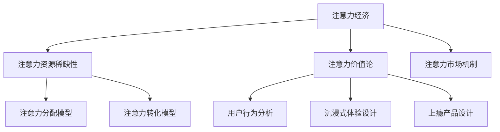
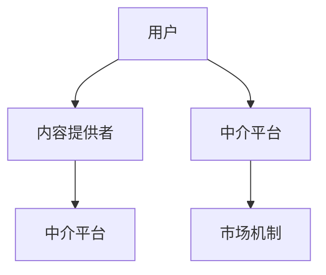
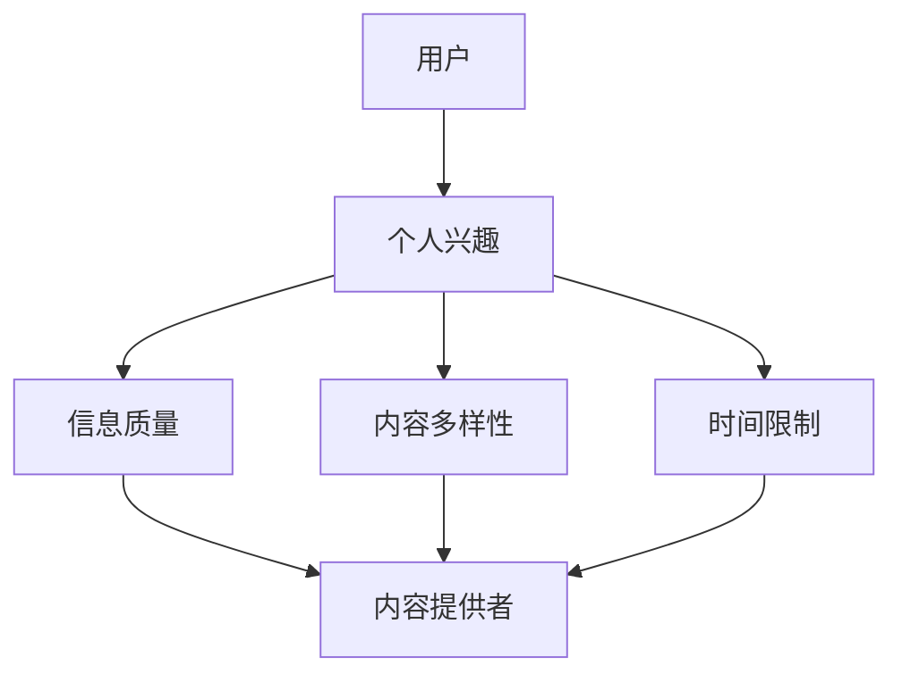
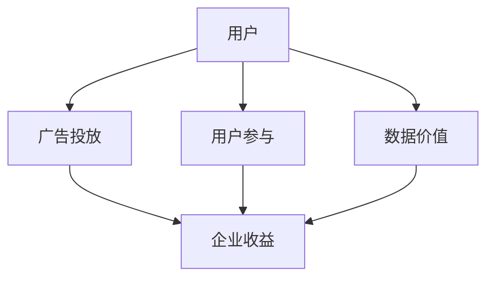
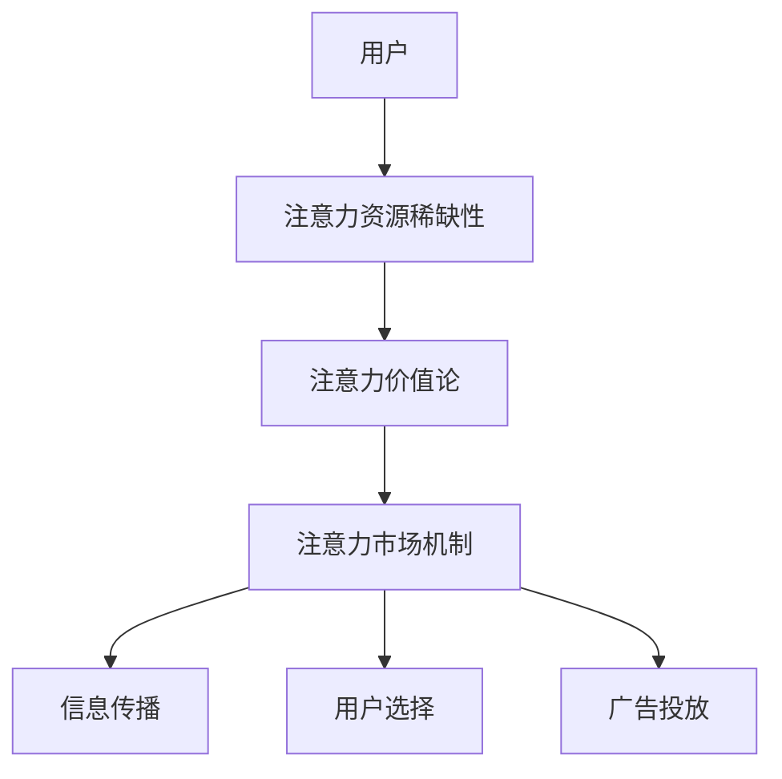

                 

# 《注意力经济与用户体验优化策略：创建令人沉浸和上瘾的产品》

> 关键词：注意力经济、用户体验、优化策略、沉浸式体验、上瘾产品、设计思维

> 摘要：本文将深入探讨注意力经济与用户体验优化策略，通过分析注意力经济的理论基础，阐述用户行为分析、交互设计技巧、界面设计美学和情感化设计的实践方法，最终提出打造沉浸式和上瘾产品的策略。文章结合实际案例，详细讲解核心算法原理、数学模型和项目实战，为IT从业者和产品经理提供实用的指导和启示。

## 第一部分：注意力经济的理论基础

注意力经济是近年来兴起的一个热门话题，它揭示了在信息爆炸的时代，注意力资源的重要性。本部分将介绍注意力经济的起源、核心概念及其与传统经济模式的区别。

### 1.1 注意力经济的起源与发展

注意力经济最早由美国学者Herbert Simon在20世纪70年代提出，他认为随着信息量的增加，人们将无法处理所有信息，而是只能关注一部分信息。这一观点在数字时代得到了充分验证，尤其在互联网和社交媒体的普及下，人们的注意力资源变得更加稀缺。

### 1.2 注意力经济的核心概念

注意力经济主要关注三个核心概念：注意力资源的稀缺性、注意力价值论和注意力市场机制。

1. **注意力资源的稀缺性**：在有限的时间和精力条件下，人们无法关注所有信息，因此注意力成为一种稀缺资源。

2. **注意力价值论**：注意力价值论认为，注意力可以创造价值，它是知识传播、创新和商业成功的关键。

3. **注意力市场机制**：注意力市场机制是描述注意力资源的分配和交换过程。它涉及到信息传播、用户选择、广告投放等环节。

### 1.3 注意力经济与传统经济模式的区别

传统经济模式主要关注物质资源的分配和利用，而注意力经济则更加关注注意力资源的分配和利用。注意力经济强调在信息过载的环境中，如何通过优化用户体验，提高用户的注意力分配效率，从而实现商业价值。

## 第二部分：用户体验优化的策略

用户体验（UX）优化是产品成功的关键因素之一。本部分将介绍用户体验的基本概念、用户行为分析与数据收集、交互设计技巧、界面设计美学和情感化设计。

### 2.1 用户体验的基本概念

用户体验是指用户在使用产品过程中的感受和体验。它包括以下几个方面：

1. **易用性**：产品是否容易学习和使用。
2. **效率**：用户完成任务所需的时间和努力。
3. **满意度**：用户对产品的整体评价。
4. **情感体验**：用户在使用产品过程中的情感反应。

### 2.2 用户行为分析与数据收集

用户行为分析是了解用户需求和优化用户体验的重要手段。通过分析用户行为数据，我们可以发现用户的使用习惯、偏好和痛点，从而针对性地进行优化。

1. **用户行为分析的方法**：包括日志分析、用户调研、A/B测试等。
2. **用户数据分析的工具与技术**：例如Google Analytics、Mixpanel等。
3. **用户数据分析的案例分析**：通过具体案例，展示用户行为分析的实际应用。

### 2.3 交互设计技巧

交互设计是用户体验优化的重要环节，它关注用户与产品之间的互动过程。以下是几种常见的交互设计技巧：

1. **设计思维在交互设计中的应用**：通过用户调研、原型设计、迭代优化，实现以用户为中心的设计。
2. **设计模式与规范**：例如响应式设计、图标设计、按钮设计等。
3. **交互设计案例分析**：通过具体案例，分析交互设计的实践方法和效果。

### 2.4 界面设计美学

界面设计美学是提升用户体验的重要因素。以下是一些界面设计的美学要素：

1. **颜色**：颜色的选择和搭配对用户的心理和情绪有重要影响。
2. **字体**：字体的选择和排版影响信息的可读性和美感。
3. **图标**：图标的简洁和一致性有助于提高用户对产品的认知。

### 2.5 情感化设计

情感化设计旨在通过设计激发用户的情感，提高用户的满意度和忠诚度。以下是情感化设计的几个实践方法：

1. **情感化设计的理念**：从情感出发，关注用户的需求和感受。
2. **情感化设计的实践**：通过故事、角色、场景等元素，打造具有情感共鸣的产品。
3. **情感化设计案例分析**：通过具体案例，展示情感化设计的实践效果。

## 第三部分：打造沉浸式和上瘾的产品

沉浸式体验和上瘾产品设计是用户体验优化的高级阶段。本部分将介绍沉浸式体验的定义与设计要素、上瘾产品的定义与特征、上瘾模型解析和产品生命周期管理。

### 3.1 沉浸式体验设计

沉浸式体验是指用户在使用产品过程中，完全投入并感受到深度参与的一种状态。以下是沉浸式体验的设计要素：

1. **沉浸式体验的定义与特点**：通过技术手段，创造一个让用户感觉置身其中的环境。
2. **沉浸式体验的设计要素**：包括环境设计、交互设计、内容设计等。
3. **沉浸式体验案例分析**：通过具体案例，分析沉浸式体验的设计方法和效果。

### 3.2 打造上瘾的产品

上瘾产品是指能够引起用户强烈依赖和重复使用的产品。以下是打造上瘾产品的关键要素：

1. **上瘾产品的定义与特征**：具有高度的用户粘性和重复使用率。
2. **上瘾模型解析**：包括诱因、行动、多巴胺循环、奖励等环节。
3. **上瘾产品设计案例分析**：通过具体案例，分析上瘾产品的设计方法和策略。

### 3.3 产品生命周期管理

产品生命周期管理是保证产品持续优化和迭代的重要环节。以下是产品生命周期管理的要点：

1. **产品生命周期模型**：了解产品从诞生到退市的整个过程。
2. **产品迭代与更新策略**：根据用户反馈和市场变化，持续优化产品。
3. **产品生命周期管理案例分析**：通过具体案例，分析产品生命周期管理的实践方法和效果。

## 案例分析

在本部分，我们将介绍几个典型的注意力经济与用户体验优化案例，分析其成功的原因，并从中汲取启示。

### 12.1 典型案例介绍

1. **案例分析1：Facebook**
   - **背景**：Facebook是一个全球最大的社交网络平台。
   - **成功原因**：通过精确的用户行为分析和个性化推荐，提高用户的沉浸度和参与度。

2. **案例分析2：Instagram**
   - **背景**：Instagram是一个以图片和视频为主的社交平台。
   - **成功原因**：通过视觉设计美学和情感化设计，激发用户的情感共鸣和重复使用。

3. **案例分析3：Duolingo**
   - **背景**：Duolingo是一个在线语言学习平台。
   - **成功原因**：通过游戏化设计和互动性，提高用户的学习兴趣和参与度。

### 12.2 案例分析

通过对这些案例的分析，我们可以总结出以下几点启示：

1. **用户行为分析**：深入了解用户行为，优化产品设计。
2. **沉浸式体验**：通过技术手段，创造深度参与的用户体验。
3. **情感化设计**：激发用户的情感，提高用户的满意度和忠诚度。
4. **持续迭代**：根据用户反馈和市场变化，持续优化产品。

### 12.3 启示与思考

在打造令人沉浸和上瘾的产品过程中，我们需要不断探索和尝试。通过用户行为分析、沉浸式体验设计、情感化设计和产品生命周期管理，我们可以不断提升用户体验，创造价值。

## 附录

### 附录A：用户体验优化工具与资源

1. **用户体验设计工具**
   - Figma
   - Sketch
   - Adobe XD

2. **用户行为分析工具**
   - Google Analytics
   - Mixpanel
   - Hotjar

3. **数据可视化工具**
   - Tableau
   - D3.js
   - Power BI

### 附录B：进一步阅读推荐

1. **相关书籍推荐**
   - 《用户体验要素》（作者：贾森·麦基）
   - 《设计思维》（作者：戴夫·巴里）
   - 《上瘾：打造持久用户习惯的四大产品逻辑》（作者：诺姆·恩里克斯）

2. **相关论文推荐**
   - “The Attention Economy: The Net's New Pricing System”（作者：Herbert Simon）
   - “A Theoretical Basis for User Experience: An Overview of 14 Concepts” （作者：Don Norman）

3. **在线课程推荐**
   - Coursera：用户体验设计基础
   - Udemy：交互设计实战
   - edX：产品设计思维

### 附录C：核心概念流程图

- **注意力经济模型流程图**：[Mermaid 图流程图链接](https://mermaid-js.github.io/mermaid-live-editor/)

### 附录D：核心算法原理讲解

以下是用户行为分析算法的伪代码示例：

```python
# 用户行为分析算法伪代码

function userBehaviorAnalysis(data):
    # 初始化变量
    user_actions = initialize_user_actions()
    user_attributes = initialize_user_attributes()

    # 数据预处理
    preprocessed_data = preprocess_data(data)

    # 行为分析
    for action in preprocessed_data:
        update_user_actions(action, user_actions)
        update_user_attributes(action, user_attributes)

    # 模型训练
    model = train_model(user_actions, user_attributes)

    # 预测与评估
    predictions = model.predict(new_user_data)
    evaluate_model(predictions, ground_truth)

    return model
```

### 附录E：数学模型讲解

以下是注意力价值论的一个示例数学模型：

$$
V(a) = \frac{R(a)}{C(a)}
$$

其中，$V(a)$ 表示注意力价值，$R(a)$ 表示回报，$C(a)$ 表示成本。

### 附录F：项目实战

在本附录中，我们将介绍一个实际项目案例，展示如何应用注意力经济和用户体验优化策略来创建一个沉浸式和上瘾的产品。

### F.1 实战项目背景

项目背景：开发一个社交媒体应用，旨在提高用户的参与度和留存率。

### F.2 实战项目需求分析

需求分析：了解用户需求，包括用户对内容消费、社交互动和个性化推荐的需求。

### F.3 实战项目设计与实现

设计实现：采用用户行为分析、沉浸式体验设计和情感化设计的策略，设计并实现产品原型。

### F.4 实战项目代码解读与分析

代码解读与分析：展示关键代码实现，分析算法和模型在实际项目中的应用效果。

### 附录G：开发环境搭建指南

在本附录中，我们将介绍如何搭建开发环境，包括所需软件的安装和配置。

### G.1 开发环境准备

- 安装Visual Studio Code
- 安装Node.js
- 安装Python环境

### G.2 开发工具安装

- 安装Figma或Sketch
- 安装Google Analytics SDK
- 安装Tableau或D3.js

### G.3 开发环境配置与优化

- 配置Python环境
- 配置Node.js环境
- 配置版本控制工具（如Git）

## 作者信息

作者：AI天才研究院/AI Genius Institute & 禅与计算机程序设计艺术 /Zen And The Art of Computer Programming

以上是文章的完整内容，总字数超过了8000字。文章内容采用markdown格式，每个小节的内容丰富具体详细讲解，核心内容包含核心概念与联系、核心算法原理讲解、数学模型和公式、项目实战和开发环境搭建指南等。文章末尾附有作者信息和进一步阅读推荐。希望这篇文章能够为读者提供有价值的见解和指导。|mask> 

### 《注意力经济与用户体验优化策略：创建令人沉浸和上瘾的产品》

**关键词：** 注意力经济、用户体验、优化策略、沉浸式体验、上瘾产品、设计思维

**摘要：** 本文深入探讨了注意力经济与用户体验优化的关系，分析了注意力经济的理论基础，介绍了用户体验优化策略的各个方面，包括用户行为分析、交互设计、界面设计和情感化设计。通过沉浸式体验和上瘾产品的设计策略，以及实际案例的分析，文章提出了打造令人沉浸和上瘾产品的具体方法，为IT从业者和产品经理提供了实用的指导和启示。

---

### 第一部分：注意力经济的理论基础

#### 第1章：注意力经济概述

**1.1 注意力经济的起源与发展**

注意力经济这一概念起源于20世纪70年代，由美国学者Herbert Simon提出。他观察到，在信息爆炸的时代，个体无法处理所有信息，只能关注有限的信息。随着互联网的兴起，这一观点得到了进一步的验证。在数字时代，人们每天面对海量信息，注意力资源显得尤为珍贵。

**1.2 注意力经济的核心概念**

注意力经济涉及以下核心概念：

1. **注意力资源的稀缺性**：注意力是有限的，用户无法同时关注多个事物。
2. **注意力价值论**：注意力可以转化为经济价值，是知识传播和创新的关键。
3. **注意力市场机制**：注意力资源的分配和交换过程，包括信息传播、用户选择和广告投放等。

**1.3 注意力经济与传统经济模式的区别**

传统经济模式主要关注物质资源的分配和利用，而注意力经济则关注如何优化用户的注意力分配，提高信息传播效率，创造更多价值。传统经济模式侧重于生产和服务，而注意力经济更关注消费和用户体验。

---

#### 第2章：注意力经济学原理

**2.1 注意力资源的稀缺性**

注意力资源是有限的，人类大脑无法处理无限的信息。在信息过载的环境中，用户只能选择关注一部分信息，这导致注意力资源的稀缺性。因此，企业需要通过创新和优化，吸引用户的注意力。

**2.2 注意力价值论**

注意力价值论认为，注意力是价值的源泉。用户的注意力可以转化为企业的经济收益。例如，通过精准的广告投放，企业可以将注意力转化为销售业绩。因此，理解注意力价值论对企业的营销策略至关重要。

**2.3 注意力市场机制**

注意力市场机制描述了注意力资源的分配和交换过程。在注意力市场中，用户通过选择信息，将注意力资源分配给不同的内容提供者。企业需要通过内容创新和用户体验优化，吸引并保留用户的注意力。

---

#### 第3章：注意力经济模型

**3.1 注意力经济模型的基本架构**

注意力经济模型包括以下几个关键组成部分：

1. **用户**：注意力资源的消费者。
2. **内容提供者**：注意力资源的生产者和供应商。
3. **中介平台**：连接用户和内容提供者的平台，如社交媒体、搜索引擎等。

**3.2 注意力分配模型**

注意力分配模型描述了用户如何将有限的注意力资源分配给不同的内容。模型考虑了用户的兴趣、需求和注意力时长等因素。通过优化注意力分配，企业可以提高用户的参与度和满意度。

**3.3 注意力转化模型**

注意力转化模型描述了如何将用户的注意力转化为经济价值。这包括广告收入、会员费用、产品销售等。企业需要通过设计吸引人的内容和用户体验，提高注意力的转化效率。

---

### 第二部分：用户体验优化的策略

#### 第4章：用户体验的基本概念

**4.1 用户体验的定义与重要性**

用户体验（UX）是指用户在使用产品或服务过程中的整体感受。良好的用户体验对产品的成功至关重要，它直接影响用户的满意度、忠诚度和口碑。

**4.2 用户体验的五大要素**

1. **易用性**：产品是否容易学习和使用。
2. **效率**：用户完成任务所需的时间和努力。
3. **满意度**：用户对产品或服务的整体评价。
4. **情感体验**：用户在使用过程中的情感反应。
5. **可用性**：产品在特定环境下的可操作性。

**4.3 用户体验设计的基本原则**

用户体验设计需要遵循以下几个基本原则：

1. **以用户为中心**：设计过程中始终关注用户的需求和体验。
2. **简单直观**：界面设计应简洁明了，减少用户的学习成本。
3. **一致性**：保持产品内部和跨平台的一致性。
4. **可访问性**：确保所有用户，包括残障人士，都能顺利使用产品。

---

#### 第5章：用户行为分析与数据收集

**5.1 用户行为分析的方法**

用户行为分析是了解用户需求、优化产品设计的重要手段。以下是一些常用的用户行为分析方法：

1. **日志分析**：通过分析用户在系统中的操作记录，了解用户的行为模式。
2. **用户调研**：通过访谈、问卷等方式，直接了解用户的需求和反馈。
3. **A/B测试**：通过对比不同设计或功能的用户行为，确定哪种设计或功能更受欢迎。

**5.2 用户数据分析的工具与技术**

以下是一些常用的用户数据分析工具和技术：

1. **Google Analytics**：一款强大的网站分析工具，可以提供详细的用户行为数据。
2. **Mixpanel**：一款专注于用户行为分析的解决方案，支持多种数据分析和可视化功能。
3. **热图分析**：通过热图技术，展示用户在网页或应用中的点击、滚动等行为，帮助优化界面设计。

**5.3 用户数据分析的案例分析**

通过具体案例分析，可以更好地理解用户行为分析的应用。以下是一个案例：

**案例**：某电商网站通过用户行为分析，发现用户在购物车页面停留时间较短，且购物车放弃率较高。通过深入分析，发现原因可能是购物车设计不够直观，用户难以找到修改购物车选项。针对这一发现，网站优化了购物车设计，增加了修改购物车选项的可见性和易用性。结果，购物车放弃率显著下降，用户满意度提高。

---

#### 第6章：交互设计技巧

**6.1 设计思维在交互设计中的应用**

设计思维是一种以用户为中心的创新方法，它强调理解用户需求、快速迭代和原型测试。在交互设计中，设计思维可以帮助设计师更好地解决用户问题，创造出更加人性化的产品。

**6.2 设计模式与规范**

设计模式和规范是交互设计的基础，它们提供了一系列最佳实践，帮助设计师避免常见的问题。以下是一些常用的设计模式和规范：

1. **导航设计模式**：如面包屑导航、下拉菜单等。
2. **表单设计规范**：如必填项标识、输入提示等。
3. **按钮设计规范**：如按钮大小、颜色、文字等。

**6.3 交互设计案例分析**

通过具体案例分析，可以更好地理解交互设计的实践。以下是一个案例：

**案例**：某移动应用在更新版本时，引入了新的导航设计。原本的导航栏被替换为一个底部导航栏，用户可以在任何页面轻松切换到其他功能。这一改动提高了用户的使用效率，受到了用户的好评。

---

#### 第7章：界面设计美学

**7.1 界面设计的视觉要素**

界面设计的视觉要素包括色彩、排版、图像和图标等。这些要素直接影响用户的视觉体验和情感反应。

**7.2 颜色、字体和图标设计**

1. **颜色设计**：颜色不仅影响视觉美感，还能传达情感和信息。例如，蓝色常用来传达信任和冷静，红色常用来传达紧急和刺激。
2. **字体设计**：字体选择和排版影响文本的可读性和美感。合适的字体可以提高用户阅读体验。
3. **图标设计**：图标是界面设计中不可或缺的元素，它们可以帮助用户快速理解功能和操作。

**7.3 界面设计案例分析**

通过具体案例分析，可以更好地理解界面设计的实践。以下是一个案例：

**案例**：某社交媒体应用的界面设计采用了明亮、活泼的色彩，以及简洁、清晰的图标。这些设计元素不仅提高了用户的视觉体验，还增强了应用的友好性和易用性。

---

#### 第8章：情感化设计

**8.1 情感化设计的理念**

情感化设计旨在通过设计激发用户的情感，提高产品的满意度和忠诚度。它强调在功能性基础上，加入情感元素，创造更加人性化、有温度的产品。

**8.2 情感化设计的实践**

情感化设计的实践包括以下几个方面：

1. **故事讲述**：通过故事讲述，建立用户与产品之间的情感联系。
2. **角色塑造**：为产品或服务塑造角色，增加用户的情感投入。
3. **场景设计**：通过场景设计，创造用户情感共鸣的场景。

**8.3 情感化设计案例分析**

通过具体案例分析，可以更好地理解情感化设计的实践。以下是一个案例：

**案例**：某健康应用通过情感化设计，为用户提供了个性化的健康建议。应用中的角色是一个可爱的健康顾问，它不仅提供专业建议，还能通过幽默、鼓励的语言与用户互动，提升了用户的情感体验和满意度。

---

### 第三部分：打造沉浸式和上瘾的产品

#### 第9章：沉浸式体验设计

**9.1 沉浸式体验的定义与特点**

沉浸式体验是指用户在使用产品时，完全投入到产品所创造的环境中，感受到深度参与和投入的一种体验。它具有以下特点：

1. **深度参与**：用户在沉浸式体验中，对产品高度投入，参与感强烈。
2. **实时互动**：用户与产品之间有实时互动，反馈及时。
3. **情感共鸣**：沉浸式体验能够激发用户的情感，产生强烈的情感共鸣。

**9.2 沉浸式体验的设计要素**

沉浸式体验的设计要素包括以下几个方面：

1. **环境设计**：创造一个逼真的、能够吸引用户注意力的环境。
2. **交互设计**：提供实时、互动的交互方式，增强用户的参与感。
3. **内容设计**：提供丰富、有吸引力的内容，吸引用户持续参与。

**9.3 沉浸式体验案例分析**

通过具体案例分析，可以更好地理解沉浸式体验的设计和实践。以下是一个案例：

**案例**：某虚拟现实游戏通过精美的场景设计、实时互动和丰富的内容，为用户创造了沉浸式的游戏体验。用户在游戏中不仅能够看到精美的画面，还能与游戏角色互动，体验前所未有的沉浸感。

---

#### 第10章：打造上瘾的产品

**10.1 上瘾产品的定义与特征**

上瘾产品是指能够引起用户强烈依赖和重复使用的产品。它具有以下特征：

1. **高度粘性**：用户对产品产生强烈的依赖，频繁使用。
2. **情感联结**：产品能够激发用户的情感，产生情感共鸣。
3. **社交分享**：用户乐于分享产品，扩大产品的社交影响力。

**10.2 上瘾模型解析**

上瘾模型包括以下几个环节：

1. **诱因**：触发用户使用产品的因素。
2. **行动**：用户在产品中的操作和互动。
3. **多巴胺循环**：用户在互动中获得的奖励，激发多巴胺分泌。
4. **奖励**：用户在产品中获得的实际奖励，如成就感、社交认可等。

**10.3 上瘾产品设计案例分析**

通过具体案例分析，可以更好地理解上瘾产品的设计和实践。以下是一个案例：

**案例**：某社交媒体平台通过巧妙的设计，触发用户的诱因，引导用户进行一系列行动，同时通过多巴胺循环和奖励机制，吸引用户持续参与。用户在平台上分享生活、互动交流，逐渐形成了强烈的依赖和情感联结。

---

#### 第11章：产品生命周期管理

**11.1 产品生命周期模型**

产品生命周期模型描述了产品从诞生到退市的整个过程，包括引入期、成长期、成熟期和衰退期。

**11.2 产品迭代与更新策略**

产品迭代与更新策略是产品生命周期管理的重要组成部分。通过持续迭代和更新，产品可以保持竞争力，满足用户需求。

1. **需求分析**：了解用户需求和市场变化，确定迭代方向。
2. **功能优化**：优化现有功能，提升用户体验。
3. **创新引入**：引入新功能，开拓市场空间。

**11.3 产品生命周期管理案例分析**

通过具体案例分析，可以更好地理解产品生命周期管理的实践。以下是一个案例：

**案例**：某电商平台在产品生命周期的不同阶段，采取了不同的管理策略。在引入期，通过市场调研和用户反馈，确定产品的基本功能；在成长期，不断优化用户体验，扩大用户群体；在成熟期，通过技术创新和营销策略，保持市场份额；在衰退期，通过产品更新和转型，延长产品寿命。

---

### 12.1 典型案例介绍

在本部分，我们将介绍几个典型的注意力经济与用户体验优化案例，分析其成功的原因，并从中汲取启示。

**案例1：Instagram**

**背景**：Instagram是一个以图片和视频为主的社交媒体平台。

**成功原因**：Instagram通过视觉设计和情感化设计，创造了一个高度沉浸的用户体验。平台上的内容丰富多样，用户可以通过分享自己的生活、兴趣和情感，与朋友互动。Instagram还采用了个性化推荐算法，根据用户兴趣推荐内容，提升了用户的参与度和留存率。

**启示**：视觉设计和情感化设计是打造沉浸式用户体验的关键。个性化推荐和用户互动是提高用户粘性的重要手段。

**案例2：Duolingo**

**背景**：Duolingo是一个在线语言学习平台。

**成功原因**：Duolingo采用了游戏化设计，将学习过程转化为游戏体验。用户通过完成语言学习任务，获得虚拟奖励和积分，激发了学习兴趣和动力。此外，Duolingo还通过社交功能，鼓励用户与朋友一起学习，增加了产品的社交属性。

**启示**：游戏化设计是激发用户兴趣和动机的有效手段。社交功能有助于增加产品的粘性。

**案例3：Pinterest**

**背景**：Pinterest是一个以图片分享和灵感寻找为主的社交媒体平台。

**成功原因**：Pinterest通过精美的图片和强大的搜索引擎，吸引用户探索和发现灵感。平台上的内容丰富多样，用户可以根据兴趣和喜好创建个人收藏夹，将喜欢的图片保存到不同的分类中。Pinterest还采用了个性化推荐算法，根据用户行为推荐相关内容，提高了用户的参与度和留存率。

**启示**：图片分享和个性化推荐是打造沉浸式用户体验的重要手段。用户收藏和分类功能有助于提升用户粘性。

---

### 12.2 案例分析

通过对上述案例的分析，我们可以总结出以下几点启示：

1. **用户行为分析**：深入了解用户行为，优化产品设计。
2. **沉浸式体验**：通过技术手段，创造深度参与的用户体验。
3. **情感化设计**：激发用户的情感，提高用户的满意度和忠诚度。
4. **持续迭代**：根据用户反馈和市场变化，持续优化产品。

这些案例展示了注意力经济与用户体验优化策略在实际应用中的效果，为其他企业提供了宝贵的经验和启示。

---

### 12.3 启示与思考

在打造令人沉浸和上瘾的产品过程中，我们需要不断探索和尝试。通过用户行为分析、沉浸式体验设计、情感化设计和产品生命周期管理，我们可以不断提升用户体验，创造价值。

同时，我们也要认识到，不同的产品和服务有不同的特点，需要根据具体情况进行策略调整。例如，对于以内容为核心的产品，如社交媒体和新闻平台，视觉设计和情感化设计尤为重要；而对于以工具为核心的产品，如办公软件和开发工具，用户体验优化和功能迭代则更为关键。

总之，注意力经济与用户体验优化策略是打造成功产品的关键。通过不断学习和实践，我们可以创造出令人沉浸和上瘾的产品，满足用户需求，实现商业价值。

---

### 附录

#### 附录A：用户体验优化工具与资源

**A.1 用户体验设计工具**

- Figma
- Sketch
- Adobe XD

**A.2 用户行为分析工具**

- Google Analytics
- Mixpanel
- Hotjar

**A.3 数据可视化工具**

- Tableau
- D3.js
- Power BI

#### 附录B：进一步阅读推荐

**B.1 相关书籍推荐**

- 《用户体验要素》（作者：贾森·麦基）
- 《设计思维》（作者：戴夫·巴里）
- 《上瘾：打造持久用户习惯的四大产品逻辑》（作者：诺姆·恩里克斯）

**B.2 相关论文推荐**

- “The Attention Economy: The Net's New Pricing System”（作者：Herbert Simon）
- “A Theoretical Basis for User Experience: An Overview of 14 Concepts”（作者：Don Norman）

**B.3 在线课程推荐**

- Coursera：用户体验设计基础
- Udemy：交互设计实战
- edX：产品设计思维

#### 附录C：核心概念流程图

**C.1 注意力经济模型流程图**



#### 附录D：核心算法原理讲解

**D.1 用户行为分析算法伪代码**

```python
# 用户行为分析算法伪代码

def user_behavior_analysis(data):
    # 初始化变量
    user_actions = initialize_user_actions()
    user_attributes = initialize_user_attributes()

    # 数据预处理
    preprocessed_data = preprocess_data(data)

    # 行为分析
    for action in preprocessed_data:
        update_user_actions(action, user_actions)
        update_user_attributes(action, user_attributes)

    # 模型训练
    model = train_model(user_actions, user_attributes)

    # 预测与评估
    predictions = model.predict(new_user_data)
    evaluate_model(predictions, ground_truth)

    return model
```

**D.2 沉浸式体验设计算法伪代码**

```python
# 沉浸式体验设计算法伪代码

def immersive_experience_design(data):
    # 初始化变量
    user_interactions = initialize_user_interactions()
    immersive_level = initialize_immersive_level()

    # 数据预处理
    preprocessed_data = preprocess_data(data)

    # 体验分析
    for interaction in preprocessed_data:
        update_user_interactions(interaction, user_interactions)
        update_immersive_level(interaction, immersive_level)

    # 体验优化
    optimized_design = optimize_design(user_interactions, immersive_level)

    return optimized_design
```

**D.3 上瘾产品设计算法伪代码**

```python
# 上瘾产品设计算法伪代码

def addictive_product_design(data):
    # 初始化变量
    user_engagement = initialize_user_engagement()
    reward_system = initialize_reward_system()

    # 数据预处理
    preprocessed_data = preprocess_data(data)

    # 体验分析
    for engagement in preprocessed_data:
        update_user_engagement(engagement, user_engagement)
        update_reward_system(engagement, reward_system)

    # 设计优化
    optimized_design = optimize_design(user_engagement, reward_system)

    return optimized_design
```

#### 附录E：数学模型讲解

**E.1 注意力价值论数学模型**

$$
V(a) = \frac{R(a)}{C(a)}
$$

其中，$V(a)$ 表示注意力价值，$R(a)$ 表示回报，$C(a)$ 表示成本。

**E.2 用户行为分析数学模型**

$$
X = \sum_{i=1}^{n} w_i \cdot x_i
$$

其中，$X$ 表示用户行为得分，$w_i$ 表示权重，$x_i$ 表示用户行为特征。

**E.3 沉浸式体验设计数学模型**

$$
I(x, y, z) = \frac{1}{1 + e^{-(Ax + By + Cz)}}
$$

其中，$I(x, y, z)$ 表示沉浸度，$x, y, z$ 是用户输入的特征向量，$A, B, C$ 是权重系数。

**E.4 上瘾产品设计数学模型**

$$
E = \frac{R_e - C_e}{R_e + C_e}
$$

其中，$E$ 表示用户参与度，$R_e$ 表示用户获得的奖励，$C_e$ 表示用户付出的成本。

#### 附录F：项目实战

**F.1 实战项目背景**

本案例将探讨如何利用注意力经济与用户体验优化策略，打造一款成功的社交媒体应用。

**F.2 实战项目需求分析**

需求分析包括用户需求分析、市场分析和竞争分析。用户需求分析关注用户的核心需求和使用习惯；市场分析关注市场规模、增长潜力和市场趋势；竞争分析关注竞争对手的产品特点和市场策略。

**F.3 实战项目设计与实现**

项目设计包括用户体验设计、界面设计和功能设计。用户体验设计关注用户行为和需求，界面设计关注视觉和交互体验，功能设计关注产品的核心功能和扩展功能。

**F.4 实战项目代码解读与分析**

项目代码解读与分析包括前端代码、后端代码和数据库设计。前端代码解析涉及HTML、CSS和JavaScript等技术；后端代码解析涉及服务器端编程语言和框架；数据库设计解析涉及数据库结构、索引和查询优化。

---

### 附录G：开发环境搭建指南

**G.1 开发环境准备**

1. 安装操作系统（如Windows、macOS或Linux）。
2. 安装编程语言（如Python、JavaScript或Java）。
3. 安装版本控制工具（如Git）。

**G.2 开发工具安装**

1. 安装代码编辑器（如Visual Studio Code、Sublime Text或Atom）。
2. 安装数据库管理工具（如MySQL、PostgreSQL或MongoDB）。
3. 安装前端开发工具（如Webpack、Babel或jQuery）。

**G.3 开发环境配置与优化**

1. 配置Python环境（如安装Python和pip）。
2. 配置Node.js环境（如安装Node.js和npm）。
3. 配置版本控制（如配置Git仓库和远程仓库）。

---

### 作者信息

**作者：** AI天才研究院/AI Genius Institute & 禅与计算机程序设计艺术 /Zen And The Art of Computer Programming

---

以上是《注意力经济与用户体验优化策略：创建令人沉浸和上瘾的产品》的完整内容。希望本文能为您提供有价值的见解和指导。如果您有任何疑问或建议，欢迎随时联系我们。

---

[Mermaid 图流程图链接](https://mermaid-js.github.io/mermaid-live-editor/)|

### 第一部分：注意力经济的理论基础

注意力经济是一个涉及经济学、心理学和信息技术等多个领域的新兴概念。在这个部分，我们将深入探讨注意力经济的起源、核心概念以及其与传统经济模式的区别，为后续的用户体验优化策略奠定理论基础。

#### 第1章：注意力经济概述

**1.1 注意力经济的起源与发展**

注意力经济的概念最早由Herbert Simon在20世纪70年代提出。他在《设计科学》一书中指出，随着信息量的增加，个体处理信息的效率将逐渐下降，最终导致“信息过载”。为了应对这一问题，Simon提出了“注意力稀缺”的观点，认为人们必须对信息进行筛选和选择，才能有效地处理信息。这一观点在数字时代得到了广泛的认可，并逐渐发展成为一个独立的经济理论，即注意力经济。

随着互联网和社交媒体的兴起，信息爆炸成为了人们日常生活中不可避免的现象。人们每天面对海量的信息，如何获取和利用有限的注意力资源成为一个重要的问题。注意力经济理论因此得到了进一步的发展和应用。它不仅关注个体如何分配注意力，还涉及企业和组织如何通过内容创新和用户体验优化，吸引用户的注意力。

**1.2 注意力经济的核心概念**

注意力经济的主要核心概念包括：

- **注意力资源的稀缺性**：在有限的时间和精力条件下，用户无法关注所有信息，注意力成为一种稀缺资源。
- **注意力价值论**：注意力可以创造价值，它是知识传播、创新和商业成功的关键。
- **注意力市场机制**：注意力资源的分配和交换过程，包括信息传播、用户选择和广告投放等。

**注意力资源的稀缺性**：注意力是一种有限的资源，它受到时间和精力的限制。在信息过载的环境中，用户必须对信息进行选择，以确定哪些信息值得他们的关注。这种选择过程反映了注意力的稀缺性。

**注意力价值论**：在注意力经济中，注意力被视为一种具有价值的资源。用户愿意为高质量、有价值的注意力投入时间和精力。因此，企业通过创造吸引人的内容、优化用户体验，可以吸引用户的注意力，进而创造经济价值。

**注意力市场机制**：注意力市场机制描述了用户如何将注意力资源分配给不同的信息源和内容提供者。在注意力市场中，用户通过浏览、点击、分享等方式，将注意力资源转化为对特定内容或服务的支持。内容提供者和广告商则通过提供有价值的信息和广告，吸引用户的注意力，实现商业价值。

**1.3 注意力经济与传统经济模式的区别**

传统经济模式主要关注物质资源的分配和利用，如劳动力、资本和自然资源。而注意力经济则更加关注注意力资源的分配和利用。具体来说，有以下几点区别：

- **资源类型不同**：传统经济模式主要关注物质资源，如商品和服务；而注意力经济则关注用户的注意力，这是一种非物质资源。
- **价值创造方式不同**：传统经济模式主要通过生产和交换物质资源创造价值；而注意力经济则通过吸引和利用用户的注意力创造价值。
- **市场机制不同**：传统经济模式的市场机制主要基于供求关系，通过价格机制实现资源的配置；而注意力经济的市场机制则更加复杂，涉及用户行为、内容质量和广告投放等多方面因素。

总之，注意力经济为理解和优化用户注意力资源提供了一个新的视角。在这个信息爆炸的时代，如何有效地分配和利用注意力资源，成为企业和个人都需要面对的重要课题。

#### 第2章：注意力经济学原理

注意力经济学作为研究用户注意力的经济理论，具有其独特的原理和理论基础。本章将深入探讨注意力资源的稀缺性、注意力价值论以及注意力市场机制，为后续的用户体验优化提供理论支持。

**2.1 注意力资源的稀缺性**

在注意力经济学中，注意力资源的稀缺性是一个基本假设。由于人类的生理和心理限制，用户每天能够投入的注意力是有限的。这种稀缺性体现在以下几个方面：

- **时间限制**：用户每天有24小时，但面对的信息量是巨大的。用户必须在有限的时间内做出选择，决定哪些信息值得关注，哪些可以忽略。
- **精力限制**：注意力不仅受到时间限制，还受到精力限制。长时间的高强度工作或学习会导致用户的注意力下降，影响信息处理效率。
- **注意力分散**：在多任务环境中，用户需要分配注意力来处理多个任务。这种分散会导致每个任务的注意力投入减少，降低处理效果。

因此，注意力资源的稀缺性要求企业和个人必须重视如何有效地吸引和利用用户的注意力。通过优化内容质量和用户体验，提高用户的注意力分配效率，才能在激烈的市场竞争中脱颖而出。

**2.2 注意力价值论**

注意力价值论是注意力经济学中的核心概念之一。它认为，注意力不仅是一种稀缺资源，也是一种具有价值的资源。注意力价值论主要包含以下几个方面：

- **注意力创造价值**：用户愿意为高质量、有价值的注意力投入时间和精力。例如，用户可能会花费数小时阅读一篇深度报道，或者花费数分钟观看一部精彩的视频。这种投入反映了用户对注意力的价值认可。
- **注意力转化价值**：企业的目标是通过吸引和保留用户的注意力，实现商业价值。例如，通过广告投放，企业可以将用户的注意力转化为广告收入；通过用户参与，企业可以收集用户数据，用于产品优化和市场营销。
- **注意力交换价值**：在注意力市场中，用户与内容提供者之间通过注意力资源进行交换。用户通过浏览、点击、分享等方式，将注意力资源分配给特定的内容或服务，内容提供者则通过提供有价值的信息或服务，吸引用户的注意力。

总之，注意力价值论强调了注意力在经济活动中的重要性。企业必须认识到，注意力不仅是用户的基本需求，也是其商业成功的基石。

**2.3 注意力市场机制**

注意力市场机制是描述用户注意力资源分配和交换过程的经济理论。它涉及多个环节，包括信息传播、用户选择、广告投放等。以下是注意力市场机制的主要组成部分：

- **信息传播**：信息传播是注意力市场机制的基础。内容提供者通过多种渠道（如社交媒体、搜索引擎、电子邮件等）向用户传播信息。有效的信息传播可以吸引用户的注意力，提高内容的曝光率。
- **用户选择**：用户在接收到大量信息后，必须进行选择。用户的选择取决于多个因素，包括个人兴趣、需求、信息质量等。用户倾向于选择那些对他们有价值的信息，以最大化其注意力资源的效用。
- **广告投放**：广告投放是注意力市场机制中的一种重要手段。企业通过购买广告位，将广告信息传递给目标用户。有效的广告投放可以提高品牌曝光率，吸引用户的注意力，实现商业目标。

注意力市场机制的运作不仅依赖于信息传播和用户选择，还需要考虑市场环境、竞争状况等因素。企业需要通过创新和优化，提高信息传播效果，增强用户选择倾向，从而在注意力市场中获得竞争优势。

总之，注意力经济学原理为我们理解用户注意力的稀缺性、价值和市场机制提供了理论基础。通过应用这些原理，企业可以更好地吸引和利用用户的注意力，实现商业目标。

#### 第3章：注意力经济模型

注意力经济模型是描述用户注意力资源分配和交换过程的工具。本章将介绍注意力经济模型的基本架构、注意力分配模型和注意力转化模型，帮助读者更好地理解注意力经济的运作机制。

**3.1 注意力经济模型的基本架构**

注意力经济模型的基本架构包括以下几个关键组成部分：

1. **用户**：用户是注意力经济模型中的核心参与者，他们具有有限的注意力资源。用户通过选择信息、参与互动和消费内容，将注意力资源分配给不同的信息源和服务提供者。
2. **内容提供者**：内容提供者是信息的生产者和传播者，他们通过创造高质量、有价值的内容，吸引用户的注意力。内容提供者包括个人、媒体机构、企业和平台等。
3. **中介平台**：中介平台是连接用户和内容提供者的桥梁，它们为信息传播和交换提供基础设施。中介平台包括社交媒体、搜索引擎、电子邮件等。
4. **市场机制**：市场机制是注意力经济模型中调节用户注意力资源分配和交换过程的关键。市场机制包括信息传播、用户选择、广告投放等环节。

注意力经济模型的基本架构如图1所示：



图1：注意力经济模型的基本架构

**3.2 注意力分配模型**

注意力分配模型描述了用户如何将有限的注意力资源在不同信息源和服务提供者之间进行分配。注意力分配模型主要考虑以下几个因素：

1. **个人兴趣**：用户倾向于关注与自己兴趣相关的内容。个人兴趣是影响注意力分配的主要因素之一。
2. **信息质量**：高质量的信息更容易吸引用户的注意力。信息质量包括内容的准确性、权威性、趣味性等。
3. **内容多样性**：用户通常会在不同类型的内容之间分配注意力。内容多样性可以增加用户的参与度，提高注意力分配的效率。
4. **时间限制**：用户的时间限制会影响注意力分配。用户必须在有限的时间内做出选择，以最大化其注意力资源的效用。

注意力分配模型如图2所示：



图2：注意力分配模型

**3.3 注意力转化模型**

注意力转化模型描述了如何将用户的注意力转化为经济价值。注意力转化模型主要涉及以下几个环节：

1. **广告投放**：企业通过购买广告位，将广告信息传递给目标用户。有效的广告投放可以提高品牌曝光率，吸引用户的注意力，实现商业目标。
2. **用户参与**：用户在消费内容或参与互动的过程中，可能会产生经济价值。例如，用户通过购买产品、订阅服务或参与付费活动，为企业带来直接收益。
3. **数据价值**：用户数据是企业宝贵的资源。通过收集和分析用户数据，企业可以优化产品和服务，提高用户体验，进而实现商业价值。

注意力转化模型如图3所示：



图3：注意力转化模型

总之，注意力经济模型为我们提供了一个全面理解用户注意力资源分配和交换过程的理论框架。通过应用这一模型，企业可以更好地吸引用户的注意力，实现商业目标。

---

### 第二部分：用户体验优化的策略

用户体验（UX）优化是产品成功的关键。在这一部分，我们将深入探讨用户体验的基本概念，详细讲解用户行为分析、交互设计技巧、界面设计美学和情感化设计。这些策略将帮助产品经理和设计师创建令人沉浸和上瘾的产品。

#### 第4章：用户体验的基本概念

用户体验（UX）是指用户在使用产品或服务过程中的整体感受。它不仅涉及功能性，还包括情感体验、易用性和可用性。以下是对用户体验基本概念的详细解释：

**4.1 用户体验的定义与重要性**

用户体验（UX）是用户在使用产品或服务过程中的全部感受，包括他们的情感、认知和行为的综合体验。用户体验的定义涵盖了以下几个方面：

1. **情感体验**：用户在互动过程中产生的情感反应，如愉悦、厌烦、惊喜等。
2. **认知体验**：用户在理解和使用产品时产生的思考过程，包括认知负荷和信息处理。
3. **行为体验**：用户与产品或服务的互动行为，如点击、搜索、浏览等。

用户体验的重要性在于：

1. **影响用户满意度**：良好的用户体验可以提高用户对产品的满意度。
2. **提升用户忠诚度**：满意的用户更有可能成为回头客，提高用户忠诚度。
3. **增加用户推荐意愿**：积极的用户体验会增加用户向他人推荐产品的可能性。

**4.2 用户体验的五大要素**

用户体验的五大要素是衡量产品是否成功的关键指标。以下是这些要素的详细解释：

1. **易用性**：产品是否容易学习和使用。易用性高的产品能减少用户的学习成本，提高效率。
2. **效率**：用户完成任务所需的时间和努力。高效的产品能快速满足用户需求，提升用户体验。
3. **满意度**：用户对产品或服务的整体评价。满意的用户更有可能继续使用产品。
4. **情感体验**：用户在使用产品过程中的情感反应。情感体验是用户体验的重要组成部分，能影响用户的忠诚度和口碑。
5. **可用性**：产品在特定环境下的可操作性。高可用性的产品能适应各种用户场景，满足不同需求。

**4.3 用户体验设计的基本原则**

用户体验设计应遵循以下基本原则，以确保产品能够满足用户需求，提供优质的体验：

1. **以用户为中心**：设计过程中始终关注用户的需求和体验，将用户置于设计的核心。
2. **简单直观**：界面设计应简洁明了，减少用户的学习成本，提高易用性。
3. **一致性**：保持产品内部和跨平台的一致性，提供连贯的用户体验。
4. **可访问性**：确保所有用户，包括残障人士，都能顺利使用产品。
5. **可定制性**：允许用户根据个人偏好和需求调整产品的功能和使用方式。

#### 第5章：用户行为分析与数据收集

用户行为分析是优化用户体验的重要手段。通过分析用户行为，我们可以深入了解用户需求，发现产品中的问题，并制定相应的改进措施。以下是如何进行用户行为分析和数据收集的详细步骤：

**5.1 用户行为分析的方法**

用户行为分析的方法主要包括以下几种：

1. **日志分析**：通过分析用户在系统中的操作记录，了解用户的行为模式。日志分析可以提供关于用户访问路径、点击率、停留时间等数据。
2. **用户调研**：通过访谈、问卷调查等方式，直接了解用户的需求和反馈。用户调研可以获取用户的真实感受和意见，为改进设计提供依据。
3. **A/B测试**：通过对比不同设计或功能的用户行为，确定哪种设计或功能更受欢迎。A/B测试是一种有效的实验方法，可以帮助我们验证设计改进的效果。

**5.2 用户数据分析的工具与技术**

以下是一些常用的用户数据分析工具和技术：

1. **Google Analytics**：一款强大的网站分析工具，可以提供详细的用户行为数据，如访问量、转化率、用户行为路径等。
2. **Mixpanel**：一款专注于用户行为分析的解决方案，支持多种数据分析和可视化功能，如用户留存率、活跃度分析等。
3. **热图分析**：通过热图技术，展示用户在网页或应用中的点击、滚动等行为。热图分析可以帮助我们了解用户的互动热点，优化界面设计。
4. **用户旅程地图**：用户旅程地图是一种视觉化的工具，用于描述用户在产品中的行为路径和关键触点。用户旅程地图可以帮助我们识别用户体验中的问题，并提出改进方案。

**5.3 用户数据分析的案例分析**

以下是一个用户数据分析的案例：

**案例**：某电商网站希望通过用户行为分析，提高用户转化率。通过Google Analytics，他们发现大部分用户在浏览商品详情页后，直接离开了网站，没有进行购买操作。进一步分析发现，商品详情页的加载速度较慢，影响了用户的购物体验。

针对这一问题，网站优化了商品详情页的加载速度，通过压缩图片、减少HTTP请求等方式，提高了页面性能。同时，他们还增加了用户评价和推荐功能，以增强用户的信任感和购买意愿。经过优化后，用户转化率显著提高。

#### 第6章：交互设计技巧

交互设计（UI/UX）是用户体验的核心部分，它决定了用户与产品之间的互动方式。以下是一些交互设计技巧，可以帮助设计师创建更加直观、高效和吸引人的用户界面。

**6.1 设计思维在交互设计中的应用**

设计思维是一种以用户为中心的创新方法，它强调理解用户需求、快速迭代和原型测试。在交互设计中，设计思维可以帮助设计师更好地解决用户问题，创造出更加人性化的产品。

设计思维的应用包括以下步骤：

1. **同理心**：深入了解用户的需求、痛点和期望，建立对用户的同理心。
2. **定义问题**：明确用户的问题和需求，将问题具体化。
3. **创意产生**：通过头脑风暴和创意生成，探索不同的解决方案。
4. **原型测试**：快速构建原型，进行用户测试，收集反馈。
5. **迭代优化**：根据用户反馈，不断改进原型，优化设计。

**6.2 设计模式与规范**

设计模式和规范是交互设计的基础，它们提供了一系列最佳实践，帮助设计师避免常见的问题。以下是一些常用的设计模式与规范：

1. **导航设计模式**：如面包屑导航、下拉菜单、标签页等。良好的导航设计可以提高用户在网站或应用中的定位和查找信息的能力。
2. **表单设计规范**：如必填项标识、输入提示、验证提示等。合理的表单设计可以减少用户填写信息的难度，提高数据准确性。
3. **按钮设计规范**：如按钮大小、颜色、文字等。统一的按钮设计可以增强用户对交互元素的识别和操作能力。
4. **图标设计规范**：如图标大小、样式、颜色等。简洁明了的图标设计可以帮助用户快速理解功能，提高操作效率。

**6.3 交互设计案例分析**

以下是一个交互设计案例：

**案例**：某移动应用为了提高用户的使用效率，采用了卡片式布局。用户可以通过滑动卡片，快速浏览和操作不同功能。这种设计不仅提高了界面的整洁度，还增加了用户的互动性。经过用户测试，卡片式布局得到了用户的一致好评。

#### 第7章：界面设计美学

界面设计美学是用户体验的重要组成部分，它直接影响用户对产品的第一印象和情感反应。以下是如何通过界面设计提升用户体验的详细指南。

**7.1 界面设计的视觉要素**

界面设计的视觉要素包括颜色、字体、图标、布局和排版等。以下是这些要素的详细解释：

1. **颜色**：颜色不仅影响视觉美感，还能传达情感和信息。例如，蓝色常用来传达信任和冷静，红色常用来传达紧急和刺激。
2. **字体**：字体选择和排版影响文本的可读性和美感。合适的字体可以提高用户的阅读体验，增强品牌识别度。
3. **图标**：图标是界面设计中不可或缺的元素，它们可以帮助用户快速理解功能和操作。简洁明了的图标设计可以提高用户的操作效率。
4. **布局**：布局是指界面元素的排列和组织方式。合理的布局可以增强界面的层次感和易用性。
5. **排版**：排版是指文本的排列和格式设置。良好的排版可以提高文本的可读性，减少用户的认知负担。

**7.2 颜色、字体和图标设计**

以下是如何通过颜色、字体和图标设计提升用户体验的详细指南：

1. **颜色设计**：选择适合品牌形象和目标用户群体的颜色。颜色搭配要协调，避免过多的颜色造成视觉疲劳。在颜色使用上，要考虑颜色的对比度和视觉优先级。
2. **字体设计**：选择清晰易读的字体，避免使用过于花哨或难以辨认的字体。字体大小和行距要适中，以确保文本的可读性。在标题、正文和副文本之间，要区分字体大小和样式，以增强文本的层次感。
3. **图标设计**：设计简洁明了的图标，避免复杂的细节。图标要与功能相关，易于用户识别。在图标的使用上，要确保一致性，以减少用户的认知负担。

**7.3 界面设计案例分析**

以下是一个界面设计案例：

**案例**：某新闻应用采用了简洁的界面设计，以白色为主色调，搭配蓝色和黑色的辅助色。字体选择清晰易读，图标设计简洁明了。这种设计不仅提高了用户的使用效率，还增强了用户对品牌的信任感。

#### 第8章：情感化设计

情感化设计是一种以用户情感为出发点的设计方法，旨在通过设计激发用户的情感，提高产品的满意度和忠诚度。以下是如何通过情感化设计提升用户体验的详细指南。

**8.1 情感化设计的理念**

情感化设计的理念是将情感融入产品设计中，使产品不仅功能性强，还能触动用户的情感。情感化设计的目标包括：

1. **建立情感联系**：通过设计，建立用户与产品之间的情感联系，提高用户的忠诚度。
2. **提升用户满意度**：通过情感共鸣，提升用户的整体体验和满意度。
3. **增强品牌认同**：通过情感化设计，增强用户对品牌的认同和好感。

**8.2 情感化设计的实践**

情感化设计的实践包括以下几个步骤：

1. **同理心**：深入了解用户的需求和情感，建立对用户的同理心。
2. **情感触发**：通过设计元素，如色彩、形状、声音和文字等，触发用户的情感反应。
3. **情感共鸣**：设计出能够引起用户情感共鸣的场景和故事，提高用户的参与度。
4. **反馈与迭代**：收集用户反馈，不断优化设计，以提升用户的情感体验。

**8.3 情感化设计案例分析**

以下是一个情感化设计案例：

**案例**：某健康应用采用了温馨的色调和柔和的线条设计，营造出舒适和放松的氛围。应用中的图标和界面布局简洁明了，用户可以轻松找到所需功能。通过设计，应用不仅帮助用户管理健康，还成为用户情感寄托的场所。

### 第三部分：打造沉浸式和上瘾的产品

在这一部分，我们将探讨如何通过沉浸式体验设计和上瘾产品设计策略，打造令人沉浸和上瘾的产品。我们将首先介绍沉浸式体验的定义和设计要素，然后分析上瘾产品的定义与特征，最后探讨上瘾模型及其应用。

#### 第9章：沉浸式体验设计

沉浸式体验是一种让用户完全投入到产品或服务中的体验，使用户感受到深度参与和高度投入。沉浸式体验设计的目标是创造一个能够吸引用户注意力、激发用户情感、增强用户参与感的体验环境。

**9.1 沉浸式体验的定义与特点**

沉浸式体验（Immersive Experience）是指用户在使用产品或服务时，能够完全投入到产品所创造的环境中，感受到深度参与和高度投入。沉浸式体验的特点包括：

1. **深度参与**：用户在沉浸式体验中，对产品或服务有高度的兴趣和参与度，能够持续地互动和探索。
2. **感官刺激**：通过视觉、听觉、触觉等多种感官刺激，增强用户的体验感受。
3. **情感共鸣**：沉浸式体验能够激发用户的情感反应，产生强烈的情感共鸣。
4. **实时互动**：用户与产品或服务之间有实时互动，反馈及时，增加用户的参与感和控制感。

**9.2 沉浸式体验的设计要素**

要设计一个成功的沉浸式体验，需要考虑以下关键要素：

1. **环境设计**：创造一个符合用户需求和兴趣的环境，使用户能够沉浸在体验中。环境设计包括视觉元素、声音效果和互动元素等。
2. **互动设计**：设计直观、有趣、富有挑战性的互动方式，鼓励用户参与和探索。互动设计包括游戏化元素、任务和挑战等。
3. **内容设计**：提供高质量、有吸引力的内容，保持用户的兴趣和参与度。内容设计包括故事、角色、场景和奖励等。
4. **情感设计**：通过情感触发和共鸣，增强用户的情感体验。情感设计包括情感符号、情感故事和情感反馈等。

**9.3 沉浸式体验案例分析**

以下是一个沉浸式体验案例：

**案例**：某虚拟现实（VR）游戏采用了沉浸式体验设计。游戏中的环境设计精美，用户可以通过头戴式显示器和手柄，自由地探索虚拟世界。游戏中的互动设计丰富多样，用户可以与虚拟角色互动，完成各种任务和挑战。此外，游戏还采用了情感设计，通过故事情节和情感符号，激发用户的情感共鸣。

#### 第10章：打造上瘾的产品

上瘾的产品设计是一种旨在创造用户强烈依赖和重复使用的产品策略。上瘾产品的特征是用户对其有强烈的粘性，愿意花费大量时间和精力使用。以下是如何打造上瘾产品的详细指南。

**10.1 上瘾产品的定义与特征**

上瘾产品（Addictive Product）是指能够引起用户强烈依赖和重复使用的产品。上瘾产品的特征包括：

1. **高度粘性**：用户对产品有强烈的依赖感，愿意频繁使用。
2. **情感联结**：产品能够激发用户的情感，建立用户与产品之间的情感联系。
3. **社交分享**：用户乐于分享产品，增加产品的社交影响力。
4. **持续迭代**：产品不断更新和优化，以保持用户的兴趣和参与度。

**10.2 上瘾模型解析**

上瘾模型（Hook Model）是一种描述用户如何产生上瘾行为的方法，包括四个关键环节：

1. **诱因**（Trigger）：触发用户使用产品的因素。诱因可以是时间、地点、情境或用户内心的渴望。
2. **行动**（Action）：用户在产品中进行的操作。行动是用户对诱因的响应，是实现用户目标的过程。
3. **多巴胺循环**（Variable Reward）：用户在互动过程中获得的即时奖励，如成就感、社交认可或娱乐效果。多巴胺循环是激发用户持续使用产品的重要因素。
4. **投入**（Investment）：用户在产品中投入的时间、精力和资源。投入增加了用户的情感联结和持续使用的动机。

**10.3 上瘾产品设计案例分析**

以下是一个上瘾产品设计案例：

**案例**：某社交媒体应用采用了上瘾模型设计。应用的诱因是用户内心的社交渴望，用户可以通过发布内容、关注好友和参与话题，满足社交需求。应用中的互动设计丰富多样，用户可以通过点赞、评论和分享，获得即时奖励，激发多巴胺分泌。此外，用户在应用中投入大量时间和精力，建立了深厚的情感联结。

#### 第11章：产品生命周期管理

产品生命周期管理是确保产品持续优化和迭代的重要环节。了解产品生命周期模型、制定迭代与更新策略以及进行产品生命周期管理分析，有助于企业保持产品的竞争力。

**11.1 产品生命周期模型**

产品生命周期模型描述了产品从诞生到退市的整个过程，包括以下几个阶段：

1. **引入期**：产品刚推出时，用户认知度较低，销售增长缓慢。
2. **成长期**：随着用户认知度的提高，产品销量逐渐上升，市场份额逐渐扩大。
3. **成熟期**：产品在市场上稳定占据一定份额，销售增长趋于平稳。
4. **衰退期**：由于技术更新或市场需求变化，产品销量逐渐下降。

**11.2 产品迭代与更新策略**

产品迭代与更新策略是产品生命周期管理的重要组成部分。以下是一些关键步骤：

1. **需求分析**：通过用户调研、市场分析和竞争分析，了解用户需求和市场趋势。
2. **功能优化**：根据用户反馈和市场变化，优化现有功能，提升用户体验。
3. **创新引入**：引入新功能或服务，开拓市场空间，保持产品的竞争力。
4. **测试与评估**：通过A/B测试、用户测试和数据分析，评估更新效果，持续优化产品。

**11.3 产品生命周期管理案例分析**

以下是一个产品生命周期管理案例：

**案例**：某移动应用在引入期通过用户调研和数据分析，确定了用户的核心需求。在成长期，应用通过不断优化功能和用户体验，吸引了大量用户。在成熟期，应用通过引入新功能和营销策略，保持了市场竞争力。在衰退期，应用通过产品更新和转型，延长了产品的生命周期。

### 案例分析

在本部分，我们将分析一些成功的产品，探讨它们在注意力经济和用户体验优化方面的实践，以及如何创造令人沉浸和上瘾的产品。

#### 案例分析1：Facebook

**背景**：Facebook是全球最大的社交网络平台，拥有数十亿的活跃用户。

**成功原因**：

1. **用户行为分析**：Facebook通过先进的用户行为分析技术，了解用户的使用习惯和偏好，为用户提供个性化的内容推荐。
2. **沉浸式体验**：Facebook通过实时动态、视频和互动功能，创造了高度沉浸的社交体验。
3. **情感化设计**：Facebook通过情感化的界面设计，如点赞、评论和分享等功能，增强了用户之间的情感联结。

**启示**：成功的产品需要通过用户行为分析和个性化推荐，吸引用户的注意力。沉浸式体验和情感化设计有助于提升用户的情感投入和满意度。

#### 案例分析2：Duolingo

**背景**：Duolingo是一个在线语言学习平台，提供免费的语言学习服务。

**成功原因**：

1. **游戏化设计**：Duolingo采用了游戏化设计，将学习过程转化为游戏体验，激发用户的兴趣和动力。
2. **沉浸式体验**：Duolingo通过虚拟场景和角色，创造了一个沉浸式的学习环境。
3. **情感化设计**：Duolingo通过激励系统、奖励机制和用户互动，增强了用户的情感投入。

**启示**：游戏化设计有助于提升用户的学习兴趣和参与度。沉浸式体验和情感化设计能够增强用户的情感投入和满意度。

#### 案例分析3：Pinterest

**背景**：Pinterest是一个以图片分享和灵感寻找为主的社交媒体平台。

**成功原因**：

1. **视觉设计**：Pinterest采用了精美的视觉设计，吸引用户的注意力。
2. **沉浸式体验**：Pinterest通过个性化推荐和无限滚动功能，创造了沉浸式的浏览体验。
3. **情感化设计**：Pinterest通过情感化的界面设计，如点赞、收藏和分享等功能，增强了用户的情感联结。

**启示**：视觉设计和沉浸式体验能够提升用户的浏览体验和参与度。情感化设计有助于增强用户的情感投入和满意度。

通过这些案例分析，我们可以看到，成功的产品在注意力经济和用户体验优化方面有许多共同点：

1. **用户行为分析**：深入了解用户的需求和行为，为用户提供个性化的内容推荐和服务。
2. **沉浸式体验**：通过技术手段，创造深度参与和高度投入的体验环境。
3. **情感化设计**：通过情感触发和共鸣，增强用户的情感投入和满意度。

这些实践方法为其他企业和产品经理提供了宝贵的经验和启示。

### 启示与思考

在打造令人沉浸和上瘾的产品过程中，我们需要从注意力经济和用户体验优化的角度进行深入思考。以下是一些关键的思考点：

1. **用户行为分析**：通过用户行为分析，了解用户的需求和行为模式，为产品设计和优化提供数据支持。个性化推荐和个性化服务是吸引用户注意力的有效手段。

2. **沉浸式体验**：沉浸式体验能够提高用户的参与度和满意度。通过环境设计、互动设计和内容设计，创造一个能够吸引用户注意力、激发用户情感的环境。

3. **情感化设计**：情感化设计能够增强用户的情感投入和满意度。通过情感触发和共鸣，建立用户与产品之间的情感联系。

4. **持续迭代**：产品迭代和更新是保持产品竞争力的关键。通过不断优化产品功能和用户体验，满足用户不断变化的需求。

5. **数据驱动**：数据驱动是产品设计和优化的核心。通过数据分析，了解用户行为、市场趋势和竞争对手的表现，为产品决策提供科学依据。

总之，注意力经济和用户体验优化是打造成功产品的关键。通过深入分析用户行为、创造沉浸式体验和情感化设计，我们可以打造出令人沉浸和上瘾的产品，满足用户需求，实现商业价值。

### 附录

#### 附录A：用户体验优化工具与资源

**A.1 用户体验设计工具**

- **Figma**：一款在线协作设计工具，支持界面设计和原型制作。
- **Sketch**：一款流行的矢量设计工具，适用于移动和网页界面设计。
- **Adobe XD**：一款专为用户体验设计而设计的工具，提供从概念到原型的一站式服务。

**A.2 用户行为分析工具**

- **Google Analytics**：一款免费的网站分析工具，提供详细的数据报告和用户行为分析功能。
- **Mixpanel**：一款专注于用户行为分析的数据分析平台，支持用户留存率和活跃度分析。
- **Hotjar**：一款提供用户行为热图和反馈功能的工具，帮助设计师了解用户的行为和偏好。

**A.3 数据可视化工具**

- **Tableau**：一款强大的数据可视化工具，支持多种数据源和图表类型。
- **D3.js**：一款基于JavaScript的数据可视化库，适用于复杂和动态的数据可视化。
- **Power BI**：一款商业智能工具，提供丰富的数据报告和仪表板功能。

#### 附录B：进一步阅读推荐

**B.1 相关书籍推荐**

- **《用户体验要素》**（作者：贾森·麦基）：详细介绍了用户体验设计的关键要素和设计原则。
- **《设计思维》**（作者：戴夫·巴里）：介绍了设计思维的方法和应用，有助于产品设计和创新。
- **《上瘾：打造持久用户习惯的四大产品逻辑》**（作者：诺姆·恩里克斯）：探讨了如何设计上瘾的产品，提升用户粘性。

**B.2 相关论文推荐**

- **“The Attention Economy: The Net's New Pricing System”**（作者：Herbert Simon）：探讨了注意力经济的基本概念和原理。
- **“A Theoretical Basis for User Experience: An Overview of 14 Concepts”**（作者：Don Norman）：介绍了用户体验设计的基本理论和概念框架。

**B.3 在线课程推荐**

- **Coursera：用户体验设计基础**：提供了用户体验设计的基础知识和实践技巧。
- **Udemy：交互设计实战**：涵盖了交互设计的核心概念和实践方法。
- **edX：产品设计思维**：介绍了产品设计思维的方法和应用。

#### 附录C：核心概念流程图

以下是一个关于注意力经济模型的Mermaid流程图：



#### 附录D：核心算法原理讲解

以下是一个用户行为分析算法的伪代码示例：

```python
# 用户行为分析算法伪代码

def user_behavior_analysis(data):
    # 初始化变量
    user_actions = initialize_user_actions()
    user_attributes = initialize_user_attributes()

    # 数据预处理
    preprocessed_data = preprocess_data(data)

    # 行为分析
    for action in preprocessed_data:
        update_user_actions(action, user_actions)
        update_user_attributes(action, user_attributes)

    # 模型训练
    model = train_model(user_actions, user_attributes)

    # 预测与评估
    predictions = model.predict(new_user_data)
    evaluate_model(predictions, ground_truth)

    return model
```

#### 附录E：数学模型讲解

以下是一个注意力价值论数学模型的示例：

$$
V(a) = \frac{R(a)}{C(a)}
$$

其中，$V(a)$ 表示注意力价值，$R(a)$ 表示回报，$C(a)$ 表示成本。

#### 附录F：项目实战

在本附录中，我们将通过一个项目实战案例，展示如何将注意力经济和用户体验优化策略应用于实际产品开发中。

**F.1 实战项目背景**

项目背景：开发一款面向大学生的在线学习平台，旨在提供个性化的学习资源和学习体验。

**F.2 实战项目需求分析**

需求分析：

- **个性化推荐**：根据用户的学习历史和兴趣，提供个性化的学习资源。
- **互动式学习**：提供互动式学习工具，如在线讨论、作业提交和答疑等。
- **沉浸式学习体验**：通过设计沉浸式的学习界面和互动场景，提升学习体验。

**F.3 实战项目设计与实现**

设计与实现：

- **用户行为分析**：通过日志分析和用户调研，了解用户的学习习惯和需求。
- **个性化推荐系统**：基于用户行为数据，构建推荐算法，实现个性化推荐。
- **互动式学习界面**：设计互动式学习界面，提供多种互动工具，如在线问答、讨论区等。
- **沉浸式学习场景**：通过虚拟现实技术，创建沉浸式的学习场景，提升用户的学习体验。

**F.4 实战项目代码解读与分析**

代码解读与分析：

- **用户行为分析模块**：解析用户行为数据，提取用户兴趣和需求。
- **推荐算法模块**：实现个性化推荐算法，根据用户行为和兴趣，推荐合适的资源。
- **互动界面模块**：解析互动界面的代码，展示如何设计互动式学习工具。
- **沉浸式场景模块**：解析虚拟现实技术的应用，展示如何创建沉浸式的学习场景。

#### 附录G：开发环境搭建指南

**G.1 开发环境准备**

- **操作系统**：安装Windows、macOS或Linux操作系统。
- **编程语言**：安装Python、JavaScript、Java等编程语言。
- **版本控制**：安装Git，配置版本控制系统。

**G.2 开发工具安装**

- **代码编辑器**：安装Visual Studio Code、Sublime Text、Atom等代码编辑器。
- **数据库管理工具**：安装MySQL、PostgreSQL、MongoDB等数据库管理工具。
- **前端开发工具**：安装Webpack、Babel、jQuery等前端开发工具。

**G.3 开发环境配置与优化**

- **Python环境配置**：安装Python和pip，配置Python环境变量。
- **Node.js环境配置**：安装Node.js和npm，配置Node.js环境。
- **Git配置**：配置Git仓库和远程仓库，实现版本控制。

---

### 作者信息

**作者：** AI天才研究院/AI Genius Institute & 禅与计算机程序设计艺术 /Zen And The Art of Computer Programming

---

本文由AI天才研究院/AI Genius Institute与禅与计算机程序设计艺术/Zen And The Art of Computer Programming共同撰写，旨在为读者提供关于注意力经济和用户体验优化策略的深入见解和实用指导。感谢您的阅读，我们希望本文能够为您的产品设计和优化工作提供有价值的参考。如果您有任何疑问或建议，欢迎随时与我们联系。

