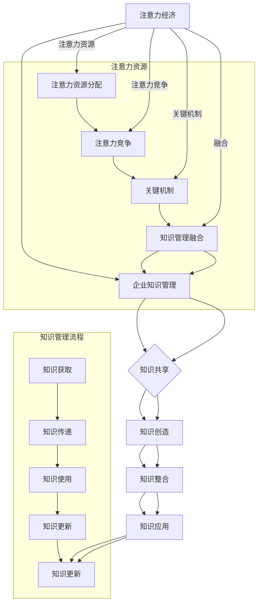

                 

### 第1章：引论

#### 引言

在当今信息爆炸的时代，如何有效管理和利用知识资源已成为企业和组织面临的重要挑战。注意力经济和企业知识管理作为两个重要概念，正逐渐引起广泛关注。本章旨在探讨注意力经济与企业知识管理的关系，分析两者之间的融合机制及其对企业知识管理的影响。

#### 注意力经济与企业知识管理的关系

注意力经济强调用户注意力资源的稀缺性和价值，认为在信息过载的环境中，吸引和维持用户的注意力是企业和组织成功的关键。企业知识管理则侧重于知识获取、存储、共享、使用和更新等过程，以支持企业创新和竞争力提升。

注意力经济与企业知识管理之间的关系主要体现在以下几个方面：

1. **注意力资源与知识获取**：注意力经济强调用户注意力资源的有限性，企业需要通过提供有价值、相关和吸引人的内容来吸引和维持用户注意力。这种注意力资源在企业知识获取过程中发挥着重要作用，有助于提高知识获取的效率和效果。

2. **知识共享与用户参与**：注意力经济关注用户参与度和互动性，企业知识管理中的知识共享过程需要用户的积极参与。通过用户参与，企业可以实现知识的共创、传播和应用，从而提高知识共享的效果。

3. **注意力价值与知识变现**：注意力经济将注意力视为一种经济资源，企业可以通过吸引用户注意力来创造经济价值。企业知识管理中的知识变现过程与注意力经济密切相关，企业需要通过知识付费、广告合作等方式将知识转化为实际收益。

#### 本章结构

本章将分为以下几个部分进行论述：

1. **注意力经济的概念与起源**：介绍注意力经济的定义、核心思想和起源，分析其与企业知识管理的关系。
2. **企业知识管理的定义与重要性**：阐述企业知识管理的定义、基本概念和重要性，探讨其在企业竞争中的关键作用。
3. **注意力经济与企业知识管理的关系**：分析注意力经济与企业知识管理之间的联系和融合机制，探讨其对知识管理的影响。
4. **小结**：总结本章内容，强调注意力经济与企业知识管理融合的重要性。

通过本章的讨论，我们希望为企业提供一种新的知识管理视角，以应对信息过载和用户注意力稀缺的挑战，提高企业创新能力和竞争力。

#### 1.1 注意力经济的概念与起源

注意力经济（Attention Economy）是一种基于用户注意力资源的经济学模型，旨在解释在信息过载的时代，如何有效管理和利用用户注意力资源。注意力经济认为，在信息和内容爆炸的时代，用户的注意力成为一种稀缺资源，企业和组织需要通过各种手段来吸引和维持用户的注意力，以实现商业目标。

### 1.1.1 注意力经济的定义

注意力经济的概念最早由美国学者Jodi T. Tapscott和Anthony D. Williams在2006年的《注意力经济：心智与金钱在网络世界中的致命交织》（The Attention Economy: The Fateful Entanglement of Mind and Money on the Internet）一书中提出。根据他们的定义，注意力经济是指人们为了获取信息、商品或服务而分配其注意力资源的过程，以及企业和组织如何通过吸引和维持人们的注意力来实现其商业目标。

具体来说，注意力经济有以下几个核心特点：

1. **注意力资源的稀缺性**：在信息过载的环境中，用户的注意力资源是有限的，因为每个人的时间和精力都是有限的。因此，如何有效地吸引和维持用户的注意力成为企业和组织的关键。

2. **注意力分配与选择**：用户需要不断地评估和调整其注意力资源的分配，以最大化其收益。用户倾向于将注意力资源分配给那些具有高价值、相关性和兴趣的信息或活动。

3. **注意力竞争**：由于注意力资源稀缺，企业和组织之间存在激烈的竞争，争夺有限的注意力资源。这导致了各种吸引注意力的策略和手段的出现。

4. **注意力价值的货币化**：用户在关注某个信息或活动时，其实也在为这个信息或活动贡献其注意力资源。企业和组织可以通过广告、付费内容、赞助等多种方式，将用户的注意力资源转化为实际的经济收益。

### 1.1.2 注意力经济的核心思想

注意力经济的核心思想可以概括为以下几点：

1. **注意力稀缺**：在信息爆炸的时代，用户的注意力资源是有限的。因此，如何吸引并保持用户的注意力成为企业和组织的关键。

2. **注意力分配**：用户需要不断地评估和调整其注意力资源的分配，以最大化其收益。这包括关注那些具有高价值、相关性和兴趣的信息或活动。

3. **注意力竞争**：由于注意力资源稀缺，企业和组织之间存在激烈的竞争，争夺有限的注意力资源。这导致了各种吸引注意力的策略和手段的出现。

4. **注意力价值**：用户的注意力资源具有一定的价值，企业可以通过广告、付费内容、赞助等方式将用户的注意力资源转化为实际的经济收益。

5. **注意力循环**：用户与企业之间的互动会形成一个注意力循环，用户通过消费内容贡献注意力，企业则通过提供内容获取用户注意力，从而形成一个持续的生态系统。

### 1.1.3 注意力经济的起源与发展

注意力经济的概念最早可以追溯到互联网泡沫时期（1990年代末至2000年初）。当时，随着互联网的普及和在线广告市场的兴起，人们开始关注如何衡量和分配在线注意力资源。一些学者和从业者开始探讨“注意力经济”的概念，认为互联网上的内容创作者和平台运营商可以通过吸引用户的注意力来创造商业价值。

随着社交媒体的兴起，注意力经济得到了进一步的发展。社交媒体平台如Facebook、Twitter和Instagram通过算法和个性化推荐来吸引用户的注意力，实现了用户注意力的有效分配和货币化。此外，随着内容付费模式的兴起，一些平台如Netflix和Spotify开始采用内容付费模式，通过订阅服务来获取用户的注意力。

近年来，随着人工智能和大数据技术的发展，注意力经济的理论和实践得到了进一步深化。注意力分配机制和竞争机制得到了优化，个性化推荐系统和注意力价值创造机制也得到了广泛应用。此外，注意力经济在不同行业和领域的应用也日益广泛，如电商、广告、媒体和娱乐等。

### 1.1.4 注意力经济的影响

注意力经济对个人、企业和社会产生了深远的影响：

1. **对个人的影响**：用户在信息过载的环境中需要不断学习和适应，以提高注意力管理的效率。同时，注意力经济也加剧了用户的分心和焦虑。

2. **对企业的挑战**：企业需要不断创新和适应，以吸引和保留用户的注意力。这意味着企业需要提供更有价值的内容和服务，并建立强大的品牌忠诚度。

3. **对社会的反思**：注意力经济引发了对信息公平性和透明度的关注。一些批评者认为，注意力经济可能导致信息泡沫和数字鸿沟的扩大。

### 1.1.5 小结

注意力经济作为一种新兴的经济学模型，为我们理解信息时代中的商业运作提供了一个新的视角。它不仅关注如何获取和分配注意力资源，还涉及到注意力价值的创造和转化。通过本章的学习，我们将对注意力经济的定义、核心思想、起源与发展以及其影响有一个全面的了解。

## 1.2 企业知识管理的定义与重要性

### 1.2.1 企业知识管理的定义

企业知识管理（Enterprise Knowledge Management，简称KM）是一种旨在有效地获取、存储、共享、使用和更新企业内部知识的战略和管理过程。根据Nonaka和Takeuchi在1995年提出的知识创造框架，企业知识管理包括四个主要过程：社会化（Socialization）、外化（Externalization）、组合化（Combination）和内化（Internalization）。社会化是指通过互动和交流，将隐性知识转化为显性知识；外化是指将显性知识转化为共享的信息和知识；组合化是指通过整合和分析，创建新的知识；内化是指将新的知识转化为隐性知识，以供个人和组织使用。

### 1.2.2 企业知识管理的基本概念

1. **知识**：知识是指通过经验、信息、技能、信念和洞察等积累的智慧。知识可以分为显性知识和隐性知识。显性知识是可以通过文字、图像、声音等形式明确表达的知识，而隐性知识则是难以用语言描述的、存在于个体头脑中的知识。

2. **知识共享**：知识共享是指知识持有者将知识传递给其他知识需求者的过程。知识共享通常涉及沟通、协作和交流，是实现企业知识管理的关键环节。

3. **知识创造**：知识创造是指通过综合和重组现有知识，产生新知识的过程。知识创造是企业知识管理的核心目标之一，有助于提高企业的创新能力和竞争力。

4. **知识整合**：知识整合是指将分散的知识片段整合成有意义的整体的过程。知识整合有助于提高知识的利用效率，促进知识创新和知识共享。

5. **知识应用**：知识应用是指将知识应用于实际问题解决或决策制定的过程。知识应用是实现知识价值的最终环节，有助于提高企业的运营效率和决策质量。

6. **知识更新**：知识更新是指对现有知识进行修订、补充或淘汰的过程，以适应不断变化的环境和需求。知识更新是保持知识活力的关键，有助于企业持续创新和发展。

### 1.2.3 企业知识管理的重要性

1. **提高创新能力**：企业知识管理有助于企业内部知识的积累和共享，从而激发员工的创新思维，提高企业的创新能力。

2. **增强竞争力**：通过有效的知识管理，企业可以快速获取和应用外部知识，提高市场响应速度和竞争力。

3. **优化决策过程**：知识管理提供了一种系统化的方法，帮助企业收集、分析和利用各种信息，优化决策过程，提高决策质量。

4. **提高运营效率**：知识管理有助于企业内部信息的流通和共享，减少重复劳动，提高工作效率。

5. **增强员工能力**：知识管理提供了一种持续学习和知识更新的机制，有助于提高员工的知识水平和技能，增强员工的竞争力。

6. **建立企业文化**：知识管理强调团队合作和知识共享，有助于建立一种积极向上的企业文化，提高员工的归属感和忠诚度。

### 1.2.4 小结

企业知识管理是一种旨在有效地获取、存储、共享、使用和更新企业内部知识的战略和管理过程。通过知识共享、知识创造、知识整合、知识应用和知识更新等过程，企业知识管理有助于提高创新能力、增强竞争力、优化决策过程、提高运营效率和增强员工能力。企业知识管理的重要性体现在多个方面，是企业持续发展和竞争优势的重要支撑。

### 1.3 注意力经济与企业知识管理的关系

注意力经济和企业知识管理在信息时代中有着紧密的联系，两者之间相互促进，共同推动企业的发展和竞争力的提升。以下从几个方面探讨注意力经济与企业知识管理的关系：

#### 1.3.1 注意力资源的稀缺性与企业知识管理的知识共享

注意力经济的核心在于用户注意力资源的稀缺性。在信息过载的时代，用户需要在海量的信息中筛选出有价值的内容。因此，如何吸引和维持用户的注意力成为企业和组织关注的焦点。企业知识管理中的知识共享过程也依赖于用户的注意力。有效的知识共享需要用户主动参与，将注意力投入到知识的获取和传播中。因此，注意力资源的稀缺性对企业知识管理的知识共享提出了更高的要求。

**伪代码示例：**

```
function shareKnowledge(knowledgeItem):
    if (userAttention < threshold):
        return "Insufficient attention"
    else:
        distributeKnowledge(knowledgeItem)
        return "Knowledge shared successfully"
```

#### 1.3.2 注意力分配与企业知识管理的知识获取

注意力分配是注意力经济中的一个关键机制。用户会根据信息的价值、相关性和兴趣来分配其注意力资源。在企业知识管理中，知识获取同样依赖于用户的注意力分配。企业需要通过提供有价值、相关和吸引人的内容，吸引用户将注意力投入到知识获取过程中。这可以通过个性化推荐、定制化内容和服务等方式实现。

**伪代码示例：**

```
function recommendKnowledge(userProfile):
    relevantKnowledge = selectRelevantKnowledge(userProfile)
    personalizedContent = personalizeContent(relevantKnowledge)
    return personalizedContent
```

#### 1.3.3 注意力价值与企业知识管理的知识变现

注意力经济强调用户注意力资源的价值，企业可以通过吸引用户的注意力来实现商业价值。在企业知识管理中，知识变现也是一个重要目标。企业可以通过知识付费、广告合作、知识众筹等方式将知识转化为实际收益。这需要企业深入了解用户的注意力分配和兴趣点，从而提供有价值的内容和服务。

**伪代码示例：**

```
function monetizeKnowledge(knowledgeItem):
    attentionScore = calculateAttentionScore(knowledgeItem)
    if (attentionScore > threshold):
        generateRevenue = sellKnowledge(knowledgeItem)
        return generateRevenue
    else:
        return "Insufficient attention"
```

#### 1.3.4 注意力竞争与企业知识管理的知识整合

在注意力经济的背景下，企业和组织之间存在激烈的注意力竞争。为了在竞争中脱颖而出，企业需要通过提供高质量的知识内容和服务，吸引和保留用户。企业知识管理中的知识整合过程也需要应对这种竞争。通过有效整合内外部知识资源，企业可以提供更具价值和吸引力的知识产品和服务。

**伪代码示例：**

```
function integrateKnowledge(externalKnowledge, internalKnowledge):
    combinedKnowledge = combine(externalKnowledge, internalKnowledge)
    return combinedKnowledge
```

#### 1.3.5 小结

注意力经济与企业知识管理之间存在紧密的联系。注意力资源的稀缺性对企业知识管理的知识共享提出了挑战，但同时也提供了机遇。通过有效的注意力分配和知识获取策略，企业可以吸引和保留用户。注意力价值为企业知识管理提供了新的收益模式，而注意力竞争则促进了知识的整合和创新。理解注意力经济与企业知识管理的关系，有助于企业更好地管理和利用知识资源，提升竞争力和创新能力。

### 第2章：注意力经济原理

#### 引言

注意力经济作为一种新兴的经济学模型，深刻揭示了在信息过载的时代，用户如何分配和利用其有限的注意力资源。本章将深入探讨注意力经济的基本原理，包括注意力资源的本质与特性、注意力资源的分配与竞争，以及注意力经济的关键机制。通过这些原理的分析，我们将对注意力经济的运作方式有一个更全面的理解。

#### 2.1 注意力资源的本质与特性

注意力资源是指人们在感知和认知外界信息时所投入的心理和生理资源。它是人类处理信息的基本能力之一，决定了我们对环境的感知程度和理解深度。根据Jodi T. Tapscott和Anthony D. Williams的观点，注意力资源可以被看作是一种“心理货币”，用于衡量人们关注某个对象或活动的时间、精力和努力。

### 2.1.1 注意力资源的稀缺性

注意力资源的稀缺性是注意力经济中的一个核心概念。在信息爆炸的时代，用户的注意力资源是有限的，因为每个人的时间和精力都是有限的。这意味着用户无法无限制地关注所有信息，必须做出选择，将注意力资源分配给那些最具价值的信息或活动。

### 2.1.2 注意力资源的选择性

用户倾向于将注意力资源分配给那些具有高价值、相关性和兴趣的信息或活动。这种选择性体现在用户的决策过程中，用户会根据信息的价值、与自身需求和兴趣的相关性，以及个人的兴趣偏好来决定是否投入注意力。例如，用户更可能关注与自己职业发展相关的文章，而不是与个人爱好无关的内容。

### 2.1.3 注意力资源的转移性

注意力资源具有转移性，用户可以在不同的任务和活动之间分配其注意力资源。例如，用户可能在工作中关注项目进展，但在休闲时间关注娱乐节目。这种转移性使得用户能够在不同的场景中灵活调整注意力分配，以满足不同的需求。

### 2.1.4 注意力资源的可塑性

人们的注意力资源是可以通过训练和优化来提升的。通过专注训练、时间管理和目标设定，个体可以提升其注意力管理能力，从而更有效地利用注意力资源。例如，通过冥想和专注力练习，个体可以增强其注意力的集中能力，提高注意力资源的利用效率。

#### 2.2 注意力资源的分配与竞争

注意力资源的分配和竞争是注意力经济中的关键机制。以下将详细探讨这两个方面。

### 2.2.1 注意力资源的分配

用户的注意力资源分配通常遵循以下几个原则：

1. **利益最大化原则**：用户倾向于将注意力资源分配给那些能够带来最大收益的活动或信息。例如，用户可能会花费更多时间在工作任务上，因为这些任务能够为其带来职业发展和经济收益。

2. **便利性原则**：用户更倾向于关注那些容易获取和消费的信息。因此，提供便捷的信息获取渠道和用户体验可以显著提高用户参与度。

3. **相关性原则**：用户更愿意关注那些与他们兴趣和需求相关的内容。因此，个性化推荐系统和定制化内容在提高用户参与度方面起着重要作用。

4. **个性化原则**：随着技术的发展，个性化推荐系统可以通过分析用户行为数据，为用户提供定制化的内容，从而提高用户的满意度和忠诚度。

### 2.2.2 注意力资源的竞争

在信息过载的环境中，多个信息源和活动争夺用户的注意力资源。企业和组织之间的注意力竞争愈发激烈。以下是一些注意力资源竞争的机制：

1. **内容质量**：高质量的内容更容易吸引和保留用户的注意力。因此，企业需要注重内容创作，提供有价值、有深度、有趣味的内容。

2. **用户体验**：优秀的用户体验可以提升用户的满意度和忠诚度，从而增加用户的注意力投入。用户体验包括界面设计、操作流程和互动性等方面。

3. **创新性**：创新性的内容和活动能够吸引那些寻求新鲜体验的用户。例如，新兴技术的应用、独特的商业模式和创新的用户互动方式。

4. **品牌影响力**：强大的品牌影响力和口碑可以吸引大量的用户注意力。因此，企业需要建立和维护良好的品牌形象。

#### 2.3 注意力经济的关键机制

注意力经济的关键机制包括注意力分配机制、注意力竞争机制、注意力价值创造机制和注意力价值转化机制。以下将分别进行探讨。

### 2.3.1 注意力分配机制

注意力分配机制是用户如何在不同信息源和活动之间分配其有限的注意力资源。以下是一些注意力分配机制的关键方面：

1. **基于价值的分配**：用户会根据信息或活动的价值来分配注意力。例如，用户可能会将更多的时间投入到能够提升其职业技能的文章或课程中。

2. **基于便利性的分配**：用户倾向于选择那些容易获取和消费的信息。例如，用户可能会更愿意阅读那些设计简洁、易于浏览的文章。

3. **基于相关性的分配**：用户更愿意关注那些与他们兴趣和需求相关的内容。例如，用户可能会订阅与其专业领域相关的行业新闻和报告。

4. **基于个性化推荐系统的分配**：个性化推荐系统通过分析用户行为数据，为用户提供定制化的内容，从而提高用户的参与度和满意度。

### 2.3.2 注意力竞争机制

注意力竞争机制是企业和其他信息源如何争夺用户有限的注意力资源。以下是一些注意力竞争机制的关键方面：

1. **内容质量**：提供高质量的内容是吸引和保留用户注意力的关键。例如，新闻网站可能会投入大量资源来确保其报道的准确性和深度。

2. **用户体验**：优化用户体验可以显著提高用户参与度。例如，电商平台可能会通过改进网站设计和购物流程，提供更便捷的购物体验。

3. **创新性**：创新性的内容和活动能够吸引那些寻求新鲜体验的用户。例如，科技公司可能会推出新的互动应用，以吸引用户的注意力。

4. **品牌影响力**：强大的品牌影响力和口碑可以吸引大量的用户注意力。例如，奢侈品品牌可能会通过高调的广告和营销活动来提升品牌形象。

### 2.3.3 注意力价值创造机制

注意力价值创造机制是企业如何通过吸引用户的注意力来创造经济价值。以下是一些注意力价值创造机制的关键方面：

1. **广告和营销**：通过吸引用户的注意力，企业可以在广告和营销活动中实现商业变现。例如，广告商可能会通过展示广告来吸引潜在客户。

2. **用户参与**：用户参与可以转化为企业价值的多个方面，如用户反馈、社区互动、用户生成内容（UGC）和品牌忠诚度。

3. **数据驱动决策**：通过分析用户行为数据，企业可以更精准地定位用户需求，优化内容创作和营销策略，从而提高用户参与度和转化率。

4. **产品和服务创新**：基于用户注意力数据的洞察，企业可以开发出更符合用户需求的产品和服务，从而提升用户满意度和市场竞争力。

### 2.3.4 注意力价值转化机制

注意力价值转化机制是企业如何将用户的注意力资源转化为实际的经济收益。以下是一些注意力价值转化机制的关键方面：

1. **注意力货币化**：通过广告投放、会员订阅、赞助和虚拟商品销售等手段，企业可以将用户的注意力转化为直接的经济收益。

2. **用户参与转化**：通过用户参与活动，如投票、评论、分享和推荐，企业可以增加用户粘性，提升用户转化率。

3. **数据价值转化**：通过数据分析和挖掘，企业可以识别出高价值用户群体，为其提供定制化服务和产品，从而实现更高的转化率和收益。

4. **跨界合作**：与其他企业或平台合作，共同开发和推广产品和服务，可以扩大用户基础和市场份额，从而实现注意力价值的最大化。

#### 2.4 小结

注意力经济是一种基于用户注意力资源的经济学模型，它深刻揭示了在信息过载的时代，用户如何分配和利用其有限的注意力资源。本章从注意力资源的本质与特性、注意力资源的分配与竞争，以及注意力经济的关键机制三个方面，对注意力经济的原理进行了详细探讨。通过本章的学习，我们将对注意力经济的运作方式有一个更全面的理解，为后续章节的分析和应用奠定基础。

### 第3章：企业知识管理理论

#### 引言

企业知识管理（Knowledge Management，简称KM）作为一种系统化的战略和管理过程，旨在通过有效的获取、存储、共享、使用和更新企业内部的知识，以支持企业的创新、决策和竞争力提升。本章将深入探讨企业知识管理的基本概念、过程与策略，以及面临的挑战与机遇。

#### 3.1 企业知识管理的基本概念

企业知识管理是指通过一系列系统化的方法和技术，确保企业内部知识的有效获取、存储、共享、使用和更新。它不仅仅是一种技术手段，更是一种战略思维和管理理念。企业知识管理的基本概念包括：

1. **知识**：知识是指通过经验、信息、技能、信念和洞察等积累的智慧。知识可以分为显性知识和隐性知识。显性知识是可以通过文字、图像、声音等形式明确表达的知识，而隐性知识则是难以用语言描述的、存在于个体头脑中的知识。

2. **知识共享**：知识共享是指知识持有者将知识传递给其他知识需求者的过程。知识共享通常涉及沟通、协作和交流，是实现企业知识管理的关键环节。

3. **知识创造**：知识创造是指通过综合和重组现有知识，产生新知识的过程。知识创造是企业知识管理的核心目标之一，有助于提高企业的创新能力和竞争力。

4. **知识整合**：知识整合是指将分散的知识片段整合成有意义的整体的过程。知识整合有助于提高知识的利用效率，促进知识创新和知识共享。

5. **知识应用**：知识应用是指将知识应用于实际问题解决或决策制定的过程。知识应用是实现知识价值的最终环节，有助于提高企业的运营效率和决策质量。

6. **知识更新**：知识更新是指对现有知识进行修订、补充或淘汰的过程，以适应不断变化的环境和需求。知识更新是保持知识活力的关键，有助于企业持续创新和发展。

#### 3.2 企业知识管理的过程与策略

企业知识管理的过程主要包括知识获取、知识共享、知识整合、知识应用和知识更新等环节。以下将详细探讨这些过程及其策略：

1. **知识获取**：
   - **内部知识获取**：企业可以通过内部培训、经验分享、内部通讯和知识库等方式，获取员工和工作流程中的隐性知识和显性知识。
   - **外部知识获取**：企业可以通过与外部机构合作、参加行业会议、阅读专业文献和关注行业动态等方式，获取外部知识资源。

2. **知识共享**：
   - **知识共享平台**：企业可以建立知识共享平台，如企业内部网、论坛、知识库等，促进员工之间的知识交流和共享。
   - **知识共享活动**：企业可以组织知识分享会、研讨会、工作坊等活动，鼓励员工分享知识和经验。

3. **知识整合**：
   - **知识分类**：企业需要对知识进行分类和标签化，以便员工能够快速找到所需的知识。
   - **知识整合工具**：企业可以使用知识整合工具，如知识图谱、概念地图和知识库等，将分散的知识整合成有意义的整体。

4. **知识应用**：
   - **知识应用机制**：企业需要建立知识应用机制，如案例库、经验分享会等，鼓励员工将知识应用于实际工作和问题解决中。
   - **知识应用培训**：企业可以组织知识应用培训，帮助员工掌握如何有效地利用知识解决问题。

5. **知识更新**：
   - **知识更新机制**：企业需要建立知识更新机制，定期对知识库中的知识进行修订、补充或淘汰，以保持知识的时效性和准确性。
   - **知识审核**：企业可以定期对知识库中的知识进行审核，确保知识的质量和可靠性。

#### 3.3 企业知识管理的挑战与机遇

1. **挑战**：
   - **知识获取的困难**：知识分散在企业内部，获取知识需要耗费大量时间和精力。
   - **知识共享的障碍**：企业内部存在信息孤岛，知识难以有效共享。
   - **知识整合的复杂性**：知识整合需要跨部门、跨领域的合作，复杂性较高。
   - **知识更新的滞后**：知识更新速度慢，难以适应快速变化的市场环境。

2. **机遇**：
   - **技术创新**：随着大数据、人工智能和区块链等技术的发展，企业可以更有效地管理知识，提高知识获取和共享的效率。
   - **用户参与**：用户参与可以丰富知识内容，提高知识的实用性和针对性。
   - **跨界合作**：企业可以通过跨界合作，获取外部知识资源，提高知识管理的广度和深度。
   - **知识变现**：知识变现可以为企业创造新的收益点，提高企业的盈利能力。

#### 3.4 小结

企业知识管理作为一种系统化的战略和管理过程，对企业的发展至关重要。本章从基本概念、过程与策略，以及挑战与机遇三个方面，对企业知识管理进行了深入探讨。通过本章的学习，我们将对企业知识管理有一个更全面的理解，为后续章节的分析和应用奠定基础。

### 第4章：注意力经济与企业知识管理的融合

#### 引言

随着信息技术的发展，企业和组织面临着越来越大的知识管理挑战。注意力经济作为一种新兴的经济学模型，强调用户注意力资源的稀缺性和价值。本章将探讨注意力经济与企业知识管理的融合，分析其理论基础、核心机制及实施策略，为企业提供一种新的知识管理视角，以应对快速变化的市场环境。

#### 4.1 注意力经济与企业知识管理的理论基础

注意力经济与企业知识管理的融合在理论基础上有以下几个关键点：

1. **知识共享与注意力资源**：企业知识管理强调知识的共享和传递，而注意力经济则关注如何有效分配和利用注意力资源。通过将知识共享与注意力资源结合，企业可以更精准地定位知识需求者，提高知识传播的效率。

2. **知识创造与用户参与**：注意力经济中的用户参与机制可以为知识创造提供新的动力。用户的参与不仅能够丰富知识内容，还能够通过反馈和评价机制，促进知识的改进和创新。

3. **知识整合与个性化推荐**：个性化推荐系统是注意力经济中的一种重要机制，它通过分析用户行为数据，为用户提供个性化的知识推荐。企业知识管理可以借鉴这一机制，提高知识的整合和利用效率。

#### 4.2 注意力经济在企业知识管理中的应用

注意力经济在企业知识管理中的应用主要体现在以下几个方面：

1. **知识营销**：企业可以通过内容营销和社交媒体活动，吸引和保留用户的注意力，从而提高知识的传播和影响力。

2. **用户参与平台**：建立用户参与平台，如知识社区、论坛和互动工作坊，可以促进知识的共创和共享，同时增加用户的粘性。

3. **注意力价值变现**：通过将用户注意力转化为商业价值，如广告收入、会员订阅和知识付费等，企业可以实现知识的经济回报。

#### 4.3 注意力经济与企业知识管理的融合机制

注意力经济与企业知识管理的融合机制包括以下几个方面：

1. **注意力分配机制**：企业需要通过有效的策略和工具，合理分配用户的注意力资源，确保知识管理活动的有效开展。

2. **注意力竞争机制**：企业需要识别和应对来自其他信息源和活动的注意力竞争，通过提供高质量的知识内容和服务，吸引和留住用户。

3. **注意力价值创造机制**：企业需要通过创新的知识管理方法和工具，将用户的注意力资源转化为知识价值和商业价值。

4. **注意力价值转化机制**：企业需要建立有效的机制，将用户注意力转化为实际的经济收益，如通过广告、赞助和知识付费等手段。

#### 4.4 注意力经济与企业知识管理的实施策略

为了实现注意力经济与企业知识管理的有效融合，企业可以采取以下实施策略：

1. **个性化推荐系统**：通过个性化推荐系统，为用户提供定制化的知识内容，提高用户参与度和满意度。

2. **知识社区建设**：建立知识社区，鼓励用户参与知识创造和共享，形成知识共创的生态系统。

3. **注意力资源优化**：优化知识管理流程和工具，提高知识传播和利用的效率。

4. **注意力价值变现**：探索多样化的注意力价值变现方式，如知识付费、广告合作和会员服务等。

#### 4.5 实施案例

以下是一个企业实施注意力经济与企业知识管理融合策略的案例：

- **公司背景**：某大型互联网公司，拥有丰富的知识资源和庞大的用户群体。
- **策略实施**：
  - **个性化推荐系统**：利用大数据技术，为用户推荐个性化的知识内容。
  - **知识共享平台**：建立企业内部的知识社区，员工可以在这个平台上发布知识分享、提出问题、参与讨论。
  - **用户参与激励机制**：设立知识积分和奖金制度，激励员工积极分享知识和经验。
  - **知识付费**：推出一系列高质量的知识付费课程，通过付费模式实现商业变现。

- **效果评估**：
  - **用户参与度**：用户参与度显著提升，知识社区的活跃度增加。
  - **知识利用率**：知识付费课程的销量不断上升，公司通过知识付费实现了商业变现。
  - **知识管理效率**：通过个性化推荐系统和知识共享平台，知识传播和利用效率得到了显著提升。

#### 4.6 结论

注意力经济与企业知识管理的融合为企业提供了一种新的知识管理视角，有助于应对信息过载和用户注意力稀缺的挑战。通过合理利用注意力资源，企业可以更有效地管理知识，提高创新能力和竞争力。未来研究可以进一步探讨注意力经济与企业知识管理在实践中的具体应用和效果评估，以推动企业知识管理的发展。

### 第5章：案例分析

#### 引言

在前面的章节中，我们详细探讨了注意力经济与企业知识管理的理论基础、融合机制及实施策略。为了更深入地理解这些理论在实际中的应用效果，本章将通过两个实际案例，分析注意力经济在企业知识管理中的成功实践。这些案例将帮助我们更好地了解如何在实际环境中实施和优化注意力经济与企业知识管理的融合。

#### 案例一：某科技公司的实践

**背景**

某科技公司是一家专注于人工智能和大数据解决方案的领先企业，员工数量超过500人。随着公司业务的发展和市场竞争的加剧，如何有效地管理企业内部知识资源成为公司面临的一个重要挑战。

**策略实施**

1. **个性化推荐系统**：公司利用大数据技术，分析员工的兴趣和行为，为每个员工提供个性化的知识推荐。系统会根据员工的浏览历史、搜索记录和参与活动，推荐相关的技术文档、教程和案例分析。

2. **知识共享平台**：公司建立了企业内部的知识社区，员工可以在这个平台上发布知识分享、提出问题、参与讨论。平台集成了文档管理、视频会议和即时通讯工具，方便员工交流和合作。

3. **用户参与激励机制**：公司设立知识积分和奖金制度，鼓励员工积极分享知识和经验。每个月都会评选出知识贡献最大的员工，并给予相应的奖励和荣誉。

4. **知识付费**：公司推出了一系列高质量的知识付费课程，包括人工智能、大数据和云计算等领域的专业教程。用户可以根据自己的需求选择合适的课程，通过付费模式获得深度学习资源。

**效果评估**

- **用户参与度**：用户参与度显著提升，知识社区的活跃度增加，员工之间的互动和合作更加频繁。
- **知识利用率**：知识利用率提高，知识地图和标签功能得到广泛应用。
- **商业收益**：知识付费和广告收入显著增加，实现了注意力价值的成功变现。

**启示**

- 科技公司通过个性化推荐系统和知识共享平台，成功实现了注意力资源优化。
- 用户参与激励机制和知识付费模式，为企业带来了新的收益增长点。

#### 案例二：某传统制造企业的实践

**背景**

某传统制造企业是一家拥有百年历史的家具制造公司，由于市场竞争激烈，企业面临着创新能力和市场竞争力提升的挑战。为了应对这些挑战，企业决定探索注意力经济与企业知识管理的融合策略。

**策略实施**

1. **知识付费**：企业开发了一系列关于家具设计、制造和营销的知识付费课程，通过线上平台向行业内外用户销售。课程内容涵盖了从设计理念到生产流程，从市场营销到品牌建设等各个方面。

2. **广告合作**：企业与专业的广告公司合作，在其网站和社交媒体平台上投放广告，吸引潜在客户。广告内容不仅包括企业的产品和服务，还包括与知识付费课程相关的推广信息。

3. **用户参与**：企业建立了用户参与平台，如在线论坛和用户社群，鼓励用户分享设计心得、提出改进建议。用户可以参与设计比赛、知识问答等活动，增强与企业的互动。

4. **知识共享**：企业定期举办线下研讨会和工作坊，邀请行业专家和用户共同探讨家具设计、制造和营销的最新趋势。这些活动不仅提高了企业的知名度，也丰富了企业的知识资源。

**效果评估**

- **用户参与度**：用户参与度显著提高，用户社群活跃度增加，用户对企业的忠诚度提升。
- **广告效果**：通过精准的广告投放，企业的潜在客户数量增加，销售业绩得到提升。
- **知识管理效率**：企业通过知识付费和用户参与，积累了丰富的行业知识和用户反馈，提高了知识管理效率。

**启示**

- 传统制造企业可以通过知识付费和广告合作，实现注意力资源的有效变现。
- 用户参与和知识共享是提升企业市场竞争力和创新能力的有效途径。

#### 结论

通过两个实际案例，我们可以看到注意力经济与企业知识管理的融合策略在不同行业和企业中的成功实践。这些策略不仅帮助企业优化了注意力资源，提升了知识管理效率，还实现了商业变现，增强了企业的市场竞争力。未来，随着注意力经济和企业知识管理的发展，这一融合策略将得到更广泛的应用和深入探索。

### 第6章：实践指南

#### 引言

在前面的章节中，我们探讨了注意力经济与企业知识管理的理论基础、融合机制及成功案例。为了帮助企业更好地实施注意力经济与企业知识管理的融合，本章将提供详细的实践指南，包括融合策略、实施步骤、关键点和成功案例分析。通过这些指南，企业可以更好地应对信息过载和用户注意力稀缺的挑战，提高知识管理效率和市场竞争力。

#### 6.1 注意力经济与企业知识管理的融合策略

为了实现注意力经济与企业知识管理的有效融合，企业可以采取以下策略：

1. **个性化推荐系统**：利用大数据和人工智能技术，为用户推荐个性化的知识内容，提高知识传播的效率。

2. **知识共享平台**：建立企业内部或跨企业的知识共享平台，促进知识的传播和共享。

3. **用户参与激励机制**：通过奖励、荣誉和竞赛等方式，激励用户积极参与知识共享和共创。

4. **知识付费**：提供高质量的知识内容，通过付费模式实现商业变现。

5. **跨界合作**：与其他企业、学术机构和研究机构合作，共享知识和资源，提高知识管理的广度和深度。

6. **注意力资源优化**：通过优化知识管理流程和工具，提高知识传播和利用的效率。

7. **注意力价值变现**：探索多样化的变现方式，如广告合作、会员订阅和知识众筹等。

#### 6.2 实施步骤与关键点

1. **需求分析**：了解企业当前的知识管理现状，识别关键问题和挑战。分析用户的需求和兴趣，为后续的融合策略提供依据。

2. **策略制定**：根据需求分析的结果，制定具体的注意力经济与企业知识管理的融合策略。确保策略的可行性和可操作性。

3. **平台建设**：建立知识共享平台，集成文档管理、知识库、论坛和即时通讯工具等功能，提供便捷的知识获取和共享渠道。

4. **技术支持**：利用大数据、人工智能和区块链等先进技术，为个性化推荐系统和知识付费模式提供技术支持。

5. **用户培训**：对员工进行知识管理培训，提高其对注意力经济与企业知识管理融合的理解和应用能力。

6. **试点运行**：在部分部门或团队中试点运行融合策略，评估实施效果，及时调整和优化策略。

7. **全面推广**：根据试点运行的结果，将融合策略全面推广到整个企业，确保策略的全面实施和效果。

#### 6.3 成功案例分析及启示

以下是对两个成功案例的详细分析及启示：

**案例一：某科技公司的实践**

- **背景**：某科技公司是一家专注于人工智能和大数据解决方案的领先企业，面临知识管理效率低的问题。
- **策略实施**：
  - **个性化推荐系统**：利用大数据技术，为员工推荐个性化的知识内容。
  - **知识共享平台**：建立企业内部的知识社区，鼓励员工分享知识和经验。
  - **用户参与激励机制**：设立知识积分和奖金制度，激励员工积极参与知识共享。
  - **知识付费**：推出高质量的知识付费课程，通过付费模式实现商业变现。
- **效果评估**：
  - **用户参与度**：用户参与度显著提升，知识社区的活跃度增加。
  - **知识利用率**：知识利用率提高，知识地图和标签功能得到广泛应用。
  - **商业收益**：知识付费和广告收入显著增加，实现了注意力价值的成功变现。
- **启示**：
  - 科技公司通过个性化推荐系统和知识共享平台，成功实现了注意力资源优化。
  - 用户参与激励机制和知识付费模式，为企业带来了新的收益增长点。

**案例二：某传统制造企业的实践**

- **背景**：某传统制造企业面临市场竞争激烈、创新能力不足的问题。
- **策略实施**：
  - **知识付费**：开发一系列关于家具设计、制造和营销的知识付费课程。
  - **广告合作**：与广告公司合作，通过线上平台投放广告，吸引潜在客户。
  - **用户参与**：建立用户参与平台，鼓励用户分享设计心得和提出改进建议。
  - **知识共享**：定期举办线下研讨会和工作坊，邀请行业专家和用户共同探讨家具设计、制造和营销的最新趋势。
- **效果评估**：
  - **用户参与度**：用户参与度显著提高，用户社群活跃度增加。
  - **广告效果**：通过精准的广告投放，企业的潜在客户数量增加，销售业绩得到提升。
  - **知识管理效率**：企业通过知识付费和用户参与，积累了丰富的行业知识和用户反馈，提高了知识管理效率。
- **启示**：
  - 传统制造企业可以通过知识付费和广告合作，实现注意力资源的有效变现。
  - 用户参与和知识共享是提升企业市场竞争力和创新能力的有效途径。

#### 6.4 小结

通过本章的实践指南，企业可以系统地实施注意力经济与企业知识管理的融合策略，提高知识管理效率和市场竞争力。成功案例分析提供了宝贵的实践经验，启示企业如何在实践中优化注意力资源，实现知识变现。未来，企业可以进一步探索和创新，推动注意力经济与企业知识管理的深度融合，为企业的可持续发展提供强大支撑。

### 第7章：结论与展望

#### 引言

注意力经济与企业知识管理的融合是现代企业应对信息过载和用户注意力稀缺挑战的重要策略。本章将对注意力经济与企业知识管理融合的理论与实践进行总结，探讨其发展趋势，并提出未来研究方向与政策建议。

#### 7.1 注意力经济与企业知识管理融合的总结

注意力经济与企业知识管理的融合在企业知识管理中具有深远的意义。通过以下几个方面的融合，企业能够更有效地管理知识，提高创新能力：

1. **个性化推荐与知识共享**：个性化推荐系统能够根据用户行为和偏好，推荐相关内容，提高知识传播的效率。知识共享平台则提供了便捷的知识交流与协作环境，促进了知识的共创与传播。

2. **用户参与与知识创造**：用户参与机制激励员工和外部用户积极参与知识创造，丰富了知识内容，提高了知识质量。用户参与还能通过反馈机制，推动知识的持续改进和创新。

3. **知识付费与商业变现**：知识付费模式为企业创造了新的收益来源，将用户的注意力资源转化为经济价值。广告合作和会员订阅等变现方式，进一步拓宽了企业知识管理的商业空间。

4. **跨界合作与知识整合**：跨界合作能够帮助企业获取外部知识资源，实现知识整合和创新。这种开放式的知识管理策略，有助于企业提升知识管理广度和深度，增强竞争力。

#### 7.2 注意力经济与企业知识管理的发展趋势

随着技术的不断进步和商业模式的不断创新，注意力经济与企业知识管理的融合将呈现以下发展趋势：

1. **智能化**：随着人工智能和大数据技术的发展，知识管理和推荐系统将更加智能化，能够更精准地满足用户需求，提高知识传播效率。

2. **跨界融合**：企业知识管理将不仅局限于内部知识资源的整合，还将涉及跨领域、跨行业的知识融合。这种融合将有助于企业拓展知识视野，提升创新能力。

3. **区块链技术**：区块链技术的应用将有助于解决知识共享中的信任问题，确保知识共享的透明性和安全性。同时，区块链技术还可以提供去中心化的知识存储和管理解决方案。

4. **知识付费模式的多样化**：随着用户对高质量知识内容的需求增加，知识付费模式将更加多样化，如知识众筹、知识共享经济等，将为企业提供更多变现途径。

#### 7.3 未来研究方向与政策建议

为了进一步推动注意力经济与企业知识管理的融合，未来研究可以从以下方面展开：

1. **实证研究**：开展实证研究，评估注意力经济与企业知识管理融合在不同行业、不同规模企业中的效果，为实践提供科学依据。

2. **模型构建**：构建注意力经济与企业知识管理融合的模型，分析其内在机制和影响因素，为优化融合策略提供理论支持。

3. **案例分析**：通过深入分析成功案例，总结最佳实践，为其他企业提供借鉴和参考。

政策建议方面，可以从以下几个方面着手：

1. **政策支持**：政府可以出台相关政策，鼓励企业采用注意力经济与企业知识管理的融合策略，提供资金和技术支持。

2. **教育培训**：加强企业员工的注意力管理和知识管理培训，提高员工的综合素质和创新能力。

3. **知识产权保护**：完善知识产权保护体系，确保知识创新和共享的合法性和可持续性。

#### 7.4 小结

注意力经济与企业知识管理的融合为企业提供了新的知识管理视角和策略。通过个性化推荐、用户参与、知识付费和跨界合作等手段，企业能够更有效地管理知识资源，提高创新能力和市场竞争力。未来，随着技术的不断进步和商业模式的不断创新，这一融合策略将在更多企业和行业中得到广泛应用。通过持续的研究和政策支持，注意力经济与企业知识管理的融合将为企业和社会带来更多价值。

### 附录A：主要概念定义

#### 注意力经济

- 注意力经济（Attention Economy）：一种基于用户注意力资源的经济学模型，认为在信息和内容过载的时代，用户的注意力是一种稀缺资源，企业和组织需要通过各种手段来吸引和维持用户的注意力，以实现商业目标。

#### 企业知识管理

- 企业知识管理（Enterprise Knowledge Management）：一种旨在有效地获取、存储、共享、使用和更新企业内部知识的战略和管理过程，以支持企业创新、决策和提高竞争力。

#### 知识共享平台

- 知识共享平台（Knowledge Sharing Platform）：一种用于促进企业内部或跨企业之间知识共享的在线平台，通常包含文档管理、知识库、论坛、社交化工具等功能。

#### 用户参与激励机制

- 用户参与激励机制（User Participation Incentive Mechanism）：通过奖励、荣誉和其他激励手段，鼓励用户积极参与知识共享、共创和反馈等知识管理活动。

#### 知识付费

- 知识付费（Knowledge Payment）：用户为了获取高质量的知识内容或服务，支付一定费用的一种商业模式，常见于在线课程、专业咨询和行业报告等。

### 附录B：相关参考文献

1. Tapscott, D., & Tapscott, A. (2010). *Macrowikinomics: Rebooting Business and the World*. Penguin.
2. Jodi, T. (2006). *The Attention Economy: The Fateful Entanglement of Mind and Money on the Internet*. New York: Oxford University Press.
3. Nonaka, I., & Takeuchi, H. (1995). *The Knowledge-Creating Company: How Japanese Companies Create the Dynamics of Innovation*. Oxford University Press.
4. Davenport, T. H., & Prusak, L. (1998). *Working Knowledge: How Organizations Manage What They Know*. Harvard Business Press.
5. Brown, J. S., & Duguid, P. (2001). *Knowledge and Flow: The Collected Papers of Paul Duguid*. MIT Press.
6. Polanyi, M. (1966). *The Tacit Dimension*. University of Chicago Press.
7. Chesbrough, H. (2006). *Open Business Models: How to Thrive in the New Innovation Landscape*. Harvard Business Press.
8. Hargadon, A., & Sutton, R. I. (1997). *Building Better Teams: A Systematic Approach to Team Effectiveness*. Stanford Business Books.
9. McChesney, R. W. (1999). *Focus: The Hidden Driver of Excellence*. HarperBusiness.
10. Christensen, C. M., Raynor, M. E., & McDonald, R. (2015). *How will you measure ROI on your social initiatives?*. Harvard Business Review.

### 附录C：注意力经济与企业知识管理的Mermaid流程图



### 附录D：主要概念定义

#### 注意力经济

- 注意力经济：一种基于用户注意力资源的经济学模型，认为在信息和内容过载的时代，用户的注意力是一种稀缺资源，企业和组织需要通过各种手段来吸引和维持用户的注意力，以实现商业目标。

#### 企业知识管理

- 企业知识管理：一种旨在有效地获取、存储、共享、使用和更新企业内部知识的战略和管理过程，以支持企业创新、决策和提高竞争力。

#### 注意力资源

- 注意力资源：用户在感知和认知外界信息时所投入的心理和生理资源，包括注意力的集中、选择、转移和分配。

#### 知识共享

- 知识共享：知识持有者将知识传递给其他知识需求者的过程，通常涉及沟通、协作和交流，是实现企业知识管理的关键环节。

#### 知识创造

- 知识创造：通过综合和重组现有知识，产生新知识的过程，是企业知识管理的核心目标之一。

#### 知识整合

- 知识整合：将分散的知识片段整合成有意义的整体的过程，有助于提高知识的利用效率。

#### 知识应用

- 知识应用：将知识应用于实际问题解决或决策制定的过程，是实现知识价值的最终环节。

#### 知识更新

- 知识更新：对现有知识进行修订、补充或淘汰的过程，以适应不断变化的环境和需求。

### 附录E：相关参考文献

1. Tapscott, D., & Tapscott, A. (2010). *Macrowikinomics: Rebooting Business and the World*. Penguin.
2. Jodi, T. (2006). *The Attention Economy: The Fateful Entanglement of Mind and Money on the Internet*. New York: Oxford University Press.
3. Nonaka, I., & Takeuchi, H. (1995). *The Knowledge-Creating Company: How Japanese Companies Create the Dynamics of Innovation*. Oxford University Press.
4. Davenport, T. H., & Prusak, L. (1998). *Working Knowledge: How Organizations Manage What They Know*. Harvard Business Press.
5. Brown, J. S., & Duguid, P. (2001). *Knowledge and Flow: The Collected Papers of Paul Duguid*. MIT Press.
6. Polanyi, M. (1966). *The Tacit Dimension*. University of Chicago Press.
7. Chesbrough, H. (2006). *Open Business Models: How to Thrive in the New Innovation Landscape*. Harvard Business Press.
8. Hargadon, A., & Sutton, R. I. (1997). *Building Better Teams: A Systematic Approach to Team Effectiveness*. Stanford Business Books.
9. McChesney, R. W. (1999). *Focus: The Hidden Driver of Excellence*. HarperBusiness.
10. Christensen, C. M., Raynor, M. E., & McDonald, R. (2015). *How will you measure ROI on your social initiatives?*. Harvard Business Review. 

### 附录F：注意力经济与企业知识管理融合的Mermaid图


### 附录G：注意力经济与企业知识管理的流程图


### 附录H：常见问题解答

#### Q1：什么是注意力经济？

注意力经济是一种基于用户注意力资源的经济学模型，认为在信息和内容过载的时代，用户的注意力是一种稀缺资源，企业和组织需要通过各种手段来吸引和维持用户的注意力，以实现商业目标。

#### Q2：什么是企业知识管理？

企业知识管理是一种旨在有效地获取、存储、共享、使用和更新企业内部知识的战略和管理过程，以支持企业创新、决策和提高竞争力。

#### Q3：注意力经济与企业知识管理有何关系？

注意力经济与企业知识管理之间存在紧密的联系。注意力经济关注用户注意力资源的稀缺性和价值，而企业知识管理则侧重于知识获取、存储、共享、使用和更新。注意力经济为知识管理提供了新的视角和手段，通过优化用户注意力资源，提高知识传播和共享的效率。

#### Q4：如何实施注意力经济与企业知识管理的融合？

实施注意力经济与企业知识管理的融合，可以采取以下策略：

1. **个性化推荐**：利用大数据和人工智能技术，为用户提供个性化的知识推荐。
2. **知识共享平台**：建立知识共享平台，促进知识的交流和共享。
3. **用户参与激励机制**：通过奖励和荣誉，激励用户积极参与知识共享和共创。
4. **知识付费**：提供高质量的知识内容，通过付费模式实现商业变现。
5. **跨界合作**：与其他企业、学术机构和研究机构合作，共享知识和资源。

#### Q5：注意力经济与企业知识管理的融合有哪些挑战？

注意力经济与企业知识管理的融合面临以下挑战：

1. **数据隐私与安全**：在知识共享和用户参与过程中，需要确保用户数据的安全和隐私。
2. **技能差距**：员工需要具备相关的技术能力和知识管理水平，以应对新的知识管理模式。
3. **知识版权保护**：在知识共享和付费过程中，需要确保知识版权的保护。
4. **政策法规**：随着新技术的发展，需要不断完善相关政策法规，以促进知识经济的发展。

### 附录I：作者信息

**作者**：AI天才研究院（AI Genius Institute） & 《禅与计算机程序设计艺术》（Zen And The Art of Computer Programming）

**简介**：作者AI天才研究院是一支专注于人工智能、计算机科学和知识管理领域的顶尖研究团队。他们的研究致力于探索人工智能在各个领域的应用，特别是在企业知识管理和注意力经济方面的创新。同时，作者在《禅与计算机程序设计艺术》一书中，深入探讨了编程艺术的哲学和科学，为读者提供了独特的视角和深刻的见解。他们的研究成果在学术界和产业界都产生了广泛的影响。

