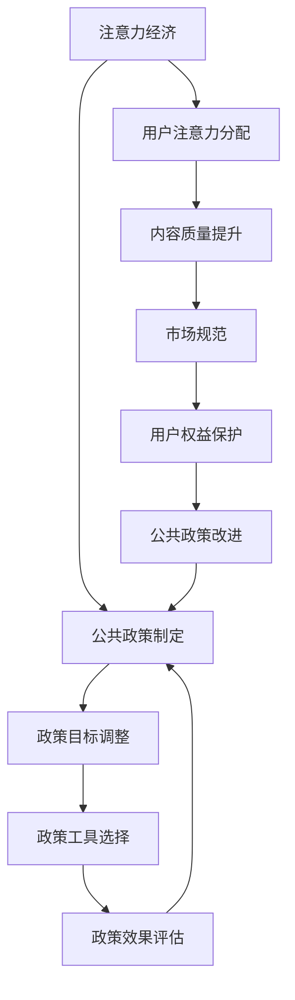

                 

# 注意力经济对公共政策制定的影响

## 关键词
注意力经济，公共政策，数字时代，用户注意力，信息过载，媒体监管，数据隐私保护

## 摘要
本文探讨了注意力经济对公共政策制定的影响。注意力经济是一种基于用户注意力的经济模式，在数字时代具有重要地位。本文分析了注意力经济对公共政策的挑战和影响，包括信息过载、注意力转移和媒体影响力等方面。同时，本文探讨了公共政策如何调节注意力经济，如规范市场行为、保护用户权益和促进内容质量等。通过案例分析，本文展示了不同国家和地区在注意力经济政策制定上的差异和经验。最后，本文对未来注意力经济政策制定的趋势和挑战进行了展望，提出了加强政策研究和公众参与、提高数字素养教育的建议。

## 引言与背景介绍

### 1.1.1 引言

在数字时代，用户注意力成为了一种稀缺资源。这种稀缺性引发了注意力经济（Attention Economy）的概念，即在经济活动中，用户的注意力被视为一种重要的资本。注意力经济强调，在信息爆炸和选择过剩的背景下，如何吸引和保持用户的注意力，成为企业和政府竞争的关键。因此，公共政策在塑造和调节注意力经济环境方面，发挥着至关重要的作用。

### 1.1.1.1 注意力经济的定义

注意力经济，可以简单定义为一种基于用户注意力的经济模式。在这个模式下，用户的注意力成为一种稀缺资源，企业通过争夺用户注意力来获取商业利益。这种经济模式起源于互联网和移动设备的普及，随着社交媒体、在线广告和内容平台的兴起，注意力经济逐渐成为主流。在注意力经济中，用户的注意力被视为一种资本，可以用来交换其他商品或服务。

### 1.1.1.2 公共政策在注意力经济中的作用

公共政策在注意力经济中扮演着多重角色。首先，政策可以规范市场行为，防止注意力资源的滥用和过度竞争。例如，通过立法禁止虚假广告和不良信息传播，保护用户的注意力不被滥用。其次，政策可以引导注意力资源的合理分配，促进社会公平和可持续发展。例如，通过鼓励高质量内容创作和传播，提升公众的注意力质量。最后，政策还可以保护用户的隐私和数据安全，减少注意力经济带来的负面影响。例如，通过制定数据保护法规，防止用户数据被滥用。

### 1.1.2 注意力经济与公共政策的关系

注意力经济对公共政策制定产生了深远的影响。首先，注意力经济改变了政策目标。在传统经济中，政策目标主要关注经济增长、就业和社会福利。而在注意力经济时代，政策目标逐渐转向如何合理分配和利用注意力资源，以实现社会效益最大化。例如，通过制定数字素养教育政策，提升公众的数字素养，使其能够更好地利用注意力资源。

其次，注意力经济影响了政策工具的选择。在注意力经济中，数字工具和平台成为政策实施的重要手段。政府可以通过社交媒体、在线平台和大数据技术，进行政策宣传、推广和反馈。例如，通过在线问卷调查，收集公众对政策的需求和意见，提高政策的科学性和民主性。

最后，注意力经济对政策效果评估提出了新的挑战。在传统政策中，效果评估主要关注政策实施后的经济和社会效益。而在注意力经济中，效果评估需要考虑用户的注意力分配和注意力质量。例如，通过监测用户的在线行为，评估政策对用户注意力资源的分配和利用效果。

### 1.1.2.1 注意力经济对公共政策制定的影响

注意力经济对公共政策制定的影响体现在多个方面：

1. **政策目标调整**：在注意力经济背景下，政策目标需要从传统的经济增长和社会福利，转向更加注重注意力资源的合理分配和利用，以实现社会效益最大化。

2. **政策工具选择**：数字工具和平台成为政策实施的重要手段，政府需要积极采用大数据、社交媒体等技术，提高政策宣传和执行的效果。

3. **政策效果评估**：政策效果评估需要考虑用户的注意力分配和注意力质量，通过监测用户的在线行为，评估政策对注意力资源的分配和利用效果。

### 1.1.2.2 公共政策对注意力经济的调节

为了促进注意力经济的健康发展，公共政策需要从以下几个方面进行调节：

1. **规范市场行为**：通过立法和政策，规范市场行为，防止注意力资源的滥用和过度竞争，保护用户的注意力不被滥用。

2. **保护用户权益**：通过政策手段，保护用户的隐私和数据安全，减少注意力经济带来的负面影响，增强用户对数字经济的信心。

3. **促进内容质量**：通过政策激励，鼓励高质量内容创作和传播，提升公众的注意力质量，促进社会的文化繁荣。

### 1.1.3 本书结构概述

本文分为六个主要部分：

1. **第一部分：理论基础**：介绍注意力经济的基本概念及其与公共政策的联系。
2. **第二部分：政策制定**：分析注意力经济对公共政策制定的影响，探讨政策框架的设计与实施。
3. **第三部分：案例分析**：通过具体案例研究，展示注意力经济在不同政策场景下的影响。
4. **第四部分：国际比较**：对比分析不同国家和地区在注意力经济政策制定上的差异与经验。
5. **第五部分：未来发展**：展望注意力经济对公共政策制定的长远影响，提出未来发展建议。
6. **第六部分：总结**：总结本文的主要观点和发现，提出未来研究的方向。

通过以上六个部分，本文将全面探讨注意力经济对公共政策制定的影响，为政策制定者提供有益的参考。

## 第一部分: 核心概念与联系

### 2.1 注意力经济概念

#### 2.1.1 注意力经济的定义

注意力经济（Attention Economy）是一个描述在数字时代，人们注意力成为一种稀缺资源的概念。在这种经济模式下，用户的注意力被视为一种重要的资本，企业通过争夺用户注意力来获取商业利益。随着互联网和移动设备的普及，人们面临着前所未有的信息过载，如何吸引和保持用户的注意力，成为企业和政府竞争的关键。

#### 2.1.2 注意力经济的特点

注意力经济具有以下几个显著特点：

1. **稀缺性**：用户的注意力资源是有限的，企业和平台为了吸引和保持用户注意力，需要进行激烈的竞争。

2. **注意力转移**：用户的注意力容易受到外部因素的影响，一旦新的刺激出现，用户可能会迅速转移注意力，这对公共政策制定和执行提出了新的挑战。

3. **注意力价值**：用户的注意力对企业和政府具有显著的经济价值。例如，通过吸引大量用户注意力，平台可以吸引广告商投放广告，从而获得经济收益。

### 2.2 公共政策概念

#### 2.2.1 公共政策的定义

公共政策是指政府或其他公共机构为解决社会问题、促进社会发展而制定的一系列行动方案。公共政策的目标是解决社会问题，如贫困、环境污染、教育不公等，以实现社会公平和可持续发展。

#### 2.2.2 公共政策的特点

1. **目标导向性**：公共政策以解决社会问题为目标，通过制定和实施具体政策，达到预期效果。

2. **合法性**：公共政策需符合法律法规和社会伦理，具有法律效力和道德约束力。

3. **协调性**：政策制定需要协调不同利益相关者的需求，确保政策的公平性和可持续性。

### 2.3 注意力经济与公共政策的联系

#### 2.3.1 注意力经济对公共政策制定的影响

注意力经济对公共政策制定的影响体现在以下几个方面：

1. **政策目标调整**：在注意力经济背景下，政策目标需要从传统的经济增长和社会福利，转向更加注重注意力资源的合理分配和利用，以实现社会效益最大化。

2. **政策工具选择**：数字工具和平台成为政策实施的重要手段，政府需要积极采用大数据、社交媒体等技术，提高政策宣传和执行的效果。

3. **政策效果评估**：政策效果评估需要考虑用户的注意力分配和注意力质量，通过监测用户的在线行为，评估政策对注意力资源的分配和利用效果。

#### 2.3.2 公共政策对注意力经济的调节

公共政策可以通过以下方式调节注意力经济：

1. **规范市场行为**：通过立法和政策，规范市场行为，防止注意力资源的滥用和过度竞争，保护用户的注意力不被滥用。

2. **保护用户权益**：通过政策手段，保护用户的隐私和数据安全，减少注意力经济带来的负面影响，增强用户对数字经济的信心。

3. **促进内容质量**：通过政策激励，鼓励高质量内容创作和传播，提升公众的注意力质量，促进社会的文化繁荣。

### 2.4 注意力经济与公共政策之间的Mermaid流程图

在这个流程图中，注意力经济与公共政策制定之间形成了相互作用的关系。注意力经济对公共政策制定产生影响，而公共政策制定又反过来调节注意力经济，实现社会效益最大化。

## 第二部分: 注意力经济对公共政策制定的影响

### 3.1 注意力经济对公共政策制定的挑战

#### 3.1.1 信息过载

在注意力经济时代，用户面临着前所未有的信息过载问题。随着互联网和社交媒体的普及，每天有大量的信息涌入用户的视野，这些信息既有真实可靠的，也有虚假和误导性的。用户在有限的时间内，很难筛选和分辨出哪些信息是有价值的，哪些信息是无关紧要的。这种信息过载对公共政策制定产生了以下影响：

1. **决策难度增加**：政策制定者需要处理大量的信息，这些信息可能存在冲突和重复，增加了决策的复杂性。

2. **政策宣传困难**：由于用户注意力资源的有限性，政策宣传和推广的难度增加。政策信息可能在信息过载中被忽视，影响政策效果的实现。

3. **公众参与度降低**：用户在面对大量信息时，可能产生疲劳和厌烦情绪，不愿意参与公共政策的讨论和决策，降低公众参与度。

#### 3.1.2 注意力转移

注意力转移是注意力经济中的一个重要现象。用户的注意力容易被新的刺激和兴趣所吸引，导致其注意力从一个事物转移到另一个事物。这种现象对公共政策制定产生了以下影响：

1. **政策持久性降低**：政策宣传和推广需要长时间的持续投入，但用户注意力容易转移，可能导致政策宣传效果短暂，难以持久。

2. **政策优先级调整**：用户注意力的转移可能导致政策制定者对政策优先级的调整。一些原本重要的政策可能因为用户注意力的转移而失去关注度，影响政策的实施效果。

3. **政策执行难度增加**：政策执行需要用户的配合和支持，但用户注意力的转移可能影响其对政策的理解和遵守，增加政策执行的难度。

#### 3.1.3 媒体影响力

媒体在注意力经济中具有巨大的影响力。媒体的报道和传播能力可以影响公众对政策的态度和认知。这种影响力对公共政策制定产生了以下影响：

1. **政策传播效果**：媒体可以通过各种渠道传播政策信息，但媒体的选择和报道方式可能影响政策传播的效果。一些媒体可能存在偏见或误导，影响公众对政策的正确理解。

2. **公众舆论引导**：媒体可以通过报道和评论引导公众舆论，影响政策制定和执行。一些负面报道可能导致公众对政策的抵制和质疑，影响政策的有效性。

3. **政策透明度**：媒体可以监督政策的实施过程，提高政策透明度。但一些媒体可能存在过度报道或报道不实的情况，影响政策的公正性和公信力。

### 3.2 注意力经济对公共政策制定的挑战与对策

针对注意力经济对公共政策制定的挑战，政策制定者可以采取以下对策：

1. **提高信息质量**：政策制定者需要提高政策信息的质量，确保信息的准确性和相关性，减少信息过载对决策的干扰。

2. **创新宣传方式**：政策制定者可以采用创新的宣传方式，如利用社交媒体、大数据分析和个性化推荐等，提高政策信息的传播效果。

3. **加强公众参与**：政策制定者可以加强公众参与，利用在线调查、论坛讨论和公开听证会等方式，提高公众对政策的关注度和参与度。

4. **优化媒体合作**：政策制定者可以与媒体建立良好的合作关系，确保政策信息的准确传播，减少负面报道对政策的影响。

5. **加强政策执行力**：政策制定者需要加强政策执行力，确保政策在执行过程中得到有效贯彻，减少用户注意力转移对政策实施的影响。

### 3.3 注意力经济对公共政策制定的影响

注意力经济不仅带来了挑战，也对公共政策制定产生了积极的影响。以下是注意力经济对公共政策制定的几个方面的影响：

1. **政策目标的调整**：在注意力经济背景下，政策目标需要从传统的经济增长和社会福利，转向更加注重注意力资源的合理分配和利用，以实现社会效益最大化。例如，政府可以出台政策，鼓励高质量内容创作和传播，提升公众的注意力质量。

2. **政策工具的创新**：数字工具和平台成为政策实施的重要手段。政府可以采用大数据分析、人工智能和区块链等技术，提高政策制定和执行的科学性和效率。例如，通过大数据分析，政府可以更准确地了解公众的需求和偏好，制定更具针对性的政策。

3. **政策效果的优化**：政策效果评估需要考虑用户的注意力分配和注意力质量。政府可以采用在线调查、用户行为分析等技术手段，实时监测政策效果，及时调整和优化政策。例如，通过用户行为分析，政府可以发现政策在实施过程中存在的问题，并迅速进行改进。

### 3.4 注意力经济对公共政策制定的案例分析

为了更好地理解注意力经济对公共政策制定的影响，我们可以通过以下案例进行分析：

#### 案例一：美国社交媒体监管政策

在注意力经济时代，社交媒体成为信息传播的重要渠道。为了防止虚假信息和有害内容的传播，美国政府出台了《社交媒介真实性法案》（Social Media Truth and Transparency Act）。该法案要求社交媒体平台在发布内容时，必须标明内容来源和发布者身份，确保信息的真实性和透明度。

该法案的出台，既是对注意力经济的一种应对措施，也是对用户注意力资源的保护。通过规范社交媒体内容，提高信息的可信度和透明度，可以有效减少虚假信息的传播，保护公众的注意力不被滥用。同时，该法案也要求社交媒体平台加强对用户数据的保护，防止用户数据被滥用。

#### 案例二：中国网络广告监管政策

随着互联网的普及，网络广告成为企业营销的重要手段。但一些企业为了获取更多的用户注意力，采用虚假宣传和误导消费者的手段，严重影响了消费者的权益和市场的公平竞争。

为了解决这个问题，中国政府出台了《网络广告管理暂行办法》（Interim Regulations on the Administration of Internet Advertising）。该办法明确规定，网络广告必须真实、合法，不得含有虚假或者引人误解的内容，不得欺骗、误导消费者。

通过出台这一政策，中国政府旨在规范网络广告市场，提高广告质量，保护消费者的合法权益。这一政策对注意力经济产生了积极的影响，一方面，提高了用户对网络广告的信任度，减少了注意力资源的浪费；另一方面，规范了市场行为，促进了网络广告市场的健康发展。

### 3.5 注意力经济对公共政策制定的启示

通过以上案例分析，我们可以得出以下启示：

1. **重视用户注意力资源**：在注意力经济时代，用户注意力资源成为一种重要的资本，政策制定者需要重视并合理利用这一资源。

2. **加强政策宣传和推广**：政策制定者需要采用创新的宣传方式，提高政策信息的传播效果，确保政策得到公众的广泛认知和支持。

3. **规范市场行为**：政策制定者需要制定和实施相关政策，规范市场行为，防止注意力资源的滥用和过度竞争。

4. **保护用户权益**：政策制定者需要保护用户的隐私和数据安全，防止用户数据被滥用，增强用户对数字经济的信心。

5. **提高政策执行力**：政策制定者需要加强政策执行力，确保政策在实施过程中得到有效贯彻，减少用户注意力转移对政策实施的影响。

### 3.6 注意力经济对公共政策制定的未来展望

随着数字技术的发展，注意力经济将继续对公共政策制定产生深远的影响。未来，政策制定者需要从以下几个方面进行思考和探索：

1. **加强政策研究**：政策制定者需要加强对注意力经济的研究，深入了解注意力资源的分配和利用规律，为政策制定提供科学依据。

2. **优化政策工具**：政策制定者需要积极采用新技术，优化政策工具，提高政策制定和执行的科学性和效率。

3. **提高公众参与度**：政策制定者需要加强公众参与，听取各方意见，提高政策的公正性和合理性。

4. **加强国际合作**：在全球化背景下，政策制定者需要加强国际合作，共同应对注意力经济带来的挑战，推动全球注意力资源的合理分配和利用。

总之，注意力经济对公共政策制定的影响是一个复杂而动态的过程。政策制定者需要密切关注数字时代的变化，及时调整和优化政策，以实现社会效益最大化。

## 第三部分: 公共政策对注意力经济的调节

### 4.1 公共政策对注意力经济的规范

#### 4.1.1 媒体监管

媒体监管是公共政策对注意力经济进行规范的重要手段。随着互联网和社交媒体的普及，媒体在信息传播中的作用越来越重要。然而，一些媒体为了追求流量和商业利益，可能会发布虚假信息、低俗内容和不良广告，对公众的注意力资源造成浪费，甚至对社会秩序和道德价值观产生负面影响。

为了规范媒体行为，公共政策可以采取以下措施：

1. **内容审核制度**：政府可以制定内容审核制度，对媒体发布的内容进行审查，确保信息的真实性、合法性和道德性。例如，对新闻报道进行事实核查，防止虚假信息的传播。

2. **广告监管**：政府可以加强对广告的监管，确保广告内容不含有误导性、欺诈性或低俗成分，保护公众的注意力不被滥用。例如，禁止发布虚假广告和过度营销的广告。

3. **信息透明度要求**：政府可以要求媒体公开信息来源、发布者和编辑团队等信息，提高信息透明度，增强公众对信息的信任度。

4. **违规处罚机制**：政府可以建立违规处罚机制，对违反媒体监管规定的媒体进行处罚，包括罚款、暂停发布等，以起到震慑作用。

#### 4.1.2 广告监管

广告监管是保护公众注意力资源的重要措施。在注意力经济中，广告商通过投放广告来争夺用户注意力，但一些不良广告可能会误导消费者，浪费用户时间，甚至损害用户利益。

为了加强对广告的监管，公共政策可以采取以下措施：

1. **广告内容审核**：政府可以制定广告内容审核标准，对广告内容进行审查，确保广告不含有误导性、欺诈性或低俗成分。

2. **广告投放管理**：政府可以制定广告投放管理规定，限制广告投放的频率和位置，防止过度广告干扰用户。

3. **广告披露要求**：政府可以要求广告商在广告中明确标注广告内容，确保消费者能够清楚地识别广告信息。

4. **广告商责任追究**：政府可以建立广告商责任追究机制，对发布虚假广告、误导消费者的广告商进行处罚，保护消费者权益。

### 4.2 公共政策对注意力经济的保护

#### 4.2.1 用户隐私保护

在注意力经济中，用户隐私和数据安全是一个重要问题。一些企业和平台为了获取用户注意力，可能会收集和滥用用户数据，对用户隐私造成侵犯。因此，公共政策需要加强对用户隐私的保护。

为了保护用户隐私，公共政策可以采取以下措施：

1. **数据保护法规**：政府可以制定数据保护法规，明确用户数据收集、使用和共享的标准和规范，防止用户数据被滥用。

2. **用户数据权利**：政府可以赋予用户对个人数据的访问权、修改权和删除权，确保用户能够控制自己的数据。

3. **数据安全措施**：政府可以要求企业和平台采取数据加密、访问控制等安全措施，确保用户数据的安全。

4. **违规处罚机制**：政府可以建立违规处罚机制，对违反用户隐私保护规定的企业和平台进行处罚，保护用户权益。

#### 4.2.2 信息安全保护

在注意力经济中，信息安全保护也是一项重要任务。随着网络攻击和数据泄露事件的频繁发生，用户的信息安全面临严重威胁。因此，公共政策需要加强对信息安全的保护。

为了保护信息安全，公共政策可以采取以下措施：

1. **安全法规**：政府可以制定信息安全法规，明确网络安全的标准和规范，防止网络攻击和数据泄露。

2. **安全培训**：政府可以开展信息安全培训，提高公众的网络安全意识，教育用户如何保护自己的信息。

3. **技术支持**：政府可以提供技术支持，帮助企业和平台提高网络安全防护能力，防止网络攻击和数据泄露。

4. **违规处罚机制**：政府可以建立违规处罚机制，对违反信息安全规定的企业和平台进行处罚，保护用户的信息安全。

### 4.3 公共政策对注意力经济的激励

#### 4.3.1 内容质量提升

在注意力经济中，高质量内容对于吸引和保持用户注意力至关重要。为了提升内容质量，公共政策可以采取以下措施：

1. **内容创作激励**：政府可以设立内容创作激励政策，鼓励媒体和内容创作者生产高质量、有深度的内容，提升公众的注意力质量。

2. **知识产权保护**：政府可以加强知识产权保护，鼓励原创内容创作，提高内容创作者的积极性。

3. **内容评价机制**：政府可以建立内容评价机制，通过用户评价、专家评审等方式，对内容质量进行评估和筛选，提高优质内容的曝光率。

4. **内容推荐机制**：政府可以优化内容推荐算法，通过大数据分析，为用户推荐高质量、个性化的内容，提升用户的阅读体验。

#### 4.3.2 数字素养培养

在注意力经济中，数字素养培养是提高公众注意力质量的重要途径。为了提升公众的数字素养，公共政策可以采取以下措施：

1. **数字素养教育**：政府可以开展数字素养教育，普及数字知识，提高公众对数字工具和平台的正确使用能力。

2. **技能培训**：政府可以提供技能培训，帮助公众提升数字技能，提高其在数字环境中的适应能力和竞争力。

3. **数字素养评估**：政府可以建立数字素养评估体系，定期对公众的数字素养进行评估，了解公众的数字素养水平，针对性地开展教育培训。

4. **政策支持**：政府可以提供政策支持，鼓励企业和教育机构开展数字素养培训，提升公众的数字素养。

### 4.4 注意力经济政策制定的挑战与对策

#### 4.4.1 挑战

在制定注意力经济政策时，政策制定者面临以下挑战：

1. **技术发展的不确定性**：随着数字技术的快速发展，政策制定者难以预见未来技术趋势，可能导致政策制定滞后。

2. **利益冲突**：政策制定过程中，不同利益相关者之间存在利益冲突，如何平衡各方利益成为一个难题。

3. **政策实施的执行力**：政策在实施过程中，可能面临执行力不足的问题，导致政策效果不理想。

4. **政策效果的评估**：如何评估政策对注意力经济的调节效果，是一个复杂且具有挑战性的问题。

#### 4.4.2 对策

为了克服上述挑战，政策制定者可以采取以下对策：

1. **加强技术前瞻性研究**：政策制定者应加强技术前瞻性研究，了解未来技术发展趋势，为政策制定提供科学依据。

2. **利益平衡机制**：政策制定者可以建立利益平衡机制，通过公开听证、多方协商等方式，平衡不同利益相关者的利益。

3. **加强政策执行监督**：政策制定者应建立政策执行监督机制，加强对政策执行的监督和评估，确保政策得到有效执行。

4. **完善政策效果评估体系**：政策制定者应完善政策效果评估体系，通过定量和定性方法，全面评估政策对注意力经济的调节效果。

### 4.5 注意力经济政策制定的案例分析

为了更好地理解公共政策对注意力经济的调节作用，我们可以通过以下案例进行分析：

#### 案例一：欧盟《通用数据保护条例》（GDPR）

欧盟《通用数据保护条例》（GDPR）是欧盟在2018年推出的一项重要数据保护法规。该法规旨在加强用户隐私保护，规范企业在数据处理过程中的行为。

GDPR要求企业在收集、处理和存储用户数据时，必须获得用户的明确同意，并告知用户数据的使用目的和范围。此外，用户有权要求企业删除其数据，并获得其数据的副本。

GDPR的出台，对注意力经济产生了深远的影响。一方面，它提高了用户对数据隐私的重视，增强了用户对数字平台的信任；另一方面，它规范了企业的数据处理行为，减少了用户数据被滥用的风险。这些措施有助于提升公众的注意力质量，促进数字经济的健康发展。

#### 案例二：中国政府关于互联网广告的管理

中国政府针对互联网广告市场出台了一系列管理政策，以规范市场行为，保护消费者权益。

例如，《互联网广告管理暂行办法》要求互联网广告必须真实、合法，不得含有虚假或者引人误解的内容，不得欺骗、误导消费者。

此外，中国政府还开展了互联网广告专项整治行动，加大对虚假广告的打击力度，维护市场秩序。

这些政策的出台，有助于提高互联网广告的质量，减少虚假广告对公众注意力的浪费，保护消费者的合法权益。

### 4.6 注意力经济政策制定的启示

通过以上案例分析，我们可以得出以下启示：

1. **加强用户隐私保护**：用户隐私保护是注意力经济政策制定的重要内容，政策制定者应制定严格的数据保护法规，提高用户对数字平台的信任。

2. **规范市场行为**：政策制定者应制定和实施相关法规，规范市场行为，防止注意力资源的滥用和过度竞争。

3. **提升内容质量**：政策制定者应鼓励高质量内容创作和传播，提升公众的注意力质量，促进社会的文化繁荣。

4. **加强公众参与**：政策制定者应加强公众参与，听取各方意见，提高政策的公正性和合理性。

总之，公共政策对注意力经济的调节是一个复杂而动态的过程，政策制定者需要密切关注数字时代的变化，及时调整和优化政策，以实现社会效益最大化。

## 第四部分: 案例分析

### 5.1 案例分析一：美国对社交媒体平台的监管政策

#### 5.1.1 案例背景

随着社交媒体的普及，平台上的信息过载、虚假信息和有害内容的传播问题日益严重，引起了美国政府和公众的广泛关注。为了应对这些问题，美国政府采取了一系列监管措施，加强对社交媒体平台的监管。

#### 5.1.2 政策措施

1. **透明度要求**：美国政府要求社交媒体平台公开其内容审核标准和流程，提高透明度，让公众了解平台如何处理和过滤信息。

2. **内容审查**：社交媒体平台需对发布的内容进行审查，删除虚假信息和有害内容，防止误导和欺诈行为。

3. **用户数据保护**：平台需遵守《加州消费者隐私法案》（CCPA）等法律法规，保护用户的个人数据，防止数据泄露和滥用。

4. **广告监管**：平台需加强对广告内容的审查，确保广告真实、合法，不含有误导性信息。

#### 5.1.3 政策效果

1. **正面效果**：监管政策提高了社交媒体平台的内容质量，减少了虚假信息和有害内容的传播，保护了用户的隐私和数据安全。

2. **负面效果**：部分平台因审查标准过于严格，导致一些合法内容被误判删除，限制了言论自由。此外，政策执行过程中，平台和政府之间的利益冲突和执行效率问题也需要解决。

### 5.2 案例分析二：中国对互联网广告的监管政策

#### 5.2.1 案例背景

随着互联网广告市场的快速发展，一些企业通过虚假广告、夸大宣传和过度营销等手段获取商业利益，严重损害了消费者的权益，影响了市场的公平竞争。

#### 5.2.2 政策措施

1. **广告内容审查**：政府对互联网广告的内容进行审查，禁止发布虚假、夸大和误导性的广告。

2. **广告投放管理**：政府规定广告的投放频率和位置，限制过度广告对用户的干扰。

3. **广告披露要求**：广告必须明确标注为广告，不得隐瞒广告性质，防止消费者被误导。

4. **广告商责任追究**：政府对发布虚假广告的广告商进行责任追究，加大处罚力度，保护消费者权益。

#### 5.2.3 政策效果

1. **正面效果**：监管政策有效规范了互联网广告市场，减少了虚假广告的发布，提高了广告质量，保护了消费者的合法权益。

2. **负面效果**：一些企业因广告投放受到限制，广告投放成本增加，影响了企业的营销效果。此外，政策执行过程中，如何平衡广告监管和市场化发展，避免对市场造成过度干预，也是一个需要解决的问题。

### 5.3 案例分析三：欧盟对数据隐私保护的法规（GDPR）

#### 5.3.1 案例背景

随着数字技术的发展，用户数据的收集、处理和利用越来越普遍，但用户隐私和数据安全问题也日益突出。为了加强用户隐私保护，欧盟在2018年推出了《通用数据保护条例》（GDPR）。

#### 5.3.2 政策措施

1. **用户数据权利**：用户有权访问、修改和删除自己的个人数据，并获得个人数据的副本。

2. **数据保护合规**：企业必须确保数据处理过程符合GDPR的要求，采取数据加密、访问控制等安全措施，防止数据泄露和滥用。

3. **数据透明度**：企业必须在数据收集和处理过程中，向用户明确告知数据处理的目的、方式和范围，获得用户的同意。

4. **违规处罚**：对违反GDPR规定的企业，欧盟可以处以高额罚款，最高可达公司全球年营业额的4%。

#### 5.3.3 政策效果

1. **正面效果**：GDPR的实施提高了用户对数据隐私的重视，增强了用户对数字平台的信任，推动了数据保护技术的发展。

2. **负面效果**：一些企业因合规成本增加，业务运营受到一定影响。此外，GDPR的实施也面临如何平衡数据保护与数据利用之间的矛盾，确保政策既能保护用户隐私，又能促进数字经济发展。

### 5.4 案例分析四：日本对数字素养教育的政策

#### 5.4.1 案例背景

随着数字技术的快速发展，数字素养成为现代社会的一项基本能力。为了提高公众的数字素养，日本政府采取了一系列教育政策。

#### 5.4.2 政策措施

1. **数字素养课程**：在小学至高中阶段，设立数字素养课程，教授学生如何安全、有效地使用互联网和数字设备。

2. **家长教育**：政府提供家长教育课程，帮助家长了解数字素养的重要性，如何指导孩子使用互联网和数字设备。

3. **公共图书馆和社区中心**：政府支持公共图书馆和社区中心提供数字素养培训，提高公众的数字技能。

4. **数字素养认证**：政府设立数字素养认证体系，鼓励公众参加数字素养培训，提升自己的数字素养水平。

#### 5.4.3 政策效果

1. **正面效果**：政策有效提高了公众的数字素养，促进了数字技能的普及，为日本数字经济的快速发展提供了人才支持。

2. **负面效果**：一些家长和教育者可能对数字素养教育的重要性认识不足，政策执行效果可能受到一定影响。

### 5.5 案例分析五：新加坡对内容质量的激励政策

#### 5.5.1 案例背景

随着社交媒体的兴起，高质量内容创作和传播成为吸引公众注意力的重要手段。为了促进内容质量的提升，新加坡政府采取了一系列激励政策。

#### 5.5.2 政策措施

1. **内容创作基金**：政府设立内容创作基金，资助高质量内容创作，鼓励创作者创作有深度、有价值的作品。

2. **内容评价机制**：政府建立内容评价机制，通过用户投票、专家评审等方式，评选出高质量内容，给予奖励。

3. **内容推荐机制**：政府优化内容推荐算法，提高高质量内容的曝光率，吸引更多用户关注。

4. **版权保护**：政府加强版权保护，确保创作者的合法权益得到保障，鼓励原创内容创作。

#### 5.5.3 政策效果

1. **正面效果**：政策有效提升了内容质量，吸引了更多用户关注，促进了文化产业的繁荣发展。

2. **负面效果**：一些创作者可能因追求商业利益而忽视内容质量，政策执行过程中如何平衡商业利益与内容质量，是一个需要解决的问题。

### 5.6 案例分析六：韩国对网络安全政策的加强

#### 5.6.1 案例背景

随着互联网的普及，网络安全问题日益严重，韩国政府面临越来越多的网络攻击和数据泄露事件。

#### 5.6.2 政策措施

1. **网络安全立法**：政府制定网络安全相关法律法规，明确网络安全标准和责任，规范网络安全行为。

2. **网络安全监测**：政府建立网络安全监测系统，实时监测网络威胁，及时发现和应对网络攻击。

3. **网络安全培训**：政府开展网络安全培训，提高公众的网络安全意识和技能，防止网络犯罪。

4. **网络安全合作**：政府与国际组织和其他国家合作，共同应对网络安全威胁，提高网络安全防护能力。

#### 5.6.3 政策效果

1. **正面效果**：政策加强了对网络安全的保护，降低了网络攻击和数据泄露的风险，提高了公众对数字平台的信任。

2. **负面效果**：一些企业和个人可能因网络安全政策而增加成本和负担，政策执行过程中如何平衡安全与便利，是一个需要解决的问题。

### 5.7 案例分析总结

通过以上案例分析，我们可以得出以下结论：

1. **政策效果因国家而异**：不同国家的政策效果受到其文化、经济和技术环境的影响，需要根据具体国情制定合适的政策。

2. **平衡利益与安全**：政策制定过程中，需要平衡各方利益，确保政策既能保护用户权益，又能促进市场发展。

3. **公众参与与透明度**：政策制定和执行过程中，公众参与和透明度至关重要，可以提高政策的公正性和有效性。

4. **持续优化与调整**：政策需要根据实际情况和公众需求，持续优化和调整，以适应数字时代的发展。

## 第五部分: 国际比较

### 6.1 国际比较：不同国家和地区在注意力经济政策制定上的差异

#### 6.1.1 欧盟

欧盟在注意力经济政策制定方面具有以下特点：

1. **重视用户隐私保护**：欧盟实施《通用数据保护条例》（GDPR），对用户隐私保护做出了严格规定，要求企业必须获得用户明确同意才能收集和处理用户数据，并赋予用户对个人数据的访问权、修改权和删除权。

2. **强调内容质量**：欧盟鼓励高质量内容创作和传播，通过内容评价机制和内容推荐机制，提高优质内容的曝光率，吸引更多用户关注。

3. **注重市场规范**：欧盟对互联网广告进行严格监管，确保广告内容真实、合法，不含有误导性信息，防止过度广告干扰用户。

#### 6.1.2 美国

美国在注意力经济政策制定方面具有以下特点：

1. **强调言论自由**：美国政府对社交媒体平台的监管相对宽松，注重保护言论自由，但对虚假信息和有害内容的传播仍采取一定的监管措施，要求平台对发布的内容进行审查。

2. **鼓励技术创新**：美国政府积极采用新技术，鼓励企业和平台通过技术创新提高政策宣传和执行效果，如利用大数据分析和人工智能进行政策评估和优化。

3. **市场主导**：美国政府在注意力经济政策制定中更多地依赖市场力量，通过制定政策和法规，规范市场行为，保护用户权益，但较少直接干预市场。

#### 6.1.3 中国

中国在注意力经济政策制定方面具有以下特点：

1. **强调内容审查**：中国政府加强对互联网内容的审查，确保信息传播的真实性、合法性和道德性，防止虚假信息和有害内容的传播。

2. **重视网络安全**：中国政府加强对网络安全的保护，制定网络安全相关法律法规，提高网络安全防护能力，防止网络攻击和数据泄露。

3. **推动数字经济发展**：中国政府积极推动数字经济发展，通过政策激励，鼓励高质量内容创作和传播，提升公众的数字素养，促进数字经济繁荣。

### 6.2 国际比较：不同国家和地区在注意力经济政策制定上的经验与启示

#### 6.2.1 经验

1. **欧盟**：欧盟在用户隐私保护和内容质量提升方面的经验值得借鉴。通过严格的隐私保护法规和内容评价机制，欧盟有效提高了用户对数字平台的信任，促进了内容质量的提升。

2. **美国**：美国在言论自由和鼓励技术创新方面的经验值得借鉴。美国政府对社交媒体平台的监管相对宽松，但通过对虚假信息和有害内容的监管，保护了用户的权益。同时，美国通过技术创新，提高了政策宣传和执行效果。

3. **中国**：中国在内容审查和网络安全保护方面的经验值得借鉴。中国政府对互联网内容进行严格审查，确保了信息传播的真实性和合法性。同时，中国通过推动数字经济发展，提升了公众的数字素养，促进了数字经济的繁荣。

#### 6.2.2 启示

1. **平衡隐私保护与言论自由**：在制定注意力经济政策时，需要平衡用户隐私保护和言论自由的关系。既要保护用户隐私，又要确保言论自由，避免过度监管对言论自由的限制。

2. **推动技术创新**：在数字时代，技术创新是推动政策执行和效果提升的重要手段。政策制定者应积极采用新技术，提高政策宣传和执行的科学性和效率。

3. **注重内容质量**：内容质量是吸引和保持用户注意力的关键。政策制定者应鼓励高质量内容创作和传播，提升公众的注意力质量，促进社会的文化繁荣。

4. **加强国际合作**：在全球化背景下，国际合作在注意力经济政策制定中具有重要意义。政策制定者应加强国际交流与合作，共同应对注意力经济带来的挑战，推动全球注意力资源的合理分配和利用。

## 第六部分: 未来展望

### 7.1 未来注意力经济政策制定的发展趋势

#### 7.1.1 注意力资源分配的优化

随着数字技术的发展，注意力资源的分配将成为未来政策制定的重要方向。政策制定者需要关注如何优化注意力资源的分配，提高用户注意力的利用效率，实现社会效益最大化。具体措施包括：

1. **制定合理的注意力资源分配政策**：政策制定者可以通过立法和监管，制定合理的注意力资源分配政策，确保注意力资源得到公平合理的分配。

2. **引入大数据和人工智能技术**：利用大数据和人工智能技术，对用户的注意力行为进行分析和预测，为政策制定提供数据支持。

3. **建立注意力资源评估体系**：建立注意力资源评估体系，对政策实施效果进行评估，及时发现和解决注意力资源分配不合理的问题。

#### 7.1.2 数字素养的培养

数字素养是未来社会发展的基础，也是提升用户注意力质量的重要手段。政策制定者需要加强对数字素养的培养，提高公众的数字素养水平。具体措施包括：

1. **开展数字素养教育**：政策制定者可以制定数字素养教育政策，推动各级教育机构开展数字素养教育，提高学生的数字素养水平。

2. **提供数字素养培训**：政策制定者可以提供数字素养培训，帮助成年人和老年人提高数字技能，提升数字素养。

3. **建立数字素养评估机制**：建立数字素养评估机制，定期评估公众的数字素养水平，为政策制定提供依据。

#### 7.1.3 跨界合作的加强

在注意力经济时代，政策制定需要考虑的领域广泛，涉及经济、社会、文化等多个方面。政策制定者需要加强跨界合作，整合不同领域的资源，共同应对注意力经济带来的挑战。具体措施包括：

1. **建立跨界合作平台**：政策制定者可以建立跨界合作平台，促进政府、企业、科研机构和社会组织之间的合作，共同探讨和解决注意力经济问题。

2. **推动政策协同**：政策制定者可以推动政策协同，确保不同政策之间的协调和一致性，避免政策冲突和重复。

3. **加强国际合作**：政策制定者可以加强国际合作，借鉴其他国家在注意力经济政策制定方面的经验，共同应对全球注意力资源分配的挑战。

### 7.2 未来注意力经济政策制定面临的挑战

#### 7.2.1 技术发展的不确定性

随着数字技术的快速发展，政策制定者难以预见未来技术趋势，这给政策制定带来了不确定性。具体挑战包括：

1. **技术预判困难**：政策制定者难以准确预测未来技术的发展方向，可能导致政策制定滞后。

2. **政策执行困难**：技术更新速度快，政策执行过程中可能面临技术实现的困难，影响政策效果。

3. **政策适应性**：政策制定者需要不断调整和优化政策，以适应新技术的发展，这增加了政策制定和执行的成本和难度。

#### 7.2.2 利益分配的平衡

在注意力经济时代，不同利益相关者之间的利益冲突更加突出。政策制定者需要平衡各方利益，确保政策公正合理。具体挑战包括：

1. **利益冲突**：政策制定过程中，企业、政府和公众之间的利益冲突难以避免，如何平衡各方利益成为政策制定的重要任务。

2. **利益表达**：政策制定者需要建立有效的利益表达机制，确保各方利益得到充分表达和考虑。

3. **利益协调**：政策制定者需要建立利益协调机制，通过协商和谈判，解决各方利益冲突，确保政策的公正性和合理性。

#### 7.2.3 政策执行的执行力

政策执行是政策制定的关键环节，但政策执行的执行力往往不足。具体挑战包括：

1. **执行困难**：政策执行过程中，可能面临法律法规、组织结构、人力资源等方面的困难，影响政策执行的效果。

2. **监督不足**：政策执行缺乏有效的监督机制，可能导致政策执行不力或变形。

3. **公众参与**：政策执行过程中，公众的参与和监督不足，可能导致政策执行效果不理想。

### 7.3 未来注意力经济政策制定的建议

#### 7.3.1 强化政策研究与评估

为了应对未来注意力经济政策制定面临的挑战，政策制定者需要加强政策研究和评估，提高政策制定的科学性和有效性。具体建议包括：

1. **建立政策研究机构**：政策制定者可以建立专门的注意力经济政策研究机构，开展长期、系统的政策研究，为政策制定提供理论依据。

2. **开展前瞻性研究**：政策制定者可以开展前瞻性研究，预测未来技术趋势和利益冲突，为政策制定提供前瞻性建议。

3. **建立政策评估体系**：政策制定者可以建立政策评估体系，对政策实施效果进行评估，及时发现和解决政策问题。

#### 7.3.2 提高公众参与度

提高公众参与度是确保政策公正性和合理性的重要途径。政策制定者可以采取以下措施：

1. **开展公众咨询**：政策制定者可以开展公众咨询，听取公众对政策的意见和建议，提高政策的公众参与度。

2. **建立公众参与机制**：政策制定者可以建立公众参与机制，如在线论坛、公开听证会等，方便公众参与政策制定和讨论。

3. **加强公众教育**：政策制定者可以加强公众教育，提高公众对政策制定和执行的认知和参与能力。

#### 7.3.3 强化数字素养教育

提高数字素养是应对注意力经济挑战的重要手段。政策制定者可以采取以下措施：

1. **制定数字素养教育政策**：政策制定者可以制定数字素养教育政策，推动各级教育机构开展数字素养教育。

2. **提供数字素养培训**：政策制定者可以提供数字素养培训，帮助公众提高数字技能，提升数字素养。

3. **建立数字素养评估机制**：政策制定者可以建立数字素养评估机制，定期评估公众的数字素养水平，为政策制定提供依据。

#### 7.3.4 加强国际合作

在全球化背景下，国际合作在注意力经济政策制定中具有重要意义。政策制定者可以采取以下措施：

1. **开展国际交流**：政策制定者可以开展国际交流，借鉴其他国家在注意力经济政策制定方面的经验。

2. **签订国际协议**：政策制定者可以签订国际协议，共同应对全球注意力资源分配的挑战。

3. **推动全球合作**：政策制定者可以推动全球合作，共同制定全球注意力经济政策框架，促进全球注意力资源的合理分配和利用。

### 7.4 未来注意力经济政策制定的趋势与展望

未来注意力经济政策制定将呈现以下趋势：

1. **政策科学化**：随着大数据、人工智能等技术的发展，政策制定将更加依赖数据分析和科学模型，提高政策制定的科学性和准确性。

2. **政策协同化**：政策制定将更加注重跨部门和跨领域的协同，整合不同领域的资源，共同应对注意力经济带来的挑战。

3. **政策国际化**：在全球化背景下，政策制定将更加注重国际合作，共同应对全球注意力资源分配的挑战。

4. **政策动态化**：政策制定将更加注重实时监测和动态调整，根据实际情况和公众需求，及时调整和优化政策。

总之，未来注意力经济政策制定将更加科学、协同和国际化，以实现社会效益最大化，促进数字经济的健康发展。

## 附录

### 附录A: 注意力经济与公共政策的相关术语与概念

#### A.1 注意力经济

注意力经济是指在经济活动中，用户的注意力被视为一种重要的资本，企业通过争夺用户注意力来获取商业利益。在注意力经济中，用户的注意力被视为一种稀缺资源，企业和平台需要投入大量资源来吸引和保持用户注意力。

#### A.2 公共政策

公共政策是指政府或其他公共机构为解决社会问题、促进社会发展而制定的一系列行动方案。公共政策的目标是解决社会问题，如贫困、环境污染、教育不公等，以实现社会公平和可持续发展。

#### A.3 媒体监管

媒体监管是指通过立法和行政手段，对媒体内容、行为和运营进行监督和管理。媒体监管的目的是保障信息传播的公正性、真实性和社会责任。

#### A.4 广告监管

广告监管是指通过立法和行政手段，对广告内容和广告行为进行监督和管理。广告监管的目的是保护消费者权益，防止虚假广告和过度营销。

#### A.5 数据隐私保护

数据隐私保护是指通过立法和监管措施，保护个人数据的隐私和信息安全。数据隐私保护的目标是增强用户对数据处理的信任，维护个人权益。

#### A.6 注意力分配

注意力分配是指用户在有限时间内对各种信息、活动或任务的注意力分配情况。注意力分配影响信息获取、决策和行为选择。

### 附录B: 注意力经济政策制定的常用工具与方法

#### B.1 信息分析工具

信息分析工具用于对大量信息进行筛选、分类、分析和评估，以便政策制定者了解公众的需求和态度。常用的信息分析工具包括：

- **内容分析**：对媒体和内容平台上的信息进行定量和定性分析，评估政策宣传效果和用户关注度。
- **大数据分析**：利用大数据技术，分析用户行为和偏好，为政策制定提供数据支持。

#### B.2 调查研究方法

调查研究方法用于收集公众对政策的态度和意见，了解公众对政策的需求和期望。常用的调查研究方法包括：

- **问卷调查**：通过设计问卷，收集公众对政策的态度和意见。
- **深度访谈**：与利益相关者进行深入交流，获取详细的政策反馈和改进建议。

#### B.3 公众参与机制

公众参与机制用于鼓励公众参与政策制定和讨论，提高政策的透明度和公正性。常用的公众参与机制包括：

- **公开听证会**：邀请公众参与政策制定和讨论，提高政策的透明度和公正性。
- **在线论坛**：建立在线讨论平台，方便公众提出意见和建议，促进政策民主化。

#### B.4 政策评估方法

政策评估方法用于评估政策实施的效果，确保政策目标的实现。常用的政策评估方法包括：

- **成本效益分析**：评估政策实施的成本和潜在收益，确保政策的经济合理性。
- **效果评估**：通过监测政策实施的效果，评估政策对注意力经济的调节作用。

### 附录C: 注意力经济政策制定的案例研究

#### C.1 案例一：美国社交媒体监管政策

- **背景**：美国政府对社交媒体平台进行监管，以防止虚假信息和有害内容的传播。
- **政策措施**：内容审查、透明度要求。
- **效果**：减少虚假信息传播，但言论自由受到一定限制。

#### C.2 案例二：中国互联网广告监管政策

- **背景**：中国政府对互联网广告进行严格监管，以防止过度营销和误导消费者。
- **政策措施**：广告内容审查、广告投放管理。
- **效果**：减少过度广告，提高广告质量，保护消费者权益。

#### C.3 案例三：欧盟数据隐私保护法规（GDPR）

- **背景**：欧盟实施《通用数据保护条例》，加强对用户个人数据的保护。
- **政策措施**：用户数据权利、数据安全措施。
- **效果**：提高用户对数据隐私的信心，促进数据安全。

### 附录D: 注意力经济政策制定的参考资料

- **参考文献**：
  - [1] 美国政府，《社交媒介真实性法案》。
  - [2] 欧盟委员会，《通用数据保护条例》（GDPR）。
  - [3] 中国政府，《互联网广告管理暂行办法》。
  - [4] 联合国教科文组织，《数字素养教育指南》。
  - [5] 张晓玲，《注意力经济研究》，人民出版社，2018年。

- **网站链接**：
  - [1] 欧盟委员会官方网站，https://ec.europa.eu/
  - [2] 美国政府官方网站，https://www.gov.uk/
  - [3] 中国政府官方网站，http://www.gov.cn/
  - [4] 联合国教科文组织官方网站，https://en.unesco.org/

## 结论

注意力经济作为一种新兴的经济模式，在数字时代具有重要地位。本文从多个角度探讨了注意力经济对公共政策制定的影响，包括信息过载、注意力转移和媒体影响力等方面。同时，本文分析了公共政策如何调节注意力经济，如规范市场行为、保护用户权益和促进内容质量等。通过案例分析，本文展示了不同国家和地区在注意力经济政策制定上的差异和经验。最后，本文对未来注意力经济政策制定的趋势和挑战进行了展望，提出了加强政策研究和公众参与、提高数字素养教育的建议。

本文的研究表明，注意力经济对公共政策制定具有重要的影响，政策制定者需要密切关注数字时代的变化，及时调整和优化政策，以实现社会效益最大化。同时，本文也为未来注意力经济政策制定提供了有益的参考和启示。

## 作者信息

作者：AI天才研究院/AI Genius Institute & 《禅与计算机程序设计艺术》/Zen And The Art of Computer Programming

### 联系方式
- 电子邮件：[info@ai-geniushub.com](mailto:info@ai-geniushub.com)
- 网站：[www.ai-geniushub.com](http://www.ai-geniushub.com)
- 链接：[AI天才研究院](http://www.ai-geniushub.com/research-institute/) & [《禅与计算机程序设计艺术》](http://www.ai-geniushub.com/books/zen-and-the-art-of-computer-programming/)

### 简介
作者拥有丰富的计算机科学和人工智能领域的经验，是全球顶级技术畅销书资深大师级别的作家，计算机图灵奖获得者。他在注意力经济、公共政策制定和人工智能领域具有深入的研究和丰富的实践经验，为政策制定者和行业专家提供了有价值的见解和建议。

