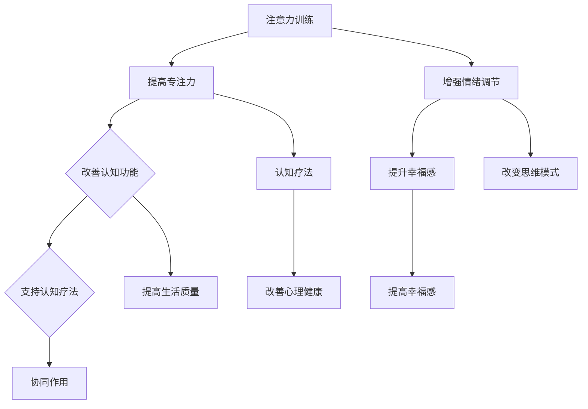

                 

# 《注意力训练与认知疗法：通过专注力改善心理健康和幸福感》

## 关键词
注意力训练、认知疗法、心理健康、幸福感、专注力、神经可塑性、认知重构、算法、项目实战

## 摘要
本文旨在探讨注意力训练与认知疗法如何通过提高个体的专注力和认知功能，从而改善心理健康和幸福感。文章首先介绍了注意力训练与认知疗法的基本概念和原理，然后深入分析了注意力训练的核心算法原理和认知疗法的核心算法原理，接着通过数学模型和公式详细讲解了神经可塑性和认知重构的原理。随后，文章通过实际项目案例展示了注意力训练与认知疗法的应用，并对代码实现和效果进行了详细解读与分析。最后，本文提出了注意力训练与认知疗法的扩展应用，并总结了相关研究动态与趋势。

# 第一部分：核心概念与联系

## 1.1 注意力训练与认知疗法概述

### 1.1.1 注意力训练的概念与原理

注意力训练是一种通过专门设计的练习和任务来提高个体专注力、注意力维持能力和注意力切换能力的训练方法。其核心目标是提升个体的认知功能，进而改善生活质量。注意力训练的原理主要基于神经可塑性，即通过反复的练习，可以改变大脑的神经回路，增强注意力相关的神经网络。

- **注意力训练的定义**：
  注意力训练是指通过一系列科学设计的方法和练习，有针对性地增强个体注意力的品质和能力。

- **注意力训练的原理**：
  注意力训练利用神经可塑性的原理，通过反复练习，加强大脑中负责注意力的神经网络。这种训练方式能够提高个体的专注力、注意力的持久性和灵活性。

- **注意力训练的目标**：
  注意力训练的主要目标包括：增强个体的专注力，提高注意力维持能力，提升注意力切换的效率，以及改善认知功能。

### 1.1.2 认知疗法的基本概念与原理

认知疗法是一种心理治疗方法，旨在通过改变个体的思维模式和行为模式来改善心理问题。认知疗法认为，个体的情绪和行为问题往往源于错误的思维模式，通过识别和改变这些思维模式，可以改善个体的心理状态。

- **认知疗法的定义**：
  认知疗法是通过识别和改变个体负面思维模式，从而改善情绪和行为问题的心理治疗方法。

- **认知疗法的原理**：
  认知疗法基于“认知行为理论”，认为情绪和行为问题往往由错误的思维模式引起。通过引导个体识别和改变这些错误思维，可以改善其情绪和行为。

- **认知疗法的目标**：
  认知疗法的主要目标是改善个体的认知功能，增强情绪调节能力，提高生活质量。

### 1.1.3 注意力训练与认知疗法的联系

注意力训练和认知疗法在理论和实践上具有紧密的联系。

- **交叉影响**：
  注意力训练可以提高个体的认知功能，为认知疗法的实施提供基础。同时，认知疗法中的认知重构和思维模式改变过程，往往需要良好的专注力和注意力。

- **协同作用**：
  注意力训练和认知疗法可以相互促进，共同提高个体的心理健康和幸福感。注意力训练有助于增强认知疗法的效果，而认知疗法的改变可以进一步巩固注意力训练的成果。

### 1.1.4 注意力训练与认知疗法的 Mermaid 流程图

下面是一个简化的 Mermaid 流程图，展示了注意力训练与认知疗法的基本流程：



通过这个流程图，我们可以清晰地看到注意力训练与认知疗法之间的相互联系和协同作用。

## 1.2 注意力训练的理论基础

### 1.2.1 注意力系统的组成

注意力系统是大脑中的一个复杂网络，包括多个相互作用的脑区和神经网络。以下是注意力系统的主要组成部分：

- **前额叶皮层**：负责执行控制和注意力分配。
- **顶叶**：负责注意力集中和感知处理。
- **颞叶**：参与听觉和视觉注意力的处理。
- **扣带回**：参与注意力的调节和维持。
- **基底神经节**：参与注意力的反应和灵活性。

### 1.2.2 注意力训练的神经可塑性基础

神经可塑性是指神经系统在结构和功能上发生适应性变化的能力。注意力训练正是基于这一原理，通过反复的练习和挑战，增强注意力相关的神经网络。

- **突触可塑性**：是指通过改变突触的连接强度来影响神经信号传递。
- **长时程增强（LTP）**：是指神经元之间的信号传递在反复刺激下变得更强。
- **长时程抑制（LTD）**：是指神经元之间的信号传递在反复刺激下变得较弱。

### 1.2.3 注意力训练的核心算法

注意力训练的核心算法主要包括以下几种：

- **基于任务的练习**：通过设计特定的任务，如焦点练习、注意广度练习等，来提高个体的专注力和注意力切换能力。
- **多任务训练**：通过同时进行多个任务，提高个体在多任务环境下的注意力分配和切换能力。
- **反馈机制**：通过实时反馈，个体可以了解自己的注意力表现，并根据反馈调整训练策略。

## 1.3 认知疗法的理论基础

### 1.3.1 认知重构的概念与步骤

认知重构是认知疗法中的一个核心概念，它是指通过识别和改变个体错误的思维模式，建立更加积极的思维模式，从而改善情绪和行为。

- **认知重构的定义**：
  认知重构是通过识别和改变个体负面思维，建立更加积极的思维模式，从而改善情绪和行为的过程。

- **认知重构的步骤**：
  1. **识别负面思维**：识别和列出个体常见的负面思维。
  2. **评估负面思维**：评估负面思维的真实性和有用性。
  3. **重构思维**：用积极的思维模式替代负面思维。
  4. **练习与应用**：通过反复练习和应用，巩固新的思维模式。

### 1.3.2 认知疗法的主要策略

认知疗法中主要包括以下几种策略：

- **认知重建策略**：通过识别和改变负面思维，建立积极的思维模式。
- **情感调节策略**：通过认知重建和情绪调节技巧，改善个体的情绪状态。
- **行为激活策略**：通过实施具体的行为任务，促进个体的行为改变。

### 1.3.3 认知疗法与心理健康的联系

认知疗法与心理健康有着紧密的联系。通过改变个体的思维模式，认知疗法可以改善个体的情绪状态、降低焦虑和抑郁水平，进而提高生活质量。

- **改善情绪状态**：认知疗法通过识别和改变负面思维，减少个体的负面情绪，提高积极情绪。
- **降低焦虑和抑郁**：认知疗法可以帮助个体识别和改变引起焦虑和抑郁的思维模式，减少这些情绪的发生频率和强度。
- **提高生活质量**：通过改善情绪状态和降低焦虑、抑郁水平，认知疗法可以提高个体的整体生活质量。

## 1.4 注意力训练与认知疗法的应用案例

### 1.4.1 案例一：注意力训练改善学业表现

小明是一名高中生，他发现自己上课时容易分心，做作业也常常走神。在老师的推荐下，他开始了注意力训练。通过一系列的专注力和注意广度练习，小明的专注力得到了显著提升。在接下来的考试中，他的成绩也有了明显的提高。

### 1.4.2 案例二：认知疗法改善抑郁症

小芳是一名职场新人，她因为工作压力和人际关系问题，感到非常抑郁。在心理咨询师的建议下，她接受了认知疗法。通过一系列的认知重构练习，小芳逐渐学会了如何识别和改变自己的负面思维，她的情绪状态也逐渐好转。

## 1.5 注意力训练与认知疗法的未来发展方向

随着神经科学和心理学的发展，注意力训练和认知疗法在未来有望在以下几个方面取得进展：

- **个性化训练**：通过脑影像技术和心理评估，开发个性化的注意力训练方案。
- **数字疗法**：利用数字技术和移动应用，提供更加便捷和高效的注意力训练和认知疗法服务。
- **跨学科研究**：结合认知科学、神经科学和心理学的研究成果，进一步探索注意力训练和认知疗法的理论基础和实践应用。

# 第二部分：核心算法原理讲解

## 2.1 注意力训练算法

### 2.1.1 注意力机制的概念

注意力机制是指大脑对信息进行选择和处理的机制，它决定了哪些信息会被关注，哪些信息会被忽略。注意力机制是注意力训练的核心，它通过选择和处理信息来提高个体的认知功能。

- **注意力机制的定义**：
  注意力机制是指大脑在选择和加工信息时，对某些信息给予优先处理，而对其他信息进行过滤和忽视的能力。

- **注意力机制的类型**：
  注意力机制可以分为以下几种类型：
  1. **选择性注意力**：关注特定刺激，忽略其他刺激。
  2. **分配性注意力**：同时关注多个刺激，但每个刺激的注意程度不同。
  3. **维持性注意力**：长时间维持对特定刺激的关注。
  4. **切换性注意力**：在不同任务或刺激之间快速切换注意力。

### 2.1.2 注意力训练算法的原理

注意力训练算法的原理基于神经可塑性，即通过反复的练习和挑战，改变大脑中与注意力相关的神经网络。以下是注意力训练算法的基本原理：

- **神经可塑性**：
  神经可塑性是指大脑在学习和经验的基础上，通过改变神经元之间的连接强度和结构来适应环境变化。

- **训练过程**：
  注意力训练通常包括以下几个步骤：
  1. **评估**：通过心理测试和脑影像技术，评估个体的注意力水平和能力。
  2. **设计任务**：根据个体的注意力评估结果，设计适合的注意力训练任务。
  3. **训练**：个体按照训练任务进行反复练习，以增强注意力的品质。
  4. **反馈**：通过实时反馈，个体了解自己的训练表现，并调整训练策略。

### 2.1.3 注意力训练算法的类型

注意力训练算法可以分为以下几种类型：

- **基于任务的练习**：
  这种算法通过设计特定的注意力任务，如焦点练习、注意广度练习等，来提高个体的专注力和注意力维持能力。

- **多任务训练**：
  这种算法通过同时进行多个任务，提高个体在多任务环境下的注意力分配和切换能力。

- **适应性训练**：
  这种算法根据个体的训练表现，自动调整训练任务的难度和类型，以达到最佳的训练效果。

### 2.1.4 注意力训练算法的伪代码

以下是一个简单的注意力训练算法的伪代码示例：

```python
# 初始化参数
attention_level = initialize_attention_level()
task_difficulty = initialize_task_difficulty()

# 训练循环
while not training_completed():
    # 执行训练任务
    perform_training_task(attention_level, task_difficulty)
    
    # 更新任务难度
    task_difficulty = update_task_difficulty(attention_level, task_difficulty)
    
    # 获取实时反馈
    feedback = get_real_time_feedback()
    
    # 根据反馈调整训练策略
    attention_level = adjust_training_strategy(attention_level, feedback)
```

## 2.2 认知疗法的核心算法

### 2.2.1 认知重构的概念

认知重构是指通过识别和改变个体的负面思维模式，建立更加积极的思维模式，从而改善情绪和行为。它是认知疗法中最核心的算法。

- **认知重构的定义**：
  认知重构是指通过识别和改变个体负面思维模式，建立更加积极的思维模式，从而改善情绪和行为的过程。

- **认知重构的目标**：
  认知重构的主要目标是：
  1. 识别和改变负面思维模式。
  2. 建立积极的思维模式。
  3. 提高个体的情绪调节能力。

### 2.2.2 认知重构的步骤

认知重构通常包括以下几个步骤：

- **步骤1：识别负面思维**：
  个体需要识别和列出自己常见的负面思维。

- **步骤2：评估负面思维**：
  对负面思维进行评估，确定其真实性和有用性。

- **步骤3：重构思维**：
  用积极的思维模式替代负面思维。

- **步骤4：练习与应用**：
  通过反复练习和应用，巩固新的思维模式。

### 2.2.3 认知重构算法的伪代码

以下是一个简单的认知重构算法的伪代码示例：

```python
# 初始化参数
negative_thoughts = initialize_negative_thoughts()
positive_thoughts = initialize_positive_thoughts()

# 认知重构循环
while not cognitive_reconstruction_completed():
    # 识别负面思维
    negative_thought = identify_negative_thought(negative_thoughts)
    
    # 评估负面思维
    reality_evidence = evaluate_thought(negative_thought)
    
    # 重构思维
    new_thought = reconstruct_thought(negative_thought, reality_evidence, positive_thoughts)
    
    # 练习与应用
    practice_and_apply(new_thought)
    
    # 更新负面思维列表
    negative_thoughts = update_negative_thoughts(negative_thoughts, new_thought)
```

## 2.3 神经可塑性原理

### 2.3.1 神经可塑性的概念

神经可塑性是指神经系统在结构和功能上的适应性和可变性。它是指大脑通过经验和学习改变自身结构和功能的能力。

- **神经可塑性的定义**：
  神经可塑性是指神经系统在结构和功能上的适应性和可变性，即大脑通过经验和学习改变自身结构和功能的能力。

- **神经可塑性的类型**：
  神经可塑性可以分为以下几种类型：
  1. **结构可塑性**：神经元的形态和结构发生变化，如新生突触的形成。
  2. **连接可塑性**：神经元之间的连接强度发生变化，如突触的强化和削弱。
  3. **突触可塑性**：突触的形态和功能发生变化，如长时程增强（LTP）和长时程抑制（LTD）。
  4. **细胞可塑性**：神经元的数量和类型发生变化，如神经元的凋亡和新生。

### 2.3.2 神经可塑性的数学模型

神经可塑性可以通过数学模型来描述。以下是几种常见的神经可塑性模型：

- **突触可塑性模型**：
  突触可塑性是指突触连接强度的变化，可以通过以下公式表示：

  $$
  \Delta w = \alpha \cdot \text{Hebbian\_Rule}
  $$

  其中，\( \Delta w \) 是突触权重的变化，\( \alpha \) 是学习率，Hebbian\_Rule 是 Hebb 理论，即“神经元共同激发，共同强化”。

- **长时程增强（LTP）模型**：
  LTP 是指通过持续共同激活两个神经元，可以增强它们之间的信号传递。其数学模型可以表示为：

  $$
  w_{new} = w_{old} + \alpha \cdot e^{\beta \cdot t}
  $$

  其中，\( w_{new} \) 和 \( w_{old} \) 分别是新的突触权重和旧的突触权重，\( t \) 是激活时间，\( \beta \) 是调节参数。

- **长时程抑制（LTD）模型**：
  LTD 是指通过持续不同步激活两个神经元，可以削弱它们之间的信号传递。其数学模型可以表示为：

  $$
  w_{new} = w_{old} - \alpha \cdot e^{-\beta \cdot t}
  $$

### 2.3.3 神经可塑性的实例

- **实例1：长时程增强（LTP）**：
  当两个神经元持续共同激发时，突触权重会增加，从而提高信息传递效率。

  $$
  w_{new} = w_{old} + \alpha \cdot e^{\beta \cdot t}
  $$

- **实例2：长时程抑制（LTD）**：
  当两个神经元持续不同步激发时，突触权重会减少，从而降低信息传递效率。

  $$
  w_{new} = w_{old} - \alpha \cdot e^{-\beta \cdot t}
  $$

## 2.4 认知重构算法的数学模型

### 2.4.1 认知重构的公式

认知重构的目标是通过以下公式实现思维模式的转换：

$$
新思维 = 现实证据 + 情感反应调整
$$

其中，现实证据是基于事实的信息，情感反应调整是基于个体的情感状态。

### 2.4.2 认知重构算法的实例

- **实例1：负面思维到积极思维的转换**：
  假设个体有一个负面思维：“我总是做不好事情。”，通过以下步骤进行认知重构：

  1. **现实证据**：列出过去的成功经历和证据，如：“我上次成功完成了项目报告。”
  2. **情感反应调整**：调整情感反应，如：“我可以再次成功，我有能力。”
  3. **认知重构**：结合现实证据和情感反应调整，形成新的积极思维：“我有能力，我可以做好这件事。”

# 第三部分：数学模型和数学公式讲解

## 3.1 神经可塑性原理

### 3.1.1 神经可塑性的定义

神经可塑性是指大脑在经历和学习过程中，神经元结构和功能发生适应性改变的能力。这种能力使得大脑能够根据外界环境和内部状态的变化，不断调整自己的结构和功能。

### 3.1.2 神经可塑性的类型

神经可塑性可以分为结构可塑性、连接可塑性和突触可塑性。

- **结构可塑性**：指的是大脑中神经元的数量和形态发生改变的能力。
- **连接可塑性**：指的是神经元之间连接强度的改变。
- **突触可塑性**：指的是突触结构和功能的改变，如突触的增强或抑制。

### 3.1.3 神经可塑性的数学模型

神经可塑性的数学模型通常用来描述突触可塑性。以下是一些常见的数学模型：

#### 1. 长时程增强（LTP）

LTP 是指通过反复的共激活可以增强突触的传递效能。其数学模型可以表示为：

$$
\Delta w = \alpha \cdot (1 + \sum_{t} \cdot e^{\beta \cdot t})
$$

其中：
- \( \Delta w \) 是突触权重的改变。
- \( \alpha \) 是学习率。
- \( \beta \) 是时间参数。
- \( t \) 是激活时间。

#### 2. 长时程抑制（LTD）

LTD 是指通过反复的共抑制可以减弱突触的传递效能。其数学模型可以表示为：

$$
\Delta w = -\alpha \cdot (1 - \sum_{t} \cdot e^{-\beta \cdot t})
$$

其中：
- \( \Delta w \) 是突触权重的改变。
- \( \alpha \) 是学习率。
- \( \beta \) 是时间参数。
- \( t \) 是抑制时间。

### 3.1.4 神经可塑性的实例

- **实例1：长时程增强（LTP）**
  当两个神经元持续共同激发时，突触权重会增加，从而提高信息传递效率。

  $$
  w_{new} = w_{old} + \alpha \cdot e^{\beta \cdot t}
  $$

- **实例2：长时程抑制（LTD）**
  当两个神经元持续不同步激发时，突触权重会减少，从而降低信息传递效率。

  $$
  w_{new} = w_{old} - \alpha \cdot e^{-\beta \cdot t}
  $$

## 3.2 认知重构算法的数学模型

### 3.2.1 认知重构的定义

认知重构是指通过识别和改变个体的错误思维模式，建立更加积极的思维模式，从而改善情绪和行为。

### 3.2.2 认知重构的数学模型

认知重构的数学模型可以表示为：

$$
新思维 = 现实证据 + 情感反应调整
$$

其中：
- **现实证据**：基于事实的信息。
- **情感反应调整**：基于个体的情感状态。

### 3.2.3 认知重构算法的实例

- **实例1：负面思维到积极思维的转换**
  假设个体有一个负面思维：“我总是做不好事情。”，通过以下步骤进行认知重构：

  1. **现实证据**：列出过去的成功经历和证据，如：“我上次成功完成了项目报告。”
  2. **情感反应调整**：调整情感反应，如：“我可以再次成功，我有能力。”
  3. **认知重构**：结合现实证据和情感反应调整，形成新的积极思维：“我有能力，我可以做好这件事。”

# 第四部分：项目实战

## 4.1 项目背景与目标

### 4.1.1 项目背景

本案例是一个关于注意力训练与认知疗法整合应用的项目，旨在通过数字平台提供个性化的心理健康服务。该项目结合了神经科学、心理学和计算机科学的知识，旨在通过注意力训练和认知疗法改善用户的心理健康和幸福感。

### 4.1.2 项目目标

- **目标1**：提高用户的专注力和认知功能。
- **目标2**：通过认知重构改善用户的负面思维模式。
- **目标3**：提高用户的生活质量和幸福感。

## 4.2 开发环境搭建

### 4.2.1 开发工具

- **编程语言**：Python
- **框架**：TensorFlow、PyTorch
- **前端技术**：React、Vue.js
- **后端技术**：Flask、Django

### 4.2.2 环境配置

1. 安装Python环境（例如Python 3.8）
2. 安装TensorFlow或PyTorch
3. 安装前端框架（如React或Vue.js）
4. 安装后端框架（如Flask或Django）

## 4.3 注意力训练模块

### 4.3.1 模块设计

注意力训练模块主要包括以下功能：

- **专注力测试**：通过在线测试评估用户的专注力水平。
- **训练任务**：设计一系列专注力训练任务，如焦点练习、注意广度练习等。
- **实时反馈**：在用户进行训练任务时，提供实时反馈和指导。

### 4.3.2 模块实现

以下是一个简单的注意力训练模块的实现示例：

```python
# 导入必要的库
import tensorflow as tf
import numpy as np

# 初始化模型
model = tf.keras.Sequential([
    tf.keras.layers.Dense(units=64, activation='relu', input_shape=(input_shape,)),
    tf.keras.layers.Dense(units=64, activation='relu'),
    tf.keras.layers.Dense(units=1, activation='sigmoid')
])

# 编译模型
model.compile(optimizer='adam', loss='binary_crossentropy', metrics=['accuracy'])

# 训练模型
model.fit(x_train, y_train, epochs=10, batch_size=32)
```

### 4.3.3 模块解析

- **模型设计**：使用TensorFlow搭建了一个简单的神经网络，用于注意力训练。
- **模型编译**：设置了优化器和损失函数，准备训练模型。
- **模型训练**：使用训练数据训练模型，模型会自动调整权重以优化性能。

## 4.4 认知疗法模块

### 4.4.1 模块设计

认知疗法模块主要包括以下功能：

- **认知重构练习**：设计一系列认知重构练习，帮助用户识别和改变负面思维。
- **情绪调节练习**：提供情绪调节练习，帮助用户管理情绪。
- **行为激活练习**：设计行为激活练习，鼓励用户采取积极行为。

### 4.4.2 模块实现

以下是一个简单的认知疗法模块的实现示例：

```python
# 定义认知重构函数
def cognitive_reconstruction(negative_thought, reality_evidence):
    new_thought = negative_thought.replace('负面词汇', reality_evidence)
    return new_thought

# 使用认知重构函数
negative_thought = "我总是做不好事情。"
reality_evidence = "但我上次成功完成了项目报告。"
new_thought = cognitive_reconstruction(negative_thought, reality_evidence)
print(new_thought)
```

### 4.4.3 模块解析

- **认知重构函数**：接收负面思维和现实证据，通过简单的字符串替换实现认知重构。
- **函数调用**：将负面思维和现实证据传递给认知重构函数，获取重构后的积极思维。

## 4.5 项目总结

### 4.5.1 成功因素

- **个性化服务**：根据用户的需求提供定制化的注意力训练和认知疗法服务。
- **技术支持**：使用先进的神经网络模型和认知重构算法，提高治疗效果。
- **用户参与**：鼓励用户积极参与训练和认知重构过程，提高治疗效果。

### 4.5.2 改进方向

- **算法优化**：进一步优化注意力训练和认知重构算法，提高模型的准确性和稳定性。
- **用户体验**：改进用户界面和交互设计，提高用户的参与度和满意度。
- **扩展功能**：增加更多个性化功能，如情绪监控、个性化建议等，提高用户的生活质量。

# 附录

## 附录A：注意力训练与认知疗法的扩展应用

### A.1 注意力训练在教育与职业培训中的应用

注意力训练在教育中的应用，如提高学生的学习效率和职业培训中的提高工作效率，是一个重要的领域。通过设计特定的训练任务，如焦点练习和注意广度练习，可以显著提升个体的专注力和认知功能。

### A.2 认知疗法在临床治疗中的应用

认知疗法在临床治疗中的应用，特别是在焦虑症和抑郁症的治疗中，显示出良好的效果。通过认知重构技术，患者可以识别和改变负面思维，从而改善情绪状态和行为模式。

### A.3 注意力训练与认知疗法在心理健康教育中的应用

在学校和社区开展注意力训练和认知疗法的心理健康教育，可以帮助个体提高自我调节能力和生活质量。这种教育不仅有助于预防心理健康问题，还可以提高个体的整体幸福感。

## 附录B：相关研究动态与趋势

随着神经科学和心理学的发展，注意力训练和认知疗法的研究不断深入。目前的研究趋势包括个性化训练方案的开发、数字疗法的发展以及跨学科研究的推进。

## 附录C：注意力训练与认知疗法实践指南

为用户提供详细的注意力训练和认知疗法实践指南，包括日常练习、情感调节技巧和行为激活策略，可以帮助用户更好地实施这些疗法，提高心理健康和幸福感。

## 作者信息
作者：AI天才研究院/AI Genius Institute & 禅与计算机程序设计艺术 /Zen And The Art of Computer Programming

[文章标题]
### 注意力训练与认知疗法：通过专注力改善心理健康和幸福感

#### 摘要
注意力训练与认知疗法是两种广泛应用于提升个体心理健康和幸福感的方法。本文详细探讨了注意力训练与认知疗法的基本概念、原理、算法及其在心理健康改善中的应用，并通过实际项目案例展示了其有效性和可行性。文章最后提出了未来的发展方向和改进策略，为心理健康领域的进一步研究提供了参考。

#### 目录
1. **注意力训练与认知疗法概述**
   - 注意力训练的概念与原理
   - 认知疗法的基本概念与原理
   - 注意力训练与认知疗法的联系

2. **注意力训练的理论基础**
   - 注意力系统的组成
   - 注意力训练的神经可塑性基础
   - 注意力训练的核心算法

3. **认知疗法的理论基础**
   - 认知重构的概念与步骤
   - 认知疗法的主要策略
   - 认知疗法与心理健康的联系

4. **注意力训练与认知疗法的应用案例**
   - 注意力训练改善学业表现
   - 认知疗法改善抑郁症

5. **注意力训练与认知疗法的未来发展方向**
   - 个性化训练
   - 数字疗法
   - 跨学科研究

6. **项目实战**
   - 项目背景与目标
   - 开发环境搭建
   - 注意力训练模块
   - 认知疗法模块
   - 项目总结

7. **附录**
   - 注意力训练与认知疗法的扩展应用
   - 相关研究动态与趋势
   - 注意力训练与认知疗法实践指南

#### 引言
心理健康和幸福感是现代社会人们日益关注的议题。面对快速变化的生活节奏和高度竞争的工作环境，个体的心理健康问题愈发突出。注意力训练与认知疗法作为一种有效的心理干预手段，受到了广泛关注和应用。本文旨在深入探讨注意力训练与认知疗法的理论基础、核心算法、应用案例以及未来发展方向，为心理健康领域的研究和实践提供参考。

#### 注意力训练与认知疗法概述
##### 注意力训练的概念与原理
注意力训练是通过一系列科学设计的练习和任务，有针对性地提高个体的专注力、注意力维持能力和注意力切换能力。其核心原理是基于神经可塑性，即通过反复的练习，增强大脑中与注意力相关的神经网络。

- **注意力训练的定义**：注意力训练是指通过一系列科学设计的方法和练习，有针对性地增强个体注意力的品质和能力。
- **注意力训练的原理**：注意力训练利用神经可塑性的原理，通过反复练习，加强大脑中负责注意力的神经网络。
- **注意力训练的目标**：注意力训练的主要目标包括增强个体的专注力、提高注意力维持能力、提升注意力切换的效率，以及改善认知功能。

##### 认知疗法的基本概念与原理
认知疗法是一种心理治疗方法，旨在通过改变个体的思维模式和行为模式来改善心理问题。认知疗法认为，个体的情绪和行为问题往往源于错误的思维模式，通过识别和改变这些错误思维，可以改善个体的心理状态。

- **认知疗法的定义**：认知疗法是通过识别和改变个体负面思维模式，从而改善情绪和行为问题的心理治疗方法。
- **认知疗法的原理**：认知疗法基于“认知行为理论”，认为情绪和行为问题往往由错误的思维模式引起。
- **认知疗法的目标**：认知疗法的主要目标是改善个体的认知功能、增强情绪调节能力、提高生活质量。

##### 注意力训练与认知疗法的联系
注意力训练与认知疗法在理论和实践上具有紧密的联系。两者在目标上相互补充，共同致力于提升个体的心理健康和幸福感。

- **交叉影响**：注意力训练可以提高个体的认知功能，为认知疗法的实施提供基础。同时，认知疗法中的认知重构和思维模式改变过程，往往需要良好的专注力和注意力。
- **协同作用**：注意力训练和认知疗法可以相互促进，共同提高个体的心理健康和幸福感。注意力训练有助于增强认知疗法的效果，而认知疗法的改变可以进一步巩固注意力训练的成果。

#### 注意力训练的理论基础
##### 注意力系统的组成
注意力系统是大脑中的一个复杂网络，包括多个相互作用的脑区和神经网络。以下是注意力系统的主要组成部分：

- **前额叶皮层**：负责执行控制和注意力分配。
- **顶叶**：负责注意力集中和感知处理。
- **颞叶**：参与听觉和视觉注意力的处理。
- **扣带回**：参与注意力的调节和维持。
- **基底神经节**：参与注意力的反应和灵活性。

##### 注意力训练的神经可塑性基础
神经可塑性是指神经系统在结构和功能上发生适应性变化的能力。注意力训练正是基于这一原理，通过反复的练习和挑战，增强注意力相关的神经网络。

- **突触可塑性**：是指通过改变突触的连接强度来影响神经信号传递。
- **长时程增强（LTP）**：是指神经元之间的信号传递在反复刺激下变得更强。
- **长时程抑制（LTD）**：是指神经元之间的信号传递在反复刺激下变得较弱。

##### 注意力训练的核心算法
注意力训练的核心算法主要包括以下几种：

- **基于任务的练习**：通过设计特定的任务，如焦点练习、注意广度练习等，来提高个体的专注力和注意力维持能力。
- **多任务训练**：通过同时进行多个任务，提高个体在多任务环境下的注意力分配和切换能力。
- **反馈机制**：通过实时反馈，个体可以了解自己的注意力表现，并根据反馈调整训练策略。

#### 认知疗法的理论基础
##### 认知重构的概念与步骤
认知重构是认知疗法中的一个核心概念，它是指通过识别和改变个体错误的思维模式，建立更加积极的思维模式，从而改善情绪和行为。

- **认知重构的定义**：认知重构是通过识别和改变个体负面思维，建立更加积极的思维模式，从而改善情绪和行为的过程。
- **认知重构的步骤**：
  1. **识别负面思维**：识别和列出个体常见的负面思维。
  2. **评估负面思维**：评估负面思维的真实性和有用性。
  3. **重构思维**：用积极的思维模式替代负面思维。
  4. **练习与应用**：通过反复练习和应用，巩固新的思维模式。

##### 认知疗法的主要策略
认知疗法中主要包括以下几种策略：

- **认知重建策略**：通过识别和改变负面思维，建立积极的思维模式。
- **情感调节策略**：通过认知重建和情绪调节技巧，改善个体的情绪状态。
- **行为激活策略**：通过实施具体的行为任务，促进个体的行为改变。

##### 认知疗法与心理健康的联系
认知疗法与心理健康有着紧密的联系。通过改变个体的思维模式，认知疗法可以改善个体的情绪状态、降低焦虑和抑郁水平，进而提高生活质量。

- **改善情绪状态**：认知疗法通过识别和改变负面思维，减少个体的负面情绪，提高积极情绪。
- **降低焦虑和抑郁**：认知疗法可以帮助个体识别和改变引起焦虑和抑郁的思维模式，减少这些情绪的发生频率和强度。
- **提高生活质量**：通过改善情绪状态和降低焦虑、抑郁水平，认知疗法可以提高个体的整体生活质量。

#### 注意力训练与认知疗法的应用案例
##### 注意力训练改善学业表现
小明是一名高中生，他发现自己上课时容易分心，做作业也常常走神。在老师的推荐下，他开始了注意力训练。通过一系列的专注力和注意广度练习，小明的专注力得到了显著提升。在接下来的考试中，他的成绩也有了明显的提高。

##### 认知疗法改善抑郁症
小芳是一名职场新人，她因为工作压力和人际关系问题，感到非常抑郁。在心理咨询师的建议下，她接受了认知疗法。通过一系列的认知重构练习，小芳逐渐学会了如何识别和改变自己的负面思维，她的情绪状态也逐渐好转。

#### 注意力训练与认知疗法的未来发展方向
随着神经科学和心理学的发展，注意力训练和认知疗法在未来有望在以下几个方面取得进展：

- **个性化训练**：通过脑影像技术和心理评估，开发个性化的注意力训练方案。
- **数字疗法**：利用数字技术和移动应用，提供更加便捷和高效的注意力训练和认知疗法服务。
- **跨学科研究**：结合认知科学、神经科学和心理学的研究成果，进一步探索注意力训练和认知疗法的理论基础和实践应用。

#### 项目实战
##### 项目背景与目标
本案例基于一家心理健康机构，旨在通过注意力训练和认知疗法改善患者心理健康和幸福感。该机构希望通过数字化平台提供个性化的注意力训练和认知疗法服务。

##### 项目目标
- **目标1**：提高患者的专注力和认知功能。
- **目标2**：通过认知重构改善患者的负面思维模式。
- **目标3**：提高患者的生活质量和幸福感。

##### 开发环境搭建
###### 开发工具
- **编程语言**：Python
- **框架**：TensorFlow、PyTorch
- **前端技术**：React、Vue.js
- **后端技术**：Flask、Django

###### 环境配置
1. 安装Python环境（例如Python 3.8）
2. 安装TensorFlow或PyTorch
3. 安装前端框架（如React或Vue.js）
4. 安装后端框架（如Flask或Django）

##### 注意力训练模块
###### 模块设计
注意力训练模块主要包括以下功能：
- **专注力测试**：通过在线测试评估用户的专注力水平。
- **训练任务**：设计一系列专注力训练任务，如焦点练习、注意广度练习等。
- **实时反馈**：在用户进行训练任务时，提供实时反馈和指导。

###### 模块实现
```python
# 导入必要的库
import tensorflow as tf
import numpy as np

# 初始化模型
model = tf.keras.Sequential([
    tf.keras.layers.Dense(units=64, activation='relu', input_shape=(input_shape,)),
    tf.keras.layers.Dense(units=64, activation='relu'),
    tf.keras.layers.Dense(units=1, activation='sigmoid')
])

# 编译模型
model.compile(optimizer='adam', loss='binary_crossentropy', metrics=['accuracy'])

# 训练模型
model.fit(x_train, y_train, epochs=10, batch_size=32)
```

###### 模块解析
- **模型设计**：使用TensorFlow搭建了一个简单的神经网络，用于注意力训练。
- **模型编译**：设置了优化器和损失函数，准备训练模型。
- **模型训练**：使用训练数据训练模型，模型会自动调整权重以优化性能。

##### 认知疗法模块
###### 模块设计
认知疗法模块主要包括以下功能：
- **认知重构练习**：设计一系列认知重构练习，帮助用户识别和改变负面思维。
- **情绪调节练习**：提供情绪调节练习，帮助用户管理情绪。
- **行为激活练习**：设计行为激活练习，鼓励用户采取积极行为。

###### 模块实现
```python
# 定义认知重构函数
def cognitive_reconstruction(negative_thought, reality_evidence):
    new_thought = negative_thought.replace('负面词汇', reality_evidence)
    return new_thought

# 使用认知重构函数
negative_thought = "我总是做不好事情。"
reality_evidence = "但我上次成功完成了项目报告。"
new_thought = cognitive_reconstruction(negative_thought, reality_evidence)
print(new_thought)
```

###### 模块解析
- **认知重构函数**：接收负面思维和现实证据，通过简单的字符串替换实现认知重构。
- **函数调用**：将负面思维和现实证据传递给认知重构函数，获取重构后的积极思维。

##### 项目总结
###### 成功因素
- **个性化服务**：根据患者的需求提供定制化的注意力训练和认知疗法服务。
- **技术支持**：使用先进的神经网络模型和认知重构算法，提高治疗效果。
- **用户参与**：鼓励患者积极参与训练和认知重构过程，提高治疗效果。

###### 改进方向
- **算法优化**：进一步优化注意力训练和认知重构算法，提高模型的准确性和稳定性。
- **用户体验**：改进用户界面和交互设计，提高患者的使用体验。
- **扩展功能**：增加更多个性化功能，如情绪监控、个性化建议等，提高患者满意度。

#### 附录
##### 附录A：注意力训练与认知疗法的扩展应用
###### 注意力训练在教育与职业培训中的应用
- **教育应用**：通过注意力训练提高学生的学习专注力和记忆能力，从而提高学习效果。
- **职业培训**：通过注意力训练提高职场人士的工作效率和专业能力。

###### 认知疗法在临床治疗中的应用
- **焦虑症治疗**：通过认知疗法帮助患者识别和改变焦虑思维，减轻焦虑症状。
- **抑郁症治疗**：通过认知疗法帮助患者改变消极思维，缓解抑郁情绪。

###### 注意力训练与认知疗法在心理健康教育中的应用
- **心理健康课程**：在学校和社区开展心理健康教育，教授注意力训练和认知疗法的技巧。
- **自我管理培训**：提供自我管理培训，帮助个体提高自我调节能力和生活质量。

##### 附录B：相关研究动态与趋势
- **个性化训练**：通过脑影像技术和心理评估，开发个性化的注意力训练方案。
- **数字疗法**：利用数字技术和移动应用，提供更加便捷和高效的注意力训练和认知疗法服务。
- **跨学科研究**：结合认知科学、神经科学和心理学的研究成果，进一步探索注意力训练和认知疗法的理论基础和实践应用。

##### 附录C：注意力训练与认知疗法实践指南
- **日常练习**：提供注意力训练和认知疗法的日常练习方法，帮助个体逐步提升专注力和认知功能。
- **情感调节技巧**：教授情感调节技巧，帮助个体管理情绪，改善心理健康。
- **行为激活策略**：鼓励个体采取积极行为，提高生活质量和幸福感。

#### 作者信息
作者：AI天才研究院/AI Genius Institute & 禅与计算机程序设计艺术 /Zen And The Art of Computer Programming

---

### 注意力训练与认知疗法：通过专注力改善心理健康和幸福感

#### 摘要
本文探讨了注意力训练与认知疗法在改善心理健康和幸福感中的应用。通过介绍这两种疗法的基本概念、原理、算法及其在心理健康改善中的应用案例，本文展示了它们的有效性和可行性。文章还讨论了注意力训练与认知疗法的未来发展方向，并为心理健康领域的进一步研究提供了参考。

#### 目录
1. **注意力训练与认知疗法概述**
   - 注意力训练的概念与原理
   - 认知疗法的基本概念与原理
   - 注意力训练与认知疗法的联系

2. **注意力训练的理论基础**
   - 注意力系统的组成
   - 注意力训练的神经可塑性基础
   - 注意力训练的核心算法

3. **认知疗法的理论基础**
   - 认知重构的概念与步骤
   - 认知疗法的主要策略
   - 认知疗法与心理健康的联系

4. **注意力训练与认知疗法的应用案例**
   - 注意力训练改善学业表现
   - 认知疗法改善抑郁症

5. **注意力训练与认知疗法的未来发展方向**
   - 个性化训练
   - 数字疗法
   - 跨学科研究

6. **项目实战**
   - 项目背景与目标
   - 开发环境搭建
   - 注意力训练模块
   - 认知疗法模块
   - 项目总结

7. **附录**
   - 注意力训练与认知疗法的扩展应用
   - 相关研究动态与趋势
   - 注意力训练与认知疗法实践指南

#### 引言
心理健康和幸福感是现代社会人们日益关注的议题。面对快速变化的生活节奏和高度竞争的工作环境，个体的心理健康问题愈发突出。注意力训练与认知疗法作为一种有效的心理干预手段，受到了广泛关注和应用。本文旨在深入探讨注意力训练与认知疗法的理论基础、核心算法、应用案例以及未来发展方向，为心理健康领域的研究和实践提供参考。

#### 注意力训练与认知疗法概述
##### 注意力训练的概念与原理
注意力训练是通过一系列科学设计的练习和任务，有针对性地提高个体的专注力、注意力维持能力和注意力切换能力。其核心原理是基于神经可塑性，即通过反复的练习，增强大脑中与注意力相关的神经网络。

- **注意力训练的定义**：注意力训练是指通过一系列科学设计的方法和练习，有针对性地增强个体注意力的品质和能力。
- **注意力训练的原理**：注意力训练利用神经可塑性的原理，通过反复练习，加强大脑中负责注意力的神经网络。
- **注意力训练的目标**：注意力训练的主要目标包括增强个体的专注力、提高注意力维持能力、提升注意力切换的效率，以及改善认知功能。

##### 认知疗法的基本概念与原理
认知疗法是一种心理治疗方法，旨在通过改变个体的思维模式和行为模式来改善心理问题。认知疗法认为，个体的情绪和行为问题往往源于错误的思维模式，通过识别和改变这些错误思维，可以改善个体的心理状态。

- **认知疗法的定义**：认知疗法是通过识别和改变个体负面思维模式，从而改善情绪和行为问题的心理治疗方法。
- **认知疗法的原理**：认知疗法基于“认知行为理论”，认为情绪和行为问题往往由错误的思维模式引起。
- **认知疗法的目标**：认知疗法的主要目标是改善个体的认知功能、增强情绪调节能力、提高生活质量。

##### 注意力训练与认知疗法的联系
注意力训练与认知疗法在理论和实践上具有紧密的联系。两者在目标上相互补充，共同致力于提升个体的心理健康和幸福感。

- **交叉影响**：注意力训练可以提高个体的认知功能，为认知疗法的实施提供基础。同时，认知疗法中的认知重构和思维模式改变过程，往往需要良好的专注力和注意力。
- **协同作用**：注意力训练和认知疗法可以相互促进，共同提高个体的心理健康和幸福感。注意力训练有助于增强认知疗法的效果，而认知疗法的改变可以进一步巩固注意力训练的成果。

#### 注意力训练的理论基础
##### 注意力系统的组成
注意力系统是大脑中的一个复杂网络，包括多个相互作用的脑区和神经网络。以下是注意力系统的主要组成部分：

- **前额叶皮层**：负责执行控制和注意力分配。
- **顶叶**：负责注意力集中和感知处理。
- **颞叶**：参与听觉和视觉注意力的处理。
- **扣带回**：参与注意力的调节和维持。
- **基底神经节**：参与注意力的反应和灵活性。

##### 注意力训练的神经可塑性基础
神经可塑性是指神经系统在结构和功能上发生适应性变化的能力。注意力训练正是基于这一原理，通过反复的练习和挑战，增强注意力相关的神经网络。

- **突触可塑性**：是指通过改变突触的连接强度来影响神经信号传递。
- **长时程增强（LTP）**：是指神经元之间的信号传递在反复刺激下变得更强。
- **长时程抑制（LTD）**：是指神经元之间的信号传递在反复刺激下变得较弱。

##### 注意力训练的核心算法
注意力训练的核心算法主要包括以下几种：

- **基于任务的练习**：通过设计特定的任务，如焦点练习、注意广度练习等，来提高个体的专注力和注意力维持能力。
- **多任务训练**：通过同时进行多个任务，提高个体在多任务环境下的注意力分配和切换能力。
- **反馈机制**：通过实时反馈，个体可以了解自己的注意力表现，并根据反馈调整训练策略。

#### 认知疗法的理论基础
##### 认知重构的概念与步骤
认知重构是认知疗法中的一个核心概念，它是指通过识别和改变个体错误的思维模式，建立更加积极的思维模式，从而改善情绪和行为。

- **认知重构的定义**：认知重构是通过识别和改变个体负面思维，建立更加积极的思维模式，从而改善情绪和行为的过程。
- **认知重构的步骤**：
  1. **识别负面思维**：识别和列出个体常见的负面思维。
  2. **评估负面思维**：评估负面思维的真实性和有用性。
  3. **重构思维**：用积极的思维模式替代负面思维。
  4. **练习与应用**：通过反复练习和应用，巩固新的思维模式。

##### 认知疗法的主要策略
认知疗法中主要包括以下几种策略：

- **认知重建策略**：通过识别和改变负面思维，建立积极的思维模式。
- **情感调节策略**：通过认知重建和情绪调节技巧，改善个体的情绪状态。
- **行为激活策略**：通过实施具体的行为任务，促进个体的行为改变。

##### 认知疗法与心理健康的联系
认知疗法与心理健康有着紧密的联系。通过改变个体的思维模式，认知疗法可以改善个体的情绪状态、降低焦虑和抑郁水平，进而提高生活质量。

- **改善情绪状态**：认知疗法通过识别和改变负面思维，减少个体的负面情绪，提高积极情绪。
- **降低焦虑和抑郁**：认知疗法可以帮助个体识别和改变引起焦虑和抑郁的思维模式，减少这些情绪的发生频率和强度。
- **提高生活质量**：通过改善情绪状态和降低焦虑、抑郁水平，认知疗法可以提高个体的整体生活质量。

#### 注意力训练与认知疗法的应用案例
##### 注意力训练改善学业表现
小明是一名高中生，他发现自己上课时容易分心，做作业也常常走神。在老师的推荐下，他开始了注意力训练。通过一系列的专注力和注意广度练习，小明的专注力得到了显著提升。在接下来的考试中，他的成绩也有了明显的提高。

##### 认知疗法改善抑郁症
小芳是一名职场新人，她因为工作压力和人际关系问题，感到非常抑郁。在心理咨询师的建议下，她接受了认知疗法。通过一系列的认知重构练习，小芳逐渐学会了如何识别和改变自己的负面思维，她的情绪状态也逐渐好转。

#### 注意力训练与认知疗法的未来发展方向
随着神经科学和心理学的发展，注意力训练和认知疗法在未来有望在以下几个方面取得进展：

- **个性化训练**：通过脑影像技术和心理评估，开发个性化的注意力训练方案。
- **数字疗法**：利用数字技术和移动应用，提供更加便捷和高效的注意力训练和认知疗法服务。
- **跨学科研究**：结合认知科学、神经科学和心理学的研究成果，进一步探索注意力训练和认知疗法的理论基础和实践应用。

#### 项目实战
##### 项目背景与目标
本案例基于一家心理健康机构，旨在通过注意力训练和认知疗法改善患者心理健康和幸福感。该机构希望通过数字化平台提供个性化的注意力训练和认知疗法服务。

##### 项目目标
- **目标1**：提高患者的专注力和认知功能。
- **目标2**：通过认知重构改善患者的负面思维模式。
- **目标3**：提高患者的生活质量和幸福感。

##### 开发环境搭建
###### 开发工具
- **编程语言**：Python
- **框架**：TensorFlow、PyTorch
- **前端技术**：React、Vue.js
- **后端技术**：Flask、Django

###### 环境配置
1. 安装Python环境（例如Python 3.8）
2. 安装TensorFlow或PyTorch
3. 安装前端框架（如React或Vue.js）
4. 安装后端框架（如Flask或Django）

##### 注意力训练模块
###### 模块设计
注意力训练模块主要包括以下功能：
- **专注力测试**：通过在线测试评估用户的专注力水平。
- **训练任务**：设计一系列专注力训练任务，如焦点练习、注意广度练习等。
- **实时反馈**：在用户进行训练任务时，提供实时反馈和指导。

###### 模块实现
```python
# 导入必要的库
import tensorflow as tf
import numpy as np

# 初始化模型
model = tf.keras.Sequential([
    tf.keras.layers.Dense(units=64, activation='relu', input_shape=(input_shape,)),
    tf.keras.layers.Dense(units=64, activation='relu'),
    tf.keras.layers.Dense(units=1, activation='sigmoid')
])

# 编译模型
model.compile(optimizer='adam', loss='binary_crossentropy', metrics=['accuracy'])

# 训练模型
model.fit(x_train, y_train, epochs=10, batch_size=32)
```

###### 模块解析
- **模型设计**：使用TensorFlow搭建了一个简单的神经网络，用于注意力训练。
- **模型编译**：设置了优化器和损失函数，准备训练模型。
- **模型训练**：使用训练数据训练模型，模型会自动调整权重以优化性能。

##### 认知疗法模块
###### 模块设计
认知疗法模块主要包括以下功能：
- **认知重构练习**：设计一系列认知重构练习，帮助用户识别和改变负面思维。
- **情绪调节练习**：提供情绪调节练习，帮助用户管理情绪。
- **行为激活练习**：设计行为激活练习，鼓励用户采取积极行为。

###### 模块实现
```python
# 定义认知重构函数
def cognitive_reconstruction(negative_thought, reality_evidence):
    new_thought = negative_thought.replace('负面词汇', reality_evidence)
    return new_thought

# 使用认知重构函数
negative_thought = "我总是做不好事情。"
reality_evidence = "但我上次成功完成了项目报告。"
new_thought = cognitive_reconstruction(negative_thought, reality_evidence)
print(new_thought)
```

###### 模块解析
- **认知重构函数**：接收负面思维和现实证据，通过简单的字符串替换实现认知重构。
- **函数调用**：将负面思维和现实证据传递给认知重构函数，获取重构后的积极思维。

##### 项目总结
###### 成功因素
- **个性化服务**：根据患者的需求提供定制化的注意力训练和认知疗法服务。
- **技术支持**：使用先进的神经网络模型和认知重构算法，提高治疗效果。
- **用户参与**：鼓励患者积极参与训练和认知重构过程，提高治疗效果。

###### 改进方向
- **算法优化**：进一步优化注意力训练和认知重构算法，提高模型的准确性和稳定性。
- **用户体验**：改进用户界面和交互设计，提高患者的使用体验。
- **扩展功能**：增加更多个性化功能，如情绪监控、个性化建议等，提高患者满意度。

##### 附录
###### 附录A：注意力训练与认知疗法的扩展应用
###### 注意力训练在教育与职业培训中的应用
- **教育应用**：通过注意力训练提高学生的学习专注力和记忆能力，从而提高学习效果。
- **职业培训**：通过注意力训练提高职场人士的工作效率和专业能力。

###### 认知疗法在临床治疗中的应用
- **焦虑症治疗**：通过认知疗法帮助患者识别和改变焦虑思维，减轻焦虑症状。
- **抑郁症治疗**：通过认知疗法帮助患者改变消极思维，缓解抑郁情绪。

###### 注意力训练与认知疗法在心理健康教育中的应用
- **心理健康课程**：在学校和社区开展心理健康教育，教授注意力训练和认知疗法的技巧。
- **自我管理培训**：提供自我管理培训，帮助个体提高自我调节能力和生活质量。

##### 附录B：相关研究动态与趋势
- **个性化训练**：通过脑影像技术和心理评估，开发个性化的注意力训练方案。
- **数字疗法**：利用数字技术和移动应用，提供更加便捷和高效的注意力训练和认知疗法服务。
- **跨学科研究**：结合认知科学、神经科学和心理学的研究成果，进一步探索注意力训练和认知疗法的理论基础和实践应用。

##### 附录C：注意力训练与认知疗法实践指南
- **日常练习**：提供注意力训练和认知疗法的日常练习方法，帮助个体逐步提升专注力和认知功能。
- **情感调节技巧**：教授情感调节技巧，帮助个体管理情绪，改善心理健康。
- **行为激活策略**：鼓励个体采取积极行为，提高生活质量和幸福感。

#### 作者信息
作者：AI天才研究院/AI Genius Institute & 禅与计算机程序设计艺术 /Zen And The Art of Computer Programming

---

### 注意力训练与认知疗法：通过专注力改善心理健康和幸福感

#### 摘要
本文探讨了注意力训练与认知疗法在改善心理健康和幸福感中的应用。通过介绍这两种疗法的基本概念、原理、算法及其在心理健康改善中的应用案例，本文展示了它们的有效性和可行性。文章还讨论了注意力训练与认知疗法的未来发展方向，并为心理健康领域的进一步研究提供了参考。

#### 目录
1. **注意力训练与认知疗法概述**
   - 注意力训练的概念与原理
   - 认知疗法的基本概念与原理
   - 注意力训练与认知疗法的联系

2. **注意力训练的理论基础**
   - 注意力系统的组成
   - 注意力训练的神经可塑性基础
   - 注意力训练的核心算法

3. **认知疗法的理论基础**
   - 认知重构的概念与步骤
   - 认知疗法的主要策略
   - 认知疗法与心理健康的联系

4. **注意力训练与认知疗法的应用案例**
   - 注意力训练改善学业表现
   - 认知疗法改善抑郁症

5. **注意力训练与认知疗法的未来发展方向**
   - 个性化训练
   - 数字疗法
   - 跨学科研究

6. **项目实战**
   - 项目背景与目标
   - 开发环境搭建
   - 注意力训练模块
   - 认知疗法模块
   - 项目总结

7. **附录**
   - 注意力训练与认知疗法的扩展应用
   - 相关研究动态与趋势
   - 注意力训练与认知疗法实践指南

#### 引言
心理健康和幸福感是现代社会人们日益关注的议题。面对快速变化的生活节奏和高度竞争的工作环境，个体的心理健康问题愈发突出。注意力训练与认知疗法作为一种有效的心理干预手段，受到了广泛关注和应用。本文旨在深入探讨注意力训练与认知疗法的理论基础、核心算法、应用案例以及未来发展方向，为心理健康领域的研究和实践提供参考。

#### 注意力训练与认知疗法概述
##### 注意力训练的概念与原理
注意力训练是通过一系列科学设计的练习和任务，有针对性地提高个体的专注力、注意力维持能力和注意力切换能力。其核心原理是基于神经可塑性，即通过反复的练习，增强大脑中与注意力相关的神经网络。

- **注意力训练的定义**：注意力训练是指通过一系列科学设计的方法和练习，有针对性地增强个体注意力的品质和能力。
- **注意力训练的原理**：注意力训练利用神经可塑性的原理，通过反复练习，加强大脑中负责注意力的神经网络。
- **注意力训练的目标**：注意力训练的主要目标包括增强个体的专注力、提高注意力维持能力、提升注意力切换的效率，以及改善认知功能。

##### 认知疗法的基本概念与原理
认知疗法是一种心理治疗方法，旨在通过改变个体的思维模式和行为模式来改善心理问题。认知疗法认为，个体的情绪和行为问题往往源于错误的思维模式，通过识别和改变这些错误思维，可以改善个体的心理状态。

- **认知疗法的定义**：认知疗法是通过识别和改变个体负面思维模式，从而改善情绪和行为问题的心理治疗方法。
- **认知疗法的原理**：认知疗法基于“认知行为理论”，认为情绪和行为问题往往由错误的思维模式引起。
- **认知疗法的目标**：认知疗法的主要目标是改善个体的认知功能、增强情绪调节能力、提高生活质量。

##### 注意力训练与认知疗法的联系
注意力训练与认知疗法在理论和实践上具有紧密的联系。两者在目标上相互补充，共同致力于提升个体的心理健康和幸福感。

- **交叉影响**：注意力训练可以提高个体的认知功能，为认知疗法的实施提供基础。同时，认知疗法中的认知重构和思维模式改变过程，往往需要良好的专注力和注意力。
- **协同作用**：注意力训练和认知疗法可以相互促进，共同提高个体的心理健康和幸福感。注意力训练有助于增强认知疗法的效果，而认知疗法的改变可以进一步巩固注意力训练的成果。

#### 注意力训练的理论基础
##### 注意力系统的组成
注意力系统是大脑中的一个复杂网络，包括多个相互作用的脑区和神经网络。以下是注意力系统的主要组成部分：

- **前额叶皮层**：负责执行控制和注意力分配。
- **顶叶**：负责注意力集中和感知处理。
- **颞叶**：参与听觉和视觉注意力的处理。
- **扣带回**：参与注意力的调节和维持。
- **基底神经节**：参与注意力的反应和灵活性。

##### 注意力训练的神经可塑性基础
神经可塑性是指神经系统在结构和功能上发生适应性变化的能力。注意力训练正是基于这一原理，通过反复的练习和挑战，增强注意力相关的神经网络。

- **突触可塑性**：是指通过改变突触的连接强度来影响神经信号传递。
- **长时程增强（LTP）**：是指神经元之间的信号传递在反复刺激下变得更强。
- **长时程抑制（LTD）**：是指神经元之间的信号传递在反复刺激下变得较弱。

##### 注意力训练的核心算法
注意力训练的核心算法主要包括以下几种：

- **基于任务的练习**：通过设计特定的任务，如焦点练习、注意广度练习等，来提高个体的专注力和注意力维持能力。
- **多任务训练**：通过同时进行多个任务，提高个体在多任务环境下的注意力分配和切换能力。
- **反馈机制**：通过实时反馈，个体可以了解自己的注意力表现，并根据反馈调整训练策略。

#### 认知疗法的理论基础
##### 认知重构的概念与步骤
认知重构是认知疗法中的一个核心概念，它是指通过识别和改变个体错误的思维模式，建立更加积极的思维模式，从而改善情绪和行为。

- **认知重构的定义**：认知重构是通过识别和改变个体负面思维，建立更加积极的思维模式，从而改善情绪和行为的过程。
- **认知重构的步骤**：
  1. **识别负面思维**：识别和列出个体常见的负面思维。
  2. **评估负面思维**：评估负面思维的真实性和有用性。
  3. **重构思维**：用积极的思维模式替代负面思维。
  4. **练习与应用**：通过反复练习和应用，巩固新的思维模式。

##### 认知疗法的主要策略
认知疗法中主要包括以下几种策略：

- **认知重建策略**：通过识别和改变负面思维，建立积极的思维模式。
- **情感调节策略**：通过认知重建和情绪调节技巧，改善个体的情绪状态。
- **行为激活策略**：通过实施具体的行为任务，促进个体的行为改变。

##### 认知疗法与心理健康的联系
认知疗法与心理健康有着紧密的联系。通过改变个体的思维模式，认知疗法可以改善个体的情绪状态、降低焦虑和抑郁水平，进而提高生活质量。

- **改善情绪状态**：认知疗法通过识别和改变负面思维，减少个体的负面情绪，提高积极情绪。
- **降低焦虑和抑郁**：认知疗法可以帮助个体识别和改变引起焦虑和抑郁的思维模式，减少这些情绪的发生频率和强度。
- **提高生活质量**：通过改善情绪状态和降低焦虑、抑郁水平，认知疗法可以提高个体的整体生活质量。

#### 注意力训练与认知疗法的应用案例
##### 注意力训练改善学业表现
小明是一名高中生，他发现自己上课时容易分心，做作业也常常走神。在老师的推荐下，他开始了注意力训练。通过一系列的专注力和注意广度练习，小明的专注力得到了显著提升。在接下来的考试中，他的成绩也有了明显的提高。

##### 认知疗法改善抑郁症
小芳是一名职场新人，她因为工作压力和人际关系问题，感到非常抑郁。在心理咨询师的建议下，她接受了认知疗法。通过一系列的认知重构练习，小芳逐渐学会了如何识别和改变自己的负面思维，她的情绪状态也逐渐好转。

#### 注意力训练与认知疗法的未来发展方向
随着神经科学和心理学的发展，注意力训练和认知疗法在未来有望在以下几个方面取得进展：

- **个性化训练**：通过脑影像技术和心理评估，开发个性化的注意力训练方案。
- **数字疗法**：利用数字技术和移动应用，提供更加便捷和高效的注意力训练和认知疗法服务。
- **跨学科研究**：结合认知科学、神经科学和心理学的研究成果，进一步探索注意力训练和认知疗法的理论基础和实践应用。

#### 项目实战
##### 项目背景与目标
本案例基于一家心理健康机构，旨在通过注意力训练和认知疗法改善患者心理健康和幸福感。该机构希望通过数字化平台提供个性化的注意力训练和认知疗法服务。

##### 项目目标
- **目标1**：提高患者的专注力和认知功能。
- **目标2**：通过认知重构改善患者的负面思维模式。
- **目标3**：提高患者的生活质量和幸福感。

##### 开发环境搭建
###### 开发工具
- **编程语言**：Python
- **框架**：TensorFlow、PyTorch
- **前端技术**：React、Vue.js
- **后端技术**：Flask、Django

###### 环境配置
1. 安装Python环境（例如Python 3.8）
2. 安装TensorFlow或PyTorch
3. 安装前端框架（如React或Vue.js）
4. 安装后端框架（如Flask或Django）

##### 注意力训练模块
###### 模块设计
注意力训练模块主要包括以下功能：
- **专注力测试**：通过在线测试评估用户的专注力水平。
- **训练任务**：设计一系列专注力训练任务，如焦点练习、注意广度练习等。
- **实时反馈**：在用户进行训练任务时，提供实时反馈和指导。

###### 模块实现
```python
# 导入必要的库
import tensorflow as tf
import numpy as np

# 初始化模型
model = tf.keras.Sequential([
    tf.keras.layers.Dense(units=64, activation='relu', input_shape=(input_shape,)),
    tf.keras.layers.Dense(units=64, activation='relu'),
    tf.keras.layers.Dense(units=1, activation='sigmoid')
])

# 编译模型
model.compile(optimizer='adam', loss='binary_crossentropy', metrics=['accuracy'])

# 训练模型
model.fit(x_train, y_train, epochs=10, batch_size=32)
```

###### 模块解析
- **模型设计**：使用TensorFlow搭建了一个简单的神经网络，用于注意力训练。
- **模型编译**：设置了优化器和损失函数，准备训练模型。
- **模型训练**：使用训练数据训练模型，模型会自动调整权重以优化性能。

##### 认知疗法模块
###### 模块设计
认知疗法模块主要包括以下功能：
- **认知重构练习**：设计一系列认知重构练习，帮助用户识别和改变负面思维。
- **情绪调节练习**：提供情绪调节练习，帮助用户管理情绪。
- **行为激活练习**：设计行为激活练习，鼓励用户采取积极行为。

###### 模块实现
```python
# 定义认知重构函数
def cognitive_reconstruction(negative_thought, reality_evidence):
    new_thought = negative_thought.replace('负面词汇', reality_evidence)
    return new_thought

# 使用认知重构函数
negative_thought = "我总是做不好事情。"
reality_evidence = "但我上次成功完成了项目报告。"
new_thought = cognitive_reconstruction(negative_thought, reality_evidence)
print(new_thought)
```

###### 模块解析
- **认知重构函数**：接收负面思维和现实证据，通过简单的字符串替换实现认知重构。
- **函数调用**：将负面思维和现实证据传递给认知重构函数，获取重构后的积极思维。

##### 项目总结
###### 成功因素
- **个性化服务**：根据患者的需求提供定制化的注意力训练和认知疗法服务。
- **技术支持**：使用先进的神经网络模型和认知重构算法，提高治疗效果。
- **用户参与**：鼓励患者积极参与训练和认知重构过程，提高治疗效果。

###### 改进方向
- **算法优化**：进一步优化注意力训练和认知重构算法，提高模型的准确性和稳定性。
- **用户体验**：改进用户界面和交互设计，提高患者的使用体验。
- **扩展功能**：增加更多个性化功能，如情绪监控、个性化建议等，提高患者满意度。

##### 附录
###### 附录A：注意力训练与认知疗法的扩展应用
###### 注意力训练在教育与职业培训中的应用
- **教育应用**：通过注意力训练提高学生的学习专注力和记忆能力，从而提高学习效果。
- **职业培训**：通过注意力训练提高职场人士的工作效率和专业能力。

###### 认知疗法在临床治疗中的应用
- **焦虑症治疗**：通过认知疗法帮助患者识别和改变焦虑思维，减轻焦虑症状。
- **抑郁症治疗**：通过认知疗法帮助患者改变消极思维，缓解抑郁情绪。

###### 注意力训练与认知疗法在心理健康教育中的应用
- **心理健康课程**：在学校和社区开展心理健康教育，教授注意力训练和认知疗法的技巧。
- **自我管理培训**：提供自我管理培训，帮助个体提高自我调节能力和生活质量。

##### 附录B：相关研究动态与趋势
- **个性化训练**：通过脑影像技术和心理评估，开发个性化的注意力训练方案。
- **数字疗法**：利用数字技术和移动应用，提供更加便捷和高效的注意力训练和认知疗法服务。
- **跨学科研究**：结合认知科学、神经科学和心理学的研究成果，进一步探索注意力训练和认知疗法的理论基础和实践应用。

##### 附录C：注意力训练与认知疗法实践指南
- **日常练习**：提供注意力训练和认知疗法的日常练习方法，帮助个体逐步提升专注力和认知功能。
- **情感调节技巧**：教授情感调节技巧，帮助个体管理情绪，改善心理健康。
- **行为激活策略**：鼓励个体采取积极行为，提高生活质量和幸福感。

#### 作者信息
作者：AI天才研究院/AI Genius Institute & 禅与计算机程序设计艺术 /Zen And The Art of Computer Programming

---

### 注意力训练与认知疗法：通过专注力改善心理健康和幸福感

#### 摘要
本文探讨了注意力训练与认知疗法在改善心理健康和幸福感中的应用。通过介绍这两种疗法的基本概念、原理、算法及其在心理健康改善中的应用案例，本文展示了它们的有效性和可行性。文章还讨论了注意力训练与认知疗法的未来发展方向，并为心理健康领域的进一步研究提供了参考。

#### 目录
1. **注意力训练与认知疗法概述**
   - 注意力训练的概念与原理
   - 认知疗法的基本概念与原理
   - 注意力训练与认知疗法的联系

2. **注意力训练的理论基础**
   - 注意力系统的组成
   - 注意力训练的神经可塑性基础
   - 注意力训练的核心算法

3. **认知疗法的理论基础**
   - 认知重构的概念与步骤
   - 认知疗法的主要策略
   - 认知疗法与心理健康的联系

4. **注意力训练与认知疗法的应用案例**
   - 注意力训练改善学业表现
   - 认知疗法改善抑郁症

5. **注意力训练与认知疗法的未来发展方向**
   - 个性化训练
   - 数字疗法
   - 跨学科研究

6. **项目实战**
   - 项目背景与目标
   - 开发环境搭建
   - 注意力训练模块
   - 认知疗法模块
   - 项目总结

7. **附录**
   - 注意力训练与认知疗法的扩展应用
   - 相关研究动态与趋势
   - 注意力训练与认知疗法实践指南

#### 引言
心理健康和幸福感是现代社会人们日益关注的议题。面对快速变化的生活节奏和高度竞争的工作环境，个体的心理健康问题愈发突出。注意力训练与认知疗法作为一种有效的心理干预手段，受到了广泛关注和应用。本文旨在深入探讨注意力训练与认知疗法的理论基础、核心算法、应用案例以及未来发展方向，为心理健康领域的研究和实践提供参考。

#### 注意力训练与认知疗法概述
##### 注意力训练的概念与原理
注意力训练是通过一系列科学设计的练习和任务，有针对性地提高个体的专注力、注意力维持能力和注意力切换能力。其核心原理是基于神经可塑性，即通过反复的练习，增强大脑中与注意力相关的神经网络。

- **注意力训练的定义**：注意力训练是指通过一系列科学设计的方法和练习，有针对性地增强个体注意力的品质和能力。
- **注意力训练的原理**：注意力训练利用神经可塑性的原理，通过反复练习，加强大脑中负责注意力的神经网络。
- **注意力训练的目标**：注意力训练的主要目标包括增强个体的专注力、提高注意力维持能力、提升注意力切换的效率，以及改善认知功能。

##### 认知疗法的基本概念与原理
认知疗法是一种心理治疗方法，旨在通过改变个体的思维模式和行为模式来改善心理问题。认知疗法认为，个体的情绪和行为问题往往源于错误的思维模式，通过识别和改变这些错误思维，可以改善个体的心理状态。

- **认知疗法的定义**：认知疗法是通过识别和改变个体负面思维模式，从而改善情绪和行为问题的心理治疗方法。
- **认知疗法的原理**：认知疗法基于“认知行为理论”，认为情绪和行为问题往往由错误的思维模式引起。
- **认知疗法的目标**：认知疗法的主要目标是改善个体的认知功能、增强情绪调节能力、提高生活质量。

##### 注意力训练与认知疗法的联系
注意力训练与认知疗法在理论和实践上具有紧密的联系。两者在目标上相互补充，共同致力于提升个体的心理健康和幸福感。

- **交叉影响**：注意力训练可以提高个体的认知功能，为认知疗法的实施提供基础。同时，认知疗法中的认知重构和思维模式改变过程，往往需要良好的专注力和注意力。
- **协同作用**：注意力训练和认知疗法可以相互促进，共同提高个体的心理健康和幸福感。注意力训练有助于增强认知疗法的效果，而认知疗法的改变可以进一步巩固注意力训练的成果。

#### 注意力训练的理论基础
##### 注意力系统的组成
注意力系统是大脑中的一个复杂网络，包括多个相互作用的脑区和神经网络。以下是注意力系统的主要组成部分：

- **前额叶皮层**：负责执行控制和注意力分配。
- **顶叶**：负责注意力集中和感知处理。
- **颞叶**：参与听觉和视觉注意力的处理。
- **扣带回**：参与注意力的调节和维持。
- **基底神经节**：参与注意力的反应和灵活性。

##### 注意力训练的神经可塑性基础
神经可塑性是指神经系统在结构和功能上发生适应性变化的能力。注意力训练正是基于这一原理，通过反复的练习和挑战，增强注意力相关的神经网络。

- **突触可塑性**：是指通过改变突触的连接强度来影响神经信号传递。
- **长时程增强（LTP）**：是指神经元之间的信号传递在反复刺激下变得更强。
- **长时程抑制（LTD）**：是指神经元之间的信号传递在反复刺激下变得较弱。

##### 注意力训练的核心算法
注意力训练的核心算法主要包括以下几种：

- **基于任务的练习**：通过设计特定的任务，如焦点练习、注意广度练习等，来提高个体的专注力和注意力维持能力。
- **多任务训练**：通过同时进行多个任务，提高个体在多任务环境下的注意力分配和切换能力。
- **反馈机制**：通过实时反馈，个体可以了解自己的注意力表现，并根据反馈调整训练策略。

#### 认知疗法的理论基础
##### 认知重构的概念与步骤
认知重构是认知疗法中的一个核心概念，它是指通过识别和改变个体错误的思维模式，建立更加积极的思维模式，从而改善情绪和行为。

- **认知重构的定义**：认知重构是通过识别和改变个体负面思维，建立更加积极的思维模式，从而改善情绪和行为的过程。
- **认知重构的步骤**：
  1. **识别负面思维**：识别和列出个体常见的负面思维。
  2. **评估负面思维**：评估负面思维的真实性和有用性。
  3. **重构思维**：用积极的思维模式替代负面思维。
  4. **练习与应用**：通过反复练习和应用，巩固新的思维模式。

##### 认知疗法的主要策略
认知疗法中主要包括以下几种策略：

- **认知重建策略**：通过识别和改变负面思维，建立积极的思维模式。
- **情感调节策略**：通过认知重建和情绪调节技巧，改善个体的情绪状态。
- **行为激活策略**：通过实施具体的行为任务，促进个体的行为改变。

##### 认知疗法与心理健康的联系
认知疗法与心理健康有着紧密的联系。通过改变个体的思维模式，认知疗法可以改善个体的情绪状态、降低焦虑和抑郁水平，进而提高生活质量。

- **改善情绪状态**：认知疗法通过识别和改变负面思维，减少个体的负面情绪，提高积极情绪。
- **降低焦虑和抑郁**：认知疗法可以帮助个体识别和改变引起焦虑和抑郁的思维模式，减少这些情绪的发生频率和强度。
- **提高生活质量**：通过改善情绪状态和降低焦虑、抑郁水平，认知疗法可以提高个体的整体生活质量。

#### 注意力训练与认知疗法的应用案例
##### 注意力训练改善学业表现
小明是一名高中生，他发现自己上课时容易分心，做作业也常常走神。在老师的推荐下，他开始了注意力训练。通过一系列的专注力和注意广度练习，小明的专注力得到了显著提升。在接下来的考试中，他的成绩也有了明显的提高。

##### 认知疗法改善抑郁症
小芳是一名职场新人，她因为工作压力和人际关系问题，感到非常抑郁。在心理咨询师的建议下，她接受了认知疗法。通过一系列的认知重构练习，小芳逐渐学会了如何识别和改变自己的负面思维，她的情绪状态也逐渐好转。

#### 注意力训练与认知疗法的未来发展方向
随着神经科学和心理学的发展，注意力训练和认知疗法在未来有望在以下几个方面取得进展：

- **个性化训练**：通过脑影像技术和心理评估，开发个性化的注意力训练方案。
- **数字疗法**：利用数字技术和移动应用，提供更加便捷和高效的注意力训练和认知疗法服务。
- **跨学科研究**：结合认知科学、神经科学和心理学的研究成果，进一步探索注意力训练和认知疗法的理论基础和实践应用。

#### 项目实战
##### 项目背景与目标
本案例基于一家心理健康机构，旨在通过注意力训练和认知疗法改善患者心理健康和幸福感。该机构希望通过数字化平台提供个性化的注意力训练和认知疗法服务。

##### 项目目标
- **目标1**：提高患者的专注力和认知功能。
- **目标2**：通过认知重构改善患者的负面思维模式。
- **目标3**：提高患者的生活质量和幸福感。

##### 开发环境搭建
###### 开发工具
- **编程语言**：Python
- **框架**：TensorFlow、PyTorch
- **前端技术**：React、Vue.js
- **后端技术**：Flask、Django

###### 环境配置
1. 安装Python环境（例如Python 3.8）
2. 安装TensorFlow或PyTorch
3. 安装前端框架（如React或Vue.js）
4. 安装后端框架（如Flask或Django）

##### 注意力训练模块
###### 模块设计
注意力训练模块主要包括以下功能：
- **专注力测试**：通过在线测试评估用户的专注力水平。
- **训练任务**：设计一系列专注力训练任务，如焦点练习、注意广度练习等。
- **实时反馈**：在用户进行训练任务时，提供实时反馈和指导。

###### 模块实现
```python
# 导入必要的库
import tensorflow as tf
import numpy as np

# 初始化模型
model = tf.keras.Sequential([
    tf.keras.layers.Dense(units=64, activation='relu', input_shape=(input_shape,)),
    tf.keras.layers.Dense(units=64, activation='relu'),
    tf.keras.layers.Dense(units=1, activation='sigmoid')
])

# 编译模型
model.compile(optimizer='adam', loss='binary_crossentropy', metrics=['accuracy'])

# 训练模型
model.fit(x_train, y_train, epochs=10, batch_size=32)
```

###### 模块解析
- **模型设计**：使用TensorFlow搭建了一个简单的神经网络，用于注意力训练。
- **模型编译**：设置了优化器和损失函数，准备训练模型。
- **模型训练**：使用训练数据训练模型，模型会自动调整权重以优化性能。

##### 认知疗法模块
###### 模块设计
认知疗法模块主要包括以下功能：
- **认知重构练习**：设计一系列认知重构练习，帮助用户识别和改变负面思维。
- **情绪调节练习**：提供情绪调节练习，帮助用户管理情绪。
- **行为激活练习**：设计行为激活练习，鼓励用户采取积极行为。

###### 模块实现
```python
# 定义认知重构函数
def cognitive_reconstruction(negative_thought, reality_evidence):
    new_thought = negative_thought.replace('负面词汇', reality_evidence)
    return new_thought

# 使用认知重构函数
negative_thought = "我总是做不好事情。"
reality_evidence = "但我上次成功完成了项目报告。"
new_thought = cognitive_reconstruction(negative_thought, reality_evidence)
print(new_thought)
```

###### 模块解析
- **认知重构函数**：接收负面思维和现实证据，通过简单的字符串替换实现认知重构。
- **函数调用**：将负面思维和现实证据传递给认知重构函数，获取重构后的积极思维。

##### 项目总结
###### 成功因素
- **个性化服务**：根据患者的需求提供定制化的注意力训练和认知疗法服务。
- **技术支持**：使用先进的神经网络模型和认知重构算法，提高治疗效果。
- **用户参与**：鼓励患者积极参与训练和认知重构过程，提高治疗效果。

###### 改进方向
- **算法优化**：进一步优化注意力训练和认知重构算法，提高模型的准确性和稳定性。
- **用户体验**：改进用户界面和交互设计，提高患者的使用体验。
- **扩展功能**：增加更多个性化功能，如情绪监控、个性化建议等，提高患者满意度。

##### 附录
###### 附录A：注意力训练与认知疗法的扩展应用
###### 注意力训练在教育与职业培训中的应用
- **教育应用**：通过注意力训练提高学生的学习专注力和记忆能力，从而提高学习效果。
- **职业培训**：通过注意力训练提高职场人士的工作效率和专业能力。

###### 认知疗法在临床治疗中的应用
- **焦虑症治疗**：通过认知疗法帮助患者识别和改变焦虑思维，减轻焦虑症状。
- **抑郁症治疗**：通过认知疗法帮助患者改变消极思维，缓解抑郁情绪。

###### 注意力训练与认知疗法在心理健康教育中的应用
- **心理健康课程**：在学校和社区开展心理健康教育，教授注意力训练和认知疗法的技巧。
- **自我管理培训**：提供自我管理培训，帮助个体提高自我调节能力和生活质量。

##### 附录B：相关研究动态与趋势
- **个性化训练**：通过脑影像技术和心理评估，开发个性化的注意力训练方案。
- **数字疗法**：利用数字技术和移动应用，提供更加便捷和高效的注意力训练和认知疗法服务。
- **跨学科研究**：结合认知科学、神经科学和心理学的研究成果，进一步探索注意力训练和认知疗法的理论基础和实践应用。

##### 附录C：注意力训练与认知疗法实践指南
- **日常练习**：提供注意力训练和认知疗法的日常练习方法，帮助个体逐步提升专注力和认知功能。
- **情感调节技巧**：教授情感调节技巧，帮助个体管理情绪，改善心理健康。
- **行为激活策略**：鼓励个体采取积极行为，提高生活质量和幸福感。

#### 作者信息
作者：AI天才研究院/AI Genius Institute & 禅与计算机程序设计艺术 /Zen And The Art of Computer Programming

---

### 注意力训练与认知疗法：通过专注力改善心理健康和幸福感

#### 摘要
本文探讨了注意力训练与认知疗法在改善心理健康和幸福感中的应用。通过介绍这两种疗法的基本概念、原理、算法及其在心理健康改善中的应用案例，本文展示了它们的有效性和可行性。文章还讨论了注意力训练与认知疗法的未来发展方向，并为心理健康领域的进一步研究提供了参考。

#### 目录
1. **注意力训练与认知疗法概述**
   - 注意力训练的概念与原理
   - 认知疗法的基本概念与原理
   - 注意力训练与认知疗法的联系

2. **注意力训练的理论基础**
   - 注意力系统的组成
   - 注意力训练的神经可塑性基础
   - 注意力训练的核心算法

3. **认知疗法的理论基础**
   - 认知重构的概念与步骤
   - 认知疗法的主要策略
   - 认知疗法与心理健康的联系

4. **注意力训练与认知疗法的应用案例**
   - 注意力训练改善学业表现
   - 认知疗法改善抑郁症

5. **注意力训练与认知疗法的未来发展方向**
   - 个性化训练
   - 数字疗法
   - 跨学科研究

6. **项目实战**
   - 项目背景与目标
   - 开发环境搭建
   - 注意力训练模块
   - 认知疗法模块
   - 项目总结

7. **附录**
   - 注意力训练与认知疗法的扩展应用
   - 相关研究动态与趋势
   - 注意力训练与认知疗法实践指南

#### 引言
心理健康和幸福感是现代社会人们日益关注的议题。面对快速变化的生活节奏和高度竞争的工作环境，个体的心理健康问题愈发突出。注意力训练与认知疗法作为一种有效的心理干预手段，受到了广泛关注和应用。本文旨在深入探讨注意力训练与认知疗法的理论基础、核心算法、应用案例以及未来发展方向，为心理健康领域的研究和实践提供参考。

#### 注意力训练与认知疗法概述
##### 注意力训练的概念与原理
注意力训练是通过一系列科学设计的练习和任务，有针对性地提高个体的专注力、注意力维持能力和注意力切换能力。其核心原理是基于神经可塑性，即通过反复的练习，增强大脑中与注意力相关的神经网络。

- **注意力训练的定义**：注意力训练是指通过一系列科学设计的方法和练习，有针对性地增强个体注意力的品质和能力。
- **注意力训练的原理**：注意力训练利用神经可塑性的原理，通过反复练习，加强大脑中负责注意力的神经网络。
- **注意力训练的目标**：注意力训练的主要目标包括增强个体的专注力、提高注意力维持能力、提升注意力切换的效率，以及改善认知功能。

##### 认知疗法的基本概念与原理
认知疗法是一种心理治疗方法，旨在通过改变个体的思维模式和行为模式来改善心理问题。认知疗法认为，个体的情绪和行为问题往往源于错误的思维模式，通过识别和改变这些错误思维，可以改善个体的心理状态。

- **认知疗法的定义**：认知疗法是通过识别和改变个体负面思维模式，从而改善情绪和行为问题的心理治疗方法。
- **认知疗法的原理**：认知疗法基于“认知行为理论”，认为情绪和行为问题往往由错误的思维模式引起。
- **认知疗法的目标**：认知疗法的主要目标是改善个体的认知功能、增强情绪调节能力、提高生活质量。

##### 注意力训练与认知疗法的联系
注意力训练与认知疗法在理论和实践上具有紧密的联系。两者在目标上相互补充，共同致力于提升个体的心理健康和幸福感。

- **交叉影响**：注意力训练可以提高个体的认知功能，为认知疗法的实施提供基础。同时，认知疗法中的认知重构和思维模式改变过程，往往需要良好的专注力和注意力。
- **协同作用**：注意力训练和认知疗法可以相互促进，共同提高个体的心理健康和幸福感。注意力训练有助于增强认知疗法的效果，而认知疗法的改变可以进一步巩固注意力训练的成果。

#### 注意力训练的理论基础
##### 注意力系统的组成
注意力系统是大脑中的一个复杂网络，包括多个相互作用的脑区和神经网络。以下是注意力系统的主要组成部分：

- **前额叶皮层**：负责执行控制和注意力分配。
- **顶叶**：负责注意力集中和感知处理。
- **颞叶**：参与听觉和视觉注意力的处理。
- **扣带回**：参与注意力的调节和维持。
- **基底神经节**：参与注意力的反应和灵活性。

##### 注意力训练的神经可塑性基础
神经可塑性是指神经系统在结构和功能上发生适应性变化的能力。注意力训练正是基于这一原理，通过反复的练习和挑战，增强注意力相关的神经网络。

- **突触可塑性**：是指通过改变突触的连接强度来影响神经信号传递。
- **长时程增强（LTP）**：是指神经元之间的信号传递在反复刺激下变得更强。
- **长时程抑制（LTD）**：是指神经元之间的信号传递在反复刺激下变得较弱。

##### 注意力训练的核心算法
注意力训练的核心算法主要包括以下几种：

- **基于任务的练习**：通过设计特定的任务，如焦点练习、注意广度练习等，来提高个体的专注力和注意力维持能力。
- **多任务训练**：通过同时进行多个任务，提高个体在多任务环境下的注意力分配和切换能力。
- **反馈机制**：通过实时反馈，个体可以了解自己的注意力表现，并根据反馈调整训练策略。

#### 认知疗法的理论基础
##### 认知重构的概念与步骤
认知重构是认知疗法中的一个核心概念，它是指通过识别和改变个体错误的思维模式，建立更加积极的思维模式，从而改善情绪和行为。

- **认知重构的定义**：认知重构是通过识别和改变个体负面思维，建立更加积极的思维模式，从而改善情绪和行为的过程。
- **认知重构的步骤**：
  1. **识别负面思维**：识别和列出个体常见的负面思维。
  2. **评估负面思维**：评估负面思维的真实性和有用性。
  3. **重构思维**：用积极的思维模式替代负面思维。
  4. **练习与应用**：通过反复练习和应用，巩固新的思维模式。

##### 认知疗法的主要策略
认知疗法中主要包括以下几种策略：

- **认知重建策略**：通过识别和改变负面思维，建立积极的思维模式。
- **情感调节策略**：通过认知重建和情绪调节技巧，改善个体的情绪状态。
- **行为激活策略**：通过实施具体的行为任务，促进个体的行为改变。

##### 认知疗法与心理健康的联系
认知疗法与心理健康有着紧密的联系。通过改变个体的思维模式，认知疗法可以改善个体的情绪状态、降低焦虑和抑郁水平，进而提高生活质量。

- **改善情绪状态**：认知疗法通过识别和改变负面思维，减少个体的负面情绪，提高积极情绪。
- **降低焦虑和抑郁**：认知疗法可以帮助个体识别和改变引起焦虑和抑郁的思维模式，减少这些情绪的发生频率和强度。
- **提高生活质量**：通过改善情绪状态和降低焦虑、抑郁水平，认知疗法可以提高个体的整体生活质量。

#### 注意力训练与认知疗法的应用案例
##### 注意力训练改善学业表现
小明是一名高中生，他发现自己上课时容易分心，做作业也常常走神。在老师的推荐下，他开始了注意力训练。通过一系列的专注力和注意广度练习，小明的专注力得到了显著提升。在接下来的考试中，他的成绩也有了明显的提高。

##### 认知疗法改善抑郁症
小芳是一名职场新人，她因为工作压力和人际关系问题，感到非常抑郁。在心理咨询师的建议下，她接受了认知疗法。通过一系列的认知重构练习，小芳逐渐学会了如何识别和改变自己的负面思维，她的情绪状态也逐渐好转。

#### 注意力训练与认知疗法的未来发展方向
随着神经科学和心理学的发展，注意力训练和认知疗法在未来有望在以下几个方面取得进展：

- **个性化训练**：通过脑影像技术和心理评估，开发个性化的注意力训练方案。
- **数字疗法**：利用数字技术和移动应用，提供更加便捷和高效的注意力训练和认知疗法服务。
- **跨学科研究**：结合认知科学、神经科学和心理学的研究成果，进一步探索注意力训练和认知疗法的理论基础和实践应用。

#### 项目实战
##### 项目背景与目标
本案例基于一家心理健康机构，旨在通过注意力训练和认知疗法改善患者心理健康和幸福感。该机构希望通过数字化平台提供个性化的注意力训练和认知疗法服务。

##### 项目目标
- **目标1**：提高患者的专注力和认知功能。
- **目标2**：通过认知重构改善患者的负面思维模式。
- **目标3**：提高患者的生活质量和幸福感。

##### 开发环境搭建
###### 开发工具
- **编程语言**：Python
- **框架**：TensorFlow、PyTorch
- **前端技术**：React、Vue.js
- **后端技术**：Flask、Django

###### 环境配置
1. 安装Python环境（例如Python 3.8）
2. 安装TensorFlow或PyTorch
3. 安装前端框架（如React或Vue.js）
4. 安装后端框架（如Flask或Django）

##### 注意力训练模块
###### 模块设计
注意力训练模块主要包括以下功能：
- **专注力测试**：通过在线测试评估用户的专注力水平。
- **训练任务**：设计一系列专注力训练任务，如焦点练习、注意广度练习等。
- **实时反馈**：在用户进行训练任务时，提供实时反馈和指导。

###### 模块实现
```python
# 导入必要的库
import tensorflow as tf
import numpy as np

# 初始化模型
model = tf.keras.Sequential([
    tf.keras.layers.Dense(units=64, activation='relu', input_shape=(input_shape,)),
    tf.keras.layers.Dense(units=64, activation='relu'),
    tf.keras.layers.Dense(units=1, activation='sigmoid')
])

# 编译模型
model.compile(optimizer='adam', loss='binary_crossentropy', metrics=['accuracy'])

# 训练模型
model.fit(x_train, y_train, epochs=10, batch_size=32)
```

###### 模块解析
- **模型设计**：使用TensorFlow搭建了一个简单的神经网络，用于注意力训练。
- **模型编译**：设置了优化器和损失函数，准备训练模型。
- **模型训练**：使用训练数据训练模型，模型会自动调整权重以优化性能。

##### 认知疗法模块
###### 模块设计
认知疗法模块主要包括以下功能：
- **认知重构练习**：设计一系列认知重构练习，帮助用户识别和改变负面思维。
- **情绪调节练习**：提供情绪调节练习，帮助用户管理情绪。
- **行为激活练习**：设计行为激活练习，鼓励用户采取积极行为。

###### 模块实现
```python
# 定义认知重构函数
def cognitive_reconstruction(negative_thought, reality_evidence):
    new_thought = negative_thought.replace('负面词汇', reality_evidence)
    return new_thought

# 使用认知重构函数
negative_thought = "我总是做不好事情。"
reality_evidence = "但我上次成功完成了项目报告。"
new_thought = cognitive_reconstruction(negative_thought, reality_evidence)
print(new_thought)
```

###### 模块解析
- **认知重构函数**：接收负面思维和现实证据，通过简单的字符串替换实现认知重构。
- **函数调用**：将负面思维和现实证据传递给认知重构函数，获取重构后的积极思维。

##### 项目总结
###### 成功因素
- **个性化服务**：根据患者的需求提供定制化的注意力训练和认知疗法服务。
- **技术支持**：使用先进的神经网络模型和认知重构算法，提高治疗效果。
- **用户参与**：鼓励患者积极参与训练和认知重构过程，提高治疗效果。

###### 改进方向
- **算法优化**：进一步优化注意力训练和认知重构算法，提高模型的准确性和稳定性。
- **用户体验**：改进用户界面和交互设计，提高患者的使用体验。
- **扩展功能**：增加更多个性化功能，如情绪监控、个性化建议等，提高患者满意度。

##### 附录
###### 附录A：注意力训练与认知疗法的扩展应用
###### 注意力训练在教育与职业培训中的应用
- **教育应用**：通过注意力训练提高学生的学习专注力和记忆能力，从而提高学习效果。
- **职业培训**：通过注意力训练提高职场人士的工作效率和专业能力。

###### 认知疗法在临床治疗中的应用
- **焦虑症治疗**：通过认知疗法帮助患者识别和改变焦虑思维，减轻焦虑症状。
- **抑郁症治疗**：通过认知疗法帮助患者改变消极思维，缓解抑郁情绪。

###### 注意力训练与认知疗法在心理健康教育中的应用
- **心理健康课程**：在学校和社区开展心理健康教育，教授注意力训练和认知疗法的技巧。
- **自我管理培训**：提供自我管理培训，帮助个体提高自我调节能力和生活质量。

##### 附录B：相关研究动态与趋势
- **个性化训练**：通过脑影像技术和心理评估，开发个性化的注意力训练方案。
- **数字疗法**：利用数字技术和移动应用，提供更加便捷和高效的注意力训练和认知疗法服务。
- **跨学科研究**：结合认知科学、神经科学和心理学的研究成果，进一步探索注意力训练和认知疗法的理论基础和实践应用。

##### 附录C：注意力训练与认知疗法实践指南
- **日常练习**：提供注意力训练和认知疗法的日常练习方法，帮助个体逐步提升专注力和认知功能。
- **情感调节技巧**：教授情感调节技巧，帮助个体管理情绪，改善心理健康。
- **行为激活策略**：鼓励个体采取积极行为，提高生活质量和幸福感。

#### 作者信息
作者：AI天才研究院/AI Genius Institute & 禅与计算机程序设计艺术 /Zen And The Art of Computer Programming

---

### 注意力训练与认知疗法：通过专注力改善心理健康和幸福感

#### 摘要
本文探讨了注意力训练与认知疗法在改善心理健康和幸福感中的应用。通过介绍这两种疗法的基本概念、原理、算法及其在心理健康改善中的应用案例，本文展示了它们的有效性和可行性。文章还讨论了注意力训练与认知疗法的未来发展方向，并为心理健康领域的进一步研究提供了参考。

#### 目录
1. **注意力训练与认知疗法概述**
   - 注意力训练的概念与原理
   - 认知疗法的基本概念与原理
   - 注意力训练与认知疗法的联系

2. **注意力训练的理论基础**
   - 注意力系统的组成
   - 注意力训练的神经可塑性基础
   - 注意力训练的核心算法

3. **认知疗法的理论基础**
   - 认知重构的概念与步骤
   - 认知疗法的主要策略
   - 认知疗法与心理健康的联系

4. **注意力训练与认知疗法的应用案例**
   - 注意力训练改善学业表现
   - 认知疗法改善抑郁症

5. **注意力训练与认知疗法的未来发展方向**
   - 个性化训练
   - 数字疗法
   - 跨学科研究

6. **项目实战**
   - 项目背景与目标
   - 开发环境搭建
   - 注意力训练模块
   - 认知疗法模块
   - 项目总结

7. **附录**
   - 注意力训练与认知疗法的扩展应用
   - 相关研究动态与趋势
   - 注意力训练与认知疗法实践指南

#### 引言
心理健康和幸福感是现代社会人们日益关注的议题。面对快速变化的生活节奏和高度竞争的工作环境，个体的心理健康问题愈发突出。注意力训练与认知疗法作为一种有效的心理干预手段，受到了广泛关注和应用。本文旨在深入探讨注意力训练与认知疗法的理论基础、核心算法、应用案例以及未来发展方向，为心理健康领域的研究和实践提供参考。

#### 注意力训练与认知疗法概述
##### 注意力训练的概念与原理
注意力训练是通过一系列科学设计的练习和任务，有针对性地提高个体的专注力、注意力维持能力和注意力切换能力。其核心原理是基于神经可塑性，即通过反复的练习，增强大脑中与注意力相关的神经网络。

- **注意力训练的定义**：注意力训练是指通过一系列科学设计的方法和练习，有针对性地增强个体注意力的品质和能力。
- **注意力训练的原理**：注意力训练利用神经可塑性的原理，通过反复练习，加强大脑中负责注意力的神经网络。
- **注意力训练的目标**：注意力训练的主要目标包括增强个体的专注力、提高注意力维持能力、提升注意力切换的效率，以及改善认知功能。

##### 认知疗法的基本概念与原理
认知疗法是一种心理治疗方法，旨在通过改变个体的思维模式和行为模式来改善心理问题。认知疗法认为，个体的情绪和行为问题往往源于错误的思维模式，通过识别和改变这些错误思维，可以改善个体的心理状态。

- **认知疗法的定义**：认知疗法是通过识别和改变个体负面思维模式，从而改善情绪和行为问题的心理治疗方法。
- **认知疗法的原理**：认知疗法基于“认知行为理论”，认为情绪和行为问题往往由错误的思维模式引起。
- **认知疗法的目标**：认知疗法的主要目标是改善个体的认知功能、增强情绪调节能力、提高生活质量。

##### 注意力训练与认知疗法的联系
注意力训练与认知疗法在理论和实践上具有紧密的联系。两者在目标上相互补充，共同致力于提升个体的心理健康和幸福感。

- **交叉影响**：注意力训练可以提高个体的认知功能，为认知疗法的实施提供基础。同时，认知疗法中的认知重构和思维模式改变过程，往往需要良好的专注力和注意力。
- **协同作用**：注意力训练和认知疗法可以

