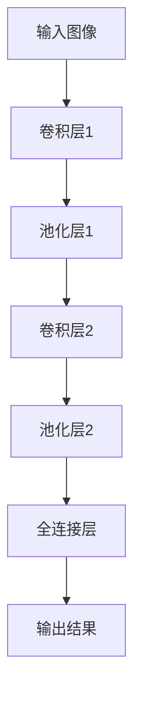
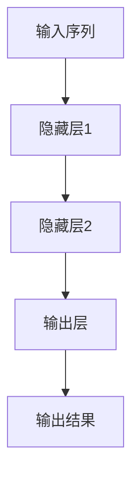

                 

# 深入理解AI、LLM和深度学习：一个综合课程

> **关键词**：人工智能，深度学习，语言模型，LLM，自然语言处理，计算机视觉，推荐系统，项目实战，开源社区。

> **摘要**：本文将为您提供一个全面而深入的AI、LLM和深度学习综合课程。我们将从基础概念出发，逐步深入到各种深度学习模型的原理与应用，探讨其在各个领域的实际应用，并通过实战案例展示如何实现这些模型。此外，我们还将关注AI伦理与社会影响，以及深度学习系统的优化与部署。无论您是初学者还是有经验的工程师，本文都将为您提供宝贵的知识和实践经验。

---

## 目录大纲

### 第一部分：AI基础概念与原理

#### 第1章：AI概述
1.1 AI的定义与历史背景
1.2 AI的主要类别与技术
1.3 AI的现状与发展趋势

#### 第2章：人工智能的基本原理
2.1 机器学习基础
2.1.1 监督学习
2.1.2 无监督学习
2.1.3 强化学习
2.2 深度学习基础
2.2.1 深度学习的基本概念
2.2.2 神经网络与反向传播算法
2.2.3 卷积神经网络（CNN）与循环神经网络（RNN）

#### 第3章：深度学习基础
3.1 深度学习的基本概念
3.2 神经网络与反向传播算法
3.3 卷积神经网络（CNN）与循环神经网络（RNN）

#### 第4章：强化学习原理与应用
4.1 强化学习基础
4.1.1 Q-Learning算法
4.1.2 Deep Q-Network（DQN）
4.1.3 Policy Gradient方法
4.2 GAN的原理与结构
4.2.1 生成器与判别器
4.2.2 GAN的训练与优化
4.2.3 GAN的应用场景

#### 第5章：自然语言处理（NLP）
5.1 NLP的基本概念
5.2 词嵌入与序列模型
5.2.1 Word2Vec算法
5.2.2 序列到序列（Seq2Seq）模型
5.2.3 Transformer模型

#### 第6章：语言模型与语言理解
6.1 语言模型的基本原理
6.1.1 语言模型分类
6.1.2 语言模型的评估方法
6.1.3 语言模型的应用

#### 第7章：对话系统
7.1 对话系统的基本架构
7.1.1 基于规则的方法
7.1.2 基于统计的方法
7.1.3 基于深度学习的方法

#### 第8章：AI伦理与社会影响
8.1 AI伦理的基本原则
8.1.1 公平性
8.1.2 透明度
8.1.3 安全性
8.2 AI对社会的影响
8.2.1 经济影响
8.2.2 社会影响
8.2.3 道德与法律问题

### 第二部分：深度学习模型应用

#### 第9章：深度学习在计算机视觉中的应用
9.1 卷积神经网络在图像分类中的应用
9.1.1 AlexNet模型
9.1.2 VGG模型
9.1.3 ResNet模型
9.2 深度学习在目标检测中的应用
9.2.1 R-CNN模型
9.2.2 Fast R-CNN模型
9.2.3 Faster R-CNN模型

#### 第10章：深度学习在自然语言处理中的应用
10.1 语言模型与机器翻译
10.1.1 基于N-gram的语言模型
10.1.2 基于深度学习的机器翻译
10.1.3 Transformer模型在机器翻译中的应用
10.2 文本分类与情感分析
10.2.1 文本分类方法
10.2.2 情感分析算法
10.2.3 应用案例

#### 第11章：深度学习在推荐系统中的应用
11.1 基于内容的推荐
11.1.1 内容特征提取
11.1.2 内容相似性计算
11.1.3 应用案例
11.2 基于协同过滤的推荐
11.2.1 协同过滤的基本原理
11.2.2 评分预测与推荐
11.2.3 应用案例

#### 第12章：深度学习在游戏与虚拟现实中的应用
12.1 深度强化学习在游戏中的应用
12.1.1 DQN在游戏中的应用
12.1.2 A3C在游戏中的应用
12.1.3 应用案例
12.2 深度学习在虚拟现实中的应用
12.2.1 虚拟现实的基本概念
12.2.2 深度学习在渲染中的应用
12.2.3 应用案例

#### 第13章：深度学习在金融领域的应用
13.1 金融时间序列预测
13.1.1 ARIMA模型
13.1.2 LSTM模型
13.1.3 应用案例
13.2 金融风险评估
13.2.1 信用评分模型
13.2.2 风险模型
13.2.3 应用案例

### 第三部分：深度学习实战

#### 第14章：深度学习环境搭建
14.1 深度学习工具选择
14.1.1 TensorFlow
14.1.2 PyTorch
14.1.3 Keras
14.2 深度学习硬件支持
14.2.1 GPU与TPU
14.2.2 分布式训练
14.2.3 云服务支持

#### 第15章：深度学习项目实战
15.1 计算机视觉项目
15.1.1 项目背景与目标
15.1.2 数据准备与预处理
15.1.3 模型设计与训练
15.1.4 评估与优化
15.2 自然语言处理项目
15.2.1 项目背景与目标
15.2.2 数据准备与预处理
15.2.3 模型设计与训练
15.2.4 评估与优化

#### 第16章：深度学习系统优化与部署
16.1 模型压缩与加速
16.1.1 模型压缩方法
16.1.2 模型加速技术
16.1.3 应用案例
16.2 深度学习系统部署
16.2.1 部署环境配置
16.2.2 模型推理与优化
16.2.3 应用案例

#### 第17章：深度学习开源项目与社区
17.1 深度学习开源项目介绍
17.1.1 TensorFlow开源项目
17.1.2 PyTorch开源项目
17.1.3 其他开源项目
17.2 深度学习社区与资源
17.2.1 社区组织
17.2.2 开源资源
17.2.3 学术会议与论坛

## 第一部分：AI基础概念与原理

### 第1章：AI概述

#### 1.1 AI的定义与历史背景

人工智能（Artificial Intelligence，简称AI）是计算机科学的一个分支，旨在研究、开发和应用使计算机系统能够模拟、延伸和扩展人类的智能行为的技术。AI的研究始于20世纪50年代，当时计算机科学刚刚起步。最初，AI的目标是开发能够解决复杂问题的通用智能系统。

AI的发展可以分为几个阶段：

- **符号主义阶段（1956-1974）**：这一阶段以1956年在达特茅斯会议上首次提出人工智能概念为标志，主要采用基于符号逻辑和知识表示的方法。
- **第一个AI寒冬（1974-1980）**：由于实际应用中的困难，AI研究陷入低潮，资金和人才流失。
- **专家系统阶段（1980-1987）**：专家系统在医疗诊断、地质勘探等领域取得显著成就，但仍然面临性能和可扩展性的挑战。
- **第二次AI寒冬（1987-1993）**：人工智能再次遭遇困境，部分原因是缺乏实际应用案例和资金支持。
- **机器学习兴起（1993-2006）**：以神经网络为代表的机器学习方法得到快速发展，AI逐渐在语音识别、图像分类等领域取得突破。
- **深度学习时代（2006至今）**：深度学习技术的突破，使得AI在图像识别、自然语言处理等领域的性能大幅提升，应用场景也越来越广泛。

#### 1.2 AI的主要类别与技术

人工智能可以分为多个类别，包括：

- **弱AI（弱人工智能）**：特定任务的人工智能，如语音识别、图像识别等。
- **强AI（强人工智能）**：具有全面认知能力，能够进行思考、学习、理解和解决问题的智能体，目前尚未实现。
- **混合AI**：结合多种人工智能技术，以实现更复杂的功能。

主要的人工智能技术包括：

- **机器学习**：一种让计算机通过数据学习并进行预测或决策的方法，包括监督学习、无监督学习和强化学习。
- **深度学习**：一种特殊的机器学习方法，通过多层神经网络进行数据建模，是目前AI领域最热门的技术之一。
- **自然语言处理**：研究如何让计算机理解和生成自然语言，包括词嵌入、语言模型、机器翻译等。
- **计算机视觉**：研究如何让计算机理解并处理图像和视频数据，包括图像分类、目标检测、人脸识别等。
- **强化学习**：一种基于奖励机制的学习方法，通过不断尝试和反馈来学习最优策略。
- **生成对抗网络（GAN）**：一种由生成器和判别器组成的深度学习模型，用于生成高质量的数据。

#### 1.3 AI的现状与发展趋势

当前，人工智能已经在各个领域取得了显著进展，如：

- **医疗**：通过机器学习和深度学习技术，AI可以辅助医生进行诊断、治疗和药物研发。
- **金融**：AI在金融风险管理、信用评分、算法交易等方面发挥着重要作用。
- **零售**：通过自然语言处理和计算机视觉技术，AI可以帮助商家进行商品推荐、库存管理和客户服务。
- **自动驾驶**：深度学习和计算机视觉技术为自动驾驶汽车提供了核心技术支持。
- **智能家居**：智能家居设备通过AI技术实现智能语音助手、智能安防等功能。

未来，AI的发展趋势包括：

- **硬件创新**：随着硬件技术的发展，如GPU、TPU等专用硬件的出现，AI模型的计算能力和效率将进一步提升。
- **更多应用场景**：AI技术将在更多领域得到应用，如教育、农业、环境监测等。
- **算法优化**：深度学习算法和模型将不断优化，以适应更复杂的任务和数据。
- **人机协作**：AI将与人类更加紧密地协作，以提高生产效率和生活质量。

总之，人工智能正逐渐改变我们的世界，未来有着广阔的发展前景和应用空间。

### 第2章：人工智能的基本原理

#### 2.1 机器学习基础

机器学习（Machine Learning，ML）是人工智能的核心组成部分，它让计算机通过数据学习并做出预测或决策。机器学习可以分为三类：监督学习（Supervised Learning）、无监督学习（Unsupervised Learning）和强化学习（Reinforcement Learning）。

##### 2.1.1 监督学习

监督学习是一种最常用的机器学习方法，它通过有标签的数据进行学习。监督学习的目标是找到一个映射函数，将输入数据映射到输出结果。监督学习分为两类：

- **回归问题**：输出为连续值，如预测房价、股票价格等。
- **分类问题**：输出为离散值，如垃圾邮件分类、动物图像识别等。

监督学习的主要算法包括：

- **线性回归（Linear Regression）**：通过找到最佳拟合直线来预测输出值。
- **逻辑回归（Logistic Regression）**：用于分类问题，通过计算概率来预测类别。
- **支持向量机（Support Vector Machine，SVM）**：通过找到一个最优超平面来分割数据。
- **决策树（Decision Tree）**：通过一系列条件判断来预测输出值。
- **随机森林（Random Forest）**：基于决策树的集成方法，通过组合多个决策树来提高预测性能。
- **神经网络（Neural Networks）**：通过多层神经网络来建模复杂非线性关系。

##### 2.1.2 无监督学习

无监督学习不需要标签数据，它通过发现数据中的模式和结构来进行学习。无监督学习的主要算法包括：

- **聚类（Clustering）**：将相似的数据点分组，如K-means聚类、层次聚类等。
- **降维（Dimensionality Reduction）**：通过减少数据维度来提高数据可视化和分析性能，如主成分分析（PCA）、t-SNE等。
- **关联规则学习（Association Rule Learning）**：通过发现数据中的关联规则来识别潜在的模式和关系。

##### 2.1.3 强化学习

强化学习是一种基于奖励机制的学习方法，它通过试错和反馈来学习最优策略。强化学习的主要算法包括：

- **Q-Learning**：通过估计每个状态和动作的Q值来选择最佳动作。
- **深度Q网络（Deep Q-Network，DQN）**：通过神经网络来估计Q值，用于解决更复杂的问题。
- **策略梯度方法（Policy Gradient）**：直接优化策略函数，以提高预期奖励。

#### 2.2 深度学习基础

深度学习（Deep Learning，DL）是一种特殊的机器学习方法，它通过多层神经网络来建模复杂的数据关系。深度学习在图像识别、自然语言处理等领域取得了突破性进展。

##### 2.2.1 深度学习的基本概念

- **神经网络（Neural Networks）**：神经网络是深度学习的基础，它由多个神经元（节点）组成，通过加权连接形成网络结构。
- **前向传播（Forward Propagation）**：在前向传播过程中，输入数据通过网络中的各个层，每个层将数据传递给下一层，最终得到输出结果。
- **反向传播（Back Propagation）**：在反向传播过程中，网络根据输出结果和真实值计算损失函数，并更新网络参数，以减小损失。
- **激活函数（Activation Function）**：激活函数用于引入非线性因素，使神经网络能够学习复杂的关系。

常用的激活函数包括：

- ** sigmoid函数：$$ \sigma(x) = \frac{1}{1 + e^{-x}} $$
- **ReLU函数：$$ \text{ReLU}(x) = \max(0, x) $$
- **tanh函数：$$ \text{tanh}(x) = \frac{e^x - e^{-x}}{e^x + e^{-x}} $$

##### 2.2.2 神经网络与反向传播算法

神经网络由多个层次组成，包括输入层、隐藏层和输出层。每个层次由多个神经元组成，每个神经元都与前一层次的神经元相连。

在训练过程中，神经网络通过以下步骤进行优化：

1. **前向传播**：将输入数据传递给网络，通过网络前向传播，得到输出结果。
2. **计算损失**：计算输出结果和真实值之间的差异，得到损失函数。
3. **反向传播**：根据损失函数，计算网络参数的梯度，并通过反向传播更新网络参数。
4. **迭代优化**：重复前向传播和反向传播，直到网络参数达到最优状态。

反向传播算法的伪代码如下：

```python
while not converged:
    # 前向传播
    output = forward propagation(input)
    
    # 计算损失
    loss = compute_loss(output, target)
    
    # 反向传播
    gradients = backward propagation(output, target)
    
    # 更新参数
    update_parameters(gradients)
```

##### 2.2.3 卷积神经网络（CNN）与循环神经网络（RNN）

卷积神经网络（CNN）和循环神经网络（RNN）是深度学习中的两种重要架构。

- **卷积神经网络（CNN）**：CNN主要用于处理图像数据，它通过卷积层、池化层和全连接层进行图像特征的提取和分类。

  CNN的主要组成部分包括：

  - **卷积层（Convolutional Layer）**：通过卷积运算提取图像特征。
  - **池化层（Pooling Layer）**：通过下采样减少数据维度，提高计算效率。
  - **全连接层（Fully Connected Layer）**：通过全连接层将提取的特征映射到输出类别。

  CNN的流程如下：

  ```mermaid
  graph TD
  A[输入图像] --> B[卷积层1]
  B --> C[池化层1]
  C --> D[卷积层2]
  D --> E[池化层2]
  E --> F[全连接层]
  F --> G[输出结果]
  ```

- **循环神经网络（RNN）**：RNN主要用于处理序列数据，如时间序列、文本等。RNN通过循环结构将前一时间步的信息传递到后一时间步，以建模序列数据。

  RNN的主要组成部分包括：

  - **隐藏层（Hidden Layer）**：用于存储当前状态和前一状态的信息。
  - **输入门（Input Gate）**：用于控制当前输入信息的重要性。
  - **遗忘门（Forget Gate）**：用于控制前一状态信息的保留和遗忘。
  - **输出门（Output Gate）**：用于控制当前输出信息的重要性。

  RNN的流程如下：

  ```mermaid
  graph TD
  A[输入序列] --> B[隐藏层1]
  B --> C[输入门]
  B --> D[遗忘门]
  B --> E[输出门]
  B --> F[隐藏层2]
  F --> G[输出结果]
  ```

综上所述，深度学习是人工智能领域的重要技术，它通过多层神经网络来建模复杂的数据关系。在下一章中，我们将继续探讨深度学习的更多基础知识，包括神经网络与反向传播算法的深入讲解。

### 第3章：深度学习基础

#### 3.1 深度学习的基本概念

深度学习（Deep Learning，DL）是一种通过多层神经网络对数据进行建模和分析的机器学习方法。与传统机器学习方法相比，深度学习能够自动从大量数据中学习出复杂的特征表示，从而在许多领域取得了显著的效果。深度学习的基本概念包括：

- **神经网络（Neural Networks）**：神经网络是深度学习的基础，它由多个神经元组成，每个神经元都与其他神经元通过权重连接。神经网络通过模拟人脑神经元的工作原理，对输入数据进行处理和转换。
- **多层神经网络（Multi-Layer Neural Networks）**：多层神经网络包括输入层、隐藏层和输出层。隐藏层可以有多层，每层都对输入数据进行特征提取和转换，最终输出层的输出结果表示对输入数据的分类或回归结果。
- **前向传播（Forward Propagation）**：前向传播是神经网络处理输入数据的过程。输入数据从输入层传递到隐藏层，再从隐藏层传递到输出层，每层都对输入数据进行线性变换和激活函数运算。
- **反向传播（Back Propagation）**：反向传播是神经网络优化参数的过程。通过计算输出结果与真实结果之间的误差，反向传播误差到隐藏层和输入层，更新每个神经元的权重和偏置。
- **激活函数（Activation Function）**：激活函数用于引入非线性因素，使神经网络能够建模复杂的关系。常见的激活函数包括sigmoid函数、ReLU函数和tanh函数。

#### 3.2 神经网络与反向传播算法

神经网络（Neural Networks）是深度学习中的核心组成部分，它由多个神经元组成，每个神经元都可以看作是一个简单的函数单元。神经网络的基本结构包括：

1. **输入层（Input Layer）**：输入层接收外部输入数据，如图像、文本或时间序列等。
2. **隐藏层（Hidden Layers）**：隐藏层位于输入层和输出层之间，对输入数据进行特征提取和转换。隐藏层可以有多层，每层都可以学习到更高层次的特征表示。
3. **输出层（Output Layer）**：输出层将隐藏层的结果映射到具体的输出类别或回归值。

反向传播算法（Back Propagation Algorithm）是神经网络训练的核心算法，它通过计算输出结果与真实结果之间的误差，反向传播误差到隐藏层和输入层，并更新每个神经元的权重和偏置，以最小化损失函数。

反向传播算法的步骤如下：

1. **前向传播**：输入数据通过输入层传递到隐藏层，再从隐藏层传递到输出层。每个神经元都对输入数据进行线性变换和激活函数运算，得到输出结果。
2. **计算损失**：计算输出结果与真实结果之间的误差，通常使用均方误差（MSE）或交叉熵（Cross Entropy）作为损失函数。
3. **计算梯度**：通过反向传播算法，计算输出层、隐藏层和输入层的梯度，即每个参数的偏导数。
4. **参数更新**：根据梯度计算结果，更新每个神经元的权重和偏置，以减小损失函数。
5. **迭代优化**：重复前向传播、计算损失、计算梯度和参数更新的过程，直到网络参数达到最优状态。

反向传播算法的伪代码如下：

```python
while not converged:
    # 前向传播
    output = forward_propagation(input)
    
    # 计算损失
    loss = compute_loss(output, target)
    
    # 计算梯度
    gradients = backward_propagation(output, target)
    
    # 更新参数
    update_parameters(gradients)
```

#### 3.3 卷积神经网络（CNN）与循环神经网络（RNN）

卷积神经网络（Convolutional Neural Networks，CNN）和循环神经网络（Recurrent Neural Networks，RNN）是深度学习中的两种重要架构，分别适用于处理图像数据和序列数据。

##### 3.3.1 卷积神经网络（CNN）

卷积神经网络主要用于处理二维数据，如图像。CNN的核心思想是通过卷积运算和池化运算来提取图像特征，从而实现图像分类、目标检测等任务。

1. **卷积层（Convolutional Layer）**：卷积层通过卷积运算提取图像特征。卷积运算将卷积核（过滤器）与输入图像进行卷积，生成特征图。卷积核的参数（权重和偏置）需要通过训练进行优化。

   卷积运算的伪代码如下：

   ```python
   def convolution(input_image, filter):
       output = zeros((height, width, depth))
       for i in range(height):
           for j in range(width):
               for k in range(depth):
                   output[i, j, k] = sum(input_image[i:i+filter_size, j:j+filter_size, k] * filter)
       return output
   ```

2. **池化层（Pooling Layer）**：池化层通过下采样操作减少数据维度，提高计算效率。常见的池化操作包括最大池化（Max Pooling）和平均池化（Average Pooling）。

   最大池化的伪代码如下：

   ```python
   def max_pooling(input_image, pool_size):
       output = zeros((new_height, new_width))
       for i in range(new_height):
           for j in range(new_width):
               output[i, j] = max(input_image[i*pool_size:i*pool_size+pool_size, j*pool_size:j*pool_size+pool_size])
       return output
   ```

3. **全连接层（Fully Connected Layer）**：全连接层将卷积层和池化层提取的特征映射到具体的输出类别或回归值。

   全连接层的伪代码如下：

   ```python
   def fully_connected(input_features, weights, bias):
       output = dot(input_features, weights) + bias
       return output
   ```

CNN的流程如下：



##### 3.3.2 循环神经网络（RNN）

循环神经网络主要用于处理一维数据，如时间序列和文本。RNN的核心思想是通过循环结构将前一时刻的信息传递到当前时刻，以建模序列数据。

1. **隐藏层（Hidden Layer）**：隐藏层存储当前时刻和前一时刻的信息。隐藏层由门控单元（Gates）组成，包括输入门（Input Gate）、遗忘门（Forget Gate）和输出门（Output Gate）。

   隐藏层的伪代码如下：

   ```python
   def hidden_layer(input, hidden_prev, weights, bias):
       input_gate = sigmoid(dot(input, input_weights) + dot(hidden_prev, recurrent_weights) + bias)
       forget_gate = sigmoid(dot(input, forget_weights) + dot(hidden_prev, recurrent_weights) + bias)
       output_gate = sigmoid(dot(input, output_weights) + dot(hidden_prev, recurrent_weights) + bias)
       hidden = input_gate * input + forget_gate * hidden_prev
       return hidden
   ```

2. **输出层（Output Layer）**：输出层将隐藏层的结果映射到具体的输出类别或回归值。

   输出层的伪代码如下：

   ```python
   def output_layer(hidden, weights, bias):
       output = sigmoid(dot(hidden, weights) + bias)
       return output
   ```

RNN的流程如下：



综上所述，深度学习是人工智能领域的重要技术，它通过多层神经网络对数据进行建模和分析。卷积神经网络（CNN）和循环神经网络（RNN）是深度学习中的两种重要架构，分别适用于处理图像数据和序列数据。在下一章中，我们将继续探讨强化学习和生成对抗网络（GAN）的基本原理和应用。

### 第4章：强化学习原理与应用

强化学习（Reinforcement Learning，RL）是一种机器学习范式，旨在通过试错和反馈来学习最优策略。与传统的监督学习和无监督学习不同，强化学习侧重于通过环境（Environment）与智能体（Agent）的交互来获取奖励（Reward），以实现长期目标。本章将详细介绍强化学习的基本概念、核心算法及其实际应用。

#### 4.1 强化学习基础

强化学习由以下四个主要组成部分构成：状态（State）、动作（Action）、奖励（Reward）和策略（Policy）。

- **状态（State）**：状态是描述环境当前状态的向量，通常用S表示。
- **动作（Action）**：动作是智能体在特定状态下可以选择的行为，通常用A表示。
- **奖励（Reward）**：奖励是环境对智能体行为的即时评价，用来指导智能体的决策过程，通常用R表示。
- **策略（Policy）**：策略是智能体在给定状态下选择动作的规则，通常用π表示。策略可以通过值函数（Value Function）或策略梯度方法（Policy Gradient）来学习。

强化学习的目标是找到一个最优策略π*，使得智能体在长期运行中获得的累积奖励最大化。数学上，可以表示为：

$$ J(\pi) = \sum_{s \in S} \sum_{a \in A} \pi(a|s) \cdot R(s, a) $$

其中，π(a|s)是策略π在状态s下选择动作a的概率。

#### 4.1.1 Q-Learning算法

Q-Learning是一种基于值函数的强化学习算法，通过学习状态-动作值函数Q(s, a)来指导智能体的动作选择。Q-Learning的核心思想是更新状态-动作值函数，以最大化期望奖励。

Q-Learning的更新公式为：

$$ Q(s, a) \leftarrow Q(s, a) + \alpha [R(s, a) + \gamma \max_{a'} Q(s', a') - Q(s, a)] $$

其中，α是学习率（Learning Rate），γ是折扣因子（Discount Factor），用来平衡当前奖励和未来奖励的重要性。

Q-Learning算法的伪代码如下：

```python
while not done:
    # 选择动作
    a = choose_action(s, policy)
    
    # 执行动作
    s', r = environment.step(s, a)
    
    # 更新Q值
    Q(s, a) = Q(s, a) + alpha * (r + gamma * max(Q(s', a')) - Q(s, a))
    
    # 更新状态
    s = s'
```

#### 4.1.2 Deep Q-Network（DQN）

Deep Q-Network（DQN）是结合深度学习与Q-Learning的强化学习算法。DQN使用深度神经网络来近似Q值函数，从而解决传统Q-Learning在状态空间连续或维度较高时难以处理的局限性。

DQN的主要组成部分包括：

- **经验回放（Experience Replay）**：为了解决样本相关性问题，DQN使用经验回放机制，将智能体在环境中经历的状态、动作、奖励和下一状态存储在一个经验池中，然后随机从经验池中抽取样本进行训练。
- **目标网络（Target Network）**：为了稳定训练过程，DQN使用一个目标网络来评估当前智能体的策略。目标网络的参数定期从主网络复制，以减少训练误差的影响。

DQN算法的伪代码如下：

```python
initialize Q-network, target network, experience replay buffer
episodes = 10000

for episode in range(1, episodes + 1):
    # 初始化环境
    state = environment.reset()
    
    # 开始 episode
    done = False
    total_reward = 0
    
    while not done:
        # 选择动作
        action = choose_action(state, Q-network)
        
        # 执行动作
        next_state, reward, done = environment.step(action)
        
        # 存储经验
        replay_buffer.append((state, action, reward, next_state, done))
        
        # 从经验回放中随机采样一批经验
        if len(replay_buffer) > batch_size:
            batch = random.sample(replay_buffer, batch_size)
            states, actions, rewards, next_states, dones = zip(*batch)
            
            # 更新目标网络
            targets = [reward if done else reward + gamma * max(Q-network(next_state)) for done in dones]
            Q_target = Q-network(states)
            Q_target[range(batch_size), actions] = targets
            
            # 更新主网络
            Q-network.learn(Q-target)
            
            # 更新状态
            state = next_state
    
    # 更新目标网络参数
    if episode % target_update_frequency == 0:
        target_network.copy_from(Q-network)

```

#### 4.1.3 Policy Gradient方法

Policy Gradient方法直接优化策略π，通过估计策略的梯度来更新策略参数。Policy Gradient方法的关键挑战在于估计策略梯度时面临的高方差问题。

常见的Policy Gradient方法包括：

- **策略梯度（Policy Gradient）**：直接优化策略π，梯度计算公式为：

  $$ \nabla_\theta J(\pi(\theta)) = \sum_{s,a} \pi(a|s) \nabla_a \log \pi(a|s) \cdot R(s,a) $$

- **优势函数（ Advantage Function）**：为了减少方差，可以使用优势函数（Advantage Function）来改善梯度估计：

  $$ A(s, a) = Q(s, a) - V(s) $$

  其中，Q(s, a)是状态-动作值函数，V(s)是状态值函数。优势函数表示在状态s下，采取动作a获得的额外奖励。

  改进后的Policy Gradient方法为：

  $$ \nabla_\theta J(\pi(\theta)) = \sum_{s,a} \pi(a|s) \nabla_a \log \pi(a|s) \cdot A(s, a) $$

- **策略梯度的蒙特卡洛估计（Monte Carlo Policy Gradient）**：通过采样大量轨迹来估计策略梯度，这种方法称为蒙特卡洛Policy Gradient。其计算公式为：

  $$ \nabla_\theta J(\pi(\theta)) = \frac{1}{N} \sum_{i=1}^N \nabla_a \log \pi(a|s_i) \cdot R(s_i, a_i) $$

  其中，N是轨迹数量，$s_i, a_i$是轨迹中的状态和动作。

#### 4.2 GAN的原理与结构

生成对抗网络（Generative Adversarial Network，GAN）是Ian Goodfellow等人于2014年提出的一种深度学习模型。GAN由两个深度神经网络组成：生成器（Generator）和判别器（Discriminator）。

- **生成器（Generator）**：生成器旨在生成逼真的数据，通常是一个生成模型，它通过随机噪声输入生成数据。生成器的目标是最大化判别器对其生成数据的判别误差。

  生成器的训练目标为：

  $$ G: Z \rightarrow \mathcal{X}, \max_{G} \mathbb{E}_{z \sim p_z(z)} [\log D(G(z))] $$

  其中，$Z$是噪声空间，$G(z)$是生成器生成的数据，$D(\cdot)$是判别器。

- **判别器（Discriminator）**：判别器旨在区分真实数据和生成数据，通常是一个分类模型。判别器的目标是最大化其正确分类真实数据和生成数据的概率。

  判别器的训练目标为：

  $$ D: \mathcal{X} \rightarrow [0, 1], \max_{D} \mathbb{E}_{x \sim p_{data}(x)} [\log D(x)] + \mathbb{E}_{z \sim p_z(z)} [\log (1 - D(G(z))] $$

  其中，$X$是数据空间，$p_{data}(x)$是真实数据分布。

GAN的训练过程可以看作是生成器和判别器之间的对抗性游戏。在训练过程中，生成器和判别器交替更新参数，以最大化各自的损失函数。

GAN的训练过程伪代码如下：

```python
initialize G and D
for epoch in range(num_epochs):
    for batch in data_loader:
        # 训练判别器
        D.zero_grad()
        x = batch
        z = noise
        x_fake = G(z)
        D_real = D(x)
        D_fake = D(x_fake)
        loss_D = loss(D_real, 1) + loss(D_fake, 0)
        loss_D.backward()
        D_optimizer.step()

        # 训练生成器
        G.zero_grad()
        z = noise
        x_fake = G(z)
        D_fake = D(x_fake)
        loss_G = loss(D_fake, 1)
        loss_G.backward()
        G_optimizer.step()
```

GAN的应用场景非常广泛，包括图像生成、图像修复、图像翻译等。以下是一个简单的GAN应用示例：

```python
import torch
import torch.nn as nn
import torch.optim as optim

# 定义生成器和判别器
G = Generator()
D = Discriminator()

# 定义损失函数和优化器
criterion = nn.BCELoss()
G_optimizer = optim.Adam(G.parameters(), lr=0.001)
D_optimizer = optim.Adam(D.parameters(), lr=0.001)

# 训练模型
num_epochs = 100

for epoch in range(num_epochs):
    for i, batch in enumerate(data_loader):
        # 训练判别器
        D.zero_grad()
        real_images = batch
        batch_size = real_images.size(0)
        z = torch.randn(batch_size, z_dim).to(device)
        fake_images = G(z)
        real_labels = torch.ones(batch_size, 1).to(device)
        fake_labels = torch.zeros(batch_size, 1).to(device)
        D_real = D(real_images)
        D_fake = D(fake_images)
        D_loss = criterion(D_real, real_labels) + criterion(D_fake, fake_labels)
        D_loss.backward()
        D_optimizer.step()

        # 训练生成器
        G.zero_grad()
        z = torch.randn(batch_size, z_dim).to(device)
        fake_images = G(z)
        D_fake = D(fake_images)
        G_loss = criterion(D_fake, real_labels)
        G_loss.backward()
        G_optimizer.step()

        if i % 100 == 0:
            print(f'Epoch [{epoch}/{num_epochs}], Step [{i}/{len(data_loader)}], D_loss: {D_loss.item():.4f}, G_loss: {G_loss.item():.4f}')
```

通过以上内容，我们了解了强化学习的基本原理及其核心算法，以及GAN的原理和训练过程。在下一章中，我们将探讨自然语言处理（NLP）的基础知识，包括词嵌入、序列模型和Transformer模型。

### 第5章：自然语言处理（NLP）

#### 5.1 NLP的基本概念

自然语言处理（Natural Language Processing，NLP）是人工智能和计算机科学的一个分支，旨在让计算机理解和生成人类语言。NLP的研究领域广泛，包括文本处理、语言理解、语言生成和对话系统等。NLP在多个领域具有广泛的应用，如信息检索、机器翻译、情感分析、文本分类和问答系统等。

NLP的基本任务包括：

- **文本预处理**：包括分词、词性标注、句法分析等，将原始文本转换为计算机可处理的格式。
- **实体识别**：识别文本中的命名实体，如人名、地点、组织等。
- **关系抽取**：从文本中提取实体之间的语义关系，如“属于”、“位于”等。
- **情感分析**：分析文本中的情感倾向，判断是正面、负面还是中性。
- **机器翻译**：将一种语言的文本翻译成另一种语言。
- **问答系统**：根据用户的问题，从大量文本中检索出相关答案。

#### 5.2 词嵌入与序列模型

词嵌入（Word Embedding）是将词语映射为密集向量表示的技术，使得计算机能够理解词语的语义关系。词嵌入的常见方法包括：

- **基于频率的方法**：如TF-IDF，根据词语在文档中的频率和文档集合中的文档频率来计算词向量。
- **基于分布的方法**：如Word2Vec，通过词频统计和神经网络训练来学习词向量。
- **基于上下文的方法**：如BERT，通过预训练大型的语言模型来学习词语在不同上下文中的意义。

序列模型（Sequential Models）是处理序列数据的模型，如时间序列和文本。常见的序列模型包括：

- **循环神经网络（RNN）**：通过循环结构将前一时刻的信息传递到当前时刻，对序列数据进行建模。
- **长短时记忆网络（LSTM）**：LSTM是RNN的一种改进，能够学习长距离依赖。
- **门控循环单元（GRU）**：GRU是LSTM的简化版本，同样能够学习长距离依赖。
- **Transformer**：Transformer模型是序列模型的最新进展，通过自注意力机制来建模序列数据。

#### 5.2.1 Word2Vec算法

Word2Vec是一种基于分布式假设的词嵌入算法，旨在将词语映射为向量表示。Word2Vec算法的核心思想是通过上下文信息来学习词语的语义关系。

Word2Vec算法主要有两种实现方式：

- **连续词袋（Continuous Bag of Words，CBOW）**：CBOW算法通过上下文窗口中的词语来预测中心词。给定一个中心词，CBOW算法计算上下文窗口中所有词语的平均向量作为中心词的向量表示。

  CBOW算法的伪代码如下：

  ```python
  def CBOW(context_words, center_word, window_size, embedding_size):
      center_word_vector = sum([word_embedding(word) for word in context_words]) / window_size
      return center_word_vector
  ```

- **Skip-Gram（SG）**：SG算法通过中心词来预测上下文窗口中的词语。给定一个中心词，SG算法计算上下文窗口中所有词语的概率分布，使用神经网络或高斯分布来建模。

  SG算法的伪代码如下：

  ```python
  def SkipGram(center_word, context_words, window_size, embedding_size):
      context_word_vectors = [word_embedding(word) for word in context_words]
      return probability_distribution(context_word_vectors)
  ```

Word2Vec算法的训练过程包括：

1. **数据预处理**：对原始文本进行分词、去除停用词等预处理操作。
2. **构建词汇表**：将所有词语映射为唯一的索引。
3. **初始化词向量**：初始化所有词向量，通常为随机向量。
4. **训练词向量**：使用神经网络或负采样等方法训练词向量，使词向量能够正确地表示词语的语义关系。

#### 5.2.2 序列到序列（Seq2Seq）模型

序列到序列（Seq2Seq）模型是一种处理序列数据到序列数据的模型，常用于机器翻译、对话系统等任务。Seq2Seq模型的核心思想是将输入序列编码为一个固定长度的向量表示，然后解码为输出序列。

Seq2Seq模型的主要组成部分包括：

- **编码器（Encoder）**：编码器将输入序列编码为一个固定长度的向量表示，通常使用RNN或Transformer模型。
- **解码器（Decoder）**：解码器将编码器的输出解码为输出序列，通常使用RNN或Transformer模型。

Seq2Seq模型的训练过程包括：

1. **编码器训练**：使用输入序列训练编码器，使其能够编码输入序列。
2. **解码器训练**：使用编码器的输出序列训练解码器，使其能够解码输出序列。

Seq2Seq模型的伪代码如下：

```python
def encode_decode(input_sequence, target_sequence, encoder, decoder, loss_function):
    encoder_output = encoder(input_sequence)
    decoder_output = decoder(encoder_output)
    loss = loss_function(decoder_output, target_sequence)
    return loss
```

#### 5.2.3 Transformer模型

Transformer模型是序列模型的最新进展，通过自注意力机制（Self-Attention）来建模序列数据。Transformer模型的核心思想是将输入序列编码为固定长度的向量表示，然后使用多头自注意力机制和前馈神经网络进行特征提取和建模。

Transformer模型的主要组成部分包括：

- **嵌入层（Embedding Layer）**：将输入序列编码为词向量。
- **多头自注意力层（Multi-Head Self-Attention Layer）**：通过多头自注意力机制学习输入序列的不同关系。
- **前馈神经网络层（Feedforward Neural Network Layer）**：通过前馈神经网络对输入序列进行进一步处理。
- **编码器（Encoder）**：将输入序列编码为固定长度的向量表示。
- **解码器（Decoder）**：将编码器的输出解码为输出序列。

Transformer模型的训练过程包括：

1. **编码器训练**：使用输入序列训练编码器，使其能够编码输入序列。
2. **解码器训练**：使用编码器的输出序列训练解码器，使其能够解码输出序列。

Transformer模型的伪代码如下：

```python
def transformer(input_sequence, target_sequence, encoder, decoder, loss_function):
    encoder_output = encoder(input_sequence)
    decoder_output = decoder(encoder_output)
    loss = loss_function(decoder_output, target_sequence)
    return loss
```

通过以上内容，我们了解了自然语言处理（NLP）的基本概念、词嵌入和序列模型，以及Transformer模型。在下一章中，我们将探讨语言模型与语言理解，包括语言模型的基本原理、评估方法和应用。

### 第6章：语言模型与语言理解

#### 6.1 语言模型的基本原理

语言模型（Language Model，LM）是自然语言处理（NLP）中的一个核心组件，旨在预测自然语言中的下一个单词或字符。语言模型在许多NLP任务中扮演着重要角色，如机器翻译、文本生成、语音识别和对话系统等。一个有效的语言模型能够捕捉语言中的统计规律和上下文信息，从而提高NLP任务的性能。

语言模型可以分为基于统计的语言模型和基于深度学习的语言模型。

- **基于统计的语言模型**：这类语言模型通过分析大量文本数据，统计词语和短语出现的频率和概率，建立语言模型。常见的基于统计的语言模型包括N-gram模型、n元语言模型和概率语言模型。

- **基于深度学习的语言模型**：这类语言模型通过训练大规模的深度神经网络，自动学习语言中的复杂结构和上下文信息。常见的基于深度学习的语言模型包括循环神经网络（RNN）、长短期记忆网络（LSTM）、门控循环单元（GRU）和Transformer模型。

#### 6.1.1 语言模型分类

- **N-gram模型**：N-gram模型是一种基于统计的语言模型，它通过考虑前N个单词来预测下一个单词。N-gram模型的复杂度相对较低，但其在长文本中的表现较差，容易产生生硬的文本生成效果。

- **n元语言模型**：n元语言模型是N-gram模型的改进版本，通过引入n-1个马尔可夫假设，即当前单词的概率只与前一单词相关。n元语言模型在文本生成和语音识别等领域表现出较好的性能。

- **概率语言模型**：概率语言模型通过最大化文本的概率来生成文本，从而提高文本生成的连贯性和自然性。常见的概率语言模型包括基于n-gram的模型和基于神经网络的语言模型。

- **深度学习语言模型**：深度学习语言模型通过训练大规模的深度神经网络，自动学习语言中的复杂结构和上下文信息。深度学习语言模型在文本生成和语言理解任务中表现出色，如Transformer模型和BERT模型。

#### 6.1.2 语言模型的评估方法

评估语言模型的性能通常使用以下几种方法：

- **字符级别准确率（Character-Level Accuracy）**：通过计算生成的文本与目标文本在字符级别的匹配度来评估语言模型。这种方法简单直观，但容易受到噪声和细节的影响。

- **词汇级别准确率（Word-Level Accuracy）**：通过计算生成的文本与目标文本在词汇级别的匹配度来评估语言模型。这种方法比字符级别准确率更加稳定，但仍然无法捕捉到语义和上下文信息。

- **BLEU分数（BLEU Score）**：BLEU分数是一种基于n-gram重叠度的语言模型评估方法。它通过计算生成文本与参考文本在n-gram重叠度上的相似度来评估语言模型。BLEU分数在机器翻译和文本生成领域广泛应用，但容易受到参考文本选择和n-gram大小的影响。

- **Perplexity（困惑度）**：困惑度是语言模型在测试集上的表现指标，它表示模型在预测测试集时所需的信息量。困惑度越低，表示模型对测试集的预测越准确。困惑度可以通过以下公式计算：

  $$ Perplexity = \frac{1}{\sum_{w \in V} p(w)^2} $$

  其中，$V$是词汇表，$p(w)$是单词$w$的概率。

- **Token-Level Accuracy（Token级别的准确率）**：Token级别的准确率是通过计算生成文本与目标文本在单词级别上的匹配度来评估语言模型。这种方法能够更好地捕捉到语义和上下文信息，但计算复杂度较高。

#### 6.1.3 语言模型的应用

语言模型在多个NLP任务中具有重要应用，包括：

- **文本生成**：语言模型可以用于生成自然流畅的文本，如文章、对话和新闻等。通过训练大规模的深度学习语言模型，如GPT-3和BERT，可以生成高质量的自然语言文本。

- **机器翻译**：语言模型可以用于机器翻译任务，将一种语言的文本翻译成另一种语言。基于深度学习语言模型的机器翻译方法，如Transformer模型，在性能和自然性方面取得了显著进展。

- **语音识别**：语言模型可以用于语音识别任务，通过预测语音信号中的单词和短语，提高识别的准确率和鲁棒性。

- **对话系统**：语言模型可以用于对话系统，如聊天机器人，通过理解用户的输入和生成适当的回复，提高对话的连贯性和自然性。

- **文本分类**：语言模型可以用于文本分类任务，通过分析文本中的词语和上下文信息，将文本分类到相应的类别中。

- **文本摘要**：语言模型可以用于文本摘要任务，通过生成简洁、准确的摘要，提高信息的可读性和可理解性。

- **问答系统**：语言模型可以用于问答系统，通过理解用户的问题和检索相关答案，提供准确的答案。

通过以上内容，我们了解了语言模型的基本原理、评估方法和应用。在下一章中，我们将探讨对话系统的基本架构，包括基于规则的方法、基于统计的方法和基于深度学习的方法。

### 第7章：对话系统

对话系统（Dialogue System）是一种与用户进行自然语言交互的人工智能系统，旨在理解用户的意图、生成适当的回复，并维持有效的对话。对话系统在客户服务、智能助手、虚拟助手和在线聊天等领域具有重要应用。本章将详细介绍对话系统的基本架构，包括基于规则的方法、基于统计的方法和基于深度学习的方法。

#### 7.1 对话系统的基本架构

对话系统通常由三个主要部分组成：前端（Frontend）、中间层（Middleware）和后端（Backend）。

- **前端**：前端是用户与对话系统交互的界面，负责接收用户的输入并显示系统的回复。前端通常包括聊天窗口、语音输入和语音输出等功能。
- **中间层**：中间层是对话系统的核心，负责解析用户的输入、理解用户的意图并生成适当的回复。中间层包括自然语言处理（NLP）模块、对话管理模块和语言生成模块。
- **后端**：后端是对话系统的支持系统，负责处理与对话相关的数据存储、业务逻辑和外部服务调用。后端通常包括数据库、API接口和服务端应用程序。

#### 7.1.1 基于规则的方法

基于规则的方法是一种传统的对话系统设计方法，通过预定义的规则来处理用户的输入并生成回复。基于规则的方法通常包括以下几个步骤：

1. **用户输入解析**：将用户的输入分解为关键信息，如关键字、短语和上下文等。
2. **意图识别**：通过规则库匹配用户的输入，识别用户的意图。意图识别通常基于关键词匹配、模式匹配或模糊匹配等规则。
3. **对话管理**：根据用户的意图和对话历史，选择合适的对话策略。对话管理包括对话状态跟踪、对话分支管理和回复生成等。
4. **语言生成**：根据对话管理和意图识别的结果，生成适当的回复文本。语言生成可以使用模板匹配、模板填充或自然语言生成等技术。

基于规则的方法的优点在于简单、易于实现和维护，但缺点在于规则库的构建和维护成本较高，且在复杂对话场景下表现较差。

#### 7.1.2 基于统计的方法

基于统计的方法是一种利用统计模型来处理对话系统的设计方法，通过分析大量对话数据来学习对话模式和规律。基于统计的方法通常包括以下几个步骤：

1. **用户输入解析**：与基于规则的方法类似，将用户的输入分解为关键信息。
2. **意图识别**：使用统计模型，如朴素贝叶斯分类器、决策树或随机森林等，来识别用户的意图。
3. **对话管理**：使用隐马尔可夫模型（HMM）、条件随机场（CRF）或长短时记忆网络（LSTM）等统计模型来跟踪对话状态、选择对话分支和生成回复。
4. **语言生成**：使用统计语言模型，如n-gram模型或基于神经网络的语言模型，来生成自然流畅的回复。

基于统计的方法的优点在于能够自动从大量数据中学习对话模式和规律，提高对话系统的自适应性和泛化能力，但缺点在于训练和推理复杂度较高，且在低资源场景下表现较差。

#### 7.1.3 基于深度学习的方法

基于深度学习的方法是一种利用深度神经网络来处理对话系统的设计方法，通过大规模数据训练深度神经网络来学习对话模式和生成回复。基于深度学习的方法通常包括以下几个步骤：

1. **用户输入解析**：与基于规则和基于统计的方法类似，将用户的输入分解为关键信息。
2. **意图识别**：使用深度学习模型，如卷积神经网络（CNN）、循环神经网络（RNN）或Transformer模型，来识别用户的意图。
3. **对话管理**：使用深度学习模型，如长短时记忆网络（LSTM）、门控循环单元（GRU）或Transformer模型，来跟踪对话状态、选择对话分支和生成回复。
4. **语言生成**：使用基于深度学习的语言模型，如GPT-2、GPT-3或BERT等，来生成自然流畅的回复。

基于深度学习的方法的优点在于能够自动从大规模数据中学习复杂的对话模式和生成高质量的语言，提高对话系统的性能和用户体验，但缺点在于训练和推理复杂度较高，且对数据依赖性较大。

#### 7.1.4 对比与选择

基于规则的方法、基于统计的方法和基于深度学习的方法各有优缺点。在实际应用中，可以根据对话系统的需求、资源和性能目标来选择合适的方法。

- **基于规则的方法**：适合简单、静态和高度结构化的对话场景，如客户服务和自动化问答系统。优点是简单、易于实现和维护，缺点是扩展性和自适应能力较差。

- **基于统计的方法**：适合复杂、动态和具有较强上下文依赖性的对话场景，如聊天机器人和虚拟助手。优点是自动从大量数据中学习对话模式和规律，提高自适应性和泛化能力，缺点是训练和推理复杂度较高，对数据依赖性较大。

- **基于深度学习的方法**：适合复杂、动态和具有较强上下文依赖性的对话场景，如智能助手和虚拟现实对话系统。优点是能够自动从大规模数据中学习复杂的对话模式和生成高质量的语言，提高对话系统的性能和用户体验，缺点是训练和推理复杂度较高，对数据依赖性较大。

通过以上内容，我们了解了对话系统的基本架构，包括基于规则的方法、基于统计的方法和基于深度学习的方法。在下一章中，我们将探讨AI伦理与社会影响，包括公平性、透明度和安全性等关键问题。

### 第8章：AI伦理与社会影响

人工智能（AI）的发展给社会带来了许多积极的影响，同时也引发了一系列伦理和社会问题。在本章中，我们将探讨AI伦理的基本原则，以及AI对社会的影响，特别是公平性、透明度和安全性等方面。

#### 8.1 AI伦理的基本原则

AI伦理的基本原则包括：

- **公平性（Fairness）**：AI系统应该平等对待所有人，不应因为种族、性别、年龄等因素而歧视或偏见。
- **透明度（Transparency）**：AI系统的决策过程和结果应该清晰透明，以便用户了解和信任。
- **安全性（Safety）**：AI系统应该确保用户和数据的安全，避免因错误决策或恶意攻击而导致负面影响。
- **隐私保护（Privacy Protection）**：AI系统应保护用户的隐私，不应滥用或泄露用户的个人信息。

#### 8.1.1 公平性

AI系统的公平性是一个重要问题，特别是在招聘、信贷审批、医疗诊断等涉及重大决策的领域。AI系统可能会因为数据中的偏见而表现出不公平的行为。以下是一些确保AI系统公平性的方法：

- **数据预处理**：在训练AI模型之前，对数据集进行预处理，去除或减少潜在的偏见。
- **算法评估**：使用多种评估指标来评估AI模型的公平性，如偏差-公平性度量（Bias-Fairness Measure）。
- **多样性训练**：在训练数据中加入不同群体的样本，以减少AI模型的偏见。
- **透明决策**：让AI系统的决策过程透明化，让用户了解决策的原因。

#### 8.1.2 透明度

AI系统的透明度对于用户信任和监管至关重要。提高AI系统透明度的方法包括：

- **可解释性AI（Explainable AI，XAI）**：开发可解释的AI模型，使人们能够理解模型的决策过程和结果。
- **模型可追溯性**：记录AI模型的训练数据、参数和决策过程，以便在需要时进行审查和验证。
- **用户界面**：设计直观的用户界面，让用户能够查看和了解AI系统的功能和限制。

#### 8.1.3 安全性

AI系统的安全性是一个关键问题，特别是在自动驾驶、医疗诊断和金融交易等领域。以下是一些确保AI系统安全性的方法：

- **安全测试**：对AI系统进行安全测试，发现并修复潜在的安全漏洞。
- **隐私保护**：设计安全的通信协议和存储方案，保护用户的隐私和数据安全。
- **冗余设计**：设计冗余系统，确保在主系统出现故障时，备用系统能够接管任务。
- **伦理审核**：在开发和应用AI系统时，进行伦理审核，确保系统的行为符合伦理规范。

#### 8.2 AI对社会的影响

AI对社会的影响是多方面的，包括经济、社会、文化和法律等方面。

- **经济影响**：AI可以提高生产效率，创造新的就业机会，但也可能导致某些职业的失业。AI还可以改善医疗、教育、金融等领域的服务，提高生活品质。

- **社会影响**：AI可以促进社会公平，减少偏见和歧视，但也可能导致社会分化和不平等。AI还可以提高人们的隐私风险，影响人际关系和社交互动。

- **文化影响**：AI可以改变人们的价值观和文化习惯，如虚拟现实和增强现实技术的普及，改变了人们的娱乐和社交方式。

- **法律影响**：AI的发展引发了一系列法律问题，如责任归属、隐私保护和知识产权等。法律体系需要不断适应和更新，以应对AI带来的挑战。

#### 8.2.1 经济影响

AI在经济领域的潜在影响包括：

- **生产效率提升**：AI可以帮助企业自动化重复性任务，提高生产效率，降低成本。
- **就业机会创造**：AI的发展将创造新的就业机会，如AI工程师、数据科学家和AI系统维护人员。
- **劳动力市场变化**：某些职业可能会因AI的普及而减少需求，而其他职业的需求可能会增加。

#### 8.2.2 社会影响

AI在社会领域的潜在影响包括：

- **社会公平**：AI可以帮助减少社会不平等，通过提供公平的评估和决策，如教育、招聘和信用评分。
- **隐私风险**：AI系统可能会收集和分析大量个人数据，提高隐私风险，影响个人隐私权。
- **人际关系**：AI可能会改变人际关系，如虚拟助手和社交媒体算法影响人们的社交互动。

#### 8.2.3 道德与法律问题

AI的道德与法律问题包括：

- **责任归属**：在AI系统导致事故或错误决策时，如何确定责任归属？
- **隐私保护**：如何确保AI系统不侵犯个人隐私？
- **知识产权**：如何保护AI系统的知识产权，如算法、数据和模型？
- **伦理审核**：如何确保AI系统的开发和应用符合伦理标准？

通过以上内容，我们探讨了AI伦理的基本原则、对社会的影响以及道德与法律问题。在下一章中，我们将讨论深度学习模型的应用，包括计算机视觉、自然语言处理、推荐系统等领域的实际应用。

### 第二部分：深度学习模型应用

#### 第9章：深度学习在计算机视觉中的应用

深度学习在计算机视觉（Computer Vision，CV）领域取得了显著的进展，使得计算机能够自动处理和解析图像和视频数据。本章将介绍深度学习在计算机视觉中的应用，包括图像分类、目标检测、图像分割和视频分析等。

#### 9.1 卷积神经网络在图像分类中的应用

图像分类是计算机视觉中最基本的任务之一，其目标是给输入图像分配一个预定义的类别标签。卷积神经网络（Convolutional Neural Networks，CNN）在图像分类任务中表现出色。

**CNN的基本结构**：

- **卷积层（Convolutional Layer）**：卷积层通过卷积运算提取图像的特征。卷积层包含多个卷积核（filter），每个卷积核都能捕捉到图像中不同类型的特征，如边缘、纹理等。
- **激活函数（Activation Function）**：激活函数引入非线性因素，使得CNN能够建模复杂的关系。
- **池化层（Pooling Layer）**：池化层通过下采样操作减少数据维度，提高计算效率。
- **全连接层（Fully Connected Layer）**：全连接层将卷积层和池化层提取的特征映射到具体的输出类别。

**CNN的典型模型**：

- **AlexNet**：是第一个在ImageNet竞赛中取得显著成绩的卷积神经网络，由5个卷积层、3个池化层和2个全连接层组成。
- **VGGNet**：是另一个在ImageNet竞赛中取得优异成绩的卷积神经网络，其特点在于使用多个卷积层和较小的卷积核尺寸（3x3）。
- **ResNet**：是具有残差连接的深度卷积神经网络，通过跳跃连接避免了深层网络训练中的梯度消失问题。

**图像分类的典型应用**：

- **图像识别**：如人脸识别、动物识别、物体识别等。
- **图像搜索**：如基于内容的图像搜索、图像识别等。

#### 9.2 深度学习在目标检测中的应用

目标检测是计算机视觉中的另一个重要任务，其目标是识别图像中的多个目标，并给出它们的位置和类别。深度学习在目标检测领域取得了显著的进展。

**目标检测的基本概念**：

- **区域提议（Region Proposal）**：目标检测通常包括区域提议和目标分类两个步骤。区域提议是从图像中生成可能包含目标的区域，如选择性搜索（Selective Search）、基于深度学习的区域提议等。
- **目标分类（Object Classification）**：在区域提议之后，对每个区域进行分类，判断是否为目标，并给出类别标签。

**深度学习在目标检测中的应用**：

- **R-CNN（Region-based Convolutional Neural Networks）**：R-CNN是最早的深度学习目标检测模型，它包括区域提议、特征提取和目标分类三个步骤。
- **Fast R-CNN**：Fast R-CNN在R-CNN的基础上引入了区域提议网络（Region Proposal Network，RPN），提高了目标检测的效率和准确性。
- **Faster R-CNN**：Faster R-CNN进一步改进了R-CNN和Fast R-CNN，通过使用区域提议网络（RPN）实现了端到端的目标检测。

**目标检测的典型应用**：

- **自动驾驶**：如车辆检测、行人检测、交通标志检测等。
- **视频监控**：如入侵检测、异常行为检测等。
- **图像检索**：如基于目标的图像搜索、图像识别等。

#### 9.3 深度学习在图像分割中的应用

图像分割是将图像划分为具有相似特征的区域的过程。深度学习在图像分割领域取得了显著的进展，使得计算机能够自动实现复杂图像的分割。

**图像分割的基本概念**：

- **语义分割（Semantic Segmentation）**：语义分割是将图像中的每个像素都分配一个类别标签，如前景和背景、车辆和行人等。
- **实例分割（Instance Segmentation）**：实例分割不仅进行语义分割，还为图像中的每个对象分配一个唯一的标识符，如区分不同的车辆或行人。

**深度学习在图像分割中的应用**：

- **FCN（Fully Convolutional Network）**：FCN是一种用于图像分割的卷积神经网络，它将卷积神经网络压缩为全卷积层，从而实现对图像的逐像素预测。
- **U-Net**：U-Net是一种专门用于医学图像分割的卷积神经网络，其结构特点在于具有较深的网络和较宽的连接路径，从而在图像分割任务中表现出色。

**图像分割的典型应用**：

- **医学图像处理**：如肿瘤分割、器官分割等。
- **自动驾驶**：如道路分割、车道线检测等。
- **视频监控**：如人脸检测、行为识别等。

#### 9.4 深度学习在视频分析中的应用

视频分析是计算机视觉的另一个重要应用领域，其目标是从视频中提取有用信息，如动作识别、行为分析、事件检测等。深度学习在视频分析领域也取得了显著的进展。

**视频分析的基本概念**：

- **动作识别（Action Recognition）**：动作识别是从视频中识别出特定动作的过程，如打乒乓球、跑步等。
- **行为分析（Behavior Analysis）**：行为分析是从视频中提取出具有特定特征的行为模式，如拥挤、打架等。
- **事件检测（Event Detection）**：事件检测是从视频中检测出具有特定意义的事件，如交通事故、火灾等。

**深度学习在视频分析中的应用**：

- **3D卷积神经网络（3D Convolutional Neural Networks）**：3D卷积神经网络可以处理视频序列数据，从而实现对视频的时空特征进行建模。
- **循环神经网络（Recurrent Neural Networks）**：循环神经网络可以处理序列数据，从而实现对视频的时序特征进行建模。
- **多任务学习（Multi-Task Learning）**：多任务学习可以将多个任务整合到一个深度学习模型中，从而提高视频分析的准确性和效率。

**视频分析的典型应用**：

- **安防监控**：如异常行为检测、入侵检测等。
- **智能交通**：如车辆检测、交通流量分析等。
- **运动分析**：如体育动作分析、舞蹈动作识别等。

通过以上内容，我们了解了深度学习在计算机视觉领域的广泛应用，包括图像分类、目标检测、图像分割和视频分析等。在下一章中，我们将探讨深度学习在自然语言处理领域的应用，包括语言模型、机器翻译和文本分类等。

#### 第10章：深度学习在自然语言处理中的应用

自然语言处理（Natural Language Processing，NLP）是人工智能领域的一个重要分支，旨在使计算机能够理解和生成人类语言。深度学习技术在NLP领域取得了显著的进展，使得许多传统任务变得更加高效和准确。本章将介绍深度学习在NLP中的主要应用，包括语言模型、机器翻译和文本分类等。

#### 10.1 语言模型与机器翻译

语言模型（Language Model，LM）是NLP的基础，它用于预测自然语言中的下一个词或字符。语言模型在许多NLP任务中发挥关键作用，如文本生成、机器翻译和语音识别等。

**基于深度学习的语言模型**：

- **循环神经网络（Recurrent Neural Networks，RNN）**：RNN是处理序列数据的传统方法，它通过保存前一时刻的信息来学习序列中的长期依赖关系。
- **长短期记忆网络（Long Short-Term Memory，LSTM）**：LSTM是RNN的一种改进，它通过引入门控机制来避免梯度消失问题，从而更好地学习长期依赖关系。
- **双向循环神经网络（Bidirectional RNN）**：双向RNN通过同时考虑序列的前后信息，从而提高语言模型的准确性。
- **Transformer模型**：Transformer模型是NLP领域的革命性突破，它通过自注意力机制（Self-Attention）来处理序列数据，显著提高了语言模型的性能。

**基于深度学习的机器翻译**：

机器翻译是将一种语言的文本翻译成另一种语言的过程。深度学习技术在机器翻译中取得了显著的进展，使得翻译质量大幅提升。

- **基于N-gram的语言模型**：N-gram模型是最早的机器翻译方法，它通过统计文本中的N元组频率来预测下一个词。
- **基于统计机器翻译（SMT）**：统计机器翻译使用最大后验概率（MAP）或最大似然估计（MLE）来训练翻译模型，它结合源语言和目标语言的N-gram概率来生成翻译结果。
- **基于神经网络的机器翻译（NMT）**：神经机器翻译通过训练编码器-解码器（Encoder-Decoder）模型来生成翻译结果。编码器将源语言文本编码为一个固定长度的向量表示，解码器则将该向量表示解码为目标语言文本。

**基于Transformer的机器翻译**：

Transformer模型在机器翻译任务中取得了显著的成功，其通过多头自注意力机制（Multi-Head Self-Attention）来捕捉序列数据中的长期依赖关系。

**Transformer模型在机器翻译中的应用**：

- **编码器（Encoder）**：编码器将源语言文本编码为一个固定长度的向量表示，它通过自注意力机制来学习文本中的关系。
- **解码器（Decoder）**：解码器将编码器的输出解码为目标语言文本。解码器同样采用自注意力机制，同时还会使用编码器的输出作为上下文信息。
- **注意力机制（Attention Mechanism）**：注意力机制是Transformer模型的核心组件，它通过计算源语言和目标语言之间的相似性来决定解码器在生成目标语言时应该关注的部分。

#### 10.2 文本分类与情感分析

文本分类是将文本数据分配到预定义的类别标签的过程，而情感分析是文本分类的一种特殊形式，它旨在识别文本的情感倾向，如正面、负面或中性。

**文本分类的基本方法**：

- **基于特征的文本分类**：这种方法将文本转换为特征向量，然后使用传统的机器学习算法进行分类。常见的特征包括词袋模型（Bag of Words，BoW）、TF-IDF和词嵌入（Word Embedding）。
- **基于深度学习的文本分类**：这种方法使用深度神经网络直接从原始文本数据中提取特征。常见的深度学习模型包括卷积神经网络（CNN）、循环神经网络（RNN）和Transformer模型。

**情感分析的基本方法**：

- **基于规则的方法**：这种方法使用预定义的规则来识别文本中的情感词和短语，然后根据情感词的语义倾向确定整体情感。
- **基于机器学习的方法**：这种方法使用机器学习算法，如支持向量机（SVM）、朴素贝叶斯（Naive Bayes）和随机森林（Random Forest）等，来学习情感分类模型。
- **基于深度学习的方法**：这种方法使用深度神经网络，如卷积神经网络（CNN）、循环神经网络（RNN）和Transformer模型，来学习文本的情感特征。

**情感分析的典型应用**：

- **社交媒体分析**：如识别用户评论中的情感倾向，用于品牌监测和消费者行为分析。
- **客户服务**：如分析客户反馈和投诉，用于改进产品和提高服务质量。
- **市场研究**：如分析市场调查报告中的情感倾向，用于了解消费者对产品或服务的态度。

#### 10.3 深度学习在问答系统中的应用

问答系统是NLP领域的一个重要应用，它旨在根据用户的问题提供准确的答案。深度学习技术在问答系统中发挥着重要作用，通过训练大型语言模型和构建问答对来提高问答系统的准确性。

**问答系统的基本方法**：

- **基于知识图谱的问答系统**：这种方法使用知识图谱来存储和检索信息，从而提供准确的答案。
- **基于检索的问答系统**：这种方法使用预训练的深度学习模型来检索与用户问题相关的文档，然后从文档中提取答案。
- **基于生成的问答系统**：这种方法使用预训练的深度学习模型来生成答案，如生成式对话系统。

**深度学习在问答系统中的应用**：

- **BERT模型**：BERT（Bidirectional Encoder Representations from Transformers）模型是一个双向的Transformer模型，它在问答系统和其他NLP任务中取得了显著的成绩。
- **GPT-3模型**：GPT-3（Generative Pre-trained Transformer 3）模型是一个具有1750亿参数的生成式对话系统，它在文本生成和问答任务中表现出色。

**问答系统的典型应用**：

- **搜索引擎**：如改进搜索结果，提供用户查询的答案。
- **智能客服**：如自动回答用户的问题，提供实时支持。
- **教育辅导**：如为学生提供自动化的学习指导和支持。

通过以上内容，我们了解了深度学习在自然语言处理（NLP）领域的广泛应用，包括语言模型、机器翻译、文本分类和问答系统等。在下一章中，我们将探讨深度学习在推荐系统中的应用。

#### 第11章：深度学习在推荐系统中的应用

推荐系统是人工智能领域的一个重要分支，旨在根据用户的兴趣和行为，为用户推荐相关的商品、服务和内容。深度学习技术在推荐系统中发挥着重要作用，通过建模用户行为和偏好，提高推荐系统的准确性和效果。本章将介绍深度学习在推荐系统中的应用，包括基于内容的推荐和基于协同过滤的推荐。

#### 11.1 基于内容的推荐

基于内容的推荐（Content-Based Recommendation）是一种常见的推荐方法，它根据用户的历史行为和兴趣，生成个性化的推荐列表。深度学习在基于内容的推荐中主要用于特征提取和语义理解。

**基于内容的推荐的基本方法**：

1. **内容特征提取**：通过深度学习模型提取用户和物品的特征，这些特征可以是文本、图像或视频等。例如，可以使用卷积神经网络（CNN）提取图像的特征，使用词嵌入（Word Embedding）提取文本的特征。

2. **内容相似性计算**：通过计算用户和物品的特征之间的相似性，生成推荐列表。常用的相似性计算方法包括余弦相似度、欧氏距离和Jaccard相似度等。

**深度学习在基于内容的推荐中的应用**：

1. **文本分类和情感分析**：使用深度学习模型，如循环神经网络（RNN）或Transformer模型，提取文本的情感特征和类别特征，从而为用户提供个性化的推荐。

2. **图像和视频特征提取**：使用深度学习模型，如卷积神经网络（CNN）或变分自编码器（VAE），提取图像和视频的特征，从而为用户提供基于内容的推荐。

**基于内容的推荐的典型应用**：

1. **电子商务**：为用户推荐相关的商品，提高销售量和用户满意度。

2. **新闻推荐**：为用户推荐相关的新闻和文章，提高新闻的点击率和用户粘性。

3. **音乐和视频推荐**：为用户推荐相关的音乐和视频，提高用户体验和播放量。

#### 11.2 基于协同过滤的推荐

基于协同过滤的推荐（Collaborative Filtering Recommendation）是一种通过分析用户之间的相似性和历史行为进行推荐的方法。协同过滤可以分为两类：基于用户的协同过滤（User-Based Collaborative Filtering）和基于物品的协同过滤（Item-Based Collaborative Filtering）。

**基于用户的协同过滤**：

基于用户的协同过滤通过计算用户之间的相似性，找出与目标用户相似的其他用户，然后推荐这些相似用户喜欢的物品。

**基于用户的协同过滤的基本步骤**：

1. **计算相似性**：计算用户之间的相似性，常用的相似性度量包括余弦相似度、皮尔逊相关系数和夹角余弦等。

2. **找到相似用户**：根据相似性度量，找到与目标用户最相似的用户集合。

3. **推荐物品**：根据相似用户的喜好，推荐目标用户可能感兴趣的物品。

**基于用户的协同过滤的优点**：

1. **个性化推荐**：通过考虑用户之间的相似性，提供个性化的推荐。

2. **适应性强**：能够根据用户的行为和喜好动态调整推荐列表。

**基于用户的协同过滤的缺点**：

1. **稀疏性问题**：用户和物品之间的交互数据往往稀疏，导致计算复杂度较高。

2. **新颖性不足**：推荐结果往往依赖于历史数据，难以发现新的热门物品。

**基于物品的协同过滤**：

基于物品的协同过滤通过计算物品之间的相似性，找出与目标物品相似的其他物品，然后推荐这些相似物品。

**基于物品的协同过滤的基本步骤**：

1. **计算相似性**：计算物品之间的相似性，常用的相似性度量包括余弦相似度、欧氏距离和Jaccard相似度等。

2. **找到相似物品**：根据相似性度量，找到与目标物品最相似的其他物品集合。

3. **推荐物品**：根据相似物品的推荐，推荐目标用户可能感兴趣的物品。

**基于物品的协同过滤的优点**：

1. **计算效率高**：物品之间的相似性计算相对简单，计算复杂度较低。

2. **新颖性较好**：推荐结果不依赖于历史用户行为，更容易发现新的热门物品。

**基于物品的协同过滤的缺点**：

1. **个性化不足**：推荐结果主要依赖于物品之间的相似性，难以根据用户的具体喜好进行个性化推荐。

2. **冷启动问题**：对于新用户或新物品，由于缺乏历史交互数据，推荐效果较差。

**深度学习在协同过滤中的应用**：

深度学习可以用于改进协同过滤的方法，通过引入深度神经网络来提取用户和物品的特征，从而提高推荐系统的准确性和效果。

**深度学习在协同过滤中的应用方法**：

1. **矩阵分解**：使用深度神经网络进行矩阵分解，将用户和物品的特征表示为一个低维的隐向量空间，从而计算用户和物品之间的相似性。

2. **嵌入模型**：使用深度学习模型（如卷积神经网络、循环神经网络和Transformer模型）提取用户和物品的特征，然后使用这些特征进行推荐。

**深度学习在协同过滤中的优点**：

1. **特征提取能力强**：深度学习能够自动提取用户和物品的丰富特征，提高推荐系统的准确性和效果。

2. **可扩展性强**：深度学习模型可以处理大规模的用户和物品数据，适应不同的应用场景。

**深度学习在协同过滤中的缺点**：

1. **计算复杂度高**：深度学习模型通常需要大量的计算资源和时间来训练和推理。

2. **数据依赖性强**：深度学习模型的效果高度依赖于训练数据的质量和数量。

**基于内容的推荐与基于协同过滤的推荐比较**：

- **个性化程度**：基于内容的推荐更注重个性化，能够根据用户的历史行为和兴趣推荐相关的物品；而基于协同过滤的推荐更注重社会化，通过分析用户之间的相似性推荐相关的物品。

- **新颖性**：基于内容的推荐更容易发现新的热门物品，而基于协同过滤的推荐更依赖于历史用户行为，可能难以发现新的热门物品。

- **计算复杂度**：基于内容的推荐通常计算复杂度较低，而基于协同过滤的推荐，特别是深度学习改进的协同过滤，计算复杂度较高。

- **适用场景**：基于内容的推荐适用于文本、图像和视频等类型的推荐；而基于协同过滤的推荐适用于电子商务、新闻推荐和社交网络等类型的推荐。

通过以上内容，我们了解了深度学习在推荐系统中的应用，包括基于内容的推荐和基于协同过滤的推荐。在下一章中，我们将探讨深度学习在游戏和虚拟现实中的应用。

#### 第12章：深度学习在游戏和虚拟现实中的应用

深度学习在游戏和虚拟现实（Virtual Reality，VR）领域展现出巨大的潜力，通过模拟现实世界中的物理现象和人类行为，为玩家提供更加沉浸和真实的体验。本章将探讨深度学习在游戏和虚拟现实中的应用，包括深度强化学习在游戏中的应用和深度学习在虚拟现实中的渲染应用。

#### 12.1 深度强化学习在游戏中的应用

深度强化学习（Deep Reinforcement Learning，DRL）是强化学习与深度学习的结合，通过深度神经网络来近似状态值函数或策略，从而实现智能体在复杂环境中的自主学习和决策。在游戏领域中，DRL被广泛应用于游戏AI的构建，使得游戏角色能够实现更为复杂和智能的行为。

**深度强化学习在游戏中的应用场景**：

- **游戏角色AI**：通过DRL训练游戏角色，使其能够自主进行决策和行动，提高游戏的可玩性和挑战性。例如，训练智能的敌人AI，使其能够灵活应对玩家的策略和动作。
- **游戏策略优化**：DRL可以用于优化游戏的策略，提高游戏的可玩性和平衡性。例如，通过DRL优化游戏的难度设置，使其能够根据玩家的表现动态调整。
- **游戏机器人**：DRL可以用于构建游戏机器人，使其能够与人类玩家进行对弈，提高游戏的竞技性和互动性。

**深度强化学习的典型模型**：

- **深度Q网络（Deep Q-Network，DQN）**：DQN是一种基于深度学习的Q值学习方法，通过训练深度神经网络来近似Q值函数，从而实现智能体的决策。DQN在许多游戏环境中表现出色，如Atari游戏。
- **策略梯度方法（Policy Gradient）**：策略梯度方法直接优化策略函数，通过训练深度神经网络来学习最优策略。常见的策略梯度方法包括REINFORCE和Actor-Critic算法。

**DQN在游戏中的应用**：

1. **游戏状态编码**：将游戏的状态编码为向量表示，通过深度神经网络对其进行特征提取和编码。
2. **Q值函数训练**：使用训练数据集，通过反向传播算法训练深度神经网络，使其能够近似Q值函数。
3. **动作选择**：在游戏过程中，根据Q值函数选择最佳动作，实现智能体的决策。
4. **更新Q值函数**：根据智能体的动作结果和奖励，更新Q值函数，提高智能体的学习效果。

**DQN算法的伪代码**：

```python
initialize Q-network
episodes = 10000

for episode in range(1, episodes + 1):
    state = environment.reset()
    done = False
    total_reward = 0
    
    while not done:
        action = choose_action(state, Q-network)
        next_state, reward, done = environment.step(action)
        Q-network.update(state, action, reward, next_state, done)
        state = next_state
        total_reward += reward
        
    print(f'Episode {episode}: Total Reward = {total_reward}')
```

**A3C在游戏中的应用**：

A3C（Asynchronous Advantage Actor-Critic）是一种异步的深度强化学习算法，通过多个并行智能体同时训练，提高了训练效率。A3C适用于需要实时交互的环境，如游戏。

1. **游戏状态编码**：与DQN类似，将游戏的状态编码为向量表示，通过深度神经网络对其进行特征提取和编码。
2. **策略和价值网络**：训练策略网络和价值网络，分别用于选择动作和评估动作的好坏。
3. **并行智能体训练**：多个智能体并行进行训练，每个智能体独立学习策略和价值网络，并通过梯度共享进行同步。
4. **更新策略和价值网络**：根据每个智能体的训练结果，更新全局策略和价值网络，实现智能体的协同学习。

**A3C算法的伪代码**：

```python
initialize parallel workers
initialize global policy and value networks
episodes = 10000

for episode in range(1, episodes + 1):
    for worker in workers:
        state = environment.reset()
        done = False
        total_reward = 0
        
        while not done:
            action = worker.select_action(state)
            next_state, reward, done = environment.step(action)
            worker.update(state, action, reward, next_state, done)
            state = next_state
            total_reward += reward
        
        worker.finish_episode(total_reward)
    
    global_policy_network, global_value_network = synchronize_worker_models()
    global_policy_network, global_value_network = update_global_models()
```

#### 12.2 深度学习在虚拟现实中的应用

虚拟现实技术通过创建高度沉浸式的虚拟环境，为用户提供身临其境的体验。深度学习在虚拟现实中的应用主要涉及渲染和交互两个方面。

**深度学习在虚拟现实渲染中的应用**：

- **光场渲染**：光场渲染通过捕捉真实世界的光场信息，实现高度真实的图像渲染。深度学习可以用于光场的建模和渲染，提高渲染效果和效率。
- **深度估计**：在虚拟现实中，深度信息对于创建真实的视觉体验至关重要。深度学习可以用于自动估计场景中的深度信息，从而实现更准确的渲染。
- **图像超分辨率**：图像超分辨率技术通过利用深度学习模型，提高虚拟现实场景中的图像分辨率，提升视觉体验。

**深度学习在虚拟现实交互中的应用**：

- **手语识别**：通过深度学习模型，实时识别用户的手语动作，实现虚拟现实中的手势交互。
- **语音识别**：利用深度学习模型，将语音信号转换为文本或指令，实现虚拟现实中的语音交互。
- **姿态估计**：通过深度学习模型，估计用户在虚拟现实环境中的姿态和动作，从而实现更加自然的交互。

**深度学习在虚拟现实中的典型应用**：

1. **VR游戏**：通过深度学习模型，实现游戏中的实时渲染和交互，提供更加逼真的游戏体验。
2. **VR教育**：通过深度学习模型，实现虚拟现实中的三维教学内容，提高学生的学习兴趣和效果。
3. **VR医疗**：通过深度学习模型，实现虚拟现实中的医学模拟和训练，提高医生的操作技能和诊断水平。

通过以上内容，我们探讨了深度学习在游戏和虚拟现实中的应用，包括深度强化学习在游戏中的应用和深度学习在虚拟现实中的渲染和交互应用。在下一章中，我们将探讨深度学习在金融领域的应用。

### 第13章：深度学习在金融领域的应用

深度学习技术在金融领域发挥着越来越重要的作用，通过处理和分析大量金融数据，为投资者、金融机构和监管机构提供宝贵的决策支持。本章将探讨深度学习在金融领域的主要应用，包括金融时间序列预测和金融风险评估。

#### 13.1 金融时间序列预测

金融时间序列预测是金融领域中的一项重要任务，旨在预测金融市场的走势，如股票价格、货币汇率等。深度学习模型在时间序列预测中表现出色，能够捕捉金融市场中的复杂非线性关系。

**深度学习模型在金融时间序列预测中的应用**：

- **循环神经网络（RNN）**：RNN是处理时间序列数据的传统方法，通过保存前一时刻的信息来学习序列中的长期依赖关系。LSTM和GRU是RNN的改进版本，能够更好地处理时间序列中的波动和噪声。
- **长短期记忆网络（LSTM）**：LSTM是一种特殊的RNN，通过引入门控机制来避免梯度消失问题，从而更好地学习长期依赖关系。LSTM在金融时间序列预测中表现出色，能够捕捉到价格趋势和周期性波动。
- **卷积神经网络（CNN）**：CNN主要用于处理图像数据，但在时间序列预测中也可以发挥作用。通过卷积层和池化层，CNN可以提取时间序列中的特征，提高预测的准确性。
- **深度神经网络（DNN）**：DNN是一种多层神经网络，通过全连接层提取输入数据的特征。DNN可以用于金融时间序列预测，通过非线性变换捕捉数据中的复杂关系。

**LSTM模型在金融时间序列预测中的应用**：

LSTM模型在金融时间序列预测中广泛应用，以下是一个简单的LSTM模型应用示例：

```python
import numpy as np
import pandas as pd
from sklearn.preprocessing import MinMaxScaler
from keras.models import Sequential
from keras.layers import LSTM, Dense

# 加载数据
data = pd.read_csv('stock_price.csv')
data = data[['Close']]
data = data.values

# 数据预处理
scaler = MinMaxScaler(feature_range=(0, 1))
scaled_data = scaler.fit_transform(data)

# 创建数据集
X, y = [], []
for i in range(60, len(scaled_data)):
    X.append(scaled_data[i - 60:i])
    y.append(scaled_data[i, 0])

X, y = np.array(X), np.array(y)
X = np.reshape(X, (X.shape[0], X.shape[1], 1))

# 建立模型
model = Sequential()
model.add(LSTM(units=50, return_sequences=True, input_shape=(X.shape[1], 1)))
model.add(LSTM(units=50, return_sequences=False))
model.add(Dense(units=1))

model.compile(optimizer='adam', loss='mean_squared_error')
model.fit(X, y, epochs=100, batch_size=32, verbose=1)

# 预测
predictions = model.predict(X)
predictions = scaler.inverse_transform(predictions)

# 绘制结果
plt.figure(figsize=(16, 8))
plt.plot(data, color='blue', label='Real Stock Price')
plt.plot(predictions, color='red', label='Predicted Stock Price')
plt.title('Stock Price Prediction')
plt.xlabel('Time')
plt.ylabel('Stock Price')
plt.legend()
plt.show()
```

#### 13.2 金融风险评估

金融风险评估是金融领域中的关键任务，旨在评估金融产品的风险水平，为投资者和金融机构提供决策支持。深度学习模型在金融风险评估中表现出色，能够处理复杂的金融数据，预测潜在风险。

**深度学习模型在金融风险评估中的应用**：

- **信用评分模型**：信用评分模型用于评估借款人的信用风险，预测借款人违约的可能性。深度学习模型，如CNN和LSTM，可以用于构建信用评分模型，通过分析借款人的历史数据和行为特征，预测违约风险。
- **风险模型**：风险模型用于评估金融市场中的风险，如市场风险、信用风险和操作风险。深度学习模型，如GRU和Transformer，可以用于构建风险模型，通过分析市场数据和经济指标，预测风险水平。
- **异常检测**：异常检测是金融风险评估中的重要任务，旨在检测金融市场中的异常行为和欺诈行为。深度学习模型，如Autoencoder和GAN，可以用于构建异常检测模型，通过分析市场数据和行为特征，识别异常交易和欺诈行为。

**深度学习模型在金融风险评估中的应用示例**：

以下是一个简单的基于LSTM的信用评分模型示例：

```python
import numpy as np
import pandas as pd
from sklearn.preprocessing import MinMaxScaler
from keras.models import Sequential
from keras.layers import LSTM, Dense

# 加载数据
data = pd.read_csv('credit_data.csv')

# 数据预处理
scaler = MinMaxScaler(feature_range=(0, 1))
scaled_data = scaler.fit_transform(data.values)

# 创建数据集
X, y = [], []
for i in range(60, len(scaled_data)):
    X.append(scaled_data[i - 60:i])
    y.append(scaled_data[i, 0])

X, y = np.array(X), np.array(y)
X = np.reshape(X, (X.shape[0], X.shape[1], 1))

# 建立模型
model = Sequential()
model.add(LSTM(units=50, return_sequences=True, input_shape=(X.shape[1], 1)))
model.add(LSTM(units=50, return_sequences=False))
model.add(Dense(units=1))

model.compile(optimizer='adam', loss='mean_squared_error')
model.fit(X, y, epochs=100, batch_size=32, verbose=1)

# 预测
predictions = model.predict(X)
predictions = scaler.inverse_transform(predictions)

# 绘制结果
plt.figure(figsize=(16, 8))
plt.plot(data, color='blue', label='Real Credit Score')
plt.plot(predictions, color='red', label='Predicted Credit Score')
plt.title('Credit Score Prediction')
plt.xlabel('Time')
plt.ylabel('Credit Score')
plt.legend()
plt.show()
```

通过以上示例，我们可以看到深度学习模型在金融时间序列预测和金融风险评估中的应用。深度学习模型通过处理复杂的金融数据，为投资者和金融机构提供更准确的预测和决策支持。

### 第14章：深度学习环境搭建

在开始深度学习项目之前，我们需要搭建一个合适的深度学习环境。本章节将介绍如何选择深度学习工具、配置深度学习硬件以及如何利用云服务进行分布式训练。

#### 14.1 深度学习工具选择

深度学习工具的选择取决于项目需求、开发者熟悉度和计算资源。以下是一些常见的深度学习框架和工具：

- **TensorFlow**：由谷歌开发，是一个开源的深度学习框架，支持多种编程语言（如Python、C++和Java）。TensorFlow具有丰富的社区支持和文档，适用于各种深度学习任务。
- **PyTorch**：由Facebook开发，是一个开源的深度学习库，以其动态计算图和灵活的编程接口而闻名。PyTorch在研究人员和开发者中广受欢迎，特别适合实验和快速原型开发。
- **Keras**：是一个高层次的深度学习框架，可以与TensorFlow和Theano等后端结合使用。Keras提供了简单且易于使用的API，适合快速构建和实验深度学习模型。
- **MXNet**：由Apache Software Foundation开发，是一个开源的深度学习框架，支持多种编程语言（如Python、R和Julia）。MXNet具有高效的计算性能，适用于大规模分布式训练。

选择深度学习工具时，应考虑以下因素：

- **项目需求**：根据项目需求选择适合的工具。例如，对于需要实时交互的应用，可以选择PyTorch；对于需要高性能计算的应用，可以选择TensorFlow或MXNet。
- **开发者熟悉度**：选择开发者熟悉的工具可以降低开发成本，提高开发效率。
- **计算资源**：根据计算资源选择合适的工具。对于需要大量计算资源的应用，可以选择支持GPU或TPU的工具。

#### 14.2 深度学习硬件支持

深度学习任务通常需要大量的计算资源，特别是对于复杂的模型和大规模数据集。以下是一些常用的深度学习硬件：

- **GPU（Graphics Processing Unit）**：GPU具有高度并行处理能力，适用于深度学习任务。NVIDIA的GPU（如Tesla、Quadro和GeForce系列）在深度学习领域广泛应用，特别适用于图像处理和计算机视觉任务。
- **TPU（Tensor Processing Unit）**：TPU是谷歌专门为深度学习任务设计的ASIC芯片，具有高效的矩阵运算能力。TPU适用于大规模分布式训练和推理任务。
- **FPGA（Field-Programmable Gate Array）**：FPGA是一种可编程逻辑芯片，适用于需要高度定制化处理的应用。FPGA在深度学习中的使用相对较少，但适用于特定场景的高性能计算。
- **CPU（Central Processing Unit）**：CPU是传统的计算机处理器，虽然在计算能力上不如GPU和TPU，但在某些情况下仍然适用，特别是对于较小规模的任务。

配置深度学习硬件时，应考虑以下因素：

- **计算能力**：根据任务的需求选择合适的计算能力，如GPU的显存容量和TPU的核心数。
- **成本**：硬件成本是配置深度学习环境的重要因素，应根据预算选择合适的硬件。
- **兼容性**：确保所选硬件与深度学习框架兼容，避免不必要的兼容性问题。

#### 14.3 分布式训练

分布式训练是将训练任务分布在多个计算节点上进行，以提高训练速度和性能。以下是一些常见的分布式训练方法：

- **数据并行（Data Parallelism）**：数据并行是将数据集分为多个子集，每个计算节点独立训练模型，并在每个步骤结束后同步模型参数。数据并行适用于大数据集和高性能计算环境。
- **模型并行（Model Parallelism）**：模型并行是将模型分为多个部分，每个计算节点负责训练模型的一部分。模型并行适用于复杂模型和高性能计算环境。
- **流水线并行（Pipeline Parallelism）**：流水线并行是将训练过程分为多个阶段，每个计算节点负责不同的阶段。流水线并行适用于需要高度并行处理的应用。

分布式训练的关键步骤：

1. **模型划分**：根据计算资源将模型划分为多个部分，为每个部分分配计算节点。
2. **数据划分**：将数据集分为多个子集，为每个子集分配计算节点。
3. **参数同步**：在每个训练步骤结束后，同步计算节点上的模型参数，以保持模型的一致性。
4. **结果汇总**：在训练结束后，汇总各计算节点的结果，生成最终的模型。

分布式训练的优势：

- **提高训练速度**：分布式训练将训练任务分布在多个计算节点上，可以显著提高训练速度。
- **提高性能**：分布式训练可以充分利用多个计算节点的性能，提高模型的训练精度。
- **减少成本**：分布式训练可以降低单个计算节点的需求，减少硬件成本。

通过以上内容，我们了解了如何选择深度学习工具、配置深度学习硬件以及进行分布式训练。在下一章中，我们将介绍如何进行深度学习项目实战。

### 第15章：深度学习项目实战

#### 15.1 计算机视觉项目

在本节中，我们将通过一个简单的计算机视觉项目，展示如何使用深度学习模型进行图像分类。项目分为以下几个步骤：

1. **项目背景与目标**
2. **数据准备与预处理**
3. **模型设计与训练**
4. **评估与优化**

##### 15.1.1 项目背景与目标

本项目旨在使用深度学习模型对图像进行分类，识别图像中的特定物体。具体来说，我们将使用卷积神经网络（CNN）对猫和狗的图像进行分类。

##### 15.1.2 数据准备与预处理

首先，我们需要收集大量的猫和狗的图像。可以从网上公开的数据集，如CIFAR-10或Kaggle上的数据集，获取这些图像。接下来，对图像进行预处理，包括缩放、裁剪和归一化等操作，以使其适应深度学习模型。

```python
import numpy as np
import matplotlib.pyplot as plt
from tensorflow.keras.preprocessing.image import ImageDataGenerator

# 加载数据
train_datagen = ImageDataGenerator(rescale=1./255)
validation_datagen = ImageDataGenerator(rescale=1./255)

train_generator = train_datagen.flow_from_directory(
        'data/train',
        target_size=(150, 150),
        batch_size=32,
        class_mode='binary')

validation_generator = validation_datagen.flow_from_directory(
        'data/validation',
        target_size=(150, 150),
        batch_size=32,
        class_mode='binary')

# 预处理图像
def preprocess_image(image_path):
    image = plt.imread(image_path)
    image = plt.resize(image, (150, 150))
    image = image / 255.0
    return image

# 预处理数据
train_images = np.array([preprocess_image(image_path) for image_path in train_generator.filenames])
train_labels = train_generator.labels

validation_images = np.array([preprocess_image(image_path) for image_path in validation_generator.filenames])
validation_labels = validation_generator.labels
```

##### 15.1.3 模型设计与训练

接下来，我们设计一个简单的卷积神经网络（CNN）模型，用于图像分类。

```python
from tensorflow.keras.models import Sequential
from tensorflow.keras.layers import Conv2D, MaxPooling2D, Flatten, Dense

# 构建模型
model = Sequential([
    Conv2D(32, (3, 3), activation='relu', input_shape=(150, 150, 3)),
    MaxPooling2D(pool_size=(2, 2)),
    Conv2D(64, (3, 3), activation='relu'),
    MaxPooling2D(pool_size=(2, 2)),
    Conv2D(128, (3, 3), activation='relu'),
    MaxPooling2D(pool_size=(2, 2)),
    Flatten(),
    Dense(128, activation='relu'),
    Dense(1, activation='sigmoid')
])

# 编译模型
model.compile(optimizer='adam',
              loss='binary_crossentropy',
              metrics=['accuracy'])

# 训练模型
model.fit(train_images, train_labels, epochs=20, validation_data=(validation_images, validation_labels))
```

##### 15.1.4 评估与优化

在训练完成后，我们评估模型的性能，并对模型进行优化。

```python
# 评估模型
test_loss, test_acc = model.evaluate(validation_images, validation_labels, verbose=2)
print('Test accuracy:', test_acc)

# 优化模型
model.save('cat_dog_classifier.h5')
```

通过以上步骤，我们完成了一个简单的计算机视觉项目。在下一节中，我们将介绍一个自然语言处理项目，展示如何使用深度学习模型进行文本分类。

#### 15.2 自然语言处理项目

在本节中，我们将通过一个简单的自然语言处理项目，展示如何使用深度学习模型进行文本分类。项目分为以下几个步骤：

1. **项目背景与目标**
2. **数据准备与预处理**
3. **模型设计与训练**
4. **评估与优化**

##### 15.2.1 项目背景与目标

本项目旨在使用深度学习模型对社交媒体评论进行情感分类，识别评论中的正面、负面或中性情感。我们将使用文本数据集，如IMDb电影评论数据集。

##### 15.2.2 数据准备与预处理

首先，我们需要收集社交媒体评论数据集。接下来，对文本数据进行预处理，包括分词、去除停用词和词嵌入等操作。

```python
import numpy as np
import pandas as pd
from tensorflow.keras.preprocessing.text import Tokenizer
from tensorflow.keras.preprocessing.sequence import pad_sequences

# 加载数据
data = pd.read_csv('imdb_reviews.csv')

# 预处理文本
tokenizer = Tokenizer(num_words=10000)
tokenizer.fit_on_texts(data['text'])

sequences = tokenizer.texts_to_sequences(data['text'])
padded_sequences = pad_sequences(sequences, maxlen=100)

# 分割数据
X = padded_sequences
y = np.array(data['sentiment'])

# 划分训练集和测试集
from sklearn.model_selection import train_test_split
X_train, X_test, y_train, y_test = train_test_split(X, y, test_size=0.2, random_state=42)
```

##### 15.2.3 模型设计与训练

接下来，我们设计一个简单的循环神经网络（RNN）模型，用于文本分类。

```python
from tensorflow.keras.models import Sequential
from tensorflow.keras.layers import Embedding, LSTM, Dense

# 构建模型
model = Sequential([
    Embedding(10000, 32),
    LSTM(128),
    Dense(1, activation='sigmoid')
])

# 编译模型
model.compile(optimizer='adam',
              loss='binary_crossentropy',
              metrics=['accuracy'])

# 训练模型
model.fit(X_train, y_train, epochs=10, batch_size=128, validation_split=0.1)
```

##### 15.2.4 评估与优化

在训练完成后，我们评估模型的性能，并对模型进行优化。

```python
# 评估模型
test_loss, test_acc = model.evaluate(X_test, y_test, verbose=2)
print('Test accuracy:', test_acc)

# 优化模型
model.save('sentiment_classifier.h5')
```

通过以上步骤，我们完成了一个简单的自然语言处理项目。通过文本分类项目，我们可以看到如何使用深度学习模型对文本数据进行分析和分类，从而实现更准确的情感分析。

### 第16章：深度学习系统优化与部署

#### 16.1 模型压缩与加速

在深度学习项目中，优化模型的大小和计算效率是非常重要的。模型压缩和加速技术可以帮助我们降低计算成本，提高模型的部署效率。以下是一些常见的模型压缩和加速方法：

**模型压缩方法**：

1. **权重剪枝（Weight Pruning）**：通过移除模型中不重要的权重来减小模型大小。剪枝方法可以分为结构剪枝和权重剪枝。结构剪枝通过移除整个层或神经元来减小模型大小，而权重剪枝只移除权重值较小的神经元。

2. **量化（Quantization）**：通过降低模型参数的精度来减小模型大小。量化方法可以将浮点数参数转换为较低的精度，如8位整数。量化可以显著减少模型的存储空间和计算时间。

3. **知识蒸馏（Knowledge Distillation）**：通过训练一个较小的模型（学生模型）来学习一个较大的模型（教师模型）的知识。学生模型通常具有较少的参数，因此可以减小模型大小。

**模型加速技术**：

1. **并行计算**：通过并行计算可以显著提高模型的推理速度。并行计算可以分为数据并行、模型并行和流水线并行。数据并行将数据集划分为多个子集，每个子集由不同的计算节点处理。模型并行将模型划分为多个部分，每个部分由不同的计算节点处理。流水线并行将模型的不同部分分布在多个计算节点上，实现高效的流水线处理。

2. **GPU加速**：GPU（Graphics Processing Unit）具有高度并行处理能力，适用于深度学习任务。通过使用GPU加速，可以显著提高模型的推理速度。

3. **TPU加速**：TPU（Tensor Processing Unit）是谷歌专门为深度学习任务设计的ASIC芯片。TPU具有高效的矩阵运算能力，适用于大规模分布式训练和推理任务。

**模型压缩与加速的应用案例**：

- **移动设备部署**：对于移动设备部署，模型大小和计算速度是关键因素。通过模型压缩和加速技术，可以将大型模型压缩为较小的模型，并在移动设备上实现高效的推理。
- **实时推理**：在实时推理场景中，如自动驾驶、智能监控和实时语音识别，模型压缩和加速技术可以显著提高系统的响应速度和准确性。

#### 16.2 深度学习系统部署

深度学习系统的部署是将训练好的模型部署到生产环境，以便进行实时推理和预测。以下是一些常见的深度学习系统部署方法：

**部署环境配置**：

1. **本地部署**：本地部署是将模型部署在本地计算机或服务器上。适用于小型项目或个人使用。

2. **云端部署**：云端部署是将模型部署在云服务器上，适用于大规模项目或需要高性能计算的场景。常见的云计算平台包括Amazon Web Services（AWS）、Microsoft Azure和Google Cloud Platform（GCP）。

3. **边缘部署**：边缘部署是将模型部署在靠近数据源（如传感器、智能手机等）的设备上，适用于需要实时响应和低延迟的场景。

**模型推理与优化**：

1. **模型推理**：模型推理是指使用训练好的模型对输入数据进行预测。推理过程中，需要将输入数据转换为模型所需的格式，然后通过模型进行推理，最后将输出结果转换为用户可理解的格式。

2. **推理优化**：推理优化是为了提高模型的推理速度和性能。常用的优化方法包括：

   - **模型量化**：通过将模型参数的精度降低到较低的精度（如8位整数），可以显著减少模型的存储空间和计算时间。
   - **模型剪枝**：通过剪枝模型中不重要的权重，可以减小模型大小，提高推理速度。
   - **GPU加速**：通过使用GPU进行推理，可以显著提高推理速度。
   - **TPU加速**：通过使用TPU进行推理，可以显著提高推理速度。

**应用案例**：

- **自动驾驶**：自动驾驶系统需要实时对道路场景进行推理，如车辆检测、行人检测和交通标志识别等。通过模型压缩和加速技术，可以实现实时高精度的推理。
- **智能监控**：智能监控系统需要对视频流进行实时分析，如异常行为检测、目标检测和人脸识别等。通过模型压缩和加速技术，可以显著提高系统的响应速度和准确性。
- **实时语音识别**：实时语音识别系统需要对语音信号进行实时分析，如语音转文本、语音识别和语音合成等。通过模型压缩和加速技术，可以实现实时高效的语音识别。

通过以上内容，我们了解了深度学习系统优化与部署的方法，包括模型压缩与加速和深度学习系统部署。在下一章中，我们将介绍深度学习开源项目与社区。

### 第17章：深度学习开源项目与社区

深度学习领域的发展离不开开源项目与社区的贡献。开源项目提供了丰富的工具和资源，使得研究人员和开发者能够轻松地构建和部署深度学习模型。以下是一些重要的深度学习开源项目与社区。

#### 17.1 深度学习开源项目介绍

1. **TensorFlow**：TensorFlow是由谷歌开发的开源深度学习框架，支持多种编程语言，如Python、C++和Java。TensorFlow提供了丰富的API和工具，适用于各种深度学习任务，包括图像分类、自然语言处理和强化学习等。

2. **PyTorch**：PyTorch是由Facebook开发的开源深度学习库，以其动态计算图和灵活的编程接口而闻名。PyTorch在研究人员和开发者中广受欢迎，特别适合实验和快速原型开发。

3. **Keras**：Keras是一个高层次的深度学习框架，可以与TensorFlow、Theano和MXNet等后端结合使用。Keras提供了简单且易于使用的API，适合快速构建和实验深度学习模型。

4. **MXNet**：MXNet是由Apache Software Foundation开发的开源深度学习框架，支持多种编程语言，如Python、R和Julia。MXNet具有高效的计算性能，适用于大规模分布式训练。

5. **Caffe**：Caffe是由伯克利视觉与感知中心（BVLC）开发的开源深度学习框架，适用于图像分类、目标检测和语音识别等任务。Caffe具有高效的推理性能和丰富的预训练模型。

6. **Theano**：Theano是由蒙特利尔大学（University of Montreal）开发的开源深度学习框架，提供了一种Python式接口，用于构建和训练深度学习模型。虽然Theano已经不再维护，但它在深度学习领域仍有一定的影响力。

#### 17.2 深度学习社区与资源

深度学习社区为研究人员和开发者提供了一个交流和学习的平台。以下是一些重要的深度学习社区与资源：

1. **arXiv**：arXiv是一个开放的在线预印本服务器，涵盖了计算机科学、物理学、数学和统计学等领域的最新研究成果。深度学习领域的论文经常在arXiv上发表，为研究人员提供了丰富的学术资源。

2. **GitHub**：GitHub是一个版本控制和协作平台，许多深度学习开源项目都在GitHub上维护。通过GitHub，开发者可以访问和贡献开源代码，交流经验和最佳实践。

3. **Reddit**：Reddit是一个社交新闻网站，拥有多个深度学习和人工智能相关的子版块，如/r/MachineLearning、/r/learnmachinelearning和/r/deeplearning。这些子版块为研究人员和开发者提供了一个交流和讨论的平台。

4. **Stack Overflow**：Stack Overflow是一个编程问答社区，深度学习相关的技术问题和解决方案在Stack Overflow上广泛讨论。通过Stack Overflow，开发者可以寻求帮助、分享经验，并解决深度学习项目中的难题。

5. **Kaggle**：Kaggle是一个数据科学竞赛平台，提供各种深度学习相关的比赛和挑战。通过Kaggle，开发者可以实践和验证自己的深度学习模型，与其他数据科学家进行竞争和合作。

6. **深度学习会议与论坛**：深度学习领域的国际会议和论坛，如NeurIPS、ICML、CVPR和ACL等，为研究人员和开发者提供了一个展示研究成果、交流最新技术和分享经验的平台。这些会议和论坛的论文和演讲通常代表了深度学习领域的最新进展。

通过以上内容，我们了解了深度学习开源项目与社区的重要性。开源项目为深度学习领域的发展提供了强大的支持，而深度学习社区则为研究人员和开发者提供了一个交流和学习的平台。在下一章中，我们将总结文章内容，回顾核心概念和关键观点。

### 总结与展望

通过本文，我们深入探讨了人工智能（AI）、语言模型（LLM）和深度学习的基础知识、核心算法以及在实际应用中的广泛运用。我们首先介绍了AI的定义、历史背景和主要类别，随后详细阐述了机器学习、深度学习、强化学习、生成对抗网络（GAN）、自然语言处理（NLP）等基本概念和原理。此外，我们还探讨了AI伦理与社会影响，以及深度学习在计算机视觉、自然语言处理、推荐系统、游戏和虚拟现实、金融领域的具体应用。

在第一部分，我们了解了AI的基础概念与原理，包括机器学习的基本概念和算法，以及深度学习的基础模型如卷积神经网络（CNN）和循环神经网络（RNN）。在第二部分，我们探讨了深度学习模型在计算机视觉、自然语言处理和推荐系统中的应用，展示了如何利用深度学习技术解决实际问题。在第三部分，我们介绍了如何搭建深度学习环境、进行项目实战和优化部署深度学习系统。

核心概念与联系：

1. **机器学习**：机器学习是AI的基础，通过数据训练模型进行预测和决策。监督学习、无监督学习和强化学习是机器学习的三个主要类别。
2. **深度学习**：深度学习是机器学习的一种特殊形式，通过多层神经网络自动提取特征并建模复杂关系。
3. **自然语言处理（NLP）**：NLP是AI的一个分支，旨在使计算机理解和生成自然语言。词嵌入、语言模型和序列模型是NLP的关键技术。
4. **强化学习**：强化学习通过奖励机制和策略优化实现智能体的自主学习和决策。
5. **GAN**：生成对抗网络通过生成器和判别器的对抗性训练，生成高质量的图像和文本。

关键观点：

1. **AI的未来发展**：随着硬件和算法的进步，AI将在更多领域取得突破，如自动驾驶、医疗诊断、金融分析等。
2. **AI伦理**：AI的发展应遵循公平、透明和安全的原则，避免对社会造成负面影响。
3. **深度学习优化**：模型压缩、加速和分布式训练是提高深度学习模型性能和部署效率的关键。
4. **开源社区**：开源项目和社区为AI和深度学习的研究和应用提供了重要的支持，促进了技术的快速发展和普及。

展望未来，AI和深度学习将继续引领科技前沿，推动各行业的发展和创新。我们期待更多的研究人员和开发者参与到这个领域中来，共同推动AI技术的进步，为人类创造更多价值。同时，我们也要关注AI伦理和社会影响，确保AI的发展符合人类社会的价值观和利益。让我们一起期待AI和深度学习的美好未来！
---
作者：AI天才研究院/AI Genius Institute & 禅与计算机程序设计艺术 /Zen And The Art of Computer Programming

