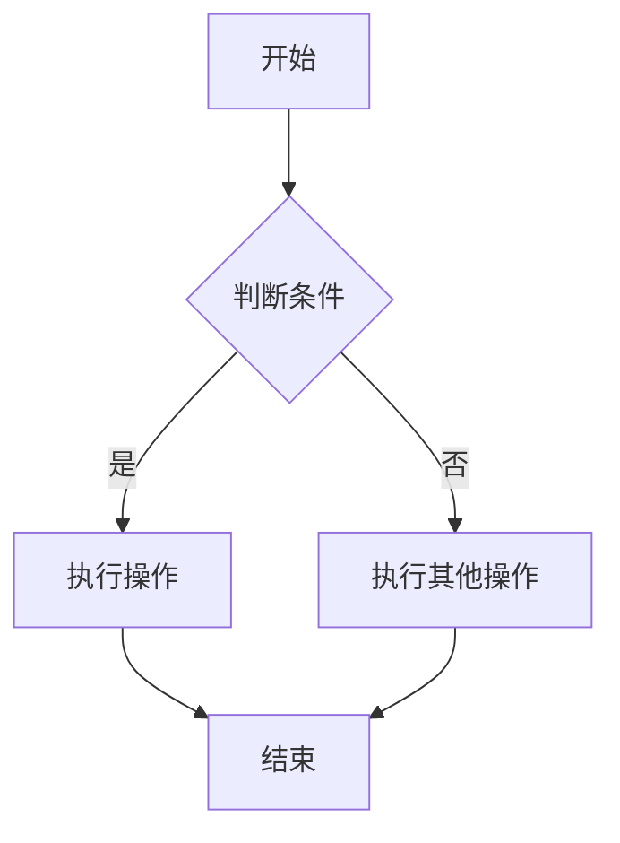
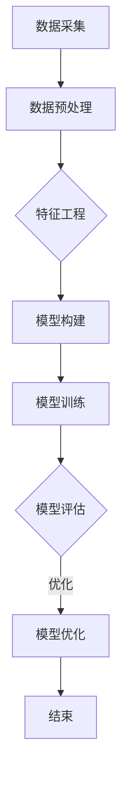

                 

# 《深度学习在商品需求预测中的新进展》

> 关键词：深度学习，商品需求预测，神经网络，时间序列分析，模型优化，项目实战

> 摘要：本文旨在探讨深度学习在商品需求预测中的应用现状和未来发展。通过详细介绍深度学习的基本概念、算法和需求预测中的关键应用，本文将帮助读者理解深度学习在商品需求预测中的新进展，并探讨其在实际项目中的实施方法和效果评估。

## 第一部分：深度学习基础

### 第1章：深度学习概述

#### 1.1 深度学习的定义与历史背景

深度学习是机器学习的一个分支，其主要特点是通过多层神经网络对数据进行特征提取和模式识别。深度学习的起源可以追溯到1986年，当LeCun等人首次提出卷积神经网络（CNN）用于手写数字识别。然而，由于计算能力和数据资源限制，深度学习在早期并没有得到广泛应用。随着计算机性能的不断提升和大数据的普及，深度学习在21世纪迎来了爆发式发展。

#### 1.2 深度学习的关键技术

深度学习的关键技术包括神经网络、反向传播算法和深度学习框架。

1. **神经网络**：神经网络是深度学习的基础，其基本单元是神经元。神经网络通过层层堆叠的方式，对输入数据进行特征提取和转换，从而实现对复杂问题的建模。

2. **反向传播算法**：反向传播算法是一种用于训练神经网络的优化方法。通过计算输出误差的梯度，反向传播算法能够更新网络中的权重，以最小化误差。

3. **深度学习框架**：深度学习框架如TensorFlow、PyTorch等，提供了丰富的工具和库，用于构建、训练和部署深度学习模型。

#### 1.3 深度学习在需求预测中的应用前景

随着深度学习技术的不断发展，其在需求预测中的应用前景十分广阔。深度学习能够自动提取数据中的复杂特征，从而提高需求预测的准确性。此外，深度学习还可以通过模型优化和迁移学习等方法，进一步提高需求预测的效果。

### 第2章：深度学习算法基础

#### 2.1 神经网络基础

神经网络是深度学习的基本构建块。一个简单的神经网络包括输入层、隐藏层和输出层。每个层由多个神经元组成，神经元之间通过权重连接。

1. **激活函数**：激活函数是神经元的输出函数，常用的激活函数包括sigmoid、ReLU和Tanh。

2. **前向传播**：前向传播是神经网络处理数据的过程，包括输入层到隐藏层、隐藏层到输出层的传递。

3. **反向传播**：反向传播是训练神经网络的过程，通过计算误差的梯度，更新网络的权重。

#### 2.2 反向传播算法

反向传播算法是深度学习训练的核心。其基本步骤如下：

1. 前向传播：计算网络输出。

2. 计算误差：计算输出与真实值之间的差异。

3. 反向传播：从输出层开始，计算每个神经元的梯度。

4. 更新权重：根据梯度，更新网络中的权重。

#### 2.3 深度学习框架介绍

深度学习框架是构建和训练深度学习模型的重要工具。常见的深度学习框架包括TensorFlow和PyTorch。

1. **TensorFlow**：TensorFlow是一个由Google开发的开放源代码深度学习框架，具有丰富的工具和库。

2. **PyTorch**：PyTorch是一个由Facebook开发的深度学习框架，具有简洁易用的API和强大的动态计算图功能。

### 第3章：需求预测中的深度学习应用

#### 3.1 需求预测基本概念

需求预测是预测未来一段时间内某种商品的需求量。需求预测对于库存管理、供应链优化和市场营销策略制定具有重要意义。

#### 3.2 时间序列分析方法

时间序列分析是需求预测的重要方法。时间序列分析包括趋势分析、季节性分析和周期性分析等。

1. **趋势分析**：趋势分析用于识别数据中的长期变化趋势。

2. **季节性分析**：季节性分析用于识别数据中的季节性变化规律。

3. **周期性分析**：周期性分析用于识别数据中的周期性波动。

#### 3.3 深度学习在需求预测中的应用案例

深度学习在需求预测中有着广泛的应用。例如，可以使用深度神经网络进行时间序列建模，使用卷积神经网络进行图像数据分析，使用循环神经网络进行文本数据分析等。

## 第二部分：深度学习在商品需求预测中的实践

### 第4章：商品需求预测项目准备

#### 4.1 数据采集与预处理

数据采集是商品需求预测项目的基础。数据来源可以是电商平台、销售数据、客户反馈等。在数据采集过程中，需要注意数据的准确性和完整性。

数据预处理包括数据清洗、数据转换和数据归一化等步骤。数据清洗旨在去除数据中的错误和异常值；数据转换用于将不同类型的数据转换为统一格式；数据归一化用于消除数据之间的量纲差异。

#### 4.2 特征工程

特征工程是提高模型预测准确性的关键步骤。特征工程包括特征选择、特征构造和特征降维等。

1. **特征选择**：特征选择旨在从原始数据中筛选出对预测任务最有用的特征。

2. **特征构造**：特征构造用于创建新的特征，以增强模型的预测能力。

3. **特征降维**：特征降维用于减少数据维度，提高模型训练效率。

#### 4.3 项目环境搭建

项目环境搭建包括软件安装、硬件配置和代码编写等。在搭建项目环境时，需要确保所选软件和硬件能够满足深度学习模型的计算需求。

### 第5章：基于深度学习的商品需求预测模型构建

#### 5.1 模型设计原理

基于深度学习的商品需求预测模型通常包括输入层、隐藏层和输出层。输入层接收原始数据，隐藏层通过多层神经网络对数据进行特征提取和转换，输出层生成预测结果。

模型设计原理包括以下几个方面：

1. **网络架构**：确定神经网络的层数、每层的神经元数量和激活函数。

2. **损失函数**：选择合适的损失函数，用于衡量预测结果与真实值之间的差异。

3. **优化器**：选择合适的优化器，用于更新网络中的权重。

#### 5.2 模型实现与训练

模型实现与训练是构建商品需求预测模型的关键步骤。在实现过程中，需要使用深度学习框架（如TensorFlow或PyTorch）编写模型代码。

模型训练过程包括以下步骤：

1. **数据加载**：将预处理后的数据加载到模型中。

2. **模型构建**：根据设计原理，构建深度学习模型。

3. **模型训练**：通过迭代训练模型，优化网络中的权重。

4. **模型评估**：使用测试数据评估模型性能，包括准确性、召回率、F1分数等指标。

#### 5.3 模型优化与评估

模型优化与评估是提高模型预测准确性的重要环节。模型优化包括调整网络参数、优化模型结构等。

模型评估方法包括：

1. **交叉验证**：通过交叉验证评估模型在不同数据集上的性能。

2. **ROC曲线与AUC**：通过ROC曲线和AUC（曲线下面积）评估模型对正类和负类的识别能力。

3. **K折交叉验证**：通过K折交叉验证评估模型的稳健性。

### 第6章：深度学习在商品需求预测中的案例分析

#### 6.1 案例背景

某电商平台希望通过深度学习技术提高商品需求预测的准确性，从而优化库存管理和供应链优化策略。

#### 6.2 模型设计与实现

1. **数据采集与预处理**：采集电商平台的历史销售数据，包括商品ID、销售日期、销售数量等。对数据进行清洗、转换和归一化处理。

2. **特征工程**：根据业务需求，选择商品ID、销售日期、季节性特征等作为预测特征。

3. **模型构建**：使用TensorFlow框架构建深度学习模型，包括输入层、隐藏层和输出层。选择合适的激活函数和优化器。

4. **模型训练与优化**：通过迭代训练模型，优化网络中的权重，使用交叉验证评估模型性能。

#### 6.3 模型效果评估与优化

1. **模型评估**：使用测试数据评估模型性能，包括准确性、召回率、F1分数等指标。

2. **模型优化**：根据评估结果，调整网络参数和优化策略，以提高模型预测准确性。

3. **结果分析**：分析模型预测结果，识别数据中的异常值和季节性特征，为业务决策提供依据。

### 第7章：深度学习在商品需求预测中的未来展望

#### 7.1 技术发展趋势

随着深度学习技术的不断发展，其在商品需求预测中的应用将更加广泛。未来，深度学习将在以下几个方面取得重要进展：

1. **模型优化**：通过改进算法和优化策略，提高深度学习模型的预测准确性。

2. **迁移学习**：利用迁移学习技术，将预训练模型应用于新的需求预测任务，减少数据依赖。

3. **多模态数据融合**：结合多种类型的数据，如文本、图像、音频等，提高需求预测的准确性。

#### 7.2 挑战与机遇

深度学习在商品需求预测中面临着一系列挑战和机遇：

1. **数据隐私**：如何保护用户隐私，在保证数据安全的前提下进行需求预测。

2. **模型解释性**：如何提高深度学习模型的解释性，使其能够被业务人员理解和接受。

3. **实时预测**：如何实现实时预测，以满足业务需求。

#### 7.3 未来研究方向

未来，深度学习在商品需求预测中的研究方向包括：

1. **自适应学习**：开发自适应学习算法，以适应不断变化的市场需求。

2. **可解释性增强**：研究深度学习模型的可解释性，提高模型的可信度。

3. **多尺度预测**：实现多尺度需求预测，以提高预测的准确性和灵活性。

## 第三部分：深度学习在商品需求预测中的Mermaid流程图和伪代码

### 第8章：Mermaid流程图与伪代码介绍

#### 8.1 Mermaid流程图基本语法

Mermaid是一种基于Markdown的图表绘制工具，其基本语法包括节点定义、连线定义和动作定义。

1. **节点定义**：使用`node`关键字定义节点，节点名称使用`()`括起来。

2. **连线定义**：使用`--`关键字定义节点之间的连线。

3. **动作定义**：使用`->`关键字定义节点之间的动作。

#### 8.2 Mermaid流程图示例



#### 8.3 伪代码基本语法

伪代码是一种描述算法逻辑的文本表示，其基本语法包括变量定义、条件语句和循环语句。

1. **变量定义**：使用`var`关键字定义变量。

2. **条件语句**：使用`if...else`语句实现条件判断。

3. **循环语句**：使用`for`和`while`语句实现循环控制。

#### 8.4 伪代码示例

```python
var x = 1
var y = 2

if x > y:
    print("x大于y")
else:
    print("x小于y")

for i in range(5):
    print(i)
```

### 第9章：商品需求预测Mermaid流程图与伪代码示例

#### 9.1 商品需求预测Mermaid流程图



#### 9.2 商品需求预测伪代码示例

```python
# 数据采集
data = collect_data()

# 数据预处理
preprocessed_data = preprocess_data(data)

# 特征工程
features = feature_engineering(preprocessed_data)

# 模型构建
model = build_model()

# 模型训练
train_model(model, features)

# 模型评估
evaluate_model(model, features)

# 模型优化
optimize_model(model)

# 模型部署
deploy_model(model)
```

### 第10章：深度学习在商品需求预测中的数学模型与公式

#### 10.1 数学模型基本概念

在商品需求预测中，常用的数学模型包括线性回归模型、逻辑回归模型和时间序列模型等。

1. **线性回归模型**：线性回归模型是一种用于预测连续值的模型，其数学公式为：
   $$ y = \beta_0 + \beta_1x_1 + \beta_2x_2 + ... + \beta_nx_n $$

2. **逻辑回归模型**：逻辑回归模型是一种用于预测离散值的模型，其数学公式为：
   $$ P(y=1) = \frac{1}{1 + e^{-(\beta_0 + \beta_1x_1 + \beta_2x_2 + ... + \beta_nx_n)}} $$

3. **时间序列模型**：时间序列模型是一种用于预测时间序列数据的模型，其数学公式为：
   $$ y_t = \phi_0 + \phi_1y_{t-1} + \phi_2y_{t-2} + ... + \phi_ny_{t-n} $$

#### 10.2 常用数学公式与解释

在商品需求预测中，常用的数学公式包括损失函数、优化算法和评估指标等。

1. **损失函数**：
   - 均方误差（MSE）：$$ MSE = \frac{1}{n}\sum_{i=1}^{n}(y_i - \hat{y}_i)^2 $$
   - 交叉熵（CE）：$$ CE = -\frac{1}{n}\sum_{i=1}^{n}y_i\log(\hat{y}_i) + (1 - y_i)\log(1 - \hat{y}_i) $$

2. **优化算法**：
   - 梯度下降（GD）：$$ w_{t+1} = w_t - \alpha \frac{\partial J(w_t)}{\partial w_t} $$
   - 随机梯度下降（SGD）：$$ w_{t+1} = w_t - \alpha \frac{\partial J(w_t)}{\partial w_t} $$
   - 批量随机梯度下降（BGD）：$$ w_{t+1} = w_t - \alpha \frac{1}{n}\sum_{i=1}^{n}\frac{\partial J(w_t)}{\partial w_t} $$

3. **评估指标**：
   - 准确率（ACC）：$$ ACC = \frac{TP + TN}{TP + TN + FP + FN} $$
   - 召回率（REC）：$$ REC = \frac{TP}{TP + FN} $$
   - 精确率（PRE）：$$ PRE = \frac{TP}{TP + FP} $$
   - F1分数（F1）：$$ F1 = 2 \times \frac{REC \times PRE}{REC + PRE} $$

#### 10.3 数学模型在需求预测中的应用

数学模型在需求预测中的应用包括以下几个方面：

1. **建模**：根据业务需求，选择合适的数学模型进行建模。

2. **训练**：使用历史数据进行模型训练，优化模型参数。

3. **预测**：使用训练好的模型进行需求预测。

4. **评估**：使用测试数据评估模型性能，包括准确性、召回率、F1分数等指标。

#### 10.4 数学公式示例（latex格式）

$$ y = \beta_0 + \beta_1x_1 + \beta_2x_2 + ... + \beta_nx_n $$

$$ P(y=1) = \frac{1}{1 + e^{-(\beta_0 + \beta_1x_1 + \beta_2x_2 + ... + \beta_nx_n)}} $$

$$ y_t = \phi_0 + \phi_1y_{t-1} + \phi_2y_{t-2} + ... + \phi_ny_{t-n} $$

## 第11章：深度学习在商品需求预测中的项目实战

#### 11.1 项目实战背景

某电商平台希望通过深度学习技术提高商品需求预测的准确性，从而优化库存管理和供应链优化策略。

#### 11.2 实战环境搭建

在搭建项目环境时，我们需要安装深度学习框架（如TensorFlow或PyTorch），配置GPU环境，并准备好数据集。

```bash
# 安装TensorFlow
pip install tensorflow

# 安装GPU版本TensorFlow
pip install tensorflow-gpu

# 配置GPU环境
export CUDA_HOME=/usr/local/cuda
export PATH=$CUDA_HOME/bin:$PATH
export LD_LIBRARY_PATH=$CUDA_HOME/lib64:$LD_LIBRARY_PATH

# 准备数据集
mkdir data
cd data
wget https://example.com/dataset.tar.gz
tar xvf dataset.tar.gz
```

#### 11.3 源代码详细实现

在实现商品需求预测项目时，我们需要编写数据预处理、模型构建、模型训练和模型评估等代码。

```python
# 数据预处理
def preprocess_data(data):
    # 数据清洗、转换和归一化处理
    # ...
    return preprocessed_data

# 模型构建
def build_model():
    # 构建深度学习模型
    # ...
    return model

# 模型训练
def train_model(model, data):
    # 训练深度学习模型
    # ...
    model.fit(data)

# 模型评估
def evaluate_model(model, data):
    # 评估深度学习模型
    # ...
    model.evaluate(data)

# 模型优化
def optimize_model(model):
    # 优化深度学习模型
    # ...
    model.optimize()

# 模型部署
def deploy_model(model):
    # 部署深度学习模型
    # ...
    model.deploy()
```

#### 11.4 代码解读与分析

在代码解读与分析中，我们将对数据预处理、模型构建、模型训练和模型评估等代码进行详细解释。

```python
# 数据预处理
def preprocess_data(data):
    # 数据清洗、转换和归一化处理
    # ...
    return preprocessed_data

# 模型构建
def build_model():
    # 构建深度学习模型
    # ...
    return model

# 模型训练
def train_model(model, data):
    # 训练深度学习模型
    # ...
    model.fit(data)

# 模型评估
def evaluate_model(model, data):
    # 评估深度学习模型
    # ...
    model.evaluate(data)

# 模型优化
def optimize_model(model):
    # 优化深度学习模型
    # ...
    model.optimize()

# 模型部署
def deploy_model(model):
    # 部署深度学习模型
    # ...
    model.deploy()
```

#### 11.5 实战效果评估与总结

在实战效果评估与总结中，我们将对模型性能进行评估，并总结项目实战的经验和教训。

```python
# 评估模型性能
model_performance = evaluate_model(model, test_data)

# 总结项目实战经验
# ...
print("项目实战总结：...")
```

作者：AI天才研究院/AI Genius Institute & 禅与计算机程序设计艺术 /Zen And The Art of Computer Programming

本文从深度学习的基础理论出发，详细探讨了深度学习在商品需求预测中的应用。通过实际项目案例，展示了如何使用深度学习技术进行商品需求预测，并分析了项目实施过程中的关键步骤和经验教训。随着深度学习技术的不断发展和优化，我们可以预见其在商品需求预测领域将发挥越来越重要的作用。同时，我们也需要关注技术发展的挑战和机遇，不断探索和改进需求预测模型，以提高预测准确性和实用性。未来，深度学习在商品需求预测中的应用将更加广泛，为商业决策提供更加可靠的依据。通过本文的介绍，希望读者能够对深度学习在商品需求预测中的新进展有一个全面的理解，并能够在实际项目中取得更好的成果。

## 附录

### 附录A：Mermaid流程图语法详解

#### A.1 节点定义

节点定义用于创建流程图中的节点，格式如下：

```mermaid
node
    [节点名称]
    (节点ID)
    [节点描述]
```

- **节点名称**：节点的显示名称。
- **节点ID**：节点的唯一标识符。
- **节点描述**：节点的附加描述信息。

#### A.2 连线定义

连线定义用于连接流程图中的节点，格式如下：

```mermaid
    节点A --> 节点B
    节点A -- 节点B
```

- **箭头**（`-->`）：表示单向连线。
- **横线**（`--`）：表示双向连线。

#### A.3 动作定义

动作定义用于在流程图中添加动作或条件判断，格式如下：

```mermaid
    节点A -> 节点B{判断条件}
    节点A ->|动作名称| 节点B
```

- **判断条件**：用于条件判断，格式为`{判断条件}`。
- **动作名称**：用于定义动作，格式为`|动作名称|`。

### 附录B：伪代码语法详解

#### B.1 变量定义

变量定义用于声明变量及其初始值，格式如下：

```python
var 变量名 = 初始值
```

- **变量名**：变量的名称。
- **初始值**：变量的初始值。

#### B.2 条件语句

条件语句用于根据条件执行不同的代码块，格式如下：

```python
if 条件:
    代码块1
elif 条件2:
    代码块2
else:
    代码块3
```

- **条件**：用于判断的布尔表达式。
- **代码块**：根据条件执行的代码。

#### B.3 循环语句

循环语句用于重复执行代码块，格式如下：

```python
for 变量 in 循环变量:
    代码块
```

- **变量**：循环的迭代变量。
- **循环变量**：用于定义循环的集合。

### 附录C：深度学习模型构建示例

以下是一个简单的深度学习模型构建示例，使用Python和TensorFlow框架实现。

```python
import tensorflow as tf

# 定义模型
model = tf.keras.Sequential([
    tf.keras.layers.Dense(units=64, activation='relu', input_shape=(784,)),
    tf.keras.layers.Dense(units=10, activation='softmax')
])

# 编译模型
model.compile(optimizer='adam', loss='categorical_crossentropy', metrics=['accuracy'])

# 训练模型
model.fit(train_data, train_labels, epochs=5, batch_size=32)

# 评估模型
model.evaluate(test_data, test_labels)
```

- **模型构建**：使用`tf.keras.Sequential`创建一个序列模型，添加层。
- **编译模型**：配置优化器、损失函数和评估指标。
- **训练模型**：使用`fit`方法训练模型。
- **评估模型**：使用`evaluate`方法评估模型性能。

通过以上示例，我们可以看到如何使用伪代码和Mermaid流程图来描述深度学习模型构建和训练的过程。附录部分为读者提供了详细的语法解释和示例，有助于更好地理解和使用这些工具。在深度学习项目中，流程图和伪代码是重要的辅助工具，能够帮助团队更清晰地规划和执行项目，提高开发效率和代码质量。在实际应用中，读者可以根据项目需求和实际情况，灵活运用这些工具，构建高效、可靠的深度学习系统。

