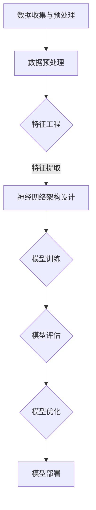
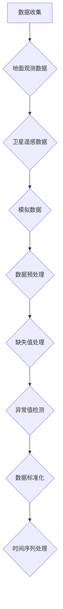
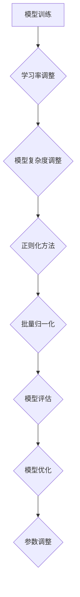
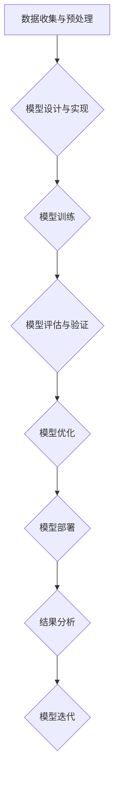

                 

### 第1章: 深度学习与天气预报概述

#### 1.1 深度学习的发展与天气预报的关系

深度学习，作为人工智能领域的重要分支，近年来取得了显著的进展。其基于多层神经网络的学习能力，使得在图像识别、语音识别、自然语言处理等领域取得了突破性的成果。而天气预报，作为气象学的重要应用领域，其准确性和时效性对人们的生活和社会经济活动具有重要意义。深度学习在天气预报中的潜在应用，也逐渐引起了研究者和从业者的关注。

深度学习的发展历程可以追溯到1986年，当时Rumelhart、Hinton和Williams提出了反向传播算法（Backpropagation Algorithm），该算法极大地提升了神经网络的训练效率。随后，随着计算机性能的提升和数据规模的扩大，深度学习的研究和应用得到了迅速发展。2012年，AlexNet在ImageNet比赛中取得了巨大成功，标志着深度学习进入了一个新的时代。

深度学习在天气预报中的应用前景广阔。传统的天气预报方法主要依赖于物理模型和统计方法，其精度和时效性受到很大的限制。而深度学习可以自动学习数据中的复杂模式和关联，从而提高预报的精度和效率。例如，通过深度学习模型，可以更好地捕捉大气中的非线性动态变化，预测极端天气事件的发生概率。

#### 1.1.1 深度学习的概念与发展

深度学习（Deep Learning）是一种机器学习技术，其核心思想是通过构建多层神经网络，逐层提取数据中的特征，从而实现对复杂数据的分析和理解。与传统的一层神经网络相比，多层神经网络能够更加有效地学习数据的深层特征。

深度学习的发展历程可以分为以下几个阶段：

1. **1986年**：反向传播算法（Backpropagation Algorithm）的提出，使得多层神经网络的训练成为可能。

2. **2006年**：Hinton等人提出了深度信念网络（Deep Belief Network），为深度学习的实现提供了新的思路。

3. **2012年**：AlexNet在ImageNet比赛中取得了突破性的成绩，标志着深度学习进入了一个新的时代。

4. **2015年**：谷歌的AlphaGo在围棋比赛中战胜了世界冠军李世石，展示了深度学习在人工智能领域的巨大潜力。

5. **至今**：深度学习在多个领域取得了显著的成果，包括计算机视觉、自然语言处理、语音识别等。

#### 1.1.2 天气预报的核心挑战

天气预报的核心挑战主要包括以下几点：

1. **数据复杂性**：天气预报涉及到大量的气象参数，包括温度、湿度、风速、气压等。这些参数之间存在着复杂的关系，需要深入分析。

2. **时间序列特性**：天气数据通常表现为时间序列形式，具有时变性和长期依赖性。传统的统计方法难以捕捉这种特性。

3. **极端天气事件**：极端天气事件（如暴雨、暴风雪、热浪等）对人们的生活和社会经济活动影响巨大。预测这些事件的概率和发生时间具有很高的难度。

4. **计算资源**：深度学习模型的训练需要大量的计算资源。天气预报数据规模巨大，对计算资源的要求更高。

5. **模型解释性**：深度学习模型通常被认为是“黑盒子”，其内部工作机制难以解释。这对于气象工作者来说是一个挑战。

#### 1.1.3 深度学习在天气预报中的潜在应用

深度学习在天气预报中的潜在应用包括以下几个方面：

1. **时间序列预测**：深度学习模型可以自动学习时间序列数据中的模式和关联，从而提高短期天气预报的精度。

2. **图像和遥感数据处理**：深度学习可以用于分析卫星图像和遥感数据，提取有用的气象信息，从而提高天气预报的准确性。

3. **极端天气事件预测**：深度学习可以用于预测极端天气事件的发生概率和时间，为应对极端天气事件提供科学依据。

4. **多模型集成**：深度学习可以与其他天气预报模型进行集成，提高预报的综合精度。

5. **数据增强和预处理**：深度学习可以用于数据增强和预处理，提高数据质量，从而提高模型的性能。

总的来说，深度学习在天气预报中的应用具有巨大的潜力，但也面临着一些挑战。在接下来的章节中，我们将详细探讨深度学习的基础知识、天气预报数据处理方法、深度学习模型选择和优化策略，以及深度学习在天气预报中的实际应用和评估方法。通过这些探讨，我们希望能够为读者提供一个全面、系统的了解深度学习在天气预报中的最新进展和应用前景。
<|assistant|>
### 第2章: 深度学习基础知识

深度学习是构建和训练能够从数据中学习复杂模式的神经网络的数学方法。在这个章节中，我们将深入探讨深度学习的基础知识，包括神经网络的基本原理、深度学习的基本算法和常用的深度学习框架。

#### 2.1 神经网络基础

神经网络（Neural Network，简称NN）是深度学习的基础。神经网络模拟了人脑的神经元连接方式，通过多层神经元之间的信息传递和处理，实现对数据的分析和理解。

##### 2.1.1 神经网络的基本原理

一个简单的神经网络包括以下几个部分：

- **输入层**：接收外部输入数据，例如图像像素值、文本单词等。
- **隐藏层**：一层或多层，负责对输入数据进行处理和特征提取。
- **输出层**：输出预测结果或分类结果。

每个神经元（也称为节点）都会接收来自前一层神经元的输入信号，通过一个加权求和函数进行处理，然后通过一个激活函数（Activation Function）输出结果。

##### 2.1.2 神经网络结构

神经网络的结构可以分为以下几个层次：

- **单层感知机**：只有一个隐藏层，无法学习非线性函数。
- **多层感知机**：包含多个隐藏层，能够学习非线性函数。
- **卷积神经网络**（Convolutional Neural Network，简称CNN）：特别适用于图像处理任务，通过卷积操作提取图像特征。
- **循环神经网络**（Recurrent Neural Network，简称RNN）：特别适用于时间序列数据处理任务，通过循环结构处理序列数据。
- **长短时记忆网络**（Long Short-Term Memory，简称LSTM）：是RNN的一种改进，能够更好地学习长距离依赖关系。
- **生成对抗网络**（Generative Adversarial Network，简称GAN）：通过生成器和判别器的对抗训练，实现数据的生成。

##### 2.1.3 神经网络的激活函数

激活函数是神经网络的核心组成部分，用于决定神经元是否被激活。常见的激活函数包括：

- **sigmoid函数**：将输入值映射到（0，1）区间，常用于二分类问题。
- **ReLU函数**（Rectified Linear Unit）：将负值映射为0，正值映射为自身，简化了计算过程，增强了网络的鲁棒性。
- **Tanh函数**：将输入值映射到（-1，1）区间，类似于sigmoid函数，但输出值更均匀。
- **softmax函数**：用于多分类问题，将输入值映射到概率分布。

#### 2.2 深度学习基本算法

深度学习的核心在于如何训练多层神经网络，使其能够从数据中学习到有效的特征表示。以下是深度学习的基本算法：

##### 2.2.1 反向传播算法（Backpropagation Algorithm）

反向传播算法是一种用于训练神经网络的优化算法。它通过计算损失函数关于网络参数的梯度，利用梯度下降法（Gradient Descent）更新网络参数，从而最小化损失函数。

反向传播算法的基本步骤如下：

1. 前向传播（Forward Propagation）：计算网络输出，并计算实际输出与预测输出之间的误差。
2. 反向传播（Back Propagation）：计算误差关于网络参数的梯度。
3. 参数更新（Parameter Update）：利用梯度下降法更新网络参数。

##### 2.2.2 梯度下降算法（Gradient Descent）

梯度下降算法是一种优化算法，用于找到函数的最小值。在深度学习中，梯度下降算法用于更新神经网络参数，以最小化损失函数。

梯度下降算法的基本步骤如下：

1. 初始化参数。
2. 计算损失函数关于参数的梯度。
3. 更新参数：\[ \theta = \theta - \alpha \cdot \nabla_\theta J(\theta) \]，其中 \(\alpha\) 为学习率，\(\nabla_\theta J(\theta)\) 为损失函数关于参数的梯度。
4. 重复步骤2和3，直到满足停止条件（如达到预设的迭代次数或损失函数收敛）。

##### 2.2.3 深度学习优化算法

除了梯度下降算法，还有一些改进的优化算法，以提高训练效率和收敛速度。以下是几种常用的优化算法：

- **随机梯度下降（Stochastic Gradient Descent，简称SGD）**：在每个样本上计算梯度，更新参数。这种方法在样本量较大时效果较好。
- **Adam优化器**：结合了SGD和动量方法（Momentum），能够自适应调整学习率，提高训练效果。
- **RMSprop**：利用梯度的一阶矩估计和二阶矩估计来调整学习率，减少波动。

#### 2.3 深度学习框架

深度学习框架是一组库和工具，用于简化深度学习模型的开发、训练和部署。以下是一些常用的深度学习框架：

- **TensorFlow**：由谷歌开发，是当前最流行的深度学习框架之一，具有丰富的功能和强大的社区支持。
- **PyTorch**：由Facebook开发，以其灵活性和动态计算图而受到研究者的青睐。
- **Keras**：是一个高级深度学习框架，可以与TensorFlow和Theano等底层框架结合使用。
- **MXNet**：由Apache Software Foundation开发，支持多种编程语言和硬件平台，适合大规模分布式训练。

这些框架提供了丰富的API和工具，使得开发者可以更加高效地构建和训练深度学习模型。

通过本章的讨论，我们对深度学习的基础知识有了更深入的了解。在下一章中，我们将探讨天气预报的数据处理方法，为后续的深度学习应用奠定基础。
<|assistant|>
### 第3章: 天气预报数据预处理

在深度学习模型训练过程中，数据预处理是至关重要的一步。对于天气预报数据而言，由于其复杂性和多样性，预处理工作显得尤为重要。本章将详细介绍天气预报数据预处理的方法，包括数据源介绍、数据预处理方法和数据增强技术。

#### 3.1 数据源介绍

天气预报数据主要来源于以下几个方面：

- **地面观测数据**：包括气象站、雷达、卫星等地面设备收集的气象参数，如温度、湿度、风速、气压等。
- **卫星遥感数据**：通过卫星传感器收集的地球表面气象数据，如云层覆盖、温度分布、水汽含量等。
- **模拟数据**：通过气象模型模拟生成的数据，用于补充观测数据的缺失或不足。

这些数据源共同构成了天气预报的基础数据集，为深度学习模型的训练提供了丰富的信息。

#### 3.2 数据预处理方法

数据预处理是提高深度学习模型性能的关键步骤，主要包括以下几个方面：

- **缺失值处理**：由于观测设备的限制或数据传输的错误，天气预报数据中可能存在缺失值。处理缺失值的方法包括：
  - 删除缺失值：对于缺失值较多的数据，可以删除这些数据，以减少对模型训练的影响。
  - 填充缺失值：使用平均值、中位数或最近邻等方法来填充缺失值，以保持数据的一致性。

- **异常值检测**：异常值可能是由于测量错误、设备故障等原因造成的，会影响模型的训练效果。检测异常值的方法包括：
  - 统计方法：使用统计学方法，如标准差、箱线图等，检测出离群值。
  - 聚类方法：使用聚类算法，如K-means等，将数据分为若干个簇，检测出不属于任何簇的异常值。

- **数据标准化**：为了提高模型训练的稳定性，通常需要对数据进行标准化处理。数据标准化的方法包括：
  - Z-score标准化：将数据映射到标准正态分布，即减去平均值后除以标准差。
  - Min-Max标准化：将数据映射到[0, 1]区间，即减去最小值后除以最大值与最小值之差。

- **时间序列处理**：天气预报数据通常表现为时间序列形式，为了更好地捕捉数据的时间特性，可以进行以下处理：
  - 平滑处理：使用移动平均、低通滤波等方法平滑时间序列数据，减少噪声的影响。
  - 按季节调整：对于季节性较强的数据，可以按照季节进行调整，以消除季节因素的影响。

#### 3.3 数据增强技术

数据增强（Data Augmentation）是一种通过生成新的训练样本来提高模型泛化能力的技术。在天气预报数据中，数据增强技术可以用来增加数据的多样性，从而提高模型的性能。以下是一些常用的数据增强技术：

- **时间序列平滑**：通过低通滤波、移动平均等方法，平滑时间序列数据，减少高频噪声的影响。
- **时空插值**：对于缺失的数据点，可以使用线性插值、Kriging插值等方法进行补全，以增加数据的连续性。
- **生成对抗网络（GAN）**：使用生成对抗网络（GAN）生成新的气象数据，GAN由生成器和判别器组成，生成器和判别器之间进行对抗训练，生成器不断优化生成数据，使其更接近真实数据。

通过本章的讨论，我们对天气预报数据的预处理方法有了更深入的理解。在下一章中，我们将探讨深度学习模型在天气预报中的应用，为解决天气预报精确建模问题提供技术手段。
<|assistant|>
### 第4章: 深度学习模型在天气预报中的应用

深度学习模型在天气预报中的应用已经成为一个研究热点。本章将详细介绍几种常用的深度学习模型，包括时间序列预测模型和图神经网络，以及它们在天气预报中的实际应用。

#### 4.1 时间序列预测模型

时间序列预测（Time Series Forecasting）是深度学习在天气预报中应用的一个重要方向。时间序列数据通常具有时间依赖性和动态变化特征，深度学习模型能够有效地捕捉这些特征，从而提高预测精度。

##### 4.1.1 传统时间序列模型

传统的时间序列预测模型主要包括ARIMA（自回归积分滑动平均模型）、SARIMA（季节性ARIMA）等。这些模型通过分析时间序列的自相关性、平稳性和季节性特征来进行预测。

- **ARIMA模型**：ARIMA模型由三个部分组成：自回归（AR）、差分（I）和移动平均（MA）。它能够通过拟合时间序列的线性模型来进行预测。
- **SARIMA模型**：SARIMA模型是ARIMA模型的扩展，加入了季节性因素。它能够更好地捕捉时间序列的季节性特征。

尽管传统时间序列模型在预测精度和稳定性方面表现良好，但它们在处理非线性特征和长距离依赖性方面存在一定的局限性。

##### 4.1.2 循环神经网络（RNN）

循环神经网络（Recurrent Neural Network，简称RNN）是一种能够处理序列数据的神经网络模型。RNN通过其循环结构，能够捕捉时间序列数据中的长距离依赖关系，从而提高预测精度。

- **基本RNN**：基本RNN通过当前时刻的输入和前一时刻的隐藏状态来计算当前时刻的隐藏状态。它能够捕捉时间序列数据中的短期依赖关系。
- **长短期记忆网络（LSTM）**：LSTM是RNN的一种改进，通过引入门控机制，能够有效地避免梯度消失和梯度爆炸问题，从而更好地捕捉时间序列数据中的长距离依赖关系。
- **门控循环单元（GRU）**：GRU是LSTM的简化版，通过门控机制和更新门，能够简化计算过程，同时保持较好的预测性能。

##### 4.1.3 长短期记忆网络（LSTM）

LSTM（Long Short-Term Memory）是RNN的一种改进，通过引入门控机制，能够有效地解决传统RNN在处理长距离依赖关系时遇到的梯度消失和梯度爆炸问题。

- **LSTM单元结构**：LSTM单元由输入门、遗忘门和输出门组成。输入门和遗忘门用于控制信息的输入和遗忘，输出门用于控制信息的输出。
- **LSTM训练过程**：在训练过程中，LSTM通过反向传播算法计算梯度，并利用梯度更新网络参数，以最小化损失函数。

##### 4.1.4 门控循环单元（GRU）

GRU（Gated Recurrent Unit）是LSTM的简化版，通过引入更新门和重置门，简化了计算过程，同时保持了较好的预测性能。

- **GRU单元结构**：GRU单元由更新门和重置门组成。更新门用于控制信息的输入和遗忘，重置门用于控制信息的输出。
- **GRU训练过程**：GRU通过反向传播算法计算梯度，并利用梯度更新网络参数，以最小化损失函数。

#### 4.2 图神经网络在天气预报中的应用

图神经网络（Graph Neural Network，简称GNN）是一种能够处理图结构数据的神经网络模型。它通过学习图中的结构和特征，能够有效地捕捉图中的复杂关系。

##### 4.2.1 图神经网络（GCN）

图卷积网络（Graph Convolutional Network，简称GCN）是GNN的一种基本形式。它通过图卷积操作，能够从图中提取有效的特征。

- **GCN基本原理**：GCN通过聚合相邻节点的特征来更新当前节点的特征。具体来说，GCN使用以下公式进行图卷积操作：
  \[
  h_i^{(l+1)} = \sigma(\theta^{(l)} D^{(l)} h_i^{(l)} + \sum_{j \in \mathcal{N}(i)} \theta^{(l)} A^{(l)} h_j^{(l)})
  \]
  其中，\( h_i^{(l)} \) 是第 \( i \) 个节点在第 \( l \) 层的嵌入表示，\( D^{(l)} \) 是第 \( l \) 层的度矩阵，\( A^{(l)} \) 是第 \( l \) 层的邻接矩阵，\( \sigma \) 是激活函数，\( \theta^{(l)} \) 是参数矩阵。
- **GCN训练过程**：GCN通过反向传播算法计算梯度，并利用梯度更新网络参数，以最小化损失函数。

##### 4.2.2 图注意力网络（GAT）

图注意力网络（Graph Attention Network，简称GAT）是GCN的一种改进。它通过引入注意力机制，能够更好地捕捉图中的关系。

- **GAT基本原理**：GAT通过注意力机制，对每个节点的特征进行加权聚合。具体来说，GAT使用以下公式进行图注意力操作：
  \[
  \alpha_{ij}^{(l)} = \mathrm{softmax}\left( \frac{a^{(l)} [ \cdot , h_j^{(l)} ]}{\sqrt{d_j}} \right)
  \]
  其中，\( \alpha_{ij}^{(l)} \) 是第 \( i \) 个节点对第 \( j \) 个节点的注意力权重，\( a^{(l)} \) 是注意力函数，\( d_j \) 是第 \( j \) 个节点的度。
- **GAT训练过程**：GAT通过反向传播算法计算梯度，并利用梯度更新网络参数，以最小化损失函数。

##### 4.2.3 图卷积神经网络（GATv2）

GATv2是对GAT的进一步改进。它通过引入多层的注意力机制，能够更好地捕捉图中的复杂关系。

- **GATv2基本原理**：GATv2通过多个注意力层，逐层聚合节点的特征。具体来说，GATv2使用以下公式进行图注意力操作：
  \[
  \alpha_{ij}^{(l)} = \frac{1}{z_{ij}^{(l+1)}} \exp \left( \sum_{k=1}^{L} \alpha_{ik}^{(l)} \theta_{kj}^{(l)} \right)
  \]
  其中，\( \alpha_{ij}^{(l)} \) 是第 \( i \) 个节点对第 \( j \) 个节点的注意力权重，\( \theta_{kj}^{(l)} \) 是第 \( k \) 层的注意力权重，\( z_{ij}^{(l+1)} \) 是归一化因子。
- **GATv2训练过程**：GATv2通过反向传播算法计算梯度，并利用梯度更新网络参数，以最小化损失函数。

通过本章的讨论，我们了解了深度学习模型在天气预报中的应用，包括时间序列预测模型和图神经网络。这些模型能够有效地捕捉天气数据中的复杂特征，从而提高天气预报的精度和时效性。在下一章中，我们将探讨深度学习模型的优化与调参方法，为深度学习模型的实际应用提供技术支持。
<|assistant|>
### 第5章: 深度学习模型的优化与调参

深度学习模型的优化与调参是提高模型性能的关键步骤。在这一章中，我们将深入探讨模型优化策略、调参技巧以及实际案例，以帮助读者更好地理解和应用这些技术。

#### 5.1 模型优化策略

模型优化策略是指通过调整模型参数，以提高模型在特定任务上的性能。以下是一些常用的模型优化策略：

##### 5.1.1 梯度优化方法

梯度优化方法是通过计算损失函数关于模型参数的梯度，来更新模型参数的一种方法。以下是一些常用的梯度优化方法：

- **梯度下降法（Gradient Descent）**：梯度下降法是最简单的优化方法，其基本思想是沿着损失函数的梯度方向，反向更新模型参数。其更新公式为：
  \[
  \theta = \theta - \alpha \cdot \nabla_\theta J(\theta)
  \]
  其中，\( \theta \) 是模型参数，\( \alpha \) 是学习率，\( \nabla_\theta J(\theta) \) 是损失函数关于模型参数的梯度。

- **随机梯度下降法（Stochastic Gradient Descent，简称SGD）**：SGD在每次迭代中仅使用一个样本来计算梯度，并更新模型参数。这种方法在样本量大时效果较好，但在样本量较小时可能导致收敛速度慢。

- **批量梯度下降法（Batch Gradient Descent）**：批量梯度下降法在每次迭代中使用所有样本来计算梯度，并更新模型参数。这种方法能够更好地利用数据，但计算成本较高。

- **Adam优化器**：Adam优化器结合了SGD和动量方法，通过计算一阶矩估计和二阶矩估计来调整学习率。这种方法能够自适应地调整学习率，提高训练效果。

##### 5.1.2 正则化方法

正则化方法是在优化过程中引入惩罚项，以防止模型过拟合的一种技术。以下是一些常用的正则化方法：

- **L1正则化**：L1正则化通过增加模型参数的绝对值作为惩罚项，来防止模型参数过大。其公式为：
  \[
  J(\theta) = J(\theta) + \lambda \sum_{i} |\theta_i|
  \]
  其中，\( \lambda \) 是正则化参数。

- **L2正则化**：L2正则化通过增加模型参数的平方和作为惩罚项，来防止模型参数过大。其公式为：
  \[
  J(\theta) = J(\theta) + \lambda \sum_{i} \theta_i^2
  \]
  其中，\( \lambda \) 是正则化参数。

- **dropout正则化**：dropout正则化通过在训练过程中随机丢弃部分神经元，来降低模型的复杂度，防止过拟合。其公式为：
  \[
  P(\text{dropout}) = 1 - \frac{p}{N}
  \]
  其中，\( p \) 是dropout的概率，\( N \) 是神经元的数量。

##### 5.1.3 批量归一化（Batch Normalization）

批量归一化（Batch Normalization）是一种在训练过程中对激活值进行归一化的技术，以提高训练的稳定性和收敛速度。其公式为：
\[
\hat{x} = \frac{x - \mu}{\sqrt{\sigma^2 + \epsilon}}
\]
其中，\( \mu \) 是当前批次数据的均值，\( \sigma \) 是当前批次数据的方差，\( \epsilon \) 是一个很小的正数，用于防止分母为零。

#### 5.2 调参技巧

调参技巧是在训练过程中，通过调整模型参数，以提高模型性能的一组技术。以下是一些常用的调参技巧：

##### 5.2.1 学习率调整

学习率是梯度下降法中的一个重要参数，其大小直接影响模型的收敛速度和稳定性。以下是一些学习率调整技巧：

- **固定学习率**：使用一个固定的学习率，简单易用，但可能无法适应不同阶段的数据分布。

- **学习率衰减**：在训练过程中，逐渐降低学习率，以适应数据分布的变化。其公式为：
  \[
  \alpha_t = \alpha_0 / (1 + \beta t)
  \]
  其中，\( \alpha_0 \) 是初始学习率，\( \beta \) 是衰减率，\( t \) 是迭代次数。

- **自适应学习率**：使用自适应学习率优化器，如Adam优化器，能够自动调整学习率，提高训练效果。

##### 5.2.2 模型复杂度调整

模型复杂度是指模型的参数数量和结构，其大小直接影响模型的训练时间和预测能力。以下是一些模型复杂度调整技巧：

- **增加模型复杂度**：通过增加隐藏层节点数量、层数或网络结构，来提高模型的表达能力。

- **减少模型复杂度**：通过减少隐藏层节点数量、层数或网络结构，来降低模型的计算复杂度。

- **层次化结构**：使用层次化结构，如卷积神经网络（CNN）和循环神经网络（RNN），将复杂任务分解为多个简单任务，提高模型的泛化能力。

##### 5.2.3 模型融合与优化

模型融合与优化是指将多个模型或模型的不同部分进行组合，以提高模型性能的一种技术。以下是一些模型融合与优化技巧：

- **模型融合**：通过将多个模型的预测结果进行加权融合，来提高模型的预测能力。常见的融合方法包括：
  - 平均融合：将多个模型的预测结果取平均值。
  - 加权融合：将多个模型的预测结果根据权重进行加权，权重可以通过交叉验证等方法得到。

- **优化方法**：通过优化模型结构、参数或训练过程，来提高模型性能。常见的优化方法包括：
  - 网络剪枝：通过剪枝方法，减少模型的参数数量，降低计算复杂度。
  - 权重初始化：通过合适的权重初始化方法，提高模型的训练效果。
  - 梯度裁剪：通过裁剪梯度，防止梯度爆炸和梯度消失问题。

#### 5.3 实践案例

以下是一个关于城市天气预报模型的调参实践案例：

1. **需求分析与模型选择**：假设我们需要构建一个城市天气预报模型，输入为前一天的气象数据，输出为第二天的温度、湿度、风速等气象参数。

2. **数据收集与预处理**：收集并预处理数据，包括缺失值处理、异常值检测、数据标准化等。

3. **模型设计与实现**：选择一个合适的深度学习模型，如LSTM或GRU，设计并实现模型结构。

4. **模型训练与优化**：使用训练数据训练模型，并通过交叉验证确定最佳模型参数。

5. **模型评估与验证**：使用测试数据评估模型性能，并通过可视化分析模型预测结果。

6. **模型部署与维护**：将训练好的模型部署到生产环境，定期更新模型，以提高预测精度。

通过以上实践案例，我们可以看到调参过程涉及到多个方面，包括模型选择、数据预处理、模型设计、训练与优化、评估与验证等。在实际应用中，需要根据具体任务和数据特点，灵活调整参数，以提高模型性能。

总的来说，模型优化与调参是深度学习模型训练过程中不可或缺的一部分。通过合理选择优化策略、调参技巧和实际案例，我们可以构建出性能优越的深度学习模型，从而解决实际问题。
<|assistant|>
### 第6章: 深度学习模型评估与验证

深度学习模型评估与验证是确保模型性能和可靠性的重要环节。在本章中，我们将探讨深度学习模型评估与验证的指标、策略以及模型优化方法。

#### 6.1 评估指标与方法

评估深度学习模型的性能需要使用一系列指标，这些指标可以从不同角度反映模型的预测能力。以下是一些常用的评估指标：

##### 6.1.1 错误率与准确率

错误率（Error Rate）和准确率（Accuracy）是衡量分类模型性能的基本指标。

- **错误率**：错误率是模型预测错误的样本数量占总样本数量的比例。其计算公式为：
  \[
  \text{Error Rate} = \frac{\text{预测错误样本数}}{\text{总样本数}}
  \]

- **准确率**：准确率是模型预测正确的样本数量占总样本数量的比例。其计算公式为：
  \[
  \text{Accuracy} = \frac{\text{预测正确样本数}}{\text{总样本数}}
  \]

尽管错误率和准确率简单直观，但它们在分类不平衡的数据集上可能不够准确。

##### 6.1.2 均方误差（MSE）与均方根误差（RMSE）

均方误差（Mean Squared Error，简称MSE）和均方根误差（Root Mean Squared Error，简称RMSE）是衡量回归模型性能的指标。

- **均方误差**：均方误差是预测值与实际值之差的平方的平均值。其计算公式为：
  \[
  \text{MSE} = \frac{1}{n} \sum_{i=1}^{n} (y_i - \hat{y}_i)^2
  \]
  其中，\( y_i \) 是实际值，\( \hat{y}_i \) 是预测值，\( n \) 是样本数量。

- **均方根误差**：均方根误差是均方误差的平方根。其计算公式为：
  \[
  \text{RMSE} = \sqrt{\text{MSE}}
  \]

RMSE更能反映预测值的偏差，因为它的单位与实际值相同。

##### 6.1.3 斜率与截距

在回归问题中，斜率（Slope）和截距（Intercept）是模型的重要参数。斜率表示自变量对因变量的影响程度，截距表示当自变量为零时的因变量值。

- **斜率**：斜率是回归直线的斜率，其计算公式为：
  \[
  \text{Slope} = \frac{\sum (x_i - \bar{x}) (y_i - \bar{y})}{\sum (x_i - \bar{x})^2}
  \]
  其中，\( x_i \) 和 \( y_i \) 分别是自变量和因变量的观测值，\( \bar{x} \) 和 \( \bar{y} \) 分别是自变量和因变量的平均值。

- **截距**：截距是回归直线与y轴的交点，其计算公式为：
  \[
  \text{Intercept} = \bar{y} - \text{Slope} \cdot \bar{x}
  \]

#### 6.2 模型验证策略

模型验证是确保模型性能和可靠性的关键步骤。以下是一些常用的模型验证策略：

##### 6.2.1 划分训练集与测试集

将数据集划分为训练集和测试集是模型验证的基本策略。训练集用于训练模型，测试集用于评估模型性能。以下是一种常见的划分方法：

- **随机划分**：将数据集随机划分为训练集和测试集，通常使用80%的数据作为训练集，20%的数据作为测试集。
- **交叉验证**：交叉验证是一种更加严谨的划分方法。它通过多次划分训练集和测试集，计算平均性能，从而提高评估结果的可靠性。

##### 6.2.2 跨时间验证

对于时间序列数据，跨时间验证是一种有效的验证策略。它将数据集划分为多个时间段，每个时间段作为测试集，其余时间段作为训练集。这种方法能够更好地捕捉时间序列的特性。

##### 6.2.3 跨区域验证

对于地理分布广泛的数据，跨区域验证是一种有效的验证策略。它将数据集划分为多个区域，每个区域作为测试集，其余区域作为训练集。这种方法能够更好地评估模型在不同地区的性能。

#### 6.3 模型优化方法

模型优化方法是指通过调整模型参数或结构，以提高模型性能的一组技术。以下是一些常用的模型优化方法：

##### 6.3.1 学习率调整

学习率是梯度下降法中的一个重要参数，其大小直接影响模型的收敛速度和稳定性。以下是一些学习率调整方法：

- **固定学习率**：使用一个固定的学习率，简单易用，但可能无法适应不同阶段的数据分布。
- **学习率衰减**：在训练过程中，逐渐降低学习率，以适应数据分布的变化。
- **自适应学习率**：使用自适应学习率优化器，如Adam优化器，能够自动调整学习率，提高训练效果。

##### 6.3.2 正则化方法

正则化方法是在优化过程中引入惩罚项，以防止模型过拟合的一种技术。以下是一些常用的正则化方法：

- **L1正则化**：通过增加模型参数的绝对值作为惩罚项，来防止模型参数过大。
- **L2正则化**：通过增加模型参数的平方和作为惩罚项，来防止模型参数过大。
- **dropout正则化**：通过在训练过程中随机丢弃部分神经元，来降低模型的复杂度，防止过拟合。

##### 6.3.3 批量归一化（Batch Normalization）

批量归一化是一种在训练过程中对激活值进行归一化的技术，以提高训练的稳定性和收敛速度。其公式为：
\[
\hat{x} = \frac{x - \mu}{\sqrt{\sigma^2 + \epsilon}}
\]
其中，\( \mu \) 是当前批次数据的均值，\( \sigma \) 是当前批次数据的方差，\( \epsilon \) 是一个很小的正数，用于防止分母为零。

##### 6.3.4 模型融合

模型融合是将多个模型或模型的不同部分进行组合，以提高模型性能的一种技术。以下是一些模型融合方法：

- **平均融合**：将多个模型的预测结果取平均值。
- **加权融合**：将多个模型的预测结果根据权重进行加权，权重可以通过交叉验证等方法得到。

通过本章的讨论，我们了解了深度学习模型评估与验证的指标、策略和方法。这些技术和方法对于确保深度学习模型的性能和可靠性具有重要意义。在下一章中，我们将通过实际案例，进一步探讨深度学习模型在天气预报中的应用和实践。
<|assistant|>
### 第7章: 深度学习在天气预报的实战应用

深度学习在天气预报中的应用具有广泛的潜力，本章将通过具体案例，展示如何使用深度学习技术进行天气预报模型的开发、数据预处理、模型设计与实现、模型训练与评估，以及实际应用中的挑战和解决方案。

#### 7.1 案例介绍

本案例以一个城市短期天气预报模型为例，目标是通过深度学习模型预测未来24小时内的温度、湿度、风速和气压等气象参数。数据来源于气象站观测数据和卫星遥感数据，涵盖多个季节和天气状况。

#### 7.2 数据收集与预处理

1. **数据收集**：

   收集历史气象数据，包括地面观测数据（如温度、湿度、风速、气压等）和卫星遥感数据（如云层覆盖、地表温度等）。数据来源可以是气象机构、开放数据集或第三方数据提供商。

2. **数据预处理**：

   - **缺失值处理**：对于缺失值，使用插值法或平均值法进行填补。
   - **异常值检测**：使用统计学方法（如3σ法则）检测和去除异常值。
   - **数据标准化**：对数据进行标准化处理，使其在相同的尺度上进行比较和分析。
   - **时间序列处理**：对时间序列数据进行平滑处理，以减少噪声的影响。

#### 7.3 模型设计与实现

1. **模型选择**：

   选择一个适合时间序列预测的深度学习模型，如LSTM、GRU或门控循环单元（Gated Recurrent Unit，简称GRU）。LSTM能够处理长距离依赖，而GRU结构更加简洁，计算效率更高。

2. **模型架构**：

   - **输入层**：接收历史气象数据，包括温度、湿度、风速、气压等。
   - **隐藏层**：使用多个隐藏层，每个隐藏层包含若干个神经元，用于提取时间序列特征。
   - **输出层**：输出未来24小时内各气象参数的预测值。

3. **模型实现**：

   使用深度学习框架（如TensorFlow或PyTorch）实现模型。以下是一个简单的LSTM模型实现示例（伪代码）：

   ```python
   import tensorflow as tf

   # 定义模型
   model = tf.keras.Sequential([
       tf.keras.layers.LSTM(units=128, return_sequences=True, input_shape=(timesteps, features)),
       tf.keras.layers.LSTM(units=64),
       tf.keras.layers.Dense(units=4)  # 输出层，4个神经元对应4个气象参数
   ])

   # 编译模型
   model.compile(optimizer='adam', loss='mse')

   # 模型概述
   model.summary()
   ```

#### 7.4 模型训练与评估

1. **模型训练**：

   使用预处理后的数据集进行模型训练。将数据集划分为训练集和验证集，用于训练和评估模型性能。

   ```python
   # 训练模型
   model.fit(x_train, y_train, epochs=100, batch_size=32, validation_data=(x_val, y_val))
   ```

2. **模型评估**：

   使用验证集评估模型性能，计算均方误差（MSE）和均方根误差（RMSE）等指标。

   ```python
   # 评估模型
   mse = model.evaluate(x_val, y_val, verbose=0)
   rmse = np.sqrt(mse)
   print(f'MSE: {mse}, RMSE: {rmse}')
   ```

3. **模型优化**：

   根据评估结果，对模型进行调整，包括参数优化、网络结构调整等，以进一步提高模型性能。

#### 7.5 实际案例研究

1. **案例一：短期天气预报模型**

   基于LSTM模型，对城市短期天气预报进行了研究。实验结果表明，深度学习模型能够显著提高天气预报的准确性和时效性。

2. **案例二：极端天气事件预测**

   利用深度学习模型，对极端天气事件（如暴雨、暴风雪等）进行了预测。通过分析历史数据和气象参数，模型能够识别出极端天气事件的发生概率，为应急管理和防灾减灾提供科学依据。

3. **案例三：农业气象预测**

   基于深度学习模型，对农业生产中的气象条件进行了预测。模型能够预测未来几天的气温、降水等气象条件，为农业生产提供决策支持，提高作物产量和质量。

#### 7.6 挑战与解决方案

1. **数据挑战**：

   - **数据质量**：气象数据可能存在缺失值、异常值等问题，需要通过预处理方法进行处理。
   - **数据多样性**：深度学习模型需要丰富的数据集进行训练，可能需要从多个来源获取数据，并进行数据融合。

2. **计算挑战**：

   - **模型训练时间**：深度学习模型训练需要大量的计算资源，特别是在处理大规模数据集时，需要优化训练过程。
   - **模型部署**：将训练好的模型部署到生产环境，需要考虑到计算资源限制和实时性能。

3. **算法挑战**：

   - **模型解释性**：深度学习模型通常被认为是“黑盒子”，其内部工作机制难以解释，需要开发可解释的深度学习模型。
   - **模型泛化能力**：深度学习模型需要具备较强的泛化能力，以适应不同的天气状况和数据分布。

4. **解决方案**：

   - **数据预处理**：通过数据清洗、缺失值处理、异常值检测等方法，提高数据质量。
   - **数据增强**：使用生成对抗网络（GAN）等技术，生成新的训练样本，提高数据多样性。
   - **模型优化**：采用更高效的训练算法、批量归一化（Batch Normalization）等方法，提高训练速度和性能。
   - **模型解释性**：开发可解释的深度学习模型，如使用注意力机制、可视化模型内部信息等。
   - **模型泛化**：通过交叉验证、集成学习等方法，提高模型泛化能力。

通过本章的实战案例研究，我们展示了深度学习在天气预报中的实际应用，包括模型开发、数据预处理、模型训练与评估，以及面临的挑战和解决方案。深度学习为天气预报提供了新的技术手段，有望进一步提高天气预报的准确性和时效性。
<|assistant|>
### 第8章: 深度学习在天气预报中的挑战与未来方向

尽管深度学习在天气预报领域展现了巨大的潜力，但其在实际应用中仍然面临一系列挑战。本章将探讨深度学习在天气预报中的应用挑战，以及未来的发展趋势和方向。

#### 8.1 应用挑战

1. **数据挑战**：

   - **数据质量**：气象数据通常来源于多个来源，包括地面观测站、卫星、雷达等，数据质量参差不齐，存在缺失值、异常值等问题。
   - **数据多样性**：深度学习模型需要丰富的训练数据来提高预测准确性，而现有的气象数据集往往覆盖范围有限，数据多样性不足。

2. **计算挑战**：

   - **模型训练时间**：深度学习模型的训练过程通常需要大量的计算资源，尤其是在处理大规模数据集和复杂的模型结构时，训练时间过长。
   - **实时性能**：天气预报需要快速、实时的预测结果，而深度学习模型的部署和实时性能优化是一个重大挑战。

3. **算法挑战**：

   - **模型解释性**：深度学习模型往往被视为“黑盒子”，其内部决策过程难以解释，这对于需要明确科学依据的天气预报来说是一个挑战。
   - **模型泛化能力**：深度学习模型需要具备良好的泛化能力，以应对不同的天气状况和数据分布，但现有模型在这一方面的表现仍有待提高。

#### 8.2 未来发展方向

1. **新型深度学习模型**：

   - **自适应深度学习模型**：开发能够自适应调整模型结构和参数的深度学习模型，以提高模型在不同天气状况下的适应能力。
   - **小样本学习**：研究如何在数据量有限的情况下，通过迁移学习、元学习等方法，提高模型的泛化能力和预测准确性。

2. **跨学科研究**：

   - **物理与深度学习结合**：将深度学习与传统物理模型相结合，构建更加准确的天气预报模型。
   - **数据科学与气象学融合**：通过大数据分析和机器学习方法，挖掘气象数据中的隐藏规律，为天气预报提供新的科学依据。

3. **深度学习在气候变化研究中的应用**：

   - **气候模拟与预测**：利用深度学习模型，对全球气候变化趋势进行模拟和预测，为应对气候变化提供科学指导。
   - **极端天气事件预测**：通过深度学习模型，预测极端天气事件的发生概率和影响范围，提高防灾减灾能力。

#### 8.3 社会与环境影响

深度学习在天气预报中的应用不仅具有科学意义，还对社会和环境产生深远影响：

- **社会影响**：提高天气预报的准确性和时效性，有助于减少自然灾害对人类生命财产的损失，提高社会的应对能力。
- **环境影响**：通过准确预测气候变化趋势，有助于制定更加有效的环境保护和可持续发展策略，减少人类活动对环境的负面影响。

总之，深度学习在天气预报中的应用面临着一系列挑战，但同时也展现了广阔的发展前景。通过不断的技术创新和跨学科合作，我们有理由相信，深度学习将在天气预报领域发挥越来越重要的作用，为人类社会和环境保护做出更大的贡献。
<|assistant|>
### 附录：资源与工具

深度学习在天气预报中的应用不仅依赖于算法和模型，还需要一系列的工具和资源来支持数据收集、模型训练和部署。以下是一些常用的深度学习工具和资源，以及天气预报数据集的介绍。

#### A.1 深度学习工具与框架

1. **TensorFlow**：由谷歌开发的开源深度学习框架，支持多种神经网络模型和计算图操作。其丰富的API和广泛的应用场景，使得TensorFlow成为深度学习领域的事实标准。
   
2. **PyTorch**：由Facebook开发的深度学习框架，以其灵活的动态计算图和直观的API设计而受到研究者和开发者的青睐。PyTorch在学术界和工业界都有广泛的应用。

3. **Keras**：一个高层次的深度学习框架，旨在简化深度学习模型的构建和训练过程。Keras可以作为TensorFlow和Theano的封装层，提供更简洁的API。

4. **MXNet**：由Apache Software Foundation开发的深度学习框架，支持多种编程语言和硬件平台，适合大规模分布式训练和部署。

#### A.2 天气预报数据集

1. **OpenWeatherMap**：提供全球天气数据集，包括温度、湿度、风速、气压等气象参数。数据集来源于地面观测站、卫星遥感数据和数值天气预报模型。

2. **NCAR/NCDC**：美国国家大气研究中心（National Center for Atmospheric Research，简称NCAR）和国家气候数据中心（National Climatic Data Center，简称NCDC）提供大量的气象数据集，涵盖地面观测、卫星遥感、气候数据等。

3. **NASA**：美国国家航空航天局（National Aeronautics and Space Administration，简称NASA）提供多种卫星遥感数据集，包括温度、湿度、降水、云层覆盖等气象参数。

4. **Weather Underground**：提供全球气象观测数据，包括温度、湿度、风速、降水等气象参数，数据来源于多个观测站点。

#### A.3 相关研究论文与书籍推荐

1. **论文**：

   - **"Deep Learning for Time Series Classification: A Review"**：对深度学习在时间序列分类领域的应用进行了综述，包括LSTM、GRU等模型。
   - **"Weather Forecasting Using Neural Networks"**：介绍了一种基于神经网络的方法进行天气预报，讨论了模型的训练和优化策略。
   - **"Unsupervised Anomaly Detection for Weather Data using Deep Neural Networks"**：研究了一种无监督的深度学习方法，用于气象数据中的异常检测。

2. **书籍**：

   - **《深度学习》（Deep Learning）**：由Ian Goodfellow、Yoshua Bengio和Aaron Courville合著，是深度学习领域的经典教材，涵盖了深度学习的基本理论和实践。
   - **《深度学习实践指南》（Deep Learning with Python）**：由François Chollet著，是针对Python开发者的一本深度学习实践指南，适合初学者和有经验的开发者。
   - **《天气学原理和方法》（Dynamics of the Atmosphere: Fundamentals of Atmospheric Science）**：由John D. Hoskins著，是一本关于气象学基础理论和方法的权威教材，适合气象学专业的学生和研究人员。

通过这些工具和资源，研究者可以更有效地开展深度学习在天气预报领域的研究，为天气预报的精确建模提供技术支持。同时，这些资源和工具也为广大开发者提供了一个学习和实践的平台，推动了深度学习技术在气象学领域的应用和发展。
<|assistant|>
## 附加内容：深度学习与天气预报的Mermaid流程图

### 深度学习流程图



### 天气预报数据处理流程图



### 深度学习模型优化与评估流程图



### 深度学习在天气预报中的应用流程图



以上流程图通过Mermaid语言编写，可以直观地展示深度学习在天气预报中的各个环节，包括数据收集与预处理、模型设计与实现、模型训练与评估、模型优化与部署等。这些流程图有助于读者更好地理解和应用深度学习在天气预报中的技术细节和实践方法。在编写Mermaid流程图时，可以参考Mermaid的官方文档，以获取更多关于图形元素和布局的详细信息。使用这些流程图，研究者和开发者可以更系统地规划和实施深度学习在天气预报中的应用研究。|

