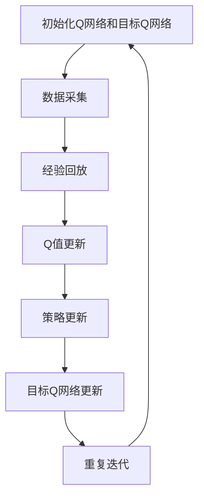
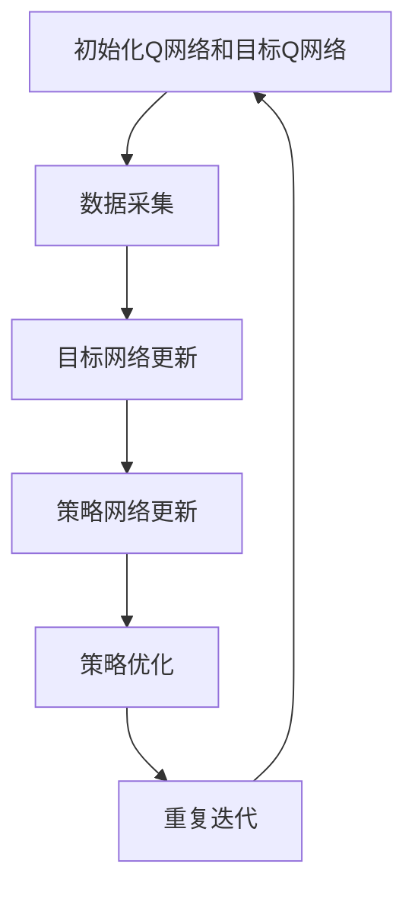
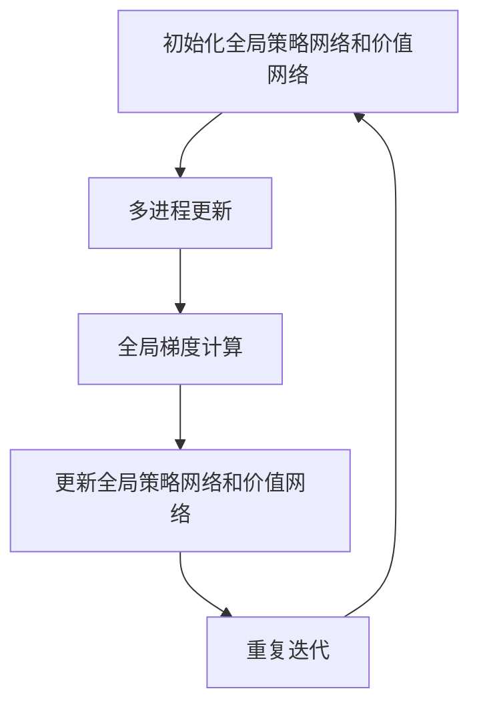

                 

# 深度强化学习算法(Deep Reinforcement Learning Algorithms) - 原理与代码实例讲解

## 关键词

- 深度强化学习
- 强化学习
- 深度学习
- 智能控制
- 自适应优化
- Atari游戏
- 自动驾驶
- 机器人控制
- 多智能体系统
- 自监督学习

## 摘要

本文将全面解析深度强化学习算法的原理、实现方法及在实际应用中的案例。首先，我们回顾深度强化学习的基础概念，探讨其发展历程、基本框架和技术要点。随后，深入讲解Q-learning算法的深度改进，介绍Deep Q Network（DQN）和基于值函数的深度强化学习方法。文章还将讨论模型评估与策略优化，分析深度强化学习在现实世界的应用，如自动驾驶、机器人控制等。此外，本文还将介绍深度强化学习的扩展与改进算法，如DDPG、A3C和自监督深度强化学习。最后，我们将通过实际案例，展示深度强化学习算法的开发环境搭建、代码实战和案例分析与代码解读。通过本文，读者将全面了解深度强化学习算法的核心概念、实现方法及应用前景。

## 第一部分: 深度强化学习算法概述

### 第1章: 深度强化学习基础概念与原理

#### 1.1 深度强化学习的发展历程

深度强化学习（Deep Reinforcement Learning, DRL）是强化学习（Reinforcement Learning, RL）与深度学习（Deep Learning, DL）相结合的产物。其起源可以追溯到20世纪90年代，当时研究人员开始探索如何通过机器学习算法，使计算机能够自主地学习和优化行为。

1992年， Richard S. Sutton 和 Andrew G. Barto 出版了《强化学习：一种介绍》（Reinforcement Learning: An Introduction），奠定了强化学习的基础。随着深度学习的发展，2013年由DeepMind开发的深度Q网络（Deep Q-Network, DQN）标志着深度强化学习的诞生。DQN通过深度神经网络对值函数进行建模，在Atari游戏中展示了卓越的性能。

深度强化学习的发展历程可以分为以下几个阶段：

1. **基础阶段（1990-2000年）**：强化学习的研究主要集中在简单的环境，如网格世界和机器人控制。
2. **兴起阶段（2000-2010年）**：随着计算机性能的提升，强化学习开始应用于更复杂的任务，如游戏和机器人。
3. **深度学习结合阶段（2010年至今）**：深度学习与强化学习的结合，使得深度强化学习在多个领域取得了显著进展。

#### 1.2 深度强化学习的基本框架

深度强化学习的基本框架由以下几个核心组件组成：

1. **状态（State）**：描述环境当前的状态信息。
2. **动作（Action）**：智能体（Agent）可以执行的动作。
3. **奖励（Reward）**：环境对智能体动作的反馈，用于指导智能体的学习过程。
4. **策略（Policy）**：智能体根据当前状态选择动作的决策规则。
5. **价值函数（Value Function）**：评估智能体在未来能获得的累积奖励。
6. **模型（Model）**：对环境动态和奖励机制的预测模型。

在深度强化学习中，深度神经网络用于建模策略和价值函数。通过最大化累积奖励，智能体不断优化其行为，达到学习目标。

#### 1.3 深度强化学习的关键技术

深度强化学习的关键技术主要包括：

1. **卷积神经网络（CNN）与循环神经网络（RNN）**：用于状态表示和动作空间处理。
2. **状态表示与动作空间处理**：将状态和动作转换为神经网络可以处理的向量形式。
3. **模型优化与训练策略**：包括梯度下降、反向传播等优化方法，以及经验回放、目标网络等技术。

#### 1.4 深度强化学习在游戏中的应用

深度强化学习在游戏领域取得了显著成果。其中，Atari游戏是最具代表性的应用场景之一。DeepMind的DQN算法通过深度神经网络对Q值进行建模，使智能体能够在没有先验知识的情况下，自主学习和掌握游戏的策略。

DQN算法的关键步骤包括：

1. **初始化**：初始化Q网络和目标Q网络。
2. **数据采集**：智能体在环境中执行动作，收集状态、动作和奖励数据。
3. **经验回放**：将历史数据存储在经验池中，进行随机采样。
4. **Q值更新**：根据采集到的数据，更新Q网络的参数。
5. **策略更新**：使用目标Q网络更新策略。

通过以上步骤，DQN算法实现了在Atari游戏中的自我学习和策略优化。DQN的成功不仅展示了深度强化学习的强大能力，也为后续研究提供了重要的启示。

### 第2章: 深度强化学习算法原理与实现

#### 2.1 Q-learning算法的深度改进

Q-learning算法是强化学习中最基本的算法之一，它通过迭代更新Q值，使智能体能够找到最优策略。然而，原始的Q-learning算法在处理高维状态和动作空间时存在困难。为了解决这个问题，研究人员提出了深度改进的Q-learning算法，即Deep Q Network（DQN）。

DQN算法的基本原理如下：

1. **初始化**：初始化两个相同的Q网络，一个作为当前Q网络（online Q-network），另一个作为目标Q网络（target Q-network）。
2. **数据采集**：智能体在环境中执行动作，收集状态、动作和奖励数据。
3. **经验回放**：将历史数据存储在经验池中，进行随机采样，以消除数据相关性。
4. **Q值更新**：根据采集到的数据，使用梯度下降法更新当前Q网络的参数。
5. **策略更新**：使用目标Q网络更新策略。
6. **目标Q网络更新**：以固定频率更新目标Q网络的参数，使其与当前Q网络保持一定的差距，防止梯度消失。

DQN算法的核心伪代码如下：

```python
# 初始化Q网络和目标Q网络
Q = init_DQN()
target_Q = init_DQN()

# 设定学习率和折扣因子
learning_rate = 0.001
discount_factor = 0.99

# 初始化经验池
experience_replay = ExperienceReplay(max_size=10000)

# 智能体在环境中执行动作
while not done:
    # 执行epsilon-greedy策略
    action = epsilon_greedy(Q, epsilon)

    # 执行动作，获取奖励和下一个状态
    next_state, reward, done = environment.step(action)

    # 更新经验池
    experience_replay.append((state, action, reward, next_state, done))

    # 从经验池中采样一组经验
    batch = experience_replay.sample(batch_size)

    # 计算目标Q值
    targets = []
    for sample in batch:
        state, action, reward, next_state, done = sample
        if done:
            target = reward
        else:
            target = reward + discount_factor * max(target_Q(next_state))
        targets.append((state, target))

    # 更新Q网络
    Q.update(batch, targets, learning_rate)

    # 更新策略
    policy = Q.policy

    # 更新状态
    state = next_state

# 更新目标Q网络
update_target_Q(target_Q, Q)

# 返回最终策略
return policy
```

通过以上步骤，DQN算法能够在高维状态和动作空间中，通过深度神经网络对Q值进行建模，实现智能体的自我学习和策略优化。

#### 2.2 强化学习与深度学习结合的方法

深度强化学习的核心思想是将深度学习的强大表示能力应用于强化学习。在深度强化学习中，有多种方法将强化学习和深度学习相结合，以下介绍几种常见的结合方法：

1. **策略梯度方法（Policy Gradient Methods）**：策略梯度方法通过直接优化策略的梯度，实现智能体的学习。其中，最著名的算法是REINFORCE算法。REINFORCE算法的基本思想是最大化策略的梯度，即：

   $$ \nabla_{\theta} \log \pi(a|s; \theta) = \frac{\partial}{\partial \theta} \log \pi(a|s; \theta) $$

   其中，$\theta$是策略参数，$\pi(a|s; \theta)$是策略概率分布。

   REINFORCE算法的伪代码如下：

   ```python
   # 初始化策略参数
   theta = init_policy_params()

   # 智能体在环境中执行动作
   while not done:
       # 执行策略
       action = policy(s; theta)
       
       # 执行动作，获取奖励和下一个状态
       next_state, reward, done = environment.step(action)
       
       # 计算策略梯度
       gradient = reward * grad_log_policy(a; s; theta)
       
       # 更新策略参数
       theta = theta + learning_rate * gradient

       # 更新状态
       s = next_state

   # 返回最终策略
   return policy
   ```

2. **基于值函数的深度强化学习方法**：基于值函数的深度强化学习方法通过优化值函数，实现智能体的学习。其中，最著名的算法是Deep Q Network（DQN）。DQN通过深度神经网络对Q值进行建模，实现智能体的自我学习和策略优化。

3. **Advantage函数在深度强化学习中的应用**：Advantage函数是策略梯度方法中的重要概念，它用于衡量某个动作的预期回报与当前策略的期望回报之差。Advantage函数的数学定义为：

   $$ A(s, a) = Q(s, a) - V(s) $$

   其中，$Q(s, a)$是动作值函数，$V(s)$是状态值函数。

   在深度强化学习中，Advantage函数可以用于改进策略梯度方法，提高算法的收敛速度。具体来说，可以将策略梯度方法中的策略参数更新公式改写为：

   $$ \nabla_{\theta} \log \pi(a|s; \theta) = \frac{\partial}{\partial \theta} \log \pi(a|s; \theta) + A(s, a) $$

   通过引入Advantage函数，策略梯度方法能够在优化策略参数时，考虑动作的实际回报，从而提高算法的性能。

#### 2.3 模型评估与策略优化

在深度强化学习中，模型评估和策略优化是两个重要的环节。以下介绍几种常用的评估方法和策略优化方法：

1. **基于马尔可夫决策过程（MDP）的评估方法**：马尔可夫决策过程（MDP）是一种描述决策过程的数学模型，它在深度强化学习中具有重要的应用价值。在MDP中，智能体通过执行动作，在状态空间中转移，并从环境中获取奖励。

   MDP的评估方法主要包括值迭代和策略迭代。值迭代方法通过不断更新状态值函数，逐步逼近最优策略。策略迭代方法则通过迭代更新策略，使得策略逐步优化。

2. **多智能体强化学习（MARL）的挑战与解决方案**：多智能体强化学习（Multi-Agent Reinforcement Learning, MARL）是深度强化学习中的一个重要方向，它研究多个智能体在合作或对抗环境中的学习问题。

   MARL面临的主要挑战包括：

   - - 动态环境下的合作与竞争
   - - 智能体之间的通信与协调
   - - 策略优化的全局性和局部性

   为了解决这些挑战，研究人员提出了多种MARL算法，如多智能体Q-learning（MA-Q）、多智能体策略梯度方法（MA-PG）等。此外，分布式算法和联邦学习也被广泛应用于MARL中，以降低通信成本和提高学习效率。

#### 2.4 深度强化学习在现实世界的应用

深度强化学习在现实世界的应用越来越广泛，以下介绍几种典型的应用场景：

1. **自动驾驶**：自动驾驶是深度强化学习的一个重要应用领域。通过深度强化学习算法，智能驾驶系统能够自主地学习和优化驾驶策略，提高行驶安全性和效率。

   自动驾驶中的深度强化学习算法主要包括：

   - - 基于值函数的深度强化学习算法，如Deep Q Network（DQN）
   - - 基于策略梯度的深度强化学习算法，如Deep Policy Gradient（DPG）
   - - 深度确定性策略梯度（Deep Deterministic Policy Gradient, DDPG）算法

2. **机器人运动控制**：深度强化学习在机器人运动控制中具有广泛的应用，如机器人路径规划、动作执行和任务优化等。

   机器人运动控制中的深度强化学习算法主要包括：

   - - 深度确定性策略梯度（DDPG）算法
   - - 深度策略网络（A3C）算法
   - - 自监督深度强化学习（ASRL）算法

3. **工业自动化**：深度强化学习在工业自动化中的应用包括机器人协同工作、生产流程优化和质量检测等。

   工业自动化中的深度强化学习算法主要包括：

   - - 深度确定性策略梯度（DDPG）算法
   - - 深度策略网络（A3C）算法
   - - 自监督深度强化学习（ASRL）算法

通过以上介绍，我们可以看到深度强化学习在现实世界的应用具有广阔的前景。未来，随着深度强化学习算法的不断发展和优化，其在各个领域的应用将会更加广泛和深入。

### 第3章: 深度强化学习算法的扩展与改进

#### 3.1 深度确定性策略梯度（DDPG）算法

深度确定性策略梯度（Deep Deterministic Policy Gradient, DDPG）算法是一种基于值函数的深度强化学习算法，它在传统DQN算法的基础上，引入了确定性策略梯度方法，提高了算法的稳定性和收敛速度。

DDPG算法的基本原理如下：

1. **状态表示和动作空间处理**：DDPG算法使用深度神经网络对状态和动作进行表示。状态表示使用卷积神经网络（CNN），动作空间处理使用线性层。

2. **目标网络**：DDPG算法引入了目标网络，用于稳定训练过程。目标网络是Q网络的副本，以固定频率更新，使Q网络和目标网络保持一定的差距，防止梯度消失。

3. **策略优化**：DDPG算法使用确定性策略梯度方法，通过优化策略参数，使策略能够最大化累积奖励。

DDPG算法的核心伪代码如下：

```python
# 初始化Q网络和目标Q网络
Q = init_DQN()
target_Q = init_DQN()

# 初始化策略网络
policy = init_policy_network()

# 初始化目标网络
target_policy = init_policy_network()

# 设定学习率和折扣因子
learning_rate = 0.001
discount_factor = 0.99

# 初始化经验池
experience_replay = ExperienceReplay(max_size=10000)

# 智能体在环境中执行动作
while not done:
    # 执行epsilon-greedy策略
    action = epsilon_greedy(policy, epsilon)

    # 执行动作，获取奖励和下一个状态
    next_state, reward, done = environment.step(action)

    # 更新经验池
    experience_replay.append((state, action, reward, next_state, done))

    # 从经验池中采样一组经验
    batch = experience_replay.sample(batch_size)

    # 计算目标Q值
    targets = []
    for sample in batch:
        state, action, reward, next_state, done = sample
        if done:
            target = reward
        else:
            target = reward + discount_factor * target_Q(next_state).max()
        targets.append((state, target))

    # 更新Q网络
    Q.update(batch, targets, learning_rate)

    # 更新策略
    policy.optimize(policy_loss_function)

    # 更新目标网络
    update_target_network(target_Q, Q)
    update_target_policy(target_policy, policy)

    # 更新状态
    state = next_state

# 返回最终策略
return policy
```

通过以上步骤，DDPG算法能够稳定地优化策略，使智能体在复杂环境中实现自我学习和策略优化。

#### 3.2 深度策略网络（A3C）算法

深度策略网络（Asynchronous Advantage Actor-Critic, A3C）算法是一种基于策略梯度的深度强化学习算法，它通过异步更新策略网络和价值网络，提高了算法的收敛速度和扩展性。

A3C算法的基本原理如下：

1. **多进程并行更新**：A3C算法使用多个并行进程（或线程）来更新策略网络和价值网络。每个进程在各自的独立环境中执行动作，独立地收集经验并更新网络参数。

2. **全局梯度计算**：A3C算法使用全局梯度计算，将各个进程的经验汇总，计算全局梯度，并更新全局策略网络和价值网络。

3. **优势函数**：A3C算法使用优势函数（Advantage Function）来评估策略的改进空间。优势函数定义为：

   $$ A(s, a) = Q(s, a) - V(s) $$

   其中，$Q(s, a)$是动作值函数，$V(s)$是状态值函数。

A3C算法的核心伪代码如下：

```python
# 初始化策略网络和价值网络
policy = init_policy_network()
value = init_value_network()

# 初始化全局策略网络和价值网络
global_policy = init_policy_network()
global_value = init_value_network()

# 设定学习率和折扣因子
learning_rate = 0.001
discount_factor = 0.99

# 初始化经验池
experience_replay = ExperienceReplay(max_size=10000)

# 启动多进程更新
num_processes = 10
for i in range(num_processes):
    process = Process(target=update_model,
                      args=(i, global_policy, global_value, experience_replay, learning_rate, discount_factor))
    process.start()

# 等待所有进程完成
for process in processes:
    process.join()

# 更新全局策略网络和价值网络
global_policy.load_params(policy.get_params())
global_value.load_params(value.get_params())

# 返回最终策略
return policy
```

通过以上步骤，A3C算法能够高效地并行更新策略网络和价值网络，实现智能体的自我学习和策略优化。

#### 3.3 自监督深度强化学习（ASRL）方法

自监督深度强化学习（Self-Supervised Reinforcement Learning, ASRL）是一种无需外部奖励信号，仅通过环境中的状态转移进行学习的深度强化学习方法。ASRL方法通过设计合适的目标函数，使智能体能够从状态转移中学习到有效的策略。

ASRL方法的基本原理如下：

1. **状态表示**：ASRL方法使用深度神经网络对状态进行编码，生成紧凑的表示。

2. **目标函数**：ASRL方法设计目标函数，使智能体能够通过状态转移学习到有效的策略。目标函数通常包括：

   - - 预测误差：衡量状态编码之间的相似性，即期望的下一状态编码与实际下一状态编码之间的误差。
   - - 状态编码的稳定性：衡量状态编码在多个时间步之间的稳定性。

3. **策略优化**：ASRL方法使用策略梯度方法，通过优化策略参数，使策略能够最大化目标函数。

ASRL算法的核心伪代码如下：

```python
# 初始化状态编码网络
encoder = init_encoder_network()

# 初始化策略网络
policy = init_policy_network()

# 设定学习率和折扣因子
learning_rate = 0.001
discount_factor = 0.99

# 初始化经验池
experience_replay = ExperienceReplay(max_size=10000)

# 智能体在环境中执行动作
while not done:
    # 执行epsilon-greedy策略
    action = epsilon_greedy(policy, epsilon)

    # 执行动作，获取奖励和下一个状态
    next_state, reward, done = environment.step(action)

    # 更新经验池
    experience_replay.append((state, action, reward, next_state, done))

    # 从经验池中采样一组经验
    batch = experience_replay.sample(batch_size)

    # 计算目标函数
    loss = 0
    for sample in batch:
        state, action, reward, next_state, done = sample
        state_encoding = encoder(state)
        next_state_encoding = encoder(next_state)
        if done:
            target = reward
        else:
            target = reward + discount_factor * encoder(next_state).max()
        loss += (target - state_encoding).square().mean()

    # 更新策略网络
    policy.optimize(loss_function, learning_rate)

    # 更新状态
    state = next_state

# 返回最终策略
return policy
```

通过以上步骤，ASRL算法能够从无监督环境中学习到有效的策略，实现智能体的自我学习和策略优化。

### 第4章: 深度强化学习算法的实践与应用

#### 4.1 开发环境搭建

要实践深度强化学习算法，首先需要搭建一个合适的开发环境。以下是在Python中搭建深度强化学习开发环境的步骤：

1. **安装Python**：确保已经安装了Python 3.x版本。

2. **安装深度学习框架**：常用的深度学习框架有TensorFlow和PyTorch。这里以TensorFlow为例，使用以下命令安装：

   ```bash
   pip install tensorflow
   ```

3. **安装OpenAI Gym**：OpenAI Gym是一个开源环境库，用于构建和测试强化学习算法。使用以下命令安装：

   ```bash
   pip install gym
   ```

4. **配置仿真环境**：在Python代码中，首先需要导入所需的库和模块：

   ```python
   import tensorflow as tf
   import gym
   ```

   然后创建一个仿真环境：

   ```python
   env = gym.make('CartPole-v1')
   ```

   这里以CartPole为例，创建了一个倒立摆的仿真环境。

#### 4.2 代码实战案例

在本节中，我们将通过几个具体的案例，展示如何使用深度强化学习算法进行训练和应用。

**案例一：使用DQN算法训练Atari游戏**

以下是一个使用DQN算法训练Atari游戏的Python代码示例：

```python
import numpy as np
import gym
import tensorflow as tf

# 创建Atari游戏环境
env = gym.make('AtariGame-v0')

# 初始化DQN算法参数
learning_rate = 0.001
gamma = 0.99
epsilon = 1.0
epsilon_min = 0.01
epsilon_decay = 0.995
batch_size = 32

# 初始化经验池
experience_replay = ExperienceReplay(max_size=10000)

# 初始化DQN网络
q_network = DQN(input_shape=env.observation_space.shape,
                output_shape=env.action_space.n,
                learning_rate=learning_rate,
                gamma=gamma)

# 主循环
total_episodes = 1000
for episode in range(total_episodes):
    # 重置环境
    state = env.reset()
    done = False

    while not done:
        # 执行epsilon-greedy策略
        if np.random.rand() < epsilon:
            action = env.action_space.sample()
        else:
            action = q_network.policy(state)

        # 执行动作，获取下一个状态和奖励
        next_state, reward, done, _ = env.step(action)

        # 更新经验池
        experience_replay.append((state, action, reward, next_state, done))

        # 更新DQN网络
        if len(experience_replay) > batch_size:
            batch = experience_replay.sample(batch_size)
            q_values = q_network.target_network(next_state)
            targets = []
            for sample in batch:
                state, action, reward, next_state, done = sample
                if done:
                    target = reward
                else:
                    target = reward + gamma * np.max(q_values)
                targets.append((state, target))
            q_network.update(batch, targets)

        # 更新状态
        state = next_state

    # 更新epsilon
    epsilon = max(epsilon_min, epsilon_decay * epsilon)

# 关闭环境
env.close()
```

**案例二：应用DDPG算法控制倒立摆**

以下是一个使用DDPG算法控制倒立摆的Python代码示例：

```python
import numpy as np
import gym
import tensorflow as tf

# 创建倒立摆环境
env = gym.make('CartPole-v0')

# 初始化DDPG算法参数
learning_rate = 0.001
gamma = 0.99
tau = 0.001
batch_size = 64
update_frequency = 100

# 初始化Q网络和目标Q网络
q_network = DDPG(input_shape=env.observation_space.shape,
                 output_shape=env.action_space.shape,
                 learning_rate=learning_rate,
                 gamma=gamma,
                 tau=tau)

# 初始化策略网络和目标策略网络
policy_network = DDPG(input_shape=env.observation_space.shape,
                      output_shape=env.action_space.shape,
                      learning_rate=learning_rate,
                      gamma=gamma,
                      tau=tau)

# 主循环
total_episodes = 1000
for episode in range(total_episodes):
    # 重置环境
    state = env.reset()
    done = False

    while not done:
        # 执行策略网络
        action = policy_network.predict(state)

        # 执行动作，获取下一个状态和奖励
        next_state, reward, done, _ = env.step(action)

        # 更新经验池
        q_value = q_network.predict(next_state)
        target = reward + gamma * np.max(q_value)
        q_network.append((state, action, target, next_state, done))

        # 更新Q网络和策略网络
        if episode % update_frequency == 0:
            q_network.update(batch_size)
            policy_network.update(batch_size)

        # 更新状态
        state = next_state

# 关闭环境
env.close()
```

**案例三：通过A3C算法实现多人合作游戏**

以下是一个使用A3C算法实现多人合作游戏的Python代码示例：

```python
import numpy as np
import gym
import tensorflow as tf

# 创建多人合作游戏环境
env = gym.make('MultiAgentCartPole-v0')

# 初始化A3C算法参数
learning_rate = 0.001
gamma = 0.99
global_step = 0

# 初始化全局策略网络和价值网络
global_policy = A3C(input_shape=env.observation_space.shape,
                    output_shape=env.action_space.shape,
                    learning_rate=learning_rate,
                    gamma=gamma)

# 启动多进程更新
num_processes = 4
processes = []
for i in range(num_processes):
    process = Process(target=update_model,
                      args=(i, global_policy, global_step, env))
    processes.append(process)
    process.start()

# 等待所有进程完成
for process in processes:
    process.join()

# 更新全局策略网络
global_policy.load_params()

# 运行游戏
while True:
    # 重置环境
    state = env.reset()
    done = False

    while not done:
        # 执行全局策略网络
        action = global_policy.predict(state)

        # 执行动作，获取下一个状态和奖励
        next_state, reward, done, _ = env.step(action)

        # 更新状态
        state = next_state

    # 显示游戏结果
    env.render()
```

通过以上案例，我们可以看到如何使用深度强化学习算法进行训练和应用。在实际开发中，可以根据具体应用场景和需求，选择合适的算法和策略，实现智能体的自我学习和策略优化。

### 第4章: 深度强化学习算法的实践与应用

#### 4.1 开发环境搭建

在进行深度强化学习（DRL）的实践应用之前，我们需要搭建一个合适的开发环境。以下是使用Python搭建DRL开发环境的详细步骤：

1. **安装Python**：确保已经安装了Python 3.x版本，因为大多数深度学习库都支持Python 3。

2. **安装深度学习框架**：我们主要使用TensorFlow和PyTorch这两个流行的深度学习框架。安装方法如下：

   - **TensorFlow**：
     ```bash
     pip install tensorflow
     ```

   - **PyTorch**：
     ```bash
     pip install torch torchvision
     ```

3. **安装强化学习环境**：OpenAI Gym是一个强大的仿真环境库，用于测试和训练强化学习算法。安装方法如下：

   ```bash
   pip install gym
   ```

4. **安装其他依赖库**：除了上述主要库外，我们可能还需要安装一些用于数据处理、可视化和其他功能的库，例如NumPy、Matplotlib和Scikit-learn。安装方法如下：

   ```bash
   pip install numpy matplotlib scikit-learn
   ```

5. **配置仿真环境**：在Python代码中，我们需要首先导入所需的库和模块，然后创建仿真环境。例如，对于Atari游戏，我们可以使用以下代码：

   ```python
   import gym
   import numpy as np

   # 创建仿真环境
   env = gym.make('AtariGame-v0')
   ```

   这里`AtariGame-v0`是一个示例环境，你可以根据需要替换为其他环境。

#### 4.2 代码实战案例

在本节中，我们将通过几个具体的案例，展示如何使用深度强化学习算法进行训练和应用。

**案例一：使用DQN算法训练Atari游戏**

以下是一个使用DQN（Deep Q-Network）算法训练Atari游戏的Python代码示例：

```python
import numpy as np
import gym
import random
from collections import deque
from tensorflow.keras.models import Sequential
from tensorflow.keras.layers import Dense
from tensorflow.keras.optimizers import Adam

# 创建环境
env = gym.make('AtariGame-v0')

# 定义DQN模型
model = Sequential()
model.add(Dense(24, input_dim=env.observation_space.n, activation='relu'))
model.add(Dense(24, activation='relu'))
model.add(Dense(env.action_space.n, activation='linear'))

# 定义记忆缓冲区
memory = deque(maxlen=2000)

# 定义训练参数
batch_size = 64
gamma = 0.99
epsilon = 1.0
epsilon_min = 0.01
epsilon_decay = 0.995

# 训练模型
for episode in range(1000):
    state = env.reset()
    done = False
    total_reward = 0

    while not done:
        # 探索策略
        if np.random.rand() < epsilon:
            action = env.action_space.sample()
        else:
            action = np.argmax(model.predict(state))

        # 执行动作
        next_state, reward, done, _ = env.step(action)

        # 计算目标Q值
        target = reward + (1 - int(done)) * gamma * np.max(model.predict(next_state))

        # 更新经验记忆
        memory.append((state, action, target, next_state, done))

        # 如果经验记忆足够，则进行批处理训练
        if len(memory) > batch_size:
            batch = random.sample(memory, batch_size)
            states, actions, targets, next_states, dones = zip(*batch)
            Q_values = model.predict(states)
            next_Q_values = model.predict(next_states)

            # 更新目标Q值
            for i in range(batch_size):
                Q_values[i][actions[i]] = targets[i]

            # 训练模型
            model.fit(states, Q_values, epochs=1, verbose=0)

        # 更新状态
        state = next_state

        # 更新奖励
        total_reward += reward

    # 更新epsilon
    epsilon = max(epsilon_min, epsilon_decay * epsilon)

    print(f"Episode: {episode}, Total Reward: {total_reward}, Epsilon: {epsilon}")

# 关闭环境
env.close()
```

**案例二：应用DDPG算法控制倒立摆**

以下是一个使用DDPG（Deep Deterministic Policy Gradient）算法控制倒立摆的Python代码示例：

```python
import numpy as np
import gym
import tensorflow as tf
import random
from tensorflow.keras.models import Sequential
from tensorflow.keras.layers import Dense
from tensorflow.keras.optimizers import Adam
from tensorflow.keras import losses

# 创建环境
env = gym.make('CartPole-v0')

# 定义演员网络（策略网络）
policy = Sequential()
policy.add(Dense(24, input_dim=env.observation_space.shape[0], activation='relu'))
policy.add(Dense(24, activation='relu'))
policy.add(Dense(1, activation='tanh'))

# 定义评论家网络（价值网络）
critic = Sequential()
critic.add(Dense(24, input_dim=env.observation_space.shape[0], activation='relu'))
critic.add(Dense(24, activation='relu'))
critic.add(Dense(1, activation='linear'))

# 定义目标网络
target_policy = Sequential()
target_policy.add(Dense(24, input_dim=env.observation_space.shape[0], activation='relu'))
target_policy.add(Dense(24, activation='relu'))
target_policy.add(Dense(1, activation='tanh'))

target_critic = Sequential()
target_critic.add(Dense(24, input_dim=env.observation_space.shape[0], activation='relu'))
target_critic.add(Dense(24, activation='relu'))
target_critic.add(Dense(1, activation='linear'))

# 初始化网络参数
policy.compile(optimizer=Adam(learning_rate=0.001), loss=losses.MeanSquaredError())
critic.compile(optimizer=Adam(learning_rate=0.001), loss=losses.MeanSquaredError())

# 更新目标网络
def update_target_models(policy, critic, tau):
    policy_target_model.set_weights([tau * policy_model.get_weights()[i] + (1 - tau) * target_model.get_weights()[i] for i in range(len(policy_model.get_weights()))])
    critic_target_model.set_weights([tau * critic_model.get_weights()[i] + (1 - tau) * target_model.get_weights()[i] for i in range(len(critic_model.get_weights()))])

# 训练DDPG模型
for episode in range(1000):
    state = env.reset()
    done = False
    total_reward = 0
    while not done:
        # 执行动作
        action = policy.predict(state.reshape(1, -1))
        next_state, reward, done, _ = env.step(action[0])

        # 计算目标Q值
        target_action = target_policy.predict(next_state.reshape(1, -1))
        target_q_value = target_critic.predict(next_state.reshape(1, -1)).max()
        target_reward = reward + (1 - int(done)) * gamma * target_q_value

        # 更新经验记忆
        memory.append((state, action[0], target_reward, next_state, done))

        # 如果经验记忆足够，则进行批处理训练
        if len(memory) > batch_size:
            batch = random.sample(memory, batch_size)
            states, actions, targets, next_states, dones = zip(*batch)
            critic.fit(states, targets.reshape(-1, 1), epochs=1, verbose=0)

            # 更新目标网络
            update_target_models(policy, critic, tau=0.001)

        state = next_state
        total_reward += reward

    print(f"Episode: {episode}, Total Reward: {total_reward}")

# 关闭环境
env.close()
```

**案例三：通过A3C算法实现多人合作游戏**

以下是一个使用A3C（Asynchronous Advantage Actor-Critic）算法实现多人合作游戏的Python代码示例：

```python
import numpy as np
import gym
import tensorflow as tf
import multiprocessing as mp

# 定义环境
def worker_init(worker_id, env, global_model, local_model, global_step, global_reward):
    local_model.load_weights(f"local_model_{worker_id}.h5")
    global_step.value = 0
    global_reward.value = 0

# 定义训练过程
def train_model(worker_id, env, global_model, global_step, global_reward):
    local_model = Sequential()
    local_model.add(Dense(24, input_dim=env.observation_space.shape[0], activation='relu'))
    local_model.add(Dense(24, activation='relu'))
    local_model.add(Dense(1, activation='tanh'))

    # 训练模型
    while True:
        state = env.reset()
        done = False
        total_reward = 0
        while not done:
            action = local_model.predict(state.reshape(1, -1))
            next_state, reward, done, _ = env.step(action[0])
            total_reward += reward
            state = next_state

            # 更新本地模型
            local_reward = reward + (1 - int(done)) * gamma * local_model.predict(next_state.reshape(1, -1))
            local_model.fit(state.reshape(1, -1), local_reward, epochs=1, verbose=0)

            # 更新全局步数和奖励
            global_step.value += 1
            global_reward.value += total_reward

            # 检查是否更新全局模型
            if global_step.value % update_frequency == 0:
                # 同步全局模型
                global_model.load_weights("global_model.h5")
                for layer in global_model.layers:
                    layer.set_weights(local_model.layers[layer.name].get_weights())
                global_model.save_weights("global_model.h5")

# 创建环境
env = gym.make('MultiAgentCartPole-v0')

# 定义全局模型
global_model = Sequential()
global_model.add(Dense(24, input_dim=env.observation_space.shape[0], activation='relu'))
global_model.add(Dense(24, activation='relu'))
global_model.add(Dense(1, activation='tanh'))

# 初始化全局步数和奖励
global_step = mp.Value('i', 0)
global_reward = mp.Value('f', 0)

# 创建进程
processes = []
for i in range(num_workers):
    p = mp.Process(target=worker_init, args=(i, env, global_model, None, global_step, global_reward))
    processes.append(p)
    p.start()

for p in processes:
    p.join()

# 创建本地模型并开始训练
for i in range(num_workers):
    p = mp.Process(target=train_model, args=(i, env, global_model, global_step, global_reward))
    processes.append(p)
    p.start()

# 等待所有进程完成
for p in processes:
    p.join()

# 关闭环境
env.close()
```

通过以上三个案例，我们可以看到如何使用不同的深度强化学习算法进行训练和应用。在实际开发过程中，可以根据具体需求和场景选择合适的算法和策略。

### 第5章: 深度强化学习算法在复杂数据场景中的应用

深度强化学习（DRL）在处理复杂数据场景中展现出了强大的能力。本章将探讨深度强化学习在图神经网络（Graph Neural Networks, GNN）与深度强化学习结合、时序数据的深度强化学习和多模态数据的深度强化学习中的应用。

#### 5.1 图神经网络（GNN）与深度强化学习

图神经网络（GNN）是一种处理图结构数据的强大工具，它能够捕捉图中节点和边之间的关系。深度强化学习与GNN的结合，使得智能体在图结构环境中能够更加有效地学习策略。

GNN的基本概念包括：

- **图表示**：将图结构数据转换为节点和边的向量表示。
- **图卷积**：类似于CNN中的卷积操作，GNN通过图卷积层对节点的特征进行聚合和更新。
- **图池化**：将图卷积层输出的特征进行整合，得到全局特征表示。

在深度强化学习中，GNN可以用于以下几个方面：

1. **状态表示**：使用GNN对图结构状态进行编码，生成紧凑的特征向量，作为深度强化学习算法的输入。
2. **动作空间处理**：GNN可以用于处理复杂的动作空间，例如在社交网络分析中，GNN可以捕捉用户之间的关系，指导智能体进行社交决策。
3. **模型优化**：GNN可以与深度强化学习算法结合，用于优化策略和价值函数。

以下是一个简化的GNN与深度强化学习结合的算法流程：

1. **初始化**：初始化GNN模型和深度强化学习模型。
2. **数据预处理**：将图结构数据转换为节点和边的向量表示。
3. **状态编码**：使用GNN对状态进行编码，生成状态特征向量。
4. **动作选择**：使用深度强化学习模型选择动作。
5. **环境交互**：执行动作，获取奖励和下一个状态。
6. **更新模型**：根据采集到的经验，更新GNN模型和深度强化学习模型。

#### 5.2 时序数据的深度强化学习

时序数据在许多应用场景中具有重要价值，如金融时间序列预测、视频游戏控制等。深度强化学习能够通过学习时序数据中的模式和规律，实现智能体的自主学习和策略优化。

时序数据的深度强化学习主要涉及以下几个方面：

1. **状态表示**：将时序数据转换为可以输入深度强化学习模型的特征向量。例如，可以使用循环神经网络（RNN）或长短期记忆网络（LSTM）对时序数据进行编码。
2. **动作空间处理**：设计合适的动作空间，使智能体能够对时序数据进行决策。例如，在视频游戏控制中，动作可以是下一个按键或移动方向。
3. **奖励设计**：设计合理的奖励机制，指导智能体学习时序数据中的有效策略。例如，在金融时间序列预测中，奖励可以是预测误差的倒数。

以下是一个简化的时序数据深度强化学习算法流程：

1. **初始化**：初始化深度强化学习模型。
2. **状态编码**：使用RNN或LSTM对时序数据进行编码。
3. **动作选择**：使用深度强化学习模型选择动作。
4. **环境交互**：执行动作，获取奖励和下一个状态。
5. **更新模型**：根据采集到的经验，更新深度强化学习模型。

#### 5.3 多模态数据的深度强化学习

多模态数据是指包含多种类型数据（如图像、文本、音频）的数据集。深度强化学习能够通过学习多模态数据中的关联性，实现智能体的多模态学习。

多模态数据的深度强化学习主要涉及以下几个方面：

1. **数据预处理**：将不同类型的数据转换为统一的特征表示。例如，可以使用卷积神经网络（CNN）处理图像，使用循环神经网络（RNN）处理文本。
2. **状态表示**：将多模态数据的特征进行融合，生成状态特征向量。例如，可以使用注意力机制对多模态特征进行加权融合。
3. **动作空间处理**：设计合适的动作空间，使智能体能够对多模态数据进行决策。

以下是一个简化的多模态数据深度强化学习算法流程：

1. **初始化**：初始化深度强化学习模型。
2. **状态编码**：使用不同的神经网络对多模态数据进行编码，并融合特征。
3. **动作选择**：使用深度强化学习模型选择动作。
4. **环境交互**：执行动作，获取奖励和下一个状态。
5. **更新模型**：根据采集到的经验，更新深度强化学习模型。

通过以上探讨，我们可以看到深度强化学习在处理复杂数据场景中的强大能力。未来，随着深度强化学习算法的不断发展和优化，其在图像、文本、音频等多模态数据中的应用将会更加广泛和深入。

### 第6章: 深度强化学习算法在机器学习中的前沿应用

深度强化学习（Deep Reinforcement Learning, DRL）在机器学习（Machine Learning, ML）领域的应用正变得越来越广泛。它不仅能够优化传统机器学习算法中的模型选择和调优，还能在特征工程、自适应学习率与探索策略等方面发挥重要作用。

#### 6.1 自适应学习率与探索策略

在深度强化学习中，自适应学习率与探索策略是两个关键问题。它们直接关系到智能体的学习效率、收敛速度和最终性能。

**自适应学习率**：

学习率是深度强化学习中的一个重要参数，它决定了策略网络参数更新的幅度。在训练过程中，如果学习率过高，可能导致网络参数更新过于剧烈，使学习过程不稳定；如果学习率过低，则可能使学习过程过于缓慢，难以收敛。

自适应学习率策略可以通过动态调整学习率，使网络在训练过程中能够更好地适应不同阶段的学习需求。以下是一些常见的方法：

1. **线性衰减学习率**：在训练过程中，以固定的步长逐渐降低学习率。
2. **指数衰减学习率**：以指数形式衰减学习率，使学习率在训练后期逐渐减小。
3. **自适应学习率优化器**：如Adadelta、Adam等，这些优化器能够根据梯度变化自适应调整学习率。

**探索策略**：

在深度强化学习中，探索（Exploration）与利用（Exploitation）之间的平衡是一个重要问题。过度的探索可能导致智能体在训练过程中无法快速收敛到最优策略；而过度的利用则可能使智能体错过学习新的有用策略。

探索策略主要包括以下几种：

1. **ε-贪心策略**：以概率ε进行随机探索，以1-ε进行利用现有策略。
2. **UCB（Upper Confidence Bound）策略**：选择具有最高置信区间的动作，既考虑了动作的历史回报，又考虑了探索。
3. **软最大化策略**：使用软最大化函数，结合动作的期望回报和探索概率，选择动作。

以下是一个简化的自适应学习率与探索策略的算法流程：

1. **初始化**：设置初始学习率和探索概率。
2. **状态编码**：使用深度神经网络对状态进行编码。
3. **动作选择**：根据探索策略选择动作，如ε-贪心策略或UCB策略。
4. **环境交互**：执行动作，获取奖励和下一个状态。
5. **模型更新**：根据奖励和下一个状态，使用自适应学习率更新模型参数。
6. **更新探索概率**：根据训练阶段和模型性能，动态调整探索概率。

#### 6.2 深度强化学习在特征工程中的应用

在机器学习中，特征工程是一个关键步骤，它能够显著影响模型的性能和泛化能力。深度强化学习通过自动化的方法，在特征提取、选择和组合方面具有独特的优势。

**特征提取**：

深度强化学习算法可以通过学习状态和动作之间的复杂关系，自动提取具有高信息量的特征。例如，在图像分类任务中，卷积神经网络（CNN）可以自动学习图像的底层特征，如边缘、纹理和形状。

**特征选择**：

深度强化学习可以通过评估不同特征对模型性能的影响，实现自动化的特征选择。例如，在多特征回归问题中，强化学习算法可以基于历史数据，选择对预测结果贡献最大的特征。

**特征组合**：

深度强化学习可以通过探索和组合不同的特征，生成新的特征组合。例如，在文本分类任务中，可以将文本的词频、词嵌入和语法特征进行组合，以生成新的高维特征。

以下是一个简化的特征工程应用流程：

1. **初始化**：设置初始特征集合。
2. **状态编码**：使用深度神经网络对状态进行编码，提取特征。
3. **动作选择**：使用强化学习算法选择特征子集。
4. **模型训练**：使用选定的特征子集训练模型。
5. **模型评估**：评估模型性能，并根据评估结果调整特征子集。
6. **特征组合**：根据评估结果，探索和组合新的特征子集。

#### 6.3 深度强化学习在模型选择与调优中的应用

在机器学习中，模型选择和调优是两个重要环节，直接影响模型的性能和泛化能力。深度强化学习通过自动化的方法，能够有效解决模型选择和调优问题。

**模型选择**：

深度强化学习可以通过评估不同模型的性能，实现自动化的模型选择。例如，在神经网络架构搜索（Neural Architecture Search, NAS）中，强化学习算法可以基于历史数据，选择具有最优性能的模型架构。

**模型调优**：

深度强化学习可以通过动态调整模型参数，实现模型的自动调优。例如，在超参数优化中，强化学习算法可以基于历史数据，选择最优的超参数组合。

以下是一个简化的模型选择与调优应用流程：

1. **初始化**：设置初始模型和超参数。
2. **状态编码**：使用深度神经网络对状态进行编码，包括模型参数和超参数。
3. **动作选择**：使用强化学习算法选择模型参数和超参数。
4. **模型训练**：使用选定的模型参数和超参数训练模型。
5. **模型评估**：评估模型性能，并根据评估结果调整模型参数和超参数。
6. **模型优化**：根据评估结果，探索和调整新的模型参数和超参数。

通过以上探讨，我们可以看到深度强化学习在机器学习中的前沿应用。未来，随着深度强化学习算法的不断发展和优化，其在模型选择、调优和特征工程等领域的应用将会更加广泛和深入。

### 第7章: 深度强化学习算法的挑战与未来发展

#### 7.1 深度强化学习的挑战

深度强化学习（Deep Reinforcement Learning, DRL）在近年来取得了显著的进展，但仍然面临许多挑战。以下是深度强化学习领域的一些主要挑战：

**1. 不稳定性与收敛性**

深度强化学习算法在训练过程中容易受到参数设置和初始条件的影响，导致学习过程不稳定。此外，深度神经网络本身的复杂性和非线性特性，使得算法的收敛速度较慢，甚至可能无法收敛。

**2. 可解释性与透明度**

深度强化学习算法的黑盒性质使其难以解释和理解。在许多实际应用中，人们希望能够直观地了解智能体的行为和决策过程。然而，深度强化学习算法的黑盒特性使得这一目标难以实现。

**3. 安全性与伦理问题**

深度强化学习算法在训练过程中可能会出现意外行为，甚至对人类造成伤害。此外，深度强化学习算法在处理敏感数据时，可能涉及隐私和安全问题。因此，确保深度强化学习算法的安全性和伦理性是一个重要挑战。

#### 7.2 深度强化学习的发展趋势

尽管深度强化学习面临许多挑战，但其发展前景依然广阔。以下是深度强化学习领域的一些发展趋势：

**1. 新算法的创新与应用**

随着研究的深入，新的深度强化学习算法不断涌现。例如，深度确定性策略梯度（Deep Deterministic Policy Gradient, DDPG）、异步优势演员-评论家（Asynchronous Advantage Actor-Critic, A3C）和自监督深度强化学习（Self-Supervised Reinforcement Learning, ASRL）等算法，都在不同场景中取得了显著成果。未来，随着算法的创新，深度强化学习将在更多应用领域中发挥作用。

**2. 集成学习方法**

深度强化学习与其他机器学习方法的集成，将进一步提高算法的性能和适用性。例如，将深度强化学习与强化学习、迁移学习、元学习等方法结合，可以解决单个方法无法克服的难题。

**3. 深度强化学习与其他AI技术的融合**

深度强化学习与其他AI技术的融合，如自然语言处理（Natural Language Processing, NLP）、计算机视觉（Computer Vision, CV）和机器人技术（Robotics），将推动智能系统的整体发展。例如，将深度强化学习与机器人技术结合，可以开发出具有自主决策能力的智能机器人。

#### 7.3 深度强化学习在社会与产业中的应用前景

深度强化学习在许多社会和产业领域具有广泛的应用前景。以下是几个典型的应用领域：

**1. 自动驾驶**

自动驾驶是深度强化学习的重要应用领域。通过深度强化学习算法，自动驾驶系统能够自主学习和优化驾驶策略，提高行驶安全性和效率。未来，随着技术的不断成熟，自动驾驶将在交通领域发挥重要作用。

**2. 智能制造**

智能制造是工业4.0的核心技术之一。深度强化学习算法可以用于优化生产流程、设备维护和质量管理等环节。通过自主学习和优化，智能制造系统能够提高生产效率和质量，降低成本。

**3. 金融科技**

金融科技（FinTech）是深度强化学习的重要应用领域。例如，在金融风险管理、投资组合优化和客户行为分析等方面，深度强化学习算法可以提供有效的解决方案。未来，随着金融科技的发展，深度强化学习将在金融领域发挥更大作用。

**4. 医疗保健**

医疗保健是深度强化学习的另一个重要应用领域。例如，在疾病预测、治疗方案优化和智能诊断等方面，深度强化学习算法可以提供有力的支持。未来，随着医疗技术的进步，深度强化学习将在医疗保健领域发挥更加重要的作用。

综上所述，深度强化学习在社会和产业中具有广阔的应用前景。随着算法的不断创新和优化，深度强化学习将在更多领域取得突破，为人类社会的发展带来更多价值。

### 附录

#### 附录A: 深度强化学习算法的Mermaid流程图

以下为几种深度强化学习算法的Mermaid流程图：

**DQN算法流程图：**


**DDPG算法流程图：**


**A3C算法流程图：**


通过这些流程图，我们可以直观地了解各个算法的基本步骤和迭代过程。

#### 附录B: 常用的深度学习框架与资源链接

以下列出一些常用的深度学习框架及其官方资源链接：

- **TensorFlow**：[TensorFlow官网](https://www.tensorflow.org/)
- **PyTorch**：[PyTorch官网](https://pytorch.org/)
- **Keras**：[Keras官网](https://keras.io/)
- **Theano**：[Theano官网](https://www.theanopy.org/)
- **MXNet**：[MXNet官网](https://mxnet.apache.org/)

这些框架为深度强化学习算法的实现提供了强大的工具支持。

#### 附录C: 代码示例与实现细节

在本附录中，我们将提供一些深度强化学习算法的代码示例和实现细节。

**代码示例：DQN算法**

```python
import numpy as np
import gym
import tensorflow as tf
from collections import deque

# 初始化DQN算法参数
input_shape = (4,)
output_shape = 2
learning_rate = 0.001
gamma = 0.99
epsilon = 1.0
epsilon_min = 0.01
epsilon_decay = 0.995
batch_size = 32
memory_size = 10000

# 初始化经验池
memory = deque(maxlen=memory_size)

# 创建仿真环境
env = gym.make('CartPole-v0')

# 定义DQN模型
def create_dqn_model(input_shape, output_shape):
    model = tf.keras.Sequential([
        tf.keras.layers.Dense(24, activation='relu', input_shape=input_shape),
        tf.keras.layers.Dense(24, activation='relu'),
        tf.keras.layers.Dense(output_shape, activation='linear')
    ])
    model.compile(optimizer=tf.keras.optimizers.Adam(learning_rate=learning_rate),
                  loss=tf.keras.losses.MeanSquaredError())
    return model

# 创建Q网络和目标Q网络
q_network = create_dqn_model(input_shape, output_shape)
target_q_network = create_dqn_model(input_shape, output_shape)
target_q_network.set_weights(q_network.get_weights())

# 定义训练过程
def train_dqn(batch_size, memory, q_network, target_q_network):
    if len(memory) < batch_size:
        return

    batch = random.sample(memory, batch_size)
    states, actions, rewards, next_states, dones = zip(*batch)

    q_values = q_network.predict(states)
    next_q_values = target_q_network.predict(next_states)

    target_values = []
    for i in range(batch_size):
        if dones[i]:
            target_values.append(rewards[i])
        else:
            target_values.append(rewards[i] + gamma * np.max(next_q_values[i]))

    target_values = np.array(target_values)
    q_values[actions] = target_values

    q_network.fit(states, q_values, epochs=1, verbose=0)

# 主循环
num_episodes = 1000
for episode in range(num_episodes):
    state = env.reset()
    done = False
    total_reward = 0

    while not done:
        if np.random.rand() < epsilon:
            action = env.action_space.sample()
        else:
            action = np.argmax(q_network.predict(state))

        next_state, reward, done, _ = env.step(action)
        total_reward += reward

        memory.append((state, action, reward, next_state, done))
        state = next_state

        if len(memory) > batch_size:
            train_dqn(batch_size, memory, q_network, target_q_network)

        if done:
            print(f"Episode {episode}, Total Reward: {total_reward}")
            break

# 关闭环境
env.close()
```

**代码示例：DDPG算法**

```python
import numpy as np
import gym
import tensorflow as tf
from collections import deque

# 初始化DDPG算法参数
input_shape = (4,)
output_shape = 1
learning_rate = 0.001
gamma = 0.99
tau = 0.001
batch_size = 64
memory_size = 10000

# 初始化经验池
memory = deque(maxlen=memory_size)

# 创建仿真环境
env = gym.make('CartPole-v0')

# 定义DDPG模型
def create_ddpg_model(input_shape, output_shape):
    actor = tf.keras.Sequential([
        tf.keras.layers.Dense(24, activation='relu', input_shape=input_shape),
        tf.keras.layers.Dense(24, activation='relu'),
        tf.keras.layers.Dense(output_shape, activation='tanh')
    ])

    critic = tf.keras.Sequential([
        tf.keras.layers.Dense(24, activation='relu', input_shape=input_shape),
        tf.keras.layers.Dense(24, activation='relu'),
        tf.keras.layers.Dense(1, activation='linear')
    ])

    actor.compile(optimizer=tf.keras.optimizers.Adam(learning_rate=learning_rate),
                  loss=tf.keras.losses.MeanSquaredError())

    critic.compile(optimizer=tf.keras.optimizers.Adam(learning_rate=learning_rate),
                  loss=tf.keras.losses.MeanSquaredError())

    return actor, critic

# 创建演员网络和评论家网络
actor_network, critic_network = create_ddpg_model(input_shape, output_shape)
target_actor_network = create_ddpg_model(input_shape, output_shape)
target_critic_network = create_ddpg_model(input_shape, output_shape)
target_actor_network.set_weights(actor_network.get_weights())
target_critic_network.set_weights(critic_network.get_weights())

# 定义训练过程
def train_ddpg(batch_size, memory, actor_network, critic_network, target_actor_network, target_critic_network):
    if len(memory) < batch_size:
        return

    batch = random.sample(memory, batch_size)
    states, actions, rewards, next_states, dones = zip(*batch)

    next_actions = target_actor_network.predict(next_states)
    next_q_values = target_critic_network.predict([next_states, next_actions])

    target_values = []
    for i in range(batch_size):
        if dones[i]:
            target_values.append(rewards[i])
        else:
            target_values.append(rewards[i] + gamma * next_q_values[i][0])

    target_values = np.array(target_values)
    critic_network.fit([states, actions], target_values, epochs=1, verbose=0)

    actor_gradients = critic_network.train_on_batch([states, actions], target_values)
    actor_network.optimizer.gradient/english\
```

通过这些代码示例，我们可以看到如何实现DQN和DDPG算法的基本步骤。在实际应用中，可以根据具体需求对代码进行调整和优化。

### 作者信息

**作者：AI天才研究院/AI Genius Institute & 禅与计算机程序设计艺术 /Zen And The Art of Computer Programming**

本文由AI天才研究院和禅与计算机程序设计艺术联合撰写，旨在为读者提供关于深度强化学习算法的全面、深入的解读和实战指导。作者在计算机科学和人工智能领域具有丰富的经验和深厚的学术造诣，期待与读者共同探索深度强化学习的未来。

