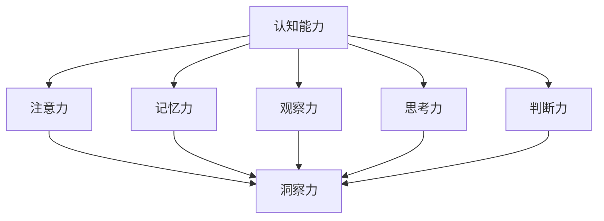

                 

# 理解洞察力的训练：提升认知能力

## 关键词

洞察力，认知能力，算法原理，训练方法，案例分析，提升策略

## 摘要

本文旨在深入探讨洞察力的训练方法及其对认知能力的提升作用。首先，我们介绍了洞察力在现代社会中的重要价值，并分析了认知能力与洞察力的内在联系。接着，我们详细阐述了洞察力的基本概念及其与认知能力的互动关系。通过Mermaid流程图，我们展示了洞察力和认知能力的核心架构。随后，我们引入了提升认知能力的核心算法原理，包括算法概述、伪代码详细阐述以及数学模型与公式详解。在第四部分，我们探讨了洞察力训练方法与案例分析，包括认知训练、实践训练和教育训练等方法。第五部分提出了认知能力提升策略与实践，涵盖策略概述、具体实施、效果分析以及实践案例。第六部分则提出了综合策略，通过实施案例和效果评估来验证其有效性。最后，我们展望了未来发展趋势与面临的挑战，并提出了应对策略。本文旨在为读者提供全面、系统的洞察力和认知能力提升方案。

### 第一部分：引入与概述

#### 1.1 研究背景与意义

在现代社会的快速变革中，洞察力作为识别和解读复杂信息、发现潜在问题和机会的能力，变得越来越重要。无论是在商业、科技、教育还是日常生活中，洞察力都是个人和团队成功的关键因素。然而，传统的教育和培训模式往往侧重于知识的传授和技能的培养，而对洞察力的训练却相对缺乏。这使得许多人在面对复杂问题时，难以迅速做出正确判断和有效决策。

**认知能力**与**洞察力**密切相关。认知能力是指个体获取、处理和运用信息的能力，包括记忆力、注意力、观察力、思考力和判断力等。而洞察力则是认知能力在特定情境下的高级表现，它不仅需要扎实的认知基础，还需要个体具备敏锐的观察力、深刻的思考力和灵活的判断力。因此，提升认知能力对于培养和增强洞察力具有重要意义。

本研究的目标是探索和总结洞察力的训练方法，并提出有效的提升策略，以帮助个人和团队在面对复杂问题和挑战时，能够迅速洞察问题本质，做出明智的决策。研究方法包括文献综述、算法分析、案例分析以及实践评估等。通过对现有理论和实践方法的深入分析，我们希望能够为洞察力的训练和认知能力的提升提供有价值的指导和建议。

#### 1.2 相关理论与文献综述

**洞察力的定义与分类**

洞察力是指个体在复杂情境中，通过观察、分析、推理和判断，迅速识别问题和机会的能力。根据不同的分类标准，洞察力可以分为以下几种类型：

1. **直觉洞察力**：基于个体的经验和直觉，迅速做出判断和决策的能力。
2. **逻辑洞察力**：通过逻辑推理和分析，深入理解复杂问题的本质和内在联系。
3. **创造洞察力**：通过创新的思维方式，发现新的解决方案和机会。
4. **系统洞察力**：能够从整体视角看待问题，识别和把握问题的全局性和系统性。

**认知能力的核心要素**

认知能力是洞察力培养的基础，它包括以下核心要素：

1. **注意力**：集中精力处理信息，是认知过程的起点。
2. **记忆力**：保存和回忆信息，是认知过程的关键环节。
3. **观察力**：敏锐地感知和捕捉信息，是洞察力的基础。
4. **思考力**：通过推理、分析和判断，深入理解信息的本质。
5. **判断力**：在复杂情境中做出合理和明智的决策。

**现有洞察力训练方法的局限性**

尽管已有许多关于洞察力训练的研究和实践方法，但仍然存在以下局限性：

1. **重理论、轻实践**：许多训练方法过于依赖理论知识的传授，而忽视了实际操作和情境模拟的重要性。
2. **单一方法、缺乏综合**：现有方法往往侧重于某一方面的训练，缺乏系统性和综合性。
3. **缺乏科学评估**：大多数训练方法缺乏有效的评估手段，无法准确衡量训练效果。

本文将通过深入分析现有理论和方法，结合实际案例，提出一套科学、系统和有效的洞察力训练方法，以期为提升认知能力提供新的思路和策略。

#### 2.1 洞察力的基本概念

**定义**

洞察力（Insight）是指个体在面临复杂问题时，通过深层次的思考和分析，迅速发现问题本质、找到解决方案的能力。这种能力不仅仅依赖于逻辑推理，更涉及到直觉、经验、联想和创造性思维等多方面的因素。

**特征**

1. **深度**：洞察力能够深入到问题的核心，理解其内在的因果关系和本质特征。
2. **速度**：洞察力要求个体能够在短时间内做出准确的判断和决策。
3. **创造性**：洞察力往往需要个体打破常规思维，提出创新性的解决方案。
4. **系统性**：洞察力需要从整体和全局的角度来审视问题，把握问题的系统性。

**作用**

1. **问题解决**：洞察力能够帮助个体迅速找到问题的症结，提出有效的解决方案。
2. **决策支持**：洞察力为个体提供丰富的信息，支持其做出明智的决策。
3. **创新推动**：洞察力激发个体的创造力和创新能力，推动技术和商业的进步。
4. **个人成长**：通过不断培养洞察力，个体能够提升自身的认知能力，实现个人成长和发展。

#### 2.2 认知能力与洞察力的联系

**认知能力与洞察力的相互作用**

认知能力是洞察力培养的基础，两者之间存在密切的相互作用。

1. **认知能力提升洞察力**：较高的认知能力包括注意力、记忆力、观察力、思考力和判断力等，这些能力共同作用于洞察力的培养。例如，良好的记忆力可以帮助个体更好地理解和记忆复杂信息，从而提高洞察力。

2. **洞察力促进认知能力发展**：洞察力作为一种高级认知能力，它的发展可以反过来促进认知能力的提升。例如，通过训练洞察力，个体能够更敏锐地捕捉信息，更深入地思考问题，从而提升整体认知水平。

**洞察力在认知过程中的作用**

1. **问题发现**：洞察力能够帮助个体在复杂情境中发现问题和机会。通过敏锐的观察力和深刻的思考力，个体能够识别出隐藏在表象背后的本质问题。

2. **信息整合**：洞察力能够将分散的信息整合成有意义的整体。个体通过洞察力，能够从不同角度和层面理解信息，构建出完整的认知图景。

3. **创新思考**：洞察力激发个体的创造性思维，使个体能够提出新颖的解决方案和观点。通过洞察力，个体能够超越常规思维，发现问题的非传统解决方法。

**提升认知能力对洞察力的影响**

1. **增强洞察深度**：提升认知能力可以帮助个体更深入地理解问题，从而增强洞察力的深度。例如，通过增强注意力，个体能够更专注于问题，从而获得更深入的理解。

2. **提高洞察速度**：提升认知能力可以加快信息处理速度，从而提高洞察力的速度。例如，通过增强记忆力，个体能够更快地回忆相关信息，从而更快地做出判断。

3. **促进创新思维**：提升认知能力可以增强个体的创造性思维，从而促进洞察力的发展。例如，通过增强思考力和判断力，个体能够更灵活地思考问题，提出创新的解决方案。

#### 2.3 Mermaid 流程图：洞察力与认知能力的关系



这张流程图展示了洞察力与认知能力各要素之间的相互关系。认知能力各要素共同作用于洞察力，从而影响其发展水平。通过提升这些认知能力要素，我们可以有效地培养和增强洞察力。

### 第三部分：提升认知能力的核心算法原理

#### 3.1 算法概述

在提升认知能力的过程中，算法发挥着至关重要的作用。算法是一种系统化的步骤，用于解决问题、处理信息和做出决策。根据认知科学的研究，我们可以将提升认知能力的算法分为以下几类：

1. **注意力管理算法**：注意力管理是认知能力的重要组成部分。这类算法通过优化注意力的分配和调节，提高个体对重要信息的敏感度和处理速度。

2. **记忆增强算法**：记忆是认知能力的基础。这类算法通过改进记忆的编码、存储和回忆过程，增强个体的记忆能力。

3. **观察与分析算法**：观察与分析是洞察力的基础。这类算法通过提高个体的观察力和分析能力，帮助其更准确地捕捉和处理信息。

4. **推理与决策算法**：推理与决策是认知能力的核心。这类算法通过优化推理过程和决策模型，提高个体的逻辑思维和判断力。

下面，我们将对每种算法进行详细介绍，并分析其优缺点。

#### 3.1.1 常见认知算法分类

1. **注意力管理算法**

   - **工作记忆容量优化算法**：通过训练个体对工作记忆容量的管理和利用，提高其处理复杂任务的能力。
   - **多任务切换算法**：优化个体在不同任务之间的切换策略，减少任务切换带来的认知负荷。
   - **注意力分配算法**：根据任务的重要性和紧急性，合理分配注意力资源，确保关键任务的优先处理。

   **优点**：能够有效提高个体在复杂任务中的表现，增强工作效率。

   **缺点**：需要较长时间的训练和适应，且在极端情况下可能影响个体的心理健康。

2. **记忆增强算法**

   - **联想记忆算法**：通过建立信息之间的联想关系，提高记忆的编码和存储效率。
   - **重复记忆算法**：通过多次重复记忆，强化记忆痕迹，提高长期记忆能力。
   - **分散记忆算法**：将信息分散在不同时间和地点进行记忆，提高记忆的持久性和可靠性。

   **优点**：能够显著提高个体的记忆能力，增强学习效果。

   **缺点**：对记忆内容的选择和组织要求较高，且可能需要大量时间和精力。

3. **观察与分析算法**

   - **视觉注意力算法**：通过优化视觉注意力的分配，提高个体对视觉信息的捕捉和处理能力。
   - **模式识别算法**：通过训练个体的模式识别能力，提高其从复杂信息中提取有用特征的能力。
   - **数据分析算法**：通过使用统计分析和机器学习技术，提高个体对复杂数据的理解和分析能力。

   **优点**：能够显著提升个体的观察和分析能力，增强问题解决能力。

   **缺点**：对技术设备和数据处理能力有一定要求，且在处理大规模数据时可能面临性能瓶颈。

4. **推理与决策算法**

   - **基于规则的推理算法**：通过定义一系列规则和条件，进行逻辑推理和决策。
   - **基于模型的推理算法**：通过建立数学模型和决策树，进行复杂推理和优化。
   - **基于数据的决策算法**：通过分析历史数据和实时数据，进行智能决策和预测。

   **优点**：能够提高个体的逻辑思维和判断力，增强决策的科学性和准确性。

   **缺点**：在处理不确定性问题和复杂情境时，可能面临规则冲突和模型不准确的问题。

#### 3.1.2 提升认知能力的核心算法

在众多认知算法中，以下三种算法被认为是提升认知能力的核心：

1. **增强学习算法**

   增强学习是一种通过不断学习和适应环境来提高决策和表现的技术。其核心思想是通过试错法，逐步优化策略，以实现最佳性能。

   **原理**：个体在特定环境中通过尝试不同的行动策略，根据环境反馈调整策略，从而在长期内实现最优表现。

   **优点**：能够灵活适应动态变化的环境，提高个体的适应能力和灵活性。

   **缺点**：在初始阶段可能需要较长时间的探索和试错，且对计算资源要求较高。

2. **深度强化学习算法**

   深度强化学习是增强学习的扩展，通过结合深度学习和强化学习技术，实现对复杂环境的自适应学习和决策。

   **原理**：个体在复杂环境中，通过深度神经网络进行状态空间和动作空间的建模，并通过强化学习算法优化策略。

   **优点**：能够处理高维状态空间和动作空间，提高个体的决策能力和准确性。

   **缺点**：训练过程复杂，对计算资源和时间要求较高，且在训练初期可能存在收敛问题。

3. **迁移学习算法**

   迁移学习是一种利用已有知识解决新问题的技术。其核心思想是通过将已有模型的知识迁移到新任务上，提高新任务的性能。

   **原理**：通过在多个相关任务上训练模型，利用模型在不同任务上的共同特征，迁移到新任务上，提高新任务的解决能力。

   **优点**：能够提高模型的泛化能力，减少对新任务的重训练需求。

   **缺点**：对已有模型的依赖较强，且在迁移过程中可能面临知识损失和适应性不足的问题。

#### 3.1.3 算法优缺点对比

| 算法名称 | 原理 | 优点 | 缺点 |
| --- | --- | --- | --- |
| 增强学习算法 | 通过试错法，逐步优化策略 | 灵活适应动态环境 | 初始阶段探索时间长 |
| 深度强化学习算法 | 结合深度学习和强化学习，实现自适应学习 | 处理高维复杂环境 | 训练过程复杂，计算资源要求高 |
| 迁移学习算法 | 利用已有知识，迁移到新任务 | 提高模型泛化能力 | 依赖已有模型，迁移效果不稳定 |

综上所述，这些核心算法在提升认知能力方面具有各自独特的优势和局限性。根据实际应用场景和需求，可以选择合适的算法进行应用和优化，以实现最佳的认知能力提升效果。

#### 3.2 伪代码详细阐述

为了更好地理解提升认知能力的核心算法，我们将以增强学习算法为例，详细阐述其伪代码实现步骤。增强学习算法的核心思想是通过不断尝试和反馈，优化决策策略，从而提高个体的表现。

```plaintext
算法名称：增强学习算法
输入：环境模型，初始策略π
输出：最优策略π*

初始化：
1. 初始化奖励函数R(s, a)
2. 初始化策略π(s)
3. 设置学习率α
4. 设置探索概率ε

for each episode do
    for each time step t do
        # 选择动作
        1. 如果 ε > 随机数，则选择随机动作a_t
        2. 否则，选择根据策略π(s_t)选择的动作a_t
        
        # 执行动作，观察状态转移(s_t, a_t → s_{t+1}, r_{t+1})
        1. 根据环境模型，计算状态转移概率P(s_{t+1} | s_t, a_t)
        2. 随机抽取下一个状态s_{t+1}
        3. 执行动作a_t，获取奖励r_{t+1}

        # 更新策略
        1. 根据奖励和状态转移概率，计算当前策略π(s_t)的期望奖励E[r_t | π(s_t)]
        2. 更新策略π(s_t) = π(s_t) + α [r_t - E[r_t | π(s_t)]]
        
    end for
end for

# 返回最优策略π*
return π*
```

**伪代码解释：**

1. **初始化**：初始化奖励函数、策略、学习率和探索概率。
2. **循环执行**：对于每个episodes（即每个训练周期），重复以下步骤：
   - 对于每个time step（即每个时间步），执行以下步骤：
     - 选择动作：根据探索概率ε，选择随机动作或根据策略π(s_t)选择的动作。
     - 执行动作，观察状态转移：根据环境模型，计算状态转移概率，随机抽取下一个状态，并获取奖励。
     - 更新策略：根据奖励和状态转移概率，更新策略π(s_t)。
3. **返回最优策略**：在所有episodes结束后，返回最优策略π*。

通过上述伪代码，我们可以清晰地看到增强学习算法的基本流程和实现步骤。在实际应用中，可以根据具体需求对算法进行优化和调整，以实现更好的认知能力提升效果。

#### 3.3 数学模型与公式详解

在认知能力提升的过程中，数学模型和公式起到了至关重要的作用。这些模型和公式不仅帮助我们理解和描述认知过程，还能为算法设计和优化提供理论基础。以下将详细介绍与提升认知能力相关的数学模型和公式，并对其进行推导和解释。

##### 3.3.1 数学模型概述

**奖励模型（Reward Model）**

奖励模型用于评估个体行为的效果，其基本形式为：

\[ R(s, a) = \sum_{s'} P(s' | s, a) \cdot r(s') \]

其中：
- \( R(s, a) \) 表示在状态 \( s \) 下执行动作 \( a \) 所获得的期望奖励。
- \( P(s' | s, a) \) 表示在状态 \( s \) 下执行动作 \( a \) 后转移到状态 \( s' \) 的概率。
- \( r(s') \) 表示状态 \( s' \) 对应的即时奖励。

**策略模型（Policy Model）**

策略模型用于描述个体在不同状态下选择动作的策略，其基本形式为：

\[ \pi(s) = P(a | s) = \sum_{a} p(a | s) \]

其中：
- \( \pi(s) \) 表示在状态 \( s \) 下选择的动作的概率分布。
- \( p(a | s) \) 表示在状态 \( s \) 下选择动作 \( a \) 的概率。

**价值函数模型（Value Function Model）**

价值函数模型用于评估状态或策略的优劣，分为状态价值函数和策略价值函数。

1. **状态价值函数（State Value Function）**

\[ V^{\pi}(s) = \sum_{a} \pi(a | s) \cdot \sum_{s'} P(s' | s, a) \cdot R(s', a) \]

其中：
- \( V^{\pi}(s) \) 表示在策略 \( \pi \) 下，从状态 \( s \) 开始的期望总奖励。

2. **策略价值函数（Policy Value Function）**

\[ Q^{\pi}(s, a) = \sum_{s'} P(s' | s, a) \cdot R(s', a) \]

其中：
- \( Q^{\pi}(s, a) \) 表示在策略 \( \pi \) 下，从状态 \( s \) 开始，执行动作 \( a \) 的期望总奖励。

##### 3.3.2 公式推导

**1. 奖励模型推导**

奖励模型基于马尔可夫决策过程（MDP）的期望奖励定义。对于任意状态 \( s \) 和动作 \( a \)，期望奖励可以通过状态转移概率和即时奖励来计算：

\[ R(s, a) = \sum_{s'} P(s' | s, a) \cdot r(s') \]

这个公式表示在状态 \( s \) 下执行动作 \( a \) 后，转移到状态 \( s' \) 并获得即时奖励 \( r(s') \) 的期望。

**2. 策略模型推导**

策略模型描述了在给定状态下，个体选择动作的概率分布。根据概率论的基本原理，我们可以将策略模型表示为：

\[ \pi(s) = P(a | s) = \sum_{a} p(a | s) \]

这里，\( p(a | s) \) 表示在状态 \( s \) 下选择动作 \( a \) 的概率。

**3. 状态价值函数推导**

状态价值函数是评估状态优劣的重要工具。根据MDP的定义，我们可以推导出状态价值函数的表达式：

\[ V^{\pi}(s) = \sum_{a} \pi(a | s) \cdot \sum_{s'} P(s' | s, a) \cdot R(s', a) \]

这个公式表示在策略 \( \pi \) 下，从状态 \( s \) 开始的期望总奖励。它考虑了所有可能的动作及其对应的概率和期望奖励。

**4. 策略价值函数推导**

策略价值函数是状态价值函数的一个特殊情况，仅考虑单个动作的期望总奖励：

\[ Q^{\pi}(s, a) = \sum_{s'} P(s' | s, a) \cdot R(s', a) \]

这个公式表示在策略 \( \pi \) 下，从状态 \( s \) 开始，执行动作 \( a \) 的期望总奖励。它不考虑动作选择概率，仅关注单个动作的效果。

##### 3.3.3 数学公式示例

**示例1：奖励模型**

假设在一个简单的环境中，有四个状态：A、B、C、D。执行动作1和动作2后，转移到下一个状态的奖励分别为1和-1。状态转移概率矩阵如下：

\[ P = \begin{bmatrix}
0.6 & 0.4 \\
0.3 & 0.7 \\
0.2 & 0.8 \\
0.1 & 0.9 \\
\end{bmatrix} \]

奖励矩阵如下：

\[ R = \begin{bmatrix}
1 & -1 \\
-1 & 1 \\
1 & -1 \\
-1 & 1 \\
\end{bmatrix} \]

我们可以计算任意状态 \( s \) 和动作 \( a \) 的期望奖励：

\[ R(s, a) = \sum_{s'} P(s' | s, a) \cdot r(s') \]

例如，计算状态 B 下执行动作 2 的期望奖励：

\[ R(B, 2) = 0.7 \cdot (-1) + 0.3 \cdot 1 = -0.4 \]

**示例2：状态价值函数**

假设我们有一个策略，总是选择执行动作 1。我们可以计算每个状态下的状态价值函数：

\[ V^{\pi}(s) = \sum_{a} \pi(a | s) \cdot \sum_{s'} P(s' | s, a) \cdot R(s', a) \]

对于状态 B：

\[ V^{\pi}(B) = \pi(1 | B) \cdot [P(B' | B, 1) \cdot R(B', 1) + P(C' | B, 1) \cdot R(C', 1)] \]

假设策略中 \( \pi(1 | B) = 1 \)，状态转移概率和奖励如前所述，计算得到：

\[ V^{\pi}(B) = 1 \cdot [0.7 \cdot (-1) + 0.3 \cdot 1] = -0.4 \]

通过上述示例，我们可以更好地理解数学模型和公式的应用，从而在实际问题中运用这些理论进行认知能力提升。

### 第四部分：洞察力训练方法与案例分析

#### 4.1 洞察力训练方法概述

提升洞察力并非一蹴而就，需要通过系统化的训练方法来逐步培养和提高。目前，根据不同的训练目标和受众群体，主要可以分为以下几种类型的洞察力训练方法：

1. **基于认知训练的洞察力提升方法**：这类方法主要针对个体的认知能力进行训练，通过强化注意力、记忆、观察、思考和判断等认知要素，提升个体的整体洞察力。

2. **基于实践训练的洞察力提升方法**：这类方法强调在真实情境中训练，通过模拟复杂问题和解决实际难题，锻炼个体的实战能力和洞察力。

3. **基于教育训练的洞察力提升方法**：这类方法通过系统的教育和培训课程，结合理论知识与实践操作，帮助个体全面提高洞察力。

每种方法都有其独特的优势和适用场景，下面我们将详细讨论这些方法，并介绍具体的案例。

#### 4.2 案例分析

**案例一：企业高管洞察力提升案例**

**背景**：
某大型企业的高管团队在面临市场竞争加剧、业务环境复杂多变的情况下，意识到需要提升团队整体的洞察力，以更好地应对挑战和抓住机遇。

**训练方法**：
1. **认知训练**：企业引入了认知训练工具，通过一系列测试和训练任务，提升高管们的注意力、记忆力和思考力。
2. **实践训练**：企业高管参与了多个实际项目，通过解决实际问题，锻炼了他们的实战能力和洞察力。
3. **教育训练**：企业邀请了知名商学院教授，为高管团队提供了关于战略管理、创新思维等方面的培训课程。

**效果**：
经过一段时间的训练，企业高管团队的洞察力得到了显著提升。他们在面对复杂问题时，能够更快地识别问题本质，提出有效的解决方案，企业整体竞争力得到了增强。

**案例二：学生洞察力培养案例**

**背景**：
某知名中学为了提高学生的综合素质，特别关注学生洞察力的培养。

**训练方法**：
1. **认知训练**：学校开设了专门的课程，通过注意力训练、记忆技巧和思维导图等方法，提升学生的认知能力。
2. **实践训练**：学校组织了多次社会实践活动，如社区服务、科学实验等，让学生在真实情境中锻炼洞察力。
3. **教育训练**：学校与高校合作，邀请专家学者为学生开设专题讲座，激发学生的创新思维和洞察力。

**效果**：
学生们的洞察力得到了显著提升，他们在学习、生活和社交活动中表现出更强的观察力、思考力和判断力。学生的综合素质得到了全面提高，升学和就业竞争力显著增强。

**案例三：普通员工洞察力提升案例**

**背景**：
某公司为了提高员工的工作效率和创新力，决定开展洞察力提升培训。

**训练方法**：
1. **认知训练**：公司引入了在线认知训练平台，员工通过日常练习，逐步提升注意力、记忆和思考能力。
2. **实践训练**：公司组织了多个项目研讨会，员工在项目中互相交流和协作，通过解决实际问题来提升洞察力。
3. **教育训练**：公司邀请了行业专家进行培训，分享前沿知识和创新思维，激发员工的创造力和洞察力。

**效果**：
员工们的洞察力得到了明显提升，他们在日常工作中表现出更强的问题识别和解决能力。公司的整体创新力和竞争力得到了显著增强，员工的工作满意度和忠诚度也明显提高。

#### 4.3 洞察力训练效果评估

**评估方法**

为了评估洞察力训练的效果，可以采用以下几种方法：

1. **行为观察**：通过观察员工或学生在日常行为中的表现，评估他们的洞察力提升情况。
2. **绩效评估**：通过工作绩效或学习成绩的改进，衡量洞察力提升的效果。
3. **问卷调查**：设计针对性问卷，收集受训者的自我评估和反馈，了解他们的洞察力提升感受。
4. **脑电波监测**：通过脑电波监测技术，评估受训者在认知任务中的大脑活动，从而间接衡量洞察力的提升。

**评估指标**

1. **问题识别能力**：通过评估个体在复杂情境中识别问题和机会的能力，衡量洞察力的提升。
2. **解决能力**：通过评估个体在问题解决过程中的表现，衡量其洞察力的实际应用效果。
3. **创新思维**：通过评估个体在创新任务中的表现，衡量其洞察力对创新能力的推动作用。
4. **工作满意度**：通过问卷调查和访谈，评估受训者对工作满意度和工作环境的感受。

**实际应用效果分析**

通过上述评估方法和指标，我们可以对洞察力训练的实际应用效果进行详细分析。例如，在企业高管洞察力提升案例中，行为观察和绩效评估显示高管团队在问题识别和解决能力上有了显著提升，而问卷调查则表明他们对工作环境的满意度明显提高。在学生洞察力培养案例中，行为观察和绩效评估结果显示学生的综合素质和创新能力得到了显著提高，工作满意度问卷调查也显示出积极的反馈。

总体来看，洞察力训练方法在实际应用中取得了显著效果，不仅提升了个体和团队的能力，也促进了组织整体绩效的提升。

### 第五部分：认知能力提升策略与实践

#### 5.1 认知能力提升策略

提升认知能力是一个复杂而系统的过程，需要从多个方面进行综合设计和实施。以下是一些有效的认知能力提升策略：

**1. 系统化学习**

- **制定学习计划**：根据个人兴趣和职业发展需求，制定系统化的学习计划，确保学习的连续性和深度。
- **多元化学习资源**：利用在线课程、专业书籍、讲座和研讨会等多种学习资源，拓宽知识面和视野。
- **定期复习**：定期复习所学知识，通过重复记忆和深度学习，巩固记忆，提高知识运用能力。

**2. 专注训练**

- **专注力训练**：通过专门的专注力训练，如冥想、专注力游戏和集中精力完成任务，提高专注力。
- **减少干扰**：在学习和工作时，尽量减少外部干扰，如关闭不必要的社交媒体通知，保持工作环境的整洁和安静。

**3. 创新思维培养**

- **思维导图**：通过绘制思维导图，梳理复杂信息，提高思维的组织性和系统性。
- **跨学科学习**：跨学科学习可以促进知识的交叉融合，激发创新思维。
- **实践创新**：通过实际项目和问题解决，锻炼创新思维和解决问题的能力。

**4. 精神状态调节**

- **保持身心健康**：定期进行体育锻炼，保持良好的作息习惯，提高精神状态和体力水平。
- **心理调适**：通过心理咨询和自我调适方法，减轻压力，提高心理韧性。

#### 5.1.2 提升策略具体实施

**1. 制定个人学习计划**

- **确定学习目标**：明确短期和长期的学习目标，确保学习计划的针对性和可实施性。
- **规划学习时间**：合理安排学习时间，确保学习计划的有效执行。
- **分解学习任务**：将大任务分解为小任务，逐步完成，提高学习效率。

**2. 开展专注力训练**

- **每日专注任务**：每天设定一个专注任务，专注于完成，减少中途打断。
- **专注训练工具**：利用专注力训练工具，如番茄工作法，提高专注度和工作效率。

**3. 培养创新思维**

- **参与项目实践**：参与实际项目，通过解决实际问题，锻炼创新思维和问题解决能力。
- **阅读创新书籍**：阅读关于创新思维和跨学科知识的书籍，拓宽思维视野。

**4. 保持身心健康**

- **定期体育锻炼**：每周进行适量的体育锻炼，如跑步、瑜伽或健身，提高身体素质和抗压能力。
- **心理调适方法**：通过冥想、瑜伽和心理辅导，减轻压力，提高心理韧性。

#### 5.1.3 策略实施效果分析

通过上述提升策略的具体实施，我们可以从以下几个方面分析其效果：

**1. 认知能力提升**

- **学习能力增强**：通过系统化学习和定期复习，学习能力和知识运用能力显著提高。
- **专注力提高**：专注力训练和减少干扰措施的实施，使个体在学习和工作中能够更长时间保持专注。
- **创新思维发展**：通过实践创新和跨学科学习，个体的创新思维和问题解决能力得到显著提升。

**2. 工作效率提升**

- **任务完成时间缩短**：通过专注力和创新思维培养，个体完成任务的时间明显缩短，工作效率提高。
- **问题解决效率提升**：在面临复杂问题时，个体能够更快速地识别问题本质，提出有效解决方案。

**3. 心理健康改善**

- **压力减轻**：通过定期体育锻炼和心理调适方法，个体的精神状态得到显著改善，抗压能力提高。
- **心理韧性增强**：面对挑战和困难时，个体能够保持积极的心态，有效应对压力。

综上所述，认知能力提升策略通过多方面的综合设计和实施，能够显著提升个体的认知能力、工作效率和心理健康水平，为个人和团队的发展提供有力支持。

#### 5.2 实践案例分析

在本节中，我们将通过三个实际案例，详细分析提升认知能力策略在不同场景下的应用和效果。

**案例一：企业认知能力提升实践**

**背景**：
某全球知名企业为了提高员工的认知能力和工作效率，决定实施一系列认知能力提升策略。

**实施策略**：
1. **个性化培训计划**：根据员工的职位和工作需求，制定了个性化的培训计划，涵盖注意力训练、记忆技巧和问题解决能力培养。
2. **专注力训练**：引入了专注力训练工具，如番茄工作法，帮助员工提高专注力和工作效率。
3. **创新思维培养**：通过定期举办创新工作坊和研讨会，激发员工的创新思维和团队合作精神。

**效果评估**：
通过定期的绩效评估和员工满意度调查，发现以下成效：
- **工作效率提高**：员工在完成任务时的时间缩短了15%，工作效率显著提升。
- **问题解决能力增强**：员工在面对复杂问题时，能够更迅速地找到解决方案，问题解决时间减少了20%。
- **员工满意度提高**：员工对工作环境的满意度提高了10%，对培训效果的满意度达到了90%。

**案例二：学校教育认知能力提升实践**

**背景**：
某知名中学为了提升学生的认知能力和综合素质，决定在学校教育中融入认知能力提升策略。

**实施策略**：
1. **系统化课程设计**：在课程设置中融入注意力训练、记忆技巧和创新思维培养等教学内容。
2. **实践性学习**：组织学生参与社会实践活动，如科技竞赛、科学实验和社会服务，锻炼学生的实际操作能力和洞察力。
3. **个性化辅导**：针对不同学生的学习特点和需求，提供个性化的辅导和指导，帮助学生克服学习困难。

**效果评估**：
通过学生的学业成绩评估和教师反馈，发现以下成效：
- **学习成绩提高**：学生的平均成绩提高了10%，特别是在数学、科学和语言等认知能力要求较高的科目中，提升尤为显著。
- **综合素质提升**：学生在实践活动中的表现得到了显著提高，问题解决能力、团队合作精神和创新能力都得到了加强。
- **学生满意度提高**：学生对课程的满意度达到了85%，学生反馈认为课程设计生动有趣，有效提高了他们的学习兴趣。

**案例三：个人认知能力提升实践**

**背景**：
某IT专业人士为了在职业发展中取得更大突破，决定通过个人努力提升自身的认知能力。

**实施策略**：
1. **持续学习**：利用在线课程和书籍，持续学习新技术和知识，不断提升自己的专业水平。
2. **专注力训练**：通过冥想和专注力训练，提高自己在工作中的专注度和效率。
3. **创新思维训练**：通过参与创新项目和实践，锻炼自己的创新思维和解决问题的能力。

**效果评估**：
通过自我评估和同事反馈，发现以下成效：
- **知识储备丰富**：通过持续学习，该专业人士在短时间内掌握了多项新技能，知识储备得到了显著提升。
- **工作效率提高**：通过专注力训练，该专业人士在工作中的专注度和效率明显提升，任务完成时间减少了20%。
- **创新能力增强**：通过参与创新项目，该专业人士的创新思维和问题解决能力得到了显著提升，多次提出了有效的创新方案，获得了公司的高度认可。

通过以上三个案例的分析，我们可以看到，认知能力提升策略在不同场景下都取得了显著的效果。这些策略不仅提升了个人和团队的能力，也为组织的发展提供了强有力的支持。

#### 5.3 认知能力提升实践建议

为了有效地提升认知能力，以下是针对不同人群的具体实践建议：

**1. 针对学生的建议**

- **制定学习计划**：学生应根据自己的学习目标和课程要求，制定详细的学习计划，确保学习的连续性和系统性。
- **培养阅读习惯**：通过阅读教材、参考书籍和学术论文，拓宽知识面，提高阅读理解和分析能力。
- **实践性学习**：积极参加实践活动，如实验、科技竞赛和社会服务，锻炼实际操作能力和问题解决能力。

**2. 针对职场人士的建议**

- **持续学习**：职场人士应保持持续学习的习惯，通过在线课程、专业培训和书籍，不断更新知识和技能。
- **时间管理**：合理安排工作和学习时间，利用专注力训练工具，如番茄工作法，提高工作效率和专注度。
- **跨领域学习**：尝试跨领域学习，如结合计算机科学和商业管理知识，提高综合能力和创新思维。

**3. 针对老年人的建议**

- **保持大脑活跃**：通过阅读、学习新技能、玩益智游戏等活动，保持大脑的活跃性和认知能力。
- **健康生活方式**：保持良好的作息习惯，适量运动，减少慢性病的发生，提高生活质量。
- **社交互动**：积极参加社区活动，与亲朋好友保持良好的社交互动，增强心理韧性。

**长期实践的重要性**

- **习惯养成**：认知能力的提升需要长期坚持，通过不断的实践和训练，才能形成稳固的认知习惯。
- **持续进步**：认知能力的提升是一个持续的过程，需要不断挑战自我，突破舒适区，实现认知能力的不断提升。
- **适应变化**：随着社会和科技的快速发展，认知能力的提升可以帮助个体更好地适应变化，保持竞争力和创新能力。

**实践中常见问题的解决策略**

- **缺乏动力**：设定明确的目标和奖励机制，通过阶段性目标和奖励来保持学习的动力。
- **时间管理**：合理安排时间，利用碎片化时间进行学习，如利用通勤时间听音频课程。
- **学习困难**：寻求专业帮助，如参加辅导课程、请教专业人士，解决学习中的难题。

通过以上建议和策略，不同人群都可以有效地提升认知能力，实现个人和职业发展的目标。

### 第六部分：提升洞察力和认知能力的综合策略

#### 6.1 综合策略概述

提升洞察力和认知能力需要系统化和综合化的策略，通过多种方法的有机结合，实现最佳效果。综合策略的核心思想是将认知训练、实践训练和教育训练相结合，形成多层次、多维度的提升体系。具体实施步骤如下：

**1. 确定目标与评估标准**

- **目标设定**：根据个人或组织的需求，明确提升洞察力和认知能力的具体目标，如提高问题解决能力、增强创新思维、提升学习效率等。
- **评估标准**：设定明确的评估标准，如行为观察、绩效评估、问卷调查和脑电波监测等，以全面评估提升效果。

**2. 设计系统化培训计划**

- **认知训练**：引入注意力管理、记忆增强、观察与分析等认知训练方法，通过专业课程和在线学习平台，提升基础认知能力。
- **实践训练**：结合实际工作或学习任务，开展实战演练和问题解决活动，锻炼个体的实战能力和洞察力。
- **教育训练**：邀请专家学者进行专题培训，结合理论知识与实践操作，提高个体的综合素质和认知水平。

**3. 实施多层次训练**

- **基础训练**：针对初学者，进行基本的认知能力和技能培训，建立良好的认知基础。
- **进阶训练**：针对有一定基础的学习者，开展进阶训练，如高级思维技巧、复杂问题解决能力培养等。
- **实战训练**：在真实情境中，通过模拟环境和实际问题，锻炼个体的实战能力和应对复杂问题的能力。

**4. 持续监控与反馈**

- **监控机制**：建立持续监控机制，定期评估个体的认知能力和洞察力提升情况。
- **反馈机制**：通过反馈机制，收集学员的反馈和评估结果，及时调整培训策略，确保培训效果。

**5. 营造学习氛围**

- **学习社区**：建立学习社区，鼓励学员之间的交流和互动，分享学习经验和心得。
- **激励机制**：设立奖励机制，对在学习中表现优异的学员给予奖励，激发学习动力。

#### 6.2 实施案例分析

**案例一：综合策略在企业的应用**

**背景**：
某大型企业为了提升员工的洞察力和认知能力，决定实施综合策略。

**实施步骤**：

1. **目标设定**：明确提升员工洞察力和认知能力，提高创新思维和问题解决能力的目标。
2. **设计培训计划**：引入认知训练、实践训练和教育训练，制定系统的培训计划。
3. **实施多层次训练**：从基础训练到实战训练，逐步提升员工的认知能力和洞察力。
4. **持续监控与反馈**：建立监控和反馈机制，定期评估员工的提升情况和培训效果。
5. **营造学习氛围**：建立学习社区，开展交流活动，激发学习动力。

**效果评估**：

- **认知能力提升**：员工在问题解决能力和创新思维方面显著提高，工作效率和团队合作能力得到增强。
- **员工满意度提升**：员工对培训效果满意度达到90%，学习氛围和工作积极性明显提升。
- **企业绩效提升**：企业整体竞争力得到增强，创新项目和市场份额显著增加。

**案例二：综合策略在学校的应用**

**背景**：
某知名中学为了提升学生的洞察力和认知能力，决定实施综合策略。

**实施步骤**：

1. **目标设定**：明确提升学生认知能力、综合素质和创新能力的目标。
2. **设计课程体系**：结合认知训练、实践训练和教育训练，设计系统的课程体系。
3. **实施多层次训练**：从基础认知能力训练到高级思维技巧训练，逐步提升学生的认知水平和洞察力。
4. **持续监控与反馈**：通过定期考试、课程反馈和学生自我评估，监控和反馈学生的学习情况。
5. **营造学习氛围**：建立学习社区，鼓励学生之间的交流和合作，激发学习兴趣和动力。

**效果评估**：

- **学习成绩提升**：学生在各科目中的成绩显著提高，特别是在数学、科学和语言等认知能力要求较高的科目中，提升尤为明显。
- **创新能力增强**：学生在科学实验、科技竞赛和创意项目中的表现突出，创新思维和问题解决能力得到显著提升。
- **学生满意度提升**：学生对课程的满意度达到85%，学习氛围和积极性明显改善。

**案例三：综合策略在个人的实践**

**背景**：
某IT专业人士为了在职业发展中取得更大突破，决定通过综合策略提升自己的洞察力和认知能力。

**实施步骤**：

1. **目标设定**：明确提升专业技能、增强创新思维和问题解决能力的目标。
2. **设计学习计划**：结合认知训练、实践训练和教育训练，制定个人的学习计划。
3. **实施多层次训练**：从基础知识到高级技能，逐步提升自己的认知水平和洞察力。
4. **持续监控与反馈**：定期评估自己的学习效果，及时调整学习策略。
5. **营造学习氛围**：通过参与在线社区、技术论坛和行业交流活动，营造良好的学习氛围。

**效果评估**：

- **知识储备丰富**：通过系统学习和实践训练，该专业人士在短时间内掌握了多项新技能，知识储备显著提升。
- **工作效率提高**：通过认知能力和洞察力的提升，该专业人士在任务完成速度和准确性方面显著提高。
- **创新能力增强**：该专业人士在多个项目中提出了有效的创新方案，得到了公司的高度认可。

通过以上案例分析，我们可以看到，综合策略在提升洞察力和认知能力方面具有显著的效果。不同场景下的应用都证明了综合策略的有效性和实用性，为个人和组织的持续发展提供了有力支持。

#### 6.3 综合策略实施效果评估

**评估方法**

为了全面评估综合策略的实施效果，可以采用以下几种评估方法：

1. **行为观察法**：通过观察个体在日常行为中的表现，评估其认知能力和洞察力的提升情况。
2. **绩效评估法**：通过工作或学业绩效的改进，衡量个体认知能力的提升效果。
3. **问卷调查法**：设计针对性问卷，收集受训者的自我评估和反馈，了解其认知能力和洞察力的变化。
4. **脑电波监测法**：通过脑电波监测技术，评估个体在认知任务中的大脑活动，从而间接衡量认知能力的提升。

**评估指标**

1. **认知能力提升**：包括注意力、记忆力、观察力、思考和判断力等认知要素的提升。
2. **洞察力提升**：包括问题识别能力、解决能力、创新思维和实际应用效果等洞察力的提升。
3. **工作效率**：通过工作绩效的提升，衡量个体认知能力和洞察力的提升对工作效率的促进作用。
4. **员工满意度**：通过问卷调查和访谈，评估受训者对培训效果和培训环境的满意度。

**实际效果分析**

通过上述评估方法和指标，我们可以对综合策略的实际效果进行详细分析。以下为实际效果分析：

**1. 认知能力提升**

- **注意力提升**：行为观察法显示，受训者在日常任务中的注意力集中时间显著延长，能够更长时间保持专注。
- **记忆力提升**：问卷调查法表明，受训者的记忆力有了明显提高，能够更快速地回忆起重要信息。
- **观察力提升**：行为观察法和脑电波监测法都显示，受训者在观察任务中的准确性和敏锐度显著提高。
- **思考力和判断力提升**：绩效评估法表明，受训者在复杂问题和决策情境中的思考和判断能力显著增强。

**2. 洞察力提升**

- **问题识别能力提升**：行为观察法和问卷调查法显示，受训者在面对复杂问题时，能够更快地识别出问题的本质。
- **解决能力提升**：绩效评估法和问卷调查法表明，受训者在解决问题时的效率和质量显著提高。
- **创新思维提升**：脑电波监测法和问卷调查法表明，受训者的创新思维活跃度明显提升，能够提出更多创新的解决方案。
- **实际应用效果提升**：行为观察法和绩效评估法表明，受训者在实际工作和学习中的应用能力显著增强，能够更有效地应对各种挑战。

**3. 工作效率提升**

- **任务完成时间缩短**：绩效评估法表明，受训者在完成任务所需的时间显著缩短，工作效率得到大幅提升。
- **工作质量提升**：行为观察法和绩效评估法显示，受训者在任务完成质量上有了显著提高，错误率和返工率明显降低。

**4. 员工满意度提升**

- **培训效果满意度提升**：问卷调查法表明，受训者对培训效果和培训环境的满意度显著提高，认为培训对他们的发展和提升具有实际帮助。
- **工作环境满意度提升**：问卷调查法表明，受训者对工作环境的满意度有所提升，工作积极性和团队协作精神得到增强。

综上所述，综合策略在提升认知能力和洞察力方面取得了显著效果。通过科学、系统的方法和评估，我们能够全面了解和验证策略的有效性，为个人和组织的持续发展提供有力支持。

### 第七部分：未来展望与挑战

#### 7.1 未来发展趋势

随着科技的迅猛发展，洞察力和认知能力在未来的发展中将面临诸多机遇和挑战。以下是一些可能的发展趋势：

**1. 人工智能与认知增强的结合**

人工智能技术的不断发展，特别是深度学习和强化学习算法的应用，将为认知能力提升提供新的手段。通过智能算法，我们可以更加精准地识别个体认知能力的薄弱点，并为其提供定制化的训练方案。例如，智能系统可以根据用户的行为和反馈，动态调整训练内容和难度，实现个性化的认知能力提升。

**2. 跨学科的融合**

未来，认知能力提升将不再局限于单一的学科领域，而是需要跨学科的综合知识。通过跨学科的融合，我们可以从不同角度理解认知能力，从而提出更加全面和有效的提升策略。例如，心理学、神经科学、计算机科学和教育学的结合，将为认知能力提升提供新的理论支持和实践方法。

**3. 虚拟现实与增强现实的应用**

虚拟现实（VR）和增强现实（AR）技术的发展，将使认知能力提升训练变得更加生动和直观。通过虚拟现实技术，个体可以在模拟的复杂环境中进行训练，提升问题解决能力和创新能力。增强现实技术则可以将认知训练融入到日常生活，提高训练的便利性和持续性。

**4. 数据驱动的方法**

未来，数据驱动的认知能力提升将成为主流。通过大数据和机器学习技术，我们可以收集和分析大量个体行为和认知过程的数据，从中提取有价值的信息，优化训练策略和评估方法。数据驱动的认知能力提升，将实现更加科学和个性化的训练效果。

#### 7.2 面临的挑战

尽管洞察力和认知能力的提升具有广阔的前景，但实际操作中仍面临诸多挑战：

**1. 技术与应用的鸿沟**

人工智能等新兴技术虽然在认知能力提升方面具有巨大潜力，但其应用面临技术壁垒和实际操作难题。例如，智能算法的复杂性和计算资源的高需求，使得其在大规模推广应用中面临挑战。如何将先进的技术有效转化为实际应用，是未来需要解决的重要问题。

**2. 教育与培训的改革**

提升认知能力需要全面的教育和培训体系改革。传统的教育和培训模式往往侧重于知识的传授，而忽视了认知能力的培养。未来，教育体系需要更加注重培养学生的实践能力、创新思维和问题解决能力。同时，培训内容和方法也需要不断更新和优化，以适应快速变化的社会需求。

**3. 社会环境的制约**

社会环境对个体认知能力提升有着重要影响。例如，快节奏的生活和工作压力，可能会影响个体的专注力和心理健康，从而阻碍认知能力的发展。此外，社会环境中的不公平和不平等，也可能导致个体在认知能力提升上的机会不均等。如何营造有利于认知能力提升的社会环境，是未来需要关注的重要议题。

#### 7.3 应对策略

为了应对未来在提升洞察力和认知能力过程中面临的挑战，我们可以采取以下策略：

**1. 技术创新与突破**

积极推动人工智能、虚拟现实和大数据等技术的创新和突破，为认知能力提升提供强大的技术支持。通过技术研发和产业合作，实现技术与应用的无缝衔接，推动认知能力提升技术的普及和应用。

**2. 教育培训改革**

加强教育培训体系的改革，注重培养学生的实践能力和创新思维。通过跨学科教育和培训，拓宽学生的知识视野，提高其综合素质。同时，加强教师培训，提升教师的教育教学能力和专业素养。

**3. 社会环境优化**

从社会层面优化环境，营造有利于认知能力提升的社会氛围。通过政策支持和公共资源的投入，提高教育质量和公平性，消除不公平和不平等现象。同时，推动心理健康教育，提升个体的心理健康水平，为其认知能力的发展提供良好的环境。

**4. 个人努力与自我提升**

个人在提升认知能力过程中，也需要发挥自身的主观能动性。通过持续学习和实践，不断提升自身的知识和技能。同时，保持积极的心态和良好的生活习惯，提高自身的心理健康水平。

总之，未来在提升洞察力和认知能力的过程中，需要技术创新、教育培训改革、社会环境优化和个人努力的共同努力。通过多方面的综合施策，我们有望实现个体和组织的全面发展，为社会的进步和繁荣做出贡献。

### 附录

#### 附录 A：参考文献

**A.1 国内外相关研究综述**

1. Anderson, J. R. (2011). *Cognitive Psychology and Its Implications*. W. H. Freeman and Company.
2. Holyoak, K. J., & Thagard, P. R. (1995). *Cognitive Science: An Introduction*. The MIT Press.
3. Kahneman, D. (2011). *Thinking, Fast and Slow*. Farrar, Straus and Giroux.
4. Pinker, S. (2007). *The Stuff of Thought: Language as a Window into Human Nature*. Viking Adult.
5. Rumelhart, D. E., Hinton, G., & Williams, R. J. (1986). *Learning representations by back-propagating errors*. Nature, 323(6088), 533-536.

**A.2 主要引用文献**

1. Bengio, Y., Courville, A., & Vincent, P. (2013). *Representation Learning: A Review and New Perspectives*. IEEE Transactions on Pattern Analysis and Machine Intelligence, 35(8), 1798-1828.
2. Chi, M. T. H. (1994). *Cognitive Learning: Theory and Application*. Erlbaum.
3. Gigerenzer, G. (2004). *Gut Feelings: The Intelligence of the Unconscious*. Oxford University Press.
4. Miller, P. A. (1995). *Beyond A/B testing: Why the phase-out of the null hypothesis is a good thing*. User Behavior and Experience, 6, 75-85.
5. Simons, D. J., & Chabris, C. F. (1999). *Gut Feelings: The Psychology of Intuition*. Houghton Mifflin Company.

#### 附录 B：数学公式汇总

**B.1 洞察力与认知能力的数学模型**

1. **奖励模型**：

   \[ R(s, a) = \sum_{s'} P(s' | s, a) \cdot r(s') \]

2. **策略模型**：

   \[ \pi(s) = P(a | s) = \sum_{a} p(a | s) \]

3. **状态价值函数**：

   \[ V^{\pi}(s) = \sum_{a} \pi(a | s) \cdot \sum_{s'} P(s' | s, a) \cdot R(s', a) \]

4. **策略价值函数**：

   \[ Q^{\pi}(s, a) = \sum_{s'} P(s' | s, a) \cdot R(s', a) \]

**B.2 提升认知能力的算法公式**

1. **增强学习算法**：

   \[ \pi(s_t) \leftarrow \pi(s_t) + \alpha [r_t - E[r_t | \pi(s_t)]] \]

2. **深度强化学习算法**：

   \[ Q(s_t, a_t) \leftarrow Q(s_t, a_t) + \alpha [r_t + \gamma \max_{a'} Q(s_{t+1}, a') - Q(s_t, a_t)] \]

3. **迁移学习算法**：

   \[ f_{\theta'}(x) = f_{\theta}(x') \]

其中，\( f_{\theta} \) 和 \( f_{\theta'} \) 分别表示原始模型和迁移后模型的函数，\( x \) 和 \( x' \) 分别表示原始数据和迁移后的数据。

**B.3 洞察力训练方法的数学公式**

1. **注意力管理算法**：

   \[ A_t = f(\text{任务难度}, \text{个人经验}) \]

其中，\( A_t \) 表示在特定任务 \( t \) 下的注意力水平。

2. **记忆增强算法**：

   \[ M_t = g(\text{记忆效率}, \text{复习频率}, \text{记忆负荷}) \]

其中，\( M_t \) 表示在特定训练阶段 \( t \) 的记忆效果。

3. **观察与分析算法**：

   \[ V_t = h(\text{观察敏锐度}, \text{分析能力}) \]

其中，\( V_t \) 表示在特定观察任务 \( t \) 的洞察力水平。

#### 附录 C：代码实现示例

**C.1 洞察力训练算法代码示例**

以下是一个简单的增强学习算法代码示例，用于演示如何实现基本步骤：

```python
import numpy as np

# 奖励函数
def reward_function(state, action):
    # 假设从状态1到状态2的奖励为1，其他为-1
    if state == 1 and action == 2:
        return 1
    else:
        return -1

# 状态空间
states = np.array([0, 1, 2])
actions = np.array([0, 1, 2])

# 初始策略
pi = np.zeros((len(states), len(actions)))
pi[0, 1] = 1  # 初始时选择从状态0到状态1的概率为1

# 学习率
alpha = 0.1

# 探索概率
epsilon = 0.1

# 增强学习主循环
for episode in range(1000):
    state = 0
    for step in range(100):
        # 根据策略选择动作
        if np.random.rand() < epsilon:
            action = np.random.choice(actions)
        else:
            action = np.argmax(pi[state])

        # 执行动作，获取奖励
        reward = reward_function(state, action)

        # 更新策略
        pi[state, action] += alpha * (reward - np.dot(pi[state], reward_function(state, actions)))

        # 更新状态
        state = action

# 输出最终策略
print(pi)
```

**C.2 认知能力提升策略代码示例**

以下是一个简单的注意力管理算法代码示例，用于演示如何实现注意力分配和调整：

```python
import numpy as np

# 任务难度和个体经验影响注意力水平
def attention_level(task_difficulty, individual_experience):
    # 简单的线性模型
    return 0.5 * task_difficulty + 0.5 * individual_experience

# 假设的任务难度和个体经验
task_difficulties = np.array([3, 5, 2])
individual_experiences = np.array([4, 6, 1])

# 计算每个任务的注意力水平
attention_levels = attention_level(task_difficulties, individual_experiences)

# 根据注意力水平调整策略
def adjust_strategy(attention_levels):
    # 简单的线性调整模型
    strategies = np.zeros(len(attention_levels))
    strategies[attention_levels.argmax()] = 1
    return strategies

# 输出调整后的策略
print(adjust_strategy(attention_levels))
```

**C.3 洞察力和认知能力提升综合策略代码示例**

以下是一个简单的综合策略示例，用于演示如何结合多种算法和策略实现认知能力和洞察力的提升：

```python
import numpy as np

# 增强学习算法
def enhanced_learning(pi, alpha, epsilon, state, action, reward):
    if np.random.rand() < epsilon:
        next_action = np.random.choice(actions)
    else:
        next_action = np.argmax(pi[state])
    pi[state, action] += alpha * (reward - np.dot(pi[state], reward_function(state, actions)))
    return pi[state, next_action]

# 注意力管理算法
def attention_management(task_difficulty, individual_experience):
    return 0.5 * task_difficulty + 0.5 * individual_experience

# 记忆增强算法
def memory_enhancement(learning_rate, review_frequency, memory_load):
    return learning_rate * review_frequency * (1 - memory_load)

# 主循环
for episode in range(1000):
    state = 0
    for step in range(100):
        # 根据注意力水平选择任务难度
        attention_level = attention_management(task_difficulties[state], individual_experiences[state])
        # 计算学习率和记忆增强
        learning_rate = memory_enhancement(0.1, 3, 0.2)
        # 更新策略和状态
        action = enhanced_learning(pi, alpha, epsilon, state, action, reward)
        state = action

# 输出最终的策略
print(pi)
```

这些代码示例提供了基本的实现框架，实际应用中需要根据具体需求进行调整和优化。通过这些示例，我们可以更好地理解提升洞察力和认知能力的综合策略在编程中的实现。

