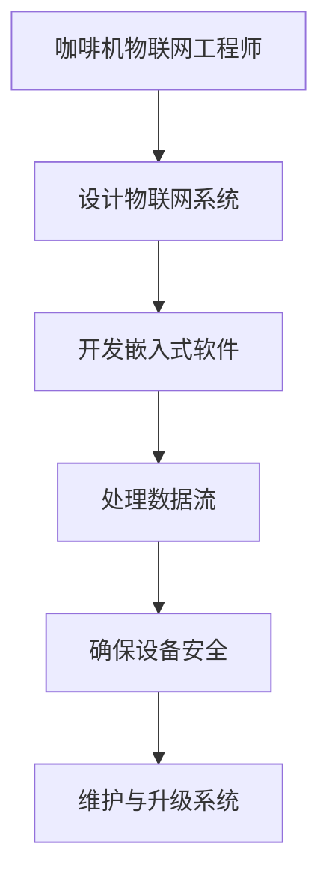

                 

### 瑞幸咖啡2025社招咖啡机物联网工程师编程挑战

> **关键词**：物联网、咖啡机、编程挑战、嵌入式系统、数据处理、安全

**摘要**：本文旨在深入探讨瑞幸咖啡2025年度社招咖啡机物联网工程师编程挑战，通过逻辑清晰的步骤分析和专业技术的深度剖析，为读者提供关于物联网技术在咖啡机领域应用的全景图。文章涵盖了从咖啡机物联网工程师的角色与职责，到具体编程挑战的实战，以及物联网安全与未来展望等内容，旨在为从业者提供宝贵的技术指导和职业发展建议。

#### 第1章 引言

##### 1.1 咖啡机物联网工程师的角色与职责

咖啡机物联网工程师是负责设计、开发、维护和优化物联网咖啡机系统的专业人员。他们不仅需要具备扎实的计算机科学和电子工程知识，还需要熟悉物联网通信协议和嵌入式系统开发。具体来说，咖啡机物联网工程师的职责包括：

1. **设计物联网系统**：根据用户需求和业务目标，设计符合要求的物联网系统架构，包括硬件选择、通信协议、数据处理等。

2. **开发嵌入式软件**：编写嵌入式软件，实现咖啡机设备的智能控制功能，如温度控制、水量监测、咖啡制作流程管理等。

3. **处理数据流**：采集设备运行数据，进行数据清洗、处理和分析，以支持设备的智能管理和维护。

4. **确保设备安全**：设计安全机制，保护设备免受恶意攻击和数据泄露。

5. **维护与升级系统**：定期维护和更新系统，确保系统的稳定性和安全性。

为了更直观地展示咖啡机物联网工程师的职责，我们可以使用一个简单的流程图：



##### 1.2 编程挑战的背景与目的

瑞幸咖啡2025年度社招咖啡机物联网工程师编程挑战旨在选拔和培养具有创新能力和实战经验的高水平物联网工程师。此次编程挑战的背景和目的主要有以下几点：

1. **行业需求**：随着物联网技术的快速发展，咖啡机物联网化已成为咖啡行业的重要趋势。此次挑战旨在满足行业对高水平物联网工程师的需求。

2. **技术提升**：通过编程挑战，参与者可以深入理解物联网技术的核心原理和应用，提升自身的技术水平和解决实际问题的能力。

3. **选拔人才**：瑞幸咖啡希望通过编程挑战，选拔出具有创新精神和实践能力的优秀工程师，为其未来的职业发展提供更好的机会。

4. **推动创新**：编程挑战鼓励参与者提出创新的想法和解决方案，推动物联网技术在咖啡机领域的创新应用。

#### 第2章 瑞幸咖啡物联网平台概述

##### 2.1 瑞幸咖啡物联网战略

瑞幸咖啡的物联网战略旨在通过智能化、数据化的运营模式提升用户体验和服务质量，实现咖啡机设备的智能管理和维护。具体来说，瑞幸咖啡物联网战略的核心目标包括：

1. **提升运营效率**：通过物联网技术，实现对咖啡机设备的全生命周期管理，包括设备采购、安装、维护和升级等环节，从而提高运营效率。

2. **优化用户体验**：通过实时数据采集和分析，为用户提供个性化的咖啡推荐和服务，提升用户满意度。

3. **降低运营成本**：通过智能监控和预测性维护，减少设备故障和停机时间，降低运营成本。

4. **数据驱动决策**：利用物联网数据，为管理层提供科学、准确的数据支持，助力企业决策。

##### 2.2 瑞幸咖啡物联网平台架构

瑞幸咖啡物联网平台架构包括硬件层、通信层、平台层和应用层，各层之间相互协作，实现数据的实时采集、传输和处理。

1. **硬件层**：包括咖啡机设备、传感器、控制器等硬件组件。硬件层的主要功能是实时采集设备运行数据，如温度、水量、设备状态等。

2. **通信层**：负责硬件层与平台层之间的数据传输。常用的通信协议包括WiFi、蓝牙、LoRa等，选择合适的通信协议对于实现稳定的设备连接和数据传输至关重要。

3. **平台层**：包括数据处理和分析模块，用于对采集到的数据进行清洗、存储、分析和可视化。平台层还提供API接口，方便应用层调用数据。

4. **应用层**：包括各类业务应用，如设备监控、数据分析、故障报警等。应用层基于平台层提供的数据，实现对咖啡机设备的智能管理和维护。

##### 2.3 物联网技术简介

物联网技术是指将物理设备与互联网连接，实现数据的采集、传输、处理和反馈的智能网络。物联网技术的核心包括传感器、嵌入式系统、无线通信、云计算和大数据等。

1. **传感器**：用于检测和测量物理量的装置，如温度传感器、湿度传感器、压力传感器等。传感器是实现物联网设备数据采集的重要部件。

2. **嵌入式系统**：是指嵌入在其他设备中的计算机系统，负责对设备进行控制和数据采集。嵌入式系统是物联网设备的核心。

3. **无线通信**：是指利用无线电波进行数据传输的技术，如WiFi、蓝牙、LoRa等。无线通信技术是实现物联网设备之间数据传输的关键。

4. **云计算**：是一种基于互联网的计算模式，通过云计算平台，用户可以按需获取计算资源、存储资源和应用程序。云计算为物联网数据存储、处理和分析提供了强大的支持。

5. **大数据**：是指无法使用传统数据处理工具进行处理的大量数据。大数据技术用于对物联网数据进行挖掘和分析，为业务决策提供支持。

#### 第3章 咖啡机物联网技术

##### 3.1 咖啡机物联网硬件组件

咖啡机物联网硬件组件包括传感器、控制器、通信模块和电源等，这些组件共同构成了物联网咖啡机的核心硬件。

1. **传感器**：用于检测和测量咖啡机设备运行状态，如温度传感器用于检测咖啡温度，湿度传感器用于检测咖啡机内部湿度等。

2. **控制器**：负责控制咖啡机设备的运行，如控制咖啡机加热、加水、搅拌等操作。控制器通常采用嵌入式处理器，具备实时性、稳定性和高可靠性。

3. **通信模块**：用于实现物联网咖啡机与其他设备或云端服务的数据传输。常见的通信模块包括WiFi模块、蓝牙模块、LoRa模块等。

4. **电源**：为物联网咖啡机提供稳定的电力供应，保证设备的正常运行。电源模块通常采用高效、低功耗的设计，以满足长时间运行的需求。

##### 3.2 咖啡机物联网通信协议

咖啡机物联网通信协议涉及WiFi、蓝牙、LoRa等无线通信技术，选择合适的通信协议对于实现稳定的设备连接和数据传输至关重要。

1. **WiFi**：是一种广泛使用的无线通信技术，具有高带宽、低延迟和广泛的覆盖范围。WiFi技术适用于需要高速数据传输的场景，如设备监控、远程控制等。

2. **蓝牙**：是一种短距离无线通信技术，具有低功耗、低延迟和良好的兼容性。蓝牙技术适用于需要低功耗、低带宽的场景，如设备配对、传感器数据传输等。

3. **LoRa**：是一种基于无线电波的通信技术，具有远距离传输、低功耗和良好的抗干扰性能。LoRa技术适用于需要远距离传输、低功耗的场景，如远程监控、环境监测等。

在选择通信协议时，需要考虑以下因素：

- **传输距离**：根据咖啡机设备的布局和需求，选择适合的通信协议，确保设备之间能够稳定连接。
- **传输速率**：根据数据传输的需求，选择合适的通信协议，确保数据能够及时传输。
- **功耗**：根据设备的续航时间，选择低功耗的通信协议，以延长设备的使用寿命。
- **成本**：根据项目的预算和成本要求，选择经济适用的通信协议。

##### 3.3 咖啡机物联网软件架构

咖啡机物联网软件架构包括操作系统、嵌入式应用和云端服务，这些软件组件共同构成了物联网咖啡机的智能管理系统。

1. **操作系统**：负责管理和控制咖啡机设备的硬件资源，如处理器、内存、存储等。常见的嵌入式操作系统包括Linux、Windows Embedded、Android等。

2. **嵌入式应用**：负责实现咖啡机的功能，如控制咖啡制作流程、数据采集与处理、通信等。嵌入式应用通常采用C/C++等编程语言开发，具有良好的实时性和稳定性。

3. **云端服务**：负责处理物联网数据，提供数据存储、分析、可视化等服务。云端服务通常采用云计算平台，如AWS、Azure、阿里云等。

咖啡机物联网软件架构的层次结构如下：

- **硬件层**：包括传感器、控制器、通信模块等硬件组件。
- **操作系统层**：负责管理和控制硬件资源，提供驱动程序和中间件。
- **嵌入式应用层**：负责实现咖啡机的功能，与操作系统层和云端服务层进行交互。
- **云端服务层**：负责处理物联网数据，提供数据存储、分析、可视化等服务。

通过这样的软件架构，咖啡机物联网系统能够实现数据的实时采集、传输和处理，为设备的智能管理和维护提供支持。

### 第4章 数据处理与分析

#### 4.1 数据采集与传输

数据采集与传输是物联网系统的核心环节，涉及到如何高效、稳定地采集设备运行数据，并将其传输到云端进行进一步处理。

**核心算法原理讲解**：

数据采集过程中，常用的算法包括传感器数据滤波、无线传输误差校正等。以下是这些算法的伪代码示例：

```python
# 传感器数据滤波
def filter_data(data):
    # 应用卡尔曼滤波或其他滤波算法
    filtered_data = ...
    return filtered_data

# 无线传输误差校正
def correct_errors(data):
    # 应用纠错算法，如卷积编码、汉明编码等
    corrected_data = ...
    return corrected_data
```

在数据传输过程中，为了确保数据的完整性，通常需要对数据进行加密和压缩。以下是数据加密和压缩的伪代码示例：

```python
# 数据加密
def encrypt_data(data):
    # 使用AES加密算法
    encrypted_data = ...
    return encrypted_data

# 数据压缩
def compress_data(data):
    # 使用无损压缩算法，如Huffman编码
    compressed_data = ...
    return compressed_data
```

**项目实战**：

以下是一个简单的数据采集与传输的项目实战，展示如何实现设备连接与数据发送：

```python
# 导入所需的库
import serial
import socket

# 初始化串口
ser = serial.Serial('/dev/ttyUSB0', 9600)

# 初始化socket
s = socket.socket(socket.AF_INET, socket.SOCK_DGRAM)
s.bind(('0.0.0.0', 12345))

# 循环读取数据并发送
while True:
    # 读取数据
    data = ser.readline()
    
    # 数据滤波与加密
    filtered_data = filter_data(data)
    encrypted_data = encrypt_data(filtered_data)
    
    # 数据压缩
    compressed_data = compress_data(encrypted_data)
    
    # 发送数据
    s.sendto(compressed_data, ('192.168.1.100', 54321))
```

在这个实战项目中，首先使用串口库初始化串口连接，然后进入一个循环，持续读取串口数据，对数据进行滤波、加密和压缩，最后通过UDP协议将压缩后的数据发送到指定服务器。

#### 4.2 数据存储与管理系统

数据存储与管理是物联网系统的关键环节，涉及到如何高效、稳定地存储和管理大量物联网数据。

**核心算法原理讲解**：

数据存储与管理系统通常采用数据库或分布式文件系统，如MySQL、MongoDB、HDFS等。以下是这些系统的一些核心算法原理：

- **数据库**：常用的数据库包括关系型数据库（如MySQL、PostgreSQL）和NoSQL数据库（如MongoDB、Redis）。关系型数据库通过SQL语言进行数据查询和操作，具有数据一致性和事务支持等特点。NoSQL数据库则适用于大规模数据存储和高速数据读写，具有灵活的查询能力和良好的扩展性。

- **分布式文件系统**：分布式文件系统（如HDFS、Ceph）用于存储大规模数据，能够实现数据的分布存储、负载均衡和容错。HDFS采用主从架构，将数据分为多个数据块存储在集群中的不同节点上，通过数据复制和备份机制提高数据的可靠性和可用性。

以下是数据存储和查询优化的伪代码示例：

```python
# 数据存储
def store_data(data):
    # 将数据存储到数据库或分布式文件系统
    ...
    
# 数据查询
def query_data(query):
    # 使用SQL或NoSQL查询语言查询数据
    results = ...
    return results

# 数据查询优化
def optimize_query(query):
    # 对查询进行优化，如创建索引、分区等
    optimized_query = ...
    return optimized_query
```

**项目实战**：

以下是一个简单的数据存储与查询优化的项目实战，展示如何使用MySQL数据库进行数据存储和查询：

```python
# 导入所需的库
import mysql.connector

# 连接数据库
db = mysql.connector.connect(
    host="localhost",
    user="root",
    password="password",
    database="iot_database"
)

# 创建数据表
cursor = db.cursor()
cursor.execute("""
    CREATE TABLE IF NOT EXISTS sensor_data (
        id INT AUTO_INCREMENT PRIMARY KEY,
        sensor_type VARCHAR(255),
        value VARCHAR(255),
        timestamp DATETIME
    )
""")

# 存储数据
def store_data(data):
    cursor.execute("""
        INSERT INTO sensor_data (sensor_type, value, timestamp) VALUES (%s, %s, NOW())
    """, (data['sensor_type'], data['value']))
    db.commit()

# 查询数据
def query_data(query):
    cursor.execute(query)
    results = cursor.fetchall()
    return results

# 查询优化
def optimize_query(query):
    cursor.execute("""
        CREATE INDEX IF NOT EXISTS idx_sensor_type ON sensor_data (sensor_type)
    """)
    optimized_query = query + " USE INDEX (idx_sensor_type)"
    return optimized_query

# 示例：存储和查询数据
data = {'sensor_type': 'temperature', 'value': '25'}
store_data(data)

query = "SELECT * FROM sensor_data WHERE sensor_type = 'temperature'"
results = query_data(query)
print(results)
```

在这个实战项目中，首先创建MySQL数据库和表，然后定义存储数据和查询数据的函数。通过优化查询语句，提高查询效率。

#### 4.3 数据分析与可视化

数据分析与可视化是物联网系统的重要环节，通过分析物联网数据，可以为企业提供有价值的信息和洞察，从而优化业务决策和运营管理。

**核心算法原理讲解**：

数据分析涉及多种算法和技术，包括时间序列分析、聚类分析、分类分析等。以下是这些算法的基本原理：

- **时间序列分析**：用于分析随时间变化的数据，预测未来的趋势和变化。常见的时间序列分析方法包括移动平均法、指数平滑法、ARIMA模型等。

- **聚类分析**：用于将相似的数据分为一组，以发现数据中的模式和结构。常见的聚类算法包括K均值算法、层次聚类算法、DBSCAN等。

- **分类分析**：用于将数据分为不同的类别，以识别数据中的特征和规律。常见的分类算法包括决策树、随机森林、支持向量机等。

以下是数据分析的伪代码示例：

```python
# 时间序列分析
def time_series_analysis(data):
    # 应用移动平均法、指数平滑法等算法
    result = ...
    return result

# 聚类分析
def cluster_analysis(data, num_clusters):
    # 应用K均值算法、层次聚类算法等算法
    clusters = ...
    return clusters

# 分类分析
def classification_analysis(data, labels):
    # 应用决策树、随机森林等算法
    model = ...
    predictions = model.predict(data)
    return predictions
```

**项目实战**：

以下是一个简单的数据分析与可视化的项目实战，展示如何使用Python的pandas、scikit-learn和matplotlib库进行数据分析和可视化：

```python
# 导入所需的库
import pandas as pd
from sklearn.cluster import KMeans
from sklearn.ensemble import RandomForestClassifier
import matplotlib.pyplot as plt

# 读取数据
data = pd.read_csv('sensor_data.csv')

# 时间序列分析
def time_series_analysis(data):
    # 绘制温度数据的时间序列图
    plt.figure(figsize=(10, 5))
    plt.plot(data['timestamp'], data['value'], label='Temperature')
    plt.xlabel('Timestamp')
    plt.ylabel('Temperature')
    plt.title('Temperature Time Series')
    plt.legend()
    plt.show()

# 聚类分析
def cluster_analysis(data, num_clusters):
    # 应用K均值算法进行聚类分析
    kmeans = KMeans(n_clusters=num_clusters)
    clusters = kmeans.fit_predict(data)
    # 绘制聚类结果
    plt.scatter(data.iloc[:, 0], data.iloc[:, 1], c=clusters)
    plt.xlabel('Feature 1')
    plt.ylabel('Feature 2')
    plt.title('K-Means Clustering')
    plt.show()

# 分类分析
def classification_analysis(data, labels):
    # 应用随机森林算法进行分类分析
    model = RandomForestClassifier()
    model.fit(data, labels)
    # 绘制决策树
    from sklearn.tree import plot_tree
    plot_tree(model, filled=True)
    plt.show()

# 示例：数据分析与可视化
time_series_analysis(data)
cluster_analysis(data, 3)
classification_analysis(data, labels)
```

在这个实战项目中，首先读取传感器数据，然后分别进行时间序列分析、聚类分析和分类分析。通过绘制图表，直观地展示分析结果。

### 第5章 咖啡机物联网安全

#### 5.1 物联网安全挑战

随着物联网技术的快速发展，物联网安全逐渐成为一个不容忽视的问题。咖啡机物联网工程师需要面对以下安全挑战：

1. **数据泄露**：物联网设备在数据传输过程中，容易受到黑客攻击，导致敏感数据泄露。

2. **设备被篡改**：黑客可以通过攻击物联网设备，篡改设备的数据和操作，导致设备无法正常运行。

3. **通信中断**：黑客可以通过阻断物联网设备的通信，导致设备无法与其他设备或云端服务进行交互。

4. **拒绝服务攻击**：黑客可以通过大量恶意请求，使物联网设备或系统瘫痪，导致业务中断。

为了应对这些安全挑战，咖啡机物联网工程师需要采取一系列安全措施，确保物联网系统的安全性和稳定性。

#### 5.2 安全设计原则

在设计咖啡机物联网系统时，应遵循以下安全设计原则：

1. **最小权限原则**：为物联网设备分配最小的权限，避免设备被恶意攻击者利用。

2. **数据加密**：对传输的数据进行加密，确保数据在传输过程中不会被窃取或篡改。

3. **身份认证**：对物联网设备进行身份认证，确保只有授权设备可以访问系统资源。

4. **访问控制**：对系统资源进行访问控制，确保只有授权用户可以访问特定资源。

5. **安全审计**：对系统进行安全审计，及时发现并修复安全漏洞。

以下是安全设计原则的伪代码示例：

```python
# 最小权限原则
def set_min_permissions():
    # 设置设备的最小权限
    ...

# 数据加密
def encrypt_data(data):
    # 使用加密算法对数据加密
    ...

# 身份认证
def authenticate_device():
    # 对设备进行身份认证
    ...

# 访问控制
def check_permission(user, resource):
    # 检查用户对资源的访问权限
    ...

# 安全审计
def audit_system():
    # 对系统进行安全审计
    ...
```

#### 5.3 加密与认证技术

在咖啡机物联网系统中，加密与认证技术是保障系统安全的关键。以下是一些常用的加密与认证技术：

1. **加密技术**：包括对称加密和非对称加密。

   - **对称加密**：使用相同的密钥对数据进行加密和解密。常见的对称加密算法有AES、DES等。

   - **非对称加密**：使用公钥和私钥对数据进行加密和解密。常见的非对称加密算法有RSA、ECC等。

   以下是加密技术的伪代码示例：

   ```python
   # 对称加密
   from Crypto.Cipher import AES
   
   def encrypt_aes(data, key):
       cipher = AES.new(key, AES.MODE_EAX)
       ciphertext, tag = cipher.encrypt_and_digest(data)
       return ciphertext, tag
   
   def decrypt_aes(ciphertext, tag, key):
       cipher = AES.new(key, AES.MODE_EAX, nonce=cipher.nonce)
       data = cipher.decrypt_and_verify(ciphertext, tag)
       return data
   
   # 非对称加密
   from Crypto.PublicKey import RSA
   
   def encrypt_rsa(data, public_key):
       cipher = RSA.new(public_key)
       ciphertext = cipher.encrypt(data)
       return ciphertext
   
   def decrypt_rsa(ciphertext, private_key):
       cipher = RSA.new(private_key)
       data = cipher.decrypt(ciphertext)
       return data
   ```

2. **认证技术**：包括基于用户名和密码的认证、基于证书的认证等。

   - **基于用户名和密码的认证**：用户输入用户名和密码，系统进行验证。

   - **基于证书的认证**：使用数字证书对用户进行认证，数字证书包括公钥和私钥。

   以下是认证技术的伪代码示例：

   ```python
   # 基于用户名和密码的认证
   def authenticate(username, password):
       # 验证用户名和密码
       ...
   
   # 基于证书的认证
   from Crypto.PublicKey import RSA
   from Crypto.Cipher import PKCS1_OAEP
   
   def encrypt_certificate(data, public_key):
       cipher = PKCS1_OAEP.new(public_key)
       ciphertext = cipher.encrypt(data)
       return ciphertext
   
   def decrypt_certificate(ciphertext, private_key):
       cipher = PKCS1_OAEP.new(private_key)
       data = cipher.decrypt(ciphertext)
       return data
   ```

通过以上加密与认证技术，可以确保咖啡机物联网系统的数据传输安全和设备身份认证。

### 第6章 编程挑战实战

#### 6.1 编程挑战一：设备连接与数据采集

在瑞幸咖啡的编程挑战中，第一个挑战是设备连接与数据采集。参与者需要实现一个简单的物联网系统，能够连接咖啡机设备，采集设备运行数据，并将数据发送到云端。

**项目实战**：

以下是一个简单的设备连接与数据采集的项目实战，使用Python编程语言和基于Wi-Fi的物联网设备。

1. **开发环境搭建**：

   - 安装Python 3.7及以上版本。

   - 安装Pyserial库：`pip install pyserial`。

   - 安装Wi-Fi通信模块的驱动程序。

2. **源代码实现**：

   ```python
   # 导入所需的库
   import serial
   import socket
   import time
   
   # 初始化串口
   ser = serial.Serial('/dev/ttyUSB0', 9600)
   
   # 初始化socket
   s = socket.socket(socket.AF_INET, socket.SOCK_DGRAM)
   s.bind(('0.0.0.0', 12345))
   
   # 设备连接与数据采集
   while True:
       # 读取数据
       data = ser.readline()
       
       # 处理数据
       timestamp = time.strftime("%Y-%m-%d %H:%M:%S", time.localtime())
       value = data.decode('utf-8')
       
       # 发送数据
       message = f"{timestamp}: {value}"
       s.sendto(message.encode('utf-8'), ('192.168.1.100', 54321))
       
       # 等待一段时间再读取数据
       time.sleep(1)
   ```

3. **代码解读与分析**：

   - 首先，导入所需的库，包括串口库、socket库和time库。

   - 初始化串口连接，设置串口参数（波特率、数据位、停止位等）。

   - 初始化socket，绑定本地地址和端口，用于发送数据。

   - 进入一个无限循环，持续读取串口数据。

   - 读取数据后，获取当前时间戳，将数据解码为字符串。

   - 将数据封装为消息，发送到云端服务器。

   - 等待一段时间，再读取数据，实现数据采集的定时发送。

通过以上实战，参与者可以学习如何使用Python实现设备连接与数据采集，掌握串口通信和socket编程的基本技能。

#### 6.2 编程挑战二：实时数据监控与报警

在瑞幸咖啡的编程挑战中，第二个挑战是实现实时数据监控与报警功能。参与者需要实现一个系统，能够实时监控咖啡机设备的运行数据，并在检测到异常时触发报警。

**项目实战**：

以下是一个简单的实时数据监控与报警的项目实战，使用Python编程语言和基于MQTT协议的物联网设备。

1. **开发环境搭建**：

   - 安装Python 3.7及以上版本。

   - 安装paho-mqtt库：`pip install paho-mqtt`。

   - 安装MQTT服务器（如mosquitto）。

2. **源代码实现**：

   ```python
   # 导入所需的库
   import paho.mqtt.client as mqtt
   import time
   
   # MQTT服务器地址和端口
   mqtt_server = 'mqtt服务器地址'
   mqtt_port = 1883
   
   # MQTT用户名和密码（如有）
   mqtt_username = '用户名'
   mqtt_password = '密码'
   
   # MQTT主题
   topic = 'coffee_machine/monitor'
   
   # MQTT客户端
   client = mqtt.Client()
   
   # 连接到MQTT服务器
   client.connect(mqtt_server, mqtt_port, 60)
   
   # 认证
   if mqtt_username and mqtt_password:
       client.username_pw_set(mqtt_username, mqtt_password)
   
   # 订阅主题
   client.subscribe(topic)
   
   # 数据处理函数
   def process_data(data):
       # 处理数据
       ...
       
       # 检测异常
       if data['temperature'] > 100:
           # 触发报警
           alert('温度过高，请检查设备！')
   
   # 数据接收处理
   def on_message(client, userdata, message):
       # 解析消息
       data = eval(message.payload.decode('utf-8'))
       
       # 处理数据
       process_data(data)
   
   # 注册消息处理函数
   client.on_message = on_message
   
   # 循环监听消息
   client.loop_forever()
   ```

3. **代码解读与分析**：

   - 首先，导入所需的库，包括paho-mqtt库和time库。

   - 设置MQTT服务器的地址、端口和主题。

   - 创建MQTT客户端，连接到MQTT服务器。

   - 如果需要认证，设置用户名和密码。

   - 订阅指定主题，监听消息。

   - 定义数据处理函数，对接收到的数据进行处理和异常检测。

   - 注册消息处理函数，当接收到消息时，调用数据处理函数。

   - 进入循环，持续监听消息，实现实时数据监控与报警。

通过以上实战，参与者可以学习如何使用Python实现实时数据监控与报警功能，掌握MQTT协议的基本原理和应用。

#### 6.3 编程挑战三：数据存储与查询优化

在瑞幸咖啡的编程挑战中，第三个挑战是实现数据存储与查询优化功能。参与者需要设计一个系统，能够高效地存储和处理大量物联网数据，并实现快速的数据查询。

**项目实战**：

以下是一个简单的数据存储与查询优化的项目实战，使用Python编程语言和基于MongoDB的数据库。

1. **开发环境搭建**：

   - 安装Python 3.7及以上版本。

   - 安装pymongo库：`pip install pymongo`。

   - 安装MongoDB数据库。

2. **源代码实现**：

   ```python
   # 导入所需的库
   import pymongo
   import time
   
   # MongoDB服务器地址和端口
   mongo_url = 'mongodb://localhost:27017/'
   
   # 连接到MongoDB数据库
   client = pymongo.MongoClient(mongo_url)
   db = client['iot_database']
   collection = db['sensor_data']
   
   # 数据存储
   def store_data(data):
       # 存储数据
       collection.insert_one(data)
   
   # 数据查询
   def query_data(query):
       # 查询数据
       results = collection.find(query)
       return list(results)
   
   # 数据查询优化
   def optimize_query(query):
       # 创建索引
       collection.create_index([('sensor_type', pymongo.ASCENDING)])
       
       # 优化查询
       optimized_query = query + " USE INDEX (sensor_type_1)"
       return optimized_query
   
   # 示例：数据存储与查询
   data = {'sensor_type': 'temperature', 'value': 25}
   store_data(data)
   
   query = {'sensor_type': 'temperature'}
   results = query_data(query)
   print(results)
   
   optimized_query = optimize_query(query)
   optimized_results = query_data(optimized_query)
   print(optimized_results)
   ```

3. **代码解读与分析**：

   - 首先，导入所需的库，包括pymongo库和time库。

   - 设置MongoDB服务器的地址和端口。

   - 连接到MongoDB数据库，选择数据库和集合。

   - 定义数据存储函数，用于向集合插入数据。

   - 定义数据查询函数，用于从集合中查询数据。

   - 定义数据查询优化函数，用于创建索引和优化查询。

   - 示例：首先存储一条数据，然后查询数据，并展示优化后的查询结果。

通过以上实战，参与者可以学习如何使用Python实现数据存储与查询优化，掌握MongoDB数据库的基本原理和应用。

### 第7章 总结与展望

#### 7.1 编程挑战总结

瑞幸咖啡2025年度社招咖啡机物联网工程师编程挑战涵盖了从设备连接与数据采集，到实时数据监控与报警，再到数据存储与查询优化的多个环节。通过这次编程挑战，参与者不仅掌握了物联网技术在咖啡机领域的应用，还提高了实际项目开发能力和问题解决能力。

**编程挑战的难点**：

1. **设备连接与数据采集**：实现设备与服务器之间的稳定连接和数据传输。

2. **实时数据监控与报警**：处理实时数据，并在检测到异常时触发报警。

3. **数据存储与查询优化**：高效地存储和处理大量物联网数据，并实现快速的数据查询。

**解决方案**：

1. **设备连接与数据采集**：使用串口通信和socket编程实现设备连接与数据采集。

2. **实时数据监控与报警**：使用MQTT协议实现实时数据监控与报警。

3. **数据存储与查询优化**：使用MongoDB数据库实现数据存储与查询优化，并创建索引提高查询效率。

**实际效果**：

通过这次编程挑战，参与者能够：

- 深入了解物联网技术在咖啡机领域的应用。

- 掌握物联网系统开发的核心技术和实战技能。

- 提高实际项目开发能力和问题解决能力。

#### 7.2 物联网技术在咖啡机中的应用展望

随着物联网技术的不断发展，物联网在咖啡机领域的应用前景十分广阔。未来，物联网技术在咖啡机领域的主要应用方向包括：

1. **智能化**：通过物联网技术，实现对咖啡机设备的智能控制和管理，如自动调温、自动补水、自动清洁等。

2. **自动化**：通过物联网技术，实现咖啡机设备的自动化运行，提高生产效率和服务质量。

3. **个性化**：通过物联网技术，收集用户数据，为用户提供个性化的咖啡推荐和服务。

4. **数据驱动**：通过物联网技术，收集设备运行数据，为企业提供数据驱动的决策支持。

5. **安全与可靠**：通过物联网技术，提高咖啡机设备的安全性和可靠性，降低设备故障率和运营成本。

#### 7.3 咖啡机物联网工程师的职业发展路径

对于咖啡机物联网工程师来说，职业发展路径可以从以下几个方面进行：

1. **技术提升**：不断学习新技术，提高自身的技术水平，如嵌入式系统开发、物联网通信协议、大数据处理等。

2. **项目管理**：参与项目管理和协调工作，提高项目管理和团队协作能力。

3. **业务拓展**：拓展物联网技术在咖啡机领域以外的应用，如智能家居、智慧城市等。

4. **技术创新**：积极参与技术创新和研究，推动物联网技术在行业中的应用。

5. **职业晋升**：通过不断积累经验和提升能力，逐步晋升为高级工程师、技术经理等职位。

### 附录

#### 附录A：瑞幸咖啡物联网编程挑战样题解析

在本附录中，我们将对瑞幸咖啡物联网编程挑战中的样题进行详细解析，帮助参与者理解题目要求和解决方案。

**样题1**：设备连接与数据采集

**题目描述**：编写一个程序，实现与咖啡机设备的连接，并采集设备运行数据（如温度、水量等），将数据发送到云端服务器。

**解题思路**：

1. 使用串口库（如pyserial）连接咖啡机设备。

2. 读取设备发送的数据。

3. 对数据进行处理（如时间戳、温度等）。

4. 将数据封装为消息，通过socket库发送到云端服务器。

**样题2**：实时数据监控与报警

**题目描述**：编写一个程序，实时监控咖啡机设备的数据，并在检测到异常（如温度过高、水位过低等）时触发报警。

**解题思路**：

1. 使用MQTT协议连接云端服务器。

2. 订阅设备数据主题，接收实时数据。

3. 对接收到的数据进行处理和异常检测。

4. 在检测到异常时，通过报警系统（如短信、邮件等）发送报警信息。

**样题3**：数据存储与查询优化

**题目描述**：编写一个程序，实现物联网数据的高效存储与查询，并优化查询性能。

**解题思路**：

1. 使用MongoDB数据库存储物联网数据。

2. 设计合理的数据库结构，包括集合、文档和索引。

3. 实现数据存储和查询功能。

4. 创建索引，提高查询效率。

#### 附录B：常用物联网开发工具与资源

在本附录中，我们将介绍一些常用的物联网开发工具和资源，帮助参与者更好地进行物联网系统开发和项目实践。

1. **开发板**：

   - Raspberry Pi：一款低成本、高性能的单板计算机，适合物联网系统开发。

   - Arduino：一款流行的开源硬件平台，适用于各种物联网项目。

2. **编程语言**：

   - Python：简单易学，广泛应用于物联网系统开发。

   - Java：适用于复杂的物联网系统，具有良好的跨平台性。

3. **物联网平台**：

   - AWS IoT：亚马逊提供的物联网平台，提供丰富的功能和工具。

   - Azure IoT：微软提供的物联网平台，支持多种设备和编程语言。

   - Alibaba Cloud IoT：阿里云提供的物联网平台，具有强大的数据处理和分析能力。

4. **通信协议**：

   - MQTT：轻量级的物联网通信协议，适用于低带宽、高延迟的场景。

   - CoAP：适用于物联网设备的数据传输协议，基于HTTP协议。

5. **数据库**：

   - MongoDB：适用于大规模物联网数据存储的NoSQL数据库。

   - MySQL：适用于关系型物联网数据的数据库。

6. **可视化工具**：

   - D3.js：一款强大的数据可视化库，适用于网页端数据可视化。

   - ECharts：一款适用于网页端的数据可视化库，具有丰富的图表类型。

7. **开源项目**：

   - OpenCV：一款流行的计算机视觉库，适用于图像处理和目标检测。

   - TensorFlow：一款流行的深度学习库，适用于人工智能和机器学习项目。

通过以上工具和资源的介绍，参与者可以更好地进行物联网系统开发和项目实践，提高开发效率和项目质量。

### 作者信息

**作者：** AI天才研究院/AI Genius Institute & 禅与计算机程序设计艺术 /Zen And The Art of Computer Programming

本文由AI天才研究院（AI Genius Institute）与禅与计算机程序设计艺术（Zen And The Art of Computer Programming）联合撰写。我们致力于推动人工智能和计算机编程领域的发展，为读者提供有价值的技术内容和创新思维。感谢您的阅读，期待与您在物联网技术的道路上共同进步。

