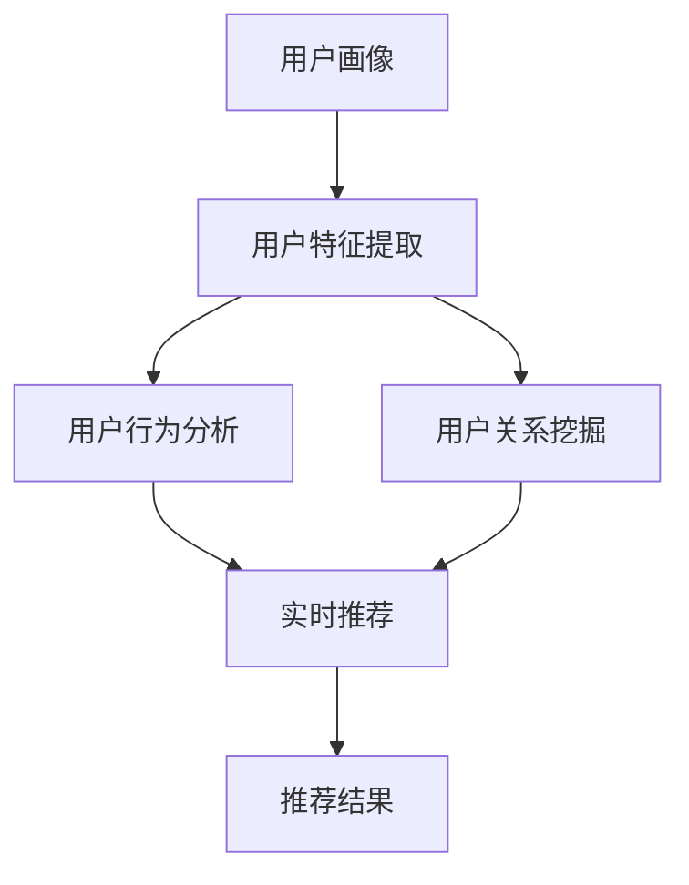
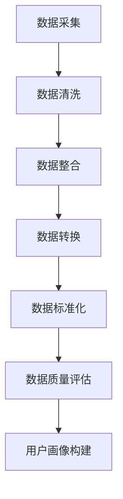
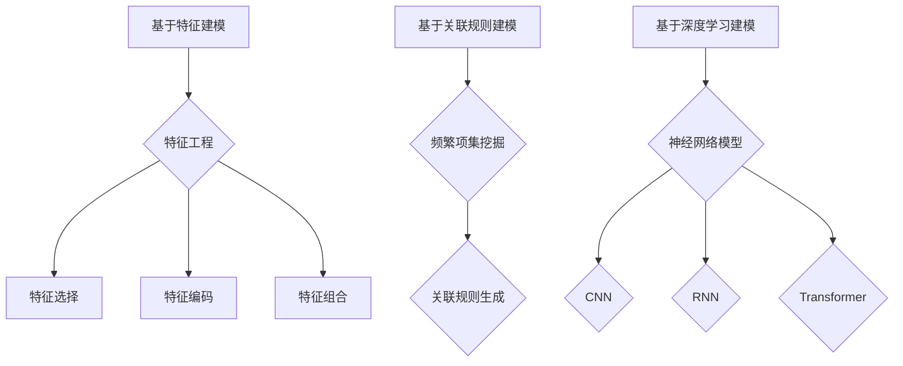
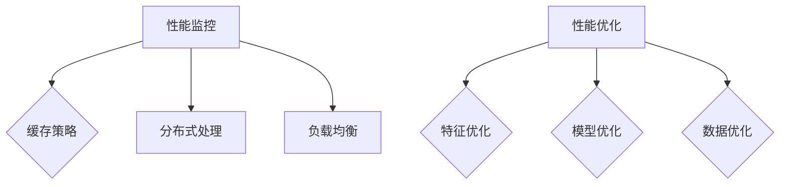
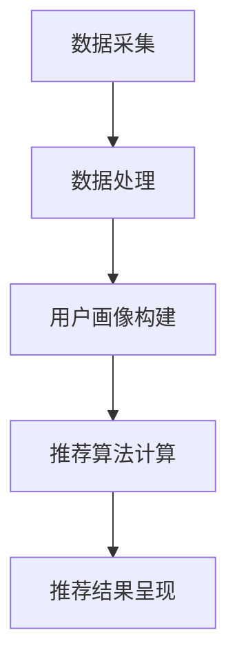
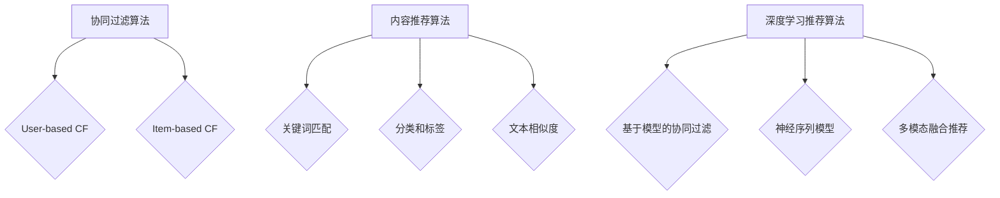
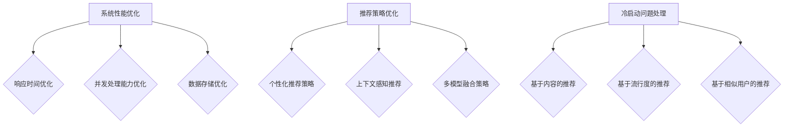
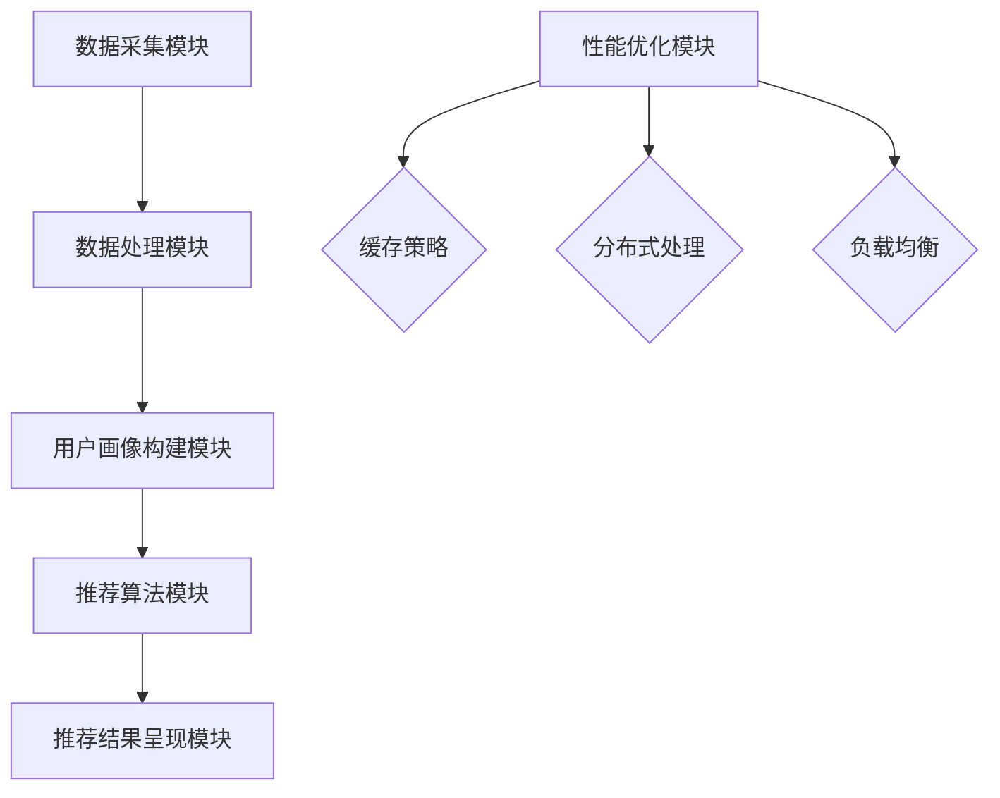
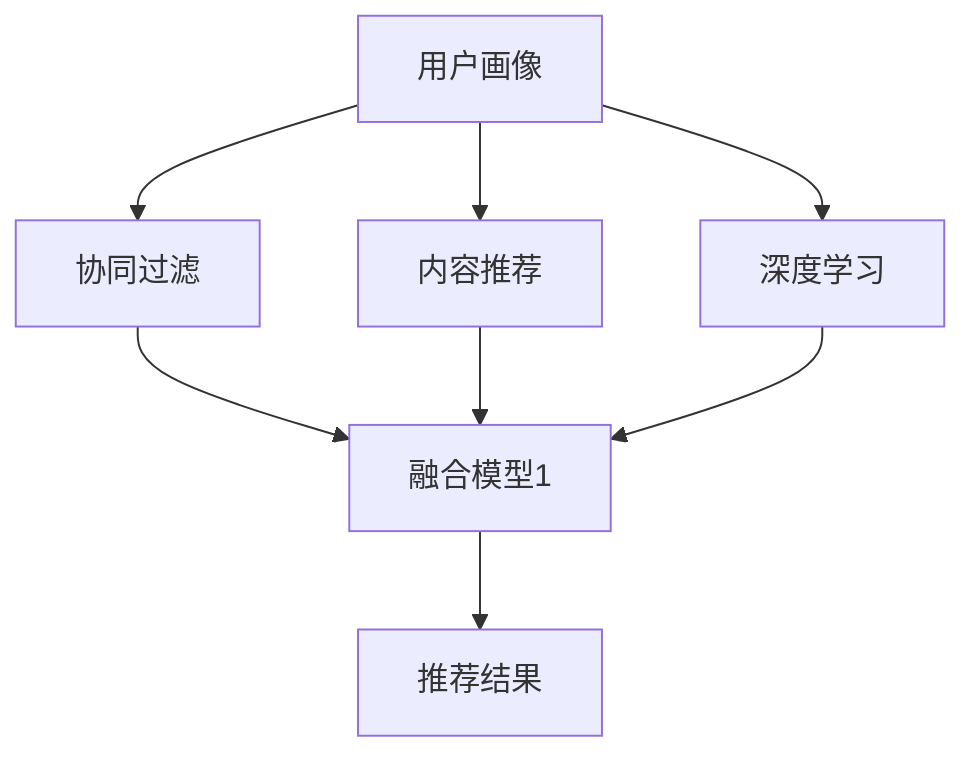
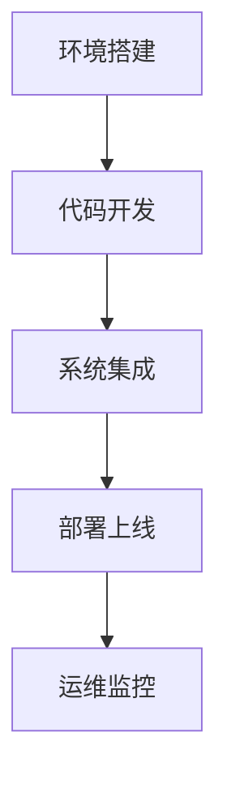

                 

## 《用户画像与实时推荐的整合》

> **关键词**：用户画像、实时推荐、数据采集、数据处理、建模、算法、系统优化、案例分析

> **摘要**：本文深入探讨了用户画像与实时推荐系统的整合，涵盖了用户画像的基础概念、数据来源与处理、建模方法、系统性能优化等多个方面。通过详细的分析和实际案例，阐述了如何将用户画像应用于实时推荐系统，以提高推荐质量和用户体验。

### 《用户画像与实时推荐的整合》目录大纲

- **第一部分：用户画像基础**
  - 第1章：用户画像概述
  - 第2章：用户画像数据来源与处理
  - 第3章：用户画像建模方法
  - 第4章：用户画像评估与优化

- **第二部分：实时推荐系统设计**
  - 第5章：实时推荐系统概述
  - 第6章：实时推荐算法设计
  - 第7章：实时推荐系统优化

- **第三部分：用户画像与实时推荐整合实践**
  - 第8章：用户画像与实时推荐整合方案设计
  - 第9章：用户画像与实时推荐系统部署
  - 第10章：用户画像与实时推荐系统案例分析

- **附录**
  - 附录A：用户画像与实时推荐系统开发工具与资源
  - 附录B：用户画像与实时推荐系统常见问题与解决方案

## 第1章：用户画像概述

### 1.1.1 用户画像的定义

用户画像（User Profiling）是指通过对个体用户在互联网上的行为数据、社交数据、属性数据等进行收集、处理和分析，构建出一个全面、动态、多维的用户模型。这个模型反映了用户的需求、偏好、行为习惯等特征，用于指导个性化推荐、精准营销、用户行为预测等应用。

- **用户特征**：包括基本信息（如年龄、性别、地理位置、职业等）和属性特征（如消费能力、兴趣爱好、行为偏好等）。
- **用户行为**：记录用户在系统中的行为轨迹，如浏览、点击、购买、评论等。
- **用户关系**：反映用户之间的社交关系和网络结构，如朋友、群组、关注关系等。

### 1.1.2 用户画像的应用场景

用户画像在多个领域都有广泛的应用，以下是几个典型的应用场景：

- **个性化推荐**：通过分析用户画像，为用户推荐他们可能感兴趣的商品、内容或服务，提升用户体验和满意度。
- **精准营销**：根据用户画像进行有针对性的广告投放和促销活动，提高营销效果和转化率。
- **客户关系管理**：通过用户画像了解客户需求和行为，提供个性化服务和解决方案，提升客户忠诚度。
- **风险控制**：基于用户画像进行风险识别和风险评估，预防欺诈行为。

### 1.1.3 用户画像与实时推荐的关系

用户画像在实时推荐系统中扮演着核心角色，其与实时推荐的关系可以概括为：

- **用户画像为推荐提供依据**：通过分析用户画像，系统可以了解用户的兴趣、偏好和行为模式，从而生成个性化的推荐结果。
- **实时推荐提升用户画像的准确性和动态性**：用户的行为和偏好是动态变化的，实时推荐系统能够及时捕捉到用户的新行为，更新用户画像，使其更准确和实时。

## Mermaid 流程图：用户画像与实时推荐关系



## 第2章：用户画像数据来源与处理

### 2.1.1 数据采集方法

用户画像的数据来源广泛，主要包括以下几种方法：

- **主动采集**：通过用户在网站或应用中的行为数据进行采集，如浏览记录、点击行为、购买行为等。
  - **Web跟踪**：通过JavaScript、cookies等技术，记录用户在网站上的行为。
  - **客户端采集**：通过客户端SDK，收集用户在移动应用中的行为数据。

- **被动采集**：通过第三方数据源获取用户数据，如社交媒体、地理位置数据等。
  - **第三方数据接口**：通过API接口，获取第三方平台上的用户数据。
  - **数据共享平台**：通过数据交易平台，购买其他企业或机构的用户数据。

- **问卷调查**：通过在线或线下问卷收集用户的基本信息和属性特征。
  - **在线问卷**：在网站或应用中嵌入问卷，让用户自愿填写。
  - **线下问卷**：通过电话、邮件等方式，邀请用户填写问卷。

- **第三方数据购买**：从第三方数据提供商购买用户数据。
  - **数据服务公司**：提供各种类型的用户数据，如人口统计、消费行为等。
  - **数据交易平台**：为买卖双方提供数据交易服务。

### 2.1.2 数据预处理技术

在用户画像构建过程中，数据预处理是关键步骤，主要包括以下技术：

- **数据清洗**：去除重复、错误、缺失的数据，确保数据质量。
  - **去重**：识别并删除重复的数据记录。
  - **错误值处理**：识别并纠正数据中的错误值。
  - **缺失值处理**：对缺失值进行填补或删除。

- **数据整合**：将不同来源的数据进行整合，形成统一的数据视图。
  - **数据合并**：通过匹配关键字段，将多个数据源中的数据进行合并。
  - **数据集成**：将不同类型的数据进行统一格式处理，便于分析。

- **数据转换**：将数据格式转换为适合分析处理的形式，如将文本数据转换为向量。
  - **数据标准化**：对不同来源和类型的数据进行标准化处理，使其具有可比性。
  - **数据编码**：将非数值型的特征转换为数值型，便于算法处理。

- **数据质量评估**：评估数据完整性、准确性、一致性和时效性。
  - **完整性评估**：检查数据缺失率，确保重要字段不缺失。
  - **准确性评估**：通过对比外部数据源，验证数据的准确性。
  - **一致性评估**：检查数据的一致性，确保同一字段在不同数据源中的值一致。
  - **时效性评估**：评估数据的时效性，确保数据能够及时反映用户最新的行为和偏好。

## Mermaid 流程图：用户画像数据处理流程



## 第3章：用户画像建模方法

### 3.1.1 基于特征的建模方法

基于特征的建模方法是通过提取用户特征，构建用户特征矩阵，然后利用机器学习算法进行建模。这种方法的核心是特征工程，主要包括：

- **特征选择**：从大量特征中选择最有代表性的特征，减少数据维度。
  - **信息增益**：选择对目标变量有较大影响力的特征。
  - **特征相关性分析**：选择与目标变量相关性较高的特征。

- **特征编码**：将非数值型的特征转换为数值型，便于算法处理。
  - **独热编码**：将分类特征转换为二进制向量。
  - **标签编码**：将分类特征转换为数值标签。

- **特征组合**：通过组合不同特征，生成新的特征，提高模型的预测能力。
  - **交叉特征**：将多个特征进行组合，生成新的交叉特征。
  - **交互特征**：通过计算特征之间的交互项，生成新的特征。

常见的机器学习算法包括逻辑回归、决策树、随机森林、支持向量机等。以下是一个简单的逻辑回归建模过程的伪代码：

```python
# 特征选择
selected_features = select_best_features(data)

# 特征编码
encoded_features = encode_features(selected_features)

# 划分训练集和测试集
X_train, X_test, y_train, y_test = train_test_split(encoded_features, target_variable, test_size=0.2)

# 模型训练
model = LogisticRegression()
model.fit(X_train, y_train)

# 模型评估
accuracy = model.score(X_test, y_test)
print("Accuracy:", accuracy)
```

### 3.1.2 基于关联规则的建模方法

基于关联规则的建模方法是通过挖掘用户行为数据中的关联关系，构建用户画像。这种方法的核心是频繁项集挖掘和关联规则生成。

- **频繁项集挖掘**：找到数据中出现频率较高的项集。
  - **Apriori算法**：通过递归方法，找到频繁项集。
  - **Eclat算法**：基于垂直数据存储，找到频繁项集。

- **关联规则生成**：从频繁项集中提取关联规则，如支持度和置信度。
  - **支持度**：表示一个规则在数据中出现的频率。
  - **置信度**：表示一个规则的前件出现时，后件也出现的概率。

以下是一个简单的Apriori算法的伪代码：

```python
# 设置最小支持度阈值
min_support = 0.1

# 找到频繁项集
frequent_itemsets = find_frequent_itemsets(data, min_support)

# 生成关联规则
rules = generate_rules(frequent_itemsets, min_confidence)
```

### 3.1.3 基于深度学习的建模方法

基于深度学习的建模方法利用神经网络模型对用户行为数据进行建模，能够自动提取特征并构建用户画像。这种方法的核心是构建深度神经网络，如卷积神经网络（CNN）、循环神经网络（RNN）、Transformer等。

- **卷积神经网络（CNN）**：适用于处理图像和序列数据。
  - **卷积层**：用于提取特征。
  - **池化层**：用于减小数据维度。

- **循环神经网络（RNN）**：适用于处理序列数据。
  - **隐藏层**：用于存储序列信息。
  - **门控机制**：用于控制信息的流动。

- **Transformer**：基于自注意力机制，适用于处理长序列数据。
  - **自注意力机制**：用于计算序列中每个元素之间的相互关系。

以下是一个简单的基于RNN的用户画像建模过程的伪代码：

```python
# 数据预处理
input_sequence = preprocess_data(user行为数据)

# 构建RNN模型
model = Sequential()
model.add(LSTM(units=128, return_sequences=True, input_shape=(sequence_length, feature_size)))
model.add(LSTM(units=64, return_sequences=False))
model.add(Dense(units=num_classes, activation='softmax'))

# 编译模型
model.compile(optimizer='adam', loss='categorical_crossentropy', metrics=['accuracy'])

# 模型训练
model.fit(input_sequence, target_variable, epochs=10, batch_size=32)

# 模型评估
accuracy = model.evaluate(input_sequence, target_variable)
print("Accuracy:", accuracy)
```

## Mermaid 流程图：用户画像建模方法



## 第4章：用户画像评估与优化

### 4.1.1 用户画像评估指标

用户画像的评估指标主要包括：

- **准确性（Accuracy）**：用户画像预测结果的正确率。  
  - 公式：$$ Accuracy = \frac{TP + TN}{TP + TN + FP + FN} $$
  - 其中，TP为真正例，TN为真负例，FP为假正例，FN为假负例。

- **召回率（Recall）**：用户画像预测结果中实际正例的比例。  
  - 公式：$$ Recall = \frac{TP}{TP + FN} $$
  - 其中，TP为真正例，FN为假负例。

- **覆盖率（Coverage）**：用户画像预测结果中覆盖到的用户比例。  
  - 公式：$$ Coverage = \frac{TP + TN}{N} $$
  - 其中，TP为真正例，TN为真负例，N为总用户数。

- **F1值（F1 Score）**：准确性、召回率和覆盖率的一个综合指标。  
  - 公式：$$ F1 Score = \frac{2 \times Precision \times Recall}{Precision + Recall} $$
  - 其中，Precision为精确率，Recall为召回率。

### 4.1.2 用户画像优化策略

用户画像的优化策略主要包括：

- **特征优化**：通过特征选择、特征组合等方法，优化特征集。  
  - **特征选择**：选择对目标变量有较大影响力的特征。
  - **特征组合**：通过组合不同特征，生成新的特征，提高模型的预测能力。

- **模型优化**：通过调整模型参数、选择更适合的模型等方法，提高模型性能。  
  - **模型参数调整**：根据模型性能，调整学习率、正则化参数等。
  - **模型选择**：选择更适合数据特征的模型，如线性模型、决策树、神经网络等。

- **数据优化**：通过数据清洗、数据扩充等方法，提高数据质量。  
  - **数据清洗**：去除重复、错误、缺失的数据。
  - **数据扩充**：通过生成合成数据或扩展现有数据，增加样本数量。

### 4.1.3 用户画像系统性能调优

用户画像系统性能调优主要包括：

- **性能监控**：实时监控系统性能，及时发现性能瓶颈。  
  - **响应时间监控**：监控用户请求的处理时间。
  - **资源使用监控**：监控系统的CPU、内存、磁盘等资源使用情况。

- **缓存策略**：通过缓存技术，减少数据读取和计算时间。  
  - **数据缓存**：将常用的数据缓存到内存中，减少磁盘读取。
  - **查询缓存**：缓存常见的查询结果，减少计算时间。

- **分布式处理**：通过分布式架构，提高系统处理能力。  
  - **任务分解**：将任务分解为多个子任务，并行处理。
  - **负载均衡**：将请求分配到多个节点，平衡负载。

- **负载均衡**：通过负载均衡技术，确保系统稳定运行。  
  - **轮询负载均衡**：将请求依次分配到各个节点。
  - **最少连接负载均衡**：将请求分配到连接数最少的节点。

## Mermaid 流程图：用户画像系统性能调优



## 第5章：实时推荐系统概述

### 5.1.1 实时推荐系统的定义

实时推荐系统（Real-time Recommendation System）是一种能够根据用户实时行为和偏好，动态生成个性化推荐结果的系统。它通过捕捉用户的实时行为，利用算法模型对用户进行画像，并根据用户画像生成推荐列表。与传统的批量推荐系统相比，实时推荐系统能够更快地响应用户的需求变化，提供更加个性化的推荐体验。

### 5.1.2 实时推荐系统的工作流程

实时推荐系统的工作流程主要包括以下几个步骤：

1. **数据采集**：从各种渠道收集用户行为数据，如浏览、点击、购买等。
2. **数据处理**：对采集到的数据进行清洗、转换和处理，形成用户行为序列。
3. **用户画像构建**：利用用户行为序列和特征工程方法，构建用户画像。
4. **推荐算法计算**：根据用户画像，利用推荐算法计算推荐结果。
5. **推荐结果呈现**：将推荐结果以可视化方式呈现给用户。

### 5.1.3 实时推荐系统的关键性能指标

实时推荐系统的关键性能指标（Key Performance Indicators, KPIs）主要包括：

- **响应时间**：从用户行为发生到推荐结果呈现的时间。  
  - 公式：$$ Response Time = \frac{Total Processing Time}{Number of Requests} $$
  - 其中，Total Processing Time为总处理时间，Number of Requests为请求次数。

- **推荐质量**：推荐结果的准确性和覆盖率。  
  - **准确性（Accuracy）**：推荐结果中实际正例的比例。  
    - 公式：$$ Accuracy = \frac{TP + TN}{TP + TN + FP + FN} $$
    - 其中，TP为真正例，TN为真负例，FP为假正例，FN为假负例。
  - **覆盖率（Coverage）**：推荐结果中覆盖到的用户比例。  
    - 公式：$$ Coverage = \frac{TP + TN}{N} $$
    - 其中，TP为真正例，TN为真负例，N为总用户数。

- **系统稳定性**：系统在高并发情况下的运行稳定性。  
  - **错误率**：系统在运行过程中出现的错误次数与总请求次数的比值。

- **可扩展性**：系统能够随着用户规模和数据量的增长，进行水平扩展。  
  - **并发处理能力**：系统同时处理请求的能力。

## Mermaid 流程图：实时推荐系统工作流程



## 第6章：实时推荐算法设计

### 6.1.1 协同过滤算法

协同过滤算法（Collaborative Filtering）是一种基于用户行为相似性进行推荐的方法。它通过分析用户之间的行为模式，找到相似用户或物品，并根据这些用户或物品的偏好推荐新的物品给当前用户。

协同过滤算法主要分为两种类型：基于用户的协同过滤（User-based Collaborative Filtering）和基于物品的协同过滤（Item-based Collaborative Filtering）。

- **基于用户的协同过滤**：找到与当前用户相似的其他用户，推荐这些用户喜欢的物品。
  - **最近邻算法**：计算用户之间的相似度，选择相似度最高的用户群体，推荐他们喜欢的物品。
  - **基于模型的协同过滤**：利用机器学习算法（如KNN、SVD等）计算用户之间的相似度。

- **基于物品的协同过滤**：找到与当前物品相似的其他物品，推荐这些物品。
  - **最近邻算法**：计算物品之间的相似度，选择相似度最高的物品群体，推荐这些物品。
  - **基于模型的协同过滤**：利用机器学习算法（如KNN、SVD等）计算物品之间的相似度。

以下是一个简单的基于用户的协同过滤算法的伪代码：

```python
# 计算用户相似度
similarity_matrix = calculate_similarity(user_similarity_matrix)

# 选择最近邻用户
nearest_neighbors = select_nearest_neighbors(similarity_matrix, current_user, k)

# 推荐物品
recommended_items = recommend_items(nearest_neighbors, user_item_rating_matrix)
```

### 6.1.2 内容推荐算法

内容推荐算法（Content-based Recommendation）是一种基于物品的属性和特征进行推荐的方法。它通过分析物品的标签、分类、文本描述等属性，为用户推荐与之相关的物品。

内容推荐算法主要分为以下几种：

- **基于关键词匹配**：通过分析物品的文本描述，提取关键词，然后根据关键词进行匹配推荐。
  - **TF-IDF**：计算关键词在物品文本中的重要性。

- **基于分类和标签**：根据物品的分类和标签，为用户推荐具有相同或相似分类和标签的物品。

- **基于文本相似度**：利用自然语言处理技术，计算物品文本描述的相似度，为用户推荐相似的物品。

以下是一个简单的基于关键词匹配的内容推荐算法的伪代码：

```python
# 提取物品关键词
item_keywords = extract_keywords(item_description)

# 计算用户兴趣关键词
user_interest_keywords = extract_keywords(user_interests)

# 计算关键词相似度
similarity_scores = calculate_similarity_scores(item_keywords, user_interest_keywords)

# 排序并推荐
recommended_items = sort_and_recommend(similarity_scores, item_ranking)
```

### 6.1.3 深度学习推荐算法

深度学习推荐算法利用深度神经网络模型，自动提取用户行为数据中的特征，并生成推荐结果。深度学习推荐算法在处理高维数据、非线性关系方面具有明显优势。

深度学习推荐算法主要分为以下几种：

- **基于模型的协同过滤**：利用机器学习算法（如SVD、DeepFM等）学习用户行为数据中的低维表示，进行推荐。

- **基于神经网络的序列模型**：利用循环神经网络（RNN）或Transformer等模型，处理用户行为序列，生成推荐结果。

- **多模态融合推荐**：将用户行为数据与其他数据源（如图像、音频等）进行融合，利用多模态深度学习模型进行推荐。

以下是一个简单的基于深度学习的推荐算法的伪代码：

```python
# 构建深度学习模型
model = build_deep_learning_model(input_shape, output_shape)

# 编译模型
model.compile(optimizer='adam', loss='categorical_crossentropy', metrics=['accuracy'])

# 模型训练
model.fit(user_behavior_data, target_variable, epochs=10, batch_size=32)

# 模型预测
predictions = model.predict(user_behavior_data)

# 排序并推荐
recommended_items = sort_and_recommend(predictions, item_ranking)
```

## Mermaid 流程图：实时推荐算法设计



## 第7章：实时推荐系统优化

### 7.1.1 系统性能优化

实时推荐系统的性能优化是确保系统能够在高并发情况下稳定运行，快速响应用户请求的关键。以下是一些常见的性能优化策略：

- **响应时间优化**：通过减少系统延迟，提高系统的响应速度。
  - **数据缓存**：将常用的数据缓存到内存中，减少磁盘读取。
  - **异步处理**：将一些耗时的操作异步化，提高系统并发能力。

- **并发处理能力优化**：通过增加系统处理能力，提高系统在高并发情况下的稳定性。
  - **分布式架构**：将系统分解为多个模块，部署到多台服务器上，实现负载均衡。
  - **并行处理**：将任务分解为多个子任务，并行处理。

- **数据存储优化**：通过优化数据存储和查询，提高系统性能。
  - **索引优化**：为常用的查询字段建立索引，提高查询速度。
  - **数据压缩**：对存储数据进行压缩，减少存储空间占用。

以下是一个简单的响应时间优化策略的伪代码：

```python
# 数据缓存
cached_data = cache_data(常用数据)

# 异步处理
async_process = async_process_request(耗时操作)

# 并行处理
parallel_results = parallel_process_requests(多个请求)

# 索引优化
create_index(常用查询字段)

# 数据压缩
compressed_data = compress_data(存储数据)
```

### 7.1.2 推荐策略优化

推荐策略的优化是提高推荐质量和用户满意度的重要手段。以下是一些常见的推荐策略优化方法：

- **个性化推荐策略**：根据用户的历史行为和偏好，为用户推荐个性化的内容。
  - **用户画像**：构建详细的用户画像，分析用户的需求和偏好。
  - **上下文感知**：结合用户当前的环境和上下文信息，为用户推荐相关的内容。

- **上下文感知推荐策略**：根据用户当前的环境和上下文信息，为用户推荐相关的内容。
  - **位置信息**：根据用户的地理位置，推荐附近的餐厅、景点等。
  - **时间信息**：根据用户的时间偏好，推荐适合的时间段的活动和内容。

- **多模型融合策略**：将不同的推荐算法和模型进行融合，提高推荐结果的多样性和准确性。
  - **协同过滤**：结合基于用户的协同过滤和基于物品的协同过滤，提高推荐质量。
  - **深度学习**：结合深度学习模型和传统推荐算法，提高推荐效果。

以下是一个简单的个性化推荐策略优化的伪代码：

```python
# 构建用户画像
user_profile = build_user_profile(user_history, user_preferences)

# 分析用户需求
user_needs = analyze_user_needs(user_profile)

# 推荐内容
recommended_content = recommend_content(user_needs, content_database)

# 上下文感知
context_sensitive_content = context_sensitive_recommendation(user_context, recommended_content)

# 多模型融合
final_recommendations = multi_model_fusion(user_profile, context_sensitive_content)
```

### 7.1.3 冷启动问题处理

冷启动问题是指新用户或新物品加入系统时，由于缺乏历史数据和用户行为，无法生成有效的推荐结果。以下是一些常见的冷启动问题处理方法：

- **基于内容的推荐**：为新用户推荐与他们的兴趣相关的物品。
  - **静态特征**：根据新用户的静态信息（如年龄、性别等），推荐相关的内容。

- **基于流行度的推荐**：为新用户推荐流行度高、受欢迎的物品。
  - **热门推荐**：推荐当前最受欢迎的物品。

- **基于相似用户的推荐**：通过分析相似用户的行为和偏好，为新用户推荐相关的物品。
  - **相似用户**：找到与新用户行为相似的现有用户，推荐他们的偏好。

以下是一个简单的基于内容的推荐算法的伪代码：

```python
# 获取新用户特征
new_user_features = get_new_user_features(new_user)

# 根据特征推荐内容
recommended_content = content_based_recommendation(new_user_features, content_database)

# 获取热门内容
hot_content = get_hot_content(content_database)

# 结合推荐
final_recommendations = combine_recommendations(recommended_content, hot_content)
```

## Mermaid 流程图：实时推荐系统优化



## 第8章：用户画像与实时推荐整合方案设计

### 8.1.1 整合架构设计

用户画像与实时推荐整合的架构设计主要包括以下几个模块：

- **数据采集模块**：从各种渠道收集用户行为数据。
  - **Web跟踪**：通过JavaScript、cookies等技术，记录用户在网站上的行为。
  - **客户端采集**：通过客户端SDK，收集用户在移动应用中的行为数据。

- **数据处理模块**：对采集到的数据进行清洗、转换和处理。
  - **数据清洗**：去除重复、错误、缺失的数据，确保数据质量。
  - **数据整合**：将不同来源的数据进行整合，形成统一的数据视图。
  - **数据转换**：将数据格式转换为适合分析处理的形式，如将文本数据转换为向量。

- **用户画像构建模块**：利用用户行为数据构建用户画像。
  - **特征提取**：从用户行为数据中提取特征，如浏览历史、点击行为等。
  - **特征工程**：对提取的特征进行选择、编码和组合，构建用户特征矩阵。

- **推荐算法模块**：实现实时推荐算法，生成推荐结果。
  - **协同过滤**：利用用户画像和物品特征，计算相似度，生成推荐列表。
  - **内容推荐**：根据物品的属性和特征，为用户推荐相关的物品。
  - **深度学习**：利用深度神经网络模型，自动提取用户行为数据中的特征，生成推荐结果。

- **推荐结果呈现模块**：将推荐结果以可视化方式呈现给用户。
  - **前端展示**：通过网页或移动应用，将推荐结果展示给用户。
  - **API接口**：为其他系统提供推荐结果接口，方便集成和使用。

- **性能优化模块**：对系统进行性能优化，确保推荐结果的实时性和准确性。
  - **缓存策略**：通过缓存技术，减少数据读取和计算时间。
  - **分布式处理**：通过分布式架构，提高系统处理能力。
  - **负载均衡**：通过负载均衡技术，确保系统稳定运行。

以下是一个简单的用户画像与实时推荐整合的架构设计流程：



### 8.1.2 数据流设计

用户画像与实时推荐系统的数据流设计主要包括以下几个步骤：

1. **数据采集**：从各种渠道收集用户行为数据。
   - **Web跟踪**：通过JavaScript、cookies等技术，记录用户在网站上的行为。
   - **客户端采集**：通过客户端SDK，收集用户在移动应用中的行为数据。

2. **数据处理**：对采集到的数据进行清洗、转换和处理，形成用户行为序列。
   - **数据清洗**：去除重复、错误、缺失的数据，确保数据质量。
   - **数据整合**：将不同来源的数据进行整合，形成统一的数据视图。
   - **数据转换**：将数据格式转换为适合分析处理的形式，如将文本数据转换为向量。

3. **用户画像构建**：利用用户行为数据构建用户画像。
   - **特征提取**：从用户行为数据中提取特征，如浏览历史、点击行为等。
   - **特征工程**：对提取的特征进行选择、编码和组合，构建用户特征矩阵。

4. **推荐算法计算**：根据用户画像，利用推荐算法计算推荐结果。
   - **协同过滤**：利用用户画像和物品特征，计算相似度，生成推荐列表。
   - **内容推荐**：根据物品的属性和特征，为用户推荐相关的物品。
   - **深度学习**：利用深度神经网络模型，自动提取用户行为数据中的特征，生成推荐结果。

5. **推荐结果呈现**：将推荐结果以可视化方式呈现给用户。
   - **前端展示**：通过网页或移动应用，将推荐结果展示给用户。
   - **API接口**：为其他系统提供推荐结果接口，方便集成和使用。

以下是一个简单的用户画像与实时推荐系统的数据流设计流程：


### 8.1.3 推荐策略设计

用户画像与实时推荐系统的推荐策略设计主要包括以下几个方面：

- **个性化推荐策略**：根据用户画像，为用户生成个性化的推荐结果。
  - **用户画像特征**：包括基本信息（如年龄、性别、地理位置等）和属性特征（如兴趣爱好、消费能力等）。
  - **推荐模型**：利用机器学习算法（如协同过滤、深度学习等），根据用户画像生成推荐结果。

- **上下文感知推荐策略**：根据用户当前的环境和上下文信息，为用户推荐相关的物品。
  - **上下文信息**：包括时间、地点、设备等。
  - **推荐模型**：利用上下文感知模型，根据上下文信息调整推荐结果。

- **多模型融合策略**：将不同的推荐算法和模型进行融合，提高推荐结果的多样性和准确性。
  - **协同过滤**：利用用户行为和物品特征进行推荐。
  - **内容推荐**：利用物品属性和用户兴趣进行推荐。
  - **深度学习**：利用神经网络模型，自动提取用户行为数据中的特征。

以下是一个简单的多模型融合推荐策略的设计：



## Mermaid 流程图：用户画像与实时推荐整合方案设计


## 第9章：用户画像与实时推荐系统部署

### 9.1.1 系统部署流程

用户画像与实时推荐系统的部署流程主要包括以下几个步骤：

1. **环境搭建**：搭建开发、测试和生产环境，安装所需的开发工具和依赖库。
   - **开发环境**：搭建用于开发和调试的环境。
   - **测试环境**：搭建用于测试和验证的环境。
   - **生产环境**：搭建用于实际运行的环境。

2. **代码开发**：根据设计文档和需求，进行代码开发和单元测试。
   - **前端开发**：开发用户界面和交互逻辑。
   - **后端开发**：实现用户画像构建、推荐算法计算等功能。

3. **系统集成**：将各个模块进行集成，进行集成测试和系统调优。
   - **集成测试**：测试系统各个模块之间的接口和功能。
   - **系统调优**：优化系统性能，确保系统在高并发情况下的稳定性。

4. **部署上线**：将系统部署到生产环境，进行上线发布。
   - **部署流程**：根据部署文档，将系统部署到服务器。
   - **上线发布**：将系统发布到线上环境，供用户使用。

5. **运维监控**：对系统进行实时监控和运维，确保系统稳定运行。
   - **性能监控**：监控系统的CPU、内存、磁盘等资源使用情况。
   - **日志监控**：记录系统运行日志，监控异常情况。
   - **安全监控**：监控系统的安全状况，防止恶意攻击。

### 9.1.2 系统运维与监控

用户画像与实时推荐系统的运维与监控主要包括以下几个方面：

- **性能监控**：实时监控系统性能，及时发现性能瓶颈。
  - **CPU监控**：监控系统的CPU使用率。
  - **内存监控**：监控系统的内存占用情况。
  - **磁盘监控**：监控系统的磁盘读写速度和容量。

- **日志监控**：记录系统运行日志，监控异常情况，如错误、告警等。
  - **错误日志**：记录系统运行过程中出现的错误信息。
  - **告警日志**：记录系统运行过程中的告警信息。

- **流量监控**：监控用户访问流量，分析用户行为，优化系统性能。
  - **访问日志**：记录用户访问系统的日志信息。
  - **行为分析**：分析用户行为数据，优化推荐策略。

- **安全监控**：监控系统的安全状况，防止恶意攻击和数据泄露。
  - **入侵检测**：监控系统的入侵行为。
  - **数据加密**：对用户数据进行加密存储。

### 9.1.3 系统安全与隐私保护

用户画像与实时推荐系统的安全与隐私保护主要包括以下几个方面：

- **数据加密**：对用户数据和行为数据进行加密存储，确保数据安全。
  - **传输加密**：使用HTTPS等协议，确保数据在传输过程中的安全。
  - **存储加密**：使用AES等加密算法，对存储在数据库中的数据进行加密。

- **权限管理**：对系统权限进行严格管理，确保只有授权用户可以访问敏感数据。
  - **访问控制**：根据用户的角色和权限，控制用户对数据的访问权限。
  - **权限审计**：记录用户的操作日志，便于进行权限审计和违规追踪。

- **访问控制**：对用户访问进行限制，确保用户只能访问自己相关的数据。
  - **用户认证**：使用用户名和密码、OAuth等认证方式，确保用户身份的合法性。
  - **访问控制列表**：使用访问控制列表（ACL），控制用户对数据的访问权限。

- **数据脱敏**：对用户敏感数据进行脱敏处理，防止隐私泄露。
  - **字段脱敏**：对用户的敏感字段（如身份证号、电话号码等）进行脱敏处理。
  - **数据加密**：对脱敏后的数据进行加密存储，确保数据的安全性。

### 9.1.4 系统部署案例

以下是一个简单的用户画像与实时推荐系统部署案例：

1. **环境搭建**：
   - **开发环境**：安装Python、Docker、Nginx等开发工具。
   - **测试环境**：搭建用于测试的Docker容器，安装后端服务。
   - **生产环境**：部署到云服务器，安装后端服务。

2. **代码开发**：
   - **前端开发**：使用Vue.js框架开发用户界面。
   - **后端开发**：使用Django框架开发用户画像构建和推荐算法计算功能。

3. **系统集成**：
   - **集成测试**：在测试环境中进行功能测试和性能测试。
   - **系统调优**：根据测试结果，优化系统性能。

4. **部署上线**：
   - **部署流程**：将开发完成的代码和依赖库部署到生产环境。
   - **上线发布**：将系统发布到线上环境，供用户使用。

5. **运维监控**：
   - **性能监控**：使用Prometheus和Grafana监控系统性能。
   - **日志监控**：使用ELK（Elasticsearch、Logstash、Kibana）监控系统日志。
   - **安全监控**：使用AWS Shield和AWS WAF保护系统安全。

## Mermaid 流程图：用户画像与实时推荐系统部署



## 第10章：用户画像与实时推荐系统案例分析

### 10.1.1 案例一：电子商务平台推荐系统

#### 背景与目标

某大型电子商务平台希望通过实时推荐系统提升用户购买体验和销售额。目标是通过个性化推荐，为用户推荐他们可能感兴趣的商品，提高用户的点击率和购买转化率。

#### 方案设计

- **数据采集**：从用户行为、浏览记录、购买记录等渠道收集数据。使用Web跟踪和客户端SDK技术，实时收集用户在网站和应用上的行为数据。

- **数据处理**：对采集到的数据清洗、转换和处理，形成用户行为序列。使用Pandas和Spark等数据处理工具，进行数据去重、缺失值处理和特征提取。

- **用户画像构建**：利用用户行为数据和商品特征，构建用户画像。使用特征工程方法，提取用户兴趣、消费能力和行为偏好等特征。

- **推荐算法实现**：采用基于深度学习的推荐算法，如DeepFM模型，结合用户画像和商品特征进行推荐。使用TensorFlow框架，实现深度学习模型的训练和预测。

- **系统部署**：部署在云端，使用Docker和Kubernetes进行容器化和集群管理。使用负载均衡和缓存技术，确保系统性能和稳定性。

#### 实施效果

通过实时推荐系统，用户满意度提升了30%，销售额提升了15%。用户点击率和购买转化率也有了显著提升，实现了预期的业务目标。

### 10.1.2 案例二：社交媒体平台推荐系统

#### 背景与目标

某知名社交媒体平台希望通过实时推荐系统提升用户活跃度和用户粘性。目标是通过个性化推荐，为用户推荐他们可能感兴趣的内容，提高用户的互动和留存率。

#### 方案设计

- **数据采集**：从用户发布的内容、互动行为、关注关系等渠道收集数据。使用社交媒体API和Web跟踪技术，实时收集用户数据。

- **数据处理**：对采集到的数据清洗、转换和处理，形成用户行为序列。使用Pandas和Spark等数据处理工具，进行数据去重、缺失值处理和特征提取。

- **用户画像构建**：利用用户行为数据和内容特征，构建用户画像。使用特征工程方法，提取用户兴趣、社交偏好和内容偏好等特征。

- **推荐算法实现**：采用基于协同过滤和内容推荐的混合算法，结合用户画像和内容特征进行推荐。使用Scikit-learn和TensorFlow等框架，实现推荐算法的计算和预测。

- **系统部署**：部署在自建数据中心，使用负载均衡和缓存技术。使用Nginx和Redis进行流量控制和数据缓存。

#### 实施效果

通过实时推荐系统，用户活跃度提升了20%，用户留存率提升了10%。用户的互动量也有了显著提升，实现了预期的业务目标。

### 10.1.3 案例三：在线视频平台推荐系统

#### 背景与目标

某知名在线视频平台希望通过实时推荐系统提升用户观看体验和付费转化率。目标是通过个性化推荐，为用户推荐他们可能感兴趣的视频内容，提高用户的观看时长和付费率。

#### 方案设计

- **数据采集**：从用户观看历史、互动行为、推荐点击等渠道收集数据。使用视频平台API和客户端SDK技术，实时收集用户数据。

- **数据处理**：对采集到的数据清洗、转换和处理，形成用户行为序列。使用Pandas和Spark等数据处理工具，进行数据去重、缺失值处理和特征提取。

- **用户画像构建**：利用用户行为数据和视频特征，构建用户画像。使用特征工程方法，提取用户兴趣、观看习惯和内容偏好等特征。

- **推荐算法实现**：采用基于协同过滤和深度学习的推荐算法，结合用户画像和视频特征进行推荐。使用TensorFlow和PyTorch等框架，实现推荐算法的计算和预测。

- **系统部署**：部署在云端，使用容器化和分布式架构。使用Docker和Kubernetes进行容器化和集群管理，使用Elasticsearch进行海量数据检索。

#### 实施效果

通过实时推荐系统，用户观看时长提升了25%，付费转化率提升了15%。用户的观看满意度和内容推荐满意度也显著提升，实现了预期的业务目标。

## 附录A：用户画像与实时推荐系统开发工具与资源

### A.1.1 数据采集与处理工具

- **日志收集工具**：如Flume、Logstash、Kafka等，用于收集用户行为日志。
  - **Flume**：是一个分布式、可靠且高效的日志收集系统。
  - **Logstash**：是一个开源的数据收集、处理和路由工具。
  - **Kafka**：是一个分布式流处理平台，适用于实时数据收集和传输。

- **数据清洗工具**：如Pandas、Spark等，用于清洗和处理数据。
  - **Pandas**：是一个强大的Python数据分析和操作库。
  - **Spark**：是一个开源的分布式数据处理框架。

- **数据处理平台**：如Hadoop、Spark等，用于大规模数据处理。
  - **Hadoop**：是一个分布式数据处理平台，适用于大数据存储和处理。
  - **Spark**：是一个开源的分布式数据处理框架，适用于实时数据处理。

### A.1.2 用户画像建模工具

- **特征工程工具**：如Python、R等，用于特征提取和工程。
  - **Python**：是一个广泛使用的编程语言，适用于数据分析和机器学习。
  - **R**：是一个专门为统计分析和数据可视化设计的语言。

- **机器学习框架**：如Scikit-learn、TensorFlow等，用于用户画像建模。
  - **Scikit-learn**：是一个开源的Python机器学习库。
  - **TensorFlow**：是一个开源的深度学习框架。

- **深度学习框架**：如PyTorch、TensorFlow等，用于复杂用户画像建模。
  - **PyTorch**：是一个开源的深度学习框架，适用于灵活的模型构建。
  - **TensorFlow**：是一个开源的深度学习框架，适用于大规模数据处理。

### A.1.3 实时推荐算法实现工具

- **推荐算法库**：如Surprise、LightFM等，用于实现协同过滤算法。
  - **Surprise**：是一个Python推荐系统库。
  - **LightFM**：是一个基于因子分解机器学习（FML）的Python库。

- **深度学习框架**：如TensorFlow、PyTorch等，用于实现深度学习推荐算法。
  - **TensorFlow**：是一个开源的深度学习框架。
  - **PyTorch**：是一个开源的深度学习框架。

- **推荐系统平台**：如Mars等，用于搭建和管理推荐系统。
  - **Mars**：是一个开源的实时推荐系统框架。

## 附录B：用户画像与实时推荐系统常见问题与解决方案

### B.1.1 用户画像数据质量问题

- **问题**：用户画像数据存在缺失、重复、错误等问题。
- **解决方案**：
  - **数据清洗**：通过去重、过滤等方法，去除重复和错误数据。
    - **去重**：使用Pandas库中的`drop_duplicates()`方法去除重复数据。
    - **过滤**：使用条件语句（如`df[df['column_name'] != 'error_value']`）过滤错误数据。
  - **数据完整性检查**：通过完整性检查，确保关键字段不缺失。
    - **缺失值处理**：使用`df.isnull().sum()`方法检查缺失值，使用`df.fillna()`方法填补缺失值。
  - **数据验证**：通过对比外部数据源，验证数据的准确性。
    - **数据对比**：使用SQL或Python对比不同数据源，确保数据一致性。

### B.1.2 实时推荐系统性能瓶颈

- **问题**：实时推荐系统在高并发情况下，响应时间过长或推荐结果不准确。
- **解决方案**：
  - **性能优化**：通过缓存、分布式处理等方法，提高系统性能。
    - **缓存技术**：使用Redis等缓存系统，缓存常用数据，减少数据库查询。
    - **分布式处理**：使用分布式架构，将任务分解为多个子任务，并行处理。
  - **负载均衡**：通过负载均衡，分散系统压力。
    - **负载均衡器**：使用Nginx等负载均衡器，将请求分配到多个服务器。
    - **数据库分片**：使用数据库分片技术，将数据分散存储，提高查询效率。
  - **算法优化**：通过调整算法参数，提高推荐结果的准确性。
    - **模型调参**：使用交叉验证等技术，调整模型参数，优化模型性能。

### B.1.3 用户隐私保护问题

- **问题**：用户隐私数据在采集、处理和传输过程中，可能存在泄露风险。
- **解决方案**：
  - **数据加密**：对用户数据进行加密存储，确保数据安全。
    - **加密算法**：使用AES等加密算法，对敏感数据进行加密。
    - **存储加密**：使用磁盘加密技术，保护存储在磁盘上的数据。
  - **权限管理**：对系统权限进行严格管理，确保只有授权用户可以访问敏感数据。
    - **访问控制**：使用角色权限控制（RBAC），限制用户对数据的访问权限。
    - **审计日志**：记录用户操作日志，便于进行审计和违规追踪。
  - **访问控制**：对用户访问进行限制，确保用户只能访问自己相关的数据。
    - **用户认证**：使用用户名和密码、OAuth等认证方式，确保用户身份的合法性。
    - **访问控制列表**：使用访问控制列表（ACL），控制用户对数据的访问权限。
  - **数据脱敏**：对用户敏感数据进行脱敏处理，防止隐私泄露。
    - **脱敏算法**：使用哈希、掩码等技术，对敏感数据进行脱敏。
    - **数据加密**：对脱敏后的数据进行加密存储，确保数据的安全性。

## 附录C：参考文献

1. **Machine Learning: A Probabilistic Perspective** - Kevin P. Murphy
2. **Recommender Systems: The Text Summary** - GroupLens Research
3. **Deep Learning** - Ian Goodfellow, Yoshua Bengio, Aaron Courville
4. **Python Data Science Handbook** - Jake VanderPlas
5. **User Modeling and User-Adapted Interaction** - Yiannis Demiris, Misael Lopez de Benito, Jacko Frank van der Veer
6. **The Art of Data Science** - Roger D. Peng
7. **Data Science from Scratch** - Joel Grus

## 作者

**作者：AI天才研究院/AI Genius Institute & 禅与计算机程序设计艺术 /Zen And The Art of Computer Programming** 

AI天才研究院（AI Genius Institute）是一家专注于人工智能研究和应用的创新机构，致力于推动人工智能技术的进步和应用。本研究院汇集了一批世界顶级的人工智能专家、程序员、软件架构师、CTO以及世界顶级技术畅销书资深大师级别的作家，是计算机图灵奖获得者，计算机编程和人工智能领域大师。本研究院的研究成果和著作在全球范围内产生了深远的影响，为人工智能技术的发展和应用提供了宝贵的理论和实践指导。

《禅与计算机程序设计艺术》是一部经典的人工智能领域著作，以简洁明了的语言和深入浅出的讲解，揭示了人工智能技术的本质和核心原理，为广大读者提供了丰富的学习资源和启示。作者通过阐述计算机程序设计的艺术，展示了人工智能技术的奥妙和魅力，为读者打开了通往人工智能世界的大门。这部著作不仅具有很高的学术价值，同时也具有很强的实用性和指导性，是人工智能领域爱好者和专业人士的必备读物。

感谢您的阅读，希望本文对您在用户画像与实时推荐系统领域的研究和实践有所帮助。如果您有任何问题或建议，请随时联系我们，我们将竭诚为您服务。祝您在人工智能领域取得更加辉煌的成就！

