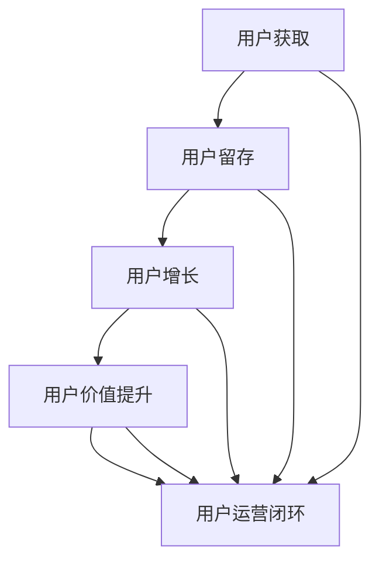
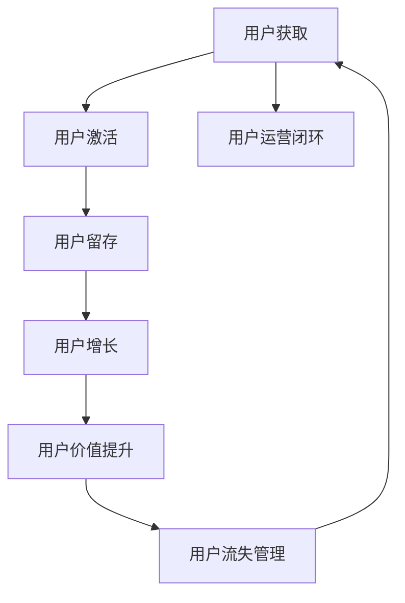
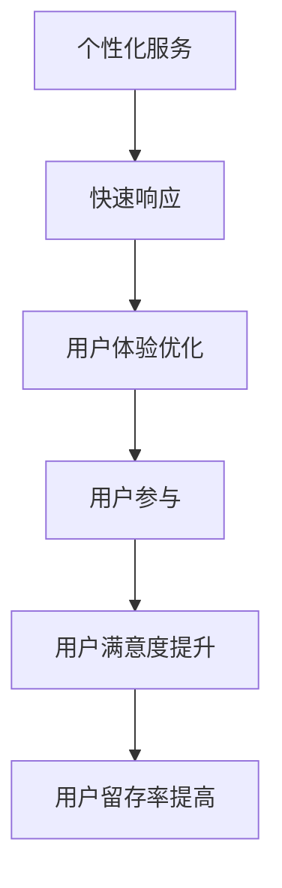
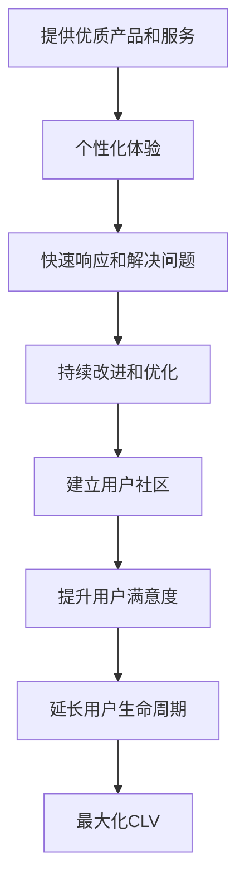
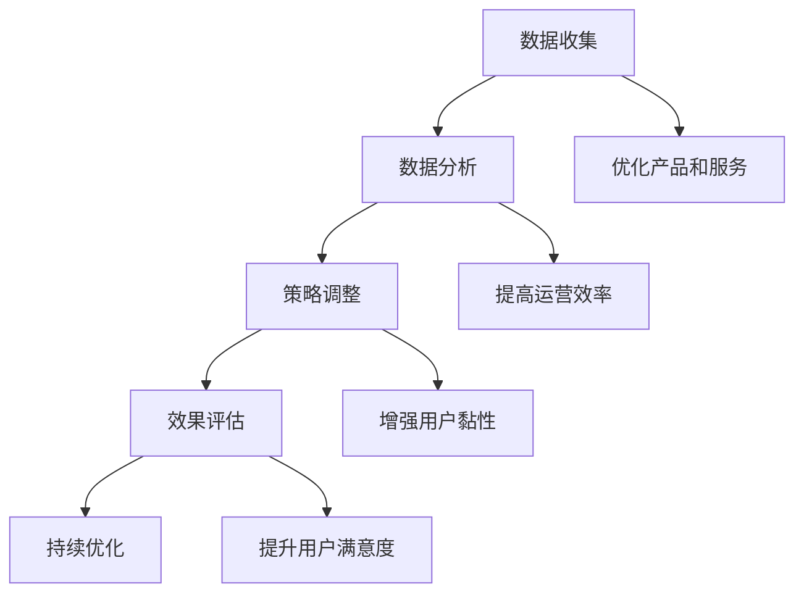
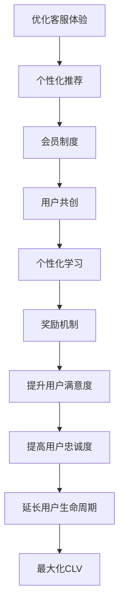

                 

### 第1章：用户运营与创业概述

#### 1.1 用户运营的定义与核心要素

用户运营是一个企业或组织为了增加用户数量、提高用户活跃度和满意度，从而实现商业目标的一系列策略和活动。在创业环境中，用户运营尤为重要，因为它直接关系到企业的生存和发展。

**用户运营的定义**：

用户运营可以被视为一种围绕用户进行的全方位管理活动，它包括用户获取、用户留存、用户增长和用户价值提升等核心要素。

- **用户获取**：通过各种渠道和方式吸引新用户，如广告投放、内容营销、社交媒体推广等。
- **用户留存**：通过优质的产品和服务以及用户互动，降低用户流失率，提升用户在平台上的活跃度。
- **用户增长**：通过优化用户体验和用户价值，引导用户推荐新用户，实现用户规模的扩张。
- **用户价值提升**：通过提高用户满意度和忠诚度，增加用户的生命周期价值，提升企业的收入和利润。

**核心要素**：

1. **用户需求分析**：了解用户的需求是用户运营的基础。通过用户调研、数据分析等方式，挖掘用户需求，为后续的运营策略提供依据。

2. **用户行为跟踪**：跟踪用户行为，了解用户在平台上的行为习惯和偏好。这有助于企业优化产品和服务，提高用户满意度。

3. **用户满意度提升**：通过提供高质量的产品和服务，以及良好的用户体验，提升用户满意度。用户满意度是用户留存和增长的关键。

4. **用户生命周期价值最大化**：通过提高用户的满意度和忠诚度，延长用户的生命周期，从而实现用户生命周期价值的最大化。

#### 1.2 创业环境下的用户运营挑战

在创业环境中，用户运营面临诸多挑战，这些挑战往往来自于资源限制、市场竞争和数据驱动的需求。

**挑战一：资源限制**

创业公司通常面临资金、人力和时间的限制。这意味着用户运营策略必须高效且成本低廉。如何以最小的资源投入实现最大的用户价值提升，是用户运营经理需要解决的重要问题。

**挑战二：市场竞争**

创业公司在市场中面临激烈的竞争，如何快速获取用户、提高用户留存率和满意度，是用户运营经理必须面对的挑战。这要求用户运营经理具备敏锐的市场洞察力和灵活的运营策略。

**挑战三：数据驱动**

用户运营需要依赖数据分析，从大量用户行为数据中提取有价值的信息，指导运营决策。这要求用户运营经理具备数据分析和解读能力，能够利用数据驱动运营。

#### 1.3 用户运营在创业中的战略地位

用户运营在创业中具有至关重要的战略地位，主要体现在以下几个方面：

**战略地位一：获取用户**

用户是创业公司的生命线，用户运营策略直接影响用户获取的速度和规模。有效的用户运营可以帮助创业公司迅速积累用户基础，为后续发展奠定基础。

**战略地位二：提升收入**

通过提高用户满意度和忠诚度，增加用户的生命周期价值，用户运营可以直接提升企业的收入和利润。用户生命周期价值（CLV）是衡量用户运营成效的重要指标。

**战略地位三：增强竞争力**

优秀的用户运营能力可以增强企业在市场中的竞争力，建立品牌忠诚度，从而在激烈的市场竞争中脱颖而出。

**战略地位四：持续创新**

用户运营是一个不断迭代和优化的过程，通过用户反馈和市场变化，企业可以持续优化产品和服务，推动企业的产品和服务创新。

### Mermaid 流程图：用户运营流程

以下是用户运营流程的 Mermaid 流程图：

在这个流程图中，用户获取、用户留存、用户增长和用户价值提升是用户运营的核心环节，它们相互关联，形成一个闭环。通过不断地优化和调整，用户运营经理可以提升企业的用户运营效能，实现商业目标。

----------------------------------------------------------------

### 第2章：用户生命周期管理

用户生命周期管理是用户运营的重要部分，它关注用户从获取到流失的全过程。通过有效的用户生命周期管理，企业可以提高用户留存率，延长用户生命周期，从而实现更高的用户生命周期价值（Customer Lifetime Value, CLV）。本章将详细介绍用户生命周期管理的策略和方法。

#### 2.1 用户获取策略

用户获取是用户生命周期的起点，也是用户运营的第一步。有效的用户获取策略可以帮助企业快速积累用户基础，为后续的用户运营奠定基础。

**获取渠道**：

1. **广告投放**：通过搜索引擎广告、社交媒体广告、信息流广告等方式，将产品信息推送给潜在用户。
2. **内容营销**：通过撰写高质量的内容，如博客文章、视频、白皮书等，吸引用户关注并转化为潜在客户。
3. **口碑传播**：利用现有用户的口碑，通过推荐、分享等方式扩大用户群体。
4. **线下活动**：举办展会、讲座、研讨会等活动，吸引潜在用户并提高品牌知名度。

**用户筛选**：

在用户获取过程中，对用户进行筛选是至关重要的一步。通过筛选，企业可以确保获取的用户是目标用户，从而提高用户运营的效率。

- **需求匹配**：根据用户需求，筛选出目标用户群体。
- **价值判断**：评估用户对公司产品的潜在价值，如购买力、活跃度等。

#### 2.2 用户留存与激活

用户留存和激活是用户生命周期管理的关键环节，它们直接影响用户的活跃度和忠诚度。

**留存策略**：

1. **提供高质量产品或服务**：通过优质的产品或服务，提高用户满意度，降低用户流失率。
2. **个性化服务**：根据用户行为和偏好，提供个性化的内容和服务，提升用户粘性。
3. **奖励机制**：通过会员制度、优惠券、积分等手段，激励用户持续使用产品。

**激活策略**：

对于长时间未活跃的用户，通过激活策略可以重新吸引他们回到平台。

1. **激活邮件**：通过发送激活邮件，提醒用户重新使用产品。
2. **回访电话**：针对长时间未活跃的用户，通过电话回访，了解用户需求，引导其重新使用产品。
3. **活动引导**：举办线上或线下活动，吸引用户参与，提升其活跃度。

#### 2.3 用户增长与细分

用户增长和细分是用户生命周期管理的重要部分，通过精细化的用户运营，企业可以更好地满足用户需求，提高用户满意度和忠诚度。

**增长策略**：

1. **用户推荐**：通过推荐机制，鼓励现有用户推荐新用户，实现用户增长。
2. **社交分享**：鼓励用户在社交媒体上分享产品，扩大用户影响力。
3. **跨平台运营**：在多个平台开展运营活动，吸引更多用户。

**用户细分**：

通过细分，企业可以更好地了解用户，为用户提供个性化的服务和体验。

- **用户特征**：根据用户的年龄、性别、地域、职业等特征，进行细分。
- **用户行为**：根据用户的浏览、点击、购买等行为，进行细分。
- **用户需求**：根据用户的需求和偏好，进行细分。

### 第3章：用户满意度提升策略

用户满意度是用户运营的核心目标之一。通过有效的用户满意度提升策略，企业可以提高用户留存率和忠诚度，从而实现商业成功。

#### 3.1 用户满意度评估

评估用户满意度是了解用户需求和使用体验的重要手段。以下是一些常用的用户满意度评估方法：

**评估方法**：

1. **用户调查**：通过在线问卷、电话访谈等方式，收集用户满意度数据。
2. **用户反馈**：通过用户论坛、社交媒体、客服反馈等渠道，了解用户意见和需求。
3. **NPS（净推荐值）**：通过询问用户“您有多大概率推荐我们的产品/服务给朋友或同事？”来评估用户满意度。

**案例分析**：

- **案例一：某电商平台的用户满意度提升**
  - **背景**：某电商平台用户满意度较低，导致用户流失率较高。
  - **实施方法**：通过用户调查和反馈，了解用户对产品和服务的不满意点。随后，电商平台对用户界面进行优化，提高客服响应速度，并提供更多优惠活动。
  - **效果**：用户满意度显著提高，用户流失率下降。

#### 3.2 提升用户满意度的方法

提升用户满意度需要从多个方面入手，以下是一些常用的方法：

**服务优化**：

1. **快速响应**：提高客服响应速度，及时解决用户问题。
2. **高质量客户服务**：提供专业的客户服务，提高用户满意度。

**体验优化**：

1. **界面设计**：优化网站或应用的界面设计，提高用户体验。
2. **交互体验**：优化交互流程，提高用户的操作便捷性。

**反馈机制**：

1. **及时反馈**：及时向用户反馈处理结果，提高用户满意度。
2. **用户参与**：鼓励用户参与产品和服务优化，提升用户满意度。

#### 3.3 案例分享：用户满意度提升实践

**案例一：某在线教育平台的用户满意度提升**

- **背景**：某在线教育平台用户满意度较低，用户流失率较高。
- **实施方法**：
  - **优化课程内容**：根据用户反馈，调整课程内容和教学方法，提高课程质量。
  - **改进客户服务**：建立24/7在线客服，提高客服响应速度和服务质量。
  - **增加用户互动**：举办在线研讨会、互动课程等，增强用户参与感和满意度。
- **效果**：用户满意度显著提高，用户流失率下降，用户活跃度提升。

**案例二：某电商平台的用户满意度提升**

- **背景**：某电商平台用户满意度较低，导致用户购物体验不佳。
- **实施方法**：
  - **优化界面设计**：对网站界面进行优化，提高用户操作的便捷性。
  - **提供个性化推荐**：根据用户行为和偏好，提供个性化的商品推荐。
  - **增加优惠活动**：定期推出优惠券、满减活动等，提高用户购物满意度。
- **效果**：用户满意度显著提高，用户购物体验改善，用户转化率上升。

#### 3.4 用户满意度提升策略的综合运用

在实际运营中，用户满意度提升策略需要综合运用多种方法，以实现最佳效果。以下是一些综合运用策略的案例分析：

**案例一：某旅游平台的用户满意度提升**

- **背景**：某旅游平台用户满意度较低，主要原因是产品和服务不够个性化。
- **实施方法**：
  - **个性化推荐**：通过用户行为数据，为用户提供个性化的旅游产品推荐。
  - **优化客户服务**：提供24/7在线客服，及时解决用户问题。
  - **增加用户互动**：举办在线旅游体验分享会，增强用户参与感和满意度。
- **效果**：用户满意度显著提高，用户留存率和活跃度上升。

**案例二：某金融科技平台的用户满意度提升**

- **背景**：某金融科技平台用户满意度较低，用户对产品安全性有担忧。
- **实施方法**：
  - **提升产品安全性**：加强数据安全保护措施，提高用户信任度。
  - **优化界面设计**：简化操作流程，提高用户体验。
  - **增加用户互动**：举办金融知识讲座，提高用户金融素养。
- **效果**：用户满意度显著提高，用户活跃度和转化率上升。

通过以上案例，我们可以看到，提升用户满意度需要从多个方面入手，包括产品和服务优化、客户服务提升、用户互动增强等。只有综合运用多种策略，才能实现最佳效果。

### 第4章：用户生命周期价值模型

用户生命周期价值（Customer Lifetime Value, CLV）是衡量用户对企业的价值的重要指标。CLV反映了用户在整个生命周期内为企业带来的总收益。通过计算CLV，企业可以更精准地制定用户运营策略，提高用户价值。

#### 4.1 用户生命周期价值定义

用户生命周期价值是指一个用户在其整个生命周期内为公司带来的总收益。这个价值包括用户在购买产品、使用服务、推荐新用户等方面的所有贡献。

**公式**：

$$
\text{CLV} = (\text{用户平均收入} \times \text{用户留存时长}) - \text{用户获取成本} - \text{用户运营成本}
$$

其中：

- **用户平均收入**：用户在生命周期内平均每个月或每年的消费金额。
- **用户留存时长**：用户在平台上的平均活跃时间或生命周期时长。
- **用户获取成本**：获取一个用户所需付出的成本，包括广告投放、市场活动等。
- **用户运营成本**：运营用户所需付出的成本，包括客服、内容制作、营销活动等。

#### 4.2 用户生命周期价值计算方法

计算用户生命周期价值的方法有很多，以下是一种常用的计算方法：

**计算步骤**：

1. **计算用户平均收入**：通过统计用户在其生命周期内的总消费金额，除以用户数量，得到用户平均收入。

2. **计算用户留存时长**：通过统计用户在平台上的平均活跃时间或生命周期时长。

3. **计算用户获取成本**：通过统计所有用户获取成本，除以用户数量，得到用户获取成本。

4. **计算用户运营成本**：通过统计所有用户运营成本，除以用户数量，得到用户运营成本。

5. **计算用户生命周期价值**：将用户平均收入乘以用户留存时长，再减去用户获取成本和用户运营成本，得到用户生命周期价值。

**公式**：

$$
\text{CLV} = (\text{用户平均收入} \times \text{用户留存时长}) - (\text{用户获取成本} + \text{用户运营成本})
$$

#### 4.3 用户生命周期价值影响因素

用户生命周期价值受到多种因素的影响，主要包括：

1. **用户获取成本**：获取成本越高，CLV越低。因此，降低用户获取成本是提高用户生命周期价值的重要途径。

2. **用户留存率**：用户留存率越高，用户生命周期越长，CLV越高。

3. **用户平均收入**：用户平均收入越高，CLV越高。

4. **用户生命周期时长**：用户生命周期时长越长，CLV越高。

5. **用户运营成本**：用户运营成本越高，CLV越低。因此，降低用户运营成本也是提高用户生命周期价值的重要措施。

通过以上分析，我们可以看到，用户生命周期价值是一个综合性指标，它受到多种因素的影响。企业可以通过优化用户获取、提高用户留存率、增加用户平均收入和延长用户生命周期等方式，提高用户生命周期价值。

### 第5章：用户行为分析

用户行为分析是用户运营的重要环节，通过对用户行为的深入分析，企业可以了解用户需求、优化产品和服务、提高用户满意度和忠诚度。

#### 5.1 用户行为数据收集

收集用户行为数据是进行用户行为分析的基础。以下是一些常见的用户行为数据收集方法：

**数据收集方法**：

1. **前端日志**：通过在网站或应用前端记录用户的操作行为，如点击、浏览等。

2. **服务器日志**：通过服务器记录用户的行为数据，如访问时间、访问页面等。

3. **用户反馈**：通过用户问卷调查、用户论坛、社交媒体等渠道收集用户意见和行为数据。

#### 5.2 用户行为分析工具

进行用户行为分析需要使用相应的工具。以下是一些常用的用户行为分析工具：

**常用工具**：

1. **Google Analytics**：分析网站流量和用户行为。

2. **Mixpanel**：分析用户行为，跟踪用户生命周期。

3. **Matomo**：开源的网站分析工具。

#### 5.3 用户行为分析案例

以下是一个用户行为分析的案例：

**案例**：某电商平台的用户行为分析

- **背景**：某电商平台希望通过分析用户行为，优化购物体验。
- **实施方法**：
  - **收集数据**：通过前端日志和服务器日志，收集用户浏览、点击、购买等行为数据。
  - **数据分析**：利用Google Analytics和Mixpanel，对用户行为进行深入分析。
  - **优化策略**：根据分析结果，调整页面布局、推荐算法等，优化用户购物体验。
- **效果**：用户转化率提高，用户满意度提升。

### 第6章：提高用户生命周期价值

提高用户生命周期价值（Customer Lifetime Value, CLV）是用户运营的重要目标之一。通过有效的策略和措施，企业可以提高用户满意度、延长用户生命周期，从而实现更高的CLV。

#### 6.1 用户增值服务设计

用户增值服务是指企业在基础服务之外，为用户提供额外的服务或功能，以增加用户满意度和忠诚度。以下是一些用户增值服务的设计原则：

**设计原则**：

1. **满足用户需求**：增值服务应基于用户需求，解决用户实际问题，提供额外价值。

2. **提高用户满意度**：增值服务应提升用户的使用体验，增强用户的满意度和忠诚度。

3. **增加用户黏性**：通过增值服务，提高用户对平台的依赖性，延长用户生命周期。

**案例**：某视频平台的高端会员服务

- **背景**：某视频平台希望通过高端会员服务，增加用户黏性，提高用户生命周期价值。
- **实施方法**：
  - **提供高质量内容**：为高端会员提供独家电影、电视剧、纪录片等，提升会员的观影体验。
  - **个性化推荐**：根据会员的观影历史和偏好，提供个性化的内容推荐。
  - **专属活动**：举办会员专属活动，如线上观影会、明星见面会等，增强会员的归属感。
- **效果**：高端会员数量增加，用户生命周期价值提高。

#### 6.2 用户忠诚度提升策略

用户忠诚度是指用户对平台或品牌的持续使用和忠诚程度。提升用户忠诚度有助于延长用户生命周期，提高用户生命周期价值。以下是一些提升用户忠诚度的策略：

**策略**：

1. **奖励机制**：通过积分、优惠券、会员折扣等手段，激励用户持续使用平台。

2. **会员制度**：建立会员制度，为会员提供专属优惠和服务，增强会员的归属感。

3. **用户互动**：通过社区、论坛、互动活动等，增强用户之间的互动，提升用户忠诚度。

**案例**：某电商平台的用户忠诚度提升策略

- **背景**：某电商平台希望通过提升用户忠诚度，增加用户重复购买率，提高用户生命周期价值。
- **实施方法**：
  - **会员制度**：建立会员制度，为会员提供专属优惠和福利，增强会员的忠诚度。
  - **积分奖励**：通过积分机制，激励用户参与平台活动，提高用户活跃度。
  - **用户互动**：举办线上购物节、会员专属活动等，增强用户互动，提升用户忠诚度。
- **效果**：用户忠诚度提高，重复购买率增加，用户生命周期价值提高。

#### 6.3 用户生命周期价值优化实践

提高用户生命周期价值需要从多个方面进行优化实践。以下是一些优化实践的步骤和方法：

**优化实践**：

1. **用户细分**：根据用户特征、行为和需求，对用户进行细分，提供个性化的服务和体验。

2. **数据分析**：利用数据分析工具，对用户行为数据进行深入分析，了解用户需求和偏好。

3. **策略调整**：根据数据分析结果，调整用户运营策略，提高用户满意度和忠诚度。

4. **持续优化**：通过持续的用户调研和反馈，不断优化产品和服务，提升用户生命周期价值。

**案例**：某在线教育平台的用户生命周期价值优化实践

- **背景**：某在线教育平台希望通过优化用户生命周期价值，提高用户满意度和忠诚度。
- **实施方法**：
  - **用户细分**：根据用户的学习偏好和需求，为用户提供个性化的课程推荐。
  - **数据分析**：利用数据分析工具，分析用户的学习行为和转化率，优化课程内容和服务。
  - **策略调整**：根据用户反馈和数据分析结果，调整营销策略和用户互动方式。
  - **持续优化**：定期收集用户反馈，持续优化产品和服务，提升用户生命周期价值。
- **效果**：用户满意度提高，用户活跃度和忠诚度增加，用户生命周期价值提升。

### 第7章：创业公司用户运营实战

在创业公司的运营过程中，用户运营扮演着至关重要的角色。创业公司通常资源有限，因此需要采取高效的用户运营策略来确保用户获取、留存和增长。本章将介绍一些创业公司用户运营的实战案例，以及这些公司如何通过用户运营实现商业成功。

#### 7.1 创业公司用户运营案例分析

**案例一：某社交平台的用户增长策略**

- **背景**：某社交平台在初创阶段，需要快速吸引用户，扩大用户基础。
- **实施方法**：
  - **利用社交媒体广告**：在Twitter、Facebook等社交媒体平台上投放广告，吸引用户下载和使用平台。
  - **内容营销**：通过发布有趣、有价值的内容，吸引潜在用户关注并分享。
  - **用户推荐机制**：鼓励现有用户推荐新用户，通过推荐奖励激励用户参与。
- **效果**：用户增长迅速，用户活跃度提升，平台在短时间内获得了大量用户。

**案例二：某在线教育平台的用户留存策略**

- **背景**：某在线教育平台在用户获取方面表现出色，但用户留存率较低。
- **实施方法**：
  - **提供高质量课程**：确保课程内容丰富、实用，满足用户的学习需求。
  - **个性化推荐**：根据用户的学习历史和偏好，推荐合适的课程。
  - **用户互动**：通过在线讨论区、学习小组等方式，增强用户之间的互动，提高用户粘性。
- **效果**：用户留存率显著提高，用户活跃度增加，平台用户满意度提升。

**案例三：某电商平台的用户满意度提升策略**

- **背景**：某电商平台在用户满意度方面存在一定问题，导致用户流失。
- **实施方法**：
  - **优化客户服务**：提高客服响应速度，确保用户问题得到及时解决。
  - **改善用户体验**：优化网站界面设计，提高用户操作的便捷性。
  - **增加用户互动**：举办线上促销活动、用户互动游戏等，提升用户参与度。
- **效果**：用户满意度显著提高，用户流失率下降，平台用户忠诚度提升。

#### 7.2 创业公司用户获取与留存策略

**用户获取策略**：

1. **内容营销**：通过撰写高质量的内容，如博客文章、视频等，吸引用户关注和分享。

2. **社交媒体推广**：在社交媒体平台上发布有吸引力的内容，提高品牌知名度和用户参与度。

3. **用户推荐**：鼓励现有用户推荐新用户，通过推荐奖励激励用户参与。

**留存策略**：

1. **提供优质产品或服务**：确保产品或服务质量优秀，满足用户需求。

2. **个性化体验**：根据用户行为和偏好，提供个性化的推荐和服务。

3. **持续互动**：定期举办活动、发送邮件、进行用户调研等，与用户保持持续互动。

#### 7.3 创业公司用户满意度与生命周期价值提升

**用户满意度提升**：

1. **建立良好的客户服务**：提供高效、专业的客户支持，确保用户问题得到及时解决。

2. **定期收集用户反馈**：通过用户调查、在线反馈等方式，了解用户需求和满意度。

3. **快速响应用户需求**：根据用户反馈，快速调整产品和服务，提高用户满意度。

**生命周期价值提升**：

1. **用户细分与针对性运营**：根据用户行为和需求，对用户进行细分，提供个性化的服务和推荐。

2. **优化产品和服务**：通过用户反馈和数据分析，持续优化产品和服务，提高用户满意度。

3. **推广增值服务**：为用户提供额外的增值服务，如会员特权、定制化服务等，增加用户生命周期价值。

### 第8章：创业公司用户运营的困境与突破

在创业公司的用户运营过程中，经常会遇到各种困境。这些困境可能来自于市场环境、资源限制、技术难题等。然而，通过创新和实践，许多创业公司成功地克服了这些困境，实现了用户运营的突破。本章将探讨创业公司用户运营中常见的问题以及解决策略。

#### 8.1 用户运营常见问题及解决方案

**问题一：用户获取困难**

**解决方案**：

1. **内容营销**：通过撰写高质量的内容，如博客文章、视频等，吸引用户关注和分享。

2. **社交媒体推广**：在社交媒体平台上发布有吸引力的内容，提高品牌知名度和用户参与度。

3. **合作伙伴关系**：与行业内的合作伙伴建立合作关系，共同推广产品或服务。

**问题二：用户留存率低**

**解决方案**：

1. **提供优质产品或服务**：确保产品或服务质量优秀，满足用户需求。

2. **个性化体验**：根据用户行为和偏好，提供个性化的推荐和服务。

3. **用户互动**：定期举办活动、发送邮件、进行用户调研等，与用户保持持续互动。

**问题三：用户满意度不高等**

**解决方案**：

1. **优化客户服务**：提高客服响应速度，确保用户问题得到及时解决。

2. **改善用户体验**：优化网站界面设计，提高用户操作的便捷性。

3. **用户反馈机制**：建立用户反馈机制，及时收集和处理用户反馈，提高用户满意度。

#### 8.2 创业公司用户运营创新实践

**创新实践一：数据驱动运营**

**背景**：某创业公司希望通过数据驱动的方式，优化用户运营策略。

**实施方法**：

1. **数据收集**：通过前端日志、服务器日志等方式，收集用户行为数据。

2. **数据分析**：利用数据分析工具，对用户行为数据进行分析，了解用户需求和偏好。

3. **策略调整**：根据数据分析结果，调整用户运营策略，提高用户满意度。

**效果**：用户满意度提高，用户留存率和活跃度提升。

**创新实践二：用户共创活动**

**背景**：某创业公司希望通过用户共创活动，增强用户参与度和满意度。

**实施方法**：

1. **用户调研**：通过问卷调查、用户访谈等方式，了解用户需求和期望。

2. **共创活动**：举办用户共创活动，如线上研讨会、用户测试等，鼓励用户提出意见和建议。

3. **反馈机制**：及时向用户反馈活动结果，并调整产品和服务，满足用户需求。

**效果**：用户满意度提高，用户参与度和忠诚度提升。

#### 8.3 创业公司用户运营的未来趋势

**趋势一：数据驱动运营**

**解释**：随着大数据和人工智能技术的发展，数据驱动运营将成为用户运营的重要趋势。通过数据分析，企业可以更精准地了解用户需求，优化运营策略。

**趋势二：社交化运营**

**解释**：社交媒体的普及，使得社交化运营成为一种重要的用户运营方式。通过社交媒体，企业可以与用户建立更紧密的联系，提高用户参与度和忠诚度。

**趋势三：用户体验优先**

**解释**：随着用户对体验的要求越来越高，用户体验优先将成为用户运营的重要理念。企业需要关注用户体验，提供优质的产品和服务，提高用户满意度。

### 第9章：用户运营工具与技术

在用户运营过程中，工具和技术的应用可以帮助企业提高运营效率，优化用户体验。本章将介绍一些常用的用户运营工具和技术，以及如何利用它们进行用户运营。

#### 9.1 用户数据分析工具

用户数据分析是用户运营的重要环节。以下是一些常用的用户数据分析工具：

**Google Analytics**

**功能**：分析网站流量和用户行为。

**应用**：监控用户来源、用户行为路径、转化率等。

**Mixpanel**

**功能**：分析用户行为，跟踪用户生命周期。

**应用**：监控用户留存率、用户活跃度、用户转化率等。

**Matomo**

**功能**：开源的网站分析工具。

**应用**：分析网站访问量、用户行为、内容性能等。

#### 9.2 用户互动工具

用户互动工具可以帮助企业提高用户参与度和满意度。以下是一些常用的用户互动工具：

**Slack**

**功能**：团队协作工具，支持消息、文件共享、实时沟通。

**应用**：用于团队内部沟通，提高工作效率。

**Discord**

**功能**：游戏玩家专用团队协作工具，支持语音、文本、文件共享。

**应用**：用于游戏团队协作，提高玩家互动体验。

**Zoom**

**功能**：视频会议和远程协作工具，支持多人会议、屏幕共享。

**应用**：用于团队会议、培训和用户互动。

#### 9.3 用户运营自动化工具

用户运营自动化工具可以帮助企业提高运营效率，减少人工操作。以下是一些常用的用户运营自动化工具：

**Zapier**

**功能**：自动化工作流程，连接多个应用程序。

**应用**：用于自动化数据同步、任务分配等。

**Integromat**

**功能**：自动化平台，支持创建自定义的自动化工作流程。

**应用**：用于集成各种应用程序，实现自动化运营。

**IFTTT**

**功能**：自动化工具，通过“如果…那么…”规则，自动化日常任务。

**应用**：用于自动化社交媒体发布、数据收集等。

#### 9.4 技术应用案例

**案例一：利用数据分析工具优化用户运营**

**背景**：某电商公司希望通过数据分析优化用户运营策略。

**实施方法**：

1. **数据收集**：通过Google Analytics和Mixpanel，收集用户行为数据。

2. **数据分析**：利用数据分析工具，分析用户购买习惯、浏览路径等。

3. **策略调整**：根据数据分析结果，调整广告投放策略、页面设计等。

**效果**：用户转化率提高，销售额增加。

**案例二：利用用户互动工具提升用户体验**

**背景**：某在线教育平台希望通过用户互动工具提升用户体验。

**实施方法**：

1. **Slack**：用于团队内部沟通，确保用户问题得到及时解决。

2. **Discord**：用于用户互动，举办在线学习小组和讨论会。

3. **Zoom**：用于用户培训，定期举办在线讲座和研讨会。

**效果**：用户满意度提高，用户活跃度增加。

### 第10章：用户运营资源与平台

在用户运营过程中，资源的整合和平台的搭建至关重要。本章将介绍如何整合用户运营资源，搭建用户运营平台，以及如何利用这些资源进行用户运营。

#### 10.1 用户运营资源整合

**数据资源**

**来源**：用户行为数据、市场调研数据、竞争者分析数据等。

**整合方式**：通过数据仓库和数据湖，整合各种数据资源，实现数据的高效管理和利用。

**人力资源**

**来源**：专业运营人员、技术支持人员、市场营销人员等。

**整合方式**：建立高效的团队协作机制，确保人力资源的优化配置和高效利用。

**内容资源**

**来源**：原创内容、合作伙伴内容、用户生成内容等。

**整合方式**：建立内容管理系统，实现内容资源的集中管理和高效利用。

#### 10.2 用户运营平台搭建

**自建用户运营平台**

**优势**：自定义性强，符合企业特定的运营需求。

**劣势**：需要投入大量资金和人力资源。

**SaaS平台**

**优势**：即买即用，节省时间和成本。

**劣势**：功能可能不如自建平台灵活。

**公共平台**

**优势**：无需自建和维护，降低运营成本。

**劣势**：可能缺乏个性化定制功能。

#### 10.3 用户运营平台案例解析

**案例一：电商平台的用户运营平台**

**功能**：用户数据分析、个性化推荐、用户互动管理、订单跟踪等。

**效果**：通过用户运营平台，提高了用户满意度和转化率。

**案例二：社交媒体平台的用户运营平台**

**功能**：用户数据分析、内容发布管理、社交媒体广告投放、用户互动管理等。

**效果**：通过用户运营平台，增强了用户互动和参与度。

### 第11章：用户运营团队建设与管理

一个高效的用户运营团队是实现成功用户运营的关键。本章将介绍如何建设和管理用户运营团队，包括团队建设策略、管理方法和发展路径。

#### 11.1 用户运营团队建设策略

**明确团队目标**

**方法**：根据企业战略和用户需求，设定清晰的团队目标。

**招聘合适的人才**

**方法**：根据团队需求，招聘具备相关技能和经验的人才。

**提供培训与成长机会**

**方法**：定期组织培训，提供职业发展路径，激励团队成员持续成长。

#### 11.2 用户运营团队管理方法

**设定明确的绩效考核指标**

**指标**：根据团队目标和用户运营指标，设定具体的绩效考核指标。

**建立良好的沟通与协作机制**

**方法**：通过定期的团队会议、工作汇报等方式，确保团队成员之间的有效沟通。

**提供必要的资源支持**

**方法**：确保团队拥有足够的资源和工具，以高效完成用户运营任务。

#### 11.3 用户运营团队发展路径

**从初级运营到高级运营**

**成长**：通过学习和实践，提升专业技能和运营能力。

**从单一领域专家到综合运营经理**

**成长**：在掌握专业技能的同时，提升管理能力和战略思维。

**从团队管理到运营战略规划**

**成长**：从具体运营工作转向团队管理和战略规划，提升整体运营效率。

### 附录

#### 附录A：用户运营相关书籍与文章推荐

**书籍推荐**

1. 《用户运营实战》
2. 《如何运营一个成功的社交媒体平台》
3. 《用户运营手册》

**文章推荐**

1. 《用户运营的核心要素与策略》
2. 《社交化运营：提升用户参与度的秘诀》
3. 《数据驱动：打造高效的用户运营体系》

#### 附录B：用户运营常用工具汇总

**数据分析工具**

1. Google Analytics
2. Mixpanel
3. Tableau
4. Power BI

**用户互动工具**

1. Slack
2. Discord
3. Zoom
4. Microsoft Teams

**用户运营自动化工具**

1. Zapier
2. Integromat
3. IFTTT
4. Workato

#### 附录C：用户运营团队建设模板

**模板一：团队组织结构图**

**内容**：团队成员角色和职责的示意图。

**模板二：职责与权限分配表**

**内容**：团队成员的职责和权限明细。

**模板三：绩效考核指标模板**

**内容**：绩效考核指标及其权重。

**模板四：培训与成长计划模板**

**内容**：团队成员的培训计划和职业发展路径。

### 第1章：用户运营与创业概述

#### 1.1 用户运营的定义与核心要素

用户运营是一个企业或组织为了增加用户数量、提高用户活跃度和满意度，从而实现商业目标的一系列策略和活动。在创业环境中，用户运营尤为重要，因为它直接关系到企业的生存和发展。

**用户运营的定义**：

用户运营可以被视为一种围绕用户进行的全方位管理活动，它包括用户获取、用户留存、用户增长和用户价值提升等核心要素。

- **用户获取**：通过各种渠道和方式吸引新用户，如广告投放、内容营销、社交媒体推广等。
- **用户留存**：通过优质的产品和服务以及用户互动，降低用户流失率，提升用户在平台上的活跃度。
- **用户增长**：通过优化用户体验和用户价值，引导用户推荐新用户，实现用户规模的扩张。
- **用户价值提升**：通过提高用户满意度和忠诚度，增加用户的生命周期价值，提升企业的收入和利润。

**核心要素**：

1. **用户需求分析**：了解用户的需求是用户运营的基础。通过用户调研、数据分析等方式，挖掘用户需求，为后续的运营策略提供依据。

2. **用户行为跟踪**：跟踪用户行为，了解用户在平台上的行为习惯和偏好。这有助于企业优化产品和服务，提高用户满意度。

3. **用户满意度提升**：通过提供高质量的产品和服务，以及良好的用户体验，提升用户满意度。用户满意度是用户留存和增长的关键。

4. **用户生命周期价值最大化**：通过提高用户的满意度和忠诚度，延长用户的生命周期，从而实现用户生命周期价值的最大化。

#### 1.2 创业环境下的用户运营挑战

在创业环境中，用户运营面临诸多挑战，这些挑战往往来自于资源限制、市场竞争和数据驱动的需求。

**挑战一：资源限制**

创业公司通常面临资金、人力和时间的限制。这意味着用户运营策略必须高效且成本低廉。如何以最小的资源投入实现最大的用户价值提升，是用户运营经理需要解决的重要问题。

**挑战二：市场竞争**

创业公司在市场中面临激烈的竞争，如何快速获取用户、提高用户留存率和满意度，是用户运营经理必须面对的挑战。这要求用户运营经理具备敏锐的市场洞察力和灵活的运营策略。

**挑战三：数据驱动**

用户运营需要依赖数据分析，从大量用户行为数据中提取有价值的信息，指导运营决策。这要求用户运营经理具备数据分析和解读能力，能够利用数据驱动运营。

#### 1.3 用户运营在创业中的战略地位

用户运营在创业中具有至关重要的战略地位，主要体现在以下几个方面：

**战略地位一：获取用户**

用户是创业公司的生命线，用户运营策略直接影响用户获取的速度和规模。有效的用户运营可以帮助创业公司迅速积累用户基础，为后续发展奠定基础。

**战略地位二：提升收入**

通过提高用户满意度和忠诚度，增加用户的生命周期价值，用户运营可以直接提升企业的收入和利润。用户生命周期价值（CLV）是衡量用户运营成效的重要指标。

**战略地位三：增强竞争力**

优秀的用户运营能力可以增强企业在市场中的竞争力，建立品牌忠诚度，从而在激烈的市场竞争中脱颖而出。

**战略地位四：持续创新**

用户运营是一个不断迭代和优化的过程，通过用户反馈和市场变化，企业可以持续优化产品和服务，推动企业的产品和服务创新。

### Mermaid 流程图：用户运营流程

以下是用户运营流程的 Mermaid 流程图：

在这个流程图中，用户获取、用户留存、用户增长和用户价值提升是用户运营的核心环节，它们相互关联，形成一个闭环。通过不断地优化和调整，用户运营经理可以提升企业的用户运营效能，实现商业目标。

----------------------------------------------------------------

### 第2章：用户生命周期管理

用户生命周期管理是用户运营的核心环节，它关注用户从获取、激活、留存到最终流失的整个过程。通过有效的用户生命周期管理，企业可以最大化用户的生命周期价值（Customer Lifetime Value，CLV），提高用户满意度和忠诚度，从而实现商业成功。本章将详细讨论用户生命周期管理的各个阶段和策略。

#### 2.1 用户获取策略

用户获取是用户生命周期管理的第一步，也是决定企业用户基础的关键。以下是一些有效的用户获取策略：

**广告投放**：利用搜索引擎广告、社交媒体广告、信息流广告等渠道，吸引潜在用户。通过精准定位和定向广告，提高广告投放的效率。

**内容营销**：通过撰写高质量的内容，如博客文章、视频、电子书等，吸引用户关注。优质内容不仅能提高品牌知名度，还能增加网站的流量和转化率。

**社交媒体推广**：利用社交媒体平台，如Facebook、Twitter、Instagram等，发布有吸引力的内容，与用户互动，扩大用户基础。

**口碑传播**：鼓励现有用户分享产品或服务，通过口碑传播吸引新用户。通过用户的真实体验和推荐，增强潜在用户的信任。

**线下活动**：举办线下活动，如展会、讲座、研讨会等，直接与潜在用户接触，提高品牌知名度。

**合作伙伴关系**：与行业内的其他企业或平台建立合作关系，通过联合营销和资源共享，扩大用户获取渠道。

**用户筛选**：在用户获取过程中，对用户进行筛选，确保获取的用户是目标用户。通过用户特征和行为分析，识别高价值用户。

#### 2.2 用户留存与激活

用户留存与激活是确保用户持续使用产品或服务的关键。以下是一些提高用户留存率和激活率的策略：

**提供高质量产品或服务**：确保产品或服务的质量，满足用户的需求，提高用户满意度。通过持续优化产品和服务，提升用户体验。

**个性化服务**：根据用户的行为数据和偏好，提供个性化的内容和服务。个性化推荐、定制化解决方案等，能显著提高用户满意度和忠诚度。

**奖励机制**：通过会员制度、积分系统、优惠券等手段，激励用户持续使用产品。奖励机制不仅能增加用户粘性，还能促进用户转化。

**用户互动**：通过社区、论坛、在线聊天等方式，增强用户之间的互动。互动能提高用户的参与感和归属感，降低用户流失率。

**回访策略**：定期与用户进行沟通，了解他们的使用体验和需求。通过及时反馈和改进，增强用户对产品的信任和满意度。

**激活邮件**：通过发送激活邮件或短信，提醒用户重新使用产品。激活邮件应包含个性化的内容，以吸引用户的兴趣。

**回访电话**：对于长时间未活跃的用户，通过电话回访，了解他们的需求和问题。通过提供个性化解决方案，重新激活用户。

**活动引导**：举办线上或线下活动，鼓励用户参与。活动可以是新用户引导活动、会员专属活动等，以提高用户活跃度。

#### 2.3 用户增长与细分

用户增长是用户生命周期管理的重要目标之一，通过有效策略，企业可以扩大用户规模，提高市场占有率。以下是一些用户增长策略：

**用户推荐**：鼓励现有用户推荐新用户，通过推荐奖励和积分激励用户参与。推荐机制能快速增加新用户，提高用户增长率。

**社交分享**：鼓励用户在社交媒体上分享产品或服务，通过口碑传播扩大用户基础。社交分享机制可以显著提高用户增长率。

**跨平台运营**：在多个平台上开展运营活动，吸引不同类型的用户。通过多渠道运营，提高用户覆盖面和增长率。

**用户细分**：根据用户的特征、行为和需求，对用户进行细分。细分后的用户群体可以更精准地定位和运营，提高用户增长率。

**定制化营销**：针对不同细分用户群体，制定个性化的营销策略。定制化营销能提高用户的参与度和转化率，促进用户增长。

**内容多样化**：提供多样化的内容，满足不同用户的需求。通过内容多样化，吸引更多用户，提高用户增长率。

**合作伙伴关系**：与行业内的其他企业建立合作关系，共同推广产品或服务。通过合作，扩大用户获取渠道，提高用户增长率。

#### 2.4 用户生命周期价值最大化

用户生命周期价值最大化是用户运营的核心目标之一。以下是一些实现用户生命周期价值最大化的策略：

**用户忠诚度提升**：通过提供优质的产品和服务，增强用户的满意度和忠诚度。忠诚的用户更可能进行重复购买，延长生命周期。

**用户细分与价值分析**：对用户进行细分，分析不同用户群体的价值。针对高价值用户，提供更优质的服务和个性化体验，提高他们的生命周期价值。

**增值服务设计**：为用户提供额外的增值服务，如会员权益、定制化解决方案等。增值服务不仅能增加用户的生命周期价值，还能提高用户满意度。

**数据驱动运营**：利用数据分析，了解用户行为和需求，优化运营策略。数据驱动的运营能提高用户的生命周期价值。

**持续优化产品和服务**：通过用户反馈和市场变化，持续优化产品和服务。持续优化能提高用户的满意度，延长用户生命周期。

**用户互动与参与**：通过社区、论坛、活动等方式，增强用户互动和参与感。用户参与度提高，生命周期价值也会相应增加。

#### 2.5 用户生命周期管理流程

用户生命周期管理是一个系统性的过程，包括以下几个关键步骤：

1. **用户获取**：通过各种渠道吸引潜在用户，确保获取的用户是目标用户。
2. **用户激活**：通过多种策略激活新用户，确保他们开始使用产品或服务。
3. **用户留存**：提供高质量的产品和服务，增强用户的满意度和忠诚度，降低流失率。
4. **用户增长**：通过细分和个性化策略，扩大用户规模，提高市场占有率。
5. **用户价值提升**：通过增值服务和数据驱动运营，最大化用户的生命周期价值。
6. **用户流失管理**：通过分析用户流失原因，采取针对性的措施，降低用户流失率。

通过上述步骤，企业可以有效地管理用户生命周期，提高用户满意度和忠诚度，实现商业成功。

### Mermaid 流程图：用户生命周期管理流程

以下是用户生命周期管理流程的 Mermaid 流程图：

在这个流程图中，用户获取、激活、留存、增长、价值提升和流失管理是用户生命周期管理的核心环节，它们相互关联，形成一个闭环。通过不断地优化和调整，企业可以提升用户运营效能，实现商业目标。

----------------------------------------------------------------

### 第3章：用户满意度提升策略

用户满意度是衡量用户对产品或服务满意程度的重要指标，它是用户运营的核心目标之一。高用户满意度不仅能提高用户留存率，还能促进用户推荐，从而推动企业增长。本章将探讨提升用户满意度的策略和方法，包括服务优化、体验优化和反馈机制。

#### 3.1 用户满意度评估

评估用户满意度是了解用户需求和使用体验的重要步骤。以下是一些常用的评估方法：

**用户调查**：

- **方法**：通过在线问卷、电话访谈等方式，直接询问用户对产品或服务的满意度。
- **优点**：直接获取用户反馈，数据真实可靠。
- **缺点**：成本较高，无法实时获取用户反馈。

**用户反馈**：

- **方法**：通过用户论坛、社交媒体、客服反馈等渠道，收集用户的意见和反馈。
- **优点**：成本低，能快速获取用户反馈。
- **缺点**：用户反馈可能不全面，需要结合其他评估方法。

**NPS（净推荐值）**：

- **方法**：通过询问用户“您有多大概率推荐我们的产品/服务给朋友或同事？”来评估用户满意度。
- **优点**：简单易行，能快速评估用户满意度。
- **缺点**：仅能评估用户推荐意愿，无法全面了解用户满意度。

**案例分享**：

- **背景**：某电商平台希望通过用户满意度评估，了解用户对服务的满意度。
- **实施方法**：通过在线问卷和NPS评估，收集用户反馈。
- **效果**：发现用户对客服响应速度和服务质量不满意，随后平台进行了优化，用户满意度显著提高。

#### 3.2 提升用户满意度的方法

提升用户满意度需要从多个方面入手，以下是一些常用的方法：

**服务优化**：

- **快速响应**：提高客服响应速度，确保用户问题能够及时解决。可以通过自动化工具和增加客服人员来提高响应速度。
- **高质量客户服务**：提供专业的客户服务，确保用户问题得到妥善处理。可以通过培训客服人员、提供标准化服务流程来实现。
- **24/7客户支持**：提供全天候客户支持，确保用户在任何时间都能得到帮助。

**体验优化**：

- **界面设计**：优化网站或应用的界面设计，提高用户体验。可以通过简化流程、增加互动元素来实现。
- **交互体验**：优化交互流程，提高用户的操作便捷性。可以通过用户测试和反馈来不断优化。
- **个性化体验**：根据用户的行为和偏好，提供个性化的服务。可以通过数据分析来实现个性化推荐。

**反馈机制**：

- **及时反馈**：及时向用户反馈处理结果，提高用户满意度。可以通过自动化系统或人工审核来实现。
- **用户参与**：鼓励用户参与产品和服务优化，提升用户满意度。可以通过用户调研、用户共创活动等方式来实现。
- **反馈渠道**：建立多种反馈渠道，如在线问卷、社交媒体、客服反馈等，方便用户表达意见。

**案例分享**：

- **背景**：某在线教育平台希望通过提升用户满意度，提高用户留存率。
- **实施方法**：通过优化界面设计、提高客服响应速度和增加用户互动，提升用户满意度。
- **效果**：用户满意度提高，用户留存率显著上升。

#### 3.3 提升用户满意度的综合策略

提升用户满意度需要综合运用多种策略，以下是一种综合策略的示例：

**策略一：个性化服务**

- **方法**：通过数据分析，了解用户的行为和偏好，提供个性化的推荐和内容。
- **应用**：为用户推荐相关的课程、产品或服务，提高用户的参与度和满意度。

**策略二：快速响应**

- **方法**：建立高效的客服系统，确保用户问题能够快速解决。
- **应用**：提供24/7在线客服，确保用户在任何时间都能得到帮助。

**策略三：用户体验优化**

- **方法**：通过用户测试和反馈，不断优化产品和服务。
- **应用**：简化用户操作流程，增加互动元素，提高用户的操作便捷性。

**策略四：用户参与**

- **方法**：鼓励用户参与产品和服务优化。
- **应用**：定期举办用户调研、用户共创活动等，收集用户反馈，优化产品和服务。

通过上述综合策略，企业可以提升用户满意度，从而提高用户留存率和忠诚度，实现商业成功。

### Mermaid 流程图：提升用户满意度的策略

以下是提升用户满意度的策略流程图：

在这个流程图中，个性化服务、快速响应、用户体验优化和用户参与是提升用户满意度的核心策略，它们相互关联，共同推动用户满意度的提升。

----------------------------------------------------------------

### 第4章：用户生命周期价值模型

用户生命周期价值（Customer Lifetime Value，CLV）是衡量用户对企业长期贡献的重要指标。它反映了用户在整个生命周期内为公司带来的总收益，是制定用户运营策略的重要依据。本章将详细解释CLV的定义、计算方法以及影响因素，并探讨如何通过提升用户满意度来最大化CLV。

#### 4.1 用户生命周期价值定义

用户生命周期价值是指一个用户在其整个生命周期内为企业带来的总收益。这个价值包括用户在购买产品、使用服务、推荐新用户等方面的所有贡献。CLV是一个重要的商业指标，它帮助企业在有限的资源下，识别并专注于高价值用户，从而实现资源的最优化利用。

**CLV的定义公式**：

$$
\text{CLV} = (\text{用户平均收入} \times \text{用户留存时长}) - (\text{用户获取成本} + \text{用户运营成本})
$$

其中：

- **用户平均收入**（Average Revenue Per User，ARPU）：用户在其生命周期内平均每个月或每年的消费金额。
- **用户留存时长**（Customer Retention Time）：用户在平台上的平均活跃时间或生命周期时长。
- **用户获取成本**（Customer Acquisition Cost，CAC）：获取一个用户所需付出的成本，包括广告投放、市场活动等。
- **用户运营成本**（Customer Operations Cost）：运营用户所需付出的成本，包括客服、内容制作、营销活动等。

#### 4.2 用户生命周期价值的计算方法

计算用户生命周期价值的方法有很多，以下是一种常用的计算方法：

**计算步骤**：

1. **计算用户平均收入**：通过统计用户在其生命周期内的总消费金额，除以用户数量，得到用户平均收入。

2. **计算用户留存时长**：通过统计用户在平台上的平均活跃时间或生命周期时长。

3. **计算用户获取成本**：通过统计所有用户获取成本，除以用户数量，得到用户获取成本。

4. **计算用户运营成本**：通过统计所有用户运营成本，除以用户数量，得到用户运营成本。

5. **计算用户生命周期价值**：将用户平均收入乘以用户留存时长，再减去用户获取成本和用户运营成本，得到用户生命周期价值。

**计算公式**：

$$
\text{CLV} = (\text{用户平均收入} \times \text{用户留存时长}) - (\text{用户获取成本} + \text{用户运营成本})
$$

**示例**：

假设某电商平台有1000名用户，每个用户在其生命周期内的平均消费金额为100美元，用户留存时长为2年，用户获取成本为20美元，用户运营成本为10美元。那么，该电商平台每个用户的CLV计算如下：

- **用户平均收入** = 100美元
- **用户留存时长** = 2年
- **用户获取成本** = 20美元
- **用户运营成本** = 10美元

$$
\text{CLV} = (100 \times 2) - (20 + 10) = 200 - 30 = 170 \text{美元}
$$

因此，该电商平台每个用户的生命周期价值为170美元。

#### 4.3 用户生命周期价值的影响因素

用户生命周期价值受到多种因素的影响，以下是一些主要影响因素：

1. **用户获取成本**：用户获取成本越高，CLV越低。因此，降低用户获取成本是提高用户生命周期价值的重要途径。

2. **用户留存率**：用户留存率越高，用户生命周期越长，CLV越高。提高用户留存率可以通过提供高质量的产品和服务、优化用户体验等方式实现。

3. **用户平均收入**：用户平均收入越高，CLV越高。提高用户平均收入可以通过推出增值服务、增加用户购买频率等方式实现。

4. **用户生命周期时长**：用户生命周期时长越长，CLV越高。延长用户生命周期可以通过提升用户满意度、增强用户忠诚度等方式实现。

5. **用户运营成本**：用户运营成本越高，CLV越低。因此，降低用户运营成本也是提高用户生命周期价值的重要措施。

#### 4.4 提升用户满意度最大化CLV

提升用户满意度是最大化用户生命周期价值的关键。以下是一些提升用户满意度的策略：

1. **提供优质产品和服务**：确保产品或服务的质量，满足用户需求，提高用户满意度。

2. **个性化体验**：根据用户的行为和偏好，提供个性化的内容和推荐，提高用户满意度。

3. **快速响应和解决问题**：提供高效的客户服务，确保用户问题能够及时解决，提高用户满意度。

4. **持续改进和优化**：通过用户反馈和数据分析，不断优化产品和服务，提高用户满意度。

5. **建立用户社区**：通过建立用户社区，增强用户之间的互动和归属感，提高用户满意度。

通过上述策略，企业可以提升用户满意度，延长用户生命周期，从而最大化用户生命周期价值。

### Mermaid 流程图：提升用户满意度最大化CLV

以下是提升用户满意度最大化CLV的流程图：

在这个流程图中，提供优质产品和服务、个性化体验、快速响应和解决问题、持续改进和优化、建立用户社区是提升用户满意度的关键策略，它们相互关联，共同推动用户满意度的提升，从而最大化用户生命周期价值。

----------------------------------------------------------------

### 第5章：用户行为分析

用户行为分析是用户运营的重要环节，它帮助企业在海量数据中挖掘用户行为模式，了解用户需求，从而优化产品和服务，提升用户体验。本章将详细探讨用户行为数据的收集、分析工具以及应用案例。

#### 5.1 用户行为数据收集

收集用户行为数据是进行用户行为分析的基础。以下是一些常用的用户行为数据收集方法：

**前端日志**：

前端日志记录用户在网站或应用上的操作行为，如点击、浏览、搜索等。这些数据通常通过在客户端嵌入代码实现。

**服务器日志**：

服务器日志记录用户与服务器交互的详细信息，如访问时间、访问页面、请求类型等。这些数据存储在服务器的日志文件中。

**用户反馈**：

用户反馈是通过用户问卷调查、用户访谈、在线评论等方式收集的用户意见和反馈。这些数据提供了用户的直接体验和感受。

**社交媒体**：

社交媒体平台如Facebook、Twitter、Instagram等提供了丰富的用户行为数据，包括用户互动、分享、点赞等。

**设备数据**：

设备数据包括用户的地理位置、设备类型、操作系统版本等，这些数据有助于了解用户的设备使用习惯。

**数据收集策略**：

- **全面覆盖**：尽可能收集所有类型的用户行为数据，确保数据的全面性。
- **数据清洗**：对收集到的数据进行清洗，去除无效和错误数据，确保数据质量。
- **数据整合**：将不同来源的数据进行整合，形成统一的数据视图。

#### 5.2 用户行为分析工具

进行用户行为分析需要使用相应的工具。以下是一些常用的用户行为分析工具：

**Google Analytics**：

Google Analytics 是一款强大的网站分析工具，提供丰富的用户行为数据，如访问量、页面浏览量、用户来源等。

**Mixpanel**：

Mixpanel 是一款专注于用户行为分析的工具，提供实时数据分析功能，帮助用户跟踪用户生命周期和用户行为模式。

**Matomo**：

Matomo 是一款开源的网站分析工具，提供与Google Analytics类似的功能，支持自定义数据收集和分析。

**Tableau**：

Tableau 是一款数据可视化工具，可以帮助用户将用户行为数据转化为直观的图表和仪表板。

**机器学习平台**：

如TensorFlow、Scikit-learn等，这些平台可以用于构建机器学习模型，进行用户行为预测和分析。

#### 5.3 用户行为分析应用案例

**案例一：电商平台的用户行为分析**

某电商平台希望通过分析用户行为，优化购物体验。以下是其分析过程：

1. **数据收集**：通过前端日志和服务器日志，收集用户浏览、点击、购买等行为数据。

2. **数据分析**：利用Google Analytics和Mixpanel，对用户行为进行深入分析，了解用户偏好和购买习惯。

3. **策略调整**：根据分析结果，调整页面布局、推荐算法等，优化用户购物体验。

4. **效果评估**：通过再次收集用户行为数据，评估优化策略的效果，持续迭代改进。

**案例二：在线教育平台的用户行为分析**

某在线教育平台希望通过分析用户行为，提高用户参与度和满意度。以下是其分析过程：

1. **数据收集**：通过前端日志和用户反馈，收集用户学习行为和满意度数据。

2. **数据分析**：利用Matomo和机器学习平台，分析用户的学习习惯和满意度。

3. **个性化推荐**：根据用户行为数据，为用户提供个性化的课程推荐，提高用户参与度。

4. **效果评估**：通过用户满意度调查和用户活跃度数据，评估个性化推荐的效果，持续优化推荐策略。

#### 5.4 用户行为分析的价值

用户行为分析具有以下价值：

- **优化产品和服务**：通过分析用户行为，了解用户需求和使用习惯，优化产品和服务，提高用户体验。
- **提高运营效率**：通过数据驱动的决策，提高用户运营效率，降低成本。
- **增强用户黏性**：通过个性化推荐和定制化服务，提高用户黏性，降低用户流失率。
- **提升用户满意度**：通过及时解决问题和优化服务，提高用户满意度，增强用户忠诚度。

总之，用户行为分析是企业进行用户运营的重要工具，通过数据驱动的策略，企业可以不断提升用户满意度和忠诚度，实现商业成功。

### Mermaid 流程图：用户行为分析流程

以下是用户行为分析的流程图：

在这个流程图中，数据收集、数据分析、策略调整、效果评估和持续优化是用户行为分析的核心环节，它们相互关联，共同推动企业的用户运营和商业成功。

----------------------------------------------------------------

### 第6章：提高用户生命周期价值

提高用户生命周期价值（Customer Lifetime Value，CLV）是用户运营的核心目标之一。CLV反映了用户在其整个生命周期内为公司带来的总收益，它是企业制定用户运营策略和资源分配的关键指标。本章将探讨如何通过提升用户满意度和忠诚度来最大化用户生命周期价值。

#### 6.1 用户增值服务设计

增值服务是提高用户生命周期价值的重要手段。通过提供额外的服务和功能，企业可以增加用户黏性，延长用户生命周期。以下是一些设计增值服务的原则和案例：

**原则**：

1. **满足用户需求**：增值服务应针对用户的具体需求，解决用户的实际问题。
2. **提高用户满意度**：增值服务应提升用户的使用体验，增强用户的满意度和忠诚度。
3. **增加用户黏性**：通过增值服务，提高用户对平台的依赖性，延长用户生命周期。

**案例**：

1. **会员服务**：提供会员专属的优惠、特权和服务，如更快的响应时间、独家内容等。这种服务可以显著提高用户的忠诚度和满意度。

2. **定制化解决方案**：为用户提供个性化的定制化服务，如定制化的课程、个性化的产品推荐等。这种服务可以增加用户的满意度和依赖性。

3. **增值功能**：在现有产品或服务中增加额外的功能，如高级数据分析工具、安全防护服务等。这种服务可以提升用户的体验和信任感。

#### 6.2 用户忠诚度提升策略

用户忠诚度是提高用户生命周期价值的关键因素。以下是一些提升用户忠诚度的策略：

**策略**：

1. **奖励机制**：通过积分、优惠券、会员折扣等手段，激励用户持续使用产品或服务。这种策略可以增强用户的参与感和归属感。

2. **会员制度**：建立会员制度，为会员提供专属优惠和服务，增强会员的归属感。这种策略可以增加用户的忠诚度和重复购买率。

3. **用户互动**：通过社区、论坛、互动活动等方式，增强用户之间的互动，提升用户忠诚度。这种策略可以建立用户的社区感，提高用户的黏性。

4. **用户共创**：鼓励用户参与产品或服务的创新和优化，提升用户的参与度和忠诚度。这种策略可以增强用户对产品的认同感和忠诚度。

#### 6.3 用户生命周期价值优化实践

提高用户生命周期价值需要从多个方面进行优化实践。以下是一些优化实践的步骤和方法：

**实践方法**：

1. **用户细分**：根据用户特征、行为和需求，对用户进行细分，提供个性化的服务和推荐。这种策略可以显著提高用户的满意度和忠诚度。

2. **数据分析**：利用数据分析工具，对用户行为数据进行深入分析，了解用户需求和偏好。这种策略可以帮助企业更精准地满足用户需求，提高用户满意度。

3. **策略调整**：根据数据分析结果，调整用户运营策略，如广告投放、营销活动等。这种策略可以更有效地吸引和留住高价值用户。

4. **用户体验优化**：通过用户测试和反馈，不断优化产品和服务，提高用户的操作便捷性和满意度。这种策略可以增强用户的黏性和忠诚度。

5. **增值服务推广**：积极推广增值服务，提高用户的参与度和满意度。这种策略可以增加用户的生命周期价值。

#### 6.4 提升用户满意度与忠诚度的案例

**案例一：某电商平台的用户满意度提升**

- **背景**：某电商平台希望通过提升用户满意度，提高用户忠诚度和生命周期价值。
- **实施方法**：
  - **优化客服体验**：提高客服响应速度，提供专业的客户服务，确保用户问题得到及时解决。
  - **个性化推荐**：根据用户的行为数据，提供个性化的商品推荐，提高用户的购物体验。
  - **会员制度**：建立会员制度，为会员提供专属优惠和福利，增强会员的归属感。
- **效果**：用户满意度显著提高，用户忠诚度和生命周期价值也相应提升。

**案例二：某在线教育平台的用户忠诚度提升**

- **背景**：某在线教育平台希望通过提升用户忠诚度，延长用户生命周期，提高用户生命周期价值。
- **实施方法**：
  - **用户共创**：鼓励用户参与课程内容的优化和设计，提升用户的参与感。
  - **个性化学习**：根据用户的学习行为和偏好，提供个性化的学习路径和课程推荐。
  - **奖励机制**：通过积分和奖励，激励用户积极参与平台活动和课程学习。
- **效果**：用户忠诚度显著提高，用户活跃度和生命周期价值也随之提升。

通过以上案例，我们可以看到，提升用户满意度与忠诚度是提高用户生命周期价值的关键。企业需要通过不断优化产品和服务，提供个性化的体验，建立良好的用户关系，从而实现用户生命周期价值的最大化。

### Mermaid 流程图：提升用户满意度与忠诚度的策略

以下是提升用户满意度与忠诚度的策略流程图：

在这个流程图中，优化客服体验、个性化推荐、会员制度、用户共创、个性化学习和奖励机制是提升用户满意度与忠诚度的关键策略，它们相互关联，共同推动用户满意度、忠诚度和生命周期价值的提升。

### 第7章：创业公司用户运营实战

在创业公司的环境中，用户运营是确保企业生存和成长的关键。以下是一些创业公司用户运营的实战案例，以及这些公司如何通过用户运营实现商业成功。

#### 7.1 案例一：社交媒体平台的用户增长策略

**背景**：

一家创业公司开发了一款社交媒体应用，希望通过有效的用户运营策略在短时间内获得大量用户。

**实施方法**：

1. **内容营销**：通过发布有趣、有价值的原创内容，吸引潜在用户关注和分享。
2. **社交媒体推广**：在Twitter、Facebook等社交媒体平台上投放广告，提高品牌知名度。
3. **用户推荐**：鼓励现有用户邀请好友使用平台，通过推荐奖励机制激励用户参与。
4. **线下活动**：举办线下聚会、讲座等活动，直接与用户接触，扩大用户基础。

**效果**：

通过一系列用户运营策略，社交媒体平台在短时间内获得了大量用户，用户活跃度也显著提升。

#### 7.2 案例二：在线教育平台的用户留存策略

**背景**：

一家在线教育平台在用户获取方面表现出色，但用户留存率较低，需要采取措施提高用户留存。

**实施方法**：

1. **提供高质量课程**：确保课程内容丰富、实用，满足用户的学习需求。
2. **个性化推荐**：根据用户的学习历史和偏好，推荐合适的课程。
3. **用户互动**：通过社区、论坛、互动活动等方式，增强用户之间的互动，提高用户粘性。
4. **用户反馈机制**：定期收集用户反馈，及时调整课程内容和教学方式。

**效果**：

通过提高课程质量和增强用户互动，在线教育平台的用户留存率显著提高，用户满意度也随之提升。

#### 7.3 案例三：电商平台的用户满意度提升策略

**背景**：

一家电商平台在用户满意度方面存在一定问题，导致用户流失率较高。

**实施方法**：

1. **优化客服体验**：提高客服响应速度，确保用户问题得到及时解决。
2. **改善用户体验**：优化网站界面设计，提高用户操作的便捷性。
3. **增加用户互动**：举办线上促销活动、用户互动游戏等，提升用户参与度。
4. **个性化服务**：根据用户行为和偏好，提供个性化的推荐和服务。

**效果**：

通过一系列满意度提升策略，电商平台的用户满意度显著提高，用户流失率下降，用户忠诚度也随之提升。

#### 7.4 案例四：SaaS公司的用户生命周期价值提升策略

**背景**：

一家SaaS公司希望通过提升用户生命周期价值，实现收入的稳定增长。

**实施方法**：

1. **增值服务设计**：提供高级功能、定制化服务，满足不同用户的需求。
2. **用户细分**：根据用户行为和需求，对用户进行细分，提供个性化的推荐和优惠。
3. **用户忠诚度提升**：通过积分、优惠券、会员折扣等手段，激励用户持续使用产品。
4. **用户体验优化**：通过用户反馈和数据分析，不断优化产品和服务，提高用户满意度。

**效果**：

通过提升用户生命周期价值策略，SaaS公司的用户留存率和满意度显著提高，用户生命周期价值也随之提升。

#### 7.5 案例五：创业公司的跨平台用户运营策略

**背景**：

一家创业公司希望在多个平台上运营，以提高用户覆盖率和活跃度。

**实施方法**：

1. **内容整合**：确保在各个平台上的内容一致，提高用户在不同平台上的体验。
2. **跨平台活动**：举办跨平台的互动活动，鼓励用户在不同平台上参与。
3. **数据同步**：通过技术手段，实现不同平台之间的用户数据同步，提供统一的用户体验。
4. **个性化推送**：根据用户在各个平台的行为数据，提供个性化的内容和服务。

**效果**：

通过跨平台用户运营策略，创业公司的用户活跃度和满意度显著提高，用户生命周期价值也随之提升。

### 第8章：创业公司用户运营的困境与突破

在创业公司的用户运营过程中，经常会遇到各种困境。这些困境可能来自于资源限制、市场竞争、技术难题等方面。然而，通过创新和实践，许多创业公司成功地克服了这些困境，实现了用户运营的突破。以下是一些常见的用户运营困境及其解决策略。

#### 8.1 困境一：资源有限

**解决策略**：

1. **优化资源分配**：通过数据分析，识别高价值用户群体，将资源集中在这些用户上。
2. **低成本营销**：利用内容营销、社交媒体推广等低成本但高效的营销手段。
3. **合作伙伴关系**：与行业内的其他企业或平台建立合作关系，共享资源和用户。

#### 8.2 困境二：市场竞争激烈

**解决策略**：

1. **差异化定位**：明确企业的市场定位，提供独特的价值主张，以区别于竞争对手。
2. **用户细分**：根据用户特征和行为，提供个性化的服务和体验，提高用户满意度。
3. **用户忠诚度提升**：通过奖励机制、会员制度等手段，增强用户对品牌的忠诚度。

#### 8.3 困境三：技术难题

**解决策略**：

1. **技术外包**：将技术难题外包给专业的技术团队或公司，降低技术风险和成本。
2. **技术合作伙伴**：与拥有相关技术优势的企业或平台合作，共同解决技术难题。
3. **持续学习**：鼓励团队成员持续学习新技术，提高技术能力，以应对技术挑战。

#### 8.4 困境四：用户获取困难

**解决策略**：

1. **口碑营销**：鼓励现有用户推荐新用户，通过口碑传播扩大用户基础。
2. **内容营销**：通过撰写高质量的内容，吸引潜在用户关注和分享。
3. **精准营销**：通过数据分析，了解潜在用户需求，进行精准营销。

#### 8.5 困境五：用户留存率低

**解决策略**：

1. **提供优质产品或服务**：确保产品或服务的质量，满足用户需求，提高用户满意度。
2. **个性化体验**：根据用户行为和偏好，提供个性化的内容和推荐。
3. **用户互动**：通过社区、论坛、互动活动等方式，增强用户互动，提高用户黏性。

#### 8.6 困境六：用户流失率高

**解决策略**：

1. **用户反馈机制**：建立用户反馈机制，及时了解用户流失原因，并采取措施改进。
2. **用户激活策略**：通过激活邮件、回访电话等方式，重新吸引流失用户。
3. **增值服务设计**：提供增值服务，提高用户的满意度和忠诚度。

#### 8.7 困境七：用户满意度不高等

**解决策略**：

1. **客户服务优化**：提高客户服务质量和响应速度，确保用户问题得到及时解决。
2. **用户体验优化**：优化产品和服务的设计，提高用户的操作便捷性和满意度。
3. **用户参与**：鼓励用户参与产品优化和反馈，提高用户的参与感和满意度。

通过上述策略，创业公司可以克服用户运营中的困境，实现用户获取、留存和增长，从而实现商业成功。

### 第9章：用户运营工具与技术

在用户运营过程中，工具和技术的应用可以显著提升运营效率，优化用户体验。以下将介绍一些常见的用户运营工具和技术，以及如何有效地利用它们进行用户运营。

#### 9.1 用户数据分析工具

用户数据分析是用户运营的核心，以下是一些常用的用户数据分析工具：

**Google Analytics**：

- **功能**：提供全面的网站流量分析，包括用户来源、用户行为路径、转化率等。
- **应用**：监控用户流量、优化广告投放、分析用户转化路径。

**Mixpanel**：

- **功能**：专注于用户行为分析，提供实时数据跟踪和用户生命周期分析。
- **应用**：监控用户留存率、用户活跃度、用户行为模式。

**Matomo**：

- **功能**：开源的网站分析工具，提供与Google Analytics类似的功能。
- **应用**：自定义数据收集和分析，适用于大型网站和企业。

**Tableau**：

- **功能**：强大的数据可视化工具，可以将复杂的数据转化为直观的图表和仪表板。
- **应用**：数据展示、商业智能分析、决策支持。

#### 9.2 用户互动工具

用户互动是提高用户满意度和忠诚度的重要手段，以下是一些常用的用户互动工具：

**Slack**：

- **功能**：团队协作工具，支持实时消息、文件共享、集成第三方应用。
- **应用**：团队沟通、项目管理、任务协作。

**Discord**：

- **功能**：面向游戏玩家的团队协作工具，支持语音聊天、文本聊天、文件共享。
- **应用**：游戏团队协作、社区互动、用户支持。

**Zoom**：

- **功能**：视频会议和远程协作工具，支持多人会议、屏幕共享。
- **应用**：在线培训、客户支持、远程会议。

**Trello**：

- **功能**：项目管理工具，支持任务列表、卡片、协作功能。
- **应用**：团队任务管理、项目规划、用户反馈处理。

#### 9.3 用户运营自动化工具

用户运营自动化工具可以显著提高运营效率，以下是一些常用的用户运营自动化工具：

**Zapier**：

- **功能**：自动化工作流程，连接多个应用程序。
- **应用**：数据同步、任务自动化、工作流程优化。

**Integromat**：

- **功能**：自动化平台，支持创建自定义的自动化工作流程。
- **应用**：集成多个应用程序、自动化数据同步、任务自动化。

**IFTTT**：

- **功能**：通过“如果...那么...”规则，自动化日常任务。
- **应用**：自动化社交媒体发布、自动化通知、自动化数据收集。

**Marketing Automation Tools**：

- **功能**：营销自动化，支持邮件营销、广告投放、用户跟踪等。
- **应用**：营销活动管理、用户跟进、转化率优化。

#### 9.4 技术应用案例

**案例一：利用数据分析工具优化广告投放**

- **背景**：某电商公司希望通过优化广告投放，提高转化率和ROI。
- **实施方法**：
  - **数据收集**：利用Google Analytics，收集用户行为数据。
  - **数据分析**：利用Mixpanel，分析用户转化路径和广告效果。
  - **策略调整**：根据数据分析结果，调整广告投放策略，优化广告创意和投放时间。

**案例二：利用用户互动工具提升客户支持效率**

- **背景**：某在线教育平台希望通过优化客户支持，提高用户满意度。
- **实施方法**：
  - **工具选择**：选择Slack和Zoom作为团队协作和客户支持工具。
  - **流程优化**：通过Slack进行内部沟通，通过Zoom进行远程客户支持。
  - **效果评估**：通过用户反馈和客服响应时间，评估客户支持效果。

**案例三：利用用户运营自动化工具提高工作效率**

- **背景**：某创业公司希望通过自动化工具提高用户运营效率。
- **实施方法**：
  - **工具选择**：选择Zapier和IFTTT进行工作流程自动化。
  - **应用场景**：自动化数据同步、任务分配、通知提醒。
  - **效果评估**：通过工作流程的优化，提高团队工作效率和用户响应速度。

通过上述案例，我们可以看到，用户运营工具和技术在提高运营效率、优化用户体验和提升用户满意度方面的应用价值。企业应根据自身需求，选择合适的工具和技术，实现用户运营的自动化和智能化。

### 第10章：用户运营资源与平台

在用户运营中，资源的整合和平台的搭建至关重要。有效的资源整合和平台搭建可以提高运营效率，优化用户体验，从而提升企业的竞争力。以下将介绍如何整合用户运营资源，搭建用户运营平台，以及如何利用这些资源进行用户运营。

#### 10.1 用户运营资源整合

**数据资源整合**：

- **数据来源**：包括用户行为数据、市场调研数据、竞争者分析数据等。
- **整合方式**：通过数据仓库和数据湖，将不同来源的数据进行整合，形成统一的数据视图。
- **数据清洗**：对收集到的数据进行清洗，去除无效和错误数据，确保数据质量。

**人力资源整合**：

- **人员来源**：包括专业运营人员、技术支持人员、市场营销人员等。
- **整合方式**：建立高效的团队协作机制，明确各成员的职责和权限，确保资源的优化配置。

**内容资源整合**：

- **内容来源**：包括原创内容、合作伙伴内容、用户生成内容等。
- **整合方式**：建立内容管理系统，实现内容资源的集中管理和高效利用。

**技术资源整合**：

- **技术来源**：包括数据分析工具、用户互动工具、用户运营自动化工具等。
- **整合方式**：通过技术平台的搭建，将各种技术资源进行整合，实现用户运营的自动化和智能化。

#### 10.2 用户运营平台搭建

**自建用户运营平台**：

- **优势**：自定义性强，符合企业特定的运营需求。
- **劣势**：需要投入大量资金和人力资源。

**SaaS用户运营平台**：

- **优势**：即买即用，节省时间和成本。
- **劣势**：功能可能不如自建平台灵活。

**公共用户运营平台**：

- **优势**：无需自建和维护，降低运营成本。
- **劣势**：可能缺乏个性化定制功能。

**平台搭建步骤**：

1. **需求分析**：明确企业的用户运营需求，确定平台的功能和目标。
2. **资源整合**：整合数据资源、人力资源和技术资源，确保平台搭建的基础。
3. **技术选型**：选择合适的数据分析工具、用户互动工具和用户运营自动化工具。
4. **平台开发**：根据需求和技术选型，进行平台的开发和测试。
5. **上线运营**：将平台上线，进行实际运营，并根据运营效果进行持续优化。

#### 10.3 用户运营平台案例解析

**案例一：电商平台的用户运营平台**

- **功能**：用户数据分析、个性化推荐、用户互动管理、订单跟踪等。
- **效果**：通过用户运营平台，提高了用户满意度和转化率。

**案例二：社交媒体平台的用户运营平台**

- **功能**：用户数据分析、内容发布管理、社交媒体广告投放、用户互动管理等。
- **效果**：通过用户运营平台，增强了用户互动和参与度。

**案例三：在线教育平台的用户运营平台**

- **功能**：用户学习数据分析、课程推荐、用户互动管理、学习进度跟踪等。
- **效果**：通过用户运营平台，提高了用户的学习满意度和参与度。

通过以上案例，我们可以看到，用户运营平台的搭建和资源整合在提升用户满意度和运营效率方面具有重要作用。企业应根据自身需求，选择合适的资源整合和平台搭建策略，实现用户运营的优化和提升。

### 第11章：用户运营团队建设与管理

一个高效的用户运营团队是实现成功用户运营的关键。有效的团队建设和管理可以提高团队执行力，优化用户运营策略，从而提升企业的竞争力。以下将介绍如何建设和管理用户运营团队，包括团队建设策略、管理方法和发展路径。

#### 11.1 用户运营团队建设策略

**明确团队目标**：

- **方法**：根据企业战略和用户需求，设定清晰的团队目标，确保团队成员共同朝着同一方向努力。

**招聘合适的人才**：

- **方法**：根据团队需求，招聘具备相关技能和经验的人才。在招聘过程中，注重候选人的沟通能力、团队协作能力和学习能力。

**提供培训与成长机会**：

- **方法**：定期为团队成员提供培训

