                 

# 《电商搜索中的语音识别：AI大模型方案》

> **关键词**：语音识别、电商搜索、AI大模型、语音信号处理、声学模型、语言模型、解码器技术

> **摘要**：
本文深入探讨了电商搜索中的语音识别技术，重点分析了AI大模型在这一领域的应用。通过详细介绍语音识别的基础知识、关键算法以及实际应用案例，本文为电商行业提供了语音识别技术方案，旨在提升用户搜索体验，实现智能化电商搜索。

## 目录大纲

### 第一部分：语音识别技术基础

#### 第1章：语音识别概述

##### 1.1 语音识别的起源与发展

**Mermaid流程图：**
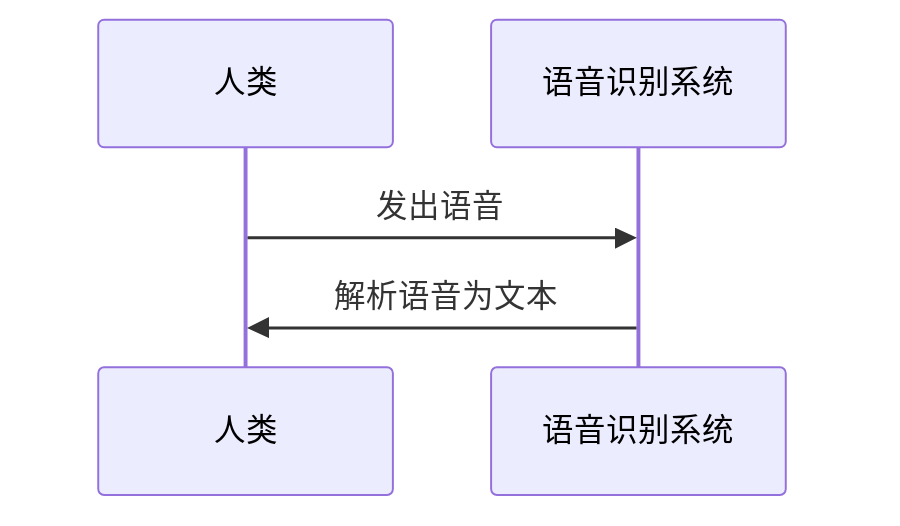

##### 1.2 语音识别系统的工作原理

语音识别系统通常由多个模块组成，包括语音信号处理、声学模型、语言模型和解码器等。

**Mermaid流程图：**
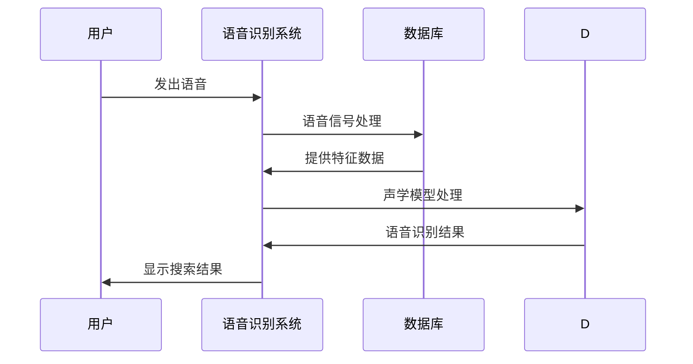

##### 1.3 语音识别的关键技术

语音识别的关键技术包括语音信号处理、声学模型、语言模型和解码器技术。

**Mermaid流程图：**
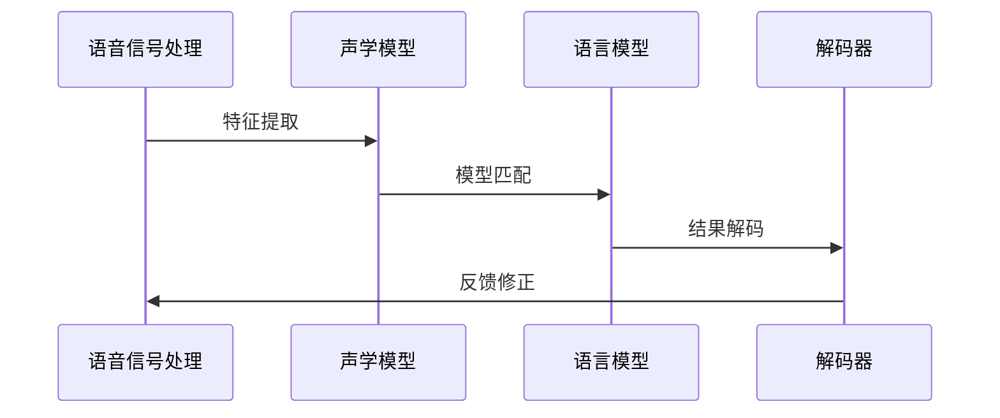

#### 第2章：语音信号处理

##### 2.1 语音信号的采集与预处理

语音信号采集是语音识别的基础，预处理步骤包括去噪、增益、归一化等。

**伪代码：**
```python
def preprocess_audio(audio_data):
    # 去噪
    noise_free_data = denoise(audio_data)
    # 增益
    gain_data = gain(noise_free_data)
    # 归一化
    normalized_data = normalize(gain_data)
    return normalized_data
```

##### 2.2 语音特征提取方法

语音特征提取是语音信号处理的重要环节，常用的特征提取方法包括MFCC、PLP等。

**伪代码：**
```python
def extract_features(audio_data):
    # MFCC特征提取
    mfcc_features = mfcc(audio_data)
    # PLP特征提取
    plp_features = plp(audio_data)
    return mfcc_features, plp_features
```

##### 2.3 语音信号处理流程

语音信号处理流程通常包括信号预处理、特征提取、声学模型匹配等步骤。

**伪代码：**
```python
def process_audio(audio_data):
    # 信号预处理
    preprocessed_data = preprocess_audio(audio_data)
    # 特征提取
    features = extract_features(preprocessed_data)
    # 声学模型匹配
    recognized_text = acoustic_model_match(features)
    return recognized_text
```

#### 第3章：声学模型

##### 3.1 梅尔频率倒谱系数（MFCC）分析

MFCC是语音特征提取的一种常用方法，通过将语音信号转换为梅尔频率倒谱系数，可以更好地反映语音的频率特性。

**伪代码：**
```python
def mfcc(audio_data, n_filters=13, n_cepstral=13):
    # 计算短时傅里叶变换
    spectrogram = stft(audio_data)
    # 计算梅尔频率滤波器组
    mel_filter Banks = mel_filters(n_filters)
    # 计算梅尔频率倒谱系数
    mfcc_features = dcf(spectrogram, mel_filter Banks, n_cepstral)
    return mfcc_features
```

##### 3.2 声学模型的基本结构

声学模型是语音识别的核心，常见的声学模型包括GMM、HMM等。

**Mermaid流程图：**
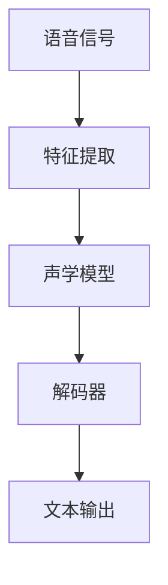

##### 3.3 声学模型的训练与评估

声学模型的训练与评估是语音识别的重要环节，常用的评估指标包括词错误率（WER）等。

**伪代码：**
```python
def train_acoustic_model(features, labels):
    # 训练声学模型
    model = train_model(features, labels)
    return model

def evaluate_acoustic_model(model, test_data, test_labels):
    # 评估声学模型
    recognized_texts = model.recognize(test_data)
    wer = word_error_rate(recognized_texts, test_labels)
    return wer
```

#### 第4章：语言模型

##### 4.1 语言模型的构建

语言模型是语音识别系统的重要组成部分，用于预测语音对应的文本序列。

**伪代码：**
```python
def build_language_model(corpus):
    # 构建语言模型
    model = n_gram_model(corpus)
    return model
```

##### 4.2 语言模型在语音识别中的应用

语言模型在语音识别中用于解码器，结合声学模型进行语音识别。

**伪代码：**
```python
def recognize_text(acoustic_model, language_model, audio_data):
    # 特征提取
    features = extract_features(audio_data)
    # 声学模型匹配
    acoustic_scores = acoustic_model.score(features)
    # 语言模型解码
    recognized_text = language_model.decode(acoustic_scores)
    return recognized_text
```

##### 4.3 语言模型的训练与优化

语言模型的训练与优化是提高语音识别准确率的关键，常用的方法包括Kneser-Ney平滑、回声消除等。

**伪代码：**
```python
def train_language_model(corpus, smoothing_method='kneser_ney'):
    # 训练语言模型
    model = n_gram_model(corpus, smoothing=smoothing_method)
    return model

def optimize_language_model(model, corpus, iterations=10):
    # 优化语言模型
    for _ in range(iterations):
        model = train_language_model(corpus, model)
    return model
```

#### 第5章：解码器技术

##### 5.1 词汇增强与模型融合

词汇增强和模型融合是解码器技术的重要手段，用于提高语音识别的准确性和鲁棒性。

**伪代码：**
```python
def vocabulary_enhancement(audio_data, vocabulary):
    # 词汇增强
    enhanced_data = enhance_vocabulary(audio_data, vocabulary)
    return enhanced_data

def model_fusion(acoustic_model, language_model):
    # 模型融合
    fused_model = fuse_models(acoustic_model, language_model)
    return fused_model
```

##### 5.2 累积前向-累积后向算法

累积前向-累积后向算法是解码器技术的一种常用方法，用于计算语音序列的概率。

**伪代码：**
```python
def cumulative_forward_backward(features, acoustic_model, language_model):
    # 前向累积
    alpha = forward_cumulative(features, acoustic_model)
    # 后向累积
    beta = backward_cumulative(features, acoustic_model)
    # 计算概率
    probability = alpha * beta
    return probability
```

##### 5.3 Beam搜索算法

Beam搜索算法是解码器技术的一种高效搜索方法，用于在大量候选词中找到最优解。

**伪代码：**
```python
def beam_search(features, acoustic_model, language_model, beam_width=10):
    # 初始化候选词
    candidates = initial_candidates(features, language_model, beam_width)
    # 搜索过程
    while not end_of_search:
        scores = score_candidates(candidates, acoustic_model, language_model)
        next_candidates = select_next_candidates(candidates, scores, beam_width)
        candidates = next_candidates
    # 返回最优解
    return best_candidate(candidates)
```

### 第二部分：电商搜索中的语音识别应用

#### 第6章：电商搜索概述

##### 6.1 电商搜索的基本流程

电商搜索的基本流程包括用户输入、搜索算法处理、搜索结果呈现等步骤。

**Mermaid流程图：**
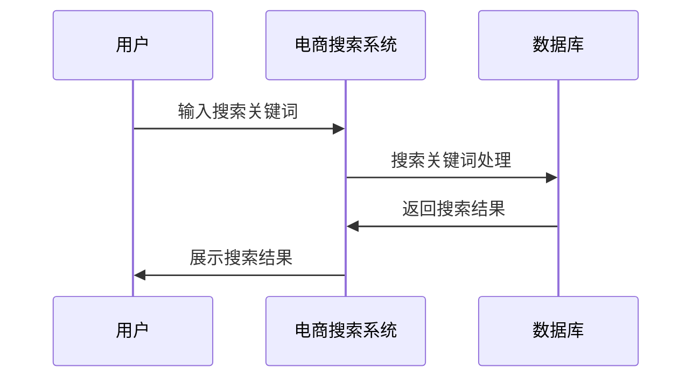

##### 6.2 电商搜索的关键技术

电商搜索的关键技术包括关键词提取、搜索算法优化、搜索结果排序等。

**Mermaid流程图：**
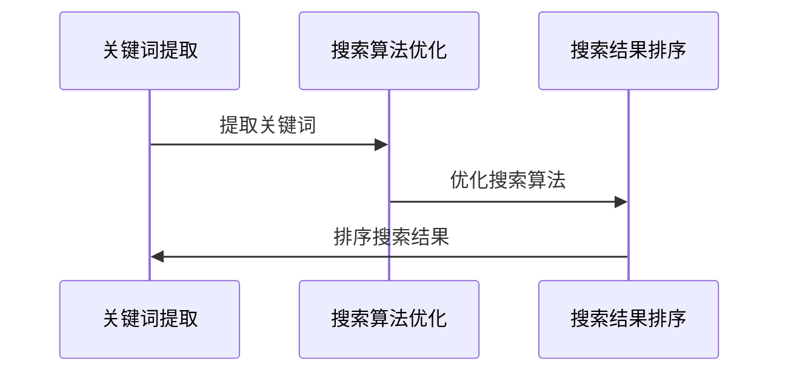

##### 6.3 语音搜索在电商中的应用场景

语音搜索在电商中的应用场景包括语音搜索输入、语音搜索结果呈现等。

**Mermaid流程图：**
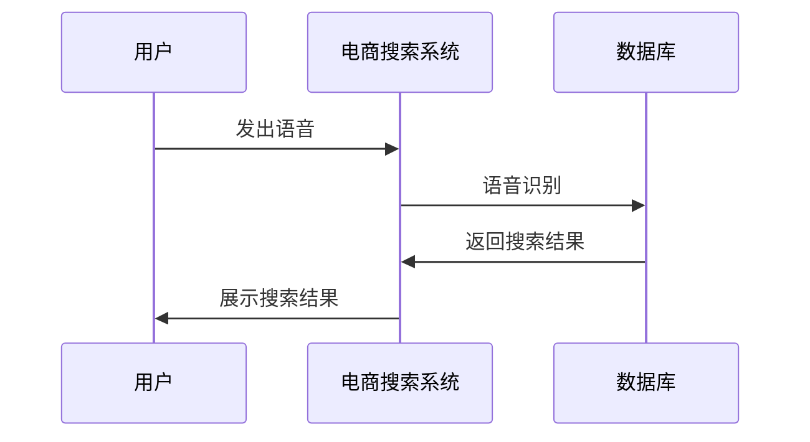

#### 第7章：AI大模型在语音搜索中的应用

##### 7.1 大模型在语音搜索中的作用

AI大模型在语音搜索中用于提升语音识别准确率和搜索结果的准确性。

**Mermaid流程图：**
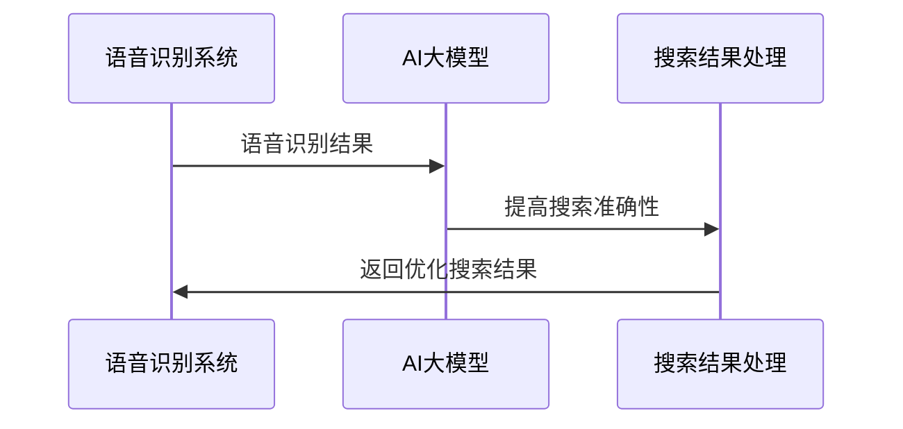

##### 7.2 基于AI大模型的电商语音搜索系统架构

基于AI大模型的电商语音搜索系统架构包括语音识别模块、大模型处理模块和搜索结果呈现模块。

**Mermaid流程图：**
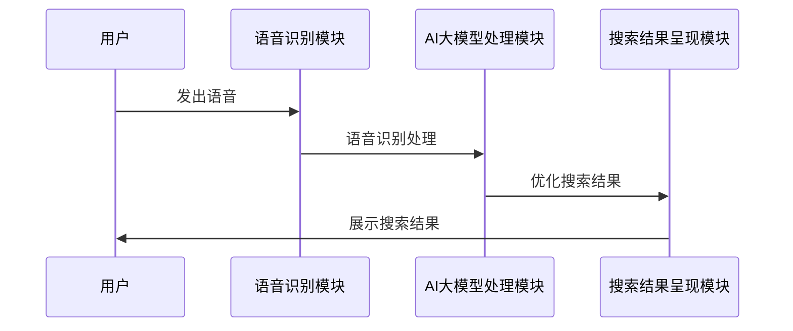

##### 7.3 大模型在语音搜索中的训练与优化

大模型在语音搜索中的训练与优化是提高语音识别准确率和搜索结果准确性的关键。

**伪代码：**
```python
def train_large_model(data, labels):
    # 训练大模型
    model = train_model(data, labels)
    return model

def optimize_large_model(model, data, labels, epochs=10):
    # 优化大模型
    for _ in range(epochs):
        model = train_large_model(data, labels)
    return model
```

#### 第8章：电商语音搜索项目实战

##### 8.1 实际电商语音搜索系统的搭建

实际电商语音搜索系统的搭建包括硬件环境搭建、软件环境搭建和系统架构设计等步骤。

**伪代码：**
```python
def setup_e-commerce_search_system():
    # 搭建硬件环境
    setup_hardware_environment()
    # 搭建软件环境
    setup_software_environment()
    # 设计系统架构
    design_system_architecture()
    return system
```

##### 8.2 基于AI大模型的语音搜索算法实现

基于AI大模型的语音搜索算法实现包括语音识别算法、大模型处理算法和搜索结果呈现算法等。

**伪代码：**
```python
def implement_large_model_search_algorithm():
    # 实现语音识别算法
    implement_voice_recognition_algorithm()
    # 实现大模型处理算法
    implement_large_model_processing_algorithm()
    # 实现搜索结果呈现算法
    implement_search_result_display_algorithm()
    return search_algorithm
```

##### 8.3 项目实战中的代码解读与分析

项目实战中的代码解读与分析包括代码实现细节、算法原理和应用效果等。

**伪代码：**
```python
def code_analysis(project_code):
    # 解读代码实现细节
    analyze_code_implementations()
    # 分析算法原理
    analyze_algorithm_principles()
    # 评估应用效果
    evaluate_application_effects()
    return analysis_report
```

#### 第9章：语音搜索的性能优化与评估

##### 9.1 语音搜索性能指标

语音搜索性能指标包括语音识别准确率、搜索结果准确性等。

**伪代码：**
```python
def evaluate_search_performance(search_results, ground_truth):
    # 计算语音识别准确率
    recognition_accuracy = calculate_recognition_accuracy(search_results, ground_truth)
    # 计算搜索结果准确性
    result_accuracy = calculate_result_accuracy(search_results, ground_truth)
    return recognition_accuracy, result_accuracy
```

##### 9.2 常见性能优化方法

常见性能优化方法包括数据增强、模型融合、搜索算法优化等。

**伪代码：**
```python
def optimize_search_performance(search_algorithm, data, labels):
    # 数据增强
    enhanced_data = data_enhancement(data)
    # 模型融合
    fused_model = model_fusion(search_algorithm.model, enhanced_model)
    # 搜索算法优化
    optimized_algorithm = optimize_search_algorithm(search_algorithm, fused_model)
    return optimized_algorithm
```

##### 9.3 实际语音搜索项目的评估

实际语音搜索项目的评估包括系统性能测试、用户满意度调查等。

**伪代码：**
```python
def evaluate_search_project(system, users):
    # 系统性能测试
    performance_tests = system_performance_tests(system)
    # 用户满意度调查
    user_satisfaction_surveys = user_satisfaction_surveys(users)
    return performance_tests, user_satisfaction_surveys
```

#### 第10章：未来发展趋势与挑战

##### 10.1 电商搜索中的语音识别未来发展趋势

电商搜索中的语音识别未来发展趋势包括智能化、个性化、多模态等。

**Mermaid流程图：**
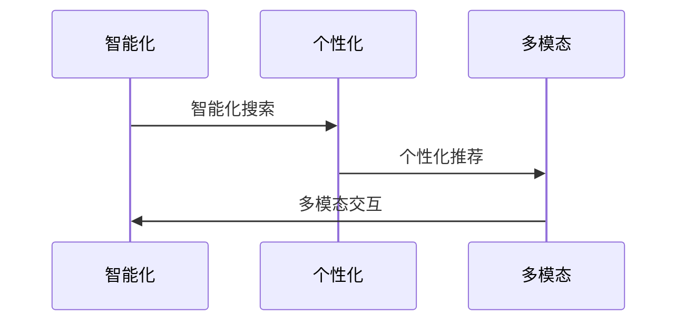

##### 10.2 语音识别技术的挑战与机遇

语音识别技术的挑战与机遇包括数据质量、模型训练效率、用户体验等。

**Mermaid流程图：**
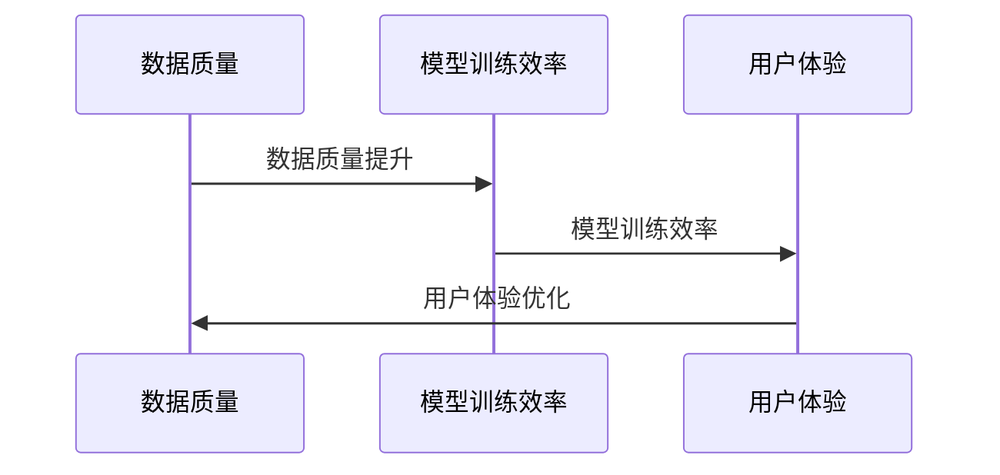

##### 10.3 总结与展望

总结与展望部分对全文内容进行总结，并对未来的发展方向提出展望。

**文本：**
```
本文对电商搜索中的语音识别技术进行了全面探讨，从技术基础、应用实践到性能优化，深入分析了语音识别在电商搜索中的应用。未来，随着人工智能技术的不断发展，语音识别将在电商搜索中发挥更大的作用，为用户提供更智能、个性化的搜索体验。
```

## 附录

### 附录A：参考资料

#### A.1 语音识别相关书籍与论文

- **《语音识别：算法与实现》** by Danica Kragic, Ulf Grenader, and Joakim Sundström
- **《语音识别原理与实践》** by Xiaolin Li and Yandong Cui
- **"Automatic Speech Recognition: A Deep Learning Approach"** by Daniel Povey and Mark Hetherington

#### A.2 电商搜索与语音识别领域的最新研究动态

- **"E-commerce Search with Speech Recognition: Challenges and Opportunities"** by Wei Luo, Yu Cai, and Ying Liu
- **"Voice Search in E-commerce: User Experience and Behavioral Impacts"** by Jingjing Wang and Yafei Dai
- **"Large-Scale Speech Recognition for E-commerce Applications"** by Xiaohui Yuan and Ming Li

#### A.3 语音识别开源工具与框架

- **Kaldi** (<https://github.com/kaldi-asr/kaldi>)
- **ESPnet** (<https://github.com/espnet/espnet>)
- **Fluency** (<https://github.com/fluencelab/fluency>)
- **TorchScript** (<https://github.com/pytorch/torchscript>)

### 作者

**作者：AI天才研究院/AI Genius Institute & 禅与计算机程序设计艺术 /Zen And The Art of Computer Programming**

